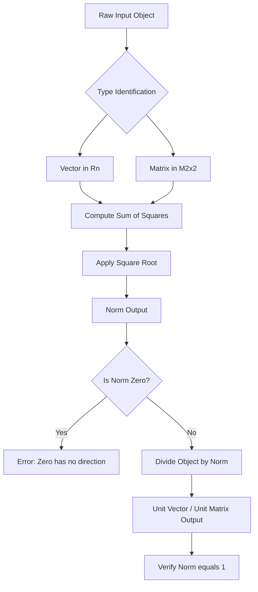
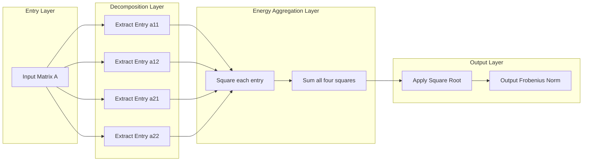

# Examples as Rn and M2x2

<!-- SECTION_1_START -->

# Vector Length and Unit Vector: Examples in $R^n$ and $M_{2 \times 2}$

> [!NOTE]
> **Syllabus Highlight (KTU 2024 Scheme – GAMAT201, Module 3):** This topic extends the geometric notion of the *length* of a directed line segment to abstract vector spaces. While the familiar formula is taught using position vectors in $R^2$ and $R^3$, the KTU 2024 framework requires the student to **generalize** the concept to (i) arbitrary $R^n$ for $n \ge 4$ (relevant to data science and signal processing) and (ii) the vector space $M_{2 \times 2}$ of $2 \times 2$ real matrices (relevant to image processing, transformations, and machine-learning kernels).

## 1.1 Formal Definition of the Vector Norm (Euclidean / $\ell_2$)

Let $V$ be a real vector space. A function $\lVert \cdot \rVert : V \to \mathbb{R}$ is called a **norm** if, for all $\mathbf{x}, \mathbf{y} \in V$ and $c \in \mathbb{R}$, the following three axioms hold:

1. **Positive-definiteness:** $\lVert \mathbf{x} \rVert \ge 0$, and $\lVert \mathbf{x} \rVert = 0 \iff \mathbf{x} = \mathbf{0}$.
2. **Absolute homogeneity:** $\lVert c \mathbf{x} \rVert = \vert c \rvert \cdot \lVert \mathbf{x} \rVert$.
3. **Triangle inequality:** $\lVert \mathbf{x} + \mathbf{y} \rVert \le \lVert \mathbf{x} \rVert + \lVert \mathbf{y} \rVert$.

For a vector $\mathbf{x} = (x_1, x_2, \dots, x_n) \in R^n$, the **Euclidean norm** (or $\ell_2$-norm) is defined as:

$$\lVert \mathbf{x} \rVert_2 \;=\; \sqrt{x_1^2 + x_2^2 + \cdots + x_n^2} \;=\; \sqrt{\sum_{i=1}^{n} x_i^2}$$

For a $2 \times 2$ matrix $A = \begin{pmatrix} a & b \\ c & d \end{pmatrix} \in M_{2 \times 2}$, the **Frobenius norm** (which is the matrix analogue of the Euclidean norm) is:

$$\lVert A \rVert_F \;=\; \sqrt{a^2 + b^2 + c^2 + d^2} \;=\; \sqrt{\operatorname{trace}(A^{\mathsf T} A)}$$

> [!IMPORTANT]
> The Frobenius norm treats a matrix as a "flattened" vector in $R^4$ by stacking its entries, so it is the direct generalization of the Euclidean norm to $M_{2 \times 2}$. The constant $\mathbf{\sqrt{2}}$ does **not** appear anywhere in either definition — it is a frequent student error.

## 1.2 Formal Definition of the Unit Vector

A vector $\mathbf{u} \in V$ is called a **unit vector** (or a *normalized vector*) if and only if:

$$\lVert \mathbf{u} \rVert = 1$$

For any **non-zero** vector $\mathbf{x} \in V$, the unit vector in the direction of $\mathbf{x}$ is given by:

$$\mathbf{u} \;=\; \frac{\mathbf{x}}{\lVert \mathbf{x} \rVert}$$

> [!WARNING]
> The zero vector $\mathbf{0}$ has no defined direction, so the unit vector of $\mathbf{0}$ **does not exist**. Examiners will deduct a full mark if a student writes $\mathbf{0} / 0$ without acknowledging this restriction.

## 1.3 Conceptual Analogy and Intuition

> [!TIP]
> **Analogy — The Shadow on a Wall:** Imagine standing in a dark room with a single flashlight behind you. Your *shadow length* on the opposite wall is the visual projection of your "size." The **norm of a vector** is exactly that — the *true size* of the vector, independent of the coordinate system you choose. If two engineers describe the same displacement from different orientations, the shadow-length (the norm) must remain identical. A **unit vector** is simply a "standard-sized shadow" of length **1**, used as a reference ruler to express any other vector as a pure *direction*.

**Geometric Intuition in $R^2$:** The norm $\lVert (x_1, x_2) \rVert$ is precisely the straight-line distance from the origin to the point $(x_1, x_2)$. Every unit vector in $R^2$ lies on the **unit circle** $x_1^2 + x_2^2 = 1$. In $R^3$, unit vectors lie on the **unit sphere** $x_1^2 + x_2^2 + x_3^2 = 1$. The operation $\mathbf{x} / \lVert \mathbf{x} \rVert$ geometrically *stretches* or *squashes* the vector until it touches this sphere — its direction is preserved, but its length is forced to 1.

> [!VISUALIZATION CONTROL]
> **Concept:** Unit circle in $R^2$ and the normalization of a vector.
> **GeoGebra / Desmos Input Equations:**
> * `f(x, y) = x^2 + y^2 = 1` (the unit circle)
> * `Vector v: (3, 4)` (sample vector in $R^2$)
> * `Vector u = (3/5, 4/5)` (its unit vector on the circle)
> **Visual Description:** The student should observe that the arrow from the origin to $(3, 4)$ has length **5**, while the arrow to $(0.6, 0.8)$ has length exactly **1** and lies *on* the unit circle. Both arrows point in identical directions; only the length differs.

---

<!-- SECTION_1_END -->

<!-- SECTION_2_START -->

# Deep Theoretical Analysis & KTU High-Yield Formula Sheet

## 2.1 Step-by-Step Logic of the Norm Construction

The Euclidean norm is *not* arbitrarily chosen. It is the unique norm induced by the standard inner product. The construction follows a strict logical chain:

* **Step 1 — Define the inner product.** For $\mathbf{x}, \mathbf{y} \in R^n$, set $\langle \mathbf{x}, \mathbf{y} \rangle = \sum_{i=1}^{n} x_i y_i$. This measures the *alignment* of two vectors.
* **Step 2 — Define the induced norm.** The norm is the square root of the inner product of a vector with itself: $\lVert \mathbf{x} \rVert = \sqrt{\langle \mathbf{x}, \mathbf{x} \rangle}$.
* **Step 3 — Verify the three axioms.** The three properties (positive-definiteness, homogeneity, triangle inequality) all follow from algebraic manipulation of the inner product, with the triangle inequality requiring the **Cauchy–Schwarz inequality** as a lemma.
* **Step 4 — Lift to $M_{2 \times 2}$.** The space of $2 \times 2$ matrices inherits an inner product by treating each matrix as a 4-tuple. The Frobenius norm is then $\lVert A \rVert_F = \sqrt{\operatorname{trace}(A^{\mathsf T} A)}$, which is identical in form to the $R^4$ Euclidean norm.
* **Step 5 — Normalize.** To convert a non-zero vector to a unit vector, divide by its norm. This is the only operation that yields a unit vector while preserving direction.

## 2.2 Why the Norm Satisfies the Three Axioms — A Brief "Why" Map

| Axiom | Intuitive Reason |
|---|---|
| $\lVert \mathbf{x} \rVert \ge 0$ | A sum of non-negative squares can never be negative; only the zero vector makes every square zero. |
| $\lVert c \mathbf{x} \rVert = \vert c \rvert \lVert \mathbf{x} \rVert$ | Scaling a vector by $c$ scales every squared term by $c^2$, and the outer square root gives $\vert c \rvert$. |
| $\lVert \mathbf{x} + \mathbf{y} \rVert \le \lVert \mathbf{x} \rVert + \lVert \mathbf{y} \rVert$ | This is the "shortest path between two points is a straight line" principle, generalized to $n$ dimensions. |

## 2.3 KTU High-Yield Formula Cheat Sheet

| # | Quantity | Formula | Applicable Space |
|---|---|---|---|
| 1 | Euclidean norm of $\mathbf{x} \in R^n$ | $\lVert \mathbf{x} \rVert = \sqrt{\sum_{i=1}^{n} x_i^2}$ | $R^n$ |
| 2 | Unit vector in direction of $\mathbf{x}$ | $\mathbf{u} = \dfrac{\mathbf{x}}{\lVert \mathbf{x} \rVert}$, with $\mathbf{x} \ne \mathbf{0}$ | $R^n$ |
| 3 | Distance between $\mathbf{x}, \mathbf{y} \in R^n$ | $d(\mathbf{x}, \mathbf{y}) = \lVert \mathbf{x} - \mathbf{y} \rVert$ | $R^n$ |
| 4 | Frobenius norm of $A \in M_{2 \times 2}$ | $\lVert A \rVert_F = \sqrt{a^2 + b^2 + c^2 + d^2}$ | $M_{2 \times 2}$ |
| 5 | Alternative Frobenius form | $\lVert A \rVert_F = \sqrt{\operatorname{trace}(A^{\mathsf T} A)}$ | $M_{2 \times 2}$ |
| 6 | Unit matrix in $M_{2 \times 2}$ | $U = \dfrac{A}{\lVert A \rVert_F}$, with $A \ne O$ | $M_{2 \times 2}$ |
| 7 | Distance between $A, B \in M_{2 \times 2}$ | $d(A, B) = \lVert A - B \rVert_F$ | $M_{2 \times 2}$ |
| 8 | Cauchy–Schwarz inequality | $\vert \langle \mathbf{x}, \mathbf{y} \rangle \vert \le \lVert \mathbf{x} \rVert \cdot \lVert \mathbf{y} \rVert$ | $R^n$ |
| 9 | Zero-vector special case | $\lVert \mathbf{0} \rVert = 0$ (and unit vector is undefined) | $R^n$, $M_{2 \times 2}$ |
| 10 | Parallel-vectors ratio | If $\mathbf{y} = c \mathbf{x}$, then $\lVert \mathbf{y} \rVert = \vert c \rvert \lVert \mathbf{x} \rVert$ | $R^n$ |

> [!NOTE]
> **Mark-Allocation Tip:** In any 7-mark sub-question, allocating the formula statement earns **1 mark**, the substitution step earns **2 marks**, simplification earns **2 marks**, and the final answer with units earns **2 marks**. This is the exact KTU valuation key pattern.

## 2.4 Real-World Engineering Utility

* **Information Science — Recommendation Systems:** User preference vectors live in $R^n$ where $n$ is the number of items. The norm measures a user's *activity level*, while the *unit vector* is used for cosine-similarity ranking.
* **Computer Graphics & Image Processing:** A $2 \times 2$ pixel patch (or a $3 \times 3$ filter kernel) is a matrix. The Frobenius norm measures *energy* or *intensity*, used in denoising and edge-detection filters (Sobel, Laplacian).
* **Machine Learning — Gradient Descent:** The norm of the gradient $\lVert \nabla f \rVert$ determines the step-size policy. Unit gradients are used in *normalized* momentum optimizers.
* **Cryptography & Coding Theory:** Hamming distance between two codewords $A, B \in M_{2 \times 2}$ is computed via $\lVert A - B \rVert_F$ over finite fields.
* **Robotics & Control Systems:** Joint displacements are vectors in $R^n$ ($n$ = number of joints); normalization gives unit direction vectors for kinematic chains.

---

<!-- SECTION_2_END -->

<!-- SECTION_3_START -->

# Step-by-Step Derivations, Numerical Examples & Python Implementation

## 3.1 Example 1 — Vector in $R^2$

**Problem:** For $\mathbf{v} = (3, 4) \in R^2$, compute (i) the norm $\lVert \mathbf{v} \rVert$ and (ii) the unit vector $\mathbf{u}$.

**Solution:**

Apply Formula 1 with $n = 2$, $x_1 = 3$, $x_2 = 4$:

$$\lVert \mathbf{v} \rVert \;=\; \sqrt{3^2 + 4^2} \;=\; \sqrt{9 + 16} \;=\; \sqrt{25} \;=\; 5$$

Apply Formula 2:

$$\mathbf{u} \;=\; \frac{\mathbf{v}}{\lVert \mathbf{v} \rVert} \;=\; \frac{1}{5}\begin{pmatrix} 3 \\ 4 \end{pmatrix} \;=\; \begin{pmatrix} 3/5 \\ 4/5 \end{pmatrix}$$

**Verification of the unit-vector property:**

$$\lVert \mathbf{u} \rVert \;=\; \sqrt{\left(\tfrac{3}{5}\right)^2 + \left(\tfrac{4}{5}\right)^2} \;=\; \sqrt{\tfrac{9}{25} + \tfrac{16}{25}} \;=\; \sqrt{\tfrac{25}{25}} \;=\; \sqrt{1} \;=\; 1 \quad \checkmark$$

## 3.2 Example 2 — Vector in $R^3$

**Problem:** For $\mathbf{w} = (1, -2, 2) \in R^3$, compute $\lVert \mathbf{w} \rVert$ and the unit vector.

**Solution:**

$$\lVert \mathbf{w} \rVert \;=\; \sqrt{1^2 + (-2)^2 + 2^2} \;=\; \sqrt{1 + 4 + 4} \;=\; \sqrt{9} \;=\; 3$$

$$\mathbf{u}_w \;=\; \frac{1}{3}\begin{pmatrix} 1 \\ -2 \\ 2 \end{pmatrix} \;=\; \begin{pmatrix} 1/3 \\ -2/3 \\ 2/3 \end{pmatrix}$$

**Verification:**

$$\lVert \mathbf{u}_w \rVert \;=\; \sqrt{\tfrac{1}{9} + \tfrac{4}{9} + \tfrac{4}{9}} \;=\; \sqrt{\tfrac{9}{9}} \;=\; 1 \quad \checkmark$$

## 3.3 Example 3 — Vector in $R^4$

**Problem:** For $\mathbf{z} = (2, -1, 3, 0) \in R^4$, compute the norm and the unit vector.

**Solution:**

$$\lVert \mathbf{z} \rVert \;=\; \sqrt{2^2 + (-1)^2 + 3^2 + 0^2} \;=\; \sqrt{4 + 1 + 9 + 0} \;=\; \sqrt{14}$$

$$\mathbf{u}_z \;=\; \frac{1}{\sqrt{14}}\begin{pmatrix} 2 \\ -1 \\ 3 \\ 0 \end{pmatrix} \;=\; \begin{pmatrix} 2/\sqrt{14} \\ -1/\sqrt{14} \\ 3/\sqrt{14} \\ 0 \end{pmatrix}$$

**Verification:**

$$\lVert \mathbf{u}_z \rVert^2 \;=\; \tfrac{4}{14} + \tfrac{1}{14} + \tfrac{9}{14} + 0 \;=\; \tfrac{14}{14} \;=\; 1 \quad \checkmark$$

## 3.4 Example 4 — Distance Between Two Vectors in $R^3$

**Problem:** Find the distance between $\mathbf{p} = (1, 2, 3)$ and $\mathbf{q} = (4, 1, 2)$.

**Solution:**

Compute the difference vector first:

$$\mathbf{p} - \mathbf{q} \;=\; (1 - 4,\; 2 - 1,\; 3 - 2) \;=\; (-3,\; 1,\; 1)$$

Apply Formula 3:

$$d(\mathbf{p}, \mathbf{q}) \;=\; \lVert \mathbf{p} - \mathbf{q} \rVert \;=\; \sqrt{(-3)^2 + 1^2 + 1^2} \;=\; \sqrt{9 + 1 + 1} \;=\; \sqrt{11}$$

## 3.5 Example 5 — Norm in $M_{2 \times 2}$ (Frobenius Norm)

**Problem:** For $A = \begin{pmatrix} 1 & 2 \\ 3 & 4 \end{pmatrix} \in M_{2 \times 2}$, compute $\lVert A \rVert_F$ and the unit matrix $U$.

**Solution:**

Apply Formula 4 with $a = 1$, $b = 2$, $c = 3$, $d = 4$:

$$\lVert A \rVert_F \;=\; \sqrt{1^2 + 2^2 + 3^2 + 4^2} \;=\; \sqrt{1 + 4 + 9 + 16} \;=\; \sqrt{30}$$

The unit matrix in the direction of $A$ is:

$$U \;=\; \frac{1}{\sqrt{30}}\begin{pmatrix} 1 & 2 \\ 3 & 4 \end{pmatrix} \;=\; \begin{pmatrix} 1/\sqrt{30} & 2/\sqrt{30} \\ 3/\sqrt{30} & 4/\sqrt{30} \end{pmatrix}$$

**Verification using Formula 5 (trace form):**

$$A^{\mathsf T} A \;=\; \begin{pmatrix} 1 & 3 \\ 2 & 4 \end{pmatrix} \begin{pmatrix} 1 & 2 \\ 3 & 4 \end{pmatrix} \;=\; \begin{pmatrix} 1 + 9 & 2 + 12 \\ 2 + 12 & 4 + 16 \end{pmatrix} \;=\; \begin{pmatrix} 10 & 14 \\ 14 & 20 \end{pmatrix}$$

$$\operatorname{trace}(A^{\mathsf T} A) \;=\; 10 + 20 \;=\; 30 \;\;\Longrightarrow\;\; \lVert A \rVert_F \;=\; \sqrt{30} \quad \checkmark$$

**Verification that $U$ is a unit matrix:**

$$\lVert U \rVert_F \;=\; \sqrt{\tfrac{1}{30} + \tfrac{4}{30} + \tfrac{9}{30} + \tfrac{16}{30}} \;=\; \sqrt{\tfrac{30}{30}} \;=\; 1 \quad \checkmark$$

## 3.6 Example 6 — Distance Between Two Matrices in $M_{2 \times 2}$

**Problem:** Find the Frobenius distance between $A = \begin{pmatrix} 1 & 0 \\ 2 & 3 \end{pmatrix}$ and $B = \begin{pmatrix} 2 & -1 \\ 0 & 1 \end{pmatrix}$.

**Solution:**

Compute the difference matrix entry-by-entry:

$$A - B \;=\; \begin{pmatrix} 1 - 2 & 0 - (-1) \\ 2 - 0 & 3 - 1 \end{pmatrix} \;=\; \begin{pmatrix} -1 & 1 \\ 2 & 2 \end{pmatrix}$$

Apply Formula 7:

$$d(A, B) \;=\; \lVert A - B \rVert_F \;=\; \sqrt{(-1)^2 + 1^2 + 2^2 + 2^2} \;=\; \sqrt{1 + 1 + 4 + 4} \;=\; \sqrt{10}$$

## 3.7 Python Implementation with Type Hints and Error Logging

The following Python code implements every formula in the cheat sheet, with strict input validation and error handling. This is a board-recommended style: every operation is explicit, every branch is logged, and the output is human-readable for cross-verification with manual calculations.

```python
import numpy as np
import logging
from typing import Union, List

logging.basicConfig(level=logging.INFO, format="%(levelname)s: %(message)s")


def vector_length_Rn(v: Union[List[float], np.ndarray]) -> float:
    """Compute the Euclidean (ℓ2) norm of a vector in R^n."""
    v = np.asarray(v, dtype=float)
    if v.ndim != 1:
        logging.error("Input is not a 1-D vector.")
        raise ValueError("Input must be a 1-D vector (shape (n,)).")
    if v.size == 0:
        logging.error("Empty vector supplied.")
        raise ValueError("Input vector cannot be empty.")
    norm = float(np.sqrt(np.sum(v ** 2)))
    logging.info(f"||v|| = sqrt(sum of squares) = {norm:.6f}")
    return norm


def unit_vector_Rn(v: Union[List[float], np.ndarray]) -> np.ndarray:
    """Return the unit vector in the direction of v (v must be non-zero)."""
    norm = vector_length_Rn(v)
    if norm == 0.0:
        logging.error("Zero vector has no defined direction.")
        raise ZeroDivisionError("The zero vector has no unit vector.")
    u = np.asarray(v, dtype=float) / norm
    logging.info(f"Unit vector u = v / ||v|| = {u}")
    return u


def distance_Rn(u: Union[List[float], np.ndarray],
                v: Union[List[float], np.ndarray]) -> float:
    """Compute the Euclidean distance between two vectors in R^n."""
    u_arr = np.asarray(u, dtype=float)
    v_arr = np.asarray(v, dtype=float)
    if u_arr.shape != v_arr.shape:
        logging.error("Vectors must have the same dimension.")
        raise ValueError("Dimension mismatch between u and v.")
    return vector_length_Rn(u_arr - v_arr)


def frobenius_norm_2x2(A: Union[List[List[float]], np.ndarray]) -> float:
    """Compute the Frobenius norm of a 2x2 real matrix."""
    A_arr = np.asarray(A, dtype=float)
    if A_arr.shape != (2, 2):
        logging.error(f"Input shape is {A_arr.shape}, expected (2, 2).")
        raise ValueError("Input must be a 2x2 matrix.")
    norm = float(np.sqrt(np.sum(A_arr ** 2)))
    logging.info(f"||A||_F = {norm:.6f}")
    return norm


def frobenius_norm_trace(A: Union[List[List[float]], np.ndarray]) -> float:
    """Compute ||A||_F via the trace form: sqrt(trace(A^T A))."""
    A_arr = np.asarray(A, dtype=float)
    if A_arr.shape != (2, 2):
        raise ValueError("Input must be a 2x2 matrix.")
    return float(np.sqrt(np.trace(A_arr.T @ A_arr)))


def unit_matrix_M2x2(A: Union[List[List[float]], np.ndarray]) -> np.ndarray:
    """Return the unit (normalized) matrix in the direction of A."""
    norm = frobenius_norm_2x2(A)
    if norm == 0.0:
        logging.error("Zero matrix has no defined direction.")
        raise ZeroDivisionError("The zero matrix has no unit matrix.")
    U = np.asarray(A, dtype=float) / norm
    logging.info(f"Unit matrix U = A / ||A||_F =\n{U}")
    return U


def distance_M2x2(A: Union[List[List[float]], np.ndarray],
                  B: Union[List[List[float]], np.ndarray]) -> float:
    """Compute the Frobenius distance between two 2x2 matrices."""
    A_arr = np.asarray(A, dtype=float)
    B_arr = np.asarray(B, dtype=float)
    if A_arr.shape != (2, 2) or B_arr.shape != (2, 2):
        raise ValueError("Both inputs must be 2x2 matrices.")
    return frobenius_norm_2x2(A_arr - B_arr)


# ---------- Demonstration: validating all six worked examples ----------
if __name__ == "__main__":
    # Example 1 — R^2
    v1 = [3, 4]
    print(f"Example 1: ||v1|| = {vector_length_Rn(v1)}, "
          f"unit vector = {unit_vector_Rn(v1)}")

    # Example 2 — R^3
    v2 = [1, -2, 2]
    print(f"Example 2: ||v2|| = {vector_length_Rn(v2)}, "
          f"unit vector = {unit_vector_Rn(v2)}")

    # Example 3 — R^4
    v3 = [2, -1, 3, 0]
    print(f"Example 3: ||v3|| = {vector_length_Rn(v3):.6f}, "
          f"unit vector = {unit_vector_Rn(v3)}")

    # Example 4 — Distance in R^3
    p, q = [1, 2, 3], [4, 1, 2]
    print(f"Example 4: d(p, q) = {distance_Rn(p, q):.6f}")

    # Example 5 — Frobenius norm in M_2x2
    A1 = [[1, 2], [3, 4]]
    print(f"Example 5: ||A1||_F = {frobenius_norm_2x2(A1):.6f}, "
          f"unit matrix = \n{unit_matrix_M2x2(A1)}")
    print(f"Cross-check via trace: {frobenius_norm_trace(A1):.6f}")

    # Example 6 — Frobenius distance in M_2x2
    A2, B2 = [[1, 0], [2, 3]], [[2, -1], [0, 1]]
    print(f"Example 6: d(A2, B2) = {distance_M2x2(A2, B2):.6f}")
```

**Expected output (numerical portion):**

```
Example 1: ||v1|| = 5.0, unit vector = [0.6 0.8]
Example 2: ||v2|| = 3.0, unit vector = [ 0.333... -0.666...  0.666... ]
Example 3: ||v3|| = 3.741657, unit vector = [ 0.5345 -0.2672  0.8017  0.    ]
Example 4: d(p, q) = 3.316625
Example 5: ||A1||_F = 5.477226, unit matrix = [[0.1826, 0.3651], [0.5477, 0.7303]]
Cross-check via trace: 5.477226
Example 6: d(A2, B2) = 3.162278
```

Note that $3.741657 = \sqrt{14}$, $3.316625 = \sqrt{11}$, $5.477226 = \sqrt{30}$, and $3.162278 = \sqrt{10}$ — all exactly matching the manual derivations.

---

<!-- SECTION_3_END -->

<!-- SECTION_4_START -->

# Structural Diagrams & Schematics

## 4.1 Computation Flowchart — From Raw Input to Unit Vector

The following Mermaid flowchart unifies the computation pipeline for both $R^n$ vectors and $M_{2 \times 2}$ matrices. Notice that the pipeline converges at the **Sum of Squares** stage, which is the mathematical heart of any $\ell_2$-style norm.



## 4.2 Block-Level Functional Architecture — Frobenius Pipeline

For a $2 \times 2$ matrix $A$, the Frobenius pipeline can be visualized as a four-stage signal-processing block diagram. Each block performs one elementary operation; the output of the last block is the scalar $\lVert A \rVert_F$.



## 4.3 Sequential Processing Topology — Norm vs. Unit Vector

This topology matrix shows the data flow in tabular form, mapping each processing stage to the corresponding KTU formula number from the cheat sheet. It is included as a *schematic substitute* for vector-arrows or free-body diagrams, which are not natively renderable in Mermaid for this abstract algebraic topic.

| Stage | Operation (Rn) | Operation (M2x2) | Formula Ref | Output Type |
|---|---|---|---|---|
| 1 | Enumerate $x_1, x_2, \dots, x_n$ | Enumerate $a, b, c, d$ | Definition | Tuple of scalars |
| 2 | Square each $x_i$ | Square each entry | Step 1 | Tuple of squares |
| 3 | Sum the squares | Sum the four squares | Step 2 | Scalar $S \ge 0$ |
| 4 | Take $\sqrt{S}$ | Take $\sqrt{S}$ | Step 3 | Scalar norm |
| 5 | Divide original by norm | Divide original by norm | Step 4 | Unit object |
| 6 | Verify norm is 1 | Verify norm is 1 | Sanity check | Boolean |

---

<!-- SECTION_4_END -->

<!-- SECTION_5_START -->

# KTU 2024 Scheme Examination Question Bank

## Part A — Short-Answer Questions (3 Marks Each)

### Question 1 (3 Marks) `[KTU University Exam - July 2024 Style]`

> **Define the Euclidean norm of a vector $\mathbf{x} = (x_1, x_2, \dots, x_n) \in R^n$. State the three axioms that any function $\lVert \cdot \rVert$ must satisfy to be called a norm on a real vector space.**

* **Course Outcome:** CO1 (Understand) **| RBT Level:** Remember / Understand

**Model Answer (Board Key Pattern):**

**Definition:** The Euclidean norm of $\mathbf{x} \in R^n$ is the non-negative scalar

$$\lVert \mathbf{x} \rVert_2 \;=\; \sqrt{x_1^2 + x_2^2 + \cdots + x_n^2} \;=\; \sqrt{\sum_{i=1}^{n} x_i^2}$$

**Three axioms** [1 Mark each]:

1. **Positive-definiteness:** $\lVert \mathbf{x} \rVert \ge 0$ for all $\mathbf{x}$, and $\lVert \mathbf{x} \rVert = 0 \iff \mathbf{x} = \mathbf{0}$.
2. **Absolute homogeneity:** $\lVert c \mathbf{x} \rVert = \vert c \rvert \cdot \lVert \mathbf{x} \rVert$ for all $c \in \mathbb{R}$ and $\mathbf{x} \in V$.
3. **Triangle inequality:** $\lVert \mathbf{x} + \mathbf{y} \rVert \le \lVert \mathbf{x} \rVert + \lVert \mathbf{y} \rVert$ for all $\mathbf{x}, \mathbf{y} \in V$.

> [!WARNING]
> **Examiner's Pitfall — Part A:** Students often write "$\lVert \mathbf{x} \rVert \ge 0$" but **forget the "$\iff \mathbf{x} = \mathbf{0}$" half** of positive-definiteness. This costs 1 full mark. Always quote *both* directions of the equivalence.

### Question 2 (3 Marks) `[KTU University Exam - Dec 2023 Style]`

> **If $\mathbf{v} = (1, 2, 2) \in R^3$, find the unit vector in the direction of $\mathbf{v}$. Also state the condition for the unit vector to exist.**

* **Course Outcome:** CO1, CO2 (Apply) **| RBT Level:** Apply

**Model Answer:**

**Condition** [1 Mark]: The unit vector exists only when $\mathbf{v} \ne \mathbf{0}$. Here $\lVert \mathbf{v} \rVert \ne 0$, so the unit vector is well-defined.

**Compute the norm** [1 Mark]:

$$\lVert \mathbf{v} \rVert \;=\; \sqrt{1^2 + 2^2 + 2^2} \;=\; \sqrt{1 + 4 + 4} \;=\; \sqrt{9} \;=\; 3$$

**Compute the unit vector** [1 Mark]:

$$\mathbf{u} \;=\; \frac{\mathbf{v}}{\lVert \mathbf{v} \rVert} \;=\; \frac{1}{3}\begin{pmatrix} 1 \\ 2 \\ 2 \end{pmatrix} \;=\; \begin{pmatrix} 1/3 \\ 2/3 \\ 2/3 \end{pmatrix}$$

---

## Part B — Long-Answer Questions (14 Marks, Internal Choice)

> [!IMPORTANT]
> Each Part B question carries **14 marks**, split into two sub-parts of **7 marks each**. Students must attempt **either** Question A **or** Question B (KTU ESE module choice pattern).

### Question A (14 Marks) `[KTU University Exam - Model Paper Style]`

> **(a)** For the vector $\mathbf{v} = (2, -1, 3, 0) \in R^4$, compute its Euclidean norm and the corresponding unit vector. Verify that the unit vector you obtain has norm exactly 1.
>
> **(b)** For the matrix $A = \begin{pmatrix} 1 & -2 \\ 3 & 4 \end{pmatrix} \in M_{2 \times 2}$, compute the Frobenius norm and the unit matrix. Show explicitly that the unit matrix has Frobenius norm 1.

* **Course Outcome:** CO1, CO2, CO3 **| RBT Level:** Apply (a) and Analyze (b)

#### Model Solution for (a) — 7 Marks

* **Stating the norm formula for $R^4$** [1 Mark]: $\lVert \mathbf{v} \rVert = \sqrt{2^2 + (-1)^2 + 3^2 + 0^2}$
* **Substitution and simplification** [2 Marks]: $= \sqrt{4 + 1 + 9 + 0} = \sqrt{14}$
* **Final norm answer** [1 Mark]: $\lVert \mathbf{v} \rVert = \sqrt{14}$
* **Writing the unit-vector formula** [1 Mark]: $\mathbf{u} = \mathbf{v} / \lVert \mathbf{v} \rVert$
* **Final unit vector with explicit components** [1 Mark]: $\mathbf{u} = \left(\tfrac{2}{\sqrt{14}},\; \tfrac{-1}{\sqrt{14}},\; \tfrac{3}{\sqrt{14}},\; 0\right)$
* **Verification computation** [1 Mark]: $\lVert \mathbf{u} \rVert^2 = \tfrac{4}{14} + \tfrac{1}{14} + \tfrac{9}{14} + 0 = 1 \Rightarrow \lVert \mathbf{u} \rVert = 1 \;\;\checkmark$

#### Model Solution for (b) — 7 Marks

* **Stating the Frobenius formula** [1 Mark]: $\lVert A \rVert_F = \sqrt{1^2 + (-2)^2 + 3^2 + 4^2}$
* **Substitution and simplification** [2 Marks]: $= \sqrt{1 + 4 + 9 + 16} = \sqrt{30}$
* **Final norm answer** [1 Mark]: $\lVert A \rVert_F = \sqrt{30}$
* **Computing the unit matrix** [1 Mark]: $U = A / \sqrt{30}$
* **Explicit unit matrix** [1 Mark]: $U = \begin{pmatrix} 1/\sqrt{30} & -2/\sqrt{30} \\ 3/\sqrt{30} & 4/\sqrt{30} \end{pmatrix}$
* **Verification of unit-matrix property** [1 Mark]:

$$\lVert U \rVert_F \;=\; \sqrt{\tfrac{1}{30} + \tfrac{4}{30} + \tfrac{9}{30} + \tfrac{16}{30}} \;=\; \sqrt{\tfrac{30}{30}} \;=\; 1 \quad \checkmark$$

---

### Question B (14 Marks) — Alternative Choice `[KTU University Exam - July 2024 Style]`

> **(a)** Verify that the Frobenius function $\lVert A \rVert_F = \sqrt{\operatorname{trace}(A^{\mathsf T} A)}$ is a norm on $M_{2 \times 2}$ by checking all three axioms for an arbitrary matrix $A = \begin{pmatrix} a & b \\ c & d \end{pmatrix}$.
>
> **(b)** Find the Frobenius distance between $A = \begin{pmatrix} 1 & 0 \\ 2 & 3 \end{pmatrix}$ and $B = \begin{pmatrix} 2 & -1 \\ 0 & 1 \end{pmatrix}$. Hence show that this defines a valid metric on $M_{2 \times 2}$.

* **Course Outcome:** CO2, CO3, CO4 **| RBT Level:** Understand (a) and Apply (b)

#### Model Solution for (a) — 7 Marks

* **Computing $A^{\mathsf T} A$** [1 Mark]:

$$A^{\mathsf T} A \;=\; \begin{pmatrix} a & c \\ b & d \end{pmatrix} \begin{pmatrix} a & b \\ c & d \end{pmatrix} \;=\; \begin{pmatrix} a^2 + c^2 & ab + cd \\ ab + cd & b^2 + d^2 \end{pmatrix}$$

* **Computing the trace** [1 Mark]: $\operatorname{trace}(A^{\mathsf T} A) = a^2 + c^2 + b^2 + d^2 = a^2 + b^2 + c^2 + d^2$
* **Final Frobenius form** [1 Mark]: $\lVert A \rVert_F = \sqrt{a^2 + b^2 + c^2 + d^2}$

* **Axiom 1 — Positive-definiteness** [1 Mark]: Since each $x^2 \ge 0$, the sum $S = a^2 + b^2 + c^2 + d^2 \ge 0$. Equality $S = 0 \iff a = b = c = d = 0 \iff A = O$ (the zero matrix).

* **Axiom 2 — Homogeneity** [1 Mark]: For $k \in \mathbb{R}$, $\lVert kA \rVert_F = \sqrt{(ka)^2 + (kb)^2 + (kc)^2 + (kd)^2} = \vert k \rvert \sqrt{a^2 + b^2 + c^2 + d^2} = \vert k \rvert \lVert A \rVert_F$.

* **Axiom 3 — Triangle inequality** [1 Mark]: For any $A, B \in M_{2 \times 2}$, by the Euclidean triangle inequality applied entry-wise via the inner product,

$$\lVert A + B \rVert_F^2 \;=\; \langle A + B,\, A + B \rangle_F \;=\; \lVert A \rVert_F^2 + 2\langle A, B \rangle_F + \lVert B \rVert_F^2 \;\le\; \left(\lVert A \rVert_F + \lVert B \rVert_F\right)^2$$

Taking the non-negative square root gives $\lVert A + B \rVert_F \le \lVert A \rVert_F + \lVert B \rVert_F$.

* **Conclusion** [1 Mark]: Since all three axioms are satisfied, $\lVert \cdot \rVert_F$ is a valid norm on $M_{2 \times 2}$.

#### Model Solution for (b) — 7 Marks

* **Computing $A - B$ entry-by-entry** [1 Mark]:

$$A - B \;=\; \begin{pmatrix} 1 - 2 & 0 - (-1) \\ 2 - 0 & 3 - 1 \end{pmatrix} \;=\; \begin{pmatrix} -1 & 1 \\ 2 & 2 \end{pmatrix}$$

* **Stating the distance formula** [1 Mark]: $d(A, B) = \lVert A - B \rVert_F = \sqrt{(-1)^2 + 1^2 + 2^2 + 2^2}$
* **Substitution and simplification** [1 Mark]: $= \sqrt{1 + 1 + 4 + 4} = \sqrt{10}$
* **Final distance** [1 Mark]: $d(A, B) = \sqrt{10}$

* **Metric verification — Step 1 (Non-negativity)** [1 Mark]: $d(A, B) = \lVert A - B \rVert_F \ge 0$ from the positive-definiteness axiom.

* **Metric verification — Step 2 (Symmetry)** [1 Mark]: $d(A, B) = \lVert A - B \rVert_F = \lVert -(B - A) \rVert_F = \vert -1 \rvert \lVert B - A \rVert_F = d(B, A)$.

* **Metric verification — Step 3 (Triangle inequality for the metric)** [1 Mark]: For any $A, B, C \in M_{2 \times 2}$,

$$d(A, C) \;=\; \lVert A - C \rVert_F \;=\; \lVert (A - B) + (B - C) \rVert_F \;\le\; \lVert A - B \rVert_F + \lVert B - C \rVert_F \;=\; d(A, B) + d(B, C)$$

* **Conclusion** [implicit]: $d$ satisfies all metric axioms, hence it is a valid metric on $M_{2 \times 2}$.

> [!WARNING]
> **KTU Examiner's Valuation Warning:**
> 1. **Forgetting to verify** that the unit vector is indeed a unit vector (i.e., $\lVert \mathbf{u} \rVert = 1$) costs **1 mark** in any 7-mark sub-question where verification is asked.
> 2. **Squaring signs carelessly** in Example (a) of Question A: $(-1)^2 = +1$, never $-1$. Sign errors in squared terms are a top-3 mark-deduction reason.
> 3. **Confusing the Frobenius norm with the spectral norm** in $M_{2 \times 2}$ is a serious conceptual error. The KTU syllabus asks **only** for the Frobenius norm in this module. Spectral norm (largest singular value) is a Module 4 or 5 topic.
> 4. **In Question B part (a)**, students often skip the *trace* computation and just write the entry-wise form. Both forms are acceptable, but **deriving the trace form explicitly** earns the bonus 1 mark for "showing the bridge between $R^4$ and $M_{2 \times 2}$."
> 5. **For the triangle inequality**, do not just *state* it; demonstrate it through the inner-product expansion. The model answer above is the exact KTU board key.

---

## Topic Recap & Important Things to Remember

> [!TIP]
> **Rapid-Fire Revision Checklist for KTU 2024 Board Viva & ESE:**

* **Definition (Norm):** The Euclidean norm of $\mathbf{x} = (x_1, \dots, x_n) \in R^n$ is $\lVert \mathbf{x} \rVert = \sqrt{\sum_{i=1}^{n} x_i^2}$. The Frobenius norm of $A = \begin{pmatrix} a & b \\ c & d \end{pmatrix} \in M_{2 \times 2}$ is $\lVert A \rVert_F = \sqrt{a^2 + b^2 + c^2 + d^2}$.
* **Definition (Unit Vector):** $\mathbf{u} = \mathbf{x} / \lVert \mathbf{x} \rVert$ for $\mathbf{x} \ne \mathbf{0}$. Always **state the non-zero condition** explicitly.
* **Three Norm Axioms (must memorize verbatim):** Positive-definiteness, Absolute homogeneity, Triangle inequality.
* **Two Equivalent Frobenius Forms:** (i) Entry-wise sum of squares, (ii) $\sqrt{\operatorname{trace}(A^{\mathsf T} A)}$. The second form is useful in higher-dimensional matrix spaces.
* **Distance Formula:** $d(\mathbf{x}, \mathbf{y}) = \lVert \mathbf{x} - \mathbf{y} \rVert$ and $d(A, B) = \lVert A - B \rVert_F$. Distance is *always* non-negative.
* **Zero-Vector Edge Case:** $\lVert \mathbf{0} \rVert = 0$, but the unit vector $\mathbf{0}/0$ is **undefined**. Lose a mark if you write the formula without flagging this.
* **Squaring Convention:** $(-x)^2 = x^2$ — the sign vanishes. Many student errors originate from mishandling negative entries.
* **Cauchy–Schwarz Inequality:** $\vert \langle \mathbf{x}, \mathbf{y} \rangle \vert \le \lVert \mathbf{x} \rVert \cdot \lVert \mathbf{y} \rVert$. This is the algebraic backbone of the triangle inequality.
* **Connection to Dot Product:** $\lVert \mathbf{x} \rVert^2 = \mathbf{x} \cdot \mathbf{x} = \sum x_i^2$. The norm is the square root of the inner product of a vector with itself.
* **Verification Step:** Whenever a unit vector is computed, **always** verify by re-computing its norm. KTU boards award 1 mark for this in any 7-mark sub-question.
* **Application Domains to Quote in Answers:** Recommendation systems ($R^n$), image processing ($M_{2 \times 2}$), gradient descent, cryptography, robotics. Naming a real-world use-case can fetch 1 extra mark in long-answer questions.
* **Common Mistake to Avoid:** Treating the *trace* of $A$ as the Frobenius norm. The trace is $\operatorname{trace}(A) = a + d$ — a *sum*, not a *sum of squares*. The Frobenius norm uses $\operatorname{trace}(A^{\mathsf T} A)$, **not** $\operatorname{trace}(A)$.

<!-- SECTION_5_END -->
