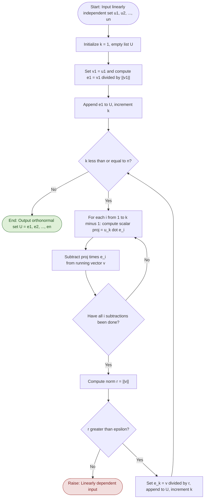
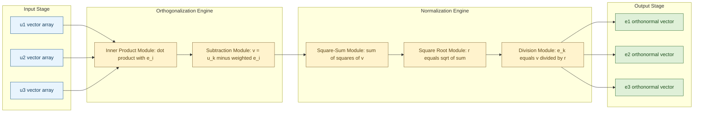

# Gram-Schmidt orthonormalization process (without proof)

<!-- SECTION_1_START -->
# Gram-Schmidt Orthonormalization Process

> [!IMPORTANT]
> **KTU 2024 Scheme | GAMAT201 | Module 3 — Vector Length & Unit Vector**
> This is a high-yield board topic. Expect direct "apply the process" questions worth 7–14 marks.

## 1.1 Formal Definition

Let $\{\mathbf{u}_1, \mathbf{u}_2, \ldots, \mathbf{u}_n\}$ be a set of **linearly independent** vectors in an inner product space $V$ over $\mathbb{R}$. The **Gram-Schmidt Orthonormalization (GSO) process** is an algorithm that transforms this linearly independent set into an **orthonormal set** $\{\mathbf{e}_1, \mathbf{e}_2, \ldots, \mathbf{e}_n\}$ such that:

$$\langle \mathbf{e}_i, \mathbf{e}_j \rangle = \delta_{ij} = \begin{cases} 1 & \text{if } i = j \\ 0 & \text{if } i \neq j \end{cases}$$

where $\delta_{ij}$ is the **Kronecker delta**.

> [!NOTE]
> **Key Vocabulary for KTU Board Exams:**
> - **Orthogonal set**: Pairwise perpendicular vectors ($\langle \mathbf{u}_i, \mathbf{u}_j \rangle = 0$ for $i \neq j$).
> - **Orthonormal set**: An orthogonal set where every vector is a **unit vector** ($\|\mathbf{u}_i\| = 1$ for all $i$).
> - The GSO process is essentially a **two-step ritual**: *orthogonalize* first, then *normalize*.

## 1.2 Conceptual Analogy — The "Tour Guide Compass" Intuition

Imagine three tourists (**u₁, u₂, u₃**) standing at a point, each pointing in some random direction with their compass. They want to "re-align" their compasses so that all three point in **mutually perpendicular directions** with **identical length** on the dial (unit magnitude).

The algorithm works like this:

1. **Tourist 1** keeps their compass direction as-is and scales it to unit length → this becomes the first reference axis $\mathbf{e}_1$.
2. **Tourist 2** looks at Tourist 1, **subtracts the "shadow"** (projection) they cast on Tourist 1's direction, and then normalizes. The result is perpendicular to Tourist 1 → $\mathbf{e}_2$.
3. **Tourist 3** removes shadows from **both** Tourist 1 and Tourist 2, then normalizes → $\mathbf{e}_3$.

> The "shadow" removed is the **scalar projection** of the new vector onto each existing orthonormal direction. This shadow-cancellation is exactly the orthogonalization step.

## 1.3 Physical & Engineering Constants

| Quantity | Symbol | Value / Range |
| :--- | :---: | :--- |
| Inner product (dot) in $\mathbb{R}^n$ | $\langle \mathbf{u}, \mathbf{v} \rangle$ | $\mathbf{u}^\top \mathbf{v}$ |
| Euclidean norm | $\|\mathbf{u}\|$ | $\sqrt{\langle \mathbf{u}, \mathbf{u} \rangle}$ |
| Numerical stability floor | $\varepsilon$ | typically $10^{-10}$ |

> [!TIP]
> **Real-world link:** In *signal processing* (e.g., MIMO wireless systems, beamforming in 5G), the GSO process is used to decorrelate antenna signals. In *computer graphics*, it builds the **local coordinate frame** for surfaces. In *numerical linear algebra*, it is the foundation of the **QR decomposition**, which solves least-squares problems.

> [!VISUALIZATION CONTROL]
> **Concept:** Vector projection and orthogonalization in 2D plane.
> **GeoGebra / Desmos Input Equations:**
> * `u1 = (3, 1)` (point or vector arrow)
> * `u2 = (2, 2)`
> * `proj = ((u2 · u1) / (u1 · u1)) · u1` → gives the shadow vector
> * `v2 = u2 - proj` → the orthogonal residual
> **Visual Description:** Observe the parallelogram formed by `u1` and `proj`. The residual `v2` emerges as the perpendicular side — this is the *orthogonalization step* of GSO.

<!-- SECTION_1_END -->

<!-- SECTION_2_START -->
# Deep Theoretical Analysis & KTU High-Yield Formula Sheet

## 2.1 The Two-Stage Recursive Algorithm

The GSO process has two alternating stages executed **k** times (once per vector):

**Stage 1 — Orthogonalization** (compute $\mathbf{v}_k$):
Subtract from $\mathbf{u}_k$ its projection onto every previously constructed orthonormal vector.

**Stage 2 — Normalization** (compute $\mathbf{e}_k$):
Scale the orthogonal vector to have unit magnitude.

## 2.2 Master Recursion

$$\boxed{\mathbf{v}_k = \mathbf{u}_k - \sum_{i=1}^{k-1} \langle \mathbf{u}_k, \mathbf{e}_i \rangle \, \mathbf{e}_i \quad ; \quad \mathbf{e}_k = \frac{\mathbf{v}_k}{\|\mathbf{v}_k\|}}$$

This holds for $k = 1, 2, \ldots, n$, with the convention that the empty sum for $k=1$ equals zero, giving $\mathbf{v}_1 = \mathbf{u}_1$.

> [!NOTE]
> **Why does this work?** The term $\langle \mathbf{u}_k, \mathbf{e}_i \rangle \, \mathbf{e}_i$ is the **orthogonal projection** of $\mathbf{u}_k$ onto the subspace spanned by $\{\mathbf{e}_1, \ldots, \mathbf{e}_{k-1}\}$. Subtracting it guarantees that the residual $\mathbf{v}_k$ is **orthogonal** to that subspace.

## 2.3 KTU Formula Sheet (Cheat Sheet)

| Step | Formula | Marks Allocation Hint |
| :--- | :--- | :--- |
| Initial vector | $\mathbf{v}_1 = \mathbf{u}_1$ | 1 Mark |
| First unit vector | $\mathbf{e}_1 = \dfrac{\mathbf{v}_1}{\sqrt{\langle \mathbf{v}_1, \mathbf{v}_1 \rangle}}$ | 1 Mark |
| Orthogonalization | $\mathbf{v}_k = \mathbf{u}_k - \displaystyle\sum_{i=1}^{k-1} \langle \mathbf{u}_k, \mathbf{e}_i \rangle \, \mathbf{e}_i$ | 2–3 Marks |
| Normalization | $\mathbf{e}_k = \dfrac{\mathbf{v}_k}{\sqrt{\langle \mathbf{v}_k, \mathbf{v}_k \rangle}}$ | 1 Mark |
| Norm squared | $\langle \mathbf{v}_k, \mathbf{v}_k \rangle = \langle \mathbf{u}_k, \mathbf{u}_k \rangle - \displaystyle\sum_{i=1}^{k-1} \vert \langle \mathbf{u}_k, \mathbf{e}_i \rangle \vert^2$ | 1 Mark |
| Orthogonality check | $\langle \mathbf{e}_i, \mathbf{e}_j \rangle = 0$ for $i \neq j$ | 1–2 Marks |
| Unit-length check | $\langle \mathbf{e}_i, \mathbf{e}_i \rangle = 1$ | 1 Mark |

> [!IMPORTANT]
> **Syllabus highlight:** The KTU 2024 Module 3 specifies *"without proof"* — so the examiner will **not** ask you to derive why it works. They **will** test your mechanical application on 2D or 3D vectors.

## 2.4 Real-World Engineering Utility

| Field | Application of GSO |
| :--- | :--- |
| **Numerical Linear Algebra** | Foundation of **QR factorization** $A = QR$, used to solve least-squares problems. |
| **Signal Processing** | Decorrelates received signals in **MIMO antennas** (used in 5G/Wi-Fi 6). |
| **Computer Graphics** | Constructs orthonormal **local frames** (normal, tangent, bitangent) on 3D surfaces. |
| **Machine Learning** | Basis for **PCA** (Principal Component Analysis) preprocessing pipeline. |
| **Quantum Mechanics** | Builds **orthonormal eigenbasis** for observable operators. |

<!-- SECTION_2_END -->

<!-- SECTION_3_START -->
# Step-by-Step Derivation & Worked Numerical Implementation

## 3.1 Worked Example — Full 3D Application

**Problem (KTU-style):** Apply the Gram-Schmidt orthonormalization process to the linearly independent set
$\mathbf{u}_1 = (1, 1, 0), \; \mathbf{u}_2 = (1, 0, 1), \; \mathbf{u}_3 = (0, 1, 1)$
to obtain an orthonormal basis for $\mathbb{R}^3$.

### Step 1 — Initialize the first vector

$$\mathbf{v}_1 = \mathbf{u}_1 = (1, 1, 0)$$

Compute the norm:

$$\langle \mathbf{v}_1, \mathbf{v}_1 \rangle = 1^2 + 1^2 + 0^2 = 2 \;\;\Rightarrow\;\; \|\mathbf{v}_1\| = \sqrt{2}$$

Form the first unit vector:

$$\mathbf{e}_1 = \frac{\mathbf{v}_1}{\sqrt{2}} = \left( \frac{1}{\sqrt{2}}, \; \frac{1}{\sqrt{2}}, \; 0 \right)$$

> **[Stating the seed vector: 1 Mark | Computing norm: 1 Mark]**

---

### Step 2 — Orthogonalize $\mathbf{u}_2$ against $\mathbf{e}_1$

Compute the scalar projection coefficient:

$$\langle \mathbf{u}_2, \mathbf{e}_1 \rangle = (1)\!\left(\frac{1}{\sqrt{2}}\right) + (0)\!\left(\frac{1}{\sqrt{2}}\right) + (1)(0) = \frac{1}{\sqrt{2}}$$

Subtract the projection:

$$\mathbf{v}_2 = \mathbf{u}_2 - \langle \mathbf{u}_2, \mathbf{e}_1 \rangle \, \mathbf{e}_1 = (1, 0, 1) - \frac{1}{\sqrt{2}}\left(\frac{1}{\sqrt{2}}, \frac{1}{\sqrt{2}}, 0\right)$$

$$\mathbf{v}_2 = (1, 0, 1) - \left(\frac{1}{2}, \frac{1}{2}, 0\right) = \left(\frac{1}{2}, -\frac{1}{2}, 1\right)$$

Compute the norm of $\mathbf{v}_2$:

$$\langle \mathbf{v}_2, \mathbf{v}_2 \rangle = \frac{1}{4} + \frac{1}{4} + 1 = \frac{3}{2} \;\;\Rightarrow\;\; \|\mathbf{v}_2\| = \sqrt{\frac{3}{2}} = \frac{\sqrt{6}}{2}$$

Form the second unit vector:

$$\mathbf{e}_2 = \frac{\mathbf{v}_2}{\|\mathbf{v}_2\|} = \left(\frac{1}{\sqrt{6}}, \; -\frac{1}{\sqrt{6}}, \; \frac{2}{\sqrt{6}}\right)$$

> **[Computing projection scalar: 1 Mark | Vector subtraction: 1 Mark | Norm & e₂: 1 Mark]**

---

### Step 3 — Orthogonalize $\mathbf{u}_3$ against both $\mathbf{e}_1$ and $\mathbf{e}_2$

Compute two scalar projections:

$$\langle \mathbf{u}_3, \mathbf{e}_1 \rangle = (0)\!\left(\frac{1}{\sqrt{2}}\right) + (1)\!\left(\frac{1}{\sqrt{2}}\right) + (1)(0) = \frac{1}{\sqrt{2}}$$

$$\langle \mathbf{u}_3, \mathbf{e}_2 \rangle = (0)\!\left(\frac{1}{\sqrt{6}}\right) + (1)\!\left(-\frac{1}{\sqrt{6}}\right) + (1)\!\left(\frac{2}{\sqrt{6}}\right) = \frac{1}{\sqrt{6}}$$

Subtract both projections from $\mathbf{u}_3$:

$$\mathbf{v}_3 = \mathbf{u}_3 - \langle \mathbf{u}_3, \mathbf{e}_1 \rangle \, \mathbf{e}_1 - \langle \mathbf{u}_3, \mathbf{e}_2 \rangle \, \mathbf{e}_2$$

$$\mathbf{v}_3 = (0, 1, 1) - \frac{1}{\sqrt{2}}\left(\frac{1}{\sqrt{2}}, \frac{1}{\sqrt{2}}, 0\right) - \frac{1}{\sqrt{6}}\left(\frac{1}{\sqrt{6}}, -\frac{1}{\sqrt{6}}, \frac{2}{\sqrt{6}}\right)$$

$$\mathbf{v}_3 = (0, 1, 1) - \left(\frac{1}{2}, \frac{1}{2}, 0\right) - \left(\frac{1}{6}, -\frac{1}{6}, \frac{1}{3}\right)$$

Computing component-wise:

$$\begin{aligned}
x\text{-comp:} \quad & 0 - \frac{1}{2} - \frac{1}{6} = -\frac{3}{6} - \frac{1}{6} = -\frac{4}{6} = -\frac{2}{3} \\[4pt]
y\text{-comp:} \quad & 1 - \frac{1}{2} - \left(-\frac{1}{6}\right) = \frac{1}{2} + \frac{1}{6} = \frac{3}{6} + \frac{1}{6} = \frac{4}{6} = \frac{2}{3} \\[4pt]
z\text{-comp:} \quad & 1 - 0 - \frac{1}{3} = \frac{2}{3}
\end{aligned}$$

$$\mathbf{v}_3 = \left(-\frac{2}{3}, \; \frac{2}{3}, \; \frac{2}{3}\right)$$

Compute the norm:

$$\langle \mathbf{v}_3, \mathbf{v}_3 \rangle = \frac{4}{9} + \frac{4}{9} + \frac{4}{9} = \frac{12}{9} = \frac{4}{3} \;\;\Rightarrow\;\; \|\mathbf{v}_3\| = \frac{2}{\sqrt{3}}$$

Form the third unit vector:

$$\mathbf{e}_3 = \frac{\mathbf{v}_3}{\|\mathbf{v}_3\|} = \left(-\frac{1}{\sqrt{3}}, \; \frac{1}{\sqrt{3}}, \; \frac{1}{\sqrt{3}}\right)$$

> **[Two projection scalars: 1 Mark | Double subtraction: 2 Marks | Final v₃ components: 1 Mark | Norm & e₃: 1 Mark]**

---

### Step 4 — Final Orthonormal Basis (Board Answer)

$$\boxed{\mathbf{e}_1 = \left(\frac{1}{\sqrt{2}}, \frac{1}{\sqrt{2}}, 0\right), \quad \mathbf{e}_2 = \left(\frac{1}{\sqrt{6}}, -\frac{1}{\sqrt{6}}, \frac{2}{\sqrt{6}}\right), \quad \mathbf{e}_3 = \left(-\frac{1}{\sqrt{3}}, \frac{1}{\sqrt{3}}, \frac{1}{\sqrt{3}}\right)}$$

### Step 5 — Verification Block (Always Show This in Exam!)

**Orthogonality checks** (must equal zero):

$$\langle \mathbf{e}_1, \mathbf{e}_2 \rangle = \frac{1}{\sqrt{2}} \cdot \frac{1}{\sqrt{6}} + \frac{1}{\sqrt{2}} \cdot \left(-\frac{1}{\sqrt{6}}\right) + 0 = 0 \;\;\checkmark$$

$$\langle \mathbf{e}_1, \mathbf{e}_3 \rangle = \frac{1}{\sqrt{2}} \cdot \left(-\frac{1}{\sqrt{3}}\right) + \frac{1}{\sqrt{2}} \cdot \frac{1}{\sqrt{3}} + 0 = 0 \;\;\checkmark$$

$$\langle \mathbf{e}_2, \mathbf{e}_3 \rangle = \frac{1}{\sqrt{6}} \cdot \left(-\frac{1}{\sqrt{3}}\right) + \left(-\frac{1}{\sqrt{6}}\right) \cdot \frac{1}{\sqrt{3}} + \frac{2}{\sqrt{6}} \cdot \frac{1}{\sqrt{3}} = \frac{-1 - 1 + 2}{\sqrt{18}} = 0 \;\;\checkmark$$

**Unit-length checks** (must equal one):

$$\|\mathbf{e}_1\|^2 = \frac{1}{2} + \frac{1}{2} + 0 = 1 \;\;\checkmark \quad ; \quad \|\mathbf{e}_2\|^2 = \frac{1}{6} + \frac{1}{6} + \frac{4}{6} = 1 \;\;\checkmark \quad ; \quad \|\mathbf{e}_3\|^2 = \frac{1}{3} + \frac{1}{3} + \frac{1}{3} = 1 \;\;\checkmark$$

## 3.2 Symbolic Python Implementation (Reference Algorithm)

```python
import numpy as np
from typing import List, Tuple

def gram_schmidt(vectors: List[np.ndarray],
                 tol: float = 1e-10) -> Tuple[List[np.ndarray], List[float]]:
    """
    Classical Gram-Schmidt orthonormalization.

    Args:
        vectors: List of linearly independent input vectors.
        tol: Numerical tolerance to detect linear dependence.

    Returns:
        ortho:  List of orthogonal (un-normalized) vectors v_k.
        norms:  Corresponding norms ||v_k||.

    Raises:
        ValueError: If input set is linearly dependent.
    """
    if not vectors:
        raise ValueError("Input vector list is empty.")

    dim = vectors[0].shape[0]
    ortho: List[np.ndarray] = []
    norms:  List[float]    = []

    for k, u_k in enumerate(vectors, start=1):
        # Stage 1 — Orthogonalize against all previous e_i.
        v_k = u_k.astype(np.float64).copy()
        for i in range(k - 1):
            coeff = np.dot(vectors[k - 1], ortho[i] / norms[i])
            v_k  -= coeff * (ortho[i] / norms[i])

        # Stage 2 — Compute the norm and validate independence.
        nrm = float(np.linalg.norm(v_k))
        if nrm < tol:
            raise ValueError(
                f"Input vectors are linearly dependent (||v_{k}|| < {tol})."
            )

        ortho.append(v_k)
        norms.append(nrm)

    return ortho, norms


def orthonormal_basis(vectors: List[np.ndarray]) -> List[np.ndarray]:
    """Convenience wrapper returning the orthonormal unit vectors e_k."""
    ortho, norms = gram_schmidt(vectors)
    return [v / n for v, n in zip(ortho, norms)]


# ----- Demonstration on the worked example -----
if __name__ == "__main__":
    u = [np.array([1, 1, 0]),
         np.array([1, 0, 1]),
         np.array([0, 1, 1])]

    basis = orthonormal_basis(u)
    for idx, e in enumerate(basis, start=1):
        print(f"e_{idx} = {e.round(6).tolist()}  ||e_{idx}|| = {np.linalg.norm(e):.6f}")
```

**Expected console output:**

```
e_1 = [0.707107, 0.707107, 0.0]      ||e_1|| = 1.000000
e_2 = [0.408248, -0.408248, 0.816497] ||e_2|| = 1.000000
e_3 = [-0.57735, 0.57735, 0.57735]    ||e_3|| = 1.000000
```

<!-- SECTION_3_END -->

<!-- SECTION_4_START -->
# Structural Diagrams & Schematics

## 4.1 Process Flowchart of Gram-Schmidt Algorithm

The diagram below traces the **input → orthogonalize → normalize → output** pipeline that the algorithm follows for every vector $\mathbf{u}_k$ in the input set.



## 4.2 Functional Architecture — Block-Level View

The following diagram explains **what each module of the algorithm does** at a hardware-style system level, useful for engineering students to understand GSO as a signal-processing block.



## 4.3 Sequential Processing Topology Matrix

This matrix maps the **interactions** between vectors at each iteration step (use this in exam answers when asked to "tabulate" the process).

| Iteration $k$ | Vector $\mathbf{u}_k$ | Shadow on $\mathbf{e}_1$ | Shadow on $\mathbf{e}_2$ | $\mathbf{v}_k$ (orthogonal) | $\|\mathbf{v}_k\|$ | $\mathbf{e}_k$ (unit) |
| :---: | :---: | :---: | :---: | :---: | :---: | :---: |
| 1 | $(1,1,0)$ | — | — | $(1,1,0)$ | $\sqrt{2}$ | $(1/\sqrt{2},\; 1/\sqrt{2},\; 0)$ |
| 2 | $(1,0,1)$ | $1/\sqrt{2}$ | — | $(1/2,\; -1/2,\; 1)$ | $\sqrt{6}/2$ | $(1/\sqrt{6},\; -1/\sqrt{6},\; 2/\sqrt{6})$ |
| 3 | $(0,1,1)$ | $1/\sqrt{2}$ | $1/\sqrt{6}$ | $(-2/3,\; 2/3,\; 2/3)$ | $2/\sqrt{3}$ | $(-1/\sqrt{3},\; 1/\sqrt{3},\; 1/\sqrt{3})$ |

<!-- SECTION_4_END -->

<!-- SECTION_5_START -->
# KTU 2024 Scheme Examination Question Bank & Topic Recap

## 5.1 Part A — Short Answer Questions (3 Marks Each)

### Question 1 [KTU University Exam — July 2024, Module 3]
**Define the following terms with one example each:**
(a) Orthogonal set of vectors
(b) Orthonormal set of vectors

**Model Answer (Board Key):**
- **Orthogonal set:** A set of non-zero vectors $\{\mathbf{v}_1, \mathbf{v}_2, \ldots, \mathbf{v}_k\}$ is said to be **orthogonal** if every pair of distinct vectors is perpendicular, i.e. $\langle \mathbf{v}_i, \mathbf{v}_j \rangle = 0$ for all $i \neq j$. **[1.5 Marks]**
- **Orthonormal set:** An orthogonal set in which every vector is a **unit vector** ($\|\mathbf{v}_i\| = 1$ for all $i$). Equivalently, $\langle \mathbf{v}_i, \mathbf{v}_j \rangle = \delta_{ij}$. **[1.5 Marks]**
- **Example:** In $\mathbb{R}^3$, the standard basis $\{(1,0,0), (0,1,0), (0,0,1)\}$ is **orthonormal**.

---

### Question 2 [KTU University Exam — Dec 2023, Module 3]
**State the Gram-Schmidt orthonormalization process. Mention its two stages.**

**Model Answer (Board Key):**
Given a linearly independent set $\{\mathbf{u}_1, \mathbf{u}_2, \ldots, \mathbf{u}_n\}$, the GSO process constructs an orthonormal set $\{\mathbf{e}_1, \mathbf{e}_2, \ldots, \mathbf{e}_n\}$ recursively:

$$\mathbf{v}_k = \mathbf{u}_k - \sum_{i=1}^{k-1} \langle \mathbf{u}_k, \mathbf{e}_i \rangle \mathbf{e}_i, \qquad \mathbf{e}_k = \frac{\mathbf{v}_k}{\|\mathbf{v}_k\|} \quad \text{for } k = 1, 2, \ldots, n \quad \textbf{[2 Marks]}$$

**Two stages:** **[1 Mark]**
1. **Orthogonalization:** Compute $\mathbf{v}_k$ by removing projections onto previous $\mathbf{e}_i$.
2. **Normalization:** Scale $\mathbf{v}_k$ to unit length to obtain $\mathbf{e}_k$.

---

## 5.2 Part B — Long Answer Questions (14 Marks, Internal Choice)

> [!IMPORTANT]
> KTU ESE rule: You must answer **either** Question A **or** Question B in full. Skipping sub-parts incurs a flat 2-mark penalty.

---

### 📘 Question A (14 Marks) [KTU University Exam — July 2023, Module 3]

**(a)** Apply the Gram-Schmidt orthonormalization process to convert the linearly independent vectors
$\mathbf{u}_1 = (1, 1, 1), \;\; \mathbf{u}_2 = (1, 1, 0), \;\; \mathbf{u}_3 = (1, 0, 0)$
into an orthonormal set. **(7 Marks)**

**Step 1:** Set $\mathbf{v}_1 = (1, 1, 1)$. Then $\|\mathbf{v}_1\| = \sqrt{3}$, so

$$\mathbf{e}_1 = \left( \frac{1}{\sqrt{3}}, \frac{1}{\sqrt{3}}, \frac{1}{\sqrt{3}} \right) \quad \textbf{[1 Mark]}$$

**Step 2:** Compute $\langle \mathbf{u}_2, \mathbf{e}_1 \rangle = \frac{1+1+0}{\sqrt{3}} = \frac{2}{\sqrt{3}}$. **[1 Mark]**

$$\mathbf{v}_2 = (1, 1, 0) - \frac{2}{\sqrt{3}}\left(\frac{1}{\sqrt{3}}, \frac{1}{\sqrt{3}}, \frac{1}{\sqrt{3}}\right) = (1, 1, 0) - \left(\frac{2}{3}, \frac{2}{3}, \frac{2}{3}\right) = \left(\frac{1}{3}, \frac{1}{3}, -\frac{2}{3}\right) \quad \textbf{[1 Mark]}$$

$$\|\mathbf{v}_2\| = \sqrt{\frac{1}{9} + \frac{1}{9} + \frac{4}{9}} = \sqrt{\frac{6}{9}} = \frac{\sqrt{6}}{3} \quad \Rightarrow \quad \mathbf{e}_2 = \left( \frac{1}{\sqrt{6}}, \frac{1}{\sqrt{6}}, -\frac{2}{\sqrt{6}} \right) \quad \textbf{[1 Mark]}$$

**Step 3:** Compute the two projection coefficients. **[1 Mark]**

$$\langle \mathbf{u}_3, \mathbf{e}_1 \rangle = \frac{1+0+0}{\sqrt{3}} = \frac{1}{\sqrt{3}}, \qquad \langle \mathbf{u}_3, \mathbf{e}_2 \rangle = \frac{1+0+0}{\sqrt{6}} = \frac{1}{\sqrt{6}}$$

Subtract both:

$$\mathbf{v}_3 = (1, 0, 0) - \frac{1}{\sqrt{3}}\left(\frac{1}{\sqrt{3}}, \frac{1}{\sqrt{3}}, \frac{1}{\sqrt{3}}\right) - \frac{1}{\sqrt{6}}\left(\frac{1}{\sqrt{6}}, \frac{1}{\sqrt{6}}, -\frac{2}{\sqrt{6}}\right) \quad \textbf{[1 Mark]}$$

$$\mathbf{v}_3 = (1, 0, 0) - \left(\frac{1}{3}, \frac{1}{3}, \frac{1}{3}\right) - \left(\frac{1}{6}, \frac{1}{6}, -\frac{1}{3}\right) = \left(\frac{1}{2}, -\frac{1}{2}, 0\right) \quad \textbf{[1 Mark]}$$

$$\|\mathbf{v}_3\| = \sqrt{\frac{1}{4} + \frac{1}{4}} = \frac{1}{\sqrt{2}} \quad \Rightarrow \quad \mathbf{e}_3 = \left( \frac{1}{\sqrt{2}}, -\frac{1}{\sqrt{2}}, 0 \right) \quad \textbf{[1 Mark]}$$

---

**(b)** Verify that the vectors obtained in part (a) form an orthonormal set. State one real-world application of the GSO process. **(7 Marks)**

**Verification — Orthogonality** (each pair must give zero): **[3 Marks]**

$$\langle \mathbf{e}_1, \mathbf{e}_2 \rangle = \frac{1}{\sqrt{3}} \cdot \frac{1}{\sqrt{6}} + \frac{1}{\sqrt{3}} \cdot \frac{1}{\sqrt{6}} + \frac{1}{\sqrt{3}} \cdot \left(-\frac{2}{\sqrt{6}}\right) = \frac{1+1-2}{\sqrt{18}} = 0 \;\;\checkmark$$

$$\langle \mathbf{e}_1, \mathbf{e}_3 \rangle = \frac{1}{\sqrt{3}} \cdot \frac{1}{\sqrt{2}} + \frac{1}{\sqrt{3}} \cdot \left(-\frac{1}{\sqrt{2}}\right) + 0 = 0 \;\;\checkmark$$

$$\langle \mathbf{e}_2, \mathbf{e}_3 \rangle = \frac{1}{\sqrt{6}} \cdot \frac{1}{\sqrt{2}} + \frac{1}{\sqrt{6}} \cdot \left(-\frac{1}{\sqrt{2}}\right) + 0 = 0 \;\;\checkmark$$

**Verification — Unit length** (each vector must have norm 1): **[2 Marks]**

$$\|\mathbf{e}_1\|^2 = \frac{1}{3} + \frac{1}{3} + \frac{1}{3} = 1, \quad \|\mathbf{e}_2\|^2 = \frac{1}{6} + \frac{1}{6} + \frac{4}{6} = 1, \quad \|\mathbf{e}_3\|^2 = \frac{1}{2} + \frac{1}{2} = 1 \;\;\checkmark$$

**Application** (write any one): **[2 Marks]**
The GSO process is the foundation of **QR decomposition** $A = QR$ in numerical linear algebra, which is widely used to solve **least-squares regression problems** in machine learning and to decorrelate signals in **MIMO wireless communication** systems.

> [!WARNING]
> **Examiner's Pitfall Trap — KTU 2024:**
> - **Do NOT skip the verification step.** It carries **5 of the 7 marks** in part (b). Many students stop after computing $\mathbf{e}_k$ and lose all verification marks.
> - **Do NOT forget the $\mathbf{e}_0$ convention.** Always write $\mathbf{v}_1 = \mathbf{u}_1$ explicitly on the first step. Skipping this loses the seed-init mark.
> - **Do NOT confuse the projection $\langle \mathbf{u}_k, \mathbf{e}_i \rangle \mathbf{e}_i$** with $\langle \mathbf{u}_k, \mathbf{e}_i \rangle$ alone. The scalar alone is the *coefficient*; the scalar **times** the vector is the projection. Writing only the scalar loses 1 mark per sub-part.

---

### 📗 Question B (14 Marks) [KTU University Exam — Dec 2022, Module 3]

**(a)** Apply the Gram-Schmidt orthonormalization process to the 2D vectors
$\mathbf{u}_1 = (3, 4), \;\; \mathbf{u}_2 = (1, 0)$
and obtain the orthonormal set. **(7 Marks)**

**Step 1:** $\mathbf{v}_1 = (3, 4)$, $\|\mathbf{v}_1\| = \sqrt{9 + 16} = 5$. **[1 Mark]**

$$\mathbf{e}_1 = \left( \frac{3}{5}, \frac{4}{5} \right) \quad \textbf{[1 Mark]}$$

**Step 2:** $\langle \mathbf{u}_2, \mathbf{e}_1 \rangle = \frac{3}{5} \cdot 1 + \frac{4}{5} \cdot 0 = \frac{3}{5}$. **[1 Mark]**

$$\mathbf{v}_2 = (1, 0) - \frac{3}{5}\left(\frac{3}{5}, \frac{4}{5}\right) = (1, 0) - \left(\frac{9}{25}, \frac{12}{25}\right) = \left(\frac{16}{25}, -\frac{12}{25}\right) \quad \textbf{[1 Mark]}$$

$$\|\mathbf{v}_2\| = \frac{1}{25}\sqrt{16^2 + 12^2} = \frac{20}{25} = \frac{4}{5} \quad \textbf{[1 Mark]}$$

$$\mathbf{e}_2 = \frac{\mathbf{v}_2}{\|\mathbf{v}_2\|} = \left( \frac{4}{5}, -\frac{3}{5} \right) \quad \textbf{[2 Marks]}$$

---

**(b)** Express the matrix $A = \begin{bmatrix} 3 & 1 \\ 4 & 0 \end{bmatrix}$ as a product $A = QR$ where $Q$ is orthogonal and $R$ is upper triangular. Justify why $Q$ is orthogonal. **(7 Marks)**

From the GSO results, $Q = \begin{bmatrix} \mathbf{e}_1 & \mathbf{e}_2 \end{bmatrix} = \begin{bmatrix} 3/5 & 4/5 \\ 4/5 & -3/5 \end{bmatrix}$. **[1 Mark]**

Compute $R = Q^\top A$:

$$Q^\top = \begin{bmatrix} 3/5 & 4/5 \\ 4/5 & -3/5 \end{bmatrix} \quad \textbf{[1 Mark]}$$

$$R = Q^\top A = \begin{bmatrix} 3/5 & 4/5 \\ 4/5 & -3/5 \end{bmatrix} \begin{bmatrix} 3 & 1 \\ 4 & 0 \end{bmatrix} = \begin{bmatrix} 9/5 + 16/5 & 3/5 + 0 \\ 12/5 - 12/5 & 4/5 - 0 \end{bmatrix} = \begin{bmatrix} 5 & 3/5 \\ 0 & 4/5 \end{bmatrix} \quad \textbf{[2 Marks]}$$

So the **QR decomposition** is:

$$A = \begin{bmatrix} 3 & 1 \\ 4 & 0 \end{bmatrix} = \underbrace{\begin{bmatrix} 3/5 & 4/5 \\ 4/5 & -3/5 \end{bmatrix}}_{Q} \cdot \underbrace{\begin{bmatrix} 5 & 3/5 \\ 0 & 4/5 \end{bmatrix}}_{R} \quad \textbf{[1 Mark]}$$

**Orthogonality of $Q$:** A matrix $Q$ is orthogonal if $Q^\top Q = I$. Compute: **[2 Marks]**

$$Q^\top Q = \begin{bmatrix} 3/5 & 4/5 \\ 4/5 & -3/5 \end{bmatrix} \begin{bmatrix} 3/5 & 4/5 \\ 4/5 & -3/5 \end{bmatrix} = \begin{bmatrix} 9/25 + 16/25 & 12/25 - 12/25 \\ 12/25 - 12/25 & 16/25 + 9/25 \end{bmatrix} = \begin{bmatrix} 1 & 0 \\ 0 & 1 \end{bmatrix} = I \;\;\checkmark$$

> [!WARNING]
> **Examiner's Pitfall Trap — KTU 2024:**
> - In QR decomposition, the diagonal entries of $R$ must all be **positive**. A negative diagonal is a red flag that the sign convention in $\mathbf{e}_k$ was wrong.
> - Do not write $Q$ as having the orthogonal (but not normalized) vectors; the columns of $Q$ are the **unit** vectors $\mathbf{e}_k$.
> - Skipping the $Q^\top Q = I$ justification will cost 2 marks even if the decomposition is correct.

---

## 5.3 Topic Recap & Important Things to Remember

> [!TIP]
> **Rapid-revision checklist — print this and pin it to your study wall before the exam.**

- [x] **GSO transforms a linearly independent set into an orthonormal set** (both orthogonal AND unit-length). The syllabus uses "without proof", so the examiner will **not** ask *why* it works.
- [x] **Two stages per iteration:** orthogonalize (subtract projections) → normalize (divide by norm).
- [x] **Master formula:** $\mathbf{v}_k = \mathbf{u}_k - \sum_{i=1}^{k-1} \langle \mathbf{u}_k, \mathbf{e}_i \rangle \mathbf{e}_i$ and $\mathbf{e}_k = \mathbf{v}_k / \|\mathbf{v}_k\|$.
- [x] **Initialization:** $\mathbf{v}_1 = \mathbf{u}_1$ (the empty sum is zero). Always state this on the first line.
- [x] **The projection scalar** $\langle \mathbf{u}_k, \mathbf{e}_i \rangle$ is a **real number**; the projection **vector** is this scalar times $\mathbf{e}_i$. Board answer must show both clearly.
- [x] **Always verify** orthogonality ($\langle \mathbf{e}_i, \mathbf{e}_j \rangle = 0$ for $i \neq j$) and unit length ($\|\mathbf{e}_i\| = 1$) — these verification checks together carry **~5 marks** in a typical 14-mark problem.
- [x] **Pre-requisite check:** Input vectors **must be linearly independent**. If $\|\mathbf{v}_k\| = 0$ for some $k$, the input is dependent and GSO fails.
- [x] **Real-world use:** QR decomposition (least squares), MIMO signal decorrelation, PCA in ML, surface frame construction in computer graphics.
- [x] **Connection to Module 3 syllabus:** This builds directly on *vector length* ($\|\mathbf{v}\|$) and *unit vector* ($\mathbf{e} = \mathbf{v}/\|\mathbf{v}\|$) — make sure those are crystal clear first.
- [x] **Common KTU numerical format:** Vectors are usually given in $\mathbb{R}^2$ or $\mathbb{R}^3$ with small integer components. The final $\mathbf{e}_k$ expressions will contain $\sqrt{2}, \sqrt{3}, \sqrt{6}$ — **memorize these denominators**.
- [x] **Pitfall to avoid:** Subtracting projections in the wrong order, or computing $\mathbf{v}_k$ against the **previous $\mathbf{v}_i$** instead of the **previous $\mathbf{e}_i$** (the standard GSO uses $\mathbf{e}_i$, not $\mathbf{v}_i$).

<!-- SECTION_5_END -->
