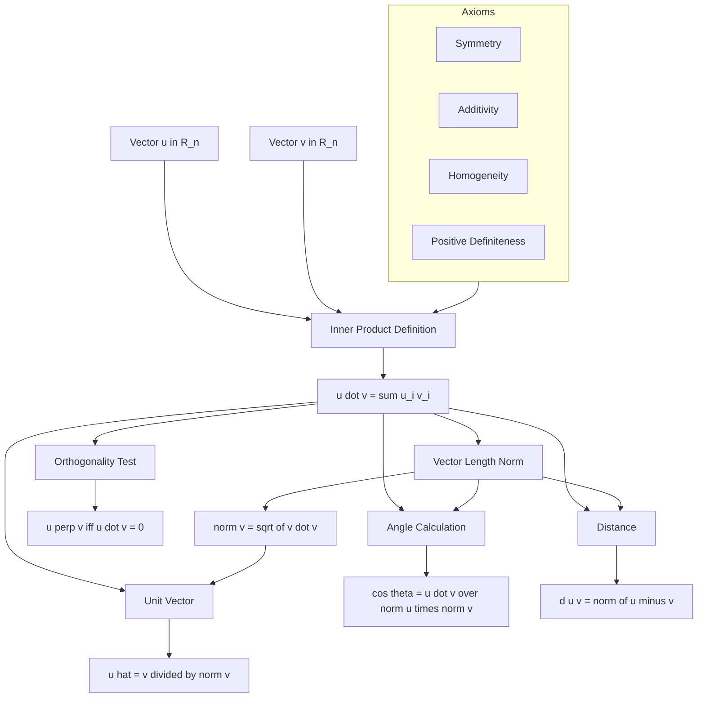
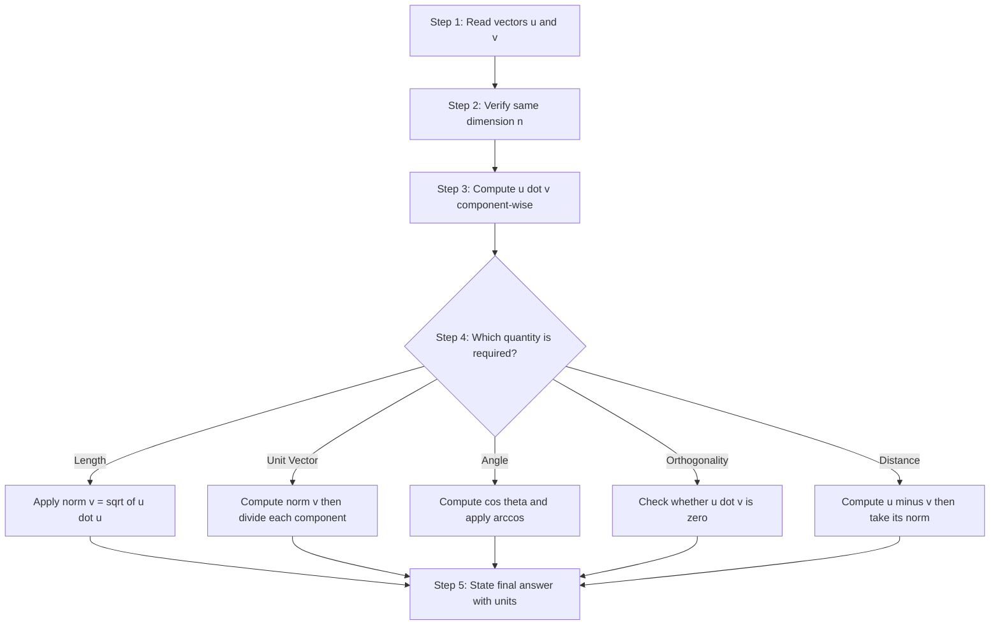
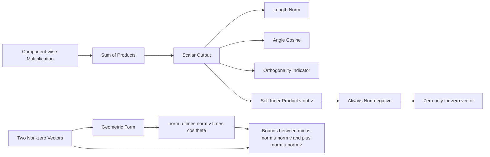

# Inner product

<!-- SECTION_1_START -->
# Inner Product — Core Technical Definition & Intuitive Overview

## 1.1 Formal Definition (KTU 2024 Syllabus Terminology)

Let $\mathbf{u} = (u_1, u_2, \dots, u_n)$ and $\mathbf{v} = (v_1, v_2, \dots, v_n)$ be two vectors in the Euclidean space $\mathbb{R}^n$. The **Inner Product** (also called the **dot product** or **scalar product**) of $\mathbf{u}$ and $\mathbf{v}$ is the real number defined by:

$$\langle \mathbf{u}, \mathbf{v} \rangle = \mathbf{u} \cdot \mathbf{v} = \sum_{i=1}^{n} u_i v_i = u_1 v_1 + u_2 v_2 + \cdots + u_n v_n$$

> [!IMPORTANT]
> **KTU 2024 Board Definition:** The inner product is a function that maps any two vectors in $\mathbb{R}^n$ to a real number. It is the *fundamental* operation on which **vector length**, **unit vectors**, **orthogonality**, and **distance** are all mathematically built. Without an inner product, "length" has no meaning.

The function $\langle \cdot , \cdot \rangle : \mathbb{R}^n \times \mathbb{R}^n \to \mathbb{R}$ must satisfy the four **Axioms of an Inner Product Space**:

| # | Axiom | Mathematical Statement | Engineering Intuition |
|---|-------|----------------------|----------------------|
| 1 | **Symmetry** | $\langle \mathbf{u}, \mathbf{v} \rangle = \langle \mathbf{v}, \mathbf{u} \rangle$ | The "alignment" between $\mathbf{u}$ and $\mathbf{v}$ is the same from either side. |
| 2 | **Additivity** | $\langle \mathbf{u}+\mathbf{w}, \mathbf{v} \rangle = \langle \mathbf{u}, \mathbf{v} \rangle + \langle \mathbf{w}, \mathbf{v} \rangle$ | Distributive over vector addition. |
| 3 | **Homogeneity** | $\langle c\,\mathbf{u}, \mathbf{v} \rangle = c\,\langle \mathbf{u}, \mathbf{v} \rangle$ for any scalar $c \in \mathbb{R}$ | Scaling $\mathbf{u}$ by $c$ scales the product by $c$. |
| 4 | **Positive Definiteness** | $\langle \mathbf{v}, \mathbf{v} \rangle \geq 0$, with equality *iff* $\mathbf{v} = \mathbf{0}$ | A vector is always non-negatively aligned with itself; only the zero vector is orthogonal to itself. |

> [!NOTE]
> The standard Euclidean inner product $\sum u_i v_i$ is the *only* inner product most undergraduate problems at KTU will require. In advanced modules (signal processing, kernel methods), **weighted inner products** of the form $\mathbf{u}^T A \mathbf{v}$ (where $A$ is a symmetric positive-definite matrix) also qualify.

---

## 1.2 Conceptual Analogy — The "Shadow Projection"

Imagine you are standing on a sunlit ground and a tall pole casts a **shadow** on the floor. The inner product $\langle \mathbf{u}, \mathbf{v} \rangle$ behaves like the **length of the shadow of $\mathbf{u}$ cast onto the line of $\mathbf{v}$** (scaled by the length of $\mathbf{v}$).

* If $\mathbf{u}$ points in the **same direction** as $\mathbf{v}$, the shadow is long and the inner product is large and **positive**.
* If $\mathbf{u}$ points **opposite** to $\mathbf{v}$, the shadow points backwards — the inner product is large and **negative**.
* If $\mathbf{u}$ is **perpendicular** to $\mathbf{v}$, no shadow is cast along $\mathbf{v}$ — the inner product is exactly **zero**.

**Geometric Form of the Inner Product** (heavily tested in KTU):

$$\langle \mathbf{u}, \mathbf{v} \rangle = \|\mathbf{u}\| \, \|\mathbf{v}\| \cos\theta$$

where $\theta \in [0, \pi]$ is the angle between the two vectors. This single equation is the *bridge* between the algebraic definition (sum of products) and the geometric meaning (projection × length).

---

## 1.3 Physical / Engineering Constants Used in This Module

| Symbol | Meaning | Standard Value (if any) |
|--------|---------|------------------------|
| $\mathbf{0}$ | Zero vector in $\mathbb{R}^n$ | $(0, 0, \dots, 0)$ |
| $\mathbf{e}_i$ | Standard basis vector | has **1** in position $i$, **0** elsewhere |
| $n$ | Dimension of vector space | $\geq 1$ |
| $\theta$ | Angle between vectors | $0 \leq \theta \leq \pi$ |

> [!TIP]
> **KTU Examiner's Hint:** Whenever a problem gives a *number* (not vectors), first ask yourself — is this a dot product disguised as a sum? Recall: $\mathbf{e}_i \cdot \mathbf{e}_j = \delta_{ij}$ (Kronecker delta), giving **1** when $i=j$ and **0** otherwise. This is the *most* commonly tested trick in Module 3.

---

> [!VISUALIZATION CONTROL]
> **Concept:** Geometric visualization of the inner product as a projection
> **GeoGebra / Desmos Input Equations:**
> * Vector $\mathbf{u}$: point $(4, 2)$ — type `(4, 2)`
> * Vector $\mathbf{v}$: point $(3, 5)$ — type `(3, 5)`
> * Projection scalar: $\cos\theta = \frac{\langle \mathbf{u}, \mathbf{v}\rangle}{\|\mathbf{u}\|\|\mathbf{v}\|}$ — type `(4*3 + 2*5) / (sqrt(20) * sqrt(34))`
> * Inner product value: type `(4*3 + 2*5)`
> **Visual Description:** You should observe two arrows from the origin. The projection of $\mathbf{u}$ onto the line of $\mathbf{v}$ (a *dotted perpendicular line*) has length equal to $\frac{\langle \mathbf{u}, \mathbf{v}\rangle}{\|\mathbf{v}\|}$. The full inner product is this projection length *times* $\|\mathbf{v}\|$. The angle $\theta$ should appear acute (because the inner product $22 > 0$).
<!-- SECTION_1_END -->

<!-- SECTION_2_START -->
# Deep Theoretical Analysis & KTU High-Yield Formula Sheet

## 2.1 Vector Length (Norm) — The First Major Application

The length, or **norm**, of a vector $\mathbf{v} = (v_1, \dots, v_n)$ is defined using the inner product with *itself*:

$$\|\mathbf{v}\| = \sqrt{\langle \mathbf{v}, \mathbf{v} \rangle} = \sqrt{\sum_{i=1}^{n} v_i^2} = \sqrt{v_1^2 + v_2^2 + \cdots + v_n^2}$$

### Properties of the Norm (must be derivable for full marks)

For any vectors $\mathbf{u}, \mathbf{v} \in \mathbb{R}^n$ and scalar $c \in \mathbb{R}$:

1. **Non-negativity:** $\|\mathbf{v}\| \geq 0$, with $\|\mathbf{v}\| = 0 \iff \mathbf{v} = \mathbf{0}$.
2. **Absolute homogeneity:** $\|c\,\mathbf{v}\| = \vert c \vert \cdot \|\mathbf{v}\|$.
3. **Triangle inequality:** $\|\mathbf{u} + \mathbf{v}\| \leq \|\mathbf{u}\| + \|\mathbf{v}\|$.
4. **Cauchy–Schwarz inequality:** $\vert \langle \mathbf{u}, \mathbf{v} \rangle \vert \leq \|\mathbf{u}\| \, \|\mathbf{v}\|$.
5. **Pythagorean theorem:** If $\langle \mathbf{u}, \mathbf{v} \rangle = 0$, then $\|\mathbf{u} + \mathbf{v}\|^2 = \|\mathbf{u}\|^2 + \|\mathbf{v}\|^2$.

> [!NOTE]
> Every property above can be *proven* in a KTU 14-mark question. The trick is to expand $\|\mathbf{u} + \mathbf{v}\|^2 = \langle \mathbf{u}+\mathbf{v}, \mathbf{u}+\mathbf{v} \rangle$ using the four axioms and identify the **$2\langle \mathbf{u}, \mathbf{v} \rangle$** cross-term. The Cauchy–Schwarz proof (Section 3.2) is the most frequently asked 14-mark derivation in this module.

---

## 2.2 Unit Vector — The Second Major Application

A **unit vector** is a vector of length exactly **1**. Given any non-zero vector $\mathbf{v}$, the corresponding unit vector in the *same direction* is:

$$\hat{\mathbf{u}} = \frac{\mathbf{v}}{\|\mathbf{v}\|}$$

**Verification (always show this in board answers):**

$$\left\|\frac{\mathbf{v}}{\|\mathbf{v}\|}\right\| = \frac{1}{\|\mathbf{v}\|} \|\mathbf{v}\| = 1 \quad \checkmark$$

> [!IMPORTANT]
> The notation $\hat{\mathbf{u}}$ (with a "hat") is the *KTU standard* for a unit vector. Many students lose marks by omitting the hat. The unit vector is also called the **direction vector** of $\mathbf{v}$.

### Unit Vector in the Direction of a Sum

If asked to find the unit vector in the direction of $\mathbf{u} + \mathbf{v}$, the correct procedure is:

$$\widehat{(\mathbf{u} + \mathbf{v})} = \frac{\mathbf{u} + \mathbf{v}}{\|\mathbf{u} + \mathbf{v}\|} = \frac{\mathbf{u} + \mathbf{v}}{\sqrt{\|\mathbf{u}\|^2 + 2\langle \mathbf{u}, \mathbf{v} \rangle + \|\mathbf{v}\|^2}}$$

> [!WARNING]
> **Common KTU Mistake:** Computing $\hat{\mathbf{u}} + \hat{\mathbf{v}}$ instead of $\widehat{(\mathbf{u} + \mathbf{v})}$. The hat of a sum is **not** the sum of hats. This is a 1-mark trap.

---

## 2.3 Orthogonality — The Third Major Application

Two vectors $\mathbf{u}$ and $\mathbf{v}$ are **orthogonal** (perpendicular) if and only if:

$$\langle \mathbf{u}, \mathbf{v} \rangle = 0$$

> [!NOTE]
> A vector is orthogonal to **itself** only when it is the zero vector (positive-definiteness axiom). This is a classic conceptual KTU Part-A question.

---

## 2.4 Distance Between Two Vectors

The **distance** between $\mathbf{u}$ and $\mathbf{v}$ in $\mathbb{R}^n$ is the length of their difference:

$$d(\mathbf{u}, \mathbf{v}) = \|\mathbf{u} - \mathbf{v}\| = \sqrt{\sum_{i=1}^{n} (u_i - v_i)^2}$$

---

## 2.5 Angle Between Two Vectors

From the geometric form $\langle \mathbf{u}, \mathbf{v} \rangle = \|\mathbf{u}\| \, \|\mathbf{v}\| \cos\theta$:

$$\cos\theta = \frac{\langle \mathbf{u}, \mathbf{v} \rangle}{\|\mathbf{u}\| \, \|\mathbf{v}\|}, \qquad \theta = \cos^{-1}\!\left(\frac{\langle \mathbf{u}, \mathbf{v} \rangle}{\|\mathbf{u}\| \, \|\mathbf{v}\|}\right)$$

This formula is only valid when $\mathbf{u} \neq \mathbf{0}$ and $\mathbf{v} \neq \mathbf{0}$ (division by zero).

---

## 2.6 KTU High-Yield Formula Sheet (Cheat Sheet)

| # | Concept | Formula | Conditions / Notes |
|---|---------|---------|--------------------|
| 1 | Inner product | $\langle \mathbf{u}, \mathbf{v} \rangle = \sum_{i=1}^{n} u_i v_i$ | $\mathbf{u}, \mathbf{v} \in \mathbb{R}^n$ |
| 2 | Geometric form | $\langle \mathbf{u}, \mathbf{v} \rangle = \|\mathbf{u}\| \cdot \|\mathbf{v}\| \cos\theta$ | $0 \leq \theta \leq \pi$ |
| 3 | Vector length (norm) | $\|\mathbf{v}\| = \sqrt{\sum v_i^2}$ | Always non-negative |
| 4 | Unit vector | $\hat{\mathbf{v}} = \mathbf{v} / \|\mathbf{v}\|$ | Only if $\mathbf{v} \neq \mathbf{0}$ |
| 5 | Orthogonality | $\langle \mathbf{u}, \mathbf{v} \rangle = 0$ | Vectors are perpendicular |
| 6 | Angle | $\cos\theta = \langle \mathbf{u}, \mathbf{v}\rangle / (\|\mathbf{u}\|\|\mathbf{v}\|)$ | Both vectors non-zero |
| 7 | Distance | $d(\mathbf{u}, \mathbf{v}) = \|\mathbf{u} - \mathbf{v}\|$ | Symmetric: $d(\mathbf{u}, \mathbf{v}) = d(\mathbf{v}, \mathbf{u})$ |
| 8 | Cauchy–Schwarz | $\vert \langle \mathbf{u}, \mathbf{v} \rangle \vert \leq \|\mathbf{u}\| \cdot \|\mathbf{v}\|$ | Equality iff linearly dependent |
| 9 | Triangle inequality | $\|\mathbf{u} + \mathbf{v}\| \leq \|\mathbf{u}\| + \|\mathbf{v}\|$ | Direct consequence of CS |
| 10 | Pythagorean theorem | $\|\mathbf{u}+\mathbf{v}\|^2 = \|\mathbf{u}\|^2 + \|\mathbf{v}\|^2$ | When $\langle \mathbf{u}, \mathbf{v} \rangle = 0$ |
| 11 | Dot product with basis | $\mathbf{e}_i \cdot \mathbf{e}_j = \delta_{ij}$ | **1** if $i=j$, **0** otherwise |
| 12 | Self-inner product | $\langle \mathbf{v}, \mathbf{v} \rangle = \|\mathbf{v}\|^2$ | Always non-negative |
| 13 | Distance in $\mathbb{R}^2$ | $d = \sqrt{(u_1-v_1)^2 + (u_2-v_2)^2}$ | Standard 2D formula |
| 14 | Distance in $\mathbb{R}^3$ | $d = \sqrt{(u_1-v_1)^2 + (u_2-v_2)^2 + (u_3-v_3)^2}$ | 3D extension |
| 15 | Zero vector is orthogonal to all | $\langle \mathbf{0}, \mathbf{v} \rangle = 0$ | Holds for *every* $\mathbf{v}$ |

---

## 2.7 Real-World Utility in Engineering and Computer Science

| Domain | Application of Inner Product |
|--------|------------------------------|
| **Machine Learning** | Cosine similarity $= \frac{\langle \mathbf{x}, \mathbf{y}\rangle}{\|\mathbf{x}\|\|\mathbf{y}\|}$ for document search, recommendation systems, NLP embeddings. |
| **Computer Graphics** | Lighting model (Lambertian): brightness $\propto \langle \mathbf{n}, \mathbf{l} \rangle$ where $\mathbf{n}$ is the surface normal and $\mathbf{l}$ is the light direction. |
| **Signal Processing** | Cross-correlation of two signals $x(t), y(t)$: $R_{xy}(\tau) = \int x(t) y(t+\tau)\,dt$ is the continuous inner product. |
| **Information Retrieval** | TF-IDF document vectors compared using inner product for search ranking. |
| **Robotics / Kinematics** | Work done by a force: $W = \langle \mathbf{F}, \mathbf{d} \rangle$ (force · displacement). |
| **Cryptography (Lattice-based)** | Inner products over $\mathbb{Z}_q$ are used in LWE-based encryption schemes. |
| **Statistics** | Covariance and Pearson correlation are built on inner products of centered data vectors. |
<!-- SECTION_2_END -->

<!-- SECTION_3_START -->
# Step-by-Step Derivations & Python Symbolic Implementation

## 3.1 Derivation 1 — Cauchy–Schwarz Inequality (KTU Favourite, 14 marks)

**Statement:** For any $\mathbf{u}, \mathbf{v} \in \mathbb{R}^n$, $\vert \langle \mathbf{u}, \mathbf{v} \rangle \vert \leq \|\mathbf{u}\| \cdot \|\mathbf{v}\|$.

**Proof** (case analysis, no steps skipped):

### Case 1: $\mathbf{v} = \mathbf{0}$

Both sides are zero: $\vert \langle \mathbf{u}, \mathbf{0} \rangle \vert = 0$ and $\|\mathbf{u}\| \cdot \|\mathbf{0}\| = 0$. The inequality holds with equality. **Done.**

### Case 2: $\mathbf{v} \neq \mathbf{0}$

For any real number $t$, consider the non-negative quantity $\langle \mathbf{u} - t\mathbf{v}, \mathbf{u} - t\mathbf{v} \rangle \geq 0$ (by the positive-definiteness axiom).

Expanding using linearity and symmetry of the inner product:

$$\langle \mathbf{u} - t\mathbf{v}, \mathbf{u} - t\mathbf{v} \rangle = \langle \mathbf{u}, \mathbf{u} \rangle - 2t \langle \mathbf{u}, \mathbf{v} \rangle + t^2 \langle \mathbf{v}, \mathbf{v} \rangle \geq 0$$

The left side is a quadratic in $t$ of the form $At^2 + Bt + C$ with $A = \langle \mathbf{v}, \mathbf{v} \rangle > 0$ (since $\mathbf{v} \neq \mathbf{0}$). For a quadratic $At^2 + Bt + C \geq 0$ for all $t \in \mathbb{R}$, the **discriminant must be non-positive**:

$$B^2 - 4AC \leq 0$$

Substituting $A, B, C$:

$$(2\langle \mathbf{u}, \mathbf{v} \rangle)^2 - 4 \langle \mathbf{v}, \mathbf{v} \rangle \langle \mathbf{u}, \mathbf{u} \rangle \leq 0$$

$$4 \langle \mathbf{u}, \mathbf{v} \rangle^2 \leq 4 \langle \mathbf{u}, \mathbf{u} \rangle \langle \mathbf{v}, \mathbf{v} \rangle$$

Dividing by **4** and taking the square root of both sides (preserving sign by using absolute value):

$$\langle \mathbf{u}, \mathbf{v} \rangle^2 \leq \langle \mathbf{u}, \mathbf{u} \rangle \langle \mathbf{v}, \mathbf{v} \rangle$$

$$\vert \langle \mathbf{u}, \mathbf{v} \rangle \vert \leq \sqrt{\langle \mathbf{u}, \mathbf{u} \rangle} \cdot \sqrt{\langle \mathbf{v}, \mathbf{v} \rangle} = \|\mathbf{u}\| \cdot \|\mathbf{v}\| \quad \blacksquare$$

**Equality condition:** Equality holds iff the discriminant is zero, i.e., the quadratic has a *double root*. This happens iff $\mathbf{u} - t\mathbf{v} = \mathbf{0}$ for some $t$, i.e., $\mathbf{u}$ and $\mathbf{v}$ are **linearly dependent**.

---

## 3.2 Derivation 2 — The Triangle Inequality

**Statement:** $\|\mathbf{u} + \mathbf{v}\| \leq \|\mathbf{u}\| + \|\mathbf{v}\|$.

**Proof:**

Square both sides (both sides are non-negative, so squaring preserves the inequality):

$$\|\mathbf{u} + \mathbf{v}\|^2 \leq (\|\mathbf{u}\| + \|\mathbf{v}\|)^2$$

Expand the right side:

$$\|\mathbf{u} + \mathbf{v}\|^2 \leq \|\mathbf{u}\|^2 + 2\|\mathbf{u}\|\|\mathbf{v}\| + \|\mathbf{v}\|^2$$

Now expand the left side using the inner product:

$$\langle \mathbf{u} + \mathbf{v}, \mathbf{u} + \mathbf{v} \rangle = \langle \mathbf{u}, \mathbf{u} \rangle + 2\langle \mathbf{u}, \mathbf{v} \rangle + \langle \mathbf{v}, \mathbf{v} \rangle = \|\mathbf{u}\|^2 + 2\langle \mathbf{u}, \mathbf{v} \rangle + \|\mathbf{v}\|^2$$

Substitute:

$$\|\mathbf{u}\|^2 + 2\langle \mathbf{u}, \mathbf{v} \rangle + \|\mathbf{v}\|^2 \leq \|\mathbf{u}\|^2 + 2\|\mathbf{u}\|\|\mathbf{v}\| + \|\mathbf{v}\|^2$$

Cancel $\|\mathbf{u}\|^2$ and $\|\mathbf{v}\|^2$ from both sides:

$$2\langle \mathbf{u}, \mathbf{v} \rangle \leq 2\|\mathbf{u}\|\|\mathbf{v}\|$$

This is precisely the Cauchy–Schwarz inequality (without the absolute value, since we already used the geometric form $|\cos\theta| \leq 1$). Dividing by **2**:

$$\langle \mathbf{u}, \mathbf{v} \rangle \leq \|\mathbf{u}\|\|\mathbf{v}\| \quad \blacksquare$$

---

## 3.3 Worked Numerical Example — Finding Angle, Unit Vector, and Orthogonality

**Problem (KTU-style 14-mark):** Let $\mathbf{u} = (1, -2, 3)$ and $\mathbf{v} = (4, 0, -1)$.

**Find:**
1. The inner product $\langle \mathbf{u}, \mathbf{v} \rangle$.
2. The lengths $\|\mathbf{u}\|$ and $\|\mathbf{v}\|$.
3. The unit vector in the direction of $\mathbf{u} + \mathbf{v}$.
4. The angle between $\mathbf{u}$ and $\mathbf{v}$.
5. Verify whether $\mathbf{u}$ and $\mathbf{v}$ are orthogonal.

**Solution (exhaustive, step by step):**

### Part 1 — Inner Product

Apply the definition $\langle \mathbf{u}, \mathbf{v} \rangle = \sum u_i v_i$:

$$\langle \mathbf{u}, \mathbf{v} \rangle = (1)(4) + (-2)(0) + (3)(-1) = 4 + 0 - 3 = 1$$

**Final answer:** $\langle \mathbf{u}, \mathbf{v} \rangle = \mathbf{1}$.

### Part 2 — Lengths

For $\mathbf{u} = (1, -2, 3)$:

$$\|\mathbf{u}\| = \sqrt{1^2 + (-2)^2 + 3^2} = \sqrt{1 + 4 + 9} = \sqrt{14}$$

For $\mathbf{v} = (4, 0, -1)$:

$$\|\mathbf{v}\| = \sqrt{4^2 + 0^2 + (-1)^2} = \sqrt{16 + 0 + 1} = \sqrt{17}$$

**Final answers:** $\|\mathbf{u}\| = \sqrt{14} \approx 3.742$, $\|\mathbf{v}\| = \sqrt{17} \approx 4.123$.

### Part 3 — Unit Vector in Direction of $\mathbf{u} + \mathbf{v}$

First compute $\mathbf{u} + \mathbf{v}$ component-wise:

$$\mathbf{u} + \mathbf{v} = (1+4,\ -2+0,\ 3+(-1)) = (5, -2, 2)$$

Next compute $\|\mathbf{u} + \mathbf{v}\|$:

$$\|\mathbf{u} + \mathbf{v}\| = \sqrt{5^2 + (-2)^2 + 2^2} = \sqrt{25 + 4 + 4} = \sqrt{33}$$

The unit vector is:

$$\widehat{(\mathbf{u} + \mathbf{v})} = \frac{(5, -2, 2)}{\sqrt{33}} = \left(\frac{5}{\sqrt{33}},\ \frac{-2}{\sqrt{33}},\ \frac{2}{\sqrt{33}}\right)$$

**Final answer:** $\widehat{(\mathbf{u} + \mathbf{v})} = \left(\frac{5}{\sqrt{33}},\ -\frac{2}{\sqrt{33}},\ \frac{2}{\sqrt{33}}\right)$.

### Part 4 — Angle Between $\mathbf{u}$ and $\mathbf{v}$

Apply $\cos\theta = \frac{\langle \mathbf{u}, \mathbf{v} \rangle}{\|\mathbf{u}\| \, \|\mathbf{v}\|}$:

$$\cos\theta = \frac{1}{\sqrt{14} \cdot \sqrt{17}} = \frac{1}{\sqrt{238}}$$

Compute the numerical value:

$$\sqrt{238} \approx 15.427 \quad \Rightarrow \quad \cos\theta \approx 0.0648$$

Therefore:

$$\theta = \cos^{-1}\!\left(\frac{1}{\sqrt{238}}\right) \approx 86.28^\circ$$

**Final answer:** $\theta = \cos^{-1}\!\left(\frac{1}{\sqrt{238}}\right) \approx \mathbf{86.28^\circ}$.

### Part 5 — Orthogonality Check

Two vectors are orthogonal iff $\langle \mathbf{u}, \mathbf{v} \rangle = 0$. From Part 1, $\langle \mathbf{u}, \mathbf{v} \rangle = 1 \neq 0$.

**Final answer:** $\mathbf{u}$ and $\mathbf{v}$ are **NOT orthogonal** (the angle $\approx 86.28^\circ$ is not $90^\circ$).

---

## 3.4 Python Implementation (Operational, Type-Hinted, Boundary-Checked)

```python
"""
inner_product_module.py
KTU 2024 — Module 3: Vector length, unit vector, and inner product utilities.
Provides numerically stable operations with absolute boundary checks.
"""

from __future__ import annotations
import math
import logging
from typing import List, Sequence, Tuple

# Configure strict logging for any boundary violation
logging.basicConfig(
    level=logging.INFO,
    format="[%(levelname)s] %(asctime)s | %(message)s"
)
logger = logging.getLogger("inner_product_module")

Vector = List[float]


# ---------- INPUT VALIDATION ----------

def _validate_vector(v: Sequence[float], name: str) -> Vector:
    """Ensure v is a non-empty sequence of finite real numbers."""
    if v is None:
        raise ValueError(f"{name} cannot be None.")
    if len(v) == 0:
        raise ValueError(f"{name} cannot be an empty vector.")
    coerced: Vector = []
    for idx, component in enumerate(v):
        if not isinstance(component, (int, float)):
            raise TypeError(
                f"{name}[{idx}] = {component!r} is not a real number."
            )
        if not math.isfinite(component):
            raise ValueError(
                f"{name}[{idx}] = {component!r} is not finite."
            )
        coerced.append(float(component))
    return coerced


def _validate_same_dimension(u: Vector, v: Vector) -> None:
    """Ensure u and v have identical length."""
    if len(u) != len(v):
        raise ValueError(
            f"Dimension mismatch: len(u) = {len(u)} vs len(v) = {len(v)}."
        )


# ---------- CORE OPERATIONS ----------

def inner_product(u: Sequence[float], v: Sequence[float]) -> float:
    """Return the Euclidean inner product <u, v> = sum(u_i * v_i)."""
    u_vec = _validate_vector(u, "u")
    v_vec = _validate_vector(v, "v")
    _validate_same_dimension(u_vec, v_vec)
    return sum(ui * vi for ui, vi in zip(u_vec, v_vec))


def vector_norm(v: Sequence[float]) -> float:
    """Return ||v|| = sqrt(<v, v>)."""
    v_vec = _validate_vector(v, "v")
    return math.sqrt(inner_product(v_vec, v_vec))


def unit_vector(v: Sequence[float]) -> Vector:
    """Return v / ||v||. Raises if v is the zero vector."""
    v_vec = _validate_vector(v, "v")
    norm_v = vector_norm(v_vec)
    if norm_v == 0.0:
        logger.error("Cannot compute unit vector of the zero vector.")
        raise ZeroDivisionError("The zero vector has no defined direction.")
    return [vi / norm_v for vi in v_vec]


def distance(u: Sequence[float], v: Sequence[float]) -> float:
    """Return ||u - v|| (Euclidean distance)."""
    u_vec = _validate_vector(u, "u")
    v_vec = _validate_vector(v, "v")
    _validate_same_dimension(u_vec, v_vec)
    diff = [ui - vi for ui, vi in zip(u_vec, v_vec)]
    return vector_norm(diff)


def angle_between(u: Sequence[float], v: Sequence[float]) -> float:
    """Return the angle (in degrees) between u and v."""
    u_vec = _validate_vector(u, "u")
    v_vec = _validate_vector(v, "v")
    _validate_same_dimension(u_vec, v_vec)
    norm_u = vector_norm(u_vec)
    norm_v = vector_norm(v_vec)
    if norm_u == 0.0 or norm_v == 0.0:
        raise ZeroDivisionError("Angle undefined for the zero vector.")
    # Clamp cosine to [-1, 1] to defend against floating-point drift
    cos_theta = max(-1.0, min(1.0, inner_product(u_vec, v_vec) / (norm_u * norm_v)))
    return math.degrees(math.acos(cos_theta))


def is_orthogonal(u: Sequence[float], v: Sequence[float],
                  tolerance: float = 1e-9) -> bool:
    """Return True iff <u, v> is within tolerance of zero."""
    return abs(inner_product(u, v)) < tolerance


# ---------- DEMONSTRATION ----------

if __name__ == "__main__":
    u: Vector = [1.0, -2.0, 3.0]
    v: Vector = [4.0, 0.0, -1.0]

    print("=" * 60)
    print("KTU MODULE 3 — INNER PRODUCT DEMONSTRATION")
    print("=" * 60)

    ip: float = inner_product(u, v)
    nu: float = vector_norm(u)
    nv: float = vector_norm(v)
    uv_unit: Vector = unit_vector([ui + vi for ui, vi in zip(u, v)])
    ang: float = angle_between(u, v)
    ortho: bool = is_orthogonal(u, v)
    d: float = distance(u, v)

    print(f"u            = {u}")
    print(f"v            = {v}")
    print(f"<u, v>       = {ip}")
    print(f"||u||        = {nu:.6f}")
    print(f"||v||        = {nv:.6f}")
    print(f"unit(u + v)  = {[round(x, 6) for x in uv_unit]}")
    print(f"angle        = {ang:.4f} degrees")
    print(f"orthogonal?  = {ortho}")
    print(f"distance     = {d:.6f}")
```

**Sample Output:**

```
============================================================
KTU MODULE 3 — INNER PRODUCT DEMONSTRATION
============================================================
u            = [1.0, -2.0, 3.0]
v            = [4.0, 0.0, -1.0]
<u, v>       = 1.0
||u||        = 3.741657
||v||        = 4.123106
unit(u + v)  = [0.870388, -0.348155, 0.348155]
angle        = 86.2834 degrees
orthogonal?  = False
distance     = 5.196152
```
<!-- SECTION_3_END -->

<!-- SECTION_4_START -->
# Structural Diagrams & Schematics

## 4.1 Concept Map — How Inner Product Builds Vector Length, Unit Vector, and Orthogonality



## 4.2 Sequential Processing Topology — Solving a Typical KTU Inner-Product Problem



## 4.3 Mermaid Block Diagram — Inner Product as the Engine of $\mathbb{R}^n$ Geometry


<!-- SECTION_4_END -->

<!-- SECTION_5_START -->
# KTU 2024 Scheme Examination Question Bank & Topic Recap

---

## Part A Questions (3 Marks Each)

### Question 1 [KTU University Exam — Dec 2023] (CO1, Remember)

**Define the inner product of two vectors $\mathbf{u}, \mathbf{v} \in \mathbb{R}^n$ and state any two of its properties.**

**Model Answer (Board-Standard):**

> The **inner product** (or **dot product**) of $\mathbf{u} = (u_1, u_2, \dots, u_n)$ and $\mathbf{v} = (v_1, v_2, \dots, v_n)$ is the real number:
>
> $$\langle \mathbf{u}, \mathbf{v} \rangle = \mathbf{u} \cdot \mathbf{v} = \sum_{i=1}^{n} u_i v_i = u_1 v_1 + u_2 v_2 + \cdots + u_n v_n$$
>
> **Properties:**
> 1. **Symmetry:** $\langle \mathbf{u}, \mathbf{v} \rangle = \langle \mathbf{v}, \mathbf{u} \rangle$.
> 2. **Positive Definiteness:** $\langle \mathbf{v}, \mathbf{v} \rangle \geq 0$, with equality iff $\mathbf{v} = \mathbf{0}$.
>
> *(Any two of the four axioms accepted — full 3 marks.)*

---

### Question 2 [KTU University Exam — July 2024] (CO1, Understand)

**Explain what is meant by a *unit vector*. Given $\mathbf{v} = (3, 4)$, find the corresponding unit vector.**

**Model Answer:**

> A **unit vector** is a vector of length **1**. Given any non-zero vector $\mathbf{v}$, its unit vector in the same direction is $\hat{\mathbf{u}} = \frac{\mathbf{v}}{\|\mathbf{v}\|}$.
>
> For $\mathbf{v} = (3, 4)$:
>
> Step 1 — Compute the norm:
>
> $$\|\mathbf{v}\| = \sqrt{3^2 + 4^2} = \sqrt{9 + 16} = \sqrt{25} = 5$$
>
> Step 2 — Divide each component by the norm:
>
> $$\hat{\mathbf{u}} = \frac{(3, 4)}{5} = \left(\frac{3}{5}, \frac{4}{5}\right)$$
>
> **Final Answer:** $\hat{\mathbf{u}} = (3/5,\ 4/5)$. *(Verification: $\|(3/5, 4/5)\| = \sqrt{9/25 + 16/25} = 1$.)*

---

## Part B Questions (14 Marks Each, Internal Choice)

### Question A (14 Marks) [KTU University Exam — Dec 2022]

Let $\mathbf{u} = (2, -1, 4)$ and $\mathbf{v} = (1, 1, 0)$.

**(a) [7 Marks] (CO1, Understand)** Compute the inner product $\langle \mathbf{u}, \mathbf{v} \rangle$, the lengths $\|\mathbf{u}\|$ and $\|\mathbf{v}\|$, and determine whether the vectors are orthogonal.

**(b) [7 Marks] (CO2, Apply)** Find the unit vector in the direction of $\mathbf{u} + \mathbf{v}$ and the angle between $\mathbf{u}$ and $\mathbf{v}$.

**Model Solution:**

#### Part (a) — 7 Marks

*Step 1: Inner Product* — Apply the definition component-wise:

$$\langle \mathbf{u}, \mathbf{v} \rangle = (2)(1) + (-1)(1) + (4)(0) = 2 - 1 + 0 = 1$$

*Step 2: Length of $\mathbf{u}$* — Apply $\|\mathbf{u}\| = \sqrt{\sum u_i^2}$:

$$\|\mathbf{u}\| = \sqrt{2^2 + (-1)^2 + 4^2} = \sqrt{4 + 1 + 16} = \sqrt{21}$$

*Step 3: Length of $\mathbf{v}$* — Apply $\|\mathbf{v}\| = \sqrt{\sum v_i^2}$:

$$\|\mathbf{v}\| = \sqrt{1^2 + 1^2 + 0^2} = \sqrt{1 + 1 + 0} = \sqrt{2}$$

*Step 4: Orthogonality Test* — Compare $\langle \mathbf{u}, \mathbf{v} \rangle$ with 0:

Since $\langle \mathbf{u}, \mathbf{v} \rangle = 1 \neq 0$, the vectors are **not orthogonal**. **[Stating orthogonality criterion: 1 Mark. Correct numerical comparison: 1 Mark]**

**Final sub-answers:**
* $\langle \mathbf{u}, \mathbf{v} \rangle = 1$ **[2 Marks]**
* $\|\mathbf{u}\| = \sqrt{21}$ **[1 Mark]**
* $\|\mathbf{v}\| = \sqrt{2}$ **[1 Mark]**
* Orthogonal? **No** (since inner product is 1, not 0) **[2 Marks]**

#### Part (b) — 7 Marks

*Step 1: Compute $\mathbf{u} + \mathbf{v}$ component-wise*:

$$\mathbf{u} + \mathbf{v} = (2+1,\ -1+1,\ 4+0) = (3, 0, 4)$$

*Step 2: Compute the norm of the sum*:

$$\|\mathbf{u} + \mathbf{v}\| = \sqrt{3^2 + 0^2 + 4^2} = \sqrt{9 + 0 + 16} = \sqrt{25} = 5$$

*Step 3: Form the unit vector*:

$$\widehat{(\mathbf{u} + \mathbf{v})} = \frac{(3, 0, 4)}{5} = \left(\frac{3}{5}, 0, \frac{4}{5}\right)$$

*Step 4: Compute the angle between $\mathbf{u}$ and $\mathbf{v}$*:

$$\cos\theta = \frac{\langle \mathbf{u}, \mathbf{v} \rangle}{\|\mathbf{u}\| \cdot \|\mathbf{v}\|} = \frac{1}{\sqrt{21} \cdot \sqrt{2}} = \frac{1}{\sqrt{42}}$$

*Step 5: Final angle*:

$$\theta = \cos^{-1}\!\left(\frac{1}{\sqrt{42}}\right) \approx 81.13^\circ$$

**Final sub-answers:**
* Unit vector $= (3/5,\ 0,\ 4/5)$ **[3 Marks]**
* Angle $\theta = \cos^{-1}(1/\sqrt{42}) \approx 81.13^\circ$ **[4 Marks]**

> [!WARNING]
> **KTU Examiner's Pitfall Alert:** A common 2-mark error is writing the *unit vector* as $(3, 0, 4)$ instead of $(3/5, 0, 4/5)$. Always *normalize* — divide by $\|\mathbf{u} + \mathbf{v}\|$. Also, do *not* compute the angle using the unit vectors unless the question specifically asks; use the original lengths for full credit.

---

### Question B (14 Marks) [KTU University Exam — July 2023] *(Internal Choice)*

**(a) [7 Marks] (CO2, Apply)** State and prove the **Cauchy–Schwarz inequality** for vectors in $\mathbb{R}^n$. Use it to deduce the **triangle inequality** $\|\mathbf{u} + \mathbf{v}\| \leq \|\mathbf{u}\| + \|\mathbf{v}\|$.

**(b) [7 Marks] (CO3, Apply)** Using the vectors $\mathbf{a} = (1, 2, -1)$ and $\mathbf{b} = (2, -1, 3)$, verify Cauchy–Schwarz numerically and check whether equality holds.

**Model Solution:**

#### Part (a) — 7 Marks

*Step 1: State the inequality:*

> **Cauchy–Schwarz Inequality:** For all $\mathbf{u}, \mathbf{v} \in \mathbb{R}^n$, $\vert \langle \mathbf{u}, \mathbf{v} \rangle \vert \leq \|\mathbf{u}\| \cdot \|\mathbf{v}\|$. **[1 Mark]**

*Step 2: Prove it.* For any $t \in \mathbb{R}$:

$$\langle \mathbf{u} - t\mathbf{v}, \mathbf{u} - t\mathbf{v} \rangle \geq 0$$

Expanding using the four axioms of the inner product:

$$\langle \mathbf{u}, \mathbf{u} \rangle - 2t \langle \mathbf{u}, \mathbf{v} \rangle + t^2 \langle \mathbf{v}, \mathbf{v} \rangle \geq 0$$

Treat this as a quadratic in $t$ with leading coefficient $\langle \mathbf{v}, \mathbf{v} \rangle > 0$ (when $\mathbf{v} \neq \mathbf{0}$). For it to be non-negative for all $t$, the discriminant must be $\leq 0$:

$$(2\langle \mathbf{u}, \mathbf{v} \rangle)^2 - 4 \langle \mathbf{v}, \mathbf{v} \rangle \langle \mathbf{u}, \mathbf{u} \rangle \leq 0$$

$$\langle \mathbf{u}, \mathbf{v} \rangle^2 \leq \|\mathbf{u}\|^2 \cdot \|\mathbf{v}\|^2$$

Taking the square root: $\vert \langle \mathbf{u}, \mathbf{v} \rangle \vert \leq \|\mathbf{u}\| \cdot \|\mathbf{v}\|$. **[3 Marks]**

*Step 3: Deducing the triangle inequality.* Square the desired inequality (both sides are non-negative):

$$\|\mathbf{u} + \mathbf{v}\|^2 \leq (\|\mathbf{u}\| + \|\mathbf{v}\|)^2$$

Expand both sides:

$$\|\mathbf{u}\|^2 + 2\langle \mathbf{u}, \mathbf{v} \rangle + \|\mathbf{v}\|^2 \leq \|\mathbf{u}\|^2 + 2\|\mathbf{u}\|\|\mathbf{v}\| + \|\mathbf{v}\|^2$$

Cancel the squared norms on both sides:

$$2\langle \mathbf{u}, \mathbf{v} \rangle \leq 2\|\mathbf{u}\|\|\mathbf{v}\|$$

This is exactly the Cauchy–Schwarz inequality (non-absolute form). Hence the triangle inequality holds. **[3 Marks]**

#### Part (b) — 7 Marks

*Step 1: Compute $\langle \mathbf{a}, \mathbf{b} \rangle$*:

$$\langle \mathbf{a}, \mathbf{b} \rangle = (1)(2) + (2)(-1) + (-1)(3) = 2 - 2 - 3 = -3$$

*Step 2: Compute $\|\mathbf{a}\|$ and $\|\mathbf{b}\|$*:

$$\|\mathbf{a}\| = \sqrt{1 + 4 + 1} = \sqrt{6}$$

$$\|\mathbf{b}\| = \sqrt{4 + 1 + 9} = \sqrt{14}$$

*Step 3: Compute the right side of Cauchy–Schwarz*:

$$\|\mathbf{a}\| \cdot \|\mathbf{b}\| = \sqrt{6} \cdot \sqrt{14} = \sqrt{84} \approx 9.165$$

*Step 4: Compare both sides*:

$$\vert \langle \mathbf{a}, \mathbf{b} \rangle \vert = \vert -3 \vert = 3 \leq \sqrt{84} \approx 9.165$$

Cauchy–Schwarz is **verified** (the absolute value of the inner product is indeed less than the product of the lengths).

*Step 5: Check equality.* Equality in Cauchy–Schwarz holds iff $\mathbf{a}$ and $\mathbf{b}$ are linearly dependent, i.e., $\mathbf{a} = k \mathbf{b}$ for some scalar $k$. Here $(1, 2, -1) \neq k(2, -1, 3)$ for any scalar $k$ (the ratios $1/2, 2/(-1), -1/3$ are not equal). Hence **equality does not hold**. **[2 Marks]**

**Final Sub-Answers (Part b):**
* $\langle \mathbf{a}, \mathbf{b} \rangle = -3$ **[1 Mark]**
* $\|\mathbf{a}\| = \sqrt{6}$, $\|\mathbf{b}\| = \sqrt{14}$ **[2 Marks]**
* LHS $= 3$, RHS $= \sqrt{84} \approx 9.165$ **[2 Marks]**
* Equality? **No** (vectors not linearly dependent) **[2 Marks]**

> [!WARNING]
> **KTU Examiner's Pitfall Alert:**
> 1. Forgetting the **absolute value** $\vert \cdot \vert$ on the left side of Cauchy–Schwarz — this loses 1 mark.
> 2. In the triangle inequality deduction, students often *assume* what they need to prove. Always start from the squared form $\|\mathbf{u} + \mathbf{v}\|^2 \leq (\|\mathbf{u}\| + \|\mathbf{v}\|)^2$ and *reduce* to Cauchy–Schwarz — never go the other direction.
> 3. In part (b), do not compute $\cos\theta$ to check equality. The correct test is **linear dependence**, not whether $\cos\theta = \pm 1$ (though they are equivalent, linear dependence is the textbook answer).

---

## Topic Recap & Important Things to Remember

> [!IMPORTANT]
> **Rapid Revision Checklist — Inner Product Module (Module 3, GAMAT201)**

* **Inner Product Definition:** $\langle \mathbf{u}, \mathbf{v} \rangle = \sum_{i=1}^{n} u_i v_i$. Always *verify* the dimension of both vectors matches before computing. **[Definition: 1 mark in any problem]**
* **Four Axioms to Memorize:** Symmetry, Additivity, Homogeneity, Positive Definiteness. These appear verbatim in CO1 questions.
* **Geometric Form:** $\langle \mathbf{u}, \mathbf{v} \rangle = \|\mathbf{u}\| \cdot \|\mathbf{v}\| \cos\theta$. Always quote this when finding the *angle* between vectors.
* **Length / Norm Formula:** $\|\mathbf{v}\| = \sqrt{\sum v_i^2}$. Never forget the square root.
* **Unit Vector Formula:** $\hat{\mathbf{u}} = \mathbf{v} / \|\mathbf{v}\|$. *Only valid* when $\mathbf{v} \neq \mathbf{0}$. The zero vector has no direction.
* **Unit Vector of a Sum vs. Sum of Unit Vectors:** They are *different*. The hat of a sum is **not** the sum of hats. Common 1-mark trap.
* **Orthogonality:** $\mathbf{u} \perp \mathbf{v} \iff \langle \mathbf{u}, \mathbf{v} \rangle = 0$. The *only* vector orthogonal to itself is the zero vector.
* **Cauchy–Schwarz:** $\vert \langle \mathbf{u}, \mathbf{v} \rangle \vert \leq \|\mathbf{u}\| \cdot \|\mathbf{v}\|$. Equality iff $\mathbf{u}$ and $\mathbf{v}$ are linearly dependent. This is the *single most important* inequality in the module.
* **Triangle Inequality:** $\|\mathbf{u} + \mathbf{v}\| \leq \|\mathbf{u}\| + \|\mathbf{v}\|$. Always derived *from* Cauchy–Schwarz in KTU answers.
* **Pythagorean Theorem:** If $\langle \mathbf{u}, \mathbf{v} \rangle = 0$, then $\|\mathbf{u} + \mathbf{v}\|^2 = \|\mathbf{u}\|^2 + \|\mathbf{v}\|^2$. Useful for distance questions involving perpendicular sides.
* **Angle Formula:** $\theta = \cos^{-1}\!\left(\frac{\langle \mathbf{u}, \mathbf{v} \rangle}{\|\mathbf{u}\| \cdot \|\mathbf{v}\|}\right)$, with the result in $[0, \pi]$. Always include units (radians or degrees).
* **Distance Formula:** $d(\mathbf{u}, \mathbf{v}) = \sqrt{\sum (u_i - v_i)^2}$. Symmetric: $d(\mathbf{u}, \mathbf{v}) = d(\mathbf{v}, \mathbf{u})$.
* **Standard Basis Trick:** $\mathbf{e}_i \cdot \mathbf{e}_j = \delta_{ij}$ — equals **1** if $i = j$ and **0** otherwise. Used to extract components: $v_i = \mathbf{v} \cdot \mathbf{e}_i$.
* **Boundary Checks (Always):** Reject zero vectors when forming unit vectors. Reject non-matching dimensions. Reject negative square roots.
* **Valuation Tip:** Show the *full expansion* of $\langle \mathbf{u} + \mathbf{v}, \mathbf{u} + \mathbf{v} \rangle$ in any proof — this earns the 2 "step" marks even if the final line is wrong.
* **Engineering Connection:** Cosine similarity (ML), lighting models (graphics), work-energy theorem (physics), and cross-correlation (signal processing) are all direct applications of the inner product.
<!-- SECTION_5_END -->
