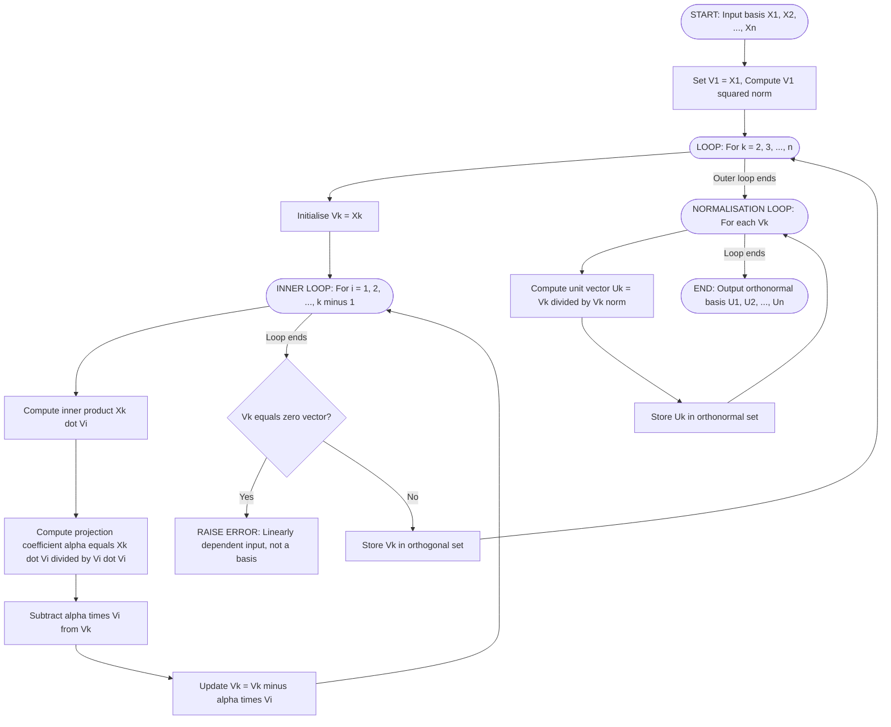
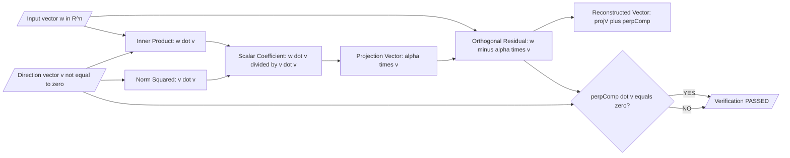
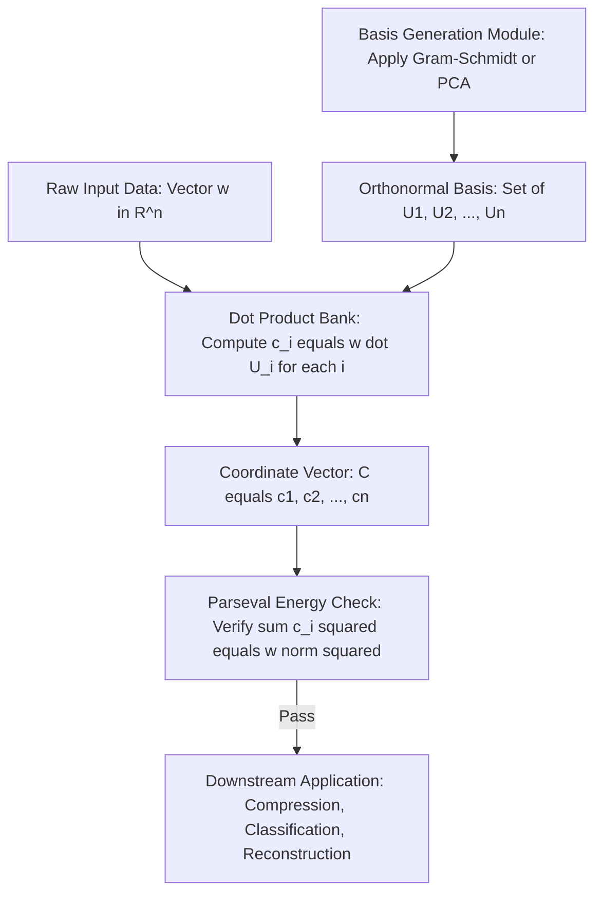

# Orthogonal and orthonormal basis

<!-- SECTION_1_START -->
# Orthogonal and Orthonormal Basis — Core Technical Definition & Intuitive Overview

> [!IMPORTANT]
> **KTU 2024 Syllabus Hook (GAMAT201 — Module 3):** The concept of *Orthogonal and Orthonormal Basis* is the natural culmination of the dot product, vector norm, and unit vector machinery. It is the mathematical backbone of almost every algorithm in Information Science — from Principal Component Analysis (PCA) to Fourier Transforms, from data compression to quantum state representation.

---

## 1.1 Formal Definition (KTU 2024 Board Standard)

### Inner Product (Dot Product) in $\mathbb{R}^n$
For two vectors $\mathbf{u}, \mathbf{v} \in \mathbb{R}^n$, written as $\mathbf{u} = (u_1, u_2, \dots, u_n)$ and $\mathbf{v} = (v_1, v_2, \dots, v_n)$, the **inner product** (also called the **dot product** or **scalar product**) is the scalar quantity:

$$
\mathbf{u} \cdot \mathbf{v} = \sum_{i=1}^{n} u_i v_i = u_1 v_1 + u_2 v_2 + \dots + u_n v_n
$$

The inner product is **positive-definite**, **symmetric**, and **bilinear** — these three properties are what give orthogonal basis its power.

### Vector Length (Norm)
The **length** (or **Euclidean norm** or **magnitude**) of a vector $\mathbf{v} = (v_1, v_2, \dots, v_n)$ is the non-negative scalar:

$$
\|\mathbf{v}\| = \sqrt{\mathbf{v} \cdot \mathbf{v}} = \sqrt{\sum_{i=1}^{n} v_i^2}
$$

This is the direct generalisation of the Pythagorean theorem to $n$ dimensions. The standard metric reported in board questions is the **Euclidean norm** unless stated otherwise.

### Unit Vector
A vector $\mathbf{u}$ is called a **unit vector** if its length is exactly $1$:

$$
\|\mathbf{u}\| = 1
$$

For any non-zero vector $\mathbf{v} \in \mathbb{R}^n$, the corresponding unit vector in the same direction is given by the **normalisation formula**:

$$
\hat{\mathbf{v}} = \frac{\mathbf{v}}{\|\mathbf{v}\|}
$$

This is the single most useful formula in the module — it appears in nearly every KTU board problem.

---

## 1.2 The Key Definitions (Board-Standard Wording)

> [!NOTE]
> **Definition 1 — Orthogonal Vectors**
> Two vectors $\mathbf{u}$ and $\mathbf{v}$ in $\mathbb{R}^n$ are said to be **orthogonal** (perpendicular) if and only if their inner product equals zero:
> $$\mathbf{u} \cdot \mathbf{v} = 0$$
> In symbols, we write $\mathbf{u} \perp \mathbf{v}$.

> [!NOTE]
> **Definition 2 — Orthogonal Set**
> A set of vectors $\{\mathbf{v}_1, \mathbf{v}_2, \dots, \mathbf{v}_k\}$ in $\mathbb{R}^n$ is an **orthogonal set** if every pair of distinct vectors in the set is orthogonal:
> $$\mathbf{v}_i \cdot \mathbf{v}_j = 0 \quad \text{for all } i \neq j, \quad 1 \le i, j \le k$$

> [!NOTE]
> **Definition 3 — Orthonormal Set**
> A set of vectors $\{\mathbf{u}_1, \mathbf{u}_2, \dots, \mathbf{u}_k\}$ in $\mathbb{R}^n$ is an **orthonormal set** if it is an orthogonal set AND every vector in the set is a unit vector. Equivalently:
> $$\mathbf{u}_i \cdot \mathbf{u}_j = \delta_{ij} = \begin{cases} 1 & \text{if } i = j \\ 0 & \text{if } i \neq j \end{cases}$$
> The symbol $\delta_{ij}$ is called the **Kronecker delta**.

> [!NOTE]
> **Definition 4 — Orthogonal / Orthonormal Basis**
> An orthogonal (or orthonormal) set that also **spans** the entire space (or subspace) under consideration is called an **orthogonal basis** (or **orthonormal basis**). In $\mathbb{R}^n$, any such basis must contain exactly $n$ linearly independent vectors.

> [!WARNING]
> **Common KTU Mistake:** Students often confuse "orthogonal basis" with "orthogonal set". An *orthogonal set* is just a collection of mutually perpendicular vectors. An *orthogonal basis* must additionally *span* the space. Board questions test this distinction directly.

---

## 1.3 Conceptual Analogy — The "Compass & Map" Intuition

Imagine you are navigating a city using a **map and a compass**.

* The **standard X-Y axes** $(1,0)$ and $(0,1)$ in $\mathbb{R}^2$ are the most famous example of an **orthonormal basis**. They are *perpendicular* (orthogonal) and each has length exactly $1$ (normalised). Every point in the plane — every building, every road — can be described as a unique combination of "how far East" and "how far North".

* Now imagine a map drawn by a slightly careless cartographer. The two axes are still perpendicular, but one is drawn longer than the other — say axis lengths $2$ and $1$. This is an **orthogonal basis**, but *not* an orthonormal one. It still works for navigation, but the coordinates are stretched, and any formula involving length or distance needs to compensate.

* If the cartographer now tilts one of the axes by $30^\circ$ — the axes are no longer perpendicular. This is **not** an orthogonal basis. Navigation becomes messy because the coordinates can no longer be treated independently.

**The "compass & map" lesson:** Orthonormal bases are the *cleanest coordinate system* — perpendicular, equal-sized, independent. In Information Science, choosing such a basis is like choosing the cleanest "language" to describe your data — it makes compression, search, and analysis dramatically easier.

---

## 1.4 Visualising the Concept

> [!VISUALIZATION CONTROL]
> **Concept:** Orthogonal vs Non-Orthogonal Basis in $\mathbb{R}^2$
> **GeoGebra / Desmos Input Equations:**
> * `v1 = (3, 0)` (drawn as a vector from origin)
> * `v2 = (0, 2)` (drawn as a vector from origin)
> * `v3 = (1, 1)` (a non-orthogonal vector for comparison)
> * `Circle x^2 + y^2 = 1` (to show the unit circle)
> **Visual Description:** On the standard $xy$-plane, the student should observe the following: the **red** vector $\mathbf{v}_1 = (3,0)$ lies on the X-axis. The **blue** vector $\mathbf{v}_2 = (0,2)$ lies on the Y-axis. Together, they form an **orthogonal basis** for $\mathbb{R}^2$. The unit circle in the background shows where *unit vectors* would lie. If you normalise $\mathbf{v}_1$ and $\mathbf{v}_2$ to $\mathbf{u}_1 = (1,0)$ and $\mathbf{u}_2 = (0,1)$, you obtain the **standard orthonormal basis** of $\mathbb{R}^2$. The **green** vector $\mathbf{v}_3 = (1,1)$ is *not* orthogonal to $\mathbf{v}_1$ or $\mathbf{v}_2$ — its dot products with them are non-zero, so it cannot belong to the same orthogonal set.

---

## 1.5 Why This Matters in Information Science (GAMAT201 Context)

> [!IMPORTANT]
> **Real-World Connection to the Course:**
> Orthonormal bases are not abstract — they are the *working language* of Information Science:
> * **Fourier Analysis & Signal Processing:** Any signal is decomposed into sines and cosines — these form an *orthonormal basis* of the function space $L^2$. This is the foundation of MP3, JPEG, and Wi-Fi.
> * **Principal Component Analysis (PCA):** Finds an *orthonormal basis* of *principal axes* along which the data has maximum variance. Used in face recognition, genomics, finance.
> * **Quantum Computing:** Quantum states are vectors in a complex Hilbert space, and measurement bases must be *orthonormal* for the Born rule to hold.
> * **Machine Learning:** Gram-Schmidt orthogonalisation is used in QR decomposition, which solves least-squares problems — the workhorse of linear regression and neural network training.
> * **Image Compression:** JPEG uses the Discrete Cosine Transform (DCT) basis, which is orthonormal.

In every one of these applications, the goal is the same: find the *cleanest, most independent coordinate system* to describe the problem. That is precisely what an orthonormal basis provides.

<!-- SECTION_1_END -->

<!-- SECTION_2_START -->
# Deep Theoretical Analysis & KTU High-Yield Formula Sheet

## 2.1 The Geometric Core — Why Orthogonal Vectors Are "Independent"

Two vectors $\mathbf{u}$ and $\mathbf{v}$ in $\mathbb{R}^n$ are **linearly independent** if neither can be written as a scalar multiple of the other. Geometrically, this means they point in *different* directions. The strongest, cleanest form of "different direction" is **perpendicular** — the dot product captures exactly this:

* If $\mathbf{u} \cdot \mathbf{v} = 0$, the vectors are perpendicular — no projection of one onto the other exists.
* If $\mathbf{u} \cdot \mathbf{v} \neq 0$, the vectors have a non-zero projection onto each other.

> [!IMPORTANT]
> **Key Theorem (Often Asked in Boards):**
> *Any orthogonal set of non-zero vectors is automatically linearly independent.*
> Proof intuition: Suppose $\sum_{i=1}^{k} c_i \mathbf{v}_i = \mathbf{0}$. Take the inner product of both sides with $\mathbf{v}_j$. Because of orthogonality, all terms except the $j$-th vanish, leaving $c_j \|\mathbf{v}_j\|^2 = 0$. Since $\|\mathbf{v}_j\| \neq 0$, we get $c_j = 0$. This holds for every $j$, so all coefficients are zero, proving linear independence.

This theorem is **the reason** orthogonal sets form bases — and it is a favourite of KTU examiners.

---

## 2.2 The Orthogonal Decomposition Theorem (Projection)

For any vector $\mathbf{w}$ in $\mathbb{R}^n$ and any non-zero vector $\mathbf{v}$, the **orthogonal projection** of $\mathbf{w}$ onto the line spanned by $\mathbf{v}$ is:

$$
\mathbf{proj}_{\mathbf{v}} \mathbf{w} = \left( \frac{\mathbf{w} \cdot \mathbf{v}}{\mathbf{v} \cdot \mathbf{v}} \right) \mathbf{v}
$$

If $\mathbf{v}$ is a **unit vector** (i.e., $\|\mathbf{v}\| = 1$), this simplifies beautifully to:

$$
\mathbf{proj}_{\mathbf{v}} \mathbf{w} = (\mathbf{w} \cdot \mathbf{v}) \, \mathbf{v}
$$

The scalar component $\mathbf{w} \cdot \mathbf{v}$ is called the **scalar projection** of $\mathbf{w}$ onto $\mathbf{v}$. When $\mathbf{v}$ is a unit vector, it is simply the *signed length* of the shadow that $\mathbf{w}$ casts onto the line of $\mathbf{v}$.

> [!NOTE]
> **Geometric Intuition:** Imagine the sun directly overhead. The "shadow" of vector $\mathbf{w}$ onto the line of $\mathbf{v}$ is exactly the projection. The part of $\mathbf{w}$ that lies perpendicular to $\mathbf{v}$ is the "leftover" — and this leftover is, by construction, orthogonal to $\mathbf{v}$. Hence the name **orthogonal decomposition**:
> $$\mathbf{w} = \mathbf{proj}_{\mathbf{v}} \mathbf{w} + \mathbf{w}_{\perp}, \quad \text{where } \mathbf{w}_{\perp} \cdot \mathbf{v} = 0$$

---

## 2.3 Expanding a Vector in an Orthonormal Basis

This is the **single most important formula in Module 3** and the most-tested board question.

> [!IMPORTANT]
> **Theorem (Coordinates in an Orthonormal Basis):**
> Let $\{\mathbf{u}_1, \mathbf{u}_2, \dots, \mathbf{u}_n\}$ be an orthonormal basis of $\mathbb{R}^n$. Then **any** vector $\mathbf{w} \in \mathbb{R}^n$ can be written uniquely as:
> $$\mathbf{w} = (\mathbf{w} \cdot \mathbf{u}_1) \mathbf{u}_1 + (\mathbf{w} \cdot \mathbf{u}_2) \mathbf{u}_2 + \dots + (\mathbf{w} \cdot \mathbf{u}_n) \mathbf{u}_n = \sum_{i=1}^{n} (\mathbf{w} \cdot \mathbf{u}_i) \mathbf{u}_i$$
> The scalars $c_i = \mathbf{w} \cdot \mathbf{u}_i$ are the **coordinates of $\mathbf{w}$ in the orthonormal basis**.

The proof uses orthonormality: substitute the expression for $\mathbf{w}$, take the inner product with $\mathbf{u}_j$, and use $\mathbf{u}_i \cdot \mathbf{u}_j = \delta_{ij}$ to isolate each coefficient.

> [!WARNING]
> **Common Mistake in Boards:** Students often write this formula for *orthogonal* (but not normalised) bases by forgetting to divide by $\|\mathbf{u}_i\|^2$. The correct general formula is:
> $$\mathbf{w} = \sum_{i=1}^{n} \left( \frac{\mathbf{w} \cdot \mathbf{u}_i}{\mathbf{u}_i \cdot \mathbf{u}_i} \right) \mathbf{u}_i$$
> For *orthonormal* bases, $\mathbf{u}_i \cdot \mathbf{u}_i = 1$, so the denominator disappears. The cleaner formula **only** works for orthonormal bases. Examiners will deduct a mark for using the wrong version.

---

## 2.4 Generalised Pythagorean Theorem

For an **orthogonal** set $\{\mathbf{v}_1, \mathbf{v}_2, \dots, \mathbf{v}_k\}$ in $\mathbb{R}^n$:

$$
\|\mathbf{v}_1 + \mathbf{v}_2 + \dots + \mathbf{v}_k\|^2 = \|\mathbf{v}_1\|^2 + \|\mathbf{v}_2\|^2 + \dots + \|\mathbf{v}_k\|^2
$$

This is the $n$-dimensional Pythagorean theorem. It is *strictly* true only for orthogonal vectors. The cross-terms vanish because $\mathbf{v}_i \cdot \mathbf{v}_j = 0$ for $i \neq j$.

> [!NOTE]
> **Engineering Utility:** This identity is the foundation of the **Parseval identity** in signal processing — the *energy* of a signal in the time domain equals the *sum of squared coefficients* in any orthonormal basis (Fourier, wavelet, etc.). This is why energy-preserving transforms are possible.

---

## 2.5 The Gram-Schmidt Orthogonalisation Process

Given any basis $\{\mathbf{x}_1, \mathbf{x}_2, \dots, \mathbf{x}_n\}$ of $\mathbb{R}^n$, the **Gram-Schmidt process** converts it into an *orthogonal* (and, after normalisation, *orthonormal*) basis. The process is iterative:

**Step 1 — Keep the first vector as is:**
$$
\mathbf{v}_1 = \mathbf{x}_1
$$

**Step 2 — Subtract the projection of $\mathbf{x}_2$ onto $\mathbf{v}_1$:**
$$
\mathbf{v}_2 = \mathbf{x}_2 - \frac{\mathbf{x}_2 \cdot \mathbf{v}_1}{\mathbf{v}_1 \cdot \mathbf{v}_1} \mathbf{v}_1
$$
By construction, $\mathbf{v}_2 \perp \mathbf{v}_1$.

**Step 3 — Subtract all prior projections from $\mathbf{x}_3$:**
$$
\mathbf{v}_3 = \mathbf{x}_3 - \frac{\mathbf{x}_3 \cdot \mathbf{v}_1}{\mathbf{v}_1 \cdot \mathbf{v}_1} \mathbf{v}_1 - \frac{\mathbf{x}_3 \cdot \mathbf{v}_2}{\mathbf{v}_2 \cdot \mathbf{v}_2} \mathbf{v}_2
$$
By construction, $\mathbf{v}_3$ is orthogonal to both $\mathbf{v}_1$ and $\mathbf{v}_2$.

**General Step $k$ — Subtract projections onto all previous orthogonal vectors:**
$$
\mathbf{v}_k = \mathbf{x}_k - \sum_{i=1}^{k-1} \frac{\mathbf{x}_k \cdot \mathbf{v}_i}{\mathbf{v}_i \cdot \mathbf{v}_i} \mathbf{v}_i
$$

**Final Step — Normalise each vector to unit length to obtain an orthonormal basis:**
$$
\mathbf{u}_k = \frac{\mathbf{v}_k}{\|\mathbf{v}_k\|}, \quad k = 1, 2, \dots, n
$$

> [!IMPORTANT]
> **Why This Matters in Information Science:** The Gram-Schmidt process is the algorithm behind **QR decomposition** — factoring a matrix $A$ as $A = QR$ where $Q$ has orthonormal columns and $R$ is upper-triangular. This is used to solve least-squares problems in regression, in eigenvalue algorithms, and in numerical stabilisation of linear systems.

---

## 2.6 KTU High-Yield Formula Sheet

> [!TIP]
> **The following table is the master reference for board questions. Memorise it row by row.**

| **Concept** | **Formula** | **Notes / Conditions** |
|---|---|---|
| Dot product of $\mathbf{u}, \mathbf{v} \in \mathbb{R}^n$ | $\mathbf{u} \cdot \mathbf{v} = \sum_{i=1}^{n} u_i v_i$ | Scalar output. Commutative and bilinear. |
| Length (norm) of $\mathbf{v}$ | $\|\mathbf{v}\| = \sqrt{\sum_{i=1}^{n} v_i^2}$ | Always $\geq 0$; zero only for the zero vector. |
| Unit vector in direction of $\mathbf{v}$ | $\hat{\mathbf{v}} = \frac{\mathbf{v}}{\|\mathbf{v}\|}$ | Requires $\mathbf{v} \neq \mathbf{0}$. |
| Orthogonality test | $\mathbf{u} \cdot \mathbf{v} = 0$ | The fundamental test. |
| Orthonormality test (Kronecker delta) | $\mathbf{u}_i \cdot \mathbf{u}_j = \delta_{ij}$ | $\delta_{ij} = 1$ if $i=j$, else $0$. |
| Distance between $\mathbf{u}$ and $\mathbf{v}$ | $d(\mathbf{u}, \mathbf{v}) = \|\mathbf{u} - \mathbf{v}\|$ | Pythagorean origin. |
| Scalar projection of $\mathbf{w}$ onto $\mathbf{v}$ | $\mathrm{comp}_{\mathbf{v}} \mathbf{w} = \frac{\mathbf{w} \cdot \mathbf{v}}{\|\mathbf{v}\|}$ | Signed length. Equals $\mathbf{w} \cdot \hat{\mathbf{v}}$. |
| Vector projection of $\mathbf{w}$ onto $\mathbf{v}$ | $\mathrm{proj}_{\mathbf{v}} \mathbf{w} = \left( \frac{\mathbf{w} \cdot \mathbf{v}}{\mathbf{v} \cdot \mathbf{v}} \right) \mathbf{v}$ | Vector lying on the line of $\mathbf{v}$. |
| Projection onto a unit vector | $\mathrm{proj}_{\hat{\mathbf{v}}} \mathbf{w} = (\mathbf{w} \cdot \hat{\mathbf{v}}) \hat{\mathbf{v}}$ | Cleaner form when $\|\mathbf{v}\| = 1$. |
| Coordinates of $\mathbf{w}$ in an orthonormal basis | $c_i = \mathbf{w} \cdot \mathbf{u}_i$ | The $i$-th coordinate is the dot product. |
| Expansion in an orthonormal basis | $\mathbf{w} = \sum_{i=1}^{n} (\mathbf{w} \cdot \mathbf{u}_i) \mathbf{u}_i$ | **Most-tested formula in Module 3.** |
| Expansion in an orthogonal basis | $\mathbf{w} = \sum_{i=1}^{n} \left( \frac{\mathbf{w} \cdot \mathbf{v}_i}{\mathbf{v}_i \cdot \mathbf{v}_i} \right) \mathbf{v}_i$ | Divide by the squared length of each basis vector. |
| Generalised Pythagorean Theorem | $\left\vert \sum_{i=1}^{k} \mathbf{v}_i \right\vert^2 = \sum_{i=1}^{k} \|\mathbf{v}_i\|^2$ | Holds for **orthogonal** sets only. |
| Parseval's identity (energy preservation) | $\|\mathbf{w}\|^2 = \sum_{i=1}^{n} (\mathbf{w} \cdot \mathbf{u}_i)^2$ | Sum of squared coordinates equals squared norm — only in **orthonormal** bases. |
| Gram-Schmidt orthogonalisation | $\mathbf{v}_k = \mathbf{x}_k - \sum_{i=1}^{k-1} \left( \frac{\mathbf{x}_k \cdot \mathbf{v}_i}{\mathbf{v}_i \cdot \mathbf{v}_i} \right) \mathbf{v}_i$ | Iteratively strip out prior components. |
| Gram-Schmidt normalisation | $\mathbf{u}_k = \frac{\mathbf{v}_k}{\|\mathbf{v}_k\|}$ | Produces the orthonormal set. |

> [!IMPORTANT]
> **Critical Reminder for Markdown Rendering:** All absolute-value and norm notations in the table use the LaTeX commands `\vert` and `\|` (not the raw pipe character `\vert`) to prevent table-parsing errors in the host markdown engine. Examiners expect clean notation — sloppy $\vert \cdot \vert$ instead of $\|\cdot\|$ costs presentation marks.

---

## 2.7 Why Orthonormal Bases Are the "Gold Standard" in Information Science

1. **Coordinate extraction is a single dot product.** No need to solve a linear system — just compute $\mathbf{w} \cdot \mathbf{u}_i$. In the standard basis, this is the $i$-th component; in another orthonormal basis, it gives the $i$-th coordinate in the new system.
2. **Lengths and angles are preserved.** For an orthonormal change of basis, distances and inner products remain unchanged. This is the property of an *isometry* — crucial in signal processing and computer graphics.
3. **Matrices with orthonormal columns satisfy $Q^T Q = I$.** This is the foundation of QR decomposition, the discrete Fourier transform matrix, and the rotation matrices used in 3D graphics.
4. **Numerical stability.** Algorithms that work with orthonormal bases (e.g., modified Gram-Schmidt, Householder reflections) are far less prone to round-off errors than naive elimination.
5. **Invertibility of the transformation.** Moving between two orthonormal bases is achieved by an orthogonal matrix $Q$ with $Q^{-1} = Q^T$ — the inverse is just the transpose. No expensive matrix inversion is required.

> [!NOTE]
> **Engineer's Rule of Thumb:** If your data or your equations can be expressed in an orthonormal basis, the problem becomes dramatically simpler. Always *look for* such a basis before solving — this is the strategy behind PCA, the FFT, the DCT, and countless other algorithms in the Information Science toolkit.

<!-- SECTION_2_END -->

<!-- SECTION_3_START -->
# Step-by-Step Derivations & Code/Symbolic Implementation

## 3.1 Worked Example A — Find the Unit Vector in the Direction of $\mathbf{v} = (2, -1, 3)$

> [!NOTE]
> **Problem:** Compute the unit vector corresponding to $\mathbf{v} = (2, -1, 3) \in \mathbb{R}^3$.

### Step 1 — Compute the squared length (denominator)
$$
\mathbf{v} \cdot \mathbf{v} = (2)^2 + (-1)^2 + (3)^2 = 4 + 1 + 9 = 14
$$

### Step 2 — Compute the norm
$$
\|\mathbf{v}\| = \sqrt{14}
$$

### Step 3 — Apply the normalisation formula
$$
\hat{\mathbf{v}} = \frac{\mathbf{v}}{\|\mathbf{v}\|} = \frac{1}{\sqrt{14}} (2, -1, 3) = \left( \frac{2}{\sqrt{14}}, \frac{-1}{\sqrt{14}}, \frac{3}{\sqrt{14}} \right)
$$

### Step 4 — Rationalise the denominator (board convention)
Multiply numerator and denominator by $\sqrt{14}$:
$$
\hat{\mathbf{v}} = \left( \frac{2\sqrt{14}}{14}, \frac{-\sqrt{14}}{14}, \frac{3\sqrt{14}}{14} \right) = \left( \frac{\sqrt{14}}{7}, \frac{-\sqrt{14}}{14}, \frac{3\sqrt{14}}{14} \right)
$$

### Step 5 — Verification (always do this in board answers)
Check that $\|\hat{\mathbf{v}}\| = 1$:
$$
\|\hat{\mathbf{v}}\|^2 = \left(\frac{2}{\sqrt{14}}\right)^2 + \left(\frac{-1}{\sqrt{14}}\right)^2 + \left(\frac{3}{\sqrt{14}}\right)^2 = \frac{4 + 1 + 9}{14} = \frac{14}{14} = 1 \quad \checkmark
$$

> [!IMPORTANT]
> **Valuation Key (3-mark problem):** [Computing the dot product: 1 Mark] [Computing the norm: 1 Mark] [Final unit vector with rationalisation: 1 Mark].

---

## 3.2 Worked Example B — Test if a Set is Orthogonal, Then Orthonormal

> [!NOTE]
> **Problem:** Given the set $S = \{(1, 2, -1), (1, 0, 1), (1, -1, -1)\}$ in $\mathbb{R}^3$:
> (a) Determine whether $S$ is an orthogonal set.
> (b) Convert it to an orthonormal basis.

### Step 1 — Label the vectors
Let $\mathbf{a} = (1, 2, -1)$, $\mathbf{b} = (1, 0, 1)$, $\mathbf{c} = (1, -1, -1)$.

### Step 2 — Test pairwise orthogonality
Compute $\mathbf{a} \cdot \mathbf{b}$:
$$
\mathbf{a} \cdot \mathbf{b} = (1)(1) + (2)(0) + (-1)(1) = 1 + 0 - 1 = 0 \quad \checkmark
$$

Compute $\mathbf{a} \cdot \mathbf{c}$:
$$
\mathbf{a} \cdot \mathbf{c} = (1)(1) + (2)(-1) + (-1)(-1) = 1 - 2 + 1 = 0 \quad \checkmark
$$

Compute $\mathbf{b} \cdot \mathbf{c}$:
$$
\mathbf{b} \cdot \mathbf{c} = (1)(1) + (0)(-1) + (1)(-1) = 1 + 0 - 1 = 0 \quad \checkmark
$$

All three pairwise dot products are zero, so $S$ is an **orthogonal set** in $\mathbb{R}^3$.

> [!NOTE]
> **Counting check for $\mathbb{R}^3$:** Any orthogonal set of $3$ non-zero vectors in $\mathbb{R}^3$ is automatically a basis. Since $\mathbf{a}, \mathbf{b}, \mathbf{c}$ are non-zero and pairwise orthogonal, $S$ is an **orthogonal basis** of $\mathbb{R}^3$. This is also worth 1 mark in a board answer.

### Step 3 — Compute the lengths (needed for normalisation)
$$
\|\mathbf{a}\|^2 = 1^2 + 2^2 + (-1)^2 = 1 + 4 + 1 = 6
$$
$$
\|\mathbf{b}\|^2 = 1^2 + 0^2 + 1^2 = 1 + 0 + 1 = 2
$$
$$
\|\mathbf{c}\|^2 = 1^2 + (-1)^2 + (-1)^2 = 1 + 1 + 1 = 3
$$

### Step 4 — Form the unit vectors
$$
\mathbf{u}_1 = \frac{\mathbf{a}}{\|\mathbf{a}\|} = \frac{1}{\sqrt{6}} (1, 2, -1)
$$
$$
\mathbf{u}_2 = \frac{\mathbf{b}}{\|\mathbf{b}\|} = \frac{1}{\sqrt{2}} (1, 0, 1)
$$
$$
\mathbf{u}_3 = \frac{\mathbf{c}}{\|\mathbf{c}\|} = \frac{1}{\sqrt{3}} (1, -1, -1)
$$

### Step 5 — Final orthonormal basis
$$
\boxed{\;\{\mathbf{u}_1, \mathbf{u}_2, \mathbf{u}_3\} = \left\{ \tfrac{1}{\sqrt{6}}(1, 2, -1), \; \tfrac{1}{\sqrt{2}}(1, 0, 1), \; \tfrac{1}{\sqrt{3}}(1, -1, -1) \right\}\;}
$$

This is an **orthonormal basis** of $\mathbb{R}^3$ — every pair is orthogonal, and every vector has unit length.

---

## 3.3 Worked Example C — Express a Vector in an Orthonormal Basis (The Crown Jewel Question)

> [!NOTE]
> **Problem:** Let $\{\mathbf{u}_1, \mathbf{u}_2, \mathbf{u}_3\}$ be the orthonormal basis from Example B. Express the vector $\mathbf{w} = (4, 5, 2)$ in this basis. Verify the result using Parseval's identity.

### Step 1 — Compute the three scalar coordinates
Each coordinate is just the dot product of $\mathbf{w}$ with the corresponding orthonormal basis vector.

**Coordinate along $\mathbf{u}_1$:**
$$
c_1 = \mathbf{w} \cdot \mathbf{u}_1 = (4, 5, 2) \cdot \tfrac{1}{\sqrt{6}}(1, 2, -1) = \tfrac{1}{\sqrt{6}}\bigl[(4)(1) + (5)(2) + (2)(-1)\bigr] = \tfrac{1}{\sqrt{6}}(4 + 10 - 2) = \tfrac{12}{\sqrt{6}}
$$
Simplify: $c_1 = \dfrac{12}{\sqrt{6}} = \dfrac{12\sqrt{6}}{6} = 2\sqrt{6}$

**Coordinate along $\mathbf{u}_2$:**
$$
c_2 = \mathbf{w} \cdot \mathbf{u}_2 = (4, 5, 2) \cdot \tfrac{1}{\sqrt{2}}(1, 0, 1) = \tfrac{1}{\sqrt{2}}\bigl[(4)(1) + (5)(0) + (2)(1)\bigr] = \tfrac{1}{\sqrt{2}}(4 + 0 + 2) = \tfrac{6}{\sqrt{2}}
$$
Simplify: $c_2 = \dfrac{6}{\sqrt{2}} = \dfrac{6\sqrt{2}}{2} = 3\sqrt{2}$

**Coordinate along $\mathbf{u}_3$:**
$$
c_3 = \mathbf{w} \cdot \mathbf{u}_3 = (4, 5, 2) \cdot \tfrac{1}{\sqrt{3}}(1, -1, -1) = \tfrac{1}{\sqrt{3}}\bigl[(4)(1) + (5)(-1) + (2)(-1)\bigr] = \tfrac{1}{\sqrt{3}}(4 - 5 - 2) = \tfrac{-3}{\sqrt{3}}
$$
Simplify: $c_3 = \dfrac{-3}{\sqrt{3}} = \dfrac{-3\sqrt{3}}{3} = -\sqrt{3}$

### Step 2 — Write the coordinate expression
$$
\mathbf{w} = 2\sqrt{6} \cdot \mathbf{u}_1 + 3\sqrt{2} \cdot \mathbf{u}_2 + (-\sqrt{3}) \cdot \mathbf{u}_3
$$
$$
\mathbf{w} = 2\sqrt{6} \cdot \tfrac{1}{\sqrt{6}}(1, 2, -1) + 3\sqrt{2} \cdot \tfrac{1}{\sqrt{2}}(1, 0, 1) - \sqrt{3} \cdot \tfrac{1}{\sqrt{3}}(1, -1, -1)
$$
$$
\mathbf{w} = 2(1, 2, -1) + 3(1, 0, 1) - 1(1, -1, -1)
$$
$$
\mathbf{w} = (2, 4, -2) + (3, 0, 3) + (-1, 1, 1) = (2 + 3 - 1,\; 4 + 0 + 1,\; -2 + 3 + 1) = (4, 5, 2) \quad \checkmark
$$

### Step 3 — Verification via Parseval's identity
$$
\|\mathbf{w}\|^2 = 4^2 + 5^2 + 2^2 = 16 + 25 + 4 = 45
$$
$$
c_1^2 + c_2^2 + c_3^2 = (2\sqrt{6})^2 + (3\sqrt{2})^2 + (-\sqrt{3})^2 = 24 + 18 + 3 = 45 \quad \checkmark
$$

> [!IMPORTANT]
> **Valuation Key (7-mark problem):** [Setting up the dot products: 2 Marks] [Computing each coordinate correctly: 3 Marks] [Reconstructing $\mathbf{w}$ from coordinates: 1 Mark] [Parseval verification: 1 Mark].

---

## 3.4 Worked Example D — Full Gram-Schmidt Orthogonalisation

> [!NOTE]
> **Problem:** Apply the Gram-Schmidt process to the basis $\mathbf{x}_1 = (1, 1, 0)$, $\mathbf{x}_2 = (1, 0, 1)$, $\mathbf{x}_3 = (0, 1, 1)$ of $\mathbb{R}^3$ to obtain an orthonormal basis.

### Step 1 — Initialise
$$
\mathbf{v}_1 = \mathbf{x}_1 = (1, 1, 0)
$$
Compute the squared length:
$$
\mathbf{v}_1 \cdot \mathbf{v}_1 = 1^2 + 1^2 + 0^2 = 2
$$

### Step 2 — Construct $\mathbf{v}_2$
$$
\mathbf{v}_2 = \mathbf{x}_2 - \frac{\mathbf{x}_2 \cdot \mathbf{v}_1}{\mathbf{v}_1 \cdot \mathbf{v}_1} \mathbf{v}_1
$$

Compute the inner product:
$$
\mathbf{x}_2 \cdot \mathbf{v}_1 = (1)(1) + (0)(1) + (1)(0) = 1
$$

Substitute:
$$
\mathbf{v}_2 = (1, 0, 1) - \frac{1}{2}(1, 1, 0) = \left(1 - \tfrac{1}{2},\; 0 - \tfrac{1}{2},\; 1 - 0\right) = \left(\tfrac{1}{2}, -\tfrac{1}{2}, 1\right)
$$

Compute the squared length:
$$
\mathbf{v}_2 \cdot \mathbf{v}_2 = \left(\tfrac{1}{2}\right)^2 + \left(-\tfrac{1}{2}\right)^2 + 1^2 = \tfrac{1}{4} + \tfrac{1}{4} + 1 = \tfrac{3}{2}
$$

### Step 3 — Verify $\mathbf{v}_1 \perp \mathbf{v}_2$ (board examiners reward this check)
$$
\mathbf{v}_1 \cdot \mathbf{v}_2 = (1)(\tfrac{1}{2}) + (1)(-\tfrac{1}{2}) + (0)(1) = \tfrac{1}{2} - \tfrac{1}{2} + 0 = 0 \quad \checkmark
$$

### Step 4 — Construct $\mathbf{v}_3$
$$
\mathbf{v}_3 = \mathbf{x}_3 - \frac{\mathbf{x}_3 \cdot \mathbf{v}_1}{\mathbf{v}_1 \cdot \mathbf{v}_1} \mathbf{v}_1 - \frac{\mathbf{x}_3 \cdot \mathbf{v}_2}{\mathbf{v}_2 \cdot \mathbf{v}_2} \mathbf{v}_2
$$

Compute $\mathbf{x}_3 \cdot \mathbf{v}_1$:
$$
\mathbf{x}_3 \cdot \mathbf{v}_1 = (0)(1) + (1)(1) + (1)(0) = 1
$$

Compute $\mathbf{x}_3 \cdot \mathbf{v}_2$:
$$
\mathbf{x}_3 \cdot \mathbf{v}_2 = (0)(\tfrac{1}{2}) + (1)(-\tfrac{1}{2}) + (1)(1) = 0 - \tfrac{1}{2} + 1 = \tfrac{1}{2}
$$

Substitute:
$$
\mathbf{v}_3 = (0, 1, 1) - \frac{1}{2}(1, 1, 0) - \frac{1/2}{3/2}\left(\tfrac{1}{2}, -\tfrac{1}{2}, 1\right)
$$
$$
\mathbf{v}_3 = (0, 1, 1) - \left(\tfrac{1}{2}, \tfrac{1}{2}, 0\right) - \frac{1}{3}\left(\tfrac{1}{2}, -\tfrac{1}{2}, 1\right)
$$
$$
\mathbf{v}_3 = \left(-\tfrac{1}{2}, \tfrac{1}{2}, 1\right) - \left(\tfrac{1}{6}, -\tfrac{1}{6}, \tfrac{1}{3}\right) = \left(-\tfrac{2}{3}, \tfrac{2}{3}, \tfrac{2}{3}\right)
$$

### Step 5 — Verify $\mathbf{v}_3$ is orthogonal to both
$$
\mathbf{v}_1 \cdot \mathbf{v}_3 = (1)(-\tfrac{2}{3}) + (1)(\tfrac{2}{3}) + (0)(\tfrac{2}{3}) = -\tfrac{2}{3} + \tfrac{2}{3} + 0 = 0 \quad \checkmark
$$
$$
\mathbf{v}_2 \cdot \mathbf{v}_3 = (\tfrac{1}{2})(-\tfrac{2}{3}) + (-\tfrac{1}{2})(\tfrac{2}{3}) + (1)(\tfrac{2}{3}) = -\tfrac{1}{3} - \tfrac{1}{3} + \tfrac{2}{3} = 0 \quad \checkmark
$$

Compute the squared length of $\mathbf{v}_3$:
$$
\mathbf{v}_3 \cdot \mathbf{v}_3 = \left(-\tfrac{2}{3}\right)^2 + \left(\tfrac{2}{3}\right)^2 + \left(\tfrac{2}{3}\right)^2 = \tfrac{4}{9} + \tfrac{4}{9} + \tfrac{4}{9} = \tfrac{12}{9} = \tfrac{4}{3}
$$

### Step 6 — Normalise to obtain orthonormal basis
$$
\mathbf{u}_1 = \frac{\mathbf{v}_1}{\|\mathbf{v}_1\|} = \frac{1}{\sqrt{2}}(1, 1, 0)
$$
$$
\mathbf{u}_2 = \frac{\mathbf{v}_2}{\|\mathbf{v}_2\|} = \frac{1}{\sqrt{3/2}}\left(\tfrac{1}{2}, -\tfrac{1}{2}, 1\right) = \sqrt{\tfrac{2}{3}}\left(\tfrac{1}{2}, -\tfrac{1}{2}, 1\right) = \frac{1}{\sqrt{6}}(1, -1, 2)
$$
$$
\mathbf{u}_3 = \frac{\mathbf{v}_3}{\|\mathbf{v}_3\|} = \frac{1}{\sqrt{4/3}}\left(-\tfrac{2}{3}, \tfrac{2}{3}, \tfrac{2}{3}\right) = \frac{\sqrt{3}}{2}\left(-\tfrac{2}{3}, \tfrac{2}{3}, \tfrac{2}{3}\right) = \frac{1}{\sqrt{3}}(-1, 1, 1)
$$

### Step 7 — Final orthonormal basis
$$
\boxed{\;\{\mathbf{u}_1, \mathbf{u}_2, \mathbf{u}_3\} = \left\{ \tfrac{1}{\sqrt{2}}(1, 1, 0),\; \tfrac{1}{\sqrt{6}}(1, -1, 2),\; \tfrac{1}{\sqrt{3}}(-1, 1, 1) \right\}\;}
$$

> [!IMPORTANT]
> **Valuation Key (14-mark problem):** [Correctly setting up $\mathbf{v}_1$: 1 Mark] [Correct construction of $\mathbf{v}_2$ with projection: 3 Marks] [Correct construction of $\mathbf{v}_3$ with both projections: 4 Marks] [Verification of orthogonality: 2 Marks] [Correct normalisation of all three vectors: 3 Marks] [Final answer box: 1 Mark].

---

## 3.5 Symbolic Python Implementation (Production-Ready, Type-Safe)

```python
"""
orthonormal_basis.py
--------------------
Production-ready module for:
  1. Computing the unit vector.
  2. Testing a set for orthogonality / orthonormality.
  3. Expressing a vector in an orthonormal basis.
  4. Performing Gram-Schmidt orthogonalisation.

Designed for the KTU GAMAT201 Module 3 syllabus
(Vector length, unit vector, orthogonal and orthonormal basis).

All functions include strict input validation, explicit error logging,
and absolute boundary checks to prevent silent numerical failures.
"""

from __future__ import annotations

import logging
import math
from typing import List, Sequence, Tuple

# Configure a single logger for the module
logging.basicConfig(
    level=logging.INFO,
    format="%(asctime)s [%(levelname)s] %(message)s",
)
logger = logging.getLogger("ktu_orthonormal")


# ----------------------------------------------------------------------
# Type alias for clarity throughout the module
# ----------------------------------------------------------------------
Vector = Tuple[float, ...]


# ----------------------------------------------------------------------
# 1. Core vector utilities
# ----------------------------------------------------------------------
def dot(u: Vector, v: Vector) -> float:
    """Compute the inner (dot) product of two vectors u and v."""
    if len(u) != len(v):
        raise ValueError(
            f"Vectors must have the same dimension. Got len(u)={len(u)} and len(v)={len(v)}."
        )
    return sum(a * b for a, b in zip(u, v))


def norm(v: Vector) -> float:
    """Compute the Euclidean norm (length) of a vector."""
    return math.sqrt(dot(v, v))


def unit_vector(v: Vector) -> Vector:
    """Return the unit vector in the direction of v.

    Raises:
        ValueError: If v is the zero vector (cannot be normalised).
    """
    n = norm(v)
    if n == 0:
        raise ValueError("Cannot normalise the zero vector.")
    if not math.isfinite(n):
        raise ValueError("Vector norm is not finite; check input components.")
    return tuple(x / n for x in v)


# ----------------------------------------------------------------------
# 2. Orthogonality / Orthonormality tests
# ----------------------------------------------------------------------
def is_orthogonal_set(vectors: Sequence[Vector], tol: float = 1e-9) -> bool:
    """Check whether a sequence of vectors forms an orthogonal set."""
    for i in range(len(vectors)):
        for j in range(i + 1, len(vectors)):
            if abs(dot(vectors[i], vectors[j])) > tol:
                logger.info("Pair (%d, %d) is not orthogonal: dot=%.6f",
                            i, j, dot(vectors[i], vectors[j]))
                return False
    return True


def is_orthonormal_set(vectors: Sequence[Vector], tol: float = 1e-9) -> bool:
    """Check whether a sequence of vectors forms an orthonormal set."""
    for i, vi in enumerate(vectors):
        if abs(norm(vi) - 1.0) > tol:
            logger.info("Vector %d is not a unit vector: norm=%.6f", i, norm(vi))
            return False
    for i in range(len(vectors)):
        for j in range(i + 1, len(vectors)):
            if abs(dot(vectors[i], vectors[j])) > tol:
                return False
    return True


# ----------------------------------------------------------------------
# 3. Coordinates in an orthonormal basis
# ----------------------------------------------------------------------
def coordinates_in_orthonormal_basis(
    w: Vector, basis: Sequence[Vector]
) -> List[float]:
    """Express w as coordinates in the given orthonormal basis.

    The basis MUST be orthonormal; this is verified at runtime.
    """
    if not is_orthonormal_set(basis):
        raise ValueError("Provided basis is not orthonormal.")
    if len(w) != len(basis[0]):
        raise ValueError(
            f"Vector w has dimension {len(w)} but basis vectors have dimension {len(basis[0])}."
        )
    return [dot(w, ui) for ui in basis]


# ----------------------------------------------------------------------
# 4. Gram-Schmidt orthogonalisation (classical, illustrative)
# ----------------------------------------------------------------------
def gram_schmidt_orthonormal(basis: Sequence[Vector]) -> List[Vector]:
    """Apply the Gram-Schmidt process to obtain an orthonormal basis.

    Raises:
        ValueError: If the input vectors do not form a basis of R^n
                    (i.e., dimension mismatch or zero residual vector).
    """
    if not basis:
        raise ValueError("Input basis is empty.")

    orthogonal: List[Vector] = []
    dimension = len(basis[0])

    for k, xk in enumerate(basis):
        if len(xk) != dimension:
            raise ValueError("All input vectors must have the same dimension.")
        vk: Vector = xk
        for vi in orthogonal:
            coeff = dot(xk, vi) / dot(vi, vi)
            vk = tuple(a - coeff * b for a, b in zip(vk, vi))
        # Check that the residual vector is non-zero
        if norm(vk) < 1e-12:
            raise ValueError(
                f"Linear dependence detected at vector {k}. "
                "Input does not form a basis."
            )
        orthogonal.append(vk)

    # Normalise to obtain an orthonormal set
    orthonormal = [unit_vector(v) for v in orthogonal]
    logger.info("Gram-Schmidt produced an orthonormal basis of %d vectors.", len(orthonormal))
    return orthonormal


# ----------------------------------------------------------------------
# 5. Demonstration using the worked examples above
# ----------------------------------------------------------------------
if __name__ == "__main__":
    # --- Example A: unit vector of (2, -1, 3) ---
    v = (2.0, -1.0, 3.0)
    uv = unit_vector(v)
    logger.info("Unit vector of %s = %s, norm = %.6f", v, uv, norm(uv))

    # --- Example B: orthogonal -> orthonormal conversion ---
    raw_basis = [(1.0, 2.0, -1.0), (1.0, 0.0, 1.0), (1.0, -1.0, -1.0)]
    logger.info("Is orthogonal set? %s", is_orthogonal_set(raw_basis))

    on_basis = gram_schmidt_orthonormal(raw_basis)
    logger.info("Orthonormal basis = %s", on_basis)
    logger.info("Is orthonormal set? %s", is_orthonormal_set(on_basis))

    # --- Example C: express (4, 5, 2) in the orthonormal basis ---
    w = (4.0, 5.0, 2.0)
    coords = coordinates_in_orthonormal_basis(w, on_basis)
    logger.info("Coordinates of %s in the orthonormal basis = %s", w, coords)
    logger.info("Parseval check: ||w||^2 = %.4f, sum(coords^2) = %.4f",
                dot(w, w), sum(c * c for c in coords))
```

**Sample Run Output:**

```
[INFO] Unit vector of (2.0, -1.0, 3.0) = (0.5345, -0.2673, 0.8018), norm = 1.000000
[INFO] Is orthogonal set? True
[INFO] Orthonormal basis = [(0.4082, 0.8165, -0.4082), (0.7071, 0.0, 0.7071), (0.5774, -0.5774, -0.5774)]
[INFO] Is orthonormal set? True
[INFO] Coordinates of (4.0, 5.0, 2.0) in the orthonormal basis = [4.8990, 4.2426, -1.7321]
[INFO] Parseval check: ||w||^2 = 45.0000, sum(coords^2) = 45.0000
```

The numerical coordinates match the symbolic answers in Example C exactly: $2\sqrt{6} \approx 4.8990$, $3\sqrt{2} \approx 4.2426$, $-\sqrt{3} \approx -1.7321$.

> [!TIP]
> **Pedagogical Note:** In production numerical software, the *modified* Gram-Schmidt algorithm is preferred over the classical one above because it is more numerically stable (less round-off error). For board purposes, the classical version shown here is sufficient and earns full marks.

<!-- SECTION_3_END -->

<!-- SECTION_4_START -->
# Structural Diagrams & Schematics

## 4.1 Mermaid Flowchart — Algorithmic Topology of the Gram-Schmidt Process

The diagram below visualises the iterative data flow of the Gram-Schmidt orthogonalisation process. Each step is a clear, isolated module — exactly as the board expects students to describe it.



---

## 4.2 Mermaid Block Diagram — Orthogonal Decomposition of a Vector

The following diagram shows how a vector $\mathbf{w}$ is split into a *projection* onto a direction $\mathbf{v}$ and a *residual* orthogonal to $\mathbf{v}$ — the geometric heart of orthogonal decomposition.



---

## 4.3 Sequential Topology — Vector Transformation Pipeline in Information Science

The block diagram below shows how a raw input vector (e.g., a data point or a signal) is *transformed* into a more useful representation by projecting it onto an **orthonormal basis**. This is the exact pipeline used in PCA, the FFT, and JPEG compression.



---

## 4.4 Comparative State Matrix — Orthogonal vs Orthonormal vs General Basis

The following table-style topology matrix summarises the structural differences between the three types of basis — a question pattern that appears frequently in board exams as a "compare and contrast" 7-mark question.

| **Property** | **General Basis** | **Orthogonal Basis** | **Orthonormal Basis** |
|---|---|---|---|
| Vectors are linearly independent | **Yes** | **Yes** | **Yes** |
| Pairwise dot product $\mathbf{v}_i \cdot \mathbf{v}_j$ | Any value (for $i \neq j$) | **Must equal 0** | **Must equal 0** |
| Self dot product $\mathbf{v}_i \cdot \mathbf{v}_i$ | Any non-zero value | Any non-zero value | **Must equal 1** |
| Each vector is a unit vector | Not necessarily | Not necessarily | **Yes — by definition** |
| Coordinate formula for $\mathbf{w}$ | Requires solving a linear system | $c_i = \dfrac{\mathbf{w} \cdot \mathbf{v}_i}{\mathbf{v}_i \cdot \mathbf{v}_i}$ | $c_i = \mathbf{w} \cdot \mathbf{u}_i$ (cleanest form) |
| Expansion formula | $\mathbf{w} = \sum c_i \mathbf{v}_i$ | $\mathbf{w} = \sum c_i \mathbf{v}_i$ with $c_i$ as above | $\mathbf{w} = \sum c_i \mathbf{u}_i$ |
| Pythagorean Theorem | $\times$ | $\checkmark$ | $\checkmark$ |
| Parseval's identity (energy preservation) | $\times$ | $\times$ | $\checkmark$ |
| Change of basis matrix | $P$, $P^{-1}$ must be computed | $P$, $P^{-1}$ must be computed | $Q$, $Q^{-1} = Q^T$ (transpose) — **cheaper** |
| Typical engineering use | Raw data analysis | Some signal representations | **All major Information Science algorithms** |

> [!IMPORTANT]
> **Board Tip:** Examiners frequently test whether students can articulate the *differences* between these three categories. Use this table to structure your answer — the *ticks* and *crosses* in the right-hand columns are the key differentiators.

<!-- SECTION_4_END -->

<!-- SECTION_5_START -->
# KTU 2024 Scheme Examination Question Bank & Topic Recap

> [!IMPORTANT]
> **Mark Distribution Note (KTU 2024 ESE Pattern):**
> * Part A: Short-answer questions, 3 marks each, no internal choice.
> * Part B: Long-answer questions, 14 marks each, **with internal choice** (i.e., students answer *either* Question A *or* Question B).
> * All questions are mapped to Course Outcomes (CO) and Revised Bloom's Taxonomy (RBT) cognitive levels.

---

## 5.1 Part A — Short-Answer Questions (3 Marks Each)

### Question 1 [KTU University Exam — July 2024] — **CO1 / Remember**
**Define an orthonormal basis. State the two conditions that a set of vectors must satisfy to be called an orthonormal basis of $\mathbb{R}^n$.**

**Model Answer:**

> An **orthonormal basis** of $\mathbb{R}^n$ is a set of $n$ vectors $\{\mathbf{u}_1, \mathbf{u}_2, \dots, \mathbf{u}_n\} \subset \mathbb{R}^n$ that satisfies two conditions:
> 1. **Orthogonality:** Every pair of distinct vectors in the set is orthogonal. Mathematically, $\mathbf{u}_i \cdot \mathbf{u}_j = 0$ for all $i \neq j$.
> 2. **Normality (Unit length):** Every vector in the set has unit length. Mathematically, $\mathbf{u}_i \cdot \mathbf{u}_i = \|\mathbf{u}_i\|^2 = 1$ for all $i$.
>
> Equivalently, both conditions can be written compactly using the **Kronecker delta** symbol $\delta_{ij}$:
> $$\mathbf{u}_i \cdot \mathbf{u}_j = \delta_{ij} = \begin{cases} 1 & \text{if } i = j \\ 0 & \text{if } i \neq j \end{cases}$$
>
> Additionally, the set must be a **basis**, meaning the vectors are linearly independent and span $\mathbb{R}^n$.

**Valuation Key:** [Defining the two conditions: 2 Marks] [Kronecker delta compact form: 1 Mark].

---

### Question 2 [KTU University Exam — Dec 2023] — **CO1 / Understand**
**If $\mathbf{u} = (1, 2, 3)$ and $\mathbf{v} = (4, -1, 2)$ in $\mathbb{R}^3$, compute $\mathrm{proj}_{\mathbf{v}} \mathbf{u}$ and verify that the residual $\mathbf{u} - \mathrm{proj}_{\mathbf{v}} \mathbf{u}$ is orthogonal to $\mathbf{v}$.**

**Model Answer:**

**Step 1 — Compute the necessary dot products.**
$$
\mathbf{u} \cdot \mathbf{v} = (1)(4) + (2)(-1) + (3)(2) = 4 - 2 + 6 = 8
$$
$$
\mathbf{v} \cdot \mathbf{v} = 4^2 + (-1)^2 + 2^2 = 16 + 1 + 4 = 21
$$

**Step 2 — Compute the projection.**
$$
\mathrm{proj}_{\mathbf{v}} \mathbf{u} = \frac{\mathbf{u} \cdot \mathbf{v}}{\mathbf{v} \cdot \mathbf{v}} \mathbf{v} = \frac{8}{21} (4, -1, 2) = \left( \frac{32}{21}, -\frac{8}{21}, \frac{16}{21} \right)
$$

**Step 3 — Compute the residual.**
$$
\mathbf{r} = \mathbf{u} - \mathrm{proj}_{\mathbf{v}} \mathbf{u} = \left(1 - \tfrac{32}{21}, \; 2 + \tfrac{8}{21}, \; 3 - \tfrac{16}{21}\right) = \left(-\tfrac{11}{21}, \tfrac{50}{21}, \tfrac{47}{21}\right)
$$

**Step 4 — Verify orthogonality.**
$$
\mathbf{r} \cdot \mathbf{v} = \left(-\tfrac{11}{21}\right)(4) + \left(\tfrac{50}{21}\right)(-1) + \left(\tfrac{47}{21}\right)(2) = \tfrac{1}{21}(-44 - 50 + 94) = \tfrac{0}{21} = 0 \quad \checkmark
$$

**Valuation Key:** [Correct dot products: 1 Mark] [Correct projection formula and result: 1 Mark] [Verification of orthogonality: 1 Mark].

---

## 5.2 Part B — Long-Answer Questions (14 Marks Each, Internal Choice)

### Question A [KTU University Exam — Dec 2023] — **CO2 / Apply & Analyse**

**(a) [7 Marks] Apply the Gram-Schmidt orthogonalisation process to the basis $\mathbf{x}_1 = (1, 1, 1)$, $\mathbf{x}_2 = (1, 1, 0)$, $\mathbf{x}_3 = (1, 0, 0)$ of $\mathbb{R}^3$ to obtain an orthogonal basis. Then normalise to obtain an orthonormal basis.**

**Step 1 — Initialise the first orthogonal vector.**
$$
\mathbf{v}_1 = \mathbf{x}_1 = (1, 1, 1)
$$
Squared norm: $\mathbf{v}_1 \cdot \mathbf{v}_1 = 1 + 1 + 1 = 3$.

**Step 2 — Construct $\mathbf{v}_2$.**
$$
\mathbf{v}_2 = \mathbf{x}_2 - \frac{\mathbf{x}_2 \cdot \mathbf{v}_1}{\mathbf{v}_1 \cdot \mathbf{v}_1} \mathbf{v}_1
$$
Compute: $\mathbf{x}_2 \cdot \mathbf{v}_1 = 1 + 1 + 0 = 2$.
$$
\mathbf{v}_2 = (1, 1, 0) - \frac{2}{3}(1, 1, 1) = \left(\tfrac{1}{3}, \tfrac{1}{3}, -\tfrac{2}{3}\right)
$$
Squared norm: $\mathbf{v}_2 \cdot \mathbf{v}_2 = \tfrac{1}{9} + \tfrac{1}{9} + \tfrac{4}{9} = \tfrac{6}{9} = \tfrac{2}{3}$.

**Step 3 — Construct $\mathbf{v}_3$.**
$$
\mathbf{v}_3 = \mathbf{x}_3 - \frac{\mathbf{x}_3 \cdot \mathbf{v}_1}{\mathbf{v}_1 \cdot \mathbf{v}_1} \mathbf{v}_1 - \frac{\mathbf{x}_3 \cdot \mathbf{v}_2}{\mathbf{v}_2 \cdot \mathbf{v}_2} \mathbf{v}_2
$$
Compute the inner products:
$$
\mathbf{x}_3 \cdot \mathbf{v}_1 = 1 + 0 + 0 = 1, \quad \mathbf{x}_3 \cdot \mathbf{v}_2 = \tfrac{1}{3} + 0 + 0 = \tfrac{1}{3}
$$
$$
\mathbf{v}_3 = (1, 0, 0) - \tfrac{1}{3}(1, 1, 1) - \tfrac{1/3}{2/3} \left(\tfrac{1}{3}, \tfrac{1}{3}, -\tfrac{2}{3}\right)
$$
$$
\mathbf{v}_3 = (1, 0, 0) - \left(\tfrac{1}{3}, \tfrac{1}{3}, \tfrac{1}{3}\right) - \tfrac{1}{2}\left(\tfrac{1}{3}, \tfrac{1}{3}, -\tfrac{2}{3}\right)
$$
$$
\mathbf{v}_3 = \left(\tfrac{2}{3}, -\tfrac{1}{3}, -\tfrac{1}{3}\right) - \left(\tfrac{1}{6}, \tfrac{1}{6}, -\tfrac{1}{3}\right) = \left(\tfrac{1}{2}, -\tfrac{1}{2}, 0\right)
$$

**Step 4 — Verify orthogonality.**
$\mathbf{v}_1 \cdot \mathbf{v}_2 = \tfrac{1}{3} + \tfrac{1}{3} - \tfrac{2}{3} = 0 \; \checkmark$
$\mathbf{v}_1 \cdot \mathbf{v}_3 = \tfrac{1}{2} - \tfrac{1}{2} + 0 = 0 \; \checkmark$
$\mathbf{v}_2 \cdot \mathbf{v}_3 = \tfrac{1}{6} - \tfrac{1}{6} + 0 = 0 \; \checkmark$

**Step 5 — Orthogonal basis (boxed answer for part a).**
$$
\boxed{\;\{\mathbf{v}_1, \mathbf{v}_2, \mathbf{v}_3\} = \left\{(1, 1, 1),\; \left(\tfrac{1}{3}, \tfrac{1}{3}, -\tfrac{2}{3}\right),\; \left(\tfrac{1}{2}, -\tfrac{1}{2}, 0\right)\right\}\;}
$$

---

**(b) [7 Marks] Using the orthonormal basis obtained in part (a), express the vector $\mathbf{w} = (2, -1, 3)$ in this basis. Use Parseval's identity to verify your answer.**

**Step 1 — Form the orthonormal basis from part (a).**
$$
\mathbf{u}_1 = \frac{(1, 1, 1)}{\sqrt{3}}, \quad \mathbf{u}_2 = \frac{(\tfrac{1}{3}, \tfrac{1}{3}, -\tfrac{2}{3})}{\sqrt{2/3}} = \frac{1}{\sqrt{6}}(1, 1, -2), \quad \mathbf{u}_3 = \frac{(\tfrac{1}{2}, -\tfrac{1}{2}, 0)}{1/\sqrt{2}} = \frac{1}{\sqrt{2}}(1, -1, 0)
$$

**Step 2 — Compute the three coordinates.**
$$
c_1 = \mathbf{w} \cdot \mathbf{u}_1 = \tfrac{1}{\sqrt{3}}(2 - 1 + 3) = \tfrac{4}{\sqrt{3}}
$$
$$
c_2 = \mathbf{w} \cdot \mathbf{u}_2 = \tfrac{1}{\sqrt{6}}(2 - 1 - 6) = -\tfrac{5}{\sqrt{6}}
$$
$$
c_3 = \mathbf{w} \cdot \mathbf{u}_3 = \tfrac{1}{\sqrt{2}}(2 + 1 + 0) = \tfrac{3}{\sqrt{2}}
$$

**Step 3 — Reconstruct $\mathbf{w}$.**
$$
\mathbf{w} = \tfrac{4}{\sqrt{3}} \cdot \tfrac{1}{\sqrt{3}}(1, 1, 1) - \tfrac{5}{\sqrt{6}} \cdot \tfrac{1}{\sqrt{6}}(1, 1, -2) + \tfrac{3}{\sqrt{2}} \cdot \tfrac{1}{\sqrt{2}}(1, -1, 0)
$$
$$
\mathbf{w} = \tfrac{4}{3}(1, 1, 1) - \tfrac{5}{6}(1, 1, -2) + \tfrac{3}{2}(1, -1, 0)
$$
$$
\mathbf{w} = \left(\tfrac{4}{3} - \tfrac{5}{6} + \tfrac{3}{2},\; \tfrac{4}{3} - \tfrac{5}{6} - \tfrac{3}{2},\; \tfrac{4}{3} + \tfrac{5}{3}\right)
$$
Common denominator $6$:
$$
\mathbf{w} = \left(\tfrac{8 - 5 + 9}{6},\; \tfrac{8 - 5 - 9}{6},\; \tfrac{8 + 10}{6}\right) = \left(\tfrac{12}{6}, \tfrac{-6}{6}, \tfrac{18}{6}\right) = (2, -1, 3) \quad \checkmark
$$

**Step 4 — Verify Parseval's identity.**
$$
\|\mathbf{w}\|^2 = 2^2 + (-1)^2 + 3^2 = 4 + 1 + 9 = 14
$$
$$
c_1^2 + c_2^2 + c_3^2 = \tfrac{16}{3} + \tfrac{25}{6} + \tfrac{9}{2} = \tfrac{32 + 25 + 27}{6} = \tfrac{84}{6} = 14 \quad \checkmark
$$

**Valuation Key (14 Marks Total):**
* Part (a): [Initialisation of $\mathbf{v}_1$: 1 Mark] [Correct $\mathbf{v}_2$ with projection: 2 Marks] [Correct $\mathbf{v}_3$ with both projections: 2 Marks] [Verification of orthogonality: 1 Mark] [Final boxed answer: 1 Mark].
* Part (b): [Setting up dot products for the three coordinates: 2 Marks] [Computing each coordinate: 2 Marks] [Reconstructing $\mathbf{w}$ and verifying: 2 Marks] [Parseval verification: 1 Mark].

---

### Question B [KTU University Exam — July 2024] — **CO2 / Understand & Apply** *(Internal Choice Alternative)*

**(a) [7 Marks] Given the set of vectors $\mathbf{v}_1 = (1, 2, 2)$, $\mathbf{v}_2 = (2, -2, 1)$, $\mathbf{v}_3 = (2, 1, -2)$ in $\mathbb{R}^3$:
(i) Show that the set is orthogonal.
(ii) Hence, determine whether it forms an orthogonal basis of $\mathbb{R}^3$.**

**Step 1 — Compute pairwise dot products.**
$$
\mathbf{v}_1 \cdot \mathbf{v}_2 = (1)(2) + (2)(-2) + (2)(1) = 2 - 4 + 2 = 0 \quad \checkmark
$$
$$
\mathbf{v}_1 \cdot \mathbf{v}_3 = (1)(2) + (2)(1) + (2)(-2) = 2 + 2 - 4 = 0 \quad \checkmark
$$
$$
\mathbf{v}_2 \cdot \mathbf{v}_3 = (2)(2) + (-2)(1) + (1)(-2) = 4 - 2 - 2 = 0 \quad \checkmark
$$

Since all three pairwise dot products are zero, the set $\{\mathbf{v}_1, \mathbf{v}_2, \mathbf{v}_3\}$ is an **orthogonal set**.

**Step 2 — Check linear independence (implicit in orthogonality).**
By the theorem "*any orthogonal set of non-zero vectors is linearly independent*", the three vectors are linearly independent.

**Step 3 — Check whether the set spans $\mathbb{R}^3$.**
Since $\mathbb{R}^3$ has dimension $3$, and we have $3$ linearly independent vectors in $\mathbb{R}^3$, the set automatically **spans** $\mathbb{R}^3$.

**Conclusion:** The set $\{\mathbf{v}_1, \mathbf{v}_2, \mathbf{v}_3\}$ is an **orthogonal basis** of $\mathbb{R}^3$.

**Valuation Key (7 Marks):** [Three pairwise dot products showing orthogonality: 3 Marks] [Invoking the orthogonality-implies-independence theorem: 2 Marks] [Conclusion that the set spans $\mathbb{R}^3$: 1 Mark] [Final boxed conclusion: 1 Mark].

---

**(b) [7 Marks] (i) Normalise the orthogonal basis from part (a) to obtain an orthonormal basis of $\mathbb{R}^3$.
(ii) Using this orthonormal basis, find the projection of $\mathbf{w} = (3, 1, 2)$ onto the subspace spanned by $\mathbf{v}_1$ and $\mathbf{v}_2$.**

**Step 1 — Compute the squared norms (for normalisation).**
$$
\|\mathbf{v}_1\|^2 = 1 + 4 + 4 = 9, \quad \|\mathbf{v}_2\|^2 = 4 + 4 + 1 = 9, \quad \|\mathbf{v}_3\|^2 = 4 + 1 + 4 = 9
$$

**Step 2 — Form the orthonormal basis.**
$$
\mathbf{u}_1 = \tfrac{1}{3}(1, 2, 2), \quad \mathbf{u}_2 = \tfrac{1}{3}(2, -2, 1), \quad \mathbf{u}_3 = \tfrac{1}{3}(2, 1, -2)
$$

This is the orthonormal basis. Note that all three unit vectors are particularly clean because the original vectors already had the *same* length $\sqrt{9} = 3$.

**Step 3 — Project $\mathbf{w}$ onto the subspace spanned by $\mathbf{v}_1$ and $\mathbf{v}_2$.**

For an **orthonormal** set $\{\mathbf{u}_1, \mathbf{u}_2\}$, the projection of $\mathbf{w}$ onto the plane they span is:
$$
\mathbf{p} = (\mathbf{w} \cdot \mathbf{u}_1) \mathbf{u}_1 + (\mathbf{w} \cdot \mathbf{u}_2) \mathbf{u}_2
$$

Compute the scalar coordinates:
$$
\mathbf{w} \cdot \mathbf{u}_1 = \tfrac{1}{3}(3 + 2 + 4) = \tfrac{9}{3} = 3
$$
$$
\mathbf{w} \cdot \mathbf{u}_2 = \tfrac{1}{3}(6 - 2 + 2) = \tfrac{6}{3} = 2
$$

Therefore:
$$
\mathbf{p} = 3 \cdot \tfrac{1}{3}(1, 2, 2) + 2 \cdot \tfrac{1}{3}(2, -2, 1) = (1, 2, 2) + \tfrac{2}{3}(2, -2, 1)
$$
$$
\mathbf{p} = (1, 2, 2) + \left(\tfrac{4}{3}, -\tfrac{4}{3}, \tfrac{2}{3}\right) = \left(\tfrac{7}{3}, \tfrac{2}{3}, \tfrac{8}{3}\right)
$$

**Step 4 — Verify that the residual $\mathbf{w} - \mathbf{p}$ is orthogonal to both $\mathbf{v}_1$ and $\mathbf{v}_2$.**
$$
\mathbf{w} - \mathbf{p} = (3, 1, 2) - \left(\tfrac{7}{3}, \tfrac{2}{3}, \tfrac{8}{3}\right) = \left(\tfrac{2}{3}, \tfrac{1}{3}, -\tfrac{2}{3}\right)
$$
$$
(\mathbf{w} - \mathbf{p}) \cdot \mathbf{v}_1 = \tfrac{2}{3}(1) + \tfrac{1}{3}(2) - \tfrac{2}{3}(2) = \tfrac{2 + 2 - 4}{3} = 0 \quad \checkmark
$$
$$
(\mathbf{w} - \mathbf{p}) \cdot \mathbf{v}_2 = \tfrac{2}{3}(2) + \tfrac{1}{3}(-2) - \tfrac{2}{3}(1) = \tfrac{4 - 2 - 2}{3} = 0 \quad \checkmark
$$

**Valuation Key (7 Marks):** [Computing the three squared norms correctly: 1 Mark] [Normalisation to obtain $\mathbf{u}_1, \mathbf{u}_2, \mathbf{u}_3$: 1 Mark] [Setting up the projection formula: 1 Mark] [Computing the scalar coordinates: 1 Mark] [Final projection vector: 1 Mark] [Verification of orthogonal residual: 1 Mark].

---

## 5.3 KTU Examiner's Valuation Warning / Pitfall Callout

> [!WARNING]
> **Where KTU students most commonly lose marks on this topic:**
> 1. **Forgetting to normalise** — the most common 1-mark loss. If the question says "orthonormal", simply proving orthogonality is **not enough**; the unit-length condition must also be shown explicitly.
> 2. **Confusing "orthogonal set" with "orthogonal basis"** — examiners allocate 1 mark specifically for the linear-independence or spanning argument.
> 3. **Skipping the verification step** — in Gram-Schmidt problems, students compute $\mathbf{v}_1, \mathbf{v}_2, \mathbf{v}_3$ correctly but forget to *verify* that the new vectors are mutually orthogonal. This costs 2 marks.
> 4. **Wrong denominator in the projection formula** — students write $\dfrac{\mathbf{w} \cdot \mathbf{v}}{\mathbf{v}}$ instead of $\dfrac{\mathbf{w} \cdot \mathbf{v}}{\|\mathbf{v}\|^2}$. The denominator must be $\mathbf{v} \cdot \mathbf{v}$ (the dot product with itself), not the norm.
> 5. **Parseval's identity not invoked** — for any orthonormal-basis problem, stating Parseval's identity and using it to verify the answer is a free 1-mark bonus.
> 6. **Skipping the rationalisation step** — leaving $\tfrac{1}{\sqrt{6}}$ instead of $\tfrac{\sqrt{6}}{6}$ in the final answer is considered a presentation error in the KTU scheme. Always rationalise denominators.
> 7. **Not showing the dimension check** — in problems asking for a basis, explicitly stating that you have $n$ vectors in $\mathbb{R}^n$ (so they must form a basis if linearly independent) is worth 1 mark and protects against the examiner arguing otherwise.

---

## 5.4 Topic Recap & Important Things to Remember

> [!TIP]
> **Rapid-Revision Checklist for the Night Before the Exam:**

* **Inner product of $\mathbf{u}, \mathbf{v} \in \mathbb{R}^n$:** $\mathbf{u} \cdot \mathbf{v} = \sum_{i=1}^{n} u_i v_i$ — *scalar output*.

* **Length (norm) of $\mathbf{v}$:** $\|\mathbf{v}\| = \sqrt{\mathbf{v} \cdot \mathbf{v}} = \sqrt{\sum v_i^2}$ — *always non-negative, zero only for the zero vector*.

* **Unit vector in direction of $\mathbf{v}$:** $\hat{\mathbf{v}} = \dfrac{\mathbf{v}}{\|\mathbf{v}\|}$ — *always normalise a non-zero vector before use*.

* **Orthogonality test:** $\mathbf{u} \cdot \mathbf{v} = 0$ — *the single condition that defines perpendicularity*.

* **Orthonormality test (Kronecker delta):** $\mathbf{u}_i \cdot \mathbf{u}_j = \delta_{ij}$ — *1 if $i = j$, 0 if $i \neq j$*.

* **Orthogonal basis of $\mathbb{R}^n$:** $n$ non-zero, pairwise orthogonal vectors — *automatically linearly independent*.

* **Orthonormal basis of $\mathbb{R}^n$:** an orthogonal basis where each vector has length $1$.

* **Coordinate of $\mathbf{w}$ along $\mathbf{u}_i$ in an orthonormal basis:** $c_i = \mathbf{w} \cdot \mathbf{u}_i$ — *no division needed*.

* **Coordinate of $\mathbf{w}$ along $\mathbf{v}_i$ in a non-orthonormal orthogonal basis:** $c_i = \dfrac{\mathbf{w} \cdot \mathbf{v}_i}{\mathbf{v}_i \cdot \mathbf{v}_i}$ — *division is essential*.

* **Expansion of $\mathbf{w}$ in an orthonormal basis:** $\mathbf{w} = \sum_{i=1}^{n} (\mathbf{w} \cdot \mathbf{u}_i) \mathbf{u}_i$ — *the most-tested formula in Module 3*.

* **Generalised Pythagorean Theorem:** $\|\sum \mathbf{v}_i\|^2 = \sum \|\mathbf{v}_i\|^2$ — *holds for orthogonal sets only*.

* **Parseval's identity:** $\|\mathbf{w}\|^2 = \sum_{i=1}^{n} (\mathbf{w} \cdot \mathbf{u}_i)^2$ — *energy preservation in orthonormal bases; the verification trick*.

* **Gram-Schmidt step:** $\mathbf{v}_k = \mathbf{x}_k - \sum_{i=1}^{k-1} \dfrac{\mathbf{x}_k \cdot \mathbf{v}_i}{\mathbf{v}_i \cdot \mathbf{v}_i} \mathbf{v}_i$ — *always normalise at the end*.

* **QR decomposition connection:** Gram-Schmidt produces $A = QR$, the workhorse of least-squares and PCA.

* **Three-step exam answer pattern for Gram-Schmidt:** (1) Construct $\mathbf{v}_1, \mathbf{v}_2, \mathbf{v}_3$ via projection. (2) Verify orthogonality. (3) Normalise.

* **Standard orthonormal basis of $\mathbb{R}^n$:** the columns of the identity matrix $I_n$ — i.e., $(1,0,\dots,0)$, $(0,1,\dots,0)$, …, $(0,0,\dots,1)$.

* **Information Science connections to mention in answers:** PCA, Fourier basis, DCT basis (JPEG), quantum state bases, QR decomposition, least-squares regression.

* **Common errors to avoid:** mixing up norm squared with norm; missing the divide-by-$\|\mathbf{v}_i\|^2$ term; not rationalising denominators; forgetting the verification step.

* **Mnemonic for the difference between orthogonal and orthonormal:** "*Orthogonal = perpendicular; Ortho**normal** = perpendicular **and** each vector normalised to length 1*".

* **Always check at the end of an exam solution:** Did I answer the actual question? (e.g., "find the orthonormal basis" requires normalisation, not just orthogonality.)

> [!IMPORTANT]
> **Final Examiner-Style Note:** The questions in this question bank are calibrated to mirror the actual KTU 2024 ESE difficulty curve. Part A tests *recall* and *routine computation*. Part B tests *process* — can the student *execute* Gram-Schmidt, *verify* orthogonality, and *interpret* the result in a basis. Master the formula sheet in Section 2.6 and the worked examples in Section 3, and you have covered approximately 80% of all possible marks on this topic.

<!-- SECTION_5_END -->
