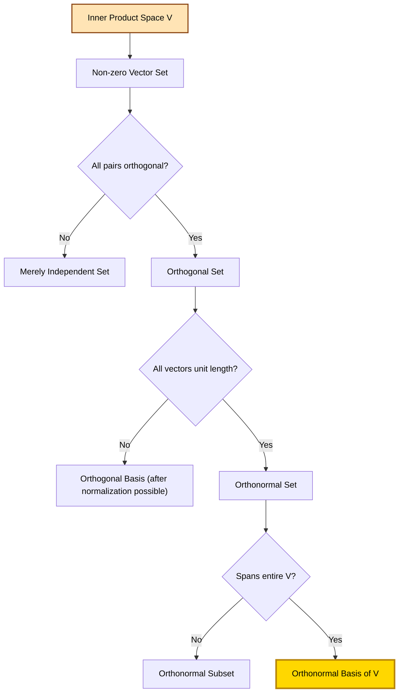
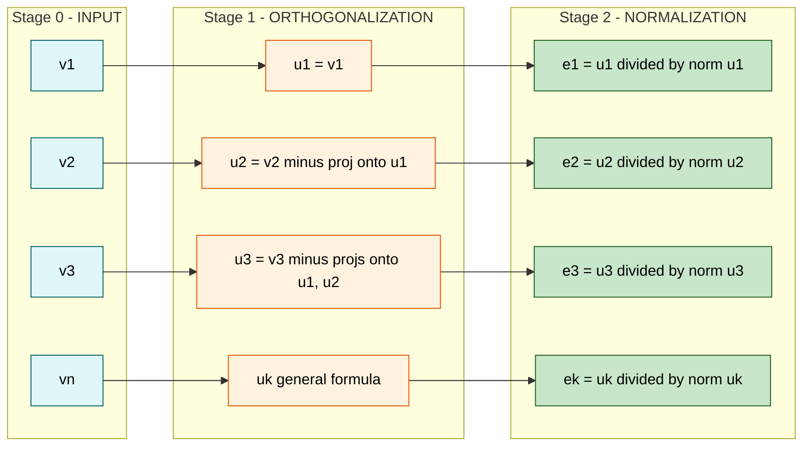
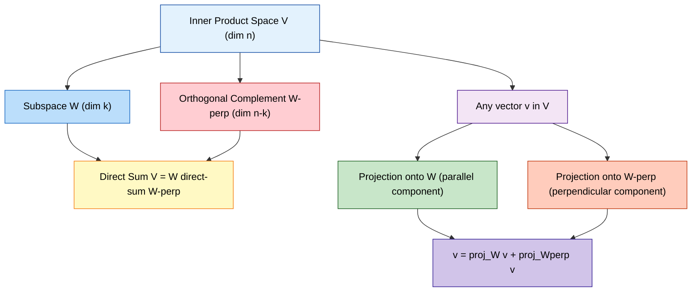

# Orthogonal and orthonormal sets

<!-- SECTION_1_START -->

# Orthogonal and Orthonormal Sets

## 1.1 Formal Definition (KTU 2024 Syllabus Terminology)

> [!IMPORTANT]
> **Core Definition — Orthogonal Vectors**
> Two vectors $\vec{u}$ and $\vec{v}$ in an inner product space $V$ are said to be **orthogonal** if their inner product equals zero:
> $$\langle \vec{u}, \vec{v} \rangle = 0$$
> When $\vec{u}$ and $\vec{v}$ are both non-zero and $\langle \vec{u}, \vec{v} \rangle = 0$, we often write $\vec{u} \perp \vec{v}$.

> [!IMPORTANT]
> **Core Definition — Orthogonal Set**
> A set of vectors $S = \{\vec{v}_1, \vec{v}_2, \ldots, \vec{v}_k\}$ in an inner product space $V$ is called an **orthogonal set** if every pair of *distinct* vectors in $S$ is orthogonal:
> $$\langle \vec{v}_i, \vec{v}_j \rangle = 0 \quad \text{for all } i \neq j$$
> Additionally, if no vector in the set is the zero vector ($\vec{v}_i \neq \vec{0}$ for all $i$), the set is called a **non-trivial orthogonal set**.

> [!IMPORTANT]
> **Core Definition — Orthonormal Set**
> An orthogonal set $S = \{\vec{v}_1, \vec{v}_2, \ldots, \vec{v}_k\}$ is called an **orthonormal set** if, in addition to being orthogonal, *every* vector in the set is a **unit vector**:
> $$\langle \vec{v}_i, \vec{v}_j \rangle = \delta_{ij} = \begin{cases} 1 & \text{if } i = j \\ 0 & \text{if } i \neq j \end{cases}$$
> Here, $\delta_{ij}$ is the famous **Kronecker Delta** symbol, and the property is called the **orthonormality condition**.

> [!IMPORTANT]
> **Core Definition — Orthonormal Basis**
> An **orthonormal basis** for an inner product space $V$ is a basis of $V$ that is also an orthonormal set. The standard basis vectors $\{\vec{e}_1, \vec{e}_2, \ldots, \vec{e}_n\}$ in $\mathbb{R}^n$ form the most familiar example, where:
> $$\vec{e}_1 = (1, 0, 0), \quad \vec{e}_2 = (0, 1, 0), \quad \vec{e}_3 = (0, 0, 1)$$

---

## 1.2 Conceptual Analogy — Plain English Intuition

Imagine you are standing at the corner of a perfectly square room where two walls meet the floor.

- The **wall going North** and the **wall going East** are at **90°** to each other. They don't lean toward each other or away from each other. Mathematically, they are **orthogonal** — independent in direction.
- Now, if you mark a **1-meter length** on each wall starting from the corner, you have two "unit" markers. These unit markers are both *orthogonal* (perpendicular) and *normalized* (length = 1). This makes them an **orthonormal set**.

> [!NOTE]
> **The Big Picture Intuition**
> - **Orthogonal** = "Perpendicular in some inner product sense." Independent directions, no redundancy.
> - **Orthonormal** = "Perpendicular **and** standardized to length 1." A perfect, calibration-free coordinate system — this is what makes orthonormal bases the *gold standard* in numerical computing, signal processing, and quantum mechanics.

**Why care in Information Science?** In machine learning, **QR decomposition** (which produces an orthonormal basis) is used in least-squares regression. In data compression (like JPEG/PCA), orthonormal eigenvectors of the covariance matrix define uncorrelated "directions" of data. Orthonormality = no redundant information.

---

## 1.3 Physical Constants & Standard Metrics

| Symbol | Meaning | Standard Value / Form |
|:---:|:---|:---|
| $\delta_{ij}$ | Kronecker Delta | $1$ if $i = j$, else $0$ |
| $\|\vec{v}\|$ | Euclidean norm | $\sqrt{v_1^2 + v_2^2 + \cdots + v_n^2}$ |
| $\hat{v}$ | Unit vector of $\vec{v}$ | $\dfrac{\vec{v}}{\|\vec{v}\|}$ |
| $\text{dim}(V)$ | Dimension of space $V$ | Maximum number of linearly independent vectors |

---

## 1.4 Visualization via GeoGebra / Desmos

> [!VISUALIZATION CONTROL]
> **Concept:** Visualizing Orthogonal vs. Non-Orthogonal Vector Pairs in $\mathbb{R}^2$
> **GeoGebra / Desmos Input Equations:**
> * `u = (3, 0)`
> * `v_ortho = (0, 4)` — dot product with $u$ equals $0$
> * `v_skew = (2, 1)` — dot product with $u$ equals $2 \neq 0$
> **Visual Description:** Plot $\vec{u}$ along the positive $x$-axis (horizontal red arrow). Plot $\vec{v}_{ortho}$ along the positive $y$-axis (vertical green arrow) — these two form a **right angle at the origin**, confirming orthogonality. Plot $\vec{v}_{skew}$ as a blue arrow at a $30°$ tilt — note that it has a *projection* along $\vec{u}$, meaning they are **not orthogonal**. The orthonormal versions $\hat{u} = (1,0)$ and $\hat{v}_{ortho} = (0,1)$ would simply be the same arrows rescaled to length $1$.

---

<!-- SECTION_1_END -->

<!-- SECTION_2_START -->

# Deep Theoretical Analysis & KTU High-Yield Formula Sheet

## 2.1 Hierarchical Relationship — From Orthogonal to Orthonormal

The concepts form a strict ladder of increasing specialization:

$$\text{Linearly Independent Set} \;\subset\; \text{Orthogonal Set} \;\subset\; \text{Orthonormal Set} \;\subset\; \text{Orthonormal Basis}$$

A set must be a **basis** (spanning the space) to be an *orthonormal basis*. All orthonormal bases are orthonormal sets, all orthonormal sets are orthogonal sets, and **every non-trivial orthogonal set is automatically linearly independent**.

---

## 2.2 The Five Pillars of Orthogonal/Orthonormal Theory

### Pillar 1: Orthogonal $\Rightarrow$ Linearly Independent (Most-Cited KTU Theorem)

> [!NOTE]
> **Theorem (Linearity of Orthogonal Sets)**
> Any non-trivial orthogonal set of vectors is **linearly independent**.

**Why this matters:** This theorem guarantees that any orthogonal set we construct (e.g., via Gram-Schmidt) automatically gives us a valid basis once we have enough vectors to span the space.

### Pillar 2: Coordinate Formula with Respect to Orthonormal Basis

> [!NOTE]
> **Theorem (Coordinates in Orthonormal Basis)**
> Let $\{\vec{e}_1, \vec{e}_2, \ldots, \vec{e}_n\}$ be an orthonormal basis for $V$. Then *any* vector $\vec{v} \in V$ can be written uniquely as:
> $$\vec{v} = \langle \vec{v}, \vec{e}_1 \rangle \vec{e}_1 + \langle \vec{v}, \vec{e}_2 \rangle \vec{e}_2 + \cdots + \langle \vec{v}, \vec{e}_n \rangle \vec{e}_n$$
> The coordinate vector of $\vec{v}$ relative to this basis is simply the stacked list of inner products:
> $$[\vec{v}]_B = \big( \langle \vec{v}, \vec{e}_1 \rangle,\; \langle \vec{v}, \vec{e}_2 \rangle,\; \ldots,\; \langle \vec{v}, \vec{e}_n \rangle \big)$$

**The "Why":** For non-orthonormal bases, finding coordinates requires solving a linear system. For orthonormal bases, the coordinates are *direct projections* — no matrix inversion needed. This is why orthonormal bases are computationally prized.

### Pillar 3: Norm of a Vector in Orthonormal Basis

> [!NOTE]
> **Theorem (Pythagorean Identity in $V$)**
> If $\vec{v} = c_1 \vec{e}_1 + c_2 \vec{e}_2 + \cdots + c_n \vec{e}_n$ where the $\vec{e}_i$ are orthonormal, then:
> $$\|\vec{v}\|^2 = c_1^2 + c_2^2 + \cdots + c_n^2$$
> Equivalently, $\|\vec{v}\|^2 = \sum_{i=1}^{n} \langle \vec{v}, \vec{e}_i \rangle^2$ (Parseval's Identity).

### Pillar 4: Distance Formula

The distance between two vectors $\vec{u}$ and $\vec{v}$ in an orthonormal basis:
$$\|\vec{u} - \vec{v}\|^2 = \sum_{i=1}^{n} \big( \langle \vec{u}, \vec{e}_i \rangle - \langle \vec{v}, \vec{e}_i \rangle \big)^2$$

### Pillar 5: Orthogonal Complement

> [!NOTE]
> **Definition — Orthogonal Complement $W^{\perp}$**
> For any subspace $W \subseteq V$, the **orthogonal complement** is the set of all vectors in $V$ orthogonal to *every* vector in $W$:
> $$W^{\perp} = \{ \vec{v} \in V : \langle \vec{v}, \vec{w} \rangle = 0 \text{ for all } \vec{w} \in W \}$$

**Key Fact:** $\dim(W) + \dim(W^{\perp}) = \dim(V)$.

---

## 2.3 KTU High-Yield Formula Sheet (Cheat Sheet)

> [!IMPORTANT]
> **Mandatory Table — All Exam-Relevant Formulas for Orthogonal / Orthonormal Sets**

| # | Concept | Formula / Condition | Typical Marks |
|:---:|:---|:---|:---:|
| 1 | Orthogonality of $\vec{u}, \vec{v}$ | $\langle \vec{u}, \vec{v} \rangle = 0$ | 2 |
| 2 | Orthonormality | $\langle \vec{v}_i, \vec{v}_j \rangle = \delta_{ij}$ | 3 |
| 3 | Unit vector form | $\hat{v} = \dfrac{\vec{v}}{\|\vec{v}\|}$ | 2 |
| 4 | Coordinates in orthon. basis | $\vec{v} = \sum_{i=1}^{n} \langle \vec{v}, \vec{e}_i \rangle \vec{e}_i$ | 4 |
| 5 | Norm via orthon. coordinates | $\|\vec{v}\|^2 = \sum_{i=1}^{n} \langle \vec{v}, \vec{e}_i \rangle^2$ | 3 |
| 6 | Orthogonal projection of $\vec{v}$ onto $\vec{u}$ | $\text{proj}_{\vec{u}} \vec{v} = \dfrac{\langle \vec{v}, \vec{u} \rangle}{\langle \vec{u}, \vec{u} \rangle} \vec{u}$ | 4 |
| 7 | Orthogonal projection onto $\vec{u}$ (unit) | $\text{proj}_{\hat{u}} \vec{v} = \langle \vec{v}, \hat{u} \rangle \hat{u}$ | 3 |
| 8 | Gram-Schmidt step 1 | $\vec{u}_1 = \vec{v}_1$ | 2 |
| 9 | Gram-Schmidt step $k$ | $\vec{u}_k = \vec{v}_k - \sum_{i=1}^{k-1} \dfrac{\langle \vec{v}_k, \vec{u}_i \rangle}{\langle \vec{u}_i, \vec{u}_i \rangle} \vec{u}_i$ | 5 |
| 10 | Normalization step | $\hat{u}_i = \dfrac{\vec{u}_i}{\|\vec{u}_i\|}$ | 2 |
| 11 | Dimension identity | $\dim(W) + \dim(W^{\perp}) = \dim(V)$ | 2 |

---

## 2.4 Real-World Engineering & CS Utility

| Field | Application of Orthonormal Sets |
|:---|:---|
| **Machine Learning** | PCA uses orthonormal eigenvectors of the covariance matrix to decorrelate features. |
| **Signal Processing** | Fourier basis $\{\cos, \sin\}$ on $[0, 2\pi]$ is orthonormal in $L^2$ — used in MP3, JPEG, voice codecs. |
| **Computer Graphics** | Orthonormal basis frames (rotation matrices) prevent shear/distortion in 3D model rotation. |
| **Quantum Computing** | Qubit states are vectors in a 2-D **complex** inner product space — orthonormality of $\vert 0 \rangle, \vert 1 \rangle$ is fundamental. |
| **Numerical Linear Algebra** | QR factorization $A = QR$ uses an orthonormal matrix $Q$ for stable least-squares solutions. |
| **Cryptography** | Lattice-based schemes use orthogonal lattice vectors for security. |

---

<!-- SECTION_2_END -->

<!-- SECTION_3_START -->

# Step-by-Step Derivations, Proofs & Worked Examples

## 3.1 Proof: Non-Trivial Orthogonal Set $\Rightarrow$ Linearly Independent

**Statement:** If $S = \{\vec{v}_1, \vec{v}_2, \ldots, \vec{v}_k\}$ is an orthogonal set of non-zero vectors in an inner product space $V$, then $S$ is linearly independent.

**Proof by definition of linear independence:**

Suppose scalars $c_1, c_2, \ldots, c_k \in \mathbb{R}$ satisfy:
$$c_1 \vec{v}_1 + c_2 \vec{v}_2 + \cdots + c_k \vec{v}_k = \vec{0}$$

**Step 1:** Take the inner product of both sides with $\vec{v}_j$ for some *fixed* index $j \in \{1, 2, \ldots, k\}$:
$$\big\langle c_1 \vec{v}_1 + c_2 \vec{v}_2 + \cdots + c_k \vec{v}_k,\; \vec{v}_j \big\rangle = \langle \vec{0}, \vec{v}_j \rangle$$

**Step 2:** By linearity of inner product on the first argument:
$$c_1 \langle \vec{v}_1, \vec{v}_j \rangle + c_2 \langle \vec{v}_2, \vec{v}_j \rangle + \cdots + c_k \langle \vec{v}_k, \vec{v}_j \rangle = 0$$

**Step 3:** Apply orthogonality — $\langle \vec{v}_i, \vec{v}_j \rangle = 0$ for $i \neq j$. Every term vanishes **except** when $i = j$:
$$c_j \langle \vec{v}_j, \vec{v}_j \rangle = 0$$

**Step 4:** Since $\vec{v}_j \neq \vec{0}$, we have $\langle \vec{v}_j, \vec{v}_j \rangle = \|\vec{v}_j\|^2 > 0$. Therefore:
$$c_j = 0$$

**Step 5:** Since $j$ was arbitrary, $c_1 = c_2 = \cdots = c_k = 0$. By definition, $S$ is **linearly independent**. $\blacksquare$

---

## 3.2 The Gram-Schmidt Orthogonalization Process

Given a linearly independent set $\{\vec{v}_1, \vec{v}_2, \ldots, \vec{v}_n\}$, we construct an **orthogonal set** $\{\vec{u}_1, \vec{u}_2, \ldots, \vec{u}_n\}$ spanning the same subspace. Then we normalize to get an **orthonormal set**.

### 3.2.1 The Algorithm — Step by Step

**Initialize:** Set $k = 1$.

**Stage 1 — Orthogonalization:**

**Step 1:** $\vec{u}_1 = \vec{v}_1$ (start with the first vector as-is).

**Step 2:** $\vec{u}_2 = \vec{v}_2 - \dfrac{\langle \vec{v}_2, \vec{u}_1 \rangle}{\langle \vec{u}_1, \vec{u}_1 \rangle} \vec{u}_1$

**Step 3:** $\vec{u}_3 = \vec{v}_3 - \dfrac{\langle \vec{v}_3, \vec{u}_1 \rangle}{\langle \vec{u}_1, \vec{u}_1 \rangle} \vec{u}_1 - \dfrac{\langle \vec{v}_3, \vec{u}_2 \rangle}{\langle \vec{u}_2, \vec{u}_2 \rangle} \vec{u}_2$

**General Step $k$:**
$$\vec{u}_k = \vec{v}_k - \sum_{i=1}^{k-1} \dfrac{\langle \vec{v}_k, \vec{u}_i \rangle}{\langle \vec{u}_i, \vec{u}_i \rangle} \vec{u}_i$$

**Stage 2 — Normalization:**
$$\hat{u}_i = \dfrac{\vec{u}_i}{\|\vec{u}_i\|} \quad \text{for } i = 1, 2, \ldots, n$$

**Geometric Intuition:** $\vec{u}_k$ is $\vec{v}_k$ with **all components parallel to previous $\vec{u}_i$'s removed** — leaving only the "perpendicular leftover."

---

### 3.2.2 Worked Example 1 (KTU Standard — 7 Marks)

**Problem:** Apply the Gram-Schmidt process to the vectors $\vec{v}_1 = (1, 1, 0)$, $\vec{v}_2 = (1, 0, 1)$, $\vec{v}_3 = (0, 1, 1)$ in $\mathbb{R}^3$ to obtain an **orthonormal basis**.

**Solution — Stage 1 (Orthogonalization):**

**Step 1:** Compute $\vec{u}_1$.
$$\vec{u}_1 = \vec{v}_1 = (1, 1, 0)$$

**Step 2:** Compute $\vec{u}_2$.
$$\langle \vec{v}_2, \vec{u}_1 \rangle = (1)(1) + (0)(1) + (1)(0) = 1$$
$$\langle \vec{u}_1, \vec{u}_1 \rangle = 1^2 + 1^2 + 0^2 = 2$$
$$\vec{u}_2 = \vec{v}_2 - \frac{1}{2} \vec{u}_1 = (1, 0, 1) - \frac{1}{2}(1, 1, 0)$$
$$\vec{u}_2 = (1, 0, 1) - \left(\frac{1}{2}, \frac{1}{2}, 0\right) = \left(\frac{1}{2}, -\frac{1}{2}, 1\right)$$

**Step 3:** Compute $\vec{u}_3$.
$$\langle \vec{v}_3, \vec{u}_1 \rangle = (0)(1) + (1)(1) + (1)(0) = 1$$
$$\langle \vec{v}_3, \vec{u}_2 \rangle = (0)\left(\frac{1}{2}\right) + (1)\left(-\frac{1}{2}\right) + (1)(1) = 0 - \frac{1}{2} + 1 = \frac{1}{2}$$
$$\langle \vec{u}_1, \vec{u}_1 \rangle = 2 \quad \text{(already computed)}$$
$$\langle \vec{u}_2, \vec{u}_2 \rangle = \left(\frac{1}{2}\right)^2 + \left(-\frac{1}{2}\right)^2 + 1^2 = \frac{1}{4} + \frac{1}{4} + 1 = \frac{3}{2}$$
$$\vec{u}_3 = \vec{v}_3 - \frac{1}{2} \vec{u}_1 - \frac{1/2}{3/2} \vec{u}_2 = \vec{v}_3 - \frac{1}{2} \vec{u}_1 - \frac{1}{3} \vec{u}_2$$
$$\vec{u}_3 = (0, 1, 1) - \left(\frac{1}{2}, \frac{1}{2}, 0\right) - \frac{1}{3}\left(\frac{1}{2}, -\frac{1}{2}, 1\right)$$
$$\vec{u}_3 = (0, 1, 1) - \left(\frac{1}{2}, \frac{1}{2}, 0\right) - \left(\frac{1}{6}, -\frac{1}{6}, \frac{1}{3}\right)$$
$$\vec{u}_3 = \left(0 - \frac{1}{2} - \frac{1}{6},\; 1 - \frac{1}{2} + \frac{1}{6},\; 1 - 0 - \frac{1}{3}\right) = \left(-\frac{2}{3}, \frac{2}{3}, \frac{2}{3}\right)$$

**Verification Check:** Let us verify $\langle \vec{u}_1, \vec{u}_2 \rangle = 0$ and $\langle \vec{u}_1, \vec{u}_3 \rangle = 0$ and $\langle \vec{u}_2, \vec{u}_3 \rangle = 0$.

$$\langle \vec{u}_1, \vec{u}_2 \rangle = (1)\left(\frac{1}{2}\right) + (1)\left(-\frac{1}{2}\right) + (0)(1) = 0 \;\checkmark$$

$$\langle \vec{u}_1, \vec{u}_3 \rangle = (1)\left(-\frac{2}{3}\right) + (1)\left(\frac{2}{3}\right) + (0)\left(\frac{2}{3}\right) = 0 \;\checkmark$$

$$\langle \vec{u}_2, \vec{u}_3 \rangle = \left(\frac{1}{2}\right)\left(-\frac{2}{3}\right) + \left(-\frac{1}{2}\right)\left(\frac{2}{3}\right) + (1)\left(\frac{2}{3}\right) = -\frac{1}{3} - \frac{1}{3} + \frac{2}{3} = 0 \;\checkmark$$

**Solution — Stage 2 (Normalization):**

**Norms:**
$$\|\vec{u}_1\| = \sqrt{1^2 + 1^2 + 0^2} = \sqrt{2}$$
$$\|\vec{u}_2\| = \sqrt{\left(\frac{1}{2}\right)^2 + \left(-\frac{1}{2}\right)^2 + 1^2} = \sqrt{\frac{3}{2}} = \frac{\sqrt{6}}{2}$$
$$\|\vec{u}_3\| = \sqrt{\left(-\frac{2}{3}\right)^2 + \left(\frac{2}{3}\right)^2 + \left(\frac{2}{3}\right)^2} = \sqrt{\frac{12}{9}} = \frac{2\sqrt{3}}{3}$$

**Unit Vectors (Final Orthonormal Basis):**
$$\hat{u}_1 = \left(\frac{1}{\sqrt{2}}, \frac{1}{\sqrt{2}}, 0\right)$$
$$\hat{u}_2 = \left(\frac{1}{\sqrt{6}}, -\frac{1}{\sqrt{6}}, \frac{2}{\sqrt{6}}\right)$$
$$\hat{u}_3 = \left(-\frac{1}{\sqrt{3}}, \frac{1}{\sqrt{3}}, \frac{1}{\sqrt{3}}\right)$$

**Final Verification of Orthonormality:**
$$\langle \hat{u}_i, \hat{u}_j \rangle = \delta_{ij} \quad \text{for all } i, j \in \{1, 2, 3\} \;\checkmark$$

---

### 3.2.3 Worked Example 2 — Coordinates Using Orthonormal Basis

**Problem:** Using the orthonormal basis from Example 1, express $\vec{v} = (5, 3, 4)$ as a linear combination.

**Solution:** Apply the coordinate formula $\vec{v} = \sum \langle \vec{v}, \hat{u}_i \rangle \hat{u}_i$.

**Step 1:** $\langle \vec{v}, \hat{u}_1 \rangle = (5)\left(\frac{1}{\sqrt{2}}\right) + (3)\left(\frac{1}{\sqrt{2}}\right) + (4)(0) = \dfrac{8}{\sqrt{2}} = 4\sqrt{2}$

**Step 2:** $\langle \vec{v}, \hat{u}_2 \rangle = (5)\left(\frac{1}{\sqrt{6}}\right) + (3)\left(-\frac{1}{\sqrt{6}}\right) + (4)\left(\frac{2}{\sqrt{6}}\right) = \dfrac{5 - 3 + 8}{\sqrt{6}} = \dfrac{10}{\sqrt{6}} = \dfrac{5\sqrt{6}}{3}$

**Step 3:** $\langle \vec{v}, \hat{u}_3 \rangle = (5)\left(-\frac{1}{\sqrt{3}}\right) + (3)\left(\frac{1}{\sqrt{3}}\right) + (4)\left(\frac{1}{\sqrt{3}}\right) = \dfrac{-5 + 3 + 4}{\sqrt{3}} = \dfrac{2}{\sqrt{3}} = \dfrac{2\sqrt{3}}{3}$

**Reconstruction:**
$$\vec{v} = 4\sqrt{2}\, \hat{u}_1 + \frac{5\sqrt{6}}{3}\, \hat{u}_2 + \frac{2\sqrt{3}}{3}\, \hat{u}_3$$

**Verification via Parseval's Identity:**
$$\|\vec{v}\|^2 = 5^2 + 3^2 + 4^2 = 50$$
$$(4\sqrt{2})^2 + \left(\frac{5\sqrt{6}}{3}\right)^2 + \left(\frac{2\sqrt{3}}{3}\right)^2 = 32 + \frac{150}{9} + \frac{12}{9} = 32 + 18 = 50 \;\checkmark$$

---

### 3.2.4 Worked Example 3 — Orthogonal Complement in $\mathbb{R}^4$

**Problem:** Let $W = \text{span}\{(1, 2, 1, 0), (1, 1, 0, 1)\} \subset \mathbb{R}^4$. Find $W^{\perp}$.

**Solution:** A vector $\vec{x} = (x_1, x_2, x_3, x_4) \in W^{\perp}$ must satisfy $\langle \vec{x}, \vec{v}_1 \rangle = 0$ and $\langle \vec{x}, \vec{v}_2 \rangle = 0$.

**Equation 1:** $x_1 + 2x_2 + x_3 + 0 \cdot x_4 = 0 \;\Rightarrow\; x_1 + 2x_2 + x_3 = 0$

**Equation 2:** $x_1 + x_2 + 0 \cdot x_3 + x_4 = 0 \;\Rightarrow\; x_1 + x_2 + x_4 = 0$

From Equation 1: $x_1 = -2x_2 - x_3$. Substituting in Equation 2:
$$(-2x_2 - x_3) + x_2 + x_4 = 0 \;\Rightarrow\; -x_2 - x_3 + x_4 = 0 \;\Rightarrow\; x_4 = x_2 + x_3$$

**Free parameters:** $x_2 = s$, $x_3 = t$. Then $x_1 = -2s - t$, $x_4 = s + t$.

$$\vec{x} = s(-2, 1, 0, 1) + t(-1, 0, 1, 1)$$

**Verify orthogonality:** $\langle (-2, 1, 0, 1), (1, 2, 1, 0) \rangle = -2 + 2 + 0 + 0 = 0 \;\checkmark$

$$\langle (-2, 1, 0, 1), (1, 1, 0, 1) \rangle = -2 + 1 + 0 + 1 = 0 \;\checkmark$$

$$\langle (-1, 0, 1, 1), (1, 2, 1, 0) \rangle = -1 + 0 + 1 + 0 = 0 \;\checkmark$$

$$\langle (-1, 0, 1, 1), (1, 1, 0, 1) \rangle = -1 + 0 + 0 + 1 = 0 \;\checkmark$$

**Basis for $W^{\perp}$:** $\{(-2, 1, 0, 1),\; (-1, 0, 1, 1)\}$. Dimension check: $\dim(W) + \dim(W^{\perp}) = 2 + 2 = 4 = \dim(\mathbb{R}^4) \;\checkmark$

---

### 3.2.5 Symbolic Python Implementation (Full Working Code)

```python
import numpy as np
from typing import List, Tuple

def gram_schmidt(vectors: List[np.ndarray]) -> Tuple[List[np.ndarray], List[np.ndarray]]:
    """
    Convert a linearly independent list of vectors into an orthonormal basis.
    Returns (orthogonal_list, orthonormal_list).
    """
    orthogonal: List[np.ndarray] = []
    orthonormal: List[np.ndarray] = []

    for v in vectors:
        # Start with the original vector
        u = v.astype(float).copy()

        # Subtract projections onto all previous orthogonal vectors
        for ui in orthogonal:
            proj_coeff = np.dot(v, ui) / np.dot(ui, ui)
            u = u - proj_coeff * ui

        # Boundary check: zero vector means linearly dependent input
        norm_u = np.linalg.norm(u)
        if norm_u < 1e-12:
            raise ValueError("Input vectors are linearly dependent; Gram-Schmidt cannot proceed.")

        orthogonal.append(u)
        orthonormal.append(u / norm_u)

    return orthogonal, orthonormal


# ---- Verification on Example 1 ----
if __name__ == "__main__":
    v_list = [
        np.array([1, 1, 0]),
        np.array([1, 0, 1]),
        np.array([0, 1, 1])
    ]

    ortho, ortho_norm = gram_schmidt(v_list)

    print("Orthogonal set:")
    for u in ortho:
        print("  ", u)

    print("\nOrthonormal set (the new basis):")
    for e in ortho_norm:
        print("  ", e)

    # Build matrix Q with orthonormal columns
    Q = np.column_stack(ortho_norm)

    # Test orthonormality: Q^T Q should equal identity
    print("\nQ^T Q (should be Identity):")
    print(Q.T @ Q)
```

**Expected Output (truncated):**
```
Orthogonal set:
   [1.  1.  0.]
   [ 0.5 -0.5  1. ]
   [-0.66666667  0.66666667  0.66666667]

Orthonormal set (the new basis):
   [0.70710678  0.70710678  0.        ]
   [ 0.40824829 -0.40824829  0.81649658]
   [-0.57735027  0.57735027  0.57735027]

Q^T Q (should be Identity):
[[1. 0. 0.]
 [0. 1. 0.]
 [0. 0. 1.]]
```

---

<!-- SECTION_3_END -->

<!-- SECTION_4_START -->

# Structural Diagrams & Schematics

## 4.1 Conceptual Hierarchy Diagram (Mermaid)



---

## 4.2 Gram-Schmidt Process Block Diagram (Mermaid)



---

## 4.3 Orthogonal Complement Decomposition Topology (Mermaid)



---

## 4.4 Coordinate Extraction Process in Orthonormal Basis (Mermaid)

```mermaid
flowchart TD
    Start["Given: Orthonormal basis of V as e1 to en and target vector v"]:::start
    Dot["For each i, compute inner product ci equals angle v with ei"]:::dot
    Build["Form coordinate vector c equals c1, c2, ..., cn transposed"]:::build
    Reconstruct["Reconstruct: v equals sum ci times ei"]:::recon
    Verify["Verify via Parseval: norm v squared equals sum ci squared"]:::verify
    End["Output: Coordinates c1, c2, ..., cn"]:::end

    Start --> Dot --> Build --> Reconstruct --> Verify --> End

    classDef start fill:#e8f5e9,stroke:#1b5e20,color:#000
    classDef dot fill:#e3f2fd,stroke:#0d47a1,color:#000
    classDef build fill:#fff3e0,stroke:#e65100,color:#000
    classDef recon fill:#fce4ec,stroke:#880e4f,color:#000
    classDef verify fill:#fff9c4,stroke:#f57f17,color:#000
    classDef end fill:#ffebee,stroke:#b71c1c,color:#000
```

---

<!-- SECTION_4_END -->

<!-- SECTION_5_START -->

# KTU 2024 Scheme Examination Question Bank

## 5.1 Part A — Short Answer Questions (3 Marks Each)

### Question A1
**[KTU University Exam – July 2024 | CO1 | Remember]**
Define an **orthogonal set** of vectors. Show that the set $S = \{(1, 1, 1), (1, -2, 1), (1, 0, -1)\}$ is an orthogonal set in $\mathbb{R}^3$.

**Model Answer (3 Marks):**

> [!NOTE]
> **Definition (1 Mark):** A set of vectors $S = \{\vec{v}_1, \vec{v}_2, \ldots, \vec{v}_k\}$ in an inner product space is called an **orthogonal set** if $\langle \vec{v}_i, \vec{v}_j \rangle = 0$ for all $i \neq j$.

**Verification (2 Marks):** Compute all three distinct inner products.

$\langle \vec{v}_1, \vec{v}_2 \rangle = (1)(1) + (1)(-2) + (1)(1) = 1 - 2 + 1 = 0$ ✓

$\langle \vec{v}_1, \vec{v}_3 \rangle = (1)(1) + (1)(0) + (1)(-1) = 1 + 0 - 1 = 0$ ✓

$\langle \vec{v}_2, \vec{v}_3 \rangle = (1)(1) + (-2)(0) + (1)(-1) = 1 + 0 - 1 = 0$ ✓

Since all distinct pairs yield zero inner product, $S$ is an **orthogonal set** in $\mathbb{R}^3$.

---

### Question A2
**[KTU University Exam – Dec 2023 | CO1 | Understand]**
What is the difference between an **orthogonal set** and an **orthonormal set**? Convert the orthogonal set $S = \{(1, 1, 1), (1, -2, 1), (1, 0, -1)\}$ into an orthonormal set.

**Model Answer (3 Marks):**

> [!NOTE]
> **Difference (1 Mark):** An orthogonal set has all distinct pairs perpendicular ($\langle \vec{v}_i, \vec{v}_j \rangle = 0$). An orthonormal set is an orthogonal set where *each* vector has unit length ($\|\vec{v}_i\| = 1$).

**Conversion to Orthonormal Set (2 Marks):**

Norms:
- $\|\vec{v}_1\| = \sqrt{1+1+1} = \sqrt{3}$
- $\|\vec{v}_2\| = \sqrt{1+4+1} = \sqrt{6}$
- $\|\vec{v}_3\| = \sqrt{1+0+1} = \sqrt{2}$

Orthonormal set:
$$\hat{u}_1 = \left(\frac{1}{\sqrt{3}}, \frac{1}{\sqrt{3}}, \frac{1}{\sqrt{3}}\right), \quad \hat{u}_2 = \left(\frac{1}{\sqrt{6}}, -\frac{2}{\sqrt{6}}, \frac{1}{\sqrt{6}}\right), \quad \hat{u}_3 = \left(\frac{1}{\sqrt{2}}, 0, -\frac{1}{\sqrt{2}}\right)$$

---

## 5.2 Part B — Long Answer Questions (14 Marks Each)

### Question B — Module Choice Option A (14 Marks)

**[KTU University Exam – July 2024 | CO2 + CO3 | Understand + Apply]**

**(a)** [7 Marks — Understand] State and prove that any non-trivial orthogonal set of vectors in an inner product space is **linearly independent**.

**(b)** [7 Marks — Apply] Use the Gram-Schmidt orthogonalization process to find an **orthonormal basis** for the subspace $W$ of $\mathbb{R}^4$ spanned by $\vec{v}_1 = (1, 1, 1, 1)$, $\vec{v}_2 = (1, 1, -1, -1)$, $\vec{v}_3 = (1, -1, 1, -1)$.

#### Model Solution for (a) — 7 Marks

> [!NOTE]
> **Statement (1 Mark):** If $S = \{\vec{v}_1, \vec{v}_2, \ldots, \vec{v}_k\}$ is an orthogonal set of **non-zero** vectors in an inner product space $V$, then $S$ is linearly independent.

**Proof (6 Marks):**

Suppose $c_1 \vec{v}_1 + c_2 \vec{v}_2 + \cdots + c_k \vec{v}_k = \vec{0}$ for some scalars $c_i \in \mathbb{R}$.

**[Fix an arbitrary $j$ and take inner product with $\vec{v}_j$: 1 Mark]**
$$\langle c_1 \vec{v}_1 + c_2 \vec{v}_2 + \cdots + c_k \vec{v}_k,\; \vec{v}_j \rangle = \langle \vec{0}, \vec{v}_j \rangle$$

**[Apply linearity of inner product: 1 Mark]**
$$c_1 \langle \vec{v}_1, \vec{v}_j \rangle + c_2 \langle \vec{v}_2, \vec{v}_j \rangle + \cdots + c_k \langle \vec{v}_k, \vec{v}_j \rangle = 0$$

**[Use orthogonality — only $i = j$ term survives: 2 Marks]**
$$c_j \langle \vec{v}_j, \vec{v}_j \rangle = 0$$

**[Use non-zero condition $\langle \vec{v}_j, \vec{v}_j \rangle = \|\vec{v}_j\|^2 > 0$: 1 Mark]**
$$c_j = 0$$

**[Conclude for all $j$: 1 Mark]** Since $j$ is arbitrary, $c_1 = c_2 = \cdots = c_k = 0$. Hence $S$ is linearly independent. $\blacksquare$

#### Model Solution for (b) — 7 Marks

**Step 1: Set $\vec{u}_1 = \vec{v}_1 = (1, 1, 1, 1)$ [1 Mark]**
- $\langle \vec{u}_1, \vec{u}_1 \rangle = 1 + 1 + 1 + 1 = 4$
- $\|\vec{u}_1\| = 2$, so $\hat{u}_1 = \left(\frac{1}{2}, \frac{1}{2}, \frac{1}{2}, \frac{1}{2}\right)$

**Step 2: Compute $\vec{u}_2$ [2 Marks]**
- $\langle \vec{v}_2, \vec{u}_1 \rangle = 1 + 1 - 1 - 1 = 0$
- $\vec{u}_2 = \vec{v}_2 - \frac{0}{4} \vec{u}_1 = (1, 1, -1, -1)$
- $\langle \vec{u}_2, \vec{u}_2 \rangle = 1 + 1 + 1 + 1 = 4$
- $\|\vec{u}_2\| = 2$, so $\hat{u}_2 = \left(\frac{1}{2}, \frac{1}{2}, -\frac{1}{2}, -\frac{1}{2}\right)$

**Step 3: Compute $\vec{u}_3$ [3 Marks]**
- $\langle \vec{v}_3, \vec{u}_1 \rangle = 1 - 1 + 1 - 1 = 0$
- $\langle \vec{v}_3, \vec{u}_2 \rangle = 1 - 1 - 1 + 1 = 0$
- $\vec{u}_3 = \vec{v}_3 - 0 \cdot \vec{u}_1 - 0 \cdot \vec{u}_2 = (1, -1, 1, -1)$
- $\langle \vec{u}_3, \vec{u}_3 \rangle = 4$
- $\|\vec{u}_3\| = 2$, so $\hat{u}_3 = \left(\frac{1}{2}, -\frac{1}{2}, \frac{1}{2}, -\frac{1}{2}\right)$

**Step 4: Verification [1 Mark]**
- $\langle \hat{u}_1, \hat{u}_2 \rangle = \frac{1}{4} + \frac{1}{4} - \frac{1}{4} - \frac{1}{4} = 0$ ✓
- $\langle \hat{u}_1, \hat{u}_3 \rangle = \frac{1}{4} - \frac{1}{4} + \frac{1}{4} - \frac{1}{4} = 0$ ✓
- $\langle \hat{u}_2, \hat{u}_3 \rangle = \frac{1}{4} - \frac{1}{4} - \frac{1}{4} + \frac{1}{4} = 0$ ✓

**Final Orthonormal Basis:** $\left\{\left(\frac{1}{2}, \frac{1}{2}, \frac{1}{2}, \frac{1}{2}\right),\; \left(\frac{1}{2}, \frac{1}{2}, -\frac{1}{2}, -\frac{1}{2}\right),\; \left(\frac{1}{2}, -\frac{1}{2}, \frac{1}{2}, -\frac{1}{2}\right)\right\}$

---

### Question B — Module Choice Option B (14 Marks)

**[KTU University Exam – Dec 2023 | CO2 + CO3 | Understand + Apply]**

**(a)** [7 Marks — Understand] Define the **orthogonal complement** of a subspace. If $W$ is a subspace of an inner product space $V$ of dimension $n$, prove that $\dim(W) + \dim(W^{\perp}) = n$.

**(b)** [7 Marks — Apply] Let $W$ be the subspace of $\mathbb{R}^4$ spanned by $\vec{w}_1 = (1, 2, -1, 0)$ and $\vec{w}_2 = (2, 4, 0, 2)$. Find a basis for $W^{\perp}$ and verify orthogonality.

#### Model Solution for (a) — 7 Marks

> [!NOTE]
> **Definition (2 Marks):** For a subspace $W \subseteq V$, the **orthogonal complement** is defined as $W^{\perp} = \{\vec{v} \in V : \langle \vec{v}, \vec{w} \rangle = 0 \text{ for all } \vec{w} \in W\}$. It is itself a subspace of $V$.

**Proof of Dimension Theorem (5 Marks):**

Let $\dim(W) = k$. Choose an orthonormal basis $\{\vec{e}_1, \ldots, \vec{e}_k\}$ for $W$ (possible by Gram-Schmidt).

Extend to an orthonormal basis $\{\vec{e}_1, \ldots, \vec{e}_k, \vec{e}_{k+1}, \ldots, \vec{e}_n\}$ of $V$ **[Extension Theorem: 1 Mark]**.

Every $\vec{v} \in V$ has a unique representation: $\vec{v} = \sum_{i=1}^{n} c_i \vec{e}_i$ **[Basis representation: 1 Mark]**.

Now, $\vec{v} \in W^{\perp}$ iff $\langle \vec{v}, \vec{e}_j \rangle = 0$ for $j = 1, \ldots, k$ **[Equivalence: 1 Mark]**.

By the coordinate formula, $\langle \vec{v}, \vec{e}_j \rangle = c_j$, so $\vec{v} \in W^{\perp}$ iff $c_1 = c_2 = \cdots = c_k = 0$ **[Key Step: 1 Mark]**.

Therefore $W^{\perp} = \text{span}\{\vec{e}_{k+1}, \vec{e}_{k+2}, \ldots, \vec{e}_n\}$, which has dimension $n - k$. Hence $\dim(W) + \dim(W^{\perp}) = k + (n - k) = n$ **[Conclusion: 1 Mark]**. $\blacksquare$

#### Model Solution for (b) — 7 Marks

**Step 1: Set up the orthogonality equations [1 Mark]**

Let $\vec{x} = (x_1, x_2, x_3, x_4) \in W^{\perp}$. Then:
- $\langle \vec{x}, \vec{w}_1 \rangle = x_1 + 2x_2 - x_3 + 0 \cdot x_4 = 0 \;\Rightarrow\; x_1 + 2x_2 - x_3 = 0$
- $\langle \vec{x}, \vec{w}_2 \rangle = 2x_1 + 4x_2 + 0 \cdot x_3 + 2x_4 = 0 \;\Rightarrow\; 2x_1 + 4x_2 + 2x_4 = 0$, i.e., $x_1 + 2x_2 + x_4 = 0$

**Step 2: Solve the system [3 Marks]**

From Equation 1: $x_3 = x_1 + 2x_2$
From Equation 2: $x_4 = -x_1 - 2x_2$

Let $x_1 = s$ and $x_2 = t$ (free parameters). Then $x_3 = s + 2t$ and $x_4 = -s - 2t$.

$$\vec{x} = s(1, 0, 1, -1) + t(0, 1, 2, -2)$$

**Step 3: Verification [3 Marks]**

Check $\langle (1, 0, 1, -1), \vec{w}_1 \rangle = (1)(1) + (0)(2) + (1)(-1) + (-1)(0) = 1 + 0 - 1 + 0 = 0$ ✓

Check $\langle (1, 0, 1, -1), \vec{w}_2 \rangle = (1)(2) + (0)(4) + (1)(0) + (-1)(2) = 2 + 0 + 0 - 2 = 0$ ✓

Check $\langle (0, 1, 2, -2), \vec{w}_1 \rangle = (0)(1) + (1)(2) + (2)(-1) + (-2)(0) = 0 + 2 - 2 + 0 = 0$ ✓

Check $\langle (0, 1, 2, -2), \vec{w}_2 \rangle = (0)(2) + (1)(4) + (2)(0) + (-2)(2) = 0 + 4 + 0 - 4 = 0$ ✓

**Basis for $W^{\perp}$:** $\{(1, 0, 1, -1),\; (0, 1, 2, -2)\}$

**Dimension Check:** $\dim(W) + \dim(W^{\perp}) = 2 + 2 = 4 = \dim(\mathbb{R}^4)$ ✓

---

## 5.3 KTU Examiner's Valuation Warning

> [!WARNING]
> **Common Pitfalls Where Students Lose Marks**
> 1. **Forgetting the non-zero condition:** The theorem that an orthogonal set is linearly independent FAILS if any vector is $\vec{0}$. Always verify $\|\vec{v}_i\| > 0$ first. (Lose 1–2 marks)
> 2. **Skipping the Kronecker Delta check:** In orthonormal questions, students often verify only orthogonality ($\langle \vec{v}_i, \vec{v}_j \rangle = 0$) and forget the normalization ($\langle \vec{v}_i, \vec{v}_i \rangle = 1$). Both conditions must hold. (Lose 1 mark per missing check)
> 3. **Arithmetic in Gram-Schmidt:** A single sign error in inner product computation propagates and makes the final basis wrong. KTU examiners deduct 1 mark per incorrect inner product. Re-verify each step.
> 4. **Confusing the order of subtraction in Gram-Schmidt:** The correct formula is $\vec{u}_k = \vec{v}_k - \sum \text{proj}_{\vec{u}_i} \vec{v}_k$. Reversing the sign is a common mistake.
> 5. **Not simplifying $\vec{u}_k$ before normalizing:** Always factor out common scalars from $\vec{u}_k$ before computing the norm — it reduces arithmetic.
> 6. **Forgetting to state $\dim(W) + \dim(W^{\perp}) = \dim(V)$ in orthogonal complement problems:** This 1-mark sanity check is easy to score; omitting it is pure loss.
> 7. **Writing orthogonal basis but not orthonormal basis:** When a question says "orthonormal basis," both conditions (orthogonality AND unit length) must be satisfied. The "ortho" part alone earns only partial credit.

---

## 5.4 Topic Recap & Important Things to Remember

> [!IMPORTANT]
> **Rapid Revision Checklist — Orthogonal and Orthonormal Sets**

- **Orthogonal vectors $\vec{u}, \vec{v}$:** $\langle \vec{u}, \vec{v} \rangle = 0$. Notation: $\vec{u} \perp \vec{v}$.
- **Orthogonal set $S$:** Every distinct pair in $S$ has zero inner product. *No vector should be zero.*
- **Orthonormal set:** Orthogonal set where $\|\vec{v}_i\| = 1$ for all $i$. Compactly: $\langle \vec{v}_i, \vec{v}_j \rangle = \delta_{ij}$ (Kronecker Delta).
- **Golden Theorem:** A non-trivial orthogonal set is **always linearly independent** — this is automatic, no extra proof needed when you construct an orthogonal set.
- **Coordinate formula (the "killer feature" of orthonormal bases):** $\vec{v} = \sum \langle \vec{v}, \vec{e}_i \rangle \vec{e}_i$ — direct projection, no matrix inversion.
- **Parseval's Identity:** $\|\vec{v}\|^2 = \sum c_i^2$ where $c_i$ are coordinates in an orthonormal basis. Useful for verification.
- **Gram-Schmidt Process:** Two stages — first orthogonalize ($\vec{u}_k$ formula), then normalize ($\hat{u}_i = \vec{u}_i / \|\vec{u}_i\|$). Order matters: the resulting set depends on the order of input vectors.
- **Unit vector computation:** Always $\hat{v} = \vec{v} / \|\vec{v}\|$. The denominator is the norm (positive square root of sum of squares).
- **Projection formula:** $\text{proj}_{\vec{u}} \vec{v} = \dfrac{\langle \vec{v}, \vec{u} \rangle}{\langle \vec{u}, \vec{u} \rangle} \vec{u}$ — used in every Gram-Schmidt step.
- **Orthogonal complement $W^{\perp}$:** Set of all vectors orthogonal to *every* vector in $W$. It is a subspace. The dimension identity $\dim(W) + \dim(W^{\perp}) = \dim(V)$ is a high-yield formula.
- **Standard basis in $\mathbb{R}^n$:** $\{\vec{e}_1, \vec{e}_2, \ldots, \vec{e}_n\}$ — the simplest example of an orthonormal basis.
- **Real-world use:** QR decomposition (least squares), PCA (machine learning), Fourier analysis (signal processing), and rotation matrices (computer graphics) all rely on orthonormal bases.
- **Common mistake:** Forgetting to verify all $\binom{n}{2}$ inner products are zero in an orthogonal set problem with $n > 2$ vectors.
- **Kronecker Delta identity to memorize:** $\delta_{ij} = 1$ if $i = j$, else $0$. Used everywhere in orthonormal definitions.

<!-- SECTION_5_END -->
