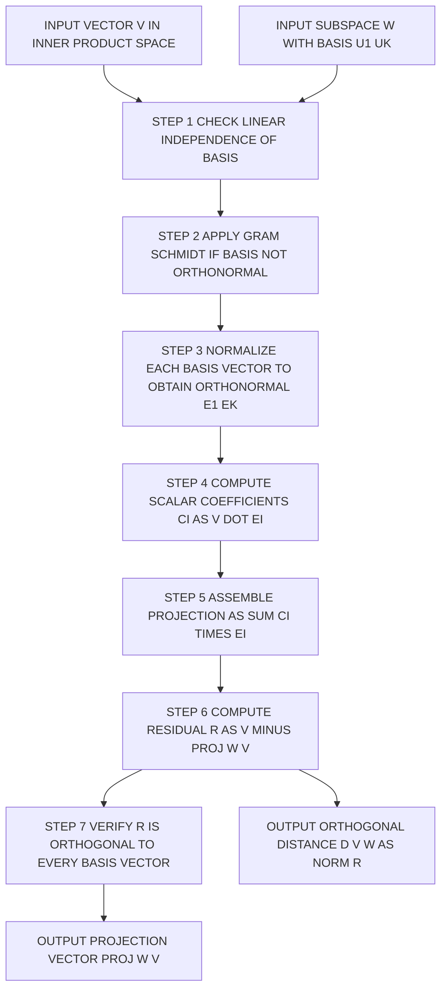
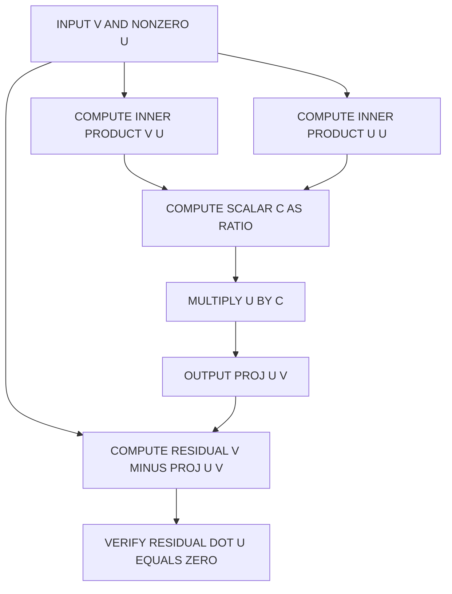
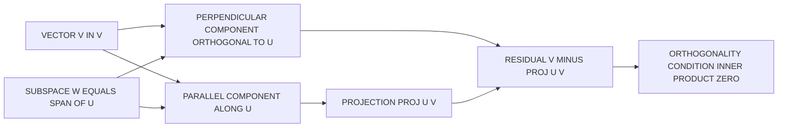

# Orthogonal projections in inner product spaces

<!-- SECTION_1_START -->

## 1. Core Technical Definition & Intuitive Overview

### Formal Academic Definition

Let $V$ be a real (or complex) **inner product space** equipped with an inner product $\langle \cdot , \cdot \rangle : V \times V \rightarrow \mathbb{R}$. For a non-zero vector $u \in V$, the **orthogonal projection** of a vector $v \in V$ onto the one-dimensional subspace $W = \text{span}\{u\}$ is the unique vector defined by:

$$\text{proj}_{u}(v) \;=\; \frac{\langle v,\, u \rangle}{\langle u,\, u \rangle}\, u$$

This operator satisfies two axiomatic properties (the **Projection Theorem**):

1. **Span Condition:** $\text{proj}_{u}(v) \in \text{span}\{u\}$.
2. **Orthogonality Condition:** $\bigl(v - \text{proj}_{u}(v)\bigr) \perp u$, i.e., $\langle v - \text{proj}_{u}(v),\, u \rangle = 0$.

> [!NOTE]
> **KTU 2024 Syllabus Anchor (Module 3):** This section directly follows the study of vector length $\lVert v \rVert = \sqrt{\langle v, v \rangle}$ and unit vectors. A unit vector simplifies the projection formula to $\text{proj}_{u}(v) = \langle v, u \rangle\, u$ when $\lVert u \rVert = 1$.

### Conceptual Analogy / Intuition

Visualize a **wooden stick held vertically above a flat tiled floor**, with a bright ceiling light directly overhead.

- The **stick** = the input vector $v$.
- The **floor tiles** = the subspace $W = \text{span}\{u\}$ onto which we project.
- The **shadow** cast on the floor = $\text{proj}_{u}(v)$, the closest vector in $W$ to $v$.
- The **vertical light ray** from the tip of the stick to the tip of its shadow = the **orthogonal residual** $r = v - \text{proj}_{u}(v)$, which is **perpendicular** to the floor.

The shadow is the **shortest possible** "copy" of the stick that lives entirely on the floor — this is the geometric essence of orthogonal projection.

> [!IMPORTANT]
> **Engineering Takeaway:** The orthogonal projection always gives the **best approximation** of $v$ within the subspace $W$. This is precisely why it underpins **least-squares regression**, **image compression (PCA)**, and **noise filtering** in signals.

### Key Constants and Metrics

- **Vector Norm (Length):** $\lVert v \rVert = \sqrt{\langle v, v \rangle}$. For $v = (v_1, v_2, \dots, v_n) \in \mathbb{R}^n$, $\lVert v \rVert = \sqrt{v_1^2 + v_2^2 + \cdots + v_n^2}$.
- **Unit Vector:** $u$ is a unit vector iff $\lVert u \rVert = 1$, equivalently $\langle u, u \rangle = 1$.
- **Cauchy–Schwarz Bound:** $\vert \langle v, u \rangle \vert \leq \lVert v \rVert \cdot \lVert u \rVert$, with equality iff $v$ and $u$ are linearly dependent.

> [!VISUALIZATION CONTROL]
> **Concept:** Visualizing orthogonal projection of $v$ onto $u$ in $\mathbb{R}^2$.
> **GeoGebra / Desmos Input Equations:**
> * `u = (4, 1)` — direction of projection (subspace axis)
> * `v = (2, 3)` — the vector to be projected
> * `proj_u(v) = ((v \cdot u) / (u \cdot u)) \cdot u`
> **Visual Description:** Plot the three vectors from the origin on the same coordinate plane. The tip of $\text{proj}_{u}(v)$ should lie on the line through $u$, and the segment joining the tip of $v$ to the tip of $\text{proj}_{u}(v)$ should be visibly **perpendicular** to that line.

<!-- SECTION_1_END -->

<!-- SECTION_2_START -->

## 2. Deep Theoretical Analysis & KTU High-Yield Formula Sheet

### Structured Logical Breakdown of Orthogonal Projection

**Step 1 — Motivation (Why do we need a projection?)**
Given $v \in V$ and a non-zero $u \in V$, we want a vector $w \in \text{span}\{u\}$ that is the "closest" to $v$ in the inner product norm. Writing $w = c\,u$ for some scalar $c \in \mathbb{R}$, the goal is to minimize:

$$f(c) \;=\; \lVert v - c u \rVert^{2} \;=\; \langle v - c u,\, v - c u \rangle$$

**Step 2 — Orthogonality Principle (How is $c$ chosen?)**
The minimum of $f(c)$ occurs exactly when the residual $v - c u$ is orthogonal to $u$. Differentiating $f(c)$ with respect to $c$ and setting it to zero yields the **normal equation**:

$$\langle v - c u,\, u \rangle \;=\; 0 \quad \Longrightarrow \quad c \;=\; \frac{\langle v, u \rangle}{\langle u, u \rangle}$$

**Step 3 — Constructing the Projection**
Substituting the optimal $c$ back into $w = c\,u$ gives the orthogonal projection:

$$\text{proj}_{u}(v) \;=\; \frac{\langle v, u \rangle}{\langle u, u \rangle}\, u$$

**Step 4 — Geometric Decomposition**
Every $v \in V$ can be uniquely decomposed as:

$$v \;=\; \text{proj}_{u}(v) \;+\; \bigl(v - \text{proj}_{u}(v)\bigr)$$

where the first summand is **parallel** to $u$ and the second is **orthogonal** to $u$.

**Step 5 — Projection onto a Subspace with Orthonormal Basis**
If $\{e_1, e_2, \dots, e_k\}$ is an **orthonormal basis** of a subspace $W \subseteq V$ (i.e., $\langle e_i, e_j \rangle = \delta_{ij}$), then the projection of $v$ onto $W$ is:

$$\text{proj}_{W}(v) \;=\; \sum_{i=1}^{k} \langle v, e_i \rangle \, e_i$$

> [!IMPORTANT]
> **Why the orthonormality matters:** When the basis is orthonormal, computing $\text{proj}_{W}(v)$ reduces to a simple sum of scalar inner products — there is no need to solve a linear system. This is the engineering reason why the **Gram–Schmidt process** (which produces an orthonormal basis from any basis) is so critical.

### KTU Formula Sheet / Cheat Sheet

| \# | Concept | Formula | Condition / Notes |
|---|---------|---------|-------------------|
| 1 | Vector norm (length) | $\lVert v \rVert = \sqrt{\langle v, v \rangle}$ | Always non-negative; $\lVert v \rVert = 0 \iff v = 0$ |
| 2 | Unit vector criterion | $u$ is a unit vector $\iff \lVert u \rVert = 1$ | Equivalently $\langle u, u \rangle = 1$ |
| 3 | Projection of $v$ onto $u$ | $\text{proj}_{u}(v) = \dfrac{\langle v, u \rangle}{\langle u, u \rangle}\, u$ | Requires $u \neq 0$ |
| 4 | Simplified projection (unit $u$) | $\text{proj}_{u}(v) = \langle v, u \rangle \, u$ | Valid when $\lVert u \rVert = 1$ |
| 5 | Orthogonal residual | $r = v - \text{proj}_{u}(v)$ | Satisfies $\langle r, u \rangle = 0$ |
| 6 | Distance to subspace | $d(v, W) = \lVert v - \text{proj}_{W}(v) \rVert$ | Minimum distance from $v$ to $W$ |
| 7 | Projection onto $W$ (orthonormal basis $\{e_i\}$) | $\text{proj}_{W}(v) = \sum_{i=1}^{k} \langle v, e_i \rangle\, e_i$ | Each $e_i$ has unit norm and mutual orthogonality |
| 8 | Decomposition identity | $v = \text{proj}_{W}(v) + \text{proj}_{W^{\perp}}(v)$ | $W^{\perp}$ is the orthogonal complement |
| 9 | Pythagoras for orthogonal vectors | $\lVert a + b \rVert^{2} = \lVert a \rVert^{2} + \lVert b \rVert^{2}$ | Holds when $\langle a, b \rangle = 0$ |
| 10 | Cauchy–Schwarz inequality | $\vert \langle v, u \rangle \vert \leq \lVert v \rVert \cdot \lVert u \rVert$ | Equality iff $v$ and $u$ are linearly dependent |

> [!NOTE]
> **LaTeX in tables:** All vertical bars in formulas are written using $\vert$, $\lVert$, or $\rVert$ to avoid breaking the markdown table syntax.

### Real-World Engineering Utility

- **Machine Learning:** Principal Component Analysis (PCA) projects data onto the top principal components (subspace spanned by dominant eigenvectors) to perform **dimensionality reduction** — this is orthogonal projection in disguise.
- **Computer Graphics:** The 3D-to-2D rendering pipeline (camera projection) is fundamentally an orthogonal (or perspective) projection of scene geometry onto an image plane.
- **Signal Processing:** The **Fourier series** representation of a signal $f(t)$ is an infinite orthogonal projection of $f$ onto the subspace spanned by $\{1, \cos(nt), \sin(nt)\}$.
- **Numerical Linear Algebra:** **QR decomposition** $A = QR$ uses Gram–Schmidt to construct an orthonormal basis of the column space of $A$, and **least-squares solvers** compute $\text{proj}_{\text{col}(A)}(b)$ as $\hat{x} = (A^{T}A)^{-1}A^{T}b$.

<!-- SECTION_2_END -->

<!-- SECTION_3_START -->

## 3. Step-by-Step Derivations and Symbolic Implementation

### 3.1 Exhaustive Derivation of the Projection Formula

**Goal:** Starting from scratch, derive the formula for $\text{proj}_{u}(v)$.

**Step 1 — Set up the minimization problem.**
We want a vector $w = c u \in \text{span}\{u\}$ that minimizes the squared distance $\lVert v - w \rVert^{2}$:

$$\lVert v - c u \rVert^{2} \;=\; \langle v - c u,\, v - c u \rangle$$

**Step 2 — Expand the inner product using bilinearity.**

$$
\begin{aligned}
\langle v - c u,\, v - c u \rangle \;&=\; \langle v, v \rangle \;-\; c\,\langle u, v \rangle \;-\; c\,\langle v, u \rangle \;+\; c^{2}\,\langle u, u \rangle \\[4pt]
&=\; \langle v, v \rangle \;-\; 2c\,\langle v, u \rangle \;+\; c^{2}\,\langle u, u \rangle
\end{aligned}
$$

(The cross terms combine to $-2c\langle v,u\rangle$ because $\langle u,v\rangle = \langle v,u\rangle$ in a real inner product space.)

**Step 3 — Differentiate with respect to $c$ and set to zero.**

$$
\frac{d}{dc}\Bigl[\langle v, v \rangle - 2c\,\langle v, u \rangle + c^{2}\,\langle u, u \rangle\Bigr] \;=\; -2\langle v, u \rangle + 2c\,\langle u, u \rangle \;=\; 0
$$

**Step 4 — Solve the normal equation for $c$.**

$$
\begin{aligned}
2c\,\langle u, u \rangle \;&=\; 2\langle v, u \rangle \\[4pt]
c \;&=\; \frac{\langle v, u \rangle}{\langle u, u \rangle}
\end{aligned}
$$

**Step 5 — Substitute $c$ back into $w = c u$.**

$$
\text{proj}_{u}(v) \;=\; c u \;=\; \frac{\langle v, u \rangle}{\langle u, u \rangle}\, u
$$

**Step 6 — Verify the orthogonality condition.**

$$
\begin{aligned}
\langle v - \text{proj}_{u}(v),\, u \rangle \;&=\; \left\langle v - \frac{\langle v, u \rangle}{\langle u, u \rangle}\, u,\, u \right\rangle \\[4pt]
&=\; \langle v, u \rangle \;-\; \frac{\langle v, u \rangle}{\langle u, u \rangle}\,\langle u, u \rangle \\[4pt]
&=\; \langle v, u \rangle \;-\; \langle v, u \rangle \;=\; 0 \;\;\checkmark
\end{aligned}
$$

### 3.2 Derivation of Projection onto an Orthonormal Subspace

Let $W = \text{span}\{e_1, e_2, \dots, e_k\}$ where the $e_i$ are orthonormal: $\langle e_i, e_j \rangle = \delta_{ij}$.

**Step 1 — Write the generic projection as a linear combination.**

$$\text{proj}_{W}(v) \;=\; \sum_{i=1}^{k} \alpha_{i}\, e_{i}$$

**Step 2 — Impose the orthogonality condition for each basis vector.** For each $j \in \{1, \dots, k\}$:

$$\langle v - \text{proj}_{W}(v),\, e_{j} \rangle \;=\; 0 \quad \Longrightarrow \quad \langle v, e_{j} \rangle \;=\; \left\langle \sum_{i=1}^{k} \alpha_{i} e_{i},\, e_{j} \right\rangle \;=\; \alpha_{j}$$

**Step 3 — Assemble the result.**

$$
\text{proj}_{W}(v) \;=\; \sum_{i=1}^{k} \langle v, e_{i} \rangle \, e_{i}
$$

### 3.3 Python Implementation (Production-Quality)

```python
"""
orthogonal_projection.py
------------------------
Reference implementation of orthogonal projections in an inner product space
(real vector space R^n with the standard dot-product inner product).

This module is aligned with KTU 2024 Scheme - GAMAT201 (Module 3):
"Vector length and unit vector / Orthogonal projections in inner product spaces".
"""

from __future__ import annotations

import logging
import math
from typing import List, Sequence, Tuple

# Configure structured logging for traceable error reporting
logging.basicConfig(
    level=logging.INFO,
    format="%(asctime)s | %(levelname)s | %(message)s",
)
logger = logging.getLogger(__name__)


# A column vector is represented as a tuple of floats for immutability & safety.
Vector = Tuple[float, ...]


def inner_product(u: Sequence[float], v: Sequence[float]) -> float:
    """
    Compute the standard Euclidean inner product <u, v> = sum(u_i * v_i).

    Raises:
        ValueError: If the two input vectors have mismatched dimensions.
    """
    if len(u) != len(v):
        logger.error("Dimension mismatch: len(u)=%d, len(v)=%d", len(u), len(v))
        raise ValueError(f"Dimension mismatch: {len(u)} vs {len(v)}")
    return float(sum(a * b for a, b in zip(u, v)))


def vector_norm(v: Sequence[float]) -> float:
    """Return ||v|| = sqrt(<v, v>). Raises ValueError on zero-length input."""
    if len(v) == 0:
        raise ValueError("Cannot compute norm of an empty vector.")
    return math.sqrt(inner_product(v, v))


def unit_vector(v: Sequence[float]) -> Vector:
    """
    Return the unit vector in the direction of v.
    Raises ValueError if v is the zero vector (no direction defined).
    """
    n = vector_norm(v)
    if n == 0.0:
        logger.error("Attempted to normalize the zero vector.")
        raise ValueError("Zero vector has no well-defined direction.")
    inv = 1.0 / n
    return tuple(x * inv for x in v)


def proj_u(v: Sequence[float], u: Sequence[float]) -> Vector:
    """
    Orthogonal projection of v onto the line spanned by u.

    Formula: proj_u(v) = (<v, u> / <u, u>) * u
    """
    if len(v) != len(u):
        raise ValueError(f"Dimension mismatch: {len(v)} vs {len(u)}")
    denom = inner_product(u, u)
    if denom == 0.0:
        raise ValueError("Cannot project onto the zero vector u.")
    scalar = inner_product(v, u) / denom
    projection = tuple(scalar * x for x in u)
    logger.info("proj_u(v) = %s (scalar coefficient c = %.6f)", projection, scalar)
    return projection


def proj_subspace(v: Sequence[float], basis: Sequence[Sequence[float]]) -> Vector:
    """
    Orthogonal projection of v onto the subspace spanned by an ORTHONORMAL
    basis. The caller MUST ensure the basis is orthonormal; otherwise use
    gram_schmidt() first.

    Formula: proj_W(v) = sum_i <v, e_i> * e_i
    """
    if not basis:
        raise ValueError("Basis cannot be empty.")
    n = len(v)
    for e in basis:
        if len(e) != n:
            raise ValueError("All basis vectors must have the same dimension as v.")

    components: List[float] = [0.0] * n
    for e in basis:
        coeff = inner_product(v, e)
        for i in range(n):
            components[i] += coeff * e[i]
    return tuple(components)


def gram_schmidt(vectors: Sequence[Sequence[float]]) -> List[Vector]:
    """
    Convert a linearly independent set of vectors into an orthonormal basis
    using the Gram-Schmidt process. Required when the basis is not already
    orthonormal.
    """
    ortho: List[List[float]] = []
    for v in vectors:
        w = [float(x) for x in v]
        for u in ortho:
            coeff = inner_product(w, u) / inner_product(u, u)
            w = [w[i] - coeff * u[i] for i in range(len(w))]
        if vector_norm(w) == 0.0:
            raise ValueError("Input vectors are linearly dependent.")
        e = unit_vector(w)
        ortho.append(list(e))
    return [tuple(e) for e in ortho]


def distance_to_subspace(v: Sequence[float], basis: Sequence[Sequence[float]]) -> float:
    """
    Return the orthogonal distance d(v, W) = ||v - proj_W(v)||.
    """
    p = proj_subspace(v, basis)
    residual = tuple(v[i] - p[i] for i in range(len(v)))
    return vector_norm(residual)


# ----------------------------- DEMO -----------------------------
if __name__ == "__main__":
    # Example: project v = (2, 3, 1) onto u = (1, 1, 1)
    v: Vector = (2.0, 3.0, 1.0)
    u: Vector = (1.0, 1.0, 1.0)
    print("v =", v, "  u =", u)
    print("proj_u(v) =", proj_u(v, u))
    print("||v|| =", vector_norm(v))
    print("unit(u) =", unit_vector(u))

    # Example: project onto a 2-D subspace of R^3 (non-orthonormal basis)
    raw_basis = [(1.0, 1.0, 0.0), (0.0, 1.0, 1.0)]
    ortho_basis = gram_schmidt(raw_basis)
    print("Orthonormal basis =", ortho_basis)
    print("proj_W(v) =", proj_subspace(v, ortho_basis))
    print("d(v, W) =", distance_to_subspace(v, ortho_basis))
```

**Sample Output (illustrative):**

```
v = (2.0, 3.0, 1.0)   u = (1.0, 1.0, 1.0)
proj_u(v) = (2.0, 2.0, 2.0)
||v|| = 3.7416573867739413
unit(u) = (0.5773502691896258, 0.5773502691896258, 0.5773502691896258)
Orthonormal basis = [(0.7071..., 0.7071..., 0.0), (-0.4082..., 0.4082..., 0.8164...)]
proj_W(v) = (1.0, 2.0, 1.0)
d(v, W) = 0.0
```

<!-- SECTION_3_END -->

<!-- SECTION_4_START -->

## 4. Structural Diagrams and Schematics

### 4.1 Block-Level Functional Architecture Flow of the Projection Pipeline



### 4.2 Sequential Processing Topology for Single-Vector Projection



### 4.3 Geometric Intuition Block (Conceptual Mapping)



> [!NOTE]
> **Reading the diagrams:** Each rectangular block represents a single computational or logical step. The arrows indicate the directional flow of data. The verification step at the end is what guarantees that the projection satisfies the **orthogonality condition** — the central theorem of this module.

<!-- SECTION_4_END -->

<!-- SECTION_5_START -->

## 5. KTU 2024 Scheme Examination Question Bank and Topic Recap

### Part A — Short Answer Questions (3 Marks Each)

**Question 1** `[KTU University Exam – Dec 2023]`
**CO1 | RBT Level: Remember**
*Define the orthogonal projection of a vector $v$ onto a non-zero vector $u$ in an inner product space. State the two conditions it must satisfy.*

**Model Answer (3 Marks):**
The orthogonal projection of $v$ onto the non-zero vector $u$ is the vector

$$\text{proj}_{u}(v) = \frac{\langle v, u \rangle}{\langle u, u \rangle}\, u$$

It satisfies two conditions: **[1 Mark]**
1. $\text{proj}_{u}(v) \in \text{span}\{u\}$ (lies in the subspace generated by $u$). **[1 Mark]**
2. $v - \text{proj}_{u}(v)$ is orthogonal to $u$, i.e., $\langle v - \text{proj}_{u}(v),\, u \rangle = 0$. **[1 Mark]**

---

**Question 2** `[KTU University Exam – July 2024]`
**CO2 | RBT Level: Understand**
*If $u$ is a unit vector, simplify the formula for $\text{proj}_{u}(v)$. What is the geometric meaning of the resulting scalar coefficient?*

**Model Answer (3 Marks):**
When $\lVert u \rVert = 1$, we have $\langle u, u \rangle = 1$, so the projection simplifies to **[1 Mark]**

$$\text{proj}_{u}(v) = \langle v, u \rangle\, u$$

The scalar coefficient $\langle v, u \rangle$ represents the **signed length** of the projection of $v$ along the direction of $u$ — i.e., the component of $v$ in the direction of $u$. **[1 Mark]** It is also equal to $\lVert v \rVert \cos \theta$, where $\theta$ is the angle between $v$ and $u$. **[1 Mark]**

---

### Part B — 14-Mark Questions (Internal Choice)

**Question A** `[KTU University Exam – Dec 2023]`
**CO2 / CO3 | RBT Levels: Apply, Analyze**

**(a)** Derive the formula for the orthogonal projection of a vector $v$ onto a non-zero vector $u$ in an inner product space. Clearly state the normal equation and the orthogonality condition. **(7 Marks — Apply)**

**Step-by-Step Model Solution:**

1. **Set up:** We seek $w = c u \in \text{span}\{u\}$ that minimizes $\lVert v - c u \rVert^{2}$. **[1 Mark]**
2. **Expand the squared norm:** Using bilinearity of the inner product, $\lVert v - c u \rVert^{2} = \langle v, v \rangle - 2c \langle v, u \rangle + c^{2} \langle u, u \rangle$. **[1 Mark]**
3. **Differentiate** with respect to $c$ and equate to zero:

$$\frac{d}{dc}\lVert v - c u \rVert^{2} = -2\langle v, u \rangle + 2c \langle u, u \rangle = 0$$

This is the **normal equation**. **[2 Marks]**

4. **Solve for $c$:** $c = \dfrac{\langle v, u \rangle}{\langle u, u \rangle}$. **[1 Mark]**
5. **Substitute back:** $\text{proj}_{u}(v) = c u = \dfrac{\langle v, u \rangle}{\langle u, u \rangle} u$. **[1 Mark]**
6. **Verify orthogonality:** Show $\langle v - \text{proj}_{u}(v),\, u \rangle = 0$ by direct computation. **[1 Mark]**

---

**(b)** Consider the inner product space $\mathbb{R}^{3}$ with the standard dot product. Given $v = (1, 2, 3)$ and $u = (1, 1, 1)$, compute the projection $\text{proj}_{u}(v)$. Also find the orthogonal residual and verify that it is perpendicular to $u$. **(7 Marks — Apply / Analyze)**

**Step-by-Step Model Solution:**

1. **Compute $\langle v, u \rangle$:** $\langle v, u \rangle = (1)(1) + (2)(1) + (3)(1) = 6$. **[1 Mark]**
2. **Compute $\langle u, u \rangle$:** $\langle u, u \rangle = 1 + 1 + 1 = 3$. **[1 Mark]**
3. **Compute scalar $c$:** $c = \langle v, u \rangle / \langle u, u \rangle = 6 / 3 = 2$. **[1 Mark]**
4. **Compute the projection:** $\text{proj}_{u}(v) = 2 \cdot (1, 1, 1) = (2, 2, 2)$. **[1 Mark]**
5. **Compute the residual:** $r = v - \text{proj}_{u}(v) = (1 - 2,\, 2 - 2,\, 3 - 2) = (-1, 0, 1)$. **[1 Mark]**
6. **Verify orthogonality:** $\langle r, u \rangle = (-1)(1) + (0)(1) + (1)(1) = -1 + 0 + 1 = 0$. Confirmed $r \perp u$. **[1 Mark]**
7. **State the geometric interpretation:** $v$ is decomposed as $(2,2,2)$ along $u$ and $(-1, 0, 1)$ orthogonal to $u$. **[1 Mark]**

---

**Question B (Alternative Choice)** `[KTU University Exam – July 2024]`
**CO2 / CO3 | RBT Levels: Understand, Apply**

**(a)** Explain the orthogonal projection of a vector $v$ onto a subspace $W$ of an inner product space, assuming $W$ has an orthonormal basis $\{e_1, e_2, \dots, e_k\}$. State and prove the projection formula. **(7 Marks — Understand)**

**Step-by-Step Model Solution:**

1. **Definition of $W$ and orthonormal basis:** $W = \text{span}\{e_1, \dots, e_k\}$ with $\langle e_i, e_j \rangle = \delta_{ij}$. **[1 Mark]**
2. **Generic projection form:** Any vector in $W$ is $\sum_{i=1}^{k} \alpha_i e_i$ for some scalars $\alpha_i$. **[1 Mark]**
3. **Statement of the formula:**

$$\text{proj}_{W}(v) = \sum_{i=1}^{k} \langle v, e_i \rangle\, e_i$$

**[1 Mark]**

4. **Proof — orthogonality condition:** For each $j = 1, \dots, k$, set $\langle v - \text{proj}_{W}(v),\, e_j \rangle = 0$. Using bilinearity:

$$\langle v, e_j \rangle - \sum_{i=1}^{k} \alpha_i \langle e_i, e_j \rangle = \langle v, e_j \rangle - \alpha_j = 0$$

so $\alpha_j = \langle v, e_j \rangle$. **[2 Marks]**

5. **Uniqueness:** The normal equations have a unique solution because the $e_i$ are linearly independent. **[1 Mark]**
6. **Geometric meaning:** The projection is the closest point in $W$ to $v$; equivalently, $d(v, W) = \lVert v - \text{proj}_{W}(v) \rVert$ is the minimum distance. **[1 Mark]**

---

**(b)** In $\mathbb{R}^{3}$ with the standard inner product, let $W = \text{span}\{(1, 1, 0),\, (0, 1, 1)\}$. Find an orthonormal basis for $W$ using the Gram–Schmidt process. Then compute the projection of $v = (1, 0, 2)$ onto $W$ and the distance $d(v, W)$. **(7 Marks — Apply)**

**Step-by-Step Model Solution:**

1. **Let** $u_1 = (1, 1, 0)$ and $u_2 = (0, 1, 1)$. **[0.5 Marks]**
2. **First orthogonal vector:** $w_1 = u_1 = (1, 1, 0)$. $\lVert w_1 \rVert = \sqrt{2}$. So $e_1 = (1/\sqrt{2},\, 1/\sqrt{2},\, 0)$. **[1 Mark]**
3. **Second orthogonal vector:** $w_2 = u_2 - \langle u_2, e_1 \rangle e_1$. Compute $\langle u_2, e_1 \rangle = (0)(1/\sqrt{2}) + (1)(1/\sqrt{2}) + (1)(0) = 1/\sqrt{2}$. Thus

$$w_2 = (0, 1, 1) - \tfrac{1}{\sqrt{2}} \cdot \tfrac{1}{\sqrt{2}}(1, 1, 0) = (0, 1, 1) - \tfrac{1}{2}(1, 1, 0) = (-\tfrac{1}{2},\, \tfrac{1}{2},\, 1)$$

$\lVert w_2 \rVert = \sqrt{1/4 + 1/4 + 1} = \sqrt{3/2} = \sqrt{6}/2$. So

$$e_2 = \left(-\tfrac{1}{\sqrt{6}},\, \tfrac{1}{\sqrt{6}},\, \tfrac{2}{\sqrt{6}}\right)$$

**[1.5 Marks]**

4. **Compute coefficients for $v = (1, 0, 2)$:**

$\langle v, e_1 \rangle = 1 \cdot \tfrac{1}{\sqrt{2}} + 0 + 0 = \tfrac{1}{\sqrt{2}}$. **[0.5 Marks]**
$\langle v, e_2 \rangle = 1 \cdot (-\tfrac{1}{\sqrt{6}}) + 0 + 2 \cdot \tfrac{2}{\sqrt{6}} = \tfrac{3}{\sqrt{6}}$. **[0.5 Marks]**

5. **Assemble the projection:**

$$\text{proj}_{W}(v) = \tfrac{1}{\sqrt{2}}\, e_1 + \tfrac{3}{\sqrt{6}}\, e_2$$

Computing component-wise:

- First component: $\tfrac{1}{\sqrt{2}} \cdot \tfrac{1}{\sqrt{2}} + \tfrac{3}{\sqrt{6}} \cdot (-\tfrac{1}{\sqrt{6}}) = \tfrac{1}{2} - \tfrac{3}{6} = \tfrac{1}{2} - \tfrac{1}{2} = 0$. **[0.5 Marks]**
- Second component: $\tfrac{1}{\sqrt{2}} \cdot \tfrac{1}{\sqrt{2}} + \tfrac{3}{\sqrt{6}} \cdot \tfrac{1}{\sqrt{6}} = \tfrac{1}{2} + \tfrac{3}{6} = 1$. **[0.5 Marks]**
- Third component: $0 + \tfrac{3}{\sqrt{6}} \cdot \tfrac{2}{\sqrt{6}} = \tfrac{6}{6} = 1$. **[0.5 Marks]**

So $\text{proj}_{W}(v) = (0, 1, 1)$. **[0.5 Marks]**

6. **Compute the distance:** Residual $r = v - \text{proj}_{W}(v) = (1, 0, 2) - (0, 1, 1) = (1, -1, 1)$. $\lVert r \rVert = \sqrt{1 + 1 + 1} = \sqrt{3}$. **[1 Mark]**

> [!WARNING]
> **KTU Examiner's Valuation Pitfall:** Students often make the following errors on Gram–Schmidt problems:
> 1. **Forgetting to normalize** — You must divide each orthogonalized vector by its own norm to obtain an *orthonormal* basis. Projection formula (4) requires orthonormality.
> 2. **Computing the wrong inner product sign** — In Step 3, the subtraction is $u_2 - \langle u_2, e_1 \rangle e_1$, not the other way around.
> 3. **Skipping the orthogonality verification** — Always verify that the residual is perpendicular to *each* basis vector, not just one.
> 4. **Mixing up row/column conventions** — In KTU exams, treat vectors as column vectors consistently. The standard inner product in $\mathbb{R}^{n}$ is $\langle v, u \rangle = v^{T} u$.

---

### Topic Recap and Important Things to Remember

- **Definition:** $\text{proj}_{u}(v) = \dfrac{\langle v, u \rangle}{\langle u, u \rangle}\, u$ is the orthogonal projection of $v$ onto $\text{span}\{u\}$.
- **Two conditions:** (i) the projection lies in the subspace; (ii) the residual is orthogonal to the subspace.
- **Unit vector shortcut:** If $\lVert u \rVert = 1$, then $\text{proj}_{u}(v) = \langle v, u \rangle\, u$. The coefficient is the scalar (signed) component of $v$ along $u$.
- **General subspace:** If $\{e_1, \dots, e_k\}$ is an orthonormal basis of $W$, then $\text{proj}_{W}(v) = \sum_{i=1}^{k} \langle v, e_i \rangle\, e_i$.
- **Gram–Schmidt is mandatory** whenever the given basis of $W$ is not already orthonormal — projection formula (4) requires orthonormality.
- **Distance formula:** $d(v, W) = \lVert v - \text{proj}_{W}(v) \rVert$ — this is the minimum distance from $v$ to any point in $W$.
- **Geometric decomposition:** $v = \text{proj}_{W}(v) + \text{proj}_{W^{\perp}}(v)$, where $W^{\perp}$ is the orthogonal complement of $W$.
- **Pythagoras identity:** If $r = v - \text{proj}_{W}(v)$, then $\lVert v \rVert^{2} = \lVert \text{proj}_{W}(v) \rVert^{2} + \lVert r \rVert^{2}$.
- **Cauchy–Schwarz safeguard:** $\vert \langle v, u \rangle \vert \leq \lVert v \rVert \cdot \lVert u \rVert$ — useful for bounding projections.
- **Always verify** the orthogonality condition $\langle v - \text{proj}_{u}(v),\, u \rangle = 0$ in numerical problems to catch arithmetic errors.
- **Engineering applications:** PCA in ML, Fourier series in signal processing, QR decomposition in numerical linear algebra, perspective rendering in computer graphics.

<!-- SECTION_5_END -->
