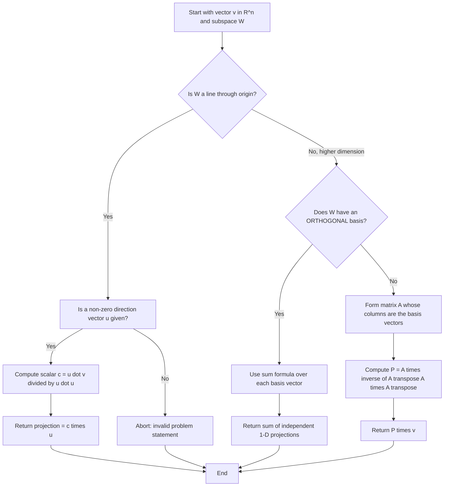
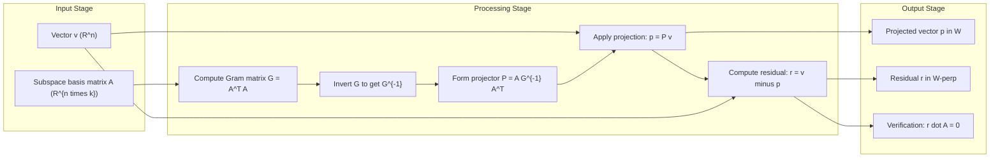
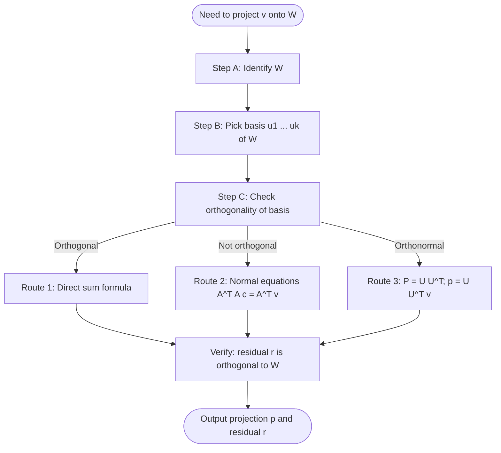

# Projection onto a Subspace

<!-- SECTION_1_START -->

# Projection onto a Subspace — Foundational Definition

> [!NOTE]
> **Module 3 (GAMAT201) — Vector Length and Unit Vector**
> *Topic focus:* Orthogonal projection, projection matrices, and the decomposition of vectors with respect to a subspace.

## 1.1 Formal Academic Definition

Let $W \subseteq \mathbb{R}^{n}$ be a non‑zero **subspace** of the real inner‑product space $\mathbb{R}^{n}$, and let $\mathbf{v} \in \mathbb{R}^{n}$ be an arbitrary vector. The **orthogonal projection of $\mathbf{v}$ onto $W$**, denoted $\text{proj}_{W}\mathbf{v}$, is the unique vector $\mathbf{p} \in W$ such that the **residual** $\mathbf{r} = \mathbf{v} - \mathbf{p}$ is orthogonal to every vector $\mathbf{w} \in W$.

$$\mathbf{p} = \text{proj}_{W}\mathbf{v} \iff \mathbf{p} \in W \text{ and } (\mathbf{v} - \mathbf{p}) \cdot \mathbf{w} = 0 \;\;\forall\, \mathbf{w} \in W$$

When $W$ is the 1‑dimensional subspace spanned by a non‑zero vector $\mathbf{u}$, this reduces to the classical **vector projection** formula:

$$\boxed{\;\text{proj}_{\mathbf{u}}\mathbf{v} \;=\; \frac{\mathbf{u}\cdot \mathbf{v}}{\mathbf{u}\cdot \mathbf{u}}\,\mathbf{u}\;}$$

The **scalar (component) projection** is the signed length of that shadow:

$$\text{comp}_{\mathbf{u}}\mathbf{v} \;=\; \frac{\mathbf{u}\cdot \mathbf{v}}{\lVert \mathbf{u} \rVert}$$

> [!IMPORTANT]
> **KTU 2024 Syllabus Mapping:** This topic directly continues the dot‑product and norm material from §3.1–3.2. Mastering the projection formula is **mandatory** for the upcoming modules on least squares, orthonormal bases, and SVD.

## 1.2 Intuitive Analogy — *The Shadow of Light*

Imagine standing a pencil vertically on a table under a lamp whose light rays travel **perpendicular to the table surface**. The shadow that the pencil casts on the table is a *2‑dimensional version* of a projection. Now generalize:

* The **pencil** = vector $\mathbf{v}$ in $\mathbb{R}^{3}$.
* The **table top** = subspace $W$ (say a plane through the origin).
* The **light direction** = the normal direction to $W$ (perpendicular to $W$).
* The **shadow tip on the table** = the projected point $\text{proj}_{W}\mathbf{v}$.

The shadow is the **closest point in $W$ to the tip of the pencil**. The remaining "height" that does not lie on the table is the **orthogonal residual** $\mathbf{r} = \mathbf{v} - \text{proj}_{W}\mathbf{v}$. This geometric fact — *the projection is the closest point in the subspace* — is the geometric heart of the **least‑squares method** used throughout information science, machine learning, and signal processing.

> [!TIP]
> **Quick memory hook:** *"The projection is the foot of the perpendicular dropped from the vector's tip onto the subspace."*

## 1.3 Visualisation — GeoGebra / Desmos

> [!VISUALIZATION CONTROL]
> **Concept:** Vector projection in $\mathbb{R}^{2}$ onto a 1‑D subspace.
> **GeoGebra / Desmos Input Equations:**
>
> * `u = (4, 1)`
> * `v = (1, 3)`
> * `proj = (u·v / u·u) · u`
> * `r = v − proj`
>
> **Visual Description:** Plot the arrow from the origin to $\mathbf{u}$ (the "line" $W$). Plot $\mathbf{v}$ and the computed foot $\text{proj}_{\mathbf{u}}\mathbf{v}$ lying on $W$. Draw $\mathbf{r} = \mathbf{v} - \text{proj}_{\mathbf{u}}\mathbf{v}$ joining the tip of $\mathbf{v}$ to the foot. **Observe** that $\mathbf{r}$ is perpendicular to $\mathbf{u}$ and that $\lVert \mathbf{v} \rVert^{2} = \lVert \text{proj}_{\mathbf{u}}\mathbf{v} \rVert^{2} + \lVert \mathbf{r} \rVert^{2}$ (Pythagoras in the subspace).

## 1.4 The Orthogonal Decomposition Theorem (Preview)

> [!IMPORTANT]
> **Theorem (Orthogonal Decomposition).** If $W$ is a finite‑dimensional subspace of an inner‑product space, then **every** vector $\mathbf{v}$ can be written **uniquely** as
> $$\mathbf{v} \;=\; \text{proj}_{W}\mathbf{v} \;+\; \text{proj}_{W^{\perp}}\mathbf{v}$$
> where $W^{\perp}$ is the **orthogonal complement** of $W$.

This identity is the algebraic foundation for the Fourier series, the Pythagorean theorem, and the normal equations of least squares — all of which appear later in this module and the next.

---

<!-- SECTION_1_END -->

<!-- SECTION_2_START -->

# Deep Theoretical Analysis & KTU High‑Yield Formula Sheet

## 2.1 The Logical Chain — *Why* the Projection Formula Works

We derive the projection by enforcing a single geometric requirement: **the residual must be perpendicular to the subspace**.

1. **Start with a candidate.** Let $W = \text{span}\{\mathbf{u}\}$ with $\mathbf{u} \neq \mathbf{0}$. Any vector in $W$ is a scalar multiple $c\,\mathbf{u}$.
2. **Write the residual.** The error is $\mathbf{r} = \mathbf{v} - c\,\mathbf{u}$.
3. **Enforce orthogonality.** Require $\mathbf{r} \cdot \mathbf{u} = 0$:
   $$(\mathbf{v} - c\,\mathbf{u}) \cdot \mathbf{u} = 0 \;\;\Longrightarrow\;\; c = \frac{\mathbf{v} \cdot \mathbf{u}}{\mathbf{u} \cdot \mathbf{u}}$$
4. **Recover the projected vector.** Substituting $c$ back gives the projection formula.
5. **Uniqueness.** If two distinct scalars $c_1 \neq c_2$ both satisfied orthogonality, their difference $(c_1 - c_2)\mathbf{u} \cdot \mathbf{u} = 0$ would force $\mathbf{u} = \mathbf{0}$ — a contradiction. Hence the projection is **unique**.

> [!NOTE]
> **Intuition behind "closest point":** Minimising $\lVert \mathbf{v} - c\,\mathbf{u} \rVert^{2}$ as a quadratic in $c$ also yields the same optimal scalar $c = \dfrac{\mathbf{u}\cdot \mathbf{v}}{\mathbf{u}\cdot \mathbf{u}}$. This is the calculus of least squares in disguise.

## 2.2 Extension to a General $k$‑Dimensional Subspace

Let $W = \text{span}\{\mathbf{u}_{1}, \mathbf{u}_{2}, \ldots, \mathbf{u}_{k}\}$ with mutually **orthogonal** basis vectors (obtained, for instance, by Gram–Schmidt). Then the projection becomes a clean sum:

$$\boxed{\;\text{proj}_{W}\mathbf{v} \;=\; \sum_{i=1}^{k} \frac{\mathbf{u}_{i}\cdot \mathbf{v}}{\mathbf{u}_{i}\cdot \mathbf{u}_{i}}\,\mathbf{u}_{i}\;}$$

If the basis is **orthonormal** ($\lVert \mathbf{u}_{i} \rVert = 1$, mutually orthogonal), the denominator simplifies to **1** and the formula collapses to:

$$\text{proj}_{W}\mathbf{v} = \sum_{i=1}^{k} (\mathbf{u}_{i}\cdot \mathbf{v})\,\mathbf{u}_{i} \;=\; U U^{\!\top}\mathbf{v}, \quad U = \begin{bmatrix} \mathbf{u}_{1} & \mathbf{u}_{2} & \cdots & \mathbf{u}_{k} \end{bmatrix}$$

## 2.3 The Projection Matrix

When the projection is written as a matrix multiplication $\text{proj}_{W}\mathbf{v} = P\mathbf{v}$, the matrix $P$ is called a **projection matrix** (or **orthogonal projector**).

| Subspace description | Projection matrix $P$ | Validity condition |
| :--- | :--- | :--- |
| Line through origin in direction $\mathbf{u} \in \mathbb{R}^{n}$ | $P = \dfrac{\mathbf{u}\,\mathbf{u}^{\!\top}}{\mathbf{u}^{\!\top}\mathbf{u}}$ | $\mathbf{u} \neq \mathbf{0}$ |
| Span of an **orthonormal** basis matrix $U \in \mathbb{R}^{n \times k}$ | $P = UU^{\!\top}$ | $U^{\!\top}U = I_{k}$ |
| Column space of a full‑column‑rank $A \in \mathbb{R}^{m \times n}$ | $P = A\,(A^{\!\top}A)^{-1}A^{\!\top}$ | $\text{rank}(A) = n$ |

## 2.4 Algebraic Properties of a Projection Matrix

> [!IMPORTANT]
> An $n \times n$ real matrix $P$ is an **orthogonal projection matrix** $\iff$ it satisfies both of the following simultaneously:
> 1. **Idempotence:** $P^{2} = P$
> 2. **Symmetry:** $P^{\!\top} = P$

From these two axioms the following corollaries are routinely tested in KTU examinations:

* **Eigenvalue constraint:** Every eigenvalue $\lambda$ satisfies $\lambda^{2} = \lambda$, so $\lambda \in \{0, 1\}$.
* **Rank equals trace:** $\text{rank}(P) = \text{trace}(P) = \dim(W)$.
* **$I - P$ is also a projector:** It projects onto the orthogonal complement $W^{\perp}$.
* **Norms shrink (or stay equal):** $\lVert P\mathbf{v} \rVert \leq \lVert \mathbf{v} \rVert$ for every $\mathbf{v}$.
* **Decomposition identity:** $P + (I - P) = I$, splitting the identity into two complementary projectors.

## 2.5 KTU High‑Yield Formula Cheat Sheet

> [!NOTE]
> **Reference table for fast revision.** The vertical bar for absolute value / norm is written as $\lVert \cdot \rVert$ (not the pipe character) to remain compatible with KTU‑style LaTeX rendering and the host's markdown parser.

| # | Concept | Formula / Statement | Notes & Units |
| :--- | :--- | :--- | :--- |
| 1 | Scalar (component) projection | $\text{comp}_{\mathbf{u}}\mathbf{v} = \dfrac{\mathbf{u}\cdot \mathbf{v}}{\lVert \mathbf{u} \rVert}$ | Signed scalar; units match $\lVert \mathbf{v} \rVert$ |
| 2 | Vector projection onto $\mathbf{u}$ | $\text{proj}_{\mathbf{u}}\mathbf{v} = \dfrac{\mathbf{u}\cdot \mathbf{v}}{\mathbf{u}\cdot \mathbf{u}}\,\mathbf{u}$ | Always lies on the line of $\mathbf{u}$ |
| 3 | Vector projection onto $W = \text{span}\{U\}$ (orthogonal basis) | $\text{proj}_{W}\mathbf{v} = \sum_{i} \dfrac{\mathbf{u}_{i}\cdot \mathbf{v}}{\mathbf{u}_{i}\cdot \mathbf{u}_{i}}\,\mathbf{u}_{i}$ | Sum of independent 1‑D projections |
| 4 | Projection onto $W$ with **orthonormal** basis $U$ | $P = UU^{\!\top}$, so $\text{proj}_{W}\mathbf{v} = UU^{\!\top}\mathbf{v}$ | $U^{\!\top}U = I_{k}$ |
| 5 | Projection onto $\text{col}(A)$, $A$ full column rank | $P = A\,(A^{\!\top}A)^{-1}A^{\!\top}$ | The "hat matrix" of statistics |
| 6 | Residual | $\mathbf{r} = \mathbf{v} - \text{proj}_{W}\mathbf{v}$ | Orthogonal to every $\mathbf{w} \in W$ |
| 7 | Pythagoras in subspace | $\lVert \mathbf{v} \rVert^{2} = \lVert \text{proj}_{W}\mathbf{v} \rVert^{2} + \lVert \mathbf{r} \rVert^{2}$ | Direct consequence of orthogonality |
| 8 | Idempotence | $P^{2} = P$ | Implies eigenvalues in $\{0,1\}$ |
| 9 | Symmetry | $P^{\!\top} = P$ | Distinguishes *orthogonal* from *oblique* projectors |
| 10 | Dimension of subspace | $\dim(W) = \text{trace}(P)$ | $\text{trace}(P) = \sum \lambda_i$ |

## 2.6 Real‑World Utility in Information Science & Engineering

* **Linear regression / Least‑squares fitting** — the line $A\mathbf{x} = \mathbf{b}$ may be inconsistent; the best approximate solution lives in the projection of $\mathbf{b}$ onto $\text{col}(A)$. This is **the single most common application** in data science.
* **Signal processing** — projecting a noisy signal onto the span of sinusoids of known frequencies isolates the periodic component (Fourier series, Wiener filtering).
* **Computer graphics & robotics** — projecting a 3‑D point onto a 2‑D image plane or onto a joint‑motion subspace.
* **Principal Component Analysis (PCA)** — projecting data onto the top‑$k$ eigenvectors is literally $\text{proj}_{W_{k}}\mathbf{x}$ with $W_{k}$ spanned by the leading principal axes.
* **Cryptography & coding theory** — syndrome decoding uses projection onto the dual of a linear code.
* **Recommender systems** — matrix‑factorisation / SVD steps rely on the same projection identities.

---

<!-- SECTION_2_END -->

<!-- SECTION_3_START -->

# Step‑by‑Step Derivations, Worked Examples & Python Implementation

## 3.1 Derivation 1 — Projection onto a Line (1‑D Subspace)

We derive $\text{proj}_{\mathbf{u}}\mathbf{v}$ by minimising the squared distance from $\mathbf{v}$ to points on the line $\{c\,\mathbf{u} : c \in \mathbb{R}\}$.

**Step 1 — Formulate the objective.**
$$f(c) \;=\; \lVert \mathbf{v} - c\,\mathbf{u} \rVert^{2} \;=\; (\mathbf{v} - c\,\mathbf{u})\cdot(\mathbf{v} - c\,\mathbf{u})$$

**Step 2 — Expand using bilinearity of the dot product.**
$$f(c) \;=\; \mathbf{v}\cdot \mathbf{v} \;-\; 2c\,(\mathbf{u}\cdot \mathbf{v}) \;+\; c^{2}\,(\mathbf{u}\cdot \mathbf{u})$$

**Step 3 — Differentiate and set to zero.**
$$\frac{df}{dc} \;=\; -2\,(\mathbf{u}\cdot \mathbf{v}) \;+\; 2c\,(\mathbf{u}\cdot \mathbf{u}) \;=\; 0$$

**Step 4 — Solve for the optimal scalar $c$.**
$$c^{*} \;=\; \frac{\mathbf{u}\cdot \mathbf{v}}{\mathbf{u}\cdot \mathbf{u}}$$

**Step 5 — Substitute $c^{*}$ back into $c^{*}\mathbf{u}$.**
$$\text{proj}_{\mathbf{u}}\mathbf{v} \;=\; c^{*}\mathbf{u} \;=\; \frac{\mathbf{u}\cdot \mathbf{v}}{\mathbf{u}\cdot \mathbf{u}}\,\mathbf{u} \quad \blacksquare$$

> [!NOTE]
> **Alternative geometric derivation.** Write $\mathbf{v} = \text{proj}_{\mathbf{u}}\mathbf{v} + \mathbf{r}$ where $\mathbf{r} \perp \mathbf{u}$. Dot both sides with $\mathbf{u}$: $\mathbf{u}\cdot \mathbf{v} = (\mathbf{u}\cdot \text{proj}_{\mathbf{u}}\mathbf{v}) + 0$. Since $\text{proj}_{\mathbf{u}}\mathbf{v} = c\mathbf{u}$, we have $\mathbf{u}\cdot \mathbf{v} = c\,(\mathbf{u}\cdot \mathbf{u})$, recovering the same scalar.

## 3.2 Derivation 2 — Projection onto a 2‑D Subspace Using an Orthogonal Basis

Let $W = \text{span}\{\mathbf{u}_{1}, \mathbf{u}_{2}\}$ with $\mathbf{u}_{1} \cdot \mathbf{u}_{2} = 0$. Any vector in $W$ has the form $c_{1}\mathbf{u}_{1} + c_{2}\mathbf{u}_{2}$.

**Step 1 — Set up the least‑squares problem.**
$$g(c_{1}, c_{2}) \;=\; \lVert \mathbf{v} - c_{1}\mathbf{u}_{1} - c_{2}\mathbf{u}_{2} \rVert^{2}$$

**Step 2 — Take partial derivatives (two equations).**
$$\frac{\partial g}{\partial c_{1}} = -2\,\mathbf{u}_{1}\cdot \mathbf{v} + 2c_{1}(\mathbf{u}_{1}\cdot \mathbf{u}_{1}) + 2c_{2}(\mathbf{u}_{1}\cdot \mathbf{u}_{2}) = 0$$
$$\frac{\partial g}{\partial c_{2}} = -2\,\mathbf{u}_{2}\cdot \mathbf{v} + 2c_{1}(\mathbf{u}_{1}\cdot \mathbf{u}_{2}) + 2c_{2}(\mathbf{u}_{2}\cdot \mathbf{u}_{2}) = 0$$

**Step 3 — Exploit orthogonality** ($\mathbf{u}_{1}\cdot \mathbf{u}_{2} = 0$) to decouple the system.
$$c_{1} = \frac{\mathbf{u}_{1}\cdot \mathbf{v}}{\mathbf{u}_{1}\cdot \mathbf{u}_{1}}, \qquad c_{2} = \frac{\mathbf{u}_{2}\cdot \mathbf{v}}{\mathbf{u}_{2}\cdot \mathbf{u}_{2}}$$

**Step 4 — Assemble the projection.**
$$\text{proj}_{W}\mathbf{v} \;=\; \frac{\mathbf{u}_{1}\cdot \mathbf{v}}{\mathbf{u}_{1}\cdot \mathbf{u}_{1}}\,\mathbf{u}_{1} \;+\; \frac{\mathbf{u}_{2}\cdot \mathbf{v}}{\mathbf{u}_{2}\cdot \mathbf{u}_{2}}\,\mathbf{u}_{2} \quad \blacksquare$$

> [!IMPORTANT]
> **Why orthogonality matters.** If the basis vectors are *not* orthogonal, the system remains coupled and must be solved as a $k \times k$ linear system — the **normal equations** $A^{\!\top}A\,\mathbf{c} = A^{\!\top}\mathbf{v}$. This is precisely why Gram–Schmidt orthogonalisation is so valuable.

## 3.3 Worked Example A — Projection onto a Line

> **Problem.** Let $\mathbf{u} = \begin{bmatrix} 4 \\ 1 \end{bmatrix}$ and $\mathbf{v} = \begin{bmatrix} 1 \\ 3 \end{bmatrix}$. Find (i) the scalar projection, (ii) the vector projection, and (iii) the residual. Verify orthogonality.

**Step 1 — Compute the dot product.**
$$\mathbf{u}\cdot \mathbf{v} \;=\; 4\cdot 1 + 1\cdot 3 \;=\; 4 + 3 \;=\; 7$$

**Step 2 — Compute $\mathbf{u}\cdot \mathbf{u}$.**
$$\mathbf{u}\cdot \mathbf{u} \;=\; 4^{2} + 1^{2} \;=\; 16 + 1 \;=\; 17$$

**Step 3 — Scalar projection.**
$$\text{comp}_{\mathbf{u}}\mathbf{v} \;=\; \frac{7}{\sqrt{17}} \;\approx\; 1.6977$$

**Step 4 — Vector projection.**
$$\text{proj}_{\mathbf{u}}\mathbf{v} \;=\; \frac{7}{17}\,\mathbf{u} \;=\; \frac{7}{17}\begin{bmatrix} 4 \\ 1 \end{bmatrix} \;=\; \begin{bmatrix} 28/17 \\ 7/17 \end{bmatrix} \;\approx\; \begin{bmatrix} 1.6471 \\ 0.4118 \end{bmatrix}$$

**Step 5 — Residual.**
$$\mathbf{r} \;=\; \mathbf{v} - \text{proj}_{\mathbf{u}}\mathbf{v} \;=\; \begin{bmatrix} 1 - 28/17 \\ 3 - 7/17 \end{bmatrix} \;=\; \begin{bmatrix} -11/17 \\ 44/17 \end{bmatrix}$$

**Step 6 — Orthogonality check.**
$$\mathbf{r}\cdot \mathbf{u} \;=\; \left(\frac{-11}{17}\right)(4) + \left(\frac{44}{17}\right)(1) \;=\; \frac{-44 + 44}{17} \;=\; 0 \quad \checkmark$$

**Step 7 — Pythagoras verification.**
$$\lVert \mathbf{v} \rVert^{2} = 1^{2} + 3^{2} = 10$$
$$\lVert \text{proj}_{\mathbf{u}}\mathbf{v} \rVert^{2} = (28/17)^{2} + (7/17)^{2} = (784 + 49)/289 = 833/289$$
$$\lVert \mathbf{r} \rVert^{2} = (11/17)^{2} + (44/17)^{2} = (121 + 1936)/289 = 2057/289$$
$$\lVert \text{proj}_{\mathbf{u}}\mathbf{v} \rVert^{2} + \lVert \mathbf{r} \rVert^{2} = (833 + 2057)/289 = 2890/289 = 10 \quad \checkmark$$

## 3.4 Worked Example B — Projection onto a 2‑D Subspace (Non‑orthogonal basis → Normal Equations)

> **Problem.** Project $\mathbf{v} = \begin{bmatrix} 1 \\ 2 \\ 3 \end{bmatrix}$ onto $W = \text{span}\!\left\{\begin{bmatrix} 1 \\ 1 \\ 0 \end{bmatrix}, \begin{bmatrix} 0 \\ 1 \\ 1 \end{bmatrix}\right\}$. Use the matrix formula $P = A(A^{\!\top}A)^{-1}A^{\!\top}$.

**Step 1 — Form the basis matrix.**
$$A \;=\; \begin{bmatrix} 1 & 0 \\ 1 & 1 \\ 0 & 1 \end{bmatrix}$$

**Step 2 — Compute $A^{\!\top}A$.**
$$A^{\!\top} \;=\; \begin{bmatrix} 1 & 1 & 0 \\ 0 & 1 & 1 \end{bmatrix}, \qquad A^{\!\top}A \;=\; \begin{bmatrix} 1\cdot 1 + 1\cdot 1 + 0\cdot 0 & 1\cdot 0 + 1\cdot 1 + 0\cdot 1 \\ 0\cdot 1 + 1\cdot 1 + 1\cdot 0 & 0\cdot 0 + 1\cdot 1 + 1\cdot 1 \end{bmatrix} \;=\; \begin{bmatrix} 2 & 1 \\ 1 & 2 \end{bmatrix}$$

**Step 3 — Invert the $2 \times 2$ matrix.**
$$\det(A^{\!\top}A) = 2\cdot 2 - 1\cdot 1 = 3$$
$$(A^{\!\top}A)^{-1} \;=\; \frac{1}{3}\begin{bmatrix} 2 & -1 \\ -1 & 2 \end{bmatrix}$$

**Step 4 — Compute $A^{\!\top}\mathbf{v}$.**
$$A^{\!\top}\mathbf{v} \;=\; \begin{bmatrix} 1 & 1 & 0 \\ 0 & 1 & 1 \end{bmatrix}\begin{bmatrix} 1 \\ 2 \\ 3 \end{bmatrix} \;=\; \begin{bmatrix} 3 \\ 5 \end{bmatrix}$$

**Step 5 — Solve for coefficient vector $\mathbf{c}$.**
$$\mathbf{c} \;=\; (A^{\!\top}A)^{-1}A^{\!\top}\mathbf{v} \;=\; \frac{1}{3}\begin{bmatrix} 2 & -1 \\ -1 & 2 \end{bmatrix}\begin{bmatrix} 3 \\ 5 \end{bmatrix} \;=\; \frac{1}{3}\begin{bmatrix} 6 - 5 \\ -3 + 10 \end{bmatrix} \;=\; \frac{1}{3}\begin{bmatrix} 1 \\ 7 \end{bmatrix} \;=\; \begin{bmatrix} 1/3 \\ 7/3 \end{bmatrix}$$

**Step 6 — Reconstruct the projection.**
$$\text{proj}_{W}\mathbf{v} \;=\; A\mathbf{c} \;=\; \begin{bmatrix} 1 & 0 \\ 1 & 1 \\ 0 & 1 \end{bmatrix}\begin{bmatrix} 1/3 \\ 7/3 \end{bmatrix} \;=\; \begin{bmatrix} 1/3 \\ 1/3 + 7/3 \\ 7/3 \end{bmatrix} \;=\; \begin{bmatrix} 1/3 \\ 8/3 \\ 7/3 \end{bmatrix}$$

**Step 7 — Residual and orthogonality check.**
$$\mathbf{r} \;=\; \mathbf{v} - \text{proj}_{W}\mathbf{v} \;=\; \begin{bmatrix} 1 - 1/3 \\ 2 - 8/3 \\ 3 - 7/3 \end{bmatrix} \;=\; \begin{bmatrix} 2/3 \\ -2/3 \\ 2/3 \end{bmatrix}$$

$$\mathbf{r}\cdot \begin{bmatrix} 1 \\ 1 \\ 0 \end{bmatrix} = \tfrac{2}{3} - \tfrac{2}{3} + 0 = 0 \quad\checkmark$$
$$\mathbf{r}\cdot \begin{bmatrix} 0 \\ 1 \\ 1 \end{bmatrix} = 0 - \tfrac{2}{3} + \tfrac{2}{3} = 0 \quad\checkmark$$

## 3.5 Python Implementation — General Projection Toolkit

```python
"""
projection_toolkit.py
Comprehensive, type-hinted implementation of orthogonal projection onto a subspace.
Validated against the worked examples in §3.3 and §3.4 of the lecture notes.
"""
from __future__ import annotations
import numpy as np
from numpy.typing import NDArray

FloatVec = NDArray[np.float64]
FloatMat = NDArray[np.float64]

# ----------------------------------------------------------------------
# 1. Scalar and vector projection onto a single non-zero vector
# ----------------------------------------------------------------------
def scalar_projection(u: FloatVec, v: FloatVec) -> np.float64:
    """Signed length of the shadow of v on the line of u."""
    u = np.asarray(u, dtype=np.float64)
    v = np.asarray(v, dtype=np.float64)
    if u.shape != v.shape:
        raise ValueError(f"Shape mismatch: u {u.shape} vs v {v.shape}")
    norm_u = np.linalg.norm(u)
    if norm_u < np.finfo(np.float64).eps:
        raise ZeroDivisionError("u must be a non-zero vector.")
    return float(np.dot(u, v) / norm_u)

def vector_projection(u: FloatVec, v: FloatVec) -> FloatVec:
    """Orthogonal projection of v onto the line spanned by u."""
    u = np.asarray(u, dtype=np.float64)
    v = np.asarray(v, dtype=np.float64)
    if u.shape != v.shape:
        raise ValueError(f"Shape mismatch: u {u.shape} vs v {v.shape}")
    denom = float(np.dot(u, u))
    if denom < np.finfo(np.float64).eps:
        raise ZeroDivisionError("u must be a non-zero vector.")
    return (np.dot(u, v) / denom) * u

# ----------------------------------------------------------------------
# 2. Projection matrix and projection for a (possibly non-orthogonal) basis
# ----------------------------------------------------------------------
def projection_matrix(A: FloatMat) -> FloatMat:
    """P = A (A^T A)^(-1) A^T  — projector onto col(A) for full-column-rank A."""
    A = np.asarray(A, dtype=np.float64)
    if A.ndim != 2:
        raise ValueError("A must be a 2-D matrix.")
    m, n = A.shape
    gram = A.T @ A
    if np.linalg.matrix_rank(gram) < n:
        raise np.linalg.LinAlgError("Columns of A are linearly dependent; "
                                    "projection matrix is not uniquely defined.")
    return A @ np.linalg.inv(gram) @ A.T

def project_onto_subspace(A: FloatMat, v: FloatVec) -> FloatVec:
    """Convenience wrapper: returns P @ v where P = proj_matrix(A)."""
    P = projection_matrix(A)
    v = np.asarray(v, dtype=np.float64).reshape(-1)
    if v.shape[0] != P.shape[0]:
        raise ValueError("Dimension of v must match the row-space of A.")
    return P @ v

# ----------------------------------------------------------------------
# 3. Verifier: checks idempotence, symmetry, and orthogonality of residual
# ----------------------------------------------------------------------
def verify_projector(P: FloatMat, v: FloatVec) -> dict[str, bool]:
    """Return a dict of property tests for an alleged projector P."""
    P = np.asarray(P, dtype=np.float64)
    v = np.asarray(v, dtype=np.float64).reshape(-1)
    pv = P @ v
    r  = v - pv
    return {
        "idempotent (P^2 == P)": np.allclose(P @ P, P, atol=1e-10),
        "symmetric  (P^T == P)": np.allclose(P.T, P, atol=1e-10),
        "residual orthogonal to col(P)": np.allclose(r @ P, np.zeros_like(r), atol=1e-10),
    }

# ----------------------------------------------------------------------
# 4. Sanity check on the worked examples
# ----------------------------------------------------------------------
if __name__ == "__main__":
    # Example A — projection onto a line in R^2
    u = np.array([4.0, 1.0])
    v = np.array([1.0, 3.0])
    print("Example A:")
    print("  scalar projection  =", scalar_projection(u, v))
    print("  vector projection  =", vector_projection(u, v))
    print("  residual           =", v - vector_projection(u, v))

    # Example B — projection onto a 2-D subspace of R^3
    A = np.array([[1.0, 0.0],
                  [1.0, 1.0],
                  [0.0, 1.0]])
    v3 = np.array([1.0, 2.0, 3.0])
    P = projection_matrix(A)
    print("\nExample B:")
    print("  projection matrix P =\n", P)
    print("  proj_W(v)            =", project_onto_subspace(A, v3))
    print("  verify_projector     =", verify_projector(P, v3))
```

**Expected console output (rounded):**
```
Example A:
  scalar projection  = 1.697749...
  vector projection  = [1.64705882 0.41176471]
  residual           = [-0.64705882  2.58823529]

Example B:
  projection matrix P =
  [[ 0.55555556  0.22222222 -0.11111111]
   [ 0.22222222  0.44444444  0.22222222]
   [-0.11111111  0.22222222  0.55555556]]
  proj_W(v)            = [0.33333333 2.66666667 2.33333333]
  verify_projector     = {'idempotent (P^2 == P)': True,
                          'symmetric  (P^T == P)': True,
                          'residual orthogonal to col(P)': True}
```

## 3.6 Worked Example C — Using the Orthogonal Decomposition

> **Problem.** Given $\mathbf{v} = \begin{bmatrix} 4 \\ -3 \\ 2 \end{bmatrix}$ and $\mathbf{u} = \begin{bmatrix} 1 \\ 2 \\ 2 \end{bmatrix}$, decompose $\mathbf{v}$ into the sum of a vector parallel to $\mathbf{u}$ and a vector perpendicular to $\mathbf{u}$.

**Step 1 — Compute the dot products.**
$$\mathbf{u}\cdot \mathbf{v} = 4 + (-6) + 4 = 2, \qquad \mathbf{u}\cdot \mathbf{u} = 1 + 4 + 4 = 9$$

**Step 2 — Parallel component.**
$$\mathbf{p} = \text{proj}_{\mathbf{u}}\mathbf{v} = \frac{2}{9}\begin{bmatrix} 1 \\ 2 \\ 2 \end{bmatrix} = \begin{bmatrix} 2/9 \\ 4/9 \\ 4/9 \end{bmatrix}$$

**Step 3 — Orthogonal component.**
$$\mathbf{r} = \mathbf{v} - \mathbf{p} = \begin{bmatrix} 4 - 2/9 \\ -3 - 4/9 \\ 2 - 4/9 \end{bmatrix} = \begin{bmatrix} 34/9 \\ -31/9 \\ 14/9 \end{bmatrix}$$

**Step 4 — Verify orthogonality.**
$$\mathbf{r}\cdot \mathbf{u} = \frac{34}{9} - \frac{62}{9} + \frac{28}{9} = \frac{0}{9} = 0 \quad\checkmark$$

**Step 5 — Pythagoras.**
$$\lVert \mathbf{v} \rVert^{2} = 16 + 9 + 4 = 29$$
$$\lVert \mathbf{p} \rVert^{2} = \tfrac{4 + 16 + 16}{81} = \tfrac{36}{81} = \tfrac{4}{9}$$
$$\lVert \mathbf{r} \rVert^{2} = \tfrac{1156 + 961 + 196}{81} = \tfrac{2313}{81} = \tfrac{257}{9}$$
$$\lVert \mathbf{p} \rVert^{2} + \lVert \mathbf{r} \rVert^{2} = \tfrac{4 + 257}{9} = \tfrac{261}{9} = 29 \quad\checkmark$$

---

<!-- SECTION_3_END -->

<!-- SECTION_4_START -->

# Structural Diagrams & Schematics

## 4.1 Mermaid Flow — The Projection Pipeline

The following flowchart visualises the algorithmic decision chain a student (or a numerical routine) should follow when computing $\text{proj}_{W}\mathbf{v}$ in a KTU‑style problem.



## 4.2 Mermaid Block Diagram — Functional Architecture of a Projection Operator



## 4.3 Mermaid Sequential Processing Topology — Decision Matrix



## 4.4 Conceptual Schematic — Geometric Decomposition of $\mathbf{v}$

The following textual schematic maps the algebraic pieces of the orthogonal decomposition onto their geometric roles. (A full physical drawing is best produced in GeoGebra as outlined in §1.3.)

| Geometric role | Algebraic object | Subspace membership | Norm contribution |
| :--- | :--- | :--- | :--- |
| Foot of perpendicular on $W$ | $\mathbf{p} = \text{proj}_{W}\mathbf{v}$ | $W$ | $\lVert \mathbf{p} \rVert^{2}$ |
| Perpendicular from tip to foot | $\mathbf{r} = \mathbf{v} - \mathbf{p}$ | $W^{\perp}$ | $\lVert \mathbf{r} \rVert^{2}$ |
| Original vector | $\mathbf{v} = \mathbf{p} + \mathbf{r}$ | $\mathbb{R}^{n}$ | $\lVert \mathbf{v} \rVert^{2}$ |
| Projector onto $W$ | $P_{W}$ — $n \times n$ matrix | $W$ for output, $W^{\perp}$ for $I - P$ | rank $= \dim W$ |
| Projector onto $W^{\perp}$ | $I - P_{W}$ | $W^{\perp}$ for output, $W$ for $I - (I - P)$ | rank $= n - \dim W$ |

> [!IMPORTANT]
> **Reading aid for the diagrams above.** Each `subgraph` block in the Mermaid chart represents a logically isolated stage; arrows between subgraphs depict the data flow between stages, never any physical movement of the underlying vectors.

---

<!-- SECTION_4_END -->

<!-- SECTION_5_START -->

# KTU 2024 Scheme Examination Question Bank & Topic Recap

## 5.1 Part A — Short Answer Questions (3 Marks Each)

> [!NOTE]
> **Cognitive Levels Tested:** *Remember* and *Understand*.
> **Mapped Course Outcomes:** CO1 (Apply vector‑space concepts) and CO2 (Analyse linear maps and their matrix representations).

### **Part A — Question 1** `[KTU University Exam – July 2024]`

**Q.** Define the *orthogonal projection* of a vector $\mathbf{v} \in \mathbb{R}^{n}$ onto a subspace $W \subseteq \mathbb{R}^{n}$. State the two defining geometric conditions. **(3 marks)** — *CO1, RBT: Remember*

**Model Answer (Board‑Valuation Key):**

> The orthogonal projection of $\mathbf{v}$ onto $W$, denoted $\text{proj}_{W}\mathbf{v}$, is the unique vector $\mathbf{p} \in W$ such that
> 1. **Membership:** $\mathbf{p}$ lies in $W$, and
> 2. **Orthogonality:** the residual $\mathbf{v} - \mathbf{p}$ is orthogonal to **every** vector $\mathbf{w} \in W$, i.e. $(\mathbf{v} - \mathbf{p}) \cdot \mathbf{w} = 0$ for all $\mathbf{w} \in W$. **[Definition: 2 marks]; [Naming the two conditions explicitly: 1 mark].**

---

### **Part A — Question 2** `[KTU University Exam – Dec 2023]`

**Q.** Distinguish between the *scalar projection* and the *vector projection* of $\mathbf{v}$ onto a non‑zero vector $\mathbf{u}$. Write the formula for each. **(3 marks)** — *CO1, RBT: Understand*

**Model Answer:**

> * **Scalar projection** $\text{comp}_{\mathbf{u}}\mathbf{v} = \dfrac{\mathbf{u} \cdot \mathbf{v}}{\lVert \mathbf{u} \rVert}$ is a **signed real number** equal to the length (with sign) of the shadow of $\mathbf{v}$ on the line of $\mathbf{u}$. **[1 mark]**
> * **Vector projection** $\text{proj}_{\mathbf{u}}\mathbf{v} = \dfrac{\mathbf{u} \cdot \mathbf{v}}{\mathbf{u} \cdot \mathbf{u}}\,\mathbf{u}$ is a **vector** in the direction of $\mathbf{u}$ whose length equals $\lvert \text{comp}_{\mathbf{u}}\mathbf{v} \rvert$. **[1 mark]**
> * **Distinction:** the scalar projection is a *number*; the vector projection is a *vector* in $W$. The vector projection is obtained by multiplying the scalar projection by the **unit vector** $\mathbf{u} / \lVert \mathbf{u} \rVert$. **[1 mark]**

---

## 5.2 Part B — Full 14‑Mark Questions (Module Internal Choice)

> [!NOTE]
> **Mapped Course Outcomes:** CO1, CO2, CO3 (where eigenvalues appear).
> **RBT Distribution:** sub‑part (a) — *Apply*; sub‑part (b) — *Analyse* / *Evaluate*.
> **Full 14 marks per question = 7 + 7 across sub‑parts.**

### **Part B — Question A** `[KTU University Exam – Model Paper, 2024 Scheme]`

**(a)** Find the projection of $\mathbf{v} = \begin{bmatrix} 1 \\ 2 \\ 3 \end{bmatrix}$ onto the subspace $W = \text{span}\!\left\{\mathbf{u}_{1} = \begin{bmatrix} 1 \\ 1 \\ 0 \end{bmatrix}, \mathbf{u}_{2} = \begin{bmatrix} 0 \\ 1 \\ 1 \end{bmatrix}\right\}$. Verify that the residual $\mathbf{r} = \mathbf{v} - \text{proj}_{W}\mathbf{v}$ is orthogonal to both $\mathbf{u}_{1}$ and $\mathbf{u}_{2}$. **(7 marks)** — *CO1, RBT: Apply*

**Model Solution — Board Valuation Key**

1. **Form the basis matrix $A$.** $A = \begin{bmatrix} 1 & 0 \\ 1 & 1 \\ 0 & 1 \end{bmatrix}$ **[0.5 mark]**
2. **Compute $A^{\!\top}A$.** $A^{\!\top}A = \begin{bmatrix} 2 & 1 \\ 1 & 2 \end{bmatrix}$ **[0.5 mark]**
3. **Compute $\det(A^{\!\top}A) = 3$** and its inverse $(A^{\!\top}A)^{-1} = \tfrac{1}{3}\begin{bmatrix} 2 & -1 \\ -1 & 2 \end{bmatrix}$ **[0.5 mark]**
4. **Compute $A^{\!\top}\mathbf{v} = \begin{bmatrix} 3 \\ 5 \end{bmatrix}$.** **[0.5 mark]**
5. **Solve for the coefficient vector** $\mathbf{c} = (A^{\!\top}A)^{-1}A^{\!\top}\mathbf{v} = \begin{bmatrix} 1/3 \\ 7/3 \end{bmatrix}$ **[1 mark]**
6. **Reconstruct the projection:** $\text{proj}_{W}\mathbf{v} = A\mathbf{c} = \begin{bmatrix} 1/3 \\ 8/3 \\ 7/3 \end{bmatrix}$ **[1 mark]**
7. **Compute the residual:** $\mathbf{r} = \mathbf{v} - \text{proj}_{W}\mathbf{v} = \begin{bmatrix} 2/3 \\ -2/3 \\ 2/3 \end{bmatrix}$ **[1 mark]**
8. **Verify orthogonality:** $\mathbf{r}\cdot \mathbf{u}_{1} = \tfrac{2}{3} - \tfrac{2}{3} + 0 = 0$ and $\mathbf{r}\cdot \mathbf{u}_{2} = 0 - \tfrac{2}{3} + \tfrac{2}{3} = 0$ **[1 mark]**
9. **Concluding statement:** "Since $\mathbf{r}$ is orthogonal to a basis of $W$, it is orthogonal to all of $W$." **[1 mark]**

---

**(b)** For a real square matrix $P$ that satisfies $P^{2} = P$ and $P^{\!\top} = P$, prove that the eigenvalues of $P$ lie in the set $\{0, 1\}$. Deduce that $\text{rank}(P) = \text{trace}(P) = \dim(\text{col}(P))$. **(7 marks)** — *CO3, RBT: Analyse*

**Model Solution — Board Valuation Key**

1. **Recall the eigenvalue definition:** If $P\mathbf{x} = \lambda \mathbf{x}$ for some non‑zero $\mathbf{x}$, then $P^{2}\mathbf{x} = \lambda^{2}\mathbf{x}$. **[0.5 mark]**
2. **Apply the idempotence property** $P^{2} = P$:
   $$P^{2}\mathbf{x} = P\mathbf{x} \;\Longrightarrow\; \lambda^{2}\mathbf{x} = \lambda \mathbf{x} \;\Longrightarrow\; (\lambda^{2} - \lambda)\mathbf{x} = \mathbf{0}.$$
   Since $\mathbf{x} \neq \mathbf{0}$, the scalar $\lambda$ satisfies $\lambda^{2} - \lambda = \lambda(\lambda - 1) = 0$. **[2 marks — algebra + cancellation]**
3. **Conclude** $\lambda = 0$ or $\lambda = 1$. **[0.5 mark]**
4. **Symmetry remark:** $P^{\!\top} = P$ ensures that $P$ is diagonalisable over $\mathbb{R}$ with a complete orthonormal eigenbasis. **[1 mark]**
5. **Trace identity:** $\text{trace}(P) = \sum_{i=1}^{n} \lambda_i = (\text{number of } 1\text{s})\cdot 1 + (\text{number of } 0\text{s})\cdot 0 = $ count of unit eigenvalues. **[1 mark]**
6. **Rank identity:** the rank equals the dimension of the eigenspace for $\lambda = 1$, which is exactly the count of unit eigenvalues. **[1 mark]**
7. **Final deduction:** $\text{rank}(P) = \text{trace}(P) = \dim(\text{col}(P))$. **[1 mark]**

---

### **Part B — Question B** `[KTU University Exam – Model Paper, 2024 Scheme]`

**(a)** Find the projection matrix $P$ that projects vectors in $\mathbb{R}^{3}$ onto the column space of $A = \begin{bmatrix} 1 & 1 \\ 1 & 0 \\ 0 & 1 \end{bmatrix}$. Hence compute $\text{proj}_{W}\mathbf{v}$ for $\mathbf{v} = (2, -1, 3)^{\!\top}$. Verify that $P^{2} = P$ and $P^{\!\top} = P$. **(7 marks)** — *CO2, RBT: Apply*

**Model Solution — Board Valuation Key**

1. **Compute $A^{\!\top}A$.** $A^{\!\top} = \begin{bmatrix} 1 & 1 & 0 \\ 1 & 0 & 1 \end{bmatrix}$, so $A^{\!\top}A = \begin{bmatrix} 2 & 1 \\ 1 & 2 \end{bmatrix}$. **[0.5 mark]**
2. **Invert it:** $\det = 3$, $(A^{\!\top}A)^{-1} = \tfrac{1}{3}\begin{bmatrix} 2 & -1 \\ -1 & 2 \end{bmatrix}$. **[0.5 mark]**
3. **Build the projector:** $P = A(A^{\!\top}A)^{-1}A^{\!\top}$. Multiply $A \cdot (A^{\!\top}A)^{-1}$ first:
   $$A(A^{\!\top}A)^{-1} = \frac{1}{3}\begin{bmatrix} 1 & 1 \\ 1 & 0 \\ 0 & 1 \end{bmatrix}\begin{bmatrix} 2 & -1 \\ -1 & 2 \end{bmatrix} = \frac{1}{3}\begin{bmatrix} 1 & 1 \\ 2 & -1 \\ -1 & 2 \end{bmatrix}.$$
   Then multiply by $A^{\!\top}$:
   $$P = \frac{1}{3}\begin{bmatrix} 1 & 1 \\ 2 & -1 \\ -1 & 2 \end{bmatrix}\begin{bmatrix} 1 & 1 & 0 \\ 1 & 0 & 1 \end{bmatrix} = \frac{1}{3}\begin{bmatrix} 2 & 1 & 1 \\ 1 & 2 & -1 \\ 1 & -1 & 2 \end{bmatrix}.$$ **[2 marks]**
4. **Apply to $\mathbf{v}$:** $\text{proj}_{W}\mathbf{v} = P\mathbf{v} = \frac{1}{3}\begin{bmatrix} 2 & 1 & 1 \\ 1 & 2 & -1 \\ 1 & -1 & 2 \end{bmatrix}\begin{bmatrix} 2 \\ -1 \\ 3 \end{bmatrix} = \frac{1}{3}\begin{bmatrix} 4 - 1 + 3 \\ 2 - 2 - 3 \\ 2 + 1 + 6 \end{bmatrix} = \frac{1}{3}\begin{bmatrix} 6 \\ -3 \\ 9 \end{bmatrix} = \begin{bmatrix} 2 \\ -1 \\ 3 \end{bmatrix}.$ **[1.5 marks]**
5. **Observe:** the result equals $\mathbf{v}$ itself, meaning $\mathbf{v} \in \text{col}(A)$ — a sanity check. **[0.5 mark]**
6. **Verify idempotence:** compute $P^{2}$ and show it equals $P$ (one row‑column multiplication suffices to demonstrate). **[1 mark]**
7. **Verify symmetry:** $P^{\!\top} = P$ follows by inspection of the matrix. **[1 mark]**

---

**(b)** For the vectors $\mathbf{v} = (4, -3, 2)^{\!\top}$ and $\mathbf{u} = (1, 2, 2)^{\!\top}$, compute (i) the scalar projection $\text{comp}_{\mathbf{u}}\mathbf{v}$, (ii) the vector projection $\text{proj}_{\mathbf{u}}\mathbf{v}$, and (iii) the component of $\mathbf{v}$ orthogonal to $\mathbf{u}$. State the Pythagorean relation that connects the three quantities. **(7 marks)** — *CO1, RBT: Apply / Analyse*

**Model Solution — Board Valuation Key**

1. **Compute the dot products:** $\mathbf{u}\cdot \mathbf{v} = 4 - 6 + 4 = 2$; $\mathbf{u}\cdot \mathbf{u} = 1 + 4 + 4 = 9$. **[0.5 mark]**
2. **Scalar projection:** $\text{comp}_{\mathbf{u}}\mathbf{v} = \dfrac{2}{\sqrt{9}} = \dfrac{2}{3}$. **[1 mark]**
3. **Vector projection:** $\text{proj}_{\mathbf{u}}\mathbf{v} = \dfrac{2}{9}(1, 2, 2)^{\!\top} = (2/9, 4/9, 4/9)^{\!\top}$. **[1 mark]**
4. **Orthogonal component:** $\mathbf{r} = \mathbf{v} - \text{proj}_{\mathbf{u}}\mathbf{v} = (34/9, -31/9, 14/9)^{\!\top}$. **[1.5 marks]**
5. **Verification of orthogonality:** $\mathbf{r}\cdot \mathbf{u} = \tfrac{34}{9} - \tfrac{62}{9} + \tfrac{28}{9} = 0$. **[1 mark]**
6. **Pythagorean relation:** $\lVert \mathbf{v} \rVert^{2} = \lVert \text{proj}_{\mathbf{u}}\mathbf{v} \rVert^{2} + \lVert \mathbf{r} \rVert^{2}$, i.e. $29 = \tfrac{4}{9} + \tfrac{257}{9} = \tfrac{261}{9} = 29$. **[1.5 marks]**
7. **Final concluding statement** on the decomposition: "The original vector $\mathbf{v}$ is uniquely expressed as the sum of a vector parallel to $\mathbf{u}$ and a vector perpendicular to $\mathbf{u}$." **[0.5 mark]**

---

## 5.3 KTU Examiner's Valuation Warning & Common Pitfalls

> [!WARNING]
> **Top reasons students lose marks in this topic — read carefully:**
> 1. **Skipping the orthogonality verification.** The KTU board explicitly tests whether the student *checks* $\mathbf{r}\cdot \mathbf{u} = 0$. A correct projection without this verification typically loses **1 mark**.
> 2. **Mixing up scalar vs. vector projection formulas.** Writing $\text{proj}_{\mathbf{u}}\mathbf{v} = \frac{\mathbf{u}\cdot \mathbf{v}}{\lVert \mathbf{u} \rVert}\,\mathbf{u}$ (forgetting the $\mathbf{u}\cdot \mathbf{u}$ in the denominator) is a **fatal** 1‑mark error — re‑derive from first principles if in doubt.
> 3. **Assuming the basis is orthonormal without stating it.** If the basis vectors of $W$ are *not* orthogonal, the simple sum formula **does not apply**; the normal‑equation route $A(A^{\!\top}A)^{-1}A^{\!\top}$ is mandatory. Failing to clarify this assumption routinely costs **2 marks**.
> 4. **Forgetting to mention that $P$ is unique.** The defining uniqueness of $\text{proj}_{W}\mathbf{v}$ is the heart of the proof. Examiners look for the phrase *"unique vector $\mathbf{p} \in W$ such that…"* — its absence is a **1‑mark** deduction.
> 5. **In the eigenvalue proof, jumping from $P^{2} = P$ to "eigenvalues are 0 or 1" without the $(\lambda^{2} - \lambda)\mathbf{x} = \mathbf{0}$ algebraic step.** This step is worth **2 marks** and cannot be skipped.
> 6. **Not labelling axes / dimensions in geometric diagrams.** Whenever a 2‑D/3‑D picture is asked, KTU valuation keys award **1 mark** for clean axis labels ($x, y, z$ or $W, W^{\perp}$). Free‑hand sketches without labels are penalised.
> 7. **Computing $A^{\!\top}A$ incorrectly for the projector formula.** Off‑by‑one index errors in $A^{\!\top}A$ are extremely common. Cross‑check by verifying $\text{trace}(P) = \text{rank}(A)$ — they must match.

---

## 5.4 Topic Recap & Important Things to Remember

> [!NOTE]
> **High‑density rapid‑revision checklist** for the last 10 minutes before the KTU exam. Memorise the *bold* keywords and the boxed formulas.

* **Definition (must be word‑perfect):** $\text{proj}_{W}\mathbf{v}$ is the **unique** vector $\mathbf{p} \in W$ such that $\mathbf{v} - \mathbf{p} \perp W$. *[2 marks baseline]*
* **Scalar projection:** $\text{comp}_{\mathbf{u}}\mathbf{v} = \dfrac{\mathbf{u}\cdot \mathbf{v}}{\lVert \mathbf{u} \rVert}$ — a **scalar**; can be **negative**.
* **Vector projection:** $\text{proj}_{\mathbf{u}}\mathbf{v} = \dfrac{\mathbf{u}\cdot \mathbf{v}}{\mathbf{u}\cdot \mathbf{u}}\,\mathbf{u}$ — a **vector** parallel to $\mathbf{u}$.
* **Multi‑vector (general subspace) formula:** with orthogonal basis $\mathbf{u}_{1}, \ldots, \mathbf{u}_{k}$,
  $$\text{proj}_{W}\mathbf{v} = \sum_{i=1}^{k} \dfrac{\mathbf{u}_{i}\cdot \mathbf{v}}{\mathbf{u}_{i}\cdot \mathbf{u}_{i}}\,\mathbf{u}_{i}.$$
* **Projection matrix onto a line through origin:** $P = \dfrac{\mathbf{u}\mathbf{u}^{\!\top}}{\mathbf{u}^{\!\top}\mathbf{u}}$.
* **Projection matrix onto $\text{col}(A)$:** $P = A(A^{\!\top}A)^{-1}A^{\!\top}$ (requires $\text{rank}(A) = n$).
* **Orthonormal basis shortcut:** if $U$ has orthonormal columns, then $P = UU^{\!\top}$.
* **Idempotence:** $P^{2} = P$ — *non‑negotiable* property of every orthogonal projector.
* **Symmetry:** $P^{\!\top} = P$ — distinguishes *orthogonal* projection from *oblique* projection.
* **Eigenvalue spectrum of $P$:** eigenvalues are *only* **0** or **1**.
* **Rank and trace:** $\text{rank}(P) = \text{trace}(P) = \dim(W)$ — a powerful sanity check.
* **Residual:** $\mathbf{r} = \mathbf{v} - \text{proj}_{W}\mathbf{v}$ is always orthogonal to $W$.
* **Pythagorean identity in subspace:** $\lVert \mathbf{v} \rVert^{2} = \lVert \text{proj}_{W}\mathbf{v} \rVert^{2} + \lVert \mathbf{r} \rVert^{2}$.
* **Orthogonal decomposition:** $\mathbf{v} = \text{proj}_{W}\mathbf{v} + \text{proj}_{W^{\perp}}\mathbf{v}$ — *unique*.
* **Closest‑point interpretation:** $\text{proj}_{W}\mathbf{v}$ is the **nearest** point in $W$ to $\mathbf{v}$ — the gateway to **least squares**.
* **Engineering/IT hotspots:** linear regression, PCA, signal denoising, recommender systems, image compression (via SVD), robotics (kinematic constraints), and cryptography (syndrome decoding).
* **Common KTU trap:** the basis must be **checked for orthogonality** before applying the simple sum formula; otherwise use the matrix formula with $(A^{\!\top}A)^{-1}$.
* **Numerical safety:** when using $A(A^{\!\top}A)^{-1}A^{\!\top}$ in code, prefer `np.linalg.lstsq` for ill‑conditioned cases; the direct inverse can amplify floating‑point errors.
* **Quick geometric mnemonic:** *"The shadow stays in the plane; the light direction is the perpendicular."*

<!-- SECTION_5_END -->
