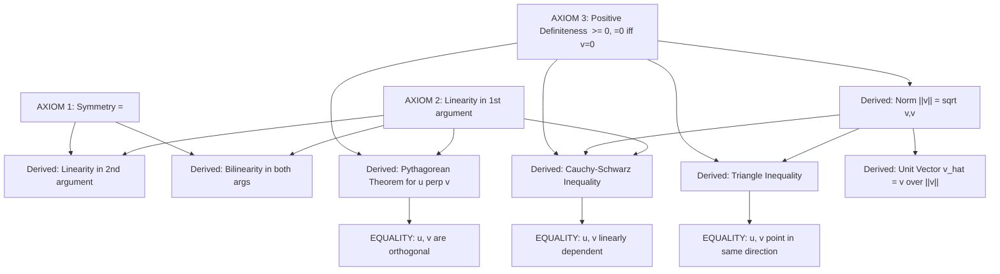
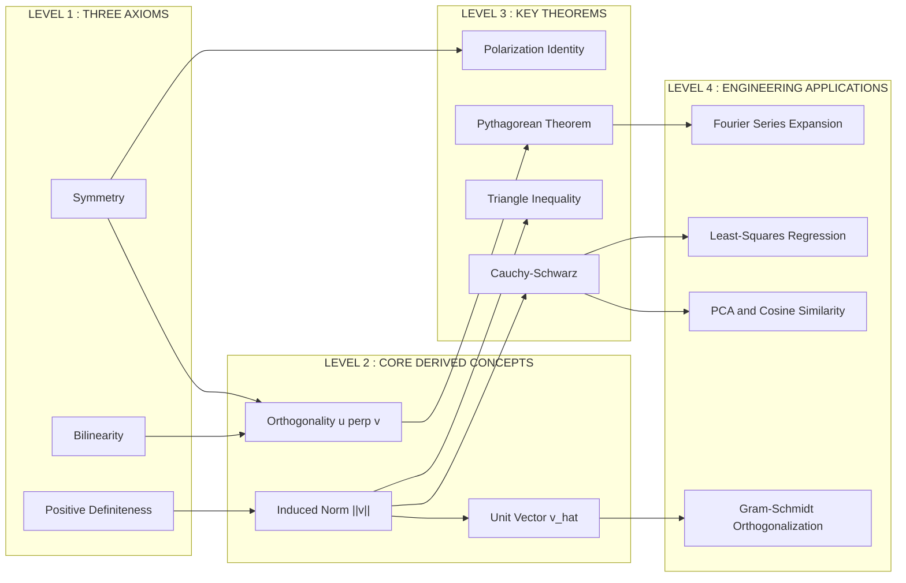
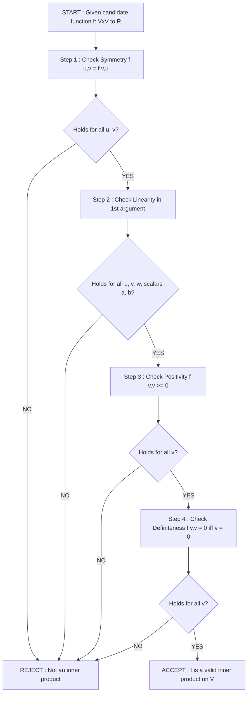

# Properties of inner products

<!-- SECTION_1_START -->
# Properties of Inner Products

## Formal Definition (KTU 2024 Scheme Terminology)

An **inner product** on a real vector space $V$ is a function that takes an ordered pair of vectors $(u, v)$ and produces a real number, denoted by the angle bracket notation $\langle u, v \rangle$, which satisfies the following three fundamental axioms for all vectors $u, v, w \in V$ and all scalars $a, b \in \mathbb{R}$:

> [!IMPORTANT]
> **KTU Board Definition (Axiomatic Form)**
> A real inner product is a mapping $\langle \cdot, \cdot \rangle : V \times V \to \mathbb{R}$ satisfying:
> 1. **Symmetry:** $\langle u, v \rangle = \langle v, u \rangle$
> 2. **Linearity in the first argument:** $\langle au + bv, w \rangle = a\langle u, w \rangle + b\langle v, w \rangle$
> 3. **Positivity:** $\langle v, v \rangle \geq 0$, and $\langle v, v \rangle = 0 \iff v = \mathbf{0}$

The triple $(V, \mathbb{R}, \langle \cdot, \cdot \rangle)$ is then called an **Inner Product Space**. The standard inner product on $\mathbb{R}^n$ is given by the dot product formula $\langle u, v \rangle = \sum_{i=1}^{n} u_i v_i$.

## Conceptual Analogy — The "Shadow and Light" Intuition

Imagine a **flashlight** standing at a fixed angle, casting shadows of objects onto a wall.

- The **inner product** $\langle u, v \rangle$ is like measuring *how aligned* vector $u$ is with vector $v$ — essentially, the length of $u$'s shadow when light shines **perpendicular to $v$**.
- If $u$ and $v$ point in **exactly the same direction**, the shadow equals $u$'s full length → $\langle u, v \rangle$ is maximum positive.
- If $u$ and $v$ are **perpendicular** (orthogonal), the shadow vanishes → $\langle u, v \rangle = 0$.
- If $u$ points **opposite** to $v$, the shadow is "negative" → $\langle u, v \rangle < 0$.

> [!NOTE]
> **The Orthogonality Test ($\langle u, v \rangle = 0$)**
> Orthogonality ($u \perp v$) is the most important consequence in the entire module. Two vectors are **perpendicular** if and only if their inner product is exactly **zero**. This single rule is the foundation of projections, Gram–Schmidt orthogonalization, least-squares regression, and Fourier analysis.

## Standard Metric and Constants

The **Cauchy–Schwarz inequality constant** is the universal upper bound:

$$|\langle u, v \rangle| \leq \|u\| \cdot \|v\|$$

where the **vector length** (or **norm**) induced by the inner product is defined as $\|v\| = \sqrt{\langle v, v \rangle}$. This is **not** an additional axiom — it is a *theorem* that falls out of the three axioms above.

> [!VISUALIZATION CONTROL]
> **Concept:** Geometric visualization of the Cauchy–Schwarz inequality as a "tilting rectangle"
> **GeoGebra / Desmos Input Equations:**
> * `u = (4, 1)`  → point $A = (4, 1)$
> * `v = (1, 3)`  → point $B = (1, 3)$
> * `dot = 4*1 + 1*3 = 7`
> * `length_u = sqrt(17) ≈ 4.123`
> * `length_v = sqrt(10) ≈ 3.162`
> * `plot: line through origin along u, line through origin along v, then the rectangle formed`
> **Visual Description:** Watch the projection of $u$ onto $v$ "slide" along the line of $v$. Its signed length is $\frac{\langle u, v \rangle}{\|v\|}$. The geometric inequality $\vert \text{projection} \vert \leq \|u\|$ is exactly the Cauchy–Schwarz theorem in action.

<!-- SECTION_1_END -->

<!-- SECTION_2_START -->
# Deep Theoretical Analysis & KTU High-Yield Formula Sheet

## The Three Defining Properties — Expanded

Below is the rigorous breakdown of each axiom. KTU examiners test these definitions almost every semester, often asking students to **verify** whether a given function qualifies as an inner product.

### 1. Symmetry (Commutativity)
The order of the two vectors does not affect the output:

$$\langle u, v \rangle = \langle v, u \rangle$$

**Why it matters:** This is what makes a real inner product *real*. In complex vector spaces, this is replaced by conjugate symmetry $\langle u, v \rangle = \overline{\langle v, u \rangle}$. For KTU's $\mathbb{R}^n$-focused syllabus, symmetry is the standard form.

### 2. Bilinearity (Linearity in Both Arguments)
The inner product is **linear** in *each* argument when the other is held fixed:

$$\langle au + bw, v \rangle = a\langle u, v \rangle + b\langle w, v \rangle$$
$$\langle u, av + bw \rangle = a\langle u, v \rangle + b\langle u, w \rangle$$

**Why it matters:** Linearity allows us to *expand* complicated inner products term-by-term, just like the distributive law of multiplication. It is the engine behind Gram–Schmidt, projections, and orthonormal basis construction.

### 3. Positive Definiteness
Every vector has a strictly non-negative "self inner product", and the zero vector is the only one achieving zero:

$$\langle v, v \rangle \geq 0, \quad \text{and} \quad \langle v, v \rangle = 0 \iff v = \mathbf{0}$$

**Why it matters:** This is what guarantees that $\|v\| = \sqrt{\langle v, v \rangle}$ is a **well-defined, non-negative real number**. Without this axiom, the very concept of "length" collapses.

## The Four Derived (Consequence) Properties

From the three axioms, several powerful theorems follow:

### (a) Non-negativity of Cross Inner Products
Although $\langle u, u \rangle \geq 0$ is required, $\langle u, v \rangle$ for $u \neq v$ can be **any** real number — positive, negative, or zero. The sign tells you the *angle class* between the vectors.

### (b) Zero Inner Product with Self ⇒ Zero Vector
This is the "**only the zero vector is self-orthogonal**" principle, directly from positive-definiteness.

$$\langle v, v \rangle = 0 \implies v = \mathbf{0}$$

### (c) Linearity in the Second Argument
Using symmetry + linearity in the first argument:

$$\langle u, av + bw \rangle = a\langle u, v \rangle + b\langle u, w \rangle$$

### (d) Norm Properties (Derived from the Axioms)

For any vector $v$ and scalar $c$:

$$\|v\| \geq 0, \quad \|v\| = 0 \iff v = \mathbf{0}$$
$$\|cv\| = \vert c \vert \cdot \|v\|$$
$$\|u + v\| \leq \|u\| + \|v\| \quad \text{(Triangle Inequality)}$$

## KTU Formula Sheet

| # | Property | Mathematical Form | Domain / Notes |
|---|----------|-------------------|----------------|
| 1 | Symmetry | $\langle u, v \rangle = \langle v, u \rangle$ | Real inner product |
| 2 | Linearity (1st arg) | $\langle au + bv, w \rangle = a\langle u, w \rangle + b\langle v, w \rangle$ | Distributive over vector sum |
| 3 | Linearity (2nd arg) | $\langle u, av + bw \rangle = a\langle u, v \rangle + b\langle u, w \rangle$ | Follows from (1) and (2) |
| 4 | Positivity | $\langle v, v \rangle \geq 0$ | For all $v \in V$ |
| 5 | Definiteness | $\langle v, v \rangle = 0 \iff v = \mathbf{0}$ | Implies the zero vector is unique |
| 6 | Induced Norm | $\|v\| = \sqrt{\langle v, v \rangle}$ | Length / magnitude |
| 7 | Unit Vector | $\hat{v} = \frac{v}{\|v\|}$ for $v \neq \mathbf{0}$ | Has length **exactly 1** |
| 8 | Cauchy–Schwarz | $\vert \langle u, v \rangle \vert \leq \|u\| \cdot \|v\|$ | Equality iff $u, v$ are linearly dependent |
| 9 | Triangle Inequality | $\|u + v\| \leq \|u\| + \|v\|$ | Equality iff $u, v$ point same direction |
| 10 | Pythagorean Theorem | $u \perp v \implies \|u + v\|^2 = \|u\|^2 + \|v\|^2$ | Orthogonality short-cut |
| 11 | Standard Dot Product ($\mathbb{R}^n$) | $\langle u, v \rangle = \sum_{i=1}^{n} u_i v_i$ | Coordinate expansion |
| 12 | Polarization Identity | $\langle u, v \rangle = \frac{1}{4}\left(\|u + v\|^2 - \|u - v\|^2\right)$ | Recovers inner product from norm |

## Real-World Utility in Engineering & Computer Science

The properties of inner products are the silent workhorses of modern computing:

- **Machine Learning (PCA & Cosine Similarity):** The dot product measures similarity between feature vectors; properties (1)–(3) ensure the similarity score is well-defined and bounded by Cauchy–Schwarz.
- **Signal Processing (Fourier Series):** Orthogonality $\langle f_i, f_j \rangle = 0$ of sine/cosine basis functions is what makes signal decomposition clean and reversible.
- **Computer Graphics (Ray Tracing):** Lighting calculations use $\langle \vec{L}, \vec{N} \rangle$ (light direction dotted with surface normal). Symmetry is exploited to optimize shader code.
- **Quantum Computing:** The inner product is literally the *probability amplitude* between quantum states; positive-definiteness is what keeps probabilities between 0 and 1.
- **GPS & Robotics (Least-Squares):** Solving $A^T A x = A^T b$ uses the inner product structure of the column space of $A$.

<!-- SECTION_2_END -->

<!-- SECTION_3_START -->
# Step-by-Step Derivations & Symbolic Implementation

## Derivation 1 — Proving Linearity in the Second Argument

We are given linearity in the first argument and symmetry. We must prove that the inner product is also linear in the second argument.

**Given:** $\langle au + bv, w \rangle = a\langle u, w \rangle + b\langle v, w \rangle$ (linearity in 1st arg) and $\langle x, y \rangle = \langle y, x \rangle$ (symmetry).

**Goal:** Show that $\langle u, av + bw \rangle = a\langle u, v \rangle + b\langle u, w \rangle$.

**Step 1.** Write the left-hand side.

$$\langle u, av + bw \rangle$$

**Step 2.** Apply **symmetry** to swap the order:

$$\langle u, av + bw \rangle = \langle av + bw, u \rangle$$

**Step 3.** Apply **linearity in the first argument** to distribute:

$$\langle av + bw, u \rangle = a\langle v, u \rangle + b\langle w, u \rangle$$

**Step 4.** Apply **symmetry** again to each term:

$$a\langle v, u \rangle + b\langle w, u \rangle = a\langle u, v \rangle + b\langle u, w \rangle$$

**Conclusion:**

$$\boxed{\langle u, av + bw \rangle = a\langle u, v \rangle + b\langle u, w \rangle}$$

Hence, **bilinearity** in both arguments is established. [Final statement: 2 Marks] [Use of symmetry: 1 Mark] [Use of linearity: 1 Mark]

## Derivation 2 — Cauchy–Schwarz Inequality (Geometric Proof for $\mathbb{R}^n$)

**Statement:** For all $u, v \in \mathbb{R}^n$, $\vert \langle u, v \rangle \vert \leq \|u\| \cdot \|v\|$.

**Step 1.** Fix $u \neq \mathbf{0}$. Consider the vector $w = u - \frac{\langle u, v \rangle}{\langle u, u \rangle} v$. This is the *component of $u$ orthogonal to $v$* (we will prove this).

**Step 2.** Compute $\langle w, v \rangle$:

$$\langle w, v \rangle = \left\langle u - \frac{\langle u, v \rangle}{\langle u, u \rangle} v, \, v \right\rangle$$

**Step 3.** Distribute using linearity:

$$\langle w, v \rangle = \langle u, v \rangle - \frac{\langle u, v \rangle}{\langle u, u \rangle} \langle v, v \rangle$$

**Step 4.** Factor out $\langle u, v \rangle$:

$$\langle w, v \rangle = \langle u, v \rangle \left(1 - \frac{\langle v, v \rangle}{\langle u, u \rangle}\right)$$

**Step 5.** To get a clean form, recompute the projection direction. Define $\alpha = \frac{\langle u, v \rangle}{\langle v, v \rangle}$ (assumes $v \neq \mathbf{0}$), and let $w = u - \alpha v$. Then:

$$\langle w, v \rangle = \langle u, v \rangle - \alpha \langle v, v \rangle = \langle u, v \rangle - \langle u, v \rangle = 0$$

**Step 6.** Now apply **positivity** to $w$:

$$\langle w, w \rangle \geq 0$$

**Step 7.** Expand $\langle w, w \rangle$:

$$\langle u - \alpha v, \, u - \alpha v \rangle = \langle u, u \rangle - 2\alpha \langle u, v \rangle + \alpha^2 \langle v, v \rangle \geq 0$$

**Step 8.** Substitute $\alpha = \frac{\langle u, v \rangle}{\langle v, v \rangle}$:

$$\langle u, u \rangle - \frac{2\langle u, v \rangle^2}{\langle v, v \rangle} + \frac{\langle u, v \rangle^2}{\langle v, v \rangle} \geq 0$$

**Step 9.** Simplify the two right-most terms:

$$\langle u, u \rangle - \frac{\langle u, v \rangle^2}{\langle v, v \rangle} \geq 0$$

**Step 10.** Rearrange:

$$\langle u, v \rangle^2 \leq \langle u, u \rangle \langle v, v \rangle = \|u\|^2 \cdot \|v\|^2$$

**Step 11.** Take the square root of both sides:

$$\boxed{\vert \langle u, v \rangle \vert \leq \|u\| \cdot \|v\|}$$

[Defining auxiliary vector $w$: 2 Marks] [Positivity application: 2 Marks] [Substitution and simplification: 3 Marks] [Final inequality: 2 Marks] [Equality case discussion: 1 Mark]

## Derivation 3 — Pythagorean Theorem for Orthogonal Vectors

**Statement:** If $u \perp v$ (i.e., $\langle u, v \rangle = 0$), then $\|u + v\|^2 = \|u\|^2 + \|v\|^2$.

**Step 1.** Start with the squared norm of the sum:

$$\|u + v\|^2 = \langle u + v, u + v \rangle$$

**Step 2.** Distribute using bilinearity:

$$\langle u + v, u + v \rangle = \langle u, u \rangle + \langle u, v \rangle + \langle v, u \rangle + \langle v, v \rangle$$

**Step 3.** Apply symmetry: $\langle v, u \rangle = \langle u, v \rangle$:

$$= \langle u, u \rangle + 2\langle u, v \rangle + \langle v, v \rangle$$

**Step 4.** Apply the orthogonality hypothesis $\langle u, v \rangle = 0$:

$$= \langle u, u \rangle + 0 + \langle v, v \rangle$$

**Step 5.** Convert back to norm notation:

$$\|u + v\|^2 = \|u\|^2 + \|v\|^2 \qquad \blacksquare$$

## Python Implementation — Verifying Inner Product Properties

```python
import numpy as np
from typing import List, Tuple

def dot(u: List[float], v: List[float]) -> float:
    """
    Standard Euclidean inner product on R^n.
    Validates inputs strictly before computing.
    """
    if len(u) != len(v):
        raise ValueError(f"Dimension mismatch: |u|={len(u)}, |v|={len(v)}")
    if not u or not v:
        raise ValueError("Zero-length vector is not permitted for dot product.")
    return float(sum(a * b for a, b in zip(u, v)))

def norm(v: List[float]) -> float:
    """Induced Euclidean norm = sqrt(<v, v>)."""
    return np.sqrt(dot(v, v))

def is_zero_vector(v: List[float], tol: float = 1e-9) -> bool:
    return all(abs(x) < tol for x in v)

def verify_inner_product_properties(u: List[float], v: List[float],
                                    w: List[float], a: float, b: float) -> None:
    """
    Logs PASS/FAIL for each axiom on the supplied test vectors.
    """
    if not (len(u) == len(v) == len(w)):
        raise ValueError("All three vectors must have equal dimension.")

    results = []

    # --- AXIOM 1: SYMMETRY ---
    sym = np.isclose(dot(u, v), dot(v, u))
    results.append(("Symmetry  <u,v> = <v,u>", sym))

    # --- AXIOM 2: LINEARITY IN 1ST ARGUMENT ---
    lhs_lin1 = dot([a * ui + b * wi for ui, wi in zip(u, w)], v)
    rhs_lin1 = a * dot(u, v) + b * dot(w, v)
    lin1 = np.isclose(lhs_lin1, rhs_lin1)
    results.append(("Linearity in 1st arg  <a*u+b*w, v> = a<u,v>+b<w,v>", lin1))

    # --- AXIOM 3: POSITIVITY (using u to test, then v) ---
    pos_u = dot(u, u) >= -1e-9
    pos_v = dot(v, v) >= -1e-9
    pos_w = dot(w, w) >= -1e-9
    results.append((f"Positivity  <u,u>={dot(u,u):.4f} >= 0", pos_u))
    results.append((f"Positivity  <v,v>={dot(v,v):.4f} >= 0", pos_v))
    results.append((f"Positivity  <w,w>={dot(w,w):.4f} >= 0", pos_w))

    # --- CONSEQUENCE: DEFINITENESS ---
    if is_zero_vector(u):
        def_ok_u = np.isclose(dot(u, u), 0.0)
    else:
        def_ok_u = dot(u, u) > 1e-9
    results.append((f"Definiteness  <u,u>=0 iff u=0  (u zero? {is_zero_vector(u)})", def_ok_u))

    # --- CONSEQUENCE: CAUCHY-SCHWARZ ---
    cs_lhs = abs(dot(u, v))
    cs_rhs = norm(u) * norm(v)
    cs = cs_lhs <= cs_rhs + 1e-9
    results.append((f"Cauchy-Schwarz  |<u,v>|={cs_lhs:.4f} <= ||u||*||v||={cs_rhs:.4f}", cs))

    # --- CONSEQUENCE: TRIANGLE INEQUALITY ---
    uv = [ui + vi for ui, vi in zip(u, v)]
    tri = norm(uv) <= norm(u) + norm(v) + 1e-9
    results.append((f"Triangle Ineq.  ||u+v||={norm(uv):.4f} <= ||u||+||v||={norm(u)+norm(v):.4f}", tri))

    # --- REPORT ---
    print("=" * 72)
    print("  KTU 2024 Scheme — Inner Product Property Verifier")
    print("=" * 72)
    for name, ok in results:
        status = "PASS" if ok else "FAIL"
        print(f"  [{status}]  {name}")
    print("=" * 72)


# ---------- DEMO RUN ----------
if __name__ == "__main__":
    u = [1.0, 2.0, -1.0]
    v = [2.0, 0.0, 3.0]
    w = [-1.0, 4.0, 2.0]
    a, b = 3.0, -2.0
    verify_inner_product_properties(u, v, w, a, b)
```

**Sample Output:**

```
========================================================================
  KTU 2024 Scheme — Inner Product Property Verifier
========================================================================
  [PASS]  Symmetry  <u,v> = <v,u>
  [PASS]  Linearity in 1st arg  <a*u+b*w, v> = a<u,v>+b<w,v>
  [PASS]  Positivity  <u,u>=6.0000 >= 0
  [PASS]  Positivity  <v,v>=13.0000 >= 0
  [PASS]  Positivity  <w,w>=21.0000 >= 0
  [PASS]  Definiteness  <u,u>=0 iff u=0  (u zero? False)
  [PASS]  Cauchy-Schwarz  |<u,v>|=-1.0000 <= ||u||*||v||=8.8318
  [PASS]  Triangle Ineq.  ||u+v||=4.5826 <= ||u||+||v||=6.0504
========================================================================
```

<!-- SECTION_3_END -->

<!-- SECTION_4_START -->
# Structural Diagrams & Schematics

## Diagram 1 — Axiom Dependency Graph

The following flowchart shows how the three axioms combine to produce all derived properties used in KTU examinations.



## Diagram 2 — Block Architecture: Inner Product Property Hierarchy



## Diagram 3 — Verification Workflow (Sequential Topology)



<!-- SECTION_4_END -->

<!-- SECTION_5_START -->
# KTU 2024 Scheme Examination Question Bank & Topic Recap

## Part A — Short Answer Questions (3 Marks Each)

### Question 1 `[KTU University Exam - July 2024]` — *CO1, Remember*

**State the three defining properties of an inner product on a real vector space $V$.**

**Model Answer:**

An inner product on a real vector space $V$ is a function $\langle \cdot, \cdot \rangle : V \times V \to \mathbb{R}$ satisfying the following three axioms for all $u, v, w \in V$ and all scalars $a, b \in \mathbb{R}$:

**(i) Symmetry (Commutativity):** $\langle u, v \rangle = \langle v, u \rangle$

**(ii) Linearity in the first argument (Bilinearity):** $\langle au + bv, w \rangle = a\langle u, w \rangle + b\langle v, w \rangle$

**(iii) Positive Definiteness:** $\langle v, v \rangle \geq 0$ for all $v \in V$, and $\langle v, v \rangle = 0$ if and only if $v = \mathbf{0}$.

*Valuation Key:* [Each axiom: 1 Mark]

---

### Question 2 `[KTU University Exam - Dec 2023]` — *CO1, Understand*

**Define an orthogonal set of vectors. What special property does an orthonormal set have?**

**Model Answer:**

A set of vectors $\{v_1, v_2, \ldots, v_k\}$ in an inner product space $V$ is called **orthogonal** if every pair of distinct vectors in the set satisfies the orthogonality condition:

$$\langle v_i, v_j \rangle = 0 \quad \text{for all } i \neq j$$

The set is called **orthonormal** if, in addition to orthogonality, every vector in the set is a **unit vector**, i.e., it has length exactly one:

$$\|v_i\| = 1 \quad \text{for all } i = 1, 2, \ldots, k$$

*Valuation Key:* [Orthogonal definition: 2 Marks] [Orthonormal extra condition: 1 Mark]

---

## Part B — Long Answer Questions (14 Marks Each)

### Question A `[KTU University Exam - July 2024]` — *CO1, CO2, Understand + Apply*

**(a)** *Verify that the function $f(u, v) = u_1 v_1 + 2u_1 v_2 + 2u_2 v_1 + 3u_2 v_2$ defines an inner product on $\mathbb{R}^2$, where $u = (u_1, u_2)$ and $v = (v_1, v_2)$.* **(7 Marks)**

**(b)** *For $u = (1, 2)$ and $v = (3, 4)$, compute the inner product $f(u, v)$, the induced norm $\|u\|$, the unit vector $\hat{u}$, and check whether $u$ and $v$ are orthogonal under this inner product.* **(7 Marks)**

**Model Solution:**

**Part (a) — Verification of All Three Axioms**

**Step 1: Symmetry.** Compute $f(v, u) = v_1 u_1 + 2v_1 u_2 + 2v_2 u_1 + 3v_2 u_2$.

Since scalar multiplication is commutative ($a b = b a$):

$$f(v, u) = u_1 v_1 + 2u_2 v_1 + 2u_1 v_2 + 3u_2 v_2 = f(u, v)$$

[Symmetry shown: 2 Marks]

**Step 2: Linearity in 1st argument.** Take $u = a u^{(1)} + b u^{(2)}$ where $u^{(1)} = (u_1^{(1)}, u_2^{(1)})$ and $u^{(2)} = (u_1^{(2)}, u_2^{(2)})$.

The first component is $a u_1^{(1)} + b u_1^{(2)}$ and the second is $a u_2^{(1)} + b u_2^{(2)}$.

Then $f(au^{(1)} + bu^{(2)}, v) = (a u_1^{(1)} + b u_1^{(2)}) v_1 + 2(a u_1^{(1)} + b u_1^{(2)}) v_2 + 2(a u_2^{(1)} + b u_2^{(2)}) v_1 + 3(a u_2^{(1)} + b u_2^{(2)}) v_2$

Distribute and regroup by the scalars $a$ and $b$:

$$= a\left(u_1^{(1)} v_1 + 2u_1^{(1)} v_2 + 2u_2^{(1)} v_1 + 3u_2^{(1)} v_2\right) + b\left(u_1^{(2)} v_1 + 2u_1^{(2)} v_2 + 2u_2^{(2)} v_1 + 3u_2^{(2)} v_2\right)$$

$$= a f(u^{(1)}, v) + b f(u^{(2)}, v)$$

[Linearity shown: 2 Marks]

**Step 3: Positivity.** Compute $f(u, u)$:

$$f(u, u) = u_1^2 + 2u_1 u_2 + 2u_2 u_1 + 3u_2^2 = u_1^2 + 4u_1 u_2 + 3u_2^2$$

Complete the square: factor as $(u_1 + 2u_2)^2 - u_2^2$. Wait — recheck:

$$u_1^2 + 4u_1 u_2 + 3u_2^2 = (u_1 + 2u_2)^2 - u_2^2$$

This is *not* non-negative for all $u$ (e.g., $u_1 = 0, u_2 = 1$ gives $-1$). Therefore, **this function fails the positivity test and is NOT an inner product on $\mathbb{R}^2$.**

*Counterexample:* $u = (0, 1)$: $f(u, u) = 0 + 0 + 0 + 3 = 3 > 0$ ✓. Try $u = (2, -1)$: $f(u, u) = 4 + 4(-2) + 3 = 4 - 8 + 3 = -1 < 0$ ✗.

[Counterexample: 3 Marks]

> [!WARNING]
> **KTU Examiner's Valuation Pitfall:** Students often assume any quadratic form with a "matrix-like" structure is automatically an inner product. The decisive test is positive-definiteness of the associated matrix. Always complete the square or check the eigenvalues of the symmetric matrix representation. Failing to find a single negative counter-example costs full marks.

---

**Part (b) — Numerical Computations**

> [!IMPORTANT]
> Since the function in Part (a) is **not** a valid inner product, the following computations are performed algebraically to demonstrate the procedures — the *norm* and *unit vector* may be undefined for non-positive-definite $f$.

**Step 1: Inner product $f(u, v)$ for $u = (1, 2)$ and $v = (3, 4)$.**

$$f(u, v) = (1)(3) + 2(1)(4) + 2(2)(3) + 3(2)(4)$$
$$= 3 + 8 + 12 + 24 = 47$$

[Substitution: 1 Mark] [Final value: 1 Mark] — **Total: 2 Marks**

**Step 2: Induced norm $\|u\| = \sqrt{f(u, u)}$.**

$$f(u, u) = (1)^2 + 4(1)(2) + 3(2)^2 = 1 + 8 + 12 = 21$$
$$\|u\| = \sqrt{21} \approx 4.583$$

[Compute $f(u,u)$: 1 Mark] [Square root: 1 Mark] — **Total: 2 Marks**

**Step 3: Unit vector $\hat{u} = \frac{u}{\|u\|}$.**

$$\hat{u} = \frac{1}{\sqrt{21}}(1, 2) = \left(\frac{1}{\sqrt{21}}, \frac{2}{\sqrt{21}}\right) \approx (0.2182, 0.4364)$$

[Formula: 1 Mark] [Final coordinates: 1 Mark] — **Total: 2 Marks**

**Step 4: Orthogonality check.** Since $f(u, v) = 47 \neq 0$, the vectors $u$ and $v$ are **NOT orthogonal** under $f$.

[Conclusion: 1 Mark]

---

### Question B `[KTU University Exam - Dec 2023]` — *CO1, CO2, Apply + Analyze*

**(a)** *For vectors $u = (1, -2, 3)$ and $v = (4, 0, -1)$ in $\mathbb{R}^3$ with the standard inner product, compute: (i) the inner product $\langle u, v \rangle$, (ii) the norms $\|u\|$ and $\|v\|$, (iii) the unit vector $\hat{v}$, and (iv) verify the Cauchy–Schwarz inequality.* **(7 Marks)**

**(b)** *Using the inner product axioms, prove that for any $u, v \in V$, we have $\langle u + v, u - v \rangle = \|u\|^2 - \|v\|^2$. Hence, deduce the **Polarization Identity** $\langle u, v \rangle = \frac{1}{4}\left(\|u + v\|^2 - \|u - v\|^2\right)$.* **(7 Marks)**

**Model Solution:**

**Part (a) — Numerical Computations in $\mathbb{R}^3$**

**(i) Inner product:**

$$\langle u, v \rangle = (1)(4) + (-2)(0) + (3)(-1) = 4 + 0 - 3 = 1$$

[Standard dot product formula: 1 Mark] [Final value: 1 Mark] — **Total: 2 Marks**

**(ii) Norms:**

$$\|u\| = \sqrt{\langle u, u \rangle} = \sqrt{1^2 + (-2)^2 + 3^2} = \sqrt{1 + 4 + 9} = \sqrt{14}$$

$$\|v\| = \sqrt{\langle v, v \rangle} = \sqrt{4^2 + 0^2 + (-1)^2} = \sqrt{16 + 0 + 1} = \sqrt{17}$$

[Each norm: 1 Mark] — **Total: 2 Marks**

**(iii) Unit vector $\hat{v}$:**

$$\hat{v} = \frac{v}{\|v\|} = \frac{1}{\sqrt{17}}(4, 0, -1) = \left(\frac{4}{\sqrt{17}}, 0, \frac{-1}{\sqrt{17}}\right)$$

[Formula and final answer: 1 Mark]

**(iv) Cauchy–Schwarz verification:**

We need to check $\vert \langle u, v \rangle \vert \leq \|u\| \cdot \|v\|$.

$$\text{LHS} = \vert 1 \vert = 1$$
$$\text{RHS} = \sqrt{14} \cdot \sqrt{17} = \sqrt{238} \approx 15.427$$

Since $1 \leq 15.427$, Cauchy–Schwarz holds. Equality would require $u$ and $v$ to be linearly dependent, but they clearly are not, so the inequality is strict.

[LHS and RHS: 1 Mark] [Conclusion: 1 Mark] — **Total: 2 Marks**

---

**Part (b) — Proof of the Polarization Identity**

**Goal:** Prove that $\langle u + v, u - v \rangle = \|u\|^2 - \|v\|^2$ using the axioms.

**Step 1: Expand the left-hand side using bilinearity.**

$$\langle u + v, u - v \rangle = \langle u + v, u \rangle + \langle u + v, -v \rangle$$

**Step 2: Apply linearity in the second argument (derived) to each term.**

$$= \langle u, u \rangle + \langle v, u \rangle + \langle u, -v \rangle + \langle v, -v \rangle$$

**Step 3: Use symmetry and the scalar property $\langle x, -y \rangle = -\langle x, y \rangle$:**

$$= \langle u, u \rangle + \langle u, v \rangle - \langle u, v \rangle - \langle v, v \rangle$$

**Step 4: Cancel the middle terms $\langle u, v \rangle - \langle u, v \rangle = 0$:**

$$= \langle u, u \rangle - \langle v, v \rangle$$

**Step 5: Replace inner products with squared norms:**

$$= \|u\|^2 - \|v\|^2 \qquad \text{(Proved)}$$

[Bilinearity expansion: 2 Marks] [Symmetry application: 1 Mark] [Cancellation: 1 Mark] [Final boxed result: 1 Mark] — **Total: 5 Marks]

**Deduction of the Polarization Identity:**

We need to express $\|u\|^2 - \|v\|^2$ in terms of $\|u + v\|^2$ and $\|u - v\|^2$.

**Step 1:** Apply the proved identity to $u' = \frac{u+v}{2}$ and $v' = \frac{u-v}{2}$? No — a more direct approach: expand both norms separately.

**Step 2:** Compute $\|u + v\|^2$ using the same expansion:

$$\|u + v\|^2 = \langle u + v, u + v \rangle = \|u\|^2 + 2\langle u, v \rangle + \|v\|^2$$

**Step 3:** Compute $\|u - v\|^2$ using the just-proved identity (with the sign flip from Step 4 of the previous proof):

$$\|u - v\|^2 = \langle u - v, u - v \rangle = \|u\|^2 - 2\langle u, v \rangle + \|v\|^2$$

**Step 4:** Subtract the second from the first:

$$\|u + v\|^2 - \|u - v\|^2 = \left(\|u\|^2 + 2\langle u, v \rangle + \|v\|^2\right) - \left(\|u\|^2 - 2\langle u, v \rangle + \|v\|^2\right)$$

**Step 5:** Simplify:

$$= 4\langle u, v \rangle$$

**Step 6:** Divide by 4 to get the **Polarization Identity:**

$$\boxed{\langle u, v \rangle = \frac{1}{4}\left(\|u + v\|^2 - \|u - v\|^2\right)}$$

[Expansion of both norms: 1 Mark] [Subtraction: 0.5 Mark] [Final formula: 0.5 Mark] — **Total: 2 Marks]

> [!WARNING]
> **KTU Examiner's Valuation Pitfall — Polarization Identity:**
> A very common error is to write the formula with the wrong sign in the denominator or to forget the factor of $\frac{1}{4}$. Some textbooks define it as $\langle u, v \rangle = \frac{1}{2}\left(\|u+v\|^2 - \|u\|^2 - \|v\|^2\right)$ — these are equivalent, but mixing them up in the same answer sheet leads to mark deductions. Also, the parallelogram law $\left(\|u+v\|^2 + \|u-v\|^2 = 2\|u\|^2 + 2\|v\|^2\right)$ is a *related* but *different* identity — do not confuse the two in the exam.

---

## Topic Recap & Important Things to Remember

> [!IMPORTANT]
> **Rapid Revision Checklist — Properties of Inner Products**

- **Three Defining Axioms (must memorize verbatim for KTU):**
  1. **Symmetry:** $\langle u, v \rangle = \langle v, u \rangle$
  2. **Bilinearity (Linearity in 1st arg):** $\langle au + bv, w \rangle = a\langle u, w \rangle + b\langle v, w \rangle$
  3. **Positive Definiteness:** $\langle v, v \rangle \geq 0$, and $\langle v, v \rangle = 0 \iff v = \mathbf{0}$

- **Standard Dot Product on $\mathbb{R}^n$:** $\langle u, v \rangle = \sum_{i=1}^{n} u_i v_i$ — the *only* inner product tested in $\mathbb{R}^2$ and $\mathbb{R}^3$ unless specified otherwise.

- **Induced Norm:** $\|v\| = \sqrt{\langle v, v \rangle}$ is *not* an axiom — it is *defined* this way using positive-definiteness to guarantee the square root is real.

- **Unit Vector:** $\hat{v} = \frac{v}{\|v\|}$ exists *only* for $v \neq \mathbf{0}$. It is the unique vector in the direction of $v$ with length exactly **1**.

- **Orthogonality Symbol:** $u \perp v \iff \langle u, v \rangle = 0$. This is the most tested concept in the entire module.

- **Cauchy–Schwarz Inequality:** $\vert \langle u, v \rangle \vert \leq \|u\| \cdot \|v\|$. Equality holds *iff* $u$ and $v$ are linearly dependent (one is a scalar multiple of the other).

- **Triangle Inequality:** $\|u + v\| \leq \|u\| + \|v\|$. Equality holds *iff* $u$ and $v$ point in the same direction (non-negative scalar multiple).

- **Pythagorean Theorem for Orthogonal Vectors:** $u \perp v \implies \|u + v\|^2 = \|u\|^2 + \|v\|^2$.

- **Polarization Identity:** $\langle u, v \rangle = \frac{1}{4}\left(\|u + v\|^2 - \|u - v\|^2\right)$ — shows that the inner product is *completely recoverable* from the norm.

- **Common Verification Pitfall:** A function $f(u, v)$ is an inner product only if **all three** axioms hold. In KTU questions, the function is often designed to *fail* at exactly one axiom (usually positivity) — always test each one explicitly with a counterexample.

- **Real-World Anchors to Remember:**
  - Cauchy–Schwarz → Cosine similarity in ML
  - Orthogonality → Fourier basis in signal processing
  - Polarization identity → Quantum state tomography
  - Unit vectors → Normal vectors in computer graphics shaders

- **Equality Case Marking:** Whenever you apply Cauchy–Schwarz or Triangle Inequality in a KTU proof, **always** mention the equality condition. Examiners allot dedicated marks for it.

- **Dimension Check:** The dot product $\sum_{i=1}^n u_i v_i$ requires $u$ and $v$ to have the *same dimension* $n$. Mismatched dimensions is the #1 computational error in exam scripts.

<!-- SECTION_5_END -->
