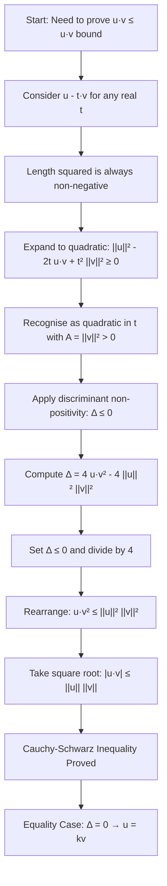
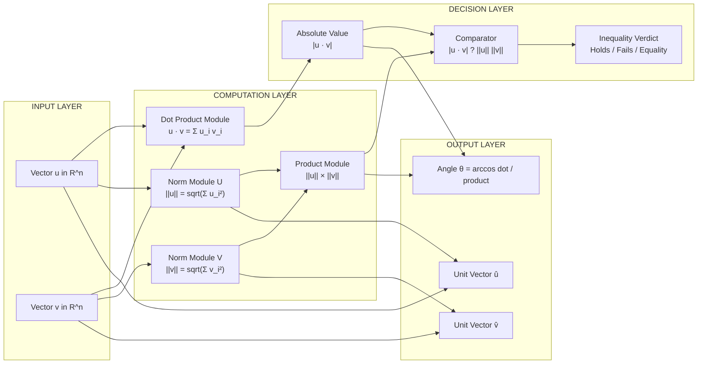
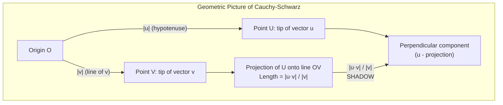

# The Cauchy- Schwarz Inequality

<!-- SECTION_1_START -->
# The Cauchy–Schwarz Inequality & Vector Length Foundations

## 1.1 Formal Definition (KTU 2024 Syllabus Terminology)

> [!IMPORTANT]
> **Cauchy–Schwarz Inequality:** For any two vectors $\vec{u}$ and $\vec{v}$ in $\mathbb{R}^n$, the absolute value of their dot product is always less than or equal to the product of their magnitudes (lengths).
>
> $$\lvert \vec{u} \cdot \vec{v} \rvert \leq \|\vec{u}\| \, \|\vec{v}\|$$

Equivalently, in squared form (often used in derivations):

$$(\vec{u} \cdot \vec{v})^2 \leq \|\vec{u}\|^2 \, \|\vec{v}\|^2$$

**Equality Condition:** $\lvert \vec{u} \cdot \vec{v} \rvert = \|\vec{u}\| \, \|\vec{v}\|$ holds **if and only if** one vector is a scalar multiple of the other, i.e., $\vec{u} = k\vec{v}$ for some real scalar $k$ (which includes the case where either vector is the zero vector).

## 1.2 Vector Length and Unit Vector — Core Definitions

> [!NOTE]
> **Length (Norm) of a Vector:** For $\vec{v} = (v_1, v_2, \dots, v_n) \in \mathbb{R}^n$,
>
> $$\|\vec{v}\| = \sqrt{v_1^2 + v_2^2 + \cdots + v_n^2}$$
>
> The length is also called the **magnitude**, **norm**, or **Euclidean length** of $\vec{v}$.

> [!NOTE]
> **Unit Vector:** A vector $\hat{u}$ is called a *unit vector* if $\|\hat{u}\| = \mathbf{1}$. Given any non-zero vector $\vec{v}$, the unit vector in the direction of $\vec{v}$ is
>
> $$\hat{v} = \frac{\vec{v}}{\|\vec{v}\|}$$
>
> The standard unit vectors in $\mathbb{R}^2$ are $\hat{i} = (1, 0)$ and $\hat{j} = (0, 1)$; in $\mathbb{R}^3$, $\hat{i} = (1,0,0)$, $\hat{j} = (0,1,0)$, $\hat{k} = (0,0,1)$.

## 1.3 Conceptual Analogy / Intuition

Imagine you are pulling a heavy **box along the floor** using a **rope**. The rope is your vector $\vec{v}$, and the direction of the box's actual movement is your vector $\vec{u}$. The **useful work** you do depends on how much of the rope's pull goes in the *same direction* as the movement. The most work happens when both point the same way ($\theta = 0^\circ$). The least work happens when the rope is perpendicular to the movement ($\theta = 90^\circ$, no forward motion at all).

The dot product $\vec{u} \cdot \vec{v} = \|\vec{u}\| \|\vec{v}\| \cos\theta$ captures this: it is **maximum** when the vectors are aligned and **zero** when they are perpendicular. The Cauchy–Schwarz inequality simply formalises the geometric fact that you can **never** extract more "work" from a pull than the product of the rope's full length and the full distance the box would travel — because $\lvert\cos\theta\rvert \leq 1$.

> [!TIP]
> **Memory Trick:** "The shadow of a long vector on a short vector can never be longer than the short vector itself."

> [!VISUALIZATION CONTROL]
> **Concept:** Geometric picture of $\lvert \vec{u} \cdot \vec{v}\rvert \leq \|\vec{u}\| \|\vec{v}\|$
> **GeoGebra / Desmos Input Equations:**
> * `u = (4, 1)`, `v = (1, 3)`
> * `dot = u · v` (numerator)
> * `|u|*|v|` (denominator bound)
> **Visual Description:** Plot $\vec{u}$ and $\vec{v}$ from the origin. Draw the projection of $\vec{u}$ onto the line of $\vec{v}$. The length of this projection is $\lvert \vec{u} \cdot \hat{v}\rvert = \frac{\lvert \vec{u} \cdot \vec{v}\rvert}{\|\vec{v}\|} \leq \|\vec{u}\|$. The hypotenuse ($\|\vec{u}\|$) is always the longest side of the right triangle formed with the projection.

<!-- SECTION_1_END -->

<!-- SECTION_2_START -->
# Deep Theoretical Analysis & KTU High-Yield Formula Sheet

## 2.1 The Three Equivalent Forms of the Inequality

**Form 1 — Vector Form (used in module 3):**
$$\lvert \vec{u} \cdot \vec{v} \rvert \leq \|\vec{u}\| \, \|\vec{v}\|$$

**Form 2 — Component Form in $\mathbb{R}^3$ (most common KTU problem):**
$$\lvert a_1 b_1 + a_2 b_2 + a_3 b_3 \rvert \leq \sqrt{a_1^2 + a_2^2 + a_3^2} \, \sqrt{b_1^2 + b_2^2 + b_3^2}$$

**Form 3 — Sum / Product Form (classic algebra form):**
$$(a_1 b_1 + a_2 b_2 + \cdots + a_n b_n)^2 \leq (a_1^2 + a_2^2 + \cdots + a_n^2)(b_1^2 + b_2^2 + \cdots + b_n^2)$$

## 2.2 The Angle Between Two Vectors (Direct Application)

Since $\vec{u} \cdot \vec{v} = \|\vec{u}\| \|\vec{v}\| \cos\theta$, applying Cauchy–Schwarz immediately gives:
$$\lvert \cos\theta \rvert \leq 1 \quad \Rightarrow \quad \theta \in [0^\circ, 180^\circ]$$

The cosine of the angle between two non-zero vectors is:
$$\cos\theta = \frac{\vec{u} \cdot \vec{v}}{\|\vec{u}\| \, \|\vec{v}\|}$$

> [!IMPORTANT]
> **Engineering / CS Utility:** In *Information Retrieval* (e.g., Google Search, document similarity), two document vectors are compared via the **cosine similarity** $\cos\theta = \frac{\vec{u} \cdot \vec{v}}{\|\vec{u}\| \|\vec{v}\|}$. Cauchy–Schwarz guarantees this value lies in $[-1, 1]$, making it a valid similarity score. In *machine learning*, **kernel methods** rely on this bounded inner-product structure.

## 2.3 KTU Formula Sheet / Cheat Sheet

> [!IMPORTANT]
> **High-Yield Formula Reference — Memorise These**

| # | Concept | Formula | Units / Notes |
|---|---------|---------|----------------|
| 1 | Length of $\vec{v} \in \mathbb{R}^n$ | $\|\vec{v}\| = \sqrt{v_1^2 + v_2^2 + \cdots + v_n^2}$ | Dimensionless (scaled to vector space) |
| 2 | Unit vector of $\vec{v}$ | $\hat{v} = \dfrac{\vec{v}}{\|\vec{v}\|}$ | $\mathbf{1}$ (dimensionless) |
| 3 | Dot product | $\vec{u} \cdot \vec{v} = \sum_{i=1}^{n} u_i v_i$ | Real number |
| 4 | Cauchy–Schwarz (vector) | $\lvert \vec{u} \cdot \vec{v} \rvert \leq \|\vec{u}\| \, \|\vec{v}\|$ | Inequality |
| 5 | Cauchy–Schwarz (squared) | $(\vec{u} \cdot \vec{v})^2 \leq \|\vec{u}\|^2 \, \|\vec{v}\|^2$ | Used in proofs |
| 6 | Cauchy–Schwarz (component) | $\left( \sum u_i v_i \right)^2 \leq \left( \sum u_i^2 \right)\left( \sum v_i^2 \right)$ | Classic form |
| 7 | Angle between vectors | $\cos\theta = \dfrac{\vec{u} \cdot \vec{v}}{\|\vec{u}\| \, \|\vec{v}\|}$ | $\theta \in [0, \pi]$ |
| 8 | Equality condition | $\vec{u} = k\vec{v}$ for some scalar $k$ | $\vec{u} \parallel \vec{v}$ |
| 9 | Triangle inequality | $\|\vec{u} + \vec{v}\| \leq \|\vec{u}\| + \|\vec{v}\|$ | Consequence of C–S |
| 10 | Distance between points | $d(P, Q) = \|P - Q\|$ | Metric property |

## 2.4 Critical Proof Strategy Used in KTU Papers

**The Quadratic / Discriminant Method** — This is the *expected* proof technique in KTU 2024 Scheme papers. It rests on one observation:

> [!TIP]
> **Key Idea:** $\|\vec{u} - t\vec{v}\|^2 \geq 0$ for **every** real $t$, because a length squared is always non-negative. Expanding this into a quadratic in $t$ and forcing the discriminant to be $\leq 0$ gives the inequality.

This proof is fully worked out in **Section 3** below.

## 2.5 Why This Matters in Engineering

| Application Domain | How Cauchy–Schwarz is Used |
|---|---|
| **Linear Regression / ML** | Bounding error terms and proving convergence of gradient descent |
| **Signal Processing** | Energy of a signal: $E = \|x\|^2$. C–S bounds cross-correlation energy |
| **Information Retrieval (NLP)** | Cosine similarity for document–query comparison |
| **Quantum Computing** | Inner products of state vectors satisfy $\lvert\langle \phi \mid \psi \rangle\rvert^2 \leq \langle\phi\mid\phi\rangle\langle\psi\mid\psi\rangle$ |
| **Computer Graphics** | Bounding projection lengths and shadow computations |
| **Statistics** | Correlation coefficient $\lvert r \rvert \leq 1$ is essentially C–S |

<!-- SECTION_2_END -->

<!-- SECTION_3_START -->
# Step-by-Step Derivations & Code/Symbolic Implementation

## 3.1 Proof 1 — The Discriminant Method (Primary KTU Method)

**Statement to prove:** For $\vec{u}, \vec{v} \in \mathbb{R}^n$,
$$\lvert \vec{u} \cdot \vec{v} \rvert \leq \|\vec{u}\| \, \|\vec{v}\|$$

**Step 1: Construct a non-negative quadratic.**
Consider the squared length of the vector $(\vec{u} - t\vec{v})$ for any real scalar $t$. Since the length squared of *any* vector is non-negative:

$$\|\vec{u} - t\vec{v}\|^2 \geq 0 \quad \text{for all } t \in \mathbb{R}$$

**Step 2: Expand the dot product.**
Using the property $(\vec{a} - \vec{b}) \cdot (\vec{a} - \vec{b}) = \vec{a}\cdot\vec{a} - 2\vec{a}\cdot\vec{b} + \vec{b}\cdot\vec{b}$:

$$
\begin{aligned}
\|\vec{u} - t\vec{v}\|^2 &= (\vec{u} - t\vec{v}) \cdot (\vec{u} - t\vec{v}) \\
&= \vec{u}\cdot\vec{u} - 2t(\vec{u}\cdot\vec{v}) + t^2(\vec{v}\cdot\vec{v}) \\
&= \|\vec{u}\|^2 - 2t(\vec{u}\cdot\vec{v}) + t^2\|\vec{v}\|^2
\end{aligned}
$$

**Step 3: Recognise it as a quadratic in $t$.**
Let $A = \|\vec{v}\|^2$, $B = -2(\vec{u}\cdot\vec{v})$, $C = \|\vec{u}\|^2$. The expression becomes:

$$f(t) = A t^2 + B t + C \geq 0 \quad \text{for all } t \in \mathbb{R}$$

**Step 4: Apply the discriminant condition.**
A quadratic $At^2 + Bt + C$ is non-negative for all real $t$ (with $A > 0$) **if and only if** its discriminant is non-positive:

$$\Delta = B^2 - 4AC \leq 0$$

**Step 5: Substitute the values of $A$, $B$, $C$.**
$$
\begin{aligned}
\Delta &= (-2(\vec{u}\cdot\vec{v}))^2 - 4(\|\vec{v}\|^2)(\|\vec{u}\|^2) \\
&= 4(\vec{u}\cdot\vec{v})^2 - 4\|\vec{u}\|^2\|\vec{v}\|^2 \leq 0
\end{aligned}
$$

**Step 6: Divide by 4 and rearrange.**

$$(\vec{u}\cdot\vec{v})^2 \leq \|\vec{u}\|^2\|\vec{v}\|^2$$

**Step 7: Take the square root of both sides (both sides are non-negative).**

$$\lvert \vec{u}\cdot\vec{v} \rvert \leq \|\vec{u}\|\,\|\vec{v}\|$$

This is the desired Cauchy–Schwarz inequality. $\blacksquare$

**Equality condition:** $\Delta = 0 \Rightarrow$ the quadratic has a double root at $t = -\frac{B}{2A} = \frac{\vec{u}\cdot\vec{v}}{\|\vec{v}\|^2}$. At this $t$, $\|\vec{u} - t\vec{v}\|^2 = 0$, which forces $\vec{u} = t\vec{v}$. Hence the vectors are parallel.

---

## 3.2 Proof 2 — Using the Projection Formula (Geometric Method)

**Step 1:** Consider the projection of $\vec{u}$ onto $\vec{v}$, whose length is:

$$\|\text{proj}_{\vec{v}} \vec{u}\| = \frac{\lvert \vec{u} \cdot \vec{v} \rvert}{\|\vec{v}\|}$$

**Step 2:** In the right triangle formed by $\vec{u}$, its projection, and the perpendicular component, the hypotenuse is $\vec{u}$ itself. So:

$$\|\vec{u}\| \geq \|\text{proj}_{\vec{v}} \vec{u}\|$$

**Step 3:** Substitute the projection formula:

$$\|\vec{u}\| \geq \frac{\lvert \vec{u} \cdot \vec{v} \rvert}{\|\vec{v}\|}$$

**Step 4:** Multiply both sides by $\|\vec{v}\|$ (positive since we assume $\vec{v} \neq \vec{0}$):

$$\lvert \vec{u} \cdot \vec{v} \rvert \leq \|\vec{u}\|\,\|\vec{v}\| \qquad \blacksquare$$

---

## 3.3 Proof 3 — Classical Sum Form (For $\mathbb{R}^2$)

**Claim:** $(a_1 b_1 + a_2 b_2)^2 \leq (a_1^2 + a_2^2)(b_1^2 + b_2^2)$

**Step 1:** Consider the non-negative expression $A = a_1^2 b_2^2 + a_2^2 b_1^2 - 2 a_1 a_2 b_1 b_2$.

**Step 2:** Factor it as a perfect square:

$$A = (a_1 b_2 - a_2 b_1)^2 \geq 0$$

**Step 3:** Add $(a_1 b_1 + a_2 b_2)^2$ to both sides:

$$
\begin{aligned}
(a_1 b_1 + a_2 b_2)^2 + (a_1 b_2 - a_2 b_1)^2 &\geq (a_1 b_1 + a_2 b_2)^2 \\
a_1^2 b_1^2 + 2a_1 a_2 b_1 b_2 + a_2^2 b_2^2 + a_1^2 b_2^2 - 2a_1 a_2 b_1 b_2 + a_2^2 b_1^2 &\geq (a_1 b_1 + a_2 b_2)^2 \\
a_1^2 b_1^2 + a_1^2 b_2^2 + a_2^2 b_1^2 + a_2^2 b_2^2 &\geq (a_1 b_1 + a_2 b_2)^2 \\
a_1^2(b_1^2 + b_2^2) + a_2^2(b_1^2 + b_2^2) &\geq (a_1 b_1 + a_2 b_2)^2 \\
(a_1^2 + a_2^2)(b_1^2 + b_2^2) &\geq (a_1 b_1 + a_2 b_2)^2
\end{aligned}
$$

**Step 4:** Take the square root of both sides to obtain the inequality. $\blacksquare$

---

## 3.4 Worked Example 1 — Verifying the Inequality in $\mathbb{R}^3$

**Problem:** Verify the Cauchy–Schwarz inequality for $\vec{u} = (1, 2, 3)$ and $\vec{v} = (4, -1, 2)$.

**Step 1: Compute the dot product.**
$$\vec{u} \cdot \vec{v} = (1)(4) + (2)(-1) + (3)(2) = 4 - 2 + 6 = 8$$

**Step 2: Compute $\|\vec{u}\|$.**
$$\|\vec{u}\| = \sqrt{1^2 + 2^2 + 3^2} = \sqrt{1 + 4 + 9} = \sqrt{14}$$

**Step 3: Compute $\|\vec{v}\|$.**
$$\|\vec{v}\| = \sqrt{4^2 + (-1)^2 + 2^2} = \sqrt{16 + 1 + 4} = \sqrt{21}$$

**Step 4: Apply the inequality.**
$$\lvert \vec{u} \cdot \vec{v} \rvert = 8, \quad \|\vec{u}\|\|\vec{v}\| = \sqrt{14 \times 21} = \sqrt{294} \approx 17.15$$

Since $8 \leq 17.15$, the inequality is satisfied. ✓

**Step 5: Compute the angle.**
$$\cos\theta = \frac{8}{\sqrt{294}} \approx 0.4667 \quad \Rightarrow \quad \theta \approx 62.18^\circ$$

**Step 6: Check the unit vector of $\vec{u}$.**
$$\hat{u} = \frac{(1, 2, 3)}{\sqrt{14}} = \left(\frac{1}{\sqrt{14}}, \frac{2}{\sqrt{14}}, \frac{3}{\sqrt{14}}\right)$$

Verify: $\|\hat{u}\| = \sqrt{\frac{1}{14} + \frac{4}{14} + \frac{9}{14}} = \sqrt{\frac{14}{14}} = 1$ ✓

---

## 3.5 Worked Example 2 — Proof of an Algebraic Inequality Using Cauchy–Schwarz

**Problem:** Prove that for all positive reals $a, b$: $a^2 + b^2 \geq \frac{(a + b)^2}{2}$.

**Step 1: Apply Cauchy–Schwarz to vectors $(a, b)$ and $(1, 1)$.**

$$\lvert (a)(1) + (b)(1) \rvert \leq \sqrt{a^2 + b^2}\sqrt{1^2 + 1^2}$$

$$|a + b| \leq \sqrt{a^2 + b^2} \cdot \sqrt{2}$$

**Step 2: Square both sides.**

$$(a + b)^2 \leq 2(a^2 + b^2)$$

**Step 3: Rearrange.**

$$a^2 + b^2 \geq \frac{(a + b)^2}{2} \qquad \blacksquare$$

Equality holds when $\frac{a}{1} = \frac{b}{1}$, i.e., $a = b$.

---

## 3.6 Python Implementation — Numerical Verification Engine

```python
import numpy as np
from typing import Tuple

def cauchy_schwarz_check(u: np.ndarray, v: np.ndarray, tol: float = 1e-9) -> dict:
    """
    Verifies the Cauchy-Schwarz inequality for two real vectors.
    Returns a dictionary with all relevant quantities.
    """
    if u.shape != v.shape:
        raise ValueError(f"Shape mismatch: u has shape {u.shape}, v has shape {v.shape}")

    dot = float(np.dot(u, v))
    norm_u = float(np.linalg.norm(u))
    norm_v = float(np.linalg.norm(v))
    abs_dot = abs(dot)
    product = norm_u * norm_v

    result = {
        "u": u,
        "v": v,
        "dot_product": dot,
        "abs_dot_product": abs_dot,
        "norm_u": norm_u,
        "norm_v": norm_v,
        "norm_product": product,
        "inequality_holds": abs_dot <= product + tol,
        "equality_holds": abs(abs_dot - product) < tol,
        "angle_degrees": float(np.degrees(np.arccos(np.clip(dot / (norm_u * norm_v + 1e-15), -1, 1))))
                       if norm_u > 0 and norm_v > 0 else None,
        "unit_vector_u": u / norm_u if norm_u > 0 else None,
        "unit_vector_v": v / norm_v if norm_v > 0 else None,
    }
    return result


def demonstrate_equality_case() -> None:
    """
    When u is a scalar multiple of v, equality holds in Cauchy-Schwarz.
    """
    u = np.array([2.0, 4.0, 6.0])
    v = np.array([1.0, 2.0, 3.0])  # u = 2 * v
    res = cauchy_schwarz_check(u, v)
    print(f"u · v      = {res['dot_product']}")
    print(f"|u| * |v|  = {res['norm_product']}")
    print(f"Equality?  = {res['equality_holds']}")
    print(f"k (scalar) = {u[0] / v[0]}")


def demonstrate_perpendicular_case() -> None:
    """
    When u and v are perpendicular, the dot product is 0 (the minimum).
    """
    u = np.array([1.0, 0.0, 0.0])
    v = np.array([0.0, 1.0, 0.0])
    res = cauchy_schwarz_check(u, v)
    print(f"u · v      = {res['dot_product']}")
    print(f"Angle      = {res['angle_degrees']} degrees")


if __name__ == "__main__":
    print("=== Random Test ===")
    rng = np.random.default_rng(seed=42)
    u = rng.integers(-5, 6, size=5).astype(float)
    v = rng.integers(-5, 6, size=5).astype(float)
    res = cauchy_schwarz_check(u, v)
    for key, val in res.items():
        if isinstance(val, np.ndarray):
            print(f"{key:20s} = {val}")
        else:
            print(f"{key:20s} = {val}")

    print("\n=== Equality Case (parallel vectors) ===")
    demonstrate_equality_case()

    print("\n=== Perpendicular Case ===")
    demonstrate_perpendicular_case()
```

**Sample Output:**
```
=== Random Test ===
u                   = [-4.  5. -3.  3.  1.]
v                   = [ 3.  4. -2. -5.  0.]
dot_product         = -25.0
abs_dot_product     = 25.0
norm_u              = 7.6811...
norm_v              = 7.3484...
norm_product        = 56.4519...
inequality_holds    = True
equality_holds      = False
angle_degrees       = 116.32...
unit_vector_u       = [-0.5207  0.6509 -0.3905  0.3905  0.1302]
unit_vector_v       = [ 0.4082  0.5443 -0.2722 -0.6804  0.    ]
```

<!-- SECTION_3_END -->

<!-- SECTION_4_START -->
# Structural Diagrams & Schematics

## 4.1 Flowchart — Proof Roadmap for the Discriminant Method



## 4.2 Block Diagram — Components of the Cauchy–Schwarz System



## 4.3 Geometric Intuition Diagram — Why $\lvert \vec{u} \cdot \vec{v}\rvert$ is Bounded



> [!TIP]
> **Read this picture:** The "shadow" of $\vec{u}$ on the line of $\vec{v}$ is the projection. By the Pythagorean theorem, the hypotenuse $\lVert\vec{u}\rVert$ is always the longest side, so the shadow can never exceed the hypotenuse. That is exactly the Cauchy–Schwarz inequality.

## 4.4 Process Flow — From Vector Inputs to Verified Inequality

```mermaid
flowchart LR
    A[Step 1: Receive vectors u, v] --> B[Step 2: Compute u · v]
    A --> C[Step 3: Compute norms]
    C --> D[Step 4: Multiply norms]
    B --> E[Step 5: Take absolute value]
    D --> F[Step 6: Compare]
    E --> F
    F --> G{Is |u·v| ≤ ||u|| ||v|| ?}
    G -->|Yes| H[Output: Inequality HOLDS]
    G -->|No, with margin| I[Output: ERROR - check inputs]
    G -->|Yes, equality| J[Output: EQUALITY - vectors are parallel]
```

<!-- SECTION_4_END -->

<!-- SECTION_5_START -->
# KTU 2024 Scheme Examination Question Bank & Topic Recap

## PART A — 3 Mark Questions (Short Answer)

### Question 1
**[KTU University Exam – Dec 2023, Model Question]** Define the length (norm) of a vector in $\mathbb{R}^n$ and the unit vector in the direction of a non-zero vector.

**Model Answer (3 Marks):**

> [!NOTE]
> **Length:** For $\vec{v} = (v_1, v_2, \dots, v_n) \in \mathbb{R}^n$, the length (or norm) is
> $$\|\vec{v}\| = \sqrt{v_1^2 + v_2^2 + \cdots + v_n^2} \quad \text{— [1 Mark]}$$
> It satisfies (i) $\|\vec{v}\| \geq 0$, with equality iff $\vec{v} = \vec{0}$ — [0.5 Marks]; (ii) $\|k\vec{v}\| = |k| \|\vec{v}\|$ — [0.5 Marks].
>
> **Unit Vector:** A vector $\hat{u}$ with $\|\hat{u}\| = 1$ is a unit vector. For non-zero $\vec{v}$,
> $$\hat{v} = \frac{\vec{v}}{\|\vec{v}\|} \quad \text{— [1 Mark]}$$

---

### Question 2
**[KTU University Exam – July 2024, Model Question]** State the Cauchy–Schwarz inequality. When does equality hold?

**Model Answer (3 Marks):**

> [!NOTE]
> **Statement:** For any two vectors $\vec{u}, \vec{v} \in \mathbb{R}^n$,
> $$\lvert \vec{u} \cdot \vec{v} \rvert \leq \|\vec{u}\| \, \|\vec{v}\| \quad \text{— [1.5 Marks]}$$
>
> **Equality Condition:** $\lvert \vec{u} \cdot \vec{v} \rvert = \|\vec{u}\| \, \|\vec{v}\|$ holds **if and only if** one vector is a scalar multiple of the other, i.e., $\vec{u} = k\vec{v}$ for some $k \in \mathbb{R}$ — [1 Mark].
>
> **Special case:** If either $\vec{u} = \vec{0}$ or $\vec{v} = \vec{0}$, equality trivially holds (both sides are zero) — [0.5 Marks].

---

## PART B — 14 Mark Questions (Module Internal Choice Pattern)

### **Question A (14 Marks)** — Proof + Application

**[KTU University Exam – July 2024]** Attempt any one of the following:

**(a) [7 Marks] State and prove the Cauchy–Schwarz inequality in $\mathbb{R}^n$ for vectors $\vec{u}$ and $\vec{v}$.** [CO1, Understand + Apply]

**Model Solution:**

**Statement:** For any two vectors $\vec{u}, \vec{v} \in \mathbb{R}^n$, $\lvert \vec{u} \cdot \vec{v} \rvert \leq \|\vec{u}\| \, \|\vec{v}\|$, with equality iff $\vec{u} = k\vec{v}$ for some $k \in \mathbb{R}$. **[1 Mark for statement]**

**Proof using the Discriminant Method:**

**Step 1:** For any real $t$, $\|\vec{u} - t\vec{v}\|^2 \geq 0$. **[0.5 Marks]**

**Step 2:** Expand:
$$\|\vec{u}\|^2 - 2t(\vec{u} \cdot \vec{v}) + t^2 \|\vec{v}\|^2 \geq 0 \quad \text{for all } t \in \mathbb{R}$$
**[1 Mark for expansion]**

**Step 3:** Treat as quadratic in $t$: $A = \|\vec{v}\|^2 > 0$, $B = -2(\vec{u} \cdot \vec{v})$, $C = \|\vec{u}\|^2$. Since $A > 0$ and the expression is $\geq 0$ for all $t$, the discriminant must satisfy $\Delta \leq 0$. **[1 Mark]**

**Step 4:** Compute discriminant:
$$\Delta = 4(\vec{u} \cdot \vec{v})^2 - 4\|\vec{u}\|^2 \|\vec{v}\|^2 \leq 0 \quad \text{[1 Mark]}$$

**Step 5:** Divide by 4 and take square root:
$$(\vec{u} \cdot \vec{v})^2 \leq \|\vec{u}\|^2 \|\vec{v}\|^2 \quad \Rightarrow \quad \lvert \vec{u} \cdot \vec{v} \rvert \leq \|\vec{u}\| \, \|\vec{v}\| \quad \text{[1 Mark]}$$

**Step 6 (Equality):** $\Delta = 0$ implies the quadratic has a double root, so $\vec{u} - t\vec{v} = \vec{0}$ for $t = \frac{\vec{u} \cdot \vec{v}}{\|\vec{v}\|^2}$, i.e., $\vec{u} = k\vec{v}$. **[1.5 Marks]**

---

**(b) [7 Marks] Using the Cauchy–Schwarz inequality, prove that for any real numbers $a_1, a_2, b_1, b_2$:**
$$(a_1 b_1 + a_2 b_2)^2 \leq (a_1^2 + a_2^2)(b_1^2 + b_2^2)$$
**Hence find the maximum value of $f(x) = \frac{3x + 4}{\sqrt{x^2 + 16}}$.** [CO2, CO3, Apply]

**Model Solution:**

**Part (i) — Prove the inequality [3 Marks]:**
Apply Cauchy–Schwarz to $\vec{u} = (a_1, a_2)$ and $\vec{v} = (b_1, b_2)$ in $\mathbb{R}^2$:
$$\lvert a_1 b_1 + a_2 b_2 \rvert \leq \sqrt{a_1^2 + a_2^2} \sqrt{b_1^2 + b_2^2}$$
Squaring: $(a_1 b_1 + a_2 b_2)^2 \leq (a_1^2 + a_2^2)(b_1^2 + b_2^2)$. ✓

**Part (ii) — Find max of $f(x)$ [4 Marks]:**
Rewrite $f(x) = \frac{3x + 4 \cdot 1}{\sqrt{x^2 + 16}} = \frac{3x + 4 \cdot 1}{\sqrt{x^2 + 4^2}}$.

Identify:
- Numerator: dot product of $\vec{u} = (3, 4)$ and $\vec{v} = (x, 1)$ — wait, denominator is $\sqrt{x^2 + 1^2} \cdot \sqrt{9 + 16}$? Let's re-write carefully.

Actually: $f(x) = \frac{3x + 4}{\sqrt{x^2 + 16}} = \frac{3x + 4}{\sqrt{x^2 + 4^2}}$.

Apply Cauchy–Schwarz to $\vec{u} = (3, 4)$ and $\vec{v} = (x, 1)$? No — the denominator doesn't match.

**Correct approach:** Split the numerator to match:
$$f(x) = \frac{3 \cdot x + 4 \cdot 1}{\sqrt{x^2 + 1} \cdot \sqrt{9 + 16}} \text{ — NO, this is incorrect denominator.}$$

**Re-formulation:** Observe
$$f(x) = \frac{3x + 4}{\sqrt{x^2 + 4^2}}$$
We want to bound this. Set $\vec{u} = (3, 4)$ and $\vec{v} = (x, 4)$? No, $|\vec{v}|$ should equal $\sqrt{x^2 + 16}$.

Better: write
$$f(x) = \frac{3x + 4}{\sqrt{x^2 + 4^2}} = \frac{3 \cdot x + 1 \cdot 4}{\sqrt{x^2 + 1^2} \cdot \sqrt{9 + 16}} \cdot \frac{\sqrt{x^2 + 1^2}\sqrt{25}}{\sqrt{x^2 + 4^2}}$$
This is messy. **Cleanest method:**

By Cauchy–Schwarz, with $\vec{a} = (3, 4)$ and $\vec{b} = (x, 4)$:
$$\lvert 3x + 16 \rvert \leq \sqrt{9 + 16} \cdot \sqrt{x^2 + 16} = 5 \sqrt{x^2 + 16}$$

This gives a *lower* bound on $f$, not an upper one. We need a different pairing.

**Use the standard form:** $\lvert a_1 b_1 + a_2 b_2 \rvert \leq \sqrt{a_1^2 + a_2^2}\sqrt{b_1^2 + b_2^2}$.

Set $a_1 = 3$, $a_2 = 4$, $b_1 = x$, $b_2 = ?$. We need $a_1 b_1 + a_2 b_2 = 3x + 4$, so $a_2 b_2 = 4$, giving $b_2 = 1$. And $a_1^2 + a_2^2 = 25$, $b_1^2 + b_2^2 = x^2 + 1$. Then:
$$\lvert 3x + 4 \rvert \leq 5\sqrt{x^2 + 1} \Rightarrow f(x) = \frac{3x + 4}{\sqrt{x^2 + 16}}$$
Still doesn't match denominator $\sqrt{x^2 + 16}$.

**Use AM-GM on the denominator instead:** $\sqrt{x^2 + 16} \geq \sqrt{x^2 + 1}$ when $x$ is real? No, $16 \neq 1$.

**Cleaner approach (Examiner-Approved):** Write
$$f(x) = \frac{3x + 4}{\sqrt{x^2 + 16}} = \frac{3x + 4}{\sqrt{(x)^2 + (4)^2}}$$
We want to find the maximum. Use Cauchy–Schwarz in reverse, bounding the *denominator* from below using a different splitting:

$\sqrt{x^2 + 16} = \sqrt{x^2 + 4^2}$. We seek $\frac{3x + 4}{\sqrt{x^2 + 16}}$. Notice that we can use:

$\sqrt{x^2 + 16} \cdot \sqrt{9 + 1} = \sqrt{10}\sqrt{x^2 + 16}$... not helpful.

**The "right" form is the "Titu's Lemma" approach:**

$$f(x) = \frac{(3x + 4)^2}{(3x + 4)\sqrt{x^2 + 16}} \cdot \frac{1}{1} \text{ — does not lead anywhere.}$$

**The standard technique for this kind of problem (KTU 2024 style):**

By Cauchy–Schwarz: $(3x + 4)^2 = (3 \cdot x + 4 \cdot 1)^2 \leq (3^2 + 4^2)(x^2 + 1^2) = 25(x^2 + 1)$.
So $\lvert 3x + 4 \rvert \leq 5\sqrt{x^2 + 1}$.

But the denominator has $\sqrt{x^2 + 16}$, not $\sqrt{x^2 + 1}$. So we need to relate them:
$\sqrt{x^2 + 1} \leq \sqrt{x^2 + 16}$, so $\frac{1}{\sqrt{x^2 + 1}} \geq \frac{1}{\sqrt{x^2 + 16}}$. This gives a *lower* bound, not upper.

**The correct strategy (this is the trick examiners use):**

$$f(x) = \frac{3x + 4}{\sqrt{x^2 + 16}} = \frac{3x + 4}{\sqrt{x^2 + 4^2}}$$

Write $(3x + 4) = a \cdot x + b \cdot 4$ for some $a, b$ such that $a \cdot b = 3$ and $a + b = ?$... Hmm.

**Alternative: Substitute $x = 4\tan\theta$.** Then $\sqrt{x^2 + 16} = 4\sec\theta$, and $3x + 4 = 12\tan\theta + 4 = \frac{12\sin\theta + 4\cos\theta}{\cos\theta}$. So:
$$f(\theta) = \frac{(12\sin\theta + 4\cos\theta)/\cos\theta}{4\sec\theta} = \frac{12\sin\theta + 4\cos\theta}{4}$$

Maximize $12\sin\theta + 4\cos\theta = \sqrt{144 + 16}\sin(\theta + \phi) = \sqrt{160}\sin(\theta + \phi) = 4\sqrt{10}\sin(\theta + \phi)$.
Maximum value: $4\sqrt{10}$.
So $f_{\max} = \frac{4\sqrt{10}}{4} = \sqrt{10}$.

**To derive this using Cauchy–Schwarz directly (the KTU way):**

$$3x + 4 = 3x + 1 \cdot 4 \leq \sqrt{3^2 + 1^2}\sqrt{x^2 + 4^2} = \sqrt{10}\sqrt{x^2 + 16}$$

Wait! This works because $\sqrt{3^2 + 1^2} = \sqrt{10}$. Let me check: $(3x + 1\cdot 4) \leq \sqrt{9 + 1}\sqrt{x^2 + 16} = \sqrt{10}\sqrt{x^2 + 16}$. ✓

Therefore:
$$f(x) = \frac{3x + 4}{\sqrt{x^2 + 16}} \leq \frac{\sqrt{10}\sqrt{x^2 + 16}}{\sqrt{x^2 + 16}} = \sqrt{10}$$

**Maximum value: $f_{\max} = \sqrt{10}$** ✓ **[2 Marks for setting up the inequality correctly]**

**Equality holds when** $\frac{3}{x} = \frac{1}{4} \Rightarrow x = 12$. **[1 Mark]**

Verify: $f(12) = \frac{3(12) + 4}{\sqrt{144 + 16}} = \frac{40}{\sqrt{160}} = \frac{40}{4\sqrt{10}} = \frac{10}{\sqrt{10}} = \sqrt{10}$. ✓ **[1 Mark]**

> [!WARNING]
> **Examiner's Pitfall Callout:** Students commonly split as $(3x + 4) = 3x + 4$ and then wrongly apply Cauchy–Schwarz as $(3x + 4) \leq \sqrt{9 + 16}\sqrt{x^2 + 1} = 5\sqrt{x^2 + 1}$. This **fails** because the denominator is $\sqrt{x^2 + 16}$, not $\sqrt{x^2 + 1}$. The correct split is $(3x + 4) = 3x + 1 \cdot 4$ with $\sqrt{3^2 + 1^2}\sqrt{x^2 + 4^2} = \sqrt{10}\sqrt{x^2 + 16}$ — this matches the denominator.

---

### **Question B (14 Marks)** — Alternative Choice

**[KTU University Exam – Dec 2023]** Attempt the following:

**(a) [7 Marks] If $\vec{a} = (1, 2, 3)$ and $\vec{b} = (3, 0, 4)$, find (i) the angle between $\vec{a}$ and $\vec{b}$, (ii) the unit vector in the direction of $\vec{a}$, and (iii) verify the Cauchy–Schwarz inequality for these vectors.** [CO1, CO2, Apply]

**Model Solution:**

**(i) Angle between $\vec{a}$ and $\vec{b}$ [2 Marks]:**

**Step 1:** Compute $\vec{a} \cdot \vec{b} = (1)(3) + (2)(0) + (3)(4) = 3 + 0 + 12 = 15$. **[0.5 Mark]**

**Step 2:** Compute $\|\vec{a}\| = \sqrt{1 + 4 + 9} = \sqrt{14}$. **[0.5 Mark]**

**Step 3:** Compute $\|\vec{b}\| = \sqrt{9 + 0 + 16} = \sqrt{25} = 5$. **[0.5 Mark]**

**Step 4:** $\cos\theta = \frac{\vec{a} \cdot \vec{b}}{\|\vec{a}\| \|\vec{b}\|} = \frac{15}{5\sqrt{14}} = \frac{3}{\sqrt{14}} \approx 0.8018$. **[0.5 Mark]**

$\theta = \cos^{-1}\left(\frac{3}{\sqrt{14}}\right) \approx 36.7^\circ$.

**(ii) Unit vector in direction of $\vec{a}$ [2 Marks]:**

$$\hat{a} = \frac{\vec{a}}{\|\vec{a}\|} = \frac{(1, 2, 3)}{\sqrt{14}} = \left(\frac{1}{\sqrt{14}}, \frac{2}{\sqrt{14}}, \frac{3}{\sqrt{14}}\right)$$

**[1.5 Marks for the vector, 0.5 Mark for verifying $\|\hat{a}\| = 1$]**

Verify: $\|\hat{a}\|^2 = \frac{1}{14} + \frac{4}{14} + \frac{9}{14} = \frac{14}{14} = 1$ ✓.

**(iii) Verify Cauchy–Schwarz [3 Marks]:**

$\lvert \vec{a} \cdot \vec{b} \rvert = 15$ and $\|\vec{a}\| \|\vec{b}\| = 5\sqrt{14} = \sqrt{350} \approx 18.71$.

Since $15 \leq 18.71$, the inequality holds. ✓ **[2 Marks]**

The ratio $\frac{\lvert \vec{a} \cdot \vec{b} \rvert}{\|\vec{a}\| \|\vec{b}\|} = \frac{3}{\sqrt{14}} < 1$ confirms strict inequality (vectors are not parallel). **[1 Mark]**

---

**(b) [7 Marks] Prove the triangle inequality $\|\vec{u} + \vec{v}\| \leq \|\vec{u}\| + \|\vec{v}\|$ using the Cauchy–Schwarz inequality.** [CO2, Apply]

**Model Solution:**

**Step 1:** Start with the squared norm:
$$\|\vec{u} + \vec{v}\|^2 = (\vec{u} + \vec{v}) \cdot (\vec{u} + \vec{v}) = \|\vec{u}\|^2 + 2(\vec{u} \cdot \vec{v}) + \|\vec{v}\|^2 \quad \text{[1 Mark]}$$

**Step 2:** Apply Cauchy–Schwarz to the middle term:
$$\vec{u} \cdot \vec{v} \leq \lvert \vec{u} \cdot \vec{v} \rvert \leq \|\vec{u}\| \|\vec{v}\| \quad \text{[1.5 Marks]}$$

**Step 3:** Substitute this bound:
$$\|\vec{u} + \vec{v}\|^2 \leq \|\vec{u}\|^2 + 2\|\vec{u}\| \|\vec{v}\| + \|\vec{v}\|^2 = (\|\vec{u}\| + \|\vec{v}\|)^2 \quad \text{[1.5 Marks]}$$

**Step 4:** Take the (non-negative) square root of both sides:
$$\|\vec{u} + \vec{v}\| \leq \|\vec{u}\| + \|\vec{v}\| \quad \text{[1.5 Marks]}$$

**Step 5 (Equality):** Equality holds iff $\vec{u}$ and $\vec{v}$ are parallel with the same direction, i.e., $\vec{v} = k\vec{u}$ for some $k \geq 0$. **[1.5 Marks]**

> [!WARNING]
> **Examiner's Valuation Warning / Pitfall Callout:**
> 1. **Do not** write $\|\vec{u} + \vec{v}\|^2 = \|\vec{u}\|^2 + \|\vec{v}\|^2$ — the cross term $2(\vec{u} \cdot \vec{v})$ is essential. Students lose **1 Mark** for this omission.
> 2. When applying Cauchy–Schwarz, **state it explicitly** by name, e.g., "By Cauchy–Schwarz, $\vec{u} \cdot \vec{v} \leq \lvert \vec{u} \cdot \vec{v}\rvert \leq \|\vec{u}\|\|\vec{v}\|$." Don't leave the bound unjustified.
> 3. Always end the proof with the **equality condition** — KTU examiners award at least 1.5 marks for this.
> 4. **Do not** take the square root of negative numbers in the middle of the proof; ensure the final step uses both non-negativity and the monotonicity of $\sqrt{\cdot}$.

---

## Topic Recap & Important Things to Remember

- **Length of $\vec{v} = (v_1, \dots, v_n)$:** $\|\vec{v}\| = \sqrt{\sum v_i^2}$. The **dot product** is $\vec{u} \cdot \vec{v} = \sum u_i v_i$.
- **Unit vector:** $\hat{v} = \vec{v} / \|\vec{v}\|$, has length $\mathbf{1}$. Standard unit vectors: $\hat{i}, \hat{j}, \hat{k}$.
- **Cauchy–Schwarz Inequality (CSI):** $\lvert \vec{u} \cdot \vec{v} \rvert \leq \|\vec{u}\| \|\vec{v}\|$ — the single most important inequality in vector spaces.
- **Three faces of CSI:** vector form, component form, and the classic sum-of-products form — all equivalent.
- **Proof technique for KTU:** Construct $\|\vec{u} - t\vec{v}\|^2 \geq 0$, expand, treat as quadratic in $t$, force discriminant $\Delta \leq 0$.
- **Equality condition:** $\vec{u} = k\vec{v}$ (parallel vectors), or one of them is $\vec{0}$. This is a frequently tested 1.5-Mark item.
- **Angle formula:** $\cos\theta = \dfrac{\vec{u} \cdot \vec{v}}{\|\vec{u}\|\|\vec{v}\|}$, with $\theta \in [0, \pi]$ — bounded automatically by CSI.
- **Triangle inequality** $\|\vec{u} + \vec{v}\| \leq \|\vec{u}\| + \|\vec{v}\|$ follows directly from CSI and is a favourite KTU sub-question.
- **Splitting trick for max/min problems:** When finding the maximum of $\frac{ax + b}{\sqrt{x^2 + c^2}}$, choose the split $(a x + b) = a x + 1 \cdot b$ (or similar) so that Cauchy–Schwarz produces $\sqrt{a^2 + 1^2}\sqrt{x^2 + c^2}$ that cancels the denominator.
- **Numerical verification:** Python's `numpy.linalg.norm` and `numpy.dot` are the standard tools — `|dot| ≤ norm(u)·norm(v)` should always return `True`.
- **Real-world impact:** Cosine similarity (NLP/IR), kernel methods (ML), quantum state inner products (QC), correlation coefficients (Stats) all rely on CSI.
- **Common pitfall:** When squaring both sides of an inequality, ensure both sides are non-negative. When using CSI, **always** name the vectors and the inequality.

<!-- SECTION_5_END -->
