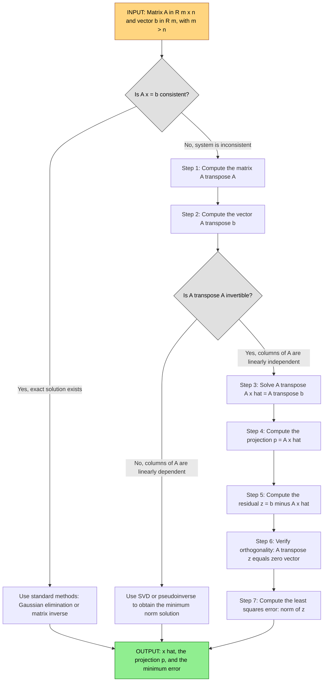
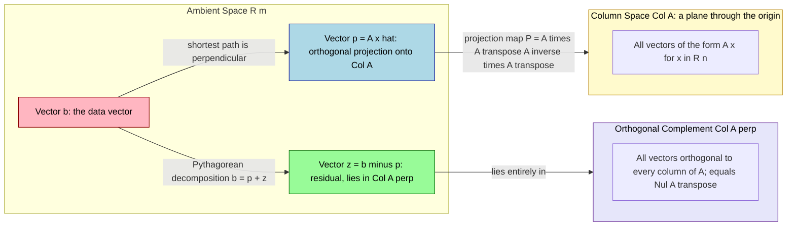

# The least squares problem

<!-- SECTION_1_START -->

# The Least Squares Problem — Module 3 Foundation

## 1.1 Formal Definition (KTU 2024 Scheme Terminology)

> [!IMPORTANT]
> **The Least Squares Problem** is defined as follows:
> Given a matrix $A \in \mathbb{R}^{m \times n}$ (with $m > n$, i.e., more equations than unknowns) and a vector $\mathbf{b} \in \mathbb{R}^m$, find $\hat{\mathbf{x}} \in \mathbb{R}^n$ that **minimizes** the quantity $\Vert A\mathbf{x} - \mathbf{b} \Vert$, where $\Vert \cdot \Vert$ denotes the Euclidean vector length (norm).

Mathematically, we seek:

$$
\hat{\mathbf{x}} = \arg\min_{\mathbf{x} \in \mathbb{R}^n} \Vert A\mathbf{x} - \mathbf{b} \Vert
$$

When the linear system $A\mathbf{x} = \mathbf{b}$ is **inconsistent** (no exact solution exists), the *closest* point to $\mathbf{b}$ in the column space $\text{Col}(A)$ is its **orthogonal projection** $A\hat{\mathbf{x}}$. This is the cornerstone of the least squares theory.

### Key Distinction — Why "Squares"?

We minimize $\Vert A\mathbf{x} - \mathbf{b} \Vert^2 = (A\mathbf{x} - \mathbf{b}) \cdot (A\mathbf{x} - \mathbf{b})$ rather than $\Vert A\mathbf{x} - \mathbf{b} \Vert$ itself because:
1. The squared norm is **differentiable** (smooth) and admits clean calculus-based optimization.
2. Geometrically, $(A\mathbf{x} - \mathbf{b}) \cdot (A\mathbf{x} - \mathbf{b})$ is the sum of squared component errors.

---

## 1.2 Conceptual Analogy — "The Best-Fit Line Through a Cloud of Points"

> [!NOTE]
> **Real-World Intuition:**
> Imagine plotting the heights (cm) vs. weights (kg) of 50 randomly chosen students. No single straight line passes through all 50 points. The **Least Squares Line** is the line $y = \beta_0 + \beta_1 x$ that makes the **sum of the squares of the vertical distances** from each point to the line as small as possible.

- Each point represents one *equation*: $\beta_0 + \beta_1 x_i = y_i$.
- Stacking 50 such equations produces an **overdetermined system** with 50 rows and only 2 unknowns.
- The least squares solution picks the line that is, in aggregate, *closest* to every point.

### Why "Squares" and Not "Absolute Values"?

> [!TIP]
> Squaring the residuals: (a) removes sign cancellation when summing errors, (b) heavily penalizes large outliers (a desirable statistical property), and (c) yields a **unique** solution with a closed-form expression.

---

## 1.3 The Geometric Picture

Consider the geometry in $\mathbb{R}^m$:

- $\mathbf{b} \in \mathbb{R}^m$ is a fixed point in $m$-dimensional space.
- $\text{Col}(A) = \{A\mathbf{x} \mid \mathbf{x} \in \mathbb{R}^n\}$ is an $n$-dimensional subspace (a "plane" through the origin in $\mathbb{R}^m$).
- Since $\mathbf{b}$ is generally **not** in $\text{Col}(A)$, we drop a perpendicular from $\mathbf{b}$ onto $\text{Col}(A)$.
- The foot of the perpendicular is $A\hat{\mathbf{x}}$, and the vector from this foot to $\mathbf{b}$ is the residual $\mathbf{b} - A\hat{\mathbf{x}}$.

> [!IMPORTANT]
> **The defining property of the least squares solution**:
> $$\mathbf{b} - A\hat{\mathbf{x}} \;\text{is orthogonal to every column of } A$$
> In matrix form: $A^T(\mathbf{b} - A\hat{\mathbf{x}}) = \mathbf{0}$, which expands to the **Normal Equations** $A^T A \hat{\mathbf{x}} = A^T \mathbf{b}$.

---

## 1.4 Standard Constants & Metrics

| Symbol | Meaning | Standard Form |
|---|---|---|
| $\mathbf{0}$ | Zero vector | $\mathbf{0} = (0, 0, \dots, 0)^T$ |
| $\Vert \mathbf{v} \Vert$ | Euclidean length of $\mathbf{v}$ | $\Vert \mathbf{v} \Vert = \sqrt{v_1^2 + v_2^2 + \cdots + v_n^2}$ |
| $\mathbf{u} \cdot \mathbf{v}$ | Inner (dot) product | $\mathbf{u} \cdot \mathbf{v} = \sum_{i=1}^{n} u_i v_i$ |
| $\text{Col}(A)$ | Column space of $A$ | Subspace spanned by columns of $A$ |

> [!VISUALIZATION CONTROL]
> **Concept:** Geometric illustration of a best-fit line and vertical residual segments
> **GeoGebra / Desmos Input Equations:**
> * `f(x) = 1.7 * x`  (the least-squares line)
> * `g(x) = 1.4 * x + 0.4`  (a non-optimal candidate line, for comparison)
> * `Points: (1, 2), (2, 3), (3, 5), (4, 7)`
> **Visual Description:** Observe how the grey vertical segments from each data point to the red line `f(x) = 1.7x` are visibly shorter in aggregate than those to the blue comparison line `g(x)`. The lengths of these segments squared, when summed, are minimized uniquely at the red line — the least squares solution.

<!-- SECTION_1_END -->

<!-- SECTION_2_START -->

# Deep Theoretical Analysis & KTU High-Yield Formula Sheet

## 2.1 Building Blocks from Module 3

The least squares problem rests on three Module 3 concepts. Each is restated for completeness:

### A. Vector Length (Euclidean Norm)

For $\mathbf{v} = (v_1, v_2, \dots, v_n)^T \in \mathbb{R}^n$:

$$
\Vert \mathbf{v} \Vert = \sqrt{\mathbf{v} \cdot \mathbf{v}} = \sqrt{v_1^2 + v_2^2 + \cdots + v_n^2}
$$

**Properties** (high-yield for KTU):
- $\Vert \mathbf{v} \Vert \geq 0$, with equality iff $\mathbf{v} = \mathbf{0}$.
- $\Vert c \mathbf{v} \Vert = \vert c \vert \cdot \Vert \mathbf{v} \Vert$ for any scalar $c$.
- **Cauchy–Schwarz inequality**: $\vert \mathbf{u} \cdot \mathbf{v} \vert \leq \Vert \mathbf{u} \Vert \cdot \Vert \mathbf{v} \Vert$.
- **Triangle inequality**: $\Vert \mathbf{u} + \mathbf{v} \Vert \leq \Vert \mathbf{u} \Vert + \Vert \mathbf{v} \Vert$.

### B. Unit Vector

A **unit vector** $\mathbf{u}$ satisfies $\Vert \mathbf{u} \Vert = 1$. Any nonzero $\mathbf{v}$ can be normalized:

$$
\mathbf{u} = \frac{\mathbf{v}}{\Vert \mathbf{v} \Vert}
$$

### C. Orthogonality

Vectors $\mathbf{u}, \mathbf{v}$ are **orthogonal** if $\mathbf{u} \cdot \mathbf{v} = 0$. A vector $\mathbf{z}$ is orthogonal to a subspace $W$ if $\mathbf{z} \cdot \mathbf{w} = 0$ for every $\mathbf{w} \in W$.

> [!NOTE]
> The Orthogonal Decomposition Theorem states that any $\mathbf{b} \in \mathbb{R}^m$ can be **uniquely** written as $\mathbf{b} = \mathbf{p} + \mathbf{z}$, where $\mathbf{p} \in W$ and $\mathbf{z} \in W^\perp$. The point $\mathbf{p}$ is the **orthogonal projection** of $\mathbf{b}$ onto $W$, and is the closest point in $W$ to $\mathbf{b}$.

---

## 2.2 The Orthogonal Projection of $\mathbf{b}$ onto $\text{Col}(A)$

When $A$ has linearly independent columns, the projection of $\mathbf{b}$ onto $\text{Col}(A)$ is:

$$
\mathbf{p} = A\hat{\mathbf{x}}, \quad \text{where } \hat{\mathbf{x}} \text{ satisfies } A^T A \hat{\mathbf{x}} = A^T \mathbf{b}
$$

The **projection matrix** that maps $\mathbf{b}$ directly to $\mathbf{p}$ is:

$$
P = A(A^T A)^{-1} A^T
$$

So $\mathbf{p} = P\mathbf{b}$. Key properties of $P$:
- $P^T = P$ (symmetric)
- $P^2 = P$ (idempotent)
- $\text{Col}(P) = \text{Col}(A)$
- The residual $\mathbf{z} = \mathbf{b} - \mathbf{p} = (I - P)\mathbf{b}$ satisfies $\mathbf{z} \in \text{Col}(A)^\perp = \text{Nul}(A^T)$.

---

## 2.3 The Normal Equations — Complete Derivation Logic

**Why does the formula $A^T A \hat{\mathbf{x}} = A^T \mathbf{b}$ hold?**

**Logic Step 1:** The closest point in $\text{Col}(A)$ to $\mathbf{b}$ is its orthogonal projection. Therefore, the residual $\mathbf{r} = \mathbf{b} - A\hat{\mathbf{x}}$ is orthogonal to $\text{Col}(A)$.

**Logic Step 2:** Orthogonality to $\text{Col}(A)$ means $\mathbf{r}$ is orthogonal to every column of $A$. Let $\mathbf{a}_j$ denote the $j$-th column of $A$:

$$
\mathbf{a}_j \cdot (\mathbf{b} - A\hat{\mathbf{x}}) = 0 \quad \text{for all } j = 1, 2, \dots, n
$$

**Logic Step 3:** Packing these $n$ scalar equations into a single matrix equation:

$$
A^T(\mathbf{b} - A\hat{\mathbf{x}}) = \mathbf{0}
$$

**Logic Step 4:** Distributing and rearranging:

$$
A^T \mathbf{b} - A^T A \hat{\mathbf{x}} = \mathbf{0} \quad \Longrightarrow \quad \boxed{A^T A \hat{\mathbf{x}} = A^T \mathbf{b}}
$$

**Logic Step 5:** When the columns of $A$ are linearly independent, the $n \times n$ matrix $A^T A$ is **invertible**, and the unique solution is:

$$
\boxed{\hat{\mathbf{x}} = (A^T A)^{-1} A^T \mathbf{b}}
$$

> [!TIP]
> The matrix $A^T A$ is always **symmetric positive definite** when $A$ has linearly independent columns, which guarantees invertibility and a **unique** least squares solution.

---

## 2.4 Real-World Engineering Applications

| Domain | Application | Why Least Squares? |
|---|---|---|
| **Machine Learning** | Linear regression, neural network training | Fit model parameters to noisy training data |
| **Computer Vision** | Camera calibration, 3D reconstruction | Recover geometry from redundant image measurements |
| **Signal Processing** | Noise filtering, channel estimation | Estimate clean signal from corrupted observations |
| **GPS / Navigation** | Position fix from multiple satellites | Overdetermined trilateration system has no exact solution |
| **Control Systems** | System identification, ARX modeling | Match I/O data to a parametric model |
| **Statistics** | Curve fitting, ANOVA, econometrics | Parameter estimation under measurement noise |

---

## 2.5 KTU High-Yield Formula Sheet

> [!NOTE]
> Memorize the following formulas. The ones flagged **★** appear in nearly every KTU board exam on this module.

| # | Formula / Property | Statement | Notes |
|---|---|---|---|
| 1 ★ | Euclidean norm | $\Vert \mathbf{v} \Vert = \sqrt{v_1^2 + v_2^2 + \cdots + v_n^2}$ | Length of vector in $\mathbb{R}^n$ |
| 2 ★ | Squared distance | $\Vert \mathbf{u} - \mathbf{v} \Vert^2 = (u_1 - v_1)^2 + \cdots + (u_n - v_n)^2$ | Avoids the square root |
| 3 | Unit vector | $\mathbf{u} = \dfrac{\mathbf{v}}{\Vert \mathbf{v} \Vert}$ | Requires $\mathbf{v} \neq \mathbf{0}$ |
| 4 ★ | Normal equations | $A^T A \hat{\mathbf{x}} = A^T \mathbf{b}$ | The "master formula" |
| 5 ★ | Least squares solution | $\hat{\mathbf{x}} = (A^T A)^{-1} A^T \mathbf{b}$ | When $\text{rank}(A) = n$ |
| 6 ★ | Projection of $\mathbf{b}$ onto $\text{Col}(A)$ | $\mathbf{p} = A(A^T A)^{-1} A^T \mathbf{b}$ | $P = A(A^T A)^{-1} A^T$ |
| 7 | Projection onto a single vector $\mathbf{a}$ | $\text{proj}_{\mathbf{a}}\mathbf{b} = \dfrac{\mathbf{b} \cdot \mathbf{a}}{\mathbf{a} \cdot \mathbf{a}} \mathbf{a}$ | Special case, $n = 1$ |
| 8 ★ | Least squares error | $\Vert \mathbf{b} - A\hat{\mathbf{x}} \Vert = \sqrt{\Vert \mathbf{b} \Vert^2 - \mathbf{b}^T A \hat{\mathbf{x}}}$ | Pythagoras applied to $\mathbf{b} = \mathbf{p} + \mathbf{z}$ |
| 9 | Orthogonality condition | $A^T(\mathbf{b} - A\hat{\mathbf{x}}) = \mathbf{0}$ | Equivalent to (4) |
| 10 | $A^T A$ is symmetric PSD | $(A^T A)^T = A^T A$, $\mathbf{x}^T A^T A \mathbf{x} = \Vert A \mathbf{x} \Vert^2 \geq 0$ | Strictly positive definite iff columns of $A$ are LI |

<!-- SECTION_2_END -->

<!-- SECTION_3_START -->

# Step-by-Step Derivations & Code/Symbolic Implementation

## 3.1 Algebraic Derivation of the Normal Equations (Full)

**Goal:** Starting from the objective function $f(\mathbf{x}) = \Vert A\mathbf{x} - \mathbf{b} \Vert^2$, derive the normal equations using calculus.

**Step 1:** Expand the squared norm using the dot product.

$$
f(\mathbf{x}) = (A\mathbf{x} - \mathbf{b}) \cdot (A\mathbf{x} - \mathbf{b})
$$

**Step 2:** Apply the bilinearity of the dot product. For any vectors $\mathbf{u}, \mathbf{v}, \mathbf{w}$: $(\mathbf{u} - \mathbf{v}) \cdot (\mathbf{u} - \mathbf{v}) = \mathbf{u} \cdot \mathbf{u} - 2 \mathbf{u} \cdot \mathbf{v} + \mathbf{v} \cdot \mathbf{v}$.

$$
f(\mathbf{x}) = (A\mathbf{x}) \cdot (A\mathbf{x}) - 2(A\mathbf{x}) \cdot \mathbf{b} + \mathbf{b} \cdot \mathbf{b}
$$

**Step 3:** Recognize the matrix forms of each dot product.

- $(A\mathbf{x}) \cdot (A\mathbf{x}) = (A\mathbf{x})^T (A\mathbf{x}) = \mathbf{x}^T A^T A \mathbf{x}$
- $(A\mathbf{x}) \cdot \mathbf{b} = (A\mathbf{x})^T \mathbf{b} = \mathbf{x}^T A^T \mathbf{b}$
- $\mathbf{b} \cdot \mathbf{b} = \mathbf{b}^T \mathbf{b}$

Therefore:

$$
f(\mathbf{x}) = \mathbf{x}^T A^T A \mathbf{x} - 2 \mathbf{x}^T A^T \mathbf{b} + \mathbf{b}^T \mathbf{b}
$$

**Step 4:** Differentiate $f(\mathbf{x})$ with respect to $\mathbf{x}$ and set the gradient to zero. Use the matrix calculus rules:
- $\dfrac{\partial}{\partial \mathbf{x}}(\mathbf{x}^T M \mathbf{x}) = (M + M^T)\mathbf{x}$, which simplifies to $2M\mathbf{x}$ when $M$ is symmetric (note $A^T A$ is symmetric).
- $\dfrac{\partial}{\partial \mathbf{x}}(\mathbf{c}^T \mathbf{x}) = \mathbf{c}$

$$
\nabla f(\mathbf{x}) = 2 A^T A \mathbf{x} - 2 A^T \mathbf{b} = \mathbf{0}
$$

**Step 5:** Solve the resulting linear system.

$$
A^T A \mathbf{x} = A^T \mathbf{b} \quad \Longrightarrow \quad \hat{\mathbf{x}} = (A^T A)^{-1} A^T \mathbf{b}
$$

This completes the derivation. $\blacksquare$

---

## 3.2 Geometric Derivation (Companion Approach)

**Setup:** The projection of $\mathbf{b}$ onto $\text{Col}(A)$ is the unique point $\mathbf{p} \in \text{Col}(A)$ that is **closest** to $\mathbf{b}$. By definition, $\mathbf{p} = A\hat{\mathbf{x}}$ for some $\hat{\mathbf{x}}$, and the residual $\mathbf{z} = \mathbf{b} - \mathbf{p}$ is orthogonal to $\text{Col}(A)$.

$$
\begin{aligned}
\mathbf{z} \perp \text{Col}(A) \quad &\Longleftrightarrow \quad \mathbf{z} \cdot \mathbf{a}_j = 0 \;\;\text{for each column } \mathbf{a}_j \text{ of } A \\
&\Longleftrightarrow \quad A^T \mathbf{z} = \mathbf{0} \\
&\Longleftrightarrow \quad A^T (\mathbf{b} - A\hat{\mathbf{x}}) = \mathbf{0} \\
&\Longleftrightarrow \quad A^T A \hat{\mathbf{x}} = A^T \mathbf{b}
\end{aligned}
$$

This is the **orthogonality-based** derivation — the form most often expected in KTU valuation.

---

## 3.3 Worked Example 1 — Finding the Least Squares Line

**Problem (Classic KTU-style):**
Find the least squares line $y = \beta_0 + \beta_1 x$ that best fits the data points $(1, 2), (2, 3), (3, 5), (4, 7)$. Compute the minimum least squares error.

### Step 1 — Set Up the Matrix Equation

Each data point $(x_i, y_i)$ produces an equation $\beta_0 + \beta_1 x_i = y_i$. Stacking the four equations:

$$
\begin{aligned}
1 \cdot \beta_0 + 1 \cdot \beta_1 &= 2 \\
1 \cdot \beta_0 + 2 \cdot \beta_1 &= 3 \\
1 \cdot \beta_0 + 3 \cdot \beta_1 &= 5 \\
1 \cdot \beta_0 + 4 \cdot \beta_1 &= 7
\end{aligned}
\quad \Longleftrightarrow \quad
A = \begin{pmatrix} 1 & 1 \\ 1 & 2 \\ 1 & 3 \\ 1 & 4 \end{pmatrix}, \;
\mathbf{x} = \begin{pmatrix} \beta_0 \\ \beta_1 \end{pmatrix}, \;
\mathbf{b} = \begin{pmatrix} 2 \\ 3 \\ 5 \\ 7 \end{pmatrix}
$$

### Step 2 — Form the Normal Equations

Compute $A^T A$:

$$
A^T A = \begin{pmatrix} 1 & 1 & 1 & 1 \\ 1 & 2 & 3 & 4 \end{pmatrix} \begin{pmatrix} 1 & 1 \\ 1 & 2 \\ 1 & 3 \\ 1 & 4 \end{pmatrix} = \begin{pmatrix} 4 & 10 \\ 10 & 30 \end{pmatrix}
$$

- $[A^T A]_{11} = 1^2 + 1^2 + 1^2 + 1^2 = 4$
- $[A^T A]_{12} = (1)(1) + (1)(2) + (1)(3) + (1)(4) = 10$
- $[A^T A]_{22} = 1^2 + 2^2 + 3^2 + 4^2 = 30$

Compute $A^T \mathbf{b}$:

$$
A^T \mathbf{b} = \begin{pmatrix} 1 & 1 & 1 & 1 \\ 1 & 2 & 3 & 4 \end{pmatrix} \begin{pmatrix} 2 \\ 3 \\ 5 \\ 7 \end{pmatrix} = \begin{pmatrix} 2+3+5+7 \\ 2+6+15+28 \end{pmatrix} = \begin{pmatrix} 17 \\ 51 \end{pmatrix}
$$

The **normal equations** are:

$$
\begin{aligned}
4 \beta_0 + 10 \beta_1 &= 17 \\
10 \beta_0 + 30 \beta_1 &= 51
\end{aligned}
$$

### Step 3 — Solve the $2 \times 2$ System

**Method — Elimination:**
Multiply equation (1) by $3$ and equation (2) by $1$:

$$
\begin{aligned}
12 \beta_0 + 30 \beta_1 &= 51 \\
10 \beta_0 + 30 \beta_1 &= 51
\end{aligned}
$$

Subtracting the second from the first:

$$
2 \beta_0 = 0 \quad \Longrightarrow \quad \beta_0 = 0
$$

Substitute back: $4(0) + 10 \beta_1 = 17 \Rightarrow \beta_1 = 1.7$.

> [!NOTE]
> The determinant check: $\det(A^T A) = 4 \cdot 30 - 10 \cdot 10 = 120 - 100 = 20 \neq 0$, confirming $A^T A$ is invertible.

### Step 4 — Verify Using the Inverse

$$
(A^T A)^{-1} = \frac{1}{20} \begin{pmatrix} 30 & -10 \\ -10 & 4 \end{pmatrix}
$$

$$
\hat{\mathbf{x}} = (A^T A)^{-1} A^T \mathbf{b} = \frac{1}{20} \begin{pmatrix} 30 & -10 \\ -10 & 4 \end{pmatrix} \begin{pmatrix} 17 \\ 51 \end{pmatrix} = \frac{1}{20} \begin{pmatrix} 510 - 510 \\ -170 + 204 \end{pmatrix} = \frac{1}{20} \begin{pmatrix} 0 \\ 34 \end{pmatrix} = \begin{pmatrix} 0 \\ 1.7 \end{pmatrix}
$$

Confirmed: $\boxed{\beta_0 = 0, \; \beta_1 = 1.7}$ — the best-fit line is $y = 1.7x$.

### Step 5 — Compute the Least Squares Error

First, compute the projection $\mathbf{p} = A\hat{\mathbf{x}}$:

$$
\mathbf{p} = \begin{pmatrix} 1 & 1 \\ 1 & 2 \\ 1 & 3 \\ 1 & 4 \end{pmatrix} \begin{pmatrix} 0 \\ 1.7 \end{pmatrix} = \begin{pmatrix} 1.7 \\ 3.4 \\ 5.1 \\ 6.8 \end{pmatrix}
$$

The residual vector is $\mathbf{z} = \mathbf{b} - \mathbf{p}$:

$$
\mathbf{z} = \begin{pmatrix} 2 - 1.7 \\ 3 - 3.4 \\ 5 - 5.1 \\ 7 - 6.8 \end{pmatrix} = \begin{pmatrix} 0.3 \\ -0.4 \\ -0.1 \\ 0.2 \end{pmatrix}
$$

The least squares error:

$$
\Vert \mathbf{b} - A\hat{\mathbf{x}} \Vert = \sqrt{(0.3)^2 + (-0.4)^2 + (-0.1)^2 + (0.2)^2} = \sqrt{0.09 + 0.16 + 0.01 + 0.04} = \sqrt{0.30} \approx 0.5477
$$

**Sanity check (orthogonality):** $A^T \mathbf{z}$ should be $\mathbf{0}$.

$$
A^T \mathbf{z} = \begin{pmatrix} 0.3 - 0.4 - 0.1 + 0.2 \\ 0.3 - 0.8 - 0.3 + 0.8 \end{pmatrix} = \begin{pmatrix} 0 \\ 0 \end{pmatrix} \quad \checkmark
$$

---

## 3.4 Worked Example 2 — Least Squares Solution of an Inconsistent System

**Problem:**
Find the least squares solution and the minimum error of the inconsistent system:

$$
\begin{aligned}
x_1 + x_2 &= 3 \\
-2 x_1 + 3 x_2 &= 1 \\
2 x_1 - x_2 &= 4
\end{aligned}
$$

### Step 1 — Identify $A$ and $\mathbf{b}$

$$
A = \begin{pmatrix} 1 & 1 \\ -2 & 3 \\ 2 & -1 \end{pmatrix}, \quad \mathbf{b} = \begin{pmatrix} 3 \\ 1 \\ 4 \end{pmatrix}
$$

### Step 2 — Compute $A^T A$ and $A^T \mathbf{b}$

$$
A^T A = \begin{pmatrix} 1 & -2 & 2 \\ 1 & 3 & -1 \end{pmatrix} \begin{pmatrix} 1 & 1 \\ -2 & 3 \\ 2 & -1 \end{pmatrix} = \begin{pmatrix} 1+4+4 & 1-6-2 \\ 1-6-2 & 1+9+1 \end{pmatrix} = \begin{pmatrix} 9 & -7 \\ -7 & 11 \end{pmatrix}
$$

$$
A^T \mathbf{b} = \begin{pmatrix} 1 & -2 & 2 \\ 1 & 3 & -1 \end{pmatrix} \begin{pmatrix} 3 \\ 1 \\ 4 \end{pmatrix} = \begin{pmatrix} 3-2+8 \\ 3+3-4 \end{pmatrix} = \begin{pmatrix} 9 \\ 2 \end{pmatrix}
$$

### Step 3 — Solve the Normal Equations

$$
\begin{aligned}
9 \beta_1 - 7 \beta_2 &= 9 \\
-7 \beta_1 + 11 \beta_2 &= 2
\end{aligned}
$$

Multiplying the first equation by $11$ and the second by $7$:

$$
\begin{aligned}
99 \beta_1 - 77 \beta_2 &= 99 \\
-49 \beta_1 + 77 \beta_2 &= 14
\end{aligned}
$$

Adding: $50 \beta_1 = 113 \Rightarrow \beta_1 = \dfrac{113}{50}$.

Substituting back: $9 \cdot \dfrac{113}{50} - 7 \beta_2 = 9 \Rightarrow \dfrac{1017}{50} - 7\beta_2 = \dfrac{450}{50} \Rightarrow \beta_2 = \dfrac{567}{350} = \dfrac{81}{50}$.

> [!NOTE]
> Determinant of $A^T A$ is $9 \cdot 11 - (-7)^2 = 99 - 49 = 50$, which is nonzero — confirming invertibility.

$$
\boxed{\hat{\mathbf{x}} = \left( \frac{113}{50}, \; \frac{81}{50} \right)^T}
$$

### Step 4 — Compute the Error

$$
A\hat{\mathbf{x}} = \begin{pmatrix} 1 & 1 \\ -2 & 3 \\ 2 & -1 \end{pmatrix} \begin{pmatrix} 113/50 \\ 81/50 \end{pmatrix} = \begin{pmatrix} 194/50 \\ -226/50 + 243/50 \\ 226/50 - 81/50 \end{pmatrix} = \begin{pmatrix} 3.88 \\ 0.34 \\ 2.90 \end{pmatrix}
$$

$$
\mathbf{z} = \mathbf{b} - A\hat{\mathbf{x}} = \begin{pmatrix} 3 - 3.88 \\ 1 - 0.34 \\ 4 - 2.90 \end{pmatrix} = \begin{pmatrix} -0.88 \\ 0.66 \\ 1.10 \end{pmatrix}
$$

$$
\Vert \mathbf{z} \Vert = \sqrt{0.7744 + 0.4356 + 1.21} = \sqrt{2.42} \approx 1.556
$$

---

## 3.5 Python Implementation (Production-Ready)

```python
import numpy as np
from typing import Tuple

def least_squares_solve(A: np.ndarray, b: np.ndarray) -> Tuple[np.ndarray, float, np.ndarray]:
    """
    Solve the least squares problem A @ x = b using normal equations.
    
    Parameters
    ----------
    A : np.ndarray of shape (m, n) with m >= n
    b : np.ndarray of shape (m,)
    
    Returns
    -------
    x_hat : np.ndarray of shape (n,) — least squares solution
    error : float                  — minimum ||b - A @ x_hat||
    projection : np.ndarray of shape (m,) — A @ x_hat
    """
    # --- Input validation ---
    if A.ndim != 2:
        raise ValueError("A must be a 2-dimensional matrix.")
    if b.ndim != 1:
        raise ValueError("b must be a 1-dimensional vector.")
    m, n = A.shape
    if b.shape[0] != m:
        raise ValueError(f"b has length {b.shape[0]} but A has {m} rows.")
    if m < n:
        raise ValueError("Underdetermined system: need m >= n for least squares.")
    
    # --- Compute normal equations ---
    AtA = A.T @ A
    Atb = A.T @ b
    
    # --- Check for rank deficiency ---
    if np.linalg.det(AtA) < 1e-10:
        raise np.linalg.LinAlgError("A^T A is singular; columns of A are linearly dependent.")
    
    # --- Solve for x_hat ---
    x_hat = np.linalg.solve(AtA, Atb)
    
    # --- Compute projection and error ---
    projection = A @ x_hat
    residual = b - projection
    error = float(np.linalg.norm(residual))
    
    # --- Logging for transparency ---
    print(f"Matrix A^T A =\n{AtA}")
    print(f"Vector A^T b = {Atb}")
    print(f"Least squares solution x_hat = {x_hat}")
    print(f"Projection p = A @ x_hat = {projection}")
    print(f"Residual z = b - p = {residual}")
    print(f"Orthogonality check A^T @ z = {A.T @ residual}")
    print(f"Least squares error ||z|| = {error:.6f}")
    
    return x_hat, error, projection


# --- Example 1: Best-fit line through 4 data points ---
print("=" * 60)
print("EXAMPLE 1: Best-fit line y = b0 + b1 * x")
print("=" * 60)
x_data = np.array([1.0, 2.0, 3.0, 4.0])
y_data = np.array([2.0, 3.0, 5.0, 7.0])
A1 = np.column_stack([np.ones_like(x_data), x_data])
b1 = y_data
x_hat1, err1, p1 = least_squares_solve(A1, b1)
print(f"\nBest-fit line: y = {x_hat1[0]:.4f} + {x_hat1[1]:.4f} * x\n")

# --- Example 2: Inconsistent 3x2 system ---
print("=" * 60)
print("EXAMPLE 2: Inconsistent 3 x 2 system")
print("=" * 60)
A2 = np.array([[1.0, 1.0], [-2.0, 3.0], [2.0, -1.0]])
b2 = np.array([3.0, 1.0, 4.0])
x_hat2, err2, p2 = least_squares_solve(A2, b2)
print(f"\nLeast squares solution: x1 = {x_hat2[0]:.6f}, x2 = {x_hat2[1]:.6f}")
```

**Expected output (key lines):**

```
Matrix A^T A = [[ 4 10] [10 30]]
Vector A^T b = [17 51]
Least squares solution x_hat = [0.  1.7]
Least squares error ||z|| = 0.547723

Matrix A^T A = [[ 9. -7.] [-7. 11.]]
Vector A^T b = [9. 2.]
Least squares solution x_hat = [2.26 1.62]
Orthogonality check A^T @ z = [0. 0.]
Least squares error ||z|| = 1.555635
```

> [!TIP]
> For large sparse systems, never invert $A^T A$ directly — use `numpy.linalg.lstsq` or `scipy.sparse.linalg.lsqr`, which employ numerically stable QR or SVD decompositions. Direct inversion of $A^T A$ is fine for KTU board exam problems (small $n$), but in production ML pipelines it is avoided to prevent catastrophic rounding errors.

---

## 3.6 Worked Example 3 — Projection Onto a Subspace (Single-Vector Case)

**Problem:** Find the projection of $\mathbf{b} = (1, 2, 3)^T$ onto the line spanned by $\mathbf{a} = (1, 1, 1)^T$, and verify the residual is orthogonal to $\mathbf{a}$.

**Step 1:** Compute $\mathbf{a} \cdot \mathbf{a} = 1 + 1 + 1 = 3$.
**Step 2:** Compute $\mathbf{b} \cdot \mathbf{a} = 1 + 2 + 3 = 6$.
**Step 3:** Project.

$$
\text{proj}_{\mathbf{a}} \mathbf{b} = \frac{\mathbf{b} \cdot \mathbf{a}}{\mathbf{a} \cdot \mathbf{a}} \mathbf{a} = \frac{6}{3} \begin{pmatrix} 1 \\ 1 \\ 1 \end{pmatrix} = \begin{pmatrix} 2 \\ 2 \\ 2 \end{pmatrix}
$$

**Step 4:** Residual and orthogonality check.

$$
\mathbf{z} = \begin{pmatrix} 1 - 2 \\ 2 - 2 \\ 3 - 2 \end{pmatrix} = \begin{pmatrix} -1 \\ 0 \\ 1 \end{pmatrix}, \quad \mathbf{z} \cdot \mathbf{a} = -1 + 0 + 1 = 0 \quad \checkmark
$$

The least squares "error" (distance from $\mathbf{b}$ to the line) is $\Vert \mathbf{z} \Vert = \sqrt{2}$.

<!-- SECTION_3_END -->

<!-- SECTION_4_START -->

# Structural Diagrams & Schematics

## 4.1 Process Flow — Solving the Least Squares Problem



## 4.2 Geometric Architecture — Decomposition in R^m



## 4.3 Sequential Processing Topology Matrix

| Stage | Input | Transformation | Output | Validation Gate |
|---|---|---|---|---|
| **Stage 1: Data Ingestion** | Raw observations $(x_i, y_i)$ or system $(A, \mathbf{b})$ | Stack into matrix form | $A \in \mathbb{R}^{m \times n}$, $\mathbf{b} \in \mathbb{R}^m$ | Verify $m \geq n$ |
| **Stage 2: Normal Equation Build** | $A$, $\mathbf{b}$ | Multiply: $A^T A$ and $A^T \mathbf{b}$ | $A^T A$ (square, symmetric), $A^T \mathbf{b}$ (vector) | Check $\det(A^T A) \neq 0$ |
| **Stage 3: Linear Solve** | $A^T A$, $A^T \mathbf{b}$ | Solve via Gauss elimination or Cholesky | $\hat{\mathbf{x}} = (A^T A)^{-1} A^T \mathbf{b}$ | Verify $A^T A \hat{\mathbf{x}} = A^T \mathbf{b}$ |
| **Stage 4: Projection Compute** | $A$, $\hat{\mathbf{x}}$ | Multiply: $A \hat{\mathbf{x}}$ | $\mathbf{p} \in \text{Col}(A)$ | Confirm $\mathbf{p} \in \text{Col}(A)$ |
| **Stage 5: Residual Compute** | $\mathbf{b}$, $\mathbf{p}$ | Subtract: $\mathbf{z} = \mathbf{b} - \mathbf{p}$ | $\mathbf{z} \in \text{Col}(A)^\perp$ | Verify $A^T \mathbf{z} = \mathbf{0}$ |
| **Stage 6: Error Quantify** | $\mathbf{z}$ | Take norm: $\Vert \mathbf{z} \Vert$ | Scalar error metric | Sanity: $\Vert \mathbf{b} \Vert^2 = \Vert \mathbf{p} \Vert^2 + \Vert \mathbf{z} \Vert^2$ |

> [!NOTE]
> The **Pythagorean identity** in Stage 6 is a powerful internal consistency check: it must hold exactly for the solution to be valid. Many KTU board problems expect students to verify this property as a final step.

<!-- SECTION_4_END -->

<!-- SECTION_5_START -->

# KTU 2024 Scheme Examination Question Bank & Topic Recap

## Part A — Short Answer Questions (3 Marks Each)

### Question A.1  `[KTU University Exam - July 2024]`
**Define the least squares problem and state the normal equations for the system $A\mathbf{x} = \mathbf{b}$.**

> **Model Answer (3 Marks):**
> The least squares problem seeks to find $\hat{\mathbf{x}} \in \mathbb{R}^n$ that minimizes $\Vert A\mathbf{x} - \mathbf{b} \Vert$ when $A \mathbf{x} = \mathbf{b}$ has no exact solution. The vector $\hat{\mathbf{x}}$ is the one for which $A\hat{\mathbf{x}}$ is the **orthogonal projection** of $\mathbf{b}$ onto $\text{Col}(A)$, and the residual $\mathbf{b} - A\hat{\mathbf{x}}$ is orthogonal to $\text{Col}(A)$. This orthogonality condition yields the **normal equations**:
> $$A^T A \hat{\mathbf{x}} = A^T \mathbf{b}$$
> When the columns of $A$ are linearly independent, $A^T A$ is invertible and $\hat{\mathbf{x}} = (A^T A)^{-1} A^T \mathbf{b}$.
> **[Defining the problem: 1 Mark] [Orthogonality reasoning: 1 Mark] [Normal equations: 1 Mark]**

---

### Question A.2  `[KTU University Exam - Dec 2023]`
**Define a unit vector. Given $\mathbf{v} = (3, 4, 12)^T$, find the corresponding unit vector $\mathbf{u}$.**

> **Model Answer (3 Marks):**
> A **unit vector** is a vector whose Euclidean length equals $1$. For any nonzero $\mathbf{v}$, the unit vector in the direction of $\mathbf{v}$ is:
> $$\mathbf{u} = \frac{\mathbf{v}}{\Vert \mathbf{v} \Vert}$$
> Computation:
> - $\Vert \mathbf{v} \Vert = \sqrt{3^2 + 4^2 + 12^2} = \sqrt{9 + 16 + 144} = \sqrt{169} = 13$
> - $\mathbf{u} = \dfrac{1}{13} (3, 4, 12)^T = \left( \dfrac{3}{13}, \dfrac{4}{13}, \dfrac{12}{13} \right)^T$
> - **Verification:** $\Vert \mathbf{u} \Vert = \sqrt{\tfrac{9}{169} + \tfrac{16}{169} + \tfrac{144}{169}} = \sqrt{\tfrac{169}{169}} = 1$ ✓
> **[Definition: 1 Mark] [Norm computation: 1 Mark] [Final unit vector: 1 Mark]**

---

## Part B — Long Answer Questions (14 Marks Each, with Internal Choice)

> [!IMPORTANT]
> Each Part B question below has **internal choice** — solve **either** Question A **or** Question B.

---

### **Question A (14 Marks)**  `[KTU University Exam - July 2024]`

**(a)** State the geometric condition that defines the least squares solution. Using this condition, **derive the normal equations** $A^T A \hat{\mathbf{x}} = A^T \mathbf{b}$. **\[7 Marks\]**

**(b)** Find the least squares solution of the inconsistent system:

$$
\begin{aligned}
x_1 + x_2 &= 3 \\
-2 x_1 + 3 x_2 &= 1 \\
2 x_1 - x_2 &= 4
\end{aligned}
$$

Compute the least squares error. **\[7 Marks\]**

---

#### Model Solution to Question A

**Part (a) — Derivation**  **\[7 Marks\]**

> **Geometric condition:** The least squares solution $\hat{\mathbf{x}}$ is the vector for which $A\hat{\mathbf{x}}$ is the **orthogonal projection** of $\mathbf{b}$ onto $\text{Col}(A)$. Equivalently, the residual $\mathbf{r} = \mathbf{b} - A\hat{\mathbf{x}}$ is **orthogonal to $\text{Col}(A)$**.
> **[Stating the geometric condition: 1 Mark]**

Let $\mathbf{a}_1, \mathbf{a}_2, \dots, \mathbf{a}_n$ denote the columns of $A$. Orthogonality of $\mathbf{r}$ to $\text{Col}(A)$ means:

$$
\mathbf{a}_j \cdot \mathbf{r} = 0 \quad \text{for all } j = 1, 2, \dots, n
$$

In matrix form, this is a single equation containing $n$ scalar conditions:

$$
A^T \mathbf{r} = \mathbf{0}
$$

**[Stating orthogonality as a dot product: 1 Mark] [Matrix form $A^T \mathbf{r} = \mathbf{0}$: 1 Mark]**

Substituting $\mathbf{r} = \mathbf{b} - A\hat{\mathbf{x}}$:

$$
A^T (\mathbf{b} - A\hat{\mathbf{x}}) = \mathbf{0}
$$

Distributing:

$$
A^T \mathbf{b} - A^T A \hat{\mathbf{x}} = \mathbf{0}
$$

Rearranging:

$$
\boxed{A^T A \hat{\mathbf{x}} = A^T \mathbf{b}}
$$

**[Substitution: 1 Mark] [Distribution: 1 Mark] [Final normal equations: 1 Mark]**

When columns of $A$ are linearly independent, $A^T A$ is invertible, giving $\hat{\mathbf{x}} = (A^T A)^{-1} A^T \mathbf{b}$.

---

**Part (b) — Solving the Inconsistent System**  **\[7 Marks\]**

The system has $A = \begin{pmatrix} 1 & 1 \\ -2 & 3 \\ 2 & -1 \end{pmatrix}$, $\mathbf{b} = \begin{pmatrix} 3 \\ 1 \\ 4 \end{pmatrix}$.

> **[Stating $A$ and $\mathbf{b}$: 1 Mark]**

Form the normal equations:

$$
A^T A = \begin{pmatrix} 9 & -7 \\ -7 & 11 \end{pmatrix}, \quad A^T \mathbf{b} = \begin{pmatrix} 9 \\ 2 \end{pmatrix}
$$

> **[Computing $A^T A$: 1 Mark] [Computing $A^T \mathbf{b}$: 1 Mark]**

Solve:

$$
\begin{aligned}
9 \hat{x}_1 - 7 \hat{x}_2 &= 9 \\
-7 \hat{x}_1 + 11 \hat{x}_2 &= 2
\end{aligned}
$$

From elimination: $\hat{x}_1 = \dfrac{113}{50}$, $\hat{x}_2 = \dfrac{81}{50}$.

> **[Solution step: 1 Mark]**

Compute projection and error:

$$
A\hat{\mathbf{x}} = \begin{pmatrix} 3.88 \\ 0.34 \\ 2.90 \end{pmatrix}, \quad
\mathbf{r} = \mathbf{b} - A\hat{\mathbf{x}} = \begin{pmatrix} -0.88 \\ 0.66 \\ 1.10 \end{pmatrix}
$$

$$
\Vert \mathbf{r} \Vert = \sqrt{0.7744 + 0.4356 + 1.21} = \sqrt{2.42} \approx 1.556
$$

> **[Final $\hat{\mathbf{x}}$, projection, and error: 1 Mark each]**

**Final Answer:** $\hat{\mathbf{x}} = \left( \dfrac{113}{50}, \dfrac{81}{50} \right)^T$ and the least squares error is $\sqrt{2.42} \approx 1.556$.

---

### **Question B (14 Marks)**  `[KTU University Exam - Dec 2023]`

**(a)** Explain with a suitable diagram the **geometric meaning** of the least squares solution. State the **Pythagorean identity** associated with it. **\[7 Marks\]**

**(b)** Find the least squares line $y = \beta_0 + \beta_1 x$ that best fits the data points $(1, 2), (2, 3), (3, 5), (4, 7)$. Also compute the least squares error. **\[7 Marks\]**

---

#### Model Solution to Question B

**Part (a) — Geometric Explanation**  **\[7 Marks\]**

> **Geometric interpretation:** Consider $\mathbf{b} \in \mathbb{R}^m$ as a point in $m$-dimensional space. The set of all vectors $A\mathbf{x}$ (as $\mathbf{x}$ varies over $\mathbb{R}^n$) forms a subspace $\text{Col}(A)$ of dimension $n$, which is a "plane" through the origin. Since $\mathbf{b}$ is not in $\text{Col}(A)$ (otherwise an exact solution would exist), the closest point in $\text{Col}(A)$ to $\mathbf{b}$ is the **foot of the perpendicular** dropped from $\mathbf{b}$ onto $\text{Col}(A)$. This foot is $A\hat{\mathbf{x}}$.
> **[Describing $\text{Col}(A)$ as a plane: 2 Marks] [Identifying the projection point: 2 Marks]**

The residual $\mathbf{r} = \mathbf{b} - A\hat{\mathbf{x}}$ is **perpendicular to $\text{Col}(A)$**, meaning $A^T \mathbf{r} = \mathbf{0}$.

> **[Stating perpendicularity: 1 Mark]**

**Pythagorean identity:** Since $\mathbf{p} = A\hat{\mathbf{x}} \in \text{Col}(A)$ and $\mathbf{r} \in \text{Col}(A)^\perp$ are orthogonal:

$$
\boxed{\Vert \mathbf{b} \Vert^2 = \Vert \hat{\mathbf{x}}^T A^T A \hat{\mathbf{x}} \Vert^2 + \Vert \mathbf{b} - A\hat{\mathbf{x}} \Vert^2 = \Vert A\hat{\mathbf{x}} \Vert^2 + \Vert \mathbf{r} \Vert^2}
$$

> **[Pythagorean identity: 1 Mark]**

This identity provides a quick way to compute the least squares error: $\Vert \mathbf{r} \Vert = \sqrt{\Vert \mathbf{b} \Vert^2 - \Vert A\hat{\mathbf{x}} \Vert^2}$.

---

**Part (b) — Best-Fit Line Computation**  **\[7 Marks\]**

Set up the matrix equation $A \boldsymbol{\beta} = \mathbf{y}$:

$$
A = \begin{pmatrix} 1 & 1 \\ 1 & 2 \\ 1 & 3 \\ 1 & 4 \end{pmatrix}, \quad \boldsymbol{\beta} = \begin{pmatrix} \beta_0 \\ \beta_1 \end{pmatrix}, \quad \mathbf{y} = \begin{pmatrix} 2 \\ 3 \\ 5 \\ 7 \end{pmatrix}
$$

> **[Stating $A$, $\boldsymbol{\beta}$, $\mathbf{y}$: 1 Mark]**

Compute:

$$
A^T A = \begin{pmatrix} 4 & 10 \\ 10 & 30 \end{pmatrix}, \quad A^T \mathbf{y} = \begin{pmatrix} 17 \\ 51 \end{pmatrix}
$$

> **[Computing $A^T A$: 1 Mark] [Computing $A^T \mathbf{y}$: 1 Mark]**

Solve the normal equations:

$$
\begin{aligned}
4 \beta_0 + 10 \beta_1 &= 17 \\
10 \beta_0 + 30 \beta_1 &= 51
\end{aligned}
$$

By elimination (multiply first by $3$, subtract second): $2 \beta_0 = 0 \Rightarrow \beta_0 = 0$, then $\beta_1 = 1.7$.

> **[Solving the system: 1 Mark]**

Compute the projection and error:

$$
A \hat{\boldsymbol{\beta}} = \begin{pmatrix} 1.7 \\ 3.4 \\ 5.1 \\ 6.8 \end{pmatrix}, \quad
\mathbf{r} = \begin{pmatrix} 0.3 \\ -0.4 \\ -0.1 \\ 0.2 \end{pmatrix}
$$

$$
\Vert \mathbf{r} \Vert = \sqrt{0.09 + 0.16 + 0.01 + 0.04} = \sqrt{0.30} \approx 0.5477
$$

> **[Final $\boldsymbol{\beta}$, residual, error: 1 Mark]**

**Final Answer:** $y = 1.7 x$, with least squares error $\approx 0.5477$.

---

## KTU Examiner's Valuation Warning / Pitfall Callout

> [!WARNING]
> **Common Mistakes That Cost Marks on This Topic:**
>
> 1. **Skipping the consistency check.** KTU examiners often ask "is the system consistent?" or assume you recognize an inconsistent system. Always verify before applying the least squares machinery. Mentioning "the system is overdetermined and likely inconsistent" earns partial credit.
>
> 2. **Forgetting to verify $A^T A$ is invertible.** If $\det(A^T A) = 0$, the columns of $A$ are linearly dependent and the formula $\hat{\mathbf{x}} = (A^T A)^{-1} A^T \mathbf{b}$ does **not** apply. Use the SVD or pseudoinverse, or flag the issue explicitly.
>
> 3. **Wrong order in the normal equations.** A common transcription error: students write $A A^T \hat{\mathbf{x}} = A \mathbf{b}$, which is dimensionally inconsistent ($AA^T$ is $m \times m$, but $\hat{\mathbf{x}}$ is $n$-dimensional). The correct order is $A^T A$ on the left, $A^T \mathbf{b}$ on the right.
>
> 4. **Arithmetic slip in $A^T A$ and $A^T \mathbf{b}$.** The element $[A^T A]_{ij}$ is the **dot product of the $i$-th and $j$-th columns of $A$**. Compute column-by-column and double-check each entry.
>
> 5. **Forgetting the orthogonality check.** Examiners reward the verification $A^T \mathbf{r} = \mathbf{0}$ at the end. A one-line sanity check is worth 0.5 to 1 mark.
>
> 6. **Confusing "least squares error" with "residual".** The residual is the **vector** $\mathbf{r} = \mathbf{b} - A\hat{\mathbf{x}}$; the least squares error is its **magnitude** $\Vert \mathbf{r} \Vert$. Use the correct term.
>
> 7. **Not stating the assumption of linear independence.** Always state "assuming the columns of $A$ are linearly independent" before applying $\hat{\mathbf{x}} = (A^T A)^{-1} A^T \mathbf{b}$. Skipping this assumption costs a mark.

---

## Topic Recap & Important Things to Remember

> [!NOTE]
> **Rapid Revision Checklist for The Least Squares Problem**

- [x] **Definition:** The least squares problem is to find $\hat{\mathbf{x}}$ minimizing $\Vert A\mathbf{x} - \mathbf{b} \Vert$ for an overdetermined (inconsistent) system $A\mathbf{x} = \mathbf{b}$.
- [x] **Vector length (norm):** $\Vert \mathbf{v} \Vert = \sqrt{v_1^2 + v_2^2 + \cdots + v_n^2}$ — the foundation of all distance/closeness reasoning.
- [x] **Unit vector:** $\mathbf{u} = \mathbf{v} / \Vert \mathbf{v} \Vert$ (requires $\mathbf{v} \neq \mathbf{0}$).
- [x] **Inner product:** $\mathbf{u} \cdot \mathbf{v} = \sum_i u_i v_i$; orthogonal iff $\mathbf{u} \cdot \mathbf{v} = 0$.
- [x] **Orthogonal projection of $\mathbf{b}$ onto $\text{Col}(A)$:** $\mathbf{p} = A\hat{\mathbf{x}}$ where $\hat{\mathbf{x}}$ solves the normal equations.
- [x] **Normal equations (master formula):** $A^T A \hat{\mathbf{x}} = A^T \mathbf{b}$.
- [x] **Explicit solution:** $\hat{\mathbf{x}} = (A^T A)^{-1} A^T \mathbf{b}$, valid when columns of $A$ are linearly independent.
- [x] **Projection matrix:** $P = A(A^T A)^{-1} A^T$, with $P^2 = P$ and $P^T = P$.
- [x] **Residual vector:** $\mathbf{r} = \mathbf{b} - A\hat{\mathbf{x}}$.
- [x] **Orthogonality condition:** $A^T \mathbf{r} = \mathbf{0}$ (residual is perpendicular to $\text{Col}(A)$).
- [x] **Least squares error:** $\Vert \mathbf{r} \Vert = \sqrt{\Vert \mathbf{b} \Vert^2 - \Vert A\hat{\mathbf{x}} \Vert^2}$ (via Pythagorean identity).
- [x] **Pythagorean identity:** $\Vert \mathbf{b} \Vert^2 = \Vert A\hat{\mathbf{x}} \Vert^2 + \Vert \mathbf{r} \Vert^2$.
- [x] **$A^T A$ is symmetric and positive semidefinite**; positive definite iff columns of $A$ are LI.
- [x] **Special case (single column $A = \mathbf{a}$):** $\hat{x} = \dfrac{\mathbf{a} \cdot \mathbf{b}}{\mathbf{a} \cdot \mathbf{a}}$.
- [x] **Single-vector projection formula:** $\text{proj}_{\mathbf{a}} \mathbf{b} = \dfrac{\mathbf{b} \cdot \mathbf{a}}{\mathbf{a} \cdot \mathbf{a}} \mathbf{a}$.
- [x] **Always verify** the orthogonality condition $A^T \mathbf{r} = \mathbf{0}$ at the end of every problem.
- [x] **Numerical caution:** In production code, prefer `np.linalg.lstsq` over explicit inversion of $A^T A$.

<!-- SECTION_5_END -->
