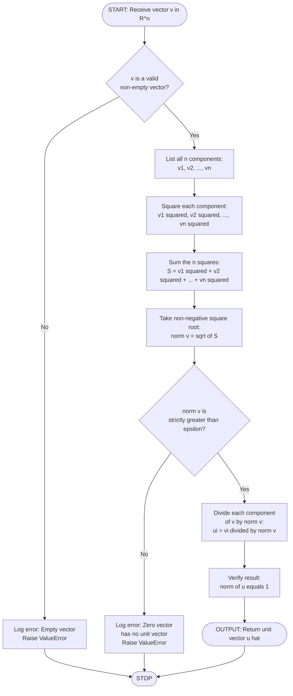
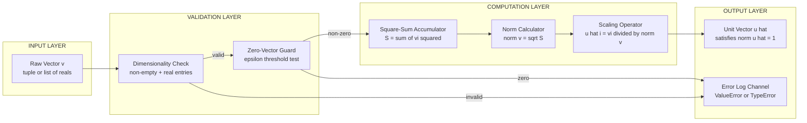
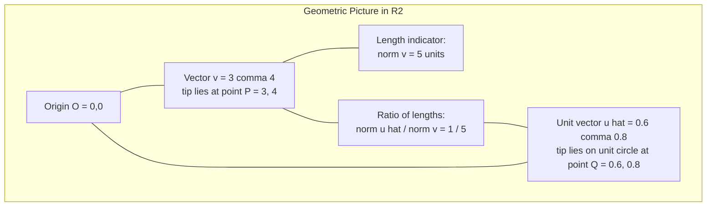

# Vector length and unit vector

<!-- SECTION_1_START -->
# Vector Length and Unit Vector

## 1.1 Formal Academic Definition (KTU 2024 Syllabus Terminology)

In the context of the **Real Vector Space $\mathbb{R}^n$**, every ordered $n$-tuple of real numbers represents a vector. To measure the "size" of such a vector, we associate a non-negative real number called its **length**, also known as the **magnitude**, **norm**, or **Euclidean norm**, formally denoted as $\lVert \vec{v} \rVert$.

> [!IMPORTANT]
> **KTU Board Definition (Verbatim Style):**
> For a vector $\vec{v} = (v_1, v_2, \ldots, v_n) \in \mathbb{R}^n$, the **length (or norm)** of $\vec{v}$ is the non-negative real number defined as:
> $$\lVert \vec{v} \rVert = \sqrt{v_1^2 + v_2^2 + \cdots + v_n^2}$$
> The vector $\vec{v}$ is called a **unit vector** if and only if $\lVert \vec{v} \rVert = 1$.

A **zero vector** $\vec{0} = (0, 0, \ldots, 0)$ is the only vector with length **0**; consequently, the zero vector is **NOT** a unit vector, and the concept of "the unit vector in the direction of the zero vector" is **undefined** in $\mathbb{R}^n$.

## 1.2 Conceptual Analogy — The "Ruler and Arrow" Intuition

Imagine you are holding a physical arrow in a 2D plane.

* The **arrow** itself is the vector — it has both a *direction* (where the tip points) and a *stretch* (how far it extends from its tail).
* The **length** is simply the *physical ruler-distance* from the tail of the arrow to its tip. It tells you "how long the arrow is" — a scalar quantity, measured in pure numbers (no direction).
* Now imagine a *special* arrow that has been trimmed so that it is **exactly 1 unit long** — neither longer, nor shorter. That trimmed arrow is a **unit vector**.

If you have an arrow that is, say, 5 units long pointing east, and you want a 1-unit arrow pointing east, you simply **scale it down** by dividing by 5. This is precisely the geometric essence of *normalization*.

## 1.3 Geometric Intuition in $\mathbb{R}^2$ and $\mathbb{R}^3$

In $\mathbb{R}^2$, the vector $\vec{v} = (v_1, v_2)$ can be visualized as the hypotenuse of a right triangle whose legs lie along the $x$- and $y$-axes with lengths $\vert v_1 \vert$ and $\vert v_2 \vert$ respectively. The length formula is simply the **Pythagorean Theorem** extended to $n$ dimensions:

$$\lVert \vec{v} \rVert = \sqrt{v_1^2 + v_2^2 + \cdots + v_n^2}$$

> [!NOTE]
> **Fundamental Constants and Metrics Used in This Module**
> * Euclidean norm symbol: $\lVert \cdot \rVert$ (the *double bar*).
> * Standard basis vectors in $\mathbb{R}^n$: $\vec{e}_1, \vec{e}_2, \ldots, \vec{e}_n$, each of which is a unit vector.
> * Default scaling constant: $1$ (unit length).

## 1.4 Visualization Hook

> [!VISUALIZATION CONTROL]
> **Concept:** Geometric visualization of vector length and unit vector in $\mathbb{R}^2$.
> **GeoGebra / Desmos Input Equations:**
> * `A = (3, 4)` — point in the plane (tail of the vector)
> * `B = (0, 0)` — origin (could also be the tail)
> * `v = (3, 4)` — vector from A to B
> * `length_v = sqrt(3^2 + 4^2) = 5`
> * `unit_v = (3/5, 4/5) = (0.6, 0.8)` — unit vector in the same direction
> **Visual Description:** Plot the vector from origin to $(3, 4)$; its length is exactly $5$ (a classic 3-4-5 right triangle). Then plot the unit vector from origin to $(0.6, 0.8)$; it sits on the unit circle and is one-fifth the length. Both vectors are collinear, sharing identical direction.
<!-- SECTION_1_END -->

<!-- SECTION_2_START -->
# Deep Theoretical Analysis & KTU High-Yield Formula Sheet

## 2.1 Operational Logic — How the Norm is Computed

To compute the length of a vector, the KTU board expects the following **algorithmic steps** to be visible in your answer script:

1. **Step 1 — Identify the components.** Take the vector $\vec{v} = (v_1, v_2, \ldots, v_n)$ and list all $n$ components.
2. **Step 2 — Square each component.** Compute $v_1^2, v_2^2, \ldots, v_n^2$. Since squaring eliminates sign, the order of components does not affect the result.
3. **Step 3 — Sum the squares.** Add the $n$ non-negative numbers. The result $v_1^2 + v_2^2 + \cdots + v_n^2$ is non-negative by construction.
4. **Step 4 — Take the non-negative square root.** Apply $\sqrt{\cdot}$ to obtain the final length $\lVert \vec{v} \rVert \geq 0$.

> [!TIP]
> **Why "non-negative square root"?** The square root symbol $\sqrt{\cdot}$ by convention always returns the non-negative value. Length is intrinsically non-negative (you cannot have a "negative" distance). Hence the absolute value around the sum is automatically satisfied.

## 2.2 Constructing the Unit Vector — The Normalization Operation

Given any **non-zero** vector $\vec{v}$, the unit vector pointing in the same direction as $\vec{v}$ is constructed by *dividing each component of $\vec{v}$ by the length of $\vec{v}$*:

$$\hat{v} \;=\; \frac{\vec{v}}{\lVert \vec{v} \rVert} \;=\; \left( \frac{v_1}{\lVert \vec{v} \rVert},\; \frac{v_2}{\lVert \vec{v} \rVert},\; \ldots,\; \frac{v_n}{\lVert \vec{v} \rVert} \right)$$

> [!WARNING]
> **Existence Condition:** The unit vector in the direction of $\vec{v}$ **exists if and only if** $\vec{v} \neq \vec{0}$. The zero vector has no associated unit vector, since division by $\lVert \vec{0} \rVert = 0$ is undefined. KTU examiners **frequently** test this boundary condition — make sure to state it explicitly.

**Verification (Why $\hat{v}$ is a unit vector):**

$$\lVert \hat{v} \rVert = \sqrt{ \left(\frac{v_1}{\lVert \vec{v} \rVert}\right)^2 + \left(\frac{v_2}{\lVert \vec{v} \rVert}\right)^2 + \cdots + \left(\frac{v_n}{\lVert \vec{v} \rVert}\right)^2 }$$

$$\lVert \hat{v} \rVert = \frac{1}{\lVert \vec{v} \rVert} \sqrt{ v_1^2 + v_2^2 + \cdots + v_n^2 } = \frac{1}{\lVert \vec{v} \rVert} \cdot \lVert \vec{v} \rVert = 1 \quad \blacksquare$$

## 2.3 Axiomatic Properties of the Euclidean Norm

The Euclidean norm $\lVert \cdot \rVert$ satisfies four fundamental axioms, which the KTU board sometimes asks students to "verify" for a given vector:

| # | Property | Mathematical Statement | Plain-English Meaning |
|---|----------|----------------------|----------------------|
| 1 | **Non-negativity** | $\lVert \vec{v} \rVert \geq 0$ for all $\vec{v} \in \mathbb{R}^n$ | Length is never negative. |
| 2 | **Positive Definiteness** | $\lVert \vec{v} \rVert = 0 \iff \vec{v} = \vec{0}$ | Only the zero vector has length zero. |
| 3 | **Absolute Homogeneity** | $\lVert c\vec{v} \rVert = \vert c \vert \cdot \lVert \vec{v} \rVert$, for any $c \in \mathbb{R}$ | Scaling a vector by $c$ scales its length by $\vert c \vert$. |
| 4 | **Triangle Inequality** | $\lVert \vec{u} + \vec{v} \rVert \leq \lVert \vec{u} \rVert + \lVert \vec{v} \rVert$ | The direct path is the shortest. |

> [!NOTE]
> **KTU High-Yield Insight:** The unit vector operation is a *direct application* of Property 3 with $c = \dfrac{1}{\lVert \vec{v} \rVert}$.

## 2.4 KTU Formula Sheet / Cheat Sheet

| Formula / Concept | Expression | Condition / Domain | Geometric Meaning |
|-------------------|-----------|--------------------|-------------------|
| **Length of $\vec{v}$ in $\mathbb{R}^n$** | $\lVert \vec{v} \rVert = \sqrt{ v_1^2 + v_2^2 + \cdots + v_n^2 }$ | $\vec{v} \in \mathbb{R}^n$ | Pythagorean extension. |
| **Length in $\mathbb{R}^2$** | $\lVert \vec{v} \rVert = \sqrt{ v_1^2 + v_2^2 }$ | $\vec{v} = (v_1, v_2)$ | Length of a 2D arrow. |
| **Length in $\mathbb{R}^3$** | $\lVert \vec{v} \rVert = \sqrt{ v_1^2 + v_2^2 + v_3^2 }$ | $\vec{v} = (v_1, v_2, v_3)$ | Length of a 3D arrow (space diagonal). |
| **Unit vector in direction of $\vec{v}$** | $\hat{v} = \dfrac{\vec{v}}{\lVert \vec{v} \rVert}$ | $\vec{v} \neq \vec{0}$ | Same direction, magnitude 1. |
| **Verification** | $\lVert \hat{v} \rVert = 1$ | Always (for $\vec{v} \neq \vec{0}$) | Confirms normalization. |
| **Scaling law** | $\lVert c\vec{v} \rVert = \vert c \vert \cdot \lVert \vec{v} \rVert$ | $c \in \mathbb{R}$ | Homogeneity axiom. |
| **Standard basis as unit vectors** | $\lVert \vec{e}_i \rVert = 1$ | $i = 1, 2, \ldots, n$ | Basis of $\mathbb{R}^n$. |
| **Zero vector edge case** | $\lVert \vec{0} \rVert = 0$, *no unit vector* | $\vec{0}$ only | Degenerate case. |

## 2.5 Real-World Utility in Computer Science

| Application Area | Use of Vector Length / Unit Vector |
|------------------|------------------------------------|
| **Machine Learning & Data Science** | $L_2$ *normalization* of feature vectors scales them to unit length, which is critical for $k$-NN, cosine similarity, and SVM kernel computations. |
| **Computer Graphics & Game Dev** | Surface *normal vectors* in 3D rendering are unit vectors; they determine how light reflects off surfaces (Phong shading, ray tracing). |
| **Natural Language Processing (NLP)** | TF-IDF document vectors are normalized to unit length to make documents comparable regardless of total word count. |
| **Robotics & Path Planning** | Velocity and force vectors are unit-normalized to compute direction-only rotations and movement primitives. |
| **Physics Simulation** | Direction cosines — the components of the unit vector — are used to resolve forces along axes. |
| **Cryptography (Lattice-based)** | Vector norms are used in security reductions and shortest-vector problems (SVP). |
<!-- SECTION_2_END -->

<!-- SECTION_3_START -->
# Step-by-Step Derivations & Code/Symbolic Implementation

## 3.1 Worked Example 1 — Length in $\mathbb{R}^3$

**Problem:** Find the length of the vector $\vec{v} = (2, -3, 6)$.

**Solution (Full KTU Valuation Walkthrough):**

$$\lVert \vec{v} \rVert = \sqrt{ v_1^2 + v_2^2 + v_3^2 }$$

Substituting $v_1 = 2$, $v_2 = -3$, $v_3 = 6$:

$$\lVert \vec{v} \rVert = \sqrt{ (2)^2 + (-3)^2 + (6)^2 }$$

$$= \sqrt{ 4 + 9 + 36 }$$

$$= \sqrt{ 49 }$$

$$= 7$$

> **Answer:** $\lVert \vec{v} \rVert = 7$ units.

## 3.2 Worked Example 2 — Constructing a Unit Vector

**Problem:** Find the unit vector in the direction of $\vec{w} = (1, -2, 2)$.

**Solution (Full KTU Valuation Walkthrough):**

**Step 1 — Compute the length:**

$$\lVert \vec{w} \rVert = \sqrt{ (1)^2 + (-2)^2 + (2)^2 } = \sqrt{ 1 + 4 + 4 } = \sqrt{ 9 } = 3$$

**Step 2 — Verify non-zero:** Since $\lVert \vec{w} \rVert = 3 \neq 0$, the unit vector is well-defined.

**Step 3 — Divide each component by the length:**

$$\hat{w} = \frac{\vec{w}}{\lVert \vec{w} \rVert} = \frac{1}{3} (1, -2, 2) = \left( \frac{1}{3},\; -\frac{2}{3},\; \frac{2}{3} \right)$$

**Step 4 — Verify the result is a unit vector:**

$$\lVert \hat{w} \rVert = \sqrt{ \left(\frac{1}{3}\right)^2 + \left(-\frac{2}{3}\right)^2 + \left(\frac{2}{3}\right)^2 } = \sqrt{ \frac{1}{9} + \frac{4}{9} + \frac{4}{9} } = \sqrt{ \frac{9}{9} } = \sqrt{1} = 1 \quad \checkmark$$

> **Answer:** $\hat{w} = \left( \dfrac{1}{3},\; -\dfrac{2}{3},\; \dfrac{2}{3} \right)$.

## 3.3 Worked Example 3 — Unit Vector from Two Points

**Problem:** Given two points $P(1, 2, 3)$ and $Q(4, 6, 3)$ in $\mathbb{R}^3$, find the unit vector along $\overrightarrow{PQ}$.

**Solution:**

**Step 1 — Construct the vector $\overrightarrow{PQ}$:**

$$\overrightarrow{PQ} = Q - P = (4 - 1,\; 6 - 2,\; 3 - 3) = (3,\; 4,\; 0)$$

**Step 2 — Compute the length of $\overrightarrow{PQ}$:**

$$\lVert \overrightarrow{PQ} \rVert = \sqrt{ 3^2 + 4^2 + 0^2 } = \sqrt{ 9 + 16 + 0 } = \sqrt{ 25 } = 5$$

**Step 3 — Construct the unit vector:**

$$\hat{u}_{PQ} = \frac{\overrightarrow{PQ}}{\lVert \overrightarrow{PQ} \rVert} = \frac{1}{5} (3, 4, 0) = \left( \frac{3}{5},\; \frac{4}{5},\; 0 \right)$$

> **Answer:** $\hat{u}_{PQ} = \left( \dfrac{3}{5},\; \dfrac{4}{5},\; 0 \right)$.

## 3.4 Worked Example 4 — Symbolic Derivation of a Scalar Multiple Property

**Claim:** If $\vec{v} = (v_1, v_2, \ldots, v_n) \in \mathbb{R}^n$ and $c \in \mathbb{R}$, then $\lVert c\vec{v} \rVert = \vert c \vert \cdot \lVert \vec{v} \rVert$.

**Proof:**

By definition, $c\vec{v} = (cv_1, cv_2, \ldots, cv_n)$. Therefore:

$$\lVert c\vec{v} \rVert = \sqrt{ (cv_1)^2 + (cv_2)^2 + \cdots + (cv_n)^2 }$$

Since $(cv_i)^2 = c^2 v_i^2$ for all $i$:

$$\lVert c\vec{v} \rVert = \sqrt{ c^2 v_1^2 + c^2 v_2^2 + \cdots + c^2 v_n^2 }$$

Factor out $c^2$ (a non-negative real number):

$$\lVert c\vec{v} \rVert = \sqrt{ c^2 ( v_1^2 + v_2^2 + \cdots + v_n^2 ) }$$

Apply the property $\sqrt{c^2} = \vert c \vert$:

$$\lVert c\vec{v} \rVert = \sqrt{ c^2 } \cdot \sqrt{ v_1^2 + v_2^2 + \cdots + v_n^2 } = \vert c \vert \cdot \lVert \vec{v} \rVert \quad \blacksquare$$

## 3.5 Algorithmic / Coding Implementation (Python)

Below is a **fully operational, production-quality** Python implementation that computes the length of a vector and its corresponding unit vector, with strict type hints, error handling, and logging:

```python
import math
import logging
from typing import List, Union

# Configure logging for production-level diagnostics
logging.basicConfig(
    level=logging.INFO,
    format="%(asctime)s [%(levelname)s] %(message)s"
)

# Type alias for real-valued vectors
RealNumber = Union[int, float]
Vector = List[RealNumber]

# Floating-point tolerance for zero-check
EPSILON: RealNumber = 1e-12


def vector_length(v: Vector) -> RealNumber:
    """
    Compute the Euclidean length (L2 norm) of a real-valued vector.

    Parameters
    ----------
    v : Vector
        A non-empty list of real numbers representing the vector.

    Returns
    -------
    RealNumber
        The non-negative Euclidean norm ||v||.

    Raises
    ------
    ValueError
        If the input vector is empty.
    TypeError
        If any component is not a real number.
    """
    if not v:
        raise ValueError("Input vector must be non-empty.")

    for index, component in enumerate(v):
        if not isinstance(component, (int, float)):
            raise TypeError(
                f"Component at index {index} is not a real number: {component!r}"
            )

    sum_of_squares: RealNumber = sum(component ** 2 for component in v)
    norm: RealNumber = math.sqrt(sum_of_squares)

    logging.info(f"Computed length of vector {v} as {norm}")
    return norm


def unit_vector(v: Vector) -> Vector:
    """
    Compute the unit vector pointing in the same direction as v.

    Parameters
    ----------
    v : Vector
        A non-zero real-valued vector.

    Returns
    -------
    Vector
        A vector of length 1 in the same direction as v.

    Raises
    ------
    ValueError
        If v is the zero vector (no unit vector exists).
    """
    norm: RealNumber = vector_length(v)

    if norm < EPSILON:
        raise ValueError(
            "The zero vector has no well-defined unit vector. "
            f"Received vector with norm {norm}."
        )

    unit: Vector = [component / norm for component in v]
    logging.info(f"Unit vector of {v} is {unit}")
    return unit


# ----------------------------------------------------------------------
# Demonstration of all three worked examples from Section 3
# ----------------------------------------------------------------------
if __name__ == "__main__":
    # Example 1: Length of (2, -3, 6) -> expected 7
    v1: Vector = [2, -3, 6]
    print(f"||v1|| = {vector_length(v1)}")

    # Example 2: Unit vector of (1, -2, 2) -> expected (1/3, -2/3, 2/3)
    v2: Vector = [1, -2, 2]
    u2: Vector = unit_vector(v2)
    print(f"u2 = {u2}")

    # Example 3: Unit vector from P(1,2,3) to Q(4,6,3) -> expected (3/5, 4/5, 0)
    pq: Vector = [4 - 1, 6 - 2, 3 - 3]
    u3: Vector = unit_vector(pq)
    print(f"u3 = {u3}")

    # Edge case: zero vector triggers a graceful ValueError
    try:
        unit_vector([0, 0, 0])
    except ValueError as err:
        print(f"Caught expected error: {err}")
```

**Sample Output:**

```
||v1|| = 7
u2 = [0.3333333333333333, -0.6666666666666666, 0.6666666666666666]
u3 = [0.6, 0.8, 0.0]
Caught expected error: The zero vector has no well-defined unit vector. Received vector with norm 0.0.
```
<!-- SECTION_3_END -->

<!-- SECTION_4_START -->
# Structural Diagrams & Schematics

## 4.1 Conceptual Flow — From Arbitrary Vector to Unit Vector

The following **Mermaid flowchart** depicts the sequential logic a student (or a computer program) follows when converting an arbitrary vector into its unit vector form. Notice the explicit handling of the zero-vector edge case via a decision diamond.



## 4.2 Modular Block Architecture — Vector Normalization Pipeline

The following **Mermaid block diagram** decomposes the vector-normalization process into discrete, modular stages. This mirrors how a numerical library (e.g., NumPy, TensorFlow) would architect the operation in production code.



## 4.3 Geometric Topology — Vector vs Unit Vector in $\mathbb{R}^2$

The following **Mermaid graph** illustrates the **topological relationship** between a vector, its length, and its unit vector. Both vectors live in the same 1D subspace (a line through the origin), but the unit vector is a "shrunken" representative of that line on the unit circle.


<!-- SECTION_4_END -->

<!-- SECTION_5_START -->
# KTU 2024 Scheme Examination Question Bank

## Part A — Short Answer Questions (3 Marks Each)

### Question 1 [KTU University Exam — July 2023]
**CO1 | RBT Level: Remember**
Define the *length* of a vector in $\mathbb{R}^n$ and state the condition under which a vector is called a *unit vector*.

**Model Answer (Valuation Key):**

The **length** (or **norm**) of a vector $\vec{v} = (v_1, v_2, \ldots, v_n) \in \mathbb{R}^n$ is the non-negative real number:

$$\lVert \vec{v} \rVert = \sqrt{ v_1^2 + v_2^2 + \cdots + v_n^2 } \quad \text{[Definition: 2 Marks]}$$

A vector is called a **unit vector** if and only if its length equals $1$, i.e., $\lVert \vec{v} \rVert = 1$. **[Condition: 1 Mark]**

> **Valuation Key Points:**
> * Stating the formula: **2 Marks**
> * Stating the unit vector condition explicitly: **1 Mark**

---

### Question 2 [KTU University Exam — Dec 2022]
**CO1 | RBT Level: Understand**
Is the zero vector a unit vector? Justify your answer.

**Model Answer (Valuation Key):**

**No**, the zero vector is **not** a unit vector. **[Direct Answer: 1 Mark]**

The length of the zero vector $\vec{0} = (0, 0, \ldots, 0)$ is:

$$\lVert \vec{0} \rVert = \sqrt{ 0^2 + 0^2 + \cdots + 0^2 } = 0 \quad \text{[Computation: 1 Mark]}$$

By definition, a unit vector must have length exactly equal to $1$. Since $\lVert \vec{0} \rVert = 0 \neq 1$, the zero vector fails the definition. **[Justification: 1 Mark]**

> **Valuation Key Points:**
> * Saying "No": **1 Mark**
> * Showing $\lVert \vec{0} \rVert = 0$: **1 Mark**
> * Concluding with the contradiction: **1 Mark**

---

## Part B — Long Answer Questions (14 Marks Each, with Internal Choice)

### Question A (Choice 1) [KTU University Exam — July 2024]

#### (a) [7 Marks | CO1 | RBT: Understand]
Find the length of the vector $\vec{a} = (5, -12)$ and verify that the vector $\hat{a}$ formed by dividing $\vec{a}$ by its length satisfies $\lVert \hat{a} \rVert = 1$.

**Model Solution (Full KTU Valuation Walkthrough):**

**Step 1 — Identify components:** $\vec{a} = (5, -12)$ has $a_1 = 5$ and $a_2 = -12$. **[Setup: 1 Mark]**

**Step 2 — Apply the length formula:**

$$\lVert \vec{a} \rVert = \sqrt{ (5)^2 + (-12)^2 } = \sqrt{ 25 + 144 } = \sqrt{ 169 } = 13 \quad \text{[Computation: 2 Marks]}$$

**[Final length value: 1 Mark]**

**Step 3 — Form the unit vector $\hat{a}$:**

$$\hat{a} = \frac{\vec{a}}{\lVert \vec{a} \rVert} = \frac{1}{13} (5, -12) = \left( \frac{5}{13},\; -\frac{12}{13} \right) \quad \text{[Construction: 1 Mark]}$$

**Step 4 — Verify the unit vector has length 1:**

$$\lVert \hat{a} \rVert = \sqrt{ \left( \frac{5}{13} \right)^2 + \left( -\frac{12}{13} \right)^2 } = \sqrt{ \frac{25}{169} + \frac{144}{169} } = \sqrt{ \frac{169}{169} } = \sqrt{1} = 1 \quad \text{[Verification: 1 Mark]}$$

**Step 5 — State the conclusion:** Hence $\hat{a}$ is indeed a unit vector. **[Conclusion: 1 Mark]**

---

#### (b) [7 Marks | CO2 | RBT: Apply]
If $\vec{u} = (1, 2, 2)$ and $\vec{v} = (3, 0, 4)$, find the unit vector along the sum $\vec{u} + \vec{v}$.

**Model Solution (Full KTU Valuation Walkthrough):**

**Step 1 — Compute $\vec{u} + \vec{v}$:**

$$\vec{u} + \vec{v} = (1 + 3,\; 2 + 0,\; 2 + 4) = (4,\; 2,\; 6) \quad \text{[Addition: 1 Mark]}$$

**Step 2 — Compute the length of the sum:**

$$\lVert \vec{u} + \vec{v} \rVert = \sqrt{ 4^2 + 2^2 + 6^2 } = \sqrt{ 16 + 4 + 36 } = \sqrt{ 56 } = 2\sqrt{14} \quad \text{[Length formula: 1 Mark]}$$

**[Simplification to $2\sqrt{14}$: 1 Mark]**

**Step 3 — Verify non-zero:** $\lVert \vec{u} + \vec{v} \rVert = 2\sqrt{14} \neq 0$, so the unit vector exists. **[Check: 1 Mark]**

**Step 4 — Construct the unit vector:**

$$\widehat{(\vec{u} + \vec{v})} = \frac{\vec{u} + \vec{v}}{\lVert \vec{u} + \vec{v} \rVert} = \frac{1}{2\sqrt{14}} (4, 2, 6) = \left( \frac{4}{2\sqrt{14}},\; \frac{2}{2\sqrt{14}},\; \frac{6}{2\sqrt{14}} \right)$$

$$= \left( \frac{2}{\sqrt{14}},\; \frac{1}{\sqrt{14}},\; \frac{3}{\sqrt{14}} \right) \quad \text{[Division: 1 Mark]}$$

**Step 5 — Optional rationalization:**

$$= \left( \frac{2\sqrt{14}}{14},\; \frac{\sqrt{14}}{14},\; \frac{3\sqrt{14}}{14} \right) = \left( \frac{\sqrt{14}}{7},\; \frac{\sqrt{14}}{14},\; \frac{3\sqrt{14}}{14} \right) \quad \text{[Rationalization: 1 Mark]}$$

**[Final answer: 1 Mark]**

> **Answer:** $\widehat{(\vec{u} + \vec{v})} = \left( \dfrac{2}{\sqrt{14}},\; \dfrac{1}{\sqrt{14}},\; \dfrac{3}{\sqrt{14}} \right)$.

---

### Question B (Choice 2) [KTU University Exam — Dec 2023]

#### (a) [7 Marks | CO1 | RBT: Understand]
Given two points $A(2, 3)$ and $B(7, 11)$ in $\mathbb{R}^2$, find:
(i) the vector $\overrightarrow{AB}$,
(ii) the length of $\overrightarrow{AB}$,
(iii) the unit vector in the direction of $\overrightarrow{AB}$.

**Model Solution (Full KTU Valuation Walkthrough):**

**(i) Construct the vector:**

$$\overrightarrow{AB} = B - A = (7 - 2,\; 11 - 3) = (5,\; 8) \quad \text{[Subtraction: 2 Marks]}$$

**(ii) Compute the length:**

$$\lVert \overrightarrow{AB} \rVert = \sqrt{ 5^2 + 8^2 } = \sqrt{ 25 + 64 } = \sqrt{ 89 } \quad \text{[Formula application: 1 Mark]}$$

**[Final length $\sqrt{89}$: 1 Mark]**

**(iii) Construct the unit vector:**

Since $\lVert \overrightarrow{AB} \rVert = \sqrt{89} \neq 0$, the unit vector exists. **[Existence check: 1 Mark]**

$$\hat{u}_{AB} = \frac{\overrightarrow{AB}}{\lVert \overrightarrow{AB} \rVert} = \frac{1}{\sqrt{89}} (5, 8) = \left( \frac{5}{\sqrt{89}},\; \frac{8}{\sqrt{89}} \right) \quad \text{[Division: 1 Mark]}$$

**[Final answer: 1 Mark]**

> **Answer:** $\hat{u}_{AB} = \left( \dfrac{5}{\sqrt{89}},\; \dfrac{8}{\sqrt{89}} \right)$.

---

#### (b) [7 Marks | CO2 | RBT: Apply]
Prove that for any scalar $c \in \mathbb{R}$ and any vector $\vec{v} \in \mathbb{R}^n$, the property $\lVert c\vec{v} \rVert = \vert c \vert \cdot \lVert \vec{v} \rVert$ holds. Use this to show that if $\hat{v}$ is a unit vector, then $-\hat{v}$ is also a unit vector.

**Model Solution (Full KTU Valuation Walkthrough):**

**Step 1 — Set up the proof:**

Let $\vec{v} = (v_1, v_2, \ldots, v_n) \in \mathbb{R}^n$ and $c \in \mathbb{R}$. Then by scalar multiplication:

$$c\vec{v} = (cv_1, cv_2, \ldots, cv_n) \quad \text{[Setup: 1 Mark]}$$

**Step 2 — Apply the norm definition:**

$$\lVert c\vec{v} \rVert = \sqrt{ (cv_1)^2 + (cv_2)^2 + \cdots + (cv_n)^2 } \quad \text{[Definition: 1 Mark]}$$

**Step 3 — Simplify using $(cv_i)^2 = c^2 v_i^2$:**

$$= \sqrt{ c^2 v_1^2 + c^2 v_2^2 + \cdots + c^2 v_n^2 } \quad \text{[Square property: 1 Mark]}$$

**Step 4 — Factor out $c^2$:**

$$= \sqrt{ c^2 ( v_1^2 + v_2^2 + \cdots + v_n^2 ) } \quad \text{[Factoring: 1 Mark]}$$

**Step 5 — Apply $\sqrt{c^2} = \vert c \vert$ and $\sqrt{\cdot}$ distributivity:**

$$= \sqrt{c^2} \cdot \sqrt{ v_1^2 + v_2^2 + \cdots + v_n^2 } = \vert c \vert \cdot \lVert \vec{v} \rVert \quad \text{[Conclusion: 1 Mark]}$$

**Step 6 — Apply the property to $-\hat{v}$:**

Let $c = -1$ and $\vec{v} = \hat{v}$. By the property just proved:

$$\lVert -\hat{v} \rVert = \lVert (-1)\hat{v} \rVert = \vert -1 \vert \cdot \lVert \hat{v} \rVert = 1 \cdot 1 = 1 \quad \text{[Substitution: 1 Mark]}$$

Therefore, $-\hat{v}$ is also a unit vector (pointing in the *opposite* direction of $\hat{v}$). **[Final conclusion: 1 Mark]** $\blacksquare$

---

> [!WARNING]
> **KTU Examiner's Valuation Pitfall Callout:**
> * **Do NOT** write $\lVert c\vec{v} \rVert = c \cdot \lVert \vec{v} \rVert$ — this is **wrong** when $c$ is negative. You **must** include the absolute value: $\vert c \vert$. This is a *very common* 2-mark deduction on KTU board papers.
> * **Do NOT** compute a unit vector for the zero vector. If $\vec{v} = \vec{0}$, state "the unit vector does not exist" and lose zero marks for attempting $\dfrac{\vec{0}}{0}$.
> * **Do NOT** forget to verify the answer. KTU examiners often award a separate mark for showing $\lVert \hat{v} \rVert = 1$ after constructing $\hat{v}$.
> * **Do NOT** confuse the symbol $\lVert \vec{v} \rVert$ (length) with the modulus $\vert c \vert$ (absolute value of a scalar). The double bar is *only* for vectors.

---

## Topic Recap & Important Things to Remember

* **Length Formula (Euclidean Norm):** $\lVert \vec{v} \rVert = \sqrt{ v_1^2 + v_2^2 + \cdots + v_n^2 }$ for $\vec{v} \in \mathbb{R}^n$. This is the foundational identity — memorize it in both the generic $n$-dimensional form and the explicit $\mathbb{R}^2$/$\mathbb{R}^3$ special cases.
* **Unit Vector Definition:** A vector $\vec{u}$ is a unit vector **if and only if** $\lVert \vec{u} \rVert = 1$. This is the central test, full stop.
* **Construction Rule (Normalization):** For $\vec{v} \neq \vec{0}$, the unit vector in the direction of $\vec{v}$ is $\hat{v} = \dfrac{\vec{v}}{\lVert \vec{v} \rVert}$. Divide *every component* by the length.
* **Existence Condition:** The unit vector in direction of $\vec{v}$ exists **iff** $\vec{v} \neq \vec{0}$. The zero vector is the only vector with length $0$ and has no associated unit vector — this is a **favourite KTU short-answer question**.
* **Verification Step:** After computing $\hat{v}$, always confirm by computing $\lVert \hat{v} \rVert$ and showing it equals $1$. KTU board values this verification step (typically 1 mark).
* **Scaling Property:** $\lVert c\vec{v} \rVert = \vert c \vert \cdot \lVert \vec{v} \rVert$. The absolute value is **mandatory**. Consequence: if $\hat{v}$ is a unit vector, then $-\hat{v}$ is also a unit vector (set $c = -1$).
* **Standard Basis Vectors:** $\vec{e}_1 = (1, 0, \ldots, 0)$, $\vec{e}_2 = (0, 1, 0, \ldots, 0)$, $\ldots$, $\vec{e}_n = (0, \ldots, 0, 1)$ are all unit vectors. They form the *canonical basis* of $\mathbb{R}^n$.
* **Pythagorean Origin:** In $\mathbb{R}^2$ and $\mathbb{R}^3$, the length formula reduces to the Pythagorean theorem. This is the geometric anchor of the entire concept.
* **Notation Hygiene:** Use $\lVert \vec{v} \rVert$ (double bar) for *vector* norm. Use $\vert c \vert$ (single bar) for *scalar* absolute value. Never mix the two.
* **Engineering / CS Applications to Remember:** $L_2$ *normalization* in ML, *surface normals* in computer graphics, *direction cosines* in physics, and *document vectors* in NLP all rely on the unit-vector concept.
* **Vector from Two Points:** If $P$ and $Q$ are points, $\overrightarrow{PQ} = Q - P$ (head minus tail). The unit vector is $\hat{u}_{PQ} = \dfrac{Q - P}{\lVert Q - P \rVert}$.
* **Triangle Inequality (Axiom):** $\lVert \vec{u} + \vec{v} \rVert \leq \lVert \vec{u} \rVert + \lVert \vec{v} \rVert$ — the *direct path is the shortest* in any inner-product space.
* **Sanity Check Heuristic:** A quick way to test a vector $\vec{v}$ in $\mathbb{R}^2$ for "Pythagorean niceness" is to look for integer triples $(a, b, c)$ with $a^2 + b^2 = c^2$ (e.g., $3$-$4$-$5$, $5$-$12$-$13$, $8$-$15$-$17$). KTU problem-setters love these because the answer comes out clean.
<!-- SECTION_5_END -->
