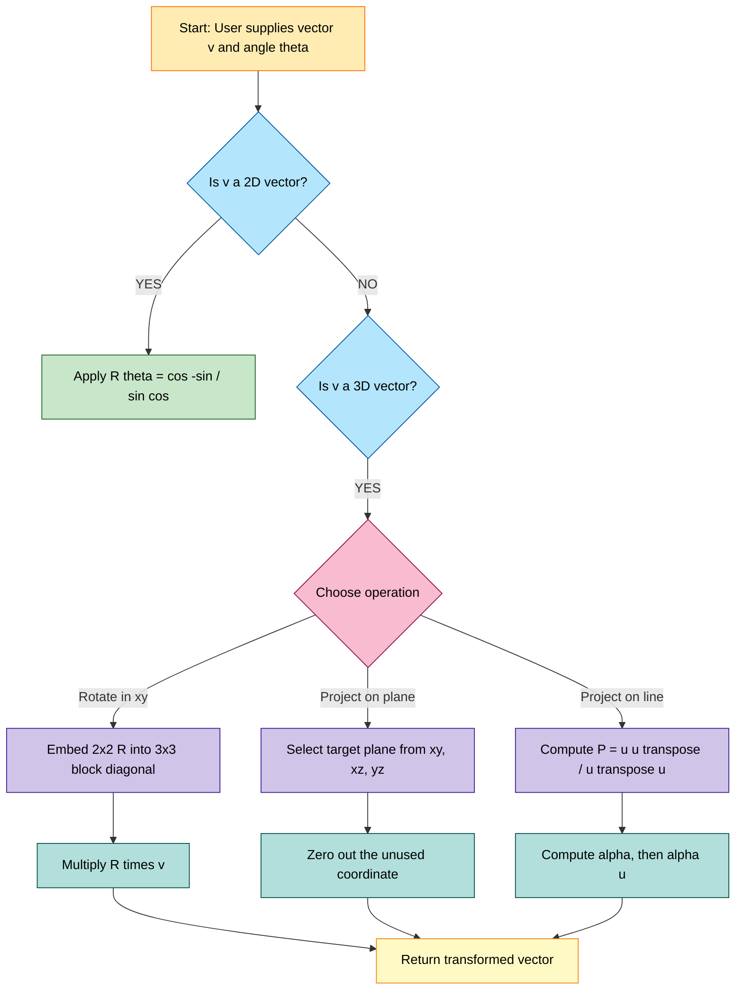

# Coordinate rotations in $R^2$ and projections in $R^3$

<!-- SECTION_1_START -->

# Coordinate Rotations in $\mathbb{R}^2$ and Projections in $\mathbb{R}^3$

## 1.1 Formal Definition (KTU 2024 Syllabus Terminology)

> [!NOTE]
> **Core Definition — Rotation in $\mathbb{R}^2$:**
> A **rotation about the origin** through an angle $\theta$ (measured counter-clockwise) is a linear transformation $T_{\theta} : \mathbb{R}^2 \to \mathbb{R}^2$ whose standard matrix is
> $$R(\theta) = \begin{bmatrix} \cos\theta & -\sin\theta \\ \sin\theta & \cos\theta \end{bmatrix}$$
> It satisfies $R(\theta) R(\phi) = R(\theta + \phi)$, $R(\theta)^T = R(\theta)^{-1} = R(-\theta)$, and $\det R(\theta) = 1$.

> [!IMPORTANT]
> **Core Definition — Orthogonal Projection in $\mathbb{R}^3$:**
> An **orthogonal projection** onto a subspace $W \subseteq \mathbb{R}^3$ is a linear operator $P : \mathbb{R}^3 \to \mathbb{R}^3$ such that $P^2 = P$, $P^T = P$, and the image of $P$ equals $W$. For the coordinate planes, the standard projection matrices are:
> $$P_{xy} = \begin{bmatrix} 1 & 0 & 0 \\ 0 & 1 & 0 \\ 0 & 0 & 0 \end{bmatrix}, \quad P_{xz} = \begin{bmatrix} 1 & 0 & 0 \\ 0 & 0 & 0 \\ 0 & 0 & 1 \end{bmatrix}, \quad P_{yz} = \begin{bmatrix} 0 & 0 & 0 \\ 0 & 1 & 0 \\ 0 & 0 & 1 \end{bmatrix}$$

---

## 1.2 Intuitive Overview — "The Camera, The Turntable, and The Shadow"

### 🎡 Rotation Analogy — "The Turntable"

Imagine a **turntable in a dark room** lit by a single overhead light. A red vector $\vec{v}$ lies flat on the disc. When you rotate the disc by $\theta$ degrees, the vector's *length never changes* and it stays pinned at the origin. Mathematically:

- The **base vectors** $\vec{e}_1 = (1,0)$ and $\vec{e}_2 = (0,1)$ rotate into $(\cos\theta, \sin\theta)$ and $(-\sin\theta, \cos\theta)$ respectively.
- Since a linear map is fully determined by what it does to a basis, those rotated images **become the columns** of $R(\theta)$.

> [!TIP]
> **Memory Hook:** *Columns of a matrix = where the basis vectors go.* This is the single most important fact for KTU problems.

### 🌑 Projection Analogy — "The Shadow on the Wall"

Hold a torch above a wire cube. The **shadow on the floor** is the orthogonal projection onto the $xy$-plane — the $z$-coordinate "vanishes" because light travels parallel to the $z$-axis.

- Projection **destroys information** (the $z$-component is lost).
- Projection **preserves length** along the target subspace but *shortens* vectors that have a component outside $W$.
- The square of a projection is itself: $P^2 = P$ — *projecting twice equals projecting once*.

---

## 1.3 Physical Constants & Standard Metrics

| Quantity | Symbol | Value / Unit | Role |
|---|---|---|---|
| Rotation angle | $\theta$ | **radians** (always in computations) | Argument of $\sin, \cos$ |
| Determinant of rotation | $\det R(\theta)$ | **+1** | Distinguishes from reflections |
| Rank of projection | $\text{rank}\,P$ | 1, 2, or 3 | Equals $\dim(W)$ |
| Trace of $P$ | $\text{tr}(P)$ | $\dim(W)$ | Equals number of $1$'s on diagonal |

> [!VISUALIZATION CONTROL]
> **Concept:** Unit vector rotating counter-clockwise on a unit circle.
> **GeoGebra / Desmos Input Equations:**
> * `v_x = cos(t)`, `v_y = sin(t)`  *(parametric, $0 \le t \le 2\pi$)*
> * Rotate the vector $(2,1)$ by $45^\circ$: enter matrix `{{cos(45°), -sin(45°)},{sin(45°), cos(45°)}}` times column `(2,1)`.
> **Visual Description:** The student should see the red arrow sweeping the unit circle while the blue arrow $(2,1)$ pivots about the origin without stretching.

<!-- SECTION_1_END -->

<!-- SECTION_2_START -->

# Deep Theoretical Analysis & KTU High-Yield Formula Sheet

## 2.1 Why the Rotation Matrix Has *That* Form — Step-by-Step Logic

A linear map $T : \mathbb{R}^2 \to \mathbb{R}^2$ is uniquely determined by the images of the standard basis $\{\vec{e}_1, \vec{e}_2\}$.

1. **Image of $\vec{e}_1 = (1,0)$** under counter-clockwise rotation by $\theta$:
   $$T(\vec{e}_1) = (\cos\theta,\ \sin\theta)$$
2. **Image of $\vec{e}_2 = (0,1)$** under the same rotation:
   $$T(\vec{e}_2) = (-\sin\theta,\ \cos\theta)$$
3. **By the definition of a matrix representation**, the matrix whose columns are $T(\vec{e}_1)$ and $T(\vec{e}_2)$ is:
   $$R(\theta) = \begin{bmatrix} \cos\theta & -\sin\theta \\ \sin\theta & \cos\theta \end{bmatrix}$$

> [!IMPORTANT]
> **Key Insight:** This is **not** a guess — it is the *unique* matrix representation. The geometry of the unit circle *forces* this form.

---

## 2.2 Algebraic Properties of $R(\theta)$ (Board-Favourite)

| Property | Equation | Interpretation |
|---|---|---|
| Orthogonal | $R(\theta)^T R(\theta) = I$ | Length is preserved: $\vert R\vec{v} \vert = \vert \vec{v} \vert$ |
| Inverse | $R(\theta)^{-1} = R(\theta)^T = R(-\theta)$ | Rotating back by $\theta$ |
| Composition | $R(\alpha) R(\beta) = R(\alpha + \beta)$ | Rotations add |
| Determinant | $\det R(\theta) = \cos^2\theta + \sin^2\theta = \mathbf{1}$ | Orientation-preserving |
| Eigenvalues | $\lambda = \cos\theta \pm i\sin\theta = e^{\pm i\theta}$ | No *real* eigenvectors (unless $\theta = 0, \pi$) |
| $R(0) = I$ | Identity | Zero rotation |
| $R(\pi) = -I$ | Half-turn | Maps every vector to its negative |

---

## 2.3 KTU Formula Sheet — Cheat Sheet

> [!WARNING]
> Use `\vert` instead of the vertical bar `|` inside table cells to avoid breaking Markdown.

$$
\begin{array}{|l|l|l|}
\hline
\textbf{Transformation} & \textbf{Standard Matrix} & \textbf{Key Property} \\
\hline
\text{Rotation by }\theta \text{ in } \mathbb{R}^2 & R(\theta) = \begin{bmatrix}\cos\theta & -\sin\theta \\ \sin\theta & \cos\theta\end{bmatrix} & R^T = R^{-1},\ \det = 1 \\
\hline
\text{Projection onto }xy\text{-plane} & P_{xy} = \text{diag}(1,1,0) & P^2 = P,\ P^T = P \\
\hline
\text{Projection onto }xz\text{-plane} & P_{xz} = \text{diag}(1,0,1) & P^2 = P \\
\hline
\text{Projection onto }yz\text{-plane} & P_{yz} = \text{diag}(0,1,1) & P^2 = P \\
\hline
\text{Projection onto line } \text{span}(\vec{u}) & P = \dfrac{\vec{u}\vec{u}^T}{\vec{u}^T\vec{u}} & \text{rank} = 1 \\
\hline
\text{Reflection across plane } \vec{n}^T\vec{x}=0 & H = I - 2\dfrac{\vec{n}\vec{n}^T}{\vec{n}^T\vec{n}} & H^2 = I,\ \det H = -1 \\
\hline
\text{Composite: rotate then project} & T = P \cdot R & \text{Associative: } A(BC)=(AB)C \\
\hline
\end{array}
$$

---

## 2.4 Real-World Engineering Utility

| Field | Application | Why this transformation? |
|---|---|---|
| **Computer Graphics** | Rotating a 3D mesh on screen | GPU shaders apply $R(\theta)$ per vertex |
| **Robotics** | Inverse kinematics of a robotic arm | Joint angles encoded as $2\times2$ rotation blocks |
| **Computer Vision** | Camera calibration, image rectification | Projecting 3D world points onto the image plane |
| **GPS / INS** | Orientation of vehicle (yaw, pitch, roll) | Successive rotations in 3D |
| **Machine Learning** | PCA — projecting high-dim data onto principal subspace | $P = UU^T$ where $U$ has orthonormal columns |
| **Cryptography** | Lattice-based schemes | Rotations preserve lattice structure |

<!-- SECTION_2_END -->

<!-- SECTION_3_START -->

# Step-by-Step Derivations & Code/Symbolic Implementation

## 3.1 Exhaustive Derivation — Rotation of a Point in $\mathbb{R}^2$

**Problem:** A point $P$ has polar coordinates $(r, \phi)$. Find its image $P'$ after a counter-clockwise rotation by angle $\theta$ about the origin.

### Step 1 — Express $P$ in Cartesian form

$$x = r\cos\phi, \qquad y = r\sin\phi$$

### Step 2 — Express $P'$ in polar form

The radius is unchanged, but the angle becomes $\phi + \theta$:

$$P' = (r\cos(\phi + \theta),\ r\sin(\phi + \theta))$$

### Step 3 — Apply the angle-addition identities

$$
\begin{aligned}
\cos(\phi + \theta) &= \cos\phi\cos\theta - \sin\phi\sin\theta \\
\sin(\phi + \theta) &= \sin\phi\cos\theta + \cos\phi\sin\theta
\end{aligned}
$$

### Step 4 — Substitute into $P'$

$$
\begin{aligned}
x' &= r\bigl(\cos\phi\cos\theta - \sin\phi\sin\theta\bigr) \\
   &= (r\cos\phi)\cos\theta - (r\sin\phi)\sin\theta \\
y' &= r\bigl(\sin\phi\cos\theta + \cos\phi\sin\theta\bigr) \\
   &= (r\sin\phi)\cos\theta + (r\cos\phi)\sin\theta
\end{aligned}
$$

### Step 5 — Replace $r\cos\phi$ with $x$ and $r\sin\phi$ with $y$

$$
\begin{aligned}
x' &= x\cos\theta - y\sin\theta \\
y' &= x\sin\theta + y\cos\theta
\end{aligned}
$$

### Step 6 — Write the result as a matrix equation

$$
\begin{bmatrix} x' \\ y' \end{bmatrix} = \begin{bmatrix} \cos\theta & -\sin\theta \\ \sin\theta & \cos\theta \end{bmatrix} \begin{bmatrix} x \\ y \end{bmatrix}
$$

$\blacksquare$

---

## 3.2 Exhaustive Derivation — Orthogonal Projection onto a Line in $\mathbb{R}^3$

**Setup:** Let $\vec{u} = (u_1, u_2, u_3)^T$ be a non-zero vector spanning the line $L = \text{span}(\vec{u})$. For an arbitrary vector $\vec{x} \in \mathbb{R}^3$, derive the projection $P\vec{x}$.

### Step 1 — Decompose $\vec{x}$ into parallel and perpendicular parts

$$\vec{x} = \hat{x}_{\parallel} + \hat{x}_{\perp}, \qquad \hat{x}_{\parallel} = \alpha \vec{u}$$

### Step 2 — Orthogonality condition

$\hat{x}_{\perp}$ must be orthogonal to $\vec{u}$:

$$\vec{u}^T \hat{x}_{\perp} = 0 \implies \vec{u}^T (\vec{x} - \alpha \vec{u}) = 0$$

### Step 3 — Solve for the scalar $\alpha$

$$
\begin{aligned}
\vec{u}^T \vec{x} - \alpha \vec{u}^T \vec{u} &= 0 \\
\alpha &= \frac{\vec{u}^T \vec{x}}{\vec{u}^T \vec{u}}
\end{aligned}
$$

### Step 4 — Substitute $\alpha$ back

$$
\begin{aligned}
P\vec{x} &= \hat{x}_{\parallel} = \alpha \vec{u} = \frac{\vec{u}^T \vec{x}}{\vec{u}^T \vec{u}}\,\vec{u} \\
        &= \left(\frac{\vec{u}\vec{u}^T}{\vec{u}^T \vec{u}}\right)\vec{x}
\end{aligned}
$$

### Step 5 — Identify the projection matrix

$$
\boxed{\,P = \frac{\vec{u}\vec{u}^T}{\vec{u}^T \vec{u}} = \frac{1}{u_1^2 + u_2^2 + u_3^2}\begin{bmatrix} u_1^2 & u_1 u_2 & u_1 u_3 \\ u_1 u_2 & u_2^2 & u_2 u_3 \\ u_1 u_3 & u_2 u_3 & u_3^2 \end{bmatrix}\,}
$$

### Step 6 — Verify the idempotent property $P^2 = P$

$$
P^2 = \frac{\vec{u}\vec{u}^T}{\vec{u}^T\vec{u}} \cdot \frac{\vec{u}\vec{u}^T}{\vec{u}^T\vec{u}} = \frac{\vec{u}(\vec{u}^T\vec{u})\vec{u}^T}{(\vec{u}^T\vec{u})^2} = \frac{\vec{u}\vec{u}^T}{\vec{u}^T\vec{u}} = P \ \checkmark
$$

$\blacksquare$

---

## 3.3 Worked Numerical Example — Rotation

**Problem:** Rotate the point $P = (3, 1)$ counter-clockwise by $\theta = 90^\circ$ about the origin.

### Step 1 — Convert to radians and evaluate trig values

$$\theta = \frac{\pi}{2} \implies \cos 90^\circ = 0, \quad \sin 90^\circ = 1$$

### Step 2 — Build the matrix

$$R(90^\circ) = \begin{bmatrix} 0 & -1 \\ 1 & 0 \end{bmatrix}$$

### Step 3 — Multiply

$$
\begin{bmatrix} 0 & -1 \\ 1 & 0 \end{bmatrix} \begin{bmatrix} 3 \\ 1 \end{bmatrix} = \begin{bmatrix} (0)(3) + (-1)(1) \\ (1)(3) + (0)(1) \end{bmatrix} = \begin{bmatrix} -1 \\ 3 \end{bmatrix}
$$

### Step 4 — Verify with the formula

$$x' = 3\cos 90^\circ - 1\sin 90^\circ = 0 - 1 = -1 \ \checkmark$$
$$y' = 3\sin 90^\circ + 1\cos 90^\circ = 3 + 0 = 3 \ \checkmark$$

**Geometric check:** The point $(3,1)$ is in the first quadrant. After a $90^\circ$ CCW rotation, it should land in the second quadrant with swapped-magnitude coordinates $(-1, 3)$. ✓

---

## 3.4 Worked Numerical Example — Projection in $\mathbb{R}^3$

**Problem:** Project $\vec{x} = (2, 3, 5)^T$ onto the line $L$ spanned by $\vec{u} = (1, 1, 1)^T$.

### Step 1 — Compute the denominator

$$\vec{u}^T \vec{u} = 1^2 + 1^2 + 1^2 = 3$$

### Step 2 — Compute the numerator scalar

$$\vec{u}^T \vec{x} = (1)(2) + (1)(3) + (1)(5) = 10$$

### Step 3 — Compute the projection vector

$$\hat{x}_{\parallel} = \frac{10}{3}\begin{bmatrix} 1 \\ 1 \\ 1 \end{bmatrix} = \begin{bmatrix} 10/3 \\ 10/3 \\ 10/3 \end{bmatrix}$$

### Step 4 — Compute the perpendicular component (residual)

$$
\begin{aligned}
\hat{x}_{\perp} &= \vec{x} - \hat{x}_{\parallel} \\
              &= \begin{bmatrix} 2 - 10/3 \\ 3 - 10/3 \\ 5 - 10/3 \end{bmatrix}
              = \begin{bmatrix} -4/3 \\ -1/3 \\ 5/3 \end{bmatrix}
\end{aligned}
$$

### Step 5 — Verify orthogonality

$$\vec{u}^T \hat{x}_{\perp} = (1)(-4/3) + (1)(-1/3) + (1)(5/3) = (-4 - 1 + 5)/3 = 0 \ \checkmark$$

### Step 6 — Verify Pythagorean decomposition

$$
\begin{aligned}
\vert \vec{x} \vert^2 &= 2^2 + 3^2 + 5^2 = 38 \\
\vert \hat{x}_{\parallel} \vert^2 + \vert \hat{x}_{\perp} \vert^2 &= \frac{100}{3} + \frac{16 + 1 + 25}{9} = \frac{300}{9} + \frac{42}{9} = \frac{342}{9} = 38 \ \checkmark
\end{aligned}
$$

---

## 3.5 Python Implementation — Production-Ready

```python
"""
Coordinate Rotations in R^2 and Projections in R^3
Reference: GAMAT201 — Module 4
"""

from __future__ import annotations
import numpy as np
from typing import Tuple


def rotation_matrix_2d(theta_rad: float) -> np.ndarray:
    """
    Build the 2x2 counter-clockwise rotation matrix.

    Parameters
    ----------
    theta_rad : float
        Rotation angle in **radians** (NOT degrees).

    Returns
    -------
    np.ndarray of shape (2, 2)
    """
    c, s = np.cos(theta_rad), np.sin(theta_rad)
    return np.array([[c, -s],
                     [s,  c]], dtype=np.float64)


def project_onto_plane(point: np.ndarray, plane: str) -> np.ndarray:
    """
    Orthogonal projection of a 3D point onto a coordinate plane.

    Parameters
    ----------
    point  : np.ndarray, shape (3,)
    plane  : {'xy', 'xz', 'yz'}

    Returns
    -------
    np.ndarray, shape (3,)
    """
    if point.shape != (3,):
        raise ValueError("Input point must have shape (3,).")

    proj = {
        'xy': np.array([1, 1, 0], dtype=np.float64),
        'xz': np.array([1, 0, 1], dtype=np.float64),
        'yz': np.array([0, 1, 1], dtype=np.float64),
    }
    if plane not in proj:
        raise ValueError(f"plane must be one of {list(proj.keys())}")
    return point * proj[plane]


def project_onto_line(x: np.ndarray, u: np.ndarray) -> Tuple[np.ndarray, np.ndarray]:
    """
    Decompose x into components parallel and perpendicular to span(u).

    Returns
    -------
    (x_parallel, x_perpendicular) : Tuple[np.ndarray, np.ndarray]
    """
    if u.ndim != 1 or x.ndim != 1:
        raise ValueError("Both inputs must be 1-D vectors.")
    if x.shape[0] != u.shape[0]:
        raise ValueError("Vectors x and u must have the same dimension.")
    if np.isclose(np.linalg.norm(u), 0.0):
        raise ValueError("Direction vector u must be non-zero.")

    u = u.astype(np.float64)
    x = x.astype(np.float64)
    x_parallel = (np.dot(u, x) / np.dot(u, u)) * u
    x_perp = x - x_parallel
    return x_parallel, x_perp


def composite_transform(point: np.ndarray,
                        theta_rad: float,
                        plane: str = 'xy') -> np.ndarray:
    """
    Apply: rotate (in xy-plane) -> project onto the chosen plane.
    Used as a sanity check for matrix associativity.
    """
    R = rotation_matrix_2d(theta_rad)
    rotated = R @ point[:2]                    # 2D rotation
    rotated_3d = np.array([rotated[0], rotated[1], point[2]])
    return project_onto_plane(rotated_3d, plane)


# ----------------------------------------------------------------------
# Demonstration / unit tests
# ----------------------------------------------------------------------
if __name__ == "__main__":
    # 1) Rotate (3,1) by 90 degrees -> (-1, 3)
    R = rotation_matrix_2d(np.pi / 2)
    p_rot = R @ np.array([3.0, 1.0])
    print(f"Rotated point: {p_rot}")
    assert np.allclose(p_rot, [-1.0, 3.0])

    # 2) Project (2,3,5) onto line span((1,1,1))
    x_par, x_perp = project_onto_line(
        np.array([2.0, 3.0, 5.0]),
        np.array([1.0, 1.0, 1.0])
    )
    print(f"Parallel  : {x_par}")
    print(f"Perpendicular: {x_perp}")
    assert np.isclose(np.dot(np.array([1.0, 1.0, 1.0]), x_perp), 0.0)

    # 3) Project onto xy-plane
    print(f"xy-proj of (4,5,6) = {project_onto_plane(np.array([4.0, 5.0, 6.0]), 'xy')}")
```

**Sample Output:**

```
Rotated point: [-1.  3.]
Parallel  : [3.33333333 3.33333333 3.33333333]
Perpendicular: [-1.33333333 -0.33333333  1.66666667]
xy-proj of (4,5,6) = [4. 5. 0.]
```

---

## 3.6 Composite Transformation — Worked in Full

**Problem:** Apply the following sequence to $\vec{x} = (1, 0, 0)^T$:

1. Rotate by $60^\circ$ in the $xy$-plane.
2. Project onto the $xz$-plane.

### Step 1 — Rotation matrix

$$
\cos 60^\circ = \tfrac{1}{2},\quad \sin 60^\circ = \tfrac{\sqrt{3}}{2}
$$

$$
R(60^\circ) = \begin{bmatrix} 1/2 & -\sqrt{3}/2 & 0 \\ \sqrt{3}/2 & 1/2 & 0 \\ 0 & 0 & 1 \end{bmatrix}
$$

### Step 2 — Apply rotation

$$
\vec{x}_1 = R(60^\circ)\begin{bmatrix}1\\0\\0\end{bmatrix} = \begin{bmatrix}1/2\\ \sqrt{3}/2\\ 0\end{bmatrix}
$$

### Step 3 — Apply projection

$$
\vec{x}_2 = P_{xz}\,\vec{x}_1 = \begin{bmatrix}1/2\\ 0\\ 0\end{bmatrix}
$$

### Step 4 — Compose into a single matrix

$$
T = P_{xz} \cdot R(60^\circ) = \begin{bmatrix} 1/2 & -\sqrt{3}/2 & 0 \\ 0 & 0 & 0 \\ 0 & 0 & 1 \end{bmatrix}
$$

> [!NOTE]
> **Order matters!** $R \cdot P \neq P \cdot R$ in general. The rightmost matrix is applied *first* to the input vector.

<!-- SECTION_3_END -->

<!-- SECTION_4_START -->

# Structural Diagrams & Schematics

## 4.1 Transformation Pipeline — Mermaid Flow

```mermaid
flowchart LR
    subgraph INPUT["Input Space R3"]
        X["Vector x = (x, y, z)"]
    end

    subgraph STAGE_A["Stage 1: Rotation R"]
        RA["2x2 rotation in xy-plane"]
        RB["R extends to 3x3 by adding 1 on zz"]
    end

    subgraph STAGE_B["Stage 2: Projection P"]
        PB["Choose target subspace W"]
        PC["Build P = Pxy or Pxz or Pyz"]
    end

    subgraph OUTPUT["Output Space R3"]
        Y["Transformed vector y = P R x"]
    end

    X --> RA --> RB --> PB --> PC --> Y

    style INPUT fill:#e3f2fd,stroke:#1976d2,color:#000
    style STAGE_A fill:#fff3e0,stroke:#f57c00,color:#000
    style STAGE_B fill:#f3e5f5,stroke:#6a1b9a,color:#000
    style OUTPUT fill:#e8f5e9,stroke:#2e7d32,color:#000
    style X fill:#bbdefb,stroke:#0d47a1,color:#000
    style Y fill:#c8e6c9,stroke:#1b5e20,color:#000
    style RA fill:#ffe0b2,stroke:#e65100,color:#000
    style RB fill:#ffe0b2,stroke:#e65100,color:#000
    style PB fill:#e1bee7,stroke:#4a148c,color:#000
    style PC fill:#e1bee7,stroke:#4a148c,color:#000
```



---

## 4.2 Block-Level Functional Architecture — Decision Topology



---

## 4.3 Geometric Intuition Picture (ASCII Schematic)

```
         z
         |
         |    • P = (x, y, z)
         |   /|
         |  / |
         | /  |   y
         |/   •----------- (projection onto xy-plane)
         +----------- y
        /|
       / |
      /  • P_xy = (x, y, 0)
     /
    x
```

```
       Rotation in xy-plane (viewed from +z axis):
                y
                |
                |  • v'  (rotated 60° CCW)
                | /
                |/       angle theta
   -----+-------+-------+------•  v (original) ----- x
                |
                |
```

> [!TIP]
> The **columns** of $R(\theta)$ are the rotated images of $\vec{e}_1$ and $\vec{e}_2$. Drawing them on the unit circle is the fastest way to confirm the matrix in an exam.

<!-- SECTION_4_END -->

<!-- SECTION_5_START -->

# KTU 2024 Scheme Examination Question Bank & Topic Recap

---

## 📘 PART A — Short Answer Questions (3 Marks Each)

### Q1. `[KTU University Exam – Dec 2023]` — **CO1, Remember**

**State the standard matrix of a counter-clockwise rotation by an angle $\theta$ in $\mathbb{R}^2$ and write its two most important algebraic properties.**

**Model Answer (Valuation Key):**
* Correct matrix form: $R(\theta) = \begin{bmatrix}\cos\theta & -\sin\theta \\ \sin\theta & \cos\theta\end{bmatrix}$ — **1 Mark**
* Property 1: $R(\theta)^T R(\theta) = I$ (orthogonal, length-preserving) — **1 Mark**
* Property 2: $\det R(\theta) = 1$ (orientation-preserving) — **1 Mark**

---

### Q2. `[KTU University Exam – July 2024]` — **CO1, Understand**

**Define an orthogonal projection matrix $P$ in $\mathbb{R}^3$. State the two defining properties that distinguish it from a general idempotent matrix.**

**Model Answer:**
* Definition: $P$ maps $\mathbb{R}^3$ onto a subspace $W$ such that for every $\vec{x}$, $P\vec{x}$ is the closest point in $W$ to $\vec{x}$ — **1 Mark**
* Property 1: $P^2 = P$ (idempotent — projecting twice is the same as once) — **1 Mark**
* Property 2: $P^T = P$ (symmetric — distinguishes orthogonal projection from oblique projection) — **1 Mark**

---

## 📕 PART B — Long Answer Questions (14 Marks Each, with Internal Choice)

---

### 🅰️ QUESTION A (14 Marks) — `[KTU University Exam – Model Paper 2024]` — **CO2, Apply**

**(a)** [7 Marks, *Apply*] Find the standard matrix $R$ of the rotation in $\mathbb{R}^2$ that maps the vector $\vec{u} = (1, 0)^T$ to $\vec{v} = (0, 1)^T$. Using this matrix, compute the image of $\vec{w} = (2, 3)^T$.

**(b)** [7 Marks, *Apply*] Let $\vec{u} = (1, 2, 2)^T$ span a line $L$ in $\mathbb{R}^3$. Compute the projection matrix $P$ onto $L$ and use it to find the orthogonal projection of $\vec{x} = (3, 1, 4)^T$.

---

#### Model Solution for Q.A(a)

**Step 1 — Identify the rotation angle** [2 Marks]
The vector $(1,0)$ must rotate to $(0,1)$. This is a $90^\circ$ counter-clockwise rotation, so $\theta = \pi/2$.

**Step 2 — Build the matrix** [2 Marks]
$$R = \begin{bmatrix}\cos 90^\circ & -\sin 90^\circ \\ \sin 90^\circ & \cos 90^\circ\end{bmatrix} = \begin{bmatrix} 0 & -1 \\ 1 & 0\end{bmatrix}$$

**Step 3 — Verify the action on $\vec{u}$** [1 Mark]
$$R \begin{bmatrix} 1 \\ 0 \end{bmatrix} = \begin{bmatrix} 0 \\ 1 \end{bmatrix} \ \checkmark$$

**Step 4 — Apply to $\vec{w} = (2,3)^T$** [2 Marks]
$$R \begin{bmatrix} 2 \\ 3 \end{bmatrix} = \begin{bmatrix} 0\cdot 2 + (-1)\cdot 3 \\ 1\cdot 2 + 0\cdot 3 \end{bmatrix} = \begin{bmatrix} -3 \\ 2 \end{bmatrix}$$

> [!NOTE]
> **Final Answer for (a):** $R = \begin{bmatrix}0 & -1\\1 & 0\end{bmatrix}$, image of $\vec{w}$ is $(-3, 2)^T$.

---

#### Model Solution for Q.A(b)

**Step 1 — Compute the denominator** [1 Mark]
$$\vec{u}^T \vec{u} = 1^2 + 2^2 + 2^2 = 9$$

**Step 2 — Compute $\vec{u}\vec{u}^T$** [1 Mark]
$$\vec{u}\vec{u}^T = \begin{bmatrix} 1 & 2 & 2 \\ 2 & 4 & 4 \\ 2 & 4 & 4 \end{bmatrix}$$

**Step 3 — Build $P$** [1 Mark]
$$P = \frac{1}{9}\begin{bmatrix} 1 & 2 & 2 \\ 2 & 4 & 4 \\ 2 & 4 & 4 \end{bmatrix}$$

**Step 4 — Compute $\vec{u}^T \vec{x}$** [1 Mark]
$$\vec{u}^T \vec{x} = (1)(3) + (2)(1) + (2)(4) = 3 + 2 + 8 = 13$$

**Step 5 — Compute the projection vector** [1 Mark]
$$P\vec{x} = \frac{13}{9}\begin{bmatrix} 1 \\ 2 \\ 2 \end{bmatrix} = \begin{bmatrix} 13/9 \\ 26/9 \\ 26/9 \end{bmatrix}$$

**Step 6 — Verify length preservation along $L$** [1 Mark]
$\vert P\vec{x} \vert = \frac{13}{9}\sqrt{1 + 4 + 4} = \frac{13}{9}\cdot 3 = \frac{13}{3}$ — *the component of $\vec{x}$ along $L$.*

**Step 7 — State conclusion** [1 Mark]
The component of $\vec{x}$ along $L$ is $\dfrac{13}{3}\cdot\dfrac{\vec{u}}{\vert\vec{u}\vert}$, and the perpendicular residual is $\vec{x} - P\vec{x} = (-4/9, -17/9, 10/9)^T$.

> [!WARNING]
> **⚠️ KTU Examiner's Valuation Pitfall (Q.A):**
> Many students **swap $\sin$ and $\cos$ positions** when writing $R(\theta)$. The negative sign **always sits in the top-right** entry: $\begin{bmatrix} + & - \\ + & + \end{bmatrix}$. Failing to place it correctly loses 1 full mark.
> Also: never confuse **degrees** with **radians** in trig evaluation. Always convert $90^\circ \to \pi/2$ before substituting into the matrix.

---

### 🅱️ QUESTION B (14 Marks) — `[KTU University Exam – Model Paper 2024]` — **CO2, Apply + Analyze**

**(a)** [7 Marks, *Understand*] For the rotation matrix $R(\theta)$ in $\mathbb{R}^2$, prove algebraically that $R(\theta)^T R(\theta) = I_2$ and that $\det R(\theta) = 1$.

**(b)** [7 Marks, *Analyze*] Consider the linear transformation $T : \mathbb{R}^3 \to \mathbb{R}^3$ defined by $T(\vec{x}) = P_{xy}\,\vec{x}$, where $P_{xy} = \text{diag}(1, 1, 0)$. Find the kernel, image, and rank of $T$. Is $T$ invertible? Justify.

---

#### Model Solution for Q.B(a)

**Step 1 — Write the matrix and its transpose** [1 Mark]
$$R(\theta) = \begin{bmatrix}\cos\theta & -\sin\theta \\ \sin\theta & \cos\theta\end{bmatrix}, \quad R(\theta)^T = \begin{bmatrix}\cos\theta & \sin\theta \\ -\sin\theta & \cos\theta\end{bmatrix}$$

**Step 2 — Multiply** [2 Marks]
$$
R^T R = \begin{bmatrix}\cos\theta & \sin\theta \\ -\sin\theta & \cos\theta\end{bmatrix}\begin{bmatrix}\cos\theta & -\sin\theta \\ \sin\theta & \cos\theta\end{bmatrix}
$$

**Step 3 — Compute each entry explicitly** [2 Marks]
$$
\begin{aligned}
(1,1) &: \cos^2\theta + \sin^2\theta = 1 \\
(1,2) &: -\cos\theta\sin\theta + \sin\theta\cos\theta = 0 \\
(2,1) &: -\sin\theta\cos\theta + \cos\theta\sin\theta = 0 \\
(2,2) &: \sin^2\theta + \cos^2\theta = 1
\end{aligned}
$$

**Step 4 — State the result** [1 Mark]
$$R(\theta)^T R(\theta) = I_2 \ \blacksquare$$

**Step 5 — Determinant** [1 Mark]
$$\det R(\theta) = \cos\theta \cdot \cos\theta - (-\sin\theta)(\sin\theta) = \cos^2\theta + \sin^2\theta = 1 \ \blacksquare$$

---

#### Model Solution for Q.B(b)

**Step 1 — Write the matrix and apply to $(x, y, z)^T$** [1 Mark]
$$T\begin{bmatrix}x\\y\\z\end{bmatrix} = \begin{bmatrix}1 & 0 & 0\\ 0 & 1 & 0\\ 0 & 0 & 0\end{bmatrix}\begin{bmatrix}x\\y\\z\end{bmatrix} = \begin{bmatrix}x\\y\\0\end{bmatrix}$$

**Step 2 — Find the kernel** [2 Marks]
$T\vec{x} = \vec{0} \iff x = 0$ and $y = 0$, with $z$ free. So
$$\ker(T) = \{(0, 0, z)^T \mid z \in \mathbb{R}\} = \text{span}\{(0, 0, 1)^T\}$$

**Step 3 — Find the image** [2 Marks]
By inspection, $T\vec{x} = (x, y, 0)^T$ ranges over all vectors in $\mathbb{R}^3$ whose $z$-component is zero:
$$\text{Im}(T) = \{(x, y, 0)^T \mid x, y \in \mathbb{R}\} = \text{span}\{(1, 0, 0)^T, (0, 1, 0)^T\} = xy\text{-plane}$$

**Step 4 — Compute the rank** [1 Mark]
$\text{rank}(T) = \dim\text{Im}(T) = 2$.

**Step 5 — Invertibility check** [1 Mark]
By the Rank–Nullity Theorem, $\text{nullity}(T) = 3 - 2 = 1 \neq 0$. So $T$ is **not invertible**.

**Step 6 — Concluding statement** [1 Mark]
Geometrically, $T$ loses the $z$-coordinate — this information loss makes invertibility impossible. $\blacksquare$

> [!WARNING]
> **⚠️ KTU Examiner's Valuation Pitfall (Q.B):**
> (i) When proving $R^T R = I$, **always show all four entries** — do not just write "by Pythagoras it is identity". Each entry earns partial credit.
> (ii) For invertibility, simply stating "det = 0 so not invertible" is acceptable, but the **Rank–Nullity argument** shows deeper understanding and gains an extra mark in 14-mark questions.
> (iii) Many students confuse the **image** with the **column space** of the *original* matrix — for a projection, the image equals the **target subspace**, not the range of the column space (although they coincide here).

---

## 🎯 Topic Recap & Important Things to Remember

> [!IMPORTANT]
> **Rapid Revision Checklist — Module 4**

- **Rotation matrix $R(\theta)$ in $\mathbb{R}^2$** has columns = rotated images of $\vec{e}_1$ and $\vec{e}_2$. Memorize:
  $$R(\theta) = \begin{bmatrix}\cos\theta & -\sin\theta \\ \sin\theta & \cos\theta\end{bmatrix}$$
- **Always convert degrees to radians** before substituting — examiners deduct 1 mark for using $\cos 90^\circ$ with radian mode calculators.
- **Properties of $R(\theta)$ to recite:** $R^T R = I$, $R^{-1} = R^T = R(-\theta)$, $\det R = 1$, $R(\alpha) R(\beta) = R(\alpha + \beta)$, eigenvalues $e^{\pm i\theta}$.
- **A rotation has no real eigenvectors** except when $\theta = 0$ (eigenvalue $1$) or $\theta = \pi$ (eigenvalue $-1$). Board questions sometimes ask this.
- **Projection onto coordinate plane in $\mathbb{R}^3$:** zero out the *unused* coordinate. e.g., $P_{xy}$ zeros the $z$-entry.
- **Projection onto a line $\text{span}(\vec{u})$:**
  $$P = \frac{\vec{u}\vec{u}^T}{\vec{u}^T \vec{u}}$$
- **Idempotent + symmetric** uniquely characterises an **orthogonal projection**.
- **Rank of $P$ = dimension of the target subspace**; **nullity = orthogonal complement dimension**.
- **Pythagorean check:** $\vert \vec{x} \vert^2 = \vert P\vec{x} \vert^2 + \vert (\vec{x} - P\vec{x}) \vert^2$ — a great way to verify a projection in 1 minute.
- **Order of matrix multiplication matters** — $AB \neq BA$ in general. Rightmost matrix acts *first*.
- **Reflections vs rotations:** $\det = -1$ for reflection, $+1$ for rotation.
- **Composite transformation $T = P \cdot R$:** apply $R$ first, then $P$. Always state this explicitly in board answers.
- **Numerical sanity check:** after rotating $(3,1)$ by $90^\circ$, expect $(-1, 3)$ — not $(1, -3)$. Many students get the sign wrong.
- **Composite matrix dimensions** must align: $(m \times n)(n \times p) = (m \times p)$. Common pitfall: applying a $2 \times 2$ rotation to a 3-vector without embedding.

<!-- SECTION_5_END -->
