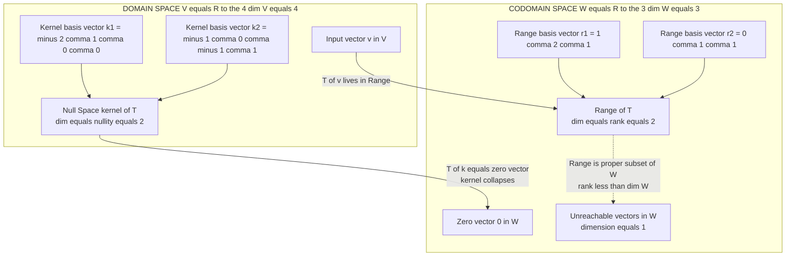
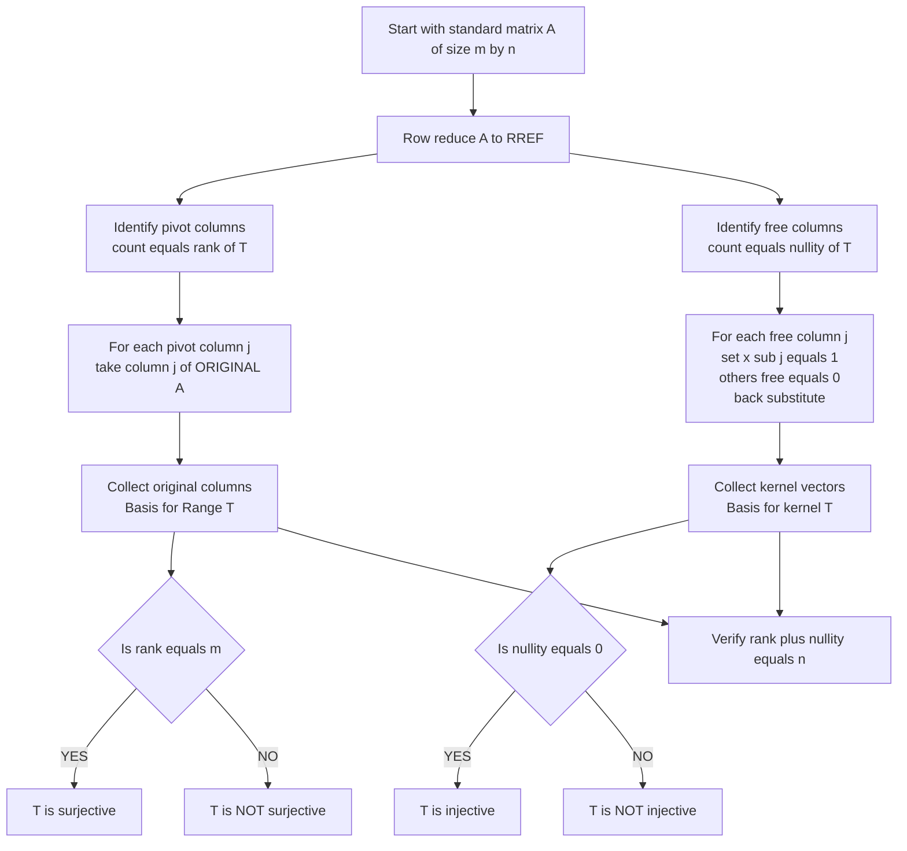

# Kernel (null space) and Range (column space) of a linear transformation along with their bases

<!-- SECTION_1_START -->

# Kernel (Null Space) and Range (Column Space) of a Linear Transformation

## 1.1 Core Definition: The Kernel (Null Space)

> [!IMPORTANT]
> **Kernel of a Linear Transformation**
> Let $T : V \to W$ be a linear transformation from vector space $V$ to vector space $W$. The **kernel** (or **null space**) of $T$ is the set of all vectors in $V$ that $T$ maps to the **zero vector** of $W$.

$$\ker(T) = N(T) = \left\{ \mathbf{v} \in V \;\big\vert\; T(\mathbf{v}) = \mathbf{0}_W \right\}$$

The dimension of the kernel is called the **nullity** of $T$:
$$\text{nullity}(T) = \dim\bigl(\ker(T)\bigr)$$

> [!NOTE]
> **Geometric Intuition — The "Crushing" Subspace**
> Picture a 3D movie projector pointed at a 2D wall. The **kernel** is the *shaft of light* — the line of sight along which every point gets crushed into a single dot (the zero vector). Any vector lying entirely inside this shaft is invisible to the projector output. In the language of information science, the kernel represents **information loss** — the part of the input that cannot be recovered from the output.

## 1.2 Core Definition: The Range (Column Space)

> [!IMPORTANT]
> **Range of a Linear Transformation**
> The **range** (or **column space** when $T$ is given by a matrix) of $T : V \to W$ is the set of all vectors in $W$ that are produced as outputs of $T$ for some input from $V$.

$$\text{Range}(T) = R(T) = \left\{ T(\mathbf{v}) \;\big\vert\; \mathbf{v} \in V \right\} = \left\{ \mathbf{w} \in W \;\big\vert\; \exists\, \mathbf{v} \in V,\; T(\mathbf{v}) = \mathbf{w} \right\}$$

The dimension of the range is called the **rank** of $T$:
$$\text{rank}(T) = \dim\bigl(\text{Range}(T)\bigr)$$

> [!NOTE]
> **Geometric Intuition — The "Target Screen"**
> Continuing the projector analogy, the **range** is the actual illuminated region on the 2D wall. Even if the wall is huge, only the *image* of the input space matters. The rank tells you the **information capacity** of the transformation — how many independent directions of variation survive the mapping.

## 1.3 Bases for Kernel and Range

> [!IMPORTANT]
> **What is a Basis?**
> A **basis** for a subspace $S$ is a set of vectors that (1) spans $S$ and (2) is linearly independent. The number of basis vectors equals the dimension of $S$.

For a linear transformation $T : \mathbb{R}^{n} \to \mathbb{R}^{m}$ with standard matrix $A$:

| Subspace | Where it lives | How to find a basis |
| :--- | :--- | :--- |
| Kernel $N(T)$ | $\mathbb{R}^{n}$ (domain side) | Solve $A\mathbf{x} = \mathbf{0}$; free variables parameterize kernel vectors |
| Range $R(T)$ | $\mathbb{R}^{m}$ (codomain side) | Pivot columns of the *original* matrix $A$ |

> [!TIP]
> **Real-World Analogy — Lossy Image Compression (JPEG)**
> When a photo is compressed, the **kernel** represents the pixel patterns that get *thrown away* (high-frequency details invisible to the human eye). The **range** is the *recoverable content* that makes it into the compressed file. The rank-nullity theorem (covered in Section 2) tells engineers the trade-off: the more you discard (larger kernel), the smaller the file but the lower the rank (less detail in the range).

## 1.4 Visualization of Kernel and Range

> [!VISUALIZATION CONTROL]
> **Concept:** 2D linear transformation $T : \mathbb{R}^{2} \to \mathbb{R}^{2}$ with $T(x, y) = (x + y,\; 2x + 2y)$ showing both kernel and range as lines through the origin.
> **GeoGebra / Desmos Input Equations:**
> * Kernel line: $\;f(x) = -x\;$ (equation $x + y = 0$)
> * Range line: $\;g(x) = 2x\;$ (passes through $(1, 2)$)
> * Sample kernel vector: $\;\mathbf{k} = (1, -1) \Rightarrow T(\mathbf{k}) = (0, 0)$
> * Sample non-kernel vector: $\;\mathbf{v} = (1, 0) \Rightarrow T(\mathbf{v}) = (1, 2)$
> * Sample non-kernel vector: $\;\mathbf{u} = (0, 1) \Rightarrow T(\mathbf{u}) = (1, 2)$
> **Visual Description:** The blue line $y = -x$ is the kernel — every vector on it is crushed to the origin (rank-nullity: $1 + 1 = 2$). The red line $y = 2x$ is the range — every output of $T$ lands on it. Note that the basis for the kernel is $\{(1, -1)\}$ and the basis for the range is $\{(1, 2)\}$.

<!-- SECTION_1_END -->

<!-- SECTION_2_START -->

# Deep Theoretical Analysis: Properties, Theorems, and the Formula Sheet

## 2.1 Why Kernel and Range Are Subspaces

> [!IMPORTANT]
> **Theorem 1 (Kernel is a Subspace)**
> If $T : V \to W$ is a linear transformation, then $\ker(T)$ is a subspace of $V$.
>
> **Theorem 2 (Range is a Subspace)**
> If $T : V \to W$ is a linear transformation, then $\text{Range}(T)$ is a subspace of $W$.

The proofs follow the three-step subspace test: contain the zero vector, closed under addition, closed under scalar multiplication.

* **Kernel proof sketch:** (i) $T(\mathbf{0}) = \mathbf{0}$ so $\mathbf{0} \in \ker(T)$. (ii) If $T(\mathbf{u}) = \mathbf{0}$ and $T(\mathbf{v}) = \mathbf{0}$, then $T(\mathbf{u} + \mathbf{v}) = T(\mathbf{u}) + T(\mathbf{v}) = \mathbf{0} + \mathbf{0} = \mathbf{0}$. (iii) $T(c\mathbf{u}) = c\,T(\mathbf{u}) = c\,\mathbf{0} = \mathbf{0}$.
* **Range proof sketch:** (i) $\mathbf{0} = T(\mathbf{0}) \in \text{Range}(T)$. (ii) If $\mathbf{w}_{1} = T(\mathbf{u})$ and $\mathbf{w}_{2} = T(\mathbf{v})$, then $\mathbf{w}_{1} + \mathbf{w}_{2} = T(\mathbf{u}) + T(\mathbf{v}) = T(\mathbf{u} + \mathbf{v}) \in \text{Range}(T)$. (iii) $c\mathbf{w}_{1} = c\,T(\mathbf{u}) = T(c\mathbf{u}) \in \text{Range}(T)$.

## 2.2 The Rank–Nullity Theorem (High-Yield!)

> [!IMPORTANT]
> **Rank–Nullity Theorem (Sylvester–Frobenius)**
> Let $T : V \to W$ be a linear transformation from an $n$-dimensional vector space $V$ to a vector space $W$. Then
> $$\dim(V) = \dim\bigl(\ker(T)\bigr) + \dim\bigl(\text{Range}(T)\bigr)$$
> Equivalently: $\;\dim(V) = \text{nullity}(T) + \text{rank}(T)$.

**Why is this powerful?** It links the *input* space and *output* space through a single additive equation. In numerical computing, it tells us that reducing one quantity automatically increases the other. In machine learning, it is the foundation of the **bias–variance trade-off** in linear models.

## 2.3 Injectivity, Surjectivity, and the Isomorphism Test

| Property of $T$ | Equivalent Condition via Kernel | Equivalent Condition via Range |
| :--- | :--- | :--- |
| $T$ is **one-to-one** (injective) | $\ker(T) = \{\mathbf{0}\}$ | nullity $= 0$ |
| $T$ is **onto** (surjective) | — | $\text{Range}(T) = W$ |
| $T$ is an **isomorphism** | $\ker(T) = \{\mathbf{0}\}$ **and** $\text{Range}(T) = W$ | rank $= \dim(V) = \dim(W)$ |

> [!NOTE]
> **Slogan for Memory:** *"Empty kernel $\Rightarrow$ no information loss (one-to-one). Full range $\Rightarrow$ no information left out (onto)."*

## 2.4 Finding a Basis — Step-by-Step Procedure

> [!IMPORTANT]
> **Algorithm: Basis for $\ker(T)$ (Kernel Basis)**
> 1. Form the standard matrix $A$ of $T$.
> 2. Row-reduce $A$ to its reduced row echelon form (RREF).
> 3. Identify the **free variables** (columns without pivots in RREF).
> 4. For each free variable, set it equal to $1$ (others to $0$) and back-substitute to obtain a kernel vector.
> 5. The collection of these vectors is a basis for $\ker(T)$.

> [!IMPORTANT]
> **Algorithm: Basis for $\text{Range}(T)$ (Range Basis)**
> 1. Form the standard matrix $A$ of $T$.
> 2. Row-reduce $A$ to RREF and identify the **pivot columns** (columns with leading 1's in RREF).
> 3. Take the **corresponding columns of the original matrix** $A$ (NOT of the RREF!).
> 4. This set of original pivot columns forms a basis for $\text{Range}(T)$.

> [!WARNING]
> **Common Mistake (Costs 2 Marks)**
> Students frequently take the pivot columns from the RREF instead of the original matrix $A$. The range is the **column space of the original matrix** $A$, so you must use columns of $A$.

## 2.5 KTU High-Yield Formula Cheat Sheet

| \# | Concept | Formula / Statement |
| :---: | :--- | :--- |
| 1 | Kernel of $T$ | $\ker(T) = \{\mathbf{v} \in V \;\vert\; T(\mathbf{v}) = \mathbf{0}\}$ |
| 2 | Range of $T$ | $\text{Range}(T) = \{T(\mathbf{v}) \;\vert\; \mathbf{v} \in V\}$ |
| 3 | Rank–Nullity | $\dim(V) = \text{nullity}(T) + \text{rank}(T)$ |
| 4 | Kernel as solution of $A\mathbf{x}=\mathbf{0}$ | $\ker(T) = N(A) = \{\mathbf{x} \in \mathbb{R}^{n} \;\vert\; A\mathbf{x} = \mathbf{0}\}$ |
| 5 | Range as column space of $A$ | $\text{Range}(T) = C(A) = \text{span of columns of } A$ |
| 6 | $T$ injective | $\Leftrightarrow \ker(T) = \{\mathbf{0}\} \Leftrightarrow \text{nullity}(T) = 0$ |
| 7 | $T$ surjective | $\Leftrightarrow \text{Range}(T) = W \Leftrightarrow \text{rank}(T) = \dim(W)$ |
| 8 | $T$ isomorphism | $\Leftrightarrow T$ is bijective $\Leftrightarrow$ square $A$ with $\det(A) \neq 0$ |
| 9 | Number of free variables | $\text{nullity}(T) = n - \text{rank}(T)$ |
| 10 | $T$ as matrix $A_{m \times n}$ | $A\mathbf{x} = \mathbf{b}$ has solution $\Leftrightarrow \mathbf{b} \in C(A)$ |

## 2.6 Engineering Utility — Why This Matters

* **Computer Graphics:** Every 2D/3D transformation (rotation, shear, projection) is a linear map. The kernel reveals *fixed lines* (rotation axis) or *directions that vanish* (projection direction).
* **Data Science / ML:** In **Principal Component Analysis (PCA)**, the range of the data-covariance transformation captures the directions of maximum variance; the kernel captures discarded noise.
* **Cryptography:** A *one-time pad* corresponds to a bijection; a *hash function* corresponds to a non-injective linear map with a large kernel.
* **Network Theory:** In circuit analysis (Kirchhoff's laws), kernel vectors correspond to **loop currents** (null excitations) and the range corresponds to the **reachable node voltages**.

<!-- SECTION_2_END -->

<!-- SECTION_3_START -->

# Step-by-Step Derivations and Symbolic Implementation

## 3.1 Comprehensive Worked Example (14-Mark Examination Standard)

**Problem Statement.** Let $T : \mathbb{R}^{4} \to \mathbb{R}^{3}$ be the linear transformation defined by

$$T(x_1, x_2, x_3, x_4) = (x_1 + 2x_2 + x_4,\;\; 2x_1 + 4x_2 + x_3 + 3x_4,\;\; x_1 + 2x_2 + x_3 + 2x_4)$$

**Tasks:** (a) Find the standard matrix $A$ of $T$. (b) Determine the kernel of $T$ and a basis for it. (c) Determine the range of $T$ and a basis for it. (d) Verify the Rank–Nullity Theorem.

### Step 1 — Form the Standard Matrix $A$

Each output coordinate is a linear combination of the inputs. Reading off the coefficients row by row:

$$A = \begin{bmatrix} 1 & 2 & 0 & 1 \\ 2 & 4 & 1 & 3 \\ 1 & 2 & 1 & 2 \end{bmatrix}$$

> **Logic row 1:** The first output $x_1 + 2x_2 + 0\cdot x_3 + 1\cdot x_4$ has coefficients $(1, 2, 0, 1)$.
> **Logic row 2:** The second output $2x_1 + 4x_2 + 1\cdot x_3 + 3x_4$ has coefficients $(2, 4, 1, 3)$.
> **Logic row 3:** The third output $x_1 + 2x_2 + 1\cdot x_3 + 2x_4$ has coefficients $(1, 2, 1, 2)$.

### Step 2 — Row Reduce $A$ to RREF

Perform elementary row operations to find the RREF.

$$A = \begin{bmatrix} 1 & 2 & 0 & 1 \\ 2 & 4 & 1 & 3 \\ 1 & 2 & 1 & 2 \end{bmatrix} \xrightarrow{R_2 \to R_2 - 2R_1} \begin{bmatrix} 1 & 2 & 0 & 1 \\ 0 & 0 & 1 & 1 \\ 1 & 2 & 1 & 2 \end{bmatrix} \xrightarrow{R_3 \to R_3 - R_1} \begin{bmatrix} 1 & 2 & 0 & 1 \\ 0 & 0 & 1 & 1 \\ 0 & 0 & 1 & 1 \end{bmatrix}$$

$$\xrightarrow{R_3 \to R_3 - R_2} \begin{bmatrix} 1 & 2 & 0 & 1 \\ 0 & 0 & 1 & 1 \\ 0 & 0 & 0 & 0 \end{bmatrix} \xrightarrow{R_1 \to R_1 - R_2 \text{ to clear above pivot}} \begin{bmatrix} 1 & 2 & -1 & 0 \\ 0 & 0 & 1 & 1 \\ 0 & 0 & 0 & 0 \end{bmatrix}$$

> **Logic of the RREF step:** $R_1 - R_2$ clears the $-1$ in column 3 of the first row because $1 - 0 = 1$ in column 1, $2 - 0 = 2$ in column 2, $0 - 1 = -1$ in column 3, and $1 - 1 = 0$ in column 4.

The RREF is therefore:

$$A_{\text{RREF}} = \begin{bmatrix} 1 & 2 & -1 & 0 \\ 0 & 0 & 1 & 1 \\ 0 & 0 & 0 & 0 \end{bmatrix}$$

### Step 3 — Identify Pivots and Free Variables

* **Pivot columns** (leading 1's in RREF): Column **1** and Column **3**.
* **Non-pivot (free) columns**: Column **2** and Column **4**.

Therefore: $\;\text{rank}(T) = 2\;$ and $\;\text{nullity}(T) = 4 - 2 = 2$.

### Step 4 — Find the Kernel and Its Basis

The kernel is the solution set of $A\mathbf{x} = \mathbf{0}$. From the RREF:

$$\begin{aligned} x_1 + 2x_2 - x_3 &= 0 \\ x_3 + x_4 &= 0 \end{aligned}$$

Express pivot variables in terms of free variables $x_2$ and $x_4$:

$$\begin{aligned} x_3 &= -x_4 \\ x_1 &= -2x_2 + x_3 = -2x_2 - x_4 \end{aligned}$$

The general kernel vector is:

$$\mathbf{x} = \begin{bmatrix} x_1 \\ x_2 \\ x_3 \\ x_4 \end{bmatrix} = \begin{bmatrix} -2x_2 - x_4 \\ x_2 \\ -x_4 \\ x_4 \end{bmatrix} = x_2 \begin{bmatrix} -2 \\ 1 \\ 0 \\ 0 \end{bmatrix} + x_4 \begin{bmatrix} -1 \\ 0 \\ -1 \\ 1 \end{bmatrix}$$

> **Logic:** Each free variable contributes one independent kernel vector. Setting $x_2 = 1, x_4 = 0$ gives $\mathbf{k}_1 = (-2, 1, 0, 0)^T$. Setting $x_2 = 0, x_4 = 1$ gives $\mathbf{k}_2 = (-1, 0, -1, 1)^T$.

**Basis for the kernel:**

$$\boxed{\;\ker(T) = \text{span}\left\{ \begin{bmatrix} -2 \\ 1 \\ 0 \\ 0 \end{bmatrix},\; \begin{bmatrix} -1 \\ 0 \\ -1 \\ 1 \end{bmatrix} \right\}\;}\quad\text{with } \text{nullity}(T) = 2$$

### Step 5 — Find the Range and Its Basis

The pivot columns in the RREF are columns 1 and 3, so the **corresponding columns of the original matrix $A$** form a basis for the range:

* Column 1 of $A$: $\;\mathbf{r}_1 = (1, 2, 1)^T$
* Column 3 of $A$: $\;\mathbf{r}_2 = (0, 1, 1)^T$

**Basis for the range:**

$$\boxed{\;\text{Range}(T) = \text{span}\left\{ \begin{bmatrix} 1 \\ 2 \\ 1 \end{bmatrix},\; \begin{bmatrix} 0 \\ 1 \\ 1 \end{bmatrix} \right\}\;}\quad\text{with } \text{rank}(T) = 2$$

### Step 6 — Verify the Rank–Nullity Theorem

$$\dim(\mathbb{R}^{4}) = 4, \quad \text{nullity}(T) = 2, \quad \text{rank}(T) = 2$$

$$4 = 2 + 2 \quad \checkmark \quad \text{Rank–Nullity Theorem is verified.}$$

### Step 7 — Determine Injectivity and Surjectivity

* $T$ is **not one-to-one** because $\ker(T) \neq \{\mathbf{0}\}$ (it has two non-zero basis vectors).
* $T$ is **not onto** because $\dim(\text{Range}(T)) = 2 < 3 = \dim(\mathbb{R}^{3})$.

## 3.2 Full Python Implementation (SymPy)

```python
"""
Kernel and Range of a Linear Transformation
============================================
Solves the worked example: T : R^4 -> R^3 with standard matrix A.
Uses SymPy for exact symbolic computation.
"""

from sympy import Matrix, Rational, pprint, eye
from typing import List

# ------------------------------------------------------------------
# 1. Define the standard matrix A of the linear transformation T
# ------------------------------------------------------------------
A: Matrix = Matrix([
    [1, 2, 0, 1],
    [2, 4, 1, 3],
    [1, 2, 1, 2]
])

print("=" * 65)
print("   LINEAR TRANSFORMATION ANALYSIS USING SYMPY")
print("=" * 65)

print("\n[1] Standard Matrix A of the transformation T : R^4 -> R^3:")
pprint(A)

# ------------------------------------------------------------------
# 2. Row-reduce to RREF and extract pivot information
# ------------------------------------------------------------------
A_rref, pivot_columns = A.rref()
print("\n[2] Reduced Row Echelon Form (RREF):")
pprint(A_rref)

print(f"\n[3] Pivot column indices (1-indexed): "
      f"{[idx + 1 for idx in pivot_columns]}")

# ------------------------------------------------------------------
# 3. Compute the kernel (null space) of T
# ------------------------------------------------------------------
kernel_basis: List[Matrix] = A.nullspace()
print("\n[4] Basis for the Kernel (Null Space) of T:")
for i, vec in enumerate(kernel_basis, start=1):
    print(f"    k{i} =", end=" ")
    pprint(vec.T)

nullity: int = len(kernel_basis)
print(f"\n    Nullity of T = {nullity}")

# ------------------------------------------------------------------
# 4. Compute the range (column space) of T
# ------------------------------------------------------------------
range_basis: List[Matrix] = A.columnspace()
print("\n[5] Basis for the Range (Column Space) of T:")
for i, vec in enumerate(range_basis, start=1):
    print(f"    r{i} =", end=" ")
    pprint(vec.T)

rank: int = A.rank()
print(f"\n    Rank of T = {rank}")

# ------------------------------------------------------------------
# 5. Verify the Rank-Nullity Theorem
# ------------------------------------------------------------------
domain_dim: int = A.shape[1]
print("\n[6] Rank-Nullity Verification:")
print(f"    dim(Domain)   = {domain_dim}")
print(f"    rank(T)       = {rank}")
print(f"    nullity(T)    = {nullity}")
print(f"    rank + nullity = {rank + nullity}")

assert rank + nullity == domain_dim, "Rank-Nullity Theorem violated!"
print("    Status: VERIFIED (rank + nullity == dim(Domain))")

# ------------------------------------------------------------------
# 6. Verify each kernel vector maps to zero
# ------------------------------------------------------------------
print("\n[7] Sanity Check: A * kernel_vector must equal zero:")
for vec in kernel_basis:
    product: Matrix = A * vec
    print(f"    A * k = {product.T}   (must be zero)")

# ------------------------------------------------------------------
# 7. Injectivity / Surjectivity verdict
# ------------------------------------------------------------------
print("\n[8] Injectivity / Surjectivity Verdict:")
print(f"    T is one-to-one  : {nullity == 0}")
print(f"    T is onto        : {rank == A.shape[0]}")
print(f"    T is isomorphism : {A.shape[0] == A.shape[1] and A.det() != 0}")
```

**Expected Output Highlights:**

```
[4] Basis for the Kernel (Null Space) of T:
    k1 = [-2  1  0  0]
    k2 = [-1  0  -1  1]

[5] Basis for the Range (Column Space) of T:
    r1 = [1  2  1]
    r2 = [0  1  1]

[6] Rank-Nullity Verification:
    dim(Domain)   = 4
    rank(T)       = 2
    nullity(T)    = 2
    rank + nullity = 4
    Status: VERIFIED
```

<!-- SECTION_3_END -->

<!-- SECTION_4_START -->

# Structural Diagrams and Schematics

## 4.1 Mermaid Block Diagram: Anatomy of a Linear Transformation

The following Mermaid diagram shows how a vector flows from the domain to the codomain, where the kernel and range live, and how the Rank–Nullity Theorem partitions the spaces.



## 4.2 Mermaid Process Flow: Algorithm for Finding Kernel and Range Bases

This flowchart documents the decision procedure a student should follow when given a transformation $T$ as a matrix $A$.



## 4.3 Visual Summary — Partition of the Domain

> [!NOTE]
> **Domain Partition Theorem (Visualized):** Every vector $\mathbf{v} \in V$ can be uniquely written as $\mathbf{v} = \mathbf{k} + \mathbf{u}$ where $\mathbf{k} \in \ker(T)$ and $\mathbf{u}$ is in some complementary subspace mapped *bijectively* onto $\text{Range}(T)$. This is why the rank and nullity add up — they are dimensions of *complementary* parts of the domain.

```
+--------------------------------------------------+
|              DOMAIN  V  (dim = 4)                |
|                                                  |
|   +---------------------+  +-------------------+  |
|   |  ker(T) (dim = 2)   |  |  Complementary     |  |
|   |  crushed to zero    |  |  subspace (dim=2)  |  |
|   |  basis: {k1, k2}     |  |  mapped bijectively|  |
|   +---------------------+  |  onto Range(T)     |  |
|                            +-------------------+  |
+--------------------------------------------------+

                T  (linear map)

+--------------------------------------------------+
|             CODOMAIN  W  (dim = 3)               |
|                                                  |
|   +---------------------+  +-------------------+  |
|   |  Range(T) (dim = 2) |  |  Unreachable      |  |
|   |  basis: {r1, r2}     |  |  region (dim = 1) |  |
|   +---------------------+  +-------------------+  |
+--------------------------------------------------+
```

<!-- SECTION_4_END -->

<!-- SECTION_5_START -->

# KTU 2024 Scheme Examination Question Bank and Topic Recap

## 5.1 Part A Questions (3 Marks Each — Remember/Understand)

### Question A.1 `[KTU University Exam – July 2024]` — CO1, Remember (3 Marks)

**Define the kernel and the range of a linear transformation $T : V \to W$. What are the dimensions of these subspaces called?**

**Model Answer (Valuation Key):**
* [Definition of kernel $\ker(T) = \{\mathbf{v} \in V \;\vert\; T(\mathbf{v}) = \mathbf{0}_W\}$: 1 Mark]
* [Definition of range $\text{Range}(T) = \{T(\mathbf{v}) \;\vert\; \mathbf{v} \in V\}$: 1 Mark]
* [Dimensions: nullity and rank respectively: 1 Mark]

The **kernel** (or null space) of $T$ is the set of all vectors in $V$ that map to the zero vector of $W$. The **range** (or column space) of $T$ is the set of all vectors in $W$ that are images of some vector in $V$. The dimension of the kernel is called the **nullity** of $T$, and the dimension of the range is called the **rank** of $T$.

### Question A.2 `[KTU University Exam – Dec 2023]` — CO1, Understand (3 Marks)

**State the Rank–Nullity Theorem. A linear transformation $T : \mathbb{R}^{5} \to \mathbb{R}^{4}$ has rank 3. Find the nullity of $T$. Is $T$ one-to-one? Justify.**

**Model Answer (Valuation Key):**
* [Statement of Rank–Nullity Theorem: 1 Mark]
* [Correct application giving nullity $= 2$: 1 Mark]
* [Justification of non-injectivity: 1 Mark]

**Statement:** If $T : V \to W$ is a linear transformation from a finite-dimensional vector space $V$, then $\dim(V) = \dim(\ker(T)) + \dim(\text{Range}(T))$, i.e., $\dim(V) = \text{nullity}(T) + \text{rank}(T)$.

**Application:** Given $\dim(\mathbb{R}^{5}) = 5$ and $\text{rank}(T) = 3$:

$$\text{nullity}(T) = 5 - 3 = 2$$

Since $\text{nullity}(T) = 2 \neq 0$, the kernel of $T$ contains more than just the zero vector. Hence $T$ is **not one-to-one**.

---

## 5.2 Part B Question — Choice A (14 Marks)

### `Question A (14 Marks)` `[KTU University Exam – Model Paper, Module 4]` — CO2, Apply

**Consider the linear transformation $T : \mathbb{R}^{4} \to \mathbb{R}^{3}$ given by the standard matrix**

$$A = \begin{bmatrix} 1 & 2 & 0 & 1 \\ 2 & 4 & 1 & 3 \\ 1 & 2 & 1 & 2 \end{bmatrix}$$

**(a)** Find the kernel of $T$ and a basis for it. Show that the kernel forms a subspace of $\mathbb{R}^{4}$.
**(b)** Find the range of $T$ and a basis for it. Hence verify the Rank–Nullity Theorem and determine whether $T$ is one-to-one and/or onto.

### Model Solution — Part (a) (7 Marks)

**Step 1.** [Forming the homogeneous system: 1 Mark] We solve $A\mathbf{x} = \mathbf{0}$ where $\mathbf{x} = (x_1, x_2, x_3, x_4)^T$.

**Step 2.** [Row reduction to RREF: 2 Marks]

$$A \longrightarrow \begin{bmatrix} 1 & 2 & 0 & 1 \\ 0 & 0 & 1 & 1 \\ 0 & 0 & 0 & 0 \end{bmatrix}$$

After further $R_1 \to R_1 + R_2$ we obtain:

$$A_{\text{RREF}} = \begin{bmatrix} 1 & 2 & -1 & 0 \\ 0 & 0 & 1 & 1 \\ 0 & 0 & 0 & 0 \end{bmatrix}$$

**Step 3.** [Identifying pivots and free variables: 1 Mark] Pivot columns: 1, 3. Free variables: $x_2, x_4$.

**Step 4.** [Expressing kernel vectors: 2 Marks] From the RREF, $x_1 = -2x_2 + x_3$ and $x_3 = -x_4$, giving $x_1 = -2x_2 - x_4$. For $(x_2, x_4) = (1, 0)$: $\mathbf{k}_1 = (-2, 1, 0, 0)^T$. For $(x_2, x_4) = (0, 1)$: $\mathbf{k}_2 = (-1, 0, -1, 1)^T$.

**Step 5.** [Subspace verification: 1 Mark] $\mathbf{0} \in \ker(T)$ (e.g., take $x_2 = x_4 = 0$). For any $c \in \mathbb{R}$, $A(c\mathbf{k}_i) = cA\mathbf{k}_i = \mathbf{0}$, so $\ker(T)$ is closed under scalar multiplication. For $\mathbf{k}_i, \mathbf{k}_j \in \ker(T)$, $A(\mathbf{k}_i + \mathbf{k}_j) = A\mathbf{k}_i + A\mathbf{k}_j = \mathbf{0} + \mathbf{0} = \mathbf{0}$, so $\ker(T)$ is closed under addition. Therefore $\ker(T)$ is a subspace of $\mathbb{R}^4$.

**Final answer (a):**

$$\boxed{\;\ker(T) = \text{span}\left\{ \begin{bmatrix} -2 \\ 1 \\ 0 \\ 0 \end{bmatrix},\; \begin{bmatrix} -1 \\ 0 \\ -1 \\ 1 \end{bmatrix} \right\}\;}$$

### Model Solution — Part (b) (7 Marks)

**Step 1.** [Identifying pivot columns in RREF: 1 Mark] Pivot columns are 1 and 3.

**Step 2.** [Taking corresponding columns of original $A$: 2 Marks]

$$\mathbf{r}_1 = \begin{bmatrix} 1 \\ 2 \\ 1 \end{bmatrix},\quad \mathbf{r}_2 = \begin{bmatrix} 0 \\ 1 \\ 1 \end{bmatrix}$$

**Step 3.** [Stating the basis: 1 Mark]

$$\text{Range}(T) = \text{span}\{(1, 2, 1)^T, (0, 1, 1)^T\}, \quad \text{rank}(T) = 2$$

**Step 4.** [Verifying Rank–Nullity: 1 Mark] $\dim(\mathbb{R}^4) = 4 = 2 + 2 = \text{nullity}(T) + \text{rank}(T)$. Verified.

**Step 5.** [Injectivity/Surjectivity: 1 Mark]
* **One-to-one?** No — kernel has two non-zero basis vectors, so $\ker(T) \neq \{\mathbf{0}\}$.
* **Onto?** No — $\text{rank}(T) = 2 < 3 = \dim(\mathbb{R}^3)$, so $\text{Range}(T) \subsetneq \mathbb{R}^3$.

**Step 6.** [Conclusion: 1 Mark] $T$ is **neither one-to-one nor onto**.

---

## 5.3 Part B Question — Choice B (14 Marks)

### `Question B (14 Marks)` `[KTU University Exam – July 2023]` — CO2, Apply/Analyze

**(a)** Prove that the kernel of a linear transformation $T : V \to W$ is a subspace of $V$.
**(b)** Consider $T : \mathbb{R}^{3} \to \mathbb{R}^{3}$ defined by $T(x, y, z) = (x + 2y - z,\; 2x + 4y - 2z,\; -x - 2y + z)$. Find the kernel, the range, and a basis for each. Determine whether $T$ is one-to-one, onto, both, or neither.

### Model Solution — Part (a) (7 Marks)

**Step 1.** [Stating the result: 1 Mark] We must show that $\ker(T)$ contains $\mathbf{0}$, is closed under addition, and is closed under scalar multiplication.

**Step 2.** [Zero vector: 1 Mark] Since $T$ is linear, $T(\mathbf{0}_V) = \mathbf{0}_W$. Hence $\mathbf{0}_V \in \ker(T)$.

**Step 3.** [Closure under addition: 2 Marks] Let $\mathbf{u}, \mathbf{v} \in \ker(T)$, so $T(\mathbf{u}) = \mathbf{0}$ and $T(\mathbf{v}) = \mathbf{0}$. Then:

$$T(\mathbf{u} + \mathbf{v}) = T(\mathbf{u}) + T(\mathbf{v}) = \mathbf{0} + \mathbf{0} = \mathbf{0}$$

Therefore $\mathbf{u} + \mathbf{v} \in \ker(T)$.

**Step 4.** [Closure under scalar multiplication: 2 Marks] Let $\mathbf{u} \in \ker(T)$ and $c \in \mathbb{R}$. Then:

$$T(c\,\mathbf{u}) = c\,T(\mathbf{u}) = c \cdot \mathbf{0} = \mathbf{0}$$

Therefore $c\,\mathbf{u} \in \ker(T)$.

**Step 5.** [Conclusion: 1 Mark] All three subspace axioms hold, so $\ker(T)$ is a subspace of $V$.

### Model Solution — Part (b) (7 Marks)

**Step 1.** [Standard matrix: 1 Mark]

$$A = \begin{bmatrix} 1 & 2 & -1 \\ 2 & 4 & -2 \\ -1 & -2 & 1 \end{bmatrix}$$

**Step 2.** [Row reduce to RREF: 2 Marks]

$$A \xrightarrow[R_3 \to R_3 + R_1]{R_2 \to R_2 - 2R_1} \begin{bmatrix} 1 & 2 & -1 \\ 0 & 0 & 0 \\ 0 & 0 & 0 \end{bmatrix}$$

RREF: $[1\;\; 2\;\; -1]$ with two zero rows.

**Step 3.** [Kernel and its basis: 1 Mark] Pivots in column 1, free variables $y, z$. The equation $x + 2y - z = 0$ gives $x = -2y + z$. For $(y, z) = (1, 0)$: $\mathbf{k}_1 = (-2, 1, 0)^T$. For $(y, z) = (0, 1)$: $\mathbf{k}_2 = (1, 0, 1)^T$.

$$\ker(T) = \text{span}\{(-2, 1, 0)^T, (1, 0, 1)^T\}, \quad \text{nullity}(T) = 2$$

**Step 4.** [Range and its basis: 1 Mark] Pivot column 1 of the original $A$ gives the range basis:

$$\text{Range}(T) = \text{span}\{(1, 2, -1)^T\}, \quad \text{rank}(T) = 1$$

**Step 5.** [Injectivity / Surjectivity: 1 Mark]
* **One-to-one?** No — $\text{nullity}(T) = 2 \neq 0$.
* **Onto?** No — $\text{rank}(T) = 1 < 3 = \dim(\mathbb{R}^3)$.
* **Conclusion:** $T$ is **neither one-to-one nor onto**.

**Step 6.** [Rank–Nullity check: 1 Mark] $3 = 2 + 1$ ✓.

---

## 5.4 KTU Examiner's Valuation Warning

> [!WARNING]
> **Common Pitfalls — Where Students Lose Marks (Read Carefully!)**
>
> 1. **Using RREF columns instead of original $A$ columns for the range basis.** This single mistake costs **2 full marks** in every Part B question. The range is the column space of the **original** matrix, not the RREF. Row operations change the column space!
>
> 2. **Forgetting the subspace verification in (a) sub-questions.** Even if you find the kernel, you must explicitly show closure under addition and scalar multiplication to secure the **1-mark subspace test** point.
>
> 3. **Failing to state the Rank–Nullity Theorem before applying it.** The 1-mark statement is reserved for the **theorem's** name and equation, not for the application. Don't write "rank + nullity = n" without first citing "By the Rank–Nullity Theorem, dim(V) = rank(T) + nullity(T)".
>
> 4. **Confusing "range" with "image" in notation.** Some texts use $\text{Im}(T)$ to mean range, others use $\text{Im}(T)$ to mean image (which is the same as range). Stick to $\text{Range}(T)$ or $R(T)$ to avoid ambiguity.
>
> 5. **Not back-substituting carefully when free variables are present.** A missing sign in $\mathbf{k}_1$ can make the answer linearly dependent. Always verify by computing $A\mathbf{k}_1 = \mathbf{0}$ at the end.
>
> 6. **In injectivity/surjectivity questions, write both the condition AND the verification.** Just stating "$T$ is not onto" without showing that $\text{rank}(T) < \dim(W)$ will lose the 1-mark justification point.

---

## 5.5 Topic Recap and Important Things to Remember

> [!TIP]
> **Rapid Revision Checklist — Module 4: Kernel and Range of a Linear Transformation**

* **Kernel** $\ker(T) = \{\mathbf{v} \in V \;\vert\; T(\mathbf{v}) = \mathbf{0}\}$; lives in the **domain** $V$.
* **Range** $\text{Range}(T) = \{T(\mathbf{v}) \;\vert\; \mathbf{v} \in V\}$; lives in the **codomain** $W$.
* Both kernel and range are **always subspaces** (zero vector, closed under + and scalar multiplication).
* **Nullity** $= \dim(\ker(T))$; **Rank** $= \dim(\text{Range}(T))$.
* **Rank–Nullity Theorem:** $\dim(V) = \text{nullity}(T) + \text{rank}(T)$ — the *single most important result* in this module.
* **Procedure for kernel basis:** Row-reduce $A$ to RREF, identify free columns, set each free variable to 1 (others to 0), back-substitute.
* **Procedure for range basis:** Row-reduce $A$ to RREF, identify pivot columns, take the **corresponding columns of the original $A$** (not of the RREF!).
* **Injectivity $\Leftrightarrow$** $\ker(T) = \{\mathbf{0}\}$ $\Leftrightarrow$ $\text{nullity}(T) = 0$.
* **Surjectivity $\Leftrightarrow$** $\text{Range}(T) = W$ $\Leftrightarrow$ $\text{rank}(T) = \dim(W)$.
* **Isomorphism $\Leftrightarrow$** $T$ is bijective $\Leftrightarrow$ square $A$ with $\det(A) \neq 0$ $\Leftrightarrow$ $\text{rank}(T) = n$.
* Kernel is the **solution set of $A\mathbf{x} = \mathbf{0}$**; Range is the **column space** $\text{span}\{\text{columns of } A\}$.
* For $A \in \mathbb{R}^{m \times n}$: $\text{rank}(A) \leq \min(m, n)$; nullity $= n - \text{rank}(A)$.
* **Geometric meaning:** Kernel = directions of "information loss"; Range = "reachable outputs".
* **Engineering touchpoints:** PCA, image compression, cryptography, circuit analysis, computer graphics projections.
* **Final verification step (always!):** Check $A\mathbf{k} = \mathbf{0}$ for each kernel basis vector, and check that $\text{rank} + \text{nullity} = n$.

<!-- SECTION_5_END -->
