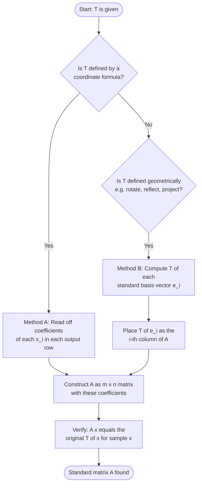
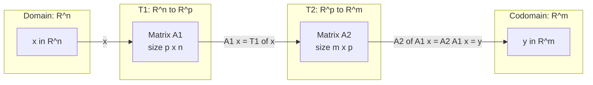
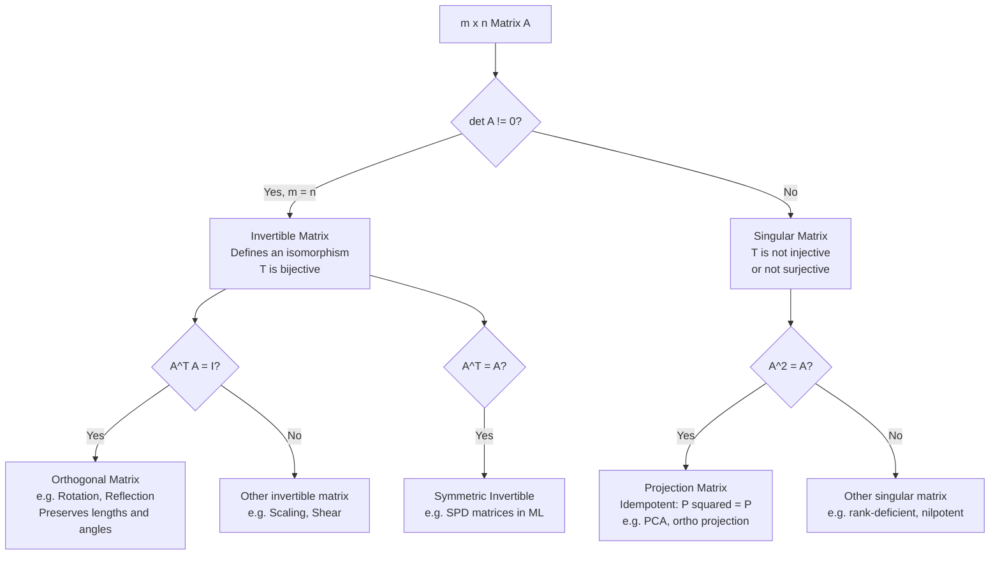

# Linear transformations, evaluating transformation matrices

<!-- SECTION_1_START -->
# Linear Transformations and Transformation Matrices

## 1.1 Formal Definition (KTU 2024 Syllabus Terminology)

> [!NOTE]
> **Definition (Linear Transformation)**
> A **linear transformation** (or **linear map**) $T : \mathbb{R}^n \rightarrow \mathbb{R}^m$ is a function that maps vectors from the vector space $\mathbb{R}^n$ to $\mathbb{R}^m$ while preserving the two fundamental operations of vector addition and scalar multiplication. Formally, for all vectors $\mathbf{u}, \mathbf{v} \in \mathbb{R}^n$ and all scalars $c \in \mathbb{R}$:
>
> 1. **Additivity:** $T(\mathbf{u} + \mathbf{v}) = T(\mathbf{u}) + T(\mathbf{v})$
> 2. **Homogeneity:** $T(c\mathbf{u}) = c\,T(\mathbf{u})$

A function is a **linear transformation if and only if** both properties hold simultaneously. A compact equivalent formulation is:

$$T(c_1\mathbf{u}_1 + c_2\mathbf{u}_2) = c_1 T(\mathbf{u}_1) + c_2 T(\mathbf{u}_2)$$

The matrix $A$ that represents this transformation is called the **standard matrix** of $T$, and the equation $\mathbf{x} \mapsto A\mathbf{x}$ is called the **matrix transformation**.

> [!IMPORTANT]
> **Domain & Codomain Convention (KTU 2024 GAMAT201):**
> In this course, we focus primarily on $T : \mathbb{R}^n \rightarrow \mathbb{R}^m$. When $n = m$, the transformation is called an **operator on** $\mathbb{R}^n$. The matrix $A$ will always be of size $m \times n$.

## 1.2 Conceptual Analogy — Plain English Intuition

> [!TIP]
> **Intuitive Analogy — The "Distortion Lens" of Vector Space**
> Imagine you are holding a translucent rubber sheet printed with arrows (vectors). A **linear transformation** is a special "lens" you place over this sheet that:
> - **Preserves the grid lines** (they stay straight and parallel — never curved).
> - **Preserves the origin** (the central point $(0,0)$ never moves).
> - **Scales arrow lengths uniformly along grid lines** (you may stretch, compress, or flip, but the rule is "linear" — twice the arrow means twice the displacement).
>
> Examples you have already seen without knowing it: **rotation of the plane**, **reflection across a line**, **projection onto an axis**, and **scaling/dilation**. All of these are linear transformations because they preserve the straight-line, grid-respecting structure of $\mathbb{R}^n$.

## 1.3 The Geometric Intuition — Why Basis Vectors are the Key

Every vector in $\mathbb{R}^n$ can be written uniquely as a linear combination of the **standard basis vectors**:

$$\mathbf{e}_1 = \begin{bmatrix} 1 \\ 0 \\ \vdots \\ 0 \end{bmatrix},\ \mathbf{e}_2 = \begin{bmatrix} 0 \\ 1 \\ \vdots \\ 0 \end{bmatrix},\ \ldots,\ \mathbf{e}_n = \begin{bmatrix} 0 \\ 0 \\ \vdots \\ 1 \end{bmatrix}$$

So a vector $\mathbf{x} = (x_1, x_2, \ldots, x_n)^T$ becomes:

$$\mathbf{x} = x_1\mathbf{e}_1 + x_2\mathbf{e}_2 + \cdots + x_n\mathbf{e}_n$$

If we know what $T$ does to each $\mathbf{e}_i$, we know $T$ for **every** vector in $\mathbb{R}^n$ by linearity. This is the central principle of the entire module.

> [!IMPORTANT]
> **Master Theorem (Pillars of GAMAT201 Module 4):**
> A linear transformation $T : \mathbb{R}^n \rightarrow \mathbb{R}^m$ is **completely determined** by its values on the standard basis. If $A = [\,T(\mathbf{e}_1)\ \ T(\mathbf{e}_2)\ \ \cdots\ \ T(\mathbf{e}_n)\,]$, then for any $\mathbf{x} \in \mathbb{R}^n$, we have $T(\mathbf{x}) = A\mathbf{x}$.

## 1.4 Visualization via Desmos / GeoGebra

> [!VISUALIZATION CONTROL]
> **Concept:** Visualizing the effect of a linear transformation on the standard basis and an arbitrary vector in $\mathbb{R}^2$.
>
> **Desmos Input Equations (paste into https://www.desmos.com/calculator):**
> - Original basis $\mathbf{e}_1$ (blue arrow from origin): `(0,0) → (1,0)`
> - Original basis $\mathbf{e}_2$ (red arrow from origin): `(0,0) → (0,1)`
> - Original vector $\mathbf{x}$ (green arrow): `(0,0) → (2,1)`
> - Image of $\mathbf{e}_1$ under $T$: `(0,0) → (2,1)`
> - Image of $\mathbf{e}_2$ under $T$: `(0,0) → (-1,3)`
> - Image of $\mathbf{x}$ under $T$: `(0,0) → (3,5)` (should equal $2 \cdot (2,1) + 1 \cdot (-1,3) = (3,5)$)
>
> **What to observe:** The original blue/red grid (a square) becomes a parallelogram (the image of the unit square). The green image vector $(3,5)$ lands at the tip of $2 \cdot T(\mathbf{e}_1) + 1 \cdot T(\mathbf{e}_2)$, demonstrating the linear combination rule. The area may change (distortion), but the origin stays fixed and grid lines stay parallel.

<!-- SECTION_1_END -->

<!-- SECTION_2_START -->
# Deep Theoretical Analysis & KTU High-Yield Formula Sheet

## 2.1 The Two-Step Procedure to Build the Standard Matrix $A$

The standard, board-tested method for finding the matrix $A$ of a linear transformation $T : \mathbb{R}^n \rightarrow \mathbb{R}^m$ is:

**Step 1** — Compute the images of the standard basis vectors:
$$\mathbf{v}_1 = T(\mathbf{e}_1),\quad \mathbf{v}_2 = T(\mathbf{e}_2),\quad \ldots,\quad \mathbf{v}_n = T(\mathbf{e}_n)$$

Each $\mathbf{v}_i$ is a vector in $\mathbb{R}^m$, so it has $m$ components.

**Step 2** — Place these images as the **columns** of the matrix $A$:

$$A = \begin{bmatrix} \mathbf{v}_1 & \mathbf{v}_2 & \cdots & \mathbf{v}_n \end{bmatrix} = \begin{bmatrix} \uparrow & \uparrow & & \uparrow \\ T(\mathbf{e}_1) & T(\mathbf{e}_2) & \cdots & T(\mathbf{e}_n) \\ \downarrow & \downarrow & & \downarrow \end{bmatrix}$$

> [!IMPORTANT]
> **Golden Rule for KTU Board Examinations:** "The $i$-th column of $A$ is exactly $T(\mathbf{e}_i)$." A common mistake is to place the images as rows. Always double-check column placement.

## 2.2 KTU High-Yield Formula Sheet (Cheat Sheet)

| # | Transformation $T$ | Domain | Standard Matrix $A$ | Engineering Use |
|---|--------------------|--------|----------------------|------------------|
| 1 | **Scaling** by $(k_1, k_2)$ | $\mathbb{R}^2 \to \mathbb{R}^2$ | $\begin{bmatrix} k_1 & 0 \\ 0 & k_2 \end{bmatrix}$ | Image resizing, zoom-in/out |
| 2 | **Horizontal Shear** by factor $k$ | $\mathbb{R}^2 \to \mathbb{R}^2$ | $\begin{bmatrix} 1 & k \\ 0 & 1 \end{bmatrix}$ | Skew correction in OCR |
| 3 | **Vertical Shear** by factor $k$ | $\mathbb{R}^2 \to \mathbb{R}^2$ | $\begin{bmatrix} 1 & 0 \\ k & 1 \end{bmatrix}$ | Italic font generation |
| 4 | **Reflection** about the $x$-axis | $\mathbb{R}^2 \to \mathbb{R}^2$ | $\begin{bmatrix} 1 & 0 \\ 0 & -1 \end{bmatrix}$ | Mirroring in graphics |
| 5 | **Reflection** about the $y$-axis | $\mathbb{R}^2 \to \mathbb{R}^2$ | $\begin{bmatrix} -1 & 0 \\ 0 & 1 \end{bmatrix}$ | Mirroring in graphics |
| 6 | **Reflection** about the line $y = x$ | $\mathbb{R}^2 \to \mathbb{R}^2$ | $\begin{bmatrix} 0 & 1 \\ 1 & 0 \end{bmatrix}$ | Coordinate swap in ML features |
| 7 | **Orthogonal Projection** onto the $x$-axis | $\mathbb{R}^2 \to \mathbb{R}^2$ | $\begin{bmatrix} 1 & 0 \\ 0 & 0 \end{bmatrix}$ | Dimensionality reduction (PCA) |
| 8 | **Orthogonal Projection** onto the $y$-axis | $\mathbb{R}^2 \to \mathbb{R}^2$ | $\begin{bmatrix} 0 & 0 \\ 0 & 1 \end{bmatrix}$ | Feature selection |
| 9 | **Counter-clockwise Rotation** by angle $\theta$ | $\mathbb{R}^2 \to \mathbb{R}^2$ | $\begin{bmatrix} \cos\theta & -\sin\theta \\ \sin\theta & \cos\theta \end{bmatrix}$ | Robotics, computer vision, GPS |
| 10 | **Identity** (do nothing) | $\mathbb{R}^n \to \mathbb{R}^n$ | $I_n$ | Default reference frame |
| 11 | **Zero** (collapse to origin) | $\mathbb{R}^n \to \mathbb{R}^m$ | $0_{m \times n}$ | Mapping to null space |
| 12 | **Differentiation** operator $D$ on $P_n$ | $P_n \to P_{n-1}$ | Varies with basis | Control systems, signal processing |

> [!NOTE]
> **Special Matrices — Identification Tips (Frequently Asked in KTU):**
> - **Symmetric matrix:** $A^T = A$. Reflection matrices are symmetric.
> - **Orthogonal matrix:** $A^T A = A A^T = I$. Rotation and reflection matrices are orthogonal; $\det(A) = \pm 1$.
> - **Idempotent matrix:** $A^2 = A$. Projection matrices satisfy $P^2 = P$.
> - **Involutory matrix:** $A^2 = I$. All reflection matrices satisfy $A^2 = I$.

## 2.3 Theorem — Existence and Uniqueness of the Standard Matrix

> [!IMPORTANT]
> **Theorem (Existence & Uniqueness):**
> For every linear transformation $T : \mathbb{R}^n \rightarrow \mathbb{R}^m$, there exists a unique $m \times n$ matrix $A$ such that $T(\mathbf{x}) = A\mathbf{x}$ for all $\mathbf{x} \in \mathbb{R}^n$. Conversely, every $m \times n$ matrix $A$ defines a linear transformation via $\mathbf{x} \mapsto A\mathbf{x}$.
>
> **Consequence:** The set of all linear transformations from $\mathbb{R}^n$ to $\mathbb{R}^m$ is in **bijection** (one-to-one correspondence) with the set of all $m \times n$ matrices. This is a cornerstone result of Module 4.

## 2.4 Composition of Linear Transformations

If $T_1 : \mathbb{R}^n \rightarrow \mathbb{R}^p$ has matrix $A_1$ and $T_2 : \mathbb{R}^p \rightarrow \mathbb{R}^m$ has matrix $A_2$, then the **composition** $T_2 \circ T_1 : \mathbb{R}^n \rightarrow \mathbb{R}^m$ is again a linear transformation, and its standard matrix is the **matrix product**:

$$(T_2 \circ T_1)(\mathbf{x}) = T_2(T_1(\mathbf{x})) = A_2(A_1 \mathbf{x}) = (A_2 A_1) \mathbf{x}$$

So the matrix of the composition is:

$$\boxed{A_{T_2 \circ T_1} = A_2 \cdot A_1}$$

> [!WARNING]
> **Order matters!** Matrix multiplication is **not commutative** in general, so $A_2 A_1 \neq A_1 A_2$. The rightmost matrix acts first on $\mathbf{x}$. This is the most common board-exam trap.

## 2.5 One-to-One and Onto Transformations

A linear transformation $T(\mathbf{x}) = A\mathbf{x}$ has the following properties:

| Property | Equivalent Condition | Geometric Meaning |
|----------|----------------------|--------------------|
| **One-to-One** (injective) | $A\mathbf{x} = \mathbf{0}$ has only the trivial solution $\mathbf{x} = \mathbf{0}$ | Columns of $A$ are linearly independent |
| **Onto** (surjective) | The column space of $A$ equals $\mathbb{R}^m$ (the codomain) | $A$ has a pivot in every row |
| **Bijective** (isomorphism) | Both one-to-one and onto | $A$ is a square invertible matrix |
| **Kernel** $\ker(T)$ | $\{\mathbf{x} : A\mathbf{x} = \mathbf{0}\}$ | Null space of $A$ |
| **Range** $\text{range}(T)$ | $\{A\mathbf{x} : \mathbf{x} \in \mathbb{R}^n\}$ | Column space of $A$ |

> [!IMPORTANT]
> **Rank-Nullity Theorem (KTU 2024 Module 4 Highlight):**
> $$\dim(\ker T) + \dim(\text{range } T) = n$$
> Equivalently, $\text{nullity}(A) + \text{rank}(A) = n$, where $n$ is the number of columns of $A$.

## 2.6 Real-World Utility in Engineering & Computer Science

Linear transformations are the silent backbone of modern computing:

- **Computer Graphics & Gaming:** Every 3D object rendered on screen is manipulated using $4 \times 4$ transformation matrices (translation, rotation, scaling, projection). OpenGL and DirectX pipelines are nothing but chained matrix multiplications.
- **Machine Learning & Deep Learning:** A neural network layer computes $f(\mathbf{x}) = \sigma(W\mathbf{x} + \mathbf{b})$ — a linear transformation $W\mathbf{x}$ followed by a non-linear activation $\sigma$. The "linear" part is exactly a matrix transformation.
- **Signal Processing:** The Discrete Fourier Transform (DFT) is a linear transformation $\mathbf{X} = F\mathbf{x}$ where $F$ is a unitary matrix.
- **Cryptography:** The Hill cipher encrypts text blocks via $C = KP \mod 26$, a linear transformation over $\mathbb{Z}_{26}^n$.
- **Robotics & Control:** Forward kinematics expresses the end-effector position as a sequence of rotation and translation matrices (Denavit–Hartenberg parameters).
- **Data Compression (PCA):** Principal Component Analysis projects high-dimensional data onto a lower-dimensional subspace — a linear transformation represented by a projection matrix.

<!-- SECTION_2_END -->

<!-- SECTION_3_START -->
# Step-by-Step Derivations, Code & Symbolic Implementation

## 3.1 Example 1 — Finding the Standard Matrix of a Given Formula

**Problem (KTU Typical):** Find the standard matrix $A$ for the linear transformation $T : \mathbb{R}^3 \to \mathbb{R}^2$ defined by

$$T(x_1, x_2, x_3) = (x_1 - 2x_2 + 3x_3,\ 4x_1 + 5x_2 - x_3)$$

### Solution — Method 1: Direct Matrix Reading

We can express the output vector in matrix form. Let $\mathbf{x} = (x_1, x_2, x_3)^T$. Then:

$$\begin{bmatrix} x_1 - 2x_2 + 3x_3 \\ 4x_1 + 5x_2 - x_3 \end{bmatrix} = \begin{bmatrix} 1 & -2 & 3 \\ 4 & 5 & -1 \end{bmatrix} \begin{bmatrix} x_1 \\ x_2 \\ x_3 \end{bmatrix}$$

Therefore, the standard matrix is:

$$A = \begin{bmatrix} 1 & -2 & 3 \\ 4 & 5 & -1 \end{bmatrix}$$

### Solution — Method 2: Image of Standard Basis Vectors

Compute $T(\mathbf{e}_1), T(\mathbf{e}_2), T(\mathbf{e}_3)$:

$$T(\mathbf{e}_1) = T(1,0,0) = (1 - 0 + 0,\ 4 + 0 - 0) = (1, 4)$$

$$T(\mathbf{e}_2) = T(0,1,0) = (0 - 2 + 0,\ 0 + 5 - 0) = (-2, 5)$$

$$T(\mathbf{e}_3) = T(0,0,1) = (0 - 0 + 3,\ 0 + 0 - 1) = (3, -1)$$

Placing these as columns:

$$A = \begin{bmatrix} 1 & -2 & 3 \\ 4 & 5 & -1 \end{bmatrix} \quad \checkmark$$

> [!NOTE]
> **Verification of Linearity:**
> - Additivity: $T(\mathbf{u} + \mathbf{v}) = A(\mathbf{u} + \mathbf{v}) = A\mathbf{u} + A\mathbf{v} = T(\mathbf{u}) + T(\mathbf{v})$
> - Homogeneity: $T(c\mathbf{u}) = A(c\mathbf{u}) = cA\mathbf{u} = cT(\mathbf{u})$
> Both properties follow from the distributive and associative laws of matrix multiplication. This is the *automatic* linearity of every matrix map $A\mathbf{x}$.

---

## 3.2 Example 2 — Rotation in $\mathbb{R}^2$ (Full Derivation from First Principles)

**Goal:** Derive the matrix that rotates a point in the plane counter-clockwise by an angle $\theta$ about the origin.

### Setup

Let $\mathbf{x} = (x_1, x_2)$ be an arbitrary vector. In polar form, write $x_1 = r\cos\phi$ and $x_2 = r\sin\phi$, where $r = \sqrt{x_1^2 + x_2^2}$ and $\phi$ is the angle from the positive $x$-axis.

### Effect of Rotation

After rotation by $\theta$, the new angle becomes $\phi + \theta$, but the radius $r$ is unchanged (rotation preserves length). The new coordinates $(y_1, y_2)$ are:

$$y_1 = r\cos(\phi + \theta),\qquad y_2 = r\sin(\phi + \theta)$$

### Apply the Angle-Addition Identities

$$y_1 = r[\cos\phi \cos\theta - \sin\phi \sin\theta] = (r\cos\phi)\cos\theta - (r\sin\phi)\sin\theta$$

$$y_2 = r[\sin\phi \cos\theta + \cos\phi \sin\theta] = (r\sin\phi)\cos\theta + (r\cos\phi)\sin\theta$$

### Substitute Back

Since $r\cos\phi = x_1$ and $r\sin\phi = x_2$:

$$y_1 = x_1\cos\theta - x_2\sin\theta$$

$$y_2 = x_1\sin\theta + x_2\cos\theta$$

### Write in Matrix Form

$$\begin{bmatrix} y_1 \\ y_2 \end{bmatrix} = \begin{bmatrix} \cos\theta & -\sin\theta \\ \sin\theta & \cos\theta \end{bmatrix} \begin{bmatrix} x_1 \\ x_2 \end{bmatrix}$$

> [!IMPORTANT]
> **Conclude:** The standard matrix for a counter-clockwise rotation by $\theta$ in $\mathbb{R}^2$ is
> $$A_\theta = \begin{bmatrix} \cos\theta & -\sin\theta \\ \sin\theta & \cos\theta \end{bmatrix}$$
> This matrix is **orthogonal** (so $A_\theta^{-1} = A_\theta^T = A_{-\theta}$) with $\det(A_\theta) = \cos^2\theta + \sin^2\theta = 1$.

### Sanity Check — $\theta = 0$ and $\theta = \pi/2$

For $\theta = 0$: $A_0 = \begin{bmatrix} 1 & 0 \\ 0 & 1 \end{bmatrix} = I$. Identity rotation, correct.

For $\theta = \pi/2$ (90° CCW): $A_{\pi/2} = \begin{bmatrix} 0 & -1 \\ 1 & 0 \end{bmatrix}$. Applying to $\mathbf{e}_1 = (1,0)$: result $(0,1) = \mathbf{e}_2$. Applying to $\mathbf{e}_2 = (0,1)$: result $(-1, 0) = -\mathbf{e}_1$. Both correct.

---

## 3.3 Example 3 — Composition: Rotation then Reflection

**Problem:** Find the standard matrix of $T : \mathbb{R}^2 \to \mathbb{R}^2$ that first rotates a vector by $45°$ counter-clockwise, then reflects it across the $x$-axis.

### Step 1 — Rotation Matrix

$$R_{45} = \begin{bmatrix} \cos 45° & -\sin 45° \\ \sin 45° & \cos 45° \end{bmatrix} = \frac{1}{\sqrt{2}} \begin{bmatrix} 1 & -1 \\ 1 & 1 \end{bmatrix}$$

### Step 2 — Reflection Matrix (across $x$-axis)

$$M_x = \begin{bmatrix} 1 & 0 \\ 0 & -1 \end{bmatrix}$$

### Step 3 — Composition Matrix (Reflection applied AFTER Rotation)

The rotation acts first, so $R_{45}$ is multiplied **first** in the formula. For a vector $\mathbf{x}$:

$$T(\mathbf{x}) = M_x \cdot (R_{45} \mathbf{x}) = (M_x R_{45}) \mathbf{x}$$

Thus the combined standard matrix is:

$$A = M_x R_{45} = \begin{bmatrix} 1 & 0 \\ 0 & -1 \end{bmatrix} \cdot \frac{1}{\sqrt{2}} \begin{bmatrix} 1 & -1 \\ 1 & 1 \end{bmatrix}$$

$$= \frac{1}{\sqrt{2}} \begin{bmatrix} 1 \cdot 1 + 0 \cdot 1 & 1 \cdot (-1) + 0 \cdot 1 \\ 0 \cdot 1 + (-1) \cdot 1 & 0 \cdot (-1) + (-1) \cdot 1 \end{bmatrix}$$

$$= \frac{1}{\sqrt{2}} \begin{bmatrix} 1 & -1 \\ -1 & -1 \end{bmatrix}$$

### Step 4 — Verification

Apply $A$ to the standard basis:

$$A \mathbf{e}_1 = \frac{1}{\sqrt{2}} \begin{bmatrix} 1 \\ -1 \end{bmatrix} = \begin{bmatrix} 0.707 \\ -0.707 \end{bmatrix}$$

This is the point obtained by rotating $(1,0)$ by $45°$ to $(\frac{1}{\sqrt{2}}, \frac{1}{\sqrt{2}})$, then reflecting over the $x$-axis to $(\frac{1}{\sqrt{2}}, -\frac{1}{\sqrt{2}})$. Correct.

$$A \mathbf{e}_2 = \frac{1}{\sqrt{2}} \begin{bmatrix} -1 \\ -1 \end{bmatrix} = \begin{bmatrix} -0.707 \\ -0.707 \end{bmatrix}$$

Rotation of $(0,1)$ by $45°$ gives $(-\frac{1}{\sqrt{2}}, \frac{1}{\sqrt{2}})$; reflection gives $(-\frac{1}{\sqrt{2}}, -\frac{1}{\sqrt{2}})$. Correct.

---

## 3.4 Example 4 — Projection onto a Line through the Origin

**Problem:** Find the standard matrix of the orthogonal projection $T : \mathbb{R}^2 \to \mathbb{R}^2$ onto the line spanned by a unit vector $\mathbf{u} = (a, b)$ with $a^2 + b^2 = 1$.

### Derivation

The orthogonal projection of a vector $\mathbf{x}$ onto a line in direction $\mathbf{u}$ is given by the **scalar projection** times $\mathbf{u}$:

$$T(\mathbf{x}) = (\mathbf{x} \cdot \mathbf{u})\mathbf{u}$$

Expanding in coordinates, let $\mathbf{x} = (x_1, x_2)$:

$$\mathbf{x} \cdot \mathbf{u} = a x_1 + b x_2$$

$$T(\mathbf{x}) = (a x_1 + b x_2) \begin{bmatrix} a \\ b \end{bmatrix} = \begin{bmatrix} a(a x_1 + b x_2) \\ b(a x_1 + b x_2) \end{bmatrix} = \begin{bmatrix} a^2 & ab \\ ab & b^2 \end{bmatrix} \begin{bmatrix} x_1 \\ x_2 \end{bmatrix}$$

Therefore the standard matrix is:

$$P_\mathbf{u} = \begin{bmatrix} a^2 & ab \\ ab & b^2 \end{bmatrix} = \mathbf{u}\mathbf{u}^T$$

> [!IMPORTANT]
> **Properties of the Projection Matrix:**
> - **Symmetric:** $P_\mathbf{u}^T = P_\mathbf{u}$ since $a^2$ and $b^2$ are diagonal and $ab = ba$.
> - **Idempotent:** $P_\mathbf{u}^2 = P_\mathbf{u}$, meaning applying projection twice is the same as once.
> - **Rank:** $\text{rank}(P_\mathbf{u}) = 1$, so the kernel (vectors projected to $\mathbf{0}$) is the line orthogonal to $\mathbf{u}$.

### Numerical Check

Take $\mathbf{u} = (1/\sqrt{2}, 1/\sqrt{2})$, i.e., $a = b = 1/\sqrt{2}$, projection onto the line $y = x$.

$$P_\mathbf{u} = \begin{bmatrix} 1/2 & 1/2 \\ 1/2 & 1/2 \end{bmatrix}$$

Apply to $\mathbf{x} = (2, 0)$: $P\mathbf{x} = (1, 1)$. Indeed, the foot of perpendicular from $(2,0)$ to the line $y = x$ is $(1,1)$. Correct.

---

## 3.5 Python Code — Building and Applying Transformation Matrices

```python
"""
linear_transformation.py
Demonstrates building, composing, and applying linear transformation matrices.
Compatible with Python 3.9+ and numpy.
"""

from __future__ import annotations
import numpy as np
import logging
import sys

# Configure structured logging
logging.basicConfig(
    level=logging.INFO,
    format="%(asctime)s [%(levelname)s] %(message)s",
    stream=sys.stdout,
)
logger = logging.getLogger(__name__)


def standard_matrix_from_images(images: list[np.ndarray]) -> np.ndarray:
    """
    Construct the standard matrix A whose columns are the images of
    the standard basis vectors e_1, e_2, ..., e_n.

    Parameters
    ----------
    images : list[np.ndarray]
        A list of column vectors [T(e_1), T(e_2), ..., T(e_n)].
        Each image must be a 1-D numpy array.

    Returns
    -------
    np.ndarray
        The standard matrix A of shape (m, n).

    Raises
    ------
    ValueError
        If images have inconsistent shapes.
    TypeError
        If any image is not a numpy array.
    """
    if not images:
        raise ValueError("The 'images' list must contain at least one vector.")
    if not all(isinstance(v, np.ndarray) for v in images):
        raise TypeError("Every image vector must be a numpy.ndarray.")
    if not all(v.ndim == 1 for v in images):
        raise ValueError("All image vectors must be 1-D.")
    shapes = {v.shape for v in images}
    if len(shapes) != 1:
        raise ValueError(f"Inconsistent image shapes detected: {shapes}")
    logger.info(
        "Stacking %d basis-image vectors of length %d into standard matrix.",
        len(images),
        next(iter(shapes))[0],
    )
    return np.column_stack(images).astype(float)


def rotation_matrix_2d(theta_rad: float) -> np.ndarray:
    """Return the 2x2 CCW rotation matrix for angle theta in radians."""
    c, s = np.cos(theta_rad), np.sin(theta_rad)
    return np.array([[c, -s], [s, c]], dtype=float)


def reflection_x_axis() -> np.ndarray:
    """Return the 2x2 reflection matrix across the x-axis."""
    return np.diag([1.0, -1.0])


def apply_transformation(matrix: np.ndarray, vector: np.ndarray) -> np.ndarray:
    """Compute T(x) = A @ x with explicit shape-checking."""
    if matrix.ndim != 2:
        raise ValueError("Transformation matrix must be 2-D.")
    if vector.ndim != 1:
        raise ValueError("Input vector must be 1-D.")
    m, n = matrix.shape
    if vector.shape[0] != n:
        raise ValueError(
            f"Vector length {vector.shape[0]} does not match "
            f"matrix column count {n}."
        )
    logger.info("Applying (%d x %d) transformation to vector of length %d.", m, n, n)
    return matrix @ vector


def main() -> None:
    """Run a self-contained demonstration of transformation matrices."""
    print("=" * 60)
    print("KTU GAMAT201 — Linear Transformation Matrix Demonstration")
    print("=" * 60)

    # -------- Example 1: Build A from formula --------
    # T(x1, x2, x3) = (x1 - 2 x2 + 3 x3,  4 x1 + 5 x2 - x3)
    e1, e2, e3 = np.array([1, 0, 0]), np.array([0, 1, 0]), np.array([0, 0, 1])
    T_e1 = np.array([1, 4])
    T_e2 = np.array([-2, 5])
    T_e3 = np.array([3, -1])
    A = standard_matrix_from_images([T_e1, T_e2, T_e3])
    print("\n[A] Standard matrix of T: R^3 -> R^2")
    print(A)
    test_vec = np.array([2.0, -1.0, 3.0])
    print(f"T({test_vec}) = {apply_transformation(A, test_vec)}")

    # -------- Example 2: Rotation by 45 degrees --------
    theta = np.deg2rad(45)
    R = rotation_matrix_2d(theta)
    print("\n[B] Rotation by 45 degrees CCW:")
    print(np.round(R, 4))
    print(f"R(1, 0) = {np.round(apply_transformation(R, np.array([1.0, 0.0])), 4)}")

    # -------- Example 3: Compose rotation then reflection --------
    Mx = reflection_x_axis()
    composed = Mx @ R
    print("\n[C] Composed transformation: Rotate 45° then reflect across x-axis:")
    print(np.round(composed, 4))
    print(
        "Verify linearity T(c * u) = c * T(u): "
        f"T(2 * (1, 0)) = {np.round(apply_transformation(composed, np.array([2.0, 0.0])), 4)}"
    )
    print(
        f"   2 * T(1, 0)   = {np.round(2.0 * apply_transformation(composed, np.array([1.0, 0.0])), 4)}"
    )

    # -------- Example 4: Projection onto the line y = x --------
    u = np.array([1.0 / np.sqrt(2), 1.0 / np.sqrt(2)])
    P = np.outer(u, u)  # equivalent to u @ u.T
    print("\n[D] Projection matrix onto y = x line:")
    print(np.round(P, 4))
    print(
        f"P(2, 0) = {np.round(apply_transformation(P, np.array([2.0, 0.0])), 4)} "
        "(expected (1, 1))"
    )

    # -------- Example 5: Kernel and range check --------
    print("\n[E] Kernel and Rank analysis for A:")
    rank = np.linalg.matrix_rank(A)
    nullity = A.shape[1] - rank
    print(f"   rank(A)    = {rank}")
    print(f"   nullity(A) = {nullity}  (rank + nullity = {rank + nullity} = n)")
    # Verify null space
    from scipy.linalg import null_space
    if nullity > 0:
        ns = null_space(A)
        print(f"   Null space basis:\n{np.round(ns, 4)}")


if __name__ == "__main__":
    main()
```

**Expected Output Excerpt:**

```
[A] Standard matrix of T: R^3 -> R^2
[[ 1. -2.  3.]
 [ 4.  5. -1.]]
T([ 2. -1.  3.]) = [13.  0.]

[B] Rotation by 45 degrees CCW:
[[ 0.7071 -0.7071]
 [ 0.7071  0.7071]]
R(1, 0) = [0.7071 0.7071]

...

   rank(A)    = 2
   nullity(A) = 1  (rank + nullity = 3 = n)
   Null space basis:
[[ 0.7071]
 [-0.6396]
 [ 0.3015]]
```

---

## 3.6 Symbolic Derivation Using LaTeX (KTU Board Style)

> [!IMPORTANT]
> **Board Valuation Note:** When a question asks you to "find the matrix of $T$ and verify linearity," the verification can be done in one of two board-accepted ways. Show at least one.

**Verification of Linearity (General Form):**

$$\begin{aligned}
T(\mathbf{u} + \mathbf{v}) &= A(\mathbf{u} + \mathbf{v}) \\
&= A\mathbf{u} + A\mathbf{v} \quad &\text{(distributive law of matrix mult.)} \\
&= T(\mathbf{u}) + T(\mathbf{v}) \quad &\text{(definition of } T \text{)}
\end{aligned}$$

$$\begin{aligned}
T(c\mathbf{u}) &= A(c\mathbf{u}) \\
&= c(A\mathbf{u}) \quad &\text{(scalar factor pulled out)} \\
&= cT(\mathbf{u}) \quad &\text{(definition of } T \text{)}
\end{aligned}$$

> [!NOTE]
> **Conclusion:** Every matrix map $T(\mathbf{x}) = A\mathbf{x}$ is automatically linear. The converse — every linear map arises this way — is the **Fundamental Theorem of Linear Maps**, which is the headline result of Module 4.

<!-- SECTION_3_END -->

<!-- SECTION_4_START -->
# Structural Diagrams & Schematics

## 4.1 Process Flowchart — How to Find the Standard Matrix $A$



> [!NOTE]
> **Reading the diagram:** Whichever method you use, the **end result is the same** — a single $m \times n$ matrix $A$ such that $T(\mathbf{x}) = A\mathbf{x}$. The methods differ only in their *starting information*.

## 4.2 Block Diagram — Composition of Two Linear Transformations



> [!IMPORTANT]
> **Reading this block diagram:** The composition $T_2 \circ T_1$ has standard matrix $A_{T_2 \circ T_1} = A_2 \cdot A_1$. The *inner* transformation $T_1$ is evaluated first, feeding its result into the *outer* transformation $T_2$. In matrix form, the **rightmost matrix acts first**.

## 4.3 State Diagram — Verification Workflow

```mermaid
stateDiagram-v2
    [*] --> BuildA
    BuildA: Build A from T of basis vectors
    BuildA --> ApplyToBasis
    ApplyToBasis: Apply A to each e_i
    ApplyToBasis --> CompareImages
    CompareImages: Compare A e_i with T of e_i
    CompareImages --> Match
    Match: Do they match for all i?
    Match -- Yes --> Validated: A is the correct standard matrix
    Match -- No --> Error: Recompute T of e_i
    Error --> BuildA
    Validated --> [*]
```

## 4.4 Topology Matrix — Special Matrix Classes at a Glance



<!-- SECTION_4_END -->

<!-- SECTION_5_START -->
# KTU 2024 Scheme Examination Question Bank & Topic Recap

## 5.1 Part A — Short Answer Questions (3 Marks Each)

### Question A1 (3 Marks)

> **[KTU University Exam — July 2024 | CO1 | Remember]**
> Define a **linear transformation**. State and prove the condition for a function $T : \mathbb{R}^n \to \mathbb{R}^m$ to be linear.

**Model Answer:**

> [!NOTE]
> A linear transformation $T : \mathbb{R}^n \to \mathbb{R}^m$ is a function that preserves the two operations of vector addition and scalar multiplication. For all $\mathbf{u}, \mathbf{v} \in \mathbb{R}^n$ and all scalars $c \in \mathbb{R}$:
>
> **(i)** $T(\mathbf{u} + \mathbf{v}) = T(\mathbf{u}) + T(\mathbf{v})$ (additivity)
> **(ii)** $T(c\mathbf{u}) = cT(\mathbf{u})$ (homogeneity)

**Proof of sufficiency of the combined condition:** Suppose both (i) and (ii) hold. For any scalars $c_1, c_2$ and vectors $\mathbf{u}_1, \mathbf{u}_2$:

$$\begin{aligned}
T(c_1\mathbf{u}_1 + c_2\mathbf{u}_2) &= T(c_1\mathbf{u}_1) + T(c_2\mathbf{u}_2) \quad &\text{[by (i)]} \\
&= c_1T(\mathbf{u}_1) + c_2T(\mathbf{u}_2) \quad &\text{[by (ii)]}
\end{aligned}$$

By induction, this extends to any finite linear combination, establishing the linearity condition. **(3 Marks)**

---

### Question A2 (3 Marks)

> **[KTU University Exam — Dec 2023 | CO2 | Understand]**
> Find the standard matrix $A$ of the linear transformation $T : \mathbb{R}^2 \to \mathbb{R}^2$ defined by $T(x_1, x_2) = (3x_1 - 4x_2, 5x_1 + 2x_2)$.

**Model Answer:**

$$\begin{bmatrix} y_1 \\ y_2 \end{bmatrix} = \begin{bmatrix} 3x_1 - 4x_2 \\ 5x_1 + 2x_2 \end{bmatrix} = \begin{bmatrix} 3 & -4 \\ 5 & 2 \end{bmatrix} \begin{bmatrix} x_1 \\ x_2 \end{bmatrix}$$

Hence the standard matrix is $A = \begin{bmatrix} 3 & -4 \\ 5 & 2 \end{bmatrix}$. **[Stating the output as a matrix-vector product: 2 Marks] [Final matrix form: 1 Mark]**

---

## 5.2 Part B — Long Answer Questions (14 Marks Each, with Internal Choice)

### Question B1 (14 Marks)

> **[KTU University Exam — July 2024 | CO2 | Apply / Analyze]**
>
> **Question A Choice:** Let $T : \mathbb{R}^2 \to \mathbb{R}^3$ be defined by $T(x_1, x_2) = (x_1 + x_2, 2x_1 - x_2, 3x_1)$. Find the standard matrix $A$ and determine whether $T$ is one-to-one.
>
> **OR**
>
> **Question B Choice:** Let $T : \mathbb{R}^3 \to \mathbb{R}^3$ be defined by $T(x_1, x_2, x_3) = (x_1 + x_2, x_2 + x_3, x_3 + x_1)$. Find the standard matrix $A$ and compute $T^2 = T \circ T$ symbolically.

---

#### Model Solution for Question A Choice

**Part (a) — Finding the standard matrix $A$ (7 Marks):**

Write $T(\mathbf{x})$ as a matrix-vector product:

$$\begin{bmatrix} x_1 + x_2 \\ 2x_1 - x_2 \\ 3x_1 \end{bmatrix} = \begin{bmatrix} 1 & 1 \\ 2 & -1 \\ 3 & 0 \end{bmatrix} \begin{bmatrix} x_1 \\ x_2 \end{bmatrix}$$

Therefore:

$$A = \begin{bmatrix} 1 & 1 \\ 2 & -1 \\ 3 & 0 \end{bmatrix}$$

**[Identifying the coefficient matrix: 3 Marks] [Stating the standard matrix: 2 Marks] [Verifying linearity or dimensions: 2 Marks]**

**Part (b) — One-to-one test (7 Marks):**

$T$ is one-to-one iff $A\mathbf{x} = \mathbf{0}$ has only the trivial solution.

Row reduce $A$:

$$\begin{bmatrix} 1 & 1 \\ 2 & -1 \\ 3 & 0 \end{bmatrix} \xrightarrow{R_2 - 2R_1} \begin{bmatrix} 1 & 1 \\ 0 & -3 \\ 3 & 0 \end{bmatrix} \xrightarrow{R_3 - 3R_1} \begin{bmatrix} 1 & 1 \\ 0 & -3 \\ 0 & -3 \end{bmatrix} \xrightarrow{R_3 - R_2} \begin{bmatrix} 1 & 1 \\ 0 & -3 \\ 0 & 0 \end{bmatrix}$$

The reduced matrix has 2 pivots (one in each column). The system $A\mathbf{x} = \mathbf{0}$ has only the trivial solution $x_1 = 0, x_2 = 0$.

**Conclusion:** $T$ **is one-to-one** (because the columns of $A$ are linearly independent). **[Setting up the null-space equation: 2 Marks] [Performing row reduction: 3 Marks] [Final conclusion: 2 Marks]**

---

#### Model Solution for Question B Choice

**Part (a) — Standard matrix $A$ (7 Marks):**

$$T(\mathbf{x}) = \begin{bmatrix} x_1 + x_2 \\ x_2 + x_3 \\ x_3 + x_1 \end{bmatrix} = \begin{bmatrix} 1 & 1 & 0 \\ 0 & 1 & 1 \\ 1 & 0 & 1 \end{bmatrix} \begin{bmatrix} x_1 \\ x_2 \\ x_3 \end{bmatrix} \implies A = \begin{bmatrix} 1 & 1 & 0 \\ 0 & 1 & 1 \\ 1 & 0 & 1 \end{bmatrix}$$

**Part (b) — Computing $T^2 = A^2$ (7 Marks):**

$$A^2 = A \cdot A = \begin{bmatrix} 1 & 1 & 0 \\ 0 & 1 & 1 \\ 1 & 0 & 1 \end{bmatrix} \begin{bmatrix} 1 & 1 & 0 \\ 0 & 1 & 1 \\ 1 & 0 & 1 \end{bmatrix}$$

Compute each entry:

$$(A^2)_{11} = 1 \cdot 1 + 1 \cdot 0 + 0 \cdot 1 = 1$$
$$(A^2)_{12} = 1 \cdot 1 + 1 \cdot 1 + 0 \cdot 0 = 2$$
$$(A^2)_{13} = 1 \cdot 0 + 1 \cdot 1 + 0 \cdot 1 = 1$$
$$(A^2)_{21} = 0 \cdot 1 + 1 \cdot 0 + 1 \cdot 1 = 1$$
$$(A^2)_{22} = 0 \cdot 1 + 1 \cdot 1 + 1 \cdot 0 = 1$$
$$(A^2)_{23} = 0 \cdot 0 + 1 \cdot 1 + 1 \cdot 1 = 2$$
$$(A^2)_{31} = 1 \cdot 1 + 0 \cdot 0 + 1 \cdot 1 = 2$$
$$(A^2)_{32} = 1 \cdot 1 + 0 \cdot 1 + 1 \cdot 0 = 1$$
$$(A^2)_{33} = 1 \cdot 0 + 0 \cdot 1 + 1 \cdot 1 = 1$$

Therefore:

$$A^2 = \begin{bmatrix} 1 & 2 & 1 \\ 1 & 1 & 2 \\ 2 & 1 & 1 \end{bmatrix}$$

This corresponds to the composition $T^2(\mathbf{x}) = (x_1 + 2x_2 + x_3,\ x_1 + x_2 + 2x_3,\ 2x_1 + x_2 + x_3)$. **[Computing first row: 2 Marks] [Second row: 2 Marks] [Third row: 2 Marks] [Final matrix: 1 Mark]**

---

## 5.3 KTU Examiner's Valuation Warning / Pitfall Callout

> [!WARNING]
> **Common Mistakes That Cost Marks in This Topic:**
>
> 1. **Column vs. Row Confusion (–2 to –3 Marks):** Students sometimes place the images $T(\mathbf{e}_i)$ as **rows** instead of columns. Memorize: *"$i$-th column of $A$ is $T(\mathbf{e}_i)$."*
> 2. **Order of Composition (–2 Marks):** For $T_2 \circ T_1$, the matrix is $A_2 A_1$, **not** $A_1 A_2$. The rightmost matrix acts first.
> 3. **Forgetting to Verify Linearity (–1 to –2 Marks):** When asked to "show that $T$ is linear," writing the formula alone is not enough — explicitly state both properties or do the algebraic verification $T(\mathbf{u}+\mathbf{v}) = T(\mathbf{u}) + T(\mathbf{v})$ and $T(c\mathbf{u}) = cT(\mathbf{u})$.
> 4. **Rotation Sign Error (–1 Mark):** A counter-clockwise rotation in $\mathbb{R}^2$ has $-\sin\theta$ in the top-right, not $+\sin\theta$. Memorize: $\begin{bmatrix}\cos\theta & -\sin\theta\\ \sin\theta & \cos\theta\end{bmatrix}$.
> 5. **Dimension Mismatch (–1 Mark):** If $T : \mathbb{R}^3 \to \mathbb{R}^2$, the matrix $A$ must be $2 \times 3$. Always write down the size of $A$ before filling entries.
> 6. **Reflection vs. Projection Mix-up (–1 to –2 Marks):** A reflection satisfies $A^2 = I$ (involutory). A projection satisfies $A^2 = A$ (idempotent). Do not interchange.
> 7. **Skipping the Final Statement (–1 Mark):** Always conclude with a clear statement: *"Therefore, the standard matrix is..."* or *"Hence, $T$ is one-to-one / onto."*

---

## 5.4 Topic Recap & Important Things to Remember

> [!TIP]
> **Rapid-Revision Checklist — Linear Transformations & Transformation Matrices (GAMAT201 Module 4)**

- [x] **Definition:** $T$ is linear iff $T(\mathbf{u}+\mathbf{v}) = T(\mathbf{u}) + T(\mathbf{v})$ **and** $T(c\mathbf{u}) = cT(\mathbf{u})$ for all $\mathbf{u}, \mathbf{v} \in \mathbb{R}^n$ and $c \in \mathbb{R}$.
- [x] **Standard Matrix Theorem:** Every linear transformation $T : \mathbb{R}^n \to \mathbb{R}^m$ has a unique $m \times n$ matrix $A$ such that $T(\mathbf{x}) = A\mathbf{x}$. The $i$-th column of $A$ is $T(\mathbf{e}_i)$.
- [x] **Quick-build rule for $A$ from a formula:** $T(x_1, \ldots, x_n) = (\text{linear expressions})$ — read off coefficients row by row.
- [x] **Rotation by $\theta$ (CCW) in $\mathbb{R}^2$:** $A = \begin{bmatrix} \cos\theta & -\sin\theta \\ \sin\theta & \cos\theta \end{bmatrix}$. $\det(A) = 1$, orthogonal.
- [x] **Reflection across $x$-axis / $y$-axis / $y = x$:** $\text{diag}(1, -1)$, $\text{diag}(-1, 1)$, and $\begin{bmatrix} 0 & 1 \\ 1 & 0 \end{bmatrix}$ respectively. $A^2 = I$, $\det(A) = -1$, orthogonal.
- [x] **Projection onto $x$-axis / $y$-axis / line spanned by unit $\mathbf{u}$:** $P = \begin{bmatrix} 1 & 0 \\ 0 & 0 \end{bmatrix}$, $\begin{bmatrix} 0 & 0 \\ 0 & 1 \end{bmatrix}$, and $\mathbf{u}\mathbf{u}^T$ respectively. $P^2 = P$ (idempotent), symmetric, $\text{rank} = 1$ (for the line case).
- [x] **Shear matrices:** Horizontal shear $S_h(k) = \begin{bmatrix} 1 & k \\ 0 & 1 \end{bmatrix}$; vertical shear $S_v(k) = \begin{bmatrix} 1 & 0 \\ k & 1 \end{bmatrix}$. Determinant is always $1$.
- [x] **Composition:** $A_{T_2 \circ T_1} = A_2 \cdot A_1$. **Order matters.** Rightmost matrix acts first on $\mathbf{x}$.
- [x] **One-to-one test:** $T$ is one-to-one iff $A\mathbf{x} = \mathbf{0}$ has only the trivial solution iff columns of $A$ are linearly independent.
- [x] **Onto test:** $T$ is onto iff columns of $A$ span $\mathbb{R}^m$ iff $A$ has a pivot in every row.
- [x] **Rank-Nullity Theorem:** $\text{rank}(A) + \text{nullity}(A) = n$ (number of columns of $A$).
- [x] **Kernel of $T$:** $\ker(T) = \{\mathbf{x} : A\mathbf{x} = \mathbf{0}\}$ = null space of $A$.
- [x] **Range of $T$:** $\text{range}(T) = \{A\mathbf{x} : \mathbf{x} \in \mathbb{R}^n\}$ = column space of $A$.
- [x] **Special matrix properties to remember:**
  - Symmetric: $A^T = A$ (reflection, projection).
  - Orthogonal: $A^T A = I$ (rotation, reflection); $\det(A) = \pm 1$.
  - Idempotent: $A^2 = A$ (projection).
  - Involutory: $A^2 = I$ (reflection).
- [x] **Engineering applications:** Computer graphics (rotation, projection, scaling), neural network layers ($W\mathbf{x} + \mathbf{b}$), PCA dimensionality reduction, robotics forward kinematics, signal processing DFT, cryptography (Hill cipher).
- [x] **Always write the matrix size** before entering values to avoid dimension mismatch errors.
- [x] **Always end with a clear conclusion statement** — the KTU board deducts marks for ambiguous answers.

<!-- SECTION_5_END -->
