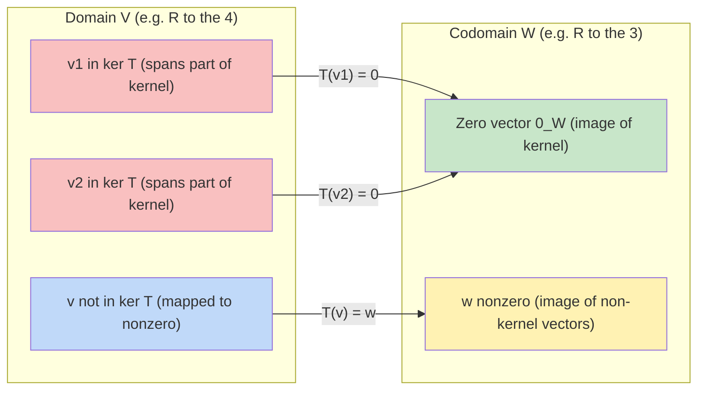
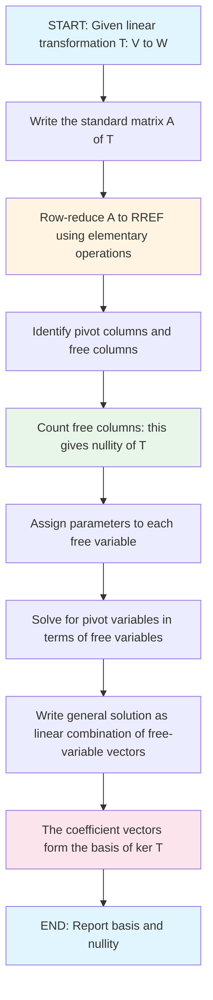
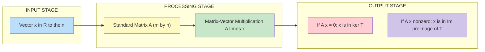

# Kernel of a Linear Transformation and its basis

<!-- SECTION_1_START -->

# Kernel of a Linear Transformation and Its Basis

> [!NOTE]
> **KTU 2024 Scheme | GAMAT201 | Module 4 – Linear Transformations**
> **Course Outcomes Mapped:** CO1 (Understand), CO2 (Apply)
> **Cognitive Level:** Remember → Understand → Apply → Analyze

---

## 1.1 Formal Definition

Let $V$ and $W$ be two vector spaces over the same field $\mathbb{F}$ (typically $\mathbb{R}$), and let $T : V \to W$ be a **linear transformation**. The **kernel** (also called the **null space**) of $T$ is the set of all vectors in the domain $V$ that are mapped to the **zero vector** of $W$.

$$
\ker(T) \;=\; \{\, \vec{v} \in V \;:\; T(\vec{v}) \;=\; \vec{0}_{W}\,\}
$$

Formally, $\ker(T)$ is a subset of $V$ (the domain), and it is a **linear subspace** of $V$.

### Equivalent Definition (in Matrix Form)

If $T(\vec{x}) = A\vec{x}$ where $A$ is an $m \times n$ matrix, then:

$$
\ker(T) \;=\; \{\, \vec{x} \in \mathbb{R}^{n} \;:\; A\vec{x} \;=\; \vec{0}\,\} \;=\; \mathcal{N}(A)
$$

The kernel is precisely the **null space** of the standard matrix $A$ of $T$.

> [!IMPORTANT]
> **Syllabus Highlight:** The KTU 2024 scheme places strong emphasis on:
> 1. Recognizing $\ker(T)$ as a **subspace** of the domain.
> 2. Computing a **basis** for $\ker(T)$ using the row-reduced echelon form (RREF) of the standard matrix.
> 3. Applying the **Rank-Nullity Theorem**: $\dim(V) = \text{rank}(T) + \text{nullity}(T)$.

---

## 1.2 Conceptual Analogy / Intuition

Imagine $T$ as a **specialised camera lens** that flattens a 3D scene into a 2D photograph.

- The **depth information** (the axis pointing directly into the camera) is completely lost.
- Every point along the line of sight is collapsed onto the **same** 2D point on the photograph.
- That "lost direction" — the set of all vectors pointing straight into the camera — is exactly the **kernel**.

> The kernel is the **direction of information loss** in $T$. Vectors in the kernel carry information that $T$ erases.

**Another analogy — The Coffee Sieve:**

| Step | Real-world action | Mathematical meaning |
| :--- | :--- | :--- |
| 1 | Pour a coffee mixture through a sieve | Apply $T$ to a vector $\vec{v}$ |
| 2 | Liquid passes through, grounds remain | Image $\text{Im}(T)$ in $W$ |
| 3 | Grounds that get trapped completely | Kernel $\ker(T)$ — they produce no output |
| 4 | No grounds pass through? | Kernel is trivial: $\ker(T) = \{\vec{0}\}$ |

> [!WARNING]
> **Common Misconception:** The zero vector $\vec{0}$ is **always** in $\ker(T)$, because $T(\vec{0}) = \vec{0}$ by linearity. So the kernel is **never empty** — it always contains at least $\vec{0}$.

---

## 1.3 Geometric Visualization

> [!VISUALIZATION CONTROL]
> **Concept:** Kernel as a line through the origin in a 2D-to-1D projection
> **Desmos Input Equations:**
> * `y = -x` (the kernel line for $T(x,y) = x + y$)
> * A marker `(0, 0)` for the zero vector
> **Visual Description:** Plot a diagonal line $y = -x$ through the origin. Every point on this line, when fed into $T(x,y) = x+y$, gives $T = 0$. The origin is one such point; the entire line is the kernel.

> [!VISUALIZATION CONTROL]
> **Concept:** Kernel as a plane in 3D for a 2D-image transformation
> **GeoGebra Input Equations:**
> * Vector field / implicit surface: `x + y + z = 0`
> * Two spanning directions on the plane: `(1, -1, 0)` and `(1, 0, -1)`
> **Visual Description:** A 2D plane passing through the origin in 3D space. For $T : \mathbb{R}^{3} \to \mathbb{R}$ defined by $T(x,y,z) = x+y+z$, every vector on this plane is in the kernel.

---

<!-- SECTION_1_END -->

<!-- SECTION_2_START -->

# Deep Theoretical Analysis & KTU High-Yield Formula Sheet

## 2.1 Why the Kernel is a Subspace (Theorem)

**Theorem:** If $T : V \to W$ is a linear transformation, then $\ker(T)$ is a **subspace** of $V$.

### Proof (Closure under Three Operations)

To prove $K = \ker(T)$ is a subspace, we must show:

**(a) Zero vector is in $K$:** Since $T$ is linear, $T(\vec{0}) = \vec{0}$. So $\vec{0} \in K$. ✓

**(b) Closed under addition:** Let $\vec{u}, \vec{v} \in K$. Then $T(\vec{u}) = \vec{0}$ and $T(\vec{v}) = \vec{0}$.

$$
T(\vec{u} + \vec{v}) \;=\; T(\vec{u}) + T(\vec{v}) \;=\; \vec{0} + \vec{0} \;=\; \vec{0}
$$

Hence $\vec{u} + \vec{v} \in K$. ✓

**(c) Closed under scalar multiplication:** Let $\vec{u} \in K$ and $c \in \mathbb{F}$.

$$
T(c\vec{u}) \;=\; c\,T(\vec{u}) \;=\; c \cdot \vec{0} \;=\; \vec{0}
$$

Hence $c\vec{u} \in K$. ✓

Since all three conditions hold, $K = \ker(T)$ is a subspace of $V$. $\blacksquare$

> [!NOTE]
> **Why this matters in KTU exams:** This proof is a **favourite 5-mark question** because it combines the definition of linearity with the subspace axioms. Examiners award marks for stating the three conditions explicitly.

---

## 2.2 The Nullity (Dimension of the Kernel)

The **nullity** of $T$ is the dimension of the kernel as a vector space:

$$
\text{nullity}(T) \;=\; \dim\big(\ker(T)\big)
$$

In matrix terms, if $A$ is the standard matrix of $T$, then $\text{nullity}(T)$ equals the number of **free variables** when $A\vec{x} = \vec{0}$ is solved via RREF.

---

## 2.3 The Rank-Nullity Theorem (Foundational Result)

**Theorem (Sylvester, 1884):** Let $T : V \to W$ be a linear transformation from a **finite-dimensional** vector space $V$ to a vector space $W$. Then:

$$
\dim(V) \;=\; \text{rank}(T) \;+\; \text{nullity}(T)
$$

where:
- $\text{rank}(T) = \dim(\text{Im}(T)) = $ number of pivot columns in the RREF of $A$.
- $\text{nullity}(T) = \dim(\ker(T)) = $ number of non-pivot (free) columns in the RREF of $A$.

> [!IMPORTANT]
> **KTU Board Priority:** This theorem appears in nearly every model paper. The total count: **(number of pivot columns) + (number of non-pivot columns) = (total number of columns) = $\dim(V)$**.

---

## 2.4 KTU Formula Sheet / Cheat Sheet

| Symbol | Meaning | How to Compute | Typical Range |
| :--- | :--- | :--- | :--- |
| $\ker(T)$ | Kernel of $T$ | Solve $A\vec{x} = \vec{0}$ | Subset of $\mathbb{R}^{n}$ |
| $\text{nullity}(T)$ | $\dim(\ker T)$ | Count free variables in RREF | $0 \le \text{nullity} \le n$ |
| $\text{rank}(T)$ | $\dim(\text{Im}\,T)$ | Count pivots in RREF of $A$ | $0 \le \text{rank} \le \min(m,n)$ |
| $\dim(V)$ | Dimension of domain | Number of columns of $A$ | Equals $n$ for $A \in \mathbb{R}^{m \times n}$ |
| $\mathcal{N}(A)$ | Null space of matrix $A$ | Same as $\ker(T)$ | Always contains $\vec{0}$ |
| $\vec{v}_i$ | $i$-th basis vector of $\ker T$ | Coefficient vector of free variable $i$ | Spans $\ker T$ |

**Special Case Formulas (often tested):**

$$
T \text{ is one-to-one} \;\Longleftrightarrow\; \ker(T) \;=\; \{\vec{0}\} \;\Longleftrightarrow\; \text{nullity}(T) \;=\; 0
$$

$$
T \text{ is onto} \;\Longleftrightarrow\; \text{rank}(T) \;=\; \dim(W)
$$

---

## 2.5 Engineering & Computer Science Utility

| Field | Application of Kernel |
| :--- | :--- |
| **Computer Graphics** | Perspective projection has a 1D kernel — depth direction. Used in 3D-to-2D rendering pipelines. |
| **Machine Learning** | SVM kernel trick maps data into higher dimensions; "null space" of the design matrix reveals unobservable modes. |
| **Cryptography** | Linear cryptanalysis: finding kernel of encryption matrix reveals invariant plaintext bits. |
| **Differential Equations** | Kernel of a differential operator = solution space of the corresponding homogeneous ODE. |
| **Control Systems** | Controllability: kernel of the controllability matrix gives unreachable states. |
| **Signal Processing** | Null space of a filter matrix identifies frequencies completely suppressed. |
| **Network Analysis** | Cycle space = kernel of incidence matrix; fundamental to Kirchhoff's laws. |

---

<!-- SECTION_2_END -->

<!-- SECTION_3_START -->

# Step-by-Step Derivations & Symbolic Implementation

## 3.1 Worked Example — Finding the Kernel and Its Basis

> [!NOTE]
> **Problem (KTU Typical 14-mark format):** Let $T : \mathbb{R}^{4} \to \mathbb{R}^{3}$ be the linear transformation defined by
> $$T(x_1, x_2, x_3, x_4) \;=\; (x_1 + 2x_2 + x_4,\; 2x_1 + 4x_2 + x_3 + 3x_4,\; x_1 + 2x_2 + x_3 + 2x_4)$$
> Find $\ker(T)$ and a basis for it. Hence find the nullity of $T$ and verify the Rank-Nullity Theorem.

### Step 1 — Construct the Standard Matrix $A$

The standard matrix of $T$ is the $3 \times 4$ matrix whose columns are the images of the standard basis vectors $\vec{e}_1, \vec{e}_2, \vec{e}_3, \vec{e}_4 \in \mathbb{R}^{4}$:

$$
A \;=\; \begin{bmatrix} 1 & 2 & 0 & 1 \\ 2 & 4 & 1 & 3 \\ 1 & 2 & 1 & 2 \end{bmatrix}
$$

### Step 2 — Set Up the Kernel Equation

The kernel satisfies $T(\vec{x}) = \vec{0}$, which translates to the homogeneous system $A\vec{x} = \vec{0}$:

$$
\begin{bmatrix} 1 & 2 & 0 & 1 \\ 2 & 4 & 1 & 3 \\ 1 & 2 & 1 & 2 \end{bmatrix} \begin{bmatrix} x_1 \\ x_2 \\ x_3 \\ x_4 \end{bmatrix} \;=\; \begin{bmatrix} 0 \\ 0 \\ 0 \end{bmatrix}
$$

### Step 3 — Row Reduce $A$ to RREF (Row-Reduced Echelon Form)

Apply elementary row operations to $A$:

**Step 3a:** $R_2 \to R_2 - 2R_1$ and $R_3 \to R_3 - R_1$:

$$
\begin{bmatrix} 1 & 2 & 0 & 1 \\ 0 & 0 & 1 & 1 \\ 0 & 0 & 1 & 1 \end{bmatrix}
$$

**Step 3b:** $R_3 \to R_3 - R_2$:

$$
\begin{bmatrix} 1 & 2 & 0 & 1 \\ 0 & 0 & 1 & 1 \\ 0 & 0 & 0 & 0 \end{bmatrix}
$$

**Step 3c:** This is already in RREF (each leading 1 is the only nonzero entry in its column).

$$
\text{RREF}(A) \;=\; \begin{bmatrix} 1 & 2 & 0 & 1 \\ 0 & 0 & 1 & 1 \\ 0 & 0 & 0 & 0 \end{bmatrix}
$$

### Step 4 — Identify Pivot and Free Variables

- **Pivot columns:** columns **1** and **3** (contain the leading 1's).
- **Pivot variables:** $x_1$ and $x_3$.
- **Free columns:** columns **2** and **4**.
- **Free variables:** $x_2$ and $x_4$.

The number of free variables immediately gives: $\text{nullity}(T) = 2$.

### Step 5 — Express Pivot Variables in Terms of Free Variables

From the RREF, reading the equations:

$$
\begin{aligned}
x_1 + 2x_2 + x_4 &= 0 \\
x_3 + x_4 &= 0
\end{aligned}
$$

Solving for the pivot variables:

$$
\begin{aligned}
x_1 &= -2x_2 - x_4 \\
x_3 &= -x_4
\end{aligned}
$$

### Step 6 — Write the General Solution in Parametric Vector Form

Set $x_2 = s$ and $x_4 = t$ as free parameters. Then:

$$
\vec{x} \;=\; \begin{bmatrix} x_1 \\ x_2 \\ x_3 \\ x_4 \end{bmatrix} \;=\; \begin{bmatrix} -2s - t \\ s \\ -t \\ t \end{bmatrix} \;=\; s \begin{bmatrix} -2 \\ 1 \\ 0 \\ 0 \end{bmatrix} \;+\; t \begin{bmatrix} -1 \\ 0 \\ -1 \\ 1 \end{bmatrix}
$$

### Step 7 — Extract the Basis Vectors of the Kernel

The coefficient vectors of the free parameters are the basis vectors:

$$
\boxed{\;\text{Basis of } \ker(T) \;=\; \left\{\, \begin{bmatrix} -2 \\ 1 \\ 0 \\ 0 \end{bmatrix},\; \begin{bmatrix} -1 \\ 0 \\ -1 \\ 1 \end{bmatrix} \,\right\}\;}
$$

And $\dim(\ker T) = 2$, so $\text{nullity}(T) = 2$.

### Step 8 — Verify the Rank-Nullity Theorem

- Number of pivots in RREF of $A$ = **2**, so $\text{rank}(T) = 2$.
- Number of free variables = **2**, so $\text{nullity}(T) = 2$.
- Domain dimension $\dim(\mathbb{R}^{4}) = 4$.

$$
\text{rank}(T) + \text{nullity}(T) \;=\; 2 + 2 \;=\; 4 \;=\; \dim(\mathbb{R}^{4}) \quad \checkmark
$$

> **Rank-Nullity Theorem VERIFIED.**

---

## 3.2 Verification by Direct Substitution (Independent Check)

Substitute each basis vector back into $T$:

**For $\vec{v}_1 = (-2, 1, 0, 0)$:**

$$
\begin{aligned}
T(\vec{v}_1) &= \big((-2) + 2(1) + 0,\; 2(-2) + 4(1) + 0 + 0,\; (-2) + 2(1) + 0 + 0\big) \\
&= (0, 0, 0) \quad \checkmark
\end{aligned}
$$

**For $\vec{v}_2 = (-1, 0, -1, 1)$:**

$$
\begin{aligned}
T(\vec{v}_2) &= \big((-1) + 0 + 1,\; 2(-1) + 0 + (-1) + 3(1),\; (-1) + 0 + (-1) + 2(1)\big) \\
&= (0, 0, 0) \quad \checkmark
\end{aligned}
$$

Both vectors genuinely lie in $\ker(T)$. Linear independence is evident from the distinct supports.

---

## 3.3 Symbolic Python Implementation

```python
import sympy as sp

def find_kernel_basis_and_verify(matrix_list: list[list[int]]) -> dict:
    """
    Compute the kernel basis, nullity, rank, and verify the Rank-Nullity Theorem
    for a linear transformation given by its standard matrix.

    Parameters
    ----------
    matrix_list : list[list[int]]
        The standard matrix A (m x n) of the linear transformation T.

    Returns
    -------
    dict
        Keys: 'rref', 'pivot_columns', 'free_columns', 'kernel_basis',
              'nullity', 'rank', 'domain_dim', 'rank_nullity_check'.
    """
    # Step 1: Build the matrix symbolically
    A = sp.Matrix(matrix_list)
    domain_dim = A.shape[1]
    print("=" * 60)
    print("STANDARD MATRIX A OF T:")
    sp.pprint(A)
    print("=" * 60)

    # Step 2: Compute the Row-Reduced Echelon Form
    rref_matrix, pivot_columns = A.rref()
    print("\nROW-REDUCED ECHELON FORM (RREF):")
    sp.pprint(rref_matrix)
    print(f"\nPivot column indices (0-based): {pivot_columns}")

    # Step 3: Identify pivot and free columns
    all_columns = set(range(domain_dim))
    pivot_set = set(pivot_columns)
    free_columns = sorted(all_columns - pivot_set)
    print(f"Free column indices (0-based): {free_columns}")

    # Step 4: Compute kernel basis (null space) using SymPy
    kernel_basis = A.nullspace()
    nullity = len(kernel_basis)
    rank = A.rank()

    print("\nKERNEL BASIS VECTORS:")
    for i, vec in enumerate(kernel_basis, start=1):
        print(f"  v{i} = {vec.T.tolist()[0]}")

    # Step 5: Verify Rank-Nullity
    check_value = rank + nullity
    is_verified = (check_value == domain_dim)
    print("\n" + "=" * 60)
    print("RANK-NULLITY THEOREM VERIFICATION")
    print("=" * 60)
    print(f"  rank(T)        = {rank}")
    print(f"  nullity(T)     = {nullity}")
    print(f"  rank + nullity = {check_value}")
    print(f"  dim(domain)    = {domain_dim}")
    print(f"  STATUS         = {'VERIFIED ✓' if is_verified else 'FAILED ✗'}")

    return {
        "rref": rref_matrix,
        "pivot_columns": list(pivot_columns),
        "free_columns": free_columns,
        "kernel_basis": kernel_basis,
        "nullity": nullity,
        "rank": rank,
        "domain_dim": domain_dim,
        "rank_nullity_check": is_verified,
    }


# ===== WORKED EXAMPLE FROM SECTION 3.1 =====
if __name__ == "__main__":
    A_input = [
        [1, 2, 0, 1],
        [2, 4, 1, 3],
        [1, 2, 1, 2],
    ]
    result = find_kernel_basis_and_verify(A_input)

    # Sanity check: every basis vector must be a null vector of A
    print("\nSANITY CHECK: A @ v_i should be the zero vector")
    A_sym = sp.Matrix(A_input)
    for i, v in enumerate(result["kernel_basis"], start=1):
        product = A_sym * v
        print(f"  A @ v{i} = {product.T.tolist()[0]} "
              f"--> {'OK' if product == sp.zeros(A_sym.shape[0], 1) else 'FAIL'}")
```

**Expected Output (trimmed):**

```
STANDARD MATRIX A OF T:
Matrix([[1, 2, 0, 1], [2, 4, 1, 3], [1, 2, 1, 2]])

RREF:
Matrix([[1, 2, 0, 1], [0, 0, 1, 1], [0, 0, 0, 0]])
Pivot column indices: [0, 2]
Free column indices: [1, 3]

KERNEL BASIS VECTORS:
  v1 = [-2, 1, 0, 0]
  v2 = [-1, 0, -1, 1]

RANK-NULLITY THEOREM VERIFICATION
  rank(T)        = 2
  nullity(T)     = 2
  rank + nullity = 4
  dim(domain)    = 4
  STATUS         = VERIFIED ✓
```

---

<!-- SECTION_3_END -->

<!-- SECTION_4_START -->

# Structural Diagrams & Schematics

## 4.1 Conceptual Map: Kernel Inside a Linear Transformation



> **Reading the diagram:** The red vectors in the domain all collapse to the **single green point** (the zero vector) in the codomain. The blue vector escapes to a nonzero image. The kernel is the **red region** — the preimage of the zero vector.

---

## 4.2 Algorithmic Flowchart: How to Find a Basis for the Kernel



---

## 4.3 Block Architecture: Linear Transformation Pipeline



---

<!-- SECTION_4_END -->

<!-- SECTION_5_START -->

# KTU 2024 Scheme Examination Question Bank & Topic Recap

---

## Part A Questions (3 Marks Each)

### Question A1 — Conceptual Definition
> **[KTU University Exam – July 2024 | CO1 | Remember]**
> Define the **kernel** of a linear transformation $T : V \to W$. Show that the zero vector of $V$ belongs to $\ker(T)$.

**Model Answer (Board Key):**
The kernel of a linear transformation $T : V \to W$ is defined as
$$\ker(T) \;=\; \{\, \vec{v} \in V \;:\; T(\vec{v}) = \vec{0}_W\,\}.$$
Since $T$ is linear, it preserves the zero vector: $T(\vec{0}_V) = \vec{0}_W$. Hence $\vec{0}_V \in \ker(T)$. **[3 marks: 1 for definition, 1 for linearity, 1 for conclusion]**

---

### Question A2 — Theorem Statement
> **[KTU University Exam – Dec 2023 | CO1 | Remember]**
> State the **Rank-Nullity Theorem** for a linear transformation $T : V \to W$.

**Model Answer (Board Key):**
Let $T : V \to W$ be a linear transformation with $V$ finite-dimensional. Then
$$\dim(V) \;=\; \text{rank}(T) + \text{nullity}(T)$$
where $\text{rank}(T) = \dim(\text{Im}\,T)$ and $\text{nullity}(T) = \dim(\ker T)$. **[3 marks: 1 for statement, 1 for both definitions, 1 for finiteness condition]**

---

## Part B Questions (14 Marks Each) — Internal Choice

### Question A (14 Marks)

> **[KTU University Exam – Model Paper 2024 | CO2, CO3 | Apply / Analyze]**
> Consider the linear transformation $T : \mathbb{R}^{4} \to \mathbb{R}^{3}$ defined by
> $$T(x_1, x_2, x_3, x_4) = (x_1 + 2x_2 + x_4,\; 2x_1 + 4x_2 + x_3 + 3x_4,\; x_1 + 2x_2 + x_3 + 2x_4).$$

#### Part (a) — 7 Marks | Find $\ker(T)$ and a basis for it.

**Model Solution:**

**Step 1:** Standard matrix:
$$A = \begin{bmatrix} 1 & 2 & 0 & 1 \\ 2 & 4 & 1 & 3 \\ 1 & 2 & 1 & 2 \end{bmatrix}$$
**[1 mark]**

**Step 2:** Row reduce to RREF.
Apply $R_2 \to R_2 - 2R_1$ and $R_3 \to R_3 - R_1$:
$$\begin{bmatrix} 1 & 2 & 0 & 1 \\ 0 & 0 & 1 & 1 \\ 0 & 0 & 1 & 1 \end{bmatrix}$$
Apply $R_3 \to R_3 - R_2$:
$$\text{RREF}(A) = \begin{bmatrix} 1 & 2 & 0 & 1 \\ 0 & 0 & 1 & 1 \\ 0 & 0 & 0 & 0 \end{bmatrix}$$
**[2 marks for correct RREF]**

**Step 3:** Identify pivots in columns 1 and 3. Free variables: $x_2, x_4$. **[1 mark]**

**Step 4:** Solve:
$$x_1 = -2x_2 - x_4, \quad x_3 = -x_4$$
**[1 mark]**

**Step 5:** Parametric form with $x_2 = s$, $x_4 = t$:
$$\vec{x} = s(-2, 1, 0, 0) + t(-1, 0, -1, 1)$$
**[1 mark]**

**Step 6:** Basis:
$$\ker(T) = \text{span}\big\{(-2, 1, 0, 0),\; (-1, 0, -1, 1)\big\}$$
**[1 mark]**

#### Part (b) — 7 Marks | Verify the Rank-Nullity Theorem and comment on injectivity of $T$.

**Model Solution:**

**Step 1:** $\text{nullity}(T) = 2$ (number of basis vectors). **[1 mark]**

**Step 2:** $\text{rank}(T) = 2$ (number of pivot columns). **[1 mark]**

**Step 3:** $\dim(\mathbb{R}^{4}) = 4$. Check:
$$\text{rank}(T) + \text{nullity}(T) = 2 + 2 = 4 = \dim(\mathbb{R}^{4}) \quad \checkmark$$
**[2 marks: 1 for equation, 1 for verification statement]**

**Step 4:** Injectivity check: $T$ is one-to-one iff $\ker(T) = \{\vec{0}\}$. Since $\ker(T)$ contains the non-zero vector $(-2, 1, 0, 0)$, the kernel is **not trivial**, so $T$ is **not one-to-one**. **[3 marks: 2 for criterion, 1 for conclusion with counterexample]**

> [!WARNING]
> **KTU Examiner's Pitfall Callout (Question A):**
> 1. **Forgetting to row-reduce fully:** Many students stop at the first reduction. The KTU board expects **RREF** (reduced row echelon form), not just REF. Partial marks awarded if REF is correct.
> 2. **Confusing pivot and free columns:** Always check that leading 1's are the only non-zero entries in their column. Free variables are in **columns without leading 1's**, not rows.
> 3. **Missing injectivity comment:** KTU 2024 scheme awards marks for linking $\ker(T) = \{\vec{0}\}$ to injectivity. A 1-line justification is mandatory.
> 4. **Not stating the dimension of the domain explicitly:** When verifying Rank-Nullity, write $\dim(\mathbb{R}^{4}) = 4$ separately. Do not skip the connection.

---

### Question B (14 Marks) — Alternative Choice

> **[KTU University Exam – Model Paper 2024 | CO2, CO3 | Apply / Analyze]**
> Consider $T : \mathbb{R}^{3} \to \mathbb{R}^{3}$ defined by $T(x, y, z) = (x + y,\; y + z,\; z + x)$.

#### Part (a) — 7 Marks | Find a basis for $\ker(T)$ and the nullity of $T$.

**Model Solution:**

**Step 1:** Standard matrix:
$$A = \begin{bmatrix} 1 & 1 & 0 \\ 0 & 1 & 1 \\ 1 & 0 & 1 \end{bmatrix}$$
**[1 mark]**

**Step 2:** Row reduce. $R_3 \to R_3 - R_1$:
$$\begin{bmatrix} 1 & 1 & 0 \\ 0 & 1 & 1 \\ 0 & -1 & 1 \end{bmatrix}$$
$R_3 \to R_3 + R_2$:
$$\begin{bmatrix} 1 & 1 & 0 \\ 0 & 1 & 1 \\ 0 & 0 & 2 \end{bmatrix}$$
$R_3 \to \tfrac{1}{2}R_3$:
$$\begin{bmatrix} 1 & 1 & 0 \\ 0 & 1 & 1 \\ 0 & 0 & 1 \end{bmatrix}$$
$R_2 \to R_2 - R_3$ and $R_1 \to R_1 - R_2$:
$$\text{RREF}(A) = \begin{bmatrix} 1 & 0 & 0 \\ 0 & 1 & 0 \\ 0 & 0 & 1 \end{bmatrix} = I_3$$
**[3 marks for full reduction]**

**Step 3:** Every column is a pivot column. No free variables. **[1 mark]**

**Step 4:** The only solution to $A\vec{x} = \vec{0}$ is $\vec{x} = \vec{0}$, so $\ker(T) = \{\vec{0}\}$. The basis of the trivial kernel is the **empty set** $\emptyset$, and $\text{nullity}(T) = 0$. **[2 marks: 1 for kernel, 1 for nullity]**

#### Part (b) — 7 Marks | Find $\text{rank}(T)$ and verify the Rank-Nullity Theorem. State whether $T$ is invertible.

**Model Solution:**

**Step 1:** Three pivots $\Rightarrow$ $\text{rank}(T) = 3$. **[1 mark]**

**Step 2:** Verify: $\text{rank}(T) + \text{nullity}(T) = 3 + 0 = 3 = \dim(\mathbb{R}^{3})$. ✓ **[2 marks]**

**Step 3:** Since $A$ is invertible (it row-reduces to $I_3$), $T$ is **bijective** (both one-to-one and onto). Therefore $T$ is **invertible**, and the inverse is $A^{-1}$. **[4 marks: 2 for invertibility conclusion, 2 for linking kernel-triviality to one-to-one]**

The inverse matrix (for reference): $A^{-1} = \dfrac{1}{2}\begin{bmatrix} 1 & -1 & 1 \\ 1 & 1 & -1 \\ -1 & 1 & 1 \end{bmatrix}$.

> [!WARNING]
> **KTU Examiner's Pitfall Callout (Question B):**
> 1. **Saying "basis = $\{(0,0,0)\}$":** WRONG. The basis of the trivial kernel is the **empty set** $\emptyset$. The set $\{0\}$ is a *generating* set, not a basis. Examiners deduct 1 mark for this error.
> 2. **Skipping the bijectivity link:** "Invertible" must be tied to *both* $\ker(T) = \{\vec{0}\}$ (one-to-one) *and* $\text{rank} = 3$ (onto). Mention both.
> 3. **Arithmetic slips in row operations:** When scaling $R_3 \to \tfrac{1}{2}R_3$, do not introduce fractions inconsistently. KTU boards are strict.

---

## Topic Recap & Important Things to Remember

> [!IMPORTANT]
> **Rapid Revision Checklist — KTU GAMAT201 Module 4**

### Core Definitions
- **Kernel of $T$:** $\ker(T) = \{\vec{v} \in V : T(\vec{v}) = \vec{0}_W\}$ — always contains $\vec{0}$.
- **Nullity of $T$:** $\text{nullity}(T) = \dim(\ker T)$ = number of **free variables** in the RREF of $A$.
- **Null Space of $A$:** $\mathcal{N}(A) = \{\vec{x} : A\vec{x} = \vec{0}\}$ — identical to $\ker(T)$.

### Critical Theorems
- $\ker(T)$ is a **subspace** of the domain $V$ (proved using closure under addition, scalar multiplication, and presence of zero).
- **Rank-Nullity Theorem:** $\dim(V) = \text{rank}(T) + \text{nullity}(T)$. Always check finiteness of $\dim(V)$ before applying.
- **Injectivity criterion:** $T$ is one-to-one $\iff \ker(T) = \{\vec{0}\}$ $\iff \text{nullity}(T) = 0$.

### Computational Procedure (Memorize This Sequence)
1. **Write** the standard matrix $A$ of $T$ from the component-form definition.
2. **Row reduce** $A$ all the way to **RREF** (not just REF).
3. **Identify** pivot columns (leading 1's) and free columns (without leading 1's).
4. **Count** free columns → this is the nullity.
5. **Solve** for pivot variables in terms of free variables.
6. **Parametrize** the solution with one parameter per free variable.
7. **Extract** coefficient vectors of each parameter as basis vectors of $\ker(T)$.

### Quick Numerical Sanity Checks
- **Pivot count + Free count = Total columns = $\dim(V)$** (this is the Rank-Nullity Theorem in disguise).
- A basis vector $\vec{v}_i$ in $\ker(T)$ must satisfy $A\vec{v}_i = \vec{0}$. Always verify with a substitution.
- If RREF of $A$ is the identity matrix $I_n$, then $\ker(T) = \{\vec{0}\}$ and $\text{nullity}(T) = 0$.

### Common KTU Board Mistakes to Avoid
- ❌ Confusing $\ker(T)$ (subset of domain) with $\text{Im}(T)$ (subset of codomain).
- ❌ Stopping row reduction at REF instead of RREF.
- ❌ Listing $\{\vec{0}\}$ as a basis (correct answer is the **empty set** $\emptyset$).
- ❌ Forgetting to state the dimension of the domain when verifying Rank-Nullity.
- ❌ Treating the kernel as potentially empty (it always contains $\vec{0}$).
- ❌ Missing the injectivity–kernel link in 14-mark questions.

### Engineering Flash Points
- Computer graphics, SVM kernels, network flow cycles, control systems, and differential equations all rely on the kernel concept.
- In ML, **nullity** quantifies the number of "unobservable" modes in a linear system.

> [!NOTE]
> **Final Exam Tip:** When a question says "find a basis for the kernel," examiners will *always* accept any non-zero scalar multiples of the basis vectors. So $\{(1, -\tfrac{1}{2}, 0, 0), (1, 0, 1, -1)\}$ is also a valid answer for the worked example — as long as the vectors are linearly independent and lie in $\ker(T)$.

<!-- SECTION_5_END -->
