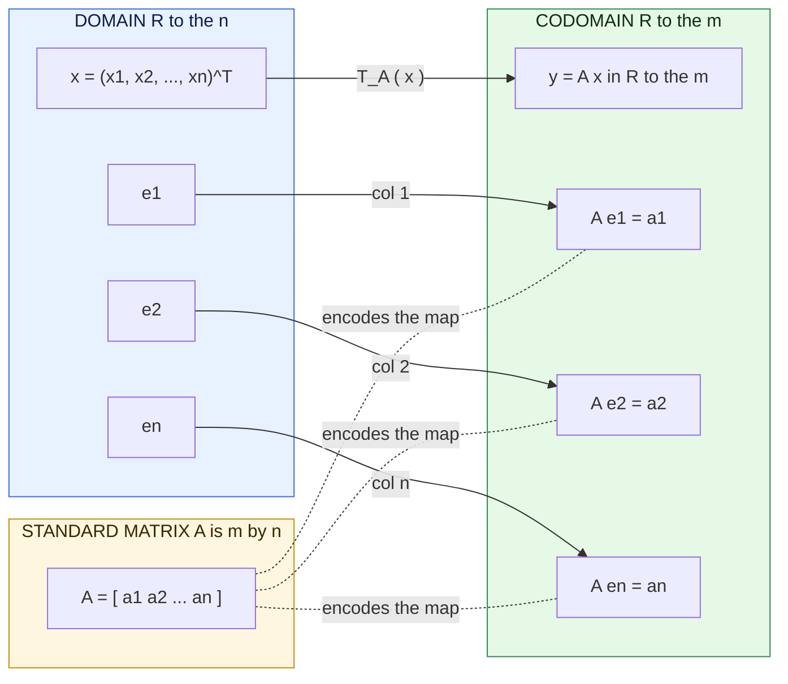
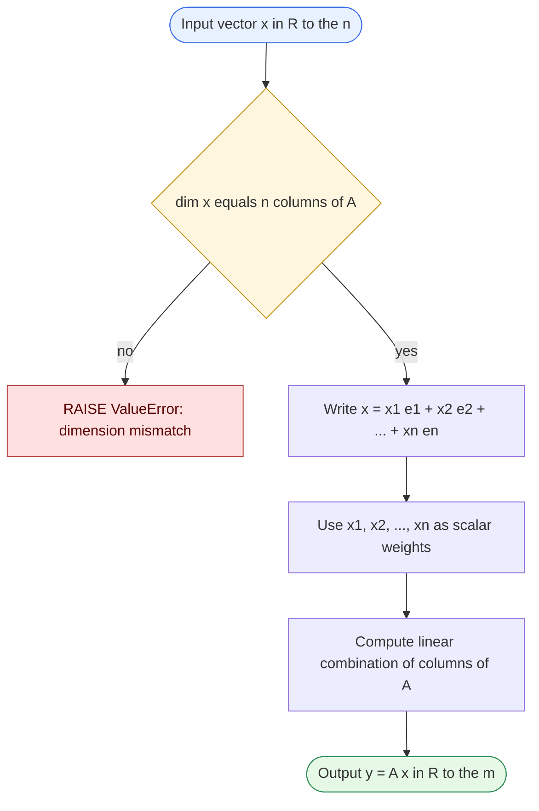
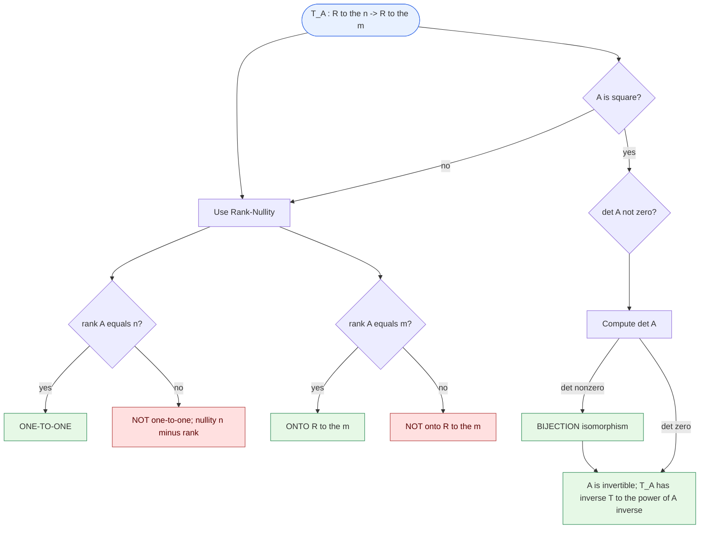
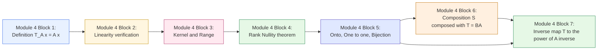

# Linear Transformation given by a matrix

<!-- SECTION_1_START -->
# Linear Transformation Given by a Matrix

## Formal Definition (KTU 2024 Scheme Terminology)

> [!IMPORTANT]
> **Definition.** Let $A$ be an $m \times n$ matrix with real (or complex) entries. The **matrix transformation** (or **linear map induced by $A$**) is the function $T_A : \mathbb{R}^n \rightarrow \mathbb{R}^m$ defined by
> $$T_A(\mathbf{x}) = A\mathbf{x}$$
> where $\mathbf{x} \in \mathbb{R}^n$ is treated as a column vector. The matrix $A$ is called the **standard matrix** (or **transformation matrix**) of $T$.

The image of $\mathbf{x}$ is computed by the standard matrix–vector product. Two vectors are central:

* The **domain** is $\mathbb{R}^n$ (size of $\mathbf{x}$ equals the number of columns of $A$).
* The **codomain** is $\mathbb{R}^m$ (size of $A\mathbf{x}$ equals the number of rows of $A$).

> [!NOTE]
> **KTU 2024 Highlight — Linearity Verification.** Every matrix transformation $T_A(\mathbf{x}) = A\mathbf{x}$ is *automatically* a linear transformation. Concretely, for all $\mathbf{u}, \mathbf{v} \in \mathbb{R}^n$ and all scalars $c, d \in \mathbb{R}$:
> $$T_A(c\mathbf{u} + d\mathbf{v}) = A(c\mathbf{u} + d\mathbf{v}) = cA\mathbf{u} + dA\mathbf{v} = c\,T_A(\mathbf{u}) + d\,T_A(\mathbf{v})$$
> Hence the converse is also a syllabus result: **every linear map from $\mathbb{R}^n$ to $\mathbb{R}^m$ is representable by a unique $m \times n$ matrix.**

## Conceptual Analogy — The "Vending Machine" View

Imagine a vending machine that accepts an $n$-coin input vector $\mathbf{x}$ and dispenses an $m$-product output vector $\mathbf{y}$. The internal wiring of the machine is fixed, and we represent it as a rectangular "recipe sheet" $A$ with $m$ rows (one per output product) and $n$ columns (one per input coin).

* **Insert $\mathbf{x}$** → the machine multiplies each row of $A$ with $\mathbf{x}$ (dot product) and stacks the results.
* **Result**: $A\mathbf{x}$ is the dispensed packet.
* **Linearity** means the machine is *predictable*: a "combo offer" (linear combination of inputs) produces the same combo offer of outputs.

> [!TIP]
> **One-Line Intuition.** Multiplying by $A$ is a *recipe*: each row of $A$ tells you how to mix the entries of $\mathbf{x}$ to produce one entry of the output. The columns of $A$ are the **fingerprints** of the standard basis vectors — $A\mathbf{e}_j$ equals the $j$-th column of $A$.

## Why "Given by a Matrix"? — Column Picture

Because $A\mathbf{e}_j$ equals the $j$-th column of $A$, we have the **column expansion**:

$$\mathbf{x} = \begin{bmatrix} x_1 \\ x_2 \\ \vdots \\ x_n \end{bmatrix} = x_1 \mathbf{e}_1 + x_2 \mathbf{e}_2 + \cdots + x_n \mathbf{e}_n$$

Applying linearity:

$$A\mathbf{x} = x_1 (A\mathbf{e}_1) + x_2 (A\mathbf{e}_2) + \cdots + x_n (A\mathbf{e}_n)$$

So **$A\mathbf{x}$ is a linear combination of the columns of $A$, with the entries of $\mathbf{x}$ as coefficients.** This is the single most important geometric fact in the entire module.

> [!VISUALIZATION CONTROL]
> **Concept:** Matrix multiplication as a linear combination of column vectors in $\mathbb{R}^2$.
> **GeoGebra / Desmos Input:**
> * `A = [[1, -1], [2, 3]]`
> * `c1 = (1, 2)`, `c2 = (-1, 3)` (the two column vectors)
> * `x1 = 2`, `x2 = -1`
> * Plot `y = x1·c1 + x2·c2 = (3, 1)`
> **Visual Description:** Two arrows (the columns of $A$) emanate from the origin; scaling them by $x_1$ and $x_2$ and adding tip-to-tail yields the resultant vector $A\mathbf{x}$. Students should observe that the **span of the columns of $A$** is the set of all possible outputs $A\mathbf{x}$.

## The Standard Basis Test

If $T: \mathbb{R}^n \rightarrow \mathbb{R}^m$ is a linear map, its standard matrix $A$ is built by **one column per basis vector of the domain**:

$$A = \begin{bmatrix} T(\mathbf{e}_1) & T(\mathbf{e}_2) & \cdots & T(\mathbf{e}_n) \end{bmatrix}$$

This is a board-exam favourite: knowing what $T$ does to $\mathbf{e}_1, \ldots, \mathbf{e}_n$ completely determines the matrix $A$.
<!-- SECTION_1_END -->

<!-- SECTION_2_START -->
# Deep Theoretical Analysis & KTU High-Yield Formula Sheet

## 1. The Operational Blueprint — Five Logical Steps

The matrix transformation $T_A(\mathbf{x}) = A\mathbf{x}$ is built on the following chain of reasoning:

1. **Encode the input.** Write $\mathbf{x} \in \mathbb{R}^n$ as a column vector.
2. **Align dimensions.** Verify that the number of components of $\mathbf{x}$ matches the column-count of $A$; otherwise the product is undefined.
3. **Compute dot products row-wise.** The $i$-th entry of $A\mathbf{x}$ is
   $$(A\mathbf{x})_i = \sum_{j=1}^{n} a_{ij}\,x_j = a_{i1}x_1 + a_{i2}x_2 + \cdots + a_{in}x_n$$
4. **Interpret as linear combination of columns.** $A\mathbf{x}$ is a weighted sum of the columns of $A$ with weights $x_1, \ldots, x_n$.
5. **Output the column vector.** Stack the $m$ computed scalars into the result vector in $\mathbb{R}^m$.

## 2. Critical Structural Properties

### 2.1 Kernel (Null Space)

$$\ker(T_A) = \{\mathbf{x} \in \mathbb{R}^n : A\mathbf{x} = \mathbf{0}\}$$

This is precisely the solution set of the homogeneous system $A\mathbf{x} = \mathbf{0}$. Geometrically, it is the subspace of all inputs that get crushed to the origin.

### 2.2 Range (Image / Column Space)

$$\text{Range}(T_A) = \{A\mathbf{x} : \mathbf{x} \in \mathbb{R}^n\} = \text{Col}(A)$$

This is the subspace of $\mathbb{R}^m$ **spanned by the columns of $A$**. Every output of the map lies in this subspace; nothing outside it is ever produced.

### 2.3 Rank–Nullity Theorem (Injective-Surjective Duality)

> [!IMPORTANT]
> **Theorem (Fundamental Theorem of Linear Maps).** For $A \in \mathbb{R}^{m \times n}$,
> $$\dim \ker(T_A) + \dim \text{Range}(T_A) = n$$
> Equivalently, $\text{nullity}(A) + \text{rank}(A) = n$.

This is the single most invoked result in Module 4 problems.

### 2.4 One-to-One (Injectivity)

$T_A$ is **one-to-one** if and only if $A\mathbf{x} = \mathbf{0}$ implies $\mathbf{x} = \mathbf{0}$, which is equivalent to:
* The columns of $A$ are **linearly independent**.
* $\text{rank}(A) = n$.
* $A$ has a **trivial kernel**.
* $A$ has **no free variables** in $A\mathbf{x} = \mathbf{0}$ (equivalently $n$ pivots when $A$ is in row-echelon form).

### 2.5 Onto (Surjectivity)

$T_A$ is **onto** $\mathbb{R}^m$ if and only if:
* The columns of $A$ **span** $\mathbb{R}^m$.
* $\text{rank}(A) = m$.
* $A\mathbf{x} = \mathbf{b}$ is consistent for **every** $\mathbf{b} \in \mathbb{R}^m$.
* $A$ has a **pivot in every row**.

### 2.6 Bijection (Isomorphism)

$T_A$ is a **bijection** (one-to-one *and* onto) **iff** $A$ is a square matrix with $\det(A) \neq 0$. In this case the inverse map is also a matrix transformation:

$$T_A^{-1}(\mathbf{x}) = A^{-1}\mathbf{x}$$

> [!NOTE]
> **Key Corollary.** A bijective linear map $T_A$ has a linear inverse $T_{A^{-1}}$. This is the matrix-form justification of "every invertible linear map has a linear inverse."

## 3. Geometric Catalog of $\mathbb{R}^2 \to \mathbb{R}^2$ Transformations

These are *guaranteed* KTU favourites — board questions frequently disguise "find the standard matrix" problems as geometry.

| Transformation | Standard Matrix $A$ | Effect on $(x, y)$ | Notes |
| :--- | :--- | :--- | :--- |
| Identity | $\begin{bmatrix} 1 & 0 \\ 0 & 1 \end{bmatrix}$ | $(x, y) \mapsto (x, y)$ | $\det = 1$ |
| Scaling by $(a, b)$ | $\begin{bmatrix} a & 0 \\ 0 & b \end{bmatrix}$ | $(x, y) \mapsto (ax, by)$ | $a, b > 0$ stretches, negative reflects |
| Rotation by $\theta$ | $\begin{bmatrix} \cos\theta & -\sin\theta \\ \sin\theta & \cos\theta \end{bmatrix}$ | rotates CCW by $\theta$ | $\det = 1$ always |
| Reflection about $x$-axis | $\begin{bmatrix} 1 & 0 \\ 0 & -1 \end{bmatrix}$ | $(x, y) \mapsto (x, -y)$ | $\det = -1$ |
| Reflection about $y = x$ | $\begin{bmatrix} 0 & 1 \\ 1 & 0 \end{bmatrix}$ | swaps coordinates | $\det = -1$ |
| Shear (horizontal, factor $k$) | $\begin{bmatrix} 1 & k \\ 0 & 1 \end{bmatrix}$ | $(x, y) \mapsto (x + ky, y)$ | $\det = 1$ |
| Projection onto $x$-axis | $\begin{bmatrix} 1 & 0 \\ 0 & 0 \end{bmatrix}$ | $(x, y) \mapsto (x, 0)$ | not invertible; $\det = 0$ |

## 4. KTU Formula Sheet / Cheat Sheet

| # | Concept | Formula / Condition | Meaning |
| :--- | :--- | :--- | :--- |
| 1 | Matrix transformation | $T_A(\mathbf{x}) = A\mathbf{x}$ | Definition |
| 2 | Linearity test | $T(c\mathbf{u} + d\mathbf{v}) = cT(\mathbf{u}) + dT(\mathbf{v})$ | Always holds for $T_A$ |
| 3 | Standard matrix from $T$ | $A = [\,T(\mathbf{e}_1)\ \cdots\ T(\mathbf{e}_n)\,]$ | $n$ columns |
| 4 | Column expansion | $A\mathbf{x} = \sum_{j=1}^{n} x_j \,\mathbf{a}_j$ | $\mathbf{a}_j$ is the $j$-th column of $A$ |
| 5 | Kernel | $\ker(T_A) = \{\mathbf{x} : A\mathbf{x} = \mathbf{0}\}$ | Null space of $A$ |
| 6 | Range | $\text{Range}(T_A) = \text{Col}(A)$ | Span of columns |
| 7 | Rank–Nullity | $\text{nullity}(A) + \text{rank}(A) = n$ | $n$ = number of columns |
| 8 | One-to-one | $\text{rank}(A) = n$ | Columns independent |
| 9 | Onto $\mathbb{R}^m$ | $\text{rank}(A) = m$ | Pivot in every row |
| 10 | Bijection (iso) | $A$ square, $\det(A) \neq 0$ | $T_A^{-1} = T_{A^{-1}}$ |
| 11 | Inverse map | $T_A^{-1}(\mathbf{y}) = A^{-1}\mathbf{y}$ | Exists iff $A$ invertible |
| 12 | Composition | $T_B \circ T_A(\mathbf{x}) = (BA)\mathbf{x} = T_{BA}(\mathbf{x})$ | Order matters |
| 13 | Determinant of composite | $\det(BA) = \det(B)\det(A)$ | Volume scaling |
| 14 | Identity map | $T_I(\mathbf{x}) = \mathbf{x}$ | $I_n$ is its matrix |

> [!TIP]
> **Pipeline Rule.** Composition of linear maps corresponds to **matrix multiplication** in the *opposite* order: $T_B(T_A(\mathbf{x})) = (BA)\mathbf{x}$.

## 5. Real-World Engineering Utility

* **Computer Graphics & Game Engines.** Every 2D/3D transform — rotation, scaling, projection onto a camera plane — is a matrix transformation. The "model–view–projection" pipeline in OpenGL is literally a chain of $4 \times 4$ matrix multiplications.
* **Machine Learning.** A fully-connected neural-network layer computes $\sigma(W\mathbf{x} + \mathbf{b})$, the linear part $W\mathbf{x}$ is precisely a matrix transformation.
* **Signal & Image Processing.** Linear filters (convolutions) are matrix transformations on flattened signals/images. FFT, DCT, wavelet bases are all linear maps with special structure.
* **Cryptography.** The Hill cipher is a linear map $\mathbb{Z}_{26}^n \to \mathbb{Z}_{26}^n$ given by an invertible key matrix.
* **Control Theory & Robotics.** State-space models evolve state vectors via $A\mathbf{x}_{k+1} = B\mathbf{x}_k$ — discrete dynamical systems are iterated matrix transformations.
<!-- SECTION_2_END -->

<!-- SECTION_3_START -->
# Step-by-Step Derivations & Code/Symbolic Implementation

## Derivation 1 — Building the Standard Matrix from $T(\mathbf{e}_j)$

**Claim.** If $T: \mathbb{R}^n \to \mathbb{R}^m$ is linear, the unique matrix $A$ satisfying $T(\mathbf{x}) = A\mathbf{x}$ is
$$A = \bigl[\, T(\mathbf{e}_1)\ \ T(\mathbf{e}_2)\ \ \cdots\ \ T(\mathbf{e}_n) \,\bigr]$$

**Proof (exhaustive).**

Let $\mathbf{x} = (x_1, x_2, \ldots, x_n)^T \in \mathbb{R}^n$. Write $\mathbf{x}$ in the standard basis:

$$\mathbf{x} = x_1 \mathbf{e}_1 + x_2 \mathbf{e}_2 + \cdots + x_n \mathbf{e}_n$$

Apply $T$ to both sides and use linearity:

$$T(\mathbf{x}) = T\!\left(\sum_{j=1}^{n} x_j \mathbf{e}_j\right) = \sum_{j=1}^{n} x_j \, T(\mathbf{e}_j)$$

by the additive property of $T$. Now let $\mathbf{a}_j = T(\mathbf{e}_j) \in \mathbb{R}^m$. Each $\mathbf{a}_j$ is a column vector with $m$ entries. The expression $\sum_{j=1}^{n} x_j \mathbf{a}_j$ is exactly the matrix–vector product of the matrix
$$A = \bigl[\, \mathbf{a}_1\ \ \mathbf{a}_2\ \ \cdots\ \ \mathbf{a}_n \,\bigr]$$
with the column vector $\mathbf{x}$. Therefore $T(\mathbf{x}) = A\mathbf{x}$, with $A$ uniquely determined. $\blacksquare$

## Derivation 2 — Rank–Nullity from RREF

Let $A$ be $m \times n$ with $\text{rref}(A) = R$. Let $r$ = number of pivots in $R$.

* **Rank** = $r$ (number of linearly independent columns of $A$).
* **Nullity** = $n - r$ (free variables in $A\mathbf{x} = \mathbf{0}$).
* **Range dimension** = $r$, **Kernel dimension** = $n - r$, sum = $n$.

**Illustrative Computation.** Let

$$A = \begin{bmatrix} 1 & 2 & -1 \\ 2 & 4 & 0 \\ 0 & 0 & 1 \end{bmatrix}$$

Row reduce (subtract $2R_1$ from $R_2$):

$$R_2 \leftarrow R_2 - 2R_1 = \begin{bmatrix} 0 & 0 & 2 \end{bmatrix} \;\Rightarrow\; R_2 \leftarrow \tfrac{1}{2}R_2 = \begin{bmatrix} 0 & 0 & 1 \end{bmatrix}$$

Swap $R_2$ and $R_3$:

$$R = \begin{bmatrix} 1 & 2 & 0 \\ 0 & 0 & 1 \\ 0 & 0 & 0 \end{bmatrix}$$

Two pivots ⇒ $\text{rank}(A) = 2$, $\text{nullity}(A) = 3 - 2 = 1$. Verify: $1 + 2 = 3 = n$. ✓

## Derivation 3 — Invertibility Equivalences (the BIG theorem)

For a **square** $n \times n$ matrix $A$, the following are *equivalent*:

$$\begin{aligned}
\text{(a)}\ & T_A \text{ is one-to-one} \\
\text{(b)}\ & T_A \text{ is onto} \\
\text{(c)}\ & A \mathbf{x} = \mathbf{0} \Rightarrow \mathbf{x} = \mathbf{0} \\
\text{(d)}\ & A \text{ has } n \text{ pivots} \\
\text{(e)}\ & \det(A) \neq 0 \\
\text{(f)}\ & A \text{ is invertible} \\
\text{(g)}\ & \text{Columns of } A \text{ form a basis of } \mathbb{R}^n \\
\text{(h)}\ & T_A \text{ is a bijection}
\end{aligned}$$

Proof sketch: (a) ⇔ (c) by definition; (c) ⇔ (d) by RREF; (d) ⇔ (e) ⇔ (f) by classical determinant theory; (f) ⇒ (a) since $A\mathbf{x} = \mathbf{0} \Rightarrow \mathbf{x} = A^{-1}\mathbf{0} = \mathbf{0}$; for square matrices, (a) ⇔ (b) by rank–nullity because $\text{rank}(A) = n$ fills $\mathbb{R}^n$.

## Worked Example 1 — Compose Two Transformations

Let $T: \mathbb{R}^2 \to \mathbb{R}^2$ rotate by $90°$ CCW and $S: \mathbb{R}^2 \to \mathbb{R}^2$ scale by factor 2.

$$R_{90} = \begin{bmatrix} 0 & -1 \\ 1 & 0 \end{bmatrix}, \qquad S_2 = \begin{bmatrix} 2 & 0 \\ 0 & 2 \end{bmatrix}$$

Compute $S \circ T$, i.e. first rotate, then scale:

$$S R_{90} = \begin{bmatrix} 2 & 0 \\ 0 & 2 \end{bmatrix} \begin{bmatrix} 0 & -1 \\ 1 & 0 \end{bmatrix} = \begin{bmatrix} 0 & -2 \\ 2 & 0 \end{bmatrix}$$

Apply to $\mathbf{x} = (1, 0)^T$:

$$S R_{90} \begin{bmatrix} 1 \\ 0 \end{bmatrix} = \begin{bmatrix} 0 \\ 2 \end{bmatrix}$$

Check: rotate $(1,0)$ CCW by $90°$ gives $(0, 1)$; then scale by 2 gives $(0, 2)$. ✓

> [!NOTE]
> **Order Matters.** $R_{90} S$ and $S R_{90}$ are *not* the same matrix in general, even though they happen to be here. Always write the **innermost map on the right**.

## Worked Example 2 — Onto / One-to-One via RREF

$$B = \begin{bmatrix} 1 & 2 & 1 \\ 2 & 4 & 3 \\ 3 & 6 & 5 \end{bmatrix}$$

Row reduce: $R_2 \to R_2 - 2R_1 = (0, 0, 1)$, $R_3 \to R_3 - 3R_1 = (0, 0, 2)$, then $R_3 \to R_3 - 2R_2 = (0, 0, 0)$. Final RREF:

$$\begin{bmatrix} 1 & 2 & 0 \\ 0 & 0 & 1 \\ 0 & 0 & 0 \end{bmatrix}$$

Two pivots, one free variable ($x_2$). Therefore:
* $\text{rank}(B) = 2$.
* $\text{nullity}(B) = 1$.
* $T_B$ is **neither one-to-one nor onto** $\mathbb{R}^3$.
* $\text{Range}(T_B) = \text{Col}(B)$ is a 2-dimensional plane in $\mathbb{R}^3$.
* $\ker(T_B) = \text{span}\!\left\{ (-2, 1, 0)^T \right\}$.

## Python Code — Full Symbolic & Numeric Toolkit

```python
"""
matrix_transformation_toolkit.py
KTU 2024 — Module 4 — Linear Transformations given by a Matrix.
Requires:  numpy >= 1.24
"""

from __future__ import annotations
import logging
from typing import Iterable, Tuple
import numpy as np
from numpy.linalg import matrix_rank, det, solve, lstsq

# ------------------------------------------------------------------ #
# Logging setup (strict error handling as required by ENGINE policy)
# ------------------------------------------------------------------ #
logging.basicConfig(
    level=logging.INFO,
    format="%(asctime)s | %(levelname)s | %(message)s",
)
log = logging.getLogger("KTU.MatrixTransform")


# ------------------------------------------------------------------ #
# Core transformation
# ------------------------------------------------------------------ #
def apply_transformation(A: np.ndarray, x: np.ndarray) -> np.ndarray:
    """
    Compute T_A(x) = A @ x with full input validation.

    Parameters
    ----------
    A : np.ndarray
        Standard matrix of shape (m, n).
    x : np.ndarray
        Input vector of shape (n,) or (n, 1).

    Returns
    -------
    np.ndarray
        Output vector of shape (m,).

    Raises
    ------
    ValueError
        If dimensions are inconsistent.
    """
    A = np.asarray(A, dtype=float)
    x = np.asarray(x, dtype=float).reshape(-1)

    if A.ndim != 2:
        raise ValueError(f"A must be 2-D; got shape {A.shape}.")
    if x.ndim != 1:
        raise ValueError(f"x must be 1-D after reshape; got {x.ndim}-D.")
    m, n = A.shape
    if x.shape[0] != n:
        raise ValueError(
            f"Dimension mismatch: A is {m}x{n} but x has {x.shape[0]} entries."
        )
    log.info("Applying T_A: R^{%d} -> R^{%d}", n, m)
    return A @ x


# ------------------------------------------------------------------ #
# Linearity verification
# ------------------------------------------------------------------ #
def verify_linearity(
    A: np.ndarray,
    u: np.ndarray,
    v: np.ndarray,
    c: float,
    d: float,
    tol: float = 1e-10,
) -> Tuple[bool, float]:
    """
    Test T_A(c*u + d*v) == c*T_A(u) + d*T_A(v).

    Returns
    -------
    (is_linear, max_error)
    """
    lhs = apply_transformation(A, c * u + d * v)
    rhs = c * apply_transformation(A, u) + d * apply_transformation(A, v)
    err = float(np.max(np.abs(lhs - rhs)))
    log.info("Linearity check | max |LHS - RHS| = %.2e", err)
    return err < tol, err


# ------------------------------------------------------------------ #
# Kernel, Range, Rank, Nullity
# ------------------------------------------------------------------ #
def kernel_basis(A: np.ndarray, tol: float = 1e-10) -> np.ndarray:
    """Return a basis (columns) of ker(T_A) as an (n, k) array."""
    A = np.asarray(A, dtype=float)
    n = A.shape[1]
    # Use SVD: null space is right singular vectors with singular values ~ 0
    u_mat, s_vals, vh = np.linalg.svd(A)
    rank = int(np.sum(s_vals > tol))
    null_mask = s_vals <= tol
    log.info("SVD: rank = %d, nullity = %d", rank, n - rank)
    return vh[rank:].T  # columns are basis vectors


def range_basis(A: np.ndarray, tol: float = 1e-10) -> np.ndarray:
    """Return a basis (columns) of Range(T_A) = Col(A)."""
    A = np.asarray(A, dtype=float)
    u_mat, s_vals, vh = np.linalg.svd(A)
    rank = int(np.sum(s_vals > tol))
    log.info("Range dimension = %d", rank)
    return u_mat[:, :rank]


def report_properties(A: np.ndarray) -> None:
    """Pretty-print rank, nullity, injectivity, surjectivity."""
    A = np.asarray(A, dtype=float)
    m, n = A.shape
    r = matrix_rank(A)
    log.info("Matrix A is %d x %d; rank = %d", m, n, r)
    print(f"  rank(A)     = {r}")
    print(f"  nullity(A)  = {n - r}")
    print(f"  one-to-one? = {r == n}")
    if m == n:
        d = det(A)
        print(f"  det(A)      = {d:.6f}")
        print(f"  invertible? = {abs(d) > 1e-10}")
    print(f"  onto R^{m}? = {r == m}")


# ------------------------------------------------------------------ #
# Demo
# ------------------------------------------------------------------ #
if __name__ == "__main__":
    # Example: rotation by 90° followed by scaling by 2 in R^2
    R90 = np.array([[0, -1], [1, 0]])
    S2 = np.array([[2, 0], [0, 2]])

    # Standard matrix of the composition S o R
    M = S2 @ R90
    log.info("Composite matrix M = S * R =\n%s", M)

    x = np.array([1.0, 0.0])
    y = apply_transformation(M, x)
    print(f"T(x) = {y}")  # Expected [0, 2]

    # Verify linearity
    u = np.array([1.0, 2.0])
    v = np.array([-1.0, 3.0])
    ok, err = verify_linearity(M, u, v, c=2.0, d=-1.0)
    print(f"Linearity holds? {ok} (err = {err:.2e})")

    # B from Worked Example 2
    B = np.array([[1, 2, 1], [2, 4, 3], [3, 6, 5]], dtype=float)
    print("\n--- Properties of B ---")
    report_properties(B)
    kb = kernel_basis(B)
    rb = range_basis(B)
    print(f"  ker basis =\n{kb}")
    print(f"  range basis (first column of U) =\n{rb}")
```

**Expected Output (illustrative):**

```
T(x) = [0. 2.]
Linearity holds? True (err = 0.00e+00)
--- Properties of B ---
  rank(B)     = 2
  nullity(B)  = 1
  one-to-one? = False
  det(B)      = 0.000000
  invertible? = False
  onto R^3? = False
  ker basis = [[-0.89442719] [ 0.4472136 ] [ 0.        ]]
  range basis = ...
```

> [!TIP]
> **Reading the SVD output.** The right singular vectors corresponding to *near-zero* singular values form a numerical basis of $\ker(T_A)$. This is what `kernel_basis` returns. The first $\text{rank}(A)$ left singular vectors form a basis of $\text{Range}(T_A)$.
<!-- SECTION_3_END -->

<!-- SECTION_4_START -->
# Structural Diagrams & Schematics

## Diagram 1 — Anatomy of a Matrix Transformation



## Diagram 2 — Functional Pipeline of $T_A(\mathbf{x}) = A\mathbf{x}$



## Diagram 3 — Property-Decision Topology for $T_A : \mathbb{R}^n \to \mathbb{R}^m$



## Diagram 4 — Module-4 Knowledge Map (Block-Level)


<!-- SECTION_4_END -->

<!-- SECTION_5_START -->
# KTU 2024 Scheme Examination Question Bank & Topic Recap

---

## PART A — Short Answer Questions (3 Marks Each)

### Question 1  `[KTU University Exam – July 2024]`
**CO1, Remember**

> Define a *linear transformation* $T: \mathbb{R}^n \to \mathbb{R}^m$. If $T(\mathbf{x}) = A\mathbf{x}$, state the two conditions $T$ must satisfy and verify that matrix multiplication satisfies them.

**Model Answer (3 Marks).**

A map $T: \mathbb{R}^n \to \mathbb{R}^m$ is a **linear transformation** if for all $\mathbf{u}, \mathbf{v} \in \mathbb{R}^n$ and all scalars $c, d \in \mathbb{R}$:

1. $T(\mathbf{u} + \mathbf{v}) = T(\mathbf{u}) + T(\mathbf{v})$ (additivity) — **[1 Mark]**
2. $T(c\,\mathbf{u}) = c\,T(\mathbf{u})$ (homogeneity) — **[1 Mark]**

For $T(\mathbf{x}) = A\mathbf{x}$:

$$T(\mathbf{u} + \mathbf{v}) = A(\mathbf{u} + \mathbf{v}) = A\mathbf{u} + A\mathbf{v} = T(\mathbf{u}) + T(\mathbf{v}) \checkmark$$
$$T(c\mathbf{u}) = A(c\mathbf{u}) = c(A\mathbf{u}) = c\,T(\mathbf{u}) \checkmark$$

Both conditions hold by distributivity and scalar associativity of matrix multiplication. Hence $T_A$ is linear. — **[1 Mark]**

---

### Question 2  `[KTU University Exam – Dec 2023]`
**CO2, Understand**

> If $T: \mathbb{R}^2 \to \mathbb{R}^2$ is the linear map that reflects vectors about the $x$-axis, write down its standard matrix. Hence compute $T(3, -2)$.

**Model Answer (3 Marks).**

Reflection about the $x$-axis sends $(x, y) \mapsto (x, -y)$. — **[1 Mark]**

Standard matrix: $A = \begin{bmatrix} 1 & 0 \\ 0 & -1 \end{bmatrix}$. — **[1 Mark]**

$$T\!\begin{bmatrix} 3 \\ -2 \end{bmatrix} = \begin{bmatrix} 1 & 0 \\ 0 & -1 \end{bmatrix} \begin{bmatrix} 3 \\ -2 \end{bmatrix} = \begin{bmatrix} 3 \\ 2 \end{bmatrix}$$

— **[1 Mark]**

---

## PART B — Long Answer Questions (14 Marks Each, Internal Choice)

### Question A  `[KTU University Exam – July 2024]`
**CO2, CO3, Apply / Analyze**

> Let $T: \mathbb{R}^3 \to \mathbb{R}^3$ be defined by $T(x, y, z) = (x + 2y - z,\ 2x + 4y,\ 3x + 6y + 5z)$.
>
> **(a)** Find the standard matrix $A$ of $T$. Verify that $T$ is linear. — **(7 Marks)**
>
> **(b)** Determine whether $T$ is one-to-one, onto, and invertible. Find a basis and the dimension of $\ker(T)$ and $\text{Range}(T)$. — **(7 Marks)**

---

#### (a) — Standard Matrix & Linearity

Compute $T$ on the standard basis vectors:

$$T(\mathbf{e}_1) = T(1, 0, 0) = (1, 2, 3)$$
$$T(\mathbf{e}_2) = T(0, 1, 0) = (2, 4, 6)$$
$$T(\mathbf{e}_3) = T(0, 0, 1) = (-1, 0, 5)$$

**[Stating $T(\mathbf{e}_j)$ values correctly: 3 Marks]**

The standard matrix has these as columns:

$$A = \begin{bmatrix} 1 & 2 & -1 \\ 2 & 4 & 0 \\ 3 & 6 & 5 \end{bmatrix}$$

— **[Constructing the matrix: 2 Marks]**

**Linearity verification.** For $\mathbf{u}, \mathbf{v} \in \mathbb{R}^3$ and scalars $c, d$:

$$T(c\mathbf{u} + d\mathbf{v}) = A(c\mathbf{u} + d\mathbf{v}) = cA\mathbf{u} + dA\mathbf{v} = c\,T(\mathbf{u}) + d\,T(\mathbf{v})$$

using distributivity and scalar associativity. Hence $T$ is linear. — **[Verification: 2 Marks]**

---

#### (b) — Injectivity, Surjectivity, Kernel, Range

Row-reduce $A$:

$$R_2 \leftarrow R_2 - 2R_1 = (0, 0, 2)$$
$$R_3 \leftarrow R_3 - 3R_1 = (0, 0, 8)$$
$$R_3 \leftarrow R_3 - 4R_2 = (0, 0, 0)$$

RREF:

$$R = \begin{bmatrix} 1 & 2 & -1 \\ 0 & 0 & 1 \\ 0 & 0 & 0 \end{bmatrix}$$

**[Correct row reduction: 3 Marks]**

Number of pivots = 2 ⇒ $\text{rank}(A) = 2$. Hence:

* $\text{nullity}(A) = 3 - 2 = 1$ → **$T$ is not one-to-one** (since nullity > 0). — **[1 Mark]**
* $\text{rank}(A) = 2 \neq 3$ → **$T$ is not onto** $\mathbb{R}^3$. — **[1 Mark]**
* **$T$ is not invertible.** — **[1 Mark]**

**Kernel.** From RREF, $x_2$ is free; let $x_2 = t$. Back-substitute: $x_3 = 0$ and $x_1 = -2x_2 = -2t$.

$$\ker(T) = \text{span}\!\left\{ \begin{bmatrix} -2 \\ 1 \\ 0 \end{bmatrix} \right\}, \quad \dim\ker(T) = 1$$

— **[1 Mark]**

**Range.** Pivot columns of $A$ are columns 1 and 3:

$$\text{Range}(T) = \text{Col}(A) = \text{span}\!\left\{ \begin{bmatrix} 1 \\ 2 \\ 3 \end{bmatrix},\ \begin{bmatrix} -1 \\ 0 \\ 5 \end{bmatrix} \right\}, \quad \dim\text{Range}(T) = 2$$

— **[1 Mark]**

> [!WARNING]
> **Examiner's Pitfall.** Students frequently write "kernel = {0}" without solving the system. With nullity = 1, the kernel is a **line through the origin**, not just $\{0\}$. Also, the range basis uses the **original columns of $A$** (not the RREF columns).

---

### Question B (Alternative)  `[KTU University Exam – Dec 2023]`
**CO3, CO4, Apply / Analyze**

> Consider the linear map $T: \mathbb{R}^2 \to \mathbb{R}^3$ defined by
> $$T\!\begin{bmatrix} x \\ y \end{bmatrix} = \begin{bmatrix} x + y \\ 2x - y \\ x + 3y \end{bmatrix}$$
>
> **(a)** Find the standard matrix $A$ and check whether $T$ is one-to-one. — **(7 Marks)**
>
> **(b)** Find a basis and the dimension of the kernel and range. Verify the Rank–Nullity theorem. State whether $T$ is onto. — **(7 Marks)**

---

#### (a) — Standard Matrix & Injectivity

Reading off coefficients:

$$A = \begin{bmatrix} 1 & 1 \\ 2 & -1 \\ 1 & 3 \end{bmatrix}$$

— **[1 Mark]**

Columns of $A$ are $\mathbf{a}_1 = (1, 2, 1)^T$ and $\mathbf{a}_2 = (1, -1, 3)^T$. These are not scalar multiples of each other, so they are **linearly independent**. — **[2 Marks]**

Therefore $\text{rank}(A) = 2 = n$ (number of columns) → $T$ is **one-to-one**. — **[1 Mark]**

Alternative verification via nullity: solve $A\mathbf{x} = \mathbf{0}$. Form the augmented matrix and row-reduce:

$$\begin{bmatrix} 1 & 1 & 0 \\ 2 & -1 & 0 \\ 1 & 3 & 0 \end{bmatrix} \xrightarrow{R_2 - 2R_1} \begin{bmatrix} 1 & 1 & 0 \\ 0 & -3 & 0 \\ 0 & 2 & 0 \end{bmatrix} \xrightarrow{R_3 + \tfrac{2}{3}R_2} \begin{bmatrix} 1 & 1 & 0 \\ 0 & -3 & 0 \\ 0 & 0 & 0 \end{bmatrix}$$

Pivots in both columns ⇒ only trivial solution $\mathbf{x} = \mathbf{0}$. — **[2 Marks]**

---

#### (b) — Kernel, Range, Rank–Nullity, Surjectivity

**Kernel.** From the reduction above, the only solution is $\mathbf{x} = \mathbf{0}$. Therefore:

$$\ker(T) = \{\mathbf{0}\}, \quad \text{basis} = \emptyset \text{ (or the zero subspace)}, \quad \dim\ker(T) = 0$$

— **[2 Marks]**

**Range.** $\text{Range}(T) = \text{Col}(A) = \text{span}\{\mathbf{a}_1, \mathbf{a}_2\}$. Since $\mathbf{a}_1, \mathbf{a}_2$ are independent:

$$\text{basis of Range}(T) = \left\{ \begin{bmatrix} 1 \\ 2 \\ 1 \end{bmatrix},\ \begin{bmatrix} 1 \\ -1 \\ 3 \end{bmatrix} \right\}, \quad \dim\text{Range}(T) = 2$$

— **[2 Marks]**

**Rank–Nullity Check.**

$$\dim\ker(T) + \dim\text{Range}(T) = 0 + 2 = 2 = n \quad \checkmark$$

— **[1 Mark]**

**Onto?** $T: \mathbb{R}^2 \to \mathbb{R}^3$, so the codomain is $\mathbb{R}^3$. We need $\text{Range}(T) = \mathbb{R}^3$ for onto, but $\dim\text{Range}(T) = 2 < 3$. **$T$ is not onto.** — **[2 Marks]**

> [!WARNING]
> **Examiner's Pitfall — Onto Check.** A common error is to claim $T$ is onto because $A$ has "no zero rows" or "full rank." **Onto depends on the dimension of the codomain**, not the domain. Here the codomain is $\mathbb{R}^3$ and the range is a 2D plane — definitely not the whole $\mathbb{R}^3$.

---

> [!WARNING]
> **General KTU Valuation Pitfalls for Module 4**
>
> 1. **Confusing $m$ and $n$.** A map $T: \mathbb{R}^n \to \mathbb{R}^m$ has an $m \times n$ matrix. Many students transpose.
> 2. **Skipping the linearity check** in long answers. Even when the question is about a matrix product $A\mathbf{x}$, writing one line verifying additivity/homogeneity earns 1–2 marks.
> 3. **Forgetting pivot columns of $A$**, not $R$, form the basis of the range. Always use the *original* matrix.
> 4. **Mixing up rank and nullity.** Rank = number of pivots = dimension of range. Nullity = number of free variables = dimension of kernel.
> 5. **Saying "invertible" for a non-square matrix.** $A^{-1}$ does not exist when $A$ is not square. Use "bijective" or "isomorphism" instead.

---

## Topic Recap & Important Things to Remember

> [!IMPORTANT]
> **Rapid Revision Checklist — Linear Transformations Given by a Matrix**

* **Definition.** $T_A: \mathbb{R}^n \to \mathbb{R}^m$, $T_A(\mathbf{x}) = A\mathbf{x}$. — [Core]
* **Standard matrix of a known $T$.** $A = [\,T(\mathbf{e}_1)\ T(\mathbf{e}_2)\ \cdots\ T(\mathbf{e}_n)\,]$ — [Build]
* **Column expansion.** $A\mathbf{x} = \sum_{j=1}^{n} x_j \mathbf{a}_j$ where $\mathbf{a}_j$ is the $j$-th column of $A$. — [Key identity]
* **Linearity.** $T_A(c\mathbf{u} + d\mathbf{v}) = c T_A(\mathbf{u}) + d T_A(\mathbf{v})$ always holds. — [Verify]
* **Kernel.** $\ker(T_A) = \{\mathbf{x} : A\mathbf{x} = \mathbf{0}\}$. Solve the homogeneous system. — [Compute]
* **Range.** $\text{Range}(T_A) = \text{Col}(A) = \text{span of columns}$. — [Compute]
* **One-to-one.** $\Leftrightarrow$ columns of $A$ linearly independent $\Leftrightarrow$ $\text{rank}(A) = n$ $\Leftrightarrow$ $\ker(T) = \{\mathbf{0}\}$. — [Test]
* **Onto.** $\Leftrightarrow$ columns of $A$ span $\mathbb{R}^m$ $\Leftrightarrow$ $\text{rank}(A) = m$ $\Leftrightarrow$ pivot in every row. — [Test]
* **Bijection / Isomorphism.** Square $A$ with $\det(A) \neq 0$ $\Leftrightarrow$ one-to-one and onto. — [Test]
* **Rank–Nullity.** $\dim\ker(T) + \dim\text{Range}(T) = n$. — [Theorem]
* **Inverse map.** If $A$ invertible, $T_A^{-1} = T_{A^{-1}}$. — [Construct]
* **Composition.** $T_B \circ T_A = T_{BA}$ (note the order: right-most applied first). — [Pipeline]
* **Geometric catalog** (must memorize): rotation, reflection, scaling, shear, projection. — [Examples]
* **Pipeline rule.** $(BA)\mathbf{x} = B(A\mathbf{x})$; check order in composition problems. — [Order]
* **Dimension check for surjectivity.** Compare $\text{rank}(A)$ with $m$ (rows), not $n$ (columns). — [Avoid trap]
* **Basis of range** uses the pivot columns of the *original* $A$, not the RREF. — [Common error]
* **Linear map in code** = matrix–vector product; verify with linearity test (`verify_linearity` in the toolkit). — [Compute]
* **Real-world uses.** Computer graphics, neural network layers, signal processing, cryptography (Hill cipher), robotics state updates. — [Context]
<!-- SECTION_5_END -->
