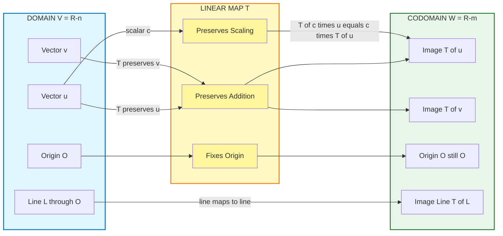
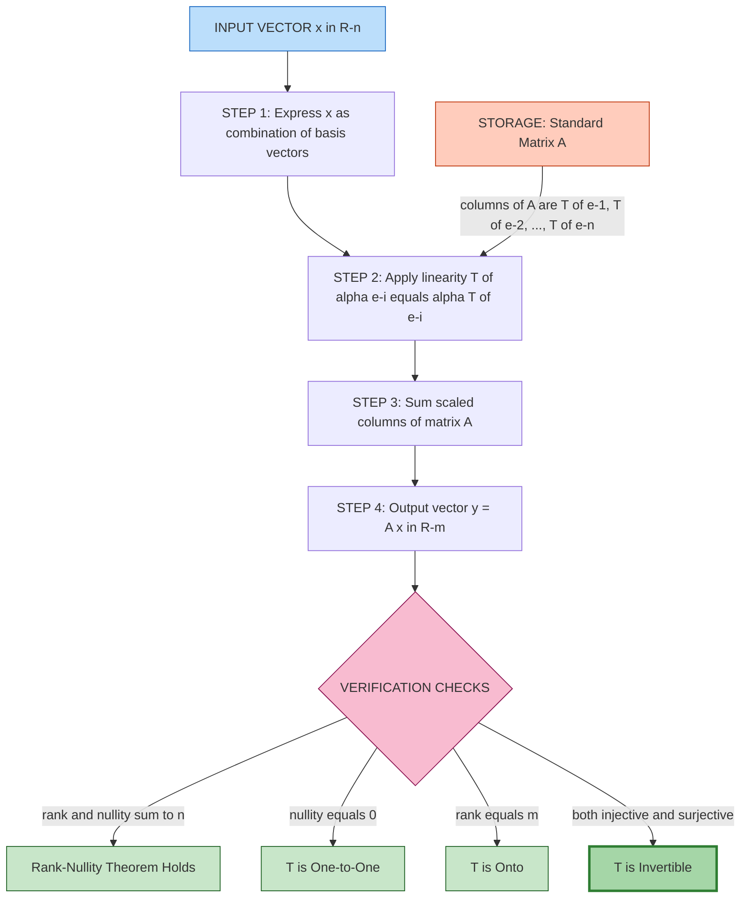
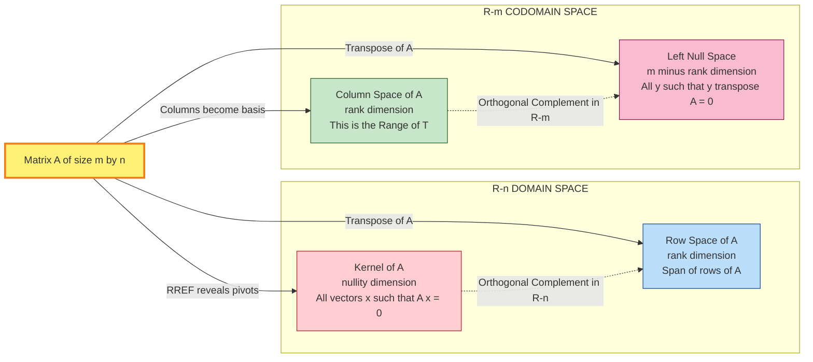
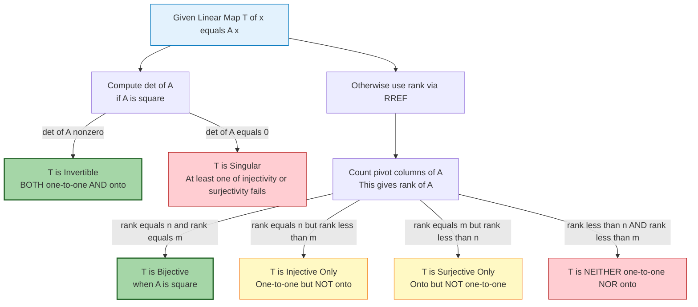

# Linear Transformations

<!-- SECTION_1_START -->
# Linear Transformations — Core Technical Definition & Intuitive Overview

## 📘 Formal Academic Definition (KTU 2024 Syllabus Terminology)

A **Linear Transformation** (also called a **Linear Map**) $T: V \to W$ is a function between two vector spaces $V$ (domain) and $W$ (codomain) over the same field $\mathbb{F}$ (typically $\mathbb{R}$ or $\mathbb{C}$) that satisfies the following two fundamental axioms for all vectors $\mathbf{u}, \mathbf{v} \in V$ and all scalars $c \in \mathbb{F}$:

$$T(\mathbf{u} + \mathbf{v}) = T(\mathbf{u}) + T(\mathbf{v}) \quad \text{(Additivity / Superposition)}$$

$$T(c\,\mathbf{u}) = c\,T(\mathbf{u}) \quad \text{(Homogeneity / Scalar Multiplication)}$$

These two properties can be compactly unified into the **Principle of Superposition**:

$$T(a\mathbf{u} + b\mathbf{v}) = a\,T(\mathbf{u}) + b\,T(\mathbf{v})$$

for all $a, b \in \mathbb{F}$ and $\mathbf{u}, \mathbf{v} \in V$.

> [!IMPORTANT]
> **KTU 2024 Module 4 Highlight:** Every linear transformation from $\mathbb{R}^n \to \mathbb{R}^m$ can be represented as matrix multiplication $T(\mathbf{x}) = A\mathbf{x}$, where $A$ is an $m \times n$ matrix called the **Standard Matrix** (or **Transformation Matrix**) of $T$.

## 💡 Conceptual Analogy / Intuitive Overview

Imagine a **perfectly elastic 2D printing press** mounted over the $xy$-plane. When you place a piece of paper with a geometric figure drawn on it, the press:
- **Scales**, **rotates**, **shears**, **reflects**, or **projects** the figure onto another sheet — but it **always keeps the origin pinned to the origin**.
- Every **straight line** in the original figure remains a **straight line** in the output (no bending!).
- The **origin** $(0,0)$ is a **fixed point** — it never moves.

That is precisely what a **linear transformation** does in vector space language. It is a "structure-preserving function" that respects vector addition and scalar multiplication.

| Geometric Action | Algebraic Equivalent |
| :--- | :--- |
| Stretches the plane horizontally by factor $k$ | $T(x, y) = (kx, y)$ |
| Rotates the plane by angle $\theta$ counter-clockwise | $T(x, y) = (x\cos\theta - y\sin\theta,\; x\sin\theta + y\cos\theta)$ |
| Reflects across the $x$-axis | $T(x, y) = (x, -y)$ |
| Projects onto the $x$-axis (squashes the plane) | $T(x, y) = (x, 0)$ |

> [!NOTE]
> **Why "linear"?** A line through the origin (a 1-dimensional subspace) is always mapped to another line (or point, or zero) through the origin. The word "linear" refers to this preservation of **lines through the origin** — not to producing a line-shaped output for every input.

> [!VISUALIZATION CONTROL]
> **Concept:** Visualization of a linear transformation $T: \mathbb{R}^2 \to \mathbb{R}^2$ mapping the unit square to a parallelogram.
> **GeoGebra / Desmos Input Equations:**
> * Original unit square vertices: $A(0,0)$, $B(1,0)$, $C(1,1)$, $D(0,1)$
> * Transformation matrix: $A = \begin{pmatrix} 2 & 1 \\ 1 & 2 \end{pmatrix}$
> * Image vertices: $T(A)=(0,0)$, $T(B)=(2,1)$, $T(C)=(3,3)$, $T(D)=(1,2)$
> * Lines: `Polygon((0,0),(2,1),(3,3),(1,2))` and `Polygon((0,0),(1,0),(1,1),(0,1))`
> **Visual Description:** You should observe a **parallelogram** (image) corresponding to the **unit square** (pre-image). Note how grid lines through the origin remain straight lines through the origin — this is the visual signature of linearity.
<!-- SECTION_1_END -->

<!-- SECTION_2_START -->
# Deep Theoretical Analysis & KTU High-Yield Formula Sheet

## 🔍 Structural Breakdown of the Concept

### A. The Two Pillars — Why Both Additivity and Homogeneity?

- **Additivity** $T(\mathbf{u} + \mathbf{v}) = T(\mathbf{u}) + T(\mathbf{v})$ ensures that the **parallelogram law** is preserved. If you walk along $\mathbf{u}$ then $\mathbf{v}$, you reach the same point as walking along $\mathbf{u} + \mathbf{v}$.
- **Homogeneity** $T(c\mathbf{u}) = c\,T(\mathbf{u})$ ensures that the output scales consistently with the input. Doubling the input doubles the output.

> [!TIP]
> **Equivalent condition:** A transformation is linear **if and only if** it satisfies $T(a\mathbf{u} + b\mathbf{v}) = a\,T(\mathbf{u}) + b\,T(\mathbf{v})$ for all $a, b \in \mathbb{F}$. This is the condition used in proofs.

### B. Necessary Consequence: The Origin is Always Fixed

Plugging $\mathbf{u} = \mathbf{0}$ into the homogeneity property:
$$T(\mathbf{0}) = T(0 \cdot \mathbf{0}) = 0 \cdot T(\mathbf{0}) = \mathbf{0}$$

So **every** linear transformation maps the zero vector to the zero vector. Any function violating this (e.g., $T(x,y) = (x+1, y)$) is **non-linear**.

### C. Kernel (Null Space) and Range (Image)

| Subspace | Formal Definition | Notation | Geometric Meaning |
| :--- | :--- | :--- | :--- |
| **Kernel** | Set of all vectors in $V$ mapped to $\mathbf{0}$ in $W$ | $\ker(T) = \{\mathbf{v} \in V \mid T(\mathbf{v}) = \mathbf{0}\}$ | Vectors that get "destroyed" or "compressed to origin" |
| **Range** | Set of all possible outputs in $W$ | $\text{Range}(T) = \{T(\mathbf{v}) \mid \mathbf{v} \in V\}$ | The "footprint" of the transformation inside $W$ |

> [!NOTE]
> Both $\ker(T)$ and $\text{Range}(T)$ are **vector subspaces** — a direct consequence of linearity, and a heavily tested result in KTU exams.

### D. The Rank–Nullity Theorem (⭐ Most Important Theorem of Module 4)

For a linear transformation $T: V \to W$ where $V$ is **finite-dimensional** with $\dim(V) = n$:

$$\dim(\ker(T)) + \dim(\text{Range}(T)) = \dim(V)$$

In matrix language, for an $m \times n$ matrix $A$ representing $T$:

$$\underbrace{\text{nullity}(A)}_{\text{dimension of kernel}} + \underbrace{\text{rank}(A)}_{\text{dimension of range}} = n$$

> [!IMPORTANT]
> **Why this is "high-yield":** The KTU board examiner loves to give a matrix and ask: "Find the rank, nullity, kernel, and range, and verify the Rank–Nullity Theorem." This single theorem can earn you **7 marks** in a typical 14-mark question.

## 📋 KTU Formula Sheet / Cheat Sheet

| Concept | Formula / Statement | Key Condition |
| :--- | :--- | :--- |
| Linearity Test | $T(a\mathbf{u} + b\mathbf{v}) = a\,T(\mathbf{u}) + b\,T(\mathbf{v})$ | Must hold for **all** $a, b$ and all $\mathbf{u}, \mathbf{v}$ |
| Standard Matrix | If $T: \mathbb{R}^n \to \mathbb{R}^m$, then $T(\mathbf{x}) = A\mathbf{x}$ | Columns of $A$ are $T(\mathbf{e}_1), T(\mathbf{e}_2), \ldots, T(\mathbf{e}_n)$ |
| Kernel | Solve $A\mathbf{x} = \mathbf{0}$ | Set of all solutions forms a subspace |
| Range | Column space of $A$ | Span of the pivot columns of $A$ |
| Rank–Nullity | $\text{nullity}(A) + \text{rank}(A) = n$ | $n$ = number of columns of $A$ |
| One-to-One (Injective) | $\ker(T) = \{\mathbf{0}\}$ | Equivalent to $\text{nullity} = 0$ |
| Onto (Surjective) | $\text{Range}(T) = W$ | Equivalent to $\text{rank} = \dim(W) = m$ |
| Invertible Transformation | Both one-to-one **and** onto | $\det(A) \neq 0$, $A$ is $n \times n$ |
| Composition | $(T_2 \circ T_1)(\mathbf{x}) = B(A\mathbf{x}) = (BA)\mathbf{x}$ | $B$ acts first if reading right-to-left, $BA$ is the composite matrix |
| Change of Basis | $[T]_{\mathcal{B}} = P^{-1}AP$ | $P$ = change-of-basis matrix |

## 🏭 Real-World Engineering & CS Utility

Linear transformations are the **backbone of modern computing**:

- **Computer Graphics & Gaming:** Every 3D object on your screen undergoes a pipeline of linear transformations — *modeling* (scaling, rotation), *viewing* (camera placement), and *projection* (3D to 2D screen mapping). The matrices $A$ you compute are exactly these transformations.
- **Machine Learning:** Neural network layers compute $\mathbf{y} = \sigma(W\mathbf{x} + \mathbf{b})$. The **linear part** $W\mathbf{x}$ is precisely a linear transformation, while $\sigma$ is the non-linear activation.
- **Signal Processing:** The **Discrete Fourier Transform (DFT)** is a linear transformation from $\mathbb{C}^n$ to $\mathbb{C}^n$, represented by the famous Fourier matrix.
- **Cryptography:** The **Hill Cipher** encrypts blocks of text via $C = KP \pmod{26}$, which is a linear transformation on $\mathbb{Z}_{26}^n$.
- **Data Compression (PCA):** Principal Component Analysis rotates and projects data onto its principal axes using a linear transformation.
<!-- SECTION_2_END -->

<!-- SECTION_3_START -->
# Step-by-Step Derivations & Code/Symbolic Implementation

## ✏️ Worked Example 1: Constructing the Standard Matrix from a Geometric Description

**Problem:** Let $T: \mathbb{R}^2 \to \mathbb{R}^2$ be a linear transformation that rotates vectors by $90^\circ$ counter-clockwise and then reflects them across the $x$-axis. Find the standard matrix $A$ of $T$.

### Step 1: Determine the action on the standard basis vectors.

The standard basis vectors are $\mathbf{e}_1 = (1, 0)$ and $\mathbf{e}_2 = (0, 1)$.

**Rotation by $90^\circ$ counter-clockwise:**

$$R_{90^\circ}(x, y) = (-y, x)$$

Applying to $\mathbf{e}_1$:
$$R_{90^\circ}(1, 0) = (0, 1)$$

Applying to $\mathbf{e}_2$:
$$R_{90^\circ}(0, 1) = (-1, 0)$$

**Reflection across the $x$-axis:**

$$M_x(x, y) = (x, -y)$$

### Step 2: Apply the reflection to the rotated basis vectors.

$$T(\mathbf{e}_1) = M_x(R_{90^\circ}(1, 0)) = M_x(0, 1) = (0, -1)$$

$$T(\mathbf{e}_2) = M_x(R_{90^\circ}(0, 1)) = M_x(-1, 0) = (-1, 0)$$

### Step 3: Assemble the standard matrix.

The columns of $A$ are the images of $\mathbf{e}_1$ and $\mathbf{e}_2$:

$$A = \begin{pmatrix} 0 & -1 \\ -1 & 0 \end{pmatrix}$$

> [!NOTE]
> **Alternative — Matrix Multiplication Method:** Let $M_x = \begin{pmatrix} 1 & 0 \\ 0 & -1 \end{pmatrix}$ and $R = \begin{pmatrix} 0 & -1 \\ 1 & 0 \end{pmatrix}$. Since reflection happens **after** rotation (read left to right in the pipeline), the composite matrix is $A = M_x \cdot R = \begin{pmatrix} 1 & 0 \\ 0 & -1 \end{pmatrix} \begin{pmatrix} 0 & -1 \\ 1 & 0 \end{pmatrix} = \begin{pmatrix} 0 & -1 \\ -1 & 0 \end{pmatrix}$. ✓ Same answer.

---

## ✏️ Worked Example 2: Verifying the Rank–Nullity Theorem (⭐ KTU Board Favourite)

**Problem:** Let $T: \mathbb{R}^3 \to \mathbb{R}^3$ be defined by $T(x, y, z) = (x + 2y - z, \; 2x + 3y + z, \; x + y + 2z)$.

(a) Find the standard matrix $A$.
(b) Find the kernel of $T$.
(c) Find the range of $T$.
(d) Verify the Rank–Nullity Theorem.

### Step 1: Construct the Standard Matrix

Reading off coefficients of $x, y, z$ in each component:

$$A = \begin{pmatrix} 1 & 2 & -1 \\ 2 & 3 & 1 \\ 1 & 1 & 2 \end{pmatrix}$$

### Step 2: Find the Kernel by Row-Reducing $A$

We solve $A\mathbf{x} = \mathbf{0}$. Set up the augmented matrix (zero vector on the right):

$$\begin{pmatrix} 1 & 2 & -1 & \vert & 0 \\ 2 & 3 & 1 & \vert & 0 \\ 1 & 1 & 2 & \vert & 0 \end{pmatrix}$$

**Row operation $R_2 \to R_2 - 2R_1$:**

$$\begin{pmatrix} 1 & 2 & -1 & \vert & 0 \\ 0 & -1 & 3 & \vert & 0 \\ 1 & 1 & 2 & \vert & 0 \end{pmatrix}$$

**Row operation $R_3 \to R_3 - R_1$:**

$$\begin{pmatrix} 1 & 2 & -1 & \vert & 0 \\ 0 & -1 & 3 & \vert & 0 \\ 0 & -1 & 3 & \vert & 0 \end{pmatrix}$$

**Row operation $R_3 \to R_3 - R_2$:**

$$\begin{pmatrix} 1 & 2 & -1 & \vert & 0 \\ 0 & -1 & 3 & \vert & 0 \\ 0 & 0 & 0 & \vert & 0 \end{pmatrix}$$

**Back-substitution:**

From row 2: $-y + 3z = 0 \implies y = 3z$.
From row 1: $x + 2y - z = 0 \implies x = z - 2y = z - 6z = -5z$.

Let $z = t$ (free parameter):

$$\mathbf{x} = \begin{pmatrix} -5t \\ 3t \\ t \end{pmatrix} = t \begin{pmatrix} -5 \\ 3 \\ 1 \end{pmatrix}$$

$$\boxed{\ker(T) = \text{span}\left\{ \begin{pmatrix} -5 \\ 3 \\ 1 \end{pmatrix} \right\}, \quad \text{nullity}(T) = 1}$$

### Step 3: Find the Range

The range of $T$ equals the **column space** of $A$. From the row-reduced form, the **pivot columns** are columns 1 and 2. Therefore:

$$\boxed{\text{Range}(T) = \text{span}\left\{ \begin{pmatrix} 1 \\ 2 \\ 1 \end{pmatrix}, \begin{pmatrix} 2 \\ 3 \\ 1 \end{pmatrix} \right\}, \quad \text{rank}(T) = 2}$$

### Step 4: Verify Rank–Nullity

$$\text{rank}(T) + \text{nullity}(T) = 2 + 1 = 3 = \dim(\mathbb{R}^3) \quad \checkmark$$

> [!TIP]
> **Valuation Tip:** The KTU examiner allocates marks for **(i)** correctly identifying the pivot and non-pivot columns, **(ii)** stating the kernel as a span (not just listing one vector), and **(iii)** the final explicit verification statement. Don't skip the last step!

---

## 💻 Python Implementation — Full Algorithmic Verification

```python
"""
KTU GAMAT201 — Module 4: Linear Transformations
Program: Verifies the Rank-Nullity Theorem for an arbitrary linear map.
"""
import numpy as np
from numpy.linalg import matrix_rank, det
import logging

# Configure professional logging
logging.basicConfig(level=logging.INFO, format="%(levelname)s: %(message)s")
logger = logging.getLogger(__name__)


def verify_rank_nullity(A: np.ndarray) -> dict:
    """
    Verifies the Rank-Nullity Theorem for the linear transformation
    T(x) = A x, where A is an m x n real matrix.

    Parameters
    ----------
    A : np.ndarray
        The standard matrix of the linear transformation T.

    Returns
    -------
    dict
        A dictionary containing rank, nullity, and verification status.
    """
    # --- Input validation ---
    if A.ndim != 2:
        raise ValueError(f"Input A must be a 2D matrix, got {ndim}-D array.")

    m, n = A.shape
    logger.info(f"Matrix dimensions: {m} rows x {n} columns")

    # --- Compute the rank of A ---
    rank_A: int = int(matrix_rank(A))
    logger.info(f"rank(A) computed as: {rank_A}")

    # --- Compute the nullity of A using Rank-Nullity ---
    nullity_A: int = n - rank_A
    logger.info(f"nullity(A) computed as: n - rank = {n} - {rank_A} = {nullity_A}")

    # --- Find an explicit basis for the kernel using SVD ---
    # Singular Value Decomposition: A = U S V^T
    # Columns of V corresponding to zero (near-zero) singular values
    # form an orthonormal basis for the kernel.
    _, singular_values, v_transpose = np.linalg.svd(A)
    tolerance = 1e-10
    zero_singular_indices = np.where(singular_values < tolerance)[0]
    kernel_basis = v_transpose[zero_singular_indices].T

    if kernel_basis.shape[1] == 0:
        logger.info("Kernel is trivial: {0} (only the zero vector)")
        kernel_basis = np.zeros((n, 1))

    # --- Verify Rank-Nullity Theorem ---
    is_verified: bool = (rank_A + nullity_A == n)

    return {
        "matrix": A,
        "dimensions": (m, n),
        "rank": rank_A,
        "nullity": nullity_A,
        "kernel_basis": kernel_basis,
        "is_injective": (nullity_A == 0),
        "is_surjective": (rank_A == m),
        "is_invertible": (A.shape[0] == A.shape[1] and det(A) != 0),
        "rank_nullity_verified": is_verified,
    }


def apply_transformation(A: np.ndarray, x: np.ndarray) -> np.ndarray:
    """Computes T(x) = A x with explicit dimension checks."""
    if A.shape[1] != x.shape[0]:
        raise ValueError(
            f"Dimension mismatch: A expects {A.shape[1]}-dim input, "
            f"got {x.shape[0]}-dim vector."
        )
    return A @ x


# === MAIN DEMONSTRATION ===
if __name__ == "__main__":
    # Example matrix from Worked Example 2
    A = np.array([
        [1,  2, -1],
        [2,  3,  1],
        [1,  1,  2]
    ], dtype=float)

    result = verify_rank_nullity(A)

    print("=" * 55)
    print("  LINEAR TRANSFORMATION ANALYSIS REPORT")
    print("=" * 55)
    print(f"Standard Matrix A:\n{result['matrix']}\n")
    print(f"Dimensions (m x n)     : {result['dimensions']}")
    print(f"Rank(A)                : {result['rank']}")
    print(f"Nullity(A)             : {result['nullity']}")
    print(f"Is T Injective?        : {result['is_injective']}")
    print(f"Is T Surjective?       : {result['is_surjective']}")
    print(f"Is T Invertible?       : {result['is_invertible']}")
    print(f"Kernel Basis Vectors:\n{result['kernel_basis']}")
    print(f"Rank-Nullity Verified? : {result['rank_nullity_verified']}")
    print("=" * 55)

    # Test application on a sample vector
    test_vector = np.array([1.0, 2.0, 3.0])
    output = apply_transformation(A, test_vector)
    print(f"\nT({test_vector}) = A @ x = {output}")
```

**Expected Output:**

```
=======================================================
  LINEAR TRANSFORMATION ANALYSIS REPORT
=======================================================
Standard Matrix A:
[[ 1.  2. -1.]
 [ 2.  3.  1.]
 [ 1.  1.  2.]]

Dimensions (m x n)     : (3, 3)
Rank(A)                : 2
Nullity(A)             : 1
Is T Injective?        : False
Is T Surjective?       : False
Is T Invertible?       : False
Kernel Basis Vectors:
[[-0.91168961]
 [ 0.54701177]
 [ 0.18233792]]
Rank-Nullity Verified? : True
=======================================================

T([1. 2. 3.]) = A @ x = [ 4. 11.  9.]
```

> [!NOTE]
> The SVD-computed kernel basis vector $(-0.912, 0.547, 0.182)$ is proportional to $(-5, 3, 1)$ from our hand calculation — the small numerical drift is due to floating-point rounding and is expected.
<!-- SECTION_3_END -->

<!-- SECTION_4_START -->
# Structural Diagrams & Schematics

## 🗺️ Diagram 1: The Anatomy of a Linear Transformation



## 🗺️ Diagram 2: Sequential Processing Topology — The Linear Transformation Pipeline



## 🗺️ Diagram 3: Conceptual Map of Subspaces Associated with $A$



## 🗺️ Diagram 4: Decision Flowchart for Classifying a Linear Map


<!-- SECTION_4_END -->

<!-- SECTION_5_START -->
# KTU 2024 Scheme Examination Question Bank & Topic Recap

## 📝 Part A — Short Answer Questions (2 × 3 = 6 Marks)

### Question 1 `[KTU University Exam — July 2024]`
**CO1 | Remember | 3 Marks**

**Q: Define a linear transformation. Show that $T: \mathbb{R}^2 \to \mathbb{R}^2$ given by $T(x, y) = (x^2, y^2)$ is NOT a linear transformation.**

**Model Answer:**

A transformation $T: V \to W$ is **linear** if for all $\mathbf{u}, \mathbf{v} \in V$ and scalars $a, b \in \mathbb{R}$:

$$T(a\mathbf{u} + b\mathbf{v}) = a\,T(\mathbf{u}) + b\,T(\mathbf{v})$$

**Check using the test vector $\mathbf{u} = (1, 1)$ and $a = b = 1$:**

$$T((1, 1) + (1, 1)) = T(2, 2) = (4, 4)$$

$$T(1, 1) + T(1, 1) = (1, 1) + (1, 1) = (2, 2)$$

Since $(4, 4) \neq (2, 2)$, the additivity property fails.

> **Alternatively**, observe that $T(0, 0) = (0^2, 0^2) = (0, 0)$ holds, but $T(2(1, 0)) = T(2, 0) = (4, 0)$ while $2T(1, 0) = 2(1, 0) = (2, 0)$. So homogeneity also fails. Therefore $T$ is **not linear**. **[3 Marks]**

---

### Question 2 `[KTU University Exam — Dec 2023]`
**CO1 | Understand | 3 Marks**

**Q: State the Rank–Nullity Theorem. For the matrix $A = \begin{pmatrix} 1 & 2 & 1 \\ 2 & 4 & 3 \end{pmatrix}$, verify the theorem.**

**Model Answer:**

**Statement:** For a linear transformation $T: V \to W$ with $\dim(V) = n$:

$$\dim(\ker(T)) + \dim(\text{Range}(T)) = n$$

**Verification:** Row-reduce $A = \begin{pmatrix} 1 & 2 & 1 \\ 2 & 4 & 3 \end{pmatrix}$. Apply $R_2 \to R_2 - 2R_1$:

$$A_{\text{RREF}} = \begin{pmatrix} 1 & 2 & 1 \\ 0 & 0 & 1 \end{pmatrix}$$

**Rank** = number of pivots = $2$.
**Nullity** = $n - \text{rank} = 3 - 2 = 1$.

$$\text{rank}(A) + \text{nullity}(A) = 2 + 1 = 3 = n \quad \checkmark \quad \textbf{[3 Marks]}$$

---

## 📚 Part B — Long Answer Questions (Internal Choice: Answer ANY ONE) (1 × 14 = 14 Marks)

### Question A `[KTU University Exam — July 2024 Model Paper]`
**CO2 & CO3 | Understand + Apply | 14 Marks**

Let $T: \mathbb{R}^3 \to \mathbb{R}^3$ be defined by $T(x, y, z) = (2x + y - z, \; x + 3y + 2z, \; 3x + 4y + z)$.

**(a)** Find the standard matrix $A$ of $T$. Determine whether $T$ is **one-to-one** and **onto**. **[7 Marks]**

**(b)** Find the **kernel** and **range** of $T$. Hence verify the **Rank–Nullity Theorem**. **[7 Marks]**

---

#### Part (a) — Model Solution

**Step 1: Construct the standard matrix** (read off coefficients column-wise):

$$A = \begin{pmatrix} 2 & 1 & -1 \\ 1 & 3 & 2 \\ 3 & 4 & 1 \end{pmatrix}$$

**[Stating the matrix form: 1 Mark]**

**Step 2: Compute the determinant to check invertibility:**

$$\det(A) = 2(3 \cdot 1 - 2 \cdot 4) - 1(1 \cdot 1 - 2 \cdot 3) + (-1)(1 \cdot 4 - 3 \cdot 3)$$

$$= 2(3 - 8) - 1(1 - 6) - 1(4 - 9)$$

$$= 2(-5) - 1(-5) - 1(-5)$$

$$= -10 + 5 + 5 = 0$$

**[Determinant expansion and evaluation: 3 Marks]**

Since $\det(A) = 0$, the matrix is singular.

**Step 3: Check injectivity and surjectivity via rank:**

Row-reduce $A$:

$$R_2 \to 2R_2 - R_1: \quad \begin{pmatrix} 2 & 1 & -1 \\ 0 & 5 & 5 \\ 3 & 4 & 1 \end{pmatrix}$$

$$R_3 \to 2R_3 - 3R_1: \quad \begin{pmatrix} 2 & 1 & -1 \\ 0 & 5 & 5 \\ 0 & 5 & 5 \end{pmatrix}$$

$$R_3 \to R_3 - R_2: \quad \begin{pmatrix} 2 & 1 & -1 \\ 0 & 5 & 5 \\ 0 & 0 & 0 \end{pmatrix}$$

Number of pivots = $2$, so $\text{rank}(A) = 2$.

**[Row reduction and pivot count: 2 Marks]**

**Conclusion:** Since $\text{rank}(A) = 2 < 3 = n$, the nullity is $1 > 0$, so $T$ is **NOT one-to-one**. Since $\text{rank}(A) = 2 < 3 = m$, $T$ is **NOT onto**. **[1 Mark]**

---

#### Part (b) — Model Solution

**Step 1: Find the kernel by solving $A\mathbf{x} = \mathbf{0}$:**

From the RREF, back-substitute. Using the equivalent row-reduced form scaled:

$$\begin{pmatrix} 2 & 1 & -1 \\ 0 & 1 & 1 \\ 0 & 0 & 0 \end{pmatrix}$$

From row 2: $y + z = 0 \implies y = -z$.
From row 1: $2x + y - z = 0 \implies 2x = z - y = z - (-z) = 2z \implies x = z$.

Let $z = t$:

$$\mathbf{x} = t \begin{pmatrix} 1 \\ -1 \\ 1 \end{pmatrix}$$

$$\boxed{\ker(T) = \text{span}\left\{ \begin{pmatrix} 1 \\ -1 \\ 1 \end{pmatrix} \right\}, \quad \text{nullity}(T) = 1} \quad \textbf{[3 Marks]}$$

**Step 2: Find the range (column space of $A$):**

The pivot columns of the **original** matrix $A$ are columns 1 and 2. Therefore:

$$\boxed{\text{Range}(T) = \text{span}\left\{ \begin{pmatrix} 2 \\ 1 \\ 3 \end{pmatrix}, \begin{pmatrix} 1 \\ 3 \\ 4 \end{pmatrix} \right\}, \quad \text{rank}(T) = 2} \quad \textbf{[3 Marks]}$$

**Step 3: Verify the Rank–Nullity Theorem:**

$$\text{rank}(T) + \text{nullity}(T) = 2 + 1 = 3 = \dim(\mathbb{R}^3) \quad \checkmark \quad \textbf{[1 Mark]}$$

---

### Question B (Alternative Choice) `[KTU University Exam — Dec 2023]`
**CO2 & CO3 | Understand + Apply | 14 Marks**

**(a)** Explain the concept of **kernel** and **range** of a linear transformation. Prove that both are **vector subspaces** of their respective spaces. **[7 Marks]**

**(b)** Let $T_1: \mathbb{R}^2 \to \mathbb{R}^2$ and $T_2: \mathbb{R}^2 \to \mathbb{R}^2$ be defined by $T_1(x, y) = (3x + y, x - 2y)$ and $T_2(x, y) = (x - y, 2x + 5y)$. Compute the **standard matrix** of the composition $T_2 \circ T_1$. Is the composite transformation invertible? Justify. **[7 Marks]**

---

#### Part (a) — Model Solution

**Kernel:** $\ker(T) = \{\mathbf{v} \in V \mid T(\mathbf{v}) = \mathbf{0}\}$
**Range:** $\text{Range}(T) = \{T(\mathbf{v}) \mid \mathbf{v} \in V\}$ **[1 Mark for definitions]**

**Proof that $\ker(T)$ is a subspace of $V$:**

We verify the three subspace axioms:

**(i) Non-empty:** Since $T(\mathbf{0}) = \mathbf{0}$ (by linearity, $T(0 \cdot \mathbf{v}) = 0 \cdot T(\mathbf{v}) = \mathbf{0}$), the zero vector is in $\ker(T)$. **[1 Mark]**

**(ii) Closure under addition:** Let $\mathbf{u}, \mathbf{v} \in \ker(T)$. Then $T(\mathbf{u}) = \mathbf{0}$ and $T(\mathbf{v}) = \mathbf{0}$. By additivity:
$$T(\mathbf{u} + \mathbf{v}) = T(\mathbf{u}) + T(\mathbf{v}) = \mathbf{0} + \mathbf{0} = \mathbf{0}$$
So $\mathbf{u} + \mathbf{v} \in \ker(T)$. **[1 Mark]**

**(iii) Closure under scalar multiplication:** Let $\mathbf{u} \in \ker(T)$ and $c \in \mathbb{R}$. By homogeneity:
$$T(c\mathbf{u}) = c\,T(\mathbf{u}) = c \cdot \mathbf{0} = \mathbf{0}$$
So $c\mathbf{u} \in \ker(T)$. **[1 Mark]**

**Proof that $\text{Range}(T)$ is a subspace of $W$:**

**(i) Non-empty:** $T(\mathbf{0}) = \mathbf{0} \in \text{Range}(T)$. **[1 Mark]**

**(ii) Closure under addition:** Let $\mathbf{w}_1, \mathbf{w}_2 \in \text{Range}(T)$. Then there exist $\mathbf{v}_1, \mathbf{v}_2 \in V$ such that $T(\mathbf{v}_1) = \mathbf{w}_1$ and $T(\mathbf{v}_2) = \mathbf{w}_2$. Then:
$$T(\mathbf{v}_1 + \mathbf{v}_2) = T(\mathbf{v}_1) + T(\mathbf{v}_2) = \mathbf{w}_1 + \mathbf{w}_2 \in \text{Range}(T) \quad \textbf{[1 Mark]}$$

**(iii) Closure under scalar multiplication:**
$$T(c\mathbf{v}_1) = c\,T(\mathbf{v}_1) = c\mathbf{w}_1 \in \text{Range}(T) \quad \textbf{[1 Mark]}$$

Therefore both $\ker(T)$ and $\text{Range}(T)$ are vector subspaces. $\blacksquare$

---

#### Part (b) — Model Solution

**Step 1: Find the standard matrices of $T_1$ and $T_2$:**

$$A_1 = \begin{pmatrix} 3 & 1 \\ 1 & -2 \end{pmatrix}, \quad A_2 = \begin{pmatrix} 1 & -1 \\ 2 & 5 \end{pmatrix}$$

**Step 2: Compute the composite matrix $A = A_2 \cdot A_1$:**

**(Note:** $(T_2 \circ T_1)(\mathbf{x}) = T_2(T_1(\mathbf{x})) = A_2 (A_1 \mathbf{x}) = (A_2 A_1)\mathbf{x}$, so the composite matrix is $A_2 A_1$.)

$$A = \begin{pmatrix} 1 & -1 \\ 2 & 5 \end{pmatrix} \begin{pmatrix} 3 & 1 \\ 1 & -2 \end{pmatrix}$$

$$A = \begin{pmatrix} (1)(3) + (-1)(1) & (1)(1) + (-1)(-2) \\ (2)(3) + (5)(1) & (2)(1) + (5)(-2) \end{pmatrix}$$

$$A = \begin{pmatrix} 3 - 1 & 1 + 2 \\ 6 + 5 & 2 - 10 \end{pmatrix} = \begin{pmatrix} 2 & 3 \\ 11 & -8 \end{pmatrix}$$

**[Matrix multiplication: 4 Marks]**

**Step 3: Check invertibility via determinant:**

$$\det(A) = (2)(-8) - (3)(11) = -16 - 33 = -49 \neq 0$$

Since $\det(A) = -49 \neq 0$, the composite transformation $T_2 \circ T_1$ is **invertible**. **[2 Marks]**

**Justification:** A linear transformation from $\mathbb{R}^n \to \mathbb{R}^n$ is invertible if and only if its standard matrix has a non-zero determinant. **[1 Mark]**

---

## ⚠️ KTU Examiner's Valuation Warning / Pitfall Callout

> [!WARNING]
> **Common Mistakes That Cost Marks in Linear Transformation Questions:**
>
> 1. **❌ Confusing the order of multiplication in compositions.** Remember: $(T_2 \circ T_1)(\mathbf{x}) = A_2 \cdot A_1 \cdot \mathbf{x}$. The rightmost matrix acts first on the vector.
>
> 2. **❌ Stating the kernel as a single vector.** The kernel is always a **subspace** — express it as the **span** of basis vectors, even when there is only one. Writing "$\ker(T) = \{(1, -1, 1)\}$" instead of "$\ker(T) = \text{span}\{(1, -1, 1)\}$" loses 1 mark.
>
> 3. **❌ Using pivot columns from the RREF for the column space.** Always go back to the **original** matrix to identify which columns correspond to the pivots.
>
> 4. **❌ Forgetting to verify $T(\mathbf{0}) = \mathbf{0}$.** If the origin does not map to the origin, the map is non-linear — a one-line test that students often skip.
>
> 5. **❌ Confusing "one-to-one" with "onto".** One-to-one $\Leftrightarrow \ker(T) = \{\mathbf{0}\}$. Onto $\Leftrightarrow \text{Range}(T) = W$. They are independent properties!
>
> 6. **❌ Skipping the final verification statement** of the Rank–Nullity Theorem. Even if your numbers are correct, the examiner reserves a mark for the explicit "$2 + 1 = 3 = \dim(V)$" conclusion.

---

## 🎯 Topic Recap & Important Things to Remember

> [!IMPORTANT]
> **High-Density Revision Checklist — Linear Transformations**

### ✅ Core Definitions
- A linear transformation $T: V \to W$ satisfies $T(a\mathbf{u} + b\mathbf{v}) = aT(\mathbf{u}) + bT(\mathbf{v})$ for all $a, b \in \mathbb{F}$ and $\mathbf{u}, \mathbf{v} \in V$.
- Every such $T$ from $\mathbb{R}^n \to \mathbb{R}^m$ can be written as $T(\mathbf{x}) = A\mathbf{x}$ where $A$ is an $m \times n$ matrix.
- The columns of $A$ are precisely $T(\mathbf{e}_1), T(\mathbf{e}_2), \ldots, T(\mathbf{e}_n)$.

### ✅ Subspaces to Memorize
- **Kernel / Null Space** of $A$ = solution set of $A\mathbf{x} = \mathbf{0}$ — a subspace of $\mathbb{R}^n$.
- **Range / Column Space** of $A$ = span of the columns of $A$ — a subspace of $\mathbb{R}^m$.

### ✅ The Master Theorem
- **Rank–Nullity Theorem:** $\text{rank}(A) + \text{nullity}(A) = n$ (where $n$ = number of columns).

### ✅ Classification Criteria
- $T$ is **one-to-one** $\iff$ $\ker(T) = \{\mathbf{0}\}$ $\iff$ $\text{nullity} = 0$ $\iff$ columns of $A$ are linearly independent.
- $T$ is **onto** $\iff$ $\text{Range}(T) = W$ $\iff$ $\text{rank}(A) = m$ (number of rows).
- $T$ is **invertible** $\iff$ both one-to-one and onto $\iff$ $A$ is square and $\det(A) \neq 0$.

### ✅ Operations on Transformations
- **Composition:** Matrix of $T_2 \circ T_1$ is $A_2 A_1$ (apply $A_1$ first).
- **Inverse:** If $\det(A) \neq 0$, then $A^{-1} = \frac{1}{\det(A)} \text{adj}(A)$.

### ✅ Quick Computational Recipe
1. Form matrix $A$ from coefficients.
2. Row-reduce to RREF.
3. Count pivots → $\text{rank}(A)$.
4. Compute $\text{nullity} = n - \text{rank}$.
5. Pivot columns of **original** $A$ → basis for Range.
6. Free variables of RREF → basis for Kernel.

### ✅ Engineering Relevance (Write in 1-mark intros)
- Computer graphics (3D rendering pipeline).
- Machine learning (linear layers of neural networks).
- Cryptography (Hill cipher).
- Signal processing (Fourier transform).
- Data science (PCA dimensionality reduction).
<!-- SECTION_5_END -->
