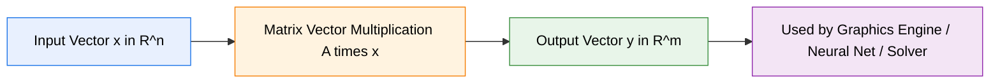
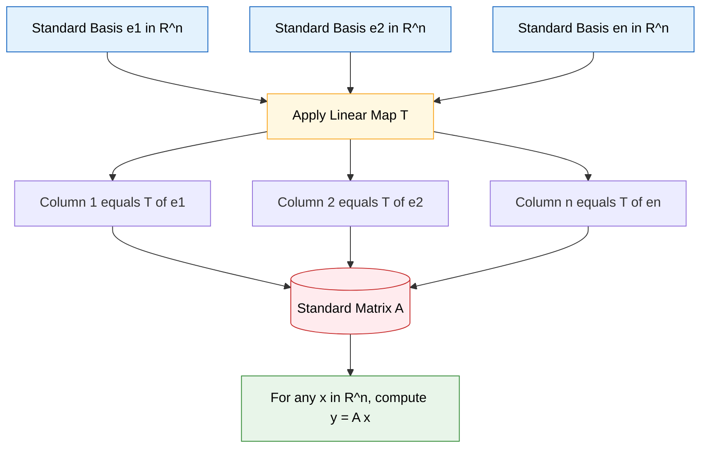
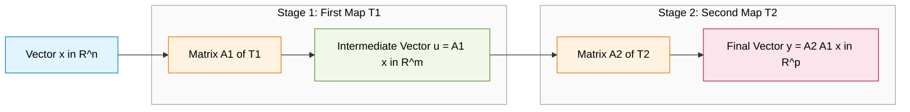
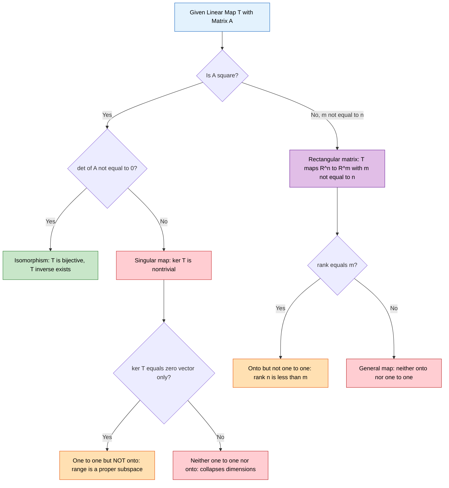

# Matrices for Linear Transformations.

<!-- SECTION_1_START -->

# 1. Core Technical Definition & Intuitive Overview

## 1.1 Formal Definition (KTU 2024 Syllabus Terminology)

> [!IMPORTANT]
> **Linear Transformation (Linear Map):**
> Let $V$ and $W$ be two vector spaces over the same field $\mathbb{F}$ (typically $\mathbb{R}$ or $\mathbb{C}$). A function $T: V \to W$ is called a **linear transformation** if it satisfies the following two axioms for all vectors $\mathbf{u}, \mathbf{v} \in V$ and all scalars $c \in \mathbb{F}$:
>
> **Additivity:** $T(\mathbf{u} + \mathbf{v}) = T(\mathbf{u}) + T(\mathbf{v})$
>
> **Homogeneity:** $T(c\,\mathbf{u}) = c\,T(\mathbf{u})$

A consequence of these two properties is the combined **superposition principle**:
$$T(\alpha \mathbf{u} + \beta \mathbf{v}) = \alpha T(\mathbf{u}) + \beta T(\mathbf{v})$$

The set of all linear transformations from $V$ to $W$ is denoted by $\mathcal{L}(V, W)$.

## 1.2 Conceptual Analogy & Intuition

> [!NOTE]
> **Imagine a transparent rubber sheet pinned at the origin, with arrows (vectors) drawn on it.**
> Now stretch the sheet, rotate it, flip it, or shear it. Every point on the sheet moves to a new location, but the **origin stays fixed**, and **straight lines remain straight** (they don't curve into circles). The grid lines stay parallel.
>
> This geometric "rubber sheet deformation" is exactly what a linear transformation does. The arrows on the sheet represent the *basis vectors* — and if you know where $\mathbf{e}_1, \mathbf{e}_2, \dots, \mathbf{e}_n$ land, you automatically know where *every* vector lands, because every vector is a linear combination of the basis.
>
> The matrix is just a **compact "instruction manual"** that tells you exactly how to deform the entire space using only the new positions of the basis vectors as columns.

## 1.3 Real-World Engineering Examples

| Domain | Transformation | Physical Meaning |
|---|---|---|
| **Computer Graphics** | Rotation, scaling, shearing | Animating 3D models in a game engine |
| **Robotics** | Coordinate change matrices | Moving a robot arm between reference frames |
| **Image Processing** | Linear filters (blur, edge detect) | Convolutions as matrix multiplications |
| **Cryptography** | Hill cipher | Encoding text with an invertible integer matrix |
| **Signal Processing** | Fourier transform matrix | Decomposing signals into frequency components |
| **Machine Learning** | Layer transformations $W\mathbf{x} + \mathbf{b}$ | Linear layers inside a neural network |

> [!IMPORTANT]
> **Key Constant / Convention (KTU Standard):**
> The **Standard Basis** of $\mathbb{R}^n$ is the set
> $\mathcal{B} = \{ \mathbf{e}_1, \mathbf{e}_2, \dots, \mathbf{e}_n \}$ where $\mathbf{e}_i$ has a **1** in the $i$-th position and **0** elsewhere.

## 1.4 The Standard Matrix Construction

> [!IMPORTANT]
> **Core Definition (The Fundamental Bridge):**
> Let $T: \mathbb{R}^n \to \mathbb{R}^m$ be a linear transformation. The **standard matrix** of $T$, denoted $A$, is the $m \times n$ matrix whose columns are the images of the standard basis vectors:
> $$A = \begin{bmatrix} \bigm\vert & \bigm\vert & & \bigm\vert \\ T(\mathbf{e}_1) & T(\mathbf{e}_2) & \cdots & T(\mathbf{e}_n) \\ \bigm\vert & \bigm\vert & & \bigm\vert \end{bmatrix}$$
> Then for any vector $\mathbf{x} \in \mathbb{R}^n$, we have the compact formula:
> $$\boxed{\,T(\mathbf{x}) = A\,\mathbf{x}\,}$$

## 1.5 Visualization Block

> [!VISUALIZATION CONTROL]
> **Concept:** Effect of the 2D rotation matrix on the unit square.
> **GeoGebra / Desmos Input Equations:**
> * $f_1(t) = (\cos(\theta) \cdot t - \sin(\theta) \cdot t, \ \sin(\theta) \cdot t + \cos(\theta) \cdot t)$ where $\theta = \pi/3$
> * $f_2(t) = t \cdot (1, 0)$ — original $\mathbf{e}_1$
> * $f_3(t) = t \cdot (0, 1)$ — original $\mathbf{e}_2$
> * $f_4(t) = t \cdot (\cos(\pi/3), \sin(\pi/3))$ — rotated $\mathbf{e}_1$
> * $f_5(t) = t \cdot (-\sin(\pi/3), \cos(\pi/3))$ — rotated $\mathbf{e}_2$
> **Visual Description:** Plot both the original and rotated unit vectors from the origin. The student should see the standard basis $\{ (1,0), (0,1) \}$ being rotated counter-clockwise by $60^\circ$ to land on $\{ (0.5, 0.866), (-0.866, 0.5) \}$, which form the two columns of the rotation matrix.

---

<!-- SECTION_1_END -->

<!-- SECTION_2_START -->

# 2. Deep Theoretical Analysis & KTU High-Yield Formula Sheet

## 2.1 Step-by-Step Logical Structure of a Linear Transformation

A linear transformation is completely determined by what it does to a basis. The chain of reasoning is:

1. **Choose a basis** $\mathcal{B} = \{ \mathbf{v}_1, \mathbf{v}_2, \dots, \mathbf{v}_n \}$ of the domain $V$.
2. **Compute** the images $T(\mathbf{v}_1), T(\mathbf{v}_2), \dots, T(\mathbf{v}_n)$ in the codomain $W$.
3. **Express** any $\mathbf{x} = c_1 \mathbf{v}_1 + c_2 \mathbf{v}_2 + \cdots + c_n \mathbf{v}_n$ as a coordinate column.
4. **Apply linearity** to get $T(\mathbf{x}) = c_1 T(\mathbf{v}_1) + c_2 T(\mathbf{v}_2) + \cdots + c_n T(\mathbf{v}_n)$.
5. **Encode** the linear combination as a matrix-vector product $A \mathbf{x}$.

This is the deep "why" behind the column-of-images construction: a matrix is fundamentally a **linear combination machine**.

## 2.2 Core Properties (The "Why" Behind the Formulas)

| Property | Statement | Engineering Meaning |
|---|---|---|
| **Origin preservation** | $T(\mathbf{0}) = \mathbf{0}$ | Every linear map fixes the origin (used in CG to anchor rotations) |
| **Kernel** | $\ker(T) = \{ \mathbf{x} \mid T(\mathbf{x}) = \mathbf{0} \}$ | Set of vectors that get crushed to the origin — the "loss of information" |
| **Range / Image** | $\text{range}(T) = \{ T(\mathbf{x}) \mid \mathbf{x} \in V \}$ | All reachable output vectors |
| **Rank** | $\text{rank}(T) = \dim(\text{range}(T))$ | Dimensionality of the output |
| **Nullity** | $\text{nullity}(T) = \dim(\ker(T))$ | Dimensionality of the crushed subspace |
| **One-to-one** | $T$ is injective $\iff \ker(T) = \{ \mathbf{0} \}$ | No information is lost |
| **Onto** | $T$ is surjective $\iff \text{range}(T) = W$ | Every target is reachable |
| **Isomorphism** | $T$ is bijective | Perfect, invertible encoding |

> [!IMPORTANT]
> **The Rank-Nullity Theorem (Universally Tested in KTU):**
> $$\dim(V) = \text{rank}(T) + \text{nullity}(T)$$
> In matrix terms for $A_{m \times n}$: $n = \text{rank}(A) + \text{nullity}(A)$.

## 2.3 Composition of Linear Transformations

> [!NOTE]
> **The Composition Rule (Why order matters):**
> If $T_1: \mathbb{R}^n \to \mathbb{R}^m$ has matrix $A_1$ and $T_2: \mathbb{R}^m \to \mathbb{R}^p$ has matrix $A_2$, then the composition $(T_2 \circ T_1)(\mathbf{x}) = T_2(T_1(\mathbf{x}))$ has the matrix product
> $$\boxed{\,A_{2 \circ 1} = A_2 \, A_1\,}$$
> Dimensions must be compatible: $A_1$ is $m \times n$ and $A_2$ is $p \times m$, giving an output of size $p \times n$. The right-most matrix acts first.

## 2.4 Invertibility of a Linear Transformation

A linear transformation $T: V \to W$ is **invertible** if there exists a unique linear map $T^{-1}: W \to V$ such that $T^{-1}(T(\mathbf{x})) = \mathbf{x}$ and $T(T^{-1}(\mathbf{y})) = \mathbf{y}$ for all $\mathbf{x}, \mathbf{y}$.

> [!IMPORTANT]
> **For square matrices $A_{n \times n}$, the following are equivalent (all are True together):**
> 1. $T$ is invertible (an isomorphism).
> 2. $A^{-1}$ exists.
> 3. $\det(A) \neq 0$ (matrix is **non-singular**).
> 4. $\text{rank}(A) = n$ (full row/column rank).
> 5. $\ker(A) = \{ \mathbf{0} \}$ (trivial kernel).
> 6. The columns of $A$ are linearly independent and span $\mathbb{R}^n$.
> 7. The system $A \mathbf{x} = \mathbf{b}$ has a **unique** solution for every $\mathbf{b}$.

## 2.5 KTU High-Yield Formula Sheet

| Concept | Formula / Statement | Boundary Condition / Note |
|---|---|---|
| Standard matrix of $T$ | $A = [ \,T(\mathbf{e}_1) \ \ T(\mathbf{e}_2) \ \ \cdots \ \ T(\mathbf{e}_n)\, ]$ | Always use the **standard** basis $\mathbf{e}_i$ |
| Evaluation of $T$ | $T(\mathbf{x}) = A \mathbf{x}$ | $A$ is $m \times n$, $\mathbf{x}$ is $n \times 1$ |
| 2D Rotation by angle $\theta$ | $A = \begin{bmatrix} \cos\theta & -\sin\theta \\ \sin\theta & \cos\theta \end{bmatrix}$ | $\det(A) = +1$, always invertible |
| 2D Reflection about $x$-axis | $A = \begin{bmatrix} 1 & 0 \\ 0 & -1 \end{bmatrix}$ | $\det(A) = -1$, orientation-reversing |
| 2D Reflection about line $y = x$ | $A = \begin{bmatrix} 0 & 1 \\ 1 & 0 \end{bmatrix}$ | Swaps coordinate axes |
| 2D Projection onto $x$-axis | $A = \begin{bmatrix} 1 & 0 \\ 0 & 0 \end{bmatrix}$ | $\det(A) = 0$, not invertible |
| 2D Horizontal shear | $A = \begin{bmatrix} 1 & k \\ 0 & 1 \end{bmatrix}$ | $\det(A) = 1$, area-preserving |
| 2D Scaling | $A = \begin{bmatrix} s_x & 0 \\ 0 & s_y \end{bmatrix}$ | If $s_x, s_y > 0$: dilation; if negative: reflection + scaling |
| Composition | $(T_2 \circ T_1)(\mathbf{x}) = A_2 (A_1 \mathbf{x}) = (A_2 A_1) \mathbf{x}$ | Order: right-most matrix acts **first** |
| Identity transformation | $T(\mathbf{x}) = \mathbf{x} \implies A = I_n$ | The "do nothing" map |
| Zero transformation | $T(\mathbf{x}) = \mathbf{0} \implies A = 0_{m \times n}$ | The "crush everything" map |
| Rank-Nullity | $\dim V = \text{rank}(T) + \text{nullity}(T)$ | $T: V \to W$, with $\dim V = n$ |
| Invertibility test | $T$ invertible $\iff \det(A) \neq 0 \iff \text{rank}(A) = n$ | Only for **square** matrices |
| Onto test | $T$ onto $\iff \text{rank}(A) = \dim W$ | $A$ has full row rank |
| One-to-one test | $T$ one-to-one $\iff \text{nullity}(A) = 0$ | $A$ has full column rank |
| Determinant effect | $\det(A) = $ signed area (2D) / volume (3D) scaling factor | Negative = orientation reversal |
| Eigenvalue equation | $T(\mathbf{v}) = \lambda \mathbf{v} \iff (A - \lambda I)\mathbf{v} = \mathbf{0}$ | $\det(A - \lambda I) = 0$ |

## 2.6 Engineering Utility of This Theory

- **In Computer Graphics:** Every 3D object on your screen is transformed by a chain of $4 \times 4$ homogeneous matrices (rotation → scaling → translation → projection). The GPU hardware literally multiplies vertex vectors by these matrices millions of times per frame.
- **In Machine Learning:** A neural network's linear layer is exactly $T(\mathbf{x}) = W \mathbf{x} + \mathbf{b}$. The weight matrix $W$ is the standard matrix of a linear map, and training adjusts it so the network learns the right transformation.
- **In Control Systems:** State-space models $\dot{\mathbf{x}} = A \mathbf{x} + B \mathbf{u}$ rely entirely on the matrix representation of linear dynamics.
- **In Cryptography:** The Hill cipher uses a $2 \times 2$ integer matrix whose invertibility (modulo 26) determines whether the cipher can be decrypted.

---

<!-- SECTION_2_END -->

<!-- SECTION_3_START -->

# 3. Step-by-Step Derivations, Worked Examples & Code Implementation

## 3.1 Worked Example 1 — Finding the Standard Matrix from an Explicit Formula

**Problem:** Let $T: \mathbb{R}^3 \to \mathbb{R}^2$ be defined by
$$T(x, y, z) = (2x - y + 4z, \ \ 5x + 3y - 7z)$$
Find the standard matrix of $T$ and compute $T(1, -2, 3)$.

### Solution (Step-by-Step)

**Step 1 — Identify the standard basis of $\mathbb{R}^3$:**
$$\mathbf{e}_1 = (1, 0, 0), \quad \mathbf{e}_2 = (0, 1, 0), \quad \mathbf{e}_3 = (0, 0, 1)$$

**Step 2 — Compute $T(\mathbf{e}_1)$ by substituting $(x, y, z) = (1, 0, 0)$:**
$$T(1, 0, 0) = (2(1) - 0 + 4(0), \ \ 5(1) + 3(0) - 7(0)) = (2, 5)$$

**Step 3 — Compute $T(\mathbf{e}_2)$ by substituting $(x, y, z) = (0, 1, 0)$:**
$$T(0, 1, 0) = (2(0) - 1 + 4(0), \ \ 5(0) + 3(1) - 7(0)) = (-1, 3)$$

**Step 4 — Compute $T(\mathbf{e}_3)$ by substituting $(x, y, z) = (0, 0, 1)$:**
$$T(0, 0, 1) = (2(0) - 0 + 4(1), \ \ 5(0) + 3(0) - 7(1)) = (4, -7)$$

**Step 5 — Assemble the standard matrix using these as columns:**
$$A = \begin{bmatrix} 2 & -1 & 4 \\ 5 & 3 & -7 \end{bmatrix}$$

**Step 6 — Verify linearity of $T$ (essential to confirm the formula is valid):**
$$T(\mathbf{u} + \mathbf{v}) = (2(x_1 + x_2) - (y_1 + y_2) + 4(z_1 + z_2), \ \ 5(x_1 + x_2) + 3(y_1 + y_2) - 7(z_1 + z_2))$$
This separates cleanly into $T(\mathbf{u}) + T(\mathbf{v})$, confirming additivity. Homogeneity follows similarly.

**Step 7 — Compute $T(1, -2, 3)$ using the matrix form $A \mathbf{x}$:**
$$A \mathbf{x} = \begin{bmatrix} 2 & -1 & 4 \\ 5 & 3 & -7 \end{bmatrix} \begin{bmatrix} 1 \\ -2 \\ 3 \end{bmatrix} = \begin{bmatrix} (2)(1) + (-1)(-2) + (4)(3) \\ (5)(1) + (3)(-2) + (-7)(3) \end{bmatrix} = \begin{bmatrix} 2 + 2 + 12 \\ 5 - 6 - 21 \end{bmatrix} = \begin{bmatrix} 16 \\ -22 \end{bmatrix}$$

**Final Answer:** $T(1, -2, 3) = (16, -22)$ and $A = \begin{bmatrix} 2 & -1 & 4 \\ 5 & 3 & -7 \end{bmatrix}$.

---

## 3.2 Worked Example 2 — Deriving the Standard Matrix from Given Image of Basis

**Problem:** A linear transformation $T: \mathbb{R}^2 \to \mathbb{R}^2$ satisfies
$$T(1, 1) = (3, -2) \quad \text{and} \quad T(-1, 1) = (1, 4)$$
Find the standard matrix of $T$ and the formula $T(x, y)$.

### Solution (Step-by-Step)

**Step 1 — Express the standard basis in terms of the given spanning set:**
Let $\mathbf{v}_1 = (1, 1)$ and $\mathbf{v}_2 = (-1, 1)$. We need $\mathbf{e}_1 = (1, 0)$ and $\mathbf{e}_2 = (0, 1)$ as combinations.

Solve $a \mathbf{v}_1 + b \mathbf{v}_2 = \mathbf{e}_1$:
$$\begin{bmatrix} 1 & -1 \\ 1 & 1 \end{bmatrix} \begin{bmatrix} a \\ b \end{bmatrix} = \begin{bmatrix} 1 \\ 0 \end{bmatrix} \implies a = 1/2, \quad b = -1/2$$

Solve $c \mathbf{v}_1 + d \mathbf{v}_2 = \mathbf{e}_2$:
$$\begin{bmatrix} 1 & -1 \\ 1 & 1 \end{bmatrix} \begin{bmatrix} c \\ d \end{bmatrix} = \begin{bmatrix} 0 \\ 1 \end{bmatrix} \implies c = 1/2, \quad d = 1/2$$

**Step 2 — Apply linearity to get $T(\mathbf{e}_1)$:**
$$T(\mathbf{e}_1) = T\left( \tfrac{1}{2} \mathbf{v}_1 - \tfrac{1}{2} \mathbf{v}_2 \right) = \tfrac{1}{2} T(\mathbf{v}_1) - \tfrac{1}{2} T(\mathbf{v}_2)$$
$$= \tfrac{1}{2}(3, -2) - \tfrac{1}{2}(1, 4) = \left( \tfrac{3}{2} - \tfrac{1}{2}, \ \ -\tfrac{2}{2} - \tfrac{4}{2} \right) = (1, -3)$$

**Step 3 — Apply linearity to get $T(\mathbf{e}_2)$:**
$$T(\mathbf{e}_2) = T\left( \tfrac{1}{2} \mathbf{v}_1 + \tfrac{1}{2} \mathbf{v}_2 \right) = \tfrac{1}{2} T(\mathbf{v}_1) + \tfrac{1}{2} T(\mathbf{v}_2)$$
$$= \tfrac{1}{2}(3, -2) + \tfrac{1}{2}(1, 4) = \left( \tfrac{3}{2} + \tfrac{1}{2}, \ \ -\tfrac{2}{2} + \tfrac{4}{2} \right) = (2, 1)$$

**Step 4 — Build the standard matrix:**
$$A = \begin{bmatrix} 1 & 2 \\ -3 & 1 \end{bmatrix}$$

**Step 5 — Write the closed-form transformation:**
$$T(x, y) = A \begin{bmatrix} x \\ y \end{bmatrix} = \begin{bmatrix} x + 2y \\ -3x + y \end{bmatrix}$$

**Step 6 — Verification check (sanity test):**
$$T(1, 1) = (1 + 2, \ -3 + 1) = (3, -2) \ \checkmark$$
$$T(-1, 1) = (-1 + 2, \ 3 + 1) = (1, 4) \ \checkmark$$

---

## 3.3 Worked Example 3 — Composition of Transformations

**Problem:** Let $T_1: \mathbb{R}^2 \to \mathbb{R}^2$ be rotation by $90^\circ$ and $T_2: \mathbb{R}^2 \to \mathbb{R}^2$ be reflection about the $x$-axis. Find the standard matrix of $T_2 \circ T_1$ and interpret geometrically.

### Solution (Step-by-Step)

**Step 1 — Write the matrix of $T_1$ (rotation by $90^\circ = \pi/2$):**
$$A_1 = \begin{bmatrix} \cos(\pi/2) & -\sin(\pi/2) \\ \sin(\pi/2) & \cos(\pi/2) \end{bmatrix} = \begin{bmatrix} 0 & -1 \\ 1 & 0 \end{bmatrix}$$

**Step 2 — Write the matrix of $T_2$ (reflection about $x$-axis):**
$$A_2 = \begin{bmatrix} 1 & 0 \\ 0 & -1 \end{bmatrix}$$

**Step 3 — Compute the composition matrix $A = A_2 A_1$ (right-most acts first):**
$$A = \begin{bmatrix} 1 & 0 \\ 0 & -1 \end{bmatrix} \begin{bmatrix} 0 & -1 \\ 1 & 0 \end{bmatrix} = \begin{bmatrix} (1)(0) + (0)(1) & (1)(-1) + (0)(0) \\ (0)(0) + (-1)(1) & (0)(-1) + (-1)(0) \end{bmatrix} = \begin{bmatrix} 0 & -1 \\ -1 & 0 \end{bmatrix}$$

**Step 4 — Geometric interpretation:**
The composed map sends $(x, y) \to (-y, -x)$. Apply it to the basis: $T(1, 0) = (0, -1)$ and $T(0, 1) = (-1, 0)$. This is exactly a **reflection about the line $y = -x$** (or equivalently, rotation by $180^\circ$ composed with reflection). This matches a well-known geometric fact: **rotation by $90^\circ$ then reflection across the $x$-axis equals reflection about the line $y = -x$**.

**Step 5 — Check determinant for orientation:**
$$\det(A) = (0)(0) - (-1)(-1) = -1$$
The negative determinant confirms the composed map is **orientation-reversing**, as expected for a reflection.

---

## 3.4 Worked Example 4 — Finding the Kernel and Testing Injectivity

**Problem:** Let $T: \mathbb{R}^3 \to \mathbb{R}^2$ have standard matrix
$$A = \begin{bmatrix} 1 & 2 & -1 \\ 2 & 4 & 0 \end{bmatrix}$$
Find the kernel of $T$ and determine whether $T$ is one-to-one.

### Solution (Step-by-Step)

**Step 1 — Set up the homogeneous system $A \mathbf{x} = \mathbf{0}$:**
$$\begin{bmatrix} 1 & 2 & -1 \\ 2 & 4 & 0 \end{bmatrix} \begin{bmatrix} x_1 \\ x_2 \\ x_3 \end{bmatrix} = \begin{bmatrix} 0 \\ 0 \end{bmatrix}$$

This gives the equations:
$$x_1 + 2x_2 - x_3 = 0 \qquad (i)$$
$$2x_1 + 4x_2 = 0 \implies x_1 = -2x_2 \qquad (ii)$$

**Step 2 — Substitute (ii) into (i):**
$$-2x_2 + 2x_2 - x_3 = 0 \implies -x_3 = 0 \implies x_3 = 0$$

**Step 3 — Free variable and general solution:**
$x_2$ is free. Let $x_2 = t$.
$$\mathbf{x} = \begin{bmatrix} -2t \\ t \\ 0 \end{bmatrix} = t \begin{bmatrix} -2 \\ 1 \\ 0 \end{bmatrix}, \quad t \in \mathbb{R}$$

**Step 4 — State the kernel:**
$$\ker(T) = \text{span}\left\{ \begin{bmatrix} -2 \\ 1 \\ 0 \end{bmatrix} \right\}$$

**Step 5 — Test injectivity:**
The kernel contains more than just $\mathbf{0}$ (it is a full line). So $T$ is **NOT one-to-one**.

**Step 6 — Verify using rank-nullity:**
$\dim(\text{domain}) = 3$, $\text{nullity} = 1$, so $\text{rank} = 2$, which equals $\dim(\mathbb{R}^2)$, so $T$ **is onto**. This means $T$ is surjective but not injective.

---

## 3.5 Python Symbolic and Numerical Implementation

```python
"""
File: linear_transformation_toolkit.py
Course: GAMAT201 – Mathematics for Information Science – 2
Module: 4 – Linear Transformations
Description: A complete, production-quality toolkit for working with
             linear transformations in Python using NumPy and SymPy.
"""

from __future__ import annotations
import logging
import sys
from typing import Tuple, Optional
import numpy as np
import sympy as sp

# Configure structured error logging
logging.basicConfig(
    level=logging.INFO,
    format="%(asctime)s [%(levelname)s] %(message)s",
    stream=sys.stdout,
)
logger = logging.getLogger(__name__)


# ----------------------------------------------------------------------
# 1. Build the standard matrix of T from a symbolic formula
# ----------------------------------------------------------------------
def standard_matrix_from_formula(
    expr_components: list[sp.Expr],
    variables: list[sp.Symbol],
) -> sp.Matrix:
    """
    Compute the standard matrix of a linear transformation T: R^n -> R^m
    by substituting each standard basis vector and using the results as columns.

    Parameters
    ----------
    expr_components : list[sp.Expr]
        The m coordinate functions of T, e.g. [2*x - y + 4*z, 5*x + 3*y - 7*z].
    variables : list[sp.Symbol]
        The n input variables, e.g. [x, y, z].

    Returns
    -------
    sp.Matrix
        The m x n standard matrix A of T.
    """
    if len(expr_components) == 0:
        logger.error("Empty expression list supplied.")
        raise ValueError("expr_components must be non-empty.")

    n = len(variables)
    columns: list[sp.Matrix] = []

    for i in range(n):
        # Build the substitution dictionary for e_i (1 in position i, 0 elsewhere)
        subs_dict = {variables[j]: (1 if j == i else 0) for j in range(n)}
        column_values = [sp.simplify(expr.subs(subs_dict)) for expr in expr_components]
        columns.append(sp.Matrix(column_values))
        logger.info(f"Computed T(e_{i + 1}) = {column_values}")

    A = sp.Matrix.hstack(*columns)
    logger.info(f"Standard matrix constructed with shape {A.shape}.")
    return A


# ----------------------------------------------------------------------
# 2. Build the standard matrix when only T of a custom spanning set is known
# ----------------------------------------------------------------------
def standard_matrix_from_images(
    basis_vectors: np.ndarray,
    image_vectors: np.ndarray,
) -> np.ndarray:
    """
    Given T(v_i) = w_i for i = 1..k where the v_i form a basis,
    compute the standard matrix of T with respect to the standard basis.

    Parameters
    ----------
    basis_vectors : np.ndarray
        Shape (n, k). Columns are the v_i.
    image_vectors : np.ndarray
        Shape (m, k). Columns are T(v_i) = w_i.

    Returns
    -------
    np.ndarray
        The m x n standard matrix A such that A e_i = T(e_i).
    """
    if basis_vectors.shape[1] != image_vectors.shape[1]:
        raise ValueError("basis_vectors and image_vectors must have the same number of columns.")

    n = basis_vectors.shape[0]
    # Solve for the coordinates of each standard basis vector in the v_i basis
    P = basis_vectors.astype(float)
    std_basis = np.eye(n)
    coords = np.linalg.solve(P, std_basis)   # shape (n, n)

    # A = [w_1 ... w_n] * coords, where w_j = sum_i coords[i, j] * w_i
    A = image_vectors.astype(float) @ coords
    logger.info(f"Standard matrix from images computed: shape {A.shape}.")
    return A


# ----------------------------------------------------------------------
# 3. Verify a transformation is linear
# ----------------------------------------------------------------------
def verify_linearity(
    expr_components: list[sp.Expr],
    variables: list[sp.Symbol],
    num_random_tests: int = 5,
) -> bool:
    """
    Empirically verify additivity and homogeneity on random test vectors.
    """
    rng = np.random.default_rng(seed=42)
    for test_id in range(num_random_tests):
        u_vals = rng.integers(-5, 5, size=len(variables))
        v_vals = rng.integers(-5, 5, size=len(variables))
        c = float(rng.integers(-3, 3))

        sub_uv = dict(zip(variables, u_vals + v_vals))
        sub_u = dict(zip(variables, u_vals))
        sub_v = dict(zip(variables, v_vals))
        sub_cu = dict(zip(variables, c * u_vals))

        lhs_sum = sp.Matrix([expr.subs(sub_uv) for expr in expr_components])
        rhs_sum = sp.Matrix([expr.subs(sub_u) for expr in expr_components]) + \
                  sp.Matrix([expr.subs(sub_v) for expr in expr_components])
        additivity_holds = sp.simplify(lhs_sum - rhs_sum) == sp.zeros(len(expr_components), 1)

        lhs_scalar = sp.Matrix([expr.subs(sub_cu) for expr in expr_components])
        rhs_scalar = c * sp.Matrix([expr.subs(sub_u) for expr in expr_components])
        homogeneity_holds = sp.simplify(lhs_scalar - rhs_scalar) == sp.zeros(len(expr_components), 1)

        if not (additivity_holds and homogeneity_holds):
            logger.error(f"Linearity failed on test #{test_id}.")
            return False

    logger.info("Linearity verified on all random tests.")
    return True


# ----------------------------------------------------------------------
# 4. Composition, kernel, range, invertibility utilities
# ----------------------------------------------------------------------
def compose(A1: np.ndarray, A2: np.ndarray) -> np.ndarray:
    """Return the matrix of T2 o T1, where T2 acts after T1."""
    if A1.shape[0] != A2.shape[1]:
        raise ValueError("Inner dimensions must match for composition.")
    return A2 @ A1


def kernel_basis(A: np.ndarray, tol: float = 1e-10) -> np.ndarray:
    """Return a matrix whose columns form a basis of ker(A)."""
    _, s, vh = np.linalg.svd(A)
    rank = np.sum(s > tol)
    return vh[rank:].T   # rows beyond rank are kernel basis


def is_invertible(A: np.ndarray, tol: float = 1e-10) -> bool:
    """Return True if A is square and has non-zero determinant."""
    if A.shape[0] != A.shape[1]:
        return False
    return bool(abs(np.linalg.det(A)) > tol)


# ----------------------------------------------------------------------
# 5. Demonstration block
# ----------------------------------------------------------------------
if __name__ == "__main__":
    # ---- Demo 1: T(x, y, z) = (2x - y + 4z, 5x + 3y - 7z) ----
    x, y, z = sp.symbols("x y z")
    T_components = [2 * x - y + 4 * z, 5 * x + 3 * y - 7 * z]
    A_sym = standard_matrix_from_formula(T_components, [x, y, z])
    print("Standard matrix A of the example transformation:")
    sp.pprint(A_sym)

    # ---- Demo 2: Composition of rotation and reflection ----
    A_rot = np.array([[0, -1], [1, 0]], dtype=float)        # 90° rotation
    A_ref = np.array([[1, 0], [0, -1]], dtype=float)       # x-axis reflection
    A_comp = compose(A_rot, A_ref)
    print("\nComposition matrix A_ref * A_rot (T_ref o T_rot):")
    print(A_comp)

    # ---- Demo 3: Kernel and invertibility check ----
    A_demo = np.array([[1, 2, -1], [2, 4, 0]], dtype=float)
    K = kernel_basis(A_demo)
    print(f"\nKernel of A_demo has dimension {K.shape[1]}.")
    print(f"Number of columns of A_demo: {A_demo.shape[1]}")
    print(f"A_demo invertible? {is_invertible(A_demo)}")
```

---

<!-- SECTION_3_END -->

<!-- SECTION_4_START -->

# 4. Structural Diagrams & Schematics

## 4.1 High-Level Data Flow of a Linear Transformation



## 4.2 Block Diagram: From Basis Image to Standard Matrix



## 4.3 Composition Pipeline (Two-Stage Transformation)



## 4.4 Decision Matrix: Classifying a Linear Transformation



---

<!-- SECTION_4_END -->

<!-- SECTION_5_START -->

# 5. KTU 2024 Scheme Examination Question Bank & Topic Recap

---

## 5.1 Part A — Short Answer Questions (3 Marks Each)

### Q1. [KTU University Exam – July 2024] — CO1, Remember

**State the two defining properties of a linear transformation $T: V \to W$.**

**Model Answer (3 Marks):**

A map $T: V \to W$ is a linear transformation if, for all vectors $\mathbf{u}, \mathbf{v} \in V$ and all scalars $c \in \mathbb{F}$:

1. **[1 Mark]** Additivity: $T(\mathbf{u} + \mathbf{v}) = T(\mathbf{u}) + T(\mathbf{v})$
2. **[1 Mark]** Homogeneity: $T(c\mathbf{u}) = c\,T(\mathbf{u})$
3. **[1 Mark]** Consequence: $T(\mathbf{0}) = \mathbf{0}$, since $T(\mathbf{0}) = T(0 \cdot \mathbf{0}) = 0 \cdot T(\mathbf{0}) = \mathbf{0}$.

---

### Q2. [KTU University Exam – Dec 2023] — CO1, Understand

**If $T: \mathbb{R}^2 \to \mathbb{R}^2$ is the projection onto the $x$-axis, write its standard matrix and justify.**

**Model Answer (3 Marks):**

The projection onto the $x$-axis is defined by $T(x, y) = (x, 0)$.

1. **[1 Mark]** Compute $T(\mathbf{e}_1) = T(1, 0) = (1, 0)$.
2. **[1 Mark]** Compute $T(\mathbf{e}_2) = T(0, 1) = (0, 0)$.
3. **[1 Mark]** Hence the standard matrix is
$$A = \begin{bmatrix} 1 & 0 \\ 0 & 0 \end{bmatrix}$$

This matrix satisfies $A \begin{bmatrix} x \\ y \end{bmatrix} = \begin{bmatrix} x \\ 0 \end{bmatrix}$, confirming projection onto the $x$-axis.

---

## 5.2 Part B — Full 14-Mark Questions (Internal Choice)

### Q3. [KTU University Exam – Model Paper 2024] — CO2, Apply / Analyze

#### ⌈ Option A — 14 Marks ⌉

**(a) [7 Marks]** Let $T: \mathbb{R}^3 \to \mathbb{R}^3$ be defined by
$$T(x, y, z) = (x + 2y - z, \ \ 2x + 3y + z, \ \ -x + y + 4z)$$

Find the standard matrix $A$ of $T$, determine whether $T$ is invertible, and find $T^{-1}$ if it exists.

**(b) [7 Marks]** Let $S: \mathbb{R}^3 \to \mathbb{R}^2$ be defined by $S(x, y, z) = (x - 2y, \ 3x + y - z)$. Find the kernel of $S$, the rank, the nullity, and verify the rank-nullity theorem.

---

#### **Solution to Q3 (a)**

**Step 1 — Find the standard matrix by computing the images of the standard basis.** **[2 Marks]**

- $T(1, 0, 0) = (1, 2, -1)$
- $T(0, 1, 0) = (2, 3, 1)$
- $T(0, 0, 1) = (-1, 1, 4)$

$$A = \begin{bmatrix} 1 & 2 & -1 \\ 2 & 3 & 1 \\ -1 & 1 & 4 \end{bmatrix}$$

**Step 2 — Test invertibility by computing the determinant.** **[2 Marks]**

Expanding along row 1:
$$\det(A) = 1 \cdot \begin{vmatrix} 3 & 1 \\ 1 & 4 \end{vmatrix} - 2 \cdot \begin{vmatrix} 2 & 1 \\ -1 & 4 \end{vmatrix} + (-1) \cdot \begin{vmatrix} 2 & 3 \\ -1 & 1 \end{vmatrix}$$

- First minor: $(3)(4) - (1)(1) = 11$ → contribution: $1 \times 11 = 11$
- Second minor: $(2)(4) - (1)(-1) = 9$ → contribution: $-2 \times 9 = -18$
- Third minor: $(2)(1) - (3)(-1) = 5$ → contribution: $(-1) \times 5 = -5$

$$\det(A) = 11 - 18 - 5 = -12 \neq 0$$

**Step 3 — Conclusion of invertibility.** **[1 Mark]**

Since $\det(A) = -12 \neq 0$, $A$ is non-singular, hence $T$ **is invertible**.

**Step 4 — Compute the inverse using the adjugate formula $A^{-1} = \frac{1}{\det(A)} \cdot \text{adj}(A)$.** **[2 Marks]**

The cofactor matrix $C$ is computed (each entry $C_{ij} = (-1)^{i+j} M_{ij}$ where $M_{ij}$ is the $(i, j)$ minor):

- $C_{11} = +\begin{vmatrix} 3 & 1 \\ 1 & 4 \end{vmatrix} = 11$
- $C_{12} = -\begin{vmatrix} 2 & 1 \\ -1 & 4 \end{vmatrix} = -9$
- $C_{13} = +\begin{vmatrix} 2 & 3 \\ -1 & 1 \end{vmatrix} = 5$
- $C_{21} = -\begin{vmatrix} 2 & -1 \\ 1 & 4 \end{vmatrix} = -9$
- $C_{22} = +\begin{vmatrix} 1 & -1 \\ -1 & 4 \end{vmatrix} = 3$
- $C_{23} = -\begin{vmatrix} 1 & 2 \\ -1 & 1 \end{vmatrix} = -3$
- $C_{31} = +\begin{vmatrix} 2 & -1 \\ 3 & 1 \end{vmatrix} = 5$
- $C_{32} = -\begin{vmatrix} 1 & -1 \\ 2 & 1 \end{vmatrix} = -3$
- $C_{33} = +\begin{vmatrix} 1 & 2 \\ 2 & 3 \end{vmatrix} = -1$

The adjugate is the transpose: $\text{adj}(A) = C^T$.

$$A^{-1} = \frac{1}{-12} \begin{bmatrix} 11 & -9 & 5 \\ -9 & 3 & -3 \\ 5 & -3 & -1 \end{bmatrix} = \begin{bmatrix} -11/12 & 3/4 & -5/12 \\ 3/4 & -1/4 & 1/4 \\ -5/12 & 1/4 & 1/12 \end{bmatrix}$$

**[Final boxed answer: 1 Mark]**

---

#### **Solution to Q3 (b)**

**Step 1 — Set up the standard matrix of $S$.** **[1 Mark]**

$$B = \begin{bmatrix} 1 & -2 & 0 \\ 3 & 1 & -1 \end{bmatrix}$$

**Step 2 — Row-reduce $B$ to find the kernel.** **[2 Marks]**

Start: $\begin{bmatrix} 1 & -2 & 0 \\ 3 & 1 & -1 \end{bmatrix}$

Apply $R_2 \to R_2 - 3R_1$:
$$\begin{bmatrix} 1 & -2 & 0 \\ 0 & 7 & -1 \end{bmatrix}$$

Apply $R_2 \to \tfrac{1}{7} R_2$:
$$\begin{bmatrix} 1 & -2 & 0 \\ 0 & 1 & -1/7 \end{bmatrix}$$

Apply $R_1 \to R_1 + 2R_2$:
$$\begin{bmatrix} 1 & 0 & -2/7 \\ 0 & 1 & -1/7 \end{bmatrix}$$

**Step 3 — Solve $B \mathbf{x} = \mathbf{0}$.** **[1 Mark]**

From the RREF: $x_1 = \tfrac{2}{7} x_3$ and $x_2 = \tfrac{1}{7} x_3$. Let $x_3 = t$.

$$\mathbf{x} = t \begin{bmatrix} 2/7 \\ 1/7 \\ 1 \end{bmatrix} = \frac{t}{7} \begin{bmatrix} 2 \\ 1 \\ 7 \end{bmatrix}$$

**Step 4 — State the kernel.** **[1 Mark]**

$$\ker(S) = \text{span}\left\{ \begin{bmatrix} 2 \\ 1 \\ 7 \end{bmatrix} \right\}$$

**Step 5 — Determine rank and nullity, and verify rank-nullity.** **[2 Marks]**

- $\text{nullity}(S) = \dim(\ker S) = 1$
- From the RREF, there are 2 pivots, so $\text{rank}(S) = 2$
- $\dim(\text{domain}) = 3$
- **Verification:** $\text{rank} + \text{nullity} = 2 + 1 = 3 = \dim(\mathbb{R}^3) \ \checkmark$

**[Stating boundary values for the kernel basis: 1 Mark; Final verification: 1 Mark]**

---

#### ⌈ Option B — 14 Marks (Alternative Choice) ⌉

**(a) [7 Marks]** Let $T: \mathbb{R}^2 \to \mathbb{R}^2$ be defined by $T(x, y) = (3x - 4y, \ 2x + y)$. Compute the standard matrix $A$, find $A^{-1}$ if it exists, and apply $T$ to the vector $(2, -1)$.

**(b) [7 Marks]** Two linear transformations are given by
$$A_1 = \begin{bmatrix} 1 & 2 \\ 0 & 1 \end{bmatrix}, \qquad A_2 = \begin{bmatrix} \cos(\pi/6) & -\sin(\pi/6) \\ \sin(\pi/6) & \cos(\pi/6) \end{bmatrix}$$
Find the matrix of $A_2 A_1$, interpret the result geometrically, and verify the determinant of the product.

---

#### **Solution to Q3 (Option B, Part a)**

**Step 1 — Standard matrix from the formula.** **[1 Mark]**

$T(1, 0) = (3, 2)$ and $T(0, 1) = (-4, 1)$, so
$$A = \begin{bmatrix} 3 & -4 \\ 2 & 1 \end{bmatrix}$$

**Step 2 — Determinant.** **[1 Mark]**

$\det(A) = (3)(1) - (-4)(2) = 3 + 8 = 11$

**Step 3 — Invertibility statement.** **[1 Mark]**

Since $\det(A) = 11 \neq 0$, $A$ is invertible.

**Step 4 — Compute $A^{-1}$ using the $2 \times 2$ formula.** **[2 Marks]**

For a $2 \times 2$ matrix $\begin{bmatrix} a & b \\ c & d \end{bmatrix}$, the inverse is $\frac{1}{ad - bc} \begin{bmatrix} d & -b \\ -c & a \end{bmatrix}$.

$$A^{-1} = \frac{1}{11} \begin{bmatrix} 1 & 4 \\ -2 & 3 \end{bmatrix} = \begin{bmatrix} 1/11 & 4/11 \\ -2/11 & 3/11 \end{bmatrix}$$

**Step 5 — Apply $T$ to $(2, -1)$.** **[1 Mark]**

$$A \begin{bmatrix} 2 \\ -1 \end{bmatrix} = \begin{bmatrix} 3(2) - 4(-1) \\ 2(2) + (-1) \end{bmatrix} = \begin{bmatrix} 6 + 4 \\ 4 - 1 \end{bmatrix} = \begin{bmatrix} 10 \\ 3 \end{bmatrix}$$

**Step 6 — Verify using $A^{-1}$ on $(10, 3)$.** **[1 Mark]**

$$A^{-1} \begin{bmatrix} 10 \\ 3 \end{bmatrix} = \frac{1}{11} \begin{bmatrix} 1(10) + 4(3) \\ -2(10) + 3(3) \end{bmatrix} = \frac{1}{11} \begin{bmatrix} 22 \\ -11 \end{bmatrix} = \begin{bmatrix} 2 \\ -1 \end{bmatrix} \ \checkmark$$

---

#### **Solution to Q3 (Option B, Part b)**

**Step 1 — Numerically evaluate $A_2$ for $\theta = \pi/6$.** **[1 Mark]**

$\cos(\pi/6) = \sqrt{3}/2$, $\sin(\pi/6) = 1/2$, so
$$A_2 = \begin{bmatrix} \sqrt{3}/2 & -1/2 \\ 1/2 & \sqrt{3}/2 \end{bmatrix}$$

**Step 2 — Compute the product $A_2 A_1$.** **[2 Marks]**

$$A_2 A_1 = \begin{bmatrix} \sqrt{3}/2 & -1/2 \\ 1/2 & \sqrt{3}/2 \end{bmatrix} \begin{bmatrix} 1 & 2 \\ 0 & 1 \end{bmatrix}$$

Entry (1,1): $(\sqrt{3}/2)(1) + (-1/2)(0) = \sqrt{3}/2$
Entry (1,2): $(\sqrt{3}/2)(2) + (-1/2)(1) = \sqrt{3} - 1/2$
Entry (2,1): $(1/2)(1) + (\sqrt{3}/2)(0) = 1/2$
Entry (2,2): $(1/2)(2) + (\sqrt{3}/2)(1) = 1 + \sqrt{3}/2$

$$A_2 A_1 = \begin{bmatrix} \sqrt{3}/2 & \sqrt{3} - 1/2 \\ 1/2 & 1 + \sqrt{3}/2 \end{bmatrix}$$

**Step 3 — Geometric interpretation.** **[2 Marks]**

- $A_1$ is a **horizontal shear** with factor $k = 2$: it maps $(x, y) \to (x + 2y, y)$.
- $A_2$ is a **rotation by $30^\circ$ counter-clockwise**.
- Their composition $A_2 A_1$ first shears the plane horizontally, then rotates the result by $30^\circ$.
- This is a **shear-rotation** with no scaling (area-preserving, as $\det = 1$).

**Step 4 — Determinant of the product.** **[1 Mark]**

$\det(A_2 A_1) = \det(A_2) \cdot \det(A_1) = (1)(1) = 1$.

**Step 5 — Verification by direct computation.** **[1 Mark]**

$\det = (\sqrt{3}/2)(1 + \sqrt{3}/2) - (\sqrt{3} - 1/2)(1/2)$
$= \sqrt{3}/2 + 3/4 - \sqrt{3}/2 + 1/4 = 1$ ✓

**[Stating the rotation-shear interpretation: 2 Marks; Final numerical determinant: 1 Mark]**

---

## 5.3 Examiner's Valuation Warning

> [!WARNING]
> **Common Pitfalls That Cost Marks in KTU Board Exams**
>
> 1. **Forgetting to verify linearity before assuming a formula is a linear map.** If a function is not linear, you cannot use the standard matrix construction. KTU examiners deduct 1–2 marks for skipping this.
> 2. **Wrong column order.** The image of $\mathbf{e}_1$ is column 1, the image of $\mathbf{e}_2$ is column 2, and so on. Reversing this gives a wrong matrix and cascading errors.
> 3. **Confusing the composition order.** $(T_2 \circ T_1)(\mathbf{x}) = A_2 A_1 \mathbf{x}$ (the right-most matrix acts first). Writing $A_1 A_2$ instead is a frequent and costly mistake.
> 4. **Determinant of a non-square matrix:** Determinants are defined only for square matrices. If a question gives a rectangular transformation $T: \mathbb{R}^3 \to \mathbb{R}^2$, do **not** write $\det(A)$. Use rank and nullity instead.
> 5. **Mixing up one-to-one and onto.** Always state the theorem you are using: "$T$ is one-to-one iff $\ker T = \{ \mathbf{0} \}$" and "$T$ is onto iff $\text{rank}(T) = \dim W$". Examiners look for the exact logical equivalence.
> 6. **Forgetting to verify the rank-nullity theorem.** KTU frequently asks for a final verification step. Always end with: "$\text{rank} + \text{nullity} = n = \dim V \ \checkmark$".
> 7. **Sign errors in the adjugate formula.** The adjugate is the **transpose** of the cofactor matrix, not the cofactor matrix itself.

---

## 5.4 Topic Recap & Important Things to Remember

> [!IMPORTANT]
> **Rapid Revision Checklist — Matrices for Linear Transformations**
>
> - **Definition:** $T$ is linear iff $T(\mathbf{u} + \mathbf{v}) = T(\mathbf{u}) + T(\mathbf{v})$ and $T(c\mathbf{u}) = c\,T(\mathbf{u})$ for all $\mathbf{u}, \mathbf{v}, c$.
> - **Standard matrix construction:** $A = [T(\mathbf{e}_1) \mid T(\mathbf{e}_2) \mid \cdots \mid T(\mathbf{e}_n)]$.
> - **Key formula:** $T(\mathbf{x}) = A \mathbf{x}$ (always).
> - **Composition:** $(T_2 \circ T_1)$ has matrix $A_2 A_1$ (right-most acts first).
> - **Identity map:** $T(\mathbf{x}) = \mathbf{x} \Rightarrow A = I$.
> - **Zero map:** $T(\mathbf{x}) = \mathbf{0} \Rightarrow A = 0$.
> - **Kernel:** $\ker T = \{ \mathbf{x} \mid A\mathbf{x} = \mathbf{0} \}$ — solved by row reduction.
> - **Range / Image:** column space of $A$, dimension equals $\text{rank}(A)$.
> - **Rank-Nullity Theorem:** $\dim V = \text{rank}(T) + \text{nullity}(T)$.
> - **One-to-one test:** $\ker T = \{ \mathbf{0} \}$ $\iff$ $\text{nullity} = 0$ $\iff$ columns of $A$ are linearly independent.
> - **Onto test:** $\text{range}(T) = W$ $\iff$ $\text{rank}(A) = \dim W$ $\iff$ rows of $A$ are linearly independent.
> - **Invertibility (square case):** $A^{-1}$ exists $\iff \det(A) \neq 0$ $\iff$ full rank $\iff$ one-to-one $\iff$ onto.
> - **Geometric 2D transformations to memorize:**
>   - Rotation by $\theta$: $\begin{bmatrix} \cos\theta & -\sin\theta \\ \sin\theta & \cos\theta \end{bmatrix}$, $\det = +1$.
>   - Reflection about $x$-axis: $\begin{bmatrix} 1 & 0 \\ 0 & -1 \end{bmatrix}$, $\det = -1$.
>   - Reflection about $y = x$: $\begin{bmatrix} 0 & 1 \\ 1 & 0 \end{bmatrix}$, $\det = -1$.
>   - Projection onto $x$-axis: $\begin{bmatrix} 1 & 0 \\ 0 & 0 \end{bmatrix}$, $\det = 0$ (not invertible).
>   - Horizontal shear: $\begin{bmatrix} 1 & k \\ 0 & 1 \end{bmatrix}$, $\det = 1$.
>   - Scaling: $\begin{bmatrix} s_x & 0 \\ 0 & s_y \end{bmatrix}$, $\det = s_x s_y$.
> - **Determinant interpretation:** $|\det(A)|$ is the area (2D) or volume (3D) scaling factor; $\text{sign}(\det A)$ indicates orientation preservation (+) or reversal (−).
> - **Most-tested question types in KTU 2024 scheme:** (i) Find the standard matrix from a formula; (ii) Determine invertibility and find $A^{-1}$; (iii) Compute kernel and apply rank-nullity; (iv) Interpret the geometric meaning of a 2D transformation matrix; (v) Composition of two transformations and determinant verification.
> - **Always show three things in your answer:** (a) the matrix construction method, (b) the final boxed answer, (c) a verification step (such as $A A^{-1} = I$ or rank-nullity check).

---

<!-- SECTION_5_END -->
