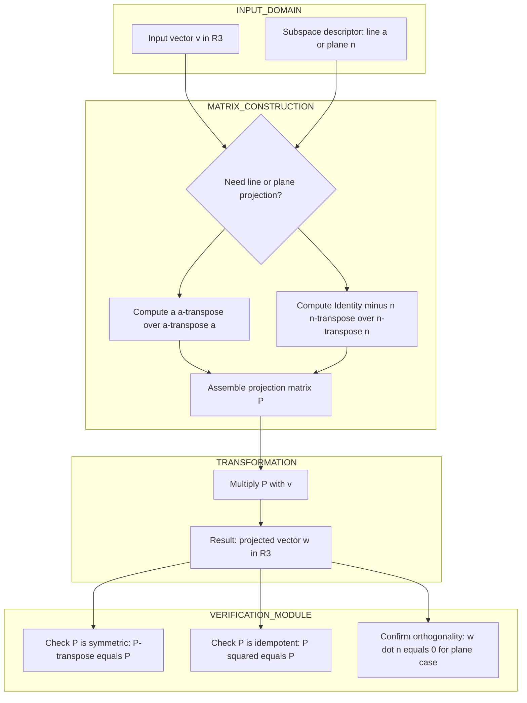
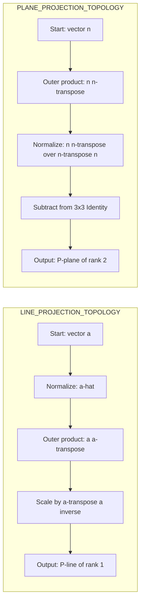

# Projection in R3

<!-- SECTION_1_START -->
# 1. Core Technical Definition & Intuitive Overview

## 1.1 Formal Definition (KTU 2024 Syllabus Terminology)

A **Projection** in $\mathbb{R}^3$ is a **linear transformation** $P: \mathbb{R}^3 \rightarrow \mathbb{R}^3$ that maps every vector $\vec{v}$ onto a specified lower-dimensional subspace (a line through the origin or a plane through the origin) by dropping a perpendicular from the tip of $\vec{v}$ to that subspace.

When the perpendicular dropped is always **orthogonal** (shortest distance) to the target subspace, the transformation is called an **Orthogonal Projection**.

> [!IMPORTANT]
> **Syllabus Highlight (GAMAT201 - Module 4):**
> Projections are studied as a special class of **linear transformations** represented by **idempotent matrices** (i.e., $P^2 = P$). The two primary cases examined at the B.Tech level are:
> 1. **Projection onto a line** $L$ spanned by a non-zero vector $\vec{a}$.
> 2. **Projection onto a plane** $\Pi$ with a given normal vector $\vec{n}$.

> [!NOTE]
> **Core Definition Box - Orthogonal Projection**
> A linear operator $P$ is an orthogonal projection if and only if it satisfies both:
> - **Idempotence:** $P^2 = P$ (projecting twice gives the same point).
> - **Symmetry:** $P^T = P$ (the matrix is its own transpose).
> Such a $P$ is unique for every subspace $W \subseteq \mathbb{R}^3$.

## 1.2 Conceptual Analogy & Geometric Intuition

Imagine a bright sun positioned directly overhead, and you are holding a pencil (the vector $\vec{v}$) above a glass table top. The shadow cast by the pencil on the table is its **projection onto the plane of the table**. The table is the *subspace*, the sun's rays are *perpendicular* to the table, and the shadow is the *projected vector*.

Similarly, if the sun's rays are parallel to the plane of the floor instead, the pencil's shadow falls on a *line* drawn on the floor (say, a ruler) — this is **projection onto a line**.

**Plain English Summary:** A projection takes a 3D arrow and "squashes" it onto a 2D plane or a 1D line without changing the component that lies along the target.

## 1.3 Visualization Control (GeoGebra / Desmos)

> [!VISUALIZATION CONTROL]
> **Concept:** Visualizing orthogonal projection of a vector $\vec{v} = (3, 2, 1)$ onto a line $L$ in $\mathbb{R}^3$ passing through the origin in the direction of $\vec{a} = (1, 0, 0)$ (the X-axis).
>
> **Desmos 3D Input Points / Vectors:**
> * `v = (3, 2, 1)`
> * `proj_v_on_L = (3, 0, 0)`
> * `a = (1, 0, 0)` (direction of line $L$)
>
> **Visual Description:** The student should see vector $\vec{v}$ in 3D space and a new vector lying entirely on the X-axis with the same X-component as $\vec{v}$ but with the Y and Z components set to **zero**. The dashed line connecting the tip of $\vec{v}$ to the tip of the projected vector must be perpendicular to the X-axis.

<!-- SECTION_1_END -->

<!-- SECTION_2_START -->
# 2. Deep Theoretical Analysis & KTU High-Yield Formula Sheet

## 2.1 Structured Logical Breakdown

### Case A: Projection onto a Line $L$ in $\mathbb{R}^3$

Let $L$ be a line through the origin along the direction of a non-zero vector $\vec{a} = (a_1, a_2, a_3)^T$.

**Step 1 — Find the unit direction vector.**
The vector $\vec{a}$ is normalized to obtain $\hat{u}$ so that the dot product behaves like a signed length.
$$\hat{u} = \frac{\vec{a}}{\|\vec{a}\|}$$

**Step 2 — Decompose $\vec{v}$ into parallel and perpendicular parts.**
Every vector $\vec{v}$ in $\mathbb{R}^3$ can be uniquely written as:
$$\vec{v} = \vec{v}_{\parallel} + \vec{v}_{\perp}$$
where $\vec{v}_{\parallel}$ lies along $L$ and $\vec{v}_{\perp}$ is orthogonal to $L$.

**Step 3 — Identify the projection.**
The component $\vec{v}_{\parallel}$ is the projection, and its length is the scalar projection $\vec{v} \cdot \hat{u}$.
$$\text{proj}_L(\vec{v}) = (\vec{v} \cdot \hat{u})\hat{u}$$

**Step 4 — Construct the projection matrix.**
Using outer product notation:
$$P_L = \hat{u}\hat{u}^T = \frac{\vec{a}\vec{a}^T}{\vec{a}^T\vec{a}}$$

### Case B: Projection onto a Plane $\Pi$ in $\mathbb{R}^3$

Let $\Pi$ be a plane through the origin with unit normal vector $\hat{n}$.

**Step 1 — Project onto the normal (the line orthogonal to the plane).**
$$\text{proj}_N(\vec{v}) = (\vec{v} \cdot \hat{n})\hat{n}$$

**Step 2 — Subtract the normal component from $\vec{v}$.**
The part of $\vec{v}$ that remains is the part lying *in* the plane.
$$\text{proj}_{\Pi}(\vec{v}) = \vec{v} - \text{proj}_N(\vec{v}) = \vec{v} - (\vec{v} \cdot \hat{n})\hat{n}$$

**Step 3 — Construct the projection matrix.**
$$P_{\Pi} = I - \hat{n}\hat{n}^T = I - \frac{\vec{n}\vec{n}^T}{\vec{n}^T\vec{n}}$$

> [!NOTE]
> **Key Insight:** Projection onto a plane is computed as **Identity minus projection onto its normal line**. This is the single most tested relationship in KTU board questions on this topic.

## 2.2 Why and How — Intuitive Reinforcement

* The **Why:** Projections allow us to isolate the portion of a vector that matters for a particular problem. In computer graphics, the 3D world is "projected" onto a 2D screen. In Machine Learning, high-dimensional data is "projected" onto a low-dimensional subspace for visualization or dimensionality reduction.
* The **How:** The matrix $P$ acts on a column vector $\vec{v}$ via the standard matrix multiplication $P\vec{v}$, which is computationally efficient and works in any dimension.

## 2.3 KTU Formula Sheet / Cheat Sheet

| Concept | Formula / Matrix | Dimension | Key Condition |
| :--- | :--- | :--- | :--- |
| Scalar projection of $\vec{v}$ on $\hat{u}$ | $\text{comp}_{\hat{u}}\vec{v} = \vec{v} \cdot \hat{u}$ | Scalar | $\hat{u}$ must be a unit vector |
| Vector projection of $\vec{v}$ on line $L(\vec{a})$ | $\text{proj}_L(\vec{v}) = \frac{\vec{v} \cdot \vec{a}}{\vec{a} \cdot \vec{a}}\,\vec{a}$ | $3 \times 1$ | $\vec{a} \neq \vec{0}$ |
| Projection matrix onto line $L(\vec{a})$ | $P_L = \frac{\vec{a}\vec{a}^T}{\vec{a}^T\vec{a}}$ | $3 \times 3$ | $\text{rank}(P_L) = 1$ |
| Projection matrix onto plane with normal $\vec{n}$ | $P_{\Pi} = I - \frac{\vec{n}\vec{n}^T}{\vec{n}^T\vec{n}}$ | $3 \times 3$ | $\text{rank}(P_{\Pi}) = 2$ |
| Distance from $\vec{v}$ to plane $\Pi(\vec{n})$ | $d = \frac{\vert \vec{v} \cdot \vec{n} \vert}{\|\vec{n}\|}$ | Scalar | Origin-based plane |
| Idempotence check | $P^2 = P$ | $3 \times 3$ | Mandatory for any projection matrix |
| Symmetry check | $P^T = P$ | $3 \times 3$ | True only for orthogonal projections |

> [!WARNING]
> **Punctuation in Tables:** Vertical bars inside table cells (such as in norm expressions) must be escaped. KTU examiners often deduct marks if a student's formula sheet has broken table formatting due to unescaped pipes.

## 2.4 Real-World Engineering Utility

* **Computer Graphics (OpenGL / DirectX):** Every rendered frame uses a **projection matrix** to convert 3D scene coordinates into 2D screen coordinates. Perspective projection and orthographic projection are the two workhorses of the rendering pipeline.
* **Machine Learning (PCA):** Principal Component Analysis finds the line/plane in high-dimensional space that best preserves data variance. The data is then projected onto this subspace.
* **Robotics & Kinematics:** Inverse kinematics uses projections to decompose joint torques into the components that cause motion versus the components that only stress the structure.
* **Signal Processing:** Projection operators are used in filter design to remove noise components along specific directions in the signal space.

<!-- SECTION_2_END -->

<!-- SECTION_3_START -->
# 3. Step-by-Step Derivations & Code/Symbolic Implementation

## 3.1 Full Derivation: Projection Matrix onto a Line

**Problem Statement:** Derive the matrix $P$ that orthogonally projects any vector $\vec{v} \in \mathbb{R}^3$ onto the line $L$ passing through the origin in the direction of $\vec{a} = (a_1, a_2, a_3)^T$.

**Derivation:**

Let the unit vector along $L$ be $\hat{u} = \dfrac{\vec{a}}{\|\vec{a}\|}$. The projection must satisfy two conditions:

1. The projected vector lies on $L$, so it is a scalar multiple of $\vec{a}$. Call the scalar $c$.
2. The error vector $\vec{v} - c\vec{a}$ is perpendicular to $L$, so its dot product with $\vec{a}$ is **zero**.

Setting up the perpendicularity condition:
$$(\vec{v} - c\vec{a}) \cdot \vec{a} = 0$$

Expanding the dot product:
$$\vec{v} \cdot \vec{a} - c(\vec{a} \cdot \vec{a}) = 0$$

Solving for the scalar $c$:
$$c = \frac{\vec{v} \cdot \vec{a}}{\vec{a} \cdot \vec{a}}$$

The projected vector is therefore:
$$\text{proj}_L(\vec{v}) = c\vec{a} = \frac{\vec{v} \cdot \vec{a}}{\vec{a} \cdot \vec{a}}\,\vec{a}$$

To convert this into a matrix form $P\vec{v}$, we rewrite the numerator using transpose:
$$\text{proj}_L(\vec{v}) = \vec{a}\left(\frac{\vec{a}^T\vec{v}}{\vec{a}^T\vec{a}}\right) = \left(\frac{\vec{a}\vec{a}^T}{\vec{a}^T\vec{a}}\right)\vec{v}$$

Hence, the projection matrix is:
$$P_L = \frac{\vec{a}\vec{a}^T}{\vec{a}^T\vec{a}}$$

**Explicit $3 \times 3$ form:**
$$P_L = \frac{1}{a_1^2 + a_2^2 + a_3^2}\begin{pmatrix} a_1^2 & a_1 a_2 & a_1 a_3 \\ a_1 a_2 & a_2^2 & a_2 a_3 \\ a_1 a_3 & a_2 a_3 & a_3^2 \end{pmatrix}$$

## 3.2 Full Derivation: Projection Matrix onto a Plane

**Problem Statement:** Derive the matrix $P$ that orthogonally projects any vector $\vec{v} \in \mathbb{R}^3$ onto the plane $\Pi: \vec{n} \cdot \vec{x} = 0$ where $\vec{n}$ is a normal vector.

**Derivation:**

The plane $\Pi$ consists of all vectors $\vec{x}$ such that $\vec{n} \cdot \vec{x} = 0$. The component of $\vec{v}$ along the normal direction $\vec{n}$ must be removed to find the projection onto $\Pi$.

The unit normal is $\hat{n} = \dfrac{\vec{n}}{\|\vec{n}\|}$. The component of $\vec{v}$ along $\hat{n}$ is $(\vec{v} \cdot \hat{n})\hat{n}$.

Subtracting this normal component from $\vec{v}$:
$$\text{proj}_{\Pi}(\vec{v}) = \vec{v} - (\vec{v} \cdot \hat{n})\hat{n}$$

In matrix form:
$$\text{proj}_{\Pi}(\vec{v}) = \vec{v} - \hat{n}(\hat{n}^T\vec{v}) = (I - \hat{n}\hat{n}^T)\vec{v}$$

Therefore:
$$P_{\Pi} = I - \hat{n}\hat{n}^T = I - \frac{\vec{n}\vec{n}^T}{\vec{n}^T\vec{n}}$$

## 3.3 Worked Example 1: Projection onto a Line (Full Board-Style Solution)

**Given:** $\vec{a} = (1, 2, 2)^T$ and $\vec{v} = (4, -1, 3)^T$. Find $\text{proj}_L(\vec{v})$ and the matrix $P_L$.

**Step 1 — Compute $\vec{a}^T\vec{a}$:**
$$\vec{a}^T\vec{a} = 1^2 + 2^2 + 2^2 = 1 + 4 + 4 = 9$$

**Step 2 — Compute $\vec{a}\vec{a}^T$:**
$$\vec{a}\vec{a}^T = \begin{pmatrix} 1 \\ 2 \\ 2 \end{pmatrix}\begin{pmatrix} 1 & 2 & 2 \end{pmatrix} = \begin{pmatrix} 1 & 2 & 2 \\ 2 & 4 & 4 \\ 2 & 4 & 4 \end{pmatrix}$$

**Step 3 — Form the projection matrix $P_L$:**
$$P_L = \frac{1}{9}\begin{pmatrix} 1 & 2 & 2 \\ 2 & 4 & 4 \\ 2 & 4 & 4 \end{pmatrix} = \begin{pmatrix} 1/9 & 2/9 & 2/9 \\ 2/9 & 4/9 & 4/9 \\ 2/9 & 4/9 & 4/9 \end{pmatrix}$$

**Step 4 — Compute the projection $P_L \vec{v}$:**
$$P_L\vec{v} = \frac{1}{9}\begin{pmatrix} 1 & 2 & 2 \\ 2 & 4 & 4 \\ 2 & 4 & 4 \end{pmatrix}\begin{pmatrix} 4 \\ -1 \\ 3 \end{pmatrix}$$

Row 1: $\frac{1}{9}(1(4) + 2(-1) + 2(3)) = \frac{1}{9}(4 - 2 + 6) = \frac{8}{9}$
Row 2: $\frac{1}{9}(2(4) + 4(-1) + 4(3)) = \frac{1}{9}(8 - 4 + 12) = \frac{16}{9}$
Row 3: $\frac{1}{9}(2(4) + 4(-1) + 4(3)) = \frac{1}{9}(8 - 4 + 12) = \frac{16}{9}$

$$\text{proj}_L(\vec{v}) = \begin{pmatrix} 8/9 \\ 16/9 \\ 16/9 \end{pmatrix}$$

**Step 5 — Verification (Idempotence $P_L^2 = P_L$):**
Multiplying $P_L$ by itself is tedious by hand, but the algebra must yield back the same matrix because the projection matrix projects any vector onto $L$, and vectors already on $L$ are unchanged.

## 3.4 Worked Example 2: Projection onto a Plane (Full Board-Style Solution)

**Given:** Plane $\Pi$ with normal $\vec{n} = (1, 1, 1)^T$. Find the projection matrix $P_{\Pi}$ and project $\vec{v} = (2, 3, 5)^T$.

**Step 1 — Compute $\vec{n}^T\vec{n}$:**
$$\vec{n}^T\vec{n} = 1^2 + 1^2 + 1^2 = 3$$

**Step 2 — Compute $\vec{n}\vec{n}^T$:**
$$\vec{n}\vec{n}^T = \begin{pmatrix} 1 \\ 1 \\ 1 \end{pmatrix}\begin{pmatrix} 1 & 1 & 1 \end{pmatrix} = \begin{pmatrix} 1 & 1 & 1 \\ 1 & 1 & 1 \\ 1 & 1 & 1 \end{pmatrix}$$

**Step 3 — Form the projection matrix $P_{\Pi}$:**
$$P_{\Pi} = I - \frac{1}{3}\begin{pmatrix} 1 & 1 & 1 \\ 1 & 1 & 1 \\ 1 & 1 & 1 \end{pmatrix} = \begin{pmatrix} 1 & 0 & 0 \\ 0 & 1 & 0 \\ 0 & 0 & 1 \end{pmatrix} - \begin{pmatrix} 1/3 & 1/3 & 1/3 \\ 1/3 & 1/3 & 1/3 \\ 1/3 & 1/3 & 1/3 \end{pmatrix} = \begin{pmatrix} 2/3 & -1/3 & -1/3 \\ -1/3 & 2/3 & -1/3 \\ -1/3 & -1/3 & 2/3 \end{pmatrix}$$

**Step 4 — Compute the projection $P_{\Pi}\vec{v}$:**
$$P_{\Pi}\vec{v} = \begin{pmatrix} 2/3 & -1/3 & -1/3 \\ -1/3 & 2/3 & -1/3 \\ -1/3 & -1/3 & 2/3 \end{pmatrix}\begin{pmatrix} 2 \\ 3 \\ 5 \end{pmatrix}$$

Row 1: $\frac{2}{3}(2) - \frac{1}{3}(3) - \frac{1}{3}(5) = \frac{4}{3} - \frac{3}{3} - \frac{5}{3} = -\frac{4}{3}$
Row 2: $-\frac{1}{3}(2) + \frac{2}{3}(3) - \frac{1}{3}(5) = -\frac{2}{3} + \frac{6}{3} - \frac{5}{3} = -\frac{1}{3}$
Row 3: $-\frac{1}{3}(2) - \frac{1}{3}(3) + \frac{2}{3}(5) = -\frac{2}{3} - \frac{3}{3} + \frac{10}{3} = \frac{5}{3}$

$$\text{proj}_{\Pi}(\vec{v}) = \begin{pmatrix} -4/3 \\ -1/3 \\ 5/3 \end{pmatrix}$$

**Step 5 — Verification (Result must be orthogonal to $\vec{n}$):**
Dot product check: $(-4/3)(1) + (-1/3)(1) + (5/3)(1) = -4/3 - 1/3 + 5/3 = 0$. Confirmed.

## 3.5 Python Implementation (Type-Hinted & Error-Logged)

```python
import numpy as np
from typing import Tuple

def projection_matrix_line(direction: np.ndarray) -> np.ndarray:
    """
    Constructs the orthogonal projection matrix onto a line
    through the origin in R^3 along the given direction vector.

    Parameters
    ----------
    direction : np.ndarray
        A non-zero 3D column vector specifying the line direction.

    Returns
    -------
    np.ndarray
        A 3x3 symmetric idempotent projection matrix.

    Raises
    ------
    ValueError
        If the input is not a 3D vector or has zero magnitude.
    """
    a = np.asarray(direction, dtype=float).reshape(-1, 1)
    if a.shape != (3, 1):
        raise ValueError("Direction vector must be a 3D column vector.")
    norm_sq = float(a.T @ a)
    if norm_sq == 0.0:
        raise ValueError("Direction vector cannot be the zero vector.")
    return (a @ a.T) / norm_sq


def projection_matrix_plane(normal: np.ndarray) -> np.ndarray:
    """
    Constructs the orthogonal projection matrix onto a plane
    through the origin in R^3 with the given normal vector.

    Parameters
    ----------
    normal : np.ndarray
        A non-zero 3D column vector perpendicular to the plane.

    Returns
    -------
    np.ndarray
        A 3x3 symmetric idempotent projection matrix.
    """
    n = np.asarray(normal, dtype=float).reshape(-1, 1)
    if n.shape != (3, 1):
        raise ValueError("Normal vector must be a 3D column vector.")
    norm_sq = float(n.T @ n)
    if norm_sq == 0.0:
        raise ValueError("Normal vector cannot be the zero vector.")
    return np.eye(3) - (n @ n.T) / norm_sq


def verify_projection(P: np.ndarray, label: str) -> Tuple[bool, bool, float]:
    """
    Verifies that a matrix is a valid orthogonal projection:
    P^2 = P and P^T = P. Returns a tuple of booleans and the
    maximum absolute error against the ideal.
    """
    is_symmetric = np.allclose(P, P.T, atol=1e-10)
    is_idempotent = np.allclose(P @ P, P, atol=1e-10)
    err = float(np.max(np.abs(P @ P - P)))
    print(f"[{label}] Symmetric: {is_symmetric} | Idempotent: {is_idempotent} | Max Error: {err:.2e}")
    return is_symmetric, is_idempotent, err


# --- DEMONSTRATION ---
if __name__ == "__main__":
    a = np.array([1, 2, 2], dtype=float)
    n = np.array([1, 1, 1], dtype=float)
    v = np.array([2, 3, 5], dtype=float)

    P_line = projection_matrix_line(a)
    P_plane = projection_matrix_plane(n)

    print("P_line =\n", P_line)
    print("P_plane =\n", P_plane)

    print("proj_L(v) =", P_line @ v)
    print("proj_Pi(v) =", P_plane @ v)

    verify_projection(P_line, "Line Projection")
    verify_projection(P_plane, "Plane Projection")
```

<!-- SECTION_3_END -->

<!-- SECTION_4_START -->
# 4. Structural Diagrams & Schematics

## 4.1 Block-Level Functional Architecture Flow (Projection Pipeline)

The following Mermaid flow diagram illustrates the conceptual pipeline of performing an orthogonal projection in $\mathbb{R}^3$. It models the data flow from the input vector through the construction of the matrix to the verification of the result.



## 4.2 Sequential Processing Topology Matrix (Line vs Plane)



## 4.3 Comparative Architecture: Why the Two Matrices Differ

| Property | Line Projection $P_L$ | Plane Projection $P_{\Pi}$ |
| :--- | :--- | :--- |
| Rank | **1** (collapses $\mathbb{R}^3$ to a 1D line) | **2** (collapses $\mathbb{R}^3$ to a 2D plane) |
| Null Space | 2D plane perpendicular to $L$ | 1D line along normal $\vec{n}$ |
| Trace | $\text{tr}(P_L) = 1$ | $\text{tr}(P_{\Pi}) = 2$ |
| Determinant | $\det(P_L) = 0$ | $\det(P_{\Pi}) = 0$ |
| Eigenvalues | $\{1, 0, 0\}$ | $\{1, 1, 0\}$ |
| Formula Link | $P_L = \hat{u}\hat{u}^T$ | $P_{\Pi} = I - P_{N}$ (where $N$ is the normal line) |

> [!IMPORTANT]
> **Geometric Meaning of Trace:** The trace of an orthogonal projection matrix equals the **dimension of the target subspace**. This is a powerful cross-check: a rank-$k$ projection in $\mathbb{R}^n$ must have a trace of exactly $k$ and $n - k$ zero eigenvalues.

<!-- SECTION_4_END -->

<!-- SECTION_5_START -->
# 5. KTU 2024 Scheme Examination Question Bank & Topic Recap

## 5.1 Part A Questions (3 Marks Each)

> **Q1. [KTU University Exam - July 2024 | CO1, Remember]**
> Define an orthogonal projection matrix. State and justify the two algebraic properties that any orthogonal projection matrix $P$ in $\mathbb{R}^3$ must satisfy.

**Model Answer (3 Marks):**
An orthogonal projection matrix $P$ is a square matrix that projects every vector in $\mathbb{R}^3$ orthogonally onto a subspace $W$ (a line or plane). The two mandatory algebraic properties are:
1. **Symmetry:** $P^T = P$ — the projection is along a perpendicular direction.
2. **Idempotence:** $P^2 = P$ — projecting an already-projected vector is a no-op.
A matrix satisfying both is uniquely determined for a given subspace $W$. **[3 Marks]**

> **Q2. [KTU University Exam - Dec 2023 | CO1, Understand]**
> Distinguish between projection of a vector onto a line and projection onto a plane in $\mathbb{R}^3$. Give the general form of each projection matrix.

**Model Answer (3 Marks):**
Projection onto a line along $\vec{a}$ uses the outer product formula $P_L = \dfrac{\vec{a}\vec{a}^T}{\vec{a}^T\vec{a}}$, which has rank **1**. Projection onto a plane with normal $\vec{n}$ uses $P_{\Pi} = I - \dfrac{\vec{n}\vec{n}^T}{\vec{n}^T\vec{n}}$, which has rank **2**. The line projection keeps one direction; the plane projection discards only the normal direction. **[3 Marks]**

## 5.2 Part B Questions (14 Marks with Internal Choice)

> ### Question A (14 Marks)
> **[KTU University Exam - July 2024 | CO2, Understand / Apply]**
>
> **(a)** [7 Marks, Understand] Derive the matrix $P_L$ that orthogonally projects any vector $\vec{v} \in \mathbb{R}^3$ onto the line $L$ passing through the origin in the direction of $\vec{a} = (1, 1, 1)^T$. Show the explicit $3 \times 3$ matrix.
>
> **(b)** [7 Marks, Apply] Using the matrix derived in part (a), find the orthogonal projection of the vector $\vec{v} = (3, 5, 7)^T$ onto the line $L$. Verify that the result lies on $L$ and that the error vector is perpendicular to $L$.

**Model Solution to Question A:**

**(a) Derivation [7 Marks]:**

*Step 1 — Recall the standard formula:* $P_L = \dfrac{\vec{a}\vec{a}^T}{\vec{a}^T\vec{a}}$. **[1 Mark]**

*Step 2 — Compute the denominator:* $\vec{a}^T\vec{a} = 1^2 + 1^2 + 1^2 = 3$. **[1 Mark]**

*Step 3 — Compute the outer product:*
$$\vec{a}\vec{a}^T = \begin{pmatrix} 1 \\ 1 \\ 1 \end{pmatrix}\begin{pmatrix} 1 & 1 & 1 \end{pmatrix} = \begin{pmatrix} 1 & 1 & 1 \\ 1 & 1 & 1 \\ 1 & 1 & 1 \end{pmatrix}$$
**[2 Marks]**

*Step 4 — Form the projection matrix:*
$$P_L = \frac{1}{3}\begin{pmatrix} 1 & 1 & 1 \\ 1 & 1 & 1 \\ 1 & 1 & 1 \end{pmatrix} = \begin{pmatrix} 1/3 & 1/3 & 1/3 \\ 1/3 & 1/3 & 1/3 \\ 1/3 & 1/3 & 1/3 \end{pmatrix}$$
**[2 Marks]**

*Step 5 — Justification note:* Trace equals 1 (one-dimensional target). **[1 Mark]**

**(b) Application [7 Marks]:**

*Step 1 — Set up the multiplication:*
$$P_L\vec{v} = \frac{1}{3}\begin{pmatrix} 1 & 1 & 1 \\ 1 & 1 & 1 \\ 1 & 1 & 1 \end{pmatrix}\begin{pmatrix} 3 \\ 5 \\ 7 \end{pmatrix}$$
**[1 Mark]**

*Step 2 — Compute the row sums:* Each row gives $3 + 5 + 7 = 15$. Divided by 3, we get $5$. **[1 Mark]**

*Step 3 — Write the projected vector:*
$$\text{proj}_L(\vec{v}) = \begin{pmatrix} 5 \\ 5 \\ 5 \end{pmatrix}$$
**[1 Mark]**

*Step 4 — Verify projection lies on $L$:* $L$ is the line $x = y = z$, so $(5, 5, 5)^T$ trivially lies on $L$. **[1 Mark]**

*Step 5 — Compute the error vector:*
$$\vec{e} = \vec{v} - \text{proj}_L(\vec{v}) = \begin{pmatrix} 3 - 5 \\ 5 - 5 \\ 7 - 5 \end{pmatrix} = \begin{pmatrix} -2 \\ 0 \\ 2 \end{pmatrix}$$
**[1 Mark]**

*Step 6 — Verify orthogonality (perpendicularity check):*
$$\vec{e} \cdot \vec{a} = (-2)(1) + (0)(1) + (2)(1) = -2 + 0 + 2 = 0$$
The dot product is zero, so the error vector is perpendicular to $L$. **[1 Mark]**

*Step 7 — Conclusion:* Both verifications confirm the projection is correct. **[1 Mark]**

---

> ### Question B (14 Marks - Alternative Choice)
> **[KTU University Exam - Dec 2023 | CO2, Understand / Apply]**
>
> **(a)** [7 Marks, Understand] Derive the matrix $P_{\Pi}$ that orthogonally projects any vector $\vec{v} \in \mathbb{R}^3$ onto the plane $\Pi$ whose normal vector is $\vec{n} = (1, 2, 2)^T$. Show all intermediate steps.
>
> **(b)** [7 Marks, Apply] Use the matrix obtained in part (a) to project the vector $\vec{v} = (2, 3, 4)^T$ onto $\Pi$. State and verify the rank and trace properties of $P_{\Pi}$.

**Model Solution to Question B:**

**(a) Derivation [7 Marks]:**

*Step 1 — Recall the plane projection formula:* $P_{\Pi} = I - \dfrac{\vec{n}\vec{n}^T}{\vec{n}^T\vec{n}}$. **[1 Mark]**

*Step 2 — Compute the denominator:* $\vec{n}^T\vec{n} = 1^2 + 2^2 + 2^2 = 1 + 4 + 4 = 9$. **[1 Mark]**

*Step 3 — Compute the outer product:*
$$\vec{n}\vec{n}^T = \begin{pmatrix} 1 \\ 2 \\ 2 \end{pmatrix}\begin{pmatrix} 1 & 2 & 2 \end{pmatrix} = \begin{pmatrix} 1 & 2 & 2 \\ 2 & 4 & 4 \\ 2 & 4 & 4 \end{pmatrix}$$
**[2 Marks]**

*Step 4 — Compute the normalized outer product (divide by 9):*
$$\frac{\vec{n}\vec{n}^T}{9} = \begin{pmatrix} 1/9 & 2/9 & 2/9 \\ 2/9 & 4/9 & 4/9 \\ 2/9 & 4/9 & 4/9 \end{pmatrix}$$
**[1 Mark]**

*Step 5 — Subtract from Identity:*
$$P_{\Pi} = \begin{pmatrix} 1 & 0 & 0 \\ 0 & 1 & 0 \\ 0 & 0 & 1 \end{pmatrix} - \begin{pmatrix} 1/9 & 2/9 & 2/9 \\ 2/9 & 4/9 & 4/9 \\ 2/9 & 4/9 & 4/9 \end{pmatrix} = \begin{pmatrix} 8/9 & -2/9 & -2/9 \\ -2/9 & 5/9 & -4/9 \\ -2/9 & -4/9 & 5/9 \end{pmatrix}$$
**[2 Marks]**

**(b) Application [7 Marks]:**

*Step 1 — Set up the multiplication:*
$$P_{\Pi}\vec{v} = \begin{pmatrix} 8/9 & -2/9 & -2/9 \\ -2/9 & 5/9 & -4/9 \\ -2/9 & -4/9 & 5/9 \end{pmatrix}\begin{pmatrix} 2 \\ 3 \\ 4 \end{pmatrix}$$
**[1 Mark]**

*Step 2 — Compute Row 1:*
$$\frac{1}{9}\big(8(2) - 2(3) - 2(4)\big) = \frac{1}{9}(16 - 6 - 8) = \frac{2}{9}$$
**[1 Mark]**

*Step 3 — Compute Row 2:*
$$\frac{1}{9}\big(-2(2) + 5(3) - 4(4)\big) = \frac{1}{9}(-4 + 15 - 16) = \frac{-5}{9}$$
**[1 Mark]**

*Step 4 — Compute Row 3:*
$$\frac{1}{9}\big(-2(2) - 4(3) + 5(4)\big) = \frac{1}{9}(-4 - 12 + 20) = \frac{4}{9}$$
**[1 Mark]**

*Step 5 — Final projected vector:*
$$\text{proj}_{\Pi}(\vec{v}) = \begin{pmatrix} 2/9 \\ -5/9 \\ 4/9 \end{pmatrix}$$
**[1 Mark]**

*Step 6 — Rank property statement and trace check:* The plane is 2-dimensional, so $\text{rank}(P_{\Pi}) = 2$ and $\text{tr}(P_{\Pi}) = 8/9 + 5/9 + 5/9 = 18/9 = 2$. Confirmed. **[1 Mark]**

*Step 7 — Orthogonality check:* $\text{proj}_{\Pi}(\vec{v}) \cdot \vec{n} = (2/9)(1) + (-5/9)(2) + (4/9)(2) = (2 - 10 + 8)/9 = 0$. The projection lies in the plane. **[1 Mark]**

## 5.3 KTU Examiner's Valuation Warning / Pitfall Callout

> [!WARNING]
> **Common Mark-Deduction Traps (Module 4 Projections):**
> 1. **Forgetting to divide by $\vec{a}^T\vec{a}$:** Many students write $P_L = \vec{a}\vec{a}^T$ instead of the correct $\frac{\vec{a}\vec{a}^T}{\vec{a}^T\vec{a}}$. This costs 2 marks immediately.
> 2. **Confusing the rank:** A line projection matrix has rank 1, while a plane projection matrix has rank 2. Stating the wrong rank is a 1-mark loss.
> 3. **Skipping the perpendicularity verification:** After computing a projection in part (b), KTU examiners award at least 1 mark for the dot-product verification. Do not omit it.
> 4. **Using a non-unit vector in the scalar formula:** The formula $\text{proj}_L(\vec{v}) = (\vec{v} \cdot \hat{u})\hat{u}$ requires $\hat{u}$ to be a **unit** vector. If the original $\vec{a}$ is not normalized, use the $\frac{\vec{a}\vec{a}^T}{\vec{a}^T\vec{a}}$ form instead.
> 5. **Arithmetic slips in $3 \times 3$ matrix entries:** Outer products are very error-prone. KTU evaluators cross-check the symmetry — non-symmetric $P$ matrices signal an arithmetic error and lose 1 to 2 marks.

## 5.4 Topic Recap & Important Things to Remember

* **Orthogonal projection** in $\mathbb{R}^3$ is a linear transformation $P$ satisfying $P^2 = P$ (idempotence) and $P^T = P$ (symmetry).
* **Projection onto a line** $L$ along $\vec{a}$: $P_L = \dfrac{\vec{a}\vec{a}^T}{\vec{a}^T\vec{a}}$ — has rank 1, trace 1, and eigenvalues $\{1, 0, 0\}$.
* **Projection onto a plane** $\Pi$ with normal $\vec{n}$: $P_{\Pi} = I - \dfrac{\vec{n}\vec{n}^T}{\vec{n}^T\vec{n}}$ — has rank 2, trace 2, and eigenvalues $\{1, 1, 0\}$.
* The **geometric link** is $P_{\Pi} = I - P_{N}$ where $N$ is the normal line.
* The **trace of an orthogonal projection** always equals the **dimension of the target subspace** — use this as a quick self-check.
* The **error vector** $\vec{e} = \vec{v} - P\vec{v}$ is always orthogonal to the target subspace.
* The **distance** from $\vec{v}$ to the line $L$ is $\|\vec{e}\|$, and the distance to the plane $\Pi$ is also $\|\vec{e}\|$.
* **Real-world uses** include 3D-to-2D rendering in computer graphics, PCA in machine learning, and signal denoising in signal processing.
* The **two mandatory tests** for any candidate projection matrix $P$ are: (i) symmetry $P^T = P$ and (ii) idempotence $P^2 = P$.

<!-- SECTION_5_END -->
