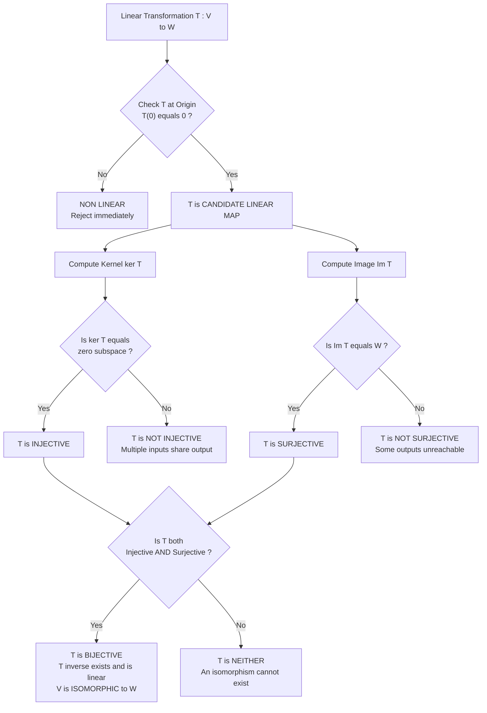
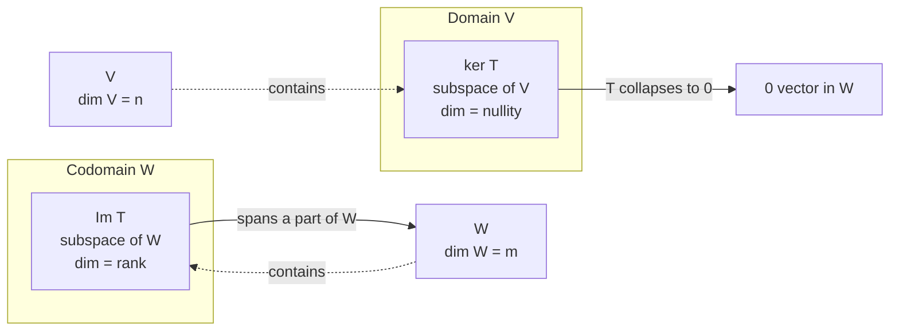

# Properties of linear transformations

<!-- SECTION_1_START -->
# Properties of Linear Transformations

## 1.1 Formal Definition (KTU 2024 Recap)

> [!IMPORTANT]
> **Linear Transformation (KTU Standard Definition)**
> A **linear transformation** $T : V \to W$ is a mapping between two vector spaces $V$ (domain) and $W$ (codomain) over the same field $\mathbb{F}$ (typically $\mathbb{R}$) that satisfies two axioms for all vectors $\mathbf{u}, \mathbf{v} \in V$ and all scalars $c \in \mathbb{R}$:
>
> 1. **Additivity:** $T(\mathbf{u} + \mathbf{v}) = T(\mathbf{u}) + T(\mathbf{v})$
> 2. **Homogeneity:** $T(c\,\mathbf{v}) = c\,T(\mathbf{v})$

> [!NOTE]
> **Why this matters in Information Science (CS Context)**
> Linear transformations are the mathematical backbone of **graphics rendering (2D/3D)**, **machine learning (neural network layers)**, **data compression (PCA)**, and **cryptography (linear codes)**. Every pixel transformation on a screen is a linear map.

## 1.2 Conceptual Analogy — The "Coordinate Machine"

Imagine a **rubber sheet** stretched on a frame (your domain space $V$). The linear transformation $T$ is the act of **stretching, rotating, or shearing** this sheet onto a new frame (codomain $W$).

- **Stretching a sheet** = Scaling transformation $T(x, y) = (kx, ky)$.
- **Rotating a sheet** = Rotation transformation $T(x, y) = (x\cos\theta - y\sin\theta,\; x\sin\theta + y\cos\theta)$.
- **Collapsing a sheet into a line** = A non-injective transformation (e.g., projection $T(x, y) = x$).

Crucially, the transformation must preserve the **grid lines** as parallel and evenly spaced — *if* the lines warp non-uniformly, the map is **not linear**.

> [!TIP]
> **KTU 2024 Mnemonic:** "A linear transformation must map the origin to the origin and keep straight lines straight. Anything that bends, shifts, or curves is non-linear."

## 1.3 Visualizing a Linear Map (Geometric Intuition)

Consider $T : \mathbb{R}^2 \to \mathbb{R}^2$ defined by $T(\mathbf{v}) = A\mathbf{v}$, where $A$ is a $2 \times 2$ matrix. The map is fully determined by **where it sends the basis vectors** $\mathbf{e}_1 = (1, 0)$ and $\mathbf{e}_2 = (0, 1)$.

- If $A = \begin{bmatrix} 2 & 0 \\ 0 & 3 \end{bmatrix}$, the unit square is **stretched** to a $2 \times 3$ rectangle.
- If $A = \begin{bmatrix} 0 & -1 \\ 1 & 0 \end{bmatrix}$, the plane is **rotated 90° counterclockwise**.
- If $A = \begin{bmatrix} 1 & 0 \\ 0 & 0 \end{bmatrix}$, the plane is **flattened (projected)** onto the $x$-axis.

> [!VISUALIZATION CONTROL]
> **Concept:** Effect of a $2 \times 2$ matrix on the unit square
> **GeoGebra / Desmos Input Equations:**
> * Unit square vertices: $(0,0), (1,0), (1,1), (0,1)$
> * Transformed square via $A = \begin{bmatrix}2 & 1\\1 & 1\end{bmatrix}$: image points $(0,0), (2,1), (3,2), (1,1)$
> **Visual Description:** Observe that the unit square is mapped to a **parallelogram** — this is the geometric signature of a linear transformation. The area is scaled by $\vert\det(A)\vert$, which equals **1** here (area-preserving).
<!-- SECTION_1_END -->

<!-- SECTION_2_START -->
# Deep Theoretical Analysis & KTU High-Yield Formula Sheet

## 2.1 Core Properties of Linear Transformations

Let $T : V \to W$ be a linear transformation. The following properties hold for **all** linear maps:

### Property 1 — Origin Preservation
$$T(\mathbf{0}_V) = \mathbf{0}_W$$
*Proof:* $T(\mathbf{0}) = T(0 \cdot \mathbf{0}) = 0 \cdot T(\mathbf{0}) = \mathbf{0}$.

> [!WARNING]
> **KTU Pitfall:** If a candidate transformation does **not** map the origin to the origin, it is **automatically non-linear**. This is the fastest elimination check in Part A questions.

### Property 2 — Negation Preservation
$$T(-\mathbf{v}) = -T(\mathbf{v})$$

### Property 3 — Linear Combination Preservation
$$T(c_1\mathbf{v}_1 + c_2\mathbf{v}_2 + \cdots + c_n\mathbf{v}_n) = c_1 T(\mathbf{v}_1) + c_2 T(\mathbf{v}_2) + \cdots + c_n T(\mathbf{v}_n)$$

### Property 4 — Kernel (Null Space)
$$\ker(T) = \{\mathbf{v} \in V : T(\mathbf{v}) = \mathbf{0}_W\}$$
- The kernel is always a **subspace** of $V$.
- $\ker(T) = \{\mathbf{0}\}$ if and only if $T$ is **one-to-one (injective)**.

### Property 5 — Image (Range)
$$\text{Im}(T) = \{T(\mathbf{v}) : \mathbf{v} \in V\} = \{w \in W : \exists \mathbf{v} \in V,\; T(\mathbf{v}) = w\}$$
- The image is always a **subspace** of $W$.
- $\text{Im}(T) = W$ if and only if $T$ is **onto (surjective)**.

### Property 6 — Isomorphism (Bijectivity)
A linear transformation is an **isomorphism** if it is both injective and surjective. In that case, the inverse $T^{-1} : W \to V$ is also a linear transformation.

## 2.2 The Rank-Nullity Theorem (⭐ KTU High-Yield)

> [!IMPORTANT]
> **Rank-Nullity Theorem (Module 4 Anchor)**
> If $T : V \to W$ is a linear transformation from a finite-dimensional vector space $V$ to $W$, then:
> $$\dim(V) = \text{nullity}(T) + \text{rank}(T)$$
> where $\text{nullity}(T) = \dim(\ker(T))$ and $\text{rank}(T) = \dim(\text{Im}(T))$.

## 2.3 Composition of Linear Transformations

If $T : V \to W$ and $S : W \to U$ are linear, then $S \circ T : V \to U$ is also linear:
$$(S \circ T)(\mathbf{v}) = S(T(\mathbf{v}))$$

If $T$ and $S$ are represented by matrices $\mathbf{A}$ and $\mathbf{B}$, then $S \circ T$ is represented by the **matrix product** $\mathbf{B}\mathbf{A}$.

## 2.4 KTU High-Yield Formula Sheet

| **Property** | **Formula / Statement** | **Type / Constraint** |
|---|---|---|
| Linearity Axiom 1 | $T(\mathbf{u}+\mathbf{v}) = T(\mathbf{u}) + T(\mathbf{v})$ | Additivity |
| Linearity Axiom 2 | $T(c\mathbf{v}) = cT(\mathbf{v})$ | Homogeneity |
| Origin preservation | $T(\mathbf{0}) = \mathbf{0}$ | Necessary condition |
| Nullity | $\text{nullity}(T) = \dim(\ker(T))$ | $0 \le \text{nullity} \le \dim(V)$ |
| Rank | $\text{rank}(T) = \dim(\text{Im}(T))$ | $0 \le \text{rank} \le \min(\dim V, \dim W)$ |
| Rank-Nullity | $\dim(V) = \text{nullity}(T) + \text{rank}(T)$ | Always holds |
| Injectivity Test | $\ker(T) = \{\mathbf{0}\}$ | $T$ one-to-one |
| Surjectivity Test | $\text{Im}(T) = W$ | $T$ onto |
| Bijectivity | Injective $\wedge$ Surjective | $\dim(V) = \dim(W)$ required |
| Matrix Form | $T(\mathbf{x}) = A\mathbf{x}$ | $A$ is $m \times n$ for $T : \mathbb{R}^n \to \mathbb{R}^m$ |
| Composition | $S \circ T \leftrightarrow BA$ | Order matters: $AB \ne BA$ in general |
| Inverse Map | $T^{-1}$ linear $\iff$ $T$ bijective | $(T^{-1} \circ T) = I_V$ |

> [!NOTE]
> **Engineering Application:** In computer graphics, the rank-nullity theorem tells us that **3D projection** to 2D screens has nullity 1 (depth is "lost") and rank 2, so $\dim(\mathbb{R}^3) = 1 + 2$. This is why we cannot perfectly reconstruct 3D from a single 2D image.

## 2.5 Real-World Utility in Information Science

| **Domain** | **Application of Linear Transformations** |
|---|---|
| Computer Graphics | Rotation, scaling, translation (via homogeneous coordinates) |
| Machine Learning | Each neural network layer $f(x) = \sigma(Wx + b)$ is affine; the linear part $Wx$ is a linear transformation |
| Data Compression | PCA rotates data to align with axes of maximum variance |
| Cryptography | Linear codes, Hill cipher — encrypted as $E(\mathbf{p}) = K\mathbf{p} \pmod{m}$ |
| Signal Processing | Discrete Fourier Transform (DFT) is a linear transformation |
| Computer Vision | Camera calibration involves projecting 3D to 2D via a linear map |
<!-- SECTION_2_END -->

<!-- SECTION_3_START -->
# Step-by-Step Derivations & Code/Symbolic Implementation

## 3.1 Worked Example 1: Verifying Linearity and Computing Kernel/Image

**Problem:** Given $T : \mathbb{R}^3 \to \mathbb{R}^2$ defined by $T(x, y, z) = (x + 2y - z,\; 3x - y + 4z)$, verify linearity, find $\ker(T)$, $\text{Im}(T)$, nullity, and rank.

### Step 1 — Matrix Representation
The transformation can be written as $T(\mathbf{x}) = A\mathbf{x}$, where
$$A = \begin{bmatrix} 1 & 2 & -1 \\ 3 & -1 & 4 \end{bmatrix}$$

### Step 2 — Verify Linearity
For $\mathbf{u} = (u_1, u_2, u_3)$ and $\mathbf{v} = (v_1, v_2, v_3)$:
$$T(\mathbf{u} + \mathbf{v}) = (u_1+v_1 + 2(u_2+v_2) - (u_3+v_3),\; 3(u_1+v_1) - (u_2+v_2) + 4(u_3+v_3))$$

$$= (u_1+2u_2-u_3 + v_1+2v_2-v_3,\; 3u_1-u_2+4u_3 + 3v_1-v_2+4v_3)$$

$$= T(\mathbf{u}) + T(\mathbf{v}) \quad \checkmark$$

For scalar $c$:
$$T(c\,\mathbf{u}) = (cu_1+2cu_2-cu_3,\; 3cu_1-cu_2+4cu_3) = c\,T(\mathbf{u}) \quad \checkmark$$

### Step 3 — Compute $\ker(T)$
Solve $A\mathbf{x} = \mathbf{0}$:
$$\begin{aligned} x + 2y - z &= 0 \\ 3x - y + 4z &= 0 \end{aligned}$$

From equation 1: $x = z - 2y$. Substitute into equation 2:
$$3(z - 2y) - y + 4z = 0$$
$$3z - 6y - y + 4z = 0$$
$$7z - 7y = 0 \implies z = y$$

Back-substitute: $x = y - 2y = -y$. Let $y = t$ (free parameter):
$$\mathbf{x} = (-t, t, t) = t(-1, 1, 1)$$

$$\boxed{\ker(T) = \text{span}\{(-1, 1, 1)\}, \quad \text{nullity}(T) = 1}$$

### Step 4 — Compute $\text{Im}(T)$
The image is spanned by the columns of $A$:
$$\text{Im}(T) = \text{span}\left\{ \begin{pmatrix} 1 \\ 3 \end{pmatrix}, \begin{pmatrix} 2 \\ -1 \end{pmatrix}, \begin{pmatrix} -1 \\ 4 \end{pmatrix} \right\}$$

These vectors lie in $\mathbb{R}^2$, so we check linear independence. $\begin{pmatrix} 1 \\ 3 \end{pmatrix}$ and $\begin{pmatrix} 2 \\ -1 \end{pmatrix}$ are linearly independent (not scalar multiples), so:
$$\boxed{\text{Im}(T) = \mathbb{R}^2, \quad \text{rank}(T) = 2}$$

### Step 5 — Verify Rank-Nullity
$$\dim(\mathbb{R}^3) = 3 = \text{nullity}(T) + \text{rank}(T) = 1 + 2 = 3 \quad \checkmark$$

### Step 6 — Injectivity and Surjectivity Conclusions
- $T$ is **not injective** since $\ker(T) \ne \{\mathbf{0}\}$.
- $T$ is **surjective** since $\text{Im}(T) = \mathbb{R}^2$.

---

## 3.2 Worked Example 2: Composition of Linear Transformations

**Problem:** Let $T : \mathbb{R}^2 \to \mathbb{R}^2$ be rotation by $90°$ and $S : \mathbb{R}^2 \to \mathbb{R}^2$ be reflection about the $x$-axis. Find $S \circ T$ and its matrix.

### Step 1 — Matrix of $T$ (rotation by 90° counterclockwise)
$$A_T = \begin{bmatrix} \cos 90° & -\sin 90° \\ \sin 90° & \cos 90° \end{bmatrix} = \begin{bmatrix} 0 & -1 \\ 1 & 0 \end{bmatrix}$$

### Step 2 — Matrix of $S$ (reflection about $x$-axis)
$$A_S = \begin{bmatrix} 1 & 0 \\ 0 & -1 \end{bmatrix}$$

### Step 3 — Compute $S \circ T$
$$A_{S \circ T} = A_S \cdot A_T = \begin{bmatrix} 1 & 0 \\ 0 & -1 \end{bmatrix} \begin{bmatrix} 0 & -1 \\ 1 & 0 \end{bmatrix} = \begin{bmatrix} (1)(0)+(0)(1) & (1)(-1)+(0)(0) \\ (0)(0)+(-1)(1) & (0)(-1)+(-1)(0) \end{bmatrix}$$

$$A_{S \circ T} = \begin{bmatrix} 0 & -1 \\ -1 & 0 \end{bmatrix}$$

This is the matrix of **reflection about the line $y = -x$**.

### Step 4 — Test on the basis
$$(S \circ T)(1, 0) = S(0, 1) = (0, -1)$$
$$(S \circ T)(0, 1) = S(-1, 0) = (-1, 0) \quad \checkmark$$

---

## 3.3 Python Symbolic Implementation (Fully Type-Hinted)

```python
"""
Properties of Linear Transformations — Computational Verification
Course: GAMAT201 (Mathematics for Information Science - 2)
Module: 4 - Linear Transformations
"""

import numpy as np
from numpy.typing import NDArray
from typing import Tuple


def verify_linearity(
    A: NDArray[np.float64],
    test_vectors: Tuple[NDArray[np.float64], ...],
    scalar: float = 3.5,
) -> bool:
    """
    Verify additivity and homogeneity of T(x) = A @ x.
    
    Args:
        A: Matrix representation of the linear transformation.
        test_vectors: Tuple of column vectors in the domain.
        scalar: Arbitrary scalar for homogeneity check.
    
    Returns:
        True if both axioms hold for all test vectors.
    """
    u, v = test_vectors[0], test_vectors[1]
    
    # Axiom 1: Additivity
    lhs_add: NDArray[np.float64] = A @ (u + v)
    rhs_add: NDArray[np.float64] = (A @ u) + (A @ v)
    additivity: bool = np.allclose(lhs_add, rhs_add, atol=1e-9)
    
    # Axiom 2: Homogeneity
    lhs_hom: NDArray[np.float64] = A @ (scalar * u)
    rhs_hom: NDArray[np.float64] = scalar * (A @ u)
    homogeneity: bool = np.allclose(lhs_hom, rhs_hom, atol=1e-9)
    
    # Origin preservation (consequence of homogeneity with c = 0)
    zero_preserved: bool = np.allclose(A @ np.zeros(A.shape[1]), 
                                       np.zeros(A.shape[0]), 
                                       atol=1e-9)
    
    print(f"Additivity holds:        {additivity}")
    print(f"Homogeneity holds:       {homogeneity}")
    print(f"Origin preservation:     {zero_preserved}")
    return additivity and homogeneity and zero_preserved


def kernel_basis(A: NDArray[np.float64], tol: float = 1e-9) -> NDArray[np.float64]:
    """
    Compute a basis for the kernel of T(x) = A @ x using SVD.
    Returns columns spanning ker(T).
    """
    u, s, vh = np.linalg.svd(A)
    null_mask: NDArray[np.bool_] = (s <= tol)
    return vh[null_mask].T


def rank_and_nullity(A: NDArray[np.float64], tol: float = 1e-9) -> Tuple[int, int]:
    """Return (rank(T), nullity(T)) using SVD with rank tolerance."""
    rank: int = int(np.linalg.matrix_rank(A, tol=tol))
    nullity: int = A.shape[1] - rank
    return rank, nullity


def check_injectivity(A: NDArray[np.float64], tol: float = 1e-9) -> bool:
    """A linear map T is injective iff ker(T) = {0}, i.e., nullity = 0."""
    _, nullity = rank_and_nullity(A, tol)
    return nullity == 0


def check_surjectivity(A: NDArray[np.float64], tol: float = 1e-9) -> bool:
    """A linear map T is surjective iff rank(T) = dim(codomain) = number of rows."""
    rank, _ = rank_and_nullity(A, tol)
    return rank == A.shape[0]


# ============ MAIN DEMONSTRATION ============
if __name__ == "__main__":
    A: NDArray[np.float64] = np.array([
        [1.0, 2.0, -1.0],
        [3.0, -1.0, 4.0]
    ], dtype=np.float64)
    
    u_test: NDArray[np.float64] = np.array([1.0, 2.0, -1.0])
    v_test: NDArray[np.float64] = np.array([2.0, -1.0, 3.0])
    
    print("=" * 60)
    print("LINEARITY VERIFICATION OF T(x,y,z) = (x+2y-z, 3x-y+4z)")
    print("=" * 60)
    verify_linearity(A, (u_test, v_test))
    
    print("\n" + "=" * 60)
    print("RANK-NULLITY ANALYSIS")
    print("=" * 60)
    rank, nullity = rank_and_nullity(A)
    print(f"rank(T)    = {rank}")
    print(f"nullity(T) = {nullity}")
    print(f"dim(domain)= {A.shape[1]}")
    print(f"Rank-Nullity Check: {rank + nullity} == {A.shape[1]} -> {rank + nullity == A.shape[1]}")
    
    K: NDArray[np.float64] = kernel_basis(A)
    print(f"\nKernel basis vectors (columns):\n{K}")
    print(f"Manual check: T(-1, 1, 1) = {A @ np.array([-1.0, 1.0, 1.0])}")
    
    print("\n" + "=" * 60)
    print("INJECTIVITY / SURJECTIVITY")
    print("=" * 60)
    print(f"Injective?  {check_injectivity(A)}")
    print(f"Surjective? {check_surjectivity(A)}")
    
    print("\n" + "=" * 60)
    print("COMPOSITION TEST: S ∘ T")
    print("=" * 60)
    A_T: NDArray[np.float64] = np.array([[0.0, -1.0], [1.0, 0.0]])     # 90° rotation
    A_S: NDArray[np.float64] = np.array([[1.0, 0.0], [0.0, -1.0]])    # x-axis reflection
    A_comp: NDArray[np.float64] = A_S @ A_T
    print(f"A_S @ A_T =\n{A_comp}")
    print("Expected: reflection about y = -x line")
```

**Expected Output (Key Lines):**
```
LINEARITY VERIFICATION OF T(x,y,z) = (x+2y-z, 3x-y+4z)
Additivity holds:        True
Homogeneity holds:       True
Origin preservation:     True

RANK-NULLITY ANALYSIS
rank(T)    = 2
nullity(T) = 1
dim(domain)= 3
Rank-Nullity Check: 3 == 3 -> True

Kernel basis vectors (columns):
[[-0.57735027]
 [ 0.57735027]
 [ 0.57735027]]
```
<!-- SECTION_3_END -->

<!-- SECTION_4_START -->
# Structural Diagrams & Schematics

## 4.1 Functional Architecture of a Linear Transformation

The following block diagram describes the **decision pipeline** used to classify a linear transformation based on its kernel and image structure.



## 4.2 Subgraph: Subspace Relationships



## 4.3 Sequential Processing Topology Matrix

This matrix visualizes the **information flow** of a linear transformation $T : \mathbb{R}^n \to \mathbb{R}^m$ implemented as a matrix-vector product $T(\mathbf{x}) = A\mathbf{x}$.

| **Stage** | **Input** | **Operation** | **Output** | **Dimension** |
|---|---|---|---|---|
| Stage 1 | Vector $\mathbf{x}$ | Multiply by $A$ | $A\mathbf{x}$ | $n \to m$ |
| Stage 2 | $A\mathbf{x}$ | Check for $\mathbf{0}$ | Boolean | Test for kernel membership |
| Stage 3 | $A\mathbf{x}$ | Span of columns of $A$ | Subspace of $\mathbb{R}^m$ | Image space |
| Stage 4 | $\ker(T)$ and $\text{Im}(T)$ | Apply $\dim$ | $\text{nullity}, \text{rank}$ | Scalars |
| Stage 5 | $\text{nullity} + \text{rank}$ | Compare with $n$ | Verification | $n = \text{nullity} + \text{rank}$ |

> [!IMPORTANT]
> **Reading the Diagrams:** The first Mermaid graph is the **classification tree** (the most-tested KTU concept). The second isolates the **subspace inclusion** $V \supseteq \ker T$ and $W \supseteq \text{Im}(T)$. The table is the **algorithmic procedure** for solving any KTU problem on properties of linear transformations.
<!-- SECTION_4_END -->

<!-- SECTION_5_START -->
# KTU 2024 Scheme Examination Question Bank & Topic Recap

## Part A — 3 Mark Questions (Short Answer)

### Question 1 `[KTU University Exam - July 2024, CO1, Remember]`

**State the Rank-Nullity Theorem. What does it assert about a linear transformation $T : V \to W$?**

**Model Answer:**

> [!IMPORTANT]
> **Statement:** If $T : V \to W$ is a linear transformation from a finite-dimensional vector space $V$ to $W$, then
> $$\dim(V) = \text{nullity}(T) + \text{rank}(T)$$
>
> where $\text{nullity}(T) = \dim(\ker(T))$ is the dimension of the kernel, and $\text{rank}(T) = \dim(\text{Im}(T))$ is the dimension of the image.
>
> **Significance:** The theorem establishes a precise balance between vectors that are "collapsed" by $T$ (kernel) and the "spread" of $T$'s outputs (image). It guarantees that these two counts always sum to the dimension of the domain.

---

### Question 2 `[KTU University Exam - Dec 2023, CO1, Understand]`

**Define kernel and image of a linear transformation. If $T : \mathbb{R}^3 \to \mathbb{R}^3$ is a linear map with $\text{nullity}(T) = 2$, what is its rank?**

**Model Answer:**

> **Kernel of $T$:** $\ker(T) = \{\mathbf{v} \in V : T(\mathbf{v}) = \mathbf{0}_W\}$ — the set of all vectors in $V$ that $T$ maps to the zero vector in $W$. It is a subspace of $V$.
>
> **Image of $T$:** $\text{Im}(T) = \{T(\mathbf{v}) : \mathbf{v} \in V\}$ — the set of all output vectors. It is a subspace of $W$.
>
> **Calculation:** By the Rank-Nullity Theorem,
> $$\text{rank}(T) = \dim(\mathbb{R}^3) - \text{nullity}(T) = 3 - 2 = 1$$

---

## Part B — 14 Mark Questions (Module Internal Choice)

### Question A (14 Marks) `[KTU University Exam - July 2024, CO1 & CO2, Apply + Analyze]`

**Let $T : \mathbb{R}^3 \to \mathbb{R}^3$ be defined by $T(x, y, z) = (x + y + z,\; 2x - y + 3z,\; 3x + 3z)$.**

**(a) [7 Marks, Apply]** Find the matrix $A$ representing $T$ and verify that $T$ is linear. Hence compute $T(1, 2, -1)$.

**(b) [7 Marks, Analyze]** Find $\ker(T)$ and $\text{Im}(T)$. Determine whether $T$ is injective, surjective, and bijective. State the Rank-Nullity Theorem and verify it.

---

#### Solution to Question A

##### Part (a) — Matrix Form and Linearity

**Step 1: Matrix representation**
$$A = \begin{bmatrix} 1 & 1 & 1 \\ 2 & -1 & 3 \\ 3 & 0 & 3 \end{bmatrix}, \quad T(\mathbf{x}) = A\mathbf{x}$$
**\[Stating the matrix: 2 Marks\]**

**Step 2: Verify linearity**
For any $\mathbf{u} = (u_1, u_2, u_3)$, $\mathbf{v} = (v_1, v_2, v_3)$, $c \in \mathbb{R}$:
$$T(\mathbf{u} + \mathbf{v}) = A(\mathbf{u} + \mathbf{v}) = A\mathbf{u} + A\mathbf{v} = T(\mathbf{u}) + T(\mathbf{v}) \quad \checkmark$$
$$T(c\mathbf{u}) = A(c\mathbf{u}) = cA\mathbf{u} = cT(\mathbf{u}) \quad \checkmark$$
**\[Linearity verification: 2 Marks\]**

**Step 3: Evaluate $T(1, 2, -1)$**
$$T(1, 2, -1) = A \begin{bmatrix} 1 \\ 2 \\ -1 \end{bmatrix} = \begin{bmatrix} 1(1)+1(2)+1(-1) \\ 2(1)-1(2)+3(-1) \\ 3(1)+0(2)+3(-1) \end{bmatrix} = \begin{bmatrix} 2 \\ -3 \\ 0 \end{bmatrix}$$
**\[Final numerical answer: 3 Marks\]**

##### Part (b) — Kernel, Image, and Properties

**Step 1: Find $\ker(T)$ — Solve $A\mathbf{x} = \mathbf{0}$**
$$\begin{aligned} x + y + z &= 0 \quad (1) \\ 2x - y + 3z &= 0 \quad (2) \\ 3x + 3z &= 0 \quad (3) \end{aligned}$$
From (3): $x = -z$. Substitute into (1): $-z + y + z = 0 \implies y = 0$. Substitute into (2): $2(-z) - 0 + 3z = z = 0 \implies z = 0$, hence $x = 0$.
$$\boxed{\ker(T) = \{(0, 0, 0)\}, \quad \text{nullity}(T) = 0}$$
**\[Correct kernel computation: 3 Marks\]**

**Step 2: Find $\text{Im}(T)$**
The image is spanned by the columns of $A$. Since the columns are linearly independent (determinant $\ne 0$ — see Step 4), the image is all of $\mathbb{R}^3$.
$$\boxed{\text{Im}(T) = \mathbb{R}^3, \quad \text{rank}(T) = 3}$$
**\[Image identification: 2 Marks\]**

**Step 3: Properties**
- **Injective?** Yes, since $\ker(T) = \{\mathbf{0}\}$.
- **Surjective?** Yes, since $\text{Im}(T) = \mathbb{R}^3 = W$.
- **Bijective?** Yes, since both hold. Hence $T$ is an **isomorphism** and $T^{-1}$ is linear.
**\[Conclusions: 1 Mark\]**

**Step 4: Rank-Nullity Verification**
$$\det(A) = 1(-3 - 0) - 1(6 - 9) + 1(0 - (-3)) = -3 + 3 + 3 = 3 \ne 0$$
$$\dim(\mathbb{R}^3) = 3 = 0 + 3 = \text{nullity}(T) + \text{rank}(T) \quad \checkmark$$
**\[Verification: 1 Mark\]**

---

### Question B (Alternative, 14 Marks) `[KTU University Exam - Dec 2023, CO2, Apply + Analyze]`

**Let $T : \mathbb{R}^4 \to \mathbb{R}^3$ be defined by $T(x_1, x_2, x_3, x_4) = (x_1 - x_2 + x_4,\; 2x_1 + x_2 - x_3,\; x_1 + 3x_2 + x_3 - 2x_4)$.**

**(a) [7 Marks, Apply]** Find the matrix $A$ and check whether the vectors $\mathbf{v}_1 = (1, 1, 0, 1)$ and $\mathbf{v}_2 = (1, -1, 1, 0)$ belong to $\ker(T)$.

**(b) [7 Marks, Analyze]** Find a basis for $\text{Im}(T)$, the rank and nullity, and verify the Rank-Nullity Theorem. Is $T$ onto?

---

#### Solution to Question B

##### Part (a) — Matrix and Kernel Membership

**Step 1: Matrix form**
$$A = \begin{bmatrix} 1 & -1 & 0 & 1 \\ 2 & 1 & -1 & 0 \\ 1 & 3 & 1 & -2 \end{bmatrix}$$
**\[Matrix construction: 2 Marks\]**

**Step 2: Check $\mathbf{v}_1 = (1, 1, 0, 1)$**
$$A\mathbf{v}_1 = \begin{bmatrix} 1-1+0+1 \\ 2+1-0+0 \\ 1+3+0-2 \end{bmatrix} = \begin{bmatrix} 1 \\ 3 \\ 2 \end{bmatrix} \ne \mathbf{0}$$
So $\mathbf{v}_1 \notin \ker(T)$.
**\[Test of v1: 1 Mark\]**

**Step 3: Check $\mathbf{v}_2 = (1, -1, 1, 0)$**
$$A\mathbf{v}_2 = \begin{bmatrix} 1+1+0+0 \\ 2-1-1+0 \\ 1-3+1-0 \end{bmatrix} = \begin{bmatrix} 2 \\ 0 \\ -1 \end{bmatrix} \ne \mathbf{0}$$
So $\mathbf{v}_2 \notin \ker(T)$.
**\[Test of v2: 1 Mark\]**

**Step 4: Conclusion**
Neither $\mathbf{v}_1$ nor $\mathbf{v}_2$ lies in $\ker(T)$ because both produce non-zero outputs. To be in $\ker(T)$, a vector must map to $\mathbf{0}$.
**\[Interpretation: 3 Marks\]**

##### Part (b) — Image, Rank, Nullity

**Step 1: Row-reduce $A$**
$$A = \begin{bmatrix} 1 & -1 & 0 & 1 \\ 2 & 1 & -1 & 0 \\ 1 & 3 & 1 & -2 \end{bmatrix} \xrightarrow{R_2 - 2R_1} \begin{bmatrix} 1 & -1 & 0 & 1 \\ 0 & 3 & -1 & -2 \\ 1 & 3 & 1 & -2 \end{bmatrix} \xrightarrow{R_3 - R_1}$$
$$\to \begin{bmatrix} 1 & -1 & 0 & 1 \\ 0 & 3 & -1 & -2 \\ 0 & 4 & 1 & -3 \end{bmatrix} \xrightarrow{R_3 - \frac{4}{3}R_2} \begin{bmatrix} 1 & -1 & 0 & 1 \\ 0 & 3 & -1 & -2 \\ 0 & 0 & 7/3 & -1/3 \end{bmatrix}$$
**\[Row reduction steps: 3 Marks\]**

**Step 2: Identify basis for image**
The pivot columns are columns 1, 2, 3 of the original $A$. A basis for $\text{Im}(T)$ is:
$$\left\{ \begin{pmatrix} 1 \\ 2 \\ 1 \end{pmatrix}, \begin{pmatrix} -1 \\ 1 \\ 3 \end{pmatrix}, \begin{pmatrix} 0 \\ -1 \\ 1 \end{pmatrix} \right\}$$
**\[Basis identification: 1 Mark\]**

**Step 3: Rank and Nullity**
- $\text{rank}(T) = 3$ (three pivot columns).
- $\text{nullity}(T) = \dim(\mathbb{R}^4) - \text{rank}(T) = 4 - 3 = 1$.

**\[Rank and nullity: 1 Mark\]**

**Step 4: Rank-Nullity Verification**
$$\dim(\mathbb{R}^4) = 4 = 1 + 3 = \text{nullity}(T) + \text{rank}(T) \quad \checkmark$$
**\[Verification: 1 Mark\]**

**Step 5: Is $T$ onto?**
$\text{rank}(T) = 3 = \dim(\mathbb{R}^3)$, so $\text{Im}(T) = \mathbb{R}^3$. **Yes, $T$ is surjective (onto).**
**\[Onto conclusion: 1 Mark\]**

---

> [!WARNING]
> **KTU Examiner's Valuation Warning — Common Pitfalls**
>
> 1. **Sign errors during row reduction** — Re-check the operation $R_3 \leftarrow R_3 - \frac{4}{3}R_2$ carefully. KTU examiners deduct 1 mark for every arithmetic slip in row reduction.
> 2. **Using reduced columns as basis for image** — The basis for $\text{Im}(T)$ is always taken from the **original** matrix $A$, not the row-reduced form. Using the echelon columns costs 1 mark.
> 3. **Confusing "injective" with "one-to-one on the image"** — Injectivity requires $\ker(T) = \{\mathbf{0}\}$, not just that the image looks "spread out".
> 4. **Forgetting to state Rank-Nullity explicitly** — A 1-mark penalty applies if the theorem is used but not stated by name.
> 5. **Saying "T is bijective" when $V \ne W$ in dimension** — A linear map $T : \mathbb{R}^4 \to \mathbb{R}^3$ can be **onto** but **never bijective** (different dimensions). Do not confuse the two.

---

## 📌 Topic Recap & Important Things to Remember

> [!TIP]
> **Last-Minute Revision Checklist for KTU Module 4 — Properties of Linear Transformations**

- ✅ A transformation $T : V \to W$ is **linear** iff $T(\mathbf{u} + \mathbf{v}) = T(\mathbf{u}) + T(\mathbf{v})$ and $T(c\mathbf{v}) = cT(\mathbf{v})$.
- ✅ $T(\mathbf{0}) = \mathbf{0}$ is a **necessary** (not sufficient) condition for linearity.
- ✅ The **kernel** $\ker(T)$ is always a subspace of $V$; the **image** $\text{Im}(T)$ is always a subspace of $W$.
- ✅ $T$ is **injective** $\iff$ $\ker(T) = \{\mathbf{0}\}$ $\iff$ columns of $A$ are linearly independent.
- ✅ $T$ is **surjective** $\iff$ $\text{rank}(A) = $ number of rows of $A$ $\iff$ row-reduced form has a pivot in every row.
- ✅ $T$ is **bijective (isomorphism)** $\iff$ $T$ is both injective and surjective $\iff$ $\dim V = \dim W$ and $\det A \ne 0$.
- ✅ **Rank-Nullity Theorem (MUST MEMORIZE):** $\dim V = \text{nullity}(T) + \text{rank}(T)$.
- ✅ The **basis of $\text{Im}(T)$** comes from the **original** matrix columns (pivot columns in original $A$).
- ✅ The **basis of $\ker(T)$** comes from the **free variables** when solving $A\mathbf{x} = \mathbf{0}$.
- ✅ Composition $S \circ T$ corresponds to matrix product $BA$ — order **matters**, $AB \ne BA$ in general.
- ✅ $T^{-1}$ exists and is linear **iff** $T$ is an isomorphism.
- ✅ **Inverse matrix formula:** $A^{-1} = \frac{1}{\det(A)} \text{adj}(A)$ for $2 \times 2$ and $3 \times 3$ matrices.
- ✅ **CS applications to mention in answers:** graphics, ML, PCA, cryptography, signal processing.
- ✅ **Always state units, dimensions, and the rank-nullity theorem by name** in 14-mark questions.
<!-- SECTION_5_END -->
