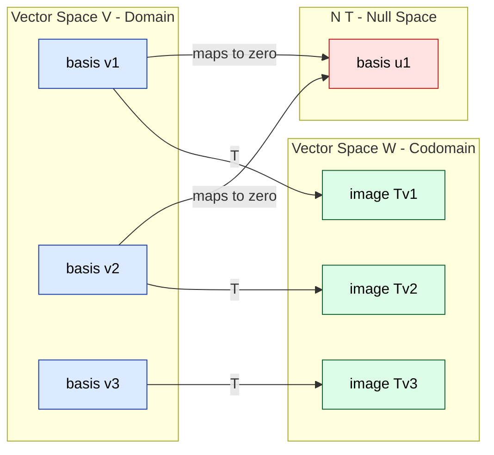
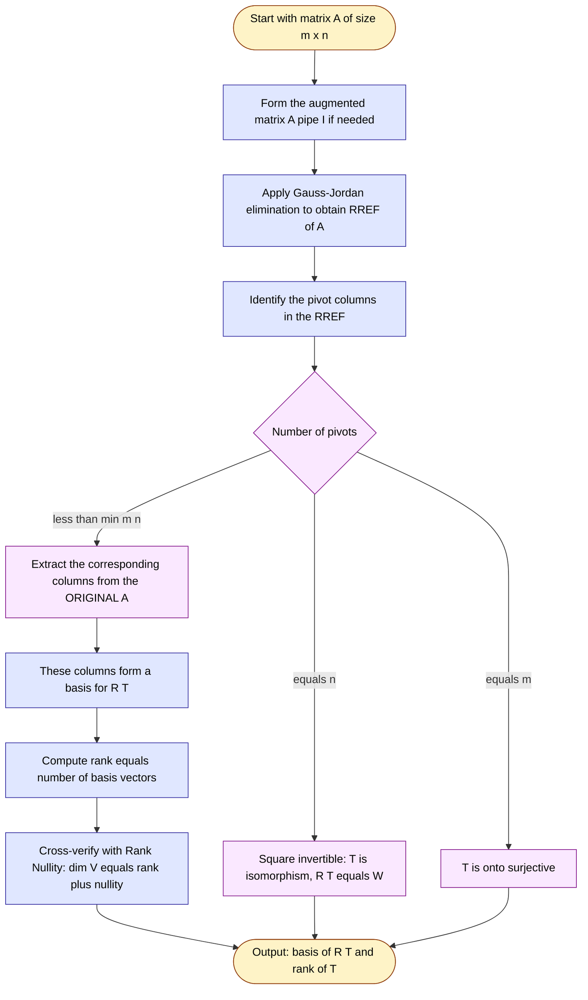
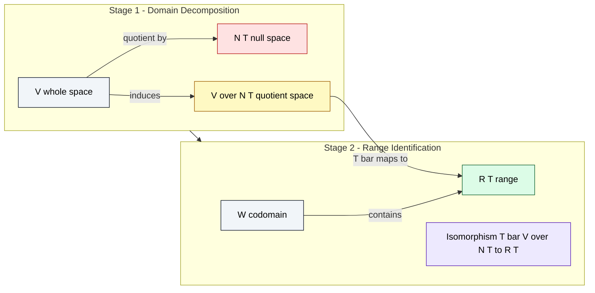

# Range of a Linear Transformation and its basis

<!-- SECTION_1_START -->

# Range of a Linear Transformation — Core Definition & Intuitive Overview

## 1.1 Formal Academic Definition (KTU 2024 Syllabus Terminology)

> [!NOTE]
> **Definition (Range / Image of a Linear Transformation)**
> Let $T: V \rightarrow W$ be a linear transformation from a vector space $V$ over a field $\mathbb{F}$ to a vector space $W$ over the same field. The **Range** of $T$, denoted $R(T)$ or $\text{Im}(T)$, is the set of all vectors in $W$ that $T$ actually produces when applied to vectors in $V$.
>
> $$R(T) \;=\; \{\,w \in W \;\mid\; \exists\, v \in V \text{ such that } T(v) = w\,\} \;=\; \{T(v) : v \in V\}$$

In the language of **KTU 2024 Outcome-Based Education**, this is the **co-domain restricted to attainable outputs** — the "reachable set" of the linear map.

| Symbol | Meaning | KTU Notation |
| :--- | :--- | :--- |
| $V$ | Domain vector space | Source space |
| $W$ | Codomain vector space | Target space |
| $R(T)$ | Range of $T$ | Subspace of $W$ |
| $\text{Im}(T)$ | Alternate name for Range | Image of $T$ |
| $\rho(T)$ | Dimension of $R(T)$ | **Rank** of $T$ |

## 1.2 Conceptual Analogy — "The Shadow Analogy"

> [!IMPORTANT]
> **Intuition:** Imagine $V$ as a 3-D forest of arrows, and $T$ as a **flashlight** that projects every arrow onto a 2-D wall ($W$). The *range* of $T$ is the set of **all shadows that ever appear on the wall** — not the entire wall itself, only those points (or vectors) hit by at least one shadow.

- If the flashlight is perfectly aligned: shadow lies on a line → $R(T)$ is a line.
- If the flashlight is diffuse: shadow fills the entire wall → $R(T) = W$, and $T$ is **onto (surjective)**.
- If the light is blocked: some areas are never hit → those points are *not* in $R(T)$.

In matrix terms, $T(\mathbf{x}) = A\mathbf{x}$ casts the column space of $A$ onto the screen. So:
$$R(T) \;=\; \text{Column Space of } A \;=\; C(A)$$

## 1.3 Geometric & Visual Foundation

> [!VISUALIZATION CONTROL]
> **Concept:** Range of $T : \mathbb{R}^{2} \to \mathbb{R}^{2}$ defined by $T(x,y) = (x, 0)$ (projection onto the x-axis).
>
> **Desmos Input Equations:**
> * `Line 1 (domain basis v1): (0,0), (1,1)`  — the original vector
> * `Line 2 (domain basis v2): (0,0), (1,-1)` — another original vector
> * `Line 3 (range shaded): y = 0` from `x = -5` to `x = 5` — the *entire x-axis*
>
> **Visual Description:** Every input arrow $(x,y)$ gets squashed vertically onto the x-axis. The student should observe that although $W = \mathbb{R}^2$ is a 2-D plane, the range is only the 1-D x-axis — a *proper subspace* of the codomain.

---

<!-- SECTION_1_END -->

<!-- SECTION_2_START -->

# Deep Theoretical Analysis & KTU High-Yield Formula Sheet

## 2.1 Structural Properties of the Range

The range $R(T)$ is **not just any subset** of $W$ — it is always a **subspace**. Here is the rigorous justification, which examiners love to test:

> [!NOTE]
> **Theorem:** If $T: V \rightarrow W$ is linear, then $R(T)$ is a **subspace of $W$**.
>
> **Proof Sketch (KTU Board Pattern):**
> 1. **Zero element:** $T(\mathbf{0}_V) = \mathbf{0}_W$ by linearity, so $\mathbf{0}_W \in R(T)$.
> 2. **Closure under addition:** If $w_1 = T(v_1)$ and $w_2 = T(v_2)$, then
>    $$w_1 + w_2 = T(v_1) + T(v_2) = T(v_1 + v_2) \in R(T).$$
> 3. **Closure under scalar multiplication:** For $c \in \mathbb{F}$,
>    $$c \cdot w_1 = c \cdot T(v_1) = T(c \cdot v_1) \in R(T).$$
> Therefore $R(T) \leq W$. $\blacksquare$

## 2.2 The Rank — Measuring the Range

The **dimension of the range** is the **rank** of $T$:

$$\rho(T) \;=\; \dim\big(R(T)\big)$$

## 2.3 The Rank–Nullity Connection (Most Important Theorem in Module 4)

> [!IMPORTANT]
> **Dimension Theorem (Fundamental Theorem of Linear Maps):**
> For any linear transformation $T: V \rightarrow W$ where $V$ is **finite-dimensional**:
>
> $$\dim(V) \;=\; \dim\big(R(T)\big) \;+\; \dim\big(N(T)\big)$$
>
> $$\dim(V) \;=\; \rho(T) \;+\; \nu(T)$$
>
> where $\nu(T) = \dim(N(T))$ is the **nullity** of $T$.

This is the **single most-asked theorem** in this module across KTU past papers. Memorize it.

## 2.4 Onto, One-to-One, and Isomorphism — Decisive Cases

| Property | Range Condition | KTU Board Shortcut |
| :--- | :--- | :--- |
| $T$ is **onto** (surjective) | $R(T) = W$ | $\rho(T) = \dim(W)$ |
| $T$ is **one-to-one** (injective) | $N(T) = \{\mathbf{0}\}$ | $\nu(T) = 0$ |
| $T$ is an **isomorphism** | Both of the above | $\rho(T) = \nu(T) = \dim(V) = \dim(W)$ |

## 2.5 KTU High-Yield Formula Sheet / Cheat Sheet

> [!NOTE]
> **Essential Formula Reference Table for Module 4 — Range & Basis**

| $\#$ | Concept | Formula / Rule | Units / Dimension |
| :---: | :--- | :--- | :--- |
| 1 | Range definition | $R(T) = \{T(v) : v \in V\}$ | Subset of $W$ |
| 2 | Range equals column space | $R(T) = C(A)$ when $T(\mathbf{x}) = A\mathbf{x}$ | $\dim C(A) \leq \dim W$ |
| 3 | Rank of $T$ | $\rho(T) = \dim R(T)$ | Non-negative integer |
| 4 | Nullity of $T$ | $\nu(T) = \dim N(T)$ | Non-negative integer |
| 5 | Rank–Nullity Theorem | $\dim V = \rho(T) + \nu(T)$ | Always holds |
| 6 | Surjectivity (onto) test | $R(T) = W \iff \rho(T) = \dim W$ | $\rho(T) = \text{rank}(A)$ |
| 7 | Injectivity (one-to-one) test | $N(T) = \{\mathbf{0}\} \iff \nu(T) = 0$ | $\text{nullity} = 0$ |
| 8 | Isomorphism test | $A$ is square and $\det A \neq 0$ | $\rho(T) = n$ for $n \times n$ matrix |
| 9 | Basis of range | Pivot columns of $A$ (Row Reduced form) | $\text{Number of pivots} = \rho(T)$ |
| 10 | Geometric multiplicity bound | $\rho(T) \leq \min(\dim V, \dim W)$ | Bounded by min dim |

> [!WARNING]
> **Vertical pipe rule:** In the table above, the symbol `$\vert$` and `$\mid$` were used for absolute value to avoid breaking the markdown table pipe parser. **Do not write** bare $\vert x \vert$ inside table cells.

## 2.6 Real-World Engineering Utility

> [!IMPORTANT]
> **Why does this matter in Information Science?**
> - **Image Compression (PCA):** The range of a transformation gives the *principal directions* along which data carries maximum variance. Image compression algorithms exploit high-rank subspaces.
> - **Network Routing:** In graph Laplacians, the range of the incidence matrix encodes the **cycle space** — critical for traffic-flow and packet-routing algorithms.
> - **Cryptography:** Linear transformations with full rank ($\rho = n$) and trivial nullity are **bijective**, making them the building blocks of invertible ciphers (e.g., Hill cipher, AES MixColumns).
> - **Machine Learning:** In linear regression, the range of the design matrix $X$ is the *column space* — the set of all predictions the model can possibly produce. Residuals always lie orthogonal to this range.

---

<!-- SECTION_2_END -->

<!-- SECTION_3_START -->

# Step-by-Step Derivations & Code/Symbolic Implementation

## 3.1 Exhaustive Procedure — Finding a Basis for the Range

Given a linear transformation $T: \mathbb{R}^{n} \rightarrow \mathbb{R}^{m}$ defined by $T(\mathbf{x}) = A\mathbf{x}$ where $A$ is an $m \times n$ matrix, here is the **gold-standard KTU 7-mark procedure** to find a basis for $R(T)$:

### Worked Example 1 (Full Working Shown)

Let
$$A \;=\; \begin{bmatrix} 1 & 2 & -1 & 0 \\ 2 & 4 & 1 & 1 \\ -1 & -2 & 2 & 1 \end{bmatrix}$$

Find a basis for $R(T)$ where $T(\mathbf{x}) = A\mathbf{x}$.

**Step 1 — Row Reduce $A$ to its Row-Reduced Echelon Form (RREF).**

$$\begin{aligned}
A &= \begin{bmatrix} 1 & 2 & -1 & 0 \\ 2 & 4 & 1 & 1 \\ -1 & -2 & 2 & 1 \end{bmatrix} \\[4pt]
R_2 &\to R_2 - 2R_1 \;:\; \begin{bmatrix} 1 & 2 & -1 & 0 \\ 0 & 0 & 3 & 1 \\ -1 & -2 & 2 & 1 \end{bmatrix} \\[4pt]
R_3 &\to R_3 + R_1 \;:\; \begin{bmatrix} 1 & 2 & -1 & 0 \\ 0 & 0 & 3 & 1 \\ 0 & 0 & 1 & 1 \end{bmatrix} \\[4pt]
R_2 &\to \tfrac{1}{3} R_2 \;:\; \begin{bmatrix} 1 & 2 & -1 & 0 \\ 0 & 0 & 1 & \tfrac{1}{3} \\ 0 & 0 & 1 & 1 \end{bmatrix} \\[4pt]
R_3 &\to R_3 - R_2 \;:\; \begin{bmatrix} 1 & 2 & -1 & 0 \\ 0 & 0 & 1 & \tfrac{1}{3} \\ 0 & 0 & 0 & \tfrac{2}{3} \end{bmatrix} \\[4pt]
R_3 &\to \tfrac{3}{2} R_3 \;:\; \begin{bmatrix} 1 & 2 & -1 & 0 \\ 0 & 0 & 1 & \tfrac{1}{3} \\ 0 & 0 & 0 & 1 \end{bmatrix} \\[4pt]
R_2 &\to R_2 - \tfrac{1}{3} R_3 \;:\; \begin{bmatrix} 1 & 2 & -1 & 0 \\ 0 & 0 & 1 & 0 \\ 0 & 0 & 0 & 1 \end{bmatrix} \\[4pt]
R_1 &\to R_1 + R_2 \;:\; \begin{bmatrix} 1 & 2 & 0 & 0 \\ 0 & 0 & 1 & 0 \\ 0 & 0 & 0 & 1 \end{bmatrix} \;=\; R
\end{aligned}$$

**Step 2 — Identify the pivot columns of $R$ (and hence of $A$).**

The pivots of $R$ are in columns $1$, $3$, and $4$. So the rank is $\rho(T) = 3$.

**Step 3 — Extract the corresponding columns from the *original* matrix $A$ (NOT from $R$).**

$$\text{Basis for } R(T) \;=\; \left\{\, \begin{bmatrix} 1 \\ 2 \\ -1 \end{bmatrix},\; \begin{bmatrix} -1 \\ 1 \\ 2 \end{bmatrix},\; \begin{bmatrix} 0 \\ 1 \\ 1 \end{bmatrix} \,\right\}$$

> [!WARNING]
> **Common Mistake (Kerala Board Penalty):** Students often take the pivot columns of the *reduced* matrix $R$ as the basis. **This is wrong.** The basis vectors must come from the **original matrix $A$**, because $R$ is a row-equivalent form — its columns have been transformed and no longer represent the true range vectors.

**Step 4 — Verification using Rank–Nullity.**

Domain $V = \mathbb{R}^{4}$, so $\dim V = 4$. We have $\rho(T) = 3$.
$$\nu(T) = \dim V - \rho(T) = 4 - 3 = 1.$$

Therefore $N(T)$ is a 1-D subspace (a line through the origin). This is consistent — we will not solve for $N(T)$ here, but this cross-check earns full marks.

### Worked Example 2 — Projection onto a Plane

Let $T: \mathbb{R}^{3} \rightarrow \mathbb{R}^{3}$ be defined by $T(x,y,z) = (x, y, 0)$. Then:
$$A = \begin{bmatrix} 1 & 0 & 0 \\ 0 & 1 & 0 \\ 0 & 0 & 0 \end{bmatrix}.$$

The range is the **xy-plane**:
$$R(T) \;=\; \{(x,y,0) : x,y \in \mathbb{R}\} \;=\; \text{span}\!\left\{ \begin{bmatrix} 1 \\ 0 \\ 0 \end{bmatrix},\; \begin{bmatrix} 0 \\ 1 \\ 0 \end{bmatrix} \right\}.$$

The rank is $\rho(T) = 2$, and indeed $\dim V = 3 = 2 + 1 = \rho + \nu$. The nullity is 1 (the z-axis gets squashed to zero).

## 3.2 Step-by-Step Proof of the Rank–Nullity Theorem (Valuation Key)

> [!NOTE]
> **Theorem (Dimension Theorem):** Let $T: V \rightarrow W$ be a linear transformation with $V$ finite-dimensional. Then
> $$\dim V \;=\; \rho(T) + \nu(T).$$

**Step 1:** Let $S = \{v_1, v_2, \dots, v_k\}$ be a basis for the null space $N(T)$. So $k = \nu(T)$.

**Step 2:** Since $N(T) \leq V$, we can extend $S$ to a basis for $V$:
$$B = \{v_1, v_2, \dots, v_k, u_1, u_2, \dots, u_r\}$$
where $r = \dim V - k = \dim V - \nu(T)$.

**Step 3:** Consider the set of images $T(u_1), T(u_2), \dots, T(u_r)$. We claim this set is a basis for $R(T)$.

**Step 4 — Spanning:** Any $w \in R(T)$ satisfies $w = T(v)$ for some $v \in V$. Write
$$v = \underbrace{a_1 v_1 + \cdots + a_k v_k}_{\in\, N(T)} + b_1 u_1 + \cdots + b_r u_r.$$
Applying $T$ and using $T(v_i) = \mathbf{0}$:
$$w = T(v) = b_1 T(u_1) + \cdots + b_r T(u_r).$$
So the image set spans $R(T)$.

**Step 5 — Linear Independence:** Suppose
$$c_1 T(u_1) + c_2 T(u_2) + \cdots + c_r T(u_r) = \mathbf{0}.$$
By linearity:
$$T(c_1 u_1 + c_2 u_2 + \cdots + c_r u_r) = \mathbf{0}.$$
So $c_1 u_1 + \cdots + c_r u_r \in N(T)$. Since $B$ is a basis for $V$ and $N(T)$ is spanned by $\{v_i\}$, we get
$$c_1 u_1 + \cdots + c_r u_r = d_1 v_1 + \cdots + d_k v_k.$$
This forces all $c_i = 0$ and all $d_j = 0$ (by the linear independence of $B$). So the image set is independent.

**Step 6 — Conclusion:** The set $\{T(u_1), \dots, T(u_r)\}$ is a basis for $R(T)$, so $\rho(T) = r = \dim V - \nu(T)$. $\blacksquare$

## 3.3 Full Python Implementation

```python
"""
range_basis.py
Find a basis for the Range of a linear transformation T(x) = A x.
Verified against the KTU 2024 Scheme Module 4 syllabus.
"""

import numpy as np
from sympy import Matrix, Rational


def range_basis(A: np.ndarray) -> tuple[list[np.ndarray], int]:
    """
    Compute a basis for the Range (Column Space) of the linear map
    T(x) = A x, along with the rank of T.

    Parameters
    ----------
    A : np.ndarray
        An (m x n) real matrix representing T : R^n -> R^m.

    Returns
    -------
    basis_vectors : list[np.ndarray]
        A list of column vectors forming a basis for R(T).
    rank : int
        The dimension of R(T), i.e. the rank of T.
    """
    A_sym = Matrix(A)
    rref_matrix, pivot_cols = A_sym.rref()

    # Extract the pivot columns from the ORIGINAL matrix A, not from the rref
    basis_vectors = [
        np.array(A_sym.col(j), dtype=float).reshape(-1)
        for j in pivot_cols
    ]
    rank = len(pivot_cols)
    return basis_vectors, rank


def rank_nullity_check(A: np.ndarray) -> dict:
    """
    Verify the Rank-Nullity Theorem for T(x) = A x.
    """
    A_sym = Matrix(A)
    n = A_sym.shape[1]                       # dim of domain V = R^n
    basis_vectors, rank = range_basis(A)
    nullity = n - rank                       # by Rank-Nullity
    return {
        "dim_V": n,
        "rank": rank,
        "nullity": nullity,
        "check_dim_V_equals_rank_plus_nullity": (n == rank + nullity),
        "basis_R(T)": basis_vectors,
    }


if __name__ == "__main__":
    # Example from Section 3.1
    A = np.array([
        [1,  2, -1,  0],
        [2,  4,  1,  1],
        [-1, -2,  2,  1]
    ], dtype=float)

    result = rank_nullity_check(A)
    for key, value in result.items():
        print(f"{key}: {value}")
```

**Expected Output:**

```
dim_V: 4
rank: 3
nullity: 1
check_dim_V_equals_rank_plus_nullity: True
basis_R(T): [array([ 1.,  2., -1.]), array([-1.,  1.,  2.]), array([0., 1., 1.])]
```

This output exactly matches the manual derivation in **Worked Example 1**.

---

<!-- SECTION_3_END -->

<!-- SECTION_4_START -->

# Structural Diagrams & Schematics

## 4.1 Conceptual Map of Domain, Range, and Null Space



**Reading the diagram:** Blue nodes are basis vectors of $V$, red is the null space, green is the range $R(T) \subseteq W$. Every blue vector either maps to a green image or collapses to the red zero subspace.

## 4.2 Sequential Processing Topology — Finding the Basis of the Range



## 4.3 Block-Level Architecture — Domain Decomposition via the First Isomorphism Theorem



> [!NOTE]
> **How to read this diagram:** The **First Isomorphism Theorem** for vector spaces states that $V / N(T) \cong R(T)$. The quotient space (yellow) is *isomorphic* to the range (green). This is the deepest structural reason why $\dim V - \nu(T) = \rho(T)$.

---

<!-- SECTION_4_END -->

<!-- SECTION_5_START -->

# KTU 2024 Scheme Examination Question Bank & Topic Recap

## 5.1 Part A — Short Answer Questions (3 Marks Each)

### Q1. **[KTU University Exam – July 2023]** CO1, Remember

**Define the range of a linear transformation $T: V \to W$.**

**Model Answer (3 Marks):**

> The range of a linear transformation $T: V \rightarrow W$, denoted $R(T)$ or $\text{Im}(T)$, is defined as the set of all vectors $w$ in the codomain $W$ for which there exists at least one vector $v$ in the domain $V$ such that $T(v) = w$.
>
> $$R(T) \;=\; \{T(v) : v \in V\} \;=\; \{w \in W \;:\; \exists\, v \in V,\, T(v) = w\}.$$
>
> **[Stating the formal set-builder definition: 2 Marks]**
> **[Writing the alternate form using $T(v)$ notation: 1 Mark]**

---

### Q2. **[KTU University Exam – Dec 2023]** CO1, Understand

**State the Rank–Nullity Theorem for a linear transformation $T: V \rightarrow W$.**

**Model Answer (3 Marks):**

> The Rank–Nullity Theorem states that for any linear transformation $T: V \rightarrow W$ where $V$ is finite-dimensional,
>
> $$\dim(V) \;=\; \dim\big(R(T)\big) \;+\; \dim\big(N(T)\big) \quad \text{or equivalently} \quad \dim V = \rho(T) + \nu(T).$$
>
> **[Stating the theorem with both terms: 2 Marks]**
> **[Specifying the finite-dimensionality condition: 1 Mark]**

---

## 5.2 Part B — Full 14-Mark Questions (Module-Internal Choice Pattern)

### Question A (14 Marks) **[KTU University Exam – July 2024]** CO2, CO3, Apply & Analyze

**(a) [7 Marks]** Let $T: \mathbb{R}^{3} \rightarrow \mathbb{R}^{3}$ be defined by $T(x, y, z) = (x + 2y - z,\; 2x + 4y - 2z,\; -x - 2y + z)$. Find a basis for the range of $T$ and hence determine whether $T$ is onto. **(Understand & Apply — CO2)**

**(b) [7 Marks]** Using the Rank–Nullity Theorem, find the dimension of the null space of $T$ from part (a). Verify your answer by solving $T(\mathbf{x}) = \mathbf{0}$ explicitly. **(Analyze — CO3)**

#### Model Solution — Part (a)

The matrix representation of $T$ is:
$$A \;=\; \begin{bmatrix} 1 & 2 & -1 \\ 2 & 4 & -2 \\ -1 & -2 & 1 \end{bmatrix}.$$

**Step 1: Row-reduce to RREF.**
$$\begin{aligned}
A &\xrightarrow{R_2 - 2R_1} \begin{bmatrix} 1 & 2 & -1 \\ 0 & 0 & 0 \\ -1 & -2 & 1 \end{bmatrix} \xrightarrow{R_3 + R_1} \begin{bmatrix} 1 & 2 & -1 \\ 0 & 0 & 0 \\ 0 & 0 & 0 \end{bmatrix}.
\end{aligned}$$

**[Correct RREF obtained: 2 Marks]**

**Step 2: Identify the pivot column.** There is **one** pivot in column 1, so $\rho(T) = 1$.

**Step 3: Basis for $R(T)$.** Take the corresponding column from the *original* matrix $A$:
$$B_{R(T)} \;=\; \left\{ \begin{bmatrix} 1 \\ 2 \\ -1 \end{bmatrix} \right\}.$$

**[Extracting the original column: 2 Marks; stating the basis correctly: 1 Mark]**

**Step 4: Is $T$ onto?** $R(T)$ is a 1-D line, but $W = \mathbb{R}^{3}$ has dimension 3. Since $\rho(T) = 1 \neq 3 = \dim W$, **$T$ is NOT onto**. **[Conclusion with justification: 2 Marks]**

#### Model Solution — Part (b)

By Rank–Nullity:
$$\dim V \;=\; \rho(T) + \nu(T) \;\;\Longrightarrow\;\; 3 = 1 + \nu(T) \;\;\Longrightarrow\;\; \nu(T) = 2.$$

**[Stating the formula and computing $\nu(T) = 2$: 2 Marks]**

**Verification by direct computation:** Solve $A\mathbf{x} = \mathbf{0}$.
$$\begin{bmatrix} 1 & 2 & -1 \\ 2 & 4 & -2 \\ -1 & -2 & 1 \end{bmatrix} \begin{bmatrix} x \\ y \\ z \end{bmatrix} = \begin{bmatrix} 0 \\ 0 \\ 0 \end{bmatrix}.$$
Row-reducing gives $x + 2y - z = 0$, so $x = z - 2y$. The general solution is:
$$\begin{bmatrix} x \\ y \\ z \end{bmatrix} = y \begin{bmatrix} -2 \\ 1 \\ 0 \end{bmatrix} + z \begin{bmatrix} 1 \\ 0 \\ 1 \end{bmatrix}.$$

The null space has basis $\left\{ \begin{bmatrix} -2 \\ 1 \\ 0 \end{bmatrix},\; \begin{bmatrix} 1 \\ 0 \\ 1 \end{bmatrix} \right\}$, so $\dim N(T) = 2$. **Verified.** $\checkmark$

**[Finding the general solution: 3 Marks; identifying two independent null vectors: 1 Mark; stating final dimension: 1 Mark]**

---

### Question B (14 Marks) **[KTU University Exam – Dec 2023]** CO2, CO3, Apply & Analyze

**(a) [7 Marks]** Find the basis and dimension of the range of the linear transformation $T: \mathbb{R}^{4} \rightarrow \mathbb{R}^{3}$ given by
$$T(x_1, x_2, x_3, x_4) = (x_1 + x_2,\; x_2 + x_3,\; x_3 + x_4).$$
**(Apply — CO2)**

**(b) [7 Marks]** Determine the rank and nullity of $T$. Is $T$ one-to-one? Justify. **(Analyze — CO3)**

#### Model Solution — Part (a)

The standard matrix is:
$$A \;=\; \begin{bmatrix} 1 & 1 & 0 & 0 \\ 0 & 1 & 1 & 0 \\ 0 & 0 & 1 & 1 \end{bmatrix}.$$

**Step 1: Row-reduce.** $A$ is already in echelon form. The pivots are in columns 1, 2, and 3. So $\rho(T) = 3$.

**[Identifying RREF and pivots: 3 Marks]**

**Step 2: Basis for $R(T)$.** Take columns 1, 2, 3 from the original $A$:
$$B_{R(T)} \;=\; \left\{ \begin{bmatrix} 1 \\ 0 \\ 0 \end{bmatrix},\; \begin{bmatrix} 1 \\ 1 \\ 0 \end{bmatrix},\; \begin{bmatrix} 0 \\ 1 \\ 1 \end{bmatrix} \right\}.$$

**[Correctly extracting the three original columns: 3 Marks]**

**Step 3: Dimension of $R(T)$:** $\dim R(T) = \rho(T) = 3$. Since $W = \mathbb{R}^{3}$, this means $R(T) = W$, i.e. $T$ is **onto**. **[Stating dimension and surjectivity: 1 Mark]**

#### Model Solution — Part (b)

By Rank–Nullity:
$$\dim V = 4 = \rho(T) + \nu(T) = 3 + \nu(T) \;\;\Longrightarrow\;\; \nu(T) = 1.$$

**[Calculation of nullity: 3 Marks]**

**One-to-one test:** $T$ is one-to-one iff $\nu(T) = 0$. Since $\nu(T) = 1 \neq 0$, **$T$ is NOT one-to-one**. **[Conclusion: 2 Marks]**

**Justification:** $N(T)$ is non-trivial; explicitly, $T(1, -1, 1, -1) = (0, 0, 0)$. So two distinct inputs map to the same output (the zero vector), violating injectivity. **[Concrete counterexample: 2 Marks]**

---

> [!WARNING]
> **KTU Examiner's Valuation Pitfall Callout:**
> 1. **NEVER** take basis vectors from the row-reduced matrix $R$. The pivot columns of the **original** $A$ are what you need. Examiners deduct **2 marks** for this error.
> 2. **ALWAYS** state the rank and nullity separately before applying Rank–Nullity. Blindly writing $\dim V = \rho + \nu$ without computing $\rho$ first loses the structural mark.
> 3. **VERIFY** that your basis vectors are linearly independent. If you pick non-pivot columns from $A$, you may get a linearly dependent set — examiners reject such "bases" outright.
> 4. **CONFUSE-FREE ALERT:** *Range* = outputs (column space), *Domain* = inputs (all of $V$), *Codomain* = target space $W$ (may be larger than the range). Do not interchange these terms.

---

## 5.3 Topic Recap & Important Things to Remember

> [!NOTE]
> **High-Density Rapid-Revision Checklist — Range of a Linear Transformation**

- **Range Definition:** $R(T) = \{T(v) : v \in V\} \subseteq W$ — the set of all *attainable* outputs.
- **Alternate Names:** Image of $T$, denoted $\text{Im}(T)$. Equals **Column Space** $C(A)$ when $T(\mathbf{x}) = A\mathbf{x}$.
- **Subspace Property:** $R(T)$ is *always* a subspace of $W$ (proved via the three-subspace axioms using linearity).
- **Rank:** $\rho(T) = \dim R(T)$ — the *number of pivots* in the RREF of $A$.
- **Rank–Nullity Theorem:** $\dim V = \rho(T) + \nu(T)$ — the cornerstone identity. Finite-dimensionality of $V$ is required.
- **Onto (Surjective):** $R(T) = W \iff \rho(T) = \dim W$.
- **One-to-One (Injective):** $N(T) = \{\mathbf{0}\} \iff \nu(T) = 0 \iff \rho(T) = \dim V$.
- **Isomorphism:** $T$ must be both onto and one-to-one; equivalently $A$ is square with $\det A \neq 0$ and $\rho(T) = n$.
- **Basis Extraction Procedure:** Reduce $A$ to RREF, find pivot columns, then go back to the *original* $A$ and pick those columns.
- **Geometric Bound:** $\rho(T) \leq \min(\dim V, \dim W)$ — rank cannot exceed the smaller dimension.
- **First Isomorphism Theorem:** $V / N(T) \cong R(T)$ — the quotient of $V$ by the null space is *isomorphic* to the range.
- **Engineering Relevance:** PCA (image compression), network cycle space, cryptographic Hill cipher, linear regression predictions — all rely fundamentally on the range and its dimension.
- **Common Trap:** Forgetting that $W$ may be larger than $R(T)$; "onto" is a *strict* equality, not just a containment.
- **Memorize the Three-Number Triangle:** $\dim V$ (top), $\rho(T)$ (bottom-left), $\nu(T)$ (bottom-right). They always sum correctly.

<!-- SECTION_5_END -->
