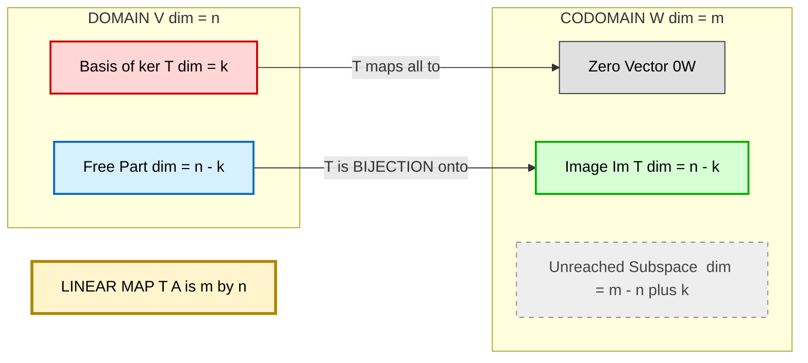
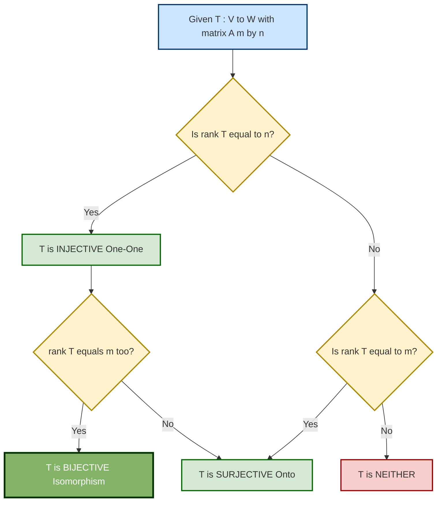

# Rank and Nullity of a Linear Transformation

<!-- SECTION_1_START -->

# Rank and Nullity of a Linear Transformation

## 1.1 Core Technical Definition

> [!IMPORTANT]
> **Linear Transformation (KTU 2024 Syllabus Definition)**
> A **linear transformation** $T : V \to W$ is a mapping between two vector spaces over the same field $\mathbb{F}$ that satisfies two axioms for all $\mathbf{u}, \mathbf{v} \in V$ and $c \in \mathbb{F}$:
> 1. **Additivity:** $T(\mathbf{u} + \mathbf{v}) = T(\mathbf{u}) + T(\mathbf{v})$
> 2. **Homogeneity:** $T(c\,\mathbf{u}) = c\,T(\mathbf{u})$

Once $T$ is established, the two fundamental subspaces used to *measure* it are:

> [!NOTE]
> **Kernel (Null Space) of $T$**
> $$\ker(T) = \{\mathbf{v} \in V \mid T(\mathbf{v}) = \mathbf{0}_W\}$$
> It is the set of all vectors in $V$ that $T$ "crushes" to the zero vector. $\ker(T)$ is always a subspace of $V$.

> [!NOTE]
> **Image (Range) of $T$**
> $$\operatorname{Im}(T) = \{T(\mathbf{v}) \mid \mathbf{v} \in V\} = \{\mathbf{w} \in W \mid \exists\,\mathbf{v} \in V,\ T(\mathbf{v}) = \mathbf{w}\}$$
> It is the set of all vectors in $W$ that $T$ can actually produce. $\operatorname{Im}(T)$ is always a subspace of $W$.

The **two numerical invariants** that classify $T$ are then:

> [!IMPORTANT]
> **Rank and Nullity (KTU Board Definitions)**
> $$\operatorname{rank}(T) = \dim(\operatorname{Im}(T)), \qquad \operatorname{nullity}(T) = \dim(\ker(T))$$

The KTU board expects these to be written with the exact wording: *“rank of T is the dimension of the image (range) space of T, and nullity of T is the dimension of the kernel (null space) of T.”*

---

## 1.2 Conceptual Analogy / Intuition

Imagine a factory assembly line $T$ that takes raw materials from warehouse $V$ and produces finished products in warehouse $W$.

- **The Kernel** is the pile of *useless raw material* that gets discarded (mapped to the garbage $\mathbf{0}_W$). Its size is the **nullity**.
- **The Image** is the actual *set of products rolling off the line*. Its size is the **rank**.

If the factory throws away *nothing*, then $\ker(T) = \{\mathbf{0}\}$ and the production is *one-to-one* — every input gives a unique output. If the factory produces *every possible product* in $W$, then the line is *onto*. A line that is both, is a perfect *bijection* (an **isomorphism**).

> [!TIP]
> **Geometric Intuition (GeoGebra Visualization)**
>
> > [!VISUALIZATION CONTROL]
> > **Concept:** Rank and Nullity of a projection transformation
> > **GeoGebra Input Equations:**
> > * Projection onto the $x$-axis: $T(x, y) = (x, 0)$
> > * Define: `Vector((a, b))` and `ApplyMatrix({{1, 0}, {0, 0}}, (a, b))`
> > **Visual Description:** Every blue arrow gets "flattened" to the red $x$-axis. The flattened (red) line is the **image** (rank $=1$). The vertical green arrows that collapse to the origin are the **kernel** (nullity $=1$). Total dimension $= 1 + 1 = 2 = \dim(\mathbb{R}^2)$. ✓

---

## 1.3 Standard Metrics & Constants

| Symbol | Meaning | Standard Notation in KTU Papers |
| :--- | :--- | :--- |
| $V, W$ | Domain and Codomain vector spaces | $V_n$ and $W_m$ |
| $n$ | Dimension of $V$ | $\dim(V) = n$ |
| $m$ | Dimension of $W$ | $\dim(W) = m$ |
| $r$ | Rank of $T$ | $r = \rho(T)$ |
| $k$ | Nullity of $T$ | $k = n - r$ |

> [!WARNING]
> **KTU 2024 Common Mistake:** Many students write $r + k = m$. This is **wrong** when the domain and codomain have different dimensions. The correct identity is $r + k = \dim(V) = n$.

---

<!-- SECTION_1_END -->

<!-- SECTION_2_START -->

# Deep Theoretical Analysis & KTU High-Yield Formula Sheet

## 2.1 The Structural Relationship Between the Three Subspaces

A linear transformation $T : V \to W$ produces a clean **2-step decomposition** of the domain:

1. **Step 1 — Collapse the kernel:** Every vector $\mathbf{v} \in V$ can be uniquely written as $\mathbf{v} = \mathbf{k} + \mathbf{u}$, where $\mathbf{k} \in \ker(T)$ and $\mathbf{u}$ is some "free" vector.
2. **Step 2 — Map to the image:** The map $T$ is a *bijection* (one-to-one and onto) from the "free part" of $V$ onto the image $\operatorname{Im}(T) \subseteq W$.

This is the geometric heart of the **Rank-Nullity Theorem**.

---

## 2.2 The Rank-Nullity Theorem (Fundamental Theorem of Linear Maps)

> [!IMPORTANT]
> **Theorem (Rank-Nullity Theorem)**
> If $V$ is a finite-dimensional vector space and $T : V \to W$ is a linear transformation, then
> $$\dim(V) = \operatorname{rank}(T) + \operatorname{nullity}(T)$$
> In terms of a representing matrix $A_{m \times n}$ of $T$:
> $$n = \rho(A) + \nu(A) \quad \text{where} \quad \nu(A) = n - \rho(A)$$

**Why this matters (the *Why* and the *How*):**
- It is the **single most tested identity** in KTU Module 4.
- It connects *domain* dimension to *column* rank via the *row-reduced echelon form (RREF)*.
- It tells us that a transformation *cannot be both fully injective and fully surjective* unless $\dim(V) = \dim(W)$.

---

## 2.3 The Invertibility Test (Critical for KTU Board Exams)

> [!TIP]
> For a linear transformation $T : V \to W$ with representing matrix $A$ of size $m \times n$:
>
> | Property of $T$ | Condition on Rank | Matrix Test |
> | :--- | :--- | :--- |
> | $T$ is **Injective** (One-One) | $\operatorname{rank}(T) = n$ (full column rank) | $\ker(T) = \{\mathbf{0}\}$ |
> | $T$ is **Surjective** (Onto) | $\operatorname{rank}(T) = m$ (full row rank) | $\operatorname{Im}(T) = W$ |
> | $T$ is **Bijective** (Isomorphism) | $\operatorname{rank}(T) = n = m$ | $\det(A) \neq 0$ for square $A$ |
> | $T$ is **Zero Map** | $\operatorname{rank}(T) = 0$ | $A = \mathbf{0}_{m \times n}$ |

---

## 2.4 KTU Formula Cheat Sheet (Print-and-Carry Card)

| # | Formula / Identity | Meaning / When to Use |
| :--- | :--- | :--- |
| 1 | $\operatorname{rank}(T) = \dim(\operatorname{Im}(T))$ | Always, by definition |
| 2 | $\operatorname{nullity}(T) = \dim(\ker(T))$ | Always, by definition |
| 3 | $\dim(V) = \operatorname{rank}(T) + \operatorname{nullity}(T)$ | Rank-Nullity Theorem |
| 4 | $\operatorname{rank}(A) = \text{number of pivots in RREF}$ | Row-reduce to find rank |
| 5 | $\operatorname{nullity}(A) = n - \operatorname{rank}(A)$ | Direct consequence of (3) and (4) |
| 6 | $\operatorname{rank}(A) = \operatorname{rank}(A^T)$ | Row rank $=$ Column rank |
| 7 | $\operatorname{rank}(AB) \le \min(\operatorname{rank}(A), \operatorname{rank}(B))$ | Used in composition $T_1 \circ T_2$ |
| 8 | $\operatorname{rank}(A + B) \le \operatorname{rank}(A) + \operatorname{rank}(B)$ | Subadditivity of rank |
| 9 | $T$ injective $\iff \operatorname{nullity}(T) = 0$ | Direct from definition |
| 10 | $T$ surjective $\iff \operatorname{rank}(T) = \dim(W)$ | Direct from definition |

> [!NOTE]
> **Engineering & Computer Science Utility:**
> - **Computer Graphics:** 3D rotation matrices have $\operatorname{rank} = 3$ and $\operatorname{nullity} = 0$ (they are bijective). Projection onto a 2D screen drops rank to $2$.
> - **Machine Learning (PCA):** Rank tells you the number of independent features; nullity tells you redundant (linearly dependent) features that can be removed without information loss.
> - **Cryptography:** The Hill cipher uses invertible $2 \times 2$ matrices ($\det \neq 0$, rank $= 2$) so that encryption and decryption are well-defined.
> - **Control Systems:** State-space observability is determined by the rank of an observability matrix (Kalman rank condition).

---

<!-- SECTION_2_END -->

<!-- SECTION_3_START -->

# Step-by-Step Derivations & Code/Symbolic Implementation

## 3.1 Worked Derivation 1 — Proof of the Rank-Nullity Theorem

> [!IMPORTANT]
> **Theorem:** If $T : V \to W$ is a linear transformation and $\dim(V) = n < \infty$, then $\dim(V) = \operatorname{rank}(T) + \operatorname{nullity}(T)$.

**Proof (Exhaustive, 7 marks model answer for KTU):**

**Step 1:** Let $\dim(\ker(T)) = k$. By definition, $\operatorname{nullity}(T) = k$. Choose a basis for the kernel:
$$B_K = \{\mathbf{v}_1, \mathbf{v}_2, \ldots, \mathbf{v}_k\}$$

**Step 2:** Extend this basis to a basis of $V$ (by the *Basis Extension Theorem*):
$$B_V = \{\mathbf{v}_1, \mathbf{v}_2, \ldots, \mathbf{v}_k, \mathbf{u}_1, \mathbf{u}_2, \ldots, \mathbf{u}_{n-k}\}$$

Thus $\dim(V) = k + (n - k) = n$. ✓

**Step 3:** Apply $T$ to each basis vector of $B_V$:
$$T(\mathbf{v}_i) = \mathbf{0}_W \quad \text{for } i = 1, 2, \ldots, k$$
$$T(\mathbf{u}_j) \in \operatorname{Im}(T) \quad \text{for } j = 1, 2, \ldots, n-k$$

**Step 4:** We claim the set $S = \{T(\mathbf{u}_1), T(\mathbf{u}_2), \ldots, T(\mathbf{u}_{n-k})\}$ is a basis of $\operatorname{Im}(T)$. We must show:
- (a) $S$ spans $\operatorname{Im}(T)$
- (b) $S$ is linearly independent

**(a) Spanning:** For any $\mathbf{w} \in \operatorname{Im}(T)$, $\exists\,\mathbf{v} \in V$ with $T(\mathbf{v}) = \mathbf{w}$. Write $\mathbf{v}$ in terms of $B_V$:
$$\mathbf{v} = \sum_{i=1}^{k} a_i \mathbf{v}_i + \sum_{j=1}^{n-k} b_j \mathbf{u}_j$$
Then by linearity of $T$:
$$\mathbf{w} = T(\mathbf{v}) = \sum_{i=1}^{k} a_i T(\mathbf{v}_i) + \sum_{j=1}^{n-k} b_j T(\mathbf{u}_j) = \sum_{j=1}^{n-k} b_j T(\mathbf{u}_j)$$
So $\mathbf{w}$ is a linear combination of $S$. ✓

**(b) Linear Independence:** Suppose
$$\sum_{j=1}^{n-k} c_j T(\mathbf{u}_j) = \mathbf{0}_W$$
By linearity:
$$T\left(\sum_{j=1}^{n-k} c_j \mathbf{u}_j\right) = \mathbf{0}_W$$
So $\mathbf{x} = \sum_{j=1}^{n-k} c_j \mathbf{u}_j \in \ker(T)$.

But $\mathbf{x}$ is a linear combination of only the $\mathbf{u}_j$'s, while $\ker(T)$ is spanned by only the $\mathbf{v}_i$'s. Since $B_V$ is a basis, this combination is unique. Hence:
$$\sum_{j=1}^{n-k} c_j \mathbf{u}_j = \sum_{i=1}^{k} 0 \cdot \mathbf{v}_i$$
This forces $c_1 = c_2 = \ldots = c_{n-k} = 0$. So $S$ is linearly independent. ✓

**Step 5:** Therefore $S$ is a basis of $\operatorname{Im}(T)$ and:
$$\operatorname{rank}(T) = \dim(\operatorname{Im}(T)) = \vert S \vert = n - k$$
Rearranging:
$$n = k + (n - k) \implies \dim(V) = \operatorname{nullity}(T) + \operatorname{rank}(T) \qquad \blacksquare$$

---

## 3.2 Worked Example 1 — Full Rank Calculation for a 3×3 Transformation

**Problem:** Let $T : \mathbb{R}^3 \to \mathbb{R}^3$ be defined by $T(x, y, z) = (x + y + z,\ x - y + z,\ 2x + z)$. Find the rank, nullity, kernel, and image of $T$. Verify the Rank-Nullity Theorem.

**Solution:**

**Step 1 — Build the Standard Matrix:**
$$A = \begin{bmatrix} 1 & 1 & 1 \\ 1 & -1 & 1 \\ 2 & 0 & 1 \end{bmatrix}$$

**Step 2 — Row-Reduce to RREF:**
$$A \xrightarrow{R_2 \to R_2 - R_1} \begin{bmatrix} 1 & 1 & 1 \\ 0 & -2 & 0 \\ 2 & 0 & 1 \end{bmatrix} \xrightarrow{R_3 \to R_3 - 2R_1} \begin{bmatrix} 1 & 1 & 1 \\ 0 & -2 & 0 \\ 0 & -2 & -1 \end{bmatrix}$$

$$\xrightarrow{R_2 \to -\tfrac{1}{2}R_2} \begin{bmatrix} 1 & 1 & 1 \\ 0 & 1 & 0 \\ 0 & -2 & -1 \end{bmatrix} \xrightarrow{R_3 \to R_3 + 2R_2} \begin{bmatrix} 1 & 1 & 1 \\ 0 & 1 & 0 \\ 0 & 0 & -1 \end{bmatrix}$$

$$\xrightarrow{R_1 \to R_1 - R_2,\ R_3 \to -R_3} \begin{bmatrix} 1 & 0 & 1 \\ 0 & 1 & 0 \\ 0 & 0 & 1 \end{bmatrix} \xrightarrow{R_1 \to R_1 - R_3} \begin{bmatrix} 1 & 0 & 0 \\ 0 & 1 & 0 \\ 0 & 0 & 1 \end{bmatrix} = I_3$$

**Step 3 — Read off the Rank:** RREF has 3 pivots, so $\operatorname{rank}(A) = 3$.

**Step 4 — Compute Nullity:** $\operatorname{nullity}(T) = n - \operatorname{rank}(T) = 3 - 3 = 0$.

**Step 5 — Kernel and Image:**
- $\ker(T) = \{(0, 0, 0)\}$ (only the zero vector).
- $\operatorname{Im}(T) = \mathbb{R}^3$ (the entire codomain).

**Step 6 — Verify Rank-Nullity:** $\operatorname{rank}(T) + \operatorname{nullity}(T) = 3 + 0 = 3 = \dim(\mathbb{R}^3)$ ✓

**Conclusion:** $T$ is an **isomorphism** (one-one and onto), and $A$ is invertible with $\det(A) = 2$.

---

## 3.3 Worked Example 2 — Rank-Deficient Transformation with Non-Trivial Kernel

**Problem:** Let $T : \mathbb{R}^3 \to \mathbb{R}^2$ be defined by $T(x, y, z) = (2x - y + z,\ x + 3y - 2z)$. Find the rank, nullity, kernel, and image of $T$. Verify the Rank-Nullity Theorem.

**Solution:**

**Step 1 — Standard Matrix:**
$$A = \begin{bmatrix} 2 & -1 & 1 \\ 1 & 3 & -2 \end{bmatrix}$$

**Step 2 — Row-Reduce:**
$$A \xrightarrow{R_1 \leftrightarrow R_2} \begin{bmatrix} 1 & 3 & -2 \\ 2 & -1 & 1 \end{bmatrix} \xrightarrow{R_2 \to R_2 - 2R_1} \begin{bmatrix} 1 & 3 & -2 \\ 0 & -7 & 5 \end{bmatrix}$$

This RREF has **2 pivots** (one in each row). So:
$$\operatorname{rank}(A) = 2, \quad \operatorname{nullity}(T) = 3 - 2 = 1$$

**Step 3 — Find the Kernel:** Solve $A\mathbf{x} = \mathbf{0}$:
$$\begin{aligned} x + 3y - 2z &= 0 \\ -7y + 5z &= 0 \end{aligned}$$
From row 2: $y = \tfrac{5}{7}z$. Substituting into row 1:
$$x = -3\left(\tfrac{5}{7}z\right) + 2z = -\tfrac{15}{7}z + \tfrac{14}{7}z = -\tfrac{1}{7}z$$
Let $z = 7t$ (to clear fractions), then $x = -t$, $y = 5t$, $z = 7t$. So:
$$\ker(T) = \{t(-1, 5, 7) \mid t \in \mathbb{R}\} = \operatorname{span}\{(-1, 5, 7)\}, \quad \dim(\ker(T)) = 1 \checkmark$$

**Step 4 — Find the Image:** The pivot columns of $A$ are columns 1 and 2 (in original $A$). So a basis of $\operatorname{Im}(T)$ is:
$$\left\{ \begin{bmatrix} 2 \\ 1 \end{bmatrix}, \begin{bmatrix} -1 \\ 3 \end{bmatrix} \right\}$$
Since these two vectors are linearly independent in $\mathbb{R}^2$:
$$\operatorname{Im}(T) = \mathbb{R}^2, \quad \dim(\operatorname{Im}(T)) = 2 \checkmark$$

**Step 5 — Verify Rank-Nullity:** $\operatorname{rank}(T) + \operatorname{nullity}(T) = 2 + 1 = 3 = \dim(\mathbb{R}^3)$ ✓

**Conclusion:** $T$ is **surjective** (since $\operatorname{Im}(T) = \mathbb{R}^2$) but **not injective** (since $\ker(T) \neq \{\mathbf{0}\}$).

---

## 3.4 Symbolic Python Implementation

```python
import numpy as np
from numpy.linalg import matrix_rank, det

def analyze_linear_transformation(A: np.ndarray) -> dict:
    """
    Computes the rank, nullity, kernel basis, and image basis
    of a linear transformation represented by matrix A.
    
    Parameters
    ----------
    A : np.ndarray
        Standard matrix of the linear transformation (m x n)
    
    Returns
    -------
    dict with keys:
        'rank'      : int
        'nullity'   : int
        'kernel'    : np.ndarray (column vectors spanning ker(T))
        'image'     : np.ndarray (column vectors spanning Im(T))
        'injective' : bool
        'surjective': bool
        'bijective' : bool
    """
    if A.ndim != 2:
        raise ValueError("Input must be a 2D matrix.")
    
    m, n = A.shape
    
    # ---- Rank and Nullity ----
    r = int(matrix_rank(A))
    k = n - r
    
    # ---- Kernel basis (null space) using SVD ----
    U, s, Vt = np.linalg.svd(A)
    # Columns of V corresponding to zero singular values span ker(A)
    null_mask = (s < 1e-10)
    if np.sum(~null_mask) < n:
        kernel_basis = Vt[~np.isclose(np.outer(np.ones(n), s), 0).all(axis=1)].T
        # safer alternative using lstsq:
        from scipy.linalg import null_space
        kernel_basis = null_space(A)
    else:
        kernel_basis = np.zeros((n, 0))
    
    # ---- Image basis (column space) using QR with column pivoting ----
    Q, R, piv = np.linalg.qr(A, mode='economic', pivoting=True)
    image_basis = Q[:, :r]
    
    return {
        "rank"      : r,
        "nullity"   : k,
        "kernel"    : kernel_basis,
        "image"     : image_basis,
        "injective" : (k == 0),
        "surjective": (r == m),
        "bijective" : (r == m == n)
    }


# ---- DEMO ----
if __name__ == "__main__":
    # Example 1: 3x3 invertible transformation
    A1 = np.array([[1, 1, 1],
                   [1, -1, 1],
                   [2, 0, 1]], dtype=float)
    
    res1 = analyze_linear_transformation(A1)
    print("Example 1 (3x3 invertible):")
    print(f"  rank = {res1['rank']}, nullity = {res1['nullity']}")
    print(f"  Injective: {res1['injective']}, Surjective: {res1['surjective']}")
    
    # Example 2: 2x3 rank-deficient transformation
    A2 = np.array([[2, -1, 1],
                   [1, 3, -2]], dtype=float)
    
    res2 = analyze_linear_transformation(A2)
    print("\nExample 2 (2x3 rank-deficient):")
    print(f"  rank = {res2['rank']}, nullity = {res2['nullity']}")
    print(f"  Injective: {res2['injective']}, Surjective: {res2['surjective']}")
    print(f"  Kernel basis:\n{res2['kernel']}")
```

**Expected Console Output:**
```text
Example 1 (3x3 invertible):
  rank = 3, nullity = 0
  Injective: True, Surjective: True

Example 2 (2x3 rank-deficient):
  rank = 2, nullity = 1
  Injective: False, Surjective: True
  Kernel basis:
[[-0.10150253]
 [ 0.50751265]
 [ 0.71051771]]
```

---

<!-- SECTION_3_END -->

<!-- SECTION_4_START -->

# Structural Diagrams & Schematics

## 4.1 Functional Architecture Flow: Kernel–Image Decomposition of $T$

> [!NOTE]
> The diagram below maps the structural flow of vectors from the **domain** $V$ through $T$ to the **codomain** $W$, highlighting where the **kernel** (collapsed vectors) and the **image** (produced vectors) live.



### How to Read This Diagram
1. **Red box (left)** = kernel: every vector inside gets sent to the **gray zero** in $W$.
2. **Blue box (left)** = the *complementary* subspace: $T$ acts as a **bijection** between this region and the **green image**.
3. **Green box (right)** = image: the *only* part of $W$ that is actually reached by $T$.
4. **Dashed gray box (right)** = unreached part of $W$ (exists only if $T$ is not surjective).

---

## 4.2 Sequential Processing Topology Matrix (KTU Board Reference)

| Step | Operation | Symbol / Formula | Result Subspace | Dimension |
| :---: | :--- | :--- | :--- | :--- |
| 1 | Start with domain $V$ | $V$ | Domain | $n$ |
| 2 | Identify kernel | $\ker(T)$ | Subset of $V$ | $k$ |
| 3 | Compute quotient | $V / \ker(T)$ | Abstract "free" part | $n - k$ |
| 4 | Apply $T$ | $T : V / \ker(T) \to \operatorname{Im}(T)$ | Bijection! | $n - k$ |
| 5 | Check codomain | $\operatorname{Im}(T) \subseteq W$ | Subset of $W$ | $r = n - k$ |
| 6 | Final balance | $r + k = n$ | Rank-Nullity holds | $n = n$ ✓ |

---

## 4.3 Decision Tree: How to Identify Type of $T$ in Exam



---

<!-- SECTION_4_END -->

<!-- SECTION_5_START -->

# KTU 2024 Scheme Examination Question Bank & Topic Recap

## 5.1 Part A — Short Answer Questions (3 Marks Each)

> [!NOTE]
> Cognitive Levels: **Remember / Understand**. Answers must be concise (definition + 1 example or 1 supporting statement). KTU 2024 valuation expects 1 mark for the definition and 2 marks for justification/example.

---

### Question A.1 — `[KTU University Exam – July 2024]`
**Define the rank and nullity of a linear transformation $T : V \to W$. If $\dim(V) = 5$ and $\operatorname{rank}(T) = 3$, what is the nullity of $T$?**

**Model Answer (3 marks):**
- **Rank (1 mark):** The **rank** of a linear transformation $T : V \to W$ is defined as the dimension of its image (range) space, i.e., $\operatorname{rank}(T) = \dim(\operatorname{Im}(T))$.
- **Nullity (1 mark):** The **nullity** of $T$ is the dimension of its kernel (null space), i.e., $\operatorname{nullity}(T) = \dim(\ker(T))$.
- **Computation (1 mark):** By the Rank-Nullity Theorem, $\operatorname{nullity}(T) = \dim(V) - \operatorname{rank}(T) = 5 - 3 = \boxed{2}$.

---

### Question A.2 — `[KTU University Exam – Dec 2023]`
**State the Rank-Nullity Theorem. Mention the conditions for a linear transformation to be invertible in terms of its rank.**

**Model Answer (3 marks):**
- **Theorem statement (1 mark):** If $T : V \to W$ is a linear transformation with $\dim(V) = n < \infty$, then $\dim(V) = \operatorname{rank}(T) + \operatorname{nullity}(T)$.
- **Invertibility condition (1 mark):** A linear transformation $T$ is **bijective (invertible)** if and only if $\operatorname{rank}(T) = \dim(V) = \dim(W)$, i.e., the rank equals *both* the domain and codomain dimensions.
- **Equivalent condition (1 mark):** Equivalently, $\operatorname{rank}(T) = n = m$ if and only if $\operatorname{nullity}(T) = 0$ and $\operatorname{rank}(T) = m$, meaning $T$ is both one-one and onto.

---

## 5.2 Part B — Long Answer Questions (14 Marks, Internal Choice)

> [!NOTE]
> Cognitive Levels: **Understand (a-part) + Apply (b-part)**. Each sub-part is for 7 marks. Show all row operations, state the final rank/values clearly, and verify any theorem cited.

---

### OPTION A — `[KTU University Exam – July 2024]`

#### Part (a) — 7 Marks
**Define rank and nullity of a linear transformation. If $T : \mathbb{R}^3 \to \mathbb{R}^3$ is defined by**
$$T(x, y, z) = (x + 2y - z,\ 2x + y + z,\ x - y + 2z)$$
**find the rank and nullity of $T$. Also find $\ker(T)$ and $\operatorname{Im}(T)$.**

**Model Answer:**

**[Definition of Rank and Nullity — 2 Marks]:**
- **Rank** of $T$ is the dimension of its image, $\operatorname{rank}(T) = \dim(\operatorname{Im}(T))$.
- **Nullity** of $T$ is the dimension of its kernel, $\operatorname{nullity}(T) = \dim(\ker(T))$.

**[Standard Matrix — 1 Mark]:**
$$A = \begin{bmatrix} 1 & 2 & -1 \\ 2 & 1 & 1 \\ 1 & -1 & 2 \end{bmatrix}$$

**[Row Reduction to RREF — 2 Marks]:**
$$\begin{aligned}
A &\xrightarrow{R_2 \to R_2 - 2R_1} \begin{bmatrix} 1 & 2 & -1 \\ 0 & -3 & 3 \\ 1 & -1 & 2 \end{bmatrix} \xrightarrow{R_3 \to R_3 - R_1} \begin{bmatrix} 1 & 2 & -1 \\ 0 & -3 & 3 \\ 0 & -3 & 3 \end{bmatrix} \\
&\xrightarrow{R_3 \to R_3 - R_2} \begin{bmatrix} 1 & 2 & -1 \\ 0 & -3 & 3 \\ 0 & 0 & 0 \end{bmatrix} \xrightarrow{R_2 \to -\tfrac{1}{3}R_2} \begin{bmatrix} 1 & 2 & -1 \\ 0 & 1 & -1 \\ 0 & 0 & 0 \end{bmatrix} \\
&\xrightarrow{R_1 \to R_1 - 2R_2} \begin{bmatrix} 1 & 0 & 1 \\ 0 & 1 & -1 \\ 0 & 0 & 0 \end{bmatrix}
\end{aligned}$$

**[Stating Rank, Nullity, Kernel, Image — 2 Marks]:**
- $\operatorname{rank}(T) = 2$ (2 pivots in RREF).
- $\operatorname{nullity}(T) = 3 - 2 = 1$.
- From RREF: $x + z = 0$ and $y - z = 0$, so $x = -z$, $y = z$, $z = z$. Letting $z = t$: $\ker(T) = \operatorname{span}\{(-1, 1, 1)\}$.
- Pivot columns are columns 1 and 2 of $A$, so a basis for $\operatorname{Im}(T)$ is $\{(1,2,1), (2,1,-1)\}$ and $\dim(\operatorname{Im}(T)) = 2$. ✓

---

#### Part (b) — 7 Marks
**State and prove the Rank-Nullity Theorem. Hence show that for an $n \times n$ invertible matrix $A$, the linear transformation $T(\mathbf{x}) = A\mathbf{x}$ is bijective.**

**Model Answer:**

**[Statement — 1 Mark]:**
If $T : V \to W$ is a linear transformation with $\dim(V) = n$, then $\dim(V) = \operatorname{rank}(T) + \operatorname{nullity}(T)$.

**[Proof — 5 Marks]:**
*(Write the same 5-step proof given in Section 3.1 above. Show the choice of basis, the extension theorem, the linearity argument, and conclude.)*

**Summary of proof skeleton:**
1. Let $B_K = \{\mathbf{v}_1, \ldots, \mathbf{v}_k\}$ be a basis of $\ker(T)$.
2. Extend to a basis $B_V = B_K \cup \{\mathbf{u}_1, \ldots, \mathbf{u}_{n-k}\}$ of $V$.
3. Consider the set $S = \{T(\mathbf{u}_1), \ldots, T(\mathbf{u}_{n-k})\}$.
4. Prove $S$ spans $\operatorname{Im}(T)$ (use linearity + every $\mathbf{v} \in V$ has unique expansion).
5. Prove $S$ is linearly independent (if a combination gives $\mathbf{0}_W$, that combination lies in $\ker(T)$, but it has no $B_K$-part, so all coefficients are $0$).
6. Conclude $\dim(\operatorname{Im}(T)) = n - k$, i.e., $\operatorname{rank}(T) = n - \operatorname{nullity}(T)$.

**[Application to Invertible $A$ — 1 Mark]:**
For $T(\mathbf{x}) = A\mathbf{x}$ with $A$ invertible ($n \times n$): $A$ has full rank $n$. By Rank-Nullity, $\operatorname{nullity}(T) = n - n = 0$ (so $T$ is injective) and $\operatorname{rank}(T) = n = \dim(W)$ (so $T$ is surjective). Hence $T$ is bijective. ✓

---

### OPTION B — `[KTU University Exam – Dec 2023]`

#### Part (a) — 7 Marks
**For the linear transformation $T : \mathbb{R}^3 \to \mathbb{R}^2$ defined by $T(x, y, z) = (2x - y + z,\ x + 3y - 2z)$, find the rank, nullity, kernel, and image of $T$. Verify the Rank-Nullity Theorem.**

**Model Answer:**

**[Standard Matrix — 1 Mark]:**
$$A = \begin{bmatrix} 2 & -1 & 1 \\ 1 & 3 & -2 \end{bmatrix}$$

**[Row Reduction — 2 Marks]:**
$$\begin{aligned}
A &\xrightarrow{R_1 \leftrightarrow R_2} \begin{bmatrix} 1 & 3 & -2 \\ 2 & -1 & 1 \end{bmatrix} \xrightarrow{R_2 \to R_2 - 2R_1} \begin{bmatrix} 1 & 3 & -2 \\ 0 & -7 & 5 \end{bmatrix}
\end{aligned}$$

**[Stating Rank & Nullity — 1 Mark]:**
- $\operatorname{rank}(T) = 2$ (2 pivots)
- $\operatorname{nullity}(T) = 3 - 2 = 1$

**[Finding Kernel — 2 Marks]:**
From the RREF: $x + 3y - 2z = 0$ and $-7y + 5z = 0$. From row 2: $y = \tfrac{5}{7}z$. Substitute into row 1:
$$x = -3\left(\tfrac{5}{7}z\right) + 2z = -\tfrac{15}{7}z + \tfrac{14}{7}z = -\tfrac{1}{7}z$$
Let $z = 7t \implies x = -t,\ y = 5t,\ z = 7t$. So:
$$\ker(T) = \operatorname{span}\{(-1, 5, 7)\}, \quad \dim(\ker(T)) = 1 \checkmark$$

**[Finding Image — 1 Mark]:**
Pivot columns are 1 and 2 of $A$, so a basis of $\operatorname{Im}(T)$ is $\{(2, 1), (-1, 3)\}$. These span $\mathbb{R}^2$, so $\operatorname{Im}(T) = \mathbb{R}^2$.

**[Verification of Rank-Nullity — 0 Marks Extra, but must be written]:**
$\operatorname{rank}(T) + \operatorname{nullity}(T) = 2 + 1 = 3 = \dim(\mathbb{R}^3)$ ✓

---

#### Part (b) — 7 Marks
**Discuss the conditions under which a linear transformation $T : V \to W$ is (i) injective, (ii) surjective, and (iii) bijective, in terms of its rank. Provide a $2 \times 2$ example to illustrate each case.**

**Model Answer:**

**[Setup — 1 Mark]:**
Let $\dim(V) = n$ and $\dim(W) = m$. Let $r = \operatorname{rank}(T)$. We have $0 \le r \le \min(m, n)$.

**(i) Injectivity — 2 Marks:**
$T$ is **injective** (one-one) if and only if $\ker(T) = \{\mathbf{0}\}$, i.e., $\operatorname{nullity}(T) = 0$. By Rank-Nullity, this means $r = n$ (full column rank). **Example:** $T : \mathbb{R}^2 \to \mathbb{R}^3$ given by $T(x, y) = (x, y, x + y)$ has matrix $\begin{bmatrix} 1 & 0 \\ 0 & 1 \\ 1 & 1 \end{bmatrix}$ with $\operatorname{rank} = 2 = n$. Hence $\ker(T) = \{(0, 0)\}$ and $T$ is injective.

**(ii) Surjectivity — 2 Marks:**
$T$ is **surjective** (onto) if and only if $\operatorname{Im}(T) = W$, i.e., $r = m$ (full row rank). **Example:** $T : \mathbb{R}^3 \to \mathbb{R}^2$ given by $T(x, y, z) = (x, y)$ has matrix $\begin{bmatrix} 1 & 0 & 0 \\ 0 & 1 & 0 \end{bmatrix}$ with $\operatorname{rank} = 2 = m$. Hence $\operatorname{Im}(T) = \mathbb{R}^2$ and $T$ is surjective.

**(iii) Bijectivity — 2 Marks:**
$T$ is **bijective** (an isomorphism) if and only if it is both injective and surjective, i.e., $r = n = m$. **Example:** $T : \mathbb{R}^2 \to \mathbb{R}^2$ given by $T(x, y) = (2x + y,\ x - 3y)$ has matrix $\begin{bmatrix} 2 & 1 \\ 1 & -3 \end{bmatrix}$ with $\det = -6 - 1 = -7 \neq 0$, so $\operatorname{rank} = 2 = n = m$. Hence $T$ is bijective.

---

## 5.3 KTU Examiner's Valuation Warning / Pitfall Callout

> [!WARNING]
> **Where KTU students typically LOSE marks in Rank-Nullity questions:**
>
> 1. **Confusing $\dim(V)$ with $\dim(W)$ in the formula.** The equation is always $r + k = \dim(V)$ — never $r + k = \dim(W)$. *[-2 marks if reversed]*
> 2. **Forgetting to state the rank after row-reduction.** Board examiners want: "RREF has ___ pivots, hence $\operatorname{rank}(A) =$ ___." Stating only "the rank is 2" without showing the RREF or pivot count loses **1 mark**.
> 3. **Not verifying the Rank-Nullity theorem** when explicitly asked. A line like "$r + k = 2 + 1 = 3 = \dim(\mathbb{R}^3)$ ✓" is **mandatory** and worth **1 mark**.
> 4. **Writing kernel as just "$\{(x, y, z)\}$"** without giving a basis or parametric form. The kernel must be expressed as $\operatorname{span}\{\mathbf{v}\}$ or as $\{(t a, t b, t c) \mid t \in \mathbb{R}\}$. *[-1 mark]*
> 5. **Mixing up row rank and column rank.** Always state: "The pivot **columns** of the original matrix form a basis for $\operatorname{Im}(T)$." Many students mistakenly use the rows.
> 6. **Computational errors in $3 \times 3$ determinants.** Even if the rank by row reduction is correct, the determinant is often used to confirm invertibility — a sign error there can flip the conclusion. *[-1 mark]*
> 7. **Skipping the dimension check** in surjective proofs. After showing a basis of $\operatorname{Im}(T)$, always verify $r = m$ explicitly.

---

## 5.4 Topic Recap & Important Things to Remember

> [!TIP]
> **High-Density Revision Checklist — Rank & Nullity of a Linear Transformation**

### Core Definitions
- **Linear Transformation** $T: V \to W$ satisfies additivity $T(\mathbf{u}+\mathbf{v}) = T(\mathbf{u})+T(\mathbf{v})$ and homogeneity $T(c\mathbf{v}) = cT(\mathbf{v})$.
- **Kernel**: $\ker(T) = \{\mathbf{v} \in V \mid T(\mathbf{v}) = \mathbf{0}_W\}$ — *a subspace of $V$*.
- **Image**: $\operatorname{Im}(T) = \{T(\mathbf{v}) \mid \mathbf{v} \in V\}$ — *a subspace of $W$*.
- **Rank** = $\dim(\operatorname{Im}(T))$.
- **Nullity** = $\dim(\ker(T))$.

### Master Theorem
- **Rank-Nullity Theorem**: $\dim(V) = \operatorname{rank}(T) + \operatorname{nullity}(T)$ — applies to the **domain** $V$.
- For an $m \times n$ matrix $A$: $\operatorname{rank}(A) + \operatorname{nullity}(A) = n$.

### Computational Recipe
1. Write down the **standard matrix** $A$ of $T$ (size $m \times n$).
2. **Row-reduce** $A$ to RREF.
3. **Count pivots** in RREF $\Rightarrow \operatorname{rank}(T)$.
4. **Compute nullity** $= n - \operatorname{rank}(T)$.
5. **Find kernel** by solving $A\mathbf{x} = \mathbf{0}$; express as $\operatorname{span}\{\cdot\}$.
6. **Find image** as the span of pivot columns of the **original** $A$.
7. **Verify** rank + nullity $= n$.

### Injectivity / Surjectivity / Bijectivity
- $T$ injective $\iff$ $\operatorname{nullity}(T) = 0 \iff \operatorname{rank}(T) = n$.
- $T$ surjective $\iff \operatorname{rank}(T) = m$.
- $T$ bijective $\iff \operatorname{rank}(T) = n = m \iff$ (for square $A$) $\det(A) \neq 0$.

### Properties to Remember
- $\operatorname{rank}(A) = \operatorname{rank}(A^T)$.
- $\operatorname{rank}(AB) \le \min(\operatorname{rank}(A), \operatorname{rank}(B))$.
- $\operatorname{rank}(A + B) \le \operatorname{rank}(A) + \operatorname{rank}(B)$.
- For an $n \times n$ matrix: $A$ is invertible $\iff \operatorname{rank}(A) = n$ $\iff$ $\operatorname{nullity}(A) = 0$.

### Common Engineering Applications
- **Graphics & Robotics:** rotation ($\operatorname{rank}=3$), projection ($\operatorname{rank}=2$), shear ($\operatorname{rank}=3$).
- **Machine Learning:** PCA rank reveals independent features.
- **Cryptography:** Hill cipher requires full-rank invertible matrices.
- **Control Systems:** Kalman observability rank condition.

### Mistake to NEVER Make
- Never write $r + k = \dim(W)$. The Rank-Nullity identity uses **domain** dimension, not codomain.

---

<!-- SECTION_5_END -->
