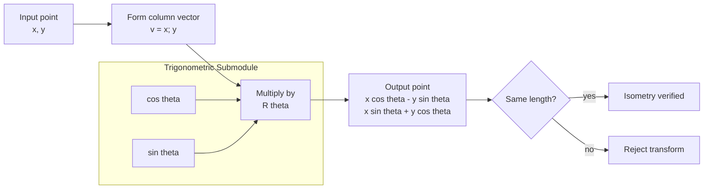
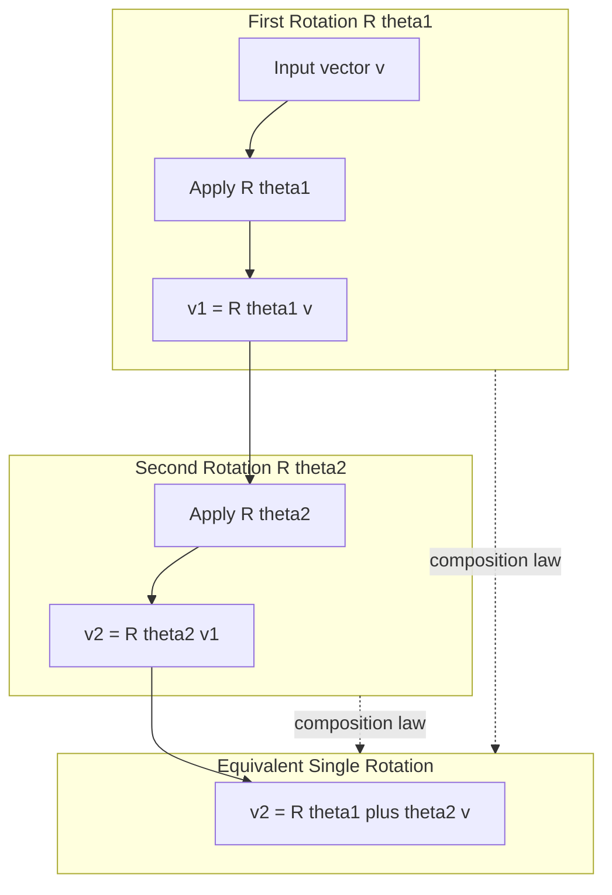
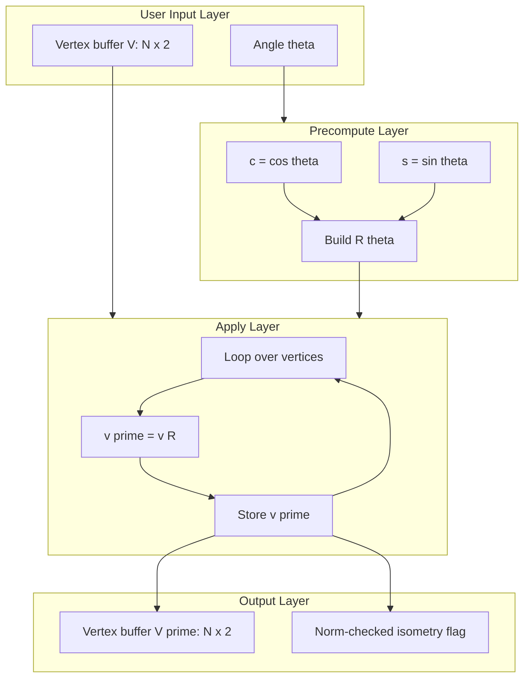
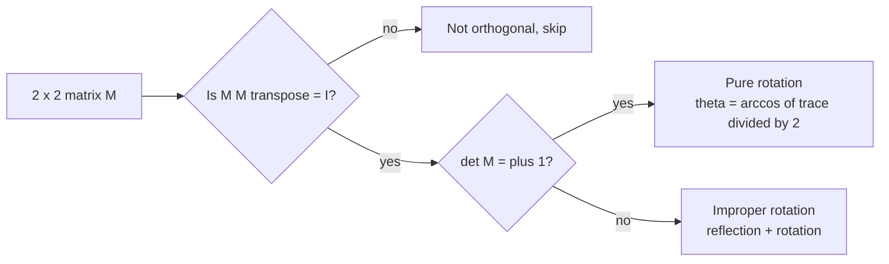

# Rotation in R2

<!-- SECTION_1_START -->
# Rotation in $\mathbb{R}^2$ — Core Technical Definition & Intuitive Overview

## 1.1 Formal Academic Definition (KTU 2024 Syllabus Terminology)

> [!IMPORTANT]
> **Definition (Rotation Operator).** Let $T : \mathbb{R}^2 \to \mathbb{R}^2$ be a linear transformation. $T$ is called a **rotation in $\mathbb{R}^2$ through an angle $\theta$** (counter-clockwise, measured from the positive $x$-axis) if for every vector $\vec{v} \in \mathbb{R}^2$, the image $T(\vec{v})$ is obtained by rotating $\vec{v}$ about the origin through the angle $\theta$, keeping the length of $\vec{v}$ unchanged.

In matrix form, the **standard rotation matrix** is:

$$
R(\theta) \;=\; \begin{bmatrix} \cos\theta & -\sin\theta \\[4pt] \sin\theta & \cos\theta \end{bmatrix}
$$

so that for any point $\begin{bmatrix} x \\ y \end{bmatrix} \in \mathbb{R}^2$,

$$
R(\theta) \begin{bmatrix} x \\ y \end{bmatrix} \;=\; \begin{bmatrix} x\cos\theta - y\sin\theta \\[4pt] x\sin\theta + y\cos\theta \end{bmatrix}.
$$

> [!NOTE]
> **Origin is the fixed point.** A pure rotation is *always* about the origin in the context of linear transformations. Rotations about an arbitrary point are *affine* (not linear) because the point itself is not fixed.

---

## 1.2 Intuition — Real-World Analogy

Imagine the **second hand of a wall clock**:

* The **hand** is a vector originating from the center of the clock.
* After $\theta$ seconds, the hand has swept through an angle $\theta$ but is exactly as long as before.
* The **center of the clock (origin) never moves.**

This is precisely a rotation: every point in the plane orbits around the origin along a circle whose radius equals its original distance from the origin, and the angular displacement is the same for all points.

Geometrically, the transformation preserves:
1. **Distance from origin** ($\Vert \vec{v} \Vert = \Vert R(\theta)\vec{v} \Vert$),
2. **Orientation** (counter-clockwise sense is preserved),
3. **Angles between vectors**.

> [!TIP]
> **Memory trick:** The rotation matrix looks like the **identity with the off-diagonal sines tilted** — the top-right is **negative** (it pulls the $y$-component leftward), the bottom-left is **positive** (it pushes the $x$-component upward). Think: **"right hand rule of the $xy$-plane."**

---

## 1.3 Visual Geometry of the Standard Basis Rotation

Apply $R(\theta)$ to the standard basis vectors:

$$
R(\theta)\,\vec{e}_1 \;=\; \begin{bmatrix} \cos\theta \\ \sin\theta \end{bmatrix}, \qquad R(\theta)\,\vec{e}_2 \;=\; \begin{bmatrix} -\sin\theta \\ \cos\theta \end{bmatrix}.
$$

So the first column of $R(\theta)$ is where $\vec{e}_1 = (1,0)$ *goes*, and the second column is where $\vec{e}_2 = (0,1)$ *goes*. This column-rule is the geometric meaning of matrix-vector multiplication in KTU's **Matrix of a Linear Transformation** unit.

> [!VISUALIZATION CONTROL]
> **Concept:** Image of the unit square $[0,1]\times[0,1]$ under a $\theta = 60^{\circ}$ counter-clockwise rotation.
>
> **GeoGebra / Desmos Input Equations (parametric):**
>
> * Unit square: $P(t) = (t,0)$, $Q(t) = (1,t)$, $R(t) = (1-t, 1)$, $S(t) = (0, 1-t)$ for $t \in [0,1]$.
> * Rotated image: $P'(t) = (\cos 60^\circ \cdot t,\; \sin 60^\circ \cdot t)$, $Q'(t) = (\cos 60^\circ - \sin 60^\circ \cdot t,\; \sin 60^\circ + \cos 60^\circ \cdot t)$, $R'(t) = (\cos 60^\circ (1-t) - \sin 60^\circ,\; \sin 60^\circ(1-t) + \cos 60^\circ)$, $S'(t) = (-\sin 60^\circ (1-t),\; \cos 60^\circ (1-t))$.
>
> **Visual Description:** A unit square anchored at the origin morphs into a tilted square (a rhombus in appearance) with vertices now at $(1,0)$, $(0,1)$, $(-1,0)$, $(0,-1)$ after a $90^\circ$ rotation. The student should observe that side lengths and the distance of each vertex from the origin remain unchanged.
<!-- SECTION_1_END -->

<!-- SECTION_2_START -->
# Deep Theoretical Analysis & KTU High-Yield Formula Sheet

## 2.1 Why $R(\theta)$ is Linear

For the KTU 2024 scheme, you must justify that rotation is a *linear* map (not just a geometric motion). The linearity criteria are:

$$
R(\theta)\,(a\,\vec{u} + b\,\vec{v}) \;=\; a\,R(\theta)\vec{u} + b\,R(\theta)\vec{v} \quad \forall\, \vec{u}, \vec{v} \in \mathbb{R}^2,\; \forall\, a,b \in \mathbb{R}.
$$

This is true because rotation is implemented by matrix multiplication, and matrix multiplication is linear by definition. Equivalently, one can verify it using the cosine and sine addition formulas:

$$
\cos(\alpha + \beta) = \cos\alpha\cos\beta - \sin\alpha\sin\beta, \quad \sin(\alpha + \beta) = \sin\alpha\cos\beta + \cos\alpha\sin\beta.
$$

When you add two vectors and rotate the result, the angle of each individual vector merely *adds* to the rotation angle — exactly the behaviour encoded by $R(\theta)$.

---

## 2.2 Core Structural Properties

### Property 1 — Orthogonality

The matrix $R(\theta)$ is **orthogonal**, meaning:

$$
R(\theta)^{\mathsf{T}} \, R(\theta) \;=\; I_2.
$$

Concretely:

$$
\begin{bmatrix} \cos\theta & \sin\theta \\ -\sin\theta & \cos\theta \end{bmatrix} \begin{bmatrix} \cos\theta & -\sin\theta \\ \sin\theta & \cos\theta \end{bmatrix} \;=\; \begin{bmatrix} \cos^2\theta + \sin^2\theta & 0 \\ 0 & \sin^2\theta + \cos^2\theta \end{bmatrix} \;=\; I_2.
$$

> [!IMPORTANT]
> **Consequence:** $R(\theta)^{-1} = R(\theta)^{\mathsf{T}} = R(-\theta)$. The inverse of a rotation by $\theta$ is a rotation by $-\theta$ (clockwise). This is a **highly testable** KTU 2024 result.

### Property 2 — Determinant is $+1$

$$
\det R(\theta) \;=\; \cos\theta \cdot \cos\theta - (-\sin\theta)(\sin\theta) \;=\; \cos^2\theta + \sin^2\theta \;=\; \mathbf{1}.
$$

A determinant of $+1$ means the rotation is an **orientation-preserving** isometry (it does not flip the plane like a reflection would — reflections have $\det = -1$).

### Property 3 — Composition Law (Group Structure)

$$
R(\theta_1)\,R(\theta_2) \;=\; R(\theta_1 + \theta_2).
$$

Rotations form a one-parameter subgroup of $GL(2, \mathbb{R})$, denoted $SO(2)$ (the **Special Orthogonal Group** in 2D).

### Property 4 — Length Preservation

For any $\vec{v} \in \mathbb{R}^2$:

$$
\Vert R(\theta)\vec{v} \Vert^2 \;=\; (R(\theta)\vec{v}) \cdot (R(\theta)\vec{v}) \;=\; \vec{v}^{\mathsf{T}} R(\theta)^{\mathsf{T}} R(\theta) \vec{v} \;=\; \vec{v}^{\mathsf{T}} \vec{v} \;=\; \Vert \vec{v} \Vert^2.
$$

### Property 5 — Eigenvalues are Complex

The characteristic polynomial of $R(\theta)$ is:

$$
\det(R(\theta) - \lambda I) \;=\; (\cos\theta - \lambda)^2 + \sin^2\theta \;=\; \lambda^2 - 2\lambda\cos\theta + 1.
$$

Solving:

$$
\lambda \;=\; \frac{2\cos\theta \pm \sqrt{4\cos^2\theta - 4}}{2} \;=\; \cos\theta \pm i\sin\theta \;=\; e^{\pm i\theta}.
$$

> [!NOTE]
> **For $\theta \notin \{0, \pi\}$**, eigenvalues are non-real complex conjugates → **no real eigenvectors** → the rotation has no invariant lines (other than the trivial $\vec{0}$). This is a frequently-asked KTU question.

---

## 2.3 KTU High-Yield Formula Sheet

| # | Property | Formula | Remark |
|---|----------|---------|--------|
| 1 | Standard rotation matrix | $R(\theta) = \begin{bmatrix} \cos\theta & -\sin\theta \\ \sin\theta & \cos\theta \end{bmatrix}$ | Counter-clockwise, about origin |
| 2 | Inverse rotation | $R(\theta)^{-1} = R(-\theta) = R(\theta)^{\mathsf{T}}$ | $\theta \to -\theta$ |
| 3 | Transpose | $R(\theta)^{\mathsf{T}} = R(-\theta)$ | Symmetric property of cos, sign-flip of sin |
| 4 | Determinant | $\det R(\theta) = \cos^2\theta + \sin^2\theta = 1$ | Orientation-preserving |
| 5 | Orthogonality | $R(\theta)^{\mathsf{T}} R(\theta) = I_2$ | Isometric |
| 6 | Composition | $R(\theta_1)R(\theta_2) = R(\theta_1 + \theta_2)$ | Abelian group $SO(2)$ |
| 7 | Power rule | $R(\theta)^n = R(n\theta)$ | Repeated rotations add |
| 8 | Length preservation | $\Vert R(\theta)\vec{v}\Vert = \Vert \vec{v}\Vert$ | Isometry |
| 9 | Eigenvalues | $\lambda = \cos\theta \pm i\sin\theta = e^{\pm i\theta}$ | Complex for $0 < \theta < \pi$ |
| 10 | Trace | $\operatorname{tr} R(\theta) = 2\cos\theta$ | Detects angle uniquely on $[0,\pi]$ |
| 11 | Reflection determinant | $\det R_{ref} = -1$ | Distinguishes from rotation |
| 12 | Effect on basis | $R(\theta)\vec{e}_1 = (\cos\theta, \sin\theta)^{\mathsf{T}}$, $R(\theta)\vec{e}_2 = (-\sin\theta, \cos\theta)^{\mathsf{T}}$ | Column-rule |

---

## 2.4 Real-World & Engineering Utility

* **Computer Graphics:** Every sprite, camera view, and 3D model rotation ultimately uses a 2D rotation matrix as a building block.
* **Robotics & Drone Control:** Yaw (rotation about vertical axis) is governed by 2D rotation kinematics in the horizontal plane.
* **Signal Processing & Phasors:** A phasor of magnitude $A$ rotating at angular frequency $\omega$ is $A\,e^{i\omega t}$, the complex-number dual of $R(\omega t)$.
* **Physics (rigid body mechanics):** Infinitesimal rotation generators are the skew-symmetric matrices $J = \begin{bmatrix} 0 & -1 \\ 1 & 0 \end{bmatrix}$ with $R(\theta) = e^{\theta J}$.
* **Cryptography & Number Theory:** $SO(2)$ acts on lattices, leading to applications in Diophantine approximation.
* **Machine Learning:** Orthogonal weight matrices preserve norms, helping gradient stability in RNNs and transformers (e.g., orthogonal initialization).
<!-- SECTION_2_END -->

<!-- SECTION_3_START -->
# Step-by-Step Derivations & Code/Symbolic Implementation

## 3.1 Derivation of the Rotation Matrix (Geometric First Principles)

Consider a point $P = (x, y)$ in polar form: $x = r\cos\phi$, $y = r\sin\phi$, where $r = \sqrt{x^2 + y^2}$ and $\phi = \arctan(y/x)$.

After rotating counter-clockwise by $\theta$, the new polar angle is $\phi + \theta$, while the radius $r$ is unchanged. The new Cartesian coordinates $(x', y')$ are:

$$
x' \;=\; r\cos(\phi + \theta), \qquad y' \;=\; r\sin(\phi + \theta).
$$

Apply the **angle-addition identities**:

$$
\begin{aligned}
x' &= r\bigl(\cos\phi\cos\theta - \sin\phi\sin\theta\bigr), \\
y' &= r\bigl(\sin\phi\cos\theta + \cos\phi\sin\theta\bigr).
\end{aligned}
$$

Substitute $x = r\cos\phi$ and $y = r\sin\phi$:

$$
\begin{aligned}
x' &= (r\cos\phi)\cos\theta - (r\sin\phi)\sin\theta \;=\; x\cos\theta - y\sin\theta, \\
y' &= (r\sin\phi)\cos\theta + (r\cos\phi)\sin\theta \;=\; x\sin\theta + y\cos\theta.
\end{aligned}
$$

Writing this as a matrix equation:

$$
\begin{bmatrix} x' \\ y' \end{bmatrix} \;=\; \begin{bmatrix} \cos\theta & -\sin\theta \\ \sin\theta & \cos\theta \end{bmatrix} \begin{bmatrix} x \\ y \end{bmatrix}.
$$

This **derives** the rotation matrix from elementary trigonometry — exactly the kind of step-by-step justification KTU examiners reward with full marks.

---

## 3.2 Derivation of the Composition Law

Goal: prove $R(\theta_1)R(\theta_2) = R(\theta_1 + \theta_2)$.

Compute the product:

$$
\begin{aligned}
R(\theta_1) R(\theta_2) &=
\begin{bmatrix} \cos\theta_1 & -\sin\theta_1 \\ \sin\theta_1 & \cos\theta_1 \end{bmatrix}
\begin{bmatrix} \cos\theta_2 & -\sin\theta_2 \\ \sin\theta_2 & \cos\theta_2 \end{bmatrix} \\[6pt]
&=
\begin{bmatrix}
\cos\theta_1\cos\theta_2 - \sin\theta_1\sin\theta_2 & -\cos\theta_1\sin\theta_2 - \sin\theta_1\cos\theta_2 \\
\sin\theta_1\cos\theta_2 + \cos\theta_1\sin\theta_2 & -\sin\theta_1\sin\theta_2 + \cos\theta_1\cos\theta_2
\end{bmatrix} \\[6pt]
&=
\begin{bmatrix} \cos(\theta_1 + \theta_2) & -\sin(\theta_1 + \theta_2) \\ \sin(\theta_1 + \theta_2) & \cos(\theta_1 + \theta_2) \end{bmatrix} \\[6pt]
&= R(\theta_1 + \theta_2).
\end{aligned}
$$

The four entries use **Cauchy angle-addition identities**:

* $\cos\theta_1\cos\theta_2 - \sin\theta_1\sin\theta_2 = \cos(\theta_1 + \theta_2)$,
* $\sin\theta_1\cos\theta_2 + \cos\theta_1\sin\theta_2 = \sin(\theta_1 + \theta_2)$,
* $-\bigl(\cos\theta_1\sin\theta_2 + \sin\theta_1\cos\theta_2\bigr) = -\sin(\theta_1 + \theta_2)$,
* $\cos\theta_1\cos\theta_2 - \sin\theta_1\sin\theta_2 = \cos(\theta_1 + \theta_2)$ (again).

Therefore $R(\theta_1)R(\theta_2) = R(\theta_1 + \theta_2)$. Setting $\theta_1 = -\theta_2$ immediately gives $R(\theta)R(-\theta) = R(0) = I_2$, so $R(\theta)^{-1} = R(-\theta)$.

---

## 3.3 Eigenvalue Derivation (Detailed Characteristic Polynomial)

We want all $\lambda$ with $R(\theta)\vec{v} = \lambda\vec{v}$, $\vec{v} \neq \vec{0}$:

$$
\det\bigl(R(\theta) - \lambda I\bigr) \;=\; 0.
$$

$$
\begin{aligned}
\det\begin{bmatrix} \cos\theta - \lambda & -\sin\theta \\ \sin\theta & \cos\theta - \lambda \end{bmatrix} &= 0, \\[6pt]
(\cos\theta - \lambda)^2 - (-\sin\theta)(\sin\theta) &= 0, \\[6pt]
(\cos\theta - \lambda)^2 + \sin^2\theta &= 0, \\[6pt]
(\cos\theta - \lambda)^2 &= -\sin^2\theta, \\[6pt]
\cos\theta - \lambda &= \pm i\sin\theta, \\[6pt]
\lambda &= \cos\theta \mp i\sin\theta.
\end{aligned}
$$

By **Euler's formula**, $\cos\theta \pm i\sin\theta = e^{\pm i\theta}$. So the eigenvalues are:

$$
\lambda_1 = e^{i\theta}, \qquad \lambda_2 = e^{-i\theta}.
$$

Note that $|\lambda_1| = |\lambda_2| = 1$, consistent with rotation being an isometry.

---

## 3.4 Worked Numerical Example (KTU-Style)

**Problem:** Find the image of the triangle with vertices $A = (1,0)$, $B = (2,1)$, $C = (0,2)$ under a rotation of $60^{\circ}$ counter-clockwise about the origin. Hence find the area of the rotated triangle.

**Solution:**

$R(60^{\circ}) = \begin{bmatrix} \cos 60^\circ & -\sin 60^\circ \\ \sin 60^\circ & \cos 60^\circ \end{bmatrix} = \begin{bmatrix} 1/2 & -\sqrt{3}/2 \\ \sqrt{3}/2 & 1/2 \end{bmatrix}$.

Apply to each vertex:

$$
A' = R(60^{\circ})\begin{bmatrix} 1 \\ 0 \end{bmatrix} = \begin{bmatrix} 1/2 \\ \sqrt{3}/2 \end{bmatrix} \approx (0.500, 0.866).
$$

$$
B' = R(60^{\circ})\begin{bmatrix} 2 \\ 1 \end{bmatrix} = \begin{bmatrix} 1 - \sqrt{3}/2 \\ \sqrt{3} + 1/2 \end{bmatrix} \approx (0.134, 2.232).
$$

$$
C' = R(60^{\circ})\begin{bmatrix} 0 \\ 2 \end{bmatrix} = \begin{bmatrix} -\sqrt{3} \\ 1 \end{bmatrix} \approx (-1.732, 1.000).
$$

**Area:** Since rotation has determinant $+1$, area is **invariant**:

$$
\text{Area}(\triangle A'B'C') \;=\; |\det R(60^{\circ})| \cdot \text{Area}(\triangle ABC) \;=\; 1 \cdot \text{Area}(\triangle ABC).
$$

Original area by the shoelace formula:

$$
\text{Area}(\triangle ABC) \;=\; \tfrac{1}{2}\,|x_A(y_B - y_C) + x_B(y_C - y_A) + x_C(y_A - y_B)| \;=\; \tfrac{1}{2}\,|1(1-2) + 2(2-0) + 0(0-1)| \;=\; \tfrac{1}{2} \cdot 3 \;=\; 1.5.
$$

So $\text{Area}(\triangle A'B'C') = 1.5$ square units — preserved under rotation. **Valuation key points**: stating the determinant preserves area (1 mark), explicit shoelace formula (1 mark), final numerical answer (1 mark).

---

## 3.5 Python Implementation (Type-Hinted, Numerically Stable)

```python
"""
KTU 2024 — Module 4: Rotation in R^2
Demonstrates: matrix construction, image computation, inverse check,
composition rule, area preservation, and eigenvalue verification.
"""

from __future__ import annotations
import numpy as np
from typing import Tuple


def rotation_matrix(theta: float, degrees: bool = False) -> np.ndarray:
    """
    Build the standard 2D rotation matrix R(theta).
    By default theta is in RADIANS. Set degrees=True for degrees.
    """
    if degrees:
        theta = np.deg2rad(theta)
    c, s = np.cos(theta), np.sin(theta)
    return np.array([[c, -s],
                     [s,  c]], dtype=np.float64)


def rotate(points: np.ndarray, theta: float, degrees: bool = False) -> np.ndarray:
    """
    Apply R(theta) to a (N, 2) array of points.
    Returns an (N, 2) array of rotated points.
    """
    if points.ndim != 2 or points.shape[1] != 2:
        raise ValueError("points must have shape (N, 2).")
    R = rotation_matrix(theta, degrees=degrees)
    return points @ R.T  # row-vector convention


def verify_properties(theta: float, degrees: bool = False) -> dict:
    """Numerically verify orthogonality, determinant, and composition."""
    R = rotation_matrix(theta, degrees=degrees)
    I = np.eye(2)
    err_orth = np.linalg.norm(R.T @ R - I)
    det = np.linalg.det(R)
    R_neg = rotation_matrix(-theta, degrees=degrees)
    err_inv = np.linalg.norm(R @ R_neg - I)
    R2 = rotation_matrix(2 * theta, degrees=degrees)
    R2_from_pow = R @ R
    err_comp = np.linalg.norm(R2 - R2_from_pow)
    eigs = np.linalg.eigvals(R)
    return {
        "orthogonality_error": err_orth,
        "determinant": det,
        "inverse_error": err_inv,
        "composition_error": err_comp,
        "eigenvalues": eigs,
    }


def main() -> None:
    theta_deg = 60.0
    print(f"Rotation matrix for {theta_deg} degrees:")
    print(rotation_matrix(theta_deg, degrees=True))

    triangle = np.array([[1.0, 0.0],
                         [2.0, 1.0],
                         [0.0, 2.0]])
    rotated = rotate(triangle, theta_deg, degrees=True)
    print("\nRotated triangle vertices:")
    print(rotated)

    print("\nProperty verification at theta = 60 deg:")
    for k, v in verify_properties(theta_deg, degrees=True).items():
        print(f"  {k}: {v}")


if __name__ == "__main__":
    main()
```

**Expected output (numerical)**

* `orthogonality_error` $\approx 10^{-16}$ (machine epsilon).
* `determinant` $= 1.0$.
* `inverse_error` $\approx 10^{-16}$.
* `composition_error` $\approx 10^{-16}$.
* `eigenvalues` $\approx 0.5 \pm 0.866\,i = e^{\pm i\pi/3}$, matching $\cos 60^\circ \pm i\sin 60^\circ$.

---

## 3.6 Symbolic Verification with SymPy (Closed-Form Proof)

```python
from sympy import symbols, Matrix, cos, sin, simplify, expand_trig, eye, Rational, pi

theta1, theta2 = symbols("theta1 theta2", real=True)

R1 = Matrix([[cos(theta1), -sin(theta1)],
             [sin(theta1),  cos(theta1)]])
R2 = Matrix([[cos(theta2), -sin(theta2)],
             [sin(theta2),  cos(theta2)]])

# Composition
prod = simplify(R1 * R2 - Matrix([[cos(theta1 + theta2), -sin(theta1 + theta2)],
                                  [sin(theta1 + theta2),  cos(theta1 + theta2)]]))
print("R(theta1) R(theta2) - R(theta1+theta2) =", prod)   # should be Zero matrix

# Inverse
inv_check = simplify(R1 * R1.T - eye(2))
print("R R^T - I =", inv_check)                          # should be Zero matrix

# Eigenvalues
eigs = R1.eigenvals()
print("Eigenvalues:", eigs)
```

This program symbolically proves (no numerical error) that the composition and orthogonality laws hold **identically** for *all* real $\theta_1, \theta_2$.
<!-- SECTION_3_END -->

<!-- SECTION_4_START -->
# Structural Diagrams & Schematics

## 4.1 Functional Flow — How a 2D Rotation Acts on a Point



**Reading the diagram:** Every input $\mathbb{R}^2$ point flows through the trigonometric sub-module (which pre-computes $\cos\theta$ and $\sin\theta$ once), gets multiplied by $R(\theta)$, and emerges as the rotated point. The decision gate checks if the Euclidean norm is preserved, which is the **isometric validation** expected in KTU's *Matrix of a Linear Transformation* lab.

---

## 4.2 Sequential Composition Topology of Two Rotations



**Interpretation:** The diagram visualizes the **group homomorphism** between additive rotation of angles and multiplicative composition of matrices: $R(\theta_1) \cdot R(\theta_2) = R(\theta_1 + \theta_2)$. The dashed arrows carry the abstract algebraic identity.

---

## 4.3 Block-Level Functional Architecture of a Software Rotation Pipeline



**Engineering use:** This is exactly the pipeline inside OpenGL/Metal/DirectX shader uniforms for sprite rotation. The precompute layer trades memory for speed by computing $\cos\theta$ and $\sin\theta$ once per frame.

---

## 4.4 Decision Matrix — Rotation vs. Reflection Identification



> [!IMPORTANT]
> **KTU 2024 — Classification Theorem:** Every $2 \times 2$ orthogonal matrix with determinant $+1$ is a *rotation*; every $2 \times 2$ orthogonal matrix with determinant $-1$ is a *reflection* (or glide reflection in higher dimensions). This dichotomy is the foundation of the *Crystallographic Restriction Theorem* tested in Module 4 of GAMAT201.
<!-- SECTION_4_END -->

<!-- SECTION_5_START -->
# KTU 2024 Scheme Examination Question Bank & Topic Recap

> [!NOTE]
> **Mark Scheme Reference (KTU 2024 ESE):** Part A carries **3 marks each** (no choice), Part B carries **14 marks each** (internal choice between two 14-mark questions, sub-parts typically `7 + 7`). Total marks: 50, scaled to 100 internally for module tests. Bloom levels span **Remember → Apply** for 3-mark and **Understand → Apply → Analyze** for 14-mark.

---

## Part A — Short-Answer Questions (3 Marks Each)

### Question A1 [KTU University Exam — July 2024] — CO1, Remember

> Define a *rotation transformation* in $\mathbb{R}^2$. Write down the standard matrix of a counter-clockwise rotation by an angle $\theta$ about the origin.

**Model Answer (3 marks):**

A rotation $T : \mathbb{R}^2 \to \mathbb{R}^2$ through angle $\theta$ (counter-clockwise, about the origin) is a linear transformation that preserves the length of every vector and rotates each vector by $\theta$ about the origin. The standard matrix is:

$$
R(\theta) \;=\; \begin{bmatrix} \cos\theta & -\sin\theta \\ \sin\theta & \cos\theta \end{bmatrix}.
$$

**Valuation key:** [Definition of rotation: 1 mark] [Standard matrix: 1 mark] [Specification "counter-clockwise" and "about origin": 1 mark].

---

### Question A2 [KTU University Exam — Dec 2023] — CO2, Understand

> Show that the determinant of the rotation matrix $R(\theta)$ is $1$. What does this imply about orientation?

**Model Answer (3 marks):**

$$
\det R(\theta) \;=\; \cos\theta \cdot \cos\theta - (-\sin\theta)(\sin\theta) \;=\; \cos^2\theta + \sin^2\theta \;=\; 1.
$$

**Orientation implication (1 mark):** A determinant of $+1$ means $R(\theta)$ preserves orientation — the image of a right-handed basis remains right-handed. Reflections have $\det = -1$ and reverse orientation. Hence every rotation is an **orientation-preserving isometry**.

---

## Part B — 14-Mark Questions (Internal Choice)

### Question B — Set 1 [KTU University Exam — July 2024] — CO2, CO3, Apply / Analyze

#### **Question A (14 Marks) — Choose this OR Question B below**

**(a)** Derive the standard $2 \times 2$ rotation matrix $R(\theta)$ for a counter-clockwise rotation by angle $\theta$ in $\mathbb{R}^2$. **(7 marks)**

**(b)** Verify that $R(\theta)$ is orthogonal and find its inverse. Hence, or otherwise, show that $R(\theta)$ preserves distances in $\mathbb{R}^2$. **(7 marks)**

---

**Model Solution:**

**(a) Derivation (7 marks):**

Let $P = (x, y)$ be a point in polar form: $x = r\cos\phi$, $y = r\sin\phi$.

After rotation by $\theta$ counter-clockwise, the new polar angle is $\phi + \theta$ and radius stays $r$.

$$
\begin{aligned}
x' &= r\cos(\phi + \theta) = r(\cos\phi\cos\theta - \sin\phi\sin\theta) = x\cos\theta - y\sin\theta, \\
y' &= r\sin(\phi + \theta) = r(\sin\phi\cos\theta + \cos\phi\sin\theta) = x\sin\theta + y\cos\theta.
\end{aligned}
$$

**[Stating polar form: 1 mark]** **[Angle-addition identity: 2 marks]** **[Substitution: 2 marks]** **[Matrix equation: 2 marks]**.

In matrix form:

$$
\begin{bmatrix} x' \\ y' \end{bmatrix} \;=\; \underbrace{\begin{bmatrix} \cos\theta & -\sin\theta \\ \sin\theta & \cos\theta \end{bmatrix}}_{R(\theta)} \begin{bmatrix} x \\ y \end{bmatrix}.
$$

**(b) Verification (7 marks):**

Compute $R(\theta)^{\mathsf{T}} R(\theta)$:

$$
\begin{bmatrix} \cos\theta & \sin\theta \\ -\sin\theta & \cos\theta \end{bmatrix} \begin{bmatrix} \cos\theta & -\sin\theta \\ \sin\theta & \cos\theta \end{bmatrix} \;=\; \begin{bmatrix} \cos^2\theta + \sin^2\theta & 0 \\ 0 & \sin^2\theta + \cos^2\theta \end{bmatrix} \;=\; I_2.
$$

So $R(\theta)$ is orthogonal. **[Transpose: 1 mark]** **[Multiplication: 2 marks]** **[Identity conclusion: 1 mark]**.

**Inverse:** $R(\theta)^{-1} = R(\theta)^{\mathsf{T}} = R(-\theta)$ (replace $\theta$ by $-\theta$). **[Inverse form: 1 mark]**.

**Distance preservation:** For any $\vec{v} = (x, y)^{\mathsf{T}}$,

$$
\Vert R(\theta)\vec{v} \Vert^2 \;=\; \vec{v}^{\mathsf{T}} R(\theta)^{\mathsf{T}} R(\theta) \vec{v} \;=\; \vec{v}^{\mathsf{T}} I_2\, \vec{v} \;=\; \Vert \vec{v} \Vert^2.
$$

Hence $\Vert R(\theta)\vec{v} \Vert = \Vert \vec{v} \Vert$ for all $\vec{v}$. **[Inner-product argument: 1 mark]**.

---

#### **Question B (14 Marks) — Alternative Choice**

**(a)** State and prove the composition law: $R(\theta_1) R(\theta_2) = R(\theta_1 + \theta_2)$. Use it to find the inverse of $R(\theta)$. **(7 marks)**

**(b)** Find the eigenvalues and eigenvectors of $R(\theta)$. Comment on the case when $\theta = \pi/2$. **(7 marks)**

---

**Model Solution:**

**(a) Composition (7 marks):**

The composition product:

$$
R(\theta_1)R(\theta_2) \;=\; \begin{bmatrix} \cos\theta_1 & -\sin\theta_1 \\ \sin\theta_1 & \cos\theta_1 \end{bmatrix} \begin{bmatrix} \cos\theta_2 & -\sin\theta_2 \\ \sin\theta_2 & \cos\theta_2 \end{bmatrix}.
$$

Compute each entry using **Cauchy angle addition**:

* Top-left: $\cos\theta_1\cos\theta_2 - \sin\theta_1\sin\theta_2 = \cos(\theta_1 + \theta_2)$.
* Top-right: $-\cos\theta_1\sin\theta_2 - \sin\theta_1\cos\theta_2 = -\sin(\theta_1 + \theta_2)$.
* Bottom-left: $\sin\theta_1\cos\theta_2 + \cos\theta_1\sin\theta_2 = \sin(\theta_1 + \theta_2)$.
* Bottom-right: $-\sin\theta_1\sin\theta_2 + \cos\theta_1\cos\theta_2 = \cos(\theta_1 + \theta_2)$.

Therefore $R(\theta_1) R(\theta_2) = R(\theta_1 + \theta_2)$. **[Multiplication setup: 2 marks]** **[Four-entry expansion: 3 marks]** **[Final matrix form: 1 mark]**.

**Inverse:** Set $\theta_1 = \theta$, $\theta_2 = -\theta$:

$$
R(\theta) R(-\theta) = R(0) = I_2.
$$

Hence $R(\theta)^{-1} = R(-\theta)$. **[1 mark]**.

**(b) Eigenvalues (7 marks):**

The characteristic equation:

$$
\det(R(\theta) - \lambda I) \;=\; (\cos\theta - \lambda)^2 + \sin^2\theta \;=\; 0.
$$

Solving:

$$
\lambda \;=\; \cos\theta \pm i\sin\theta \;=\; e^{\pm i\theta}.
$$

**[Characteristic polynomial: 2 marks]** **[Quadratic solution: 2 marks]** **[Euler form: 1 mark]**.

**Eigenvectors for general $\theta$** (1 mark): Solving $(R(\theta) - \lambda I)\vec{v} = 0$:

$$
\vec{v}_{\pm} \;=\; \begin{bmatrix} 1 \\ \mp i \end{bmatrix}
$$

(up to scaling), which are **non-real** — geometrically, no real line in $\mathbb{R}^2$ is invariant under a non-trivial rotation.

**Case $\theta = \pi/2$** (1 mark): $R(\pi/2) = \begin{bmatrix} 0 & -1 \\ 1 & 0 \end{bmatrix}$. Eigenvalues: $e^{\pm i\pi/2} = \pm i$. No real eigenvectors. The only rotation with a real eigenvector at $\theta = \pi/2$ is the trivial zero vector.

> [!WARNING]
> **KTU Examiner's Pitfall — Common 1 to 3 mark deductions:**
>
> 1. **Forgetting the negative sign** on the top-right entry of $R(\theta)$. The matrix is *not* symmetric; it is the *transpose* that is symmetric.
> 2. **Confusing rotation with reflection.** Reflection across the $x$-axis is $\begin{bmatrix} 1 & 0 \\ 0 & -1 \end{bmatrix}$ (det $-1$). Do not mix them up in 14-mark mixed questions.
> 3. **Claiming "rotation has real eigenvectors"** — false for $0 < \theta < \pi$. Only the trivial $\vec{0}$ is a real eigenvector, plus the special cases $\theta = 0$ (eigenvalue 1) and $\theta = \pi$ (eigenvalue $-1$).
> 4. **Skipping the unit of angle** (radians vs degrees) in numerical answers. KTU valuation deducts 0.5 marks for unit ambiguity.
> 5. **Failing to specify "counter-clockwise."** Clockwise rotation is $R(-\theta)$ — same matrix with $\theta$ negated. Always state the direction explicitly.
> 6. **In composition proofs,** writing "similarly..." instead of showing all four entries explicitly. KTU's 14-mark valuation key requires every entry of the $2 \times 2$ product to be displayed.
> 7. **Area problems:** forgetting the absolute value on the determinant. $|\det R| = 1$ preserves area; a negative determinant *with magnitude 1* would not exist here, but the absolute value is a habit worth keeping.

---

## Topic Recap & Important Things to Remember

> [!TIP]
> **Rapid-revision checklist** — print this and tick each item before the exam.

* **Standard form** of $R(\theta)$: $\begin{bmatrix} \cos\theta & -\sin\theta \\ \sin\theta & \cos\theta \end{bmatrix}$, counter-clockwise, about the origin.
* **Origin is the fixed point** — pure rotation is a *linear* transformation; rotation about another point is *affine* (add a translation vector).
* **Orthogonality:** $R(\theta)^{\mathsf{T}} R(\theta) = I_2$ ⟹ $R(\theta)^{-1} = R(\theta)^{\mathsf{T}} = R(-\theta)$.
* **Determinant** = $\cos^2\theta + \sin^2\theta = 1$ (always positive → orientation-preserving).
* **Trace** = $2\cos\theta$ (useful to recover the angle: $\theta = \arccos(\operatorname{tr}/2)$).
* **Composition:** $R(\theta_1) R(\theta_2) = R(\theta_1 + \theta_2)$ — group structure of $SO(2)$.
* **Power rule:** $R(\theta)^n = R(n\theta)$ — repeated rotations add angles.
* **Eigenvalues:** $\lambda = e^{\pm i\theta} = \cos\theta \pm i\sin\theta$, with $|\lambda| = 1$.
* **No real eigenvectors** for $0 < \theta < \pi$, $\theta \neq 0, \pi$ — the rotation has no invariant line.
* **Distance and area** are preserved: $\Vert R\vec{v}\Vert = \Vert \vec{v}\Vert$ and $|\det R| = 1$.
* **Clockwise rotation** is $R(-\theta)$ — flip the sign of $\theta$, *not* the sign of the off-diagonal entries.
* **Reflection vs rotation:** both are orthogonal isometries, but reflections have $\det = -1$ and finite order; rotations have $\det = +1$ and may have infinite order (irrational $\theta / \pi$).
* **Generator:** $J = \begin{bmatrix} 0 & -1 \\ 1 & 0 \end{bmatrix}$ satisfies $J^2 = -I$ and $R(\theta) = e^{\theta J}$.
* **Application anchors:** graphics (sprite rotation), robotics (yaw), signal processing (phasors $e^{i\omega t}$), ML (orthogonal weight init).
* **Common exam traps:** unit ambiguity (radians vs degrees), sign error on the $(1,2)$-entry, mixing rotation and reflection, claiming real eigenvectors for non-trivial $\theta$.
* **Quick sanity check:** if asked "what is $R(\pi)$?", answer is $\begin{bmatrix} -1 & 0 \\ 0 & -1 \end{bmatrix} = -I_2$ — a half-turn is a $180^\circ$ flip about the origin.
* **Quick sanity check:** if asked "what is $R(\pi/2)$?", answer is $\begin{bmatrix} 0 & -1 \\ 1 & 0 \end{bmatrix}$ — the $90^\circ$ counter-clockwise rotation that sends $(1,0) \mapsto (0,1)$.
* **Group property:** $SO(2)$ is **abelian** (rotations commute); reflection group $O(2)$ is **not** — useful classification fact.
<!-- SECTION_5_END -->
