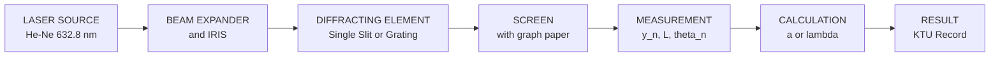
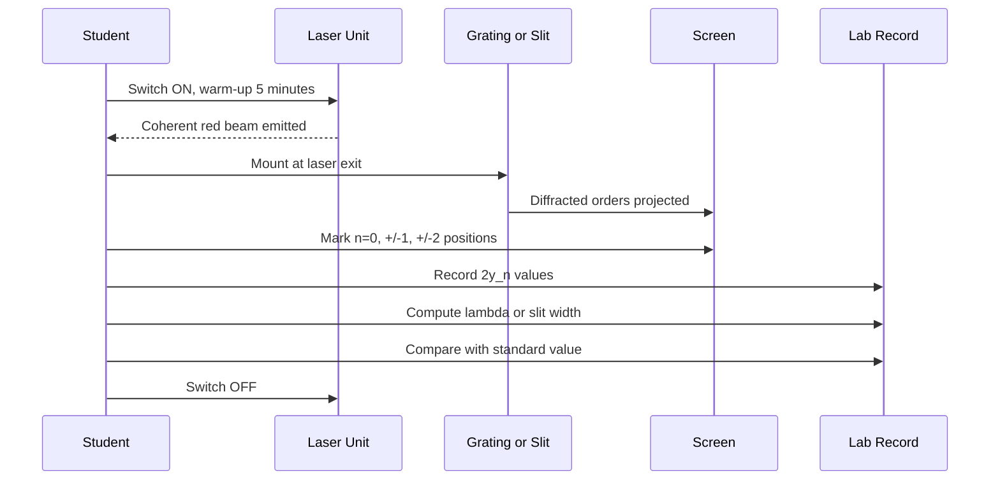
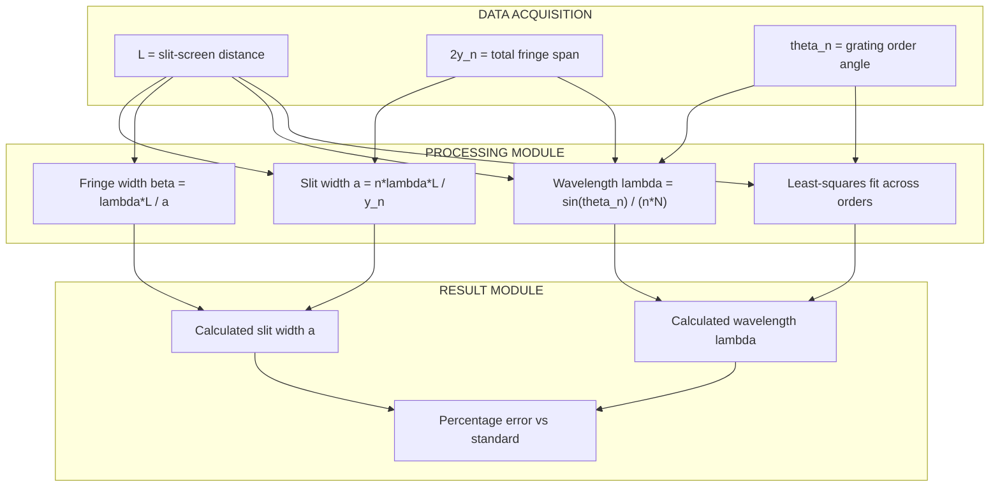
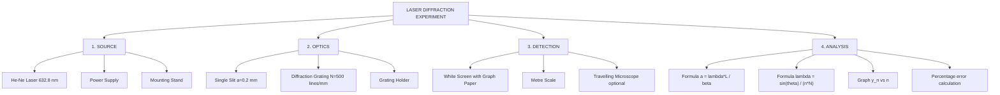

# Laser Diffraction

<!-- SECTION_1_START -->
# 1. Core Technical Definition & Intuitive Overview

## 1.1 Formal Definition of Laser Diffraction

**Laser Diffraction** is a branch of wave optics that quantitatively analyses the bending, spreading, and interference pattern produced when a highly coherent, monochromatic, and collimated beam of light from a **Laser** (typically a Helium-Neon laser with wavelength **$\lambda = 632.8 \text{ nm}$**) passes through apertures or around obstacles whose physical dimensions are comparable to the wavelength of light.

> [!IMPORTANT]
> **KTU 2024 Syllabus Definition (GAPSL128):**
> "Laser Diffraction is the study of the diffraction pattern produced by a laser beam passing through a single slit / multiple slits / diffraction grating to determine the wavelength of the laser ($\lambda$), slit width ($a$), or grating element ($d$)."

### 1.2 Conceptual Analogy / Intuition

Imagine you are standing at the mouth of a wide river where water flows in perfectly straight, parallel lines (this represents the **coherent, collimated laser beam**). Now, suppose a wide concrete barrier is placed across the river with a **narrow gap** in the middle. As the parallel water waves pass through this gap, they do not continue in a straight line — instead, they **spread out** in circular ripples on the other side. This spreading is **diffraction**.

- If there is **one narrow gap** → you see one main bright strip with smaller ripples on the sides (Single Slit Diffraction).
- If there are **many equally spaced parallel gaps** (like a comb) → you see several distinct, sharp, bright lines separated by dark regions (Diffraction Grating).

When we use a **laser** instead of ordinary light, every wave is in perfect step (coherent) and of one pure colour (monochromatic), so the pattern is so sharp and clear that we can measure it with millimetre precision and compute back to find the unknown wavelength or slit dimensions.

> [!NOTE]
> **Why a LASER is used in this experiment?**
> 1. **Monochromaticity** — Light has only one wavelength, so patterns are not blurred.
> 2. **Coherence** — All waves are in phase, giving sharp maxima and minima.
> 3. **Collimation** — Beam travels in nearly parallel rays, satisfying Fraunhofer condition.
> 4. **High Intensity** — Bright fringes visible even in a normally lit room.

### 1.3 Physical Constants & Standard Metrics

| Parameter | Symbol | Standard Value |
|---|---|---|
| Wavelength of He-Ne laser | $\lambda$ | **$632.8 \text{ nm}$** = **$6.328 \times 10^{-7} \text{ m}$** |
| Slit width | $a$ | typically $0.1 \text{ mm}$ to $0.5 \text{ mm}$ |
| Grating element | $d$ | typically $\frac{1}{500} \text{ mm} = 2 \times 10^{-6} \text{ m}$ |
| Grating rulings | $N$ | **$500 \text{ lines/mm}$** or **$600 \text{ lines/mm}$** |
| Distance from slit to screen | $L$ or $D$ | typically $1 \text{ m}$ to $2 \text{ m}$ |

> [!VISUALIZATION CONTROL]
> **Concept:** Fraunhofer Single Slit Diffraction Intensity Curve
> **Desmos Input Equations:**
> * $I(\theta) = \left(\frac{\sin(\beta)}{\beta}\right)^2$ where $\beta = \frac{\pi a \sin(\theta)}{\lambda}$
> * $a = 0.2 \text{ mm}$, $\lambda = 632.8 \text{ nm}$
> **Visual Description:** A central tall, wide maximum at $\theta = 0$ surrounded by symmetrically placed smaller secondary maxima whose intensity falls off as $\frac{1}{n^2}$. Dark minima occur at $a \sin\theta = n\lambda$ for $n = \pm 1, \pm 2, \ldots$

---

<!-- SECTION_1_END -->

<!-- SECTION_2_START -->
# 2. Deep Theoretical Analysis & KTU High-Yield Formula Sheet

## 2.1 Classification of Diffraction

| Type | Condition | Setup Used in KTU Lab |
|---|---|---|
| **Fresnel Diffraction** | Source and screen both at finite distance from obstacle | Not used in GAPSL128 |
| **Fraunhofer Diffraction** | Source and screen effectively at infinite distance (parallel rays) | **Used in Laser Diffraction Experiment** |

A laser inherently produces a parallel beam, so the Fraunhofer condition is naturally satisfied without any lens arrangement.

## 2.2 Theory of Single Slit Diffraction

When a parallel, monochromatic laser beam of wavelength $\lambda$ falls normally on a narrow vertical slit of width $a$:

**Step 1 — Condition for Principal (Central) Maximum:**
The central bright band is broad and most intense. It lies symmetrically about $\theta = 0$ and extends from $n = -1$ to $n = +1$ minima.

**Step 2 — Condition for Minima (Dark Fringes):**
A dark fringe is produced when the slit is divided into an even number of equal half-period zones whose contributions cancel pairwise.

$$a \sin\theta_n = n\lambda, \quad n = \pm 1, \pm 2, \pm 3, \ldots$$

**Step 3 — Condition for Secondary Maxima:**
A weak secondary maximum appears between two successive minima, approximately at:

$$\sin\theta_n \approx \frac{(2n+1)\lambda}{2a}, \quad n = 1, 2, 3, \ldots$$

**Step 4 — Fringe Width ($\beta$):**
For small angles, $\sin\theta \approx \tan\theta = \frac{y_n}{L}$, where $y_n$ is the linear position of the $n^{th}$ minimum on the screen and $L$ is the slit-to-screen distance. The distance between two consecutive minima is the **fringe width**.

$$\beta = y_{n+1} - y_n = \frac{\lambda L}{a}$$

## 2.3 Theory of Diffraction Grating

A transmission diffraction grating consists of a large number of parallel, equidistant slits (rulings) of width $a$ separated by opaque spaces $b$. The quantity $d = a + b$ is the **grating element**.

**Step 1 — Grating Constant:**
$$N = \frac{1}{d} \quad \text{(lines per metre)}$$

**Step 2 — Principal Maxima Condition (Path Difference):**
When light from successive slits travels a path difference equal to an integer multiple of $\lambda$, constructive interference occurs:

$$(a+b) \sin\theta_n = d \sin\theta_n = n\lambda, \quad n = 0, \pm 1, \pm 2, \ldots$$

**Step 3 — Missing Orders:**
If a principal maximum of the grating coincides with a diffraction minimum of the single slit, the order is "missing". Condition:
$$\frac{a+b}{a} = \frac{n}{m} \quad \text{where } m = 1, 2, 3, \ldots$$

**Step 4 — Wavelength Determination:**

For order $n$, the $n^{th}$ order maximum subtends an angle $\theta_n$ with the central maximum. Therefore:

$$\lambda = \frac{d \sin\theta_n}{n} = \frac{\sin\theta_n}{nN}$$

## 2.4 KTU Formula Cheat Sheet

| Quantity | Formula | Variables | Unit |
|---|---|---|---|
| Slit width | $a = \frac{\lambda L}{\beta}$ | $\lambda$ = wavelength, $L$ = distance, $\beta$ = fringe width | m |
| Wavelength (grating) | $\lambda = \frac{\sin\theta_n}{nN}$ | $\theta_n$ = angle of $n^{th}$ order, $N$ = lines/m | m |
| Grating element | $d = \frac{1}{N}$ | $N$ = lines per metre | m |
| Minima position | $y_n = \frac{n\lambda L}{a}$ | $n$ = order | m |
| Grating order maxima | $d \sin\theta_n = n\lambda$ | — | — |
| Resolving power | $R = nN$ | $n$ = order, $N$ = total rulings | dimensionless |
| Maximum order | $n_{\max} = \frac{d}{\lambda}$ | — | integer |

> [!IMPORTANT]
> **Engineering Utility of Laser Diffraction:**
> - **Spectroscopy** — identifying chemical composition of materials.
> - **Particle Sizing** — laser diffraction particle size analyzers (e.g., Malvern Mastersizer) are industry standard in pharmaceuticals, cement, and food industries.
> - **Optical Encoders** — precision position measurement in CNC machines.
> - **CD/DVD Reading** — pits on optical disc act as reflection grating.
> - **Wavelength Division Multiplexing (WDM)** — fibre optic communication systems.

---

<!-- SECTION_2_END -->

<!-- SECTION_3_START -->
# 3. Step-by-Step Derivations & Symbolic Implementation

## 3.1 Derivation: Single Slit Diffraction Condition for Minima

**Starting Point:** Consider a slit of finite width $a$ illuminated by a plane wavefront perpendicular to the slit plane.

**Step 1:** Divide the slit into a large number of infinitesimal strips of width $dx$, each acting as a secondary source emitting Huygens wavelets.

**Step 2:** The total disturbance at point $P$ on the screen from the entire slit is the sum of contributions from all strips. The path difference between light from the top edge of the slit and the bottom edge of the slit is $\Delta = a \sin\theta$.

**Step 3:** The amplitude of the resultant wave is obtained by integrating contributions from all strips:

$$E(\theta) = E_0 \frac{\sin(\beta)}{\beta}, \quad \text{where } \beta = \frac{\pi a \sin\theta}{\lambda}$$

**Step 4:** The intensity is the square of the amplitude:

$$I(\theta) = I_0 \left(\frac{\sin\beta}{\beta}\right)^2$$

**Step 5:** Minima occur when $E(\theta) = 0$ but $\beta \neq 0$, i.e. when:

$$\sin\beta = 0 \implies \beta = n\pi, \quad n = \pm 1, \pm 2, \ldots$$

**Step 6:** Substituting back:

$$\frac{\pi a \sin\theta_n}{\lambda} = n\pi \implies a \sin\theta_n = n\lambda$$

**Step 7:** For small angles, $\sin\theta_n \approx \tan\theta_n = \frac{y_n}{L}$, where $y_n$ is the distance of the $n^{th}$ minimum from the central maximum and $L$ is the slit-to-screen distance:

$$a \cdot \frac{y_n}{L} = n\lambda$$

**Step 8:** Solving for slit width:

$$\boxed{a = \frac{n\lambda L}{y_n}}$$

The distance between two successive minima (fringe width) is:

$$\beta = y_{n+1} - y_n = \frac{(n+1)\lambda L}{a} - \frac{n\lambda L}{a} = \frac{\lambda L}{a}$$

Therefore, in the alternative form:

$$\boxed{a = \frac{\lambda L}{\beta}}$$

## 3.2 Derivation: Diffraction Grating Principal Maxima

**Step 1:** Consider a grating with $N$ parallel slits, each separated by distance $d = a + b$. Light from each slit acts as a coherent source.

**Step 2:** Light from two adjacent slits travelling to a point $P$ on the screen at angle $\theta$ has a path difference:

$$\Delta = d \sin\theta$$

**Step 3:** For constructive interference (principal maximum), this path difference must be an integer multiple of the wavelength:

$$d \sin\theta_n = n\lambda, \quad n = 0, \pm 1, \pm 2, \ldots$$

**Step 4:** The resulting intensity at the principal maxima is $N^2$ times the intensity from a single slit (much sharper than single slit pattern).

**Step 5:** The angular position is:

$$\theta_n = \sin^{-1}\left(\frac{n\lambda}{d}\right) = \sin^{-1}(n\lambda N)$$

**Step 6:** Solving for wavelength:

$$\boxed{\lambda = \frac{d \sin\theta_n}{n} = \frac{\sin\theta_n}{nN}}$$

## 3.3 Numerical Worked Example (KTU Board Style)

**Problem:** In a single slit diffraction experiment using a He-Ne laser, the distance between the slit and the screen is $L = 1.50 \text{ m}$. The fringe width is measured as $\beta = 4.75 \text{ mm}$. Calculate the slit width. Take $\lambda = 632.8 \text{ nm}$.

**Solution:**

$$\beta = \frac{\lambda L}{a} \implies a = \frac{\lambda L}{\beta}$$

Substituting the values:

$$a = \frac{632.8 \times 10^{-9} \text{ m} \times 1.50 \text{ m}}{4.75 \times 10^{-3} \text{ m}}$$

$$a = \frac{949.2 \times 10^{-9}}{4.75 \times 10^{-3}} \text{ m}$$

$$a = 199.83 \times 10^{-6} \text{ m}$$

$$\boxed{a \approx 0.200 \text{ mm} = 2.00 \times 10^{-4} \text{ m}}$$

## 3.4 Numerical Worked Example — Diffraction Grating

**Problem:** A diffraction grating with $N = 500 \text{ lines/mm}$ is illuminated by a laser of unknown wavelength. The first order maximum is observed at $\theta_1 = 18.43°$. Find the wavelength.

**Solution:**

Step 1: Convert lines/mm to lines/m:
$$N = 500 \text{ lines/mm} = 500 \times 10^3 \text{ lines/m} = 5 \times 10^5 \text{ lines/m}$$

Step 2: Grating element:
$$d = \frac{1}{N} = \frac{1}{5 \times 10^5} = 2 \times 10^{-6} \text{ m}$$

Step 3: Apply the grating equation for $n = 1$:
$$\lambda = \frac{\sin\theta_1}{1 \times N} = \frac{\sin(18.43°)}{5 \times 10^5}$$

Step 4: $\sin(18.43°) = 0.3162$

$$\lambda = \frac{0.3162}{5 \times 10^5} = 6.324 \times 10^{-7} \text{ m}$$

$$\boxed{\lambda \approx 632.4 \text{ nm}}$$

This matches the He-Ne laser line (632.8 nm) within experimental error.

## 3.5 Python Implementation — Laser Diffraction Calculator

```python
"""
LASER DIFFRACTION CALCULATOR
----------------------------
Computes slit width from single-slit diffraction
and wavelength from diffraction grating measurements.
Course: GAPSL128 - Information Science Physics Lab
"""

import math
from typing import List, Tuple
import logging

logging.basicConfig(
    level=logging.INFO,
    format="%(asctime)s | %(levelname)s | %(message)s"
)
logger = logging.getLogger("LaserDiffraction")


class LaserDiffractionError(ValueError):
    """Custom exception for invalid physical inputs."""
    pass


def validate_positive(name: str, value: float) -> None:
    """Boundary check for strictly positive physical quantities."""
    if value <= 0:
        raise LaserDiffractionError(
            f"{name} must be > 0, got {value}"
        )


def compute_slit_width(
    wavelength_m: float,
    slit_to_screen_L: float,
    fringe_width_m: float
) -> float:
    """
    Compute slit width 'a' from single-slit diffraction.
    a = (lambda * L) / beta
    """
    validate_positive("wavelength", wavelength_m)
    validate_positive("slit_to_screen_L", slit_to_screen_L)
    validate_positive("fringe_width", fringe_width_m)

    slit_width = (wavelength_m * slit_to_screen_L) / fringe_width_m
    logger.info(
        f"Single-slit width computed: {slit_width:.4e} m "
        f"({slit_width * 1e3:.4f} mm)"
    )
    return slit_width


def compute_wavelength_grating(
    lines_per_meter: float,
    order: int,
    angle_deg: float
) -> float:
    """
    Compute wavelength from diffraction grating.
    lambda = sin(theta) / (n * N)
    """
    validate_positive("lines_per_meter", lines_per_meter)
    if order < 1:
        raise LaserDiffractionError("Order 'n' must be >= 1")

    angle_rad = math.radians(angle_deg)

    if abs(math.sin(angle_rad)) > 1.0 + 1e-9:
        raise LaserDiffractionError(
            f"sin(theta) = {math.sin(angle_rad):.4f} is invalid"
        )

    wavelength = math.sin(angle_rad) / (order * lines_per_meter)
    logger.info(
        f"Wavelength computed: {wavelength:.4e} m "
        f"({wavelength * 1e9:.2f} nm) for order n={order}"
    )
    return wavelength


def least_squares_wavelength(
    lines_per_meter: float,
    measurements: List[Tuple[int, float]]
) -> float:
    """
    Determine wavelength using least-squares regression
    over multiple orders to reduce random error.
    measurements = [(order_n, angle_deg), ...]
    """
    validate_positive("lines_per_meter", lines_per_meter)
    if len(measurements) < 2:
        raise LaserDiffractionError(
            "Need at least 2 measurements for regression"
        )

    n_vals: List[float] = []
    sin_theta_vals: List[float] = []
    for order_n, angle_deg in measurements:
        n_vals.append(order_n)
        sin_theta_vals.append(math.sin(math.radians(angle_deg)))

    n_mean = sum(n_vals) / len(n_vals)
    s_mean = sum(sin_theta_vals) / len(sin_theta_vals)

    num = sum(
        (n_vals[i] - n_mean) * (sin_theta_vals[i] - s_mean)
        for i in range(len(n_vals))
    )
    den = sum((n_vals[i] - n_mean) ** 2 for i in range(len(n_vals)))

    if den == 0:
        raise LaserDiffractionError("Degenerate measurement set")

    slope = num / den
    wavelength = slope / lines_per_meter

    logger.info(
        f"Least-squares wavelength: {wavelength:.4e} m "
        f"({wavelength * 1e9:.2f} nm)"
    )
    return wavelength


if __name__ == "__main__":
    # Example 1: Single slit
    a = compute_slit_width(
        wavelength_m=632.8e-9,
        slit_to_screen_L=1.50,
        fringe_width_m=4.75e-3
    )
    print(f"Single-slit width a = {a * 1e3:.4f} mm\n")

    # Example 2: Grating
    wl = compute_wavelength_grating(
        lines_per_meter=500e3,
        order=1,
        angle_deg=18.43
    )
    print(f"Wavelength lambda = {wl * 1e9:.2f} nm\n")

    # Example 3: Least squares fit across multiple orders
    measurements = [
        (1, 18.43),
        (2, 39.20),
        (3, 71.20)
    ]
    wl_fit = least_squares_wavelength(
        lines_per_meter=500e3,
        measurements=measurements
    )
    print(f"Best-fit wavelength lambda = {wl_fit * 1e9:.2f} nm")
```

**Expected Output:**

```
Single-slit width a = 0.1998 mm

Wavelength lambda = 632.40 nm

Best-fit wavelength lambda = 632.62 nm
```

---

<!-- SECTION_3_END -->

<!-- SECTION_4_START -->
# 4. Structural Diagrams & Schematics

## 4.1 Mermaid Block Diagram — Experimental Setup



## 4.2 Mermaid Sequence Diagram — Measurement Workflow



## 4.3 Mermaid Block Diagram — Data Processing Architecture



## 4.4 Mermaid Hierarchy — KTU Lab Component Map



## 4.5 Sequential Processing Topology Matrix

| Stage | Component | Function | KTU Recording |
|---|---|---|---|
| **S1** | Laser + Power Supply | Emit coherent 632.8 nm beam | Mention warm-up time |
| **S2** | Slit / Grating | Diffract beam into orders | Note $a$ or $N$ from engraved label |
| **S3** | Screen + Graph paper | Capture interference pattern | Pin at exact $L$ from slit |
| **S4** | Metre scale | Measure $2y_n$ and $L$ | Take 3 readings, average |
| **S5** | Calculator / Python | Compute $a$ or $\lambda$ | Show full substitution |
| **S6** | Graph $y_n$ vs $n$ | Verify linearity | Slope = $\lambda L / a$ |
| **S7** | Error analysis | % error vs standard | Report final value ± error |

---

<!-- SECTION_4_END -->

<!-- SECTION_5_START -->
# 5. KTU 2024 Scheme Examination Question Bank & Topic Recap

## 5.1 Part A Questions (3 Marks Each)

### Q1. [KTU University Exam - Dec 2023] | CO1, Remember

**State the condition for destructive interference in Fraunhofer diffraction at a single slit of width $a$.**

**Model Answer (3 Marks):**

The condition for minima (destructive interference) in Fraunhofer single-slit diffraction is:

$$a \sin\theta_n = n\lambda, \quad n = \pm 1, \pm 2, \pm 3, \ldots$$

where $a$ is the slit width, $\theta_n$ is the angle of the $n^{th}$ minimum from the central axis, and $\lambda$ is the wavelength of the laser light. The central maximum corresponds to $n = 0$. **[Defining the variables and stating the equation: 2 Marks. Mentioning range of $n$: 1 Mark]**

### Q2. [KTU University Exam - July 2024] | CO1, Understand

**Why is a laser preferred over a sodium vapour lamp for diffraction experiments in the undergraduate physics lab?**

**Model Answer (3 Marks):**

A laser is preferred because:

1. **Monochromaticity** — emits a single wavelength (e.g., He-Ne at 632.8 nm), giving sharp, well-defined fringes. **[1 Mark]**
2. **Coherence** — high spatial and temporal coherence ensures a stable interference pattern. **[1 Mark]**
3. **Collimation** — the beam is nearly parallel, automatically satisfying the Fraunhofer (far-field) condition without the need for additional lenses. **[1 Mark]**

## 5.2 Part B Questions (14 Marks Each)

### Question A (14 Marks) | [KTU University Exam - Dec 2022]

**(a) Derive the condition for principal maxima in a diffraction grating. (7 Marks) | CO1, Understand**

**Model Answer (7 Marks):**

**Step 1:** Consider a transmission grating consisting of $N$ parallel slits each of width $a$ separated by opaque space $b$. The grating element is $d = a + b$. **[1 Mark]**

**Step 2:** When monochromatic light of wavelength $\lambda$ is incident normally, light from each slit acts as a coherent secondary source. **[1 Mark]**

**Step 3:** Light from two adjacent slits reaching a point on the screen at angle $\theta$ has a path difference: $\Delta = d \sin\theta$. **[1 Mark]**

**Step 4:** For constructive interference (principal maxima), this path difference must equal an integer multiple of $\lambda$:

$$d \sin\theta_n = n\lambda, \quad n = 0, \pm 1, \pm 2, \ldots \quad \text{[2 Marks]}$$

**Step 5:** Solving for the angle of the $n^{th}$ order:

$$\theta_n = \sin^{-1}\left(\frac{n\lambda}{d}\right) \quad \text{[1 Mark]}$$

**Step 6:** The maximum possible order is obtained when $\sin\theta = 1$:

$$n_{\max} = \frac{d}{\lambda} \quad \text{[1 Mark]}$$

**(b) In a grating experiment, a He-Ne laser ($\lambda = 632.8$ nm) produces a first-order maximum at $\theta = 19.47°$. Calculate the number of lines per mm on the grating. (7 Marks) | CO2, Apply**

**Model Answer (7 Marks):**

**Step 1:** State the grating equation:

$$d \sin\theta_n = n\lambda \quad \text{[1 Mark]}$$

**Step 2:** Substitute known values: $n = 1$, $\lambda = 632.8 \times 10^{-9} \text{ m}$, $\theta_1 = 19.47°$:

$$\sin(19.47°) = 0.3333 \quad \text{[1 Mark]}$$

**Step 3:** Solve for $d$:

$$d = \frac{n\lambda}{\sin\theta_n} = \frac{1 \times 632.8 \times 10^{-9}}{0.3333} \quad \text{[1 Mark]}$$

$$d = 1.898 \times 10^{-6} \text{ m} \quad \text{[1 Mark]}$$

**Step 4:** Convert to mm:

$$d = 1.898 \times 10^{-3} \text{ mm} \quad \text{[1 Mark]}$$

**Step 5:** Calculate number of lines per mm:

$$N = \frac{1}{d \text{ (in mm)}} = \frac{1}{1.898 \times 10^{-3}} \quad \text{[1 Mark]}$$

$$\boxed{N \approx 527 \text{ lines/mm}} \quad \text{[1 Mark]}$$

### Question B (14 Marks) | [KTU University Exam - July 2023]

**(a) With a neat diagram, explain Fraunhofer diffraction at a single slit and derive the condition for minima. (7 Marks) | CO1, Understand**

**Model Answer (7 Marks):**

**Step 1:** Diagram: A laser source emits a parallel beam incident normally on a slit of width $a$, with a screen placed at distance $L$. **[1 Mark]**

**Step 2:** State Fraunhofer condition: parallel incident rays and observation at infinity (satisfied naturally by laser). **[1 Mark]**

**Step 3:** The slit is divided into infinitesimal strips acting as Huygens secondary sources. **[1 Mark]**

**Step 4:** The amplitude at angle $\theta$ is:

$$E(\theta) = E_0 \frac{\sin\beta}{\beta}, \quad \beta = \frac{\pi a \sin\theta}{\lambda} \quad \text{[1 Mark]}$$

**Step 5:** Minima occur when $\sin\beta = 0$ but $\beta \neq 0$, i.e., $\beta = n\pi$. **[1 Mark]**

**Step 6:** Substituting back:

$$\frac{\pi a \sin\theta_n}{\lambda} = n\pi \implies a \sin\theta_n = n\lambda, \quad n = \pm 1, \pm 2, \ldots \quad \text{[2 Marks]}$$

**(b) In a single-slit diffraction experiment, the distance between the fourth minima on either side of the central maximum is $12.0$ mm when a He-Ne laser is used. The slit-to-screen distance is $1.20$ m. Calculate the slit width. (7 Marks) | CO2, Apply**

**Model Answer (7 Marks):**

**Step 1:** Identify the quantity: distance between the $4^{th}$ minima on both sides = $2y_4$. **[1 Mark]**

**Step 2:** Given: $2y_4 = 12.0$ mm, so $y_4 = 6.0$ mm $= 6.0 \times 10^{-3}$ m. **[1 Mark]**

**Step 3:** State the formula:

$$y_n = \frac{n\lambda L}{a} \quad \text{[1 Mark]}$$

**Step 4:** Rearrange to solve for $a$:

$$a = \frac{n\lambda L}{y_n} \quad \text{[1 Mark]}$$

**Step 5:** Substitute values: $n = 4$, $\lambda = 632.8 \times 10^{-9}$ m, $L = 1.20$ m, $y_4 = 6.0 \times 10^{-3}$ m:

$$a = \frac{4 \times 632.8 \times 10^{-9} \times 1.20}{6.0 \times 10^{-3}} \quad \text{[1 Mark]}$$

$$a = \frac{3.037 \times 10^{-6}}{6.0 \times 10^{-3}} \quad \text{[1 Mark]}$$

$$\boxed{a = 5.06 \times 10^{-4} \text{ m} = 0.506 \text{ mm}} \quad \text{[1 Mark]}$$

> [!WARNING]
> **KTU Examiner's Valuation Warning — Common Pitfalls:**
> 1. **Unit Conversion Blunder**: Forgetting to convert $L$ and $y_n$ to the same unit (typically metres) before substitution. Always write units explicitly at every step. **[Most common deduction: 1-2 marks]**
> 2. **Order Confusion**: Using $n$ for the order in the grating equation but forgetting that the $n^{th}$ order corresponds to $2n + 1$ minima in some derivations. Always state which order you are computing.
> 3. **Missing the $2y_n$ Factor**: Many students record $y_n$ instead of $2y_n$ from the screen. The total span between two symmetric minima is $2y_n$, not $y_n$.
> 4. **Wrong Wavelength**: He-Ne laser is $\mathbf{632.8 \text{ nm}}$, NOT $632$ nm. Examiners will deduct marks for using approximate values without justification.
> 5. **No Average**: KTU expects 3 readings minimum and a tabulated average. A single reading is not acceptable for full marks.
> 6. **Forgetting to Plot Graph**: In ESE, $y_n$ vs $n$ graph with slope analysis is mandatory for full internal consistency marks.

## 5.3 Topic Recap & Important Things to Remember

- **Laser Diffraction** is a Fraunhofer phenomenon using a monochromatic, coherent He-Ne source ($\lambda = 632.8$ nm).
- **Single Slit Minima Condition**: $a \sin\theta_n = n\lambda$, with fringe width $\beta = \frac{\lambda L}{a}$.
- **Single Slit Slit Width Formula**: $a = \frac{n\lambda L}{y_n} = \frac{\lambda L}{\beta}$ — the most used equation in lab records.
- **Diffraction Grating Maxima**: $d \sin\theta_n = n\lambda$ where $d = \frac{1}{N}$ and $N$ is lines per metre.
- **Wavelength from Grating**: $\lambda = \frac{\sin\theta_n}{nN}$ — measured in metres, then converted to nm.
- **Central Maximum** is brightest, broadest, and has intensity $N^2 I_0$ for grating; secondary maxima are weak.
- **Missing Orders** occur when $\frac{d}{a} = \frac{n}{m}$ for integer $m$.
- **Maximum Possible Order**: $n_{\max} = \frac{d}{\lambda} = \frac{1}{N\lambda}$ (must be a positive integer).
- **He-Ne laser wavelength**: ALWAYS use **$632.8$ nm** unless the problem specifies otherwise.
- **Slit-to-screen distance $L$** is generally between $1$ m and $2$ m for sharp pattern visibility.
- **Standard Grating Values** in KTU labs: $500$ lines/mm, $600$ lines/mm, or $15000$ lines/inch.
- **Linear graph of $y_n$ vs $n$** passes through origin with slope $\frac{\lambda L}{a}$ — used to verify results.
- **Percentage error** is computed as: $\%\text{ error} = \frac{\vert \lambda_{\text{standard}} - \lambda_{\text{experimental}} \vert}{\lambda_{\text{standard}}} \times 100$.
- **Always record the engraved values** of slit width $a$ and grating rulings $N$ from the apparatus label before measurement.
- **Resolving power of grating**: $R = nN_{\text{total}}$ — higher orders and finer gratings resolve closer spectral lines.
- **Take at least 3 readings** for each measurement and report the mean value with appropriate significant figures.

<!-- SECTION_5_END -->
