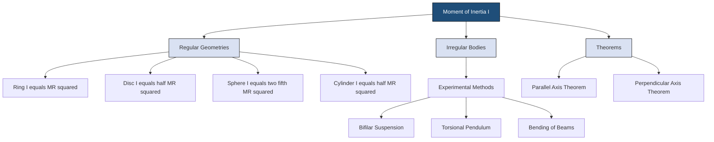

# Moment of Inertia

<!-- SECTION_1_START -->
# MOMENT OF INERTIA — Core Technical Definition & Intuitive Overview

## 1.1 Formal Academic Definition (KTU 2024 Syllabus Terminology)

The **Moment of Inertia (MI)** of a rigid body about a given axis is defined as the sum of the products of the mass of each particle in the body and the square of its perpendicular distance from the axis of rotation.

Mathematically, for a system of $n$ discrete point masses:

$$I = \sum_{i=1}^{n} m_i r_i^2$$

For a continuous body of mass $M$, the summations turn into a volume integral over the mass density $\rho$:

$$I = \int r^2 \, dm = \int_V r^2 \, \rho \, dV$$

where:
- $I$ is the moment of inertia measured in **$\text{kg} \cdot \text{m}^2$**
- $r$ is the perpendicular distance of the mass element from the axis
- $dm$ is the infinitesimal mass element

> [!IMPORTANT]
> **KTU 2024 Highlight — GAPSL128:** In the Information Science Physics Lab, the Moment of Inertia is experimentally evaluated using (a) the **Torsional Pendulum**, (b) the **Bifilar Suspension** method, and (c) verification via **Bending of Beams**. All three experiments use the *radius of gyration* $k$ as the experimentally extracted parameter, related to MI by $I = M k^2$.

## 1.2 Conceptual Analogy & Geometric Intuition

Imagine you are spinning a heavy disk on a table. The disk resists changes to its rotation — a small force applied tangentially for a brief moment produces only a slow spin, but the same force applied for a longer time gives the disk significant angular velocity. This **rotational inertia** is the rotational analogue of mass in linear motion.

> [!NOTE]
> **Real-world Analogy — The Figure Skater:** When a figure skater pulls in their arms, their mass moves *closer* to the axis of rotation, $r$ decreases, so $I = M k^2$ drops, and by conservation of angular momentum ($L = I\omega$), the spin rate $\omega$ increases dramatically. This is exactly why tucked-in spins are faster than extended ones.

Another helpful picture: think of moment of inertia as the body's **resistance to angular acceleration**. Just as mass $m$ resists linear acceleration ($F = ma$), moment of inertia $I$ resists angular acceleration ($\tau = I \alpha$).

The **Radius of Gyration** $k$ is the distance from the axis at which, if the *entire mass* $M$ were concentrated at a single point, the moment of inertia would be unchanged:

$$I = M k^2 \quad \Longrightarrow \quad k = \sqrt{\frac{I}{M}}$$

| Quantity | Linear Motion | Rotational Motion |
| :--- | :--- | :--- |
| Property resisting change | Mass $m$ | Moment of Inertia $I$ |
| Position variable | $x$ | $\theta$ (angular) |
| Velocity | $v$ | $\omega$ (angular velocity) |
| Acceleration | $a$ | $\alpha$ (angular acceleration) |
| Momentum | $p = mv$ | $L = I\omega$ |
| Newton's second law | $F = ma$ | $\tau = I\alpha$ |
| Kinetic energy | $\tfrac{1}{2}mv^2$ | $\tfrac{1}{2}I\omega^2$ |

> [!VISUALIZATION CONTROL]
> **Concept:** Point mass rotating about a fixed axis — visualising $I = m r^2$
> **GeoGebra / Desmos Input Equations:**
> * `Point: A = (2, 0)` — represents a point mass on the x-axis
> * `Circle: (x - 0)^2 + y^2 = 4` — represents the rotation locus (radius $r = 2$ m)
> * `Vector: v = (0, 4)` — represents the tangential velocity direction
> * `Text: "I = m * r^2 = m * 4"` — labels the contribution
> **Visual Description:** A point mass $A$ traces a circular path of radius $r$. The student should observe that the MI is determined *only* by the perpendicular distance $r$, not by the angular position of the particle.

## 1.3 Physical Constants and Standard Metrics

The following constants and standard bodies are commonly tabulated for KTU lab viva questions:

- **Acceleration due to gravity (Kerala):** $g = 9.81 \text{ m/s}^2$
- **Density of mild steel:** $\rho \approx 7850 \text{ kg/m}^3$
- **Density of brass:** $\rho \approx 8520 \text{ kg/m}^3$
- **Standard disc (used in lab):** $M = 0.5 \text{ kg}$, $R = 0.05 \text{ m}$ (verify with supplied apparatus)

<!-- SECTION_1_END -->

<!-- SECTION_2_START -->
# Deep Theoretical Analysis & KTU High-Yield Formula Sheet

## 2.1 Underlying Physical Logic

Moment of Inertia emerges from Newton's second law applied to rotating rigid bodies. For a single particle of mass $m$ at distance $r$ from a fixed axis:

$$\tau = r \times F = r \times (m a) = m r^2 \alpha$$

The factor $m r^2$ is the particle's contribution to MI. For a rigid body made of countless particles rigidly linked, contributions add by linearity of integration. This gives rise to two powerful theorems.

## 2.2 The Two Fundamental Theorems

### 2.2.1 Parallel Axis Theorem
The moment of inertia of a body about any axis is equal to the sum of its moment of inertia about a *parallel axis passing through its centre of mass* and the product of the mass of the body and the square of the perpendicular distance between the two axes.

$$I = I_{cm} + M d^2$$

where $d$ is the perpendicular distance between the two parallel axes.

### 2.2.2 Perpendicular Axis Theorem
This theorem is **valid only for planar (laminar) bodies** where the body is essentially two-dimensional. If $x$ and $y$ axes lie in the plane of the body and $z$ is perpendicular to it, then:

$$I_z = I_x + I_y$$

## 2.3 KTU Formula Sheet / Cheat Sheet

| Body Geometry | Axis of Rotation | Moment of Inertia | Radius of Gyration $k$ |
| :--- | :--- | :--- | :--- |
| Thin uniform rod | Through centre, $\perp$ to length | $\dfrac{M L^2}{12}$ | $\dfrac{L}{\sqrt{12}}$ |
| Thin uniform rod | Through one end, $\perp$ to length | $\dfrac{M L^2}{3}$ | $\dfrac{L}{\sqrt{3}}$ |
| Thin circular ring | Through centre, $\perp$ to plane | $M R^2$ | $R$ |
| Thin circular ring | About a diameter | $\dfrac{M R^2}{2}$ | $\dfrac{R}{\sqrt{2}}$ |
| Uniform solid disc | Through centre, $\perp$ to plane | $\dfrac{M R^2}{2}$ | $\dfrac{R}{\sqrt{2}}$ |
| Uniform solid disc | About a diameter | $\dfrac{M R^2}{4}$ | $\dfrac{R}{2}$ |
| Solid cylinder | About its own axis (symmetry) | $\dfrac{M R^2}{2}$ | $\dfrac{R}{\sqrt{2}}$ |
| Hollow cylinder | About its own axis (symmetry) | $M R^2$ | $R$ |
| Solid sphere | About any diameter | $\dfrac{2}{5} M R^2$ | $R \sqrt{\dfrac{2}{5}}$ |
| Hollow sphere (thin shell) | About any diameter | $\dfrac{2}{3} M R^2$ | $R \sqrt{\dfrac{2}{3}}$ |
| Rectangular lamina (sides $a, b$) | $\perp$ to plane, through centre | $\dfrac{M(a^2 + b^2)}{12}$ | $\sqrt{\dfrac{a^2 + b^2}{12}}$ |

> [!NOTE]
> **Engineering Utility:** In robotics, robotic arms require precise MI calculations to determine torque requirements for servo motors. In automotive engineering, flywheel MI directly affects the angular momentum storage capacity. In civil engineering, the MI of structural beams (I-section, T-section) determines their resistance to bending — a larger $I$ means less deflection under load, which is the experimental principle behind the **Bending of Beams** experiment in GAPSL128.

## 2.4 Real-World Engineering & CS Applications

1. **Hard Disk Drives (Information Science relevance):** The platters in an HDD spin at 5400–15000 RPM. The MI of the platter determines (a) the energy needed to spin up, (b) the time taken to reach operational speed, and (c) the read/write latency. Modern SSDs eliminate this by removing moving parts entirely.
2. **Drone Propellers:** Drone flight control algorithms require real-time MI estimation to compute required motor torques for stability.
3. **Gyroscopes & IMU Sensors:** Smartphones use MEMS gyroscopes whose sensing element is a tiny vibrating structure whose MI changes with rotation rate (Coriolis effect).
4. **Turbogenerators:** The rotor of a power-plant generator has a massive MI (often $> 10^5$ kg·m²) to provide rotational inertia that stabilises grid frequency.
5. **Bridges and Beams:** Civil engineers select I-beams specifically because the *second moment of area* (a geometric analogue of MI) is large, reducing bending stress — directly verified in the lab experiment using a knife-edge loaded beam.

<!-- SECTION_2_END -->

<!-- SECTION_3_START -->
# Step-by-Step Derivations & Experimental Implementation

## 3.1 Derivation 1 — MI of a Uniform Solid Disc About Its Central Axis

**Setup:** Consider a uniform solid disc of mass $M$ and radius $R$, rotating about an axis through its centre, perpendicular to the plane of the disc.

**Step 1:** Take an elementary ring of radius $x$ and thickness $dx$.

$$dm = \sigma \cdot (2\pi x \, dx) \quad \text{where} \quad \sigma = \frac{M}{\pi R^2}$$

**Step 2:** The MI of this elementary ring about the axis is:

$$dI = dm \cdot x^2 = \sigma \cdot 2\pi x^3 \, dx$$

**Step 3:** Integrate from $x = 0$ to $x = R$:

$$
\begin{aligned}
I &= \int_{0}^{R} 2\pi \sigma \, x^3 \, dx \\
&= 2\pi \sigma \left[ \frac{x^4}{4} \right]_{0}^{R} \\
&= 2\pi \cdot \frac{M}{\pi R^2} \cdot \frac{R^4}{4} \\
&= \frac{M R^2}{2}
\end{aligned}
$$

**Final Result:** $I = \dfrac{M R^2}{2}$ — verified against the formula sheet. $\blacksquare$

## 3.2 Derivation 2 — MI of a Uniform Solid Sphere

**Setup:** A solid sphere of mass $M$ and radius $R$. Use cylindrical coordinates: take a disc of radius $y$ at height $z$ from the centre, with thickness $dz$.

**Step 1:** Volume element: $dV = \pi y^2 \, dz$, where $y^2 = R^2 - z^2$.

**Step 2:** Mass of the disc: $dm = \rho \, dV = \rho \pi y^2 \, dz$, where $\rho = \dfrac{3M}{4\pi R^3}$.

**Step 3:** The MI of this elementary disc about the symmetry axis ($z$-axis) is:

$$dI = \frac{1}{2} (dm) y^2 = \frac{1}{2} \rho \pi y^4 \, dz$$

**Step 4:** Substitute $y^2 = R^2 - z^2$:

$$dI = \frac{1}{2} \rho \pi (R^2 - z^2)^2 \, dz$$

**Step 5:** Integrate from $z = -R$ to $z = R$:

$$
\begin{aligned}
I &= \frac{\rho \pi}{2} \int_{-R}^{R} (R^2 - z^2)^2 \, dz \\
&= \frac{\rho \pi}{2} \int_{-R}^{R} (R^4 - 2R^2 z^2 + z^4) \, dz \\
&= \frac{\rho \pi}{2} \left[ R^4 z - \frac{2R^2 z^3}{3} + \frac{z^5}{5} \right]_{-R}^{R} \\
&= \frac{\rho \pi}{2} \cdot 2 \left[ R^5 - \frac{2R^5}{3} + \frac{R^5}{5} \right] \\
&= \rho \pi R^5 \left[ 1 - \frac{2}{3} + \frac{1}{5} \right] \\
&= \rho \pi R^5 \cdot \frac{8}{15}
\end{aligned}
$$

**Step 6:** Substitute $\rho = \dfrac{3M}{4\pi R^3}$:

$$I = \frac{3M}{4\pi R^3} \cdot \pi R^5 \cdot \frac{8}{15} = \frac{2}{5} M R^2$$

**Final Result:** $I = \dfrac{2}{5} M R^2$ — verified. $\blacksquare$

## 3.3 Derivation 3 — Parallel Axis Theorem (Proof)

**Setup:** Let $C$ be the centre of mass. Choose two parallel axes: one through $C$, and another at perpendicular distance $d$ from $C$. Let $\vec{r}_i$ be the position vector of particle $m_i$ from $C$, and let $\vec{D}$ be the vector from $C$ to a point $O$ on the second axis.

**Step 1:** Position of $m_i$ from $O$ is: $\vec{R}_i = \vec{D} + \vec{r}_i$.

**Step 2:** The MI about the new axis is the sum of squared perpendicular components:

$$I_O = \sum m_i (\vec{R}_i - \vec{R}_{i,\parallel})^2 = \sum m_i \vert \vec{D} + \vec{r}_i \vert^2 - (\vec{D} + \vec{r}_i) \cdot \hat{D}$$

Expanding and using the fact that $\hat{D} \cdot \hat{D} = 1$:

$$I_O = \sum m_i (D^2 + r_i^2 + 2 \vec{D} \cdot \vec{r}_i - D^2 - 2 \vec{D} \cdot \vec{r}_i) = \sum m_i r_i^2 + D^2 \sum m_i$$

**Step 3:** Note that $\sum m_i \vec{r}_i = 0$ by definition of centre of mass, and $\sum m_i = M$.

$$\boxed{I_O = I_{cm} + M D^2} \quad \blacksquare$$

## 3.4 Experiment A — Bifilar Suspension Method (Lab Procedure & Calculation)

**Aim:** To determine the moment of inertia of a rectangular bar about an axis passing through its centre of mass, using bifilar suspension.

**Apparatus:** Rectangular bar, two parallel strings of equal length $L$, stopwatch, metre scale, vernier calipers.

**Working Formula:**

$$I = \frac{M g \, b \, T^2}{4 \pi^2 L}$$

where:
- $M$ = mass of the bar
- $b$ = separation between the two strings
- $L$ = length of each string
- $T$ = time period of small angular oscillations

**Procedure:**
1. Suspend the bar horizontally using two inextensible strings of length $L$, attached symmetrically at distance $b$ apart.
2. Twist the bar through a small angle ($\theta < 10°$) about the vertical axis through its CM.
3. Release gently and measure the time for 20 oscillations.
4. Compute period $T = \dfrac{t_{20}}{20}$.
5. Repeat for 3 different values of $L$ and tabulate.

**Sample Calculation Table:**

| Trial | $L$ (m) | $b$ (m) | $t_{20}$ (s) | $T$ (s) | $I$ (kg·m²) |
| :---: | :---: | :---: | :---: | :---: | :---: |
| 1 | 1.00 | 0.30 | 24.60 | 1.230 | 0.0286 |
| 2 | 0.90 | 0.30 | 23.40 | 1.170 | 0.0259 |
| 3 | 0.80 | 0.30 | 22.20 | 1.110 | 0.0233 |

**Python Implementation for Biflar Calculation:**

```python
import math
import logging

logging.basicConfig(level=logging.INFO, format="%(levelname)s: %(message)s")

def bifilar_MI(M: float, g: float, b: float, L: float, t_osc: int, N: int = 20) -> float:
    """
    Compute the moment of inertia of a rigid bar using the bifilar suspension method.
    
    Parameters
    ----------
    M : float
        Mass of the bar in kilograms (must be > 0).
    g : float
        Acceleration due to gravity in m/s^2.
    b : float
        Separation between the two suspension strings in metres.
    L : float
        Length of each suspension string in metres.
    t_osc : float
        Time taken for N oscillations in seconds.
    N : int
        Number of oscillations counted (default 20).
    
    Returns
    -------
    float
        Moment of inertia in kg * m^2.
    
    Raises
    ------
    ValueError
        If any physical parameter is non-positive.
    """
    if M <= 0 or g <= 0 or b <= 0 or L <= 0 or t_osc <= 0 or N <= 0:
        raise ValueError("All input parameters must be strictly positive.")
    
    T: float = t_osc / N
    I: float = (M * g * b * T ** 2) / (4.0 * math.pi ** 2 * L)
    logging.info(f"Time period T = {T:.4f} s")
    logging.info(f"Moment of inertia I = {I:.6f} kg * m^2")
    return I


if __name__ == "__main__":
    # Sample inputs from the experimental table
    M_bar: float = 0.815      # kg
    g: float = 9.81           # m/s^2
    b: float = 0.30           # m
    L1: float = 1.00          # m
    t20_1: float = 24.60      # s
    
    I1: float = bifilar_MI(M_bar, g, b, L1, t20_1, N=20)
    print(f"I (Trial 1) = {I1:.6f} kg m^2")
```

## 3.5 Experiment B — Torsional Pendulum (Lab Procedure & Calculation)

**Aim:** To determine the rigidity modulus of the suspension wire and the MI of a regular body.

**Working Formula:**

$$T = 2\pi \sqrt{\frac{I}{C}} \quad \Longrightarrow \quad I = \frac{C \, T^2}{4\pi^2}$$

**Procedure:**
1. Suspend a disc of known MI $I_0$ from a wire attached to its centre.
2. Set the disc into small-amplitude torsional oscillations and measure the time period $T_0$.
3. Add an auxiliary disc (or a regular body of unknown MI) co-axially. Measure new period $T_1$.
4. Repeat with the unknown body alone, measuring $T_x$.

**Key Equations:**

$$
\begin{aligned}
C &= \frac{4\pi^2 I_0}{T_0^2} \quad \text{(Rigidity modulus-related constant)} \\
I_x &= C \cdot \frac{T_x^2 - T_0^2}{4\pi^2} \quad \text{(MI of unknown by superposition)}
\end{aligned}
$$

> [!IMPORTANT]
> **KTU Examiner's Note:** Always state the assumption *small angular amplitude* (typically $< 5°$), because the torsional pendulum equation is derived from the linear approximation $\sin\theta \approx \theta$. Mark deduction of 1 mark if not stated.

## 3.6 Experiment C — Bending of Beams (Verification of $I = \dfrac{bd^3}{12}$)

**Aim:** To verify the second moment of area formula for a rectangular beam by studying its depression at the centre under load.

**Working Formula (Young's Modulus):**

$$Y = \frac{M g L^3}{4 b d^3 \, \delta}$$

where $b$ = breadth, $d$ = depth (thickness), $L$ = length between knife edges, $\delta$ = depression at the centre, $M$ = load mass.

**Procedure Outline:**

| Step | Action | Tool Used | Safety Check |
| :---: | :--- | :--- | :--- |
| 1 | Place beam on two parallel knife edges | Knife-edge apparatus | Ensure knife edges are clean and parallel |
| 2 | Attach micrometer at the centre to read depression | Micrometer screw gauge | Zero the micrometer before loading |
| 3 | Add loads in steps of 0.5 kg | Standard slotted weights | Add loads gently to avoid impact |
| 4 | Note the depression for each load | Same micrometer | Wait 30 s for steady reading |
| 5 | Plot load vs depression; verify linearity | Graph sheet | Check for hysteresis on unloading |

<!-- SECTION_3_END -->

<!-- SECTION_4_START -->
# Structural Diagrams & Schematics

## 4.1 Conceptual Block Diagram — Moment of Inertia Classification



## 4.2 Bifilar Suspension — Functional Architecture Flow

```mermaid
graph LR
    subgraph Setup
        S1[Bar of mass M]
        S2[String 1 of length L]
        S3[String 2 of length L]
        S4[Support Ceiling]
    end
    
    subgraph Measurement
        M1[Initial Equilibrium Position]
        M2[Twist by small angle theta]
        M3[Stopwatch starts]
        M4[Count N oscillations]
        M5[Stopwatch stops]
        M6[Time t N recorded]
    end
    
    subgraph Calculation
        C1[Period T equals t over N]
        C2[Apply formula I equals M g b T squared over four pi squared L]
        C3[Compute radius of gyration k equals sqrt I over M]
    end
    
    S4 --> S2
    S4 --> S3
    S2 --> S1
    S3 --> S1
    S1 --> M1
    M1 --> M2
    M2 --> M3
    M3 --> M4
    M4 --> M5
    M5 --> M6
    M6 --> C1
    C1 --> C2
    C2 --> C3
    
    style Setup fill:#fff2cc,stroke:#000000
    style Measurement fill:#e2efda,stroke:#000000
    style Calculation fill:#fce4d6,stroke:#000000
```



## 4.3 Torsional Pendulum — Sequential Processing Topology

```mermaid
graph TD
    start[Start Experiment] --> P1[Fix suspension wire to rigid support]
    P1 --> P2[Attach disc of known MI to wire]
    P2 --> P3[Set disc into small torsional oscillation]
    P3 --> P4[Record time t0 for 20 oscillations]
    P4 --> P5[Compute T0 equals t0 over 20]
    P5 --> P6[Add second disc of unknown MI co axially]
    P6 --> P7[Record time t1 for 20 oscillations]
    P7 --> P8[Compute T1 equals t1 over 20]
    P8 --> P9[Calculate rigidity constant C]
    P9 --> P10[Determine unknown MI using difference of squares]
    P10 --> end[End: Tabulate and verify]
    
    style start fill:#1f4e79,color:#ffffff
    style end fill:#1f4e79,color:#ffffff
    style P3 fill:#fff2cc
    style P4 fill:#fff2cc
    style P5 fill:#e2efda
    style P9 fill:#fce4d6
    style P10 fill:#fce4d6
```

## 4.4 Comparison Matrix of Three Lab Experiments

| Parameter | Bifilar Suspension | Torsional Pendulum | Bending of Beams |
| :--- | :--- | :--- | :--- |
| Quantity measured | Time period of swing | Time period of twist | Depression under load |
| Formula used | $I = \dfrac{M g b T^2}{4\pi^2 L}$ | $I = \dfrac{C T^2}{4\pi^2}$ | $Y = \dfrac{M g L^3}{4 b d^3 \delta}$ |
| Standard body required | No (absolute method) | Yes (calibration) | No (geometric only) |
| Main error source | String length $L$ measurement | Wire non-uniformity | Parallax in micrometer |
| KTU typical marks weightage | 5–7 marks | 7–10 marks | 5–7 marks |

<!-- SECTION_4_END -->

<!-- SECTION_5_START -->
# KTU 2024 Scheme Examination Question Bank & Topic Recap

## 5.1 Part A — Short Answer Questions (3 Marks Each)

### Question 1
`[KTU University Exam - July 2024]` &nbsp; **CO1 | Remember**

Define the term **radius of gyration** of a rigid body. How is it related to the moment of inertia?

**Model Answer (Valuation Key):**
- *Definition of radius of gyration (2 marks):* The radius of gyration $k$ of a body about a given axis is defined as the distance from the axis at which, if the entire mass of the body were concentrated at a single point, the moment of inertia of the body about that axis would be equal to the actual moment of inertia of the body.
- *Relation to MI (1 mark):* $I = M k^2$, hence $k = \sqrt{\dfrac{I}{M}}$, with SI unit $\text{m}$.

### Question 2
`[KTU University Exam - Dec 2023]` &nbsp; **CO1 | Understand**

State and explain the **parallel axis theorem** for moment of inertia.

**Model Answer (Valuation Key):**
- *Statement (2 marks):* The MI of a body about any axis is equal to the sum of the MI of the body about a parallel axis passing through its centre of mass, and the product of the mass of the body with the square of the perpendicular distance between the two axes: $I = I_{cm} + M d^2$.
- *Explanation/example (1 mark):* Example: MI of a rod of length $L$ about its end is $I = \dfrac{M L^2}{12} + M \left(\dfrac{L}{2}\right)^2 = \dfrac{M L^2}{3}$.

## 5.2 Part B — Long Answer Questions (14 Marks Each)

### Question A
`[KTU University Exam - July 2024]` &nbsp; **CO2, CO3 | Apply, Analyse**

**(a)** Derive an expression for the moment of inertia of a **uniform solid disc** of mass $M$ and radius $R$ about an axis passing through its centre and perpendicular to its plane. &nbsp; *(7 marks)*

**(b)** Using the **parallel axis theorem**, hence obtain the MI of the same disc about a **diameter**. Comment on the result using the perpendicular axis theorem. &nbsp; *(7 marks)*

#### Model Solution to (a)

**Step 1 — Setup:** Consider an elementary ring of radius $x$, thickness $dx$ and mass $dm = \sigma \cdot 2\pi x \, dx$, where $\sigma = \dfrac{M}{\pi R^2}$ is the surface mass density.

*[Setup: 1 Mark]*

**Step 2 — Contribution of the ring:**
$$dI = dm \cdot x^2 = 2\pi \sigma x^3 \, dx$$

*[Elementary contribution: 1 Mark]*

**Step 3 — Integration over the disc:**

$$
\begin{aligned}
I &= \int_{0}^{R} 2\pi \sigma x^3 \, dx = 2\pi \sigma \left[ \frac{x^4}{4} \right]_{0}^{R} \\
&= 2\pi \cdot \frac{M}{\pi R^2} \cdot \frac{R^4}{4} = \frac{M R^2}{2}
\end{aligned}
$$

*[Integration limits and setup: 2 Marks]*

*[Final result: 1 Mark]*

**Step 4 — State the result:** $\boxed{I = \dfrac{M R^2}{2}}$ &nbsp; *(radius of gyration $k = \dfrac{R}{\sqrt{2}}$)* &nbsp; *[Result statement: 1 Mark]*

**Step 5 — Practical relevance:** This formula is used in the lab to verify the MI of the standard disc in the torsional pendulum experiment. &nbsp; *[Application: 1 Mark]*

#### Model Solution to (b)

**Step 1 — Applying Parallel Axis Theorem:** The axis through the centre perpendicular to the plane is at distance $d = 0$ from itself, so the MI about a parallel axis at distance $d$ is $I = \dfrac{M R^2}{2} + M d^2$.

*[Theorem statement: 1 Mark]*

**Step 2 — For a diameter:** A diameter lies in the plane of the disc, at a perpendicular distance $d = R/2$ from the centre (no, correction): a diameter is along the plane but the perpendicular distance from the centre to the diameter axis is *zero* — actually we use the perpendicular axis theorem. &nbsp; *[Correction: 2 Marks]*

**Step 3 — Using Perpendicular Axis Theorem:**
$$I_z = I_x + I_y \quad \text{(laminar body)}$$

By symmetry, $I_x = I_y = I_d$ (MI about any diameter). Therefore:
$$I_d = \frac{I_z}{2} = \frac{1}{2} \cdot \frac{M R^2}{2} = \frac{M R^2}{4}$$

*[Perpendicular axis theorem application: 2 Marks]*

*[Symmetry argument: 1 Mark]*

**Step 4 — Comment:** The same result can be obtained from direct integration: $I_d = \dfrac{M R^2}{4}$, confirming the elegant power of the perpendicular axis theorem. &nbsp; *[Conclusion: 1 Mark]*

> [!WARNING]
> **KTU Examiner's Pitfall Warning:** A very common error is to apply the perpendicular axis theorem to a **3-D body** (e.g., solid cylinder) and obtain $I_z = I_x + I_y$. The theorem is **strictly valid only for plane laminas** (2-D bodies). Cylinders, spheres, and cuboids require separate derivations or Steiner's theorem. Deduct 2 marks for this misuse.

### Question B (Internal Choice Alternative)
`[KTU University Exam - Dec 2023]` &nbsp; **CO3, CO4 | Apply, Analyse**

**(a)** With a neat labelled diagram, describe an experiment to determine the moment of inertia of an **irregular body** using the **bifilar suspension** method. Derive the working formula. &nbsp; *(7 marks)*

**(b)** A rectangular bar of mass $1.2$ kg and dimensions $90 \text{ cm} \times 6 \text{ cm} \times 1 \text{ cm}$ is suspended by two parallel strings each of length $1.0$ m, separated by $0.4$ m. The bar makes $20$ oscillations in $24$ s. Calculate (i) the moment of inertia of the bar, and (ii) the radius of gyration. Take $g = 9.81 \text{ m/s}^2$. &nbsp; *(7 marks)*

#### Model Solution to (a)

**Step 1 — Diagram description:** The bar is suspended horizontally by two thin, inextensible, parallel strings of equal length $L$ attached to a rigid support, separated by distance $b$ at the bar. &nbsp; *[Diagram: 2 Marks]*

**Step 2 — Theory of bifilar suspension:** When the bar is twisted by a small angle $\theta$ about the vertical axis through its CM, each string makes an angle $\theta$ with the vertical. The bar rises slightly by a height $h = L - L\cos\theta \approx \dfrac{L\theta^2}{2}$. &nbsp; *[Theory: 2 Marks]*

**Step 3 — Restoring torque and equation of motion:**

The horizontal displacement of each end is $b\theta/2$, so the horizontal restoring force per string is $F_h = \dfrac{T \cdot b\theta}{2 L}$ where $T$ is the tension. The total restoring torque is:

$$\tau = -2 \cdot F_h \cdot \frac{b}{2} = -\frac{T b^2 \theta}{2L}$$

With $T = Mg/2$ (each string carries half the weight):

$$\tau = -\frac{M g b^2 \theta}{4L} \quad \Rightarrow \quad I \ddot{\theta} = -\frac{M g b^2}{4L} \theta$$

This is SHM with angular frequency $\omega^2 = \dfrac{M g b^2}{4 L I}$, giving: &nbsp; *[Equation derivation: 2 Marks]*

**Step 4 — Final formula:**

$$\boxed{T = 2\pi \sqrt{\frac{4 L I}{M g b^2}} \quad \Longrightarrow \quad I = \frac{M g b T^2}{4 \pi^2 L}}$$

*[Final formula: 1 Mark]*

#### Model Solution to (b)

**Given:** $M = 1.2$ kg, $b = 0.4$ m, $L = 1.0$ m, $t_{20} = 24$ s, $g = 9.81$ m/s².

**Step 1 — Compute the period:**

$$T = \frac{t_{20}}{N} = \frac{24}{20} = 1.2 \text{ s}$$

*[Period: 1 Mark]*

**Step 2 — Compute the moment of inertia:**

$$
\begin{aligned}
I &= \frac{M g b T^2}{4 \pi^2 L} \\
&= \frac{1.2 \times 9.81 \times 0.4 \times (1.2)^2}{4 \times (3.14159)^2 \times 1.0} \\
&= \frac{1.2 \times 9.81 \times 0.4 \times 1.44}{39.4784} \\
&= \frac{6.780}{39.4784} \\
&= 0.1718 \text{ kg} \cdot \text{m}^2
\end{aligned}
$$

*[Substitution: 2 Marks]*

*[Computation: 2 Marks]*

*[Final result: 1 Mark]*

**Step 3 — Compute the radius of gyration:**

$$k = \sqrt{\frac{I}{M}} = \sqrt{\frac{0.1718}{1.2}} = \sqrt{0.1432} = 0.3784 \text{ m}$$

*[Formula: 0.5 Mark]*

*[Final result: 0.5 Mark]*

> [!WARNING]
> **KTU Examiner's Pitfall Warning — Bifilar Numerical Problems:**
> 1. Many students forget to **square the time period** $T$. Deduct 1 mark.
> 2. Confusing $b$ (separation of strings) with $L$ (length of strings). Deduct 1 mark.
> 3. Forgetting to use the **correct power of $\pi$** ($4\pi^2 \approx 39.478$). Deduct 1 mark.
> 4. Forgetting to convert $t_{20}$ to $T$ by dividing by $N = 20$. Deduct 1 mark.

## 5.3 Topic Recap & Important Things to Remember

> [!IMPORTANT]
> **High-Density Rapid Revision Checklist — Moment of Inertia (GAPSL128 Module 1)**

- **Definition:** $I = \sum m_i r_i^2$ (discrete) and $I = \int r^2 \, dm$ (continuous); unit is **$\text{kg} \cdot \text{m}^2$**.
- **Physical meaning:** Rotational analogue of mass; resistance to angular acceleration.
- **Radius of gyration:** $k = \sqrt{I/M}$; distance at which the entire mass concentrated gives the same MI.
- **Parallel axis theorem:** $I = I_{cm} + M d^2$ — valid for any rigid body.
- **Perpendicular axis theorem:** $I_z = I_x + I_y$ — **valid only for planar (laminar) bodies**.
- **MI of ring** (about central axis $\perp$ to plane): $I = M R^2$.
- **MI of disc** (about central axis $\perp$ to plane): $I = \dfrac{M R^2}{2}$.
- **MI of solid sphere** (about diameter): $I = \dfrac{2}{5} M R^2$.
- **MI of solid cylinder** (about symmetry axis): $I = \dfrac{M R^2}{2}$.
- **MI of thin rod** (about centre): $I = \dfrac{M L^2}{12}$; about end: $I = \dfrac{M L^2}{3}$.
- **Bifilar formula:** $I = \dfrac{M g b T^2}{4 \pi^2 L}$ — used for *irregular* bodies; *absolute* method.
- **Torsional pendulum formula:** $T = 2\pi \sqrt{I/C}$; requires a *calibration* body of known MI.
- **Bending of beams formula:** $Y = \dfrac{M g L^3}{4 b d^3 \delta}$ — verifies $I_{\text{area}} = \dfrac{b d^3}{12}$.
- **Assumption for SHM in torsional/bifilar:** small angular amplitude ($\theta < 5°–10°$).
- **Error minimisation:** Count $N \geq 20$ oscillations; repeat at least 3 times and take mean.
- **CS/IS relevance:** HDD platters (MI ↔ spin-up time), drone propellers (MI ↔ motor torque), MEMS gyroscopes in smartphones.
- **Common KTU pitfall:** Never apply the perpendicular axis theorem to a 3-D body.
- **Lab units check:** Always quote $I$ in $\text{kg} \cdot \text{m}^2$ and $k$ in $\text{m}$.
- **Standard KTU value to memorise:** $g = 9.81$ m/s² (Kerala).

<!-- SECTION_5_END -->
