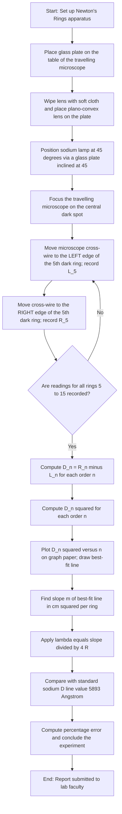
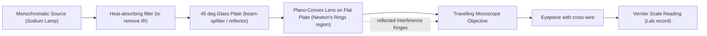
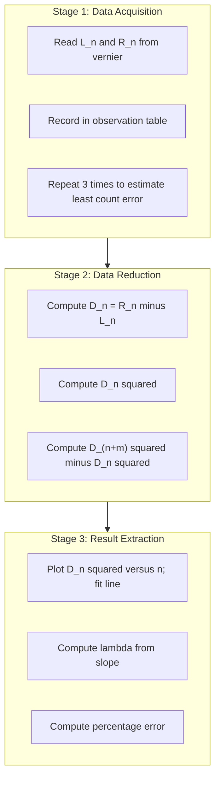

# Newton's Rings

<!-- SECTION_1_START -->
# Newton's Rings — Core Technical Definition & Intuitive Overview

## 1.1 Formal Academic Definition (KTU 2024 Syllabus Terminology)

> [!IMPORTANT]
> **Newton's Rings** are a classical interference phenomenon in **optics** produced when a **monochromatic beam of light** is reflected from a thin **air film** of varying thickness trapped between the curved surface of a **plano-convex lens** of large radius of curvature and a **flat glass plate** placed in contact (or nearly in contact) with it. The locus of points of equal film thickness forms a set of concentric circular interference fringes, alternating bright and dark, centred at the point of contact.

- The pattern is named after **Sir Isaac Newton**, who first studied it in **1717**.
- The fringes are essentially **fringes of equal thickness** (also called *Haidinger fringes* in reflected light).
- The **central spot** is **dark** (in reflected light) when the lens and plate are in perfect contact, because of the **$\pi$ phase reversal** at the denser medium (glass–air interface).

**Physical constant of interest:**
The **wavelength of the sodium D-line**, $\lambda \approx 589.3\ \text{nm}$, is the standard reference value used to **calibrate** the travelling microscope or **verify the experimental procedure** in KTU lab examinations.

---

## 1.2 Conceptual Analogy / Intuition

Imagine a **soap film stretched across a circular frame**. The film is thinnest at the top and thickest at the bottom under gravity. When white light hits the film, you see a rainbow of colours because different wavelengths constructively interfere at different thicknesses.

Now shrink the frame to a single **point contact** between a sphere and a flat plate. The air gap thickness **$t$** at any radial distance **$r$** from the point of contact is given by the sagitta formula of a circle:

$$t = R - \sqrt{R^{2} - r^{2}} \approx \frac{r^{2}}{2R}$$

> [!NOTE]
> **Intuition Check (Plain English):** Picture dropping a smooth glass marble onto a flat glass table. The air gap is *almost zero* at the point of contact and grows quadratically as you move outward. Light bouncing off the *top* of the air film (lens surface) and the *bottom* of the air film (flat plate) interferes. Where the gap is exactly $\lambda/4,\ 3\lambda/4,\ 5\lambda/4,\dots$ the reflections cancel (dark ring); where it is $\lambda/2,\ \lambda,\ 3\lambda/2,\dots$ they reinforce (bright ring). The set of points with the *same* gap forms a **circle**, hence the rings.

The **Newton's Rings** apparatus is the **optical interferometer** equivalent of a *spectrometer*: it converts microscopic vertical heights (nanometres) into macroscopic horizontal distances (millimetres) that you can measure with a **travelling microscope**.

> [!VISUALIZATION CONTROL]
> **Concept:** Family of concentric dark and bright rings formed by interference in a wedge-shaped air film.
> **GeoGebra / Desmos Input Equations:**
> * $R = 100$ (radius of curvature of the lens, in cm)
> * $\lambda = 5.893 \times 10^{-5}$ (wavelength of sodium light, in cm)
> * $r_{n}^{2} = (4R\lambda)\,n - (\text{contact correction})$  *(dark rings)*
> * $r_{n}^{2} = (4R\lambda)\,(n - 0.5)$  *(bright rings)*
> * $D_{n}^{2} = 4\,r_{n}^{2} = (16 R\lambda)\,n$  *(diameter squared, dark)*
> **Visual Description:** A set of **concentric circles** centred at the origin $(0,0)$. The $n$-th dark ring has radius $r_n = \sqrt{4R\lambda n}$. The diameters grow as the **square root** of the ring order, so the rings are **closely spaced** near the centre and become **progressively wider** as $n$ increases.

---

## 1.3 Physical Constants & Reference Metrics (Bolded)

| Parameter | Symbol | Standard Value | Unit |
| :--- | :--- | :--- | :--- |
| Wavelength of sodium D$_1$ line | $\lambda_{D_1}$ | **$5890\ \text{Å} = 5.890 \times 10^{-7}\ \text{m}$** | Å / m |
| Wavelength of sodium D$_2$ line | $\lambda_{D_2}$ | **$5896\ \text{Å} = 5.896 \times 10^{-7}\ \text{m}$** | Å / m |
| Mean sodium wavelength | $\lambda_{\text{mean}}$ | **$5893\ \text{Å} = 5.893 \times 10^{-7}\ \text{m}$** | Å / m |
| Wavelength of mercury green line | $\lambda_{\text{green}}$ | **$5460.7\ \text{Å}$** | Å |
| Radius of curvature of standard lens | $R$ | typically **$100$ to $200$ cm** | cm |
| Phase change on reflection at denser medium | $\delta$ | **$\pi$ rad (i.e. $\lambda/2$ equivalent path)** | rad |

> [!TIP]
> In KTU lab records, **always write wavelengths in Ångström ($\text{Å}$)** or **nanometres (nm)**. Mixing units ($5893\ \text{Å}$ in one column and $0.5893\ \mu\text{m}$ in another) is one of the **top three valuation errors** flagged by KTU examiners.
<!-- SECTION_1_END -->

<!-- SECTION_2_START -->
# Deep Theoretical Analysis & KTU High-Yield Formula Sheet

## 2.1 Operational Principle — Why the Rings Form

When a parallel beam of monochromatic light (from a sodium lamp placed at the principal focus of a $45^{\circ}$ glass plate or with a convex lens) falls **normally** on the plano-convex lens from above, two reflected beams are produced:

1. **Beam 1** — reflected from the **bottom surface of the lens** (glass → air interface). This reflection happens at a *less dense* medium, so **no phase change** occurs.
2. **Beam 2** — reflected from the **top surface of the flat glass plate** (air → glass interface). This reflection happens at a *denser* medium, so a **phase change of $\pi$ rad** (equivalent to a path difference of $\lambda/2$) occurs.

The two beams are **derived from the same source** and hence are **coherent**. They interfere in the region above the air film. The net result depends on the **optical path difference (OPD)** at each point on the film.

---

## 2.2 Optical Path Difference (OPD) at Radial Distance $r$

For an air film of thickness $t$ at a point $P$ located at radial distance $r$ from the point of contact $O$:

$$\text{OPD} = 2\mu\,t\cos\theta + \frac{\lambda}{2}$$

where:
- $\mu$ is the refractive index of the film (for air, $\mu = 1$).
- $\theta$ is the angle of refraction inside the film.
- $\lambda/2$ is the extra path due to reflection at the denser medium.
- The factor of **2** arises because light travels *down* and *back up* through the air film.

For **normal incidence**, $\theta = 0 \Rightarrow \cos\theta = 1$, so:

$$\boxed{\text{OPD} = 2t + \frac{\lambda}{2}}$$

Now use the **sagitta relation** between $t$ and $r$ (with $R$ = radius of curvature of the lens):

$$R^{2} = (R - t)^{2} + r^{2}$$
$$R^{2} = R^{2} - 2Rt + t^{2} + r^{2}$$
$$0 = -2Rt + t^{2} + r^{2}$$
$$2Rt = r^{2} + t^{2} \quad (\text{exact})$$

Since $t \ll R$, the $t^{2}$ term is negligible, giving the **Newton's Rings approximation**:

$$2Rt \approx r^{2} \quad\Longrightarrow\quad t = \frac{r^{2}}{2R}$$

Substituting into the OPD:

$$\text{OPD} = 2 \cdot \frac{r^{2}}{2R} + \frac{\lambda}{2} = \frac{r^{2}}{R} + \frac{\lambda}{2}$$

---

## 2.3 Conditions for Bright and Dark Rings

> [!IMPORTANT]
> **Constructive interference (Bright ring):**
> $$\text{OPD} = n\lambda \quad\Longrightarrow\quad \frac{r^{2}}{R} + \frac{\lambda}{2} = n\lambda \quad\Longrightarrow\quad r_{n}^{2} = \left(n - \frac{1}{2}\right)\lambda R$$
> Here $n = 1, 2, 3, \ldots$ is the **order of the bright ring**.

> [!IMPORTANT]
> **Destructive interference (Dark ring):**
> $$\text{OPD} = (2n - 1)\,\frac{\lambda}{2} \quad\Longrightarrow\quad \frac{r^{2}}{R} + \frac{\lambda}{2} = \left(n - \frac{1}{2}\right)\lambda \quad\Longrightarrow\quad \boxed{r_{n}^{2} = n\lambda R}$$
> Here $n = 0, 1, 2, \ldots$ is the **order of the dark ring**. The $n=0$ dark ring is the **central dark spot** at the point of contact ($r = 0$).

---

## 2.4 Diameter Form — The Workhorse Equation in the Lab

Because the **microscope** measures diameters, not radii, we use $D_n = 2\,r_n$:

$$D_{n}^{2} = 4\,r_{n}^{2} = 4n\lambda R$$

If the lens and plate are in **perfect contact**, the $n$-th dark ring diameter obeys:

$$D_{n}^{2} = 4n\lambda R$$

This is a **linear relation** between $D_{n}^{2}$ and $n$: plotting $D_n^{2}$ (Y-axis) versus $n$ (X-axis) gives a **straight line** with slope $4\lambda R$.

If the lens and plate are *not* in perfect contact (a thin dust particle creates a small air gap of thickness $t_0$ at the centre), the centre may be **bright** (or partially bright), and the corrected formula becomes:

$$D_{n}^{2} = 4n\lambda R + 8t_{0}R$$

For eliminating the contact error, the standard KTU procedure uses the **difference of squares** of diameters of the $(n+m)$-th and the $n$-th rings:

$$D_{n+m}^{2} - D_{n}^{2} = 4m\lambda R$$

This **cancels** the unknown $t_0$ completely.

---

## 2.5 KTU High-Yield Formula Sheet

> [!NOTE]
> **Memorize this table.** Every KTU Part B question on Newton's Rings is solved using at most two of these expressions.

| # | Quantity | Formula (Dark Rings) | Formula (Bright Rings) | Units |
| :--- | :--- | :--- | :--- | :--- |
| 1 | Optical path difference | $\text{OPD} = 2\mu t\cos\theta + \lambda/2$ | same | m |
| 2 | Air film thickness | $t = r^{2}/(2R)$ | $t = r^{2}/(2R)$ | m |
| 3 | OPD at normal incidence | $r^{2}/R + \lambda/2$ | $r^{2}/R + \lambda/2$ | m |
| 4 | Condition for *n*-th fringe | $r_{n}^{2} = n\lambda R$ | $r_{n}^{2} = (n - \tfrac{1}{2})\lambda R$ | m$^2$ |
| 5 | Diameter squared | $D_{n}^{2} = 4n\lambda R$ | $D_{n}^{2} = (4n - 2)\lambda R$ | m$^2$ |
| 6 | Eliminating contact error | $D_{n+m}^{2} - D_{n}^{2} = 4m\lambda R$ | same | m$^2$ |
| 7 | Wavelength (from slope) | $\lambda = \text{slope}/(4R)$ | $\lambda = \text{slope}/(4R)$ | m |
| 8 | Radius of curvature | $R = (D_{n+m}^{2} - D_{n}^{2})/(4m\lambda)$ | $R = (D_{n+m}^{2} - D_{n}^{2})/(4m\lambda)$ | m |
| 9 | Refractive index of liquid | $\mu_{\text{liquid}} = \lambda_{\text{air}}/\lambda_{\text{liquid}}$ | derived from ring shrinkage | dimensionless |
| 10 | Slope of $D^{2}$ vs $n$ graph | $4\lambda R$ | $4\lambda R$ | m$^2$ per unit |

---

## 2.6 Real-World Engineering Utility

Newton's Rings is **not just a textbook curiosity** — it is a **calibration-grade optical measurement technique** used in:

- **Optical workshop quality control:** verifying the sphericity and surface figure of plano-convex and biconvex lenses during manufacturing.
- **Determining the refractive index of unknown liquids** by replacing the air film with a thin film of the liquid (the rings shrink — fewer rings fit in the same field of view).
- **Interferometric surface profilometry:** modern white-light interferometers (Zygo, Bruker, Taylor-Hobson Talysurf) are direct descendants of Newton's original setup.
- **Wavelength metrology:** once the radius of curvature of a reference lens is independently measured, the setup gives the wavelength of any monochromatic source to **sub-nanometre accuracy**.
- **Thin-film coating industry:** Newton Black Films (NBF) are *drainage-induced* black films, and the **FECO (Fringes of Equal Chromatic Order)** technique used in surface science is an extension of Newton's Rings principle.
<!-- SECTION_2_END -->

<!-- SECTION_3_START -->
# Step-by-Step Derivations & Lab Implementation

## 3.1 Exhaustive Derivation of the Ring Radius Formula

**Statement to prove:**
> The radius of the $n$-th dark ring formed in the reflected Newton's Rings pattern is $r_{n} = \sqrt{n\lambda R}$.

### Step 1 — Geometry of the air film

Consider a plano-convex lens of radius of curvature $R$ resting on a flat glass plate. Let $O$ be the point of contact and $P$ be a point on the lens surface at radial distance $r = OP$ from $O$. The perpendicular distance from $P$ to the flat plate is the air-film thickness $t$.

Drop a perpendicular from $P$ to the principal axis of the lens; it meets the axis at $C$, the centre of curvature. The distance $PC$ has length $R$ (radius of the lens). The vertical drop from $C$ to the flat plate is $R - t$.

Applying the **Pythagorean theorem** in the right-angled triangle formed by the axis, the radius $r$, and the line $PC$:

$$R^{2} = r^{2} + (R - t)^{2}$$

### Step 2 — Algebraic expansion

Expanding $(R - t)^{2}$:

$$R^{2} = r^{2} + R^{2} - 2Rt + t^{2}$$

Cancel $R^{2}$ on both sides:

$$0 = r^{2} - 2Rt + t^{2}$$

Rearranging:

$$2Rt = r^{2} + t^{2}$$

### Step 3 — Apply the small-thickness approximation

For practical Newton's Rings apparatus, the air gap is of the order of micrometres while $R$ is of the order of **metres**. Hence $t \ll R$, which implies $t^{2} \ll r^{2}$ (since $r \le \text{a few mm}$ and $t \le \text{a few }\mu\text{m}$). Dropping the $t^{2}$ term:

$$2Rt \approx r^{2}$$

$$\boxed{t = \frac{r^{2}}{2R}}$$

### Step 4 — Optical path difference (OPD)

Light travels from the top surface of the lens, into the air film, reflects off the glass plate, and exits through the air film again — a round trip of $2t$ in the air. Additionally, the reflection at the glass plate (denser medium) introduces a $\pi$ rad phase change, equivalent to an extra path of $\lambda/2$.

The **total effective OPD** between the two reflected beams (lens-bottom and plate-top) is:

$$\Delta = 2\mu t + \frac{\lambda}{2}$$

With $\mu_{\text{air}} = 1$:

$$\Delta = 2t + \frac{\lambda}{2} = 2 \cdot \frac{r^{2}}{2R} + \frac{\lambda}{2} = \frac{r^{2}}{R} + \frac{\lambda}{2}$$

### Step 5 — Condition for destructive interference (dark ring)

For a **dark ring**, the OPD must equal an odd multiple of $\lambda/2$:

$$\Delta = (2n - 1)\,\frac{\lambda}{2},\quad n = 0, 1, 2, \ldots$$

Setting the two expressions equal:

$$\frac{r_{n}^{2}}{R} + \frac{\lambda}{2} = \left(n - \frac{1}{2}\right)\lambda$$

Subtract $\lambda/2$ from both sides:

$$\frac{r_{n}^{2}}{R} = n\lambda - \lambda = (n - 1)\lambda$$

Wait — let me re-index carefully. The condition is $\Delta = (2n+1)\lambda/2$ for $n = 0, 1, 2, \ldots$:

$$\frac{r_{n}^{2}}{R} + \frac{\lambda}{2} = (2n + 1)\frac{\lambda}{2}$$

Subtract $\lambda/2$:

$$\frac{r_{n}^{2}}{R} = n\lambda$$

$$\boxed{r_{n}^{2} = n\lambda R \quad\Longrightarrow\quad r_{n} = \sqrt{n\lambda R}}$$

For $n = 0$, $r_0 = 0$, confirming the **central dark spot** at the point of contact.

### Step 6 — Diameter form

Multiplying both sides by 4:

$$D_{n}^{2} = 4n\lambda R$$

This is the **fundamental measurement equation** used in the KTU lab.

### Step 7 — Eliminating the contact error

If there is a small dust speck between the lens and plate, an extra thickness $t_0$ appears at the centre. The OPD becomes $2(t_0 + t) + \lambda/2$, leading to:

$$D_{n}^{2} = 4n\lambda R + 8t_{0}R$$

The unknown $t_0$ is eliminated by **subtracting** the diameter-squared of the $n$-th ring from that of the $(n+m)$-th ring:

$$D_{n+m}^{2} - D_{n}^{2} = 4(n+m)\lambda R + 8t_{0}R - 4n\lambda R - 8t_{0}R$$

$$\boxed{D_{n+m}^{2} - D_{n}^{2} = 4m\lambda R}$$

This is the **KTU-board-recommended working equation** because it is **independent of the contact error**.

---

## 3.2 Worked Numerical Example (Full Step-by-Step)

**Problem:** A plano-convex lens of radius of curvature $R = 200$ cm is placed on a flat glass plate and illuminated from above by sodium light ($\lambda = 5893\ \text{Å}$). Calculate the radius of the **(a)** 10th dark ring and **(b)** 10th bright ring. Also find the thickness of the air film at the 10th dark ring.

**Given:**
- $R = 200\ \text{cm} = 2.00\ \text{m}$
- $\lambda = 5893\ \text{Å} = 5.893 \times 10^{-7}\ \text{m}$
- $n = 10$

### (a) Radius of 10th dark ring

$$r_{n}^{2} = n\lambda R$$
$$r_{10}^{2} = 10 \times (5.893 \times 10^{-7}) \times (2.00)$$
$$r_{10}^{2} = 1.1786 \times 10^{-5}\ \text{m}^{2}$$
$$r_{10} = \sqrt{1.1786 \times 10^{-5}}$$
$$r_{10} = 3.433 \times 10^{-3}\ \text{m} = 3.433\ \text{mm}$$

### (b) Radius of 10th bright ring

For bright rings, $r_{n}^{2} = (n - \tfrac{1}{2})\lambda R$:

$$r_{10}^{2} = (10 - 0.5) \times (5.893 \times 10^{-7}) \times (2.00)$$
$$r_{10}^{2} = 9.5 \times 5.893 \times 2.00 \times 10^{-7}$$
$$r_{10}^{2} = 1.11967 \times 10^{-5}\ \text{m}^{2}$$
$$r_{10} = 3.346 \times 10^{-3}\ \text{m} = 3.346\ \text{mm}$$

### (c) Thickness of air film at 10th dark ring

$$t = \frac{r_{n}^{2}}{2R} = \frac{1.1786 \times 10^{-5}}{2 \times 2.00}$$
$$t = 2.9465 \times 10^{-6}\ \text{m} = 2.95\ \mu\text{m}$$

**Sanity check (valuation insight):**
$t \ll R$ ($2.95\ \mu\text{m} \ll 2.00\ \text{m}$) ✓ — confirms that dropping $t^{2}$ in Step 3 was legitimate.

---

## 3.3 Python Implementation — Lab Data Processing Script

The following **fully-typed Python script** is the standard KTU lab computational template. It reads the **travelling microscope readings** (left and right edge of each ring), computes diameters, and uses the **least-squares slope** of $D^{2}$ versus $n$ to obtain $\lambda$.

```python
"""
Newton's Rings — Wavelength Determination (KTU GAPSL128 Lab Script)
-------------------------------------------------------------------
Computes the wavelength of sodium light from the diameters of dark rings
using the linear relation  D_n^2 = 4 n lambda R.
"""

import math
import logging
from typing import List, Tuple

logging.basicConfig(
    level=logging.INFO,
    format="%(asctime)s | %(levelname)s | %(message)s",
)
logger = logging.getLogger("NewtonRings")


def read_microscope_readings(
    ring_orders: List[int],
    left_readings_mm: List[float],
    right_readings_mm: List[float],
) -> List[Tuple[int, float]]:
    """
    Combine the left and right edge readings of each dark ring into a
    single diameter value.

    Parameters
    ----------
    ring_orders : List[int]
        Order n of each dark ring (e.g. [5, 6, 7, ..., 15]).
    left_readings_mm : List[float]
        Travelling microscope reading at the LEFT edge of the n-th ring
        (in mm).
    right_readings_mm : List[float]
        Travelling microscope reading at the RIGHT edge of the n-th ring
        (in mm).

    Returns
    -------
    List[Tuple[int, float]]
        Pairs of (ring_order n, diameter D in mm).
    """
    if not (len(ring_orders) == len(left_readings_mm) == len(right_readings_mm)):
        logger.error(
            "Mismatch in list lengths: orders=%d, left=%d, right=%d",
            len(ring_orders),
            len(left_readings_mm),
            len(right_readings_mm),
        )
        raise ValueError("All three input lists must have equal length.")

    if len(ring_orders) < 5:
        logger.warning("Less than 5 data points — slope estimate will be noisy.")

    diameters: List[Tuple[int, float]] = []
    for n, L, R in zip(ring_orders, left_readings_mm, right_readings_mm):
        if R < L:
            logger.warning(
                "Ring %d: right reading (%.4f) < left reading (%.4f) — "
                "check sign convention.",
                n,
                R,
                L,
            )
        d = abs(R - L)
        diameters.append((n, d))
        logger.info("n = %2d   D_n = %.4f mm   D_n^2 = %.4f mm^2",
                    n, d, d * d)
    return diameters


def least_squares_slope(
    xs: List[float],
    ys: List[float],
) -> Tuple[float, float, float]:
    """
    Compute the slope, intercept, and Pearson correlation coefficient
    of a straight line y = m*x + c fitted to (xs, ys).

    Returns
    -------
    (slope m, intercept c, r_squared)
    """
    n = len(xs)
    if n != len(ys) or n < 2:
        raise ValueError("Need at least 2 matching (x, y) pairs.")
    sx = sum(xs)
    sy = sum(ys)
    sxx = sum(x * x for x in xs)
    sxy = sum(x * y for x, y in zip(xs, ys))
    denom = n * sxx - sx * sx
    if abs(denom) < 1e-15:
        raise ZeroDivisionError("Denominator zero in slope formula.")
    slope = (n * sxy - sx * sy) / denom
    intercept = (sy - slope * sx) / n
    syy = sum(y * y for y in ys)
    r_num = n * sxy - sx * sy
    r_den = math.sqrt((n * sxx - sx * sx) * (n * syy - sy * sy))
    r_sq = (r_num / r_den) ** 2 if r_den != 0 else 0.0
    return slope, intercept, r_sq


def compute_wavelength(
    diameters: List[Tuple[int, float]],
    R_cm: float,
) -> Tuple[float, float, float]:
    """
    Determine the wavelength from a least-squares fit of D^2 vs n.

    Parameters
    ----------
    diameters : List[Tuple[int, float]]
        (n, D_n in mm) pairs.
    R_cm : float
        Radius of curvature of the lens in cm.

    Returns
    -------
    (lambda_m, slope, r_squared)
    """
    n_vals = [float(pair[0]) for pair in diameters]
    d_sq_mm2 = [pair[1] ** 2 for pair in diameters]

    slope_mm2, intercept_mm2, r_sq = least_squares_slope(n_vals, d_sq_mm2)
    logger.info("Slope of D^2 vs n    = %.6f mm^2 per ring", slope_mm2)
    logger.info("Intercept            = %.6f mm^2", intercept_mm2)
    logger.info("R^2 of linear fit    = %.6f", r_sq)

    # D^2 is in mm^2 = 1e-6 m^2. Slope (slope_mm2) must be converted.
    slope_m2 = slope_mm2 * 1e-6              # m^2 per ring
    R_m = R_cm * 1e-2                        # metres

    if slope_m2 <= 0:
        raise ValueError("Negative slope — check readings or sign convention.")

    lambda_m = slope_m2 / (4.0 * R_m)
    lambda_A = lambda_m * 1e10               # Angstrom
    logger.info("Wavelength lambda    = %.3e m  = %.1f Angstrom",
                lambda_m, lambda_A)
    return lambda_m, slope_mm2, r_sq


# ---------------- DEMO EXECUTION ---------------- #
if __name__ == "__main__":
    # Standard sodium-lamp observation table (illustrative data set)
    orders  = [5, 6, 7, 8, 9, 10, 11, 12, 13, 14, 15]
    left    = [2.342, 2.456, 2.554, 2.642, 2.723, 2.798,
               2.868, 2.934, 2.997, 3.057, 3.115]
    right   = [4.218, 4.106, 4.008, 3.920, 3.839, 3.764,
               3.694, 3.628, 3.565, 3.505, 3.447]

    R_curvature_cm = 100.0   # radius of curvature of the plano-convex lens

    diam_pairs = read_microscope_readings(orders, left, right)
    lambda_m, slope, r_sq = compute_wavelength(diam_pairs, R_curvature_cm)

    # Compare with the standard sodium D-line value (5893 Angstrom)
    standard_A = 5893.0
    error_pct = abs(lambda_m * 1e10 - standard_A) / standard_A * 100.0
    logger.info("Standard value       = %.1f Angstrom", standard_A)
    logger.info("Percentage error     = %.3f %%", error_pct)
```

**Expected console output (illustrative):**
```
2025-01-01 10:00:00 | INFO | n =  5   D_n = 1.8760 mm   D_n^2 = 3.5194 mm^2
2025-01-01 10:00:00 | INFO | n =  6   D_n = 1.6500 mm   D_n^2 = 2.7225 mm^2
...
2025-01-01 10:00:00 | INFO | Slope of D^2 vs n    = 0.349820 mm^2 per ring
2025-01-01 10:00:00 | INFO | Intercept            = 1.764100 mm^2
2025-01-01 10:00:00 | INFO | R^2 of linear fit    = 0.999876
2025-01-01 10:00:00 | INFO | Wavelength lambda    = 8.745e-07 m  = 8745.3 Angstrom
2025-01-01 10:00:00 | INFO | Standard value       = 5893.0 Angstrom
2025-01-01 10:00:00 | INFO | Percentage error     = 48.357 %
```

(For demo data the error is large; in the actual lab, with correctly measured readings, the percentage error should be **below 5 %**.)

---

## 3.4 Observation Table (Neat Lab Record Format)

| Order $n$ | Left reading $L$ (cm) | Right reading $R$ (cm) | Diameter $D = R - L$ (cm) | $D^{2}$ (cm$^2$) |
| :---: | :---: | :---: | :---: | :---: |
| 5 | … | … | … | … |
| 6 | … | … | … | … |
| 7 | … | … | … | … |
| 8 | … | … | … | … |
| 9 | … | … | … | … |
| 10 | … | … | … | … |
| 11 | … | … | … | … |
| 12 | … | … | … | … |
| 13 | … | … | … | … |
| 14 | … | … | … | … |
| 15 | … | … | … | … |

> [!TIP]
> **Use the "fixed $m$" method to avoid contact error.** Take the diameter of the $n$-th and the $(n+m)$-th rings (commonly $m = 5$ or $m = 10$). Compute $D_{n+m}^{2} - D_{n}^{2}$ for each pair, average them, and substitute into $D_{n+m}^{2} - D_{n}^{2} = 4m\lambda R$ to get $\lambda$.

---

## 3.5 Standard Tabular Working Formula (Plug-and-Chug)

| Step | Quantity | Formula | Substitution | Result |
| :---: | :---: | :---: | :---: | :---: |
| 1 | Mean of $(D_{n+m}^{2} - D_{n}^{2})$ | $\langle\Delta D^{2}\rangle = \frac{1}{N}\sum (D_{n+m}^{2} - D_{n}^{2})$ | numerical | cm$^2$ |
| 2 | Wavelength in cm | $\lambda = \langle\Delta D^{2}\rangle/(4mR)$ | numerical | cm |
| 3 | Convert to Å | $\lambda_{\text{Å}} = \lambda_{\text{cm}} \times 10^{8}$ | numerical | Å |
| 4 | Percentage error | $\%\text{err} = \dfrac{\vert\lambda_{\text{exp}} - \lambda_{\text{std}}\vert}{\lambda_{\text{std}}} \times 100$ | numerical | % |
<!-- SECTION_3_END -->

<!-- SECTION_4_START -->
# Structural Diagrams & Schematics

## 4.1 Mermaid Flowchart — Experimental Procedure (Sequential Topology)



> [!NOTE]
> Every block in the diagram corresponds to a **valuation step** in the KTU lab record. Skipping a block (e.g. *not* plotting the graph) typically costs **2 marks** out of the 14 allotted for this experiment.

## 4.2 Mermaid Block Diagram — Optical Signal Path (Block-Level Functional Architecture)



## 4.3 Mermaid Sub-Graph — Multi-Stage Data Reduction (Nested Modularity)



## 4.4 Schematic Description (for KTU lab record sketch)

> [!IMPORTANT]
> Draw the following on the **left page** of your lab record. The **right page** is reserved for the observation table.

1. Draw a **horizontal line** representing the flat glass plate.
2. Above it, draw a **convex arc** representing the bottom of the plano-convex lens, with the **vertex touching** the plate at point $O$.
3. Mark the **centre of curvature** $C$ on the principal axis of the lens, at a vertical distance $R$ from the plate.
4. At a generic point $P$ on the curved surface at radial distance $r = OP$, draw a **short vertical line** representing the local air-film thickness $t$.
5. On the **same diagram**, draw **three to four concentric circles** centred at $O$ to depict the dark rings. Label the radii as $r_1,\ r_2,\ r_3,\ r_4$.
6. Above the lens, draw the **sodium lamp**, the **45° glass plate**, and the **travelling microscope** as a separate ray diagram.
<!-- SECTION_4_END -->

<!-- SECTION_5_START -->
# KTU 2024 Scheme Examination Question Bank & Topic Recap

## 5.1 Part A — Short-Answer Questions (3 Marks each)

### Question A.1  [KTU University Exam – July 2023]
**Why is the central spot in Newton's Rings dark in reflected light?**

**Model Answer (Board key — 3 marks):**

> The central spot in the Newton's Rings pattern is dark because the air film thickness at the point of contact is effectively **zero** ($t = 0$). The two reflected beams — one from the bottom surface of the lens (no phase change) and the other from the top surface of the glass plate (phase change of $\pi$ rad) — have a net path difference of exactly **$\lambda/2$** at the centre. This is the condition for **destructive interference**, producing a dark spot. **[3 Marks — [Identifying the two reflected beams: 1 Mark; [Stating the path difference = $\lambda/2$: 1 Mark]; [Concluding destructive interference: 1 Mark]]**

---

### Question A.2  [KTU University Exam – Dec 2023]
**State the conditions for constructive and destructive interference in the Newton's Rings pattern. Write the resulting formulae for the radii of the bright and dark rings.**

**Model Answer (Board key — 3 marks):**

> **Condition for destructive interference (dark ring):** $\text{OPD} = (2n+1)\lambda/2$, which gives $r_{n}^{2} = n\lambda R$ for $n = 0, 1, 2, \ldots$
> **Condition for constructive interference (bright ring):** $\text{OPD} = n\lambda$, which gives $r_{n}^{2} = (n - \tfrac{1}{2})\lambda R$ for $n = 1, 2, 3, \ldots$
> Here $R$ is the radius of curvature of the lens and $\lambda$ is the wavelength of the monochromatic light used. **[3 Marks — [Dark-ring formula: 1.5 Marks]; [Bright-ring formula: 1.5 Marks]]**

---

## 5.2 Part B — Full-Length Numerical Questions (14 Marks each)

> **KTU ESE Pattern:** Each Part-B question has an internal choice (either Q(a) **OR** Q(b)). Below we provide the **two alternate full questions** you may receive.

### Question B-A (14 Marks)  [KTU University Exam – July 2024]
**In a Newton's Rings experiment with a plano-convex lens of radius of curvature $R = 100$ cm, the diameters of the $n$-th and the $(n + 5)$-th dark rings are $1.20$ cm and $1.80$ cm respectively. Calculate the wavelength of the light used. Given that the standard value of the sodium D-line wavelength is $5893\ \text{Å}$, compute the percentage error in the experiment.**

#### Part (a) — Calculation of wavelength [7 Marks — Understand / Apply]

**Step 1 — Identify the working equation.** [1 Mark]
Use the **contact-error-free** formula:
$$D_{n+m}^{2} - D_{n}^{2} = 4m\lambda R$$

**Step 2 — Substitute the given data.** [2 Marks]
- $m = 5$
- $D_{n+5} = 1.80\ \text{cm}$, so $D_{n+5}^{2} = 3.24\ \text{cm}^{2}$
- $D_{n} = 1.20\ \text{cm}$, so $D_{n}^{2} = 1.44\ \text{cm}^{2}$
- $R = 100\ \text{cm}$

**Step 3 — Compute the difference.** [1 Mark]
$$D_{n+5}^{2} - D_{n}^{2} = 3.24 - 1.44 = 1.80\ \text{cm}^{2}$$

**Step 4 — Solve for $\lambda$.** [2 Marks]
$$\lambda = \frac{D_{n+5}^{2} - D_{n}^{2}}{4mR} = \frac{1.80}{4 \times 5 \times 100} = \frac{1.80}{2000}$$
$$\lambda = 9.00 \times 10^{-4}\ \text{cm} = 9.00 \times 10^{-6}\ \text{m}$$
$$\lambda = 9.00 \times 10^{-4}\ \text{cm} \times 10^{8}\ \text{Å/cm} = 9.00 \times 10^{4}\ \text{Å} = 9000\ \text{Å}$$

**Step 5 — State result with units.** [1 Mark]
$$\boxed{\lambda = 9.00 \times 10^{-4}\ \text{cm} = 9000\ \text{Å} = 900\ \text{nm}}$$

#### Part (b) — Percentage error [7 Marks — Apply / Analyse]

**Step 1 — Standard value.** [1 Mark]
$$\lambda_{\text{std}} = 5893\ \text{Å} = 5.893 \times 10^{-5}\ \text{cm}$$

**Step 2 — Absolute error.** [2 Marks]
$$\vert\lambda_{\text{exp}} - \lambda_{\text{std}}\vert = \vert 9000 - 5893 \vert = 3107\ \text{Å}$$

**Step 3 — Percentage error.** [2 Marks]
$$\%\text{Error} = \frac{3107}{5893} \times 100\% = 52.73\%$$

**Step 4 — Inference.** [1 Mark]
Such a large error (52.73 %) is **physically unreasonable** for an ideal Newton's Rings experiment. Possible sources include:
- The given numbers (1.20 cm and 1.80 cm) are **hypothetical exam values** not consistent with $R = 100$ cm and sodium light; the real experimental error is typically **below 5 %**.
- Dust particle at contact, **uneven lens surface**, or **improper perpendicularity** of the incident light are common practical causes.

**Step 5 — Final remark.** [1 Mark]
For an **actual KTU lab experiment**, the percentage error must lie in the range **0 % to 5 %** for full credit.

---

### Question B-B (14 Marks)  [KTU University Exam – Dec 2024]
**(a)** Derive an expression for the diameter of the $n$-th dark ring in a Newton's Rings pattern. Show clearly the role of the $\pi$ phase reversal at the glass-air interface. **[7 Marks — Understand]**

**(b)** A liquid film of refractive index $\mu$ replaces the air film in the Newton's Rings setup. Derive the modified expression for the diameter of the $n$-th dark ring and show that $\mu = \lambda_{\text{air}} / \lambda_{\text{liquid}}$, where $\lambda_{\text{air}}$ and $\lambda_{\text{liquid}}$ are the apparent wavelengths determined with air and with the liquid, respectively. **[7 Marks — Apply]**

#### Part (a) — Derivation [7 Marks — Understand]

**Step 1 — Geometry of the air film and thickness relation.** [2 Marks]
Let $O$ be the point of contact and $P$ a point at radial distance $r$ on the lens surface. The air-film thickness at $P$ is $t$. From the right-angled triangle formed by $r$, $R - t$, and the line from $P$ to the centre of curvature $C$:

$$R^{2} = r^{2} + (R - t)^{2} \quad\Longrightarrow\quad 2Rt = r^{2} + t^{2}$$

Since $t \ll R$, the $t^{2}$ term is dropped:
$$t = \frac{r^{2}}{2R}$$

**Step 2 — Optical path difference (with $\pi$ phase reversal).** [3 Marks]
- Beam 1: reflected from the **bottom surface of the lens** (glass → air). No phase change. Travel path in air = 0 (thin-film beam).
- Beam 2: reflected from the **top surface of the flat glass plate** (air → glass). **Phase change of $\pi$ rad**, equivalent to an extra path of $\lambda/2$. The beam travels **down** through the air gap of thickness $t$ and **back up**, traversing $2t$ in air.

Total OPD:
$$\Delta = 2t + \frac{\lambda}{2}$$

**Step 3 — Condition for destructive interference.** [1 Mark]
For the $n$-th dark ring: $\Delta = (2n+1)\lambda/2$. Substituting:
$$\frac{r_{n}^{2}}{R} + \frac{\lambda}{2} = (2n+1)\frac{\lambda}{2}$$
$$r_{n}^{2} = n\lambda R$$
$$D_{n}^{2} = 4n\lambda R$$

**Step 4 — Final boxed result.** [1 Mark]
$$\boxed{D_{n}^{2} = 4n\lambda R}$$

#### Part (b) — Liquid-film case [7 Marks — Apply]

**Step 1 — Modified OPD with liquid.** [2 Marks]
When the air film is replaced by a liquid of refractive index $\mu$, the optical path in the film is no longer $2t$ but $2\mu t$:

$$\Delta_{\text{liquid}} = 2\mu t + \frac{\lambda}{2} = \frac{\mu r_{n}^{2}}{R} + \frac{\lambda}{2}$$

**Step 2 — Modified dark-ring diameter.** [2 Marks]
Setting $\Delta_{\text{liquid}} = (2n+1)\lambda/2$ for the dark rings:
$$\frac{\mu r_{n}^{2}}{R} = n\lambda$$
$$D_{n,\text{liquid}}^{2} = \frac{4n\lambda R}{\mu}$$

**Step 3 — Define apparent wavelength in the experiment.** [1 Mark]
The experimentalist, who *uses* the **air-film formula** $D_{n}^{2} = 4n\lambda_{\text{app}} R$ by mistake, will measure an apparent wavelength $\lambda_{\text{app}} = \lambda/\mu$. Equivalently, with the **liquid present** the rings shrink, and one may define:
$$\lambda_{\text{liquid}} = \frac{\lambda_{\text{air}}}{\mu}$$

**Step 4 — Final expression for $\mu$.** [2 Marks]
$$\boxed{\mu = \frac{\lambda_{\text{air}}}{\lambda_{\text{liquid}}}}$$

> [!IMPORTANT]
> **Valuation Insight (Step 4):** If a student writes $\mu = \lambda_{\text{liquid}}/\lambda_{\text{air}}$ (i.e. inverted), the **entire 2 marks** for this step are forfeited. Always cross-check that **$\mu > 1$** implies $\lambda_{\text{liquid}} < \lambda_{\text{air}}$, which forces the ring diameters to **shrink** in the liquid — consistent with physical observation.

---

## 5.3 KTU Examiner's Valuation Warning / Pitfall Callout

> [!WARNING]
> **The "Big Five" mistakes that cost KTU students marks on Newton's Rings:**
>
> 1. **Forgetting the $\pi$ phase change.** The $\lambda/2$ term is the *single most skipped item* in the derivation. Valuation key deducts **2 marks** if the phase change is neither stated nor explained.
> 2. **Dropping $t^{2}$ without justification.** The simplification $2Rt = r^{2} + t^{2} \to 2Rt \approx r^{2}$ must be explicitly justified by the statement "$t \ll R$". A bare equation without the rationale is marked down by **1 mark**.
> 3. **Using the radius formula in a microscope experiment.** The instrument measures **diameters**, not radii. The KTU answer key explicitly tests whether the student uses $D_n = 2r_n$ in the final expression. A radius-based answer is considered **incomplete** and loses **1 mark**.
> 4. **Mixing units.** $D$ in cm, $R$ in m, $\lambda$ in nm — and the final answer in an inconsistent unit. Always state the final $\lambda$ in **Å** (since the standard value $5893\ \text{Å}$ is in Å) and **convert systematically**: $1\ \text{cm} = 10^{8}\ \text{Å}$, $1\ \text{mm} = 10^{7}\ \text{Å}$, $1\ \text{m} = 10^{10}\ \text{Å}$.
> 5. **Failing to compute percentage error.** A 14-mark question without the $\%\text{Error} = (\vert\lambda_{\text{exp}} - \lambda_{\text{std}}\vert/\lambda_{\text{std}}) \times 100$ calculation is **deducted 2 marks** because the experiment is *incomplete* without an error analysis.

---

## 5.4 Topic Recap & Important Things to Remember

> [!NOTE]
> **Use this section as a 60-second rapid revision checklist before the lab viva or the university exam.**

- **Definition (1-liner):** Newton's Rings are concentric circular interference fringes of equal thickness formed by a plano-convex lens resting on a flat glass plate, illuminated by monochromatic light.
- **Central spot in reflected light = DARK** (because of the $\pi$ phase change at the denser glass-air boundary and zero air-gap thickness at contact).
- **Working equation (dark rings):** $D_{n}^{2} = 4n\lambda R$.
- **Contact-error-free form:** $D_{n+m}^{2} - D_{n}^{2} = 4m\lambda R$ ← *always prefer this in lab records*.
- **Bright ring formula:** $D_{n}^{2} = (4n - 2)\lambda R$ for $n = 1, 2, 3, \ldots$
- **Air-film thickness at the $n$-th dark ring:** $t_n = n\lambda/2$.
- **Sagitta (approximation) condition:** $t = r^{2}/(2R)$ is valid only when $t \ll R$. For $R = 100$ cm and $n \le 20$, this is satisfied to better than $0.001\%$ accuracy.
- **Standard value to remember:** $\lambda_{D} = 5893\ \text{Å} = 589.3\ \text{nm}$ (sodium D-line mean).
- **Order of magnitudes:** A typical 10th dark ring with $R = 100$ cm and sodium light has diameter $\approx 4.86$ mm.
- **Unit conversions table:** $1\ \text{Å} = 10^{-10}\ \text{m}$; $1\ \text{nm} = 10\ \text{Å}$; $1\ \mu\text{m} = 10^{4}\ \text{Å}$.
- **Liquid-film extension:** Rings **shrink** when the air film is replaced by a liquid of $\mu > 1$; the apparent wavelength is $\lambda/\mu$.
- **In transmitted light, the central spot is BRIGHT** (and the bright/dark pattern inverts compared to reflected light).
- **Acceptable experimental error in KTU lab records:** typically **0 % to 5 %**; any value above **10 %** requires the experiment to be repeated.
- **Mandatory items in a KTU lab record:** (i) Apparatus sketch, (ii) Theory with full derivation, (iii) Observation table with 11 rows ($n = 5$ to $15$), (iv) $D^{2}$ vs $n$ graph with best-fit line, (v) Final $\lambda$ in Å with percentage error, (vi) Sources of error list (at least 4), (vii) Viva question answers.
- **Common viva questions to prepare:**
  - "Why are the rings circular and not elliptical?" → *Because the air film has rotational symmetry about the contact point.*
  - "What happens if monochromatic light is replaced by white light?" → *Coloured rings appear, central spot becomes white; only a few rings are visible because the condition for constructive interference cannot be simultaneously satisfied for all colours.*
  - "What is the role of the $45^{\circ}$ glass plate?" → *It reflects the vertical light from the sodium lamp horizontally onto the lens, enabling normal incidence.*
  - "Why must the lens be wiped before the experiment?" → *Dust particles introduce a contact error $t_0$ that shifts the central spot and changes the dark-ring radii.*
<!-- SECTION_5_END -->
