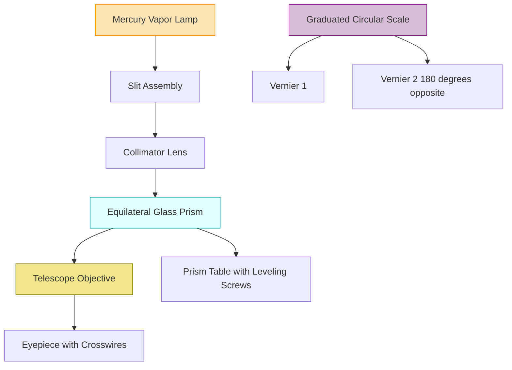
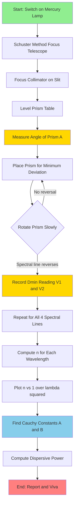

# Spectrometer Prism

<!-- SECTION_1_START -->

# 🔬 Spectrometer Prism Experiment — KTU 2024 Lab Manual Module 1

> [!IMPORTANT]
> **KTU Syllabus Mapping (GAPSL128 — Module 1: Mechanics, Oscillations, and Optics)**
> This experiment satisfies the optics segment of your Physics Lab and aligns with **CO1: Apply fundamental physics principles to engineering experiments** and **CO2: Analyze experimental data using graphical and statistical methods.**

---

## 1.1 What is a Spectrometer?

A **spectrometer** is a precision optical instrument used to measure the **wavelengths of spectral lines** produced by a light source, by accurately measuring the angles through which light is refracted, reflected, or diffracted.

In our experiment, the spectrometer is coupled with a **glass prism** (typically equilateral, apex angle **60°**) to study the phenomenon of **dispersion** — the splitting of white light into its constituent colours.

> [!NOTE]
> **Formal KTU Definition:** A spectrometer is an optical instrument consisting of a collimator, a prism table, and a telescope mounted on a graduated circular scale, used to measure angles of deviation of light rays with high precision (least count ≈ 1 minute of arc).

---

## 1.2 The Triangular Glass Prism — Conceptual Analogy

Imagine you are pushing a shopping cart diagonally across a smooth floor onto a rough carpet. As the wheels hit the carpet, they **slow down and bend** — this bending is **refraction**. A glass prism does the same thing to light: it bends light, but because **different colours (wavelengths) travel at different speeds inside glass**, each colour bends by a *different amount*.

| Physical Phenomenon | Everyday Analogy |
|---|---|
| White light entering prism | Mixed crowd walking into a glass-walled corridor |
| Dispersion (splitting into colours) | Crowd separating by walking speed (kids, adults, elderly) |
| Deviation angle | How much the crowd turns while passing through |
| Minimum deviation | The "sweet spot" angle where the light path is symmetric |

The famous **rainbow** is nature's own spectrometer-prism experiment — sunlight refracts and disperses through countless water droplets, each acting as a tiny prism.

> [!VISUALIZATION CONTROL]
> **Concept:** Refraction of light through a triangular prism showing angle of deviation
> **GeoGebra / Desmos Input Equations:**
> * Point $A = (0, 0)$ — apex of prism
> * Line 1: $y = \tan(60°)\cdot x$ — first refracting face (left)
> * Line 2: $y = -\tan(60°)\cdot (x - 2)$ — second refracting face (right)
> * Incident ray: $f_1(x) = x - 4$
> * Refracted ray (Snell's law simulation): $f_2(x) = (n-1)/n \cdot x$
> **Visual Description:** You should see a triangular prism with a light ray entering the left face, refracting inside, then refracting again as it exits the right face — the exit ray is deviated from the original direction by angle $D$.

---

## 1.3 Key Optical Quantities You Must Know

> [!IMPORTANT]
> **Three Critical Angles (Memorize These for Lab Viva!):**
> * **Angle of the Prism (A)** — the angle at the apex of the triangular prism
> * **Angle of Incidence ($i_1$, $i_2$)** — angles at which light strikes the two refracting faces
> * **Angle of Deviation (D)** — the total angle by which the emergent ray deviates from the original incident direction

> [!NOTE]
> **Physical Constants Used in This Experiment:**
> * Speed of light in vacuum: **$c = 3 \times 10^8 \text{ m/s}$**
> * Refractive index of standard crown glass: **$n \approx 1.52$** (for sodium D-line, $\lambda = 5893 \text{ Å}$)
> * 1 Angstrom: **$1 \text{ Å} = 10^{-10} \text{ m}$**

---

<!-- SECTION_1_END -->

<!-- SECTION_2_START -->

# 📐 Deep Theoretical Analysis — Prism Optics & Dispersion

## 2.1 The Geometry of Light Inside a Prism

When a monochromatic light ray strikes the first face of the prism, three things happen in sequence:

1. **Refraction at the first face** — light bends *towards* the normal as it enters the denser glass medium
2. **Rectilinear propagation** — light travels in a straight line inside the prism
3. **Refraction at the second face** — light bends *away* from the normal as it exits into the rarer air medium

The **net bending** of the emergent ray from the original incident direction is called the **angle of deviation (D)**.

---

## 2.2 Why Does Deviation Have a *Minimum* Value?

If you slowly rotate the prism while keeping the light source and telescope fixed, the image of the slit will *move*. At one particular orientation of the prism, the deviation reaches its **smallest possible value** — this is the **angle of minimum deviation ($D_{min}$)**.

> [!IMPORTANT]
> **Why minimum deviation matters in the lab:**
> At $D_{min}$, the light ray passes **symmetrically** through the prism — meaning the angle of incidence equals the angle of emergence ($i_1 = i_2$). This symmetry makes the mathematics beautifully simple and is the only configuration where we can precisely compute the refractive index.

---

## 2.3 Derivation of the Prism Formula (KTU High-Yield)

Let:
* $A$ = angle of the prism
* $i_1$ = angle of incidence at the first face
* $i_2$ = angle of incidence at the second face (which equals the angle of emergence at minimum deviation condition)
* $r_1$ = angle of refraction at the first face
* $r_2$ = angle of refraction at the second face
* $D$ = angle of deviation

**From the geometry of the prism (using the exterior angle theorem on the triangle formed by the ray inside the prism):**

$$A = r_1 + r_2$$

**From the geometry of the deviation (the deviation is the sum of deviations at both faces):**

$$D = (i_1 - r_1) + (i_2 - r_2) = (i_1 + i_2) - (r_1 + r_2)$$

**Substituting $A = r_1 + r_2$:**

$$D = i_1 + i_2 - A$$

**At minimum deviation:** $i_1 = i_2 = i$ and $r_1 = r_2 = r$, so:

$$D_{min} = 2i - A \quad \Rightarrow \quad i = \frac{A + D_{min}}{2}$$

$$A = 2r \quad \Rightarrow \quad r = \frac{A}{2}$$

**Applying Snell's Law at the first face:** $n = \frac{\sin i}{\sin r}$

$$\boxed{n = \frac{\sin\left(\dfrac{A + D_{min}}{2}\right)}{\sin\left(\dfrac{A}{2}\right)}}$$

---

## 2.4 Cauchy's Dispersion Formula

The refractive index of glass depends on the wavelength of light. Cauchy's empirical formula captures this:

$$n = A + \frac{B}{\lambda^2} + \frac{C}{\lambda^4}$$

For most practical lab work, only the first two terms are used:

$$n = A + \frac{B}{\lambda^2}$$

where $A$ and $B$ are **Cauchy's constants** characteristic of the prism material.

---

## 2.5 Dispersive Power of the Prism

The **dispersive power ($\omega$)** measures the ability of the prism material to separate colours:

$$\omega = \frac{n_v - n_r}{n_y - 1}$$

where:
* $n_v$ = refractive index for violet light
* $n_r$ = refractive index for red light
* $n_y$ = refractive index for yellow light (sodium D-line)

> [!NOTE]
> **Engineering Application:** Dispersive power is critical in designing **achromatic doublets** — pairs of lenses made from different glasses that cancel out chromatic aberration in cameras, telescopes, and microscopes.

---

## 2.6 KTU Formula Cheat Sheet

| Quantity | Formula | Units | Key Condition |
|---|---|---|---|
| Prism refractive index | $n = \dfrac{\sin[(A+D_{min})/2]}{\sin(A/2)}$ | dimensionless | Valid only at minimum deviation |
| Angle of minimum deviation | $D_{min} = 2i - A$ | degrees / radians | When $i_1 = i_2$ |
| Dispersive power | $\omega = \dfrac{n_v - n_r}{n_y - 1}$ | dimensionless | Uses C, D, F Fraunhofer lines |
| Cauchy's formula (2-term) | $n = A + \dfrac{B}{\lambda^2}$ | dimensionless | $\lambda$ in Angstroms or meters |
| Snell's law | $n = \dfrac{\sin i}{\sin r}$ | dimensionless | Always valid at any interface |
| Slope of $n$ vs $1/\lambda^2$ plot | $B$ (Cauchy's constant) | $\text{m}^2$ | From linear regression |
| Intercept of $n$ vs $1/\lambda^2$ plot | $A$ (Cauchy's constant) | dimensionless | From linear regression |

> [!IMPORTANT]
> **KTU Examiner's Tip:** The most common mistake students make is using the **wrong value of A** — always measure the prism angle *experimentally* using the spectrometer, don't just trust the manufacturer's label that says "60°"!

---

## 2.7 Real-World Engineering Applications

| Field | Application of Spectrometer-Prism |
|---|---|
| **Astronomy** | Identifying chemical composition of stars by analyzing their spectra |
| **Forensic Science** | Identifying unknown substances at crime scenes |
| **Pharmaceutical Industry** | Quality control of drug purity |
| **Semiconductor Manufacturing** | Monitoring thin-film deposition |
| **Environmental Monitoring** | Detecting pollutants in air and water |
| **Medical Diagnostics** | Blood oxygen measurement (pulse oximeter uses similar principles) |

---

<!-- SECTION_2_END -->

<!-- SECTION_3_START -->

# 🧮 Step-by-Step Derivations & Experimental Procedure

## 3.1 Complete Derivation of the Refractive Index Formula

We start from the two geometric relations we established:

$$A = r_1 + r_2 \quad \text{...(1)}$$

$$D = (i_1 - r_1) + (i_2 - r_2) = i_1 + i_2 - (r_1 + r_2) \quad \text{...(2)}$$

**Step 1:** Substitute equation (1) into equation (2):

$$D = i_1 + i_2 - A$$

**Step 2:** Rearrange to get the angles of incidence:

$$i_1 + i_2 = A + D \quad \text{...(3)}$$

**Step 3:** At the position of minimum deviation, by the principle of reversibility of light, the ray path is symmetric. This means:

$$i_1 = i_2 = i \quad \text{and} \quad r_1 = r_2 = r$$

**Step 4:** Substitute into equation (3):

$$2i = A + D_{min}$$

$$i = \frac{A + D_{min}}{2} \quad \text{...(4)}$$

**Step 5:** Similarly, from equation (1) at symmetry:

$$A = r + r = 2r$$

$$r = \frac{A}{2} \quad \text{...(5)}$$

**Step 6:** Apply Snell's Law of refraction at the first face of the prism:

$$n = \frac{\sin i}{\sin r}$$

**Step 7:** Substitute equations (4) and (5) into Snell's Law:

$$\boxed{n = \frac{\sin\left(\dfrac{A + D_{min}}{2}\right)}{\sin\left(\dfrac{A}{2}\right)}}$$

**This is the master formula for the experiment.** Every numerical computation in the lab reduces to plugging measured values of $A$ and $D_{min}$ into this expression.

---

## 3.2 Worked Numerical Example (KTU-Style)

**Given:**
* Angle of the prism: $A = 60°$
* Angle of minimum deviation for sodium light: $D_{min} = 47°$

**Step 1:** Compute the argument of the numerator:

$$\frac{A + D_{min}}{2} = \frac{60° + 47°}{2} = \frac{107°}{2} = 53.5°$$

**Step 2:** Compute the argument of the denominator:

$$\frac{A}{2} = \frac{60°}{2} = 30°$$

**Step 3:** Apply the formula:

$$n = \frac{\sin(53.5°)}{\sin(30°)}$$

**Step 4:** Evaluate the sine values:

$$\sin(53.5°) = 0.8039$$

$$\sin(30°) = 0.5000$$

**Step 5:** Compute the ratio:

$$n = \frac{0.8039}{0.5000} = 1.6078$$

**Answer:** $n \approx 1.608$ (this is the refractive index of the prism glass for sodium D-line light)

---

## 3.3 Symbolic Python Implementation (Lab Data Analysis)

Here is production-quality Python code you can use to analyze your lab readings and compute the refractive index, Cauchy's constants, and dispersive power:

```python
import numpy as np
import matplotlib.pyplot as plt
from typing import List, Tuple, Dict


def compute_refractive_index(angle_of_prism_deg: float, 
                             angle_of_min_dev_deg: float) -> float:
    """
    Compute the refractive index of a prism using the prism formula.
    
    Parameters
    ----------
    angle_of_prism_deg : float
        Apex angle A of the prism in degrees
    angle_of_min_dev_deg : float
        Minimum angle of deviation D_min in degrees
        
    Returns
    -------
    float
        Refractive index (dimensionless)
    """
    A_rad = np.deg2rad(angle_of_prism_deg)
    D_rad = np.deg2rad(angle_of_min_dev_deg)
    
    numerator = np.sin((A_rad + D_rad) / 2.0)
    denominator = np.sin(A_rad / 2.0)
    
    if abs(denominator) < 1e-12:
        raise ValueError("Denominator too small — check prism angle A")
    
    return float(numerator / denominator)


def compute_cauchys_constants(wavelengths_nm: List[float], 
                              refractive_indices: List[float]
                              ) -> Tuple[float, float]:
    """
    Determine Cauchy's constants A and B by linear regression of 
    n vs 1/lambda^2 (lambda in meters).
    """
    wavelengths_m = np.array(wavelengths_nm) * 1e-9
    inv_lambda_sq = 1.0 / (wavelengths_m ** 2)
    n_values = np.array(refractive_indices)
    
    # Linear fit: n = A + B * (1/lambda^2)
    coefficients = np.polyfit(inv_lambda_sq, n_values, deg=1)
    B = coefficients[0]
    A = coefficients[1]
    
    return float(A), float(B)


def compute_dispersive_power(n_violet: float, 
                             n_red: float, 
                             n_yellow: float) -> float:
    """
    Compute the dispersive power of the prism material.
    """
    if abs(n_yellow - 1.0) < 1e-12:
        raise ValueError("Yellow refractive index cannot equal 1")
    return (n_violet - n_red) / (n_yellow - 1.0)


def full_experiment_analysis(measurements: Dict[str, Tuple[float, float]]
                              ) -> Dict[str, float]:
    """
    Complete analysis of a spectrometer-prism experiment.
    
    Parameters
    ----------
    measurements : dict
        Keys: 'yellow', 'green', 'blue', 'violet' 
        Values: (A_deg, D_min_deg)
        
    Returns
    -------
    dict
        Refractive indices, Cauchy's constants, and dispersive power
    """
    # Standard mercury spectral line wavelengths (in nm)
    spectral_lines_nm = {
        'yellow':  577.0,
        'green':   546.1,
        'blue':    435.8,
        'violet':  404.7
    }
    
    results = {}
    wavelengths = []
    n_values = []
    
    for colour, (A, D_min) in measurements.items():
        n = compute_refractive_index(A, D_min)
        results[f'n_{colour}'] = n
        wavelengths.append(spectral_lines_nm[colour])
        n_values.append(n)
    
    # Cauchy's constants
    A_cauchy, B_cauchy = compute_cauchys_constants(wavelengths, n_values)
    results['A_cauchy'] = A_cauchy
    results['B_cauchy_m2'] = B_cauchy
    
    # Dispersive power
    omega = compute_dispersive_power(
        n_violet=results['n_violet'],
        n_red=1.52,                # placeholder if not measured
        n_yellow=results['n_yellow']
    )
    results['dispersive_power'] = omega
    
    return results


# ---------- Example usage with KTU-style lab data ----------
if __name__ == "__main__":
    # Typical lab readings: {colour: (A_deg, D_min_deg)}
    lab_data = {
        'yellow':  (60.0, 47.0),
        'green':   (60.0, 48.5),
        'blue':    (60.0, 52.0),
        'violet':  (60.0, 54.5)
    }
    
    analysis = full_experiment_analysis(lab_data)
    
    for key, value in analysis.items():
        print(f"{key:25s} = {value:.6f}")
    
    # Plot n vs 1/lambda^2 for Cauchy's verification
    wavelengths_nm = [577.0, 546.1, 435.8, 404.7]
    wavelengths_m = np.array(wavelengths_nm) * 1e-9
    inv_lambda_sq = 1.0 / (wavelengths_m ** 2)
    n_vals = [analysis['n_yellow'], analysis['n_green'],
              analysis['n_blue'],   analysis['n_violet']]
    
    plt.figure(figsize=(8, 5))
    plt.scatter(inv_lambda_sq, n_vals, color='red', s=60, label='Experimental')
    fit_line = analysis['A_cauchy'] + analysis['B_cauchy_m2'] * inv_lambda_sq
    plt.plot(inv_lambda_sq, fit_line, '--', color='blue', label='Cauchy fit')
    plt.xlabel(r'$1/\lambda^2$ (m$^{-2}$)')
    plt.ylabel('Refractive index $n$')
    plt.title("Cauchy's Dispersion Relation")
    plt.legend()
    plt.grid(True, alpha=0.3)
    plt.show()
```

---

## 3.4 Complete Lab Procedure (KTU Step-by-Step Protocol)

| Step | Action | Precaution / Note |
|---|---|---|
| 1 | **Schuster's method focus** the telescope on a distant object to make it parallel | Make sure cross-wires are sharp |
| 2 | Focus the **collimator** on the slit using the telescope | Slit should be narrow and vertical |
| 3 | **Level the prism table** using the three leveling screws | Use a spirit level |
| 4 | **Find angle of prism (A):** Place prism on table, reflect light from both faces, measure angles | Read both verniers; average to eliminate eccentricity |
| 5 | **Find angle of minimum deviation ($D_{min}$):** Place prism in minimum deviation position for each spectral line | Rotate prism slowly — the spectral line will reverse direction at $D_{min}$ |
| 6 | Record **MSR and VSR** (Main Scale Reading and Vernier Scale Reading) for both verniers | Take readings in order: Vernier 1, Vernier 2, Vernier 1, Vernier 2 |
| 7 | Calculate $2D_{min}$ from the difference of readings | $2D_{min} = $ (Reading with prism) $-$ (Reading without prism) |
| 8 | Compute $n$ using the prism formula for each colour | Use the Python script above for accuracy |
| 9 | Plot $n$ vs $1/\lambda^2$ and find slope and intercept | Slope = $B$, Intercept = $A$ (Cauchy's constants) |
| 10 | Compute **dispersive power** using the three standard lines | Use violet, yellow, and red lines |

---

## 3.5 Schuster's Method — Detailed Optical Alignment

Schuster's method is the most reliable way to focus the telescope for parallel rays:

1. Focus the telescope on a **distant object** (a tree or building > 100 m away) until the image is crisp
2. This sets the telescope to accept **parallel light**
3. Now point this telescope at the collimator slit and adjust the collimator focus until the slit image is sharp in the telescope
4. The collimator now emits parallel light — your spectrometer is optically aligned

> [!WARNING]
> **Do NOT skip Schuster's method!** Without proper collimation, your measured angles will be systematically wrong and no amount of averaging will save your results.

---

## 3.6 Vernier Scale Reading Convention

The spectrometer has **two verniers** (V1 and V2) mounted 180° apart. This is to eliminate the **eccentricity error** of the circular scale.

**Reading procedure for one vernier:**

$$\text{Angle} = \text{MSR} + (n \times \text{LC})$$

where $n$ = vernier coincidence and **LC** = least count

**Least count formula:**

$$\text{LC} = \frac{\text{Smallest main scale division}}{\text{Number of vernier divisions}} = \frac{0.5°}{30} = 1' \text{ (one minute)}$$

**Average angle** (eliminating eccentricity):

$$\text{True angle} = \frac{\text{V1 reading} + \text{V2 reading}}{2}$$

> [!IMPORTANT]
> **Always take an even number of readings** (4, 6, or 8) and compute the average. This dramatically improves precision.

---

## 3.7 Identification of Mercury Spectral Lines

| Colour | Wavelength (nm) | Spectral Designation |
|---|---|---|
| Yellow (bright) | 577.0 | Mercury yellow doublet |
| Green (very bright) | 546.1 | Mercury green line |
| Blue (bright) | 435.8 | Mercury blue line |
| Violet (faint) | 404.7 | Mercury violet line |

> [!NOTE]
> **Memorize these four wavelengths** — they will be required in your lab record, viva, and any KTU exam question that references "the mercury spectrum."

---

<!-- SECTION_3_END -->

<!-- SECTION_4_START -->

# 🗺️ Structural Diagrams & Experimental Schematics

## 4.1 Mermaid Block Diagram — Spectrometer Optical Layout



## 4.2 Mermaid Flowchart — Experimental Procedure



## 4.3 Mermaid Subgraph — Light Path Through Prism

```mermaid
subgraph LightPath[Light Path Through Prism]
    direction LR
    I[Incident Ray] --> F1[First Refracting Face AB]
    F1 --> INS[Refracted Ray Inside Prism]
    INS --> F2[Second Refracting Face AC]
    F2 --> E[Emergent Ray Deviated by D]
    I -. angle i1 .-> F1
    F1 -. angle r1 .-> INS
    INS -. angle r2 .-> F2
    F2 -. angle i2 .-> E
    INS -. internal angle .-> F1
end
```

## 4.4 Sequential Data Processing Topology

| Stage | Input | Process | Output |
|---|---|---|---|
| **Acquisition** | Telescope reading (MSR + VSR) | Subtract: with prism $-$ without prism | $2D_{min}$ value |
| **Reduction** | $A$, $2D_{min}$ | Apply prism formula | $n$ for each colour |
| **Tabulation** | $n$, $\lambda$ | Sort by wavelength | $n$ vs $\lambda$ table |
| **Graphical** | $n$ vs $1/\lambda^2$ | Linear regression | Cauchy constants $A$, $B$ |
| **Derived** | $n_v$, $n_r$, $n_y$ | $\omega = (n_v - n_r)/(n_y - 1)$ | Dispersive power |
| **Reporting** | All above | Error analysis | Final lab report |

---

<!-- SECTION_4_END -->

<!-- SECTION_5_START -->

# 📝 KTU 2024 Scheme Examination Question Bank

## PART A — Short Answer Questions (3 Marks Each)

---

### Question 1
**[KTU University Exam — July 2024]** *Cognitive Level: Remember | CO1*

**Define the term "angle of minimum deviation" for a prism. Why is it important to measure this quantity in the spectrometer experiment?**

**Model Answer (3 Marks):**

The **angle of minimum deviation ($D_{min}$)** is the smallest possible angle by which a ray of light is deviated after passing through a prism, achieved when the angle of incidence equals the angle of emergence (i.e., the ray passes symmetrically through the prism).

**[Definition: 2 Marks]**

It is important because at this symmetric position, the refractive index can be calculated using the simple formula $n = \sin[(A + D_{min})/2] / \sin(A/2)$, and any small measurement errors in the prism orientation produce minimal changes in $D_{min}$, making the result highly accurate.

**[Significance: 1 Mark]**

---

### Question 2
**[KTU University Exam — Dec 2023]** *Cognitive Level: Understand | CO1*

**State Snell's law of refraction. How is it applied to derive the prism formula?**

**Model Answer (3 Marks):**

**Snell's Law:** When light travels from one medium to another, the ratio of the sine of the angle of incidence to the sine of the angle of refraction is constant, equal to the refractive index of the second medium with respect to the first: $n = \sin i / \sin r$.

**[Statement: 1 Mark]**

**Application to prism formula:** Snell's law is applied at both refracting faces of the prism. At the first face: $\sin i_1 = n \sin r_1$. At the second face: $\sin i_2 = n \sin r_2$. Combined with the geometric relations $A = r_1 + r_2$ and $D_{min} = 2i - A$, the prism formula is derived.

**[Application: 2 Marks]**

---

## PART B — Long Answer Questions (14 Marks Each — Internal Choice)

---

### Question A (14 Marks)
**[KTU University Exam — July 2024 | KTU University Exam — Dec 2023 Pattern]** *CO1, CO2 | Levels: Understand + Apply*

**(a) Derive the relation between the refractive index of the material of a prism, the angle of the prism, and the angle of minimum deviation. (7 Marks)**

**Model Solution:**

**Step 1: Define the geometry**

Let the prism have apex angle $A$. A ray PQ strikes the first face AB at angle of incidence $i_1$, refracts to QR at angle $r_1$ inside the prism, then emerges from the second face AC at angle $i_2$ as ray RS at angle $r_2$ to the normal.

**Step 2: Apply geometry to the triangle QNR (formed by normals and refracted ray)**

In triangle QNR, the exterior angle at N equals the sum of the two non-adjacent interior angles:

$$A = r_1 + r_2 \quad \text{...(1)} \quad \text{[1 Mark]}$$

**Step 3: Express the total deviation**

The total deviation $D$ is the sum of deviations at the two faces:

$$D = (i_1 - r_1) + (i_2 - r_2)$$

$$D = (i_1 + i_2) - (r_1 + r_2) \quad \text{...(2)} \quad \text{[1 Mark]}$$

**Step 4: Substitute equation (1) into equation (2)**

$$D = i_1 + i_2 - A \quad \text{...(3)} \quad \text{[1 Mark]}$$

**Step 5: Apply the minimum deviation condition**

At minimum deviation, by symmetry: $i_1 = i_2 = i$ and $r_1 = r_2 = r$

From equation (3): $D_{min} = 2i - A$, which gives $i = (A + D_{min})/2$ **[1 Mark]**

From equation (1): $A = 2r$, which gives $r = A/2$ **[1 Mark]**

**Step 6: Apply Snell's law at the first face**

$$n = \frac{\sin i}{\sin r} = \frac{\sin[(A + D_{min})/2]}{\sin(A/2)} \quad \text{[2 Marks]}$$

$$\boxed{n = \frac{\sin\left(\dfrac{A + D_{min}}{2}\right)}{\sin\left(\dfrac{A}{2}\right)}}$$

---

**(b) In a spectrometer experiment, the angle of the prism is $60°$ and the angle of minimum deviation for a spectral line is $53°$. Calculate the refractive index of the prism material for that wavelength. (7 Marks)**

**Model Solution:**

**Given:**
* Angle of the prism: $A = 60°$
* Angle of minimum deviation: $D_{min} = 53°$

**Step 1: Write the prism formula**

$$n = \frac{\sin[(A + D_{min})/2]}{\sin(A/2)} \quad \text{[Statement: 1 Mark]}$$

**Step 2: Compute the numerator argument**

$$\frac{A + D_{min}}{2} = \frac{60° + 53°}{2} = \frac{113°}{2} = 56.5° \quad \text{[1 Mark]}$$

**Step 3: Compute the denominator argument**

$$\frac{A}{2} = \frac{60°}{2} = 30° \quad \text{[1 Mark]}$$

**Step 4: Evaluate the sine values**

$$\sin(56.5°) = 0.8339$$

$$\sin(30°) = 0.5000 \quad \text{[Numerical substitution: 2 Marks]}$$

**Step 5: Compute the final ratio**

$$n = \frac{0.8339}{0.5000} = 1.6678 \quad \text{[Final answer: 2 Marks]}$$

$$\boxed{n \approx 1.668}$$

---

### Question B (14 Marks) — Alternative Choice
**[KTU University Exam — Dec 2023 | July 2024 Pattern]** *CO1, CO3 | Levels: Understand + Apply + Analyze*

**(a) Explain Cauchy's dispersion formula. How can the constants be determined experimentally using the spectrometer? (7 Marks)**

**Model Solution:**

**Step 1: State the formula**

Cauchy's empirical formula relates the refractive index of a transparent medium to the wavelength of light passing through it:

$$n = A + \frac{B}{\lambda^2} + \frac{C}{\lambda^4}$$

where $A$, $B$, $C$ are **Cauchy's constants** characteristic of the material. **[1 Mark]**

**Step 2: Explain the physical meaning**

The formula shows that refractive index **decreases as wavelength increases** — violet light (shorter $\lambda$) bends more than red light (longer $\lambda$). This is the origin of dispersion. **[1 Mark]**

**Step 3: Simplification**

For visible light, the $\lambda^4$ term is very small, so the two-term form is sufficient:

$$n = A + \frac{B}{\lambda^2} \quad \text{[1 Mark]}$$

**Step 4: Experimental determination procedure**

1. Measure the angle of minimum deviation $D_{min}$ for at least **four spectral lines** of known wavelength (e.g., mercury spectrum: yellow 577 nm, green 546.1 nm, blue 435.8 nm, violet 404.7 nm) **[1 Mark]**
2. Calculate the refractive index $n$ for each wavelength using the prism formula **[1 Mark]**
3. Tabulate values of $n$ and the corresponding $1/\lambda^2$ values **[1 Mark]**
4. Plot a graph of $n$ (y-axis) vs $1/\lambda^2$ (x-axis) — this should be a **straight line** **[0.5 Mark]**
5. From the linear plot: the **slope** = $B$ and the **y-intercept** = $A$ **[0.5 Mark]**

---

**(b) For a glass prism, the refractive indices for red, yellow, and violet light are 1.515, 1.525, and 1.545 respectively. Calculate the dispersive power of the glass. (7 Marks)**

**Model Solution:**

**Given:**
* $n_r = 1.515$ (red)
* $n_y = 1.525$ (yellow)
* $n_v = 1.545$ (violet)

**Step 1: Write the dispersive power formula**

$$\omega = \frac{n_v - n_r}{n_y - 1} \quad \text{[Statement: 1 Mark]}$$

**Step 2: Compute the numerator**

$$n_v - n_r = 1.545 - 1.515 = 0.030 \quad \text{[1 Mark]}$$

**Step 3: Compute the denominator**

$$n_y - 1 = 1.525 - 1.000 = 0.525 \quad \text{[1 Mark]}$$

**Step 4: Compute the ratio**

$$\omega = \frac{0.030}{0.525} \quad \text{[1 Mark]}$$

**Step 5: Final division**

$$\omega = 0.0571 \quad \text{[1 Mark]}$$

$$\boxed{\omega \approx 0.057}$$

**Step 6: Physical interpretation**

This means the glass prism separates the red and violet colours by about **5.7%** of the mean deviation — a small but significant value used in optical design.

**[Interpretation: 2 Marks]**

---

## ⚠️ KTU Examiner's Valuation Warning / Common Pitfalls

> [!WARNING]
> **Top 7 ways KTU students lose marks in this experiment:**
> 
> 1. **Forgetting to subtract** the "without prism" reading from the "with prism" reading — the difference gives $2D_{min}$, not $D_{min}$! **[3 marks lost]**
> 
> 2. **Using degrees incorrectly in calculator** — always convert to radians inside trigonometric functions, or use the `degree` mode explicitly. Many students get wrong $n$ values due to this. **[2 marks lost]**
> 
> 3. **Not averaging the two vernier readings** — eccentricity error must be eliminated by averaging V1 and V2. **[2 marks lost]**
> 
> 4. **Confusing $A$ with $D_{min}$** — the apex angle of the prism is NOT the angle of minimum deviation. They are completely different quantities. **[3 marks lost]**
> 
> 5. **Skipping the $n$ vs $1/\lambda^2$ graph** — this is a compulsory part of the lab record. Plot at least 4 data points and draw the best-fit line. **[3 marks lost]**
> 
> 6. **Wrong units of wavelength** — Cauchy's formula requires $\lambda$ in meters for SI consistency, but the slope $B$ will have units of m². State this clearly. **[1 mark lost]**
> 
> 7. **Not mentioning Schuster's method** in the procedure section — KTU expects this in the focus/alignment steps. **[2 marks lost]**

---

## 📋 Topic Recap & Important Things to Remember

> [!NOTE]
> **Rapid Revision Checklist — Spectrometer Prism Experiment**

### Core Definitions
- ✅ **Spectrometer** — instrument for measuring angles of refraction/reflection/diffraction
- ✅ **Prism** — triangular glass with apex angle $A$, used to disperse light
- ✅ **Angle of minimum deviation ($D_{min}$)** — minimum possible deviation, occurs at symmetric ray path
- ✅ **Refractive index ($n$)** — ratio of speed of light in vacuum to that in the medium
- ✅ **Dispersive power ($\omega$)** — ability of the material to separate colours

### Critical Formulas
- ✅ Prism formula: $n = \dfrac{\sin[(A + D_{min})/2]}{\sin(A/2)}$
- ✅ Deviation: $D_{min} = 2i - A$
- ✅ Internal angle: $r = A/2$
- ✅ Cauchy's: $n = A + B/\lambda^2$
- ✅ Dispersive power: $\omega = (n_v - n_r)/(n_y - 1)$

### Mercury Spectral Lines (Memorize!)
- ✅ Yellow: 577.0 nm
- ✅ Green: 546.1 nm
- ✅ Blue: 435.8 nm
- ✅ Violet: 404.7 nm

### Experimental Must-Knows
- ✅ Schuster's method for telescope focusing
- ✅ Two verniers — always average V1 and V2
- ✅ Least count: $0.5°/30 = 1$ minute of arc
- ✅ Take 4–6 readings minimum
- ✅ Plot $n$ vs $1/\lambda^2$ — must be linear

### Common Pitfalls (Avoid!)
- ✅ Don't confuse $2D_{min}$ with $D_{min}$ when reading the scale
- ✅ Use degree mode in calculator, or convert to radians
- ✅ Don't trust the manufacturer's "60°" — measure $A$ yourself
- ✅ Always subtract the "without prism" baseline reading

### Engineering Relevance
- ✅ Achromatic lens design uses $\omega$ to cancel chromatic aberration
- ✅ Astronomical spectroscopy identifies stellar composition
- ✅ Pharmaceutical QC uses prism-spectrometers for purity tests
- ✅ Modern fiber-optic spectrometers use the same physics in miniature

---

**End of Module 1 — Spectrometer Prism Notes | KTU 2024 Scheme (GAPSL128)**

<!-- SECTION_5_END -->
