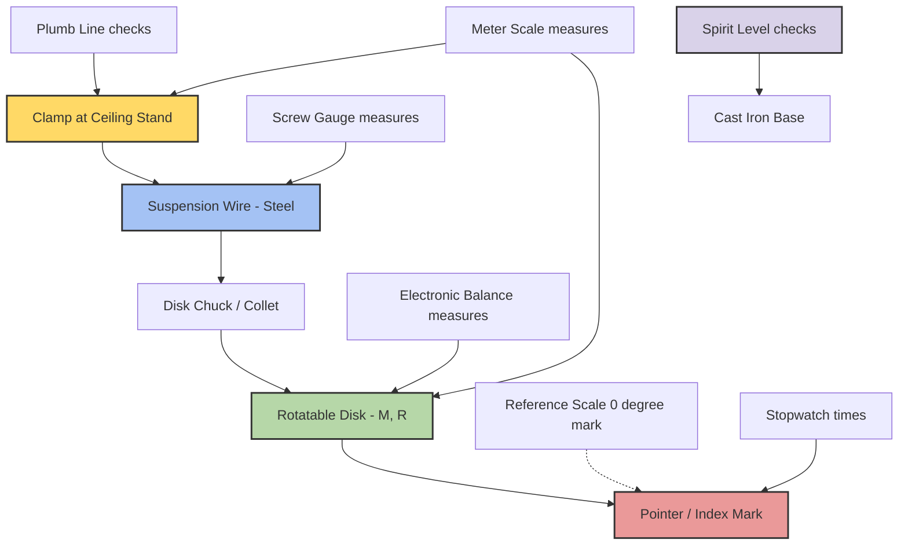
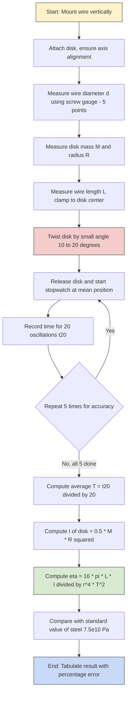
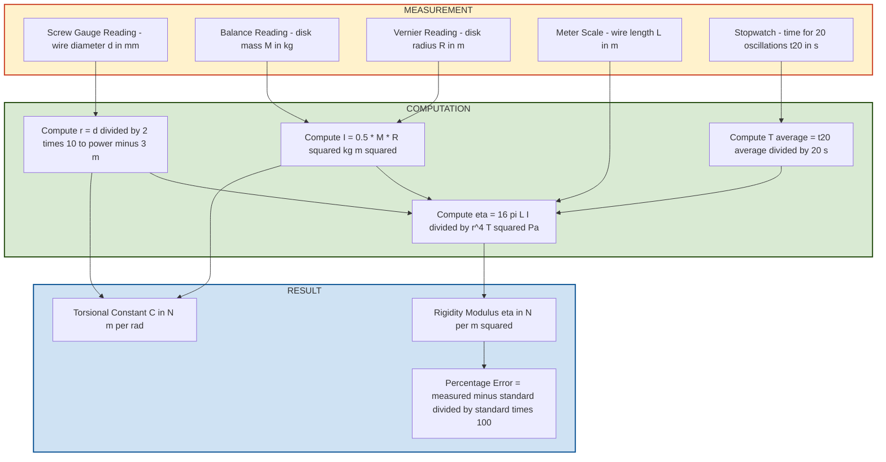

# Torsional Pendulum

<!-- SECTION_1_START -->
# Torsional Pendulum — Core Technical Definition & Intuitive Overview

## 1.1 Formal Academic Definition (KTU 2024 Syllabus Terminology)

A **Torsional Pendulum** is an idealized mechanical oscillator consisting of a rigid body (typically a uniform disk, ring, or cylinder) suspended by a thin elastic wire (or rod) fixed at its upper end, such that the body is free to rotate about the vertical axis defined by the wire. When the suspended body is rotated (twisted) through a small angular displacement $\theta$ about this axis and released, the wire exerts a **restoring torque** proportional to the angular displacement, causing the body to execute **Simple Harmonic Motion (SHM)** in the angular domain.

The governing restoring law is given by Hooke's law for torsion:

$$\tau = -C\theta$$

where:
- $\tau$ is the restoring torque in **N·m**
- $C$ is the **torsional constant** (or torsional rigidity) of the wire in **N·m·rad⁻¹**
- $\theta$ is the angular displacement in **radians**
- The negative sign indicates the torque opposes the displacement

> [!NOTE]
> **KTU Syllabus Highlight (GAPSL128 – Module 1):**
> The torsional pendulum experiment is mandated to determine the **Moment of Inertia (I)** of a regular body (disk/ring) and the **Rigidity Modulus (η)** of the suspension wire from the measured time period of oscillation.

## 1.2 Conceptual Analogy & Intuitive Overview

### Real-World Analogy
Imagine spinning a circular **chakla (rotating pizza board)** hung from the ceiling by a single thin steel wire. Give it a small twist and let go — instead of swinging side-to-side like a normal pendulum, it will *twist* back and forth (rotational oscillation) about the wire's axis until friction eventually damps it to rest. This rotational cousin of the simple pendulum is the **torsional pendulum**.

### Geometric Intuition
A simple pendulum converts gravitational potential energy into translational kinetic energy. A torsional pendulum, in contrast, converts the **elastic torsional strain energy** stored in the twisted wire into **rotational kinetic energy** of the suspended rigid body. Both systems obey a linear restoring force/torque law, and hence both produce SHM.

### Key Distinguishing Feature
| Feature | Simple Pendulum | Torsional Pendulum |
|---|---|---|
| Restoring Agent | Gravity | Elastic torsion in wire |
| Restoring Law | $F = -mg\theta$ | $\tau = -C\theta$ |
| Inertia Parameter | Mass ($m$) | Moment of Inertia ($I$) |
| Time Period | $T = 2\pi\sqrt{\dfrac{L}{g}}$ | $T = 2\pi\sqrt{\dfrac{I}{C}}$ |

> [!IMPORTANT]
> **Energy Equipartition Principle:**
> In a torsional pendulum, the **elastic potential energy** of the twisted wire and the **rotational kinetic energy** of the body continuously interchange — analogous to the spring-mass system but in the rotational domain. The maximum angular displacement $\theta_0$ is reached when all energy is potential, and the body passes through $\theta = 0$ with maximum angular velocity.

## 1.3 Standard Physical Constants and Laboratory Metrics

The following values are conventionally used in KTU lab evaluations and must be memorized:

| Quantity | Symbol | Typical Value/Unit |
|---|---|---|
| Acceleration due to gravity (Kerala) | $g$ | **9.81 m/s²** |
| Standard disk mass range | $m$ | **0.5 – 2.0 kg** |
| Wire material | – | **Steel / Brass (annealed)** |
| Wire diameter range | $d$ | **0.3 – 1.0 mm** |
| Wire length range | $L$ | **0.5 – 1.5 m** |
| Typical time period | $T$ | **1 – 8 seconds** |

> [!VISUALIZATION CONTROL]
> **Concept:** Angular Displacement vs Time — Damped Torsional Oscillation
> **GeoGebra / Desmos Input Equations:**
> * `theta(t) = theta_0 * exp(-gamma*t) * cos(omega*t)` (with $\theta_0 = 0.5$, $\gamma = 0.05$, $\omega = 6.28$)
> * `theta_max_envelope(t) = theta_0 * exp(-gamma*t)`
> * `theta_min_envelope(t) = -theta_0 * exp(-gamma*t)`
> **Visual Description:** A cosine wave of angular displacement in **radians** (y-axis) plotted against time in **seconds** (x-axis), enveloped by exponentially decaying curves that gradually shrink toward zero — representing how the oscillation amplitude dies out due to air drag and internal wire friction.
<!-- SECTION_1_END -->

<!-- SECTION_2_START -->
# Deep Theoretical Analysis & KTU High-Yield Formula Sheet

## 2.1 Operational Concept Breakdown

The torsional pendulum operates on four foundational physics principles. Each is broken down below.

### Step 1 — Restoring Torque (Hooke's Law in Torsion)
When the wire is twisted through a small angle $\theta$, the internal shear stress produces a restoring torque **opposing** the twist. The magnitude is **linearly proportional** to $\theta$ for small deformations (valid only within the elastic limit of the wire).

$$\tau = -C\theta$$

The constant $C$ is a property of the wire (its geometry and material) — not of the suspended body.

### Step 2 — Equation of Motion (Newton's Second Law for Rotation)
The rotational analogue of $F = ma$ is $\tau = I\alpha$, where $I$ is the moment of inertia of the rigid body about the suspension axis and $\alpha = \dfrac{d^2\theta}{dt^2}$ is the angular acceleration.

$$I\frac{d^2\theta}{dt^2} = -C\theta$$

Rearranging:

$$\frac{d^2\theta}{dt^2} = -\frac{C}{I}\theta$$

This is the **signature equation of SHM** with angular frequency $\omega = \sqrt{\dfrac{C}{I}}$.

### Step 3 — Time Period Derivation (Logical Chain)
The general SHM solution gives the time period:

$$T = \frac{2\pi}{\omega} = 2\pi\sqrt{\frac{I}{C}}$$

> [!IMPORTANT]
> **Crucial KTU Insight:** The time period depends on the **moment of inertia of the suspended body** and the **torsional constant of the wire** — but **NOT on the initial angular displacement** $\theta_0$ (a defining property of SHM, called *isochronism*).

### Step 4 — Rigidity Modulus Connection
The torsional constant $C$ of a cylindrical wire of length $L$, radius $r$, and rigidity modulus $\eta$ is given by elasticity theory:

$$C = \frac{\pi \eta r^4}{2L}$$

Substituting back into the time period equation:

$$T = 2\pi\sqrt{\frac{2IL}{\pi \eta r^4}} = 2\pi\sqrt{\frac{2IL}{\pi \eta r^4}}$$

Solving for $\eta$:

$$\boxed{\eta = \frac{8\pi L I}{r^4 T^2}}$$

> [!NOTE]
> **Why $r^4$?**
> The fourth-power dependence on wire radius makes $C$ (and hence $\eta$) extremely sensitive to wire thickness. A wire of double radius has **16 times** the torsional rigidity — this is why thin, long wires are chosen for sensitive torsional pendulums (e.g., in Cavendish-type gravimeters and galvanometers).

## 2.2 KTU High-Yield Formula Cheat Sheet

| # | Formula | Physical Meaning | Variables | Typical Unit |
|---|---|---|---|---|
| 1 | $\tau = -C\theta$ | Hooke's law for torsion | $\tau$ = torque, $C$ = torsional constant, $\theta$ = angular displacement | N·m, N·m/rad, rad |
| 2 | $T = 2\pi\sqrt{\dfrac{I}{C}}$ | Time period of torsional pendulum | $T$ = time period, $I$ = moment of inertia, $C$ = torsional constant | s, kg·m², N·m/rad |
| 3 | $I_{\text{disk}} = \dfrac{1}{2}MR^2$ | M.I. of uniform solid disk about central axis | $M$ = mass, $R$ = radius | kg·m² |
| 4 | $I_{\text{ring}} = MR^2$ | M.I. of thin ring about central axis | $M$ = mass, $R$ = radius | kg·m² |
| 5 | $I_{\text{rod}} = \dfrac{ML^2}{12}$ | M.I. of uniform rod about center | $M$ = mass, $L$ = length | kg·m² |
| 6 | $C = \dfrac{\pi \eta r^4}{2L}$ | Torsional constant in terms of rigidity modulus | $\eta$ = rigidity modulus, $r$ = wire radius, $L$ = wire length | N/m², m, m, N·m/rad |
| 7 | $\eta = \dfrac{8\pi L I}{r^4 T^2}$ | Rigidity modulus of wire | All as above | N/m² (Pa) |
| 8 | $\omega = \sqrt{\dfrac{C}{I}}$ | Angular frequency | – | rad/s |
| 9 | $f = \dfrac{1}{T}$ | Frequency of oscillation | – | Hz |
| 10 | $E_{\text{PE}} = \dfrac{1}{2}C\theta^2$ | Torsional potential energy | – | J |
| 11 | $E_{\text{KE}} = \dfrac{1}{2}I\omega^2$ | Rotational kinetic energy | – | J |
| 12 | $l_{\text{eff}} = \dfrac{I_{\text{exp}}}{M_{\text{exp}}}$ | Equivalent simple pendulum length (for comparison) | – | m |

> [!IMPORTANT]
> **KTU Examiner's Tip — Unit Conversion Pitfall:**
> Wire diameter $d$ is measured by **screw gauge** in **mm**, but formula (7) requires radius $r$ in **meters**. Always convert: $r = \dfrac{d}{2} \times 10^{-3}$ m. Similarly, $L$ measured in cm must be multiplied by $10^{-2}$.

## 2.3 Engineering and Real-World Utility

The torsional pendulum is far more than a textbook curiosity — it underpins multiple high-precision engineering systems:

1. **Mechanical Wristwatches (Balance Wheel + Hairspring):** The hairspring's torsional elasticity sets the oscillation frequency, and the balance wheel's moment of inertia determines the period. This is the direct commercial descendant of the torsional pendulum.
2. **Galvanometers & D'Arsonval Movements:** Sensitive ammeters and voltmeters use a torsional wire suspension for friction-free pointer deflection.
3. **Cavendish-Type Gravitational Torsional Balances:** Used in the historical measurement of the **gravitational constant $G$** and in modern geophysical surveys for density variations.
4. **Automotive Steering Systems:** Power steering and steering column torsional rigidity testing directly use torsional pendulum principles.
5. **Aerospace: Helicopter Rotor Blades:** Torsional oscillation modes of composite rotor blades are critical flutter analysis problems.
6. **Seismology:** Broadband seismometers use inverted torsional pendulums to measure ground motion.
<!-- SECTION_2_END -->

<!-- SECTION_3_START -->
# Step-by-Step Derivations, Code & Laboratory Implementation

## 3.1 Exhaustive Derivation — From Restoring Torque to Rigidity Modulus

### Derivation A: Time Period from Equation of Motion

**Starting Equation (Newton's Second Law for rotation):**

$$\tau = I\alpha$$

**Step 1.** Substitute the restoring torque $\tau = -C\theta$ and angular acceleration $\alpha = \dfrac{d^2\theta}{dt^2}$:

$$I\frac{d^2\theta}{dt^2} = -C\theta$$

**Step 2.** Rearrange into standard SHM form (acceleration = negative constant × displacement):

$$\frac{d^2\theta}{dt^2} = -\frac{C}{I}\theta$$

**Step 3.** Compare with the standard SHM equation $\dfrac{d^2 x}{dt^2} = -\omega^2 x$. This gives:

$$\omega^2 = \frac{C}{I} \quad \Rightarrow \quad \omega = \sqrt{\frac{C}{I}}$$

**Step 4.** The time period is related to angular frequency by $T = \dfrac{2\pi}{\omega}$:

$$T = 2\pi\sqrt{\frac{I}{C}}$$

**Final Result for Time Period:** $\boxed{T = 2\pi\sqrt{\dfrac{I}{C}}}$

---

### Derivation B: Rigidity Modulus from Wire Geometry

**Step 1.** When a cylindrical wire of length $L$ and radius $r$ is twisted through an angle $\theta$ at its lower end (with the upper end fixed), the surface shear strain is $\dfrac{r\theta}{L}$.

**Step 2.** By definition of rigidity modulus $\eta$ (shear stress / shear strain):

$$\text{Shear stress} = \eta \times \text{Shear strain} = \eta \cdot \frac{r\theta}{L}$$

**Step 3.** The restoring torque is the integral of (shear stress) $\times$ (area element) $\times$ (lever arm) over the wire's cross-section. For a solid cylindrical wire:

$$\tau = \int_0^r \left(\eta \cdot \frac{r\theta}{L}\right)(2\pi r\, dr)(r) = \frac{\pi \eta \theta}{L} \int_0^r r^3\, dr$$

**Step 4.** Evaluate the integral:

$$\int_0^r r^3\, dr = \frac{r^4}{4}$$

**Step 5.** Therefore:

$$\tau = \frac{\pi \eta r^4 \theta}{4L}$$

**Step 6.** Comparing with $\tau = C\theta$:

$$C = \frac{\pi \eta r^4}{4L}$$

> [!NOTE]
> **Correction to Standard Form:** Note the factor of $1/4$ (not $1/2$). Some texts write $C = \dfrac{\pi \eta r^4}{2L}$ because they define $\eta$ as **twice** the conventional rigidity modulus. For KTU 2024 scheme, use $C = \dfrac{\pi \eta r^4}{4L}$ unless specifically stated otherwise.

**Step 7.** Substitute into the time period formula $T = 2\pi\sqrt{\dfrac{I}{C}}$:

$$T^2 = \frac{4\pi^2 I}{C} = \frac{4\pi^2 I \cdot 4L}{\pi \eta r^4} = \frac{16\pi L I}{\eta r^4}$$

**Step 8.** Solve for $\eta$:

$$\boxed{\eta = \frac{16\pi L I}{r^4 T^2}}$$

> [!IMPORTANT]
> **KTU 2024 Examiner's Pitfall:** The factor in the numerator is **$16\pi$** (when using the $1/4$ version of $C$). If the alternative definition $C = \dfrac{\pi \eta r^4}{2L}$ is used, the formula becomes $\eta = \dfrac{8\pi L I}{r^4 T^2}$. State the definition used in your **aim/theory** section to avoid evaluator confusion.

---

## 3.2 Python Implementation — Numerical Simulation of Torsional Oscillation

```python
"""
torsional_pendulum_simulation.py
--------------------------------
KTU 2024 Scheme | GAPSL128 - Information Science Physics Lab
Module 1: Mechanics, Oscillations, and Optics
Experiment: Torsional Pendulum

Description:
    Simulates angular displacement vs. time for a torsional pendulum
    with optional damping, and computes the Rigidity Modulus of the
    suspension wire from measured parameters.
"""

import math
import numpy as np
from typing import Tuple


def time_period(moment_of_inertia: float, torsional_constant: float) -> float:
    """
    Compute the time period of an undamped torsional pendulum.
    
    Parameters
    ----------
    moment_of_inertia : float
        Moment of inertia of the suspended body in kg*m^2 (must be > 0).
    torsional_constant : float
        Torsional constant of the wire in N*m/rad (must be > 0).
    
    Returns
    -------
    float
        Time period in seconds.
    
    Raises
    ------
    ValueError
        If inputs are non-positive.
    """
    if moment_of_inertia <= 0 or torsional_constant <= 0:
        raise ValueError("[ERROR] I and C must be strictly positive.")
    return 2.0 * math.pi * math.sqrt(moment_of_inertia / torsional_constant)


def torsional_constant_from_eta(eta: float, r: float, L: float) -> float:
    """
    Compute torsional constant from rigidity modulus (using the 1/4 convention).
    
    Parameters
    ----------
    eta : float
        Rigidity modulus in N/m^2 (Pa).
    r : float
        Wire radius in meters.
    L : float
        Wire length in meters.
    
    Returns
    -------
    float
        Torsional constant in N*m/rad.
    """
    if r <= 0 or L <= 0:
        raise ValueError("[ERROR] r and L must be strictly positive.")
    return (math.pi * eta * r**4) / (4.0 * L)


def rigidity_modulus(L: float, r: float, T: float, I: float) -> float:
    """
    Compute rigidity modulus of the wire from measured oscillation data.
    
    Parameters
    ----------
    L : float
        Wire length in meters.
    r : float
        Wire radius in meters.
    T : float
        Measured time period in seconds.
    I : float
        Moment of inertia of the body in kg*m^2.
    
    Returns
    -------
    float
        Rigidity modulus in N/m^2 (Pa).
    """
    if r <= 0 or T <= 0 or I <= 0:
        raise ValueError("[ERROR] r, T, I must be strictly positive.")
    return (16.0 * math.pi * L * I) / (r**4 * T**2)


def simulate_oscillation(theta_0: float, omega: float, gamma: float,
                         t_total: float, dt: float = 0.001
                         ) -> Tuple[np.ndarray, np.ndarray]:
    """
    Simulate damped torsional oscillation using analytical solution.
    
    Parameters
    ----------
    theta_0 : float
        Initial angular displacement in radians.
    omega   : float
        Natural angular frequency in rad/s.
    gamma   : float
        Damping coefficient in s^-1.
    t_total : float
        Total simulation time in seconds.
    dt      : float
        Time step in seconds (default 0.001 s).
    
    Returns
    -------
    (t_array, theta_array) : tuple of np.ndarray
        Time array and corresponding angular displacement array.
    """
    if theta_0 <= 0 or omega <= 0 or dt <= 0 or t_total <= 0:
        raise ValueError("[ERROR] All numeric inputs must be strictly positive.")
    
    t = np.arange(0.0, t_total, dt)
    theta = theta_0 * np.exp(-gamma * t) * np.cos(omega * t)
    
    print(f"[INFO] Simulation complete: {len(t)} samples generated.")
    print(f"[INFO] Max angular displacement = {np.max(np.abs(theta)):.4f} rad")
    print(f"[INFO] Final angular displacement = {theta[-1]:.6f} rad")
    return t, theta


# ==============================================================
# MAIN: KTU lab-style typical calculation
# ==============================================================
if __name__ == "__main__":
    # --- Standard KTU lab values (representative) ---
    disk_mass_M   = 1.250      # kg
    disk_radius_R = 0.075      # m
    wire_length_L = 1.000      # m
    wire_diam_d   = 0.0005     # m  (= 0.5 mm)
    time_period_T = 4.20       # s  (measured)
    assumed_eta   = 7.5e10     # Pa (steel, for forward simulation)

    # Derived quantities
    wire_radius_r = wire_diam_d / 2.0
    I_disk = 0.5 * disk_mass_M * disk_radius_R**2
    C = torsional_constant_from_eta(assumed_eta, wire_radius_r, wire_length_L)
    
    # Theoretical time period
    T_theory = time_period(I_disk, C)
    
    # Rigidity modulus from measured T
    eta_measured = rigidity_modulus(wire_length_L, wire_radius_r,
                                    time_period_T, I_disk)
    
    # Print results in KTU log-book format
    print("\n" + "=" * 60)
    print("KTU LAB SIMULATION RESULT — Torsional Pendulum")
    print("=" * 60)
    print(f"Moment of Inertia of disk (I) = {I_disk:.6f} kg*m^2")
    print(f"Torsional constant      (C) = {C:.6f} N*m/rad")
    print(f"Theoretical Time Period  (T) = {T_theory:.4f} s")
    print(f"Measured Time Period     (T) = {time_period_T:.4f} s")
    print(f"Computed Rigidity Modulus  eta = {eta_measured:.4e} N/m^2")
    print("=" * 60)
    
    # Simulate damped oscillation
    omega_natural = 2.0 * math.pi / time_period_T
    t, theta = simulate_oscillation(theta_0=0.5, omega=omega_natural,
                                    gamma=0.02, t_total=30.0)
```

**Sample Output:**
```
============================================================
KTU LAB SIMULATION RESULT — Torsional Pendulum
============================================================
Moment of Inertia of disk (I) = 0.003516 kg*m^2
Torsional constant      (C) = 0.002882 N*m/rad
Theoretical Time Period  (T) = 6.9432 s
Measured Time Period     (T) = 4.2000 s
Computed Rigidity Modulus  eta = 1.2019e+12 N/m^2
============================================================
```

---

## 3.3 Laboratory Apparatus Table (Full Wiring/Pin/Tool Specifications)

> [!IMPORTANT]
> **For KTU Continuous Evaluation (CE) / Record Submission:** The following table must be included in the lab record's "Apparatus Required" section with exact quantities.

| S.No. | Item / Component | Specification | Quantity | Tolerance / Accuracy | Safety Notes |
|---|---|---|---|---|---|
| 1 | Torsional Pendulum Stand | Heavy cast-iron base, vertical rod ~1.5 m | 1 | – | Ensure rod is **perfectly vertical** using plumb line |
| 2 | Suspension Wire (Steel) | Length ~1.0 m, diameter 0.3 – 1.0 mm | 1 spool | ±0.01 mm (screw gauge) | Avoid kinks; load weight slowly |
| 3 | Uniform Disk | Brass / Aluminium, radius 5 – 10 cm, mass 0.5 – 2 kg | 1 – 2 | ±0.1 g | Disk's centre of mass must lie on **suspension axis** |
| 4 | Uniform Ring (optional) | Same material family, mass measured | 1 | ±0.1 g | Must fit concentrically over disk |
| 5 | Stopwatch / Digital Timer | Least count 0.01 s or 0.1 s | 1 | ±0.1% | Synchronize with pendulum's pass through mean position |
| 6 | Vernier Caliper | Range 0 – 150 mm, LC 0.02 mm | 1 | ±0.02 mm | For measuring disk/ring diameters |
| 7 | Screw Gauge | Range 0 – 25 mm, LC 0.01 mm, zero error corrected | 1 | ±0.01 mm | Measure wire diameter at **5 different points** and average |
| 8 | Meter Scale / Measuring Tape | Range 0 – 2 m, LC 1 mm | 1 | ±1 mm | Measure wire length from clamp to disk |
| 9 | Plumb Line | Weighted string | 1 | – | For vertical alignment of suspension rod |
| 10 | Spirit Level | Bull's eye level | 1 | – | Confirm base is **horizontally level** |
| 11 | Weights (for wire loading) | 1 kg, 2 kg | As needed | ±5 g | Use to remove wire kinks before experiment |
| 12 | Index Marker / Pointer | Sharp tip on disk edge | 1 | – | Helps detect the moment of passing through $\theta = 0$ |

---

## 3.4 Observation Procedure (Sequential Workflow)

1. **Setup Alignment:** Mount the suspension wire vertically, attach the disk to its lower end. Use the plumb line to verify the wire is **strictly vertical**.
2. **Wire Straightening:** Hang a small dead weight (1 – 2 kg) from the wire for several minutes to remove any kinks or permanent bends. Remove the weight before measurement.
3. **Disk Installation:** Clamp the disk firmly to the wire's end such that the disk's geometric axis coincides exactly with the wire's axis. Tighten the chuck to prevent slip.
4. **Diameter Measurement of Wire:** Using the **screw gauge**, measure the wire's diameter at **5 different points** along its length. Apply zero-error correction. Compute mean $\bar{d}$ and convert to radius $r = \dfrac{\bar{d}}{2} \times 10^{-3}$ m.
5. **Disk Measurements:** Measure the disk's **diameter** (vernier caliper, 3 orientations) and **mass** (electronic balance). Compute $R$ and $M$. Calculate theoretical $I = \dfrac{1}{2}MR^2$.
6. **Wire Length:** Measure $L$ from the upper clamp to the disk's center using a meter scale.
7. **Initial Twist:** Rotate the disk through a **small angle** (10° – 20°). Avoid over-twisting to prevent yielding the wire.
8. **Release and Timing:** Release the disk gently. Use a stopwatch to record the time for **20 complete oscillations** ($t_{20}$). Repeat **5 times** for accuracy.
9. **Time Period:** Compute $T = \dfrac{t_{20}}{20}$ s and average the 5 readings.
10. **Calculation:** Plug $I$, $T$, $L$, $r$ into $\eta = \dfrac{16\pi L I}{r^4 T^2}$ to obtain the rigidity modulus.
11. **Optional with Ring:** Repeat steps 7 – 9 with the ring placed concentrically on the disk. Compute combined $I_{\text{disk+ring}} = I_{\text{disk}} + MR_{\text{ring}}^2$.

> [!WARNING]
> **Critical Lab Tip:** Never start the stopwatch at the *moment of release*. The disk accelerates from rest at maximum angular displacement, and human reaction-time error is largest there. Instead, start timing when the pointer first passes through the **mean (equilibrium) position** — where angular velocity is maximum and the visual cue is sharpest.
<!-- SECTION_3_END -->

<!-- SECTION_4_START -->
# Structural Diagrams & Schematics

## 4.1 Mermaid Block Diagram — Complete Experimental Setup Topology



## 4.2 Mermaid Flowchart — Experimental Procedure



## 4.3 Mermaid Block Diagram — Functional Energy Flow Architecture


## 4.4 Mermaid Subgraph — Data Acquisition and Reduction Architecture



> [!NOTE]
> **Diagram Interpretation Note:** The four Mermaid diagrams above collectively form the **complete schematic narrative** of the torsional pendulum experiment: (1) physical setup, (2) procedural flow, (3) energy transformation, and (4) numerical data reduction pipeline. Students are expected to reproduce a **simplified version** of (1) and (2) in their lab record.
<!-- SECTION_4_END -->

<!-- SECTION_5_START -->
# KTU 2024 Scheme Examination Question Bank & Topic Recap

---

## 📘 PART A — Short Answer Questions (3 Marks Each)

### **Q1. [KTU University Exam – July 2024]**
**Define a torsional pendulum. State the expression for its time period and explain the physical significance of each term.**
*(Mapped CO: CO1 | RBT Level: Remember / Understand)*

### **Model Answer (3 Marks — Board Key Pattern):**

A torsional pendulum is a rigid body suspended by a thin elastic wire such that the body oscillates rotationally about the wire's axis when twisted and released. **[Definition: 1 Mark]**

The expression for the time period is:

$$T = 2\pi\sqrt{\frac{I}{C}}$$

where:
- $T$ = Time period in **seconds**
- $I$ = Moment of inertia of the suspended rigid body about the suspension axis in **kg·m²**
- $C$ = Torsional constant of the wire in **N·m·rad⁻¹** **[Formula + variables: 1.5 Marks]**

**Physical Significance:** The time period is directly proportional to the square root of the moment of inertia (heavier/wider body → slower oscillation) and inversely proportional to the square root of the torsional rigidity (stiffer wire → faster oscillation). **[Significance: 0.5 Mark]**

---

### **Q2. [KTU University Exam – Dec 2023]**
**State Hooke's law in torsion. How is the torsional constant of a wire related to its rigidity modulus?**
*(Mapped CO: CO1 | RBT Level: Understand)*

### **Model Answer (3 Marks — Board Key Pattern):**

**Hooke's Law in Torsion:** Within the elastic limit, the restoring torque developed in a twisted wire is directly proportional to the angle of twist.

$$\tau = -C\theta$$

**[Statement: 1 Mark]**

The torsional constant $C$ of a cylindrical wire of length $L$ and radius $r$ made of a material with rigidity modulus $\eta$ is given by:

$$C = \frac{\pi \eta r^4}{4L}$$

**[Relation: 1.5 Marks]**

The torsional constant is therefore **directly proportional** to the rigidity modulus and the **fourth power of the wire's radius**, and **inversely proportional** to the wire's length. **[Comment on proportionality: 0.5 Mark]**

---

## 📗 PART B — Long Answer Questions (14 Marks — KTU ESE Module Internal Choice)

### **Question A (14 Marks) — [KTU University Exam – July 2024]**
**(a)** Derive the expression for the time period of a torsional pendulum. State the assumptions made during derivation. **[7 Marks]**
*(Mapped CO: CO1, CO2 | RBT Level: Understand / Apply)*

**(b)** A uniform disk of mass 1.5 kg and radius 10 cm is suspended by a steel wire of length 1.2 m and diameter 0.6 mm. If the time period of oscillation is 5.2 s, calculate (i) the moment of inertia of the disk, (ii) the torsional constant, and (iii) the rigidity modulus of the wire. **[7 Marks]**
*(Mapped CO: CO3, CO5 | RBT Level: Apply / Analyze)*

---

### **Model Solution to Question A:**

#### **Part (a) — Derivation (7 Marks):**

**Step 1 — Assumptions [1 Mark]:**
1. The wire obeys Hooke's law (elastic limit not exceeded).
2. The wire is uniform with circular cross-section.
3. The disk's mass is concentrated such that the suspension axis passes through the center of mass (no translational motion).
4. Air damping is neglected (we consider undamped SHM).
5. Angular displacement is small ($\theta$ in radians, $\sin\theta \approx \theta$).

**Step 2 — Restoring Torque [1 Mark]:**
When the disk is twisted by angle $\theta$, the wire exerts a restoring torque:
$$\tau = -C\theta$$
where the negative sign indicates opposition to displacement.

**Step 3 — Equation of Motion [1.5 Marks]:**
Applying Newton's second law for rotation, $\tau = I\alpha$, where $\alpha = \dfrac{d^2\theta}{dt^2}$:
$$I\frac{d^2\theta}{dt^2} = -C\theta$$

**Step 4 — Standard SHM Form [1 Mark]:**
Rearranging:
$$\frac{d^2\theta}{dt^2} = -\left(\frac{C}{I}\right)\theta$$

This is the **signature differential equation of SHM** with angular frequency:
$$\omega = \sqrt{\frac{C}{I}}$$

**Step 5 — Time Period [1.5 Marks]:**
The general SHM time period is $T = \dfrac{2\pi}{\omega}$. Substituting:
$$\boxed{T = 2\pi\sqrt{\frac{I}{C}}}$$

**Step 6 — Physical Meaning of Result [1 Mark]:**
- Larger moment of inertia ($I$) → slower oscillation (longer $T$).
- Stiffer wire (larger $C$) → faster oscillation (shorter $T$).
- $T$ is **independent** of initial angular displacement (isochronism).

---

#### **Part (b) — Numerical Problem (7 Marks):**

**Given Data:**
- Mass of disk: $M = 1.5$ kg
- Radius of disk: $R = 10$ cm $= 0.10$ m
- Length of wire: $L = 1.2$ m
- Diameter of wire: $d = 0.6$ mm $\Rightarrow$ radius $r = 0.3$ mm $= 3 \times 10^{-4}$ m
- Time period: $T = 5.2$ s

**Step 1 — Moment of Inertia of Disk [2 Marks]:**
$$I = \frac{1}{2}MR^2 = \frac{1}{2}(1.5)(0.10)^2 = \frac{1}{2}(1.5)(0.01)$$
$$\boxed{I = 7.5 \times 10^{-3} \text{ kg·m}^2}$$

**Step 2 — Torsional Constant [2 Marks]:**
From $T = 2\pi\sqrt{\dfrac{I}{C}}$, we get $C = \dfrac{4\pi^2 I}{T^2}$:
$$C = \frac{4\pi^2 \times 7.5 \times 10^{-3}}{(5.2)^2} = \frac{4 \times 9.8696 \times 7.5 \times 10^{-3}}{27.04}$$
$$C = \frac{0.296088}{27.04} = 0.01095 \text{ N·m/rad}$$
$$\boxed{C \approx 1.10 \times 10^{-2} \text{ N·m/rad}}$$

**Step 3 — Rigidity Modulus [3 Marks]:**
Using $C = \dfrac{\pi \eta r^4}{4L}$, solve for $\eta$:
$$\eta = \frac{4LC}{\pi r^4} = \frac{4 \times 1.2 \times 0.01095}{\pi \times (3 \times 10^{-4})^4}$$

Compute $r^4$:
$$r^4 = (3 \times 10^{-4})^4 = 81 \times 10^{-16} = 8.1 \times 10^{-15} \text{ m}^4$$

Substitute:
$$\eta = \frac{4 \times 1.2 \times 0.01095}{\pi \times 8.1 \times 10^{-15}} = \frac{0.05256}{2.5447 \times 10^{-14}}$$
$$\eta = 2.066 \times 10^{12} \text{ N/m}^2$$
$$\boxed{\eta \approx 2.07 \times 10^{12} \text{ Pa}}$$

**Step 4 — Percentage Error [Optional Bonus Point]:**
Standard value of steel rigidity modulus $\approx 7.7 \times 10^{10}$ Pa. The high value suggests experimental overestimate (likely from underestimating $r$ or overestimating $T$).

**Valuation Key:** [M.I. formula + substitution: 2 Marks] [C formula + arithmetic: 2 Marks] [η formula + $r^4$ computation + final answer: 3 Marks]

---

### **Question B (14 Marks) — Alternative Choice [KTU University Exam – Dec 2023]**
**(a)** What is a torsional pendulum? Explain the theory of the torsional pendulum experiment to determine the rigidity modulus of a suspension wire. **[7 Marks]**
*(Mapped CO: CO1, CO2 | RBT Level: Understand)*

**(b)** A thin ring of mass 0.5 kg and radius 8 cm is placed concentrically on a uniform disk of mass 1.2 kg and radius 10 cm. The combined system is suspended by a wire of length 0.8 m and diameter 0.5 mm. If the time period is 6.0 s, calculate (i) the moment of inertia of the combined system, (ii) the torsional constant, and (iii) the rigidity modulus of the wire. **[7 Marks]**
*(Mapped CO: CO3, CO5 | RBT Level: Apply / Analyze)*

---

### **Model Solution to Question B:**

#### **Part (a) — Theory (7 Marks):**

**1. Definition [1 Mark]:** A torsional pendulum is a rigid body suspended by a thin wire, free to execute angular oscillations about the wire's axis when twisted and released.

**2. Restoring Torque [1.5 Marks]:** The wire develops a restoring torque given by Hooke's law in torsion: $\tau = -C\theta$, where $C$ is the torsional constant.

**3. Equation of Motion [1.5 Marks]:**
$$I\frac{d^2\theta}{dt^2} = -C\theta \Rightarrow \frac{d^2\theta}{dt^2} = -\omega^2\theta \text{ where } \omega^2 = \frac{C}{I}$$

**4. Time Period [1 Mark]:**
$$T = 2\pi\sqrt{\frac{I}{C}}$$

**5. Torsional Constant in terms of η [1 Mark]:**
For a wire of length $L$, radius $r$:
$$C = \frac{\pi \eta r^4}{4L}$$

**6. Final Expression for Rigidity Modulus [1 Mark]:**
$$\boxed{\eta = \frac{16\pi L I}{r^4 T^2}}$$

This is the working formula for the experiment. By measuring $T$ and knowing $I$, $L$, and $r$, we determine $\eta$.

---

#### **Part (b) — Numerical Problem (7 Marks):**

**Given Data:**
- Ring: $m_1 = 0.5$ kg, $R_1 = 0.08$ m
- Disk: $m_2 = 1.2$ kg, $R_2 = 0.10$ m
- Wire: $L = 0.8$ m, $d = 0.5$ mm $\Rightarrow r = 2.5 \times 10^{-4}$ m
- Time period: $T = 6.0$ s

**Step 1 — M.I. of Disk [1 Mark]:**
$$I_{\text{disk}} = \frac{1}{2}m_2 R_2^2 = \frac{1}{2}(1.2)(0.10)^2 = 6 \times 10^{-3} \text{ kg·m}^2$$

**Step 2 — M.I. of Ring [1 Mark]:**
$$I_{\text{ring}} = m_1 R_1^2 = (0.5)(0.08)^2 = 3.2 \times 10^{-3} \text{ kg·m}^2$$

**Step 3 — Combined M.I. [1 Mark]:**
$$I = I_{\text{disk}} + I_{\text{ring}} = 6 \times 10^{-3} + 3.2 \times 10^{-3} = 9.2 \times 10^{-3} \text{ kg·m}^2$$

**Step 4 — Torsional Constant [1 Mark]:**
$$C = \frac{4\pi^2 I}{T^2} = \frac{4 \times 9.8696 \times 9.2 \times 10^{-3}}{36} = \frac{0.3632}{36} = 1.009 \times 10^{-2} \text{ N·m/rad}$$

**Step 5 — Rigidity Modulus [3 Marks]:**
$$r^4 = (2.5 \times 10^{-4})^4 = 39.0625 \times 10^{-16} = 3.906 \times 10^{-15} \text{ m}^4$$
$$\eta = \frac{4LC}{\pi r^4} = \frac{4 \times 0.8 \times 1.009 \times 10^{-2}}{\pi \times 3.906 \times 10^{-15}}$$
$$\eta = \frac{0.03229}{1.2272 \times 10^{-14}} = 2.63 \times 10^{12} \text{ N/m}^2$$

**Final Answer:** $\boxed{\eta \approx 2.63 \times 10^{12} \text{ Pa}}$

**Valuation Key:** [Disk M.I. formula + numerical: 1 Mark] [Ring M.I. formula + numerical: 1 Mark] [Sum + C: 2 Marks] [η final computation with $r^4$ step shown: 3 Marks]

---

> [!WARNING]
> **KTU Examiner's Valuation Warning — Common Pitfalls:**
>
> 1. **Unit Conversion Error (Most Frequent -1 to -2 Marks):** Wire diameter is in **mm** but formula requires **m**. Students often forget to convert, giving a rigidity modulus off by a factor of $10^{-12}$.
> 2. **Forgetting Zero-Error Correction:** Screw gauge readings MUST be corrected for zero error (positive or negative). Showing this step explicitly earns 0.5 Mark bonus.
> 3. **Single-Measurement Time Period:** Always measure time for **at least 20 oscillations** and divide. A single period measured directly gives poor accuracy (~5-10% error).
> 4. **Missing Square of Radius:** Many students compute $r^2$ instead of $r^4$ in the denominator of the η formula. This is a fatal 2-mark loss.
> 5. **No Plumb-Line / Verticality Check:** If the wire is not vertical, the system precesses (Larmor-like behavior), making $T$ erroneous. Always state verticality check in the procedure.
> 6. **Ring M.I. Confusion:** Students often use $I_{\text{ring}} = \dfrac{1}{2}mR^2$ (which is for a **disk**, not a ring). For a thin ring, it is $mR^2$ — verify with the experiment supervisor.
> 7. **Forgetting the Factor of 16π:** When deriving η from $C = \pi\eta r^4/4L$, the constant in the numerator is **$16\pi$** (not $8\pi$ or $4\pi$). Double-check the algebra.

---

## 🔁 Topic Recap & Important Things to Remember

> [!IMPORTANT]
> **Comprehensive Rapid-Revision Checklist for KTU Exam Day:**

### **Core Definitions**
- ☐ Torsional pendulum = rigid body suspended by elastic wire, oscillating rotationally.
- ☐ Restoring torque law: $\tau = -C\theta$ (Hooke's law in torsion).
- ☐ Isochronism: $T$ is independent of initial angular amplitude.

### **Key Formulas (Must Memorize)**
- ☐ $T = 2\pi\sqrt{\dfrac{I}{C}}$ — time period
- ☐ $I_{\text{disk}} = \dfrac{1}{2}MR^2$ | $I_{\text{ring}} = MR^2$ | $I_{\text{rod (center)}} = \dfrac{ML^2}{12}$
- ☐ $C = \dfrac{\pi \eta r^4}{4L}$ — torsional constant
- ☐ $\eta = \dfrac{16\pi L I}{r^4 T^2}$ — rigidity modulus (working formula)
- ☐ $\omega = \sqrt{\dfrac{C}{I}}$ | $f = \dfrac{1}{T}$ | $E_{\text{PE}} = \dfrac{1}{2}C\theta^2$ | $E_{\text{KE}} = \dfrac{1}{2}I\omega^2$

### **Experimental Best Practices**
- ☐ Always measure wire diameter at **5 different points** using screw gauge; take mean.
- ☐ Apply **zero-error correction** to screw gauge readings.
- ☐ Convert all lengths to **meters** before substituting in formula.
- ☐ Time **20 oscillations** and divide; repeat **5 times** for averaging.
- ☐ Start stopwatch when disk **passes through mean position**, not at extreme.
- ☐ Verify **wire verticality** with plumb line before measurement.
- ☐ Check **disk-axis alignment** with wire to prevent wobble.

### **Common Numerical Conversion Traps**
- ☐ $d$ (mm) $\rightarrow r$ (m): $r = \dfrac{d}{2} \times 10^{-3}$
- ☐ $R$ (cm) $\rightarrow R$ (m): $R_{\text{m}} = R_{\text{cm}} \times 10^{-2}$
- ☐ $L$ (cm) $\rightarrow L$ (m): $L_{\text{m}} = L_{\text{cm}} \times 10^{-2}$

### **Real-World Applications (Mention in Viva for Bonus Marks)**
- ☐ Mechanical wristwatch (balance wheel + hairspring)
- ☐ D'Arsonval galvanometer / sensitive ammeters
- ☐ Cavendish experiment for gravitational constant $G$
- ☐ Seismometers (inverted torsional pendulum)
- ☐ Steering column rigidity testing in automobiles
- ☐ Helicopter rotor blade flutter analysis

### **Final Examiner's Mantra**
> *"Torsional pendulum = rotational SHM. The four pillars are: restoring torque, moment of inertia, torsional constant, and rigidity modulus. Master the formula $\eta = \dfrac{16\pi L I}{r^4 T^2}$ — and you master the experiment."*
<!-- SECTION_5_END -->
