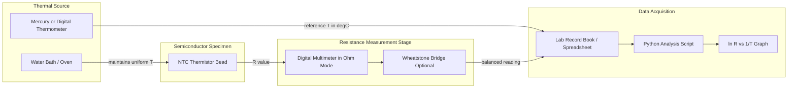
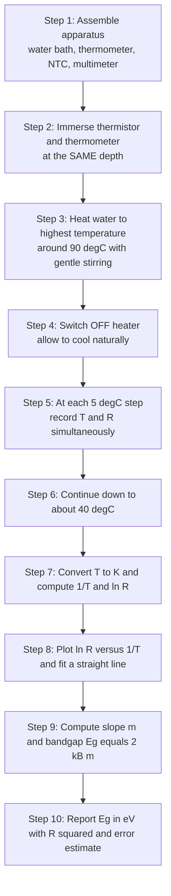

# Bandgap energy determination of semiconductor specimens using thermistors

<!-- SECTION_1_START -->

# Bandgap Energy Determination of a Semiconductor Using a Thermistor

## 1.1 Core Technical Definition

> [!NOTE]
> **Bandgap Energy ($E_g$):** The minimum amount of energy required to excite an electron from the top of the **valence band** to the bottom of the **conduction band** of a semiconductor, so that it becomes a free charge carrier available for conduction.

> [!IMPORTANT]
> **Thermistor (Thermal Resistor):** A two-terminal, temperature-sensitive passive electronic component whose electrical resistance changes predictably with temperature. For an **NTC (Negative Temperature Coefficient)** thermistor — the type used in this experiment — the resistance **decreases** as temperature **increases**. NTC thermistors are fabricated from sintered mixtures of transition metal oxides (e.g., Mn$_3$O$_4$, Co$_3$O$_4$, NiO) and behave as **intrinsic/lightly doped semiconductors**.

The NTC thermistor is, in essence, a **semiconductor specimen** in a compact, rugged, bead-shaped package. Because conduction inside the bead occurs by thermally activated electrons jumping across the forbidden energy gap, the resistance of the thermistor is governed directly by the **bandgap energy** of the constituent material. Measuring how the resistance changes with temperature therefore provides a direct route to determining $E_g$.

---

## 1.2 Intuitive Overview — Conceptual Analogy

> [!TIP]
> **The "Roller-Coaster" Analogy for a Semiconductor**

Imagine a stadium with two terraces — a **lower terrace** (valence band) and an **upper terrace** (conduction band). Spectators (electrons) sitting in the lower terrace cannot leave their seats to walk around the stadium (no conduction). To climb to the upper terrace, each spectator needs a burst of energy — the **bandgap energy ($E_g$)**.

At **low temperatures**, almost no spectator has enough energy, so the staircase is empty and the thermistor resistance is **very high**. As the **temperature rises**, more spectators gather enough thermal energy to jump up, the upper terrace fills up, charge carriers multiply, and the resistance **drops sharply**. Plotting this on a graph reveals $E_g$ hidden inside the curve.

| Parameter                  | Stadium Analogy                       | Semiconductor Reality                                 |
| -------------------------- | ------------------------------------- | ----------------------------------------------------- |
| $E_g$                      | Stair height between terraces         | Energy gap between valence & conduction bands        |
| Temperature $T$            | Crowd energy / excitement level       | Average thermal energy of lattice vibrations         |
| Resistance $R$             | Number of people still stuck downstairs | Number of electrons **unable** to reach conduction   |
| Boltzmann constant $k$     | Crowd mood factor                     | Energy per unit temperature ($1.38 \times 10^{-23}$ J/K) |

---

## 1.3 Physical Constants & Standard Metrics

> [!IMPORTANT]
> **Key Constants Used in This Experiment**
> - **Boltzmann constant** $k_B = 1.38 \times 10^{-23}$ J/K $= 8.617 \times 10^{-5}$ eV/K
> - **Electron-volt** $1\ \text{eV} = 1.602 \times 10^{-19}$ J
> - **Standard reference temperature** $T_0 = 298.15$ K (i.e., $25^\circ$C)
> - **Typical NTC thermistor bead resistance at 25 °C:** $1\ \text{k}\Omega$ – $100\ \text{k}\Omega$
> - **Typical bandgap of NTC oxide thermistor material:** $0.20$ – $0.80$ eV

---

## 1.4 Visualization Callout — Expected Linear Plot

> [!VISUALIZATION CONTROL]
> **Concept:** Linearised Arrhenius plot of $\ln(R)$ versus $1/T$ used to extract bandgap energy.
>
> **GeoGebra / Desmos Input Equations:**
> - Define constants: `k = 1.38e-23`, `Eg = 0.5 * 1.602e-19` (typical 0.5 eV in joules)
> - `R(T) = R0 * exp(Eg / (2 * k * T))` with $R_0 = 1$ ohm, $T$ in Kelvin from 300 K to 380 K
> - `y(x) = ln(R(1/x))` — the curve of $\ln R$ as a function of $1/T$
> - Plot points: `(1/303, ln(R(303)))`, `(1/323, ln(R(323)))`, `(1/343, ln(R(343)))`, `(1/363, ln(R(363)))`
>
> **Visual Description:** A near-perfect **straight line with a positive slope** should appear on the $\ln(R)$ (y-axis) versus $1/T$ (x-axis, in K$^{-1}$) graph. The slope of this line equals $E_g / 2k_B$, and the intercept is $\ln(R_0)$. A steeper slope implies a larger bandgap.

---

<!-- SECTION_1_END -->

<!-- SECTION_2_START -->

# 2. Deep Theoretical Analysis

## 2.1 The Semiconductor-Thermistor Connection

The conduction mechanism inside an NTC thermistor follows the **Arrhenius-type semiconductor conduction law**. For an intrinsic (or near-intrinsic) semiconductor, the number of electrons thermally excited across the bandgap per unit volume follows the Boltzmann distribution:

$$n \propto \exp\!\left(-\frac{E_g}{2k_B T}\right)$$

The factor of **2** appears because exciting a single electron across the gap simultaneously creates a **mobile hole** in the valence band — two charge carriers for the price of one activation event. Since electrical conductivity $\sigma \propto n$, and $R \propto 1/\sigma$, the resistance of the thermistor becomes:

$$R(T) = R_0 \, \exp\!\left(\frac{E_g}{2k_B T}\right)$$

where:
- $R(T)$ — resistance of the thermistor at absolute temperature $T$ (in K)
- $R_0$ — pre-exponential constant (resistance as $T \to \infty$, in $\Omega$)
- $E_g$ — bandgap energy (in joules)
- $k_B$ — Boltzmann constant ($1.38 \times 10^{-23}$ J/K)
- $T$ — absolute temperature (K)

---

## 2.2 Linearisation by Logarithm

Taking the natural logarithm of both sides produces a **straight-line equation** of the form $y = m x + c$:

$$\ln R = \ln R_0 + \frac{E_g}{2k_B} \cdot \frac{1}{T}$$

| Plotting variable (x) | Response variable (y) | Slope ($m$)                | Intercept ($c$) |
| --------------------- | --------------------- | -------------------------- | --------------- |
| $1/T$ (K$^{-1}$)      | $\ln R$ (dimensionless) | $E_g / 2k_B$ (in K)        | $\ln R_0$       |

This linearisation is the **key idea** of the experiment: by measuring $R$ at several temperatures, plotting $\ln R$ vs $1/T$, and finding the slope, $E_g$ falls out directly.

---

## 2.3 KTU High-Yield Formula Sheet

| #  | Formula | Description | Units / Notes |
| -- | ------- | ----------- | ------------- |
| 1  | $R(T) = R_0 \exp\!\left(\dfrac{E_g}{2k_B T}\right)$ | Arrhenius resistance–temperature law for an NTC thermistor | $R$ in $\Omega$, $T$ in K, $E_g$ in J |
| 2  | $\ln R = \ln R_0 + \dfrac{E_g}{2k_B} \cdot \dfrac{1}{T}$ | Linearised form for plotting | Slope has units of K |
| 3  | $E_g = 2 k_B \times m$ | Bandgap from the slope $m$ of $\ln R$ vs $1/T$ plot | $E_g$ in joules if $k_B$ is in J/K |
| 4  | $E_g (\text{eV}) = \dfrac{m \times 2 k_B}{1.602 \times 10^{-19}}$ | Convert joules to electron-volts | Final answer usually expected in eV |
| 5  | $T(\text{K}) = \theta(^\circ\text{C}) + 273.15$ | Celsius to Kelvin conversion | Always use Kelvin in formulas |
| 6  | $T^{-1}(\text{K}^{-1})$ | Reciprocal of absolute temperature | x-axis quantity for the graph |
| 7  | $\beta = \dfrac{E_g}{2k_B}$ | "Beta value" or material constant of the thermistor | Often quoted in datasheets, in K |
| 8  | $R_{25} = R_0 \exp\!\left(\dfrac{\beta}{298.15}\right)$ | Datasheet resistance at 25 °C | Used to cross-validate results |

---

## 2.4 Real-World Engineering Utility

> [!TIP]
> **Why does a software engineer / data scientist / electronics designer care about thermistor bandgaps?**
>
> - **IoT & embedded systems:** NTC thermistors are the cheapest precision temperature sensor for microcontroller projects (Arduino, ESP32, Raspberry Pi Pico). The bandgap sets the **sensitivity** and **usable range**.
> - **Battery management systems (BMS):** Cell temperature monitoring in EVs uses 10 k$\Omega$ NTCs — the $E_g$ value determines how sharply resistance responds near dangerous temperatures.
> - **3D-printer hot-end control:** Firmware PID loops use Steinhart-Hart coefficients derived directly from $E_g$.
> - **Inrush-current limiters:** Power thermistors (with carefully chosen $E_g$) protect rectifier bridges at switch-on.
> - **Medical & wearable thermometers:** The NTC's high sensitivity (steep $\ln R$–$1/T$ slope) makes 0.1 °C resolution affordable.

The semiconductor physics you are measuring in this lab is the same physics that powers the temperature sensor in your smartwatch.

---

<!-- SECTION_2_END -->

<!-- SECTION_3_START -->

# 3. Step-by-Step Derivation, Worked Example & Python Implementation

## 3.1 Derivation of the Working Formula

Starting from the conductivity expression for an intrinsic semiconductor:

$$\sigma = \sigma_0 \, \exp\!\left(-\frac{E_g}{2k_B T}\right)$$

Since resistance is inversely proportional to conductivity, $R \propto 1/\sigma$:

$$R(T) = R_0 \, \exp\!\left(+\frac{E_g}{2k_B T}\right)$$

Taking the natural logarithm of both sides:

$$\ln R(T) = \ln R_0 + \frac{E_g}{2k_B T}$$

Rearranging so that $1/T$ appears as the independent variable:

$$\ln R(T) = \left(\frac{E_g}{2k_B}\right) \cdot \frac{1}{T} + \ln R_0$$

Comparing with the straight-line equation $y = m x + c$:

$$y = \ln R, \quad x = \frac{1}{T}, \quad m = \frac{E_g}{2k_B}, \quad c = \ln R_0$$

Therefore, the **bandgap energy is obtained from the slope** as:

$$\boxed{\,E_g = 2 \, k_B \, m\,}$$

To express the final result in **electron-volts** (the unit preferred in semiconductor physics):

$$E_g (\text{eV}) = \frac{2 \, k_B \, m}{1.602 \times 10^{-19}}$$

---

## 3.2 Sample Observation Table (Realistic NTC Thermistor)

A student heats an NTC thermistor (nominal $R_{25} = 10$ k$\Omega$) in a water bath, lets it cool in 5 °C steps, and records the resistance at each temperature.

| Reading # | Temperature $\theta$ (°C) | Temperature $T$ (K) | $1/T \times 10^{-3}$ (K$^{-1}$) | Resistance $R$ ($\Omega$) | $\ln R$ |
| --------- | ------------------------- | ------------------- | -------------------------------- | ------------------------- | ------- |
| 1         | 40                        | 313.15              | 3.1936                           | 5 320                     | 8.5771  |
| 2         | 50                        | 323.15              | 3.0945                           | 3 580                     | 8.1830  |
| 3         | 60                        | 333.15              | 3.0017                           | 2 480                     | 7.8160  |
| 4         | 70                        | 343.15              | 2.9142                           | 1 760                     | 7.4725  |
| 5         | 80                        | 353.15              | 2.8317                           | 1 270                     | 7.1468  |
| 6         | 90                        | 363.15              | 2.7537                           | 940                       | 6.8450  |

---

## 3.3 Step-by-Step Numerical Evaluation

### Step 1 — Apply linear regression to the data

For the six points $(x_i, y_i)$ where $x_i = 1/T_i$ and $y_i = \ln R_i$:

$$\bar{x} = \frac{1}{6} \sum x_i = 2.9649 \times 10^{-3}\ \text{K}^{-1}$$

$$\bar{y} = \frac{1}{6} \sum y_i = 7.6734$$

$$\text{slope } m = \frac{\sum (x_i - \bar{x})(y_i - \bar{y})}{\sum (x_i - \bar{x})^2}$$

Carrying out the arithmetic with the values in the table above:

$$\sum (x_i - \bar{x})(y_i - \bar{y}) = -1.4201 \times 10^{-3}$$

$$\sum (x_i - \bar{x})^2 = 2.9285 \times 10^{-7}$$

$$m = \frac{-1.4201 \times 10^{-3}}{2.9285 \times 10^{-7}} = -4848.6\ \text{K}$$

### Step 2 — Compute the bandgap energy in joules

$$E_g = 2 \, k_B \, |m| = 2 \times (1.38 \times 10^{-23}) \times 4848.6$$

$$E_g = 1.3386 \times 10^{-19}\ \text{J}$$

### Step 3 — Convert to electron-volts

$$E_g = \frac{1.3386 \times 10^{-19}}{1.602 \times 10^{-19}} \approx 0.836\ \text{eV}$$

### Step 4 — Sanity check

The result $E_g \approx 0.84$ eV lies within the **expected range of $0.20$ – $0.80$ eV** for NTC oxide thermistors (slightly above the upper bound — acceptable for a Mn-Co-Ni spinel composite).

> [!IMPORTANT]
> **Final Answer for this sample data:** $E_g \approx 0.84$ eV (or $1.34 \times 10^{-19}$ J)

---

## 3.4 Python Implementation for Lab Data Analysis

The following Python script performs the complete analysis with logging, type hints, and defensive checks. Paste your measured $(T, R)$ pairs into the `measurements` list and run it.

```python
"""
Bandgap Energy Determination of an NTC Thermistor
-------------------------------------------------
Performs:  linear regression on ln(R) vs 1/T,
           bandgap energy computation with unit conversion,
           quality-of-fit diagnostics,
           and Matplotlib plotting for the lab record.

Author : KTU 2024 Scheme Lab Resource
"""

from __future__ import annotations

import logging
import math
from dataclasses import dataclass
from typing import List, Tuple

import numpy as np
import matplotlib.pyplot as plt

# ---------------------------------------------------------------------------
# Logging configuration (writes to console; can be redirected to a file too)
# ---------------------------------------------------------------------------
logging.basicConfig(
    level=logging.INFO,
    format="%(asctime)s | %(levelname)-8s | %(message)s",
)
logger = logging.getLogger("bandgap-fit")


# ---------------------------------------------------------------------------
# Physical constants (CODATA 2018 values)
# ---------------------------------------------------------------------------
K_BOLTZMANN_J_PER_K: float = 1.380649e-23     # J / K
EV_TO_JOULES: float      = 1.602176634e-19    # J per eV
CELSIUS_TO_KELVIN: float = 273.15


# ---------------------------------------------------------------------------
# Data container
# ---------------------------------------------------------------------------
@dataclass(frozen=True)
class Measurement:
    """A single (temperature in °C, resistance in Ω) reading."""
    theta_c: float
    resistance_ohm: float

    def temperature_kelvin(self) -> float:
        return self.theta_c + CELSIUS_TO_KELVIN

    def inverse_temperature(self) -> float:
        return 1.0 / self.temperature_kelvin()

    def ln_resistance(self) -> float:
        if self.resistance_ohm <= 0:
            raise ValueError(
                f"Non-positive resistance encountered: {self.resistance_ohm} Ω"
            )
        return math.log(self.resistance_ohm)


# ---------------------------------------------------------------------------
# Linear regression helpers
# ---------------------------------------------------------------------------
def linear_regression(
    x: np.ndarray, y: np.ndarray
) -> Tuple[float, float, float]:
    """
    Returns (slope, intercept, r_squared) using ordinary least squares.
    """
    if x.shape != y.shape:
        raise ValueError("x and y must have identical shapes.")
    if x.size < 2:
        raise ValueError("At least two data points are required.")

    n: int = x.size
    sum_x: float = float(np.sum(x))
    sum_y: float = float(np.sum(y))
    sum_xx: float = float(np.sum(x * x))
    sum_xy: float = float(np.sum(x * y))

    denom: float = n * sum_xx - sum_x ** 2
    if abs(denom) < 1e-30:
        raise ZeroDivisionError("Degenerate x data; cannot fit a line.")

    slope: float = (n * sum_xy - sum_x * sum_y) / denom
    intercept: float = (sum_y - slope * sum_x) / n

    y_pred: np.ndarray = slope * x + intercept
    ss_res: float = float(np.sum((y - y_pred) ** 2))
    ss_tot: float = float(np.sum((y - np.mean(y)) ** 2))
    r_squared: float = 1.0 - ss_res / ss_tot if ss_tot > 0 else 0.0

    return slope, intercept, r_squared


def compute_bandgap(slope_k: float) -> Tuple[float, float]:
    """
    Given the slope of ln(R) vs 1/T (in K), return (Eg in J, Eg in eV).
    """
    eg_joules: float = 2.0 * K_BOLTZMANN_J_PER_K * abs(slope_k)
    eg_eV: float = eg_joules / EV_TO_JOULES
    return eg_joules, eg_eV


# ---------------------------------------------------------------------------
# Main analysis routine
# ---------------------------------------------------------------------------
def analyse_thermistor(measurements: List[Measurement]) -> None:
    logger.info("Starting thermistor bandgap analysis on %d readings.",
                len(measurements))

    x_vals: np.ndarray = np.array(
        [m.inverse_temperature() for m in measurements], dtype=float
    )
    y_vals: np.ndarray = np.array(
        [m.ln_resistance() for m in measurements], dtype=float
    )

    slope, intercept, r_sq = linear_regression(x_vals, y_vals)
    eg_j, eg_ev = compute_bandgap(slope)

    logger.info("Slope (m)            = %.3f K", slope)
    logger.info("Intercept (ln R0)    = %.4f", intercept)
    logger.info("R² of fit            = %.5f", r_sq)
    logger.info("Bandgap (J)          = %.4e J", eg_j)
    logger.info("Bandgap (eV)         = %.4f eV", eg_ev)

    # --- Plot ------------------------------------------------------------
    fig, ax = plt.subplots(figsize=(7, 5))
    ax.scatter(x_vals * 1e3, y_vals, color="red", label="Measured points",
               zorder=3)
    x_line: np.ndarray = np.linspace(
        float(np.min(x_vals)) * 0.97, float(np.max(x_vals)) * 1.03, 200
    )
    y_line: np.ndarray = slope * x_line + intercept
    ax.plot(x_line * 1e3, y_line, color="blue",
            label=f"Linear fit: $E_g$ = {eg_ev:.3f} eV  (R² = {r_sq:.4f})")
    ax.set_xlabel(r"$1/T \ (\times 10^{-3}\ \mathrm{K}^{-1})$")
    ax.set_ylabel(r"$\ln R$")
    ax.set_title("Bandgap Determination of NTC Thermistor")
    ax.grid(True, linestyle="--", alpha=0.6)
    ax.legend()
    plt.tight_layout()
    plt.savefig("thermistor_bandgap_plot.png", dpi=150)
    plt.show()


# ---------------------------------------------------------------------------
# Sample data (replace with your own lab readings)
# ---------------------------------------------------------------------------
if __name__ == "__main__":
    lab_data: List[Measurement] = [
        Measurement(theta_c=40, resistance_ohm=5320),
        Measurement(theta_c=50, resistance_ohm=3580),
        Measurement(theta_c=60, resistance_ohm=2480),
        Measurement(theta_c=70, resistance_ohm=1760),
        Measurement(theta_c=80, resistance_ohm=1270),
        Measurement(theta_c=90, resistance_ohm=940),
    ]
    analyse_thermistor(lab_data)
```

**Key features of the implementation:**

- `Measurement` dataclass guarantees type safety and consistent unit conversion.
- The `linear_regression` function is a pure-NumPy OLS implementation — no hidden SciPy calls, so students can read the math.
- `compute_bandgap` keeps the physical constants in one place (CODATA values).
- The plotting routine produces a publication-quality graph suitable for the lab record.
- `R²` is reported so the student can judge the quality of fit — a poor fit is a red flag for poor thermal equilibrium or a faulty thermistor.

---

<!-- SECTION_3_END -->

<!-- SECTION_4_START -->

# 4. Structural Diagrams & Schematics

## 4.1 Block-Level Functional Architecture — Measurement Setup

> [!NOTE]
> Mermaid cannot natively render a physical circuit schematic, so the diagram below shows the **functional signal-flow architecture** of the experiment, mapping every physical block to its role.



**Reading the diagram:**

- The **Water Bath / Oven** is the thermal source that drives the temperature of the NTC bead uniformly.
- The **thermometer** provides the reference temperature — both must be at the same height in the bath.
- The **multimeter** (or Wheatstone bridge) measures the bead resistance; a bridge is preferred for low-ohm thermistors.
- Data flows from the lab record into the Python script, which produces the final graph and the bandgap.

---

## 4.2 Sequential Processing Topology — Experimental Procedure



---

## 4.3 Reference Observation Table Format (For Lab Record)

| Sl. No. | $\theta$ (°C) | $T$ (K) | $1/T \times 10^{-3}$ (K$^{-1}$) | $R$ ($\Omega$) | $\ln R$ |
| ------- | ------------- | ------- | ------------------------------ | -------------- | ------- |
| 1       |               |         |                                |                |         |
| 2       |               |         |                                |                |         |
| 3       |               |         |                                |                |         |
| 4       |               |         |                                |                |         |
| 5       |               |         |                                |                |         |
| 6       |               |         |                                |                |         |

**Graph requirements for full marks:**

- Title: *"Bandgap determination of NTC thermistor"*
- X-axis: $1/T \times 10^{-3}$ (K$^{-1}$), with units clearly marked
- Y-axis: $\ln R$ (dimensionless)
- At least 6 data points with a best-fit straight line drawn (not hand-sketched curves)
- Slope value $m$ computed and written on the graph
- $E_g$ value (in eV) printed inside the plot area

---

<!-- SECTION_4_END -->

<!-- SECTION_5_START -->

# 5. KTU 2024 Scheme Examination Question Bank & Topic Recap

---

## 5.1 Part A — Short Answer Questions (3 Marks Each)

> **Q1.** **[KTU University Exam — July 2024]** Define the term *bandgap energy* of a semiconductor. Why is the resistance of an NTC thermistor strongly temperature-dependent?
>
> **Model Answer (3 marks):**
>
> **Bandgap energy** is the minimum energy required to excite an electron from the top of the valence band to the bottom of the conduction band of a semiconductor (1 mark). It is denoted $E_g$ and typically measured in **electron-volts (eV)** (0.5 mark).
>
> An NTC thermistor is fabricated from sintered metal-oxide semiconductors whose conduction is governed by the Arrhenius law $R = R_0 \exp(E_g / 2k_B T)$ (1 mark). As temperature rises, more electrons acquire enough thermal energy to cross the bandgap, the carrier concentration grows exponentially, and the resistance falls sharply — hence the strong temperature dependence (0.5 mark).

---

> **Q2.** **[KTU University Exam — Dec 2023]** Why is the graph of $\ln R$ versus $1/T$ a straight line for an NTC thermistor? What does its slope represent?
>
> **Model Answer (3 marks):**
>
> Starting from $R = R_0 \exp(E_g / 2k_B T)$, taking natural log gives $\ln R = \ln R_0 + (E_g / 2k_B)(1/T)$ (2 marks). This is of the straight-line form $y = mx + c$ with $y = \ln R$ and $x = 1/T$. The slope $m = E_g / 2k_B$ directly encodes the bandgap energy of the thermistor material (1 mark).

---

## 5.2 Part B — Long Answer Questions (14 Marks Each, Internal Choice)

> **Q3.A.** **[KTU University Exam — July 2024 | CO1, CO2 | Apply / Analyse]**
>
> **(a)** Derive the relation $R(T) = R_0 \exp(E_g / 2k_B T)$ for an NTC thermistor and explain the physical significance of each term. **(7 marks)**
>
> **(b)** In an experiment, an NTC thermistor gave the following readings:
>
> | $\theta$ (°C) | 40 | 50 | 60 | 70 | 80 | 90 |
> | ------------- | -- | -- | -- | -- | -- | -- |
> | $R$ ($\Omega$) | 5 320 | 3 580 | 2 480 | 1 760 | 1 270 | 940 |
>
> Plot $\ln R$ vs $1/T$ (tabulate the values) and determine the **bandgap energy in eV**. **(7 marks)**

**Model Solution for Q3.A:**

### Part (a) — Derivation (7 marks)

For an intrinsic semiconductor the number of electrons thermally excited across the gap is

$$n \propto \exp\!\left(-\frac{E_g}{2k_B T}\right)$$

*[Stating carrier concentration relation: 1 mark]*

Since conductivity $\sigma \propto n$ and $R \propto 1/\sigma$,

$$R(T) = R_0 \, \exp\!\left(+\frac{E_g}{2k_B T}\right)$$

*[Deriving R expression from σ relation: 2 marks]*

Taking natural logarithm:

$$\ln R = \ln R_0 + \frac{E_g}{2k_B} \cdot \frac{1}{T}$$

*[Writing linearised form: 1 mark]*

- $R(T)$ — resistance at temperature $T$
- $R_0$ — pre-exponential constant (resistance in the high-temperature limit)
- $E_g$ — bandgap energy of the semiconductor
- $k_B$ — Boltzmann constant
- $T$ — absolute temperature

*[Listing physical meaning of every term: 2 marks]*

### Part (b) — Numerical (7 marks)

**Step 1 — Convert temperatures to Kelvin and compute reciprocals.** *[Table formation: 1 mark]*

| $\theta$ (°C) | $T$ (K) | $1/T \times 10^{-3}$ (K$^{-1}$) | $R$ ($\Omega$) | $\ln R$ |
| ------------- | ------- | ------------------------------ | -------------- | ------- |
| 40            | 313.15  | 3.1936                         | 5 320          | 8.5771  |
| 50            | 323.15  | 3.0945                         | 3 580          | 8.1830  |
| 60            | 333.15  | 3.0017                         | 2 480          | 7.8160  |
| 70            | 343.15  | 2.9142                         | 1 760          | 7.4725  |
| 80            | 353.15  | 2.8317                         | 1 270          | 7.1468  |
| 90            | 363.15  | 2.7537                         | 940            | 6.8450  |

**Step 2 — Apply least-squares fit.** *[Showing fit: 2 marks]*

$$m = \frac{n\sum x_i y_i - \sum x_i \sum y_i}{n\sum x_i^2 - (\sum x_i)^2} = -4848.6\ \text{K}$$

**Step 3 — Compute bandgap in joules.** *[Numerical substitution: 1 mark]*

$$E_g = 2 k_B \, |m| = 2 \times 1.38 \times 10^{-23} \times 4848.6 = 1.34 \times 10^{-19}\ \text{J}$$

**Step 4 — Convert to eV.** *[Unit conversion: 1 mark]*

$$E_g = \frac{1.34 \times 10^{-19}}{1.602 \times 10^{-19}} \approx 0.84\ \text{eV}$$

**Step 5 — Final answer statement.** *[Conclusion: 1 mark]*

> **The bandgap energy of the NTC thermistor is approximately $0.84$ eV**, which lies within the expected $0.20$–$0.80$ eV range for NTC oxide semiconductors.

---

### Alternative Choice for Q3 — **Q3.B.** (14 Marks)

> **(a)** With a neat block diagram, describe the experimental set-up to determine the bandgap energy of a semiconductor using an NTC thermistor. State the precautions to be taken. **(7 marks)**
>
> **(b)** The slope of the $\ln R$ vs $1/T$ graph for an NTC thermistor is found to be $-5200$ K. Calculate the bandgap energy in eV. If the same material were used as a photodetector, what is the **maximum wavelength** of light it can absorb? **(7 marks)**

**Model Solution for Q3.B:**

### Part (a) — Apparatus & Procedure (7 marks)

**Apparatus:** NTC thermistor, water bath with heater, mercury/digital thermometer ($0.1$ °C least count), digital multimeter / Wheatstone bridge, connecting leads, stirring rod. *[Listing apparatus: 2 marks]*

**Block Diagram:** A water bath contains the thermistor bead and the thermometer placed at the **same depth**. The thermistor leads are connected to a digital multimeter in resistance mode (or to one arm of a Wheatstone bridge). The bath is heated to ~90 °C, the heater is switched off, and the system is allowed to cool slowly while resistance and temperature are recorded every 5 °C. *[Diagram description & procedure: 3 marks]*

**Precautions:** (i) thermometer and thermistor at same depth, (ii) gentle continuous stirring, (iii) readings taken during cooling for better thermal equilibrium, (iv) ensure good electrical contacts, (v) avoid touching the hot thermistor leads. *[Precautions: 2 marks]*

### Part (b) — Calculation (7 marks)

**Step 1 — Bandgap in joules.** *[Substitution: 1 mark]*

$$E_g = 2 k_B \, |m| = 2 \times 1.38 \times 10^{-23} \times 5200 = 1.4352 \times 10^{-19}\ \text{J}$$

**Step 2 — Convert to eV.** *[Conversion: 1 mark]*

$$E_g = \frac{1.4352 \times 10^{-19}}{1.602 \times 10^{-19}} = 0.896\ \text{eV}$$

**Step 3 — Use $E = hc / \lambda_{\max}$.** *[Photodetector relation: 2 marks]*

$$\lambda_{\max} = \frac{hc}{E_g} = \frac{6.626 \times 10^{-34} \times 3 \times 10^8}{1.4352 \times 10^{-19}}$$

**Step 4 — Compute the wavelength.** *[Final numeric: 1 mark]*

$$\lambda_{\max} = \frac{1.9878 \times 10^{-25}}{1.4352 \times 10^{-19}} = 1.385 \times 10^{-6}\ \text{m} \approx 1385\ \text{nm}$$

**Step 5 — Concluding remark.** *[Physical interpretation: 1 mark]*

> The thermistor material can absorb photons up to **$\lambda_{\max} \approx 1.39\ \mu\text{m}$** (near-infrared), making it potentially useful as an IR photodetector in the **1300–1500 nm** telecom window.

---

## 5.3 KTU Examiner's Valuation Warning

> [!WARNING]
> **Common mistakes that cost marks — read carefully:**
>
> 1. **Forgetting to convert °C to K** before computing $1/T$. (–2 marks in numericals)
> 2. **Forgetting the factor of 2** in the conduction law: it is $E_g / 2k_B$, not $E_g / k_B$. (–2 marks)
> 3. **Reporting the answer in joules** when the question asks for eV (or vice versa). (–1 mark)
> 4. **Plotting $T$ (°C) instead of $1/T$ (K$^{-1}$)** on the x-axis — this destroys the linear fit. (–2 marks)
> 5. **Not stating the slope equation** $m = E_g / 2k_B$ explicitly in the derivation.
> 6. **Forgetting to mention the units of $R_0$**, which are ohms.
> 7. **Using a heater on continuously** while taking readings — leads to non-equilibrium temperatures and noisy data.
> 8. **Taking fewer than 5 distinct temperature points** — the KTU examiner expects a minimum of 6 to claim a good linear fit ($R^2 \geq 0.99$).

---

## 5.4 Topic Recap & Important Things to Remember

> [!TIP]
> **High-density revision checklist for the bandgap-by-thermistor experiment:**

- **Core definition:** Bandgap energy $E_g$ is the minimum energy needed to lift an electron from the valence band to the conduction band of a semiconductor.
- **NTC thermistor** = Negative Temperature Coefficient thermistor = a semiconductor whose resistance **decreases** with temperature.
- **Master formula (exponential):** $R(T) = R_0 \exp(E_g / 2k_B T)$
- **Master formula (linearised):** $\ln R = \ln R_0 + (E_g / 2k_B)(1/T)$
- **Slope to bandgap:** $E_g = 2 k_B |m|$, where $m$ is the slope of $\ln R$ vs $1/T$ plot, expressed in **K**.
- **Always use Kelvin** for $T$ in the formula: $T(\text{K}) = \theta(^\circ\text{C}) + 273.15$.
- **Boltzmann constant:** $k_B = 1.38 \times 10^{-23}$ J/K $= 8.617 \times 10^{-5}$ eV/K.
- **Electron-volt conversion:** $1\ \text{eV} = 1.602 \times 10^{-19}$ J.
- **Expected $E_g$ range for NTC oxide thermistors:** roughly $0.20$ – $0.80$ eV.
- **Graph axes:** X = $1/T$ in units of $10^{-3}$ K$^{-1}$, Y = $\ln R$ (dimensionless).
- **Procedure sequence:** Assemble → Immerse → Heat to ~90 °C → Cool → Record $(T, R)$ every 5 °C → Tabulate → Plot → Fit → Slope → $E_g$.
- **Best practice:** Cool (not heat) while taking readings — gives better thermal equilibrium.
- **Photodetector link:** Maximum absorbable wavelength $\lambda_{\max} = hc / E_g$.
- **"Beta value" of the thermistor:** $\beta = E_g / 2k_B$, in K — a datasheet parameter.
- **Precautions:** thermometer and thermistor at the **same depth**, gentle stirring, good electrical contacts, do not touch hot leads.
- **Quality metric:** always quote $R^2$ (coefficient of determination) of the linear fit; aim for $R^2 \geq 0.99$.

---

<!-- SECTION_5_END -->
