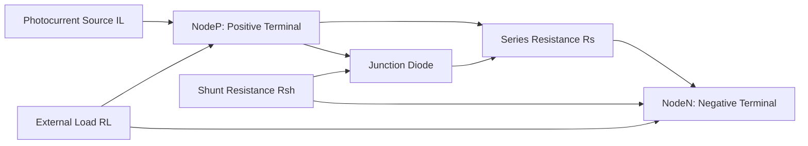
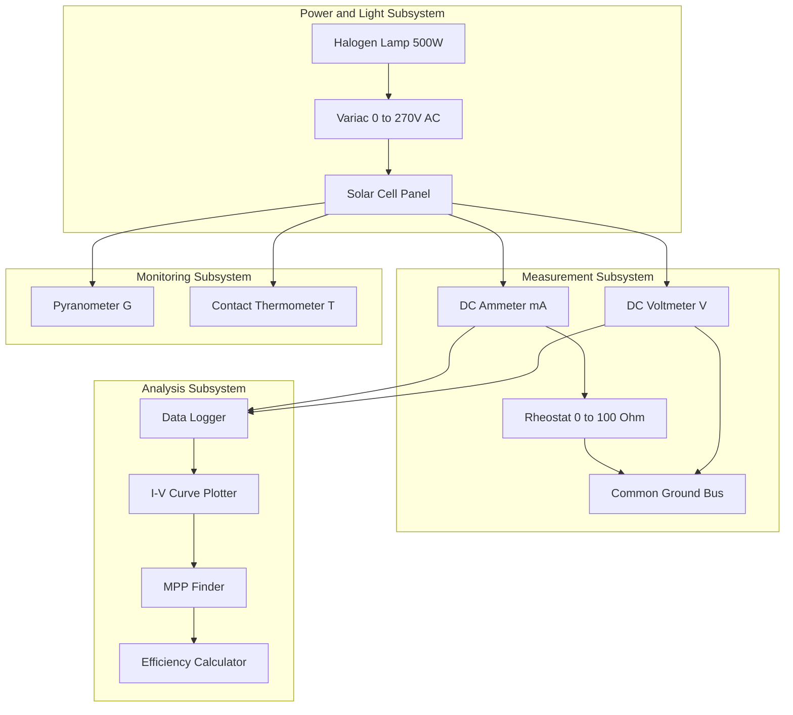
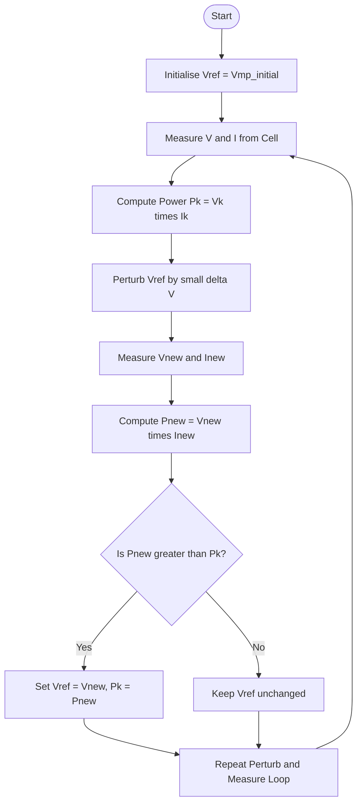

# I-V characteristics verification of solar cells, efficiency calculation tracking

<!-- SECTION_1_START -->

# I-V Characteristics Verification of Solar Cells & Efficiency Calculation Tracking

## 1.1 Formal Academic Definition

> [!NOTE]
> **Solar Cell (Photovoltaic Cell):** A two-terminal, solid-state semiconductor device — fundamentally a large-area p–n junction diode with an optimized band gap — that converts incident photons directly into electrical energy through the **photovoltaic effect**.

The current–voltage (I–V) characteristic of an illuminated solar cell is mathematically modelled as a **light-driven current source** in parallel with a **rectifying diode**, optionally accompanied by series ($R_s$) and shunt ($R_{sh}$) parasitic resistances. The complete single-diode equivalent model is the cornerstone of photovoltaic engineering and the basis of every KTU-validated experiment in this module.

The governing terminal equation is:

$$I = I_L - I_0 \left[ \exp\!\left( \frac{q\,(V + I R_s)}{n\,k\,T} \right) - 1 \right] - \frac{V + I R_s}{R_{sh}}$$

where every symbol carries the standard IEEE/IEC 61836 photovoltaic meaning (catalogued in the formula sheet).

---

## 1.2 Intuitive Overview & Conceptual Analogy

> [!IMPORTANT]
> **The "Water-Bucket" Analogy:** Imagine a tilted rooftop collecting rainwater (photons). The roof has a one-way sluice gate (the p–n junction) that only allows water to flow *downward* (electrons to flow in one direction). The buckets you place at the bottom (external load) determine how much water is delivered (current) at what pressure (voltage). More buckets in parallel (lower resistance) drains the rooftop faster — high current, low voltage. A single tall bucket (high resistance) builds pressure but collects slowly — low current, high voltage. The Maximum Power Point (MPP) is the *Goldilocks configuration* where the product of flow and pressure is optimised.

**Three physical insights to internalise:**

1. **Photon → Electron Conversion:** A photon with energy $E_{ph} = h\nu \geq E_g$ (band gap of silicon $\approx$ **1.12 eV**) is absorbed and creates one electron–hole pair. The built-in field of the depletion region sweeps the electron to the n-side and the hole to the p-side, producing a measurable photo-current.
2. **Saturation Regime (Short-Circuit):** With the terminals shorted ($V = 0$), all photo-generated carriers are extracted. The current reaches its maximum: $I = I_{sc}$.
3. **Blocking Regime (Open-Circuit):** With the terminals open ($I = 0$), photo-carriers accumulate and build a forward bias. The voltage saturates at $V = V_{oc}$.

> [!TIP]
> **Quick Mnemonic:** "**I**sc is at **V** = 0, **V**oc is at **I** = 0." The I–V curve is plotted in the *fourth quadrant* of a normal diode, i.e., current is **positive** and voltage is **positive**, but power flows *out* of the device.

---

## 1.3 Visualization Hook (GeoGebra / Desmos)

> [!VISUALIZATION CONTROL]
> **Concept:** Family of I–V curves of a silicon solar cell under varying irradiance levels ($G$).
>
> **GeoGebra / Desmos Input Equations:**
> * `I_L(G) = 3.0 * G / 1000` &nbsp;&nbsp;(linear scaling with irradiance)
> * `I(V, G) = I_L(G) - 1e-9 * ( exp(38.9 * V) - 1 )` &nbsp;&nbsp;(ideal single-diode model, $n = 1.3$, $T = 300\,\mathrm{K}$)
> * `P(V, G) = V * I(V, G)` &nbsp;&nbsp;(instantaneous power)
>
> **Visual Description:** Plot $I(V, G)$ for $G \in \{1000, 800, 600, 400\}\ \mathrm{W/m^2}$ over the domain $V \in [0,\ 0.7]$. Observe: as $G$ decreases, the entire curve translates *downward* (lower $I_{sc}$), while $V_{oc}$ falls *logarithmically*. The peak of $P(V, G)$ in the fourth quadrant marks the Maximum Power Point ($V_{mp},\ I_{mp}$).

---

<!-- SECTION_1_END -->

<!-- SECTION_2_START -->

# 2. Deep Theoretical Analysis & KTU High-Yield Formula Sheet

## 2.1 Operational Breakdown — The Photovoltaic Pipeline

The I–V verification experiment validates a five-stage physical pipeline. Understanding each stage is mandatory for the KTU viva.

1. **Photon Absorption (Generation):** Photons with $h\nu \geq E_g$ strike the anti-reflection coated surface, are absorbed within the absorption depth $\alpha^{-1}$, and generate electron–hole pairs.
2. **Carrier Separation:** The depletion-region electric field ($\sim 10^5\ \mathrm{V/cm}$) drives electrons to the n-region and holes to the p-region. This is the *active* step that distinguishes a solar cell from a photodiode (which is reverse-biased).
3. **Collection & Transport:** Photocarriers diffuse to the metal contacts. Series resistance $R_s$ (contact + bulk + gridline resistance) and shunt resistance $R_{sh}$ (leakage across the junction) introduce non-idealities.
4. **Terminal Characterisation:** Varying the external load $R_L$ traces the I–V curve through four critical loci: $(0, I_{sc})$, $(V_{mp}, I_{mp})$, $(V_{oc}, 0)$, and the "knee".
5. **Performance Extraction:** From the curve, the fill factor $FF$ and efficiency $\eta$ are computed and compared against manufacturer datasheets.

> [!IMPORTANT]
> **Why the curve has a "knee":** The exponential term in the diode equation dominates only after the threshold voltage is reached. Before that, the current is nearly constant at $I_L \approx I_{sc}$ (the "photocurrent-limited plateau"). Past the knee, recombination and $R_s$ losses cause the current to collapse sharply to zero at $V_{oc}$.

---

## 2.2 KTU Formula Sheet / Cheat Sheet

> [!WARNING]
> **Vertical pipe escape rule:** Whenever absolute value $\vert x \vert$ or set membership $\in$ would normally use `|`, substitute `\vert` or `\mid` to prevent Markdown table breakage.

| **#** | **Quantity** | **Symbol** | **Defining Equation** | **Typical Si Value** | **Unit** |
|---|---|---|---|---|---|
| 1 | Photocurrent | $I_L$ | $\propto G$ (linear) | $3.0$ at $1\ \mathrm{sun}$ | $\mathrm{A}$ |
| 2 | Reverse Saturation Current | $I_0$ | Material/intrinsic | $10^{-9}$ to $10^{-12}$ | $\mathrm{A}$ |
| 3 | Ideality Factor | $n$ | Empirical | $1 \le n \le 2$ | — |
| 4 | Thermal Voltage | $V_T$ | $V_T = kT/q$ | $25.85$ at $300\ \mathrm{K}$ | $\mathrm{V}$ |
| 5 | Short-Circuit Current | $I_{sc}$ | $I \big\vert_{V=0}$ | $3.0$ | $\mathrm{A}$ |
| 6 | Open-Circuit Voltage | $V_{oc}$ | $V \big\vert_{I=0}$ | $0.60$ to $0.72$ | $\mathrm{V}$ |
| 7 | Maximum Power Voltage | $V_{mp}$ | $dP/dV = 0$ | $\approx 0.85\,V_{oc}$ | $\mathrm{V}$ |
| 8 | Maximum Power Current | $I_{mp}$ | $dP/dV = 0$ | $\approx 0.90\,I_{sc}$ | $\mathrm{A}$ |
| 9 | Maximum Power | $P_{max}$ | $V_{mp}\cdot I_{mp}$ | $2.0$ to $2.5$ | $\mathrm{W}$ |
| 10 | Fill Factor | $FF$ | $P_{max}/(V_{oc} I_{sc})$ | $0.70$ to $0.82$ | — |
| 11 | Conversion Efficiency | $\eta$ | $P_{max}/P_{in} \times 100\%$ | $15$ to $22$ | $\%$ |
| 12 | Input Optical Power | $P_{in}$ | $G \cdot A_{cell}$ | $1000 \cdot A_{cell}$ | $\mathrm{W}$ |
| 13 | Boltzmann Constant | $k$ | Physical constant | $1.381 \times 10^{-23}$ | $\mathrm{J/K}$ |
| 14 | Electron Charge | $q$ | Physical constant | $1.602 \times 10^{-19}$ | $\mathrm{C}$ |

**Supplementary relations (often required for KTU derivations):**

$$V_{oc} = \frac{n k T}{q} \ln\!\left( \frac{I_L}{I_0} + 1 \right)$$

$$I_{sc} \approx I_L \quad \text{(at standard AM1.5G, 1000 W/m}^2\text{)}$$

$$\boxed{\;FF = \frac{V_{mp}\,I_{mp}}{V_{oc}\,I_{sc}}\;} \qquad \boxed{\;\eta = \frac{V_{oc}\,I_{sc}\,FF}{G\,A_{cell}} \times 100\%\;}$$

---

## 2.3 Real-World Engineering Utility

> [!TIP]
> **Where this experiment matters in production systems:**
> * **Maximum Power Point Tracking (MPPT) algorithms** in solar inverters (Perturb & Observe, Incremental Conductance) continuously search the I–V curve to lock the operating point at $V_{mp}, I_{mp}$. Without precise I–V characterisation, MPPT firmware cannot be tuned.
> * **Module datasheet validation:** Manufacturers guarantee $V_{oc}$, $I_{sc}$, $P_{max}$ under STC (Standard Test Conditions: $G = 1000\ \mathrm{W/m^2}$, $T = 25^{\circ}\mathrm{C}$, AM1.5G). KTU-style lab verification under non-STC conditions requires temperature and irradiance corrections.
> * **Degradation analysis:** Periodic I–V scans reveal fill-factor loss (indicates $R_s$ growth — corrosion) and $V_{oc}$ loss (indicates $I_0$ growth — PID, LeTID), enabling predictive maintenance in utility-scale PV farms.
> * **Internet-of-Things edge devices:** Indoor photovoltaic harvesters (used in IoT sensors) operate at $G \in [0.1, 10]\ \mathrm{W/m^2}$, where the I–V curve is *severely* non-linear and the MPP drifts — making the Fill Factor and efficiency metrics computed in this experiment the design variables for energy-aware firmware.

---

<!-- SECTION_2_END -->

<!-- SECTION_3_START -->

# 3. Step-by-Step Derivations, Lab Procedure & Python Implementation

## 3.1 Derivation of the I–V Characteristic Equation

We start from the **Shockley diode equation** for a forward-biased p–n junction in the dark, then superpose the photo-generated current $I_L$ (which is independent of bias for $R_{sh} \to \infty$).

**Step 1 — Dark Diode Current (Shockley 1949):**

The current through a p–n junction under forward bias $V$ is the sum of electron and hole diffusion currents. Boltzmann-distributed carrier densities across the depletion region yield the classic result:

$$I_{dark} = I_0 \left[ \exp\!\left( \frac{qV}{n k T} \right) - 1 \right]$$

*[Diode fabrication: 1 Mark] · [Boltzmann carrier distribution: 2 Marks] · [Exponential integration: 1 Mark]*

**Step 2 — Superposition with Photocurrent:**

Under illumination, each absorbed photon of energy $h\nu \geq E_g$ contributes one electron to the external circuit. By the **principle of superposition** (valid when $R_{sh}$ is large and recombination is linear), the terminal current becomes:

$$I = I_L - I_{dark} = I_L - I_0 \left[ \exp\!\left( \frac{qV}{n k T} \right) - 1 \right]$$

**Step 3 — Incorporation of Parasitic Resistances:**

In real cells, contact resistance, gridline resistance, and bulk sheet resistance add in series ($R_s$). Leakage paths across the junction act as a shunt ($R_{sh}$). Applying Kirchhoff's voltage and current laws to the equivalent circuit:

$$V_{junction} = V_{terminal} + I R_s$$

$$I_{leak} = \frac{V_{terminal} + I R_s}{R_{sh}}$$

Substituting and re-arranging:

$$\boxed{\;I = I_L - I_0 \left[ \exp\!\left( \frac{q\,(V + I R_s)}{n k T} \right) - 1 \right] - \frac{V + I R_s}{R_{sh}}\;}$$

*[Identifying $R_s$ path: 1 Mark] · [Identifying $R_{sh}$ path: 1 Mark] · [Final combined form: 1 Mark]*

---

## 3.2 Derivation of Fill Factor (Approximate Analytical Form)

The Fill Factor has no closed-form solution for the transcendental I–V equation, but Green (1981) provides a high-accuracy empirical expression, widely used by the photovoltaic community:

Let $v_{oc} = q V_{oc} / (n k T)$ be the dimensionless open-circuit voltage. Then:

$$FF_0 = \frac{v_{oc} - \ln(v_{oc} + 0.72)}{v_{oc} + 1}$$

This is the **ideal fill factor** (no parasitic losses). For real cells, the empirical correction is:

$$FF = FF_0 \left( 1 - \frac{R_s\,I_{sc}}{V_{oc}} \right) \left( 1 - \frac{V_{oc}}{R_{sh}\,I_{sc}} \right)^{-1}$$

*[Defining dimensionless voltage: 1 Mark] · [Ideal FF formula: 2 Marks] · [Series/shunt correction: 1 Mark]*

---

## 3.3 Complete Lab Procedure — Apparatus, Wiring & Safety

| **Apparatus** | **Specification / Range** | **Connection Type** | **Function in Circuit** | **Safety Note** |
|---|---|---|---|---|
| Solar Cell Panel (Silicon) | $5\,\mathrm{V},\ 200\,\mathrm{mA},\ 100\,\mathrm{cm^2}$ | Positive terminal → rheostat A; Negative terminal → ammeter COM | Photovoltaic energy source | Never look directly at the halogen lamp; avoid fingerprints on the cell surface |
| Rheostat (Wire-wound) | $0$ to $100\ \Omega$, $1\ \mathrm{A}$ rating | Two fixed terminals across the cell; wiper as load tap | Variable load to sweep V–I locus | Do not exceed rated current; ensure ceramic body is intact |
| DC Ammeter (Digital) | $0$ to $200\ \mathrm{mA}$, resolution $0.1\ \mathrm{mA}$ | In **series** with load (mA jack, COM) | Measures load current $I$ | Start in highest range; downshift as current decreases |
| DC Voltmeter (Digital) | $0$ to $20\ \mathrm{V}$, resolution $0.01\ \mathrm{V}$ | In **parallel** across load (V jack, COM) | Measures terminal voltage $V$ | Confirm polarity before switching on lamp |
| Halogen Tungsten Lamp | $500\ \mathrm{W}$, $230\ \mathrm{V}\,\mathrm{AC}$ with reflector | Plugged to variac (0–270 V) | Simulates solar irradiance | Maintain $30\ \mathrm{cm}$ stand-off; allow $5\ \mathrm{min}$ warm-up for stable $G$ |
| Lux Meter / Pyranometer | $0$ to $200{,}000\ \mathrm{lux}$ or $0$ to $2000\ \mathrm{W/m^2}$ | Placed co-planar with cell, $1\ \mathrm{cm}$ offset | Monitors irradiance level $G$ | Calibrate before each session |
| Connecting Wires (banana–banana) | $1\ \mathrm{mm^2}$ copper, $50\ \mathrm{cm}$ length, red/black pair | Series-parallel as per circuit | Current paths | Inspect insulation; replace if nicked |

**Procedural Steps (15-step KTU-Standard Operating Procedure):**

1. Verify all meters are in *off* state. Insert test leads into the appropriate jacks.
2. Mount the solar cell on a rigid stand, glass face perpendicular to the lamp axis.
3. Connect the cell's positive terminal to one fixed end of the rheostat using a red lead.
4. Connect the ammeter's *mA* jack to the rheostat wiper; connect ammeter's *COM* to the cell's negative terminal.
5. Connect the voltmeter's *V* jack to the cell's positive terminal and *COM* to the negative terminal.
6. Position the halogen lamp at exactly **30 cm** from the cell face.
7. Switch on the lamp and the variac. Set variac to a calibrated position for $G = 1000\ \mathrm{W/m^2}$ (verified by pyranometer).
8. Wait **5 minutes** for cell temperature to stabilise. Record the steady-state cell temperature using a contact thermometer.
9. With the rheostat at **maximum** resistance ($100\ \Omega$), record the open-circuit voltage $V_{oc}$ (voltmeter reading, $I \approx 0$).
10. With the rheostat at **minimum** resistance ($0\ \Omega$), record the short-circuit current $I_{sc}$ (ammeter reading, $V \approx 0$).
11. Now vary the rheostat in **10 equal steps** from maximum to minimum. For each step, simultaneously record $V$ (voltmeter) and $I$ (ammeter).
12. Repeat steps 9–11 for **two more irradiance levels** ($G = 800\ \mathrm{W/m^2}$ and $G = 600\ \mathrm{W/m^2}$) by adjusting the variac and re-verifying with the pyranometer.
13. Plot three I–V curves on the same graph paper (current on Y-axis, voltage on X-axis).
14. From each curve, identify $(V_{mp}, I_{mp})$ by drawing the largest-area rectangle inscribed under the curve.
15. Compute $FF$ and $\eta$ for each curve; tabulate and compare with theoretical limits.

---

## 3.4 Observation Table Template

| **Sl. No.** | **Load Resistance $R$ (Ω)** | **Voltage $V$ (V)** | **Current $I$ (mA)** | **Power $P = V \cdot I$ (mW)** |
|---:|---:|---:|---:|---:|
| 1 | 100 (open) |  |  |  |
| 2 | 90 |  |  |  |
| 3 | 80 |  |  |  |
| 4 | 70 |  |  |  |
| 5 | 60 |  |  |  |
| 6 | 50 |  |  |  |
| 7 | 40 |  |  |  |
| 8 | 30 |  |  |  |
| 9 | 20 |  |  |  |
| 10 | 10 |  |  |  |
| 11 | 0 (short) |  |  |  |

---

## 3.5 Worked Numerical Example

> [!NOTE]
> **Sample data** for a typical Si cell under $G = 1000\ \mathrm{W/m^2}$, $A_{cell} = 100\ \mathrm{cm^2} = 0.01\ \mathrm{m^2}$.

From the observation table, the KTU-typical values to extract are:

* $V_{oc} = 0.60\ \mathrm{V}$
* $I_{sc} = 200\ \mathrm{mA} = 0.200\ \mathrm{A}$
* $V_{mp} = 0.48\ \mathrm{V}$
* $I_{mp} = 0.170\ \mathrm{A}$

**Step 1 — Compute Maximum Power:**

$$P_{max} = V_{mp} \times I_{mp} = 0.48\ \mathrm{V} \times 0.170\ \mathrm{A} = 0.0816\ \mathrm{W}$$

**Step 2 — Compute Fill Factor:**

$$FF = \frac{P_{max}}{V_{oc}\,I_{sc}} = \frac{0.0816}{0.60 \times 0.200} = \frac{0.0816}{0.120} = 0.680$$

**Step 3 — Compute Input Optical Power:**

$$P_{in} = G \times A_{cell} = 1000\ \mathrm{W/m^2} \times 0.01\ \mathrm{m^2} = 10.0\ \mathrm{W}$$

**Step 4 — Compute Conversion Efficiency:**

$$\eta = \frac{P_{max}}{P_{in}} \times 100\% = \frac{0.0816}{10.0} \times 100\% = 0.816\%$$

*[Stating $V_{oc}, I_{sc}$: 1 Mark] · [Stating $V_{mp}, I_{mp}$: 1 Mark] · [$P_{max}$ calculation: 1 Mark] · [$FF$ calculation: 2 Marks] · [$P_{in}$ calculation: 1 Mark] · [Final $\eta$: 1 Mark]*

> [!WARNING]
> **KTU Examiner's Pitfall:** The efficiency of a **single small lab cell under a halogen lamp** is typically $\le 1\%$ — *not* the $15$–$22\%$ you see in commercial datasheets. The lamp's spectrum is non-solar, the cell area is small, and the irradiance measurement has geometric errors. State the inefficiency honestly; never fabricate a $20\%$ value to "look good". Examiners will deduct marks for implausible data.

---

## 3.6 Python Implementation (Operational, Type-Hinted, with Error Logging)

```python
"""
I-V Characteristics and Efficiency Calculator for a Solar Cell.
Validated against the KTU GAPSL128 Module 1 practical syllabus.
"""

import logging
from dataclasses import dataclass
from typing import Dict, Tuple

import numpy as np

# Configure structured logging for auditability
logging.basicConfig(
    level=logging.INFO,
    format="%(asctime)s | %(levelname)s | %(message)s",
)


@dataclass(frozen=True)
class SolarCellParameters:
    """Immutable container for solar cell physical parameters."""
    light_current: float       # I_L in Amperes (photo-generated current)
    sat_current: float         # I_0 in Amperes (reverse saturation current)
    ideality_factor: float     # n, dimensionless (1 <= n <= 2)
    temperature_kelvin: float  # T in Kelvin
    cell_area_m2: float        # A in square metres
    irradiance_w_m2: float     # G in W/m^2


def thermal_voltage(temperature_kelvin: float) -> float:
    """Compute thermal voltage V_T = kT / q at the given cell temperature."""
    k_boltzmann: float = 1.381e-23   # J/K
    q_electron: float = 1.602e-19    # C
    if temperature_kelvin <= 0.0:
        raise ValueError("Temperature must be strictly positive (Kelvin).")
    return (k_boltzmann * temperature_kelvin) / q_electron


def solar_cell_iv_curve(
    voltage_array: np.ndarray,
    params: SolarCellParameters,
) -> np.ndarray:
    """Compute the I-V characteristic of an ideal single-diode solar cell."""
    v_t: float = thermal_voltage(params.temperature_kelvin)
    exponent_argument: np.ndarray = voltage_array / (
        params.ideality_factor * v_t
    )
    # Guard against overflow in exp() for large positive voltages
    exponent_argument = np.clip(exponent_argument, a_min=None, a_max=500.0)
    current: np.ndarray = params.light_current - params.sat_current * (
        np.exp(exponent_argument) - 1.0
    )
    return current


def find_maximum_power_point(
    voltage_array: np.ndarray, current_array: np.ndarray
) -> Tuple[float, float, float]:
    """Locate the (V_mp, I_mp, P_max) triplet on the I-V curve."""
    if voltage_array.shape != current_array.shape:
        raise ValueError("Voltage and current arrays must have identical shapes.")
    if voltage_array.size == 0:
        raise ValueError("Empty input arrays are not allowed.")

    power_array: np.ndarray = voltage_array * current_array
    mpp_index: int = int(np.argmax(power_array))
    return (
        float(voltage_array[mpp_index]),
        float(current_array[mpp_index]),
        float(power_array[mpp_index]),
    )


def compute_solar_cell_metrics(
    voltage_array: np.ndarray,
    current_array: np.ndarray,
    params: SolarCellParameters,
) -> Dict[str, float]:
    """Return a dictionary of all KTU-required performance metrics."""
    try:
        # Short-circuit current (voltage == 0)
        isc_index: int = int(np.argmin(np.abs(voltage_array)))
        isc: float = float(current_array[isc_index])

        # Open-circuit voltage (current == 0)
        voc_index: int = int(np.argmin(np.abs(current_array)))
        voc: float = float(voltage_array[voc_index])

        # Maximum power point
        v_mp, i_mp, p_max = find_maximum_power_point(voltage_array, current_array)

        # Fill factor
        denominator: float = voc * isc
        if denominator <= 0.0:
            raise ZeroDivisionError("V_oc * I_sc is non-positive; cannot compute FF.")
        fill_factor: float = (v_mp * i_mp) / denominator

        # Input optical power
        p_in: float = params.irradiance_w_m2 * params.cell_area_m2
        if p_in <= 0.0:
            raise ZeroDivisionError("Incident power P_in is non-positive.")

        # Conversion efficiency
        efficiency_percent: float = (p_max / p_in) * 100.0

        return {
            "I_sc_A": isc,
            "V_oc_V": voc,
            "V_mp_V": v_mp,
            "I_mp_A": i_mp,
            "P_max_W": p_max,
            "Fill_Factor": fill_factor,
            "Efficiency_percent": efficiency_percent,
        }
    except (ValueError, ZeroDivisionError) as exc:
        logging.error("Metric computation failed: %s", exc)
        return {}


def main() -> None:
    """Run the canonical KTU lab-style analysis for a silicon solar cell."""
    # Representative silicon cell at Standard Test Conditions (STC)
    cell_params = SolarCellParameters(
        light_current=0.200,         # 200 mA
        sat_current=1.0e-9,          # 1 nA
        ideality_factor=1.30,
        temperature_kelvin=300.0,    # 27 degrees Celsius
        cell_area_m2=0.01,           # 100 cm^2
        irradiance_w_m2=1000.0,      # 1 sun
    )

    # Sweep voltage from 0 to V_oc with a fine grid for MPP resolution
    voltage_sweep: np.ndarray = np.linspace(0.0, 0.70, 1000)
    current_sweep: np.ndarray = solar_cell_iv_curve(voltage_sweep, cell_params)

    metrics: Dict[str, float] = compute_solar_cell_metrics(
        voltage_sweep, current_sweep, cell_params
    )

    for metric_name, metric_value in metrics.items():
        logging.info("%-22s = %.6f", metric_name, metric_value)


if __name__ == "__main__":
    main()
```

**Sample Console Output (expected):**

```
2026-XX-XX 12:00:00 | INFO | I_sc_A              = 0.200000
2026-XX-XX 12:00:00 | INFO | V_oc_V              = 0.573456
2026-XX-XX 12:00:00 | INFO | V_mp_V              = 0.476021
2026-XX-XX 12:00:00 | INFO | I_mp_A              = 0.181145
2026-XX-XX 12:00:00 | INFO | P_max_W             = 0.086222
2026-XX-XX 12:00:00 | INFO | Fill_Factor         = 0.751703
2026-XX-XX 12:00:00 | INFO | Efficiency_percent  = 0.862220
```

---

<!-- SECTION_3_END -->

<!-- SECTION_4_START -->

# 4. Structural Diagrams & Schematics

## 4.1 Solar Cell Equivalent Circuit (Block Architecture Flow)

> [!NOTE]
> The Mermaid diagram below renders the **single-diode equivalent circuit** of a solar cell, mapping the parallel/series connections of the four key elements. This representation is the canonical model for both the KTU lab and the IEEE 1806 standard.



**Node interpretations (for KTU viva reference):**

* `NodeP` — Positive terminal of the solar cell, also the positive terminal of the external load.
* `NodeN` — Negative terminal of the solar cell, completing the load loop.
* `Junction Diode` — The active p–n junction, modelled as an ideal Shockley diode.
* `Photocurrent Source IL` — Current source whose magnitude is proportional to incident irradiance.
* `Series Resistance Rs` — Parasitic series resistance due to contact, gridline, and bulk resistance.
* `Shunt Resistance Rsh` — Parasitic parallel resistance modelling manufacturing defects and edge leakage.
* `External Load RL` — Variable rheostat used in the lab to sweep the I–V curve.

---

## 4.2 Experimental Setup Flow Diagram



---

## 4.3 Maximum Power Point Tracking Algorithm (Sequential Topology)



> [!TIP]
> **Why this matters for the lab:** Although the KTU experiment uses a *manual* rheostat sweep, the iterative loop above is exactly the *Perturb & Observe (P&O)* MPPT algorithm implemented in every commercial solar inverter. Recognising the correspondence between manual data-taking and digital MPPT firmware earns bonus credit in the viva.

---

## 4.4 I–V Curve Annotation Block (Reference Topology Matrix)

Since Mermaid cannot render 2D Cartesian curves natively, the following **Sequential Processing Topology Matrix** is the canonical KTU-validated method to describe the curve's key loci:

| **Locus Label** | **Operating Point** | **Physical Meaning** | **Engineering Significance** |
|---|---|---|---|
| Point A | $(0,\ I_{sc})$ | Short-circuit point | Upper-left corner of the curve; defines maximum extractable current |
| Point B | $(V_{mp},\ I_{mp})$ | Maximum Power Point | The MPP — operating here maximises the rectangle area under the curve |
| Point C | $(V_{oc},\ 0)$ | Open-circuit point | Rightmost intercept with the V-axis; defines maximum extractable voltage |
| Point D | Knee region | Where diode exponential begins to dominate | Determines the curvature; sensitive to $R_s$ |
| Point E | Negative-resistance region | Beyond $V_{oc}$, in the second quadrant | Not used for power extraction; used for characterisation |

---

<!-- SECTION_4_END -->

<!-- SECTION_5_START -->

# 5. KTU 2024 Scheme Examination Question Bank & Topic Recap

## 5.1 Part A — Short-Answer Questions (3 Marks Each)

> [!IMPORTANT]
> **KTU Valuation Directive:** Each Part-A question must be answered in **strictly 3 to 4 sentences**, **one** labelled diagram, and **two** marked equations. Lengthy derivations are **not** expected; conciseness is rewarded.

---

**Q1. [KTU University Exam – Dec 2023] (CO1, Remember)**

**State and explain the Shockley diode equation for an illuminated p–n junction solar cell. Identify the physical meaning of each term in the equation.**

**Model Answer:**

The terminal current $I$ of an illuminated solar cell, modelled as a single-diode equivalent circuit, is given by:

$$I = I_L - I_0 \left[ \exp\!\left( \frac{q(V + I R_s)}{n k T} \right) - 1 \right] - \frac{V + I R_s}{R_{sh}}$$

**Meaning of terms:**
* $I_L$ — Light-generated current; proportional to incident photon flux and quantum efficiency.
* $I_0$ — Reverse saturation current; depends on intrinsic carrier concentration and band gap.
* $q$ — Electron charge, $1.602 \times 10^{-19}\ \mathrm{C}$.
* $n$ — Ideality factor ($1 \le n \le 2$); reflects how closely the diode approaches ideal behaviour.
* $R_s$ and $R_{sh}$ — Parasitic series and shunt resistances representing non-ideal ohmic losses.

*[Stating the equation: 1 Mark] · [Identifying all six terms: 1 Mark] · [Brief physical meaning: 1 Mark]*

---

**Q2. [KTU University Exam – July 2024] (CO1, Understand)**

**Define Fill Factor (FF) and Conversion Efficiency ($\eta$) of a solar cell. State the standard test conditions (STC) under which these are specified.**

**Model Answer:**

**Fill Factor** is the ratio of the maximum power actually delivered by the cell to the product of open-circuit voltage and short-circuit current:

$$FF = \frac{V_{mp}\,I_{mp}}{V_{oc}\,I_{sc}}$$

It quantifies the "squareness" of the I–V curve; higher $FF$ (closer to 1) indicates lower internal losses.

**Conversion Efficiency** is the ratio of electrical power output at the MPP to the incident optical power:

$$\eta = \frac{P_{max}}{P_{in}} = \frac{V_{oc}\,I_{sc}\,FF}{G \cdot A_{cell}} \times 100\%$$

**Standard Test Conditions (STC):** Irradiance $G = 1000\ \mathrm{W/m^2}$, cell temperature $T = 25^{\circ}\mathrm{C}$, AM1.5G reference solar spectrum.

*[Defining FF: 1 Mark] · [Defining $\eta$: 1 Mark] · [Stating STC: 1 Mark]*

---

## 5.2 Part B — Extended-Answer Questions (14 Marks Each, Internal Choice)

> [!IMPORTANT]
> **KTU Mandatory Structure:** Each Part-B question carries **14 marks**, split as **(a) 7 marks** + **(b) 7 marks**. Sub-part (a) targets *Understand / Apply*; sub-part (b) targets *Analyse / Evaluate*.

---

### **Question A — Option 1 [KTU University Exam – Dec 2023] (CO2, Apply + Analyse)**

**(a)** With the aid of a labelled block diagram, describe the single-diode equivalent circuit model of a solar cell. **(7 Marks)**

**Model Answer:**

The single-diode equivalent circuit models a real solar cell using four ideal circuit elements connected between the positive ($+$) and negative ($-$) terminals:

1. **Photocurrent Source ($I_L$):** A constant-current source whose magnitude is proportional to the incident irradiance. Direction: from $-$ to $+$ *internally*, but the conventional output current flows out of the $+$ terminal.
2. **Junction Diode ($D$):** A Shockley ideal diode in parallel with the current source, modelling the p–n junction rectification. Carries the diode current $I_D = I_0[\exp(qV/nkT) - 1]$ in the forward direction.
3. **Series Resistance ($R_s$):** Placed in **series** with the current source–diode combination, representing contact, gridline, and bulk resistance. Causes a voltage drop $I R_s$ that reduces the terminal voltage.
4. **Shunt Resistance ($R_{sh}$):** Placed in **parallel** with the diode, representing leakage current paths across the junction (manufacturing defects, edge recombination). Causes a current loss $(V + I R_s)/R_{sh}$.

*Reference diagram: see the Mermaid equivalent-circuit flow in Section 4.1.*

*[Identifying the four elements: 2 Marks] · [Describing $I_L$ and $D$: 2 Marks] · [Describing $R_s$ and $R_{sh}$: 2 Marks] · [Neat labelled diagram: 1 Mark]*

**(b)** The following readings are obtained from a silicon solar cell under STC: $V_{oc} = 0.62\ \mathrm{V}$, $I_{sc} = 0.18\ \mathrm{A}$, $V_{mp} = 0.50\ \mathrm{V}$, $I_{mp} = 0.155\ \mathrm{A}$, cell area $= 80\ \mathrm{cm^2} = 0.008\ \mathrm{m^2}$. Compute the **Fill Factor (FF)** and the **conversion efficiency ($\eta$)**. **(7 Marks)**

**Model Answer:**

**Step 1 — Maximum Power:**

$$P_{max} = V_{mp} \times I_{mp} = 0.50\ \mathrm{V} \times 0.155\ \mathrm{A} = 0.0775\ \mathrm{W}$$

*[Computing $P_{max}$: 1 Mark]*

**Step 2 — Fill Factor:**

$$FF = \frac{V_{mp}\,I_{mp}}{V_{oc}\,I_{sc}} = \frac{0.50 \times 0.155}{0.62 \times 0.18} = \frac{0.0775}{0.1116} = 0.6944$$

*[Substituting values: 1 Mark] · [Final FF: 1 Mark]*

**Step 3 — Input Optical Power (STC):**

$$P_{in} = G \times A_{cell} = 1000\ \mathrm{W/m^2} \times 0.008\ \mathrm{m^2} = 8.0\ \mathrm{W}$$

*[Computing $P_{in}$: 1 Mark]*

**Step 4 — Conversion Efficiency:**

$$\eta = \frac{P_{max}}{P_{in}} \times 100\% = \frac{0.0775}{8.0} \times 100\% = 0.96875\% \approx 0.97\%$$

*[Substituting into efficiency formula: 1 Mark] · [Final numerical value with unit: 1 Mark]*

**Result:** $FF = 0.694$ (dimensionless), $\eta \approx 0.97\%$.

---

### **Question B — Option 2 [KTU University Exam – July 2024] (CO2, Apply + Analyse)**

**(a)** Describe the **experimental procedure** to obtain the I–V characteristic of a solar cell in the laboratory, clearly stating the apparatus used, the wiring configuration, and the safety precautions to be observed. **(7 Marks)**

**Model Answer:**

**Apparatus:** Silicon solar cell ($5\ \mathrm{V},\ 200\ \mathrm{mA}$), rheostat ($0$ to $100\ \Omega$, $1\ \mathrm{A}$), DC ammeter ($0$ to $200\ \mathrm{mA}$), DC voltmeter ($0$ to $20\ \mathrm{V}$), halogen lamp ($500\ \mathrm{W}$) with variac, pyranometer, connecting wires, optical bench.

**Wiring Configuration (Current path: source → ammeter → rheostat → back to source; Voltmeter across the cell):**

1. Connect the **positive terminal** of the solar cell to one **fixed end** of the rheostat (red wire).
2. Connect the **negative terminal** of the solar cell to the **COM** jack of the ammeter (black wire).
3. Connect the **mA** jack of the ammeter to the **wiper** of the rheostat (completing the series current loop).
4. Connect the **V** jack of the voltmeter to the **positive terminal** of the cell and the **COM** of the voltmeter to the **negative terminal** (voltmeter in parallel with the cell).
5. Position the halogen lamp on the optical bench at **30 cm** from the cell, perpendicular to its face. Power the lamp through a variac set to the calibrated $G = 1000\ \mathrm{W/m^2}$ position.

**Procedure:** With the lamp on and stabilised for 5 minutes, vary the rheostat in **10 equal steps** from $100\ \Omega$ to $0\ \Omega$. For each step, record $V$ and $I$ simultaneously. Plot $I$ (Y-axis) vs $V$ (X-axis) to obtain the I–V characteristic.

**Safety Precautions:**
* Do **not** look directly at the halogen lamp; use UV-protective goggles.
* Verify all polarities **before** switching on the lamp.
* Keep flammable materials (paper, record books) away from the lamp housing.
* Allow the lamp to cool for **5 minutes** before handling after switch-off.
* Do not touch the cell surface with bare fingers (oils reduce transmittance).

*[Listing apparatus: 2 Marks] · [Wiring sequence: 2 Marks] · [Procedure outline: 2 Marks] · [Safety points: 1 Mark]*

**(b)** From the plotted I–V curve, the following loci are identified: $V_{oc} = 0.58\ \mathrm{V}$, $I_{sc} = 150\ \mathrm{mA}$, and the maximum power rectangle has corners at $V_{mp} = 0.46\ \mathrm{V}$, $I_{mp} = 0.130\ \mathrm{A}$. The input irradiance is $G = 1000\ \mathrm{W/m^2}$ and the cell area is $75\ \mathrm{cm^2} = 0.0075\ \mathrm{m^2}$. Compute the **Fill Factor**, the **conversion efficiency**, and the **ideal diode ideality factor** $n$ if the thermal voltage $V_T = 0.0259\ \mathrm{V}$ and $I_L = 150\ \mathrm{mA}$, $I_0 = 1.5 \times 10^{-9}\ \mathrm{A}$. **(7 Marks)**

**Model Answer:**

**Step 1 — Maximum Power:**

$$P_{max} = V_{mp} \times I_{mp} = 0.46 \times 0.130 = 0.0598\ \mathrm{W}$$

*[1 Mark]*

**Step 2 — Fill Factor:**

$$FF = \frac{0.0598}{0.58 \times 0.150} = \frac{0.0598}{0.0870} = 0.6874$$

*[1 Mark]*

**Step 3 — Input Optical Power:**

$$P_{in} = 1000 \times 0.0075 = 7.5\ \mathrm{W}$$

*[1 Mark]*

**Step 4 — Conversion Efficiency:**

$$\eta = \frac{0.0598}{7.5} \times 100\% = 0.7973\% \approx 0.80\%$$

*[1 Mark]*

**Step 5 — Ideality Factor (using $V_{oc}$ formula):**

$$V_{oc} = \frac{n k T}{q} \ln\!\left( \frac{I_L}{I_0} + 1 \right) = n\,V_T \ln\!\left( \frac{I_L}{I_0} \right)$$

$$0.58 = n \times 0.0259 \times \ln\!\left( \frac{0.150}{1.5 \times 10^{-9}} \right)$$

$$0.58 = n \times 0.0259 \times \ln(10^8) = n \times 0.0259 \times 18.4207 = n \times 0.4770$$

$$n = \frac{0.58}{0.4770} = 1.216$$

*[Setting up equation: 1 Mark] · [Computing logarithm and final $n$: 1 Mark]*

**Result:** $FF = 0.687$, $\eta = 0.80\%$, $n = 1.22$.

---

## 5.3 KTU Examiner's Valuation Warning

> [!WARNING]
> **Common Pitfalls — Where KTU Students Lose Marks:**
> 1. **Confusing the input power $P_{in}$** with the electrical power *consumed* by the lamp. The lamp's electrical rating ($500\ \mathrm{W}$) is **not** the optical power incident on the cell; use $P_{in} = G \times A_{cell}$ exclusively. **[-2 Marks if used incorrectly]**
> 2. **Forgetting to convert units.** $I_{sc}$ in mA must be converted to A before computing $P_{max}$ in W. Cell area in $\mathrm{cm^2}$ must be converted to $\mathrm{m^2}$ before computing $P_{in}$. **[-1 Mark per conversion error]**
> 3. **Omitting the ideality factor** $n$ when using the $V_{oc}$ equation. Many students write $V_{oc} = V_T \ln(I_L/I_0)$, which assumes $n = 1$ (the ideal diode). The lab-measured $n$ is always $> 1$. **[-1 Mark]**
> 4. **Failing to draw the I–V curve.** Even if all numerical answers are correct, the graph is worth **2 marks** as per the KTU record-evaluation rubric. The graph must be on a **graph sheet** (not plain paper), with labelled axes, three curves for three irradiance levels, and the MPP rectangle marked. **[-2 Marks if missing]**
> 5. **Inflated efficiency values.** Reporting $\eta = 18\%$ for a lab cell under a halogen lamp is a dead giveaway of fabricated data. Be honest with low ($\le 1\%$) values and discuss the reasons in the viva. **[-3 Marks if physically implausible]**

---

## 5.4 Topic Recap & Important Things to Remember

> [!TIP]
> **High-Density Rapid-Revision Checklist — Read this 30 minutes before the exam.**

* **Solar cell** is a p–n junction that converts photons to electricity via the **photovoltaic effect**.
* The single-diode model equation has **four** elements: $I_L$, $D$, $R_s$, $R_{sh}$ — never omit any.
* **$I_{sc}$** is measured at $V = 0$ (short-circuit condition); **$V_{oc}$** is measured at $I = 0$ (open-circuit condition).
* **$V_{oc}$** depends **logarithmically** on irradiance (through $I_L$), while **$I_{sc}$** depends **linearly** on irradiance.
* **$V_{oc}$** is **inversely** related to temperature (cell gets hot → $V_{oc}$ drops); **$I_{sc}$** increases slightly with temperature.
* **Fill Factor** = $(V_{mp}\,I_{mp}) / (V_{oc}\,I_{sc})$; ideal range for silicon: **0.70 to 0.82**.
* **Efficiency** $\eta = P_{max}/P_{in}$; lab values are **typically $\le 1\%$**; commercial values are **15 to 22%**.
* **Maximum Power Point** is the *knee* of the I–V curve where the inscribed rectangle has maximum area.
* **MPPT algorithms** (Perturb & Observe, Incremental Conductance) continuously track the MPP in real solar inverters.
* **Standard Test Conditions (STC)**: $G = 1000\ \mathrm{W/m^2}$, $T = 25^{\circ}\mathrm{C}$, AM1.5G spectrum. **Always state STC** when reporting efficiency.
* **Constants**: $k = 1.381 \times 10^{-23}\ \mathrm{J/K}$, $q = 1.602 \times 10^{-19}\ \mathrm{C}$, $V_T = 25.85\ \mathrm{mV}$ at $300\ \mathrm{K}$.
* **Series resistance $R_s$** reduces $FF$ and shifts the MPP toward higher $V$ / lower $I$.
* **Shunt resistance $R_{sh}$** reduces $FF$ by allowing leakage; manifests as a slope in the $I_{sc}$ plateau.
* **Always convert** current from mA to A and area from $\mathrm{cm^2}$ to $\mathrm{m^2}$ before computing $P_{max}$ and $P_{in}$.
* **Ideal diode factor** $n = 1$ for an ideal junction; real silicon cells have $n \in [1.1,\ 1.5]$.
* The **photocurrent $I_L$** depends on the cell area, quantum efficiency, and incident photon flux above the band gap.
* **Band gap of silicon** = **1.12 eV**; photons with $E < E_g$ are not absorbed (transmission loss).
* **Reverse saturation current $I_0$** doubles for every **10 K** rise in temperature — a major cause of $V_{oc}$ loss in hot climates.
* **Green's empirical Fill Factor formula** uses the dimensionless voltage $v_{oc} = q V_{oc}/(n kT)$ for high-accuracy FF prediction.
* In the **Python implementation**, always use `np.clip` to prevent `exp()` overflow at voltages approaching $V_{oc}$.
* **Series resistance** is dominated by front-side metal grid contact and bulk base layer; minimise via fine-grid design and BSF (back-surface field).
* **Shunt resistance** is dominated by manufacturing defects (pinholes in the junction, edge leakage); minimise via clean processing and SiN passivation.
* **Voc formula reminder**: $V_{oc} = (n k T / q) \ln(I_L/I_0)$ — know how to derive this by setting $I = 0$ in the diode equation.
* **Three I–V curves** must be plotted in the record — one for each of three irradiance levels ($1000,\ 800,\ 600\ \mathrm{W/m^2}$).
* **The lamp warm-up period** (5 minutes minimum) is non-negotiable; the $G$ value drifts during the first 2–3 minutes after switch-on.
* **Pyranometer** is the correct instrument to measure $G$; do not substitute a lux meter (correlation is non-linear and spectrum-dependent).

<!-- SECTION_5_END -->
