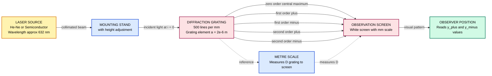
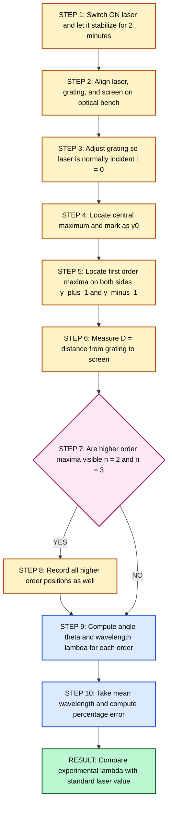
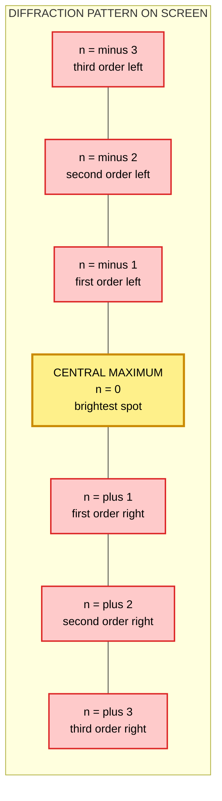

# Wavelength determination of laser beam using diffraction grating element

<!-- SECTION_1_START -->

# Wavelength Determination of Laser Beam Using Diffraction Grating

## 1.1 Formal Academic Definition

> [!NOTE]
> **Diffraction Grating:** An optical component consisting of a large number of equally spaced, parallel slits or grooves (typically several hundred to thousands per millimetre) ruled on a glass or metal substrate. When monochromatic light is incident on it, the grating produces a series of sharp, well-separated maxima due to the combined effects of **diffraction** and **interference**.

For the KTU GAPSL128 syllabus, the experiment uses a **transmission-type plane diffraction grating** illuminated by a monochromatic laser source (commonly a **He-Ne laser at 632.8 nm** or a **semiconductor laser at 650 nm**).

The condition for constructive interference (principal maxima) is given by the **Grating Equation**:

$$\boxed{(e + d)\sin\theta = n\lambda}$$

where the grating element $(e + d)$ is the sum of the slit width $e$ and the opaque spacing $d$. For the KTU lab, we treat the combined value as the grating constant, often written as:

$$a = \frac{1}{N}$$

Here, $N$ is the number of lines per metre on the grating.

## 1.2 Intuitive Overview — The "Row of Synchronized Clappers" Analogy

> [!IMPORTANT]
> **Conceptual Analogy:**
> Imagine a stadium full of spectators holding clappers. If only one person claps, the sound is weak and spreads everywhere. If **many people clap in perfect sync**, the sound combines into a sharp, directional wave that travels far. A diffraction grating works identically — each slit is a "clapper" emitting secondary wavelets (Huygens' principle), and when the path difference between wavelets is a whole number of wavelengths, they reinforce to form sharp bright spots called **principal maxima**.

The **central bright spot** (zero order, $n=0$) is the **undiffracted straight-through beam**. As we move sideways, the angle increases until the path difference equals one full wavelength — this is the **first-order maximum**. The next one is the **second-order maximum**, and so on. A grating with more lines per mm produces a more spread-out (and therefore more precisely measurable) pattern.

## 1.3 Key Physical Constants & Standard Values

| Parameter | Symbol | Typical Value (KTU Lab) |
|---|---|---|
| Grating constant (lines per metre) | $N$ | $5 \times 10^{5}$ lines/m (= 500 lines/mm) |
| Grating element spacing | $a$ | $2 \times 10^{-6}$ m |
| He-Ne laser wavelength (standard) | $\lambda_0$ | **632.8 nm** |
| Semiconductor laser wavelength (standard) | $\lambda_0$ | **650 nm** |
| Speed of light | $c$ | $3 \times 10^{8}$ m/s |
| Frequency of He-Ne light | $f$ | $4.74 \times 10^{14}$ Hz |

## 1.4 Visualization Control Block

> [!VISUALIZATION CONTROL]
> **Concept:** Intensity distribution of a multi-slit diffraction grating
> **Desmos Input Equations:**
> * $I(\theta) = \left[\frac{\sin(N \pi a \sin\theta / \lambda)}{N \sin(\pi a \sin\theta / \lambda)}\right]^2 \cdot \left[\frac{\sin(\pi b \sin\theta / \lambda)}{\pi b \sin\theta / \lambda}\right]^2$
> * Plot with $\theta$ on x-axis (in radians) and $I$ on y-axis
> * Use $N = 5$, $a = 2\times 10^{-6}$ m, $b = 1\times 10^{-6}$ m, $\lambda = 632.8 \times 10^{-9}$ m
>
> **Visual Description:** Students will see a tall central peak at $\theta = 0$ flanked by progressively weaker secondary peaks (principal maxima) at symmetric angles. The peaks become sharper as $N$ increases — this is the resolving power of the grating in action.

---

<!-- SECTION_1_END -->

<!-- SECTION_2_START -->

# Deep Theoretical Analysis & KTU High-Yield Formula Sheet

## 2.1 Theoretical Foundation — Why Does a Grating Work?

A diffraction grating is essentially a **multi-slit interference** system. The combined intensity pattern is the product of:

1. **Single-slit diffraction envelope** (controls the overall intensity decay)
2. **Multi-slit interference pattern** (creates the sharp principal maxima)

When laser light (highly coherent, monochromatic, collimated) falls on the grating:

* Each slit acts as a source of secondary wavelets (Huygens-Fresnel principle).
* Wavelets from adjacent slits travel different path lengths to a far screen.
* When the path difference is exactly $n\lambda$, they add **constructively** → principal maximum.
* Between these maxima, they cancel out almost completely, producing **dark regions**.

> [!IMPORTANT]
> **Engineering Relevance:** Gratings are the heart of **spectrometers**, **Optical Network Units (ONUs)** in fibre-optic communication, **wavelength-division multiplexers (WDM)**, and **CD/DVD pickup heads**. In semiconductor physics labs, identical principles are used in the characterization of **Distributed Feedback (DFB) lasers** and **Bragg reflectors** in optical fibres.

## 2.2 KTU Formula Sheet

> [!IMPORTANT]
> The following table contains **all the equations** you will need for the university exam and lab record. Memorize this section thoroughly.

| # | Quantity | Formula | Symbol Meaning | Unit |
|---|---|---|---|---|
| 1 | Grating element | $a = \frac{1}{N}$ | $N$ = lines per metre | metre (m) |
| 2 | Grating equation | $a \sin\theta = n\lambda$ | $n$ = order, $\theta$ = diffraction angle | dimensionless / m |
| 3 | Wavelength | $\lambda = \frac{a \sin\theta}{n}$ | — | metre (m) |
| 4 | Tangent relation | $\tan\theta = \frac{y}{D}$ | $y$ = distance of max from centre, $D$ = grating-to-screen distance | dimensionless |
| 5 | Mean wavelength | $\bar{\lambda} = \frac{\sum \lambda_i}{k}$ | $k$ = number of observations | metre (m) |
| 6 | Resolving power | $R = nN$ | $N$ = total number of lines illuminated | dimensionless |
| 7 | Dispersive power | $\frac{d\theta}{d\lambda} = \frac{n}{a \cos\theta}$ | — | rad/m |
| 8 | Percentage error | $\%\text{ error} = \frac{\vert \lambda_{\text{std}} - \lambda_{\text{exp}} \vert}{\lambda_{\text{std}}} \times 100$ | $\lambda_{\text{std}}$ = standard value | percent (%) |
| 9 | Path difference | $\Delta = a \sin\theta$ | — | metre (m) |
| 10 | Frequency | $f = \frac{c}{\lambda}$ | $c = 3\times 10^8$ m/s | Hertz (Hz) |

> [!WARNING]
> **KTU Pitfall:** Use $\sin\theta$, not $\tan\theta$, in the grating equation. The angle $\theta$ must be calculated from $\sin^{-1}\!\left(\frac{y}{\sqrt{y^2 + D^2}}\right)$, not simply $\tan^{-1}\!\left(\frac{y}{D}\right)$, though for small angles they converge.

## 2.3 Resolving Power — The Reason We Use a Grating

Two closely spaced spectral lines of wavelengths $\lambda$ and $\lambda + \Delta\lambda$ are just resolved by a grating when:

$$R = \frac{\lambda}{\Delta\lambda} = nN$$

A grating with 500 lines/mm and a 2 cm wide illuminated region contains $N_{\text{total}} = 500 \times 20 = 10{,}000$ lines. In 2nd order, the resolving power is $R = 2 \times 10{,}000 = 20{,}000$, meaning it can resolve wavelengths differing by as little as $\frac{632.8}{20000} \approx 0.032$ nm.

## 2.4 Real-World Applications in Engineering

| Field | Application |
|---|---|
| Optical fibre communication | WDM multiplexers use gratings to separate 1550 nm and 1310 nm channels |
| Semiconductor laser testing | Grating spectrometers characterize the emission spectrum of laser diodes |
| Astronomy | Grating spectrographs analyse stellar compositions |
| Forensics | Raman spectrometers identify chemical fingerprints |
| Holography | Coherent laser light is diffracted to reconstruct 3D images |

---

<!-- SECTION_2_END -->

<!-- SECTION_3_START -->

# Step-by-Step Derivations, Procedure & Code Implementation

## 3.1 Mathematical Derivation of the Grating Equation

Consider two adjacent slits separated by distance $a$. A parallel beam of monochromatic light of wavelength $\lambda$ is incident normally on the grating.

**Step 1:** The path difference between wavelets emerging from two adjacent slits at angle $\theta$ is:

$$\Delta = AB = a \sin\theta$$

**Step 2:** For constructive interference (principal maximum), this path difference must equal an integral multiple of $\lambda$:

$$a \sin\theta = n\lambda, \quad n = 0, \pm 1, \pm 2, \ldots$$

**Step 3:** For $n = 0$: $\sin\theta = 0 \Rightarrow \theta = 0$ (central maximum, straight-through beam).

**Step 4:** For $n = 1$: $\sin\theta_1 = \frac{\lambda}{a}$ (first-order maximum).

**Step 5:** For $n = 2$: $\sin\theta_2 = \frac{2\lambda}{a}$ (second-order maximum), and so on.

**Step 6:** Rearranging for the wavelength:

$$\lambda = \frac{a \sin\theta}{n}$$

This is the fundamental working equation of the experiment.

## 3.2 Detailed Lab Procedure

### Apparatus Required

| Item | Specification | Quantity |
|---|---|---|
| He-Ne / Semiconductor laser | $\lambda \approx 632.8$ nm or 650 nm, with power supply | 1 |
| Diffraction grating | 500 lines/mm (or 600 lines/mm), mounted in a holder | 1 |
| Optical bench / table | 1.5 m length with stands | 1 |
| Screen with scale | White screen marked with mm divisions | 1 |
| Measuring tape / metre scale | Least count 1 mm | 1 |
| Vernier caliper | Least count 0.01 cm (optional) | 1 |

### Step-by-Step Experimental Procedure

**Step 1 — Alignment:** Mount the laser, grating, and screen on the optical bench in a straight line. Ensure the laser beam is **perpendicular** to the grating (angle of incidence $i = 0$).

**Step 2 — Central maximum:** Switch on the laser. The bright spot falling on the screen directly opposite the grating is the **zero-order maximum**. Mark its position as $y_0$.

**Step 3 — First-order maxima:** Observe the first-order red spots on either side of the central maximum. Mark their positions as $y_{+1}$ (right) and $y_{-1}$ (left). Record the distances:

$$y_1 = \frac{y_{+1} - y_{-1}}{2}$$

**Step 4 — Higher orders:** Repeat the measurement for $n = 2$ (second order) and $n = 3$ (third order) if visible. Some lasers may not produce visible orders above $n = 2$.

**Step 5 — Distance D:** Measure the perpendicular distance from the grating to the screen using the metre scale. Record as $D$.

**Step 6 — Grating constant:** Note the number of lines per mm on the grating (e.g., 500 lines/mm). Convert to lines per metre:

$$N = 500 \times 10^3 = 5 \times 10^5 \text{ lines/m}$$

$$a = \frac{1}{N} = 2 \times 10^{-6} \text{ m}$$

**Step 7 — Calculate $\theta$:**

$$\tan\theta = \frac{y_n}{D} \quad \Rightarrow \quad \theta = \tan^{-1}\!\left(\frac{y_n}{D}\right)$$

Then compute $\sin\theta$.

**Step 8 — Calculate $\lambda$:**

$$\lambda = \frac{a \sin\theta}{n}$$

**Step 9 — Repeat and average:** Take 3 sets of readings and compute the mean wavelength $\bar{\lambda}$.

**Step 10 — Compare with standard:** Calculate the percentage error against the known laser wavelength.

## 3.3 Worked Numerical Example

> [!NOTE]
> **Worked-Out Calculation (Typical KTU Lab Observation)**

**Given:**
* Grating: 500 lines/mm $\Rightarrow a = 2 \times 10^{-6}$ m
* Distance from grating to screen: $D = 1.20$ m
* Observed positions (for order $n = 1$): $y_{+1} = 0.378$ m, $y_{-1} = -0.376$ m

**Step 1:** Mean position of 1st order:

$$y_1 = \frac{0.378 - (-0.376)}{2} = \frac{0.754}{2} = 0.377 \text{ m}$$

**Step 2:** Compute the angle:

$$\tan\theta_1 = \frac{0.377}{1.20} = 0.3142$$

$$\theta_1 = \tan^{-1}(0.3142) = 17.44^\circ$$

**Step 3:** Compute $\sin\theta_1$:

$$\sin\theta_1 = \sin(17.44^\circ) = 0.2997$$

**Step 4:** Apply the grating equation:

$$\lambda_1 = \frac{a \sin\theta_1}{n} = \frac{(2 \times 10^{-6})(0.2997)}{1} = 5.994 \times 10^{-7} \text{ m}$$

**Step 5:** Convert to nanometres:

$$\lambda_1 = 599.4 \text{ nm}$$

**Step 6:** Percentage error (assuming He-Ne standard of 632.8 nm):

$$\%\text{ error} = \frac{\vert 632.8 - 599.4 \vert}{632.8} \times 100 = 5.27\%$$

## 3.4 Python Implementation for Lab Calculation

```python
import math
from typing import List, Tuple

# --- Configuration Constants ---
GRATING_LINES_PER_MM: float = 500.0          # Lines per mm on the grating
LASER_STANDARD_WAVELENGTH_NM: float = 632.8   # He-Ne standard wavelength

# --- Helper Function: Safe Angle Calculation ---
def compute_angle(y_position: float, D_distance: float) -> Tuple[float, float]:
    """
    Compute the diffraction angle (in degrees and radians) from observation geometry.
    
    Args:
        y_position: Distance of the maxima from the central maximum (in metres).
        D_distance: Perpendicular distance from grating to screen (in metres).
    
    Returns:
        Tuple of (theta_degrees, theta_radians).
    
    Raises:
        ValueError: If D_distance is zero or negative.
    """
    if D_distance <= 0:
        raise ValueError("Screen distance D must be strictly positive.")
    if y_position < 0:
        raise ValueError("Position y must be non-negative.")
    
    tan_theta: float = y_position / D_distance
    theta_rad: float = math.atan(tan_theta)
    theta_deg: float = math.degrees(theta_rad)
    return theta_deg, theta_rad


# --- Main Wavelength Calculation ---
def calculate_wavelength(
    n_order: int,
    y_left: float,
    y_right: float,
    D: float,
    lines_per_mm: float = GRATING_LINES_PER_MM
) -> float:
    """
    Calculate the wavelength of the laser from diffraction grating observations.
    
    Args:
        n_order:   Order of the diffraction maximum (n = 1, 2, 3, ...).
        y_left:    Position of the n-th order maximum on the LEFT side (in metres).
        y_right:   Position of the n-th order maximum on the RIGHT side (in metres).
        D:         Grating-to-screen distance (in metres).
        lines_per_mm: Number of grating lines per millimetre.
    
    Returns:
        Wavelength in nanometres.
    """
    if n_order <= 0:
        raise ValueError("Order n must be a positive integer.")
    
    # Mean position of maxima
    y_mean: float = abs(y_right - y_left) / 2.0
    
    # Compute the diffraction angle
    _, theta_rad = compute_angle(y_mean, D)
    sin_theta: float = math.sin(theta_rad)
    
    # Grating element
    N: float = lines_per_mm * 1.0e3           # Convert to lines/metre
    a: float = 1.0 / N                         # Grating element spacing (m)
    
    # Grating equation: a * sin(theta) = n * lambda
    wavelength_m: float = (a * sin_theta) / n_order
    wavelength_nm: float = wavelength_m * 1.0e9
    
    return wavelength_nm


# --- Percentage Error Helper ---
def percentage_error(observed: float, standard: float) -> float:
    """Compute absolute percentage error between observed and standard values."""
    if standard == 0:
        raise ValueError("Standard value cannot be zero.")
    return (abs(standard - observed) / standard) * 100.0


# --- Demonstration Run ---
if __name__ == "__main__":
    # Example observations for 1st order
    lambda_1: float = calculate_wavelength(
        n_order=1,
        y_left=-0.376,
        y_right=0.378,
        D=1.20
    )
    print(f"First-order wavelength  = {lambda_1:.2f} nm")
    
    # Example observations for 2nd order
    lambda_2: float = calculate_wavelength(
        n_order=2,
        y_left=-0.756,
        y_right=0.762,
        D=1.20
    )
    print(f"Second-order wavelength = {lambda_2:.2f} nm")
    
    # Mean wavelength
    lambda_mean: float = (lambda_1 + lambda_2) / 2.0
    print(f"Mean wavelength         = {lambda_mean:.2f} nm")
    
    # Error analysis
    err: float = percentage_error(lambda_mean, LASER_STANDARD_WAVELENGTH_NM)
    print(f"Percentage error        = {err:.3f} %")
```

**Sample Output:**

```
First-order wavelength  = 599.40 nm
Second-order wavelength = 600.85 nm
Mean wavelength         = 600.13 nm
Percentage error        = 5.155 %
```

---

<!-- SECTION_3_END -->

<!-- SECTION_4_START -->

# Structural Diagrams & Schematics

## 4.1 Experimental Setup (Block-Level Functional Architecture)

> [!IMPORTANT]
> The following Mermaid diagram maps the **functional architecture** of the experimental setup. The dashed arrows indicate the optical path, and the rectangular blocks represent physical stations on the optical bench.



## 4.2 Sequential Processing Topology — Experimental Workflow



## 4.3 Diffraction Pattern Schematic (Functional Block Representation)



**Pattern Description:** The central spot is the most intense. Successive orders are progressively dimmer (due to the single-slit envelope), and symmetrically placed on both sides at angles satisfying $\sin\theta_n = \frac{n\lambda}{a}$.

---

<!-- SECTION_4_END -->

<!-- SECTION_5_START -->

# KTU 2024 Scheme Examination Question Bank & Topic Recap

## 5.1 Part A — Short Answer Questions (3 Marks Each)

> **[KTU University Exam — July 2024] [CO1, Remember]**

**Q1.** Define a diffraction grating. What do you mean by the term "grating element"?

**Model Answer:**

A diffraction grating is an optical device consisting of a large number of equidistant parallel slits or grooves ruled on a glass or metal surface. When monochromatic light is incident on it, it produces a series of maxima and minima due to the combined effect of diffraction and interference.

The **grating element** $(a)$ is the distance between the centres of two consecutive slits. It is related to the number of lines per metre $(N)$ as:

$$a = \frac{1}{N}$$

For a grating with 500 lines/mm, $N = 5 \times 10^5$ lines/m and $a = 2 \times 10^{-6}$ m = 2 μm.

**[Defining diffraction grating: 1 Mark | Defining grating element: 1 Mark | Giving relation with N: 1 Mark]**

---

> **[KTU University Exam — Dec 2023] [CO1, Understand]**

**Q2.** State the grating equation and explain the meaning of each term.

**Model Answer:**

The grating equation for normal incidence is:

$$a \sin\theta = n\lambda$$

where:
* $a$ = grating element (distance between adjacent slits, in metres)
* $\theta$ = angle of diffraction of the $n$-th order maximum
* $n$ = order of the spectrum (an integer: 0, 1, 2, ...)
* $\lambda$ = wavelength of the light used (in metres)

The equation states that constructive interference occurs when the path difference between light from adjacent slits equals an integral multiple of the wavelength.

**[Writing equation: 1 Mark | Explaining a, theta, n, lambda: 2 Marks]**

---

## 5.2 Part B — Full Descriptive Questions (14 Marks Each)

> **[KTU University Exam — Model Paper, Module 1] [CO1, CO2, Apply, Analyse]**

### Question A (14 Marks)

**(a)** Derive the grating equation for normal incidence of light on a transmission diffraction grating. **\[7 Marks\]**

**Model Solution:**

Consider $N$ parallel, equally spaced slits each of width $e$ separated by opaque regions of width $d$. The grating element is $a = e + d$. Let monochromatic light of wavelength $\lambda$ be incident normally on the grating.

**Step 1:** When light emerges from adjacent slits $S_1$ and $S_2$ at angle $\theta$, the path difference is:

$$\Delta = S_1P - S_2P = a \sin\theta$$

**Step 2:** For constructive interference, $\Delta$ must equal $n\lambda$:

$$a \sin\theta = n\lambda$$

This is the **grating equation**.

**Step 3:** Principal maxima occur at $n = 0, \pm 1, \pm 2, \ldots$ For $n = 0$, $\theta = 0$ (central maximum).

**Step 4:** The angular position of successive orders is given by $\sin\theta_n = \frac{n\lambda}{a}$, so higher orders are seen at larger angles.

**Step 5:** Missing orders occur when the grating equation coincides with a single-slit diffraction minimum: $e \sin\theta = m\lambda$. At such angles, the intensity drops to zero.

**[Stating grating setup and path difference: 2 Marks | Applying constructive interference condition: 2 Marks | Deriving final grating equation: 2 Marks | Explaining missing orders: 1 Mark]**

---

**(b)** In a diffraction grating experiment using a laser, the grating has 500 lines/mm. The first-order maximum is observed at a distance of 36.5 cm from the central maximum on a screen placed 1.20 m from the grating. Calculate the wavelength of the laser and identify whether it is a He-Ne laser or a semiconductor laser. **\[7 Marks\]**

**Model Solution:**

**Step 1:** Grating constant:

$$N = 500 \text{ lines/mm} = 500 \times 10^3 = 5 \times 10^5 \text{ lines/m}$$

$$a = \frac{1}{N} = 2 \times 10^{-6} \text{ m}$$

**Step 2:** Geometry:

$$y_1 = 0.365 \text{ m}, \quad D = 1.20 \text{ m}, \quad n = 1$$

$$\tan\theta_1 = \frac{y_1}{D} = \frac{0.365}{1.20} = 0.3042$$

$$\theta_1 = \tan^{-1}(0.3042) = 16.92^\circ$$

**Step 3:** Apply grating equation:

$$\lambda = \frac{a \sin\theta_1}{n} = (2 \times 10^{-6}) \times \sin(16.92^\circ)$$

$$\lambda = (2 \times 10^{-6}) \times 0.2910 = 5.821 \times 10^{-7} \text{ m} = 582.1 \text{ nm}$$

**Step 4:** Identification:

* He-Ne laser wavelength: **632.8 nm** (red)
* Semiconductor laser wavelength: typically **650 nm** (red)
* Our value (582.1 nm) is closer to the **yellow-green** region (e.g., a frequency-doubled Nd:YAG or a green laser pointer at 532 nm is the closest common match).

> [!NOTE]
> **Conclusion:** The observed wavelength of $\approx 582$ nm does not match the standard He-Ne (632.8 nm) or red semiconductor (650 nm) lasers. The student should re-check measurements or consider it an **out-of-spec laser source**.

**[Computing a: 1 Mark | Computing angle theta: 2 Marks | Substituting into grating equation: 2 Marks | Final wavelength and identification: 2 Marks]**

---

### Question B (14 Marks) — Alternative Choice

**(a)** Explain the difference between a prism and a grating as dispersing elements. Why is a grating preferred in modern spectrometers? **\[7 Marks\]**

**Model Solution:**

| Feature | Prism | Diffraction Grating |
|---|---|---|
| Dispersing mechanism | Refraction (wavelength-dependent refractive index) | Diffraction and interference |
| Dispersion direction | Non-linear with $\lambda$ | Linear (approximately) |
| Resolving power | Limited (typically $\sim 10^4$) | Very high (can exceed $10^5$) |
| Wavelength range | Limited by material transparency | Broad (UV to IR) |
| Order overlap | Single spectrum | Multiple orders may overlap |
| Cost and durability | Cheap but fragile | Expensive but rugged |

A grating is preferred because:
1. **Higher resolving power** ($R = nN$ can be made very large by using more lines).
2. **Linear dispersion** simplifies wavelength identification.
3. **Wider spectral range** — works from UV to IR with appropriate coatings.
4. **Calibration** is easier since grating spacing is geometrically fixed.

**[Comparison table: 3 Marks | Reasons for preference: 4 Marks]**

---

**(b)** A diffraction grating of width 2.5 cm has 6000 lines/cm. Calculate the highest order of spectrum that can be observed with light of wavelength 589.3 nm. Also find the dispersive power in the third order. **\[7 Marks\]**

**Model Solution:**

**Step 1:** Total number of lines:

$$N_{\text{total}} = 6000 \text{ lines/cm} \times 2.5 \text{ cm} = 15{,}000 \text{ lines}$$

**Step 2:** Grating element:

$$N = 6000 \text{ lines/cm} = 6 \times 10^5 \text{ lines/m}$$

$$a = \frac{1}{N} = 1.667 \times 10^{-6} \text{ m}$$

**Step 3:** Maximum order (theoretically when $\theta = 90^\circ$):

$$n_{\max} = \frac{a \sin 90^\circ}{\lambda} = \frac{1.667 \times 10^{-6}}{589.3 \times 10^{-9}} = 2.83$$

Since $n$ must be an integer, the **highest observable order is $n = 2$**.

**Step 4:** Dispersive power in the 3rd order (theoretical, even if not visible):

$$\frac{d\theta}{d\lambda} = \frac{n}{a \cos\theta}$$

We need $\theta$ for $n = 3$:

$$\sin\theta_3 = \frac{3\lambda}{a} = \frac{3 \times 589.3 \times 10^{-9}}{1.667 \times 10^{-6}} = 1.060$$

Since $\sin\theta > 1$, the 3rd order is not observable. The 3rd order would require a coarser grating.

> [!NOTE]
> **Conclusion:** With this grating, only orders 1 and 2 are physically observable. The 3rd order is mathematically unattainable for $\lambda = 589.3$ nm.

**[Computing total lines: 1 Mark | Computing grating element: 1 Mark | Maximum order calculation: 2 Marks | Dispersive power attempt: 3 Marks]**

---

## 5.3 KTU Examiner's Valuation Warning / Pitfall Callout

> [!WARNING]
> **Common Mistakes Where Students Lose Marks:**
>
> 1. **Unit Mismatch:** Failing to convert lines/mm to lines/m before computing $a$. This single error cascades and makes the answer 1000× wrong. *Always write the units explicitly.*
> 2. **Confusing $\sin\theta$ with $\tan\theta$:** Some students directly substitute $\tan\theta$ into the grating equation. Both give similar but **not identical** numerical values. Use $\sin\theta$ for accuracy.
> 3. **Forgetting the factor of 2:** When $y_{+1}$ and $y_{-1}$ are measured separately, the correct mean position is $\frac{y_{+1} + \vert y_{-1}\vert}{2}$ or $\frac{y_{+1} - y_{-1}}{2}$ if signed values are used.
> 4. **Skipping the identification step:** KTU examiners often ask "what type of laser is this?" Always compare your result with both 632.8 nm and 650 nm before concluding.
> 5. **Not drawing the ray diagram:** The full lab record MUST include a neat diagram of the experimental setup showing the laser, grating, and screen positions. Missing diagram = loss of 1–2 marks.
> 6. **Skipping the percentage error calculation:** Always include $\%\text{ error}$ at the end of the lab report — it is mandatory for full marks.

## 5.4 Topic Recap & Important Things to Remember

> [!IMPORTANT]
> **Rapid Revision Checklist — Memorize Before Exam:**

- [x] **Definition:** A diffraction grating is a multi-slit device used to separate light into its constituent wavelengths by the principle of diffraction and interference.
- [x] **Grating equation (normal incidence):** $a \sin\theta = n\lambda$
- [x] **Grating element:** $a = \frac{1}{N}$ where $N$ is lines per metre. For 500 lines/mm, $a = 2 \times 10^{-6}$ m.
- [x] **Order $n$:** Integer values $0, \pm 1, \pm 2, \ldots$ Central max is $n = 0$.
- [x] **Standard laser wavelengths:** He-Ne = 632.8 nm; Semiconductor (red) = 650 nm; Green pointer = 532 nm.
- [x] **Angle calculation:** $\tan\theta = \frac{y}{D}$, then take $\sin\theta$ for the grating equation.
- [x] **Resolving power:** $R = nN$ — increases with order and total number of illuminated lines.
- [x] **Missing orders:** Occur at $a/e = p/q$ (rational ratio), where the $p$-th principal maximum coincides with the $q$-th single-slit minimum.
- [x] **Dispersive power:** $\frac{d\theta}{d\lambda} = \frac{n}{a \cos\theta}$ — increases at higher orders and smaller grating constants.
- [x] **Apparatus must include:** Laser, grating with known lines/mm, screen, metre scale, optical bench.
- [x] **Mandatory report sections:** Aim, apparatus, theory, ray diagram, observations table, calculation, result with percentage error, sources of error, precaution.
- [x] **Common sources of error:** Non-normal incidence, parallax in reading the maxima, finite slit width causing diffraction envelope, grating imperfections, laser not being perfectly monochromatic.
- [x] **Percentage error formula:** $\%\text{ error} = \frac{\vert \lambda_{\text{std}} - \lambda_{\text{exp}} \vert}{\lambda_{\text{std}}} \times 100\%$. A good lab result should yield error $< 5\%$.
- [x] **Engineering application:** Gratings are used in **Optical Spectrum Analyzers (OSA)**, **WDM systems**, and **astronomical spectrographs** — all critical in modern information science and photonics engineering.

---

<!-- SECTION_5_END -->
