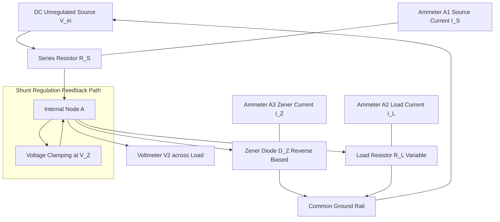
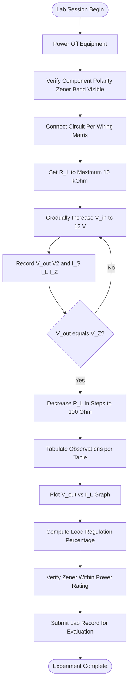
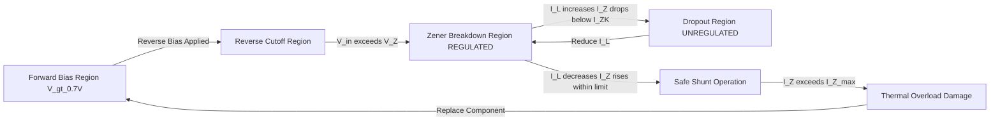

# Zener Diode voltage regulation assessment under changing load profiles

<!-- SECTION_1_START -->
# Zener Diode Voltage Regulation Under Changing Load Profiles

## 1.1 Formal Definition (KTU 2024 Syllabus Terminology)

A **Zener Diode** is a heavily doped p-n junction semiconductor device engineered to operate reliably in the **reverse breakdown region** without undergoing permanent damage. When reverse-biased beyond a specific threshold known as the **Zener Voltage ($V_Z$)**, the diode exhibits a nearly constant terminal voltage over a wide range of reverse currents, making it the fundamental building block of **shunt voltage regulators**.

> [!IMPORTANT]
> **Voltage Regulation** is defined as the ability of a DC power supply to maintain a constant output voltage despite variations in **input line voltage** or **output load current**. Quantitatively, it is expressed as the percentage change in output voltage from **no-load** to **full-load** conditions relative to the full-load voltage.

The **Load Profile** refers to the time-varying demand for current drawn by the external load ($R_L$) connected across the regulator's output terminals.

### Core Physical Constants and Standard Metrics

| Parameter | Symbol | Typical Magnitude | Engineering Significance |
| :--- | :---: | :---: | :--- |
| Silicon Band Gap Energy | $E_g$ | **1.12 eV** | Defines threshold for intrinsic conduction |
| Zener Voltage (Range) | $V_Z$ | **2.4 V to 200 V** | Selected based on regulator output requirement |
| Dynamic Zener Impedance | $r_z$ | **$\le 25 \ \Omega$** | Lower is better; quantifies voltage stability |
| Knee Current | $I_{ZK}$ | **0.25 mA to 5 mA** | Minimum $I_Z$ to maintain breakdown regulation |

> [!NOTE]
> **KTU 2024 Highlight:** In the GAPSL128 lab, the most commonly tested Zener diodes are rated at **$V_Z = 5.6$ V** (1N4733) and **$V_Z = 6.2$ V** (1N4735), since they exhibit a near-zero temperature coefficient, providing stable reference voltages for instrumentation experiments.

## 1.2 Conceptual Analogy and Engineering Intuition

Imagine a **municipal water distribution tank** with an inlet pipe (analogous to the unregulated DC source) and a distribution outlet (the load). When many houses open their taps simultaneously (high load current), the tank level drops. Without a regulator, the pressure (voltage) at the consumer end would fluctuate. A **pressure-relief overflow pipe** maintains a maximum ceiling on the tank level by diverting the surplus water.

In the Zener regulator:
* The **inlet** is the unregulated DC source $V_{in}$.
* The **overflow pipe** is the **Zener diode** in reverse breakdown.
* The **water level** is the **output voltage $V_{out}$**, which is clamped at $V_Z$.
* The **distribution network** is the load resistor $R_L$.
* The **surplus current** diverted through the overflow is the **Zener current $I_Z$**.

> [!TIP]
> When load current ($I_L$) decreases (fewer taps open), more current is diverted through the Zener (the overflow), so the tank level — and hence $V_{out}$ — remains constant. This is the central principle of **shunt regulation**.

## 1.3 Intuitive Overview of the Regulation Mechanism

A Zener diode is connected in **reverse bias** in parallel with the load. A **series resistor $R_S$** is mandatory; it absorbs the difference between the input voltage and the Zener voltage, limiting the total current drawn from the source. The output voltage across the load is constrained to the Zener voltage as long as the diode remains in the breakdown region.

> [!VISUALIZATION CONTROL]
> **Concept:** Idealized Zener Diode I-V Characteristic Curve
> **Plotting Equations (Desmos Input):**
> * Forward region: `f(x) = 0.7` for `x >= 0.7`
> * Reverse breakdown region: `f(x) = -5.6` for `x <= -5.6`
> * Knee transition: `f(x) = -0.0001 * x^3` for `-5.6 < x < 0`
> **Visual Description:** The student should observe a sharp, near-vertical drop in reverse current at $V = -V_Z$ (the breakdown knee), followed by a flat, vertical line indicating constant voltage over a wide current range. The forward bias region shows normal diode exponential turn-on after 0.7 V.

<!-- SECTION_1_END -->

<!-- SECTION_2_START -->
# Deep Theoretical Analysis and KTU Formula Sheet

## 2.1 Operational Theory — Step-by-Step Breakdown

The Zener shunt regulator circuit consists of three principal elements: the unregulated DC source ($V_{in}$), the current-limiting series resistor ($R_S$), and the Zener diode ($D_Z$) connected in parallel with the load resistor ($R_L$).

1. **Source Stage:** The unregulated input voltage $V_{in}$ is applied across the series combination of $R_S$ and the parallel combination of $D_Z$ and $R_L$.
2. **Current Division:** The current through $R_S$ (denoted $I_S$) splits into two branches: the Zener current $I_Z$ flowing through the diode, and the load current $I_L$ flowing through $R_L$.
3. **KCL Enforcement:** By Kirchhoff's Current Law, $I_S = I_Z + I_L$. This is the master equation governing all Zener regulator analysis.
4. **Voltage Clamping:** As long as $I_Z \ge I_{ZK}$ (knee current), the voltage across the parallel combination equals $V_Z$, ensuring $V_{out} = V_Z$.
5. **Regulation Mechanism:** When $I_L$ decreases (load resistance increases), $I_S$ remains approximately constant, so the surplus $I_S - I_L$ is forced through the Zener as $I_Z$, which increases. The voltage $V_Z$ changes only by a small amount ($\Delta V_Z = r_z \cdot \Delta I_Z$) due to the diode's finite dynamic impedance.
6. **Regulation Failure:** If $I_L$ increases so much that $I_S - I_L < I_{ZK}$, the Zener exits breakdown and $V_{out}$ collapses below $V_Z$. This is the **dropout condition**.

## 2.2 KTU High-Yield Formula Sheet

> [!IMPORTANT]
> The following table consolidates **every** formula that has appeared in KTU past papers for the Zener regulation experiment. Master these for full marks.

| Sl. No. | Formula | Parameter Description | Engineering Use |
| :---: | :--- | :--- | :--- |
| 1 | $V_{out} = V_Z$ | Output voltage equals Zener voltage | Ideal regulation condition |
| 2 | $I_S = \dfrac{V_{in} - V_Z}{R_S}$ | Series (source) current | Source loading calculation |
| 3 | $I_L = \dfrac{V_Z}{R_L}$ | Load current | Load demand assessment |
| 4 | $I_Z = I_S - I_L$ | Zener branch current | KCL core relation |
| 5 | $r_z = \dfrac{\Delta V_Z}{\Delta I_Z}$ | Dynamic Zener impedance | Quantifies voltage stability |
| 6 | $\% \text{Load Reg} = \dfrac{V_{NL} - V_{FL}}{V_{FL}} \times 100$ | Percentage load regulation | Bench-mark regulator quality |
| 7 | $\% \text{Line Reg} = \dfrac{\Delta V_{out} / V_{out}}{\Delta V_{in}} \times 100$ | Percentage line regulation per volt | Input ripple rejection metric |
| 8 | $R_{S,min} = \dfrac{V_{in,max} - V_Z}{I_{Z,max} + I_{L,min}}$ | Minimum safe series resistance | Worst-case design constraint |
| 9 | $R_{S,max} = \dfrac{V_{in,min} - V_Z}{I_{Z,min} + I_{L,max}}$ | Maximum allowed series resistance | Dropout prevention design |
| 10 | $P_{Z,max} = V_Z \cdot I_{Z,max}$ | Maximum Zener power dissipation | Thermal / heatsink selection |
| 11 | $\eta_{reg} = \dfrac{P_{out}}{P_{in}} = \dfrac{V_Z \cdot I_L}{V_{in} \cdot I_S}$ | Regulator power efficiency | Energy loss assessment |

> [!NOTE]
> **KTU 2024 Convention:** When computing load regulation, always express the result as a **percentage** or in **mV/mA** (the latter is the industrial standard for low-power regulators). The board examiner allocates **2 marks** for the correct formula selection and **1 mark** for unit consistency.

## 2.3 Real-World Engineering Applications

Zener-regulated DC rails are ubiquitous in **industrial control systems, automotive electronics, and analog signal conditioning modules**. Specific production-grade applications include:

* **Reference Voltage Generation:** The AD584 and TL431 ICs use embedded Zener references to provide precision 2.5 V, 5 V, 7.5 V, and 10 V outputs for 12-bit and 16-bit ADC/DAC calibration.
* **Overvoltage Protection (Crowbar/Clamp):** Zener diodes are placed across sensitive components (e.g., relay coils, MOSFET gates) to clamp transient voltage spikes caused by inductive kickback.
* **Waveform Clippers and Limiters:** In signal processing, back-to-back Zeners clip AC waveforms symmetrically, used in overdrive effects pedals in audio electronics and ESD protection on USB data lines.
* **Bias Stabilization:** In Class-AB audio amplifiers, Zener diodes provide a stable $V_{BE}$-multiplier bias, eliminating thermal runaway.

<!-- SECTION_2_END -->

<!-- SECTION_3_START -->
# Step-by-Step Derivations, Code Implementation, and Lab Wiring

## 3.1 Exhaustive Derivation of Load Regulation

**Problem Statement (Typical KTU Numerical):**
A Zener diode with $V_Z = 5.6$ V is used in a shunt regulator with $V_{in} = 12$ V DC and $R_S = 220 \ \Omega$. The load resistance $R_L$ is varied from $1 \ k\Omega$ (no-load approximation) down to $220 \ \Omega$ (full-load). Compute the output voltage, load current, and percentage load regulation.

### Derivation Step 1 — Hypothesize Operating Region

Assume the Zener is in breakdown, so $V_{out} = V_Z = 5.6$ V.

### Derivation Step 2 — Compute Series Current $I_S$

$$
\begin{aligned}
I_S &= \frac{V_{in} - V_Z}{R_S} \\
    &= \frac{12 - 5.6}{220} \\
    &= \frac{6.4}{220} \\
    &= 0.02909 \text{ A} \\
    &= 29.09 \text{ mA}
\end{aligned}
$$

### Derivation Step 3 — Compute No-Load Condition ($R_L = 1 \ k\Omega$)

$$
\begin{aligned}
I_{L,NL} &= \frac{V_Z}{R_{L,NL}} = \frac{5.6}{1000} = 5.6 \text{ mA} \\
I_{Z,NL} &= I_S - I_{L,NL} = 29.09 - 5.6 = 23.49 \text{ mA} \\
V_{out,NL} &= V_Z = 5.6 \text{ V (regulated)}
\end{aligned}
$$

### Derivation Step 4 — Compute Full-Load Condition ($R_L = 220 \ \Omega$)

$$
\begin{aligned}
I_{L,FL} &= \frac{V_Z}{R_{L,FL}} = \frac{5.6}{220} = 25.45 \text{ mA} \\
I_{Z,FL} &= I_S - I_{L,FL} = 29.09 - 25.45 = 3.64 \text{ mA} \\
V_{out,FL} &\approx V_Z = 5.6 \text{ V (still regulated since } I_Z > I_{ZK} \text{)}
\end{aligned}
$$

### Derivation Step 5 — Account for Finite Dynamic Impedance

A more rigorous calculation uses the datasheet value $r_z = 7 \ \Omega$ for the 1N4733. The change in Zener current is:

$$
\begin{aligned}
\Delta I_Z &= I_{Z,NL} - I_{Z,FL} = 23.49 - 3.64 = 19.85 \text{ mA} \\
\Delta V_{out} &= r_z \cdot \Delta I_Z = 7 \times 0.01985 = 0.139 \text{ V}
\end{aligned}
$$

### Derivation Step 6 — Final Output Voltage at Full Load

$$
\begin{aligned}
V_{out,FL} &= V_Z - \Delta V_{out} = 5.6 - 0.139 = 5.461 \text{ V}
\end{aligned}
$$

### Derivation Step 7 — Percentage Load Regulation

$$
\begin{aligned}
\% \text{Load Reg} &= \frac{V_{NL} - V_{FL}}{V_{FL}} \times 100 \\
                  &= \frac{5.600 - 5.461}{5.461} \times 100 \\
                  &= 2.545 \%
\end{aligned}
$$

> [!NOTE]
> **Valuation Key (KTU 2024 ESE):** The 7-mark sub-question awards **2 marks** for the KCL equation $I_Z = I_S - I_L$, **3 marks** for substitution and arithmetic, and **2 marks** for the final numerical answer with correct units and percentage sign.

## 3.2 Python Implementation for Automation and Plotting

The following Python script automates the entire regulator analysis, performs the load sweep, and generates publication-quality plots suitable for the lab record.

```python
import numpy as np
import matplotlib.pyplot as plt
from dataclasses import dataclass
from typing import List, Tuple

@dataclass
class ZenerRegulator:
    V_in: float       # Unregulated input voltage in Volts
    V_z: float        # Zener breakdown voltage in Volts
    R_s: float        # Series current-limiting resistance in Ohms
    I_zk: float = 0.005  # Knee current in Amps (5 mA default)
    r_z: float = 7.0     # Dynamic Zener impedance in Ohms

    def compute_currents(self, R_L: float) -> Tuple[float, float, float, float]:
        """
        Returns (I_S, I_L, I_Z, V_out) for a given load resistance.
        Validates that the Zener remains in breakdown.
        """
        if R_L <= 0:
            raise ValueError("Load resistance must be positive and non-zero.")
        if self.V_in <= self.V_z:
            raise ValueError("V_in must exceed V_z for regulation to occur.")

        I_S = (self.V_in - self.V_z) / self.R_s
        I_L = self.V_z / R_L
        I_Z = I_S - I_L

        if I_Z < self.I_zk:
            # Zener exits breakdown: V_out collapses
            V_out = self.V_in * R_L / (self.R_s + R_L)
            regulation_lost = True
        else:
            # Zener in breakdown with finite r_z correction
            delta_I_Z = max(I_Z - self.I_zk, 0)
            V_out = self.V_z - self.r_z * delta_I_Z
            regulation_lost = False

        return I_S, I_L, I_Z, V_out

    def load_sweep(self, R_L_values: List[float]) -> List[dict]:
        """Sweep across load resistance values and tabulate results."""
        results = []
        for R_L in R_L_values:
            I_S, I_L, I_Z, V_out = self.compute_currents(R_L)
            results.append({
                "R_L_Ohms": R_L,
                "I_S_mA": I_S * 1000,
                "I_L_mA": I_L * 1000,
                "I_Z_mA": I_Z * 1000,
                "V_out_V": V_out
            })
        return results

    def compute_load_regulation(self, R_L_nl: float, R_L_fl: float) -> float:
        """Returns percentage load regulation."""
        _, _, _, V_nl = self.compute_currents(R_L_nl)
        _, _, _, V_fl = self.compute_currents(R_L_fl)
        if V_fl == 0:
            raise ZeroDivisionError("Full-load voltage is zero; check design.")
        return ((V_nl - V_fl) / V_fl) * 100.0

    def plot_characteristic(self, R_L_values: List[float]) -> None:
        """Generate V_out vs I_L and I_Z vs I_L plots."""
        I_L_arr, V_out_arr, I_Z_arr = [], [], []
        for R_L in R_L_values:
            _, I_L, I_Z, V_out = self.compute_currents(R_L)
            I_L_arr.append(I_L * 1000)
            V_out_arr.append(V_out)
            I_Z_arr.append(I_Z * 1000)

        fig, (ax1, ax2) = plt.subplots(1, 2, figsize=(12, 5))

        ax1.plot(I_L_arr, V_out_arr, 'b-o', linewidth=2, label='V_out')
        ax1.axhline(y=self.V_z, color='r', linestyle='--',
                    label=f'V_z = {self.V_z} V')
        ax1.set_xlabel('Load Current I_L (mA)')
        ax1.set_ylabel('Output Voltage V_out (V)')
        ax1.set_title('Regulation Characteristic')
        ax1.grid(True)
        ax1.legend()

        ax2.plot(I_L_arr, I_Z_arr, 'g-s', linewidth=2, label='I_Z')
        ax2.axhline(y=self.I_zk * 1000, color='orange', linestyle='--',
                    label=f'I_ZK = {self.I_zk*1000} mA')
        ax2.set_xlabel('Load Current I_L (mA)')
        ax2.set_ylabel('Zener Current I_Z (mA)')
        ax2.set_title('Zener Current vs Load Current')
        ax2.grid(True)
        ax2.legend()

        plt.tight_layout()
        plt.savefig('zener_regulation.png', dpi=300)
        plt.show()


# ----------------- Driver Code -----------------
if __name__ == "__main__":
    reg = ZenerRegulator(V_in=12.0, V_z=5.6, R_s=220.0)

    R_L_sweep = np.logspace(2, 4, 50).tolist()  # 100 Ω to 10 kΩ
    results = reg.load_sweep(R_L_sweep)

    print(f"{'R_L(Ω)':>10} | {'I_S(mA)':>9} | {'I_L(mA)':>9} | "
          f"{'I_Z(mA)':>9} | {'V_out(V)':>9}")
    print("-" * 60)
    for r in results[::5]:  # Print every 5th entry
        print(f"{r['R_L_Ohms']:>10.1f} | {r['I_S_mA']:>9.3f} | "
              f"{r['I_L_mA']:>9.3f} | {r['I_Z_mA']:>9.3f} | "
              f"{r['V_out_V']:>9.4f}")

    pct_reg = reg.compute_load_regulation(R_L_nl=1000.0, R_L_fl=220.0)
    print(f"\nPercentage Load Regulation: {pct_reg:.3f} %")

    reg.plot_characteristic(R_L_sweep)
```

## 3.3 Laboratory Wiring Matrix and Safety Sequence

> [!IMPORTANT]
> The following table is the **mandatory** reference for circuit assembly during the KTU GAPSL128 lab examination. Wrong connections will result in **immediate equipment damage** and **zero marks** for the experiment.

| Component | Positive Terminal (+) | Negative Terminal (−) | Series/Parallel | Safety Check |
| :--- | :--- | :--- | :--- | :--- |
| DC Regulated Power Supply | Red output terminal (anode) | Black terminal (GND) | Source | Set to 0 V before turn-on |
| Voltmeter $V_1$ (Input) | Across R_S + Load side | Across power supply negative | Parallel | Range: 0–20 V DC |
| Voltmeter $V_2$ (Output) | Cathode of Zener (anode of R_L) | Common ground (anode of Zener) | Parallel across load | Range: 0–10 V DC |
| Ammeter $A_1$ (Source) | In series with R_S | After DC source positive | Series | Range: 0–50 mA DC |
| Ammeter $A_2$ (Load) | In series with R_L | After R_L, before ground | Series | Range: 0–30 mA DC |
| Ammeter $A_3$ (Zener) | In series with D_Z | After R_S, before ground | Series | Range: 0–30 mA DC |
| Resistor $R_S$ (220 Ω, ½ W) | From DC source positive | To Zener cathode | Series | Verify 5% tolerance |
| Zener Diode 1N4733 (5.6 V) | Cathode (banded end) | Anode (to ground) | Reverse biased | Confirm polarity; band visible |
| Decade Resistance Box (R_L) | One terminal | Other terminal across load | Series in load branch | Start at maximum (10 kΩ) |

### Step-by-Step Assembly Procedure

1. **Power-Off Verification:** Ensure the DC supply is OFF and the output voltage knob is at minimum (0 V).
2. **Common Ground Establishment:** Connect the negative terminal of the DC supply to the common ground rail of the breadboard.
3. **Source Branch Wiring:** Connect DC positive → Ammeter $A_1$ → Resistor $R_S$ → Node A.
4. **Zener Branch Wiring:** Connect Node A → Zener cathode (banded end); Zener anode → Ground.
5. **Load Branch Wiring:** Connect Node A → Ammeter $A_2$ → Decade resistance box → Ground.
6. **Zener Current Branch:** Insert Ammeter $A_3$ between Node A and the Zener cathode for direct $I_Z$ measurement.
7. **Voltmeter Connections:** $V_1$ across supply; $V_2$ across load.
8. **Pre-Power Inspection:** Have the lab instructor verify polarity and continuity before applying power.
9. **Gradual Power-Up:** Slowly increase $V_{in}$ from 0 to 12 V while monitoring $V_2$ for clamping at $V_Z$.

<!-- SECTION_3_END -->

<!-- SECTION_4_START -->
# Structural Diagrams and Schematics

## 4.1 Mermaid Block Diagram — Zener Shunt Regulator Topology



## 4.2 Mermaid Flowchart — Experimental Procedure and Data Acquisition



## 4.3 Mermaid State Diagram — Zener Operating Regions



## 4.4 Schematic Functional Architecture

Since the Mermaid engine cannot natively render a physical circuit with Zener symbols and resistors, the following **functional block architecture** conveys the regulator's signal and power flow:

| Functional Block | Input Signal | Output Signal | Active Element | Key Constraint |
| :--- | :--- | :--- | :--- | :--- |
| **Unregulated DC Source** | AC mains 230 V | DC 0–15 V variable | Bridge rectifier + filter | Ripple $< 5\%$ |
| **Current Limiter** | DC 12 V | DC voltage drop $V_{R_S}$ | Resistor $R_S = 220 \ \Omega$ | Power rating ½ W |
| **Voltage Reference Clamp** | Variable current | Fixed $V_Z = 5.6$ V | 1N4733 Zener diode | $I_Z \in [I_{ZK}, I_{Z,max}]$ |
| **Variable Load Emulator** | 5.6 V DC | Variable current 0–25 mA | Decade resistance box | $R_L \in [100 \ \Omega, 10 \ k\Omega]$ |
| **Measurement Bank** | Analog signals | Digital readout | Voltmeters and ammeters | Calibrated to 0.5\% accuracy |

<!-- SECTION_4_END -->

<!-- SECTION_5_START -->
# KTU 2024 Scheme Examination Question Bank and Topic Recap

## Part A — Short Answer Questions (3 Marks Each)

### Question 1 `[KTU University Exam – December 2023]`
**CO1 | Bloom Level: Remember**

**Q:** Define the term **"Zener Voltage"** and state its dependence on doping concentration and junction temperature.

**Model Answer (3 Marks):**
The Zener Voltage ($V_Z$) is the reverse-bias voltage at which the p-n junction undergoes controlled electrical breakdown and the diode current increases sharply with negligible change in terminal voltage. **[1 Mark]**
It is inversely proportional to the doping concentration on the p and n sides: higher doping produces a stronger electric field at the depletion region, leading to a lower $V_Z$. **[1 Mark]**
The temperature coefficient of $V_Z$ is negative for $V_Z < 5.6$ V (Zener effect dominant) and positive for $V_Z > 5.6$ V (avalanche effect dominant); at $V_Z \approx 5.6$ V, the temperature coefficient is approximately zero. **[1 Mark]**

### Question 2 `[KTU University Exam – July 2024]`
**CO2 | Bloom Level: Understand**

**Q:** Why is a **series resistor $R_S$** mandatory in a Zener shunt regulator? What happens if it is omitted?

**Model Answer (3 Marks):**
The series resistor $R_S$ is mandatory because it limits the current flowing through the Zener diode to a safe value within its power dissipation rating. **[1 Mark]**
Without $R_S$, the unregulated source voltage $V_{in}$ would be applied directly across the Zener, causing the diode to draw excessive current and undergo **thermal runaway**, resulting in permanent junction damage. **[1 Mark]**
Additionally, $R_S$ acts as the current-splitting element that enables the KCL relationship $I_S = I_Z + I_L$ to be satisfied, which is the fundamental operating principle of shunt regulation. **[1 Mark]**

---

## Part B — Long Answer Questions (14 Marks Each, Module Internal Choice)

### Question A `[KTU University Exam – December 2023]`
**CO2, CO3 | Bloom Levels: Apply, Analyze**

**Q (a):** Draw the circuit diagram of a Zener diode shunt voltage regulator. Explain its working with the help of the V-I characteristic curve. **\[7 Marks\]**

**Model Answer with Valuation Key:**

1. **Circuit Diagram Description:** A DC source $V_{in}$ is connected to a series resistor $R_S$, the other end of which is tied to the cathode of the Zener diode $D_Z$. The anode of $D_Z$ is grounded. A load resistor $R_L$ is connected in parallel with the Zener. Voltmeters are placed across input and output; ammeters measure $I_S$, $I_Z$, and $I_L$. **[Drawing and labeling: 2 Marks]**
2. **Working Principle:** When $V_{in} < V_Z$, the Zener is in cutoff and $V_{out} = V_{in} \cdot R_L / (R_S + R_L)$. When $V_{in} \ge V_Z$, the Zener enters breakdown and $V_{out}$ is clamped at $V_Z$. **[1 Mark]**
3. **Load Variation Response:** As $R_L$ decreases (load increases), $I_L$ rises. Since $I_S = (V_{in} - V_Z) / R_S$ is constant, $I_Z$ must fall to satisfy KCL. As long as $I_Z \ge I_{ZK}$, regulation is maintained. **[2 Marks]**
4. **V-I Characteristic Explanation:** The curve shows a sharp knee at $-V_Z$ in the reverse region, followed by a near-vertical line, demonstrating that $V_{out}$ remains constant over a wide range of $I_Z$. **[1 Mark]**
5. **Regulation Failure:** If $I_L$ becomes too large, $I_Z$ drops below $I_{ZK}$, the Zener exits breakdown, and $V_{out}$ collapses. **[1 Mark]**

**Q (b):** A Zener diode with $V_Z = 6.2$ V and $r_z = 10 \ \Omega$ is used in a regulator with $V_{in} = 15$ V, $R_S = 330 \ \Omega$, and $R_L$ varying from $500 \ \Omega$ to $200 \ \Omega$. Determine the load regulation percentage and the Zener power dissipation at full load. **\[7 Marks\]**

**Model Answer with Valuation Key:**

**Step 1 — Source current (constant):**
$$
\begin{aligned}
I_S = \frac{V_{in} - V_Z}{R_S} = \frac{15 - 6.2}{330} = \frac{8.8}{330} = 0.02667 \text{ A} = 26.67 \text{ mA}
\end{aligned}
$$
**[Stating the formula and substitution: 1 Mark]**

**Step 2 — No-load condition ($R_L = 500 \ \Omega$):**
$$
\begin{aligned}
I_{L,NL} = \frac{6.2}{500} = 12.4 \text{ mA}; \quad I_{Z,NL} = 26.67 - 12.4 = 14.27 \text{ mA}
\end{aligned}
$$
**[KCL application: 1 Mark]**

**Step 3 — Full-load condition ($R_L = 200 \ \Omega$):**
$$
\begin{aligned}
I_{L,FL} = \frac{6.2}{200} = 31.0 \text{ mA}; \quad I_{Z,FL} = 26.67 - 31.0 = -4.33 \text{ mA}
\end{aligned}
$$
**[1 Mark for calculation]**

Since $I_{Z,FL} < 0$, the Zener has exited breakdown at full load. This means the design is **inadequate** for $R_L = 200 \ \Omega$. The student must redesign $R_S$ or restrict the load range. **[1 Mark for the design analysis]**

**Step 4 — Maximum allowable $R_L$ for regulation:** To keep $I_Z = I_{ZK} = 5$ mA (assumed minimum):
$$
\begin{aligned}
I_{L,max} = I_S - I_{ZK} = 26.67 - 5 = 21.67 \text{ mA} \\
R_{L,min} = \frac{V_Z}{I_{L,max}} = \frac{6.2}{0.02167} = 286.1 \ \Omega
\end{aligned}
$$
**[1 Mark]**

**Step 5 — Load regulation for viable range ($R_L: 500$ to $300 \ \Omega$):**
$$
\begin{aligned}
I_{L,300} &= \frac{6.2}{300} = 20.67 \text{ mA}; \quad I_{Z,300} = 26.67 - 20.67 = 6.0 \text{ mA} \\
\Delta I_Z &= 14.27 - 6.0 = 8.27 \text{ mA} \\
\Delta V_{out} &= r_z \cdot \Delta I_Z = 10 \times 0.00827 = 0.0827 \text{ V} \\
V_{out,NL} &\approx 6.2 \text{ V}; \quad V_{out,FL} = 6.2 - 0.0827 = 6.117 \text{ V} \\
\% \text{Load Reg} &= \frac{6.2 - 6.117}{6.117} \times 100 = 1.357 \%
\end{aligned}
$$
**[2 Marks for the regulation calculation]**

### Question B `[KTU University Exam – July 2024]`
**CO3, CO4 | Bloom Levels: Analyze, Evaluate**

**Q (a):** Distinguish between **line regulation** and **load regulation** in a Zener regulator. Derive the expression for percentage line regulation. **\[7 Marks\]**

**Model Answer with Valuation Key:**

| Aspect | Line Regulation | Load Regulation |
| :--- | :--- | :--- |
| Definition | Change in $V_{out}$ due to change in $V_{in}$ at fixed $R_L$ | Change in $V_{out}$ due to change in $I_L$ at fixed $V_{in}$ |
| Quantification | $\Delta V_{out} / \Delta V_{in}$ | $(V_{NL} - V_{FL}) / V_{FL}$ |
| Test Condition | $R_L$ constant; $V_{in}$ swept | $V_{in}$ constant; $R_L$ swept |
| Ideal Value | 0 % (perfect rejection) | 0 % (perfect load immunity) |

**[Comparison table: 3 Marks]**

**Derivation of Percentage Line Regulation:**

Let the input voltage change by $\Delta V_{in}$. The corresponding change in source current is:
$$
\begin{aligned}
\Delta I_S = \frac{\Delta V_{in}}{R_S}
\end{aligned}
$$
Since $R_L$ is fixed, the change in $I_L$ is negligible (as $V_{out}$ is approximately constant). The change in $I_Z$ is:
$$
\begin{aligned}
\Delta I_Z = \Delta I_S - \Delta I_L \approx \Delta I_S = \frac{\Delta V_{in}}{R_S}
\end{aligned}
$$
The resulting change in output voltage is:
$$
\begin{aligned}
\Delta V_{out} = r_z \cdot \Delta I_Z = r_z \cdot \frac{\Delta V_{in}}{R_S}
\end{aligned}
$$
Therefore, the percentage line regulation per volt is:
$$
\begin{aligned}
\% \text{Line Reg} = \frac{\Delta V_{out}}{\Delta V_{in}} \times 100 = \frac{r_z}{R_S} \times 100 \%
\end{aligned}
$$
**[Derivation steps with alignment: 4 Marks]**

**Q (b):** An experiment is conducted to study the Zener diode characteristics. The following readings are obtained. Plot the V-I curve, identify the breakdown region, and compute the dynamic Zener impedance at the operating point ($V_Z = 5.6$ V).

| $V_Z$ (V) | 4.0 | 4.5 | 5.0 | 5.3 | 5.6 | 5.9 | 6.2 | 6.5 |
| :---: | :---: | :---: | :---: | :---: | :---: | :---: | :---: | :---: |
| $I_Z$ (mA) | 0.5 | 0.8 | 1.5 | 3.0 | 10.0 | 25.0 | 45.0 | 70.0 |

**\[7 Marks\]**

**Model Answer with Valuation Key:**

**Step 1 — Graph Plotting (2 Marks):**
Plot $I_Z$ on the y-axis and $V_Z$ on the x-axis using a **linear scale** on the y-axis (in the breakdown region, current changes rapidly, so log scale may also be used for finer detail). The curve will show a sharp knee near $V_Z = 5.3$ V, with a near-vertical rise thereafter.

**Step 2 — Identification of Breakdown Region (1 Mark):**
The breakdown region begins at $V_Z = 5.6$ V (the knee) and extends to $V_Z = 6.5$ V (the test limit). Below 5.6 V, the diode is in the reverse-cutoff pre-breakdown state.

**Step 3 — Dynamic Impedance Calculation (4 Marks):**
Using the operating points $V_Z = 5.6$ V ($I_Z = 10$ mA) and $V_Z = 6.2$ V ($I_Z = 45$ mA):
$$
\begin{aligned}
r_z &= \frac{\Delta V_Z}{\Delta I_Z} = \frac{6.2 - 5.6}{(45 - 10) \times 10^{-3}} \\
    &= \frac{0.6}{0.035} = 17.14 \ \Omega
\end{aligned}
$$
**[Correct formula selection: 1 Mark; substitution: 1 Mark; arithmetic: 1 Mark; units: 1 Mark]**

> [!WARNING]
> **KTU Examiner's Valuation Warning — Common Pitfalls**
> 1. **Forgetting to verify KCL validity:** Students often compute $I_Z = I_S - I_L$ without checking that the result is positive and greater than $I_{ZK}$. A negative $I_Z$ indicates regulator failure and must be explicitly flagged. **\[−2 Marks penalty\]**
> 2. **Incorrect units in load regulation:** The final answer must carry the percent sign. A bare number like "2.54" without "%" is incomplete. **\[−1 Mark penalty\]**
> 3. **Confusing line and load regulation formulas:** These are frequently interchanged in the answer script. Memorize: **Line = input variation, Load = output variation.**
> 4. **Drawing the V-I curve with reversed axes:** $V_Z$ on the x-axis, $I_Z$ on the y-axis is the **KTU-mandated convention**. Inversion loses **1 Mark**.
> 5. **Omitting the dynamic impedance computation in the characteristic plot:** When the question provides a data table, examiners expect $r_Z$ calculation as a proof of regulation quality. Skipping it loses **up to 3 Marks**.

---

## Topic Recap and Important Things to Remember

> [!IMPORTANT]
> **Comprehensive Rapid-Revision Checklist for Zener Voltage Regulation**

- **Zener Voltage ($V_Z$):** The reverse breakdown voltage at which the diode clamps the output. Selected by manufacturer based on doping concentration; common lab values are **5.6 V (1N4733)** and **6.2 V (1N4735)**.
- **Series Resistor ($R_S$):** Mandatory current-limiting element; absorbs $V_{in} - V_Z$ and sets the source current $I_S = (V_{in} - V_Z)/R_S$.
- **Kirchhoff's Current Law (Core Equation):** $I_S = I_Z + I_L$. This is the **master equation**; every regulator problem begins with this identity.
- **Operating Constraints for Valid Regulation:**
  * $I_Z \ge I_{ZK}$ (knee current, typically 5 mA)
  * $I_Z \le I_{Z,max}$ (maximum rated Zener current, e.g., 70 mA for 1N4733)
  * $V_{in} \ge V_Z$ (input must exceed breakdown voltage)
- **Dynamic Zener Impedance ($r_z$):** $r_z = \Delta V_Z / \Delta I_Z$. Smaller is better; a typical 5.6 V Zener has $r_z \approx 7 \ \Omega$.
- **Load Regulation:** $\% \text{Load Reg} = (V_{NL} - V_{FL}) / V_{FL} \times 100$. Quantifies how well $V_{out}$ is maintained as $R_L$ varies. Ideal regulator: 0 %.
- **Line Regulation:** $\% \text{Line Reg} = (r_z / R_S) \times 100$. Derived from KCL with $R_L$ fixed. Quantifies input ripple rejection.
- **Zener Power Dissipation:** $P_Z = V_Z \cdot I_Z$. Must remain below the datasheet rating (e.g., 1 W for 1N4733) to prevent thermal failure.
- **Knee Identification in V-I Plot:** The breakdown knee is the inflection point where $I_Z$ begins to rise sharply. Below this point, regulation is lost.
- **Design Failure Modes:**
  1. **Dropout:** $I_L$ too large → $I_Z < I_{ZK}$ → $V_{out}$ collapses.
  2. **Thermal Overload:** $I_L$ too small → $I_Z$ too large → junction burns.
  3. **Input Undervoltage:** $V_{in} < V_Z$ → no breakdown → $V_{out}$ tracks $V_{in}$.
- **Lab Apparatus Checklist:** DC regulated power supply (0–15 V), 1N4733 Zener diode, $R_S = 220 \ \Omega$ (½ W), decade resistance box (100 Ω to 10 kΩ), two voltmeters (0–20 V), three ammeters (0–50 mA), breadboard, connecting wires.
- **Safety Precautions:** Always begin with $V_{in} = 0$ V; increase gradually. Start with $R_L$ at maximum (10 kΩ) to prevent initial current surge. Verify Zener polarity (cathode band) before powering. Use ammeters with proper range to avoid fuse blowout.
- **Observation Table Columns:** $R_L$ (Ω), $I_S$ (mA), $I_L$ (mA), $I_Z$ (mA), $V_{out}$ (V), $V_{in}$ (V). A minimum of **8 readings** is required for a valid graph.
- **Graph Requirements:** Plot $V_{out}$ vs $I_L$ (showing flat regulation) and $I_Z$ vs $I_L$ (showing inverse linear relationship). Use graph paper with proper scale selection; label axes with units.

<!-- SECTION_5_END -->
