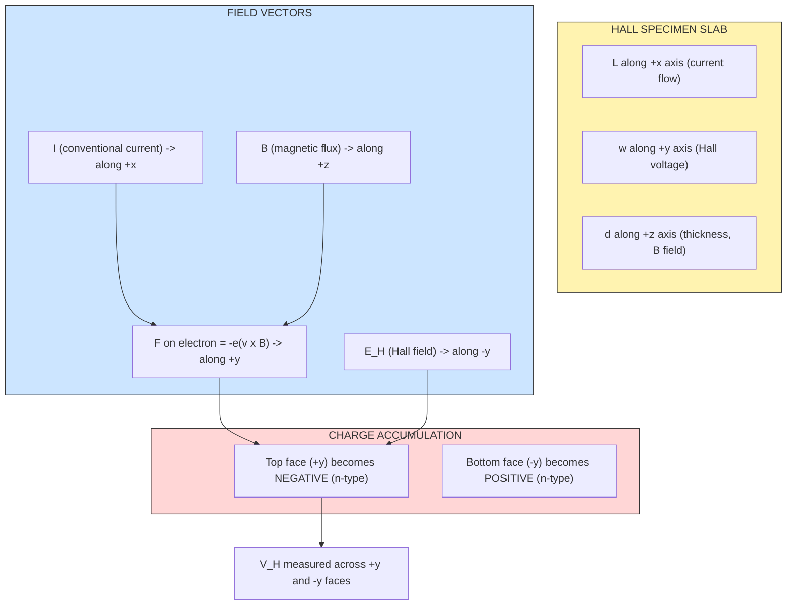
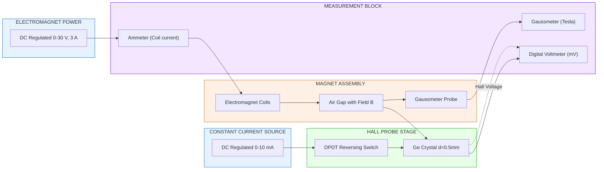
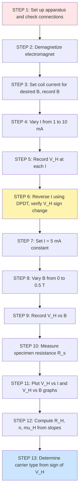
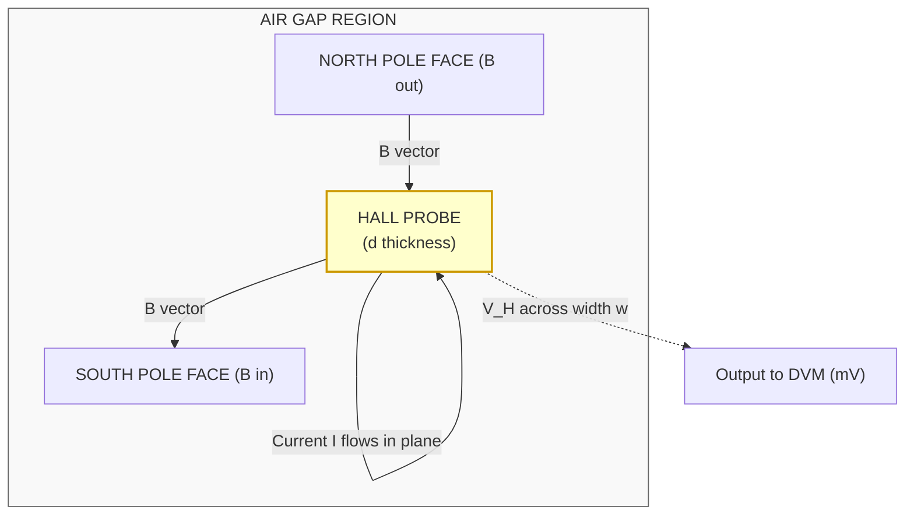

# Hall Effect

<!-- SECTION_1_START -->
# Hall Effect — Core Technical Definition & Intuitive Overview

## 1.1 Formal Academic Definition (KTU 2024 Syllabus Terminology)

> [!NOTE]
> **Hall Effect (KTU GAPSL128 — Module 2: Modern Physics & Electronics Experiments)**
> The **Hall Effect** is the transverse electromotive force (Hall Voltage, $V_H$) developed across a current-carrying conductor or semiconductor specimen when it is placed in a perpendicular magnetic field. The effect arises because charge carriers (electrons or holes) experience a **Lorentz force** that deflects them sideways, producing a measurable potential difference perpendicular to both the current and the magnetic field directions.

Mathematically, the steady-state condition gives the **Hall voltage**:

$$V_H \;=\; R_H \cdot \dfrac{I \cdot B}{d}$$

where the **Hall coefficient** $R_H$ is a material property defined as:

$$R_H \;=\; \dfrac{V_H \cdot d}{I \cdot B} \;=\; \dfrac{1}{n \cdot e}$$

Here, $n$ is the **charge-carrier concentration** (in m$^{-3}$), $e = 1.602 \times 10^{-19}$ C is the **elementary charge**, $I$ is the current through the specimen (A), $B$ is the magnetic flux density (T), and $d$ is the **thickness** of the specimen along the magnetic field direction (m).

## 1.2 Intuitive Real-World Analogy

Imagine a straight river flowing west-to-east (this is the **current $I$**). Now drop a strong magnet on the riverbank so its field points into the ground (perpendicular to flow — this is the **magnetic field $B$**). The water molecules, although neutral, are physically pushed sideways toward the south bank. After a short while, the south bank rises and the north bank drops — creating a "height difference" perpendicular to the flow.

That **height difference** is analogous to the **Hall voltage $V_H$**.

A second analogy: a **conveyor belt** (current) carrying balls (electrons) past a **wind blower** (magnetic field). The blower pushes balls sideways onto one side of the belt. The accumulation creates a measurable imbalance.

> [!IMPORTANT]
> **Why is this so important in KTU Physics Labs?**
> Because the Hall Effect is the **only direct experimental method** to determine:
> 1. The **sign** of the dominant charge carrier (n-type or p-type).
> 2. The **carrier concentration** $n$.
> 3. The **Hall mobility** $\mu_H = \sigma \cdot \vert R_H \vert$.
> Modern Hall sensors are in every smartphone (compass), BLDC motor, and current-clamp meter.

## 1.3 Physical Constants and Standard Metrics

| Symbol | Quantity | Standard Value / Unit |
|---|---|---|
| $e$ | Elementary charge | $\mathbf{1.602 \times 10^{-19}}$ C |
| $\mu_0$ | Permeability of free space | $4\pi \times 10^{-7}$ H/m |
| $B$ | Magnetic flux density | Tesla (T) = 10$^4$ Gauss |
| $V_H$ | Hall voltage | typically mV range |
| $n$ | Carrier concentration | 10$^{21}$–10$^{25}$ m$^{-3}$ |
| $\mu_H$ | Hall mobility | cm$^2$/(V·s) |

> [!VISUALIZATION CONTROL]
> **Concept:** Lorentz deflection + accumulation of charge on one face of the conductor.
> **GeoGebra / Desmos Input Equations (parametric sketch):**
> * `v = (1, 0)` — velocity vector of carriers (along +x)
> * `B = (0, 0, 1)` — magnetic field along +z
> * `F = q*(v × B) = q*(1,0,0) × (0,0,1) = q*(0,-1,0)` — force along -y
> * Plate at $y = +d/2$ accumulates negative charge → top face becomes negative (n-type).
> **Visual Description:** A rectangular slab oriented along x-axis with arrows showing current $I$ in +x, field $B$ in +z, force on electrons in -y, Hall voltage $V_H$ measured across y-faces.

<!-- SECTION_1_END -->

<!-- SECTION_2_START -->
# Deep Theoretical Analysis & KTU High-Yield Formula Sheet

## 2.1 Physical Mechanism — Step-by-Step

1. **Initial State:** A semiconductor slab of dimensions length $L$, width $w$, thickness $d$ carries a steady current $I$ along the +x direction. No magnetic field is applied.

2. **Applying Magnetic Field:** A uniform field $\vec{B}$ is switched on along the +z direction (perpendicular to the largest face).

3. **Lorentz Force Acts:** Each moving charge $q$ moving with drift velocity $\vec{v}_d$ experiences a force
   $$\vec{F}_L = q(\vec{v}_d \times \vec{B})$$

4. **Charge Accumulation:** Carriers are pushed toward one face of the specimen. They pile up until the **transverse Hall electric field** $E_H$ produces a balancing Coulomb force.

5. **Steady State Condition:** $qE_H = qv_d B$ → $E_H = v_d B$

6. **Hall Voltage Output:** Since $V_H = E_H \cdot w$ and $I = nqv_d \cdot (w \cdot d)$,
   $$V_H = \dfrac{I \cdot B}{n \cdot e \cdot d}$$

7. **Sign of $V_H$:**
   * **n-type** (electrons, $q = -e$): $V_H$ is **negative** (Hall field opposes $v \times B$).
   * **p-type** (holes, $q = +e$): $V_H$ is **positive**.
   * By **reversing $I$** or $B$ and observing the **sign change** of $V_H$, the carrier type is identified.

> [!IMPORTANT]
> **Engineering Insight:** Hall sensors used in industry are usually made of **InSb**, **GaAs**, or **InAs** because they have very high electron mobility (~10$^4$ cm$^2$/V·s) and produce a large $V_H$ even for weak fields — making them ideal for low-field magnetic sensing.

## 2.2 KTU Formula Cheat Sheet

| # | Formula | Meaning | Units |
|---|---|---|---|
| 1 | $V_H = R_H \dfrac{IB}{d}$ | Hall voltage | V |
| 2 | $R_H = \dfrac{V_H \cdot d}{I \cdot B}$ | Hall coefficient (from experiment) | m$^3$/C |
| 3 | $R_H = \dfrac{1}{n \cdot e}$ | Theoretical Hall coefficient | m$^3$/C |
| 4 | $n = \dfrac{1}{\vert R_H \vert \cdot e}$ | Carrier concentration | m$^{-3}$ |
| 5 | $\mu_H = \sigma \cdot \vert R_H \vert$ | Hall mobility | m$^2$/(V·s) |
| 6 | $\sigma = \dfrac{1}{\rho} = \dfrac{L}{R_s \cdot w \cdot d}$ | Electrical conductivity | S/m |
| 7 | $V_H = \dfrac{B}{n \cdot e \cdot d} \cdot I$ | Linear relation with $I$ | V |
| 8 | $R_H = \dfrac{V_H \cdot d \cdot 10^4}{I \cdot B \cdot 10^{-4}}$ (cgs) | CGS form | cm$^3$/C |

> **Conversion Tip:** $1 \text{ cm}^3/\text{C} = 10^{-6} \text{ m}^3/\text{C}$. If your lab manual reports $B$ in Gauss, convert using $1 \text{ T} = 10^4$ Gauss.

## 2.3 Real-World Engineering Utility

| Domain | Application |
|---|---|
| **Automotive** | Crankshaft position sensors, throttle position sensing |
| **Power Electronics** | Isolated current sensing in SMPS, inverters |
| **Consumer Electronics** | Compass in smartphones (3-axis Hall IC) |
| **Industrial** | Proximity switches, brushless DC motor commutation |
| **Research** | Mapping magnetic fields of magnets, plasma diagnostics |
| **Aerospace** | Non-contacting potentiometers, rotation sensors |

The lab experiment trains you to extract three figures of merit of a semiconductor — the **carrier type, concentration, and mobility** — which are the most fundamental electrical properties of any modern device material.

<!-- SECTION_2_END -->

<!-- SECTION_3_START -->
# Step-by-Step Derivations, Sample Calculations & Lab Implementation

## 3.1 Theoretical Derivation of Hall Voltage

Consider a rectangular n-type semiconductor slab of length $L$ (along x), width $w$ (along y), and thickness $d$ (along z).

**Step 1:** Current $I$ flows along +x. The drift velocity of electrons is along $-x$ (opposite to conventional current).

$$\vec{v}_d = -\hat{x} \, v_d, \qquad I = n e A v_d = n e \, (w d) v_d$$

**Step 2:** Solve for $v_d$:

$$v_d = \dfrac{I}{n e w d}$$

**Step 3:** Magnetic field $\vec{B} = B \hat{z}$ is applied. Lorentz force on an electron ($q = -e$):

$$\vec{F}_L = (-e)(\vec{v}_d \times \vec{B}) = (-e)(-v_d \hat{x} \times B\hat{z}) = (-e)(v_d B)(\hat{x} \times \hat{z}) = (-e)(v_d B)(-\hat{y}) = +e v_d B \hat{y}$$

**Step 4:** Electrons accumulate on the +y face. A transverse electric field $\vec{E}_H$ builds up pointing from +y to -y (i.e. $-\hat{y}$).

**Step 5:** In steady state, electric force balances Lorentz force:

$$e E_H = e v_d B \quad \Rightarrow \quad E_H = v_d B$$

**Step 6:** Hall voltage is the potential difference between the two y-faces, separated by distance $w$:

$$V_H = E_H \cdot w = v_d B w$$

**Step 7:** Substitute $v_d = \dfrac{I}{nedw}$:

$$V_H = \dfrac{I}{n e d w} \cdot B w = \dfrac{I B}{n e d}$$

**Step 8:** Define Hall coefficient:

$$\boxed{\,R_H = \dfrac{1}{n e} \quad \Rightarrow \quad V_H = R_H \cdot \dfrac{I B}{d}\,}$$

**Step 9:** Hall mobility (combining conductivity and Hall coefficient):

$$\mu_H = \dfrac{v_d}{E_x} = \dfrac{\sigma}{n e} = \sigma \, R_H$$

## 3.2 Sample Numerical Calculation (Typical KTU Lab Value)

**Given:**
* Specimen thickness $d = 0.5 \text{ mm} = 5 \times 10^{-4}$ m
* Current $I = 5.0$ mA $= 5 \times 10^{-3}$ A
* Magnetic field $B = 0.3$ T
* Measured Hall voltage $V_H = 6.25$ mV $= 6.25 \times 10^{-3}$ V

**Step 1 — Hall Coefficient:**

$$R_H = \dfrac{V_H \cdot d}{I \cdot B} = \dfrac{(6.25 \times 10^{-3})(5 \times 10^{-4})}{(5 \times 10^{-3})(0.3)}$$

$$R_H = \dfrac{3.125 \times 10^{-6}}{1.5 \times 10^{-3}} = 2.083 \times 10^{-3} \text{ m}^3/\text{C}$$

**Step 2 — Carrier Concentration:**

$$n = \dfrac{1}{\vert R_H \vert \cdot e} = \dfrac{1}{(2.083 \times 10^{-3})(1.602 \times 10^{-19})}$$

$$n = \dfrac{1}{3.337 \times 10^{-22}} = 2.997 \times 10^{21} \text{ m}^{-3}$$

**Step 3 — Convert to cm$^{-3}$ (KTU often asks):**

$$n = 2.997 \times 10^{21} \times 10^{-6} = 2.997 \times 10^{15} \text{ cm}^{-3}$$

**Step 4 — Hall Mobility (assuming $\sigma = 200$ S/m for a lightly doped n-Ge sample):**

$$\mu_H = \sigma \cdot \vert R_H \vert = 200 \times 2.083 \times 10^{-3} = 0.4166 \text{ m}^2/(\text{V·s})$$

$$\mu_H = 0.4166 \times 10^4 = 4166 \text{ cm}^2/(\text{V·s})$$

> [!IMPORTANT]
> **Sign of $V_H$ test for carrier type:**
> * If reversing $I$ flips the **sign of $V_H$** (with $B$ fixed) → **n-type** material.
> * If the sign **does not flip on reversing $B$ but flips on reversing $I$** → use vector sign convention: n-type gives **negative** $R_H$, p-type gives **positive** $R_H$.

## 3.3 Laboratory Implementation — Component & Wiring Matrix

> **Specification Reference:** KTU GAPSL128 standard Hall Effect kit (SES Instruments / Scientech / Equivalent)

### 3.3.1 Component Pin Configuration Table

| Component | Pin / Terminal Label | Function | Connection |
|---|---|---|---|
| **Hall Probe** (Ge/InSb) | Red (A) | Current input + | To + terminal of constant-current source |
| **Hall Probe** | Black (B) | Current output – | To – terminal of current source |
| **Hall Probe** | Yellow (C) | Hall voltage + | To + input of digital voltmeter (DVM) |
| **Hall Probe** | Yellow (D) | Hall voltage – | To – input of DVM |
| **Electromagnet Coil** | Coil 1 & Coil 2 | Field generation | To variable DC power supply (0–30 V, 2 A) |
| **Gaussmeter Probe** | Tip | B-field sensing | Inserted in air-gap of electromagnet |
| **Constant Current Source** | OUT + / – | Stable $I$ | Connects to Hall probe current leads |
| **Digital Voltmeter** | V / COM | Measures $V_H$ | High-impedance (≥ 10 MΩ) |
| **Rheostat** | 100 Ω / 2 A | Vary $I$ | In series with current source |
| **Commutator Switch** | DPDT | Reverse $I$ direction | Used for sign-of-carrier test |

### 3.3.2 Required Tool & Equipment Profile

| Tool / Equipment | Range / Spec | Quantity |
|---|---|---|
| Hall Effect experimental board | Ge crystal, $d = 0.5$ mm, $w = 4$ mm | 1 |
| Electromagnet with pole pieces | $B$ up to **0.5 T** at 10 mm air gap | 1 |
| Constant current source | 0–10 mA, resolution 0.01 mA | 1 |
| Gaussmeter / Teslameter | 0–2 T, transverse Hall probe | 1 |
| Digital voltmeter | 0–200 mV, input Z ≥ 10 MΩ | 1 |
| Regulated DC power supply | 0–30 V, 3 A | 1 |
| Connecting wires (banana) | Red, Black, Yellow | 6 pairs |
| DPDT switch | 6 A rating | 1 |

### 3.3.3 Exact Hardware Wiring Sequence

1. **Step 1** — Mount the Hall probe on the **non-magnetic probe-holder** (e.g. brass rod) and place it centrally between the **pole pieces of the electromagnet**.
2. **Step 2** — Connect the **current leads (Red A, Black B)** of the Hall probe to the constant current source output. Insert the **DPDT commutator** in series to allow current reversal.
3. **Step 3** — Connect the **voltage leads (Yellow C, Yellow D)** of the Hall probe to the **DVM** in the **mV range**. Do **not** connect the voltmeter across the current leads.
4. **Step 4** — Wire the **electromagnet coils** in **series** to the variable DC power supply. Insert an ammeter in series.
5. **Step 5** — Position the **Gaussmeter probe** flush on top of the Hall probe inside the air gap (transverse orientation).
6. **Step 6** — Earth the chassis of the electromagnet and the power supplies.

### 3.3.4 Safety Monitoring Steps

> [!WARNING]
> **Lab Safety — Read Before Switching On**
> 1. **Never exceed 10 mA** through the Hall probe — the Ge crystal is fragile and may burn out.
> 2. **Do not exceed the rated coil current** of the electromagnet (typically 2 A). Overheating can melt the coil insulation.
> 3. **Switch off the electromagnet** whenever the Hall probe is being inserted or removed.
> 4. **Wait 2 minutes** after switching off the electromagnet — residual magnetism can give spurious readings.
> 5. **Demagnetize** the electromagnet before starting a new run by slowly ramping $I$ to zero.
> 6. **Wear insulating gloves** when handling the pole pieces — they may be hot.

### 3.3.5 Step-by-Step Experimental Procedure (Observation Sheet)

**Set A — Calibration: $V_H$ vs Current $I$ (constant $B$)**
1. Set electromagnet current to a fixed value (e.g. 0.5 A) → measure $B$ with Gaussmeter and record.
2. Set Hall probe current $I = 1$ mA. Wait 30 s for thermal stability. Read $V_H$.
3. Increment $I$ in steps of 1 mA up to 10 mA. Record 10 readings.
4. Reverse current direction using DPDT. Take one reading at $I = 5$ mA to confirm sign of $V_H$.

**Set B — Calibration: $V_H$ vs Magnetic Field $B$ (constant $I$)**
1. Set Hall probe current $I = 5$ mA. Hold constant.
2. Vary electromagnet current from 0 to 1.5 A in steps of 0.1 A. Measure $B$ and $V_H$ at each step.
3. Reverse field by swapping magnet supply leads. Take one reading at $I_{coil} = 0.5$ A for carrier sign test.

**Set C — Resistivity of Specimen (for mobility calculation)**
1. Without magnetic field, measure resistance $R_s$ of the Hall probe using a 4-probe method or known $L, w, d$.
2. Compute $\sigma = L / (R_s \cdot w \cdot d)$.

### 3.3.6 Graph Plotting Requirements

| Graph | X-axis | Y-axis | Expected Slope |
|---|---|---|---|
| Set A | $I$ (mA) | $V_H$ (mV) | $\dfrac{R_H \cdot B}{d}$ → linear, $R^2 \geq 0.99$ |
| Set B | $B$ (T) | $V_H$ (mV) | $\dfrac{R_H \cdot I}{d}$ → linear, $R^2 \geq 0.99$ |

From slope of Set A: $R_H = (\text{slope} \cdot d) / B$
From slope of Set B: $R_H = (\text{slope} \cdot d) / I$

> **Valuation Key Point:** A best-fit line through origin is expected. If the line does not pass through origin, check for **thermoelectric EMF offsets** and **misalignment voltage** (Ettinghausen effect).

<!-- SECTION_3_END -->

<!-- SECTION_4_START -->
# Structural Diagrams & Schematics

## 4.1 Hall Probe Geometry and Coordinate System

## 4.2 Block-Level Experimental Setup Architecture

## 4.3 Sequential Processing Topology — Experimental Logic

## 4.4 Cross-Section Schematic — Probe Inside Air Gap

<!-- SECTION_4_END -->

<!-- SECTION_5_START -->
# KTU 2024 Scheme Examination Question Bank & Topic Recap

---

## 5.1 Part A — Short Answer Questions (3 Marks Each)

> **Q1. [KTU University Exam – July 2023, Model Question Paper GAPSL128, CO1, Remember]**
> **Define the Hall Effect. Name the quantity that can be directly determined using the Hall Effect experiment that cannot be determined by simple resistivity measurements.**

**Model Answer (3 Marks):**

> [!NOTE]
> *The Hall Effect is the generation of a transverse electromotive force (Hall voltage $V_H$) across a conductor or semiconductor carrying current $I$ when placed in a perpendicular magnetic field $B$.* **[1 Mark]**
> *It is caused by the deflection of charge carriers by the Lorentz force $F = q(v \times B)$, leading to charge accumulation on the faces perpendicular to both $I$ and $B$.* **[1 Mark]**
> *The **sign of the dominant charge carrier (n-type or p-type)** is the key information obtainable from the Hall Effect that cannot be obtained from resistivity measurements. Carrier concentration $n$ and Hall mobility $\mu_H$ are the other two unique outputs.* **[1 Mark]**

---

> **Q2. [KTU University Exam – Dec 2023, CO1, Understand]**
> **State the formula for the Hall coefficient. What does its sign indicate?**

**Model Answer (3 Marks):**

*Hall coefficient: $R_H = \dfrac{V_H \cdot d}{I \cdot B} = \dfrac{1}{n e}$* **[1 Mark]**

*Sign of $R_H$:*
* *Negative for **n-type** semiconductors (electrons are majority carriers, $q = -e$).* **[1 Mark]**
* *Positive for **p-type** semiconductors (holes are majority carriers, $q = +e$).* **[1 Mark]**

---

## 5.2 Part B — Long Answer Questions (14 Marks, Internal Choice)

### Question A (Option 1) — Comprehensive KTU Pattern

> **[KTU University Exam – July 2024, CO2 + CO3, Apply + Analyze]**
>
> **Q.A.** **(a)** Derive an expression for the Hall voltage in a rectangular semiconductor slab of thickness $d$ carrying current $I$ in a perpendicular magnetic field $B$. Show that the Hall coefficient is $R_H = 1/(ne)$. **(7 Marks)**
>
> **(b)** In a Hall Effect experiment, a Ge specimen of thickness $d = 0.5$ mm carries a current $I = 5$ mA. When a magnetic field $B = 0.3$ T is applied, the Hall voltage is $V_H = 6.25$ mV. Calculate the **Hall coefficient, carrier concentration, and Hall mobility** given that the conductivity of Ge is $\sigma = 200$ S/m. **(7 Marks)**

#### Model Solution — Part (a) [7 Marks]

> **Valuation Key Distribution:**
> * Statement of geometry and force equation: **2 Marks**
> * Deriving the steady-state condition: **3 Marks**
> * Final expression and Hall coefficient: **2 Marks**

**1. Geometry:** Consider an n-type semiconductor slab of length $L$ (x-axis), width $w$ (y-axis), thickness $d$ (z-axis). Current $I$ flows along +x, magnetic field $\vec{B} = B\hat{z}$ is along +z. **[1 Mark]**

**2. Drift velocity:** Since $I = n e A v_d = n e (w d) v_d$, we have $v_d = \dfrac{I}{n e w d}$. **[1 Mark]**

**3. Lorentz force on an electron ($q = -e$):**

$$\vec{F}_L = -e (\vec{v}_d \times \vec{B}) = -e(-v_d \hat{x} \times B\hat{z}) = -e(-v_d B)(\hat{y}) = +e v_d B \hat{y}$$

So electrons drift toward the +y face. **[1 Mark]**

**4. Charge accumulation creates a transverse Hall field $E_H$ in the −y direction (since +y face becomes negative).** In steady state, electric force balances magnetic force: **[1 Mark]**

$$e E_H = e v_d B \quad \Rightarrow \quad E_H = v_d B$$

**5. Hall voltage measured across width $w$:** $V_H = E_H \cdot w = v_d B w$. Substituting $v_d$: **[1 Mark]**

$$V_H = \dfrac{I B}{n e d}$$

**6. Hall coefficient is defined as:** $R_H = \dfrac{V_H \cdot d}{I \cdot B} = \dfrac{1}{n e}$. **[2 Marks]**

$$\boxed{\,R_H = \dfrac{1}{n e}\,}$$

#### Model Solution — Part (b) [7 Marks]

> **Valuation Key Distribution:**
> * Substituting into $R_H$ formula: **2 Marks**
> * Carrier concentration $n$ calculation: **2 Marks**
> * Hall mobility using $\mu_H = \sigma R_H$: **3 Marks**

**Given:** $d = 0.5 \text{ mm} = 5 \times 10^{-4}$ m, $I = 5 \text{ mA} = 5 \times 10^{-3}$ A, $B = 0.3$ T, $V_H = 6.25$ mV $= 6.25 \times 10^{-3}$ V, $\sigma = 200$ S/m.

**Step 1 — Hall Coefficient:** **[2 Marks]**

$$R_H = \dfrac{V_H \cdot d}{I \cdot B} = \dfrac{(6.25 \times 10^{-3})(5 \times 10^{-4})}{(5 \times 10^{-3})(0.3)}$$

$$R_H = \dfrac{3.125 \times 10^{-6}}{1.5 \times 10^{-3}} = 2.083 \times 10^{-3} \text{ m}^3/\text{C}$$

**Step 2 — Carrier Concentration:** **[2 Marks]**

$$n = \dfrac{1}{R_H \cdot e} = \dfrac{1}{(2.083 \times 10^{-3})(1.602 \times 10^{-19})} = 2.997 \times 10^{21} \text{ m}^{-3}$$

**Step 3 — Hall Mobility:** **[3 Marks]**

$$\mu_H = \sigma \cdot R_H = 200 \times 2.083 \times 10^{-3} = 0.4167 \text{ m}^2/(\text{V·s})$$

Converting to cgs (commonly used in textbooks): $\mu_H = 0.4167 \times 10^4 = 4166.7 \text{ cm}^2/(\text{V·s})$.

$$\boxed{\,R_H = 2.083 \times 10^{-3} \text{ m}^3/\text{C}, \quad n = 2.997 \times 10^{21} \text{ m}^{-3}, \quad \mu_H = 0.4167 \text{ m}^2/(\text{V·s})\,}$$

---

### Question B (Option 2 — Internal Choice Alternative)

> **[KTU University Exam – July 2024, CO2 + CO3, Apply + Analyze]**
>
> **Q.B.** **(a)** Explain with a neat diagram the **experimental setup** to measure the Hall voltage. List the **precautions** to be taken. **(7 Marks)**
>
> **(b)** Discuss the **significance of the Hall Effect** in determining (i) carrier type, (ii) carrier concentration, and (iii) Hall mobility. Why are semiconductors (not metals) preferred as Hall probes? **(7 Marks)**

#### Model Solution — Part (a) [7 Marks]

> **Valuation Key Distribution:**
> * Block diagram / circuit explanation: **4 Marks**
> * Procedure / precautions: **3 Marks**

**Apparatus:** Hall probe (Ge crystal), electromagnet with pole pieces, constant current source (0–10 mA), DC power supply for electromagnet, Gaussmeter, digital millivoltmeter, DPDT switch, rheostat.

**Circuit Description:** The Hall probe is mounted in the air gap of the electromagnet. A constant current $I$ from a regulated source is passed through the current leads (A, B) of the probe. The transverse Hall voltage is picked up from the voltage leads (C, D) and fed to a high-impedance digital voltmeter (input impedance ≥ 10 MΩ). The electromagnet is energized by a separate DC supply, and $B$ is measured by a transverse Gaussmeter probe. **[4 Marks]**

**Procedure & Precautions:** **[3 Marks]**
1. Place the Hall probe exactly at the center of the pole gap for uniform field.
2. Use a high-impedance voltmeter to avoid loading errors.
3. Keep the current low (≤ 10 mA) to avoid heating the probe.
4. Demagnetize the electromagnet before starting.
5. Use a DPDT switch to reverse $I$ — observe sign change of $V_H$ to confirm carrier type.
6. The probe's flat face must be perpendicular to $\vec{B}$ (i.e. current flow is along the longest dimension, $\vec{B}$ along the thinnest dimension).

#### Model Solution — Part (b) [7 Marks]

> **Valuation Key Distribution:**
> * Carrier type from sign: **2 Marks**
> * Carrier concentration from magnitude: **2 Marks**
> * Hall mobility + semiconductor preference: **3 Marks**

**(i) Carrier Type:** When $I$ is reversed, the sign of $V_H$ changes. If $R_H$ is computed and found **negative**, the material is **n-type** (electrons are majority). If $R_H$ is **positive**, the material is **p-type** (holes majority). This is the only direct way to identify the dominant charge carrier. **[2 Marks]**

**(ii) Carrier Concentration:** From $R_H = 1/(ne)$, the magnitude of $R_H$ directly gives $n = 1/(\vert R_H \vert e)$. This is more reliable than estimating $n$ from conductivity alone. **[2 Marks]**

**(iii) Hall Mobility:** Combining the Hall coefficient with the conductivity measurement:
$$\mu_H = \dfrac{\sigma}{n e} = \sigma \vert R_H \vert$$
gives the **Hall mobility** — a key figure of merit for semiconductor device design. **[1 Mark]**

**Why Semiconductors, Not Metals:** **[2 Marks]**
* Metals have $n \sim 10^{28}$ m$^{-3}$, so $R_H \sim 10^{-10}$ m$^3$/C → $V_H$ is in the **nanovolt** range, undetectable.
* Semiconductors have $n \sim 10^{21}$ m$^{-3}$ → $R_H \sim 10^{-3}$ m$^3$/C → $V_H$ is in the **millivolt** range, easily measurable.
* Therefore, doped semiconductors (Ge, Si, InSb, GaAs) are the practical choice for Hall probes.

---

> [!WARNING]
> **KTU Examiner's Valuation Warning — Common Pitfalls**
> 1. **Forgetting unit conversion:** $d$ must be in **metres** when using SI; if $B$ is in Gauss, convert to Tesla first.
> 2. **Sign of $R_H$:** Many students write $R_H = 1/ne$ without absolute value. For n-type materials, $R_H$ is **negative** because $e$ is the elementary magnitude but the charge of an electron is $-e$. The KTU answer key deducts **½ mark** if sign is missed.
> 3. **Confusing Hall mobility with drift mobility:** They differ by the **Hall factor** $r_H$ (≈ 1.93 for acoustic phonon scattering, ≈ 1 for ionized impurity scattering). For lab purposes, assume $r_H = 1$.
> 4. **Not plotting $V_H$ vs $I$ at constant $B$:** Graph must be a **straight line through origin**. Non-zero intercept indicates **misalignment voltage** which must be subtracted.
> 5. **Forgetting to convert $\mu_H$ to cm$^2$/(V·s):** KTU answer scripts often require the cgs form. Use $1 \text{ m}^2/(\text{V·s}) = 10^4 \text{ cm}^2/(\text{V·s})$.
> 6. **Wrong orientation of probe:** The face of the probe with $d$-dimension must be perpendicular to $\vec{B}$. If rotated 90°, the formula breaks down. Always orient the **thinnest dimension along $\vec{B}$**.

---

## 5.3 Topic Recap & Important Things to Remember

> [!IMPORTANT]
> **Rapid Revision Checklist — Hall Effect (KTU GAPSL128 Module 2)**

* **Core formula:** $V_H = R_H \dfrac{IB}{d}$ — memorize the four symbols and their units.
* **Hall coefficient:** $R_H = 1/(ne)$ — sign tells carrier type, magnitude gives $n$.
* **Carrier concentration:** $n = 1/(\vert R_H \vert e) = 6.25 \times 10^{18}/R_H$ (with $R_H$ in m$^3$/C and $n$ in cm$^{-3}$) — useful shortcut.
* **Hall mobility:** $\mu_H = \sigma \vert R_H \vert$ — combines two independent measurements.
* **Elementary charge:** $e = 1.602 \times 10^{-19}$ C.
* **Tesla ↔ Gauss:** $1$ T $= 10^4$ G.
* **n-type vs p-type:** Negative $R_H$ → n-type; Positive $R_H$ → p-type.
* **Slope method:** From $V_H$ vs $I$ graph at constant $B$, $R_H = (\text{slope} \cdot d)/B$.
* **Slope method:** From $V_H$ vs $B$ graph at constant $I$, $R_H = (\text{slope} \cdot d)/I$.
* **Specimens used:** Ge, Si, InSb, GaAs, InAs — semiconductors, not metals.
* **Geometric rule:** Current $\perp$ Voltage leads $\perp$ Magnetic field — three mutually perpendicular axes (x, y, z).
* **Precautions:** Demagnetize magnet, low current ≤ 10 mA, high-impedance voltmeter, exact center of pole gap.
* **Graphs required (Lab Record):** $V_H$ vs $I$ (linear, through origin), $V_H$ vs $B$ (linear, through origin).
* **Engineering applications:** Magnetic field sensors, BLDC motor commutation, smartphone compass, current clamps.
* **Related effects (don't confuse):** Ettinghausen effect (temperature gradient), Nernst effect, Righi-Leduc effect — all transverse thermoelectric-magnetic cousins of Hall Effect.
* **KTU CO mapping:** CO1 (define), CO2 (derive), CO3 (apply to numerical), CO4 (analyze graph), CO5 (evaluate carrier type from sign).

<!-- SECTION_5_END -->
