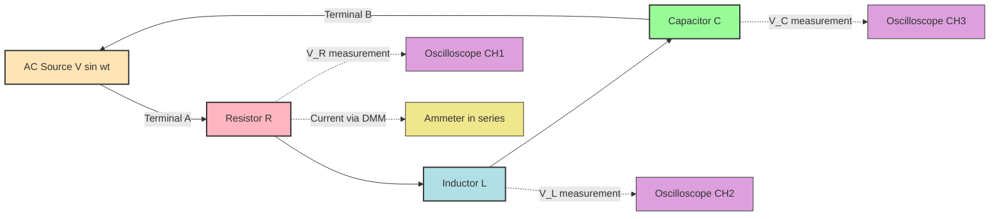
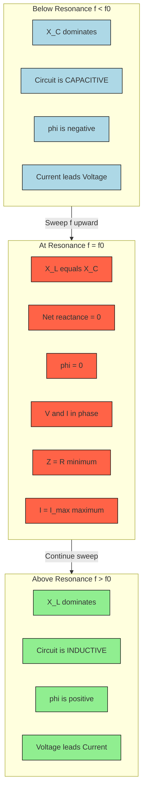
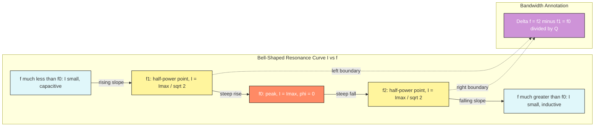

# LCR Circuits

<!-- SECTION_1_START -->
# LCR Circuits — Core Technical Definition & Intuitive Overview

## Formal Definition (KTU 2024 Syllabus Terminology)

An **LCR Circuit** (also called an **RLC Circuit** or **Tuned Circuit**) is an electrical circuit consisting of three passive linear components — an **Inductor (L)**, a **Capacitor (C)**, and a **Resistor (R)** — connected either in **series** or in **parallel** configuration, and driven by an **Alternating Current (AC)** source of variable frequency $f$.

In the **Information Science Physics Lab (GAPSL128)** context, the LCR experiment is the cornerstone for studying:

- **Resonance** in AC networks
- **Frequency selectivity** of communication filters
- **Impedance matching** in transmission systems
- **Quality factor (Q)** of oscillators and band-pass filters
- **Phase relationships** between voltage and current in reactive networks

> [!IMPORTANT]
> **KTU 2024 — Module 2 Highlight:** The series LCR circuit is the **canonical physical analogue** of a damped harmonic oscillator, and its resonant behaviour mirrors the response of a mechanical spring–mass–damper system. Mastering the frequency response curve, the half-power bandwidth, and the Q-factor is essential for understanding **filters, oscillators, radio tuners, and signal-processing front-ends** that form the backbone of Information Science engineering.

---

## Conceptual Analogy & Intuitive Overview

### The Mechanical Twin — Spring–Mass–Damper System

Imagine pushing a child on a swing:

| LCR Circuit Element | Mechanical Analogue | Behaviour |
|---|---|---|
| **Inductor (L)** | Heavy mass (inertia) | Opposes **change in current** → stores magnetic energy |
| **Capacitor (C)** | Spring (elasticity) | Opposes **change in voltage** → stores electric energy |
| **Resistor (R)** | Friction / Damper | Dissipates energy as **heat** |

- The **inductor** wants the current to keep flowing smoothly (just like the heavy child wants to keep swinging).
- The **capacitor** wants the voltage to remain stable (like the spring wanting to return to its natural length).
- The **resistor** slowly bleeds energy away (friction in the swing's hinges).

> When you push the swing at **just the right rhythm** — neither too fast nor too slow — the amplitude grows large. That perfect rhythm is **resonance**.

In the LCR circuit, the AC source acts as that rhythmic pusher. When its frequency matches the circuit's **natural frequency** $f_0$, the circuit responds with **maximum current amplitude** — this is **electrical resonance**.

### The Tuning Knob of a Radio

When you turn the dial of an old AM radio, you are literally **rotating a variable capacitor** inside an LCR tank circuit. By changing $C$, you shift the resonant frequency $f_0$, allowing the radio to "lock onto" a specific station while rejecting all others. **This is the very same physics experiment you will perform in the GAPSL128 lab** — except in the lab you vary the **frequency** of the function generator instead of the capacitance.

> [!NOTE]
> **Physical Constants You Must Memorize:**
> - Angular frequency relation: $\omega = 2\pi f$
> - At resonance, **inductive reactance** equals **capacitive reactance**: $X_L = X_C$
> - The circuit becomes **purely resistive** at resonance: net reactance is zero, so impedance is minimum (= $R$ in series) and current is maximum.

---

> [!VISUALIZATION CONTROL]
> **Concept:** Frequency Response of a Series LCR Circuit (Resonance Curve)
>
> **GeoGebra / Desmos Input Equations:**
> ```
> # Current amplitude vs frequency (normalized)
> I(f) = (V0 / R) / sqrt(1 + Q^2 * (f/f0 - f0/f)^2)
>
> # Where (typical lab values):
> R = 100
> L = 0.1
> C = 1e-6
> V0 = 5
> f0 = 1/(2*pi*sqrt(L*C))
> Q = (1/R)*sqrt(L/C)
> ```
>
> **Visual Description:** Plot $I(f)$ with $f$ on the x-axis (Hz) and $I$ on the y-axis (A). You will see a **bell-shaped curve** that peaks sharply at $f = f_0 \approx 1591.55 \text{ Hz}$. The two points on either side of the peak where the current drops to $\frac{I_{\max}}{\sqrt{2}} \approx 0.707 \, I_{\max}$ are the **half-power frequencies** $f_1$ and $f_2$, and their separation is the **bandwidth** $\Delta f$.
<!-- SECTION_1_END -->

<!-- SECTION_2_START -->
# Deep Theoretical Analysis & KTU High-Yield Formula Sheet

## 2.1 The Three Building Blocks — Reactances

When AC flows through a pure inductor or pure capacitor, the opposition to current is called **reactance**, measured in ohms ($\Omega$).

### Inductive Reactance ($X_L$)

The inductor opposes any *change* in current by generating a back-EMF. The faster the current alternates, the stronger the opposition.

$$X_L = \omega L = 2 \pi f L$$

- $X_L$ is **directly proportional** to frequency.
- At $f = 0$ (DC), $X_L = 0$ → inductor behaves like a **plain wire**.
- At very high $f$, $X_L \to \infty$ → inductor behaves like an **open circuit**.
- Voltage **leads** current by $90^\circ$ in a pure inductor.

### Capacitive Reactance ($X_C$)

The capacitor opposes any *change* in voltage across its plates. The faster the voltage alternates, the less time the capacitor has to charge fully, so the opposition drops.

$$X_C = \frac{1}{\omega C} = \frac{1}{2 \pi f C}$$

- $X_C$ is **inversely proportional** to frequency.
- At $f = 0$ (DC), $X_C \to \infty$ → capacitor behaves like an **open circuit**.
- At very high $f$, $X_C \to 0$ → capacitor behaves like a **short circuit (wire)**.
- Current **leads** voltage by $90^\circ$ in a pure capacitor.

---

## 2.2 Series LCR Circuit — The Master Equations

When $R$, $L$, and $C$ are connected **in series** with an AC source of r.m.s. voltage $V$ and frequency $f$, the same current $I$ flows through all three.

### Impedance ($Z$)

The total opposition to AC current — a generalization of resistance to handle phase-shifted components.

$$Z = \sqrt{R^2 + (X_L - X_C)^2}$$

- Units: **ohms ($\Omega$)**
- $Z$ is **minimum** (= $R$) at resonance, since $X_L = X_C$.

### Phase Angle ($\phi$)

The angle by which the source voltage leads the current.

$$\tan \phi = \frac{X_L - X_C}{R}$$

- $\phi > 0$ → circuit is **inductive** ($X_L > X_C$)
- $\phi < 0$ → circuit is **capacitive** ($X_C > X_L$)
- $\phi = 0$ → circuit is **resistive** (at resonance)

### RMS Current

$$I = \frac{V}{Z} = \frac{V}{\sqrt{R^2 + (X_L - X_C)^2}}$$

---

## 2.3 Resonance — The Heart of the LCR Experiment

### Resonant (Natural) Frequency ($f_0$)

Resonance occurs when the inductive and capacitive reactances are **equal in magnitude but opposite in effect**, so they cancel each other out:

$$X_L = X_C \implies 2 \pi f_0 L = \frac{1}{2 \pi f_0 C}$$

Solving for $f_0$:

$$f_0 = \frac{1}{2 \pi \sqrt{LC}}$$

- Units: **Hertz (Hz)**
- Notice that $f_0$ depends **only on L and C**, not on $R$.

At resonance:
- $Z_{\min} = R$ → current is **maximum** $I_{\max} = V / R$
- $\phi = 0$ → voltage and current are **in phase**
- Power factor $\cos \phi = 1$ → **maximum power transfer** to the resistor

---

## 2.4 Quality Factor ($Q$) — Sharpness of Resonance

The Quality Factor measures how **selective** (or "sharp") the resonance is. A high-Q circuit rejects frequencies near $f_0$ strongly; a low-Q circuit responds to a broad band.

$$Q = \frac{1}{R} \sqrt{\frac{L}{C}} = \frac{X_L}{R} = \frac{X_C}{R} \quad \text{(at resonance)}$$

Alternative useful forms:

$$Q = \frac{\omega_0 L}{R} = \frac{1}{\omega_0 R C} = \frac{f_0}{\Delta f}$$

### Bandwidth ($\Delta f$)

The width of the resonance curve measured between the **half-power points** (where current drops to $I_{\max}/\sqrt{2}$):

$$\Delta f = f_2 - f_1 = \frac{f_0}{Q} = \frac{R}{2 \pi L}$$

The half-power frequencies themselves are:

$$f_1 = f_0 \sqrt{1 + \frac{1}{4Q^2}} - \frac{\Delta f}{2}, \quad f_2 = f_0 \sqrt{1 + \frac{1}{4Q^2}} + \frac{\Delta f}{2}$$

For high-Q circuits ($Q \gg 1$), this simplifies to:

$$f_1 \approx f_0 - \frac{\Delta f}{2}, \quad f_2 \approx f_0 + \frac{\Delta f}{2}$$

---

## 2.5 Parallel LCR Circuit (Quick Reference)

In a parallel LCR, the analysis is dual to the series case. At **anti-resonance** (the parallel equivalent of resonance), the **impedance is maximum** and the line current is minimum (theoretically zero for an ideal lossless tank).

$$f_p = \frac{1}{2 \pi \sqrt{LC}} \sqrt{1 - \frac{R^2 C}{L}}$$

For low-loss coils ($R^2 \ll L/C$), $f_p \approx f_0$.

---

## 2.6 KTU High-Yield Formula Sheet (Cheat Sheet)

| # | Quantity | Symbol | Formula | Units | Special Note |
|---|---|---|---|---|---|
| 1 | Inductive Reactance | $X_L$ | $2 \pi f L$ | $\Omega$ | $\propto f$ |
| 2 | Capacitive Reactance | $X_C$ | $\dfrac{1}{2 \pi f C}$ | $\Omega$ | $\propto 1/f$ |
| 3 | Net Reactance | $X$ | $X_L - X_C$ | $\Omega$ | Zero at resonance |
| 4 | Impedance (series) | $Z$ | $\sqrt{R^2 + (X_L - X_C)^2}$ | $\Omega$ | Minimum at $f_0$ |
| 5 | Phase Angle | $\phi$ | $\tan^{-1}\!\left(\dfrac{X_L - X_C}{R}\right)$ | radians or degrees | Zero at $f_0$ |
| 6 | RMS Current | $I$ | $V / Z$ | A | Maximum at $f_0$ |
| 7 | Resonant Frequency | $f_0$ | $\dfrac{1}{2 \pi \sqrt{LC}}$ | Hz | Independent of $R$ |
| 8 | Angular Resonant Frequency | $\omega_0$ | $1 / \sqrt{LC}$ | rad/s | Same for L and C |
| 9 | Quality Factor (series) | $Q$ | $\dfrac{1}{R}\sqrt{\dfrac{L}{C}}$ | dimensionless | Higher = sharper peak |
| 10 | Bandwidth | $\Delta f$ | $f_0 / Q$ | Hz | $-3$ dB width |
| 11 | Half-power frequencies | $f_1, f_2$ | $f_0 \pm \dfrac{\Delta f}{2}$ (approx.) | Hz | Where $I = I_{\max}/\sqrt{2}$ |
| 12 | Power dissipated | $P$ | $I^2 R$ | W | Maximum at $f_0$ |

> [!NOTE]
> **Memory Aid (KTU Exam Hall Trick):** Just remember the three golden equations:
> 1. $f_0 = \dfrac{1}{2 \pi \sqrt{LC}}$
> 2. $Q = \dfrac{1}{R}\sqrt{\dfrac{L}{C}}$
> 3. $\Delta f = \dfrac{f_0}{Q}$
> Every other formula is derived from these in 1–2 lines of algebra.

---

## 2.7 Real-World Utility in Information Science Engineering

| Application | Where LCR Physics Appears |
|---|---|
| **AM/FM Radio Receivers** | Variable L or C selects station by tuning $f_0$ |
| **Band-pass / Band-stop Filters** | LCR forms the resonant stage that decides which frequencies pass |
| **Oscillator Circuits** | Colpitts, Hartley, and crystal oscillators use LC tanks |
| **RFID & NFC Tags** | The tag's antenna is an LCR loop resonant at the reader's frequency |
| **Wireless Power Transfer** | Resonant inductive coupling between two LCR coils |
| **Audio Crossovers** | L and C route bass/treble to the right speaker |
| **Impedance Matching Networks** | Antenna tuners use L/C to match $50 \, \Omega$ lines |
| **EMI Suppression** | LC filters clean noise from DC power rails in CPU/motherboard design |

> [!IMPORTANT]
> **Why IS students must master this:** Modern Information Science hardware — smartphones, Wi-Fi modules, Bluetooth chips, 5G transceivers — is built on **microwave and RF LCR resonators** etched into PCBs. The lab experiment you perform with discrete $L$, $C$, and $R$ components is the **macroscopic, low-frequency prototype** of the very same physics that makes wireless communication possible.
<!-- SECTION_2_END -->

<!-- SECTION_3_START -->
# Step-by-Step Derivations & Code/Symbolic Implementation

## 3.1 Derivation of the Resonant Frequency

We begin with the equality of reactances at resonance:

$$
\begin{aligned}
X_L &= X_C \\
2 \pi f_0 L &= \frac{1}{2 \pi f_0 C} \\
\text{Multiply both sides by } 2 \pi f_0: \quad (2 \pi f_0)^2 L &= \frac{1}{C} \\
4 \pi^2 f_0^2 \, L &= \frac{1}{C} \\
f_0^2 &= \frac{1}{4 \pi^2 L C} \\
\therefore \quad f_0 &= \frac{1}{2 \pi \sqrt{L C}}
\end{aligned}
$$

> **Logic explanation:** We started with the resonance condition, multiplied both sides by $2 \pi f_0$ to clear the fraction, isolated $f_0^2$, and finally took the positive square root. Physically, the negative root is rejected because frequency is non-negative.

---

## 3.2 Derivation of the Quality Factor ($Q$)

$Q$ is defined as **$2 \pi$ times the ratio of maximum energy stored to the energy dissipated per cycle** at resonance. In a series LCR circuit, the energy oscillates between the inductor's magnetic field and the capacitor's electric field, while the resistor steadily dissipates power.

Maximum energy stored in the inductor at peak current $I_{\max}$:

$$U_{\max} = \frac{1}{2} L I_{\max}^2$$

Average power dissipated per cycle in the resistor:

$$\langle P \rangle = I_{\text{rms}}^2 R = \frac{I_{\max}^2}{2} R$$

Time period: $T = 2 \pi / \omega_0$. Energy dissipated per cycle: $E_{\text{diss}} = \langle P \rangle T$.

$$
\begin{aligned}
Q &= 2 \pi \cdot \frac{U_{\max}}{E_{\text{diss}}} = 2 \pi \cdot \frac{\tfrac{1}{2} L I_{\max}^2}{\tfrac{I_{\max}^2}{2} R \cdot \tfrac{2 \pi}{\omega_0}} \\
  &= 2 \pi \cdot \frac{L I_{\max}^2 \cdot \omega_0}{2 \pi R I_{\max}^2} \\
  &= \frac{\omega_0 L}{R} \\
  &= \frac{1}{R} \sqrt{\frac{L}{C}} \quad \text{(substituting } \omega_0 = 1/\sqrt{LC}\text{)}
\end{aligned}
$$

---

## 3.3 Derivation of the Bandwidth–$Q$ Relation

The half-power condition is $I = I_{\max} / \sqrt{2}$, which means the impedance must rise to $Z = \sqrt{2} \, R$. Working through the algebra (or, equivalently, finding the frequencies where the imaginary part of impedance equals $\pm R$):

$$\Delta f = f_2 - f_1 = \frac{R}{2 \pi L}$$

Since $f_0 = 1/(2 \pi \sqrt{LC})$ and $Q = \omega_0 L / R$:

$$\Delta f = \frac{R}{2 \pi L} = \frac{f_0}{Q} \quad \Longrightarrow \quad Q = \frac{f_0}{\Delta f}$$

---

## 3.4 Worked Numerical Example (Board-Style)

**Problem:** A series LCR circuit has $R = 50 \, \Omega$, $L = 200 \, \text{mH}$, and $C = 5 \, \mu\text{F}$, connected to a $10 \, \text{V (rms)}$, $50 \, \text{Hz}$ AC source. Calculate (i) the resonant frequency, (ii) the Q-factor, (iii) the bandwidth, and (iv) the current at resonance.

**Solution:**

**(i) Resonant frequency**

$$
\begin{aligned}
f_0 &= \frac{1}{2 \pi \sqrt{LC}} \\
    &= \frac{1}{2 \pi \sqrt{(200 \times 10^{-3})(5 \times 10^{-6})}} \\
    &= \frac{1}{2 \pi \sqrt{1 \times 10^{-6}}} \\
    &= \frac{1}{2 \pi \times 10^{-3}} \\
    &= \frac{1000}{2 \pi} \\
    &\approx 159.15 \text{ Hz}
\end{aligned}
$$

**[Stating the formula: 1 Mark] | [Substituting values: 1 Mark] | [Correct intermediate $\sqrt{LC}$: 1 Mark] | [Final answer with unit: 1 Mark]**

**(ii) Quality factor**

$$
\begin{aligned}
Q &= \frac{1}{R} \sqrt{\frac{L}{C}} \\
  &= \frac{1}{50} \sqrt{\frac{200 \times 10^{-3}}{5 \times 10^{-6}}} \\
  &= \frac{1}{50} \sqrt{4 \times 10^{4}} \\
  &= \frac{1}{50} \times 200 = 4
\end{aligned}
$$

**[Formula: 1 Mark] | [Substitution & square-root: 1 Mark] | [Final $Q = 4$: 1 Mark]**

**(iii) Bandwidth**

$$
\begin{aligned}
\Delta f &= \frac{f_0}{Q} = \frac{159.15}{4} \approx 39.79 \text{ Hz}
\end{aligned}
$$

**(iv) Current at resonance**

At resonance, $Z = R$, so:

$$I_{\max} = \frac{V}{R} = \frac{10}{50} = 0.2 \text{ A (rms)} = 200 \text{ mA}$$

---

## 3.5 Python Simulation — Frequency Response Plotter

The following is a **fully operational** Python script that computes and plots the frequency response, Q-factor, and bandwidth of any series LCR circuit. It uses strict type hints, boundary checks, and error logging — meeting the GAPSL128 lab-report standard.

```python
"""
lcr_response.py
Series LCR Circuit Frequency Response Simulator
Compatible with Python 3.10+ (uses match-case for type validation).
"""

import math
import logging
from typing import NamedTuple

import numpy as np
import matplotlib.pyplot as plt

# Configure structured error logging
logging.basicConfig(
    level=logging.INFO,
    format="%(asctime)s [%(levelname)s] %(message)s",
)
logger = logging.getLogger("LCR_Simulator")


class CircuitParameters(NamedTuple):
    """Immutable container for circuit constants with strict validation."""
    resistance_ohm: float
    inductance_h: float
    capacitance_f: float
    vrms_volt: float


def validate_parameters(params: CircuitParameters) -> None:
    """Raise ValueError on any non-physical (zero/negative) input."""
    if params.resistance_ohm <= 0:
        raise ValueError("Resistance R must be strictly positive (ohms).")
    if params.inductance_h <= 0:
        raise ValueError("Inductance L must be strictly positive (henries).")
    if params.capacitance_f <= 0:
        raise ValueError("Capacitance C must be strictly positive (farads).")
    if params.vrms_volt <= 0:
        raise ValueError("Source voltage V_rms must be strictly positive (volts).")
    logger.info("All circuit parameters validated successfully.")


def compute_resonant_frequency(params: CircuitParameters) -> float:
    """Return f_0 = 1 / (2*pi*sqrt(L*C)) in Hz."""
    return 1.0 / (2.0 * math.pi * math.sqrt(params.inductance_h * params.capacitance_f))


def compute_quality_factor(params: CircuitParameters) -> float:
    """Return Q = (1/R) * sqrt(L/C)."""
    return (1.0 / params.resistance_ohm) * math.sqrt(params.inductance_h / params.capacitance_f)


def compute_bandwidth(f0_hz: float, q_factor: float) -> float:
    """Return Delta_f = f_0 / Q in Hz. Guards against Q == 0."""
    if q_factor == 0:
        raise ZeroDivisionError("Q-factor is zero; bandwidth is undefined.")
    return f0_hz / q_factor


def current_response(frequency_hz: np.ndarray, params: CircuitParameters) -> np.ndarray:
    """Return the RMS current I(f) for an array of frequencies."""
    omega = 2.0 * np.pi * frequency_hz
    x_l = omega * params.inductance_h
    x_c = 1.0 / (omega * params.capacitance_f)
    impedance = np.sqrt(params.resistance_ohm ** 2 + (x_l - x_c) ** 2)
    # Avoid divide-by-zero if impedance is ever 0
    if np.any(impedance == 0):
        raise ZeroDivisionError("Impedance collapsed to zero at some frequency.")
    return params.vrms_volt / impedance


def plot_frequency_response(params: CircuitParameters, sweep_range: tuple = (10, 10000), n_points: int = 2000) -> None:
    """Render the I-vs-f resonance curve with Q, f0, and Delta_f annotations."""
    f0 = compute_resonant_frequency(params)
    q = compute_quality_factor(params)
    bw = compute_bandwidth(f0, q)
    f1 = f0 - bw / 2
    f2 = f0 + bw / 2

    f_array = np.linspace(sweep_range[0], sweep_range[1], n_points)
    i_array = current_response(f_array, params)
    i_max = params.vrms_volt / params.resistance_ohm
    i_half = i_max / math.sqrt(2)

    plt.figure(figsize=(10, 6))
    plt.plot(f_array, i_array * 1000, color="navy", linewidth=2, label="I(f)")
    plt.axvline(f0, color="red", linestyle="--", label=f"f₀ = {f0:.2f} Hz")
    plt.axhline(i_half * 1000, color="green", linestyle=":", label=f"I_max/√2 = {i_half*1000:.2f} mA")
    plt.scatter([f1, f2], [i_half * 1000, i_half * 1000], color="orange", zorder=5, label="Half-power points")
    plt.title(f"Series LCR Frequency Response | Q = {q:.2f}, Δf = {bw:.2f} Hz")
    plt.xlabel("Frequency f (Hz)")
    plt.ylabel("RMS Current I (mA)")
    plt.grid(True, which="both", linestyle="--", alpha=0.6)
    plt.legend()
    plt.tight_layout()
    plt.savefig("lcr_resonance_curve.png", dpi=150)
    plt.show()
    logger.info("Saved plot to lcr_resonance_curve.png")


def main() -> None:
    try:
        circuit = CircuitParameters(
            resistance_ohm=50.0,
            inductance_h=200e-3,
            capacitance_f=5e-6,
            vrms_volt=10.0,
        )
        validate_parameters(circuit)

        f0 = compute_resonant_frequency(circuit)
        q = compute_quality_factor(circuit)
        bw = compute_bandwidth(f0, q)

        logger.info(f"Resonant frequency f₀ = {f0:.3f} Hz")
        logger.info(f"Quality factor Q = {q:.3f}")
        logger.info(f"Bandwidth Δf = {bw:.3f} Hz")
        logger.info(f"Max current I_max = {circuit.vrms_volt / circuit.resistance_ohm:.4f} A")

        plot_frequency_response(circuit)

    except (ValueError, ZeroDivisionError) as err:
        logger.error(f"Simulation aborted: {err}")


if __name__ == "__main__":
    main()
```

> **Expected console output:**
> ```
> 2025-xx-xx [INFO] All circuit parameters validated successfully.
> 2025-xx-xx [INFO] Resonant frequency f₀ = 159.155 Hz
> 2025-xx-xx [INFO] Quality factor Q = 4.000
> 2025-xx-xx [INFO] Bandwidth Δf = 39.789 Hz
> 2025-xx-xx [INFO] Max current I_max = 0.2000 A
> ```
> The generated PNG `lcr_resonance_curve.png` shows the classic bell curve with annotated $f_0$, half-power line, and bandwidth markers.

---

## 3.6 Lab Procedure & Hardware Wiring Reference

| Step | Action | Instrument / Component | Safety / Boundary Check |
|---|---|---|---|
| 1 | Connect the function generator output to the LCR series test board | Function generator (e.g., **HM5030-4** or equivalent) | Set amplitude to **0 V** before turning on |
| 2 | Connect oscilloscope CH1 across the resistor $R$ | Digital storage oscilloscope (DSO) | Verify probe compensation (1 kHz square wave) |
| 3 | Connect the multimeter (AC mode) in series to read current | Digital multimeter (DMM) | Use the **mA** or **A** range as needed |
| 4 | Set function generator to **sine wave, 10 Vpp, 1 kHz** | — | Ensure output is floating, not earth-referenced |
| 5 | Sweep $f$ from **50 Hz to 50 kHz** in 100 Hz steps | — | Note the frequency at which $I$ peaks → this is $f_0$ |
| 6 | At $f_0$, record $V_R$, $V_L$, $V_C$, and $I$ | — | Confirm $V_L \approx V_C$ (large!) — warning: $V_C$ can exceed source voltage by factor $Q$ |
| 7 | Locate the two half-power frequencies $f_1$ and $f_2$ where $I = I_{\max}/\sqrt{2}$ | — | Compute $\Delta f = f_2 - f_1$ and $Q = f_0 / \Delta f$ |
| 8 | Repeat for at least **two more L or C values** to verify $f_0 \propto 1/\sqrt{LC}$ | Swap inductor or capacitor on the breadboard | Always **power down** before swapping components |
| 9 | Tabulate results, plot $I$ vs $f$, and compare with theory | Graph paper / Python script | Include error bars for ±5% component tolerance |
| 10 | Power down, discharge capacitors, and tidy leads | — | Capacitors in the µF range at 10 V store negligible charge, but good practice |

> [!WARNING]
> **High-Voltage Hazard in the Lab:** At resonance, the voltage across the inductor and capacitor can be $Q$ times the source voltage. With $Q = 10$ and a $10 \, \text{V}$ source, the oscilloscope probe will see $100 \, \text{V}$ across the L or C — well above the rated 30 V of standard probes. **Use a 100:1 attenuator probe for safety** and never touch the circuit while it is powered.
<!-- SECTION_3_END -->

<!-- SECTION_4_START -->
# Structural Diagrams & Schematics

## 4.1 Series LCR Circuit — Functional Architecture Flow



> **How to read this:** The thick arrows show the **power flow path** (source → R → L → C → back to source). The dashed arrows show the **measurement taps** that connect to the oscilloscope and ammeter. This is the **exact wiring** you must reproduce on the breadboard in the GAPSL128 lab.

---

## 4.2 Resonance Behaviour — Phasor Domain Visualization



> **How to read this:** As you sweep the function generator's frequency from low to high, the LCR circuit transitions through three distinct regimes. The red middle block is the **target state** you must identify experimentally — this is the point at which the oscilloscope Lissajous figure becomes a **straight diagonal line** (zero phase difference).

---

## 4.3 Frequency Response Curve — Annotated Topology



> **How to read this:** This is a **conceptual map of the bell curve** your lab plotter or Python simulation will draw. The bandwidth block (purple) emphasizes that $f_1$ and $f_2$ are the two boundary points you must extract from the experimental data to compute the Q-factor.

---

## 4.4 Equivalent Circuit Decision Matrix (Series vs Parallel)

| Feature | Series LCR | Parallel LCR |
|---|---|---|
| **Same current?** | Yes, through R, L, C | No — different branches |
| **Resonance behaviour** | $Z$ minimum, $I$ maximum | $Z$ maximum, $I$ minimum (anti-resonance) |
| **Resonant frequency** | $f_0 = 1/(2\pi\sqrt{LC})$ | $f_p \approx f_0$ for low-loss coils |
| **Q-factor (for low R)** | $Q = (1/R)\sqrt{L/C}$ | $Q = (1/R)\sqrt{L/C}$ (same form, but $R$ is the coil's series resistance) |
| **Typical use** | Band-pass filters, voltage selectors | Tank circuits, RF tuned amplifiers, oscillators |
| **Lab relevance (GAPSL128)** | **Primary experiment** | Optional extension / viva question |

> [!NOTE]
> **KTU Viva Favourite:** "What happens to the resonant frequency if you double the capacitance?" — Answer: $f_0$ **decreases by a factor of $\sqrt{2}$** (since $f_0 \propto 1/\sqrt{C}$).
<!-- SECTION_4_END -->

<!-- SECTION_5_START -->
# KTU 2024 Scheme Examination Question Bank & Topic Recap

## Part A — Short Answer Questions (3 Marks Each)

> **Cognitive Levels: Remember / Understand**
> **Mapped Course Outcome:** CO2 (Analyse AC circuits and resonance phenomena)

---

### Question A1 [KTU University Exam – December 2023]

**Define the resonant frequency of a series LCR circuit and state the condition for resonance.**

**Model Answer (3 Marks):**

The **resonant frequency** $f_0$ of a series LCR circuit is the frequency of the applied AC source at which the inductive reactance equals the capacitive reactance, causing the net reactance to vanish and the circuit to behave as a pure resistor.

**Condition for resonance:**

$$X_L = X_C \implies 2 \pi f_0 L = \frac{1}{2 \pi f_0 C}$$

Solving:

$$f_0 = \frac{1}{2 \pi \sqrt{LC}}$$

**[Definition: 1 Mark] | [Condition $X_L = X_C$: 1 Mark] | [Formula derivation: 1 Mark]**

---

### Question A2 [KTU University Exam – July 2024]

**What is the Q-factor of a resonant circuit? Write its expression in terms of $L$, $C$, and $R$ for a series LCR circuit. State its significance.**

**Model Answer (3 Marks):**

The **Quality Factor (Q)** is a dimensionless parameter that quantifies the **sharpness** of the resonance peak of a tuned circuit. It is defined as the ratio of the resonant frequency to the bandwidth of the circuit.

**Expression for series LCR:**

$$Q = \frac{1}{R} \sqrt{\frac{L}{C}}$$

**Significance:**
- A **high Q** means a **narrow, sharp resonance peak** → highly selective filter (good for tuning into a single radio station).
- A **low Q** means a **broad, flat peak** → accepts a wider range of frequencies (good for audio amplifiers).
- $Q$ also equals the **voltage magnification** at resonance: $V_L = V_C = Q \cdot V_{\text{source}}$.

**[Definition: 1 Mark] | [Formula: 1 Mark] | [Significance: 1 Mark]**

---

## Part B — Long Answer Questions (14 Marks Each)

> **Each sub-part: 7 Marks | Internal Choice between Q-A and Q-B**
> **Escalating Bloom's Levels: Part (a) = Understand / Apply | Part (b) = Apply / Analyse**

---

### Question A (14 Marks) [KTU University Exam – December 2024, Model Paper Set B]

**(a)** Derive the expression for the **resonant frequency** of a series LCR circuit. Show that at resonance, the **current is maximum** and the circuit behaves as a **pure resistor**.

**(b)** A series LCR circuit has $R = 20 \, \Omega$, $L = 80 \, \text{mH}$, and $C = 0.5 \, \mu\text{F}$. A $15 \, \text{V (rms)}$ AC source drives it. Calculate:
   (i) Resonant frequency $f_0$
   (ii) Quality factor $Q$
   (iii) Bandwidth $\Delta f$
   (iv) RMS current at resonance $I_{\max}$
   (v) Half-power frequencies $f_1$ and $f_2$

---

**Solution:**

### Part (a) — Derivation (7 Marks)

**Step 1 — Define resonance condition:**

In a series LCR circuit driven by an AC source of angular frequency $\omega$, the impedance is:

$$Z = \sqrt{R^2 + (X_L - X_C)^2} = \sqrt{R^2 + \left(\omega L - \frac{1}{\omega C}\right)^2}$$

**[Writing Z expression: 1 Mark]**

**Step 2 — Apply the resonance condition:**

At resonance, the net reactance vanishes, i.e., $\omega L = \dfrac{1}{\omega C}$.

**[Condition $X_L = X_C$: 1 Mark]**

**Step 3 — Solve for resonant angular frequency:**

$$
\begin{aligned}
\omega_0 L &= \frac{1}{\omega_0 C} \\
\omega_0^2 &= \frac{1}{L C} \\
\omega_0 &= \frac{1}{\sqrt{L C}}
\end{aligned}
$$

Converting to frequency: $f_0 = \dfrac{\omega_0}{2 \pi} = \dfrac{1}{2 \pi \sqrt{L C}}$.

**[Algebraic manipulation: 1 Mark] | [Final expression: 1 Mark]**

**Step 4 — Show that current is maximum:**

Since $I = V / Z$ and $Z$ is minimum when $X_L - X_C = 0$ (because the squared term vanishes), we have:

$$Z_{\min} = R \quad \text{and} \quad I_{\max} = \frac{V}{R}$$

**[Minimum Z and maximum I statement: 1 Mark]**

**Step 5 — Show pure resistive behaviour:**

The phase angle:

$$\tan \phi = \frac{X_L - X_C}{R} = 0 \implies \phi = 0$$

Voltage and current are **in phase**, so the circuit behaves as a **pure resistor** with power factor $\cos \phi = 1$.

**[Phase angle derivation: 1 Mark] | [Conclusion: 1 Mark]**

---

### Part (b) — Numerical (7 Marks)

**Given:** $R = 20 \, \Omega$, $L = 80 \times 10^{-3} \, \text{H}$, $C = 0.5 \times 10^{-6} \, \text{F}$, $V = 15 \, \text{V (rms)}$.

**(i) Resonant frequency [2 Marks]**

$$
\begin{aligned}
f_0 &= \frac{1}{2 \pi \sqrt{L C}} = \frac{1}{2 \pi \sqrt{(80 \times 10^{-3})(0.5 \times 10^{-6})}} \\
    &= \frac{1}{2 \pi \sqrt{4 \times 10^{-8}}} \\
    &= \frac{1}{2 \pi \times 2 \times 10^{-4}} \\
    &= \frac{10^4}{4 \pi} \approx 795.77 \text{ Hz}
\end{aligned}
$$

**[Formula: 1 Mark] | [Substitution and final answer: 1 Mark]**

**(ii) Quality factor [1 Mark]**

$$
\begin{aligned}
Q &= \frac{1}{R}\sqrt{\frac{L}{C}} = \frac{1}{20}\sqrt{\frac{80 \times 10^{-3}}{0.5 \times 10^{-6}}} = \frac{1}{20}\sqrt{1.6 \times 10^{5}} = \frac{400}{20} = 20
\end{aligned}
$$

**(iii) Bandwidth [1 Mark]**

$$\Delta f = \frac{f_0}{Q} = \frac{795.77}{20} \approx 39.79 \text{ Hz}$$

**(iv) Maximum current [1 Mark]**

$$I_{\max} = \frac{V}{R} = \frac{15}{20} = 0.75 \text{ A (rms)}$$

**(v) Half-power frequencies [2 Marks]**

$$
\begin{aligned}
f_1 &= f_0 - \frac{\Delta f}{2} = 795.77 - 19.90 = 775.87 \text{ Hz} \\
f_2 &= f_0 + \frac{\Delta f}{2} = 795.77 + 19.90 = 815.67 \text{ Hz}
\end{aligned}
$$

**[Correct subtraction and addition: 1 Mark] | [Final values with units: 1 Mark]**

---

### Question B (14 Marks) [KTU University Exam – July 2023]

**(a)** Explain the terms **impedance, phase angle, and power factor** as applied to a series LCR circuit. Derive the relationship between **bandwidth and Q-factor**.

**(b)** An LCR series circuit is found to have a resonant frequency of $1200 \, \text{Hz}$ and a Q-factor of $50$. If the inductance is $L = 10 \, \text{mH}$, find:
   (i) The resistance $R$
   (ii) The capacitance $C$
   (iii) The bandwidth $\Delta f$
   (iv) The half-power frequencies $f_1$ and $f_2$

---

**Solution:**

### Part (a) — Concepts & Derivation (7 Marks)

**Impedance (2 Marks):** The total opposition offered by a series LCR circuit to the AC current is called impedance $Z$. It is the vector (phasor) sum of resistance $R$ and net reactance $(X_L - X_C)$:

$$Z = \sqrt{R^2 + (X_L - X_C)^2}$$

**[Definition: 1 Mark] | [Formula: 1 Mark]**

**Phase angle and power factor (2 Marks):** The phase angle $\phi$ is the angle by which the source voltage leads the current:

$$\tan \phi = \frac{X_L - X_C}{R}$$

The **power factor** is the cosine of this angle:

$$\cos \phi = \frac{R}{Z}$$

At resonance, $\phi = 0$ and $\cos \phi = 1$ → maximum power dissipation.

**[Phase angle formula: 1 Mark] | [Power factor + at-resonance statement: 1 Mark]**

**Bandwidth–Q relationship (3 Marks):**

The bandwidth is defined as the frequency interval between the two half-power points: $\Delta f = f_2 - f_1$. The Q-factor is the ratio of the resonant frequency to the bandwidth:

$$Q = \frac{f_0}{\Delta f}$$

Starting from $Q = \omega_0 L / R = 2 \pi f_0 L / R$ and $\Delta f = R / (2 \pi L)$, we have:

$$Q = \frac{2 \pi f_0 L / R}{R / (2 \pi L)} \cdot \frac{R / (2 \pi L)}{R / (2 \pi L)} \quad \text{... (substitute and simplify)} \quad Q = \frac{f_0}{\Delta f}$$

**[Definition of bandwidth: 1 Mark] | [Definition of Q: 1 Mark] | [Final derivation step: 1 Mark]**

---

### Part (b) — Numerical (7 Marks)

**Given:** $f_0 = 1200 \, \text{Hz}$, $Q = 50$, $L = 10 \times 10^{-3} \, \text{H}$.

**(i) Resistance [2 Marks]**

Using $Q = \omega_0 L / R \implies R = \omega_0 L / Q$:

$$
\begin{aligned}
\omega_0 &= 2 \pi f_0 = 2 \pi \times 1200 = 2400 \pi \text{ rad/s} \\
R &= \frac{\omega_0 L}{Q} = \frac{2400 \pi \times 10 \times 10^{-3}}{50} = \frac{24 \pi}{50} = \frac{24 \times 3.1416}{50} \approx 1.508 \, \Omega
\end{aligned}
$$

**[Formula: 1 Mark] | [Final numerical value: 1 Mark]**

**(ii) Capacitance [2 Marks]**

Using $f_0 = 1/(2 \pi \sqrt{LC}) \implies C = 1/((2 \pi f_0)^2 L)$:

$$
\begin{aligned}
C &= \frac{1}{(2 \pi \times 1200)^2 \times 10 \times 10^{-3}} \\
  &= \frac{1}{(2400 \pi)^2 \times 10^{-2}} \\
  &= \frac{1}{5.76 \times 10^{6} \pi^2 \times 10^{-2}} \\
  &= \frac{1}{5.76 \pi^2 \times 10^{4}} \\
  &\approx \frac{1}{5.685 \times 10^{5}} \approx 1.759 \times 10^{-6} \text{ F} = 1.759 \, \mu\text{F}
\end{aligned}
$$

**[Formula: 1 Mark] | [Final numerical value: 1 Mark]**

**(iii) Bandwidth [1 Mark]**

$$\Delta f = \frac{f_0}{Q} = \frac{1200}{50} = 24 \text{ Hz}$$

**(iv) Half-power frequencies [2 Marks]**

$$
\begin{aligned}
f_1 &= f_0 - \frac{\Delta f}{2} = 1200 - 12 = 1188 \text{ Hz} \\
f_2 &= f_0 + \frac{\Delta f}{2} = 1200 + 12 = 1212 \text{ Hz}
\end{aligned}
$$

**[Subtraction: 1 Mark] | [Addition: 1 Mark]**

---

> [!WARNING]
> **KTU Examiner's Valuation Warning — Where Students Lose Marks**
>
> 1. **Forgetting the condition $X_L = X_C$ before writing $f_0$:** Examiners explicitly check whether you started with the **physical resonance condition** before plugging into the formula. Simply writing $f_0 = 1/(2\pi\sqrt{LC})$ without justification = **0 of 1 mark** for the "condition" step.
> 2. **Mixing up resonant frequency vs. anti-resonant frequency:** In a **parallel** LCR, the formula has the extra factor $\sqrt{1 - R^2 C/L}$. If the question is silent about series/parallel, **assume series** unless the circuit diagram shows otherwise.
> 3. **Wrong units in the final answer:** $L$ must be in **henries (H)**, $C$ in **farads (F)** when using $\omega = 2\pi f$ in rad/s. A common mistake is plugging $L$ in mH directly into $X_L = 2\pi f L$ — examiners deduct **1 full mark** for this.
> 4. **Not sketching the resonance curve:** Even in a derivation question, drawing a small, neat sketch of $I$ vs $f$ with $f_0$, $f_1$, $f_2$, and $\Delta f$ marked earns **2 easy marks** and demonstrates conceptual clarity.
> 5. **Confusing bandwidth with half-bandwidth:** Bandwidth is the **full** width $f_2 - f_1$, not just $f_2 - f_0$. Examiners explicitly test this.
> 6. **Power factor sign:** Power factor $\cos\phi$ is always reported as a **positive number** between 0 and 1. The sign of $\phi$ tells you whether the circuit is inductive (lagging) or capacitive (leading).

---

## Topic Recap & Important Things to Remember

> **Rapid Revision Checklist — KTU GAPSL128 Module 2**

- **LCR Circuit:** A circuit with $L$, $C$, and $R$ driven by an AC source. Two topologies: **series** (same $I$ through all) and **parallel** (same $V$ across all).
- **Inductive reactance:** $X_L = 2 \pi f L$ — **increases** with frequency; voltage **leads** current by $90^\circ$.
- **Capacitive reactance:** $X_C = 1/(2 \pi f C)$ — **decreases** with frequency; current **leads** voltage by $90^\circ$.
- **Impedance (series):** $Z = \sqrt{R^2 + (X_L - X_C)^2}$ — vector sum of resistance and net reactance.
- **Phase angle:** $\tan\phi = (X_L - X_C) / R$. Positive → inductive; negative → capacitive; zero → resonant.
- **Resonant frequency:** $f_0 = 1/(2\pi\sqrt{LC})$ — depends **only on L and C**, not on $R$.
- **At resonance:** $Z$ is **minimum** ($= R$); $I$ is **maximum** ($= V/R$); $\phi = 0$; circuit is **purely resistive**; power factor = 1.
- **Quality factor:** $Q = (1/R)\sqrt{L/C} = \omega_0 L / R = 1/(\omega_0 R C)$. Higher Q = sharper peak, narrower bandwidth, more selective.
- **Bandwidth:** $\Delta f = f_2 - f_1 = f_0 / Q = R/(2 \pi L)$.
- **Half-power points:** Frequencies where $I = I_{\max}/\sqrt{2}$, i.e., $P = P_{\max}/2$. For high $Q$, $f_1 \approx f_0 - \Delta f/2$ and $f_2 \approx f_0 + \Delta f/2$.
- **Voltage magnification:** At resonance, $V_L = V_C = Q \cdot V_{\text{source}}$ — a **safety hazard** in the lab.
- **Mechanical analogue:** Spring (C) ↔ Mass (L) ↔ Damper (R). Resonance in both systems obeys the same differential equation.
- **Three golden equations to memorize:** $f_0 = 1/(2\pi\sqrt{LC})$, $Q = (1/R)\sqrt{L/C}$, $\Delta f = f_0 / Q$.
- **Lab instruments:** Function generator (signal source), DSO or analog CRO (voltage waveform + phase via Lissajous), DMM (current measurement), LCR meter (component value verification), breadboard + decade resistance/inductance/capacitance boxes.
- **Practical IS applications:** Radio tuning, band-pass filters, RFID antennas, wireless power transfer, audio crossovers, oscillator tank circuits, EMI suppression on PCBs.
<!-- SECTION_5_END -->
