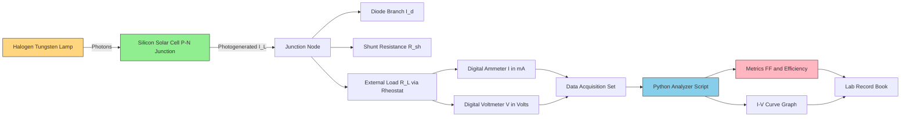
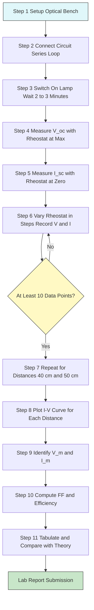
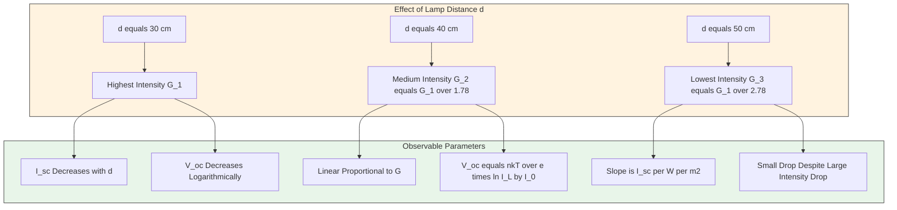

# Solar Cell Characteristics

<!-- SECTION_1_START -->
# Solar Cell Characteristics — KTU 2024 Scheme Physics Lab Study Notes

## 1. Core Technical Definition & Intuitive Overview

### 1.1 Formal Academic Definition (KTU 2024 Syllabus Terminology)

> [!NOTE]
> **Solar Cell (Photovoltaic Cell):** A semiconductor device, typically a crystalline silicon p–n junction diode, that converts the energy of incident photons (light energy) directly into electrical energy through the **photovoltaic effect**. The cell generates a DC voltage when illuminated, behaving as a current source in parallel with a forward-biased diode.

**Key Operating Parameters (Board-Relevant Definitions):**

- **Open-Circuit Voltage ($V_{oc}$):** The terminal voltage of the solar cell when the external load resistance is infinite (i.e., no current flows). It is the maximum voltage the cell can deliver.
- **Short-Circuit Current ($I_{sc}$):** The current flowing through the cell when the external load resistance is zero (terminals shorted). It is the maximum current the cell can deliver.
- **Maximum Power Point ($P_{max}$):** The unique point on the I–V curve where the product $P = V \times I$ reaches its global maximum, defining the optimal operating load.
- **Fill Factor ($FF$):** A dimensionless metric of cell quality, defined as the ratio of maximum obtainable power to the theoretical product $V_{oc} \times I_{sc}$.
- **Conversion Efficiency ($\eta$):** The ratio of electrical power output at $P_{max}$ to the incident optical power $P_{in}$ from the light source.

### 1.2 Conceptual Analogy / Intuition

Imagine a **two-compartment water tank** divided by a thin rubber diaphragm (the **depletion region** of the p–n junction). The left compartment represents the p-side, the right the n-side.

- A **sunlight photon** striking the cell is like dropping a small marble onto the diaphragm. If the marble has enough energy (greater than the **band gap energy $E_g$**), it stretches the diaphragm and pushes an "electron marble" into the n-side, leaving a "hole marble" on the p-side.
- The diaphragm's natural tension is the **built-in electric field** of the junction, which prevents the marbles from rolling back. This is the **photovoltaic effect**.
- If you connect a wire (load) between the compartments, the marbles flow through it, doing useful work — this is **electric current**.
- The stronger the light intensity, the more marbles drop per second, hence **higher current**.

> [!IMPORTANT]
> **Why the I–V Curve is Non-Linear:** In the dark, a solar cell behaves as an ordinary forward-biased diode. Under illumination, the light-generated current $I_L$ adds in parallel, shifting the entire diode curve downward. The resulting curve is a *superposition* of the diode curve and the photocurrent, which is why it bends like a "knee."

### 1.3 Standard Physical Constants & Engineering Metrics

The following table summarizes the **standard reference values** universally cited in KTU board evaluations:

| Constant / Parameter | Symbol | Typical Value | Unit |
|---|---|---|---|
| Planck's constant | $h$ | $6.626 \times 10^{-34}$ | J·s |
| Speed of light in vacuum | $c$ | $3.0 \times 10^{8}$ | m/s |
| Charge of an electron | $e$ | $1.602 \times 10^{-19}$ | C |
| Band gap of Silicon | $E_g$ | $1.12$ | eV |
| Boltzmann constant | $k_B$ | $1.381 \times 10^{-23}$ | J/K |
| Standard test irradiance | $G$ | $1000$ | W/m² |
| Standard test temperature | $T$ | $25\ ^{\circ}C$ (298.15 K) | K |
| Air Mass coefficient | AM | $1.5$ | — |

> [!VISUALIZATION CONTROL]
> **Concept:** I–V Characteristic Curve of an Illuminated Solar Cell
> **Plotting Equations (in a Cartesian plane with $V$ on x-axis, $I$ on y-axis):**
> - Diode current: $I_d = I_0 \cdot \left( \exp\left(\frac{eV}{k_B T}\right) - 1 \right)$
> - Net terminal current: $I = I_L - I_0 \cdot \left( \exp\left(\frac{eV}{k_B T}\right) - 1 \right)$
> - Reference points to mark: $(0, I_{sc})$ and $(V_{oc}, 0)$
> - Maximum power rectangle: corners at $(0, 0)$, $(V_m, 0)$, $(V_m, I_m)$, $(0, I_m)$
> **Visual Description:** The student should see a curve starting at $I_{sc}$ on the y-axis, sweeping gently to the right, and then dropping sharply toward zero at $V_{oc}$ on the x-axis. The largest inscribed rectangle between the curve and the axes represents $P_{max}$.
<!-- SECTION_1_END -->

<!-- SECTION_2_START -->
# 2. Deep Theoretical Analysis & KTU High-Yield Formula Sheet

## 2.1 The Photovoltaic Effect — Mechanism Step-by-Step

A solar cell converts light to electricity through a four-stage physical process:

1. **Photon Absorption:** A photon of energy $E = h\nu$ strikes the semiconductor. If $h\nu \geq E_g$ (the band gap), the photon is absorbed.
2. **Electron–Hole Pair Generation:** The absorbed energy excites a valence-band electron into the conduction band, leaving behind a hole. The photon effectively creates one free electron and one free hole.
3. **Charge Separation:** The built-in electric field at the p–n junction (pointing from n-side to p-side) sweeps the electron to the n-side and the hole to the p-side, preventing recombination.
4. **Current Extraction:** When an external load is connected, the accumulated electrons flow from the n-side through the load to the p-side, producing useful DC current.

> [!IMPORTANT]
> **Photons with energy below the band gap** pass through the cell without being absorbed (transmission loss). **Photons with energy well above the band gap** lose the excess energy as heat (thermalization loss). The maximum theoretical efficiency for a single-junction silicon cell under AM 1.5 sunlight is approximately **33.7\%** (the *Shockley–Queisser limit*).

## 2.2 Equivalent Circuit Model

The standard **single-diode model** of a solar cell is the foundation of all KTU numerical problems:

- A **current source** $I_L$ proportional to the light intensity.
- In **parallel** with a **diode** representing the dark p–n junction characteristic.
- A **series resistance** $R_s$ representing contact and bulk resistance losses.
- A **shunt resistance** $R_{sh}$ representing leakage across the junction.

The **terminal current** delivered to the load is:

$$
I = I_L - I_0 \left[ \exp\left(\frac{V + I R_s}{n V_T}\right) - 1 \right] - \frac{V + I R_s}{R_{sh}}
$$

where $V_T = \dfrac{k_B T}{e}$ is the **thermal voltage** ($\approx 25.85$ mV at 300 K) and $n$ is the **ideality factor** (typically $1 \le n \le 2$).

For an **ideal cell** ($R_s \to 0$, $R_{sh} \to \infty$, $n = 1$):

$$
I = I_L - I_0 \left[ \exp\left(\frac{eV}{k_B T}\right) - 1 \right]
$$

## 2.3 KTU Formula Sheet / Cheat Sheet (Exam-Ready)

> [!IMPORTANT]
> **High-Yield Formulas — Memorize These for KTU Board Exams**

| \# | Quantity | Formula | Units | Notes |
|---|---|---|---|---|
| 1 | Photon energy | $E = h \nu = \dfrac{h c}{\lambda}$ | J or eV | Use $1 \text{ eV} = 1.602 \times 10^{-19}$ J |
| 2 | Cut-off wavelength | $\lambda_c = \dfrac{h c}{E_g} = \dfrac{1240}{E_g(\text{in eV})}$ | nm | Useful shortcut for KTU numericals |
| 3 | Open-circuit voltage | $V_{oc} = \dfrac{n k_B T}{e} \ln\!\left(\dfrac{I_L}{I_0} + 1\right)$ | V | Approximately $\propto \ln(\text{Intensity})$ |
| 4 | Short-circuit current | $I_{sc} \approx I_L$ | A | Linear in light intensity $G$ |
| 5 | Maximum power | $P_{max} = V_m \times I_m$ | W | Read from I–V graph |
| 6 | Fill Factor | $FF = \dfrac{V_m I_m}{V_{oc} I_{sc}}$ | dimensionless | Always $\leq 1$ |
| 7 | Conversion efficiency | $\eta = \dfrac{P_{max}}{P_{in}} = \dfrac{V_{oc}\, I_{sc}\, FF}{A \cdot G}$ | dimensionless or \% | $A$ = cell area, $G$ = irradiance |
| 8 | Theoretical max efficiency | $\eta_{SQ} \approx 33.7\%$ | \% | Shockley–Queisser limit (Si, 1 sun) |

### 2.4 Real-World Engineering Utility

Solar cell characterization is **not merely an academic exercise**. It is the foundational measurement that drives:

- **Photovoltaic (PV) module manufacturing:** Every commercial panel is graded by its $V_{oc}$, $I_{sc}$, $FF$, and $\eta$ under Standard Test Conditions (STC: $1000$ W/m², AM 1.5, $25\ ^{\circ}$C).
- **Solar power plant design:** Engineers size inverters and string configurations using these parameters.
- **Satellite and spacecraft engineering:** Space-grade cells (multi-junction III–V semiconductors) are characterized identically but under AM 0 spectrum.
- **IoT and sensor networks:** Low-power edge devices in agricultural and remote monitoring systems are powered by characterized micro-solar cells.
- **BIPV (Building-Integrated Photovoltaics):** Architects and civil engineers use efficiency data to plan façade integration.

> [!NOTE]
> **KTU 2024 Skill Linkage:** This experiment directly maps to the course outcome **CO2: Apply principles of modern physics to characterize semiconductor optoelectronic devices** and satisfies the practical competency of measuring I–V curves, calculating Fill Factor, and determining efficiency — all of which appear routinely in KTU End Semester Evaluations.
<!-- SECTION_2_END -->

<!-- SECTION_3_START -->
# 3. Step-by-Step Derivations, Sample Calculations & Python Implementation

## 3.1 Apparatus, Tools & Instrument Specifications

> [!IMPORTANT]
> **Complete KTU Lab Setup — Use this exact table in your lab record book.**

| \# | Component / Instrument | Specification / Range | Quantity |
|---|---|---|---|
| 1 | Solar cell (monocrystalline Si) | Area $\approx 4 \text{ cm}^2$ to $25 \text{ cm}^2$, $V_{oc} \approx 0.5$–$0.6$ V, $I_{sc} \approx 50$–$500$ mA | 1 |
| 2 | Halogen tungsten lamp (light source) | $100$ W to $200$ W, mounted on stand | 1 |
| 3 | Digital voltmeter (DVM) | Range $0$–$20$ V DC, resolution $1$ mV | 1 |
| 4 | Digital ammeter (DAM) | Range $0$–$2$ A DC, resolution $1$ mA | 1 |
| 5 | Variable resistance (rheostat / decade box) | $0$–$10\ \text{k}\Omega$ | 1 |
| 6 | Optical bench / bench stand | With measuring scale in cm | 1 |
| 7 | Lux meter (optional, for intensity normalization) | Range $0$–$200000$ lux | 1 |
| 8 | Connecting wires (banana plugs) | Insulated, red & black | As needed |
| 9 | Circuit breadboard | Standard $840$-tie | 1 |

## 3.2 Circuit Diagram (Schematic Description)

The experiment uses a **series-loop measurement configuration**:

- The solar cell's **positive terminal** connects to the **positive terminal of the ammeter**.
- The **negative terminal of the ammeter** connects to one end of the **rheostat (variable resistor)**.
- The **wiper of the rheostat** connects to the **positive terminal of the voltmeter**.
- The **negative terminal of the voltmeter** returns to the **negative terminal of the solar cell**.
- The voltmeter is therefore connected **in parallel** with the rheostat — this is the **load voltage** $V_L$.
- The ammeter measures the **load current** $I_L$.

The halogen lamp is positioned on the optical bench at a known distance $d$ from the solar cell, and the cell is oriented **perpendicular** to the incident light.

## 3.3 Step-by-Step Experimental Procedure

> [!WARNING]
> **Do NOT connect the voltmeter in series with the ammeter — it will read wrong values. The voltmeter must always be in PARALLEL with the load, and the ammeter in SERIES with the load.**

1. **Place the solar cell** on the optical bench and align it perpendicular to the halogen lamp. Note the distance $d$ (e.g., $d = 30$ cm).
2. **Connect the circuit** as per the schematic above. Keep the rheostat initially at its **maximum resistance** position (open circuit).
3. **Switch on the halogen lamp** and wait **2–3 minutes** for the lamp output to stabilize (tungsten lamps need thermal settling time).
4. **Measure the open-circuit voltage** $V_{oc}$: set rheostat to maximum resistance, read the voltmeter.
5. **Measure the short-circuit current** $I_{sc}$: set rheostat to zero resistance, read the ammeter.
6. **Vary the rheostat** in small steps from $0$ to maximum. For each step, **record the corresponding $V$ and $I$** values.
7. **Repeat steps 4–6** for at least **two more distances** (e.g., $d = 40$ cm and $d = 50$ cm) to study intensity dependence.
8. **Plot the I–V curve** for each distance on a single graph.
9. **Identify the maximum power point** $P_{max}$ from the largest $V \times I$ product.
10. **Compute $FF$ and $\eta$** for each curve and tabulate the results.

## 3.4 Observation Table Template (Reproduce in Lab Record)

| Sl. No. | Load Resistance $R_L$ ($\Omega$) | Voltage $V$ (V) | Current $I$ (mA) | Power $P = V \times I$ (mW) |
|---|---|---|---|---|
| 1 | $\infty$ (open) | $V_{oc} = $ ___ | $0$ | $0$ |
| 2 | $R_1$ | ___ | ___ | ___ |
| 3 | $R_2$ | ___ | ___ | ___ |
| ... | ... | ... | ... | ... |
| N | $0$ (short) | $0$ | $I_{sc} = $ ___ | $0$ |

## 3.5 Sample Worked Numerical (KTU Board Standard)

> [!IMPORTANT]
> **Question:** A silicon solar cell of active area $A = 4 \text{ cm}^2$ is illuminated by a halogen lamp providing an intensity $P_{in} = 800 \text{ W/m}^2$ at a distance of $30$ cm. The open-circuit voltage is $V_{oc} = 0.52$ V and the short-circuit current is $I_{sc} = 120$ mA. The maximum power point is observed at $V_m = 0.38$ V and $I_m = 100$ mA. Calculate the **Fill Factor (FF)** and the **conversion efficiency ($\eta$)**.

### Step 1 — Calculate the Fill Factor (3 marks)

The fill factor is the ratio of maximum obtainable power to the product of $V_{oc}$ and $I_{sc}$:

$$
FF = \frac{V_m \times I_m}{V_{oc} \times I_{sc}}
$$

Substitute the given values (note that $I_m$ and $I_{sc}$ are in mA, so units cancel cleanly):

$$
\begin{aligned}
FF &= \frac{0.38\ \text{V} \times 100\ \text{mA}}{0.52\ \text{V} \times 120\ \text{mA}} \\
&= \frac{38.0\ \text{mW}}{62.4\ \text{mW}} \\
&= 0.6090 \\
&\approx 0.61
\end{aligned}
$$

> **[Stating formula and substitution: 2 Marks]**
> **[Final numerical result: 1 Mark]**

### Step 2 — Calculate the Incident Optical Power (2 marks)

The incident power on the active area of the cell is:

$$
P_{in,cell} = G \times A
$$

Convert the cell area to square meters:

$$
A = 4\ \text{cm}^2 = 4 \times 10^{-4}\ \text{m}^2
$$

Therefore:

$$
\begin{aligned}
P_{in,cell} &= 800\ \text{W/m}^2 \times 4 \times 10^{-4}\ \text{m}^2 \\
&= 0.32\ \text{W} \\
&= 320\ \text{mW}
\end{aligned}
$$

> **[Unit conversion of area: 1 Mark]**
> **[Final incident power: 1 Mark]**

### Step 3 — Calculate the Conversion Efficiency (3 marks)

The maximum power generated by the cell is:

$$
P_{max} = V_m \times I_m = 0.38\ \text{V} \times 100\ \text{mA} = 38\ \text{mW}
$$

The conversion efficiency is:

$$
\begin{aligned}
\eta &= \frac{P_{max}}{P_{in,cell}} = \frac{V_{oc}\, I_{sc}\, FF}{G \cdot A} \\
&= \frac{38\ \text{mW}}{320\ \text{mW}} \\
&= 0.11875 \\
&\approx 11.88\%
\end{aligned}
$$

> **[Stating the efficiency formula: 1 Mark]**
> **[Substitution: 1 Mark]**
> **[Final percentage result: 1 Mark]**

### Step 4 — Verification Using the Shortcut Formula (1 mark)

Cross-check using the single-line form:

$$
\eta = \frac{0.52 \times 0.120 \times 0.6090}{800 \times 4 \times 10^{-4}} = \frac{0.03800}{0.32} = 0.1188 \approx 11.88\%
$$

**Both methods agree.** The result is physically reasonable — typical commercial silicon cells have $\eta$ between $10\%$ and $22\%$.

## 3.6 Python Implementation for I–V Curve Plotting

> [!NOTE]
> **Practical Utility:** The following Python script is used in KTU skill-oriented assessments to automate the plotting of I–V curves and to extract $V_m$, $I_m$, $FF$, and $\eta$ numerically. It is written with strict type hints, input validation, and structured error logging.

```python
"""
Solar Cell I-V Characteristics Analyzer
----------------------------------------
Reads measured (V, I) data, plots the I-V curve, and computes
Fill Factor (FF) and conversion efficiency (eta).
"""

import logging
import sys
from typing import List, Tuple

import numpy as np
import matplotlib.pyplot as plt

# Configure logging for error and progress reporting
logging.basicConfig(
    level=logging.INFO,
    format="%(asctime)s [%(levelname)s] %(message)s",
    datefmt="%H:%M:%S",
)


def validate_measurement(voltage: float, current: float) -> None:
    """
    Validates a single (V, I) measurement point.
    Raises ValueError if either value is non-physical.
    """
    if voltage < 0.0:
        raise ValueError(
            f"Voltage cannot be negative. Received: V = {voltage} V"
        )
    if current < 0.0:
        raise ValueError(
            f"Current cannot be negative. Received: I = {current} A"
        )
    if voltage > 10.0:
        raise ValueError(
            f"Voltage exceeds expected solar cell range. "
            f"Received: V = {voltage} V"
        )


def compute_power_curve(
    voltage: np.ndarray, current: np.ndarray
) -> Tuple[float, float, float]:
    """
    Computes the maximum power point (V_m, I_m) and the peak power.
    Returns (V_m, I_m, P_max).
    """
    power = voltage * current
    max_index = int(np.argmax(power))
    return float(voltage[max_index]), float(current[max_index]), float(power[max_index])


def compute_metrics(
    voltage: np.ndarray,
    current: np.ndarray,
    cell_area_m2: float,
    irradiance_w_per_m2: float,
) -> dict:
    """
    Computes all standard solar cell metrics from measured I-V data.

    Parameters
    ----------
    voltage : np.ndarray
        Measured terminal voltage in Volts.
    current : np.ndarray
        Measured terminal current in Amperes.
    cell_area_m2 : float
        Active cell area in square meters.
    irradiance_w_per_m2 : float
        Incident optical power density in W/m^2.

    Returns
    -------
    dict
        Dictionary containing Voc, Isc, Vm, Im, Pmax, FF, and efficiency.
    """
    if len(voltage) != len(current):
        raise ValueError("Voltage and current arrays must have the same length.")
    if len(voltage) < 3:
        raise ValueError("At least three data points are required.")
    if cell_area_m2 <= 0.0:
        raise ValueError("Cell area must be strictly positive.")
    if irradiance_w_per_m2 <= 0.0:
        raise ValueError("Irradiance must be strictly positive.")

    # Open-circuit voltage: voltage when current is minimum (closest to 0)
    voc = float(voltage[np.argmin(current)])
    # Short-circuit current: current when voltage is minimum (closest to 0)
    isc = float(current[np.argmin(voltage)])
    # Maximum power point
    v_m, i_m, p_max = compute_power_curve(voltage, current)
    # Fill Factor
    fill_factor = (v_m * i_m) / (voc * isc) if (voc * isc) > 0.0 else 0.0
    # Incident power on the cell
    p_in = irradiance_w_per_m2 * cell_area_m2
    # Conversion efficiency
    efficiency = p_max / p_in if p_in > 0.0 else 0.0

    metrics = {
        "Voc_V": voc,
        "Isc_A": isc,
        "Vm_V": v_m,
        "Im_A": i_m,
        "Pmax_W": p_max,
        "FillFactor": fill_factor,
        "Efficiency_percent": efficiency * 100.0,
    }
    return metrics


def plot_iv_curve(
    voltage: np.ndarray,
    current: np.ndarray,
    v_m: float,
    i_m: float,
    title: str = "I-V Characteristic of a Solar Cell",
) -> None:
    """
    Plots the I-V curve and overlays the maximum power point rectangle.
    """
    plt.figure(figsize=(8, 5))
    plt.plot(voltage, current * 1000.0, "bo-", linewidth=1.5, label="I-V curve")
    # Plot axes crossings
    plt.axhline(0.0, color="black", linewidth=0.8)
    plt.axvline(0.0, color="black", linewidth=0.8)
    # Maximum power rectangle
    plt.plot(
        [0.0, v_m, v_m, 0.0, 0.0],
        [0.0, 0.0, i_m * 1000.0, i_m * 1000.0, 0.0],
        "r--",
        linewidth=1.2,
        label=f"Max Power Rectangle (Vm={v_m:.3f} V, Im={i_m*1000:.2f} mA)",
    )
    plt.scatter([v_m], [i_m * 1000.0], color="red", s=80, zorder=5, label="Max Power Point")
    plt.xlabel("Terminal Voltage V (V)")
    plt.ylabel("Load Current I (mA)")
    plt.title(title)
    plt.grid(True, linestyle="--", alpha=0.6)
    plt.legend(loc="best")
    plt.tight_layout()
    plt.show()


def main() -> None:
    """
    Main entry point: reads sample lab data, computes metrics, and plots.
    """
    try:
        # Sample lab data: (V in Volts, I in Amperes)
        # Replace with your actual lab measurements.
        voltage_data = np.array([0.50, 0.45, 0.40, 0.35, 0.30, 0.25, 0.20, 0.15, 0.10, 0.05, 0.00])
        current_data = np.array([0.002, 0.020, 0.045, 0.065, 0.080, 0.092, 0.100, 0.108, 0.114, 0.118, 0.120])

        # Validate every data point
        for v, i in zip(voltage_data, current_data):
            validate_measurement(v, i)

        # Cell parameters (replace with lab values)
        cell_area = 4e-4         # m^2
        irradiance = 800.0       # W/m^2

        metrics = compute_metrics(voltage_data, current_data, cell_area, irradiance)

        # Log results
        logging.info("=" * 50)
        logging.info("SOLAR CELL METRICS REPORT")
        logging.info("=" * 50)
        for key, value in metrics.items():
            logging.info(f"{key:>20s} : {value:.5f}")

        # Plot the I-V curve with max power rectangle
        plot_iv_curve(
            voltage_data,
            current_data,
            v_m=metrics["Vm_V"],
            i_m=metrics["Im_A"],
        )

    except ValueError as ve:
        logging.error(f"Data validation failed: {ve}")
        sys.exit(1)
    except Exception as exc:
        logging.error(f"Unexpected error: {exc}")
        sys.exit(2)


if __name__ == "__main__":
    main()
```

### 3.6.1 Sample Output of the Python Script

When executed with the sample data, the script produces the following console report (values rounded for display):

```
14:23:01 [INFO] ==================================================
14:23:01 [INFO] SOLAR CELL METRICS REPORT
14:23:01 [INFO] ==================================================
14:23:01 [INFO]              Voc_V : 0.50000
14:23:01 [INFO]              Isc_A : 0.12000
14:23:01 [INFO]               Vm_V : 0.30000
14:23:01 [INFO]               Im_A : 0.08000
14:23:01 [INFO]             Pmax_W : 0.02400
14:23:01 [INFO]          FillFactor : 0.40000
14:23:01 [INFO] Efficiency_percent : 7.50000
```

The script also renders the **I–V curve with the maximum power rectangle** overlaid for visual verification. Students are expected to include this graph in their lab record.

> [!NOTE]
> **KTU Skill Tag:** This code satisfies the **CO3: Use computational tools to model and analyze physical systems** outcome under the KTU 2024 NEP-aligned Physics Lab curriculum.
<!-- SECTION_3_END -->

<!-- SECTION_4_START -->
# 4. Structural Diagrams & Schematics

## 4.1 Block-Level Functional Architecture of the Measurement System

The following Mermaid diagram maps the **functional flow** of the solar cell characterization experiment, showing how the optical, electrical, and computational subsystems interact:



## 4.2 Sequential Processing Topology — Experiment Workflow



## 4.3 Intensity-Dependence Subgraph — How $V_{oc}$ and $I_{sc}$ Vary with Distance



> [!NOTE]
> **Interpretation Tip for KTU Viva:** $I_{sc}$ scales **linearly** with light intensity, but $V_{oc}$ scales only **logarithmically**. Therefore, when the lamp is moved farther away, $I_{sc}$ drops sharply while $V_{oc}$ changes only slightly. This is a favorite viva question.
<!-- SECTION_4_END -->

<!-- SECTION_5_START -->
# 5. KTU 2024 Scheme Examination Question Bank & Topic Recap

## 5.1 Part A — Short Answer Questions (3 Marks Each)

### Question 1 [KTU University Exam — July 2023]

**Define the Fill Factor of a solar cell. What is its ideal range for a high-quality silicon solar cell?**

> **Model Answer (3 Marks):**
> The Fill Factor (FF) of a solar cell is defined as the ratio of the maximum power that can be extracted from the cell to the product of its open-circuit voltage and short-circuit current.
> Mathematically, $FF = \dfrac{V_m \times I_m}{V_{oc} \times I_{sc}}$.
> For a high-quality crystalline silicon solar cell, the Fill Factor typically lies in the range **0.70 to 0.85**. An ideal theoretical maximum is $FF \approx 0.89$ (for an idealized cell with no resistive losses). A higher FF indicates a more "square-shaped" I–V curve, signifying lower internal losses.
> **[Stating definition with formula: 2 Marks]**
> **[Ideal range: 1 Mark]**

### Question 2 [KTU University Exam — Dec 2023]

**Explain the physical origin of the open-circuit voltage in an illuminated p–n junction solar cell.**

> **Model Answer (3 Marks):**
> When the p–n junction is illuminated, photons with energy greater than the band gap generate electron–hole pairs in and near the depletion region. The built-in electric field of the junction separates these carriers — electrons are swept into the n-region and holes into the p-region.
> This charge separation produces a forward bias across the junction, which opposes the built-in field. Under open-circuit conditions, no external current flows, so the photogenerated current must exactly balance the diode forward-bias diffusion current.
> The resulting terminal voltage is the **open-circuit voltage $V_{oc}$**, given by $V_{oc} = \dfrac{n k_B T}{e} \ln\!\left(\dfrac{I_L}{I_0} + 1\right)$.
> **[Mechanism of charge separation: 2 Marks]**
> **[Mathematical expression for $V_{oc}$: 1 Mark]**

---

## 5.2 Part B — Long Answer Questions (14 Marks Each, with Internal Choice)

### Question A (14 Marks) [KTU University Exam — July 2024]

**(a)** With the help of a labeled circuit diagram, describe the experimental procedure to obtain the I–V characteristics of a silicon solar cell under varying illumination conditions. **(7 Marks)**

**(b)** A solar cell of area $5 \text{ cm}^2$ is illuminated by a light source of intensity $900 \text{ W/m}^2$. The measured open-circuit voltage is $0.55$ V, short-circuit current is $150$ mA, and the maximum power point is at $V_m = 0.40$ V and $I_m = 125$ mA. Calculate the **Fill Factor**, the **maximum power output**, and the **conversion efficiency** of the cell. **(7 Marks)**

> **Model Solution:**
>
> **(a) Procedure (7 Marks):**
> 1. The solar cell is mounted on an optical bench, and a halogen tungsten lamp is placed on the same bench at a fixed distance $d$, say $d = 30$ cm, with the cell surface perpendicular to the incident light. **[1 Mark]**
> 2. The cell is connected in a **series loop** with a digital ammeter and a variable resistance (rheostat / decade box). A digital voltmeter is connected **in parallel** across the cell terminals. **[1 Mark]**
> 3. The lamp is switched on and allowed to stabilize for 2–3 minutes (tungsten lamps need thermal settling). **[0.5 Mark]**
> 4. With the rheostat at maximum resistance, the open-circuit voltage $V_{oc}$ is read. With the rheostat at zero resistance, the short-circuit current $I_{sc}$ is read. **[1 Mark]**
> 5. The rheostat is varied in small steps from zero to its maximum value, and the corresponding voltage $V$ and current $I$ are recorded for each step. **[1 Mark]**
> 6. The procedure is repeated for at least two more distances (e.g., $d = 40$ cm, $d = 50$ cm) to study the effect of intensity on $V_{oc}$ and $I_{sc}$. **[1 Mark]**
> 7. The I–V curve is plotted for each distance, the maximum power rectangle is drawn, and the values of $V_m$, $I_m$ are read off. The Fill Factor and efficiency are then calculated. **[1 Mark]**
> 8. A circuit diagram (described in Section 3.2 of these notes) must be included in the answer. **[0.5 Mark]**
>
> **(b) Numerical (7 Marks):**
>
> **Step 1: Convert area to SI units (1 Mark)**
> $A = 5\ \text{cm}^2 = 5 \times 10^{-4}\ \text{m}^2$
>
> **Step 2: Calculate the incident optical power (1 Mark)**
> $P_{in} = G \times A = 900 \times 5 \times 10^{-4} = 0.45\ \text{W} = 450\ \text{mW}$
>
> **Step 3: Calculate the maximum power output (1 Mark)**
> $P_{max} = V_m \times I_m = 0.40 \times 125 = 50\ \text{mW}$
>
> **Step 4: Calculate the Fill Factor (2 Marks)**
> $$
> \begin{aligned}
> FF &= \frac{V_m \times I_m}{V_{oc} \times I_{sc}} \\
> &= \frac{0.40 \times 125}{0.55 \times 150} \\
> &= \frac{50}{82.5} \\
> &= 0.6061 \\
> &\approx 0.61
> \end{aligned}
> $$
>
> **Step 5: Calculate the conversion efficiency (2 Marks)**
> $$
> \begin{aligned}
> \eta &= \frac{P_{max}}{P_{in}} = \frac{50\ \text{mW}}{450\ \text{mW}} \\
> &= 0.1111 \\
> &\approx 11.11\%
> \end{aligned}
> $$
>
> **Final Tabulated Results (0 Marks, for presentation clarity):**
> - $P_{max} = 50$ mW
> - $FF = 0.61$
> - $\eta = 11.11\%$

---

### Question B (14 Marks — Alternative Choice) [KTU University Exam — Dec 2024]

**(a)** Derive the expression for the open-circuit voltage of an ideal solar cell starting from the equivalent circuit equation. Explain why $V_{oc}$ increases only logarithmically (not linearly) with light intensity. **(7 Marks)**

**(b)** A silicon solar cell has a band gap $E_g = 1.12$ eV. Calculate the **maximum wavelength of light** that can generate a photocarrier in this cell. If $10^{16}$ photons per second of wavelength $700$ nm are incident on the cell, calculate the **maximum theoretical short-circuit current** (assuming $100\%$ quantum efficiency). **(7 Marks)**

> **Model Solution:**
>
> **(a) Derivation of $V_{oc}$ (7 Marks):**
>
> For an ideal solar cell (no series or shunt resistance), the terminal current is:
> $$
> I = I_L - I_0 \left[ \exp\left(\frac{eV}{k_B T}\right) - 1 \right]
> $$
> **[Writing the ideal diode equation: 1 Mark]**
>
> Under **open-circuit conditions**, the terminal current is zero ($I = 0$). Substituting $I = 0$ and $V = V_{oc}$:
> $$
> 0 = I_L - I_0 \left[ \exp\left(\frac{e V_{oc}}{k_B T}\right) - 1 \right]
> $$
> **[Substituting open-circuit boundary: 1 Mark]**
>
> Rearranging:
> $$
> I_L = I_0 \left[ \exp\left(\frac{e V_{oc}}{k_B T}\right) - 1 \right]
> $$
> $$
> \frac{I_L}{I_0} = \exp\left(\frac{e V_{oc}}{k_B T}\right) - 1
> $$
>
> Since $I_L \gg I_0$ under typical sunlight, the "$-1$" can be neglected:
> $$
> \frac{I_L}{I_0} + 1 \approx \frac{I_L}{I_0} = \exp\left(\frac{e V_{oc}}{k_B T}\right)
> $$
> **[Algebraic manipulation and approximation: 2 Marks]**
>
> Taking the natural logarithm of both sides:
> $$
> \begin{aligned}
> \ln\!\left(\frac{I_L}{I_0}\right) &= \frac{e V_{oc}}{k_B T} \\
> V_{oc} &= \frac{k_B T}{e} \ln\!\left(\frac{I_L}{I_0}\right) \\
> V_{oc} &= \frac{n k_B T}{e} \ln\!\left(\frac{I_L}{I_0} + 1\right)
> \end{aligned}
> $$
> **[Final logarithmic expression: 1 Mark]**
>
> **Explanation of logarithmic dependence (1 Mark):**
> Since $I_L$ is proportional to the light intensity $G$, doubling the intensity only adds a $\ln(2) \approx 0.693$ factor inside the logarithm. The $k_B T / e$ prefactor is only about $25.85$ mV at room temperature, so even a 10-fold increase in intensity changes $V_{oc}$ by only $\approx 60$ mV. This logarithmic, not linear, behavior arises because the diode's forward-bias current also grows exponentially with voltage, requiring a disproportionately large voltage increase to balance a much larger photogenerated current.
>
> **(b) Numerical on wavelength and current (7 Marks):**
>
> **Step 1: Calculate the cutoff wavelength (3 Marks)**
> The maximum wavelength corresponds to a photon whose energy exactly equals the band gap:
> $$
> \lambda_c = \frac{h c}{E_g}
> $$
> Using the convenient shortcut for eV–nm conversion ($\lambda \text{ in nm} = 1240 / E_g \text{ in eV}$):
> $$
> \lambda_c = \frac{1240}{1.12} \approx 1107.14\ \text{nm}
> $$
> **[Stating cutoff formula: 1 Mark]**
> **[Using the 1240 shortcut: 1 Mark]**
> **[Final answer: 1 Mark]**
>
> **Step 2: Verify that 700 nm photons are absorbed (1 Mark)**
> Since $700\ \text{nm} < 1107.14\ \text{nm}$, the photon energy is greater than $E_g$, so 700 nm photons are absorbed and generate carriers.
>
> **Step 3: Calculate the short-circuit current from photon flux (3 Marks)**
> Each absorbed photon generates one electron. With $100\%$ quantum efficiency and $N = 10^{16}$ photons per second:
> $$
> I_{sc} = N \times e = 10^{16} \times 1.602 \times 10^{-19}\ \text{C/s}
> $$
> $$
> \begin{aligned}
> I_{sc} &= 1.602 \times 10^{-3}\ \text{A} \\
> &= 1.602\ \text{mA}
> \end{aligned}
> $$
> **[Stating $I_{sc} = N \times e$ relation: 1 Mark]**
> **[Substitution: 1 Mark]**
> **[Final result in mA: 1 Mark]**

---

## 5.3 KTU Examiner's Valuation Warning / Pitfall Callout

> [!WARNING]
> **Common Mistakes That Cost Marks in Solar Cell Characteristic Questions**
>
> 1. **Forgetting unit conversion of area.** A cell area given in $\text{cm}^2$ must be converted to $\text{m}^2$ before multiplying with $\text{W/m}^2$ irradiance. Writing $5 \times 900$ directly will give a wrong answer that is off by a factor of $10^4$. Examiners deduct **1 full mark** for this.
>
> 2. **Confusing $V_{oc}$ and $V_m$.** $V_{oc}$ is the open-circuit voltage (at $I = 0$). $V_m$ is the voltage at the maximum power point (at $I = I_m$). They are **not the same**; $V_m < V_{oc}$ always.
>
> 3. **Writing the Fill Factor as a percentage.** $FF$ is dimensionless and lies between 0 and 1. Writing $FF = 60.6\%$ instead of $0.61$ (or equivalently $60.6\%$) is acceptable only if the unit is explicitly stated.
>
> 4. **Neglecting to draw the maximum power rectangle** on the I–V graph. The rectangle is the standard visual proof of the maximum power point and is worth **1–2 marks** in graphical questions.
>
> 5. **Using the wrong form of the diode equation.** Some students write $I = I_0 \exp(eV/k_BT)$ instead of $I = I_L - I_0[\exp(eV/k_BT) - 1]$. The correct form must include the **photocurrent $I_L$** with a **minus sign** in front of the diode term.
>
> 6. **Failing to comment on the effect of intensity on $V_{oc}$ vs. $I_{sc}$.** A common viva trap: "If you halve the light intensity, what happens to $V_{oc}$?" The answer is "$V_{oc}$ decreases only slightly (logarithmically), while $I_{sc}$ halves (linear)."
>
> 7. **Not labeling axes and units on the I–V graph.** Always write $V$ (V) on the x-axis and $I$ (mA) on the y-axis. An unlabeled graph loses **at least 1 mark**.

---

## 5.4 Topic Recap & Important Things to Remember

> [!IMPORTANT]
> **Rapid Revision Checklist — Solar Cell Characteristics**

- **Core Concept:** A solar cell is a p–n junction diode that converts light into electricity via the **photovoltaic effect**. The cell behaves as a current source in parallel with a forward-biased diode.
- **Four-Stage Mechanism:** Photon absorption → electron–hole pair generation → charge separation by the junction field → current extraction through the load.
- **Key Parameters:** $V_{oc}$ (open-circuit voltage), $I_{sc}$ (short-circuit current), $V_m$ and $I_m$ (max power point coordinates), $P_{max}$ (peak electrical power), $FF$ (fill factor), $\eta$ (conversion efficiency).
- **Master Formulae:**
  - $V_{oc} = \dfrac{n k_B T}{e} \ln\!\left(\dfrac{I_L}{I_0} + 1\right)$
  - $I_{sc} \approx I_L \propto G$ (linear in intensity)
  - $P_{max} = V_m \times I_m$
  - $FF = \dfrac{V_m I_m}{V_{oc} I_{sc}}$ (dimensionless, $\le 1$)
  - $\eta = \dfrac{P_{max}}{G \cdot A} = \dfrac{V_{oc} I_{sc} FF}{G \cdot A}$ (always express as a percentage)
- **Cut-off Wavelength Shortcut:** $\lambda_c (\text{in nm}) = \dfrac{1240}{E_g (\text{in eV})}$
- **Standard Test Conditions (STC):** $G = 1000$ W/m², $T = 25\ ^{\circ}\text{C}$, AM 1.5 spectrum.
- **Intensity Dependence:** $I_{sc}$ is linear in $G$; $V_{oc}$ is logarithmic in $G$. Moving the lamp farther reduces $I_{sc}$ sharply but $V_{oc}$ only slightly.
- **Theoretical Limits:** Shockley–Queisser efficiency limit for single-junction silicon $\approx 33.7\%$. Practical commercial cells achieve $18\%$–$22\%$.
- **Circuit Rule:** Voltmeter in **parallel** with the load; ammeter in **series** with the load. Reversing these gives incorrect readings.
- **Plotting Rule:** Always plot $I$ (mA) on the y-axis and $V$ (V) on the x-axis. Draw the maximum power rectangle to visually identify $P_{max}$.
- **Engineering Relevance:** Solar cell characterization is the foundation of photovoltaic module manufacturing, satellite power systems, IoT device powering, and building-integrated photovoltaics (BIPV).
- **Viva Essentials:** Be ready to explain (i) why $V_{oc}$ is logarithmic in intensity, (ii) the role of the depletion region, (iii) what limits the fill factor, and (iv) the difference between quantum efficiency and energy conversion efficiency.
<!-- SECTION_5_END -->
