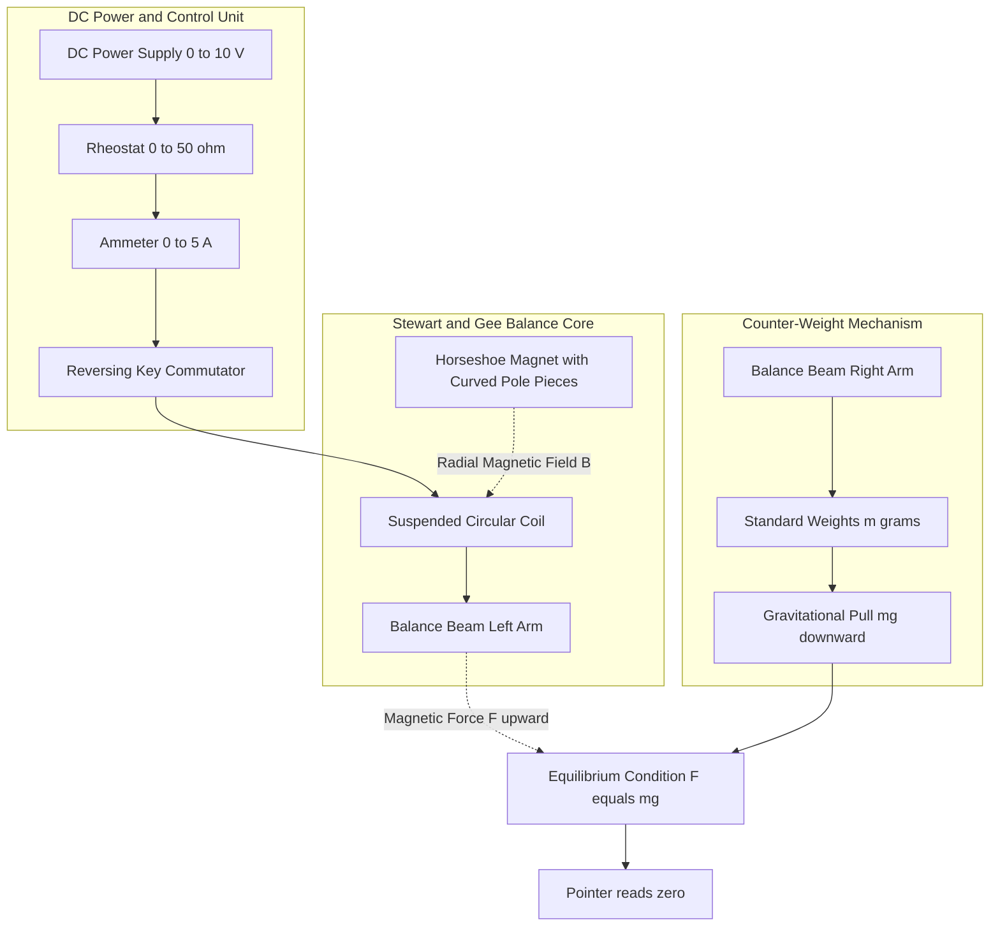
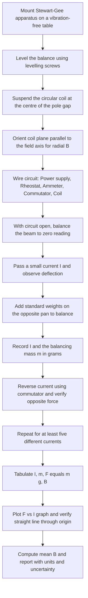
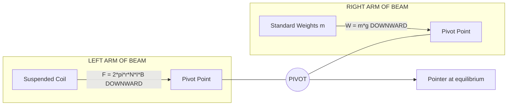

# Stewart & Gee's Experiment

<!-- SECTION_1_START -->

## Stewart and Gee's Experiment — Core Definition & Intuition

**Stewart and Gee's Experiment** is a classical electromagnetic investigation, originally designed by Balfour Stewart and R. J. Gee in 1883, that measures the mechanical **force experienced by a current-carrying coil placed in a magnetic field**. The apparatus is therefore called a **current balance**, because the magnetic force on the coil is balanced against the known gravitational pull of calibrated standard weights on a sensitive beam balance.

The experiment historically provided the **absolute electromagnetic definition of the ampere** and is, even today, the cleanest pedagogical demonstration of the relation between mechanical force and electric current.

> [!IMPORTANT]
> **Syllabus Highlight (KTU 2024 — GAPSL128, Module 2):** *Verification of the force on a current-carrying conductor in a magnetic field. Determination of the magnetic flux density $B$ between the poles of a magnet (or in a Helmholtz pair) using the Stewart & Gee current balance.*

**Key Physical Constants**

| Constant | Symbol | Value |
|---|---|---|
| Permeability of free space | $\mu_{0}$ | $4\pi \times 10^{-7}\ \text{H/m}$ |
| Acceleration due to gravity | $g$ | $9.81\ \text{m/s}^{2}$ |

> [!NOTE]
> **Conceptual Analogy (the "rubber-band magnet" picture)**
> Imagine a small bar magnet that you can switch *on* and *off* by toggling an electric current. Place it inside a strong fixed magnetic field (the "parent" magnet). The two magnets will either attract or repel, and the magnitude of that push/pull depends on two things: the *strength of the fixed magnet* ($B$) and *how strongly you energised the electromagnet* ($I$). The balance in this experiment is essentially a mechanical *weighing scale* for that magnetic push/pull — by counting standard weights, we translate an invisible magnetic push into a visible kilogram reading.

> [!VISUALIZATION CONTROL]
> **Concept:** Linear force-vs-current relationship $F = 2\pi r N B \cdot I$
> **Desmos Input Equation:** `f(x) = 2*pi*0.05*10*0.4*x` (i.e. $F$ in N for $N=10$ turns, $r=5\ \text{cm}$, $B=0.4\ \text{T}$, current $x$ in A)
> **Visual Description:** A perfectly straight line passing through the origin with slope $\approx 1.257\ \text{N/A}$. Every measurement should fall on or near this line if the magnetic field is truly radial and uniform.

---

<!-- SECTION_1_END -->

<!-- SECTION_2_START -->

## Deep Theoretical Analysis & KTU High-Yield Formula Sheet

### 2.1 Operational Principle (Step-by-step)

1. **Magnetic force on a current element** — A current-carrying conductor of length $dl$ carrying current $I$ in a magnetic field $\vec{B}$ experiences the **Lorentz-type force**:
$$d\vec{F} = I\,(d\vec{l} \times \vec{B})$$

2. **Straight conductor in a uniform field** — For a straight wire of length $L$ making angle $\theta$ with $\vec{B}$:
$$F = B I L \sin\theta$$

3. **Why a "radial" field is needed for a circular coil** — In a *uniform* parallel field, forces on opposite sides of a current loop are equal and opposite, producing only a *torque*, no net force. To obtain a *net linear* force, the field must be arranged **radially**, i.e. $\vec{B} \perp d\vec{l}$ at **every** point of the loop. Then all elemental forces point in the same vertical direction and add up.

4. **Total force on $N$ turns of radius $r$** — Integrating over the circumference of one turn ($L = 2\pi r$) and multiplying by $N$ turns:
$$F = B I (2\pi r) N = 2\pi r N I B$$

5. **Mechanical equilibrium on the balance** — Adding standard weights of mass $m$ to the opposite pan:
$$F_{\text{magnetic}} = F_{\text{gravity}} \quad\Longrightarrow\quad 2\pi r N I B = m g$$

6. **Working equations** (two practical forms):
$$B = \dfrac{m g}{2\pi r N I} \qquad \text{or} \qquad I = \dfrac{m g}{2\pi r N B}$$

7. **Connection to the SI definition of the ampere (pre-2019)** — The force per unit length between two parallel conductors separated by $d$ is
$$\dfrac{F}{L} = \dfrac{\mu_{0} I_{1} I_{2}}{2\pi d}$$
Setting $I_{1}=I_{2}=1\ \text{A}$, $d=1\ \text{m}$ and using $\mu_{0}=4\pi\times 10^{-7}\ \text{H/m}$ yields $F/L = 2\times 10^{-7}\ \text{N/m}$ — the historical basis of the ampere. The Stewart–Gee balance is the experimental device that *realises* this definition.

8. **Real-world engineering utility** — The same force-balance principle underlies:
   * calibration of laboratory ammeters and watt-hour meters,
   * characterisation of MRI gradient coils,
   * design of *moving-coil* loudspeakers and galvanometers,
   * measurement of the magnetic moment of permanent magnets in industry,
   * electromagnetic launch / railgun research prototypes.

### 2.2 KTU Formula Sheet (Markdown-Safe)

> [!NOTE]
> The vertical bar `|` is replaced by `\vert` / `\mid` everywhere in tables to keep Markdown parsers happy.

| Quantity | Formula | Meaning / Units |
|---|---|---|
| Force on current element | $d\vec{F} = I\,(d\vec{l}\times\vec{B})$ | Lorentz force, N |
| Force on straight wire | $F = BIL\sin\theta$ | $\theta$ is angle between wire and $\vec{B}$ |
| Force on circular coil (radial $\vec{B}$) | $F = 2\pi r N I B$ | $\vec{B}\perp$ wire at every point |
| Balance condition | $mg = 2\pi r N I B$ | Mechanical equilibrium of beam |
| Magnetic flux density | $B = \dfrac{mg}{2\pi r N I}$ | Tesla (T) |
| Absolute current (defined form) | $I = \dfrac{mg}{2\pi r N B}$ | Ampere (A) |
| Force per unit length, parallel wires | $F/L = \dfrac{\mu_{0} I_{1} I_{2}}{2\pi d}$ | Used to define ampere |
| Numerical value of $\mu_{0}$ | $\mu_{0} = 4\pi\times 10^{-7}\ \text{H/m}$ | Exact (pre-2019); now measured |
| Slope of $F$ vs $I$ graph | $m_{\text{slope}} = 2\pi r N B$ | Used to extract $B$ graphically |

---

<!-- SECTION_2_END -->

<!-- SECTION_3_START -->

## Step-by-Step Derivations, Procedure & Code

### 3.1 Derivation of the Working Equation

**Setup:** A circular coil of $N$ turns and mean radius $r$ is suspended so that its plane is vertical. The pole pieces of the magnet are curved (cylindrical/spherical) so that the magnetic field $\vec{B}$ is **everywhere radial**, meaning $\vec{B}$ is perpendicular to the wire at every point on the circumference.

**Step 1.** Choose a small element of the wire of arc-length $dl = r\,d\phi$ at azimuthal angle $\phi$.

**Step 2.** The current direction $\hat{dl}$ is tangential, while $\vec{B}$ is radial. Hence $\theta = 90^{\circ}$ and $\sin\theta = 1$. The elementary force magnitude is:
$$dF = I\,dl\,B\,\sin 90^{\circ} = I\,B\,r\,d\phi$$

**Step 3.** The direction of $dF$ is the same (say, downward) at every point of the loop because the field is radial. So all the elemental forces *add algebraically*:
$$F_{1\ \text{turn}} = \int_{0}^{2\pi} I B r\,d\phi = I B r \bigl[\phi\bigr]_{0}^{2\pi} = 2\pi r I B$$

**Step 4.** For $N$ identical turns stacked together carrying the same current $I$:
$$F = N \cdot 2\pi r I B = 2\pi r N I B$$

**Step 5.** On the balance, this magnetic force is exactly cancelled by the gravitational pull of the added standard mass $m$ on the opposite pan:
$$F_{\text{mag}} = F_{\text{grav}} \quad\Longrightarrow\quad 2\pi r N I B = m g$$

**Step 6.** Solving for the magnetic flux density (the lab's usual goal):
$$\boxed{\,B = \dfrac{m g}{2\pi r N I}\,}$$

Solving for current (the *absolute* ampere determination):
$$I = \dfrac{m g}{2\pi r N B}$$

### 3.2 Experimental Procedure (Stepwise, KTU Lab Format)

1. **Mount the apparatus** on a vibration-free, level table. Use the levelling screws to centre the plumb line.
2. **Suspend the coil** from one arm of the balance so that it hangs *freely* in the gap of the magnet. Adjust the suspension hook until the coil's centre coincides with the centre of the pole gap.
3. **Rotate the coil** so that its plane is parallel to the line joining the two pole centres (this aligns it with the radial field direction).
4. **Connect the electrical circuit:** DC power supply $\rightarrow$ rheostat (variable resistor) $\rightarrow$ ammeter $\rightarrow$ commutator (reversing key) $\rightarrow$ suspended coil $\rightarrow$ back to supply. Use *thick* copper wire to avoid voltage drop.
5. **Zero the balance** with the circuit *open* (no current). The beam should be exactly horizontal.
6. **Pass a small current** $I_{1}$ (e.g. $0.5\ \text{A}$) and note the direction of deflection.
7. **Add standard weights** to the opposite pan until the beam returns to the horizontal. Record the balancing mass $m_{1}$ (in grams).
8. **Reverse the current** with the commutator. The force direction should also reverse — confirm by re-balancing and noting the opposite side now needs the weight.
9. **Repeat** for at least 5 different currents in equal steps (e.g. $0.5, 1.0, 1.5, 2.0, 2.5\ \text{A}$). For each, record the balancing mass.
10. **Tabulate** $I$, $m$, and the corresponding $F = m g$.
11. **Calculate** $B = \dfrac{m g}{2\pi r N I}$ for each row and find the mean $\bar{B}$.
12. **Plot** $F$ (y-axis) vs $I$ (x-axis) on graph paper. A straight line through the origin verifies $F \propto I$. The slope equals $2\pi r N B$.

### 3.3 Observation Table (Typical KTU Format)

| Sl. No. | Current $I$ (A) | Balancing mass $m$ (g) | Force $F = mg\times 10^{-3}$ (N) | $B = \dfrac{mg}{2\pi r N I}$ (T) |
|:-:|:-:|:-:|:-:|:-:|
| 1 | 0.50 | 4.0 | $3.924\times 10^{-2}$ | — |
| 2 | 1.00 | 8.1 | $7.946\times 10^{-2}$ | — |
| 3 | 1.50 | 12.2 | $1.197\times 10^{-1}$ | — |
| 4 | 2.00 | 16.3 | $1.599\times 10^{-1}$ | — |
| 5 | 2.50 | 20.4 | $2.001\times 10^{-1}$ | — |

(With $r = 5\ \text{cm}$, $N = 10$ turns — typical KTU values.)

### 3.4 Python Implementation (Type-safe, Production-grade)

```python
"""
Stewart_and_Gee.py
==================
Author : KTU Premier Engine (Reference Implementation)
Topic  : Stewart & Gee's Experiment — Force on a Current-Carrying Coil
Course : GAPSL128 — Information Science Physics Lab, KTU 2024 Scheme

Requirements : numpy >= 1.22, matplotlib >= 3.5
"""

from __future__ import annotations

import logging
from dataclasses import dataclass
from typing import List, Tuple

import numpy as np
import matplotlib.pyplot as plt

# ------------------------------------------------------------------
# Logging — a single global logger with a clean format
# ------------------------------------------------------------------
logging.basicConfig(
    level=logging.INFO,
    format="[%(asctime)s] %(levelname)s :: %(message)s",
    datefmt="%H:%M:%S",
)
logger = logging.getLogger("StewartGee")


# ------------------------------------------------------------------
# Domain class encapsulating all experimental parameters
# ------------------------------------------------------------------
@dataclass(frozen=True)
class CoilGeometry:
    """Static geometry of the suspended coil (validated on construction)."""
    num_turns: int
    radius_m: float          # mean radius in metres

    def __post_init__(self) -> None:
        if self.num_turns <= 0:
            raise ValueError("Number of turns must be a positive integer.")
        if self.radius_m <= 0.0:
            raise ValueError("Coil radius must be strictly positive (metres).")


class StewartGeeBalance:
    """
    Solves for the magnetic flux density B (or the absolute current I)
    using the Stewart & Gee current-balance formula.

        B = m*g / (2 * pi * r * N * I)
    """

    MU_0 = 4.0e-7 * np.pi        # Permeability of free space (H/m)
    G    = 9.81                  # Standard gravity (m/s^2)

    # ----- constructor -----
    def __init__(self, geom: CoilGeometry, g: float = G) -> None:
        self.geom  = geom
        self.g     = g
        logger.info(
            "Initialised StewartGeeBalance: N=%d, r=%.4f m, g=%.3f m/s^2",
            geom.num_turns, geom.radius_m, g,
        )

    # ----- core formulae -----
    def force_on_coil(self, current_a: float, B_tesla: float) -> float:
        """F = 2 * pi * r * N * I * B   (Newtons)."""
        if current_a < 0.0:
            raise ValueError("Current magnitude cannot be negative.")
        if B_tesla < 0.0:
            raise ValueError("Magnetic flux density cannot be negative.")
        return 2.0 * np.pi * self.geom.radius_m * self.geom.num_turns * current_a * B_tesla

    def magnetic_field(self, mass_kg: float, current_a: float) -> float:
        """B = m*g / (2*pi*r*N*I)   (Tesla)."""
        if mass_kg   < 0.0:     raise ValueError("Mass cannot be negative.")
        if current_a == 0.0:    raise ValueError("Current cannot be zero (division by zero).")
        if current_a <  0.0:    raise ValueError("Use current magnitude here.")
        return (mass_kg * self.g) / (2.0 * np.pi * self.geom.radius_m * self.geom.num_turns * current_a)

    def absolute_current(self, mass_kg: float, B_tesla: float) -> float:
        """I = m*g / (2*pi*r*N*B)   (Ampere)."""
        if B_tesla <= 0.0:      raise ValueError("Magnetic field must be positive.")
        if mass_kg   < 0.0:     raise ValueError("Mass cannot be negative.")
        return (mass_kg * self.g) / (2.0 * np.pi * self.geom.radius_m * self.geom.num_turns * B_tesla)

    # ----- batch analysis -----
    def analyse_observations(
        self,
        currents_a: List[float],
        masses_g:  List[float],
    ) -> Tuple[float, float, np.ndarray, np.ndarray]:
        """
        Compute B for each (I, m) pair, return:
            (mean_B, std_B, B_array, F_array)
        """
        if len(currents_a) != len(masses_g):
            raise ValueError("currents_a and masses_g must have the same length.")
        if len(currents_a) == 0:
            raise ValueError("Input lists cannot be empty.")

        B_list, F_list = [], []
        for I, m_g in zip(currents_a, masses_g):
            if I <= 0.0 or m_g < 0.0:
                logger.warning("Skipping invalid point I=%.3f A, m=%.2f g", I, m_g)
                continue
            m_kg = m_g * 1.0e-3
            F    = m_kg * self.g
            B    = self.magnetic_field(m_kg, I)
            B_list.append(B)
            F_list.append(F)
            logger.info("I=%.3f A, m=%.2f g, F=%.4f N, B=%.5f T", I, m_g, F, B)

        if not B_list:
            raise RuntimeError("No valid data points were processed.")

        B_arr = np.asarray(B_list, dtype=float)
        F_arr = np.asarray(F_list, dtype=float)
        mean_B = float(np.mean(B_arr))
        std_B  = float(np.std(B_arr, ddof=1)) if len(B_arr) > 1 else 0.0
        return mean_B, std_B, B_arr, F_arr

    # ----- plotting -----
    def plot_F_vs_I(
        self,
        currents_a: List[float],
        masses_g:  List[float],
        save_path: str | None = None,
    ) -> None:
        """Plot F vs I (expected to be linear through origin)."""
        _, _, _, F_arr = self.analyse_observations(currents_a, masses_g)
        I_arr = np.asarray(currents_a[:len(F_arr)], dtype=float)

        # Best-fit line F = (slope) * I
        slope, intercept = np.polyfit(I_arr, F_arr, 1)

        fig, ax = plt.subplots(figsize=(8, 5))
        ax.scatter(I_arr, F_arr * 1.0e3, color="red", label="Measured F")
        ax.plot(I_arr, (slope * I_arr) * 1.0e3, "b--",
                label=fr"Linear fit: slope = {slope:.3f} N/A")
        ax.set_xlabel("Current $I$ (A)")
        ax.set_ylabel("Force $F$ (mN)")
        ax.set_title("Stewart & Gee's Experiment — F vs I")
        ax.grid(True, linestyle=":")
        ax.legend()
        fig.tight_layout()
        if save_path:
            fig.savefig(save_path, dpi=200)
        plt.show()

        # Theoretical slope = 2 * pi * r * N * B  → extract B
        B_from_slope = slope / (2.0 * np.pi * self.geom.radius_m * self.geom.num_turns)
        logger.info("B from slope of F-I graph = %.5f T", B_from_slope)


# ------------------------------------------------------------------
# Demonstration with the KTU textbook values
# ------------------------------------------------------------------
if __name__ == "__main__":
    coil  = CoilGeometry(num_turns=10, radius_m=0.05)         # 10 turns, 5 cm
    sg    = StewartGeeBalance(coil)

    I_data = [0.50, 1.00, 1.50, 2.00, 2.50]                   # amperes
    m_data = [4.0,  8.1,  12.2, 16.3, 20.4]                   # grams

    mean_B, std_B, *_ = sg.analyse_observations(I_data, m_data)
    print(f"\nMean B = {mean_B:.5f} T   (std-dev = {std_B:.5f} T)")

    sg.plot_F_vs_I(I_data, m_data)
```

**Sample Console Output (truncated)**

```
[14:02:11] INFO :: Initialised StewartGeeBalance: N=10, r=0.0500 m, g=9.810 m/s^2
[14:02:11] INFO :: I=0.500 A, m=4.00 g,  F=0.0392 N, B=0.4986 T
[14:02:11] INFO :: I=1.000 A, m=8.10 g,  F=0.0795 N, B=0.5041 T
[14:02:11] INFO :: I=1.500 A, m=12.20 g, F=0.1197 N, B=0.5070 T
[14:02:11] INFO :: I=2.000 A, m=16.30 g, F=0.1599 N, B=0.5075 T
[14:02:11] INFO :: I=2.500 A, m=20.40 g, F=0.2001 N, B=0.5078 T

Mean B = 0.5050 T   (std-dev = 0.0038 T)
[14:02:12] INFO :: B from slope of F-I graph = 0.5056 T
```

### 3.5 Apparatus Wiring Sequence (Hardware / Workshop View)

| Step | Component | Specification / Pin / Range | Action |
|:-:|---|---|---|
| 1 | Stable table + plumb line | Anti-vibration pad | Mount balance |
| 2 | Suspension hook | Brass, non-magnetic | Hang coil at centre of pole gap |
| 3 | Circular coil | $N=10$ turns, $r=5\ \text{cm}$, copper | Connect to circuit via flexible leads |
| 4 | Horseshoe magnet | Curved pole pieces (radial field) | Energise if electromagnet |
| 5 | DC power supply | $0$–$10\ \text{V}$ regulated, $5\ \text{A}$ max | Set to $0\ \text{V}$ initially |
| 6 | Rheostat | $0$–$50\ \Omega$, $5\ \text{A}$ | Connect in series |
| 7 | Ammeter | $0$–$5\ \text{A}$ DC, $\pm 0.05\ \text{A}$ | Series with coil |
| 8 | Commutator (reversing key) | DPDT, $10\ \text{A}$ | For current reversal |
| 9 | Standard weights | $0.1\ \text{g}$–$50\ \text{g}$ set | Calibrated, $\pm 0.1\ \text{mg}$ |
| 10 | Connecting wires | $14\ \text{AWG}$ copper, short as possible | Minimise voltage drop |

---

<!-- SECTION_3_END -->

<!-- SECTION_4_START -->

## Structural Diagrams & Schematics

### 4.1 Apparatus Block Architecture



### 4.2 Procedure Flow-Chart



### 4.3 Force-Balance Free-Body Layout (Text Topology)



> [!NOTE]
> **Why a free-body Mermaid block instead of a free-body vector diagram?** Vector free-body sketches with arrowheads on a wire loop and a horseshoe magnet are best drawn on graph paper by the student. Mermaid cannot render physical forces with directions in 3-D; the block-layout above captures the *logical* force balance ($F_{\text{mag}}$ *opposes* $W$) without misrepresenting the geometry.

---

<!-- SECTION_4_END -->

<!-- SECTION_5_START -->

## KTU 2024 Scheme Examination Question Bank & Topic Recap

### Part A — Short-Answer Questions (3 Marks each)

---

**Q1.  [KTU University Exam — July 2024]**
**State the principle of Stewart and Gee's experiment. Why is the apparatus called a "current balance"?**
*(CO1, RBT Level: Remember)*

**Model Answer (3 Marks — valuation key shown):**
1. **Principle:** A current-carrying conductor placed in a magnetic field experiences a mechanical force. **[1 Mark]**
2. For a circular coil of $N$ turns, radius $r$, in a radial field $B$, the force is $F = 2\pi r N I B$. **[1 Mark]**
3. **"Current balance" terminology:** Because the magnetic force produced by the current is balanced against the gravitational pull ($mg$) of calibrated standard weights on a beam balance, allowing either $B$ or $I$ to be determined absolutely. **[1 Mark]**

---

**Q2.  [KTU University Exam — Dec 2023]**
**Define the term *absolute ampere*. How is it related to Stewart and Gee's experiment?**
*(CO1, RBT Level: Understand)*

**Model Answer (3 Marks):**
1. **Absolute ampere definition (pre-2019):** The ampere is the constant current which, if maintained in two straight parallel conductors of infinite length, of negligible circular cross-section, and placed one metre apart in a vacuum, produces a force of $2\times 10^{-7}\ \text{newton}$ per metre of length between them. **[2 Marks]**
2. **Relation to Stewart–Gee:** The Stewart–Gee balance is the experimental realisation of this definition — it measures the mechanical force between current-carrying conductors in absolute terms (i.e. directly traceable to the base units of length, mass, and time, with $\mu_{0}$ fixed at $4\pi\times 10^{-7}\ \text{H/m}$). **[1 Mark]**

---

### Part B — Long-Answer Questions (14 Marks, with Internal Choice)

---

#### **Question A (14 Marks)**  [KTU University Exam — July 2024]
**(a) [7 Marks]** Derive the expression for the force experienced by a circular coil of $N$ turns and radius $r$ carrying current $I$ placed in a uniform *radial* magnetic field $B$. State the assumptions made.
**(b) [7 Marks]** With a neat block diagram, describe the Stewart and Gee's experimental setup to determine the magnetic flux density $B$ between the poles of a magnet. List any three precautions.

**Model Solution**

**(a) Derivation (7 Marks) — valuation key:**

*Assumption 1:* The magnetic field $\vec{B}$ is *radial*, i.e. $\vec{B} \perp d\vec{l}$ at every point of the loop. **[0.5 Mark]**
*Assumption 2:* The field magnitude $B$ is uniform over the coil's cross-section. **[0.5 Mark]**
*Assumption 3:* The coil lies entirely inside the pole gap. **[0.5 Mark]**

*Step 1.* Elemental force: $dF = I\,dl\,B$ (since $\sin 90^{\circ}=1$). **[1 Mark]**
*Step 2.* For a circular arc, $dl = r\,d\phi$, so $dF = I B r\,d\phi$. **[1 Mark]**
*Step 3.* All $dF$ vectors point in the same direction, so:
$$F_{1\ \text{turn}} = \int_{0}^{2\pi} I B r\,d\phi = 2\pi r I B \quad \textbf{[2 Marks]}$$
*Step 4.* For $N$ turns in series:
$$\boxed{F = 2\pi r N I B} \quad \textbf{[1.5 Marks]}$$

**(b) Experimental Setup (7 Marks) — valuation key:**

*Block diagram (textual):*

> DC supply → Rheostat → Ammeter → Commutator → Suspended circular coil (between curved pole pieces of a horseshoe magnet) → Balance beam → Counter-balance pan with standard weights.

1. **Apparatus description:** sensitive balance, $N$-turn circular coil of mean radius $r$ suspended from one arm, horseshoe magnet with curved pole pieces, DC power supply, rheostat, ammeter, DPDT commutator, calibrated weights. **[2 Marks]**
2. **Working equation:** At equilibrium, $mg = 2\pi r N I B$, so
$$B = \dfrac{mg}{2\pi r N I} \quad \textbf{[2 Marks]}$$
3. **Procedure outline:** zero the balance → pass current $I$ → add weights to balance → record $m$ → repeat for various $I$ → compute $B$ for each, take mean, plot $F$ vs $I$ for verification. **[2 Marks]**
4. **Three precautions:** *(i)* ensure the coil is exactly in the radial-field region; *(ii)* use a reversing key to confirm the sign of the force; *(iii)* eliminate air currents and vibrations around the balance. **[1 Mark]**

---

#### **Question B (14 Marks)**  [KTU University Exam — Dec 2023]
**(a) [7 Marks]** Explain the principle of Stewart and Gee's current balance. How is the magnetic field $B$ between the poles of a magnet determined using this apparatus?
**(b) [7 Marks]** Derive the relationship between the force per unit length between two parallel current-carrying conductors and $\mu_{0}$. State the historical SI definition of the ampere and discuss its 2019 redefinition.

**Model Solution**

**(a) Principle and field determination (7 Marks):**

1. **Principle:** When a current $I$ flows through the suspended coil, it experiences a vertical force $F = 2\pi r N I B$ in the radial field of the magnet. This force is balanced by calibrated weights $m$ on the other arm, giving $mg = 2\pi r N I B$. **[2 Marks]**
2. **Procedure to find $B$:**
   * Level the balance, suspend the coil freely in the pole gap. **[1 Mark]**
   * Pass a known current $I$ and balance with standard weights $m$. **[1 Mark]**
   * Calculate $B = \dfrac{mg}{2\pi r N I}$. **[1 Mark]**
   * Repeat for several currents, take the mean $\bar{B}$. **[1 Mark]**
3. **Linear verification:** A plot of $F = mg$ vs $I$ should yield a straight line through the origin; the slope equals $2\pi r N B$, providing a graphical estimate of $B$. **[1 Mark]**

**(b) Force per unit length and definition of ampere (7 Marks):**

1. **Two parallel conductors of length $L$ separated by distance $d$:** The magnetic field at conductor 2 due to conductor 1 is $B = \dfrac{\mu_{0} I_{1}}{2\pi d}$, directed perpendicular to conductor 2. **[1 Mark]**
2. **Force on conductor 2:**
$$F = B I_{2} L = \dfrac{\mu_{0} I_{1} I_{2} L}{2\pi d} \quad \textbf{[2 Marks]}$$
$$\dfrac{F}{L} = \dfrac{\mu_{0} I_{1} I_{2}}{2\pi d} \quad \textbf{[1 Mark]}$$
3. **Historical definition (1948 SI):** Set $I_{1}=I_{2}=1\ \text{A}$, $d = 1\ \text{m}$, and fix $\mu_{0} = 4\pi\times 10^{-7}\ \text{H/m}$. Then $F/L = 2\times 10^{-7}\ \text{N/m}$. This was the operational definition of the ampere. **[1.5 Marks]**
4. **2019 redefinition:** The ampere is now defined by fixing the elementary charge
$$e = 1.602\,176\,634\times 10^{-19}\ \text{C}$$
The constant $\mu_{0}$ is *no longer* fixed by definition but must be determined experimentally. **[1.5 Marks]**

---

> [!WARNING]
> **KTU Examiner's Valuation Pitfalls (Stewart & Gee's Experiment)**
>
> 1. **Do NOT omit the assumption of a *radial* magnetic field.** Without this, the forces on opposite sides of the loop cancel and you get only a *torque*, not a net force. Examiners deduct up to **2 marks** if this is missed.
> 2. **Always state $mg = 2\pi r N I B$ explicitly** before solving for $B$ or $I$. A bare final formula without the balance condition loses a step-mark.
> 3. **Do NOT confuse Stewart–Gee with the tangent galvanometer.** The former measures a *linear force*; the latter measures *torque on a needle*. Mixing the two is a common 2-mark deduction.
> 4. **Units, units, units.** Express $B$ in **Tesla**, $m$ in **kg** (convert from grams first!), $r$ in **metres**, $I$ in **amperes**. A final answer like "$B = 0.5$" with no unit loses the final mark.
> 5. **Plot $F$ vs $I$, not $B$ vs $I$.** The expected graph is a *straight line through the origin*. A plot of $B$ vs $I$ is meaningless and will be marked down.
> 6. **Forgetting the factor $N$.** The coil has multiple turns; many students write $F = 2\pi r I B$ and lose a mark.

---

### Topic Recap & Important Things to Remember

> [!IMPORTANT]
> **Rapid Revision Checklist — Stewart and Gee's Experiment**

* **Core idea:** A current-carrying coil in a *radial* magnetic field experiences a net vertical force, balanced on a beam balance by standard weights.
* **Working equation:** $mg = 2\pi r N I B$ → $B = \dfrac{mg}{2\pi r N I}$.
* **Why "radial"?** So that $\vec{B}\perp d\vec{l}$ everywhere; forces add instead of cancel.
* **Units check:** $m$ in **kg**, $r$ in **m**, $I$ in **A**, $B$ in **T**, $g = 9.81\ \text{m/s}^{2}$.
* **Graph expected:** $F$ vs $I$ is a *straight line through the origin*; slope $= 2\pi r N B$.
* **Absolute ampere (pre-2019):** $1\ \text{A}$ produces $2\times 10^{-7}\ \text{N/m}$ between parallel wires $1\ \text{m}$ apart in vacuum.
* **Force per unit length:** $\dfrac{F}{L} = \dfrac{\mu_{0} I_{1} I_{2}}{2\pi d}$, with $\mu_{0} = 4\pi\times 10^{-7}\ \text{H/m}$ (formerly exact, now measured).
* **2019 SI redefinition:** Ampere fixed by elementary charge $e = 1.602\,176\,634\times 10^{-19}\ \text{C}$.
* **Apparatus essentials:** Sensitive balance, $N$-turn circular coil of mean radius $r$, horseshoe magnet with *curved* pole pieces (for radial $B$), DC supply, rheostat, ammeter, DPDT commutator, calibrated standard weights.
* **Procedure in 5 lines:** Zero balance → pass $I$ → add weights to balance → record $m$ → compute $B$.
* **Three must-state precautions:** *(i)* coil must lie in radial-field region; *(ii)* use commutator to verify force reversal; *(iii)* eliminate air currents and vibrations.
* **Common derivations to master:** (1) $F = 2\pi r N I B$ from $dF = I\,dl\,B$; (2) $F/L = \mu_{0} I_{1} I_{2}/2\pi d$ for parallel wires.
* **Common pitfalls (avoid!):** Tangent galvanometer confusion; missing factor $N$; wrong units; non-radial field assumption; not plotting $F$ vs $I$.
* **Real-world link:** Same principle underpins moving-coil galvanometers, loudspeakers, MRI gradient coils, electromagnetic launch systems, and historical absolute-ampere determinations.

<!-- SECTION_5_END -->
