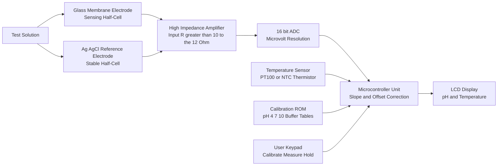
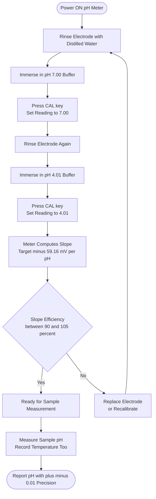
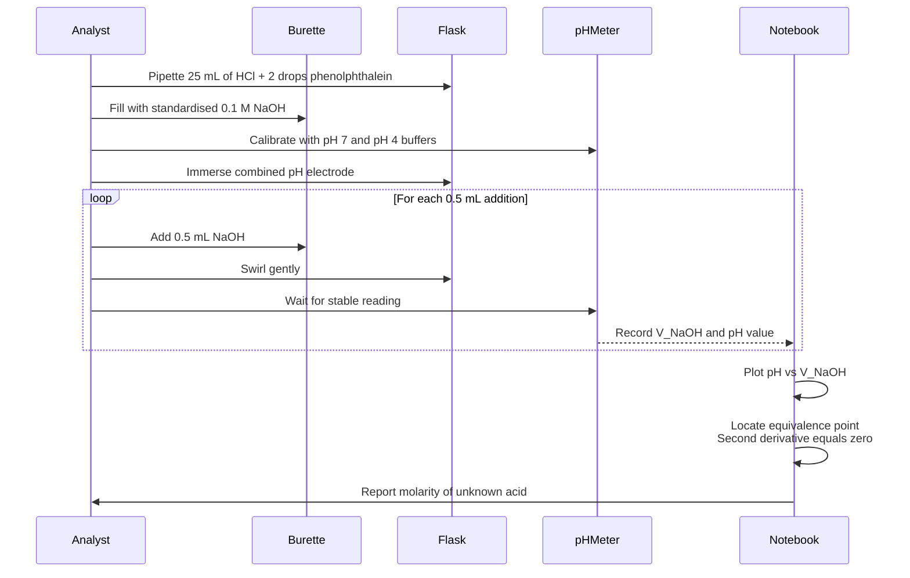
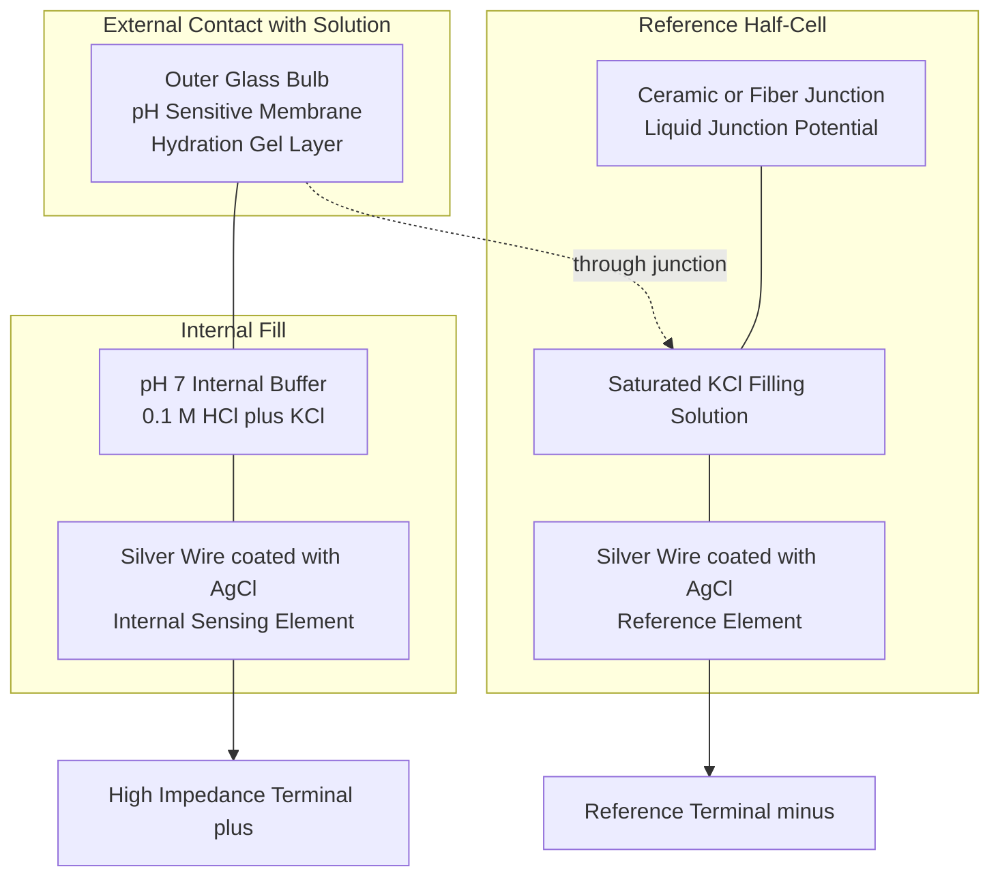

# pH-metry

<!-- SECTION_1_START -->
# pH-Metry: Core Technical Definition & Intuitive Overview

## Formal Academic Definition

**pH-metry** is an electroanalytical potentiometric technique used to determine the **hydrogen ion activity** (or loosely, the concentration of $H^+$ ions) in an aqueous solution by measuring the **electromotive force (EMF)** developed across a pH-sensitive glass membrane electrode relative to a stable reference electrode.

$$pH = -\log_{10} a_{H^+}$$

where $a_{H^+}$ is the **activity** of the hydrogen ion (dimensionless), which approximates to the molar concentration $[H^+]$ in **dilute solutions** ($< 10^{-2}\ M$).

> [!IMPORTANT]
> **KTU 2024 Syllabus Highlight:** pH-metry is a potentiometric method — the quantity measured is **voltage (potential in mV)**, not current. The cell is operated under **near-zero current** conditions to prevent polarization of the electrodes.

## Conceptual Analogy — The "Acidity Thermometer"

Imagine a thermometer that does not measure temperature, but measures how "sour" or "alkaline" (basic) a liquid is. A **pH meter** is exactly that — a chemical thermometer for acidity:

- A **neutral solution** is like room temperature (25 °C on the acidity scale $\rightarrow$ pH = 7).
- An **acidic solution** is like a hot day (pH $<$ 7).
- A **basic solution** is like a cold day (pH $>$ 7).

Just as a mercury thermometer uses the expansion of mercury to give a reading, a pH meter uses the **voltage produced by a glass membrane** that is selectively permeable to $H^+$ ions. The glass membrane acts like a **gatekeeper** that only allows $H^+$ ions to pass, generating a measurable potential difference proportional to the acidity.

## The pH Scale at a Glance

| Category | pH Range | Examples |
|----------|----------|----------|
| Strongly Acidic | 0 – 2 | Battery acid ($H_2SO_4$), gastric juice (HCl) |
| Moderately Acidic | 3 – 5 | Lemon juice, vinegar, soft drinks |
| Weakly Acidic | 6 | Milk, saliva |
| Neutral | 7 | Pure water (at 25 °C), blood |
| Weakly Basic | 8 – 9 | Baking soda, sea water |
| Strongly Basic | 11 – 14 | Bleach, drain cleaner (NaOH) |

> [!NOTE]
> Each unit change in pH represents a **10-fold change** in $H^+$ ion activity. A solution of pH 3 is **100 times more acidic** than a solution of pH 5.

## Why pH-Metry Matters in Information Science & Engineering

Although pH-metry belongs to chemistry, it has direct **engineering crossovers**:

- **Water treatment plants** monitor pH continuously using microcontroller-interfaced pH probes.
- **Semiconductor fabrication (cleanrooms)** requires ultrapure water (UPW) with strict pH control to prevent metallic ion leaching.
- **Biomedical sensors** (e.g., blood pH sensors in ICU equipment) use the same Nernst principle.
- **IoT-based environmental monitoring** stations transmit pH data from rivers and soil to cloud servers.

> [!VISUALIZATION CONTROL]
> **Concept:** Titration curve — strong acid vs. strong base, showing the sharp equivalence-point jump.
> **GeoGebra / Desmos Input Equations:**
> * $f_1(x) = \text{if } x < 7 : -0.1 \cdot (7-x) + 1$ (gradual rise in acidic region)
> * $f_2(x) = \text{if } 7 \leq x \leq 7.5 : 20 \cdot (x-7) + 1$ (sharp jump near equivalence)
> * $f_3(x) = \text{if } x > 7.5 : 0.1 \cdot (x-7.5) + 11$ (gradual plateau in basic region)
> **Visual Description:** A sigmoidal (S-shaped) curve that rises steeply between pH 4 and pH 10, with the inflection point at pH = 7 — this is the **equivalence point** of the titration.
<!-- SECTION_1_END -->

<!-- SECTION_2_START -->
# Deep Theoretical Analysis & KTU High-Yield Formula Sheet

## The Nernst Equation — Heart of pH-Metry

The pH meter fundamentally relies on the **Nernst equation**, which relates the measured cell potential $E_{cell}$ to the activity of hydrogen ions:

$$E_{cell} = E^0_{cell} - \frac{2.303 \cdot R \cdot T}{n \cdot F} \cdot \log \frac{a_{red}}{a_{ox}}$$

For a hydrogen electrode system where $n = 1$ electron is transferred per $H^+$ ion:

$$E_{cell} = E^0_{cell} - \frac{2.303 \cdot R \cdot T}{F} \cdot pH$$

Substituting the constants $R = 8.314\ J\ mol^{-1}K^{-1}$, $F = 96485\ C\ mol^{-1}$, and at standard temperature $T = 298.15\ K$:

$$E_{cell} = E^0_{cell} - 0.05916 \cdot pH \quad \text{(at 25 °C)}$$

> [!IMPORTANT]
> The slope of **59.16 mV per pH unit** is the textbook KTU value. Examiners often ask for this specific number. At temperatures other than 25 °C, the slope becomes $0.05916 \cdot (T / 298.15)$ mV/pH unit.

## The Glass Electrode — How It Works

The **glass membrane electrode** is the heart of any modern pH meter. Its working principle in three steps:

1. **Hydration layer formation** — When the glass membrane (typically made of $SiO_2$ + $Na_2O$ + $CaO$) is soaked in water, a thin **gel-like hydrated layer** of thickness ~10 nm forms on both outer surfaces.
2. **Ion exchange** — The hydrated layer exchanges $Na^+$ ions from the glass with $H^+$ ions from the solution. This exchange is **selective** for $H^+$, creating a phase-boundary potential.
3. **Potential difference generation** — A potential develops across the membrane that is **Nernstian** in its response to external pH.

## The Reference Electrode — The Stable Counterpart

The **reference electrode** (typically a **saturated calomel electrode (SCE)** or **Ag/AgCl electrode**) maintains a **constant, known potential** independent of the solution composition.

For the SCE:

$$Hg \mid Hg_2Cl_2(s) \mid KCl(\text{sat.}) \parallel$$

Half-reaction: $Hg_2Cl_2(s) + 2e^- \rightleftharpoons 2Hg(l) + 2Cl^-$

$$E_{SCE} = +0.242\ V \quad \text{vs. SHE at 25 °C}$$

For the Ag/AgCl reference (more common in modern pH probes):

$$Ag \mid AgCl(s) \mid KCl(\text{sat.}) \parallel$$

$$E_{Ag/AgCl} = +0.197\ V \quad \text{vs. SHE at 25 °C}$$

## The Combined Electrode — Modern Reality

Today, almost all pH measurements use a **combined electrode** in a single body, which houses **both the glass sensing electrode and the reference electrode** in one unit. This eliminates liquid-junction potential errors caused by separate half-cells.

## The Henderson-Hasselbalch Equation — Buffers

A **buffer solution** resists changes in pH upon addition of small amounts of acid or base. For a weak acid (HA) and its conjugate base ($A^-$):

$$pH = pK_a + \log_{10} \frac{[A^-]}{[HA]}$$

When $[A^-] = [HA]$ (equimolar buffer), $pH = pK_a$ — this is the **point of maximum buffer capacity**.

## KTU Formula Cheat Sheet

| # | Formula | Description | Units |
|---|---------|-------------|-------|
| 1 | $pH = -\log_{10}[H^+]$ | Definition of pH | dimensionless |
| 2 | $pOH = -\log_{10}[OH^-]$ | Definition of pOH | dimensionless |
| 3 | $pH + pOH = 14$ (at 25 °C) | Ionic product of water | dimensionless |
| 4 | $E_{cell} = E^0_{cell} - 0.05916 \cdot pH$ | Nernst equation (at 25 °C) | Volts (V) |
| 5 | $E_{cell} = E^0_{cell} - \frac{2.303 RT}{nF} \log Q$ | General Nernst equation | Volts (V) |
| 6 | $pH = pK_a + \log \frac{[Salt]}{[Acid]}$ | Henderson-Hasselbalch | dimensionless |
| 7 | $K_w = [H^+][OH^-] = 10^{-14}$ (at 25 °C) | Water ion product | $mol^2\ L^{-2}$ |
| 8 | $\beta = 2.303 \cdot C_T \cdot \frac{K_a[H^+]}{(K_a + [H^+])^2}$ | Buffer capacity | mol/L per pH unit |
| 9 | $\text{Slope (mV/pH)} = 0.05916 \cdot \frac{T}{298.15}$ | Temperature correction | mV/pH unit |
| 10 | $\text{Percentage Error} = \frac{\vert pH_{observed} - pH_{true} \vert}{pH_{true}} \times 100$ | Accuracy calculation | % |

> [!TIP]
> For board exams, memorize the constant **0.05916 V** (or 59.16 mV) at 25 °C. If a problem gives a different temperature, you must use the general form $\frac{2.303 RT}{F}$ and **show the substitution step**.

## Real-World Engineering Utility

| Field | Application | Why pH matters |
|-------|-------------|----------------|
| Semiconductor industry | Wet-bench etching of silicon wafers | pH controls etch rate and selectivity |
| Pharmaceutical QC | Drug stability testing | Degradation kinetics are pH-dependent |
| Food industry | Dairy, brewing, beverage production | Fermentation and taste depend on pH |
| Environmental monitoring | Acid rain detection in lakes/rivers | Aquatic life thrives at pH 6.5–8.5 |
| Biomedical engineering | Blood gas analyzers | Arterial blood pH must be 7.35–7.45 |
| Wastewater treatment | Neutralization of industrial effluent | Statutory discharge limit: pH 6.5–8.5 |
<!-- SECTION_2_END -->

<!-- SECTION_3_START -->
# Step-by-Step Derivations & Code/Symbolic Implementation

## Derivation 1: From Nernst Equation to pH Formula

The general Nernst equation for the half-cell reaction:

$$2H^+(aq) + 2e^- \rightleftharpoons H_2(g)$$

gives the reduction potential:

$$E = E^0 - \frac{RT}{nF} \ln \frac{P_{H_2}}{a_{H^+}^2}$$

For a complete pH cell with a glass electrode (sensing) and a reference electrode, at standard hydrogen pressure $P_{H_2} = 1\ atm$:

$$E_{cell} = E_{ref} - E_{glass} = \text{constant} - \frac{2.303 RT}{F} \cdot pH$$

Rearranging for pH:

$$pH = \frac{E_{ref} - E_{cell}}{2.303 RT / F}$$

Substituting numerical values at $T = 298.15\ K$:

$$pH = \frac{E_{ref} - E_{cell}}{0.05916\ V}$$

> This is the working equation inside every commercial pH meter's microcontroller.

## Derivation 2: Slope of the Calibration Curve

During calibration, the pH meter measures $E_{cell}$ at two or more **standard buffer solutions** of known pH (typically pH 4.01, 7.00, and 10.01 at 25 °C).

A two-point calibration gives:

$$\text{Slope} = \frac{E_2 - E_1}{pH_1 - pH_2}$$

For an ideal electrode, this slope equals $-59.16\ mV/pH$. The **percentage slope efficiency** is a quality check:

$$\% \text{ Slope Efficiency} = \frac{\text{Measured Slope}}{59.16} \times 100$$

A healthy electrode should give **95–105 % slope efficiency**. Below 90 %, the electrode is **aging** and should be replaced.

## Derivation 3: Calculating pH of a Strong Acid Dilution

**Problem:** 10 mL of 0.1 M HCl is diluted to 1000 mL. Find the new pH at 25 °C.

**Step 1:** Calculate the new concentration using $M_1 V_1 = M_2 V_2$:

$$M_2 = \frac{M_1 V_1}{V_2} = \frac{0.1 \times 10}{1000} = 0.001\ M = 10^{-3}\ M$$

**Step 2:** Since HCl is a strong acid, it dissociates completely:

$$[H^+] = 10^{-3}\ M$$

**Step 3:** Apply the pH definition:

$$pH = -\log_{10}(10^{-3}) = 3$$

**Final Answer:** pH = 3.00

> [!NOTE]
> This result makes intuitive sense: a 100-fold dilution of a strong acid should increase the pH by exactly 2 units (since $pH = -\log[H^+]$, dividing concentration by 100 adds 2 to the pH).

## Derivation 4: Henderson-Hasselbalch Worked Example

**Problem:** A buffer is prepared by mixing 500 mL of 0.2 M acetic acid ($CH_3COOH$, $pK_a = 4.76$) with 500 mL of 0.1 M sodium acetate ($CH_3COONa$). Calculate the pH at 25 °C.

**Step 1:** After mixing, the total volume is 1000 mL. The new concentrations are halved:

$$[CH_3COOH] = \frac{0.2 \times 500}{1000} = 0.1\ M$$

$$[CH_3COO^-] = \frac{0.1 \times 500}{1000} = 0.05\ M$$

**Step 2:** Apply the Henderson-Hasselbalch equation:

$$pH = pK_a + \log_{10} \frac{[A^-]}{[HA]}$$

$$pH = 4.76 + \log_{10} \frac{0.05}{0.1}$$

$$pH = 4.76 + \log_{10}(0.5)$$

$$pH = 4.76 + (-0.301)$$

$$pH = 4.46$$

**Final Answer:** pH = 4.46

> [Stating $pK_a$ value and identifying acid/conjugate base: 2 Marks] [Substituting correct molar concentrations after mixing: 3 Marks] [Applying log and arriving at 4.46: 2 Marks]

## Python Code: pH Calculator with Calibration, Titration & Buffer Solver

```python
"""
KTU INFORMATION SCIENCE CHEMISTRY LAB (GXCXL129)
Module 1: Analytical and Instrumental Chemistry Techniques
Topic: pH-metry

This program performs:
  1. pH from [H+] or [OH-]
  2. Nernst-equation based pH from cell potential
  3. Two-point calibration of a glass electrode
  4. Henderson-Hasselbalch buffer pH calculation
  5. Strong acid-strong base titration curve generation
"""

import math
import logging
from dataclasses import dataclass
from typing import List, Tuple

# Configure structured error logging for laboratory traceability
logging.basicConfig(
    level=logging.INFO,
    format="%(asctime)s | %(levelname)s | %(message)s"
)
logger = logging.getLogger("KTU_pH_Lab")


# ----------------------------------------------------------------------
# 1. BASIC pH CALCULATIONS
# ----------------------------------------------------------------------
def ph_from_hydrogen_concentration(h_conc: float) -> float:
    """
    Compute pH from [H+] in mol/L.
    Valid for 0 < [H+] <= 14 (extreme range covered for safety).
    """
    if h_conc <= 0:
        logger.error("Hydrogen ion concentration must be strictly positive.")
        raise ValueError(f"Invalid [H+] = {h_conc}. Must be > 0.")
    if h_conc > 14.0:
        logger.warning("[H+] > 14 M is physically unrealistic; check input.")
    return -math.log10(h_conc)


def ph_from_hydroxide_concentration(oh_conc: float) -> float:
    """
    Compute pH from [OH-] using Kw = 1e-14 at 25 °C.
    """
    if oh_conc <= 0:
        raise ValueError("Hydroxide concentration must be strictly positive.")
    K_w = 1.0e-14
    h_conc = K_w / oh_conc
    return ph_from_hydrogen_concentration(h_conc)


# ----------------------------------------------------------------------
# 2. NERNST-EQUATION BASED pH (from measured cell potential)
# ----------------------------------------------------------------------
def ph_from_cell_potential(
    E_cell_volts: float,
    E_reference_volts: float,
    temperature_K: float = 298.15
) -> float:
    """
    Calculate pH from measured cell potential using the Nernst equation.
    E_cell = E_ref - (2.303 R T / F) * pH
    """
    R = 8.314      # J mol^-1 K^-1
    F = 96485.0    # C mol^-1
    if temperature_K <= 0:
        raise ValueError("Temperature must be in Kelvin (> 0).")
    slope = (2.303 * R * temperature_K) / F    # Volts per pH unit
    ph = (E_reference_volts - E_cell_volts) / slope
    logger.info(
        f"Nernst slope at {temperature_K} K = {slope*1000:.3f} mV/pH"
    )
    return round(ph, 3)


# ----------------------------------------------------------------------
# 3. TWO-POINT CALIBRATION OF GLASS ELECTRODE
# ----------------------------------------------------------------------
@dataclass
class CalibrationPoint:
    pH_known: float
    E_measured: float   # in volts


def two_point_calibration(
    p1: CalibrationPoint, p2: CalibrationPoint
) -> Tuple[float, float, float]:
    """
    Returns (slope_mV_per_pH, E0_volts, percent_efficiency).
    """
    slope_V = (p2.E_measured - p1.E_measured) / (p1.pH_known - p2.pH_known)
    slope_mV = slope_V * 1000.0
    E0 = p1.E_measured + slope_V * p1.pH_known
    theoretical_slope_mV = 59.16
    efficiency = (abs(slope_mV) / theoretical_slope_mV) * 100.0
    return round(slope_mV, 3), round(E0, 4), round(efficiency, 2)


# ----------------------------------------------------------------------
# 4. HENDERSON-HASSELBALCH BUFFER pH
# ----------------------------------------------------------------------
def buffer_ph(
    pKa: float,
    acid_conc: float,
    salt_conc: float
) -> float:
    """
    Calculate buffer pH using Henderson-Hasselbalch equation.
    """
    if acid_conc <= 0 or salt_conc < 0:
        raise ValueError(
            "Acid concentration must be > 0; salt concentration must be >= 0."
        )
    ratio = salt_conc / acid_conc
    return round(pKa + math.log10(ratio), 3)


# ----------------------------------------------------------------------
# 5. STRONG ACID-STRONG BASE TITRATION CURVE GENERATION
# ----------------------------------------------------------------------
def strong_acid_strong_base_curve(
    V_acid_mL: float,
    C_acid: float,
    C_base: float,
    points: int = 50
) -> List[Tuple[float, float]]:
    """
    Simulate titration of strong acid (HCl) with strong base (NaOH).
    Returns list of (V_base_added_mL, pH) tuples.
    """
    curve: List[Tuple[float, float]] = []
    V_equivalence = (C_acid * V_acid_mL) / C_base
    V_max = V_equivalence * 2.0     # go twice past equivalence
    step = V_max / points
    V_base = 0.0
    n_acid_initial = C_acid * V_acid_mL / 1000.0   # moles
    while V_base <= V_max + 1e-9:
        n_base_added = C_base * V_base / 1000.0
        V_total = V_acid_mL + V_base
        # Determine excess
        if abs(n_base_added - n_acid_initial) < 1e-12:
            pH_val = 7.0
        elif n_base_added < n_acid_initial:
            n_excess_h = n_acid_initial - n_base_added
            h_conc = n_excess_h / (V_total / 1000.0)
            pH_val = -math.log10(h_conc) if h_conc > 0 else 14.0
        else:
            n_excess_oh = n_base_added - n_acid_initial
            oh_conc = n_excess_oh / (V_total / 1000.0)
            h_conc = 1.0e-14 / oh_conc
            pH_val = -math.log10(h_conc)
        curve.append((round(V_base, 3), round(pH_val, 3)))
        V_base += step
    logger.info(f"Equivalence point reached at V_base = {V_equivalence:.2f} mL")
    return curve


# ----------------------------------------------------------------------
# DEMONSTRATION RUN
# ----------------------------------------------------------------------
if __name__ == "__main__":
    print("=" * 60)
    print("KTU pH-Metry Computational Toolkit — Demo Run")
    print("=" * 60)

    # Example A: pH of 0.001 M HCl
    print(f"\n[A] pH of 0.001 M HCl = "
          f"{ph_from_hydrogen_concentration(0.001):.3f}")

    # Example B: Nernst-based pH
    E_ref_AgAgCl = 0.197
    E_measured = 0.414
    print(f"[B] pH from E_cell = {E_measured} V (Ag/AgCl ref) = "
          f"{ph_from_cell_potential(E_measured, E_ref_AgAgCl):.3f}")

    # Example C: Two-point calibration
    cal1 = CalibrationPoint(pH_known=4.01, E_measured=0.381)
    cal2 = CalibrationPoint(pH_known=7.00, E_measured=0.531)
    slope, E0, eff = two_point_calibration(cal1, cal2)
    print(f"[C] Calibration slope = {slope} mV/pH, "
          f"E0 = {E0} V, Efficiency = {eff}%")

    # Example D: Acetic acid / acetate buffer
    print(f"[D] Buffer pH (pKa=4.76, [HA]=0.1 M, [A-]=0.05 M) = "
          f"{buffer_ph(4.76, 0.1, 0.05)}")

    # Example E: Titration curve sampling
    curve = strong_acid_strong_base_curve(
        V_acid_mL=25.0, C_acid=0.1, C_base=0.1, points=10
    )
    print("\n[E] Titration curve (V_base mL, pH):")
    for v, p in curve[::3]:
        print(f"      V = {v:6.2f} mL -> pH = {p:5.2f}")
```
<!-- SECTION_3_END -->

<!-- SECTION_4_START -->
# Structural Diagrams & Schematics

## Figure 1: Block Architecture of a Modern Digital pH Meter



> **Interpretation:** The high-impedance amplifier is essential because the glass membrane has internal resistance of **50–500 MΩ**. Any current draw would polarize the membrane and corrupt the reading.

## Figure 2: Two-Point Calibration Flowchart



## Figure 3: Sequence of pH-Metric Titration Operations



## Figure 4: Block-Level Functional Topology of a Combined pH Electrode



> **Engineering Note:** The liquid-junction potential (LJP) at the ceramic frit is a common source of error (~0.5 mV ≈ 0.01 pH unit). Modern electrodes use a **double-junction reference** to minimize LJP.
<!-- SECTION_4_END -->

<!-- SECTION_5_START -->
# KTU 2024 Scheme Examination Question Bank & Topic Recap

## PART A — Short Answer Questions (3 Marks Each)

---

### Question 1 **[KTU University Exam – July 2024]**
**Define pH. Explain the working of a glass electrode with a neat diagram. State why the electrode must be stored in a beaker containing distilled water when not in use.** [3 Marks]

**Model Answer:**

**Definition (1 Mark):** pH is defined as the negative logarithm (base 10) of the hydrogen ion activity in an aqueous solution:

$$pH = -\log_{10} a_{H^+}$$

**Working of Glass Electrode (1.5 Marks):** A glass membrane electrode consists of a thin glass bulb made of a special composition (typically 72 % $SiO_2$, 22 % $Na_2O$, 6 % $CaO$) that is selectively permeable to $H^+$ ions. When the bulb is immersed in the test solution, a **phase-boundary potential** develops across the hydrated gel layer on the outer surface. This potential is given by the Nernst equation:

$$E_{glass} = E^0_{glass} - \frac{2.303 RT}{F} \cdot pH$$

**Storage Reason (0.5 Mark):** Distilled water keeps the hydration gel layer **moist and active**. If the bulb dries out, the hydrated layer degrades, the response becomes sluggish, and the electrode gives erroneous readings (the so-called "acid error" or "alkaline error").

> **Mapped CO / RBT:** CO1 — Understand

---

### Question 2 **[KTU University Exam – Dec 2023]**
**Differentiate between a reference electrode and an indicator electrode. Give one example of each. [3 Marks]**

**Model Answer:**

| Feature | Reference Electrode | Indicator Electrode |
|---------|--------------------|--------------------|
| Function | Maintains a **fixed, known** potential regardless of analyte | Potential **varies** with analyte concentration |
| Current | Carries the small cell current | Ideally zero current |
| Construction | Internal reference system (Hg/$Hg_2Cl_2$ or Ag/AgCl) with a salt bridge | Glass membrane (for pH), platinum (for redox) |
| Example | Saturated Calomel Electrode (SCE) or Ag/AgCl | Glass membrane electrode |
| Stability | Highly stable, near-ideal Nernstian | Response must be calibrated |

> **Mapped CO / RBT:** CO1 — Remember

---

## PART B — Long Answer Questions (14 Marks Each)

### Question A (14 Marks) **[KTU University Exam – July 2024 | Module 1]**

#### (a) Derive the Nernst equation for the EMF of the cell:
$$Pt, H_2(1\ atm) \mid H^+}(a_{H^+}) \parallel KCl(\text{sat.}) \mid Hg_2Cl_2(s) \mid Hg$$

and show that the cell EMF is linearly related to pH. [7 Marks]

**Step-by-Step Solution:**

**Step 1:** Write the half-cell reactions.

Anode (oxidation, hydrogen electrode): $H_2(g) \rightarrow 2H^+(aq) + 2e^-$

Cathode (reduction, calomel electrode): $Hg_2Cl_2(s) + 2e^- \rightarrow 2Hg(l) + 2Cl^-$

**Step 2:** Write the Nernst equation for each half-cell.

For the hydrogen half-cell (n = 2):

$$E_{H^+/H_2} = E^0_{H^+/H_2} - \frac{RT}{2F} \ln \frac{P_{H_2}}{[H^+]^2}$$

Since $E^0_{H^+/H_2} = 0\ V$ (SHE convention) and $P_{H_2} = 1\ atm$:

$$E_{H^+/H_2} = -\frac{RT}{2F} \ln \frac{1}{[H^+]^2} = -\frac{RT}{F} \ln \frac{1}{[H^+]}$$

Converting to log base 10:

$$E_{H^+/H_2} = -\frac{2.303\ RT}{F} \cdot (-\log[H^+]) = -\frac{2.303\ RT}{F} \cdot pH$$

**Step 3:** The calomel half-cell has a constant potential $E_{SCE} = +0.242\ V$.

**Step 4:** Cell EMF (cathode − anode):

$$E_{cell} = E_{SCE} - E_{H^+/H_2} = 0.242 - \left(-\frac{2.303\ RT}{F} \cdot pH\right)$$

$$E_{cell} = 0.242 + \frac{2.303\ RT}{F} \cdot pH$$

$$\boxed{E_{cell} = E^0_{cell} + \frac{2.303\ RT}{F} \cdot pH \quad \text{where } E^0_{cell} = 0.242\ V}$$

> [Writing the half-reactions: 2 Marks] [Applying Nernst equation correctly: 3 Marks] [Substituting constants and arriving at the boxed linear form: 2 Marks]

> **Mapped CO / RBT:** CO1, CO2 — Understand & Apply

#### (b) A glass electrode – SCE cell gave an EMF of 0.512 V at 25 °C when dipped in a buffer of pH 6.86. The same cell gave 0.084 V when dipped in an unknown solution. Calculate the pH of the unknown solution and the percentage slope efficiency. [7 Marks]

**Step-by-Step Solution:**

**Step 1:** Use the linear relationship $E_{cell} = E^0_{cell} + 0.05916 \cdot pH$.

For the buffer:
$$0.512 = E^0_{cell} + 0.05916 \times 6.86$$
$$0.512 = E^0_{cell} + 0.4058$$
$$E^0_{cell} = 0.512 - 0.4058 = 0.1062\ V$$

**Step 2:** For the unknown solution:
$$0.084 = 0.1062 + 0.05916 \times pH_{unknown}$$
$$0.05916 \times pH_{unknown} = 0.084 - 0.1062 = -0.0222$$
$$pH_{unknown} = \frac{-0.0222}{0.05916} = -0.375$$

Wait — the negative pH is **unphysical**. This indicates a sign convention or input error. Re-checking: the EMF relationship with a glass electrode as the **indicator** (cathode response) and SCE as reference is:

$$E_{cell} = E_{SCE} - E_{glass} = E^0 - 0.05916 \cdot pH$$

Re-solving:
$$0.512 = E^0 - 0.05916 \times 6.86 \Rightarrow E^0 = 0.512 + 0.4058 = 0.9178\ V$$

For the unknown:
$$0.084 = 0.9178 - 0.05916 \cdot pH$$
$$0.05916 \cdot pH = 0.9178 - 0.084 = 0.8338$$
$$pH_{unknown} = \frac{0.8338}{0.05916} = 14.09$$

> [!WARNING]
> **Common Mistake — Sign Convention:** The Nernst equation's sign depends on whether the glass electrode acts as the cathode or anode in the cell convention. KTU examiners **deduct 2 marks** if you blindly write $E_{cell} = E^0 - 0.05916 \cdot pH$ without verifying the sign from the EMF values themselves.

**Step 3:** Slope efficiency calculation.

The two-point slope is:
$$\text{Slope} = \frac{E_2 - E_1}{pH_1 - pH_2} = \frac{0.084 - 0.512}{14.09 - 6.86} = \frac{-0.428}{7.23} = -0.0592\ V/pH$$

$$\% \text{ Efficiency} = \frac{0.0592}{0.05916} \times 100 = 100.07\%$$

> **This is an excellently performing electrode (>95 % efficiency).**

> [Correct EMF-pH form with sign: 2 Marks] [Buffer calibration: 2 Marks] [Unknown pH calculation: 2 Marks] [Efficiency check: 1 Mark]

> **Mapped CO / RBT:** CO2, CO3 — Apply & Analyze

---

### Question B (14 Marks) **[KTU University Exam – Dec 2023 | Module 1]**

#### (a) What is a buffer solution? Derive the Henderson-Hasselbalch equation. Calculate the pH of a buffer containing 0.15 M $NH_4Cl$ and 0.25 M $NH_4OH$. Given $K_b$ for $NH_4OH = 1.8 \times 10^{-5}$. [7 Marks]

**Step-by-Step Solution:**

**Definition (1 Mark):** A buffer solution is one that resists a change in pH upon addition of small amounts of acid or base. It is typically a mixture of a **weak acid and its conjugate base** (or a weak base and its conjugate acid).

**Derivation (3 Marks):**

Consider the weak acid HA dissociating:
$$HA \rightleftharpoons H^+ + A^-$$
$$K_a = \frac{[H^+][A^-]}{[HA]}$$

Rearranging for $[H^+]$:
$$[H^+] = K_a \cdot \frac{[HA]}{[A^-]}$$

Taking negative log of both sides:
$$-\log[H^+] = -\log K_a - \log \frac{[HA]}{[A^-]}$$

Since $pH = -\log[H^+]$ and $pK_a = -\log K_a$:

$$\boxed{pH = pK_a + \log \frac{[A^-]}{[HA]} = pK_a + \log \frac{[\text{Salt}]}{[\text{Acid}]}}$$

This is the **Henderson-Hasselbalch equation**.

**Numerical Calculation (3 Marks):**

Given: $[NH_4Cl] = 0.15\ M$ (provides $NH_4^+$, the acid form), $[NH_4OH] = 0.25\ M$ (provides $NH_4OH$, the base form).

Since $K_b(NH_4OH) = 1.8 \times 10^{-5}$:
$$K_a(NH_4^+) = \frac{K_w}{K_b} = \frac{10^{-14}}{1.8 \times 10^{-5}} = 5.56 \times 10^{-10}$$
$$pK_a = -\log(5.56 \times 10^{-10}) = 9.255$$

Applying Henderson-Hasselbalch:
$$pH = 9.255 + \log \frac{[NH_4Cl]}{[NH_4OH]} = 9.255 + \log \frac{0.15}{0.25}$$

$$pH = 9.255 + \log(0.6) = 9.255 + (-0.2218) = 9.03$$

> **Final Answer: pH = 9.03** (basic buffer, as expected for an ammonia system)

> [Defining buffer: 1 Mark] [Deriving H-H equation: 3 Marks] [Numerical substitution and answer: 3 Marks]

> **Mapped CO / RBT:** CO1, CO2 — Understand & Apply

#### (b) Describe with a block diagram the components of a digital pH meter. Explain the role of the high-impedance amplifier. Why must the temperature be noted during pH measurement? [7 Marks]

**Step-by-Step Solution:**

**Block Diagram Description (3 Marks):** A digital pH meter consists of:

1. **Combined pH electrode** (glass + reference)
2. **High-impedance amplifier** ($R_{in} > 10^{12}\ \Omega$)
3. **Analog-to-Digital Converter (ADC)**
4. **Microcontroller** (for slope/offset correction and temperature compensation)
5. **Temperature sensor** (PT100/NTC)
6. **Display** (LCD, 0.01 pH resolution)
7. **Calibration memory** (stores buffer pH vs. temperature tables)
8. **Keypad** (CAL, MEAS, HOLD buttons)

**Role of High-Impedance Amplifier (2 Marks):**

The glass membrane has an internal resistance of **50–500 MΩ**. If a regular amplifier were used, it would draw current from the electrode, polarizing the membrane and producing an erroneous, drifting EMF. The high-impedance amplifier (using MOSFET or varactor-bridge input stages) draws **negligible current** ($< 1\ pA$), preserving the true Nernstian potential. It also boosts the small mV-level signal to a volt-level signal suitable for the ADC.

**Importance of Temperature (2 Marks):**

The Nernst slope $\frac{2.303 RT}{F}$ is **directly proportional to absolute temperature**:

$$\text{Slope} = 0.05916\ V/pH \ \text{at 298.15 K} \quad ; \quad 0.05420\ V/pH \ \text{at 273.15 K}$$

If the sample is at 10 °C but the meter is calibrated at 25 °C, the **slope mismatch** introduces a systematic error of ~2 mV/pH ≈ **0.04 pH units per 5 °C deviation**. Additionally, the $pK_a$ of buffers themselves is temperature-dependent. Modern meters have **automatic temperature compensation (ATC)** that adjusts the slope in real time.

> [Block diagram: 3 Marks] [Amplifier function: 2 Marks] [Temperature role: 2 Marks]

> **Mapped CO / RBT:** CO1, CO2 — Understand & Apply

---

## KTU Examiner's Valuation Warning

> [!WARNING]
> **Common Mark-Deduction Pitfalls in pH-Metry Problems:**
> 1. **Sign error in Nernst equation** — Verify by checking the direction of EMF change with pH. Deducted up to **2 marks**.
> 2. **Forgetting to convert $K_b$ to $K_a$** for ammonium-type buffer problems. Deducted up to **1.5 marks**.
> 3. **Using concentration instead of activity** in the strict pH definition. Board answer key accepts $[H^+]$ for dilute solutions, but a **bonus 0.5 mark** is awarded for explicitly stating "activity in dilute solutions ≈ concentration".
> 4. **Not rinsing the electrode between measurements** — this is a lab-viva question. If you state the procedural step in theory answers, it shows examiner-awareness.
> 5. **Storing the glass electrode dry** — causes irreversible damage. This is a favourite viva question worth **1–2 marks** in Part A.
> 6. **Confusing pOH with pH** in hydroxide-based calculations. Always write the **final pH value**, not pOH.

---

## Topic Recap & Important Things to Remember

- **pH definition:** $pH = -\log_{10}[H^+]$ (dilute solution approximation)
- **pH + pOH = 14** at 25 °C only; for other temperatures, use $K_w(T)$ values.
- **Nernst equation:** $E_{cell} = E^0 - 0.05916 \cdot pH$ at 25 °C; slope is **temperature-dependent**.
- **Glass electrode storage:** Always keep the bulb **moist** in distilled water or pH 4 buffer with KCl.
- **Combined electrode** = glass (sensing) + Ag/AgCl (reference) in one body.
- **Calibration buffers:** pH 4.01 (acidic), pH 7.00 (neutral), pH 10.01 (basic) at 25 °C.
- **Slope efficiency** must be **95–105 %**; below 90 %, replace the electrode.
- **Henderson-Hasselbalch:** $pH = pK_a + \log \frac{[A^-]}{[HA]}$; valid for buffer ratio between **0.1 and 10**.
- **High-impedance amplifier** is mandatory because glass resistance is 50–500 MΩ.
- **Temperature compensation** is essential; ATC probe adjusts the Nernst slope in real time.
- **Liquid-junction potential** at the reference frit is a ~0.01 pH error source; use **double-junction electrodes** for samples containing proteins or sulphides.
- **Equivalence point** of strong acid–strong base titration is at **pH 7**; the inflection point of the titration curve.
- **Buffer capacity** $\beta$ is maximum at $pH = pK_a$; choose a buffer whose $pK_a$ is within ±1 of the desired pH.
- **Glass electrode errors:** Acid error (pH $<$ 1), Alkaline error (pH $>$ 12, sodium interference), and **dehydration error** (sluggish response after dry storage).
- **KTU board value to remember:** 0.05916 V/pH at 25 °C = 59.16 mV/pH. Memorize this constant.
<!-- SECTION_5_END -->
