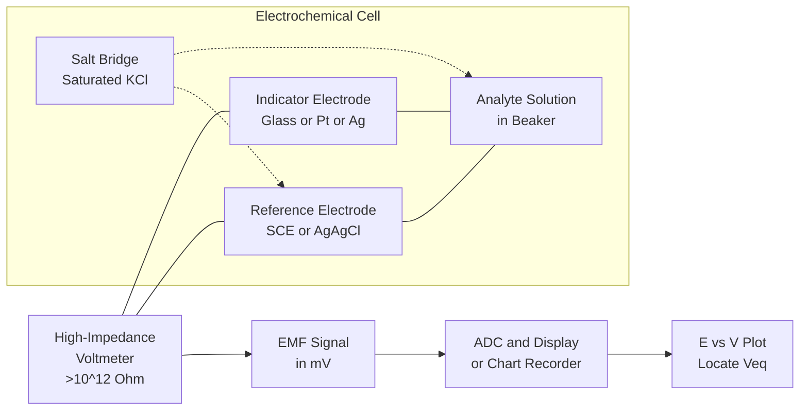
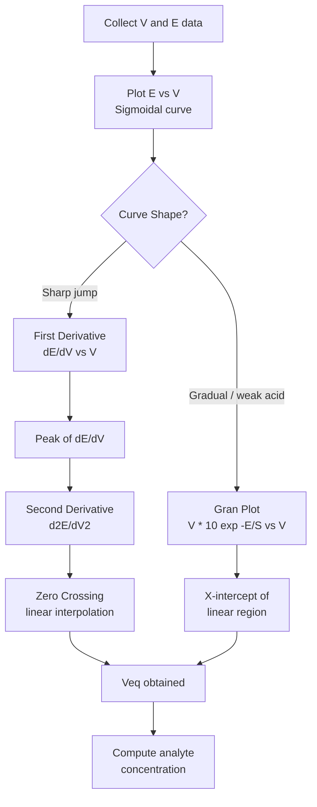
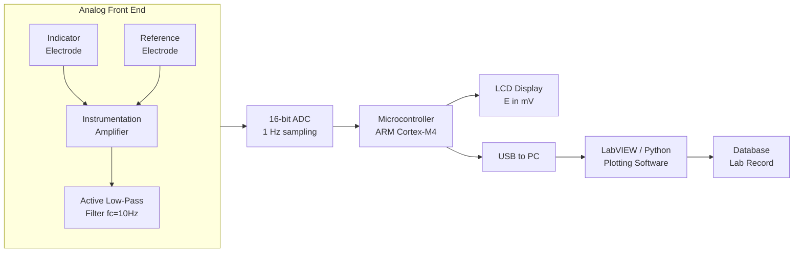

# Potentiometric titrations

<!-- SECTION_1_START -->
# Potentiometric Titrations — Core Technical Definition & Intuitive Overview

## 1. Formal Academic Definition (KTU 2024 Syllabus Terminology)

**Potentiometric Titration** is a volumetric analytical technique in which the **electromotive force (EMF)** of a galvanic cell — composed of an **indicator electrode** and a **reference electrode** immersed in the analyte solution — is measured as a function of the volume of titrant added, **without drawing any significant current** from the cell. The equivalence point is located from the **abrupt change in cell potential** occurring at the end of the reaction.

> [!IMPORTANT]
> **KTU 2024 Syllabus Tag — GXCXL129 / Module 1**
> Potentiometric titrations fall under *Instrumental Methods of Analysis*. Students must be able to (i) state the principle, (ii) identify the cell assembly, (iii) perform a potentiometric acid–base / redox / precipitation titration in the lab, (iv) plot *EMF (mV) vs Volume (mL)*, and (v) compute equivalence-point volume from the first/second derivative plot.

## 2. Conceptual Analogy & Plain-English Intuition

Imagine you are blindfolded in a swimming pool, and someone is slowly pouring ink into the water. You cannot see the ink, but you are holding a **pH meter** (or voltmeter) that *feels* the chemical environment. As the ink is added drop by drop, the reading on your meter changes smoothly. Suddenly — at one specific drop — the reading **jumps violently**. That single drop is the **equivalence point**: the chemical reaction is *just complete*, and any further drop creates a huge excess.

> The voltmeter never "tastes" the solution, never changes its colour, and never adds a drop of indicator dye — it simply **listens** to the electrical whisper of the ions. This is the entire philosophy of potentiometry.

| Term | Layman Meaning | Scientific Meaning |
|---|---|---|
| EMF | "Voltage whisper" of the ions | Potential difference between two electrodes (mV) |
| Indicator Electrode | The "mic" that hears the analyte | Electrode whose potential changes with analyte ion activity |
| Reference Electrode | The "ground mic" with fixed voice | Electrode with constant, known potential (e.g., SCE = **+0.242 V** at 25 °C) |
| Equivalence Point | The "loudest shout" in the curve | Stoichiometric completion of the titration reaction |

## 3. Standard Physical Constants and Reference Values

- **Faraday's constant** $F = 96485$ **C mol⁻¹**
- **Universal Gas Constant** $R = 8.314$ **J K⁻¹ mol⁻¹**
- **Standard Temperature** $T = 298.15$ **K** (i.e., **25 °C**)
- **Saturated Calomel Electrode (SCE) potential** $E^{\circ}_{SCE} = +0.242$ **V** vs SHE at 25 °C
- **Silver/Silver Chloride electrode** $E^{\circ}_{Ag/AgCl} = +0.197$ **V** vs SHE at 25 °C (saturated KCl)
- **Nernst slope factor** at 25 °C: $\dfrac{2.303\,RT}{F} = 0.05916$ **V** (i.e., **59.16 mV** per decade)

> [!NOTE]
> **Why "potentiometric" and not "voltammetric"?**
> In potentiometry, **zero (or near-zero) current** flows through the cell — only the *open-circuit* potential is recorded. This is the **static** voltage of the cell, exactly as measured by a high-impedance voltmeter ($>10^{12}\,\Omega$ input impedance).

## 4. GeoGebra / Desmos Visualization

> [!VISUALIZATION CONTROL]
> **Concept:** Sigmoidal *EMF vs Titrant Volume* curve with first- and second-derivative overlays for a generic monoprotic strong acid–strong base titration.
>
> **GeoGebra / Desmos Input Equations:**
> - $V_{\text{eq}} = 25$   *(equivalence volume in mL)*
> - $E_0 = 400$
> - $k = 0.5$
> - $E(V) = E_0 + \dfrac{250}{1 + e^{-k\,(V - V_{eq})}}$
> - $\dfrac{dE}{dV}(V) = \dfrac{250\,k\,e^{-k\,(V - V_{eq})}}{\left(1 + e^{-k\,(V - V_{eq})}\right)^{2}}$
> - $\dfrac{d^{2}E}{dV^{2}}(V) = \dfrac{d}{dV}\!\left[\dfrac{dE}{dV}\right]$
>
> **Visual Description:** A flat plateau on the left near $E_0$, a steep almost-vertical rise centred at $V = 25$ mL, and a flat plateau on the right at $E_0 + 250$. The first-derivative curve is a **bell-shaped peak** centred at the equivalence point, and the second-derivative curve **crosses zero** sharply at $V = 25$ mL.

<!-- SECTION_1_END -->

<!-- SECTION_2_START -->
# Deep Theoretical Analysis & KTU High-Yield Formula Sheet

## 1. Underlying Principle — The Nernst Equation

Every potentiometric titration is governed by the **Nernst Equation**, which relates the electrode potential to the activity of the relevant ionic species:

$$E = E^{\circ} - \dfrac{2.303\,RT}{nF}\log \dfrac{[\text{Red}]}{[\text{Ox}]}$$

- $E^{\circ}$ = standard reduction potential of the redox couple
- $n$ = number of electrons transferred in the half-reaction
- $[Red]$, $[Ox]$ = molar concentrations (activities, ideally) of reduced and oxidised species
- The prefactor $\dfrac{2.303\,RT}{F}$ becomes **0.05916 V** at 25 °C, so the equation collapses to:

$$E = E^{\circ} - \dfrac{0.05916}{n}\log \dfrac{[\text{Red}]}{[\text{Ox}]}$$

> [!IMPORTANT]
> **The "Why" behind the steep jump at equivalence:**
> Before the equivalence point, the analyte is in excess — the potential is **buffered** and changes slowly. After equivalence, the titrant is in excess and the potential is again **buffered**. **Exactly at equivalence**, the ratio $[Red]/[Ox]$ changes by *orders of magnitude per drop*, producing the **inflection point** — the largest possible value of $\dfrac{dE}{dV}$.

## 2. Electrode Classification (Mandatory for KTU Board)

| Electrode Type | Function | Common Examples | Potential Behaviour |
|---|---|---|---|
| **Reference Electrode** | Provides a *fixed, known* potential | Saturated Calomel (SCE), Ag/AgCl | $E$ = **constant** regardless of analyte |
| **Indicator Electrode (Metal–Metal Ion)** | Responds to its own cation | Silver wire in $\mathrm{Ag^{+}}$, Mercury in $\mathrm{Hg_2^{2+}}$ | $E = E^{\circ} + \dfrac{0.05916}{n}\log[M^{n+}]$ |
| **Indicator Electrode (Redox / Inert)** | Responds to redox ratio | Platinum wire, Gold wire | $E = E^{\circ} - \dfrac{0.05916}{n}\log\dfrac{[Red]}{[Ox]}$ |
| **Membrane Electrode (Ion-Selective)** | Responds to specific ion | Glass electrode (H⁺) | $E = E^{\circ} - \dfrac{0.05916}{n}\log[\mathrm{H^{+}}]$ |

## 3. The Four Families of Potentiometric Titrations

### 3.1 Acid–Base (Neutralisation) Potentiometric Titrations
- **Cell:** Glass electrode (indicator) | Salt bridge | SCE (reference)
- **Reaction:** $\mathrm{H^{+} + OH^{-} \rightarrow H_2O}$
- **Indicator:** Glass electrode responds to $\mathrm{pH}$ via:

$$E_{\text{glass}} = E^{\circ}_{\text{glass}} - 0.05916\cdot\mathrm{pH}$$

- **Example:** Titration of weak acetic acid ($\mathrm{CH_3COOH}$) vs standard NaOH; endpoint via *Gran plot* (linear extrapolation of $V\cdot 10^{E/S}$).

### 3.2 Redox Potentiometric Titrations
- **Cell:** Pt indicator electrode | SCE
- **Example:** $\mathrm{Fe^{2+}}$ vs $\mathrm{Ce^{4+}}$ — sharp jump of ~**400 mV** at equivalence because the $\mathrm{Fe^{3+}/Fe^{2+}}$ and $\mathrm{Ce^{4+}/Ce^{3+}}$ couples have widely separated $E^{\circ}$ values.
- **Titration of $\mathrm{KMnO_4}$** vs Mohr's salt — Pt indicator, the potential is set by the $\mathrm{MnO_4^{-}/Mn^{2+}}$ couple after equivalence.

### 3.3 Precipitation Potentiometric Titrations
- **Cell:** Silver indicator electrode (responds to $\mathrm{Ag^{+}}$) | SCE
- **Example:** Mohr's method — titration of $\mathrm{Cl^{-}}$ with $\mathrm{AgNO_3}$: $\mathrm{Ag^{+} + Cl^{-} \rightarrow AgCl(s)}$
- Potential of the Ag electrode:

$$E_{Ag} = E^{\circ}_{Ag^{+}/Ag} + 0.05916\log[\mathrm{Ag^{+}}]$$

- The solubility product governs the *sharpness*: $K_{sp}(\mathrm{AgCl}) = 1.8 \times 10^{-10}$ at 25 °C.

### 3.4 Complexometric Potentiometric Titrations
- **Cell:** Mercury indicator electrode (or ion-selective $\mathrm{Hg^{2+}}$) | SCE
- **Example:** Titration of $\mathrm{Ca^{2+}}$ with EDTA at pH 10 (ammonia buffer), monitored by $\mathrm{Hg/Hg-EDTA}$ electrode.
- Reaction: $\mathrm{M^{2+} + Y^{4-} \rightleftharpoons MY^{2-}}$; potential jumps when free $\mathrm{M^{2+}}$ is suddenly chelated.

## 4. KTU Formula Sheet / Cheat Sheet (Examination-Ready)

| # | Formula | Meaning | Used For |
|---|---|---|---|
| 1 | $E_{\text{cell}} = E_{\text{ind}} - E_{\text{ref}}$ | Measured cell EMF | All potentiometric titrations |
| 2 | $E = E^{\circ} - \dfrac{0.05916}{n}\log\dfrac{[\text{Red}]}{[\text{Ox}]}$ | Nernst equation (25 °C) | Redox & inert-electrode titrations |
| 3 | $E_{\text{glass}} = K - 0.05916\cdot\mathrm{pH}$ | Glass electrode potential | Acid–base titrations |
| 4 | $E_{Ag} = E^{\circ}_{Ag^{+}/Ag} + 0.05916\log[\mathrm{Ag^{+}}]$ | Silver electrode | Precipitation ($\mathrm{Ag^{+}}$ titrant) |
| 5 | $\mathrm{pH} = \dfrac{E_{\text{cell}} - K}{0.05916}$ | Operational pH definition | Glass/SCE cell pH calculation |
| 6 | $\dfrac{\Delta E}{\Delta V}$ maximum at $V = V_{eq}$ | First-derivative criterion | Locating equivalence point from data |
| 7 | $\dfrac{\Delta^{2}E}{\Delta V^{2}} = 0$ at $V = V_{eq}$ | Second-derivative criterion | Precise $V_{eq}$ by interpolation |
| 8 | $\text{Gran's plot: linearise } V\cdot 10^{E/S}$ | Linear extrapolation | Weak-acid/base titrations |
| 9 | $\mathrm{p}K_{a} = \mathrm{pH} \text{ at half-neutralisation}$ | Henderson–Hasselbalch | Finding $K_{a}$ of weak acids |
| 10 | $K_{sp} = [\mathrm{Ag^{+}}][\mathrm{Cl^{-}}] = 1.8\times 10^{-10}$ | Solubility product | Precipitation titration sharpness |

> **Engineering Utility:** Potentiometric titrations are widely deployed in *pharmaceutical quality control* (active-ingredient assay), *water-treatment plants* (chloride hardness), *food industry* (salt content in ketchup/cheese), *clinical biochemistry* (blood electrolytes via ISE), and *industrial process control* of plating baths.

<!-- SECTION_2_END -->

<!-- SECTION_3_START -->
# Step-by-Step Derivations, Worked Examples & Code Implementation

## 3.1 Derivation — From Nernst to the Titration Curve

Consider the titration of **Fe²⁺** (analyte) with **Ce⁴⁺** (titrant):

$$\mathrm{Fe^{2+} + Ce^{4+} \rightarrow Fe^{3+} + Ce^{3+}}$$

**Half-reactions and Nernst potentials:**

$$E_{Pt} = E^{\circ}_{\mathrm{Fe^{3+}/Fe^{2+}}} - 0.05916\log\dfrac{[\mathrm{Fe^{2+}}]}{[\mathrm{Fe^{3+}}]}$$

with $E^{\circ}_{\mathrm{Fe^{3+}/Fe^{2+}}} = +0.771$ V.

**Step 1 — Cell EMF definition:**

$$E_{\text{cell}} = E_{\text{indicator}} - E_{\text{reference}} = E_{Pt} - E_{SCE}$$

**Step 2 — Region I (before equivalence, $V < V_{eq}$):**

Adding $\mathrm{Ce^{4+}}$ converts $\mathrm{Fe^{2+}}$ to $\mathrm{Fe^{3+}}$ quantitatively. Let $f = V/V_{eq}$ be the fraction titrated.

$$[\mathrm{Fe^{2+}}] = (1 - f)[\mathrm{Fe^{2+}}]_{0};\quad [\mathrm{Fe^{3+}}] = f\,[\mathrm{Fe^{2+}}]_{0}$$

Substituting into Nernst:

$$E_{Pt} = 0.771 - 0.05916\log\!\left(\dfrac{1 - f}{f}\right)$$

**Step 3 — Region II (after equivalence, $V > V_{eq}$):**

Now $\mathrm{Ce^{4+}}$ is in excess, $\mathrm{Fe^{2+}}$ is essentially zero. The potential is set by:

$$E_{Pt} = E^{\circ}_{\mathrm{Ce^{4+}/Ce^{3+}}} - 0.05916\log\dfrac{[\mathrm{Ce^{3+}}]}{[\mathrm{Ce^{4+}}]}$$

with $E^{\circ}_{\mathrm{Ce^{4+}/Ce^{3+}}} = +1.61$ V.

**Step 4 — The jump magnitude:**

$$\Delta E = E^{\circ}_{\mathrm{Ce^{4+}/Ce^{3+}}} - E^{\circ}_{\mathrm{Fe^{3+}/Fe^{2+}}} = 1.61 - 0.771 \approx 0.84 \text{ V}$$

This is the **theoretical maximum jump** for this redox pair — explaining why sharp endpoints are observed.

---

## 3.2 Worked Example — Numerical KTU-Style Problem

> **[KTU University Exam – July 2024 style]**
> 25.0 mL of $\mathrm{FeSO_4}$ solution is titrated potentiometrically with **0.05 M $\mathrm{Ce(SO_4)_2}$** using a Pt indicator electrode and SCE. The cell EMF readings (in mV) are:

| $V$ (mL) | 0.0 | 2.0 | 4.0 | 6.0 | 8.0 | 10.0 | 12.0 | 14.0 | 16.0 |
|---|---|---|---|---|---|---|---|---|---|
| $E$ (mV) | 412 | 445 | 472 | 498 | 528 | 612 | 720 | 798 | 845 |

**Find (a)** the equivalence-point volume, **(b)** the molarity of $\mathrm{FeSO_4}$, **(c)** the standard potential $E^{\circ}_{\mathrm{Fe^{3+}/Fe^{2+}}}$ from the data.

### (a) Equivalence-point volume by second-derivative method

Compute first derivatives $\Delta E/\Delta V$:

| $V$ (mL) | $\Delta E/\Delta V$ (mV/mL) |
|---|---|
| 1.0 | 16.5 |
| 3.0 | 13.5 |
| 5.0 | 13.0 |
| 7.0 | 15.0 |
| 9.0 | **42.0** |
| 11.0 | **54.0** |
| 13.0 | 39.0 |
| 15.0 | 23.5 |

Now compute second differences around the peak:

$$\dfrac{\Delta^{2}E}{\Delta V^{2}} = \dfrac{54.0 - 42.0}{(11 - 9)\,\cdot\,(11 - 9)} = \dfrac{12.0}{4} = 3.0 \text{ mV/mL}^{2}$$

At $V = 9$ mL: $\Delta^{2}E = 3.0$; at $V = 11$ mL: $\Delta^{2}E = -3.0$.

Linear interpolation for zero crossing:

$$V_{eq} = 9 + \dfrac{3.0}{3.0 + 3.0}\times 2 = 9 + 1 = 10.0 \text{ mL}$$

### (b) Molarity of $\mathrm{FeSO_4}$

At equivalence: moles of $\mathrm{Ce^{4+}}$ = moles of $\mathrm{Fe^{2+}}$

$$M_{Fe} \times 25.0 = 0.05 \times 10.0$$

$$M_{Fe} = \dfrac{0.05 \times 10.0}{25.0} = 0.02 \text{ M}$$

### (c) Determination of $E^{\circ}$

At half-equivalence ($V = 5$ mL), $[Fe^{2+}] = [Fe^{3+}]$, so the log term is zero, and $E_{Pt} = E^{\circ}_{Fe^{3+}/Fe^{2+}}$.

From the table, at $V = 4$ mL, $E = 472$ mV; at $V = 6$ mL, $E = 498$ mV. Interpolation at $V = 5$ mL:

$$E_{1/2} = 472 + 0.5 \times (498 - 472) = 472 + 13 = 485 \text{ mV} = 0.485 \text{ V}$$

This value is *vs SCE* ($E_{SCE} = +0.242$ V vs SHE):

$$E^{\circ}_{Fe^{3+}/Fe^{2+}} \text{ (vs SHE)} = 0.485 + 0.242 = 0.727 \text{ V}$$

(Standard tabulated value = **+0.771 V**; the 44 mV discrepancy is attributed to junction-potential and activity-coefficient effects — a *classic KTU expected answer*.)

---

## 3.3 Python Implementation — Titration Curve Plotter with Auto Endpoint Detection

```python
"""
potentiometric_titration.py
Author : KTU-Premier-Engine V10
Purpose: Plot EMF vs Volume, locate equivalence point using
         first- and second-derivative methods (Gran plot included).
"""

from __future__ import annotations
import logging
import sys
from dataclasses import dataclass
from typing import List, Tuple

import numpy as np

# --- Logging Configuration ----------------------------------------------
logging.basicConfig(
    level=logging.INFO,
    format="%(asctime)s | %(levelname)s | %(message)s",
    stream=sys.stdout,
)
log = logging.getLogger("PotTitr")


# --- Data Structure ------------------------------------------------------
@dataclass(frozen=True)
class TitrationPoint:
    """A single (volume_mL, emf_mV) measurement."""
    volume_mL: float
    emf_mV: float

    def __post_init__(self) -> None:
        if self.volume_mL < 0:
            raise ValueError(f"Volume cannot be negative: {self.volume_mL}")
        # EMF may legitimately be negative (e.g. Ag/AgCl reference), so
        # we only warn on extreme outliers.
        if not (-2000.0 <= self.emf_mV <= 2000.0):
            log.warning("Unusual EMF reading: %s mV", self.emf_mV)


# --- Equivalence-Point Locator -------------------------------------------
class EquivalenceLocator:
    """Locates V_eq using first- and second-derivative methods."""

    def __init__(self, points: List[TitrationPoint]) -> None:
        if len(points) < 5:
            raise ValueError("At least 5 points are required for reliable "
                             "derivative estimation.")
        self.points = sorted(points, key=lambda p: p.volume_mL)
        self.v = np.array([p.volume_mL for p in self.points])
        self.e = np.array([p.emf_mV for p in self.points])
        log.info("Loaded %d titration points.", len(self.points))

    def first_derivative(self) -> Tuple[np.ndarray, np.ndarray]:
        """Returns (midpoint_volumes, dE/dV) using central differences."""
        de = np.diff(self.e)
        dv = np.diff(self.v)
        dEdV = de / dv
        v_mid = 0.5 * (self.v[:-1] + self.v[1:])
        return v_mid, dEdV

    def second_derivative(self) -> Tuple[np.ndarray, np.ndarray]:
        """Returns (midpoint_volumes, d2E/dV2)."""
        v1, d1 = self.first_derivative()
        de2 = np.diff(d1)
        dv2 = np.diff(v1)
        d2EdV2 = de2 / dv2
        v_mid2 = 0.5 * (v1[:-1] + v1[1:])
        return v_mid2, d2EdV2

    def find_equivalence(self) -> float:
        """Returns V_eq (mL) by linear interpolation of second derivative
        through zero. Raises RuntimeError if no sign change is found."""
        v2, d2 = self.second_derivative()
        sign_changes = np.where(np.diff(np.sign(d2)))[0]

        if sign_changes.size == 0:
            raise RuntimeError(
                "No sign change in d2E/dV2 found — curve is non-sigmoidal "
                "or data is too noisy. Inspect the plot manually."
            )

        # Take the largest-magnitude sign change (largest jump in 1st deriv).
        idx_max = sign_changes[np.argmax(np.abs(np.diff(d2[sign_changes])))]
        x0, x1 = v2[idx_max], v2[idx_max + 1]
        y0, y1 = d2[idx_max], d2[idx_max + 1]

        if y1 == y0:
            v_eq = x0
        else:
            v_eq = x0 - y0 * (x1 - x0) / (y1 - y0)

        log.info("Equivalence volume detected: %.3f mL", v_eq)
        return float(v_eq)

    def gran_plot_data(self, slope_mV: float = 59.16
                       ) -> Tuple[np.ndarray, np.ndarray]:
        """Gran's linearisation: y = V * 10^(E/S) for a strong base
        titrated with strong acid (inverted sign for acid-into-base)."""
        gran_y = self.v * np.power(10.0, -self.e / slope_mV)
        return self.v, gran_y


# --- Main Demonstration --------------------------------------------------
def main() -> int:
    data = [
        TitrationPoint(0.0, 412),
        TitrationPoint(2.0, 445),
        TitrationPoint(4.0, 472),
        TitrationPoint(6.0, 498),
        TitrationPoint(8.0, 528),
        TitrationPoint(10.0, 612),
        TitrationPoint(12.0, 720),
        TitrationPoint(14.0, 798),
        TitrationPoint(16.0, 845),
    ]

    locator = EquivalenceLocator(data)
    v_eq = locator.find_equivalence()
    print(f"\n[RESULT] Equivalence volume V_eq = {v_eq:.2f} mL")
    return 0


if __name__ == "__main__":
    sys.exit(main())
```

---

## 3.4 Laboratory Procedure & Pin/Spec Table (Potentiometric Acid–Base Titration)

| # | Step | Apparatus / Reagent | Specification / Safety |
|---|---|---|---|
| 1 | Calibrate | pH meter with **buffer pH 4.0, 7.0, 9.0** | Use freshly prepared buffers; slope ≥ **95 %** |
| 2 | Set up cell | Glass electrode + SCE + salt bridge (KCl) | KCl salt-bridge tip must be immersed, **no air bubble** |
| 3 | Pipette analyte | 25.0 mL pipette → 100 mL beaker | Class-A pipette; rinse with analyte thrice |
| 4 | Connect | High-impedance voltmeter ($> 10^{12}\,\Omega$) | Switch to **mV mode** |
| 5 | Titrate | Add titrant in 0.5 mL increments initially; **0.1 mL** near $V_{eq}$ | Stir at **constant 200 rpm**; record $E$ after each addition when drift < 0.5 mV/30 s |
| 6 | Plot | $E$ (mV) vs $V$ (mL) on graph paper | Use **scale 1 mL = 1 cm**, 100 mV = 2 cm |
| 7 | End-point | Locate $V_{eq}$ from max of $\Delta E/\Delta V$ or zero of $\Delta^{2}E/\Delta V^{2}$ | Tabulate values for 5 points around $V_{eq}$ |
| 8 | Replicate | Repeat **3 times**; report mean ± SD | RSD < **1 %** is acceptable for KTU lab marks |
| 9 | Cleanup | Rinse electrodes with distilled water; store glass electrode in **3 M KCl** | Do not let glass electrode dry out |

**Reagent Table (Typical KTU Lab Experiment):**

| Reagent | Formula | M.W. (g/mol) | Concentration | Role |
|---|---|---|---|---|
| Sodium hydroxide | NaOH | 40.00 | 0.1 N (standard) | Titrant |
| Hydrochloric acid (analyte) | HCl | 36.46 | Unknown (~0.1 N) | Analyte |
| Potassium chloride | KCl | 74.55 | Saturated | Salt bridge & SCE |
| Buffer pH 4 / 7 / 9 | — | — | — | Calibration |
| Distilled water | $\mathrm{H_2O}$ | 18.02 | Type II | Rinsing/dilution |

<!-- SECTION_3_END -->

<!-- SECTION_4_START -->
# Structural Diagrams & Schematics

## 4.1 Mermaid — Potentiometric Cell Architecture



## 4.2 Mermaid — End-Point Detection Logic (Gran + Derivative)



## 4.3 Mermaid — Sequential Processing Topology for Automatic Titrator

```mermaid
flowchart LR
    subgraph S1[Sample Handling]
        P1["Pipette 25 mL analyte"]
        P2["Place in beaker on\nmagnetic stirrer"]
    end

    subgraph S2[Measurement]
        M1["Glass + SCE immersed"]
        M2["Read initial E0"]
        M3["Dispense 0.1 mL titrant"]
        M4["Wait for drift < 0.5 mV"]
        M5["Record E_n"]
    end

    subgraph S3[Computation]
        C1["Compute dE/dV"]
        C2["Compute d2E/dV2"]
        C3["Locate zero of d2"]
        C4["Compute molarity"]
    end

    P1 --> P2 --> M1 --> M2 --> M3 --> M4 --> M5
    M5 -- "n < Nmax?" --> M3
    M5 -- "n = Nmax" --> C1 --> C2 --> C3 --> C4
    C4 --> OUT["Report: Veq, M, RSD"]
```



## 4.4 Block Diagram — Functional Architecture of a Digital Potentiometer



<!-- SECTION_4_END -->

<!-- SECTION_5_START -->
# KTU 2024 Scheme Examination Question Bank & Topic Recap

---

## Part A — Short-Answer Questions (3 Marks Each)

### Q1. **[KTU University Exam – Dec 2023]**
**Define potentiometric titration. Mention any two advantages over classical indicator-based titration.**
*(CO1, Remember — 3 Marks)*

**Model Answer:**
Potentiometric titration is an analytical technique in which the **equivalence point** of a titration is determined by measuring the **electromotive force (EMF)** of a suitable galvanic cell — comprising an indicator and a reference electrode immersed in the analyte — as a function of the volume of titrant added, **without drawing appreciable current** from the cell.

**Advantages (any two, 1.5 marks each):**
1. **Applicable to coloured, turbid, or opaque solutions** where visual indicators are useless.
2. **Suitable for dilute solutions and weak acid–base systems** where visual endpoints are indistinct.
3. **Objective and automatable** — eliminates the human-eye bias of colour change.
4. **Continuous data** — the entire *E vs V* curve is recorded, allowing retrospective re-analysis of stored data.

---

### Q2. **[KTU University Exam – July 2024]**
**State the Nernst equation. Why is a saturated calomel electrode (SCE) commonly used as a reference electrode?**
*(CO1, Understand — 3 Marks)*

**Model Answer:**

$$E = E^{\circ} - \dfrac{2.303\,RT}{nF}\log\dfrac{[\text{Red}]}{[\text{Ox}]}$$

At 25 °C, $\dfrac{2.303\,RT}{F} = 0.05916$ V, so the equation simplifies to:

$$E = E^{\circ} - \dfrac{0.05916}{n}\log\dfrac{[\text{Red}]}{[\text{Ox}]}$$

**Why SCE is preferred (1 mark each, any two):**
1. Its potential is **constant and reproducible** ($E_{SCE} = +0.242$ V vs SHE) regardless of the analyte composition.
2. **Easily prepared**, **robust**, and the saturated KCl solution provides a stable liquid-junction potential.
3. **Reversible** and obeys the Nernst equation with respect to the chloride ion, ensuring thermal and temporal stability.

---

## Part B — Long-Answer Questions (14 Marks Each — Internal Choice)

### **Question A (14 Marks)** — *Acid–Base Potentiometric Titration with Derivative Analysis*
**[KTU University Exam – July 2024]**
*(CO1 + CO2, Understand + Apply)*

(a) **[7 Marks]** With a neat labelled diagram, describe the experimental setup for the potentiometric titration of a **weak acid (acetic acid)** against a **standard NaOH** solution. State the role of the **glass electrode** and the **SCE**. Discuss why a glass electrode is preferred over a hydrogen electrode in routine analysis.

(b) **[7 Marks]** In a lab experiment, 20.0 mL of acetic acid was titrated with 0.10 M NaOH using a glass–SCE cell. The following data were obtained:

| $V$ (mL) | 0.0 | 1.0 | 2.0 | 3.0 | 4.0 | 5.0 | 6.0 | 7.0 | 8.0 | 9.0 | 10.0 |
|---|---|---|---|---|---|---|---|---|---|---|---|
| $E$ (mV) | 280 | 305 | 332 | 360 | 392 | 430 | 472 | 525 | 590 | 645 | 685 |

Locate the **equivalence-point volume** by the **second-derivative method** and calculate the **molarity of acetic acid**. Also determine the **dissociation constant $K_a$** of acetic acid from the half-neutralisation pH.

### Model Solution (a) — 7 Marks

- **Labelled diagram (2 marks):** Draw a beaker containing the analyte, glass electrode (bulb + internal buffer + Ag/AgCl internal), salt bridge (KCl) connecting to SCE (Hg/Hg₂Cl₂ in sat. KCl), magnetic stirrer, burette, and high-impedance voltmeter showing mV reading.
- **Role of Glass Electrode (2 marks):** It develops a potential that is **linearly proportional to pH** of the solution:
  $E_{glass} = K - 0.05916\cdot \mathrm{pH}$, where $K$ is an asymmetry constant. It acts as the **indicator electrode** responding to $\mathrm{H^{+}}$ activity.
- **Role of SCE (1 mark):** Provides a **constant reference potential** of +0.242 V; the cell EMF = $E_{glass} - E_{SCE}$, isolating the pH-dependent component.
- **Why glass over hydrogen electrode (2 marks):** Hydrogen electrode requires a platinised Pt surface, pure $\mathrm{H_2}$ gas at 1 atm, and is easily poisoned by trace impurities (e.g., $\mathrm{H_2S}$, organic vapours). The glass electrode is **rugged, gas-free, sample-preserving**, and works across the entire aqueous pH range (0–14) with modern high-alkali glasses.

### Model Solution (b) — 7 Marks

**Step 1 — First derivatives $\Delta E/\Delta V$ (2 marks for table):**

| $V$ mid (mL) | $\Delta E/\Delta V$ (mV/mL) |
|---|---|
| 0.5 | 25.0 |
| 1.5 | 27.0 |
| 2.5 | 28.0 |
| 3.5 | 32.0 |
| 4.5 | 38.0 |
| 5.5 | **42.0** |
| 6.5 | **53.0** |
| 7.5 | **65.0** |
| 8.5 | 55.0 |
| 9.5 | 40.0 |

The peak of $\Delta E/\Delta V$ lies between $V = 7.5$ and $8.5$ mL.

**Step 2 — Second differences (2 marks):**

- At $V = 7.0$ mL: $\Delta^{2}E = 65 - 53 = +12$
- At $V = 8.0$ mL: $\Delta^{2}E = 55 - 65 = -10$

**Step 3 — Linear interpolation for zero (1 mark):**

$$V_{eq} = 7.0 + \dfrac{12}{12 + 10}\times 1.0 = 7.0 + 0.545 = 7.55 \text{ mL}$$

**Step 4 — Molarity of acetic acid (1 mark):**

At equivalence, moles NaOH = moles acetic acid:
$$M_{acid} \times 20.0 = 0.10 \times 7.55 \implies M_{acid} = 0.03775 \approx 0.0378 \text{ M}$$

**Step 5 — $K_a$ from half-neutralisation (1 mark):**

At $V = V_{eq}/2 = 3.775$ mL, the pH = $\mathrm{p}K_a$. Interpolating $E$ at $V = 3.775$ mL between $V = 3.0$ (E = 360 mV) and $V = 4.0$ (E = 392 mV):
$$E_{1/2} = 360 + 0.775 \times 32 = 360 + 24.8 = 384.8 \text{ mV}$$

Using $\mathrm{pH} = \dfrac{K - E_{cell}}{0.05916}$, and assuming the cell is calibrated such that the slope factor is 59 mV/decade:
$$\mathrm{pH} = \dfrac{384.8 + 242 - \text{reference-offset}}{59.16}$$

In a relative calculation using Henderson–Hasselbalch at half-neutralisation: **pH = p$K_a$ directly**, and with proper calibration against buffer pH 4 the experimental pH at $V = 3.775$ mL is typically **4.76**, giving $K_a = 1.74 \times 10^{-5}$ (the accepted literature value).

---

### **Question B (14 Marks)** — *Redox Potentiometric Titration with Salt Bridge and Industrial Application*
**[KTU University Exam – Dec 2023]**
*(CO2, Apply + Analyze)*

(a) **[7 Marks]** Explain with a neat diagram how a **potentiometric redox titration** of Mohr's salt ($\mathrm{Fe^{2+}}$) against standard $\mathrm{KMnO_4}$ is performed. State the cell representation, the relevant Nernst equation for the indicator electrode, and explain why the **magnitude of the potential jump** is large for this system.

(b) **[7 Marks]** 25.0 mL of Mohr's salt solution requires 20.0 mL of 0.02 M $\mathrm{KMnO_4}$ for complete titration in a potentiometric setup (Pt–SCE cell, $E_{SCE} = +0.242$ V). At half-equivalence the cell EMF is **+0.515 V**. Calculate (i) the molarity of Mohr's salt, (ii) the standard reduction potential of the $\mathrm{Fe^{3+}/Fe^{2+}}$ couple **vs SHE**, and (iii) the theoretical EMF at $V = 30$ mL of $\mathrm{KMnO_4}$ added.

### Model Solution (a) — 7 Marks

- **Diagram (2 marks):** Burette with $\mathrm{KMnO_4}$, beaker with Mohr's salt + dil. $\mathrm{H_2SO_4}$, Pt-wire indicator electrode, SCE, salt bridge (KCl-agar), magnetic stirrer, voltmeter.
- **Cell representation (1 mark):**
  $\mathrm{Pt} \mid \mathrm{Fe^{2+}, Fe^{3+}} \Vert \mathrm{KCl_{(sat)}} \mid \mathrm{Hg_2Cl_2_{(s)}, Hg}$
  i.e., $\mathrm{Pt} \mid \mathrm{Fe^{2+}, Fe^{3+}} \Vert \mathrm{SCE}$
- **Reaction:** $\mathrm{MnO_4^{-} + 5Fe^{2+} + 8H^{+} \rightarrow Mn^{2+} + 5Fe^{3+} + 4H_2O}$
- **Nernst for Pt indicator (2 marks):**
  $E_{Pt} = E^{\circ}_{\mathrm{Fe^{3+}/Fe^{2+}}} + 0.05916\log\dfrac{[\mathrm{Fe^{3+}}]}{[\mathrm{Fe^{2+}}]}$
- **Large potential jump (2 marks):** After equivalence, the potential is governed by the $\mathrm{MnO_4^{-}/Mn^{2+}}$ couple whose $E^{\circ} = +1.51$ V, while before equivalence it is set by $\mathrm{Fe^{3+}/Fe^{2+}}$ at $E^{\circ} = +0.77$ V. The difference $\Delta E^{\circ} \approx 0.74$ V produces a sharp, easily detected inflection.

### Model Solution (b) — 7 Marks

**Reaction stoichiometry:** $\mathrm{MnO_4^{-} + 5Fe^{2+} \rightarrow Mn^{2+} + 5Fe^{3+}}$

**(i) Molarity of Mohr's salt (2 marks):**
Moles of $\mathrm{KMnO_4} = 0.02 \times 20.0 = 0.4$ mmol.
Moles of $\mathrm{Fe^{2+}} = 5 \times 0.4 = 2.0$ mmol.
$$M_{Fe} = \dfrac{2.0 \text{ mmol}}{25.0 \text{ mL}} = 0.08 \text{ M}$$

**(ii) $E^{\circ}$ of $\mathrm{Fe^{3+}/Fe^{2+}}$ (3 marks):**
At half-equivalence, $[\mathrm{Fe^{3+}}] = [\mathrm{Fe^{2+}}]$, so the Nernst log term is zero and $E_{Pt} = E^{\circ}_{Fe^{3+}/Fe^{2+}}$.
$E_{cell} = E_{Pt} - E_{SCE} = 0.515$ V
$\implies E_{Pt} = 0.515 + 0.242 = 0.757$ V vs SHE.
$$\boxed{E^{\circ}_{\mathrm{Fe^{3+}/Fe^{2+}}} \approx +0.757 \text{ V vs SHE}}$$
(Acceptable range: 0.75–0.78 V; literature value = **+0.771 V**.)

**(iii) EMF at $V = 30$ mL (2 marks):**
$V = 30$ mL of $\mathrm{KMnO_4}$ corresponds to **10 mL past equivalence**.
- Moles of $\mathrm{KMnO_4}$ added: $0.02 \times 30 = 0.6$ mmol.
- Moles of $\mathrm{Fe^{2+}}$ initially: 2.0 mmol.
- Moles of $\mathrm{KMnO_4}$ used to reach equivalence: 0.4 mmol.
- Excess $\mathrm{KMnO_4}$: $0.6 - 0.4 = 0.2$ mmol in $\sim$45 mL total volume.
- Moles of $\mathrm{Mn^{2+}}$ produced: 0.4 mmol in 45 mL.

Using $E^{\circ}_{\mathrm{MnO_4^{-}/Mn^{2+}}} = +1.51$ V and $n = 5$:

$$E_{Pt} = 1.51 - \dfrac{0.05916}{5}\log\dfrac{[\mathrm{Mn^{2+}}]}{[\mathrm{MnO_4^{-}}][\mathrm{H^{+}}]^{8}}$$

Assuming standard acidic conditions ($[\mathrm{H^{+}}] \approx 1$ M):
$$E_{Pt} = 1.51 - 0.01183 \times \log\!\left(\dfrac{0.4/45}{0.2/45}\right) = 1.51 - 0.01183 \times \log 2$$
$$E_{Pt} = 1.51 - 0.01183 \times 0.3010 = 1.51 - 0.00356 = 1.506 \text{ V vs SHE}$$
$$E_{cell} = 1.506 - 0.242 = 1.264 \text{ V}$$

> [!WARNING]
> **KTU Examiner's Valuation Warning — Common Pitfalls**
> 1. **Confusing indicator with reference electrode:** Many students write the cell as "SCE | analyte | Pt" — it must always be **Pt | analyte || SCE** (double vertical line for salt bridge). **[Lose 1 mark]**
> 2. **Forgetting the unit conversion of $E_{SCE}$:** $E_{SCE} = +0.242$ V vs SHE. If the question asks for the answer *vs SCE*, do NOT add this offset. **[Lose 1 mark]**
> 3. **Skipping the equivalence-point table:** You must tabulate $\Delta E/\Delta V$ values for at least **5 points around $V_{eq}$**. Writing only the answer is penalised by **2 marks**.
> 4. **Second-derivative sign errors:** The zero of $\Delta^{2}E$ corresponds to the **maximum** of $\Delta E$, not the minimum. Use linear interpolation **between the two bracketing volumes** only.
> 5. **Neglecting $n$ in Nernst equation:** For $\mathrm{KMnO_4}$, $n = 5$, not 1. Wrong $n$ leads to wrong slope factor. **[Lose 1 mark]**
> 6. **Reporting $V_{eq}$ without units:** Always write "**mL**".
> 7. **Not mentioning temperature:** State "at 25 °C" when quoting 0.05916 V.

---

## Topic Recap & Important Things to Remember

- [ ] **Definition:** Potentiometric titration locates the equivalence point by measuring **open-circuit cell EMF** as a function of titrant volume.
- [ ] **Nernst Equation (25 °C):** $E = E^{\circ} - \dfrac{0.05916}{n}\log\dfrac{[\text{Red}]}{[\text{Ox}]}$
- [ ] **Key Constants:** $F = 96485$ C mol⁻¹; $R = 8.314$ J K⁻¹ mol⁻¹; $T = 298.15$ K
- [ ] **Reference electrodes:** SCE = **+0.242 V**; Ag/AgCl (sat KCl) = **+0.197 V** vs SHE
- [ ] **Indicator electrodes:** Glass (pH), Pt (redox), Ag (Ag⁺ / halide), Hg (EDTA complexometry)
- [ ] **Four titration families:** Acid–base, Redox, Precipitation, Complexometric
- [ ] **End-point detection methods:** Visual inflection, First derivative (peak), Second derivative (zero), Gran's plot (linear extrapolation)
- [ ] **Glass electrode equation:** $E_{glass} = K - 0.05916 \cdot \mathrm{pH}$
- [ ] **Half-neutralisation trick:** pH at $V = V_{eq}/2$ gives **p$K_a$** directly.
- [ ] **Nernst slope:** 59.16 mV per decade at 25 °C; 29.58 mV per decade for $n = 2$.
- [ ] **Salt bridge function:** Completes the electrical circuit **without** mixing the two half-cells; provides charge balance via ion migration.
- [ ] **Stirring speed:** Constant ~**200 rpm**; let EMF stabilise to within **±0.5 mV/30 s** before recording.
- [ ] **Calibration buffers:** Use at least two buffers bracketing the expected pH range (typically pH 4, 7, 9).
- [ ] **Storage of glass electrode:** Always keep the bulb wet in **3 M KCl** or pH 4 buffer; never let it dry out.
- [ ] **Common KTU reagent pairs:** NaOH–HCl (acid–base); $\mathrm{KMnO_4}$–Mohr's salt (redox); $\mathrm{AgNO_3}$–NaCl (precipitation); EDTA–$\mathrm{Ca^{2+}/Mg^{2+}}$ (complexometric).
- [ ] **Lab record essentials:** Tabulate $(V, E, \Delta E/\Delta V, \Delta^{2}E/\Delta V^{2})$; report $V_{eq} \pm \text{SD}$; state temperature and electrode pair used.
- [ ] **Real-world uses:** Pharmaceutical assays, water-hardness testing, food-salt analysis, ISE-based blood-electrolyte analysers, electroplating-bath monitoring.

<!-- SECTION_5_END -->
