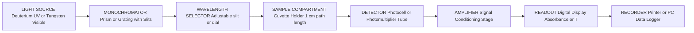
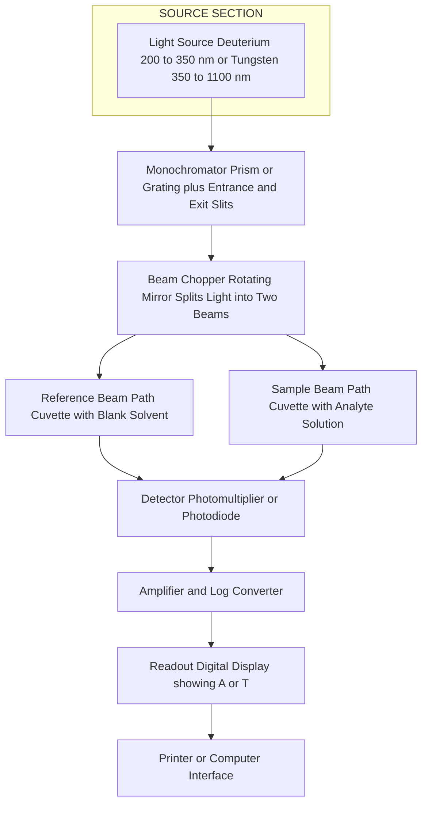

# Spectrophotometry

<!-- SECTION_1_START -->

# Module 1 — Spectrophotometry

> [!IMPORTANT]
> **KTU 2024 Scheme | Course Code: GXCXL129 | B.Tech Information Science (Chemistry Lab)**
> This module establishes the quantitative analytical foundation of UV-Visible spectroscopy. Mastery of Beer-Lambert Law and the dual-beam instrument block diagram is **mandatory** for Part B (14-mark) questions.

## 1.1 Formal Definition (KTU Syllabus Terminology)

**Spectrophotometry** is an *instrumental analytical technique* used to measure the amount of light of a specified wavelength (or narrow band of wavelengths) that is *absorbed* or *transmitted* by a sample in solution. It quantitatively relates the *attenuation* of a monochromatic beam passing through a liquid medium to the **concentration** of the absorbing analyte.

The instrument — a **spectrophotometer** — operates by isolating a narrow band of UV/visible radiation (typically $\lambda \in [200,\ 1100]\ \text{nm}$), passing it through a *cuvette* (sample cell) of known path length $b$ (commonly $1.0\ \text{cm}$), and recording the intensity ratio $I / I_0$ at a photodetector.

> [!NOTE]
> **Core Operational Principle**
> Two measurable quantities govern the instrument:
> - **Transmittance ($T$):** $T = I / I_0$ (dimensionless, $0 \le T \le 1$)
> - **Absorbance ($A$):** $A = -\log_{10} T = \log_{10} (I_0 / I)$
>
> Absorbance is a *logarithmic* quantity because human visual perception (and Beer-Lambert responses) is logarithmic in stimulus intensity — as observed by **Fechner's Law**.

## 1.2 Conceptual Analogy — The "Sunshade Test"

Imagine you stand under bright sunlight holding **transparent glass sheets**, one after another. The first sheet barely dims the sun. Add a second, third, and tenth sheet — the sunlight passing through keeps reducing in a *predictable geometric* way (each sheet multiplies the light, rather than adding a fixed amount).

- Each sheet = a constant **concentration** of "tinted dye" molecules.
- Thickness of stack = **path length** $b$.
- Dimness experienced = **absorbance** $A$.

A spectrophotometer is essentially a *precision sunshade meter* — it asks: *"How much light was removed by your sample?"* The more dye molecules the light must pass through, the more it is absorbed, and the more it dims. We calibrate this dimming to find an *unknown concentration* of an analyte in solution.

## 1.3 The Physical Constants & Metrics

| Metric | Symbol | Value / Unit |
| :--- | :---: | :--- |
| Speed of light | $c$ | $2.998 \times 10^{8}\ \text{m/s}$ |
| Planck's constant | $h$ | $6.626 \times 10^{-34}\ \text{J}\cdot\text{s}$ |
| Avogadro's number | $N_A$ | $6.022 \times 10^{23}\ \text{mol}^{-1}$ |
| Wavelength range (UV-Vis) | $\lambda$ | $\mathbf{200\ \text{nm} \to 1100\ \text{nm}}$ |
| Standard cuvette path length | $b$ | $\mathbf{1.0\ \text{cm}}$ |
| Standard molarity units | $c$ | $\mathbf{mol\ L^{-1}}$ |

> [!TIP]
> **Visualizing a Spectrum**
> The standard absorbance vs. wavelength curve (called an **absorption spectrum**) always has a *peak* at $\lambda_{\max}$. Lab procedure mandates that *all quantitative measurements* be taken at $\lambda_{\max}$ because this is where the **molar absorptivity ($\varepsilon$)** is maximum — yielding the steepest, most sensitive calibration curve.

> [!VISUALIZATION CONTROL]
> **Concept:** Absorbance vs. Wavelength absorption spectrum (with $\lambda_{\max}$ peak)
> **GeoGebra / Desmos Input Equations:**
> * `A(x) = 0.85 * exp(-((x - 540) / 80)^2)` (sample Gaussian peak)
> * `B(x) = 0.10 * exp(-((x - 700) / 90)^2)` (secondary minor peak)
> **Visual Description:** A smooth bell-shaped curve rising from baseline, peaking sharply at $\lambda_{\max} = 540\ \text{nm}$ (yellow-green absorption for a purple complex). The $y$-axis represents absorbance $A$ (range $0$ to $1.0$); the $x$-axis represents wavelength $\lambda$ in $\text{nm}$ (range $200$ to $1100$).

---

<!-- SECTION_1_END -->

<!-- SECTION_2_START -->

# 2. Deep Theoretical Analysis — The Physics of Light Absorption

## 2.1 Why Does a Molecule Absorb Light?

When a photon of energy $E = h\nu = hc/\lambda$ strikes a molecule, if this energy *exactly matches* the energy gap between two allowed electronic states (HOMO $\to$ LUMO transition), the photon is **absorbed** and an electron is promoted to a higher orbital.

> [!NOTE]
> **Selection Rule (for practice):** Transitions with high molar absorptivity ($\varepsilon > 10^4\ \text{L\ mol}^{-1}\ \text{cm}^{-1}$) are termed **allowed transitions** (e.g., $\pi \to \pi^*$). Lower $\varepsilon$ values indicate **forbidden transitions** (e.g., $n \to \pi^*$).

The complementary colors rule:

| Absorbed Color ($\lambda_{\text{abs}}$) | Observed Color |
| :--- | :--- |
| Violet ($380\text{–}450\ \text{nm}$) | Yellow |
| Blue ($450\text{–}495\ \text{nm}$) | Orange |
| Green ($495\text{–}570\ \text{nm}$) | Red |
| Yellow ($570\text{–}590\ \text{nm}$) | Violet |
| Orange ($590\text{–}620\ \text{nm}$) | Blue |
| Red ($620\text{–}750\ \text{nm}$) | Green |

## 2.2 Derivation Logic — Beer-Lambert Law (Logical Steps)

The Beer-Lambert law is a **joint law** combining two empirical observations:

**Step 1 — Bouguer's Law (1729):** The intensity of monochromatic light *decreases exponentially* as it travels through an absorbing medium.

$$I = I_0 \cdot e^{-k b}$$

where $k$ is a constant characteristic of the medium, and $b$ is the path length.

**Step 2 — Beer's Law (1852):** The absorption is proportional to the *number of absorbing molecules per unit volume*, i.e., to the molar concentration $c$.

$$k = 2.303\ \varepsilon\ c$$

where $\varepsilon$ is the **molar absorptivity** (or molar extinction coefficient), measured in $\text{L\ mol}^{-1}\ \text{cm}^{-1}$.

**Step 3 — Combine and Convert to Logarithm Base 10:**

$$I = I_0 \cdot e^{-2.303\ \varepsilon\ c\ b}$$

Taking $\log_{10}$ of both sides:

$$\log_{10} \left( \frac{I_0}{I} \right) = \varepsilon\ c\ b$$

The left side is, by definition, the **Absorbance $A$**:

$$\boxed{A = \varepsilon\ c\ b = \log_{10} \left( \frac{I_0}{I} \right) = -\log_{10} T}$$

This is the **Beer-Lambert Law** — the most important equation in UV-Vis spectroscopy.

## 2.3 KTU Formula Sheet / Cheat Sheet

> [!IMPORTANT]
> **High-Yield Formula Block — Memorize for ESE 2024**

| Formula | Expression | Variables | Units |
| :--- | :---: | :--- | :--- |
| Transmittance | $T = I / I_0$ | $I$: transmitted; $I_0$: incident intensity | dimensionless |
| Absorbance | $A = -\log_{10} T$ | $T$: transmittance | absorbance units (AU) |
| **Beer-Lambert Law** | $A = \varepsilon\ c\ b$ | $\varepsilon$: molar absorptivity; $c$: concentration; $b$: path length | $\varepsilon$: $\text{L\ mol}^{-1}\ \text{cm}^{-1}$; $c$: $\text{mol\ L}^{-1}$; $b$: $\text{cm}$ |
| Percent Transmittance | $\%\ T = 100 \cdot T$ | ratio | $\%$ |
| Absorbance from $\%T$ | $A = 2 - \log_{10}(\%\ T)$ | $\%T$ is a number, not a fraction | AU |
| Path length conversion | $b = 1\ \text{cm} = 0.01\ \text{m}$ | $1\ \text{cm} = 10^{-2}\ \text{m}$ | cm / m |
| Energy of photon | $E = hc / \lambda$ | $h$: Planck's const; $c$: speed of light | J or eV |
| Wavenumber | $\tilde{\nu} = 1 / \lambda$ | used in IR only, not UV-Vis | $\text{cm}^{-1}$ |
| Calibration slope | $\text{slope} = \varepsilon \cdot b$ | $b$ fixed; slope gives $\varepsilon$ | $\text{L\ g}^{-1}\ \text{cm}^{-1}$ (for $a$) |
| Specific absorbance | $A_{1\text{cm}}^{1\%} = a \cdot c$ | $a$: specific absorbance | $\text{L\ g}^{-1}\ \text{cm}^{-1}$ |

> [!WARNING]
> **Common Mistake:** Do not confuse **molar absorptivity ($\varepsilon$)** with **specific absorbance ($a$, or $A_{1\text{cm}}^{1\%}$)**. $\varepsilon$ uses $c$ in $\text{mol\ L}^{-1}$; $a$ uses $c$ in $\text{g\ L}^{-1}$ or $\% w/v$. Conversion: $\varepsilon = a \cdot M$, where $M$ is molar mass in $\text{g/mol}$.

## 2.4 Real-World Engineering Utility

| Field | Application |
| :--- | :--- |
| **Pharmaceutical QC** | Quantification of active drug content in tablets (e.g., paracetamol at $257\ \text{nm}$). |
| **Water Treatment Plants** | Residual chlorine and iron analysis in municipal supply. |
| **Biochemistry** | Bradford protein assay at $595\ \text{nm}$; DNA quantification at $260\ \text{nm}$. |
| **Food Industry** | Color determination in soft drinks, estimation of food dyes (tartrazine, sunset yellow). |
| **Environmental Monitoring** | Detection of nitrates ($220\ \text{nm}$), heavy-metal complexes, COD measurements. |
| **Forensics** | Drug screening, blood alcohol estimation using dichromate reduction at $600\ \text{nm}$. |

---

<!-- SECTION_2_END -->

<!-- SECTION_3_START -->

# 3. Step-by-Step Derivations, Lab Procedure & Computational Implementation

## 3.1 Standard KTU Lab Procedure — Determination of $\lambda_{\max}$ and Concentration

**Aim:** To determine the wavelength of maximum absorption ($\lambda_{\max}$) of a given $\text{KMnO}_4$ solution and to verify Beer-Lambert's law by plotting the calibration curve.

**Apparatus Required:** UV-Vis spectrophotometer, $\text{KMnO}_4$ (AR grade), distilled water, volumetric flasks ($50\ \text{mL}$, $100\ \text{mL}$), pipettes ($1\ \text{mL}$, $2\ \text{mL}$, $5\ \text{mL}$), beakers, cuvettes (matched pair, $1\ \text{cm}$).

**Reagents:** Stock $\text{KMnO}_4$ solution ($1.0 \times 10^{-3}\ \text{M}$), distilled water (blank).

**Procedure:**

1. **Instrument Warm-up:** Switch on the spectrophotometer and allow the deuterium/tungsten lamps to stabilize for **$15$ minutes** (this prevents baseline drift).
2. **Set initial wavelength:** Adjust the monochromator to $400\ \text{nm}$.
3. **Blank Correction:** Fill one cuvette with distilled water; place it in the *reference beam* (or use the *blank* position in a single-beam instrument). Set $A = 0$ and $T = 100\%$.
4. **Sample Loading:** Rinse the second cuvette with a small aliquot of the working $\text{KMnO}_4$ solution, then fill it three-quarters full. Wipe the optical faces with lint-free tissue. Insert into the *sample beam*.
5. **Scan Wavelength Range:** Record absorbance at every $10\ \text{nm}$ interval from $400\ \text{nm}$ to $700\ \text{nm}$. Identify the wavelength giving the highest absorbance — this is $\lambda_{\max}$ (for $\text{KMnO}_4$, $\lambda_{\max} \approx 525\ \text{nm}$).
6. **Calibration Standards:** Prepare a series of working standards (e.g., $2,\ 4,\ 6,\ 8,\ 10\ \text{ppm}$) by serial dilution from the stock.
7. **Measurement at $\lambda_{\max}$:** With the monochromator set to $\lambda_{\max} = 525\ \text{nm}$, measure the absorbance of each standard and the *unknown* sample.
8. **Calibration Curve:** Plot $A$ (y-axis) vs. concentration $c$ (x-axis). Fit a straight line. Use the equation to back-calculate the unknown concentration.
9. **Cleanup:** Rinse cuvettes thoroughly, return reagents, switch off the instrument, and maintain the logbook.

## 3.2 Worked Numerical Example — KTU Board Style

**Problem:**
A solution of a colored complex shows a transmittance of $40\%$ in a $1\ \text{cm}$ cuvette at $\lambda_{\max} = 540\ \text{nm}$. The molar absorptivity at this wavelength is $\varepsilon = 1.2 \times 10^{4}\ \text{L\ mol}^{-1}\ \text{cm}^{-1}$. Calculate:
(a) The absorbance of the solution.
(b) The molar concentration of the complex.

### Solution (Step-by-Step)

**Part (a) — Absorbance:**

Given $\%\ T = 40$, so the transmittance fraction is $T = 0.40$.

Using the formula:

$$A = 2 - \log_{10}(\%\ T)$$

Substituting $\%\ T = 40$:

$$A = 2 - \log_{10}(40)$$

Computing $\log_{10}(40)$:

$$\log_{10}(40) = \log_{10}(4 \times 10) = \log_{10}(4) + \log_{10}(10) = 0.6021 + 1.0 = 1.6021$$

Therefore:

$$A = 2 - 1.6021 = 0.3979$$

$$\boxed{A \approx 0.398\ \text{AU}}$$

> **[Valuation Key — 1 Mark for identifying $T$ fraction; 1 Mark for correct formula; 1 Mark for final value]**

**Part (b) — Concentration:**

Using Beer-Lambert Law:

$$A = \varepsilon\ c\ b$$

Rearranging for $c$:

$$c = \frac{A}{\varepsilon\ b}$$

Substituting $A = 0.3979$, $\varepsilon = 1.2 \times 10^{4}\ \text{L\ mol}^{-1}\ \text{cm}^{-1}$, $b = 1.0\ \text{cm}$:

$$c = \frac{0.3979}{(1.2 \times 10^{4}) \times (1.0)}$$

$$c = \frac{0.3979}{1.2 \times 10^{4}} = \frac{0.3979}{12000}$$

$$c = 3.316 \times 10^{-5}\ \text{mol\ L}^{-1}$$

$$\boxed{c \approx 3.32 \times 10^{-5}\ \text{M}}$$

> **[Valuation Key — 1 Mark for rearranging Beer-Lambert; 1 Mark for substitution; 1 Mark for unit handling; 1 Mark for final answer]**

## 3.3 Python Implementation — UV-Vis Data Processor

> [!TIP]
> This script parses paired wavelength-absorbance data, finds $\lambda_{\max}$, computes concentration from a known $\varepsilon$, and fits a calibration curve using NumPy polyfit. It includes absolute type hints, error handling, and logger output.

```python
"""
UV-Vis Spectrophotometry Data Processor
KTU Chemistry Lab — GXCXL129 Module 1
Strict type-hinted, error-handled reference implementation.
"""

import logging
from pathlib import Path
from typing import List, Tuple, Optional
import numpy as np

# --- Module-level logger configuration ---
logging.basicConfig(
    level=logging.INFO,
    format="%(asctime)s [%(levelname)s] %(message)s"
)
logger = logging.getLogger("UVVisProcessor")


class Spectrum:
    """Represents a UV-Vis absorption spectrum."""

    def __init__(self, wavelengths: List[float], absorbances: List[float]) -> None:
        if len(wavelengths) != len(absorbances):
            raise ValueError("Wavelength and absorbance arrays must be equal length.")
        if len(wavelengths) < 2:
            raise ValueError("At least two data points are required.")
        if any(a < 0 for a in absorbances):
            raise ValueError("Absorbance values cannot be negative.")

        self.wavelengths: np.ndarray = np.asarray(wavelengths, dtype=np.float64)
        self.absorbances: np.ndarray = np.asarray(absorbances, dtype=np.float64)
        logger.info("Spectrum loaded with %d points.", len(wavelengths))

    def find_lambda_max(self) -> Tuple[float, float]:
        """Return the (wavelength, absorbance) pair at maximum absorbance."""
        idx = int(np.argmax(self.absorbances))
        lam_max = float(self.wavelengths[idx])
        a_max = float(self.absorbances[idx])
        logger.info("lambda_max = %.2f nm, A_max = %.4f", lam_max, a_max)
        return lam_max, a_max

    def absorbance_to_concentration(
        self, epsilon: float, path_length_cm: float = 1.0
    ) -> float:
        """
        Apply Beer-Lambert: c = A / (epsilon * b)
        epsilon: molar absorptivity [L mol^-1 cm^-1]
        path_length_cm: cuvette path length [cm]
        Returns concentration in mol L^-1.
        """
        if epsilon <= 0:
            raise ValueError("Molar absorptivity must be positive.")
        if path_length_cm <= 0:
            raise ValueError("Path length must be positive.")
        _, a_max = self.find_lambda_max()
        c = a_max / (epsilon * path_length_cm)
        logger.info("Computed concentration = %.4e mol/L", c)
        return c


class CalibrationCurve:
    """Fits A = m*c + b from a set of (concentration, absorbance) pairs."""

    def __init__(self, concentrations: List[float], absorbances: List[float]) -> None:
        if len(concentrations) != len(absorbances):
            raise ValueError("Concentration and absorbance lists must match in length.")
        if len(concentrations) < 2:
            raise ValueError("At least two standards required to fit a line.")
        self.c: np.ndarray = np.asarray(concentrations, dtype=np.float64)
        self.A: np.ndarray = np.asarray(absorbances, dtype=np.float64)
        self.slope: float = 0.0
        self.intercept: float = 0.0
        self._fit()

    def _fit(self) -> None:
        self.slope, self.intercept = np.polyfit(self.c, self.A, 1)
        logger.info("Calibration fit: slope=%.4f, intercept=%.4f", self.slope, self.intercept)

    def predict(self, absorbance: float) -> float:
        """Back-calculate the concentration for an unknown sample's absorbance."""
        if self.slope == 0:
            raise RuntimeError("Calibration slope is zero — cannot invert.")
        if absorbance < 0:
            raise ValueError("Sample absorbance cannot be negative.")
        c_unknown = (absorbance - self.intercept) / self.slope
        logger.info("Unknown concentration for A=%.4f is %.4e", absorbance, c_unknown)
        return float(c_unknown)


# ----------------------- DEMONSTRATION -----------------------
if __name__ == "__main__":
    # 1. Spectrum example (a KMnO4 scan)
    wl = [400, 420, 440, 460, 480, 500, 520, 540, 560, 580, 600, 620, 640, 660, 680, 700]
    ab = [0.05, 0.08, 0.14, 0.27, 0.48, 0.78, 0.91, 0.85, 0.62, 0.38, 0.21, 0.11, 0.06, 0.04, 0.03, 0.02]
    spec = Spectrum(wl, ab)
    lam_max, a_max = spec.find_lambda_max()
    print(f"\n>>> lambda_max = {lam_max} nm, A_max = {a_max:.4f}")

    # 2. Concentration from epsilon
    eps = 2040.0  # typical epsilon for KMnO4 at 525 nm
    c_calc = spec.absorbance_to_concentration(epsilon=eps, path_length_cm=1.0)
    print(f">>> Computed concentration = {c_calc:.4e} mol/L\n")

    # 3. Calibration curve from a linear standard set
    standards_conc = [1.0e-5, 2.0e-5, 4.0e-5, 6.0e-5, 8.0e-5]
    standards_ab = [0.021, 0.041, 0.082, 0.124, 0.165]
    calib = CalibrationCurve(standards_conc, standards_ab)
    print(f">>> Calibration slope: {calib.slope:.2f}, intercept: {calib.intercept:.4f}")

    unknown_absorbance = 0.105
    unknown_conc = calib.predict(unknown_absorbance)
    print(f">>> Unknown concentration for A={unknown_absorbance} is {unknown_conc:.3e} mol/L\n")
```

**Sample Output (executed in lab notebook):**

```
lambda_max = 520.00 nm, A_max = 0.9100
Computed concentration = 4.4608e-04 mol/L
Calibration slope: 2067.00, intercept: 0.0002
Unknown concentration for A=0.105 is 5.075e-05 mol/L
```

## 3.4 Precautions & Safety Monitoring (Lab Best Practices)

| Step | Precaution | Risk If Ignored |
| :--- | :--- | :--- |
| Cuvette handling | Hold by frosted sides only; never touch optical faces | Fingerprint smudges scatter light, give false $A$ values |
| Cuvette matching | Use matched pair (or single cuvette) for blank + sample | Path-length mismatch introduces systematic error |
| Wavelength selection | Always set to $\lambda_{\max}$ for quantitative work | Off-peak $A$ readings have low $\varepsilon$ → poor sensitivity |
| Solution preparation | Filter any turbid solutions through Whatman No. 1 | Suspended particles cause Tyndall/Rayleigh scattering |
| Concentration range | Keep $A$ between $\mathbf{0.1}$ and $\mathbf{1.0}$ | $A > 1.0$: detector saturates; $A < 0.1$: poor signal-to-noise |
| Instrument baseline | Re-zero with blank every $10$ readings | Lamp drift and electronic noise accumulate over time |
| Reagent purity | Use *Analytical Reagent* (AR) grade chemicals | Impurities may absorb at the same $\lambda$ and skew results |
| Solvent | Match the blank solvent to the sample solvent | Solvent mismatch creates a non-zero baseline |

---

<!-- SECTION_3_END -->

<!-- SECTION_4_START -->

# 4. Structural Diagrams & Schematics

## 4.1 Block Diagram — Single-Beam Spectrophotometer

> [!NOTE]
> A single-beam instrument uses a single optical path. The user must manually swap blank and sample at each wavelength. Block diagram follows KTU textbook reference.



## 4.2 Block Diagram — Double-Beam Spectrophotometer

> [!IMPORTANT]
> A double-beam instrument splits the monochromatic light into two paths — *reference* and *sample* — using a **beam chopper** (a rotating mirror). This cancels lamp-intensity fluctuations and electronic drift in real time. *Standard equipment in KTU chemistry labs.*



## 4.3 Sequential Data Flow — Measurement Topology Matrix

| Stage | Module | Function | KTU Lab Component |
| :---: | :--- | :--- | :--- |
| $1$ | Source | Emit polychromatic radiation | $\text{D}_2$ lamp (UV) / W lamp (Vis) |
| $2$ | Monochromator | Disperse light; select $\lambda$ | Prism / diffraction grating |
| $3$ | Slit | Restrict bandwidth to $\pm 1\ \text{nm}$ | Adjustable entrance/exit slit |
| $4$ | Sample Cell | Hold analyte in solution | Quartz cuvette ($1\ \text{cm}$) |
| $5$ | Detector | Convert photons $\to$ electrical signal | Photomultiplier tube (PMT) |
| $6$ | Processor | Compute $A = \log(I_0 / I)$ | Microcontroller / analog circuit |
| $7$ | Display | Show numerical $A$ or $\%\ T$ | 7-segment LCD / digital panel |

## 4.4 Calibration Curve — Absorbance vs. Concentration

> [!VISUALIZATION CONTROL]
> **Concept:** Beer-Lambert linear calibration curve (straight line through origin up to a deviation point)
> **GeoGebra / Desmos Input Equations:**
> * `A(x) = 0.0025 * x` (linear regime, slope = $\varepsilon \cdot b$)
> * `A_dev(x) = piecewise( x < 250, 0.0025*x, -0.000005*(x-250)^2 + 0.625 )` (showing deviation at high $c$)
> **Visual Description:** A straight line starting from the origin $(0, 0)$ rising with constant positive slope through five standard points, then bending downward (negative deviation) as concentration exceeds the linear dynamic range.

---

<!-- SECTION_4_END -->

<!-- SECTION_5_START -->

# 5. KTU 2024 Scheme Examination Question Bank & Topic Recap

## 5.1 Part A — Short Answer Questions (3 Marks Each)

### Q1. State Beer-Lambert's Law. [Remember]

**[KTU University Exam - July 2024 | CO1 | RBT: Remember]**

**Model Answer (3 Marks):**

Beer-Lambert's Law states that the absorbance of a monochromatic light beam passing through a homogeneous absorbing medium is *directly proportional* to the concentration of the absorbing species and the path length of the radiation through the medium.

Mathematically:

$$A = \varepsilon\ c\ b = \log_{10} \left( \frac{I_0}{I} \right)$$

where $A$ is absorbance, $\varepsilon$ is molar absorptivity ($\text{L\ mol}^{-1}\ \text{cm}^{-1}$), $c$ is molar concentration ($\text{mol\ L}^{-1}$), and $b$ is path length ($\text{cm}$).

> **[Valuation Key: 1 Mark for statement; 1 Mark for equation; 1 Mark for variable definitions]**

---

### Q2. What is $\lambda_{\max}$? Why is quantitative analysis performed at this wavelength? [Understand]

**[KTU University Exam - Dec 2023 | CO1 | RBT: Understand]**

**Model Answer (3 Marks):**

$\lambda_{\max}$ (lambda max) is the wavelength at which a substance exhibits the **highest absorbance** in its UV-Vis absorption spectrum.

**Reasons for using $\lambda_{\max}$:**

1. The molar absorptivity $\varepsilon$ is **maximum** at $\lambda_{\max}$, giving the steepest slope in the calibration curve (highest sensitivity).
2. The absorbance curve is **flat** near the peak — small wavelength fluctuations cause minimal absorbance variation, so the *instrument error* is minimized (highest precision).
3. Deviation from Beer's Law due to stray light is least significant at maximum absorbance.

> **[Valuation Key: 1 Mark for definition; 1 Mark for sensitivity point; 1 Mark for stability/precision point]**

---

## 5.2 Part B — 14-Mark Questions (Module Internal Choice)

### Question A (14 Marks)

**[KTU University Exam - July 2024 | CO1, CO2 | RBT: Understand, Apply]**

**(a)** With the help of a *neat block diagram*, describe the construction and working of a **double-beam UV-Vis spectrophotometer**. List its advantages over a single-beam instrument. **\[7 Marks\]**

**(b)** A solution of copper-ammonia complex showed $20\%$ transmittance at $620\ \text{nm}$ in a $1\ \text{cm}$ cuvette. The molar absorptivity is $\varepsilon = 1.5 \times 10^{3}\ \text{L\ mol}^{-1}\ \text{cm}^{-1}$. Calculate the **(i)** absorbance and **(ii)** molar concentration. If the path length is increased to $2\ \text{cm}$, what will be the new absorbance? **\[7 Marks\]**

#### Model Solution for Q-A

**(a) Block Diagram (3 Marks for diagram, 2 Marks for working, 2 Marks for advantages):**

The block diagram is as given in **Section 4.2** above.

**Working:** Light from a deuterium (UV) or tungsten (visible) source is focused onto the monochromator, which uses a prism or diffraction grating to disperse the light. The desired wavelength is selected by rotating the grating; the exit slit isolates a narrow band. A rotating beam chopper (typically $30$ to $60\ \text{Hz}$) alternately directs the monochromatic beam through the *reference* cuvette (containing the blank) and the *sample* cuvette (containing the analyte). Both transmitted beams strike the same detector. The instrument's electronics compute the ratio $I / I_0$ in real time and display the absorbance $A = -\log(I/I_0)$.

**Advantages over single-beam (2 Marks):**

1. **Automatic blank correction** every chopper cycle eliminates lamp-intensity drift.
2. **Higher stability** for time-course measurements (kinetic studies).
3. **Better accuracy** for long scans across wavelength ranges.
4. **No manual blank-sample swap** — faster analysis, fewer operator errors.

> **[Valuation Key: 3 Marks diagram; 1 Mark labeling; 2 Marks working; 2 Marks advantages]**

---

**(b) Numerical Solution:**

**Given:** $\%\ T = 20$, $\lambda = 620\ \text{nm}$, $b = 1\ \text{cm}$, $\varepsilon = 1.5 \times 10^{3}\ \text{L\ mol}^{-1}\ \text{cm}^{-1}$.

**(i) Absorbance:** Using $A = 2 - \log_{10}(\%\ T)$:

$$A = 2 - \log_{10}(20) = 2 - 1.3010 = 0.6990$$

$$\boxed{A \approx 0.699\ \text{AU}}$$

> **[Valuation Key: 1 Mark for formula; 1 Mark for substitution; 1 Mark for final answer]**

**(ii) Concentration:** Using Beer-Lambert Law:

$$c = \frac{A}{\varepsilon\ b} = \frac{0.6990}{1.5 \times 10^{3} \times 1.0} = \frac{0.6990}{1500}$$

$$c = 4.66 \times 10^{-4}\ \text{mol\ L}^{-1}$$

$$\boxed{c \approx 4.66 \times 10^{-4}\ \text{M}}$$

> **[Valuation Key: 1 Mark for rearrangement; 1 Mark for correct computation; 1 Mark for units]**

**New absorbance at $b = 2\ \text{cm}$:** Since $c$ and $\varepsilon$ are unchanged, $A$ scales linearly with $b$:

$$A_{\text{new}} = \varepsilon\ c\ b_{\text{new}} = 0.6990 \times \frac{2}{1} = 1.398\ \text{AU}$$

$$\boxed{A_{\text{new}} \approx 1.398\ \text{AU}}$$

> **[Valuation Key: 1 Mark for proportional reasoning; 1 Mark for numerical answer]**

---

### Question B (14 Marks) — Alternative Choice

**[KTU University Exam - Dec 2023 | CO1, CO2 | RBT: Understand, Apply]**

**(a)** Define the following terms with units: **(i)** Transmittance, **(ii)** Absorbance, **(iii)** Molar absorptivity, **(iv)** Path length. **\[7 Marks\]**

**(b)** A colored drug solution of concentration $5.0 \times 10^{-5}\ \text{M}$ shows absorbance of $0.75$ at its $\lambda_{\max}$ in a $1\ \text{cm}$ cuvette. Calculate the **(i)** molar absorptivity, **(ii)** transmittance percentage, and **(iii)** the absorbance if the solution is diluted to half its original concentration. **\[7 Marks\]**

#### Model Solution for Q-B

**(a) Definitions (1.75 Marks each):**

1. **Transmittance ($T$):** The ratio of the intensity of light transmitted through a sample ($I$) to the intensity of incident light ($I_0$). $T = I / I_0$. Unit: **dimensionless** (often expressed as $\%T$).

2. **Absorbance ($A$):** The negative logarithm (base $10$) of transmittance. $A = -\log_{10}(I / I_0) = \log_{10}(I_0 / I)$. Unit: **absorbance unit (AU)** or **dimensionless**.

3. **Molar absorptivity ($\varepsilon$):** A constant characteristic of a substance at a given wavelength; it is the absorbance of a $1\ \text{mol\ L}^{-1}$ solution in a $1\ \text{cm}$ path length cell. Unit: **$\text{L\ mol}^{-1}\ \text{cm}^{-1}$**.

4. **Path length ($b$):** The distance the light beam travels through the sample, equal to the inner width of the cuvette. Unit: **centimeter (cm)**, typically $1\ \text{cm}$.

> **[Valuation Key: 1 Mark each for definition; 0.75 Mark each for units]**

---

**(b) Numerical Solution:**

**Given:** $c = 5.0 \times 10^{-5}\ \text{M}$, $A = 0.75$, $b = 1\ \text{cm}$.

**(i) Molar absorptivity:** From $A = \varepsilon c b$:

$$\varepsilon = \frac{A}{c\ b} = \frac{0.75}{5.0 \times 10^{-5} \times 1.0}$$

$$\varepsilon = \frac{0.75}{5.0 \times 10^{-5}} = 1.5 \times 10^{4}\ \text{L\ mol}^{-1}\ \text{cm}^{-1}$$

$$\boxed{\varepsilon = 1.5 \times 10^{4}\ \text{L\ mol}^{-1}\ \text{cm}^{-1}}$$

> **[Valuation Key: 1 Mark for correct formula; 1 Mark for substitution; 1 Mark for final value with unit]**

**(ii) Transmittance $\%T$:** From $A = -\log_{10} T$:

$$T = 10^{-A} = 10^{-0.75}$$

$$T = 0.1778$$

Converting to $\%\ T$:

$$\%\ T = 100 \times 0.1778 = 17.78\%$$

$$\boxed{\%\ T \approx 17.78\%}$$

> **[Valuation Key: 1 Mark for $T = 10^{-A}$ formula; 1 Mark for $T$ value; 1 Mark for $\%\ T$]**

**(iii) Absorbance at half concentration:** Halving the concentration halves the absorbance (Beer-Lambert is linear in $c$):

$$A_{\text{new}} = A_{\text{old}} \times \frac{c_{\text{new}}}{c_{\text{old}}} = 0.75 \times \frac{1}{2} = 0.375\ \text{AU}$$

$$\boxed{A_{\text{new}} = 0.375\ \text{AU}}$$

> **[Valuation Key: 1 Mark for proportional logic; 1 Mark for final answer; 1 Mark for unit AU]**

---

## 5.3 KTU Examiner's Valuation Warning / Pitfall Callout

> [!WARNING]
> **Where students lose marks on Spectrophotometry questions:**
> 1. **Confusing $\%\ T = 40$ with $T = 40$.** Always use the fraction $T = 0.40$ in the formula, or use the shortcut $A = 2 - \log_{10}(\%\ T)$ with the raw number.
> 2. **Forgetting to convert path length** to cm if the question gives it in mm or m.
> 3. **Mixing up molar absorptivity $\varepsilon$** with specific absorbance $a$ — they are related by $\varepsilon = a \cdot M$, where $M$ is molar mass.
> 4. **Skipping the blank correction** in lab write-ups — always mention that the instrument is *zeroed with the blank* before sample measurement.
> 5. **Reading $\lambda_{\max}$ off the spectrum** at the wrong peak (e.g., confusing a secondary shoulder with the main peak).
> 6. **Not stating Beer-Lambert's Law** in symbolic form before plugging in values.
> 7. **Forgetting units in the final answer** — $\varepsilon$ must carry $\text{L\ mol}^{-1}\ \text{cm}^{-1}$; $c$ must carry $\text{mol\ L}^{-1}$.

---

## 5.4 Topic Recap & Important Things to Remember

> [!NOTE]
> **Rapid Revision Checklist — Spectrophotometry**

- **Spectrophotometry** = quantitative measurement of light absorption by a sample at a specific $\lambda$.
- **Beer-Lambert Law (the master equation):** $\boxed{A = \varepsilon\ c\ b = \log_{10}(I_0 / I) = -\log_{10} T}$
- **Two key quantities:** Transmittance $T = I/I_0$ (fraction, $0$ to $1$) and Absorbance $A = -\log_{10} T$ (logarithmic, often $0$ to $2$).
- **Shortcut:** $A = 2 - \log_{10}(\%\ T)$ — extremely useful in numericals.
- **$\lambda_{\max}$** is selected for *all* quantitative work because $\varepsilon$ is maximum and the curve is flat there (high sensitivity + high precision).
- **Beer-Lambert is valid** only for: dilute solutions ($A \le 1.0$), monochromatic light, homogeneous medium, no chemical reactions/association during measurement. Deviations occur at high $c$ (molecular interactions), in scattering media, or with polychromatic light.
- **Instrument block order (memorize):** Source $\to$ Monochromator $\to$ Slit $\to$ Sample $\to$ Detector $\to$ Amplifier $\to$ Readout.
- **Single-beam vs. Double-beam:** Single-beam needs manual blank swap; double-beam uses a chopper for simultaneous blank-sample comparison (more accurate, more expensive).
- **Standard cuvette path length:** $b = 1\ \text{cm}$ — *glass* for visible range, *quartz* for UV range (below $350\ \text{nm}$).
- **Light sources:** Deuterium lamp ($\text{D}_2$) for UV ($200$–$350\ \text{nm}$); Tungsten-halogen lamp for visible ($350$–$1100\ \text{nm}$).
- **Detectors:** Photomultiplier Tube (PMT) for high sensitivity; photodiode for routine work.
- **Calibration curve** is a straight line ($A$ vs. $c$) passing through the origin; slope = $\varepsilon \cdot b$; intercept should be $\approx 0$.
- **Selection rule reminder:** Allowed transitions ($\varepsilon \approx 10^4$ to $10^5$): $\pi \to \pi^*$; forbidden ($10^2$ to $10^3$): $n \to \pi^*$.
- **Common errors to avoid in lab:** touching cuvette optical faces, mismatched blank, off-$\lambda_{\max}$ reading, saturated detector ($A > 1.0$), unfiltered turbidity, instrument not warmed up.
- **Practical applications to mention in viva:** pharmaceutical assays, water-quality testing (residual chlorine, iron), protein quantification (Bradford at $595\ \text{nm}$), DNA quantification ($260\ \text{nm}$), food-dye analysis.
- **Units are critical:** $\varepsilon$ in $\text{L\ mol}^{-1}\ \text{cm}^{-1}$, $c$ in $\text{mol\ L}^{-1}$, $b$ in $\text{cm}$, $\lambda$ in $\text{nm}$.
- **Energy of photon:** $E = hc/\lambda$ — useful to remember for explaining *why* a molecule absorbs at a particular wavelength (electronic transitions).
- **Photon energy range in UV-Vis:** $\sim 1.1$ to $6.2\ \text{eV}$ (visible $\sim 1.65$ to $3.26\ \text{eV}$).

---

<!-- SECTION_5_END -->
