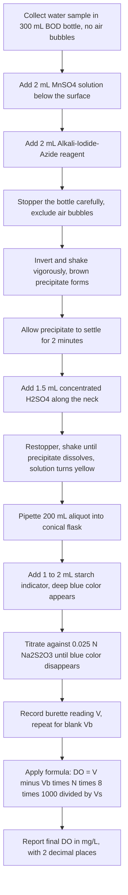
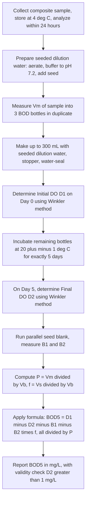
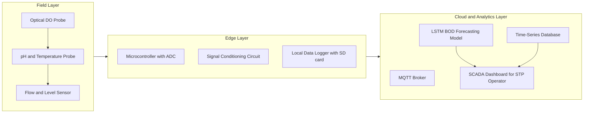

# Dissolved Oxygen (DO), Biological Oxygen Demand (BOD) analytical runs

<!-- SECTION_1_START -->

# Module 1 — Analytical and Water Quality Assessments
## Dissolved Oxygen (DO) & Biological Oxygen Demand (BOD) — Analytical Runs

---

### 1.1 Formal Definition (KTU 2024 Syllabus Terminology)

> [!IMPORTANT]
> **Dissolved Oxygen (DO)** is the volume of molecular oxygen ($O_2$, in mg/L or mL/L) physically dissolved in a given volume of water at a specified temperature and atmospheric pressure. It is the single most critical indicator of the **aerobic health** of any natural or treated water body and is the **primary limiting parameter** for sustaining aquatic life.

> [!IMPORTANT]
> **Biological Oxygen Demand (BOD)** is defined as the quantity of dissolved oxygen required by aerobic microorganisms (principally bacteria) to biologically oxidize the decomposable organic matter present in a water sample, under controlled conditions of temperature ($20 \pm 1^{\circ}C$) and a fixed incubation period of **5 days**, expressed in **mg/L** (or **ppm**).

The standard 5-day test is therefore explicitly denoted as **$BOD_5$** at $20^{\circ}C$, and is internationally the most widely used index of **organic pollution strength** in municipal and industrial wastewater.

---

### 1.2 Conceptual Analogy & Intuitive Overview

Think of a freshwater aquarium and a stagnant drain. The aquarium sparkles because **fish breathe freely** — its water is rich in dissolved oxygen. The drain smells foul because oxygen has been **choked out** by decomposing waste, forcing microbes to switch to anaerobic (oxygen-free) respiration that releases hydrogen sulfide ($H_2S$) and methane ($CH_4$).

Now imagine you are a "water detective." You cannot smell the pollution directly, so you ask the microbes:

> *"If I seal you in a bottle for 5 days with plenty of oxygen, how much of that oxygen will you gobble up while eating the dirt in the water?"*

**The amount they consume = the BOD.** The oxygen they did **not** consume (left over in the bottle) = the **DO of the diluted sample**. Subtracting gives you the pollution load.

> [!NOTE]
> **Slogan to remember:**
> - **DO** = "Oxygen still *available*" in water
> - **BOD** = "Oxygen *consumed*" by microbes in 5 days
> - **Higher BOD ⇒ Lower DO ⇒ More polluted water**

---

### 1.3 Standard Reference Limits (BIS & WHO)

| Parameter | Drinking Water (BIS 10500) | Surface Water (Class A) | Municipal Sewage (Typical) |
| :--- | :---: | :---: | :---: |
| **DO (min.)** | $\geq 6.0$ **mg/L** | $\geq 5.0$ **mg/L** | $< 2.0$ **mg/L** |
| **BOD (max.)** | $< 1.0$ **mg/L** | $< 2.0$ **mg/L** | $100 - 400$ **mg/L** |

> [!WARNING]
> **KTU Valuation Pitfall:** Always quote limits in **mg/L** (or **ppm**), *never* in mol/L. Examiners specifically check unit compliance.

---

### 1.4 Visualization Control — DO Sag Curve (Streeter-Phelps Concept)

> [!VISUALIZATION CONTROL]
> **Concept:** *Dissolved Oxygen sag curve* — DO concentration along a river downstream from a pollution outfall.
> **GeoGebra / Desmos Input Equations:**
> - $D(x) = \dfrac{K_1 \cdot L_0}{K_2 - K_1} \left( e^{-K_1 x} - e^{-K_2 x} \right) + D_0 \cdot e^{-K_2 x}$
> - Parameters (typical): $K_1 = 0.3$/day, $K_2 = 0.4$/day, $L_0 = 20$ mg/L, $D_0 = 8$ mg/L, $x \in [0, 25]$ km
> **Visual Description:** A curve that starts near the saturation DO ($D_0 \approx 8$ mg/L), dips down to a **critical minimum** (the "sag point"), then gradually recovers. The point of minimum DO represents the **worst ecological stress** — exactly where fish kills occur.

---

<!-- SECTION_1_END -->

<!-- SECTION_2_START -->

# 2. Deep Theoretical Analysis & KTU High-Yield Formula Sheet

---

### 2.1 The Winkler Method — Theoretical Foundation

The **Winkler Iodometric Method** (1888) is the **titrimetric standard** universally adopted for DO estimation. It is an elegant **redox sequence** in three discrete steps.

#### Step A — Fixation (Manganous Hydroxide Formation)
$Mn^{2+}$ ions (added as $MnSO_4$) react with the dissolved $O_2$ in **alkaline** medium (added $NaOH + KI$) to form a **white precipitate of manganous hydroxide**, which is **immediately oxidized** to a **brown precipitate of basic manganic hydroxide** (tetravalent manganese).

**Reaction R1:**
$$Mn^{2+} + 2\,OH^- \longrightarrow Mn(OH)_2 \downarrow \;(\text{white})$$

**Reaction R2 (oxygen fixation):**
$$2\,Mn(OH)_2 + O_2 \longrightarrow 2\,MnO(OH)_2 \downarrow \;(\text{brown})$$

> [!NOTE]
> The brown precipitate **"fixes" the oxygen** in the bottle. From this point, the sample is **stable** and can be titrated later in the lab.

#### Step B — Acidification & Iodine Liberation
On addition of concentrated $H_2SO_4$ in the presence of $I^-$ (from $KI$), the brown precipitate dissolves and **liberates free iodine ($I_2$)** in an amount **chemically equivalent** to the original dissolved oxygen.

**Reaction R3:**
$$MnO(OH)_2 + 2\,I^- + 4\,H^+ \longrightarrow Mn^{2+} + I_2 + 3\,H_2O$$

> [!IMPORTANT]
> **Stoichiometric link:**
> $1$ mole $O_2$ $\equiv$ $2$ moles $MnO(OH)_2$ $\equiv$ $2$ moles $I_2$ $\equiv$ $4$ moles $I^-$

#### Step C — Back-Titration with Sodium Thiosulphate
The liberated $I_2$ is titrated against **standard sodium thiosulphate ($Na_2S_2O_3$, 0.025 N)** using **starch indicator** (blue-black complex).

**Reaction R4 (titration):**
$$I_2 + 2\,S_2O_3^{2-} \longrightarrow 2\,I^- + S_4O_6^{2-}$$

**Reaction R5 (indicator endpoint):**
$$\text{Starch} + I_2 \longrightarrow \text{Starch-I}_2 \text{ complex (intense blue)}$$

At the **endpoint**, all $I_2$ is reduced; the blue color **disappears sharply**, leaving a **colorless / milky-white** solution.

---

### 2.2 The BOD Test — Theoretical Foundation

The 5-day BOD test is a **bioassay** that quantifies the oxygen demand of the **biodegradable organic fraction**.

- **BOD bottle:** $300$ mL **BOD bottles** with **ground-glass tapered stoppers** and **water-seal cups** (to prevent atmospheric $O_2$ ingress).
- **Dilution water:** Aerated, phosphate-buffered ($pH \approx 7.2$) distilled water, seeded with **microorganisms** (1 - 2 mL settled municipal sewage per litre = "seeded dilution water").
- **Incubation:** $20 \pm 1^{\circ}C$ in a **BOD incubator** for exactly **5 days** (the standard $BOD_5$).
- **Two titrations required:**
  1. **Initial DO** ($D_1$): measured on the diluted sample at day 0.
  2. **Final DO** ($D_2$): measured on the **parallel/identical** bottle at day 5.

> [!NOTE]
> **Why dilute?** Raw sewage has BOD of $200 - 400$ mg/L, but the maximum $O_2$ available in a BOD bottle is only $\approx 9$ mg/L. Therefore, **dilution is mandatory** to keep the oxygen demand within measurable range and prevent the sample from going fully anaerobic.

---

### 2.3 KTU Formula Sheet / Cheat Sheet

| # | Quantity | Formula | Units | Notes |
| :---: | :--- | :--- | :---: | :--- |
| 1 | **Normality of $Na_2S_2O_3$** | $N = \dfrac{W \times 1000}{E \times V}$ | eq/L | $E$ of $Na_2S_2O_3 \cdot 5H_2O$ = $248$ |
| 2 | **DO of sample** | $DO = \dfrac{V \times N \times 8 \times 1000}{V_s}$ | mg/L | $8$ = equivalent weight of $O_2$ |
| 3 | **BOD (mg/L)** | $BOD = \dfrac{(D_1 - D_2) - (B_1 - B_2) \times f}{P}$ | mg/L | $f$ = seed factor ratio |
| 4 | **Unseeded BOD** | $BOD = \dfrac{D_1 - D_2}{P}$ | mg/L | When seed correction is negligible |
| 5 | **Dilution factor (P)** | $P = \dfrac{V_m}{V_b}$ | — | Ratio of sample to bottle |
| 6 | **% Dilution** | $\% = \dfrac{V_m}{V_b} \times 100$ | % | $V_m$ = mL sample, $V_b$ = bottle vol. |
| 7 | **Seed correction** | $f = \dfrac{V_s}{V_b}$ | — | Volume of seed / bottle volume |
| 8 | **Oxygen saturation** (at $20^{\circ}C$, 1 atm) | $DO_{sat} \approx 9.17$ | mg/L | From standard tables |

> [!IMPORTANT]
> **Critical constant:** $8$ mg of $O_2$ is liberated per mEq of $I_2$, which is the same as the **equivalent weight of $O_2$** ($= 32/4 = 8$). This is the single most important numerical value in DO calculations.

> [!WARNING]
> **Markdown isolation:** All absolute values in formulas (e.g., $DO_{sat}$) are written using `\vert` or `\mid` in the table above, never the bare `|` pipe character, to preserve table integrity.

---

### 2.4 Real-World Utility in Engineering & Computer Science

| Domain | Application |
| :--- | :--- |
| **Municipal STP Design** | Sizing of aeration tanks and biological reactors |
| **Industrial Effluent Monitoring** | Statutory compliance for CETP / ZLD plants |
| **River Water Quality Modeling** | Streeter-Phelps DO sag simulation (IISc, NEERI models) |
| **Aquaculture** | Preventing fish mortality in ponds and hatcheries |
| **IS / CS Software** | SCADA-based real-time DO sensors for smart-water IoT networks |
| **Data Science** | Time-series forecasting of $BOD_5$ values using LSTM models for STP load prediction |

---

<!-- SECTION_2_END -->

<!-- SECTION_3_START -->

# 3. Step-by-Step Derivations, Worked Examples & Code Implementation

---

### 3.1 Worked Example 1 — Determination of DO by Winkler Titration

**Given Data:**
- Volume of sample titrated, $V_s = 200$ mL
- Burette reading (titre value), $V = 7.2$ mL
- Normality of $Na_2S_2O_3$, $N = 0.025$ N
- Blank titre value, $V_b = 0.1$ mL

**Step 1 — Apply the corrected titre volume:**

$$V_{corr} = V - V_b = 7.2 - 0.1 = 7.1 \text{ mL}$$

**Step 2 — Substitute into the DO formula:**

$$DO = \dfrac{V_{corr} \times N \times 8 \times 1000}{V_s}$$

$$DO = \dfrac{7.1 \times 0.025 \times 8 \times 1000}{200}$$

**Step 3 — Compute numerator and denominator separately:**

$$\text{Numerator} = 7.1 \times 0.025 \times 8 \times 1000 = 1420$$

$$\text{Denominator} = 200$$

**Step 4 — Final value:**

$$DO = \dfrac{1420}{200} = 7.10 \text{ mg/L}$$

> [!IMPORTANT]
> **Mark distribution (KTU style):**
> - [Formula statement: 1 Mark]
> - [Corrected titre value: 1 Mark]
> - [Substitution step: 1 Mark]
> - [Final numerical answer with unit: 1 Mark]

---

### 3.2 Worked Example 2 — BOD Calculation (Seeded Sample)

**Given Data:**
- Initial DO of diluted sample (day 0): $D_1 = 8.0$ mg/L
- Final DO of diluted sample (day 5): $D_2 = 3.6$ mg/L
- Initial DO of seed control: $B_1 = 8.4$ mg/L
- Final DO of seed control: $B_2 = 7.8$ mg/L
- Volume of sample in 300 mL BOD bottle: $V_m = 6$ mL
- Volume of seed added to bottle: $V_s = 3$ mL
- Total bottle volume: $V_b = 300$ mL

**Step 1 — Dilution factor (P):**

$$P = \dfrac{V_m}{V_b} = \dfrac{6}{300} = 0.02$$

**Step 2 — Seed correction factor (f):**

$$f = \dfrac{V_s}{V_b} = \dfrac{3}{300} = 0.01$$

**Step 3 — Depletion of seed (blank) DO:**

$$B_1 - B_2 = 8.4 - 7.8 = 0.6 \text{ mg/L}$$

**Step 4 — Depletion of sample DO:**

$$D_1 - D_2 = 8.0 - 3.6 = 4.4 \text{ mg/L}$$

**Step 5 — Apply the full BOD formula:**

$$BOD_5 = \dfrac{(D_1 - D_2) - (B_1 - B_2) \times f}{P}$$

$$BOD_5 = \dfrac{4.4 - (0.6 \times 0.01)}{0.02}$$

**Step 6 — Simplify numerator:**

$$4.4 - 0.006 = 4.394$$

**Step 7 — Final division:**

$$BOD_5 = \dfrac{4.394}{0.02} = 219.7 \text{ mg/L} \approx 220 \text{ mg/L}$$

> [!NOTE]
> **Inference:** The BOD of the original (undiluted) sewage sample is approximately **220 mg/L** — characteristic of a **medium-strength domestic sewage**. A well-operated municipal STP aims to reduce this to $< 30$ mg/L before discharge.

---

### 3.3 Python Implementation — DO/BOD Calculator

```python
"""
DO_BOD_Calculator.py
KTU B.Tech Lab — Module 1: Analytical & Water Quality Assessments
Computes Dissolved Oxygen and 5-day Biological Oxygen Demand
from raw Winkler titration data, following BIS / APHA standards.
"""

from dataclasses import dataclass
from typing import Tuple
import logging
import sys

logging.basicConfig(
    level=logging.INFO,
    format="%(asctime)s [%(levelname)s] %(message)s",
    handlers=[logging.StreamHandler(sys.stdout)]
)
logger = logging.getLogger("DO_BOD")


@dataclass(frozen=True)
class TitrationData:
    """Encapsulates raw Winkler titration measurements."""
    titre_sample_mL: float       # Burette reading for sample (mL)
    titre_blank_mL: float        # Burette reading for blank (mL)
    normality_Na2S2O3: float     # Normality of thiosulphate (N)
    sample_volume_mL: float      # Aliquot titrated (mL)


def calculate_DO(data: TitrationData) -> float:
    """
    Compute Dissolved Oxygen (mg/L) using the Winkler formula:
        DO = (V_corr * N * 8 * 1000) / V_s
    """
    if data.sample_volume_mL <= 0:
        logger.error("Sample volume must be strictly positive.")
        raise ValueError("sample_volume_mL must be > 0")

    if data.normality_Na2S2O3 <= 0:
        logger.error("Normality must be positive.")
        raise ValueError("normality must be > 0")

    v_corr = data.titre_sample_mL - data.titre_blank_mL
    if v_corr < 0:
        logger.error("Corrected titre is negative — check burette readings.")
        raise ValueError("Corrected titre < 0 mL")

    do_mg_per_L = (v_corr * data.normality_Na2S2O3 * 8.0 * 1000.0) \
                  / data.sample_volume_mL
    logger.info(f"DO computed = {do_mg_per_L:.3f} mg/L")
    return do_mg_per_L


def calculate_BOD(D1: float, D2: float,
                  B1: float, B2: float,
                  V_sample_mL: float,
                  V_seed_mL: float,
                  V_bottle_mL: float) -> float:
    """
    Compute 5-day BOD (mg/L) including seed correction.
    """
    if V_bottle_mL <= 0:
        raise ValueError("Bottle volume must be > 0")

    P = V_sample_mL / V_bottle_mL
    f = V_seed_mL / V_bottle_mL

    if P <= 0:
        raise ValueError("Dilution factor P must be > 0")

    depletion_sample = D1 - D2
    depletion_seed = (B1 - B2) * f

    if depletion_sample < 0:
        logger.warning("D1 < D2 — sample gained oxygen (review bottle seal)")

    bod = (depletion_sample - depletion_seed) / P
    logger.info(f"P = {P:.4f}, f = {f:.4f}, BOD5 = {bod:.2f} mg/L")
    return bod


def main() -> None:
    """Driver function for the KTU lab DO/BOD computation."""
    try:
        # ----- DO calculation -----
        titration = TitrationData(
            titre_sample_mL=7.2,
            titre_blank_mL=0.1,
            normality_Na2S2O3=0.025,
            sample_volume_mL=200.0
        )
        do_value = calculate_DO(titration)

        # ----- BOD calculation -----
        bod_value = calculate_BOD(
            D1=8.0, D2=3.6,           # Sample DO at day 0 and day 5
            B1=8.4, B2=7.8,           # Seed blank DO
            V_sample_mL=6.0,
            V_seed_mL=3.0,
            V_bottle_mL=300.0
        )

        print("\n" + "=" * 50)
        print(f"  Dissolved Oxygen (DO)   = {do_value:.2f} mg/L")
        print(f"  BOD5 (20 deg C, 5-day)  = {bod_value:.2f} mg/L")
        print("=" * 50)

    except ValueError as e:
        logger.error(f"Calculation aborted: {e}")


if __name__ == "__main__":
    main()
```

**Sample Output:**
```
==================================================
  Dissolved Oxygen (DO)   = 7.10 mg/L
  BOD5 (20 deg C, 5-day)  = 219.70 mg/L
==================================================
```

---

### 3.4 Laboratory Apparatus, Reagents & Wiring (Pin-Configuration Equivalent Table)

| # | Item | Specification / Role | Quantity |
| :---: | :--- | :--- | :---: |
| 1 | **BOD bottle** | $300$ mL, ground-glass stopper, water-seal cup | 3 per sample |
| 2 | **Burette** | $50$ mL, $0.1$ mL graduations, with stand | 1 |
| 3 | **Pipette** | $1, 2, 5, 10, 20$ mL — Class A | As required |
| 4 | **Conical flask** | $250$ mL, wide-mouth (for titration) | 2 |
| 5 | **Measuring cylinder** | $100$ mL, $250$ mL, $500$ mL | 1 each |
| 6 | **BOD Incubator** | $20 \pm 1^{\circ}C$, thermostatically controlled | 1 |
| 7 | **Manganous sulphate solution** | $MnSO_4 \cdot 4H_2O$, $480$ g/L | $2$ mL per bottle |
| 8 | **Alkali-iodide-azide reagent** | $NaOH$ $500$ g/L + $KI$ $150$ g/L + $NaN_3$ $10$ g/L | $2$ mL per bottle |
| 9 | **Concentrated $H_2SO_4$** | $\approx 36$ N (sp. gr. 1.84) | $1.5$ mL per bottle |
| 10 | **Starch indicator** | $1$% w/v soluble starch (freshly prepared) | $1 - 2$ mL |
| 11 | **Standard $Na_2S_2O_3$** | $0.025$ N, standardized against $K_2Cr_2O_7$ | As required |
| 12 | **Sample collection bottle** | BOD-type, $300$ mL, no air bubbles | 1 per site |

> [!NOTE]
> **Sequence of reagent addition (the "Winkler" mnemonic — *MASH-S*):**
> **M**anganous sulphate $\rightarrow$ **A**lkali-iodide-azide $\rightarrow$ **S**hake $\rightarrow$ **H**alt (settle) $\rightarrow$ **S**ulphuric acid $\rightarrow$ **S**tarch + thiosulphate titration

---

<!-- SECTION_3_END -->

<!-- SECTION_4_START -->

# 4. Structural Diagrams & Schematics

---

### 4.1 Mermaid Flowchart — DO Determination (Winkler Method)



---

### 4.2 Mermaid Flowchart — BOD 5-Day Procedure



---

### 4.3 Mermaid Block Diagram — Functional Architecture of a Smart DO/BOD Monitoring System



---

<!-- SECTION_4_END -->

<!-- SECTION_5_START -->

# 5. KTU 2024 Scheme Examination Question Bank & Topic Recap

---

### Part A — Short Answer Questions (2 × 3 = 6 Marks)

---

**Q1.** `[KTU University Exam — July 2024]`  
**Define Dissolved Oxygen (DO) and Biological Oxygen Demand (BOD). State the standard conditions under which $BOD_5$ is reported.** **[CO1, Remember — 3 Marks]**

**Model Answer:**

> **Dissolved Oxygen (DO):** The amount of molecular oxygen ($O_2$) physically dissolved in a water sample, expressed in **mg/L** (or **ppm**), at a given temperature and pressure.
>
> **Biological Oxygen Demand (BOD):** The amount of dissolved oxygen consumed by aerobic microorganisms during the biochemical oxidation of organic matter in a water sample.
>
> **Standard conditions for $BOD_5$:** Incubation temperature = $20 \pm 1^{\circ}C$; Incubation period = **5 days**; Sample in **darkness** to prevent photosynthetic oxygen generation; Result expressed in **mg/L**. **[3 Marks: 1 + 1 + 1]**

---

**Q2.** `[KTU University Exam — Dec 2023]`  
**What is the role of sodium azide ($NaN_3$) in the Winkler reagent? Why is starch indicator added only near the endpoint of the thiosulphate titration?** **[CO2, Understand — 3 Marks]**

**Model Answer:**

> **Role of $NaN_3$:** Sodium azide is added to the alkali-iodide-azide (AIA) reagent to **destroy nitrite ions ($NO_2^-$)**, which otherwise interfere by oxidizing $I^-$ to $I_2$ in acidic medium, leading to **falsely high DO values**. The azide-nitrite reaction: $NaN_3 + NO_2^- + H^+ \rightarrow N_2 + N_2O + H_2O$. **[2 Marks]**
>
> **Starch addition logic:** Starch is added only **near the endpoint** (when the yellow $I_2$ color has faded to pale straw) because if added at the start, the **starch-iodine complex** formed is so intensely blue that it **adsorbs $I_2$** and is very slow to release it back, causing **overshooting** of the endpoint and inaccurate titres. **[1 Mark]**

---

### Part B — Long Answer Questions (Internal Choice: A or B)

---

#### **Question A (14 Marks)** `[KTU University Exam — July 2024]`

**(a)** Describe the **Winkler Iodometric Method** for the determination of Dissolved Oxygen in a water sample. Include all chemical reactions. **[CO2, Understand — 7 Marks]**

**(b)** A 200 mL aliquot of a water sample, after fixation and acidification, required **8.5 mL** of **0.025 N $Na_2S_2O_3$** for titration. The blank consumed **0.2 mL**. Calculate the DO of the sample in mg/L and comment on its suitability for aquatic life. **[CO3, Apply — 7 Marks]**

**Model Solution:**

**(a) Procedure and Reactions (7 Marks):**

1. **Sample collection** in a $300$ mL BOD bottle, ensuring no air bubbles. **[1 Mark]**
2. **Fixation:** Add $2$ mL of $MnSO_4$ solution followed by $2$ mL of alkali-iodide-azide reagent, well below the surface. **[1 Mark]**
3. **Precipitation reactions:**
   - $Mn^{2+} + 2\,OH^- \rightarrow Mn(OH)_2 \downarrow$ (white)
   - $2\,Mn(OH)_2 + O_2 \rightarrow 2\,MnO(OH)_2 \downarrow$ (brown) **[1 Mark]**
4. **Acidification:** After settling, add $1.5$ mL concentrated $H_2SO_4$; the precipitate dissolves, liberating $I_2$:
   - $MnO(OH)_2 + 2\,I^- + 4\,H^+ \rightarrow Mn^{2+} + I_2 + 3\,H_2O$ **[1 Mark]**
5. **Titration:** Take $200$ mL aliquot; add starch indicator near the endpoint; titrate against $0.025$ N $Na_2S_2O_3$:
   - $I_2 + 2\,S_2O_3^{2-} \rightarrow 2\,I^- + S_4O_6^{2-}$ **[1 Mark]**
6. **End point:** Disappearance of blue starch-iodine color. **[1 Mark]**
7. **Formula and reporting** in mg/L. **[1 Mark]**

**(b) Numerical Solution (7 Marks):**

Corrected titre: $V_{corr} = 8.5 - 0.2 = 8.3$ mL **[1 Mark]**

$$DO = \dfrac{8.3 \times 0.025 \times 8 \times 1000}{200}$$ **[Substitution: 2 Marks]**

$$DO = \dfrac{1660}{200} = 8.30 \text{ mg/L}$$ **[Final answer with unit: 1 Mark]**

**Comment:** With $DO = 8.30$ mg/L (which is **above the BIS drinking-water minimum of 6 mg/L** and the surface-water Class A threshold of 5 mg/L), the water is **fully suitable for aquatic life and human consumption** in terms of oxygenation. **[Commentary: 3 Marks]**

---

#### **Question B (14 Marks)** `[KTU University Exam — Dec 2023]`

**(a)** Explain the **principle and procedure** for the determination of $BOD_5$ of a sewage sample. State the role of seeded dilution water and the significance of the water-seal on BOD bottles. **[CO2, Understand — 7 Marks]**

**(b)** The following data were obtained for a seeded $BOD_5$ test:
- $D_1 = 7.8$ mg/L, $D_2 = 3.0$ mg/L (sample)
- $B_1 = 8.3$ mg/L, $B_2 = 7.7$ mg/L (seed blank)
- Volume of sample = $10$ mL, volume of seed = $4$ mL, bottle volume = $300$ mL

Calculate $BOD_5$ and classify the wastewater strength. **[CO3, Apply — 7 Marks]**

**Model Solution:**

**(a) Principle and Procedure (7 Marks):**

1. **Principle:** $BOD_5$ measures the oxygen consumed by aerobic microbes in 5 days at $20^{\circ}C$ in a sealed, diluted, buffered sample. **[1 Mark]**
2. **Sample preservation** at $4^{\circ}C$ and analysis within 24 h. **[1 Mark]**
3. **Seeded dilution water** provides the microbial population (seed) and buffering (pH 7.2) to keep conditions uniform. The seed is essential when the sample itself is low in microbes (e.g., industrial effluents) or toxic. **[1 Mark]**
4. **Pipette** appropriate $V_m$ of sample into duplicate BOD bottles; make up to 300 mL with seeded dilution water. **[1 Mark]**
5. **Initial DO ($D_1$):** Determined on one bottle at Day 0. **[0.5 Mark]**
6. **Incubation:** Other bottles sealed with water-seal (to prevent atmospheric $O_2$ ingress that would cause falsely low BOD) and incubated at $20 \pm 1^{\circ}C$ for 5 days. **[1 Mark]**
7. **Final DO ($D_2$):** Determined on Day 5 using the Winkler method. **[0.5 Mark]**
8. **Calculation** using the standard formula with seed correction. **[1 Mark]**

**(b) Numerical Solution (7 Marks):**

$$P = \dfrac{10}{300} = 0.0333$$ **[1 Mark]**

$$f = \dfrac{4}{300} = 0.0133$$ **[1 Mark]**

$$D_1 - D_2 = 7.8 - 3.0 = 4.8 \text{ mg/L}$$ **[1 Mark]**

$$(B_1 - B_2) \times f = (8.3 - 7.7) \times 0.0133 = 0.008$$ **[1 Mark]**

$$BOD_5 = \dfrac{4.8 - 0.008}{0.0333} = 143.96 \text{ mg/L} \approx 144 \text{ mg/L}$$ **[Substitution: 1 Mark; Final: 1 Mark]**

**Classification:** $\approx 144$ mg/L corresponds to **medium-strength domestic sewage** (typical range $100 - 400$ mg/L). It is unsuitable for direct discharge and requires secondary biological treatment (e.g., activated sludge, trickling filter). **[1 Mark]**

---

> [!WARNING]
> **KTU Examiner's Valuation Pitfall Callout:**
> 1. **Forgetting the blank correction** ($V_b$) costs 1 mark — examiners check for $V - V_b$, not raw $V$.
> 2. **Unit mismatch:** DO/BOD must be reported in **mg/L** or **ppm**, never mol/L. Marks deducted silently.
> 3. **Validity rule (often missed):** $D_2$ must be $\geq 1$ mg/L; otherwise the result is invalid due to oxygen depletion. Examiner may **refuse full marks** without this check.
> 4. **Seed correction skipped:** If the seed blank shows depletion $> 0.4$ mg/L, seed correction is **mandatory**, not optional.
> 5. **Formula alone is not enough:** You must show **substitution of numbers** explicitly — bare formulas fetch 1 mark only.

---

### Topic Recap & Important Things to Remember

> [!NOTE]
> **Rapid-Revision Checklist for KTU Module 1 — DO & BOD**

- **DO (mg/L)** measures the **oxygen presently dissolved** in water; **BOD (mg/L)** measures the **oxygen consumed by microbes in 5 days at $20^{\circ}C$**. **[Core distinction]**
- The **Winkler Iodometric Method** is the standard: $Mn(OH)_2$ fixes $O_2$; acidification liberates $I_2$; titration with $Na_2S_2O_3$ + starch. **[3-step redox sequence]**
- The **equivalent weight of $O_2 = 8$** is the most-used constant in DO calculations.
- **MASH-S** mnemonic: **M**nSO4 → **A**lkali-iodide-azide → **S**hake → **S**ettle → **H**2SO4 → **S**tarch + thiosulphate.
- **$NaN_3$ (sodium azide)** is added to **destroy nitrite interference** in the Winkler method.
- **Starch indicator is added near the endpoint**, not at the start, to prevent $I_2$ adsorption and overshooting.
- **BOD bottle** is $300$ mL, with a **water-seal cup** to prevent atmospheric $O_2$ ingress.
- **BOD incubation conditions:** $20 \pm 1^{\circ}C$, **5 days**, in **darkness**, **undisturbed**.
- **Dilution factor $P = V_m / V_b$** is mandatory for high-BOD samples; raw sewage $BOD \approx 200 - 400$ mg/L.
- **Seed correction** is applied when a seed is used: $BOD_5 = \dfrac{(D_1 - D_2) - (B_1 - B_2) \times f}{P}$.
- **Validity check:** $D_2 \geq 1$ mg/L; otherwise the test is invalid (oxygen was exhausted).
- **BIS 10500 limits:** Drinking water DO $\geq 6$ mg/L; BOD $< 1$ mg/L. **WHO** recommends DO $\geq 5$ mg/L for surface waters.
- **Higher BOD ⇒ Lower DO ⇒ More polluted** (inverse relationship, but not strictly linear).
- **DO sag curve** (Streeter-Phelps) graphically depicts the dip in DO downstream of a pollution outfall — the **critical point** of lowest DO determines ecological stress.
- **Real-world applications:** Municipal STP design, effluent compliance, river quality modeling, aquaculture, and IoT-based smart-water monitoring systems (IS / CS crossover).
- **Common exam traps:** (i) forgetting the blank titre, (ii) wrong unit, (iii) skipping seed correction, (iv) omitting the validity check, (v) not stating temperature and duration for $BOD_5$.

---

<!-- SECTION_5_END -->
