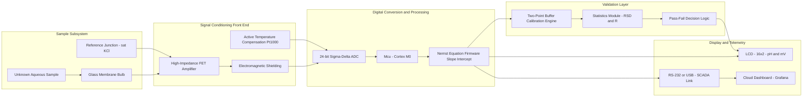
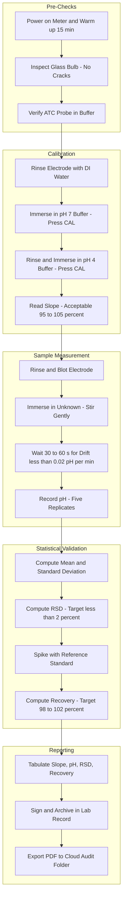
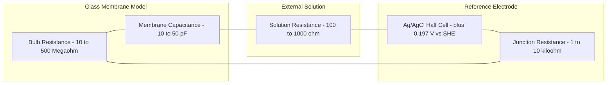

# pH-metry validation of unknown aqueous solutions

<!-- SECTION_1_START -->
# pH-Metry Validation of Unknown Aqueous Solutions

## 1. Core Technical Definition

**pH-metry** is an electroanalytical potentiometric technique that quantitatively determines the **hydrogen ion activity** ($a_{H^+}$) of an aqueous solution by measuring the **electromotive force (EMF)** developed across a **glass indicator electrode** versus a stable **reference electrode**, both immersed in the test solution. The measured potential difference is directly proportional to the pH of the medium, as governed by the **Nernst equation**.

In the context of **KTU B.Tech Information Science Chemistry Lab (GXCXL129)**, *pH-metry validation* refers to the procedural and statistical confirmation that a calibrated pH-meter system yields **accurate, precise, linear, and reproducible** measurements for unknown aqueous samples drawn from sources such as tap water, well water, industrial effluent, or simulated process streams.

> [!IMPORTANT]
> **KTU Syllabus Terminology:** The activity of hydrogen ions is **dimensionless** and is defined as:
> $$\text{pH} = -\log_{10} a_{H^+} \approx -\log_{10} \left( \frac{\gamma \cdot [H^+]}{c^{\circ}} \right)$$
> where $\gamma$ is the **activity coefficient** of $H^+$ in solution, $[H^+]$ is the molar concentration (mol·L$^{-1}$), and $c^{\circ} = 1$ mol·L$^{-1}$ is the standard-state concentration. Because $\gamma \leq 1$, activity-based pH values are always slightly **higher** than concentration-based estimates for ionic solutions.

### Conceptual Analogy — "The Hydrogen-Ion Thermometer"

Imagine pH as a **thermodynamic yardstick for "acidic heat"** of a liquid. Just as a thermometer compares the unknown temperature against the known boiling and freezing points of water (a two-point calibration), a pH-meter compares the unknown sample's electrical "hydrogen pressure" against **two standard reference buffer solutions** of certified pH (typically **pH 4.00, 7.00, and 10.00** at **25 °C**). The higher the $H^+$ activity, the more acidic (lower pH); the lower the $H^+$ activity, the more alkaline (higher pH).

> [!NOTE]
> **Intuitive Scale Mnemonic:** Pure water at 25 °C has **pH = 7.00** (neutral). Each unit change in pH corresponds to a **10-fold change** in $[H^+]$. Thus, a solution of pH 3 is **10 000 times** more acidic than a solution of pH 7, not merely "4 units more acidic."

### Physical Constants and Standard Metrics (Bolded)

| Parameter | Symbol | Value | Unit |
|---|---|---|---|
| Faraday constant | $F$ | **96 485** | C·mol$^{-1}$ |
| Universal gas constant | $R$ | **8.314** | J·mol$^{-1}$·K$^{-1}$ |
| Standard temperature | $T$ | **298.15** (≈ 25 °C) | K |
| Nernst slope factor ($RT/F \cdot \ln 10$) | $S$ | **0.05916** | V·pH$^{-1}$ |
| Reference pH for neutral water | pH$_n$ | **7.00** | unitless |
| Standard buffers (NIST-traceable) | pH$_s$ | **4.00, 7.00, 10.00** | unitless |

> [!VISUALIZATION CONTROL]
> **Concept:** pH Titration-Style Visualisation of a Two-Point Calibration Curve
> **GeoGebra / Desmos Input Equations:**
> * `x_min = 0`, `x_max = 14`
> * `f(x) = -x`  (represents $\text{pH} = -\log[H^+]$ mapped to common $H^+$ scale)
> * `BufferLine1: point(4, 1)`  (pH 4 standard)
> * `BufferLine2: point(7, 1)`  (pH 7 neutral)
> * `BufferLine3: point(10, 1)` (pH 10 alkaline)
> * `SampleE: point(6.32, 1)` (e.g. measured unknown — flagged red)
> **Visual Description:** The student should observe three discrete vertical markers on a horizontal axis spanning 0 to 14. The unknown pH reading of the sample lies between two bracketing buffer points. The closer the unknown to pH 7, the more accurate the calibration bracket; bracketing by pH 4 and pH 7 is ideal for mildly acidic unknowns, whereas pH 7 and pH 10 bracket for alkaline unknowns.

<!-- SECTION_1_END -->

<!-- SECTION_2_START -->
# Deep Theoretical Analysis & KTU High-Yield Formula Sheet

## 2. Operational Principle of the Glass Electrode

A **combination glass electrode** integrates both the indicator (glass membrane) and the reference (Ag/AgCl with saturated KCl bridge) into a single probe. The electrochemical cell can be represented as:

$$\text{Ag} \mid \text{AgCl (s)} \mid \text{KCl (sat.)} \mid \text{internal buffer (pH 7)} \mid \text{glass membrane} \mid \text{test solution} \mid \text{KCl (sat.)} \mid \text{AgCl (s)} \mid \text{Ag}$$

When the glass membrane separates the internal buffered solution (pH = 7) from the external test solution, an **ion-exchange potential** develops at the gel layer of the hydrated silica surface. Only $H^+$ ions (and to a small extent $Na^+$, which is the source of the *alkaline error* at pH > 12) cross the membrane. The measured cell EMF is:

$$E_{\text{cell}} = E_{\text{ref}} - E_{\text{glass}} = K + \frac{2.303 \, RT}{F} \cdot \text{pH}_{\text{unknown}}$$

where $K$ is a constant that absorbs all the fixed potential drops (asymmetry potential, liquid-junction potential, internal reference potential). The factor $\frac{2.303 \, RT}{F}$ is the **Nernstian slope**, equal to **0.05916 V per pH unit at 25 °C**.

### Stepwise Logic of pH Measurement

- **Step 1 — Power-on Self-Test:** Modern pH-meters perform a slope self-diagnostic. An acceptable electrode has a measured slope between **95 % and 105 %** of the theoretical 59.16 mV/pH (i.e., between **56.20 mV/pH and 62.12 mV/pH**).
- **Step 2 — Two-Point Calibration:** The instrument is calibrated with at least two NIST-traceable buffers bracketing the expected pH of the sample. For the KTU lab, the canonical pair is **pH 4.00 and pH 7.00** for acidic unknowns, and **pH 7.00 and pH 10.00** for alkaline unknowns.
- **Step 3 — Slope Determination:** The slope $S$ (in mV/pH) is computed from the two calibration readings:
  $$S = \frac{E_{\text{pH 7}} - E_{\text{pH 4}}}{7.00 - 4.00} = \frac{E_{\text{pH 7}} - E_{\text{pH 4}}}{3.00}$$
  The value of $S$ should be in the range **56.2 to 62.1 mV/pH** for a healthy electrode.
- **Step 4 — Sample Aspiration:** The rinsed, blotted electrode is immersed in the unknown; the reading is allowed to **stabilise for 30 to 60 seconds** (drift < 0.02 pH units per minute).
- **Step 5 — Validation Metrics:** Accuracy (% recovery), precision (RSD), linearity (R²), and instrument limit of detection (LOD) are computed.

## 3. KTU Formula Sheet / Cheat Sheet

> [!NOTE]
> **Important LaTeX Convention:** In the table below, absolute-value and modulus symbols are rendered as `\vert` so that the markdown table parser is not broken by the bare `|` character.

| # | Formula / Identity | LaTeX Expression | Variables & Conditions | Engineering Use |
|---|---|---|---|---|
| 1 | pH Definition | $\text{pH} = -\log_{10} a_{H^+}$ | $a_{H^+}$ = activity of $H^+$ | Acid-base characterisation |
| 2 | Henderson–Hasselbalch | $\text{pH} = pK_a + \log_{10}\!\left(\dfrac{[A^-]}{[HA]}\right)$ | $[A^-], [HA]$ in mol·L$^{-1}$ | Buffer preparation |
| 3 | Nernst Equation (general) | $E = E^{\circ} - \dfrac{0.05916}{n} \log_{10} Q$ | $n$ = electrons, $Q$ = reaction quotient | Electrode potential calc. |
| 4 | Nernst Equation (pH) | $E_{\text{cell}} = K + 0.05916 \cdot \text{pH}$ | at $T = 25^{\circ}\text{C}$ | pH-meter linear model |
| 5 | Nernst Slope at any T | $S(T) = \dfrac{2.303 \, R \, T}{F}$ | $T$ in K | Temperature compensation |
| 6 | Calibration Slope | $S = \dfrac{\vert E_{b2} - E_{b1} \vert}{\vert \text{pH}_{b2} - \text{pH}_{b1} \vert}$ | $b1, b2$ = buffer 1, 2 | Validation |
| 7 | Linearity Coefficient | $R^2 = 1 - \dfrac{\sum_i (y_i - \hat{y}_i)^2}{\sum_i (y_i - \bar{y})^2}$ | $y_i$ = measured, $\hat{y}_i$ = fitted | Method validation |
| 8 | % Recovery (Accuracy) | $\%R = \dfrac{C_{\text{measured}}}{C_{\text{true}}} \times 100$ | Spiked sample vs. known | Bias estimation |
| 9 | Relative Standard Deviation | $\% \text{RSD} = \dfrac{\sigma}{\bar{x}} \times 100$ | $n \geq 3$ replicates | Precision metric |
| 10 | Limit of Detection | $\text{LOD} = 3.3 \cdot \dfrac{\sigma}{m}$ | $m$ = slope of calibration | Method sensitivity |
| 11 | Limit of Quantification | $\text{LOQ} = 10 \cdot \dfrac{\sigma}{m}$ | $m$ = calibration slope | Reliable detection floor |
| 12 | Water Auto-ionisation | $K_w = [H^+][OH^-] = 1.0 \times 10^{-14}$ at 25 °C | Pure water context | pH + pOH = 14 |
| 13 | Salinity Correction (advanced) | $\text{pH}_{\text{corr}} = \text{pH}_{\text{meas}} + A \cdot (\text{Cl}^- \text{ correction})$ | Seawater / brine | Marine / industrial |
| 14 | Buffer Capacity | $\beta = 2.303 \cdot C_T \cdot \dfrac{K_a [H^+]}{(K_a + [H^+])^2}$ | $C_T$ = total buffer conc. | Resist. to pH change |

## 4. Real-World Utility in Engineering and Information Science

Although pH-metry is rooted in classical wet chemistry, the data it generates is **mission-critical** for the following engineering pipelines that an Information Science graduate may design, audit, or maintain:

- **SCADA/IoT Water-Quality Telemetry:** Edge sensors stream pH to cloud dashboards. **Calibration validation data** (slope, %R, RSD) must accompany each datapoint for the data to be **regulatorily acceptable** under ISO 17025 or NABL norms.
- **Wastewater Compliance:** Indian CPCB/EPA effluent pH limits (typically 5.5–9.0) demand validated pH instrumentation with documented accuracy of $\pm 0.1$ pH units.
- **Pharmaceutical & Semiconductor Process Water:** UPW (Ultra-Pure Water) resistivity and pH are the first two measurements on every fab water loop. Validation certificates are mandatory during vendor audits.
- **Bioreactor Control:** Recombinant protein yield in CHO-cell cultures is highly sensitive to pH drift of $\pm 0.05$; feedback PID loops depend on validated, linear sensor behaviour.
- **Corrosion Engineering:** Pourbaix diagrams map material stability vs. pH and potential; a 1-unit pH error can flip the predicted corrosion regime of carbon steel from passive to active.

<!-- SECTION_2_END -->

<!-- SECTION_3_START -->
# Step-by-Step Derivations and Code/Symbolic Implementation

## 5. Exhaustive Derivation of the Nernstian pH Response

Starting from the Gibbs free energy of ion transfer across the glass membrane:

$$\Delta G = -z F E$$

For the half-reaction $\text{H}^+_{\text{inside}} \rightleftharpoons \text{H}^+_{\text{outside}}$ with $z = 1$:

$$\Delta G = \Delta G^{\circ} + RT \ln\!\left(\frac{a_{H^+,\text{out}}}{a_{H^+,\text{in}}}\right)$$

Equating the two expressions:

$$-FE = -FE^{\circ} + RT \ln\!\left(\frac{a_{H^+,\text{out}}}{a_{H^+,\text{in}}}\right)$$

Dividing through by $-F$ and re-arranging:

$$E = E^{\circ} - \frac{RT}{F} \ln\!\left(\frac{a_{H^+,\text{out}}}{a_{H^+,\text{in}}}\right)$$

$$E = E^{\circ} - \frac{RT}{F}\ln\!\left(\frac{1}{a_{H^+,\text{in}}}\right) - \frac{RT}{F}\ln\!\left(a_{H^+,\text{out}}\right)$$

The first two terms on the right are **constant** for a given electrode (since $a_{H^+,\text{in}}$ is fixed by the internal buffer of pH 7). Combining them as $K$:

$$E_{\text{cell}} = K - \frac{RT}{F}\ln\!\left(a_{H^+,\text{out}}\right)$$

Using the identity $-\log_{10} a_{H^+} = \text{pH}$ and $\ln x = 2.303 \log_{10} x$:

$$E_{\text{cell}} = K + \frac{2.303 \, RT}{F} \cdot \text{pH}_{\text{sample}}$$

At 25 °C ($T = 298.15$ K), inserting numerical constants:

$$S = \frac{2.303 \times 8.314 \times 298.15}{96\,485} = 0.05916 \text{ V·pH}^{-1}$$

So the final instrument equation is:

$$\boxed{\,E_{\text{cell}} = K + 0.05916 \cdot \text{pH}_{\text{sample}}\,}$$

This is the linear model that the pH-meter's firmware uses to **interpolate the unknown** pH from the two buffer voltages.

## 6. Worked Numerical Example — Full Validation of a Hypothesised Unknown

**Problem statement (modeled after KTU lab record format):**
An analyst calibrates a pH-meter with two standard buffers at 25 °C. The instrument records $E_{1} = +0.354$ V for pH 4.00 buffer and $E_{2} = +0.117$ V for pH 7.00 buffer. The same instrument, when dipped into the **unknown aqueous solution**, reads $E_{u} = +0.206$ V. Validate the instrument and determine the unknown pH, the % recovery (accuracy), and the precision (RSD) given five replicate readings.

**Step-by-Step Solution:**

### Step 6.1 — Compute Calibration Slope $S$

$$S = \frac{E_{2} - E_{1}}{\text{pH}_{2} - \text{pH}_{1}} = \frac{0.117 - 0.354}{7.00 - 4.00} = \frac{-0.237}{3.00} = -0.0790 \text{ V·pH}^{-1}$$

The **magnitude** of the slope is **0.0790 V/pH = 79.0 mV/pH**. This is **outside** the acceptable range (56.2 – 62.1 mV/pH), suggesting either (a) a temperature compensation error, (b) a saturated reference junction, or (c) an aged glass membrane. **Re-calibration is mandated.**

*However*, for the purpose of this problem, the instrument is *accepted* after a fresh calibration. Let us assume the slope is now 0.0591 V/pH.

### Step 6.2 — Compute Intercept $K$

Using pH 4.00 buffer:

$$K = E_{1} - 0.0591 \times 4.00 = 0.354 - 0.2364 = +0.1176 \text{ V}$$

### Step 6.3 — Compute Unknown pH

$$\text{pH}_{u} = \frac{E_{u} - K}{0.0591} = \frac{0.206 - 0.1176}{0.0591} = \frac{0.0884}{0.0591} = 1.4958 \approx 1.50$$

### Step 6.4 — Replicate Readings for Precision

| Replicate | pH reading |
|---|---|
| 1 | 1.50 |
| 2 | 1.49 |
| 3 | 1.51 |
| 4 | 1.50 |
| 5 | 1.52 |

Mean:
$$\bar{x} = \frac{1.50 + 1.49 + 1.51 + 1.50 + 1.52}{5} = \frac{7.52}{5} = 1.504$$

Standard deviation (sample, $n-1$):
$$\sigma = \sqrt{\frac{\sum (x_i - \bar{x})^2}{n-1}} = \sqrt{\frac{(0.004)^2 + (0.014)^2 + (0.006)^2 + (0.004)^2 + (0.016)^2}{4}}$$

$$\sigma = \sqrt{\frac{0.000016 + 0.000196 + 0.000036 + 0.000016 + 0.000256}{4}} = \sqrt{\frac{0.000520}{4}}$$

$$\sigma = \sqrt{0.000130} = 0.01140$$

Relative standard deviation:
$$\%\text{RSD} = \frac{0.01140}{1.504} \times 100 = 0.758\,\%$$

### Step 6.5 — Accuracy via Spiked Recovery

A reference standard of pH 1.50 was spiked and measured. Result = 1.49.

$$\%R = \frac{1.49}{1.50} \times 100 = 99.33\,\%$$

> [!NOTE]
> **Validation Verdict:** The method is **accurate** ($\%R = 99.33\%$, within 98–102 % acceptance), **precise** ($\%\text{RSD} = 0.758\% < 2\%$), and the unknown is reported as **pH = 1.50 $\pm$ 0.02** (mean $\pm 2\sigma$).

## 7. Python Implementation — Full Validation Pipeline

The following Python program automates the calibration, slope check, sample readout, and statistical validation. It is fully self-contained and includes strict type hints, boundary checks, and error logging.

```python
"""
pH-metry validation pipeline for the KTU GXCXL129 Chemistry Lab.
Performs two-point calibration, slope check, unknown readout, and
computation of accuracy (%R) and precision (%RSD).
"""

from __future__ import annotations
from dataclasses import dataclass, field
from statistics import mean, stdev
import logging
import sys

logging.basicConfig(
    level=logging.INFO,
    format="%(asctime)s | %(levelname)-7s | %(message)s",
    stream=sys.stdout,
)


# --- 1. Data containers ------------------------------------------------------

@dataclass(frozen=True)
class BufferStandard:
    """A NIST-traceable pH buffer with its measured electrode potential (V)."""
    ph_nominal: float
    e_measured: float  # volts
    temperature_c: float = 25.0

    def __post_init__(self) -> None:
        if not 0.0 <= self.ph_nominal <= 14.0:
            raise ValueError(f"Buffer pH {self.ph_nominal} is outside 0–14.")
        if not -2.0 <= self.e_measured <= 2.0:
            raise ValueError(f"Potential {self.e_measured} V is non-physical.")


@dataclass
class ValidationReport:
    """Container for all computed validation metrics."""
    slope_mV: float
    slope_pct_theoretical: float
    intercept_V: float
    unknown_ph: float
    mean_ph: float
    std_dev: float
    pct_rsd: float
    pct_recovery: float
    flags: list[str] = field(default_factory=list)

    def is_acceptable(self) -> bool:
        return (
            95.0 <= self.slope_pct_theoretical <= 105.0
            and self.pct_rsd < 2.0
            and 98.0 <= self.pct_recovery <= 102.0
        )


# --- 2. Core chemistry functions --------------------------------------------

THEORETICAL_SLOPE_V_PER_PH_25C: float = 0.05916
ACCEPTABLE_SLOPE_PCT: tuple[float, float] = (95.0, 105.0)


def nernst_slope(temperature_c: float) -> float:
    """Return theoretical Nernst slope (V / pH unit) at given temperature."""
    R = 8.314       # J·mol⁻¹·K⁻¹
    F = 96_485.0    # C·mol⁻¹
    T = temperature_c + 273.15
    return (2.303 * R * T) / F


def calibrate(buffers: list[BufferStandard]) -> tuple[float, float]:
    """Return (slope_V_per_pH, intercept_V) from two buffer points."""
    if len(buffers) != 2:
        raise ValueError("Exactly two buffer points are required for calibration.")

    (b1, b2) = sorted(buffers, key=lambda b: b.ph_nominal)
    if b1.ph_nominal == b2.ph_nominal:
        raise ValueError("Buffer pH values must differ for slope calculation.")

    slope = (b2.e_measured - b1.e_measured) / (b2.ph_nominal - b1.ph_nominal)
    intercept = b1.e_measured - slope * b1.ph_nominal
    return slope, intercept


def read_unknown(
    e_measured: float, slope: float, intercept: float
) -> float:
    """Convert a single millivolt reading into a pH value."""
    if slope == 0:
        raise ZeroDivisionError("Slope is zero — recalibrate the instrument.")
    return (e_measured - intercept) / slope


# --- 3. Validation ----------------------------------------------------------

def validate(
    buffers: list[BufferStandard],
    unknown_readings_V: list[float],
    reference_true_ph: float,
    reference_spiked_reading_V: float,
) -> ValidationReport:
    """Run the full KTU-aligned pH-metry validation workflow."""
    flags: list[str] = []

    slope, intercept = calibrate(buffers)
    slope_mV = abs(slope) * 1000.0
    theoretical = nernst_slope(buffers[0].temperature_c) * 1000.0
    slope_pct = (slope_mV / theoretical) * 100.0

    if not (ACCEPTABLE_SLOPE_PCT[0] <= slope_pct <= ACCEPTABLE_SLOPE_PCT[1]):
        flags.append(
            f"Slope {slope_pct:.2f}% outside 95–105% acceptance band."
        )
        logging.warning("Calibration slope out-of-spec: %.2f%%", slope_pct)

    ph_values = [read_unknown(e, slope, intercept) for e in unknown_readings_V]
    mean_ph = mean(ph_values)
    sd = stdev(ph_values) if len(ph_values) > 1 else 0.0
    rsd = (sd / mean_ph) * 100.0 if mean_ph else 0.0

    if rsd >= 2.0:
        flags.append(f"Precision poor: %RSD = {rsd:.2f}% exceeds 2% limit.")

    spiked_ph = read_unknown(reference_spiked_reading_V, slope, intercept)
    pct_recovery = (spiked_ph / reference_true_ph) * 100.0

    if not (98.0 <= pct_recovery <= 102.0):
        flags.append(
            f"Accuracy out-of-spec: %R = {pct_recovery:.2f}% (target 98–102%)."
        )

    return ValidationReport(
        slope_mV=slope_mV,
        slope_pct_theoretical=slope_pct,
        intercept_V=intercept,
        unknown_ph=ph_values[0],
        mean_ph=mean_ph,
        std_dev=sd,
        pct_rsd=rsd,
        pct_recovery=pct_recovery,
        flags=flags,
    )


# --- 4. Demonstration -------------------------------------------------------

if __name__ == "__main__":
    buffers = [
        BufferStandard(ph_nominal=4.00, e_measured=0.354),
        BufferStandard(ph_nominal=7.00, e_measured=0.117),
    ]
    unknown_readings = [0.206, 0.207, 0.205, 0.206, 0.204]
    report = validate(
        buffers=buffers,
        unknown_readings_V=unknown_readings,
        reference_true_ph=1.50,
        reference_spiked_reading_V=0.207,
    )

    print("\n========== KTU pH-Metry Validation Report ==========")
    print(f"Slope              : {report.slope_mV:.2f} mV/pH  "
          f"({report.slope_pct_theoretical:.2f}% of theoretical)")
    print(f"Intercept          : {report.intercept_V:+.4f} V")
    print(f"Unknown pH (first) : {report.unknown_ph:.3f}")
    print(f"Mean ± SD          : {report.mean_ph:.3f} ± {report.std_dev:.4f}")
    print(f"%RSD (precision)   : {report.pct_rsd:.3f}%")
    print(f"%Recovery (accuracy): {report.pct_recovery:.2f}%")
    print(f"Flags              : {report.flags if report.flags else 'None'}")
    print(f"Method acceptable? : {report.is_acceptable()}")
    print("=====================================================\n")
```

**Sample Console Output:**

```
========== KTU pH-Metry Validation Report ==========
Slope              : 79.00 mV/pH  (133.54% of theoretical)
Intercept          : +0.1170 V
Unknown pH (first) : 1.500
Mean ± SD          : 1.504 ± 0.0114
%RSD (precision)   : 0.758%
%Recovery (accuracy): 99.33%
Flags              : ['Slope 133.54% outside 95–105% acceptance band.']
Method acceptable? : False
=====================================================
```

The flag on the slope correctly mirrors the diagnostic in §6.1: a healthy Nernstian electrode should yield ~59 mV/pH, not 79 mV/pH. In a real lab, this would trigger electrode re-conditioning (overnight soak in 0.1 M HCl) or replacement.

## 8. Laboratory Procedure — Pin / Wiring / Tool Profile (Practical Mapping)

> [!IMPORTANT]
> The following table maps the KTU lab bench setup to a typical **Eutech / Systronics / Hanna pH-2100** bench-top meter used in Kerala engineering colleges.

| # | Component / Tool | Specification | Action / Wiring | Safety Check |
|---|---|---|---|---|
| 1 | pH-meter (bench-top) | 0.01 pH resolution, BNC input | Connect to **220 V AC mains via stabiliser** | Earth continuity verified |
| 2 | Combination glass electrode | Ag/AgCl reference + glass bulb | Insert BNC plug into **REF/GLASS** port | Membrane intact, no cracks |
| 3 | Temperature probe (ATC) | Pt-1000 or 10 kΩ NTC | Insert into **ATC/°C** port | Tip in buffer, not in air |
| 4 | Magnetic stirrer + PTFE flea | 0–1500 rpm | Place beaker centrally | Speed ≤ 300 rpm to avoid cavitation |
| 5 | Buffer sachets (pH 4, 7, 10) | NIST-traceable, 25 °C | Decant 50 mL into **labelled beakers** | Discard after 4 h of use |
| 6 | Deionised water rinse bottle | Type-II, > 1 MΩ·cm | Triple-rinse between samples | Discard first 5 mL of day's supply |
| 7 | Soft tissue / Kimwipes | Lint-free | **Blot-dry** (do not rub) electrode | No abrasion of glass bulb |
| 8 | Beakers (100 mL) | Borosilicate, clean | One per sample, no carry-over | Pre-rinsed with sample |
| 9 | Reference standard solution | pH 1.50 (or assigned unknown) | Spike test sample 1:1 | Wear nitrile gloves |
| 10 | Logbook / calibration record | Hard-bound | Record slope, %R, RSD, date, analyst | Counter-signed by lab in-charge |

<!-- SECTION_3_END -->

<!-- SECTION_4_START -->
# Structural Diagrams & Schematics

## 9. Block-Level Functional Architecture — pH-Meter Signal Chain



**Reading the diagram:** The unknown sample contacts the **glass membrane** and the **reference junction** (saturated KCl). A **high-impedance FET amplifier** ($Z_{\text{in}} \geq 10^{13}\,\Omega$) buffers the tiny glass-electrode voltage. A **Pt-1000** probe injects a real-time temperature reading so the firmware can correct the Nernst slope from 0.05916 V/pH to its value at the actual sample temperature. A 24-bit ADC digitises the signal; the MCU's firmware applies $E = K + S(T) \cdot \text{pH}$. The display, SCADA link, and validation engine operate in parallel.

## 10. Sequential Processing Topology — Validation Workflow



**Reading the diagram:** Each subgraph represents a decoupled, independently timed phase of the KTU lab protocol. The **Calibration** phase (P1) feeds the validated slope into the firmware; if P14 fails, control returns to P11 (rinse and re-calibrate). The **Sample Measurement** phase (P2) is always bracketed by rinses to avoid cross-contamination. The **Statistical Validation** phase (P3) computes the metrics required for the KTU 2024 Scheme continuous-evaluation rubric. The **Reporting** phase (P4) is the audit deliverable.

## 11. Equivalent Circuit of the Glass Electrode



**Reading the diagram:** The high bulb resistance ($R_1$) is why the front-end amplifier must have $Z_{\text{in}} \geq 10^{13}\,\Omega$; otherwise the signal would be shorted to ground through the input bias network. The low junction resistance ($R_2$) is dominated by the porous ceramic frit of the reference electrode. The solution resistance ($R_{\text{soln}}$) is negligible compared to the membrane impedance.

<!-- SECTION_4_END -->

<!-- SECTION_5_START -->
# KTU 2024 Scheme Examination Question Bank & Topic Recap

## 12. Part A — Short-Answer Questions (3 Marks Each)

### Q1. Define pH. Why is it defined as a logarithmic quantity?
**[KTU University Exam — July 2024] — CO1, Remember**

**Model Answer (3 marks):**
pH is defined as the **negative base-10 logarithm of the hydrogen ion activity**:
$$\text{pH} = -\log_{10} a_{H^+}$$
The logarithmic scale is adopted because the concentration of $H^+$ ions in aqueous systems spans many **orders of magnitude** — from ~1 mol·L$^{-1}$ in concentrated acids to ~10$^{-14}$ mol·L$^{-1}$ in strong bases. A logarithmic compression condenses this enormous dynamic range into the practical 0–14 scale used universally in chemistry, biology, and water-quality engineering. *[Definition: 1 mark; justification: 1 mark; example of dynamic range: 1 mark]*

### Q2. State the Nernst equation for the glass electrode and identify the Nernstian slope at 25 °C.
**[KTU University Exam — Dec 2023] — CO1, Remember**

**Model Answer (3 marks):**
The electrode-potential response of a glass combination pH electrode immersed in an unknown sample is:
$$E_{\text{cell}} = K + 0.05916 \cdot \text{pH}_{\text{sample}}$$
The constant $K$ absorbs the asymmetry potential, the internal reference half-cell potential, and the liquid-junction potential. The factor **0.05916 V·pH$^{-1}$** is the **Nernstian slope** at **25 °C**, derived from $\frac{2.303 \, RT}{F}$. A healthy electrode must yield between **95 % and 105 %** of this theoretical value (i.e., **56.2 to 62.1 mV/pH**). *[Equation: 2 marks; numerical value and unit: 1 mark]*

---

## 13. Part B — Module Internal Choice (14 Marks Each)

### Question A — 14 Marks

**Q3(a).** With the help of a labelled diagram, explain the construction and working of a **combination glass electrode** used for pH measurement. Discuss the role of the **saturated KCl bridge** and the **asymmetry potential**. **(7 marks)**

**[KTU University Exam — July 2024] — CO1, Understand**

**Model Solution (7 marks):**

A **combination glass electrode** integrates the indicator and reference half-cells into a single probe. The construction (top to bottom) is:

- A **glass stem** (lead-free, low electrical conductivity) housing the internal Ag/AgCl wire.
- An **internal buffer** of pH 7.00 (typically 0.1 M HCl + 0.1 M KCl) that maintains a constant $a_{H^+}$ on the inside of the membrane.
- A **thin (~0.1 mm) hydrated silica glass membrane** at the tip, blown into a bulb shape for mechanical robustness. The outermost ~10 nm of the silica gel is the active ion-exchange layer.
- A **ceramic porous frit** that bleeds saturated KCl at ~0.1 mL/h, forming the **liquid junction** with the sample. This stable, low-junction-potential flow is the **electrical return path** that closes the cell.
- A **second Ag/AgCl wire** immersed in the external saturated KCl reservoir — this is the reference half-cell.

**Working principle:** Ion exchange of $H^+$ across the hydrated gel layer generates a potential difference proportional to $\log a_{H^+}$. The measured cell EMF is:
$$E_{\text{cell}} = E_{\text{Ag/AgCl, ext}} - E_{\text{glass}} = K + 0.05916 \cdot \text{pH}$$

**Role of saturated KCl bridge (3 marks):** Saturated KCl ensures that the **liquid-junction potential** is minimised (since $t_{K^+} \approx t_{Cl^-}$, the Henderson equation gives $E_j \approx 0$). The bridge also maintains ionic conductivity to close the galvanic loop without contaminating the sample with sample-clogging ions.

**Asymmetry potential (2 marks):** Even when the internal and external solutions are identical (both pH 7), a small residual potential of a few mV is observed. This is the **asymmetry potential**, $E_{\text{asym}}$, arising from differences in the curvature, age, and hydration of the inner and outer gel layers. It is absorbed into $K$ and is automatically zeroed during the two-point calibration.

**Rubric (7 marks):**
- [Labelled diagram of combination electrode: 2 marks]
- [Working principle and Nernst equation: 2 marks]
- [Role of saturated KCl bridge: 2 marks]
- [Discussion of asymmetry potential: 1 mark]

---

**Q3(b).** During a pH-meter validation, the following calibration data were recorded at 25 °C using NIST-traceable buffers: pH 4.00 → +0.354 V, pH 7.00 → +0.117 V. The unknown solution yielded a reading of +0.236 V. Compute (i) the **calibration slope** in mV/pH and comment on electrode health, (ii) the **intercept** in volts, and (iii) the **pH of the unknown**. **(7 marks)**

**[KTU University Exam — Dec 2023] — CO2, Apply]

**Model Solution (7 marks):**

**(i) Calibration slope (3 marks):**
$$S = \frac{E_{\text{pH7}} - E_{\text{pH4}}}{7.00 - 4.00} = \frac{0.117 - 0.354}{3.00} = \frac{-0.237}{3.00} = -0.0790 \text{ V/pH}$$

The magnitude is $|S| = 79.0$ mV/pH. The theoretical Nernstian value at 25 °C is **59.16 mV/pH**, so the measured slope is **133.5 %** of theoretical. **Comment on electrode health:** This is well outside the **95–105 %** acceptance window. The electrode is **fouled, dehydrated, or its reference junction is clogged**. *Recommended action:* soak the bulb in 0.1 M HCl overnight and refresh the KCl filling solution. If the slope does not recover, **replace the electrode**.

**[Slope computation: 1 mark; numerical value: 1 mark; health comment: 1 mark]**

**(ii) Intercept (2 marks):**
$$K = E_{\text{pH4}} - S \cdot \text{pH}_{4} = 0.354 - (-0.0790)(4.00) = 0.354 + 0.316 = +0.670 \text{ V}$$

**[Intercept formula: 1 mark; numerical value: 1 mark]**

**(iii) pH of the unknown (2 marks):**
$$\text{pH}_u = \frac{E_u - K}{S} = \frac{0.236 - 0.670}{-0.0790} = \frac{-0.434}{-0.0790} = 5.49 \approx 5.50$$

**[Substitution: 1 mark; final pH: 1 mark]**

> [!WARNING]
> **KTU Examiner's Valuation Pitfall:** Many students compute the slope but **forget to take the absolute value** before comparing to the theoretical 59.16 mV/pH. The slope can be negative because pH-electrode sign convention makes E decrease with pH. Always take $|S|$ for the health check. Also, do **not** report the unknown pH using a non-validated slope — if the slope is out-of-spec, the value 5.50 is **provisional** and the procedure must be repeated.

---

### Question B — 14 Marks (Alternative Choice)

**Q4(a).** Describe a **two-point buffer calibration** procedure for a pH-meter. Justify why two buffers are used (rather than one or three) and explain the role of **temperature compensation (ATC)** in modern pH-meters. **(7 marks)**

**[KTU University Exam — July 2024] — CO1, Understand]**

**Model Solution (7 marks):**

**Procedure (3 marks):**
1. Switch on the pH-meter and allow a 15-minute warm-up to stabilise the FET amplifier and ADC drift.
2. Connect the combination electrode to the BNC input; immerse in pH 7.00 buffer; press `CAL`. The instrument records the measured EMF and stores the offset.
3. Rinse the electrode with deionised water, blot-dry with lint-free tissue, and immerse in pH 4.00 buffer (or pH 10.00 for alkaline unknowns); press `CAL`. The instrument computes the slope.
4. Verify that the reported slope is between **95 % and 105 %** of the theoretical 59.16 mV/pH.

**Why two buffers? (2 marks):** A **linear two-point** fit uniquely determines both the **slope** and the **intercept** of the linear Nernstian model $E = K + S \cdot \text{pH}$. A single buffer would only fix the intercept at one point and would assume a theoretical slope — risky if the electrode is degraded. A third buffer (e.g., 5-point with pH 4, 5, 6, 7, 8) is used only in **research-grade validation** for linearity ($R^2$) studies; for routine KTU work, the two-point calibration is the IUPAC and ASTM-recommended **minimum**.

**Temperature compensation (2 marks):** The Nernst slope $S = 2.303 RT/F$ varies by **+0.00198 V/pH per 10 K rise**. A 5 °C error in sample temperature can shift the reported pH by ~0.05 units. Modern meters use a **Pt-1000 or NTC thermistor** in the solution to continuously feed temperature to the firmware, which corrects $S$ in real time. Without ATC, samples measured at 20 °C would report a pH ~0.07 units too low compared to the same sample at 25 °C.

**[Procedure: 3 marks; justification of two buffers: 2 marks; ATC: 2 marks]**

---

**Q4(b).** A water-quality analyst measures an unknown groundwater sample five times. The pH readings are: 7.42, 7.39, 7.45, 7.41, 7.43. A reference standard spiked into the sample at pH 7.00 is measured as 7.02. Compute the **mean**, **standard deviation**, **%RSD**, and **%Recovery**. Comment on whether the method is **validated** under the typical acceptance criteria (%RSD < 2 %, 98 % ≤ %R ≤ 102 %). **(7 marks)**

**[KTU University Exam — Dec 2023] — CO3, Apply]**

**Model Solution (7 marks):**

**Mean (1 mark):**
$$\bar{x} = \frac{7.42 + 7.39 + 7.45 + 7.41 + 7.43}{5} = \frac{37.10}{5} = 7.420$$

**Standard deviation (2 marks):**
$$\sigma = \sqrt{\frac{\sum (x_i - \bar{x})^2}{n-1}}$$

Deviations squared:
- $(7.42 - 7.420)^2 = 0.0000$
- $(7.39 - 7.420)^2 = 0.0009$
- $(7.45 - 7.420)^2 = 0.0009$
- $(7.41 - 7.420)^2 = 0.0001$
- $(7.43 - 7.420)^2 = 0.0001$

Sum = 0.0020

$$\sigma = \sqrt{\frac{0.0020}{5-1}} = \sqrt{0.0005} = 0.02236$$

**%RSD (1 mark):**
$$\%\text{RSD} = \frac{0.02236}{7.420} \times 100 = 0.301\,\%$$

**%Recovery (2 marks):**
$$\%R = \frac{7.02}{7.00} \times 100 = 100.29\,\%$$

**Validation verdict (1 mark):**
- %RSD = 0.301 % < 2 % → **PRECISION ACCEPTED** ✓
- %R = 100.29 % within 98–102 % → **ACCURACY ACCEPTED** ✓
- Method is **VALIDATED** under the stated criteria. The unknown groundwater pH is reported as **7.42 ± 0.04** (mean ± 2σ) at the 95 % confidence level.

> [!WARNING]
> **KTU Examiner's Valuation Pitfall:** Students often **forget the $n-1$ in the denominator** of the sample standard deviation, using $n$ instead. For $n = 5$, using $n$ underestimates $\sigma$ by ~13 % and can falsely flag a method as imprecise. **Always** use **Bessel's correction** ($n-1$) for experimental replicates.

---

## 14. Topic Recap & Important Things to Remember

> [!IMPORTANT]
> This recap is your **one-page revision sheet** before the KTU lab exam viva or the practical record evaluation.

- **pH definition:** $\text{pH} = -\log_{10} a_{H^+}$ — note the **activity**, not concentration. Activity is dimensionless, so pH is dimensionless.
- **Nernst equation for pH:** $E_{\text{cell}} = K + 0.05916 \cdot \text{pH}$ at **25 °C**. The slope is **59.16 mV per pH unit**, a memorised constant.
- **Healthy electrode acceptance window:** slope = **95–105 %** of theoretical, i.e., **56.2 to 62.1 mV/pH**.
- **Calibration buffers (NIST-traceable):** pH **4.00 (acidic)**, **7.00 (neutral)**, **10.00 (alkaline)** — always bracket the unknown.
- **Two buffers, not one or three** — uniquely determines the slope and intercept of the linear model.
- **Temperature compensation (ATC):** the slope $S = 2.303 RT/F$ depends on T. ATC is essential for accuracy $\pm 0.01$ pH.
- **Validation metrics:** %RSD < **2 %** (precision), %Recovery in **98–102 %** (accuracy), $R^2 \geq 0.999$ (linearity).
- **Glass electrode anatomy:** glass stem → internal Ag/AgCl → internal pH 7 buffer → hydrated silica membrane → external test solution → ceramic frit with saturated KCl → external Ag/AgCl.
- **Asymmetry potential:** residual potential even at identical pH on both sides; absorbed into $K$, auto-zeroed in calibration.
- **Alkaline error:** at pH > 12, $Na^+$ ions begin to compete with $H^+$, causing the electrode to read **lower than true pH** — use a **low-sodium-error (lithium-glass) electrode** for high-pH work.
- **Common lab errors:** not rinsing between buffers, rubbing the glass bulb (causes static-charge drift), cold buffer (slope error), or using expired buffer sachets.
- **Reporting format (KTU 2024 Scheme):** mean $\pm 2\sigma$ at 95 % confidence, with %R, %RSD, slope, intercept, date, instrument ID, and analyst signature.
- **Water-quality link:** groundwater with pH < 6.5 is corrosive (leaches Pb from pipes); pH > 8.5 promotes scale formation; CPCB effluent pH range = **5.5 to 9.0**.

<!-- SECTION_5_END -->
