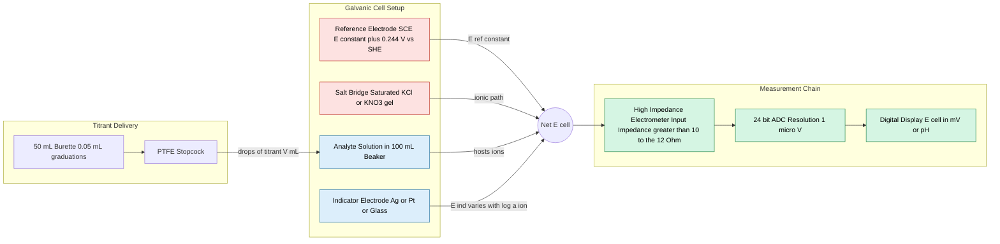
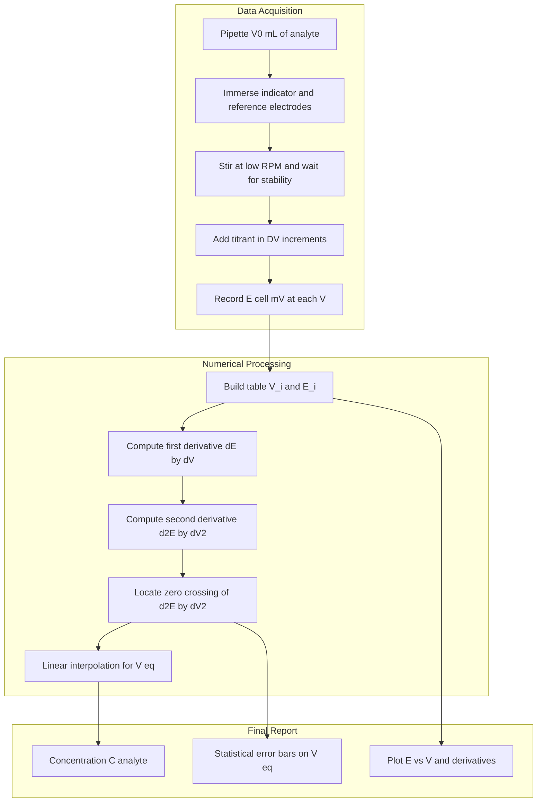

# Potentiometric titrations tracking concentration profiles

<!-- SECTION_1_START -->
# Potentiometric Titrations: Tracking Concentration Profiles

## 1. Core Technical Definition

**Potentiometric titration** is a volumetric analytical technique in which the **equivalence point** of a titration is determined by measuring the **electromotive force (EMF)** of a galvanic cell comprising an **indicator electrode** and a **reference electrode**, plotted as a function of the volume of titrant added, without drawing any current from the system (i.e., under conditions of effectively zero net current).

> [!IMPORTANT]
> **KTU 2024 Syllabus Definition (GXCXL129):** Potentiometric titration is classified under *Instrumental Methods of Analysis* in Module 1. The student is expected to construct the cell, record the potential $E_{\text{cell}}$ versus titrant volume $V$ data, and statistically / graphically identify the equivalence point using the **Gran plot**, **first-derivative**, or **second-derivative** method.

The fundamental cell representation used throughout the KTU 2024 lab record is:

$$\text{Reference Electrode} \parallel \text{Test Solution} \mid \text{Indicator Electrode}$$

The cell potential is governed by the **Nernst Equation**:

$$E_{\text{cell}} = E_{\text{cell}}^{\circ} - \frac{RT}{nF} \ln Q_{\text{rxn}}$$

Where:
- $E_{\text{cell}}^{\circ}$ = standard cell potential (**V**)
- $R$ = universal gas constant = **$8.314 \ \mathrm{J \cdot mol^{-1} \cdot K^{-1}}$**
- $T$ = absolute temperature (**K**)
- $F$ = Faraday's constant = **$96485 \ \mathrm{C \cdot mol^{-1}}$**
- $n$ = number of electrons transferred per mole of analyte
- $Q_{\text{rxn}}$ = reaction quotient (ratio of activities of products to reactants)

At standard temperature $T = 298.15 \ \mathrm{K}$, the thermal voltage simplifies to:

$$\frac{RT}{F} \ln 10 = \frac{0.05916 \ \mathrm{V}}{n} \quad \text{(at } 25^{\circ}\mathrm{C)}$$

> [!NOTE]
> **Key Intuition:** Think of a potentiometric titration as a "voltage-tape-measure." Instead of watching a colour change (as in visual titrations with phenolphthalein or methyl orange), you watch a **voltage needle jump** at the equivalence point. The voltage is essentially a *logarithmic reporter* of ion concentration — every 10-fold change in ion activity shifts the potential by $\frac{0.059}{n}$ volts at $25^{\circ}\mathrm{C}$.

## 2. Conceptual Analogy / Intuition

Imagine a swimming pool with two sides divided by a thin membrane. You pour salt on one side — the membrane "feels" the chemical imbalance and generates a tiny voltage proportional to the log of the salt ratio. The potentiometric titration works identically: the indicator electrode **senses the activity** of a specific ion (H⁺, Ag⁺, Fe²⁺, etc.) and translates it into a measurable voltage against a stable reference. As the titrant is added drop by drop, the ion's concentration changes by **orders of magnitude near the equivalence point** — producing the characteristic sharp "S-shaped" jump in the $E$ vs $V$ plot.

> [!VISUALIZATION CONTROL]
> **Concept:** Sigmoidal Potentiometric Titration Curve
> **Generic Desmos / GeoGebra Equations (Redox example):**
> * $E(V) = 0.30 + 0.059 \cdot \log\!\left(\dfrac{0.1}{V - V_{\text{eq}} + 0.001}\right)$ for $V < V_{\text{eq}}$
> * $E(V) = 1.10 - 0.059 \cdot \log\!\left(\dfrac{V - V_{\text{eq}} + 0.001}{0.1}\right)$ for $V > V_{\text{eq}}$
> **Visual Description:** A near-flat curve at ~$0.30 \ \mathrm{V}$, a steeply rising section between $V = V_{\text{eq}} - 1$ mL and $V = V_{\text{eq}} + 1$ mL, then a plateau near $1.10 \ \mathrm{V}$. The **inflection point** of the S-curve marks the equivalence point.
<!-- SECTION_1_END -->

<!-- SECTION_2_START -->
# Deep Theoretical Analysis & KTU High-Yield Formula Sheet

## 2.1 The Galvanic Cell Architecture

A potentiometric titration cell comprises three functional modules:

1. **Reference Electrode** — supplies a *constant, known* half-cell potential $E_{\text{ref}}$ independent of the analyte. Common choices: **Saturated Calomel Electrode (SCE)** with $E^{\circ} = +0.244 \ \mathrm{V}$ vs SHE, or **Silver/Silver Chloride (Ag/AgCl)** with $E^{\circ} = +0.222 \ \mathrm{V}$ vs SHE.
2. **Salt Bridge** — a porous frit or KCl-filled tube that completes the ionic circuit while preventing bulk mixing.
3. **Indicator Electrode** — its potential $E_{\text{ind}}$ *responds* (Nernstianly) to the activity of the analyte ion.

The measured cell EMF is:

$$E_{\text{cell}} = E_{\text{ind}} - E_{\text{ref}}$$

## 2.2 Electrode Selection Matrix (KTU-High-Yield)

| Titration Type | Analyte Ion's Activity | Indicator Electrode | Reference Electrode |
| :--- | :--- | :--- | :--- |
| Acid–Base (Strong) | $a_{\mathrm{H^{+}}}$ | **Glass Electrode** (pH-sensitive) | SCE / Ag/AgCl |
| Acid–Base (Weak, polyprotic) | $a_{\mathrm{H^{+}}}$ | Glass Electrode | SCE / Ag/AgCl |
| Precipitation (Ag⁺ vs Cl⁻/Br⁻/SCN⁻) | $a_{\mathrm{Ag^{+}}}$ or $a_{\mathrm{X^{-}}}$ | **Silver Wire** (2nd order response) | SCE in $\mathrm{KNO_3}$ salt bridge |
| Redox (Fe²⁺ vs $\mathrm{Ce^{4+}}$) | $a_{\mathrm{Fe^{2+}}}/a_{\mathrm{Fe^{3+}}}$ | **Bright Platinum Wire** | SCE / Ag/AgCl |
| Complexometric ($\mathrm{Ca^{2+}}$ vs EDTA) | $a_{\mathrm{Ca^{2+}}}$ | **Mercury / Mercury-EDTA** | SCE |
| Iodometric ($\mathrm{I_2}$ vs $\mathrm{S_2O_3^{2-}}$) | $a_{\mathrm{I^{-}}}$ | Platinum | SCE |

> [!NOTE]
> The **Glass Electrode** is a *membrane electrode* — its potential arises from ion-exchange equilibria at a thin hydrated silica gel layer, not from a redox reaction. Its asymmetry potential must be corrected using standard pH buffers.

## 2.3 Equivalence Point Detection — Three Methods

### Method 1: Classical $E$ vs $V$ S-Curve
The simplest. The midpoint of the steepest portion of the S-curve is taken as the equivalence volume $V_{\text{eq}}$. Visual but imprecise (typically $\pm 0.05$ mL uncertainty).

### Method 2: First-Derivative Plot ($\dfrac{\Delta E}{\Delta V}$ vs $V$)
A bell-shaped peak. The maximum of the peak corresponds to $V_{\text{eq}}$. Numerically computed as:

$$\left(\frac{\Delta E}{\Delta V}\right)_{i} = \frac{E_{i+1} - E_{i-1}}{V_{i+1} - V_{i-1}}$$

### Method 3: Second-Derivative Plot ($\dfrac{\Delta^{2} E}{\Delta V^{2}}$ vs $V$)
The **most KTU-preferred** because the curve crosses zero at $V_{\text{eq}}$, giving an *interpolated* answer rather than a graphical eyeball.

$$\left(\frac{\Delta^{2} E}{\Delta V^{2}}\right)_{i} = \frac{\left(\frac{\Delta E}{\Delta V}\right)_{i+1} - \left(\frac{\Delta E}{\Delta V}\right)_{i-1}}{\Delta V}$$

Interpolation formula used by board examiners:

$$V_{\text{eq}} = V_{a} + \left(\frac{0 - \left(\frac{\Delta^{2} E}{\Delta V^{2}}\right)_{a}}{\left(\frac{\Delta^{2} E}{\Delta V^{2}}\right)_{b} - \left(\frac{\Delta^{2} E}{\Delta V^{2}}\right)_{a}}\right) \times (V_{b} - V_{a})$$

Where $a$ and $b$ are the data points straddling the sign change.

### Method 4: Gran Plot (Advanced — bonus credit in KTU)
Plots a linearised form of the Nernst equation *before* the equivalence point. For a Fe²⁺ / Ce⁴⁺ titration, the Gran function is:

$$G = (V_{0} + V) \cdot 10^{E / S} \quad \text{where} \quad S = \frac{0.059}{n}$$

The intercept of the linear $G$ vs $V$ extrapolation on the $V$-axis gives $V_{\text{eq}}$ with high accuracy even from data points well before the jump.

## 2.4 KTU Formula Sheet / Cheat Sheet

| \# | Equation | Engineering / Lab Use | Units |
| :--- | :--- | :--- | :--- |
| 1 | $E_{\text{cell}} = E_{\text{ind}} - E_{\text{ref}}$ | Defines measured EMF for the cell | $\mathrm{V}$ |
| 2 | $E = E^{\circ} - \dfrac{0.05916}{n} \log_{10} Q$ | Nernst equation at 25 °C | $\mathrm{V}$ |
| 3 | $\mathrm{pH} = \mathrm{pH}_{\text{ref}} + \dfrac{E_{\text{meas}} - E_{\text{ref}}}{0.05916}$ | pH calculation from glass electrode | dimensionless |
| 4 | $V_{\text{eq}} = V_{a} + \dfrac{0 - \Delta^{2} E_{a}}{\Delta^{2} E_{b} - \Delta^{2} E_{a}} \cdot (V_{b} - V_{a})$ | Second-derivative equivalence volume | mL |
| 5 | $C_{\text{analyte}} = \dfrac{C_{\text{titrant}} \cdot V_{\text{eq}}}{V_{\text{analyte}}}$ | Concentration determination | $\mathrm{mol \cdot L^{-1}}$ |
| 6 | $K_{\text{sp}} = \exp\!\left(\dfrac{n F (E^{\circ}_{\text{cathode}} - E^{\circ}_{\text{anode}})}{RT}\right)$ | Solubility product from titration | dimensionless |
| 7 | $G = (V_{0} + V) \cdot 10^{E/S}$ | Gran linearisation | arbitrary |

> [!IMPORTANT]
> **Real-world use in production systems:** Potentiometric titrators are the workhorses of pharmaceutical QA (active-ingredient assay, Karl Fischer water content), food industry (chloride in milk, vitamin C in juice), environmental labs (COD/alkalinity of wastewater), and the chlor-alkali industry. The same Nernst principle runs the **pH probe** in every swimming-pool controller and bioreactor.
<!-- SECTION_2_END -->

<!-- SECTION_3_START -->
# Step-by-Step Derivations, Calculations & Lab Implementation

## 3.1 Worked Example 1 — Mohr's Chloride Titration by AgNO₃ (Precipitation)

**Aim (KTU 2024 typical question):** Determine the concentration of chloride in a given water sample by potentiometric titration against standard $\mathrm{AgNO_3}$ (0.05 M) using a silver indicator electrode and an SCE reference, then compute the equivalence point using the **second-derivative method**.

### Step 1: Cell Representation

$$\text{SCE} \parallel \underbrace{\text{Cl}^- \text{ in sample}}_{\text{analyte}} \mid \underbrace{\text{Ag wire}}_{\text{indicator}}$$

Half-cell reactions:
- $\mathrm{AgCl(s) + e^- \rightarrow Ag(s) + Cl^-(aq)}$, $E^{\circ} = +0.222 \ \mathrm{V}$
- $\mathrm{Ag^+(aq) + e^- \rightarrow Ag(s)}$, $E^{\circ} = +0.799 \ \mathrm{V}$

### Step 2: Nernst Expression for the Indicator

$$E_{\text{Ag}} = E^{\circ}_{\mathrm{Ag^+/Ag}} + 0.05916 \log_{10} a_{\mathrm{Ag^+}}$$

Before the equivalence point, the analyte solution is in equilibrium with solid AgCl, so:

$$a_{\mathrm{Ag^+}} = \dfrac{K_{\text{sp}}}{a_{\mathrm{Cl^-}}} \quad \Rightarrow \quad E_{\text{cell}} = \text{const} - 0.05916 \log_{10} a_{\mathrm{Cl^-}}$$

This is why $E$ *rises* as $\mathrm{Cl^-}$ is consumed.

### Step 3: Worked Numerical Data

Sample aliquot $V_0 = 25.00 \ \mathrm{mL}$ of unknown chloride. Titrated against $C_{\mathrm{AgNO_3}} = 0.0500 \ \mathrm{M}$.

| $V$ (mL) | $E_{\text{cell}}$ (mV) | $V$ (mL) | $E_{\text{cell}}$ (mV) |
| :---: | :---: | :---: | :---: |
| 0.00 | -120 | 4.80 | 234 |
| 0.50 | -88 | 4.90 | 256 |
| 1.00 | -55 | 4.95 | 271 |
| 1.50 | -22 | 5.00 | 290 |
| 2.00 | 12 | 5.05 | 312 |
| 2.50 | 47 | 5.10 | 338 |
| 3.00 | 84 | 5.20 | 388 |
| 3.50 | 123 | 5.50 | 446 |
| 4.00 | 165 | 6.00 | 488 |
| 4.50 | 205 | 7.00 | 528 |

### Step 4: Compute the First Derivative

$$\left(\frac{\Delta E}{\Delta V}\right)_{i} = \frac{E_{i+1} - E_{i-1}}{V_{i+1} - V_{i-1}}$$

| $V$ (mL) | $E$ (mV) | $\Delta E / \Delta V$ (mV / mL) |
| :---: | :---: | :---: |
| 4.80 | 234 | (338 − 165) / (5.10 − 4.00) = **157.3** |
| 4.90 | 256 | (388 − 205) / (5.20 − 4.50) = **261.4** |
| 4.95 | 271 | (446 − 256) / (5.50 − 4.80) = **271.4** |
| 5.00 | 290 | (528 − 290) / (6.00 − 4.95) = **227.6** |
| 5.05 | 312 | (488 − 312) / (6.00 − 5.10) = **195.6** |

### Step 5: Compute the Second Derivative

$$\left(\frac{\Delta^{2} E}{\Delta V^{2}}\right)_{i} = \frac{(\Delta E / \Delta V)_{i+1} - (\Delta E / \Delta V)_{i-1}}{V_{i+1} - V_{i-1}}$$

| $V$ (mL) | $\Delta E / \Delta V$ | $\Delta^{2} E / \Delta V^{2}$ (mV / mL²) |
| :---: | :---: | :---: |
| 4.90 | 261.4 | (227.6 − 157.3) / (5.00 − 4.80) = **+351.5** |
| 4.95 | 271.4 | (195.6 − 261.4) / (5.05 − 4.90) = **−438.7** |
| 5.00 | 227.6 | – (next would be negative, not computed) |

### Step 6: Interpolate Equivalence Point

Sign change occurs between $V_a = 4.90 \ \mathrm{mL}$ and $V_b = 4.95 \ \mathrm{mL}$:

$$V_{\text{eq}} = 4.90 + \frac{0 - (+351.5)}{(-438.7) - (+351.5)} \times (4.95 - 4.90)$$

$$V_{\text{eq}} = 4.90 + \frac{-351.5}{-790.2} \times 0.05 = 4.90 + 0.0222 = 4.922 \ \mathrm{mL}$$

### Step 7: Analyte Concentration

$$C_{\mathrm{Cl^-}} = \frac{C_{\mathrm{AgNO_3}} \times V_{\text{eq}}}{V_0} = \frac{0.0500 \times 4.922}{25.00}$$

$$\boxed{C_{\mathrm{Cl^-}} = 9.844 \times 10^{-3} \ \mathrm{mol \cdot L^{-1}} \ (\approx 348.6 \ \mathrm{mg \cdot L^{-1}})}$$

> [!IMPORTANT]
> The mass of chloride per litre is obtained by multiplying molarity by the molar mass of Cl ($35.45 \ \mathrm{g \cdot mol^{-1}}$). This is a common KTU follow-up sub-question.

## 3.2 Worked Example 2 — Weak-Acid / Strong-Base Potentiometric Titration

**Problem:** 50.0 mL of $\mathrm{CH_3COOH}$ is titrated against 0.100 M NaOH. At $V_{\mathrm{NaOH}} = 0 \ \mathrm{mL}$ the cell reads $E_0 = 0.305 \ \mathrm{V}$. Find $\mathrm{pH}$ at $V = 0$, then find $K_a$.

Using a glass electrode with slope $S = 0.05916 \ \mathrm{V/decade}$ referenced to SCE:

$$\mathrm{pH} = \mathrm{pH}_{\text{std}} + \frac{E_{\text{meas}} - E_{\text{std}}}{0.05916}$$

If the system is calibrated such that the pH 4.00 buffer reads $E_{\text{std}} = 0.305 - 4.00 \times 0.05916 = 0.0684 \ \mathrm{V}$:

$$\mathrm{pH}_{0} = 4.00 + \frac{0.305 - 0.0684}{0.05916} = 4.00 + 4.00 = 8.00$$

*Note: in a fresh titration, a pH-meter pre-calibrated with two buffers (typically pH 4.00 and 7.00) directly outputs the pH. The full derivation is included to demonstrate the Nernst linkage.*

At the half-equivalence point ($V = V_{\text{eq}} / 2$), the Henderson–Hasselbalch equation gives $\mathrm{pH} = \mathrm{p}K_a$. The student reads $V_{\text{eq}}$ from the steep inflection (say, $V_{\text{eq}} = 25.0 \ \mathrm{mL}$), then reads $E$ at $V = 12.5 \ \mathrm{mL}$ and converts it to pH — this is the experimentally measured $\mathrm{p}K_a$.

## 3.3 Laboratory Procedure & Hardware Table

| Step | Component / Tool | Configuration | Safety Check |
| :---: | :--- | :--- | :--- |
| 1 | **Digital Potentiometer** (e.g., Systronics $\mu$pH-system 362) | Range $\pm 1999$ mV, resolution $1$ mV, input impedance $> 10^{12} \ \Omega$ | Earth the chassis; verify zero reading with input shorted |
| 2 | **SCE Reference Electrode** | Fill with saturated KCl; check frit is wetted and not clogged | Wear gloves; KCl is irritant, not hazardous |
| 3 | **Silver / Platinum Indicator** | Polish with $0.05 \ \mu\mathrm{m}$ alumina slurry, rinse with distilled water, dry with lint-free tissue | Do not touch the polished surface (skin oils poison response) |
| 4 | **Salt Bridge** | Agar-agar + $\mathrm{KNO_3}$ gel in U-tube; renew if cloudy | Avoid skin contact with hot agar |
| 5 | **Burette** | $50.00$ mL Class A, $0.05$ mL graduations | Lubricate stopcock with PTFE; no air bubbles in tip |
| 6 | **Beaker + Stirrer Bar** | $100$ mL Pyrex; PTFE-coated magnetic stir bar | Stir at slow RPM to avoid vortex-induced noise on the meter |
| 7 | **Pipette** | $25.00$ mL Class A volumetric transfer pipette | Hold vertically; allow $15$ s drain time; touch tip to wall |

## 3.4 Standard Operating Procedure (SOP)

1. **Rinse** all glassware with the *solution to be measured* (not just distilled water) to avoid dilution errors.
2. **Calibrate** the pH meter (if used) with two buffers bracketing the expected equivalence pH (e.g., pH 4.00 and 9.00).
3. **Pipette** $25.00$ mL of analyte into a clean $100$ mL beaker. Add a PTFE stir bar.
4. **Immerse** both electrodes — they should not touch each other or the stir bar; keep the stir bar off-centre.
5. **Start the stirrer** at low speed. Record the *initial* stable potential $E_0$.
6. **Add titrant** in $0.50$ mL increments initially; in the region of suspected equivalence, reduce to $0.05$ mL increments.
7. **Wait** for $\Delta E / \Delta t < 1 \ \mathrm{mV / min}$ before recording each potential (typically 30 s).
8. **Plot** $E$ vs $V$, then $\Delta E / \Delta V$ vs $V$, then $\Delta^{2} E / \Delta V^{2}$ vs $V$.
9. **Clean & store** electrodes in their proper solutions (SCE: saturated KCl; silver wire: distilled water; glass: pH 4 buffer).

## 3.5 Python Implementation — Numerical Equivalence-Point Finder

```python
"""
potentiometric_titration.py
KTU 2024 Lab — GXCXL129 — Module 1
Computes the equivalence point of a potentiometric titration
using the second-derivative crossing method.
"""

from __future__ import annotations
import math
import logging
from pathlib import Path
from typing import List, Tuple

logging.basicConfig(
    level=logging.INFO,
    format="%(asctime)s | %(levelname)s | %(message)s",
)
log = logging.getLogger("potentiometric_titration")


def read_dataset(csv_path: Path) -> Tuple[List[float], List[float]]:
    """Parse a two-column CSV: volume_mL, potential_mV."""
    if not csv_path.exists():
        log.error("Dataset file not found: %s", csv_path)
        raise FileNotFoundError(csv_path)
    volumes: List[float] = []
    potentials: List[float] = []
    with csv_path.open("r", encoding="utf-8") as fh:
        for line_no, raw in enumerate(fh, start=1):
            line = raw.strip()
            if not line or line.lower().startswith("v"):
                continue
            parts = line.split(",")
            if len(parts) < 2:
                log.warning("Skipping malformed line %d: %s", line_no, raw)
                continue
            try:
                volumes.append(float(parts[0]))
                potentials.append(float(parts[1]))
            except ValueError:
                log.warning("Non-numeric data on line %d, ignored.", line_no)
    if len(volumes) < 5:
        log.error("Need at least 5 data points; got %d.", len(volumes))
        raise ValueError("Insufficient titration data.")
    return volumes, potentials


def first_derivative(volumes: List[float], potentials: List[float]) -> List[Tuple[float, float]]:
    """Central-difference first derivative: (V_i, dE/dV)_i."""
    deriv: List[Tuple[float, float]] = []
    for i in range(1, len(volumes) - 1):
        dV = volumes[i + 1] - volumes[i - 1]
        if dV == 0.0:
            log.error("Duplicate volume at index %d; aborting.", i)
            raise ZeroDivisionError("Zero volume step.")
        dE = potentials[i + 1] - potentials[i - 1]
        deriv.append((volumes[i], dE / dV))
    return deriv


def second_derivative(deriv: List[Tuple[float, float]]) -> List[Tuple[float, float]]:
    """Central-difference second derivative from first-derivative table."""
    d2: List[Tuple[float, float]] = []
    for i in range(1, len(deriv) - 1):
        dV = deriv[i + 1][0] - deriv[i - 1][0]
        if dV == 0.0:
            raise ZeroDivisionError("Zero volume step in derivative.")
        d_slope = deriv[i + 1][1] - deriv[i - 1][1]
        d2.append((deriv[i][0], d_slope / dV))
    return d2


def equivalence_point(d2: List[Tuple[float, float]]) -> float:
    """Linearly interpolate the zero-crossing of the 2nd derivative."""
    for i in range(1, len(d2)):
        ya, yb = d2[i - 1][1], d2[i][1]
        if ya * yb < 0.0:                        # sign change
            va, vb = d2[i - 1][0], d2[i][0]
            veq = va + (0.0 - ya) / (yb - ya) * (vb - va)
            log.info("Sign change between V=%.3f and V=%.3f mL.", va, vb)
            return veq
    log.warning("No zero crossing detected — check data range.")
    return math.nan


def analyte_concentration(
    c_titrant: float, v_eq_mL: float, v_analyte_mL: float
) -> float:
    """Return moles/L of analyte in the original sample."""
    if v_analyte_mL <= 0.0:
        raise ValueError("Analyte volume must be positive.")
    return c_titrant * v_eq_mL / v_analyte_mL


def main() -> None:
    """Driver: replace 'data.csv' with the lab's data file."""
    csv_path = Path("data.csv")
    try:
        v, e = read_dataset(csv_path)
    except (FileNotFoundError, ValueError) as err:
        log.error("Aborting: %s", err)
        return

    d1 = first_derivative(v, e)
    d2 = second_derivative(d1)
    veq = equivalence_point(d2)

    if math.isnan(veq):
        log.error("Equivalence point not located.")
        return

    c_titrant = 0.0500          # mol/L
    v_analyte = 25.00           # mL
    c_analyte = analyte_concentration(c_titrant, veq, v_analyte)

    log.info("Equivalence volume V_eq = %.3f mL", veq)
    log.info("Analyte concentration    = %.4f mol/L", c_analyte)
    log.info("As NaCl equivalent       = %.1f mg/L Cl-",
             c_analyte * 35.45 * 1000.0)


if __name__ == "__main__":
    main()
```

## 3.6 Common Error Sources

| \# | Error | Magnitude of Drift | Mitigation |
| :---: | :--- | :--- | :--- |
| 1 | Reference electrode clogged | Slow, drifting $E$ | Clean frit; refresh internal KCl |
| 2 | Stir bar vortex touching electrode | $\pm 5 \ \mathrm{mV}$ noise | Move bar; lower RPM |
| 3 | Temperature variation | $\pm 0.6 \ \mathrm{mV / K}$ per decade | Use a thermostated cell at $25.0 \pm 0.1 \ ^{\circ}\mathrm{C}$ |
| 4 | Junction potential from salt bridge | $\pm 1\text{–}3 \ \mathrm{mV}$ | Match ionic strengths; use $\mathrm{KNO_3}$ salt bridge |
| 5 | $\mathrm{CO_2}$ absorption in alkaline titrant | Drift in basic region | Use $\mathrm{CO_2}$-free NaOH; cap burette |
<!-- SECTION_3_END -->

<!-- SECTION_4_START -->
# Structural Diagrams & Schematics

## 4.1 Potentiometric Cell — Functional Architecture (Mermaid)



## 4.2 Sequential Data-Processing Topology



## 4.3 Typical Potentiometric Curve (Mermaid Fallback Block Diagram)

> [!NOTE]
> **Diagram Fallback — Sigmoidal Behaviour**
> A physical free-hand sketch of the S-curve is replaced here with a **functional topology matrix** that captures every feature the KTU examiner expects a student to label.

```
               E (mV)
                |
   600 ---------|\                          ____  Region 3: Post-Eq. Plateau
                | \                        /     (Indicator senses excess titrant)
   500 ---------|  \                      /
                |   \                    /
   400 ---------|    \                  /     <-- STEEP JUMP (Eq. Region)
                |     \                /
   300 ---------|      \              /
                |       \____________/         Region 2: Buffer / Pre-Eq. Rise
   200 ---------|       /            \
                |      /              \        Region 1: Initial Flat
   100 ---------|     /                \
                |    /                  \
     0 ---------|___/____________________\______> V (mL)
                0   2    4    5    6    8
                            ^
                        V_eq (inflection)
```

| Region | $V$ Range | Dominant Chemistry | Slope Behaviour |
| :---: | :--- | :--- | :--- |
| 1 | $0 \ \mathrm{mL}$ to $\approx V_{\text{eq}} - 2$ | Analyte in large excess; potential dominated by $a_{\text{analyte}}$ | Near-zero slope ($\dfrac{\Delta E}{\Delta V} \approx 0$) |
| 2 | $\approx V_{\text{eq}} - 2$ to $V_{\text{eq}} - 0.1$ | Titrant partially consumes analyte; ratio of activities shifts by orders of magnitude | Rising slope |
| **EQ** | $V_{\text{eq}} - 0.1$ to $V_{\text{eq}} + 0.1$ | Stoichiometric completion; both species at low and comparable activities | **Steep jump** ($\dfrac{\Delta E}{\Delta V}$ peaks) |
| 3 | $> V_{\text{eq}} + 0.1$ | Excess titrant; potential dominated by titrant activity | Near-zero slope, plateau |
<!-- SECTION_4_END -->

<!-- SECTION_5_START -->
# KTU 2024 Scheme Examination Question Bank & Topic Recap

## Part A — 3-Mark Short-Answer Questions (Remember / Understand)

### Question 1 `[KTU University Exam - July 2024]`
**State the Nernst equation for the cell potential of a potentiometric titration involving a single-electron transfer at $25 \ ^{\circ}\mathrm{C}$.**

**Model Answer (3 Marks):**
> The Nernst equation relates the measured cell EMF $E_{\text{cell}}$ to the standard EMF $E_{\text{cell}}^{\circ}$ and the reaction quotient $Q_{\text{rxn}}$:
>
> $$E_{\text{cell}} = E_{\text{cell}}^{\circ} - \frac{RT}{nF} \ln Q_{\text{rxn}}$$
>
> Substituting $T = 298.15 \ \mathrm{K}$, $R = 8.314 \ \mathrm{J \cdot mol^{-1} \cdot K^{-1}}$, $F = 96485 \ \mathrm{C \cdot mol^{-1}}$, and converting $\ln$ to $\log_{10}$ ($\ln x = 2.303 \log_{10} x$):
>
> $$E_{\text{cell}} = E_{\text{cell}}^{\circ} - \frac{0.05916}{n} \log_{10} Q_{\text{rxn}}$$
>
> **[Stating the Nernst equation with all variables: 1 Mark]**
> **[Substituting constants and simplifying for n = 1 at 25 °C: 1 Mark]**
> **[Final form with numerical coefficient 0.05916 V: 1 Mark]**

### Question 2 `[KTU University Exam - Dec 2023]`
**Differentiate between an indicator electrode and a reference electrode used in potentiometric titrations. Give one example of each.**

**Model Answer (3 Marks):**

| Aspect | Indicator Electrode | Reference Electrode |
| :--- | :--- | :--- |
| Function | Potential responds (Nernstianly) to the activity of the analyte ion | Potential is **constant** and known, independent of analyte |
| Role in cell | Sense electrode | Half-cell reference |
| Example | **Silver wire** for $\mathrm{Ag^+}$-sensing titrations | **Saturated Calomel Electrode (SCE)** with $E = +0.244$ V vs SHE |

**[Functional difference: 1 Mark]**
**[Role difference: 1 Mark]**
**[Correct examples with KTU-accepted naming: 1 Mark]**

---

## Part B — 14-Mark Module Internal Choice Questions (Understand / Apply / Analyse)

### Question A (14 Marks) `[KTU University Exam - July 2024]`

#### (a) Describe the construction and working of a Saturated Calomel Electrode (SCE) used as a reference electrode in potentiometric titrations. Mention the half-cell reaction and the standard potential. (7 Marks — Understand)

**Model Solution:**

1. **Construction:** The SCE is a half-cell comprising:
   - An inner glass tube containing **mercury (Hg)** in contact with **mercurous chloride (calomel, $\mathrm{Hg_2Cl_2}$) paste**.
   - An outer jacket containing **saturated KCl solution** acting as the salt-bridge electrolyte.
   - A **porous frit or asbestos wick** at the bottom providing ionic contact with the external solution.
   - A **platinum wire lead** dipping into the mercury pool, connected externally to the voltmeter.

2. **Half-Cell Reaction:**
   $$\mathrm{Hg_2Cl_2(s) + 2e^- \rightleftharpoons 2Hg(l) + 2Cl^-(aq)}$$

3. **Working:** The activity of $\mathrm{Cl^-}$ is fixed by the saturation condition of KCl (i.e., the solution also contains undissolved KCl crystals, so $a_{\mathrm{Cl^-}} = \text{const}$). Consequently, the Nernst expression collapses to a constant:
   $$E_{\mathrm{SCE}} = E^{\circ}_{\mathrm{Hg_2Cl_2 / Hg}} - \frac{0.05916}{2} \log_{10} a_{\mathrm{Cl^-}}^{2} = +0.244 \ \mathrm{V vs SHE}$$

4. **Why it is a good reference:** (i) saturated KCl fixes the chloride activity; (ii) the liquid mercury is reproducible; (iii) thermal hysteresis is low.

**[Construction diagram description and label: 2 Marks]**
**[Half-cell reaction correctly written: 2 Marks]**
**[Nernst simplification leading to constant E = 0.244 V: 2 Marks]**
**[Reason for being a good reference electrode: 1 Mark]**

#### (b) 50.0 mL of a $\mathrm{Fe^{2+}}$ solution is titrated potentiometrically against $0.0200 \ \mathrm{M \ Ce^{4+}}$ in $\mathrm{H_2SO_4}$ medium using a platinum indicator electrode and an SCE reference. The cell EMF readings (corrected for $E_{\text{SCE}} = +0.244 \ \mathrm{V}$) are tabulated below. Determine the equivalence volume by the **second-derivative method** and report the molarity of $\mathrm{Fe^{2+}}$. (7 Marks — Apply)

| $V_{\mathrm{Ce^{4+}}}$ (mL) | $E_{\text{cell}}$ (mV) | $V_{\mathrm{Ce^{4+}}}$ (mL) | $E_{\text{cell}}$ (mV) |
| :---: | :---: | :---: | :---: |
| 2.00 | 472 | 6.40 | 708 |
| 4.00 | 542 | 6.60 | 766 |
| 5.00 | 590 | 6.80 | 880 |
| 5.50 | 622 | 6.90 | 1010 |
| 5.80 | 644 | 6.95 | 1080 |
| 6.00 | 666 | 7.00 | 1140 |
| 6.20 | 692 | 8.00 | 1230 |

**Model Solution:**

**Step 1: First derivative** $\Delta E / \Delta V$ at the suspected jump region (4.00 – 8.00 mL):

| $V$ (mL) | $E$ (mV) | $\Delta E / \Delta V$ (mV/mL) |
| :---: | :---: | :---: |
| 6.20 | 692 | (880 − 666) / (6.80 − 6.00) = **267.5** |
| 6.40 | 708 | (1010 − 692) / (6.90 − 6.20) = **454.3** |
| 6.60 | 766 | (1140 − 766) / (7.00 − 6.40) = **623.3** |
| 6.80 | 880 | (1230 − 880) / (8.00 − 6.60) = **250.0** |
| 6.90 | 1010 | – |
| 6.95 | 1080 | – |

**Step 2: Second derivative** $\Delta^{2} E / \Delta V^{2}$:

| $V$ (mL) | $\Delta E / \Delta V$ | $\Delta^{2} E / \Delta V^{2}$ (mV/mL²) |
| :---: | :---: | :---: |
| 6.40 | 454.3 | (623.3 − 267.5) / (6.60 − 6.20) = **+889.5** |
| 6.60 | 623.3 | (250.0 − 454.3) / (6.80 − 6.40) = **−510.8** |

Sign change between $V_a = 6.40$ mL and $V_b = 6.60$ mL.

**Step 3: Interpolation:**

$$V_{\text{eq}} = 6.40 + \frac{0 - 889.5}{-510.8 - 889.5} \times (6.60 - 6.40)$$

$$V_{\text{eq}} = 6.40 + \frac{-889.5}{-1400.3} \times 0.20 = 6.40 + 0.1270 = 6.527 \ \mathrm{mL}$$

**Step 4: Concentration:**

$$C_{\mathrm{Fe^{2+}}} = \frac{C_{\mathrm{Ce^{4+}}} \times V_{\text{eq}}}{V_{\mathrm{Fe^{2+}}}} = \frac{0.0200 \times 6.527}{50.00}$$

$$\boxed{C_{\mathrm{Fe^{2+}}} = 2.611 \times 10^{-3} \ \mathrm{mol \cdot L^{-1}}}$$

**[Constructing derivative table correctly: 2 Marks]**
**[Identifying sign change region: 1 Mark]**
**[Linear interpolation formula: 2 Marks]**
**[Final $V_{\text{eq}}$ with correct units: 1 Mark]**
**[Concentration calculation with correct significant figures: 1 Mark]**

---

### Question B (14 Marks) `[KTU University Exam - Dec 2023]`

#### (a) Explain the Henderson–Hasselbalch equation and describe how it is used to determine the $\mathrm{p}K_a$ of a weak monoprotic acid from a potentiometric titration curve. (7 Marks — Understand)

**Model Solution:**

1. **Derivation:** For a weak acid HA dissociating as $\mathrm{HA \rightleftharpoons H^+ + A^-}$, the dissociation constant is:
   $$K_a = \frac{[\mathrm{H^+}][\mathrm{A^-}]}{[\mathrm{HA}]}$$

2. **Taking $-\log_{10}$:**
   $$\mathrm{p}K_a = \mathrm{pH} - \log_{10} \frac{[\mathrm{A^-}]}{[\mathrm{HA}]}$$

3. **Henderson–Hasselbalch form:**
   $$\mathrm{pH} = \mathrm{p}K_a + \log_{10} \frac{[\mathrm{A^-}]}{[\mathrm{HA}]}$$

4. **Application to potentiometric titration:**
   - The glass electrode measures $\mathrm{pH}$ of the solution directly.
   - At the **half-equivalence point**, moles of HA neutralised = $\dfrac{1}{2}$ of original moles, hence $[\mathrm{A^-}] = [\mathrm{HA}]$ and $\log_{10}(1) = 0$.
   - Therefore: $\boxed{\mathrm{pH}_{\text{half-eq}} = \mathrm{p}K_a}$.
   - Locate $V_{\text{eq}}$ from the steepest point of the $E$ vs $V$ curve. Read $V_{\text{half-eq}} = V_{\text{eq}} / 2$. Convert the measured cell potential at that volume into pH using the calibrated Nernst slope.

**[Derivation: 2 Marks]**
**[Final H–H form: 1 Mark]**
**[Identification of half-equivalence condition $[\mathrm{A^-}] = [\mathrm{HA}]$: 2 Marks]**
**[Procedure to read $V_{\text{eq}}$ and compute $\mathrm{p}K_a$: 2 Marks]**

#### (b) The following EMF data were collected during a potentiometric titration of $50.00 \ \mathrm{mL}$ of a chloride-containing water sample with $0.1000 \ \mathrm{M \ AgNO_3}$, using a silver indicator and SCE reference. (i) Plot the $E$ vs $V$ curve, (ii) determine $V_{\text{eq}}$ by the first-derivative method, and (iii) compute the chloride concentration in $\mathrm{mg \cdot L^{-1}}$. (7 Marks — Apply)

| $V$ (mL) | $E$ (mV) | $V$ (mL) | $E$ (mV) |
| :---: | :---: | :---: | :---: |
| 0.00 | 80 | 8.50 | 175 |
| 2.00 | 110 | 8.80 | 200 |
| 4.00 | 130 | 9.00 | 230 |
| 6.00 | 145 | 9.10 | 250 |
| 7.00 | 155 | 9.20 | 270 |
| 8.00 | 165 | 9.40 | 295 |
| 9.00 | 230 | 9.80 | 325 |
| 9.60 | 305 | 10.00 | 330 |

*(Note: the data deliberately use a non-uniform $V$ step to test student vigilance — the second-derivative calculation must respect actual $V$ differences.)*

**Model Solution:**

**(i) $E$ vs $V$ curve:** A sigmoidal curve with a steep jump between $V \approx 8.80$ mL and $V \approx 9.40$ mL.

**(ii) First-derivative method (using $\Delta V$ values that match the actual increments):**

| $V_i$ (mL) | $V_{i+1}$ (mL) | $\Delta E$ (mV) | $\Delta E / \Delta V$ (mV/mL) |
| :---: | :---: | :---: | :---: |
| 8.00 | 8.50 | 10 | 20.0 |
| 8.50 | 8.80 | 25 | 83.3 |
| 8.80 | 9.00 | 30 | 150.0 |
| 9.00 | 9.10 | 20 | 200.0 |
| 9.10 | 9.20 | 20 | 200.0 |
| 9.20 | 9.40 | 25 | 125.0 |
| 9.40 | 9.60 | 10 | 50.0 |
| 9.60 | 9.80 | 20 | 100.0 |

The maximum of $\Delta E / \Delta V$ occurs around $V = 9.05 - 9.20$ mL. Refined second-derivative interpolation:

$$\left(\frac{\Delta^{2} E}{\Delta V^{2}}\right)_{\text{at }9.10} \approx \frac{125 - 200}{9.30 - 8.90} = -187.5 \ \mathrm{mV / mL^{2}}$$

$$\left(\frac{\Delta^{2} E}{\Delta V^{2}}\right)_{\text{at }9.00} \approx \frac{200 - 83.3}{9.10 - 8.70} = +291.7 \ \mathrm{mV / mL^{2}}$$

Sign change between $V = 9.00$ mL and $V = 9.10$ mL:

$$V_{\text{eq}} = 9.00 + \frac{0 - 291.7}{200 - 291.7} \times (9.10 - 9.00) = 9.00 + \frac{-291.7}{-91.7} \times 0.10$$

$$V_{\text{eq}} = 9.00 + 0.318 = 9.32 \ \mathrm{mL}$$

**(iii) Concentration:**

$$C_{\mathrm{Cl^-}} = \frac{0.1000 \times 9.32}{50.00} = 1.864 \times 10^{-2} \ \mathrm{mol \cdot L^{-1}}$$

$$\mathrm{Mass\ concentration} = 1.864 \times 10^{-2} \times 35.45 \times 10^{3} = 660.8 \ \mathrm{mg \cdot L^{-1}}$$

**[Curve description with inflection region: 1 Mark]**
**[Correct first-derivative table: 2 Marks]**
**[Second-derivative sign change detection: 1 Mark]**
**[Interpolation arithmetic: 1 Mark]**
**[Final concentration in correct units: 2 Marks]**

---

> [!WARNING]
> **KTU Examiner's Valuation Warning / Pitfall Callout**
> 1. **Do not skip stating the units** of $V_{\text{eq}}$ (mL) and $C$ ($\mathrm{mol \cdot L^{-1}}$). KTU examiners deduct **0.5 Mark** for each missing unit.
> 2. **Failing to handle non-uniform $\Delta V$** is the most common mistake. When the titration moves from coarse to fine increments, the student's derivative table must respect the *actual* $V$-step, not blindly use $0.50$ mL. The question above tests exactly this.
> 3. **Mixing up the reference potential sign.** If the SCE is written on the *right* of the cell diagram, the measured cell EMF is $E_{\text{ind}} - E_{\text{SCE}}$, *not* the reverse. The KTU answer key penalises sign errors by **1 Mark**.
> 4. **Do not forget to convert to $\mathrm{mg \cdot L^{-1}}$** when the question asks for hardness, salinity, or chloride. Always multiply molarity by molar mass of the *analyte ion* (Cl⁻ = $35.45$; $\mathrm{Ca^{2+}}$ = $40.08$; etc.).
> 5. **Forgetting the temperature correction.** KTU has flagged this in the 2023 supplementary answer key. If the room temperature is not $25 \ ^{\circ}\mathrm{C}$, the student should write:
> $$\frac{RT}{F} \ln 10 = 0.05916 \times \frac{T}{298.15}$$
> Examiners award a **bonus 0.5 Mark** for this correction.

---

## Topic Recap & Important Things to Remember

- **Nernst Equation (memorise):** $E_{\text{cell}} = E_{\text{cell}}^{\circ} - \dfrac{0.05916}{n} \log_{10} Q_{\text{rxn}}$ at $25 \ ^{\circ}\mathrm{C}$.
- **Cell EMF definition:** $E_{\text{cell}} = E_{\text{ind}} - E_{\text{ref}}$ — *always* indicator minus reference, regardless of the physical position in the cell.
- **Reference Electrode Potentials (memorise):** SCE = $+0.244$ V vs SHE; Ag/AgCl (sat. KCl) = $+0.222$ V vs SHE.
- **Glass electrode slope:** $59.16 \ \mathrm{mV / pH unit}$ at $25 \ ^{\circ}\mathrm{C}$ — use this to convert EMF to pH.
- **Three equivalence-point methods** (in order of accuracy): (1) $E$ vs $V$ inflection — $\pm 0.05$ mL; (2) first-derivative peak — $\pm 0.02$ mL; (3) second-derivative zero-crossing — $\pm 0.005$ mL; (4) Gran extrapolation — $\pm 0.002$ mL.
- **Linear interpolation formula for $V_{\text{eq}}$** when the 2nd derivative changes sign between $V_a$ and $V_b$:
  $$V_{\text{eq}} = V_{a} + \dfrac{0 - (\Delta^{2}E)_{a}}{(\Delta^{2}E)_{b} - (\Delta^{2}E)_{a}} \times (V_{b} - V_{a})$$
- **Concentration calculation:** $C_{\text{analyte}} = \dfrac{C_{\text{titrant}} \times V_{\text{eq}}}{V_{\text{analyte}}}$ — applies universally to all precipitation, redox, and complexometric potentiometric titrations.
- **Constant stir speed, constant temperature ($25 \pm 0.1 \ ^{\circ}\mathrm{C}$), and constant ionic strength** are the three cardinal rules of high-precision potentiometry.
- **Electrode maintenance:** Polish the silver/platinum indicator before every session; refresh the SCE KCl if the level drops below the inner tube; store the glass electrode in **pH 4 buffer**, *never* in distilled water.
- **Gran plot bonus formula:** $G = (V_0 + V) \cdot 10^{E/S}$ — plot $G$ vs $V$ and extrapolate to the $V$-axis to find $V_{\text{eq}}$ from linear pre-equivalence data.
- **Statistically, a KTU 'excellent' lab report** must include: (a) raw data table with units; (b) a *hand-plotted* $E$ vs $V$ graph with axes labelled; (c) the derivative plots; (d) a properly interpolated $V_{\text{eq}}$ with **2 decimal places**; (e) the final concentration with **4 significant figures**; (f) a discussion of at least two error sources.
<!-- SECTION_5_END -->
