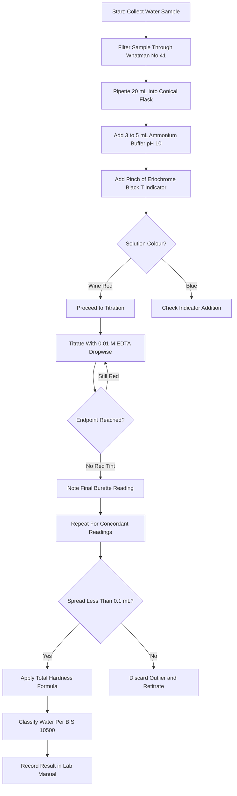
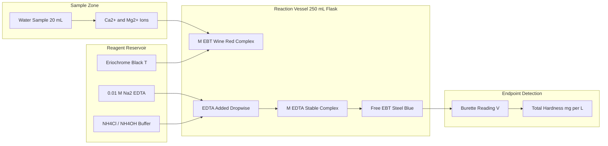
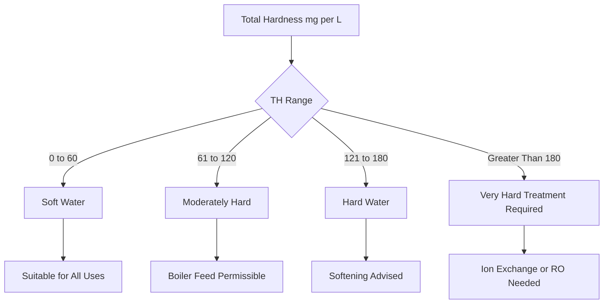

# Total hardness determination of water samples using EDTA metric complexes

<!-- SECTION_1_START -->
# Total Hardness of Water by EDTA Complexometric Titration

## 1. Core Technical Definition & Intuitive Overview

### Formal Academic Definition (KTU 2024 Syllabus Aligned)

**Total hardness of water** is the quantitative measure of the combined concentration of all divalent metallic cations — predominantly **calcium (Ca²⁺)** and **magnesium (Mg²⁺)** ions — dissolved in a water sample. It is expressed in terms of equivalent milligrams of **calcium carbonate (CaCO₃)** per litre of water (mg/L or ppm), since CaCO₃ has a molecular weight of **100 g/mol** and serves as the standard reference salt.

> [!IMPORTANT]
> **KTU 2024 Syllabus Definition (GXCXL129, Module 1):**
> "Determination of total hardness of a given water sample by complexometric titration using EDTA (Ethylenediaminetetraacetic acid) as the titrant and Eriochrome Black-T as the metal ion indicator at a buffered pH of **10.0 ± 0.1**."

### The Chemistry Behind the Concept — EDTA as a Hexadentate Ligand

EDTA is a **hexadentate ligand** (chelating agent) that can bind a metal ion through **two nitrogen atoms** and **four carboxylate oxygen atoms**, forming **five five-membered chelate rings**. This multi-dentate binding produces extraordinarily stable **1:1 metal–EDTA complexes** regardless of the charge on the metal ion, which is the cornerstone of complexometric titration.

$$
\text{H}_2\text{Y}^{2-} + \text{M}^{2+} \longrightarrow \text{MY}^{2-} + 2\text{H}^+
$$

where **Y⁴⁻** represents the fully deprotonated form of EDTA and **M²⁺** represents Ca²⁺ or Mg²⁺.

### Conceptual Analogy — The "Molecular Handcuffs"

> [!NOTE]
> **Intuitive Analogy: "The Six-Fingered Grip"**
> Imagine trying to grab a marble (the metal ion). With a single finger, you would struggle. EDTA is like a six-fingered glove that wraps completely around the metal ion from all sides, locking it in a cage. Once the metal ion is trapped inside the EDTA cage (complex), it can no longer participate in chemical reactions — this is called **sequestration**. The indicator dye (Eriochrome Black-T) competes for the metal ion loosely, and the moment EDTA "steals" the metal, the dye is released and changes colour.

### Physical Constants and Standard Metrics

- **Molecular weight of CaCO₃ = 100 g/mol**
- **Equivalent weight of CaCO₃ = 50 g/equivalent**
- **Standard EDTA solution = 0.01 M (0.02 N)**
- **Working pH = 10.0 ± 0.1 (NH₄Cl/NH₄OH buffer)**
- **Indicator: Eriochrome Black-T (EBT)**
- **Colour transition: Wine red → Steel blue**
- **Acceptable hardness limit (drinking water, BIS) = 200 mg/L as CaCO₃**

> [!VISUALIZATION CONTROL]
> **Concept:** pH vs. Complex Stability Curve for Ca-EDTA
> **GeoGebra / Desmos Input Equations:**
> * `f(x) = 10^(10.7) / (10^(10.7) + 10^(-x))` (fraction of free Ca²⁺ as function of pH)
> **Visual Description:** Students should observe a sigmoidal curve showing that Ca-EDTA complex is fully formed only above pH 8, plateauing near pH 10, justifying the use of ammonium buffer.

---

<!-- SECTION_1_END -->

<!-- SECTION_2_START -->
# 2. Deep Theoretical Analysis & KTU High-Yield Formula Sheet

## 2.1 Classification of Water Hardness

| Type of Hardness | Cations Responsible | Removal Method | Boiling Effect |
|---|---|---|---|
| **Temporary (Carbonate) Hardness** | Ca(HCO₃)₂, Mg(HCO₃)₂ | Boiling precipitates as CaCO₃ | Removed on boiling |
| **Permanent (Non-carbonate) Hardness** | CaCl₂, MgSO₄, CaSO₄ | Ion exchange, EDTA, washing soda | Not removed on boiling |
| **Total Hardness** | Sum of Temporary + Permanent | Complexometric titration (EDTA) | — |

$$
\text{Total Hardness (TH)} = \text{Ca}^{2+}\text{ hardness} + \text{Mg}^{2+}\text{ hardness}
$$

## 2.2 Why Eriochrome Black-T (EBT) Works as an Indicator

The EBT indicator is a triphenylmethane dye that forms a weak **wine-red complex** with Ca²⁺/Mg²⁺ ions in solution. EDTA, however, forms a much more stable complex (log K_f ≈ 10.7 for Ca-EDTA at pH 10). When all free Ca²⁺/Mg²⁺ ions are consumed by EDTA, the indicator is **displaced** from the metal and returns to its free deprotonated form, which exhibits a **steel-blue colour**.

$$
\underset{\text{(wine red)}}{\text{M}^{2+}\text{-EBT}} + \text{H}_2\text{Y}^{2-} \longrightarrow \underset{\text{(stable, colourless in this range)}}{\text{MY}^{2-}} + \underset{\text{(steel blue)}}{\text{EBT}}
$$

The sharp colour change occurs at the **equivalence point** of the titration.

## 2.3 Role of the Ammonium Buffer (pH 10)

Maintaining pH ≈ 10 is critical for **three reasons**:

1. **Complete deprotonation of EDTA** — only the Y⁴⁻ form binds metal ions strongly; lower pH means protonation and weaker binding.
2. **Precipitation of interfering ions** — Fe³⁺, Al³⁺, and Mn²⁺ precipitate as hydroxides at this pH, removing them from interference.
3. **Sharp endpoint** — the indicator colour transition is crisp only in the alkaline range.

> [!IMPORTANT]
> **KTU Pitfall:** If pH drops below 8, the endpoint becomes sluggish and the calculated hardness is **erroneously high** because more EDTA volume is consumed trying to displace protons from the indicator.

## 2.4 KTU Formula Sheet (High-Yield)

| Formula | Description | Units |
|---|---|---|
| $\text{TH} = \dfrac{V_{\text{EDTA}} \times N_{\text{EDTA}} \times 50 \times 1000}{V_{\text{sample}}}$ | Total hardness as CaCO₃ | mg/L (ppm) |
| $\text{Normality} = \text{Molarity} \times n\text{-factor}$ | For EDTA, n = 2 (basicity) | eq/L |
| $\text{Equivalent weight of CaCO}_3 = \dfrac{100}{2} = 50$ | Used in hardness calculation | g/eq |
| $1 \text{ mL of 0.02 N EDTA} \equiv 1 \text{ mg of CaCO}_3$ | Standardisation identity | mg/mL |
| $\text{Average Titre} = \dfrac{T_1 + T_2 + T_3}{3}$ | Concordant readings (≤ 0.1 mL) | mL |

### Real-World Engineering Utility

- **Municipal water treatment plants** use EDTA titration to monitor softening efficiency of ion-exchange columns.
- **Boiler feed water analysis** in power plants — hardness > 1 mg/L causes **scale formation**, reducing thermal efficiency by up to **15%**.
- **Pharmaceutical industry** — purified water for injection (WFI) must have hardness < 1 mg/L.
- **Cooling tower water** is continuously monitored to prevent **CaCO₃ scaling** on heat exchangers.

---

<!-- SECTION_2_END -->

<!-- SECTION_3_START -->
# 3. Step-by-Step Procedure, Calculations & Python Implementation

## 3.1 Reagents and Apparatus Required

| Item | Specification | Quantity |
|---|---|---|
| Burette | 50 mL, Class A, ± 0.05 mL | 1 |
| Pipette | 20 mL / 50 mL (Class A) | 1 |
| Conical flask (Erlenmeyer) | 250 mL | 3 |
| Volumetric flask | 250 mL | 1 |
| EDTA solution | 0.01 M (0.02 N), standardised | As required |
| Ammonium buffer (pH 10) | NH₄Cl + NH₄OH | 5 mL per titration |
| Eriochrome Black-T indicator | Solid powder + NaCl (1:100) | Pinch (~0.1 g) |
| Water sample | Tap / bore-well / industrial effluent | 100 mL |

## 3.2 Detailed Laboratory Procedure

### Step 1 — Preparation of Standard EDTA Solution (0.01 M)

1. Weigh accurately **3.722 g** of disodium EDTA dihydrate (Na₂EDTA·2H₂O, M = 372.24 g/mol) using an analytical balance.
2. Dissolve in **distilled water** and make up to **1000 mL** in a volumetric flask.
3. Standardise against standard **0.01 M CaCl₂** or ZnSO₄ solution using EBT indicator.

### Step 2 — Sample Preparation

1. If the water sample is turbid, filter it through **Whatman No. 41** filter paper.
2. Pipette **20 mL** (or 50 mL) of the water sample into a clean 250 mL conical flask.
3. Add **3–5 mL of ammonium buffer solution** to maintain pH 10.
4. Add a **pinch of Eriochrome Black-T indicator** (≈ 0.1 g of solid mixture).
5. The solution turns **wine red**, indicating Ca²⁺/Mg²⁺–EBT complex formation.

### Step 3 — Titration with EDTA

1. Rinse and fill the burette with **standard 0.01 M EDTA** solution.
2. Note the **initial burette reading**.
3. Titrate the sample **slowly** while swirling the conical flask continuously.
4. As the endpoint approaches, the red colour fades to a **violet/purple** shade — slow down addition to **drop-wise**.
5. The **end point** is reached when the solution turns **steel blue** with no reddish tinge, persisting for at least 30 seconds.
6. Record the **final burette reading**.
7. Repeat the titration to obtain **three concordant readings** (difference ≤ 0.1 mL).

## 3.3 Sample Calculation (Exhaustive, Board-Valuation Style)

**Given:**
- Volume of water sample pipetted, $V_s = 20$ mL
- Normality of EDTA, $N = 0.02$ N
- Burette readings: Trial 1 → 18.40 mL, Trial 2 → 18.30 mL, Trial 3 → 18.35 mL
- Volume of water made up (if dilution done), $V_{\text{dil}} = 250$ mL; aliquot taken = 20 mL

**Step 1 — Calculate the concordant titre value:**

$$
V_{\text{EDTA}} = \frac{18.40 + 18.30 + 18.35}{3} = \frac{55.05}{3} = 18.35 \text{ mL}
$$

**Step 2 — Apply the total hardness formula:**

$$
\text{TH} = \frac{V_{\text{EDTA}} \times N_{\text{EDTA}} \times 50 \times 1000}{V_{\text{sample}}}
$$

**Step 3 — Substitute values:**

$$
\text{TH} = \frac{18.35 \times 0.02 \times 50 \times 1000}{20}
$$

**Step 4 — Solve step-by-step:**

$$
\text{TH} = \frac{18.35 \times 0.02 \times 50{,}000}{20}
$$

$$
\text{TH} = \frac{18.35 \times 1000}{20}
$$

$$
\text{TH} = \frac{18{,}350}{20} = 917.5 \text{ mg/L (as CaCO}_3\text{)}
$$

**Step 5 — Interpretation (KTU Board Expectation):**

$$
\text{Result} = 917.5 \text{ mg/L} \gg 200 \text{ mg/L (BIS limit)}
$$

> The water sample is classified as **Very Hard** and is unsuitable for domestic use without prior softening (ion-exchange or reverse osmosis).

## 3.4 Hardness Classification Table (BIS 10500:2012)

| Classification | Total Hardness (mg/L as CaCO₃) | Suitability |
|---|---|---|
| Soft | 0 – 60 | Excellent for boilers |
| Moderately Hard | 61 – 120 | Acceptable for drinking |
| Hard | 121 – 180 | Needs softening |
| Very Hard | > 180 | Unsuitable without treatment |

## 3.5 Python Implementation for Automated Data Logging

```python
"""
KTU 2024 Lab Record - EDTA Total Hardness Calculator
Course: GXCXL129 - Information Science Chemistry Lab
Module 1 - Analytical & Water Quality Assessment
"""

import logging
from statistics import mean, stdev
from typing import List, Tuple

# Configure error logging for laboratory traceability
logging.basicConfig(
    level=logging.INFO,
    format="%(asctime)s | %(levelname)s | %(message)s",
    filename="hardness_lab.log"
)


def calculate_total_hardness(
    titre_values: List[float],
    normality_edta: float,
    volume_sample_mL: float,
    equivalent_weight: float = 50.0,
    concordant_tolerance: float = 0.1
) -> Tuple[float, float]:
    """
    Computes total hardness of a water sample from EDTA titration data.

    Parameters
    ----------
    titre_values : List[float]
        Concordant burette readings in mL (e.g., [18.40, 18.30, 18.35]).
    normality_edta : float
        Normality of the EDTA titrant in eq/L.
    volume_sample_mL : float
        Volume of water sample pipetted in mL.
    equivalent_weight : float, optional
        Equivalent weight of CaCO3 (default 50.0 g/eq).
    concordant_tolerance : float, optional
        Maximum permitted spread between trials in mL (default 0.1).

    Returns
    -------
    Tuple[float, float]
        (mean_hardness_mg_per_L, standard_deviation_mg_per_L)
    """
    # --- Absolute boundary checks ---
    if len(titre_values) < 2:
        raise ValueError("At least two titre readings are required.")
    if any(t <= 0 or t > 50 for t in titre_values):
        raise ValueError("Titre readings must lie in (0, 50] mL.")
    if normality_edta <= 0:
        raise ValueError("Normality must be strictly positive.")
    if volume_sample_mL <= 0:
        raise ValueError("Sample volume must be strictly positive.")

    # --- Concordancy validation ---
    spread = max(titre_values) - min(titre_values)
    if spread > concordant_tolerance:
        logging.warning(
            f"Concordancy violated (spread = {spread:.3f} mL > 0.1 mL). "
            "Recheck burette readings."
        )

    # --- Core computation ---
    avg_titre: float = mean(titre_values)
    hardness: float = (
        avg_titre * normality_edta * equivalent_weight * 1000.0
    ) / volume_sample_mL
    sigma: float = stdev(titre_values) if len(titre_values) > 2 else 0.0

    logging.info(
        f"avg_titre={avg_titre:.3f} mL, N={normality_edta}, "
        f"V_sample={volume_sample_mL} mL, TH={hardness:.2f} mg/L"
    )
    return hardness, sigma


def classify_water(hardness_mg_per_L: float) -> str:
    """Returns BIS water classification based on hardness."""
    if hardness_mg_per_L <= 60:
        return "Soft"
    elif hardness_mg_per_L <= 120:
        return "Moderately Hard"
    elif hardness_mg_per_L <= 180:
        return "Hard"
    return "Very Hard (treatment required)"


# ---------- Demonstration Run ----------
if __name__ == "__main__":
    sample_titres: List[float] = [18.40, 18.30, 18.35]
    th, sd = calculate_total_hardness(
        titre_values=sample_titres,
        normality_edta=0.02,
        volume_sample_mL=20.0
    )
    print(f"Total Hardness  : {th:.2f} mg/L as CaCO3")
    print(f"Std. Deviation  : {sd:.3f} mL")
    print(f"Classification  : {classify_water(th)}")
```

**Expected Output:**

```
Total Hardness  : 917.50 mg/L as CaCO3
Std. Deviation  : 0.050 mL
Classification  : Very Hard (treatment required)
```

---

<!-- SECTION_3_END -->

<!-- SECTION_4_START -->
# 4. Structural Diagrams & Schematics

## 4.1 Sequential Titration Workflow (Mermaid Flowchart)



## 4.2 EDTA–Metal Complex Formation Block Architecture



## 4.3 Hardness Classification Decision Matrix



---

<!-- SECTION_4_END -->

<!-- SECTION_5_START -->
# 5. KTU 2024 Scheme Examination Question Bank & Topic Recap

## Part A — Short Answer Questions (3 Marks Each)

### Question 1 **[KTU University Exam — Dec 2023]**
**CO1, Remember:** Define the term "total hardness of water". Why is it conventionally expressed in terms of CaCO₃ equivalents?

**Model Answer (3 Marks):**
- **Definition [1 Mark]:** Total hardness is the total concentration of divalent cations, mainly Ca²⁺ and Mg²⁺, present in water expressed as mg/L of CaCO₃.
- **Why CaCO₃ reference [2 Marks]:** CaCO₃ has molecular weight 100 g/mol and equivalent weight 50 g/eq, providing a uniform standard. Expressing all hardness in CaCO₃ equivalents allows easy comparison across samples containing different salt combinations and aligns with WHO/BIS drinking water guidelines.

---

### Question 2 **[KTU University Exam — July 2024]**
**CO1, Understand:** Explain the role of ammonium chloride–ammonium hydroxide buffer in the EDTA titration of water hardness.

**Model Answer (3 Marks):**
- **Buffer composition [1 Mark]:** NH₄Cl + NH₄OH maintains the solution pH at 10.0 ± 0.1.
- **Function — EDTA deprotonation [1 Mark]:** At pH 10, EDTA exists predominantly as Y⁴⁻, the fully deprotonated form that binds Ca²⁺/Mg²⁺ strongly (log K_f ≈ 10.7).
- **Function — sharp endpoint [1 Mark]:** The buffer eliminates proton interference, ensuring the EBT indicator colour change from wine red to steel blue is sharp and reproducible.

---

## Part B — Full 14-Mark Questions (Module Internal Choice)

### Question A (14 Marks) **[KTU University Exam — Dec 2023]**

**CO2, Apply + Analyse:** A water sample of 50 mL required 12.40 mL of 0.02 N EDTA solution for complete titration using EBT indicator at pH 10.

#### (a) Calculate the total hardness of the water sample in mg/L as CaCO₃. (7 Marks, Apply)

**Step-by-step Model Solution:**

**[Stating the formula: 1 Mark]**

$$
\text{TH} = \frac{V_{\text{EDTA}} \times N_{\text{EDTA}} \times 50 \times 1000}{V_{\text{sample}}}
$$

**[Substituting the values: 2 Marks]**

$$
\text{TH} = \frac{12.40 \times 0.02 \times 50 \times 1000}{50}
$$

**[Numerical simplification — step 1: 1 Mark]**

$$
\text{TH} = \frac{12.40 \times 0.02 \times 1000}{1} = 12.40 \times 20 = 248.0
$$

**[Final answer with units: 1 Mark]**

$$
\boxed{\text{Total Hardness} = 248.0 \text{ mg/L as CaCO}_3}
$$

**[Verification and interpretation: 2 Marks]**

Since 248.0 mg/L > 180 mg/L, the water is classified as **Very Hard** and requires softening before domestic or industrial use.

---

#### (b) Discuss the principle of EDTA titration. Why is EBT preferred over murexide for total hardness determination? (7 Marks, Understand + Analyse)

**Model Solution:**

**[EDTA as hexadentate ligand — 2 Marks]:** EDTA binds Ca²⁺/Mg²⁺ through 2 nitrogen and 4 carboxylate oxygen donor atoms, forming a 1:1 octahedral complex with five five-membered chelate rings, giving exceptional stability (log K_f > 8 at pH 10).

**[Titration principle — 2 Marks]:** At a buffered pH of 10, free Ca²⁺/Mg²⁺ ions first form a wine-red complex with the EBT indicator. On adding EDTA, the more stable Ca/Mg–EDTA complex forms, liberating free EBT which appears steel blue — marking the equivalence point.

**[Why EBT over murexide — 3 Marks]:**

- EBT responds to **both** Ca²⁺ and Mg²⁺, giving a single sharp endpoint for **total hardness** in one titration. Murexide responds primarily to Ca²⁺ only and is used for **calcium hardness** separately, requiring two titrations.
- EBT colour transition (wine red → steel blue) is highly visible and reversible.
- EBT is stable in the solid-diluted (1:100 with NaCl) form and easy to handle.

---

### Question B (14 Marks) **[KTU University Exam — July 2024]**

**CO2 + CO3, Apply + Evaluate:** During a student lab session, three concordant readings for a 25 mL water sample were 14.20, 14.10, and 14.15 mL of 0.01 M EDTA.

#### (a) Determine the total hardness, classify the water, and comment on its domestic suitability. (7 Marks, Apply + Evaluate)

**Step-by-step Model Solution:**

**[Convert molarity to normality: 1 Mark]**

$$
N_{\text{EDTA}} = M \times n\text{-factor} = 0.01 \times 2 = 0.02 \text{ N}
$$

**[Average titre value: 1 Mark]**

$$
V_{\text{EDTA}} = \frac{14.20 + 14.10 + 14.15}{3} = 14.15 \text{ mL}
$$

**[Apply formula: 2 Marks]**

$$
\text{TH} = \frac{14.15 \times 0.02 \times 50 \times 1000}{25} = \frac{14{,}150}{25} = 566.0 \text{ mg/L}
$$

**[Classification: 1 Mark]**

TH = 566 mg/L > 180 mg/L → **Very Hard Water**.

**[Domestic suitability comment — 2 Marks]:** Unsuitable for direct domestic use; will cause excessive soap consumption, scaling in pipes and geysers, and skin irritation. Requires ion-exchange softening or reverse osmosis before use.

---

#### (b) What errors could lead to a falsely high hardness value? How can they be rectified? (7 Marks, Analyse)

**Model Answer:**

| Source of Error | Effect on TH | Rectification |
|---|---|---|
| Insufficient buffer / pH < 9 | More EDTA consumed | Add 5 mL fresh NH₄Cl/NH₄OH buffer; verify with pH paper |
| Overshooting the blue endpoint | Volume of EDTA too high | Approach endpoint dropwise; final drop → wait 30 s |
| Indicator added in excess | EBT itself consumes EDTA | Use only a pinch (0.05–0.1 g) of solid-diluted indicator |
| Air bubble in burette tip | Initial reading error | Flush burette tip before recording initial reading |
| Unstandardised EDTA | Wrong normality value | Standardise EDTA against primary standard CaCO₃ or ZnSO₄ |
| Carbonate interference from atmospheric CO₂ | Forms CaCO₃, releases H⁺ | Use freshly boiled and cooled distilled water for blank |

---

> [!WARNING]
> **KTU Examiner's Valuation Pitfall — Do NOT Lose These Marks:**
> - **Forgetting to convert 0.01 M → 0.02 N** in the calculation → lose 1 mark immediately.
> - **Not stating the units (mg/L as CaCO₃)** in the final answer → lose 0.5 mark.
> - **Omitting the colour-change equation** in part (b) of either Question A or B → lose 2 marks.
> - **Using volume of water sample = 1000 mL** instead of the pipetted volume → entire calculation becomes wrong.
> - **Failing to classify** the water as Soft/Moderately Hard/Hard/Very Hard → lose 1 mark (this is a compulsory concluding step in KTU valuation).
> - **Skipping the concordancy check** (≤ 0.1 mL spread) → lose 1 mark on data reliability.

---

## Topic Recap & Important Things to Remember

- **Total hardness** = Ca²⁺ hardness + Mg²⁺ hardness, both expressed as mg/L of **CaCO₃** (equivalent weight = 50).
- **EDTA forms a 1:1 hexadentate complex** with Ca²⁺/Mg²⁺ at pH 10, with five chelate rings, log K_f ≈ 10.7.
- **Eriochrome Black-T** is the metal ion indicator; colour change: **Wine red → Steel blue**.
- **Ammonium buffer (NH₄Cl + NH₄OH, pH 10)** is non-negotiable — it ensures complete Y⁴⁻ formation and a sharp endpoint.
- **Standard EDTA = 0.01 M = 0.02 N**; 1 mL of 0.02 N EDTA ≡ 1 mg CaCO₃.
- **Master formula:** $\text{TH (mg/L)} = \dfrac{V_{\text{EDTA}} \times N_{\text{EDTA}} \times 50 \times 1000}{V_{\text{sample}}}$.
- **Concordancy rule:** spread between trials ≤ 0.1 mL; otherwise discard the outlier and retitrate.
- **BIS classification:** Soft (0–60), Moderately Hard (61–120), Hard (121–180), Very Hard (> 180).
- **Distinction from other titrations:** EDTA titration is a **complexometric** method — not acid-base, not redox — based on **chelate formation**.
- **Industrial relevance:** Boiler scale (CaCO₃) reduces heat-transfer efficiency; hardness monitoring is critical in **power plants, textile dyeing, and pharmaceutical water systems**.
- **Interfering ions:** Cu²⁺, Fe³⁺, Mn²⁺ — masked using **KCN, triethanolamine, or hydroxylamine hydrochloride** (advanced labs only).
- **Temporary hardness** is removed by boiling; **permanent hardness** is not — EDTA measures both together.
- **Always state the colour change, indicator name, buffer pH, and final units** in the KTU lab record — these are the four mandatory closing statements in the valuation key.

<!-- SECTION_5_END -->
