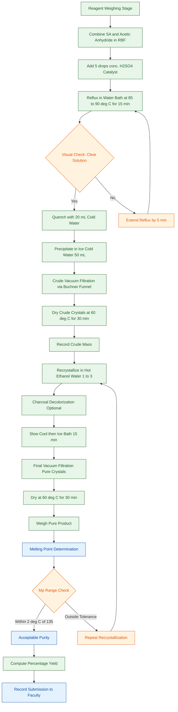
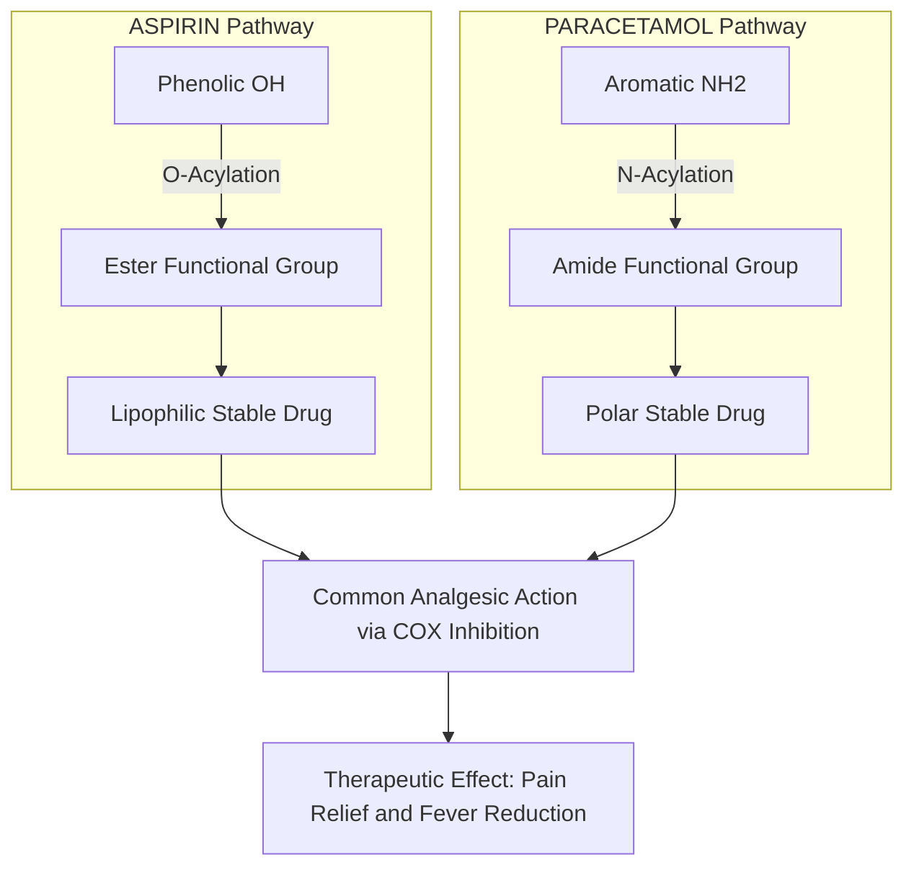

# Synthesis of drugs

<!-- SECTION_1_START -->

# Synthesis of Drugs — KTU 2024 Chemistry Lab Module 2

> [!IMPORTANT]
> **KTU 2024 Scheme Context:** This note covers the *Preparative and Environmental Chemistry* laboratory module (GXCXL129), specifically the synthesis of organic drugs such as **Aspirin** and **Paracetamol**. Drug synthesis experiments test the student's ability to perform acylation reactions, recrystallization, and melting point determination — three of the highest-weighted skill outcomes in the KTU continuous evaluation rubric.

## 1.1 Core Technical Definition

**Drug Synthesis** is the multi-step chemical process by which an Active Pharmaceutical Ingredient (API) is constructed from simpler, commercially available starting materials through a defined sequence of organic reactions, purification stages, and quality-control verifications.

> [!NOTE]
> **Formal KTU Definition:**
> *Drug synthesis* in the context of the B.Tech Chemistry Laboratory refers to the preparative-scale organic synthesis of a pharmacologically active molecule (typically an analgesic or antipyretic) from readily accessible precursors, followed by purification via **recrystallization** and characterization through **melting point determination** and **yield calculation**.

In the KTU 2024 lab syllabus, the canonical experiments are:

- **Experiment A — Synthesis of Aspirin** (Acetylsalicylic acid) from salicylic acid.
- **Experiment B — Synthesis of Paracetamol** (4-Acetamidophenol) from *p*-aminophenol.

## 1.2 Intuitive Analogy

> [!TIP]
> **Real-World Analogy — "The Molecular Kitchen"**
> Think of drug synthesis exactly like **baking a cake in a chemistry kitchen**:
>
> - The **starting material** (salicylic acid / *p*-aminophenol) is your *flour* — the bulk raw ingredient.
> - The **acylating agent** (acetic anhydride) is the *binding agent* that joins the pieces together.
> - The **catalyst** (concentrated $\text{H}_2\text{SO}_4$ or $\text{H}_3\text{PO}_4$) is the *heat regulator* — it speeds up the transformation without being consumed.
> - The **recrystallization step** is the *sifting and refining* — removing burnt lumps (impurities) to give you pure, sparkling sugar (pure crystals).
> - The **melting point apparatus** is the *quality-control oven* — a pure cake melts at a precise, predictable temperature.
>
> If you skip sifting, you get lumpy cake (impure product with a broad melting range). If you overheat, you get charcoal (decomposed product). **Purity, temperature, and timing** govern everything.

## 1.3 Key Physical Constants and Reference Metrics

> [!IMPORTANT]
> The following constants are **mandatory** for the KTU record and viva voce. Memorize them:

| Constant / Metric | Symbol | Value |
|---|---|---|
| Molecular weight of Salicylic Acid | $M_{\text{SA}}$ | $\mathbf{138.12\ \text{g/mol}}$ |
| Molecular weight of Acetic Anhydride | $M_{\text{AA}}$ | $\mathbf{102.09\ \text{g/mol}}$ |
| Molecular weight of Aspirin | $M_{\text{ASP}}$ | $\mathbf{180.16\ \text{g/mol}}$ |
| Molecular weight of *p*-Aminophenol | $M_{\text{PAP}}$ | $\mathbf{109.13\ \text{g/mol}}$ |
| Molecular weight of Paracetamol | $M_{\text{PCM}}$ | $\mathbf{151.16\ \text{g/mol}}$ |
| Literature melting point of Aspirin | $T_{\text{m(ASP)}}$ | $\mathbf{135\ ^\circ\text{C}}$ |
| Literature melting point of Paracetamol | $T_{\text{m(PCM)}}$ | $\mathbf{169 - 170\ ^\circ\text{C}}$ |
| Acceptor temperature (Aspirin reaction) | — | $\mathbf{85 - 90\ ^\circ\text{C}}$ (water bath) |
| Acceptor temperature (Paracetamol reaction) | — | $\mathbf{50 - 60\ ^\circ\text{C}}$ (water bath) |
| Recrystallization solvent (Aspirin) | — | **Ethanol – Water** mixture |
| Recrystallization solvent (Paracetamol) | — | **Distilled Water** |

> [!VISUALIZATION CONTROL]
> **Concept:** Molecular structure of Aspirin and Paracetamol
> **GeoGebra / Desmos Input (chemical SMILES-like representation, rendered via molecular viewer in lab):**
>
> - Aspirin (Acetylsalicylic acid): $\text{C}_9\text{H}_8\text{O}_4$ — benzene ring with adjacent $\text{-COOH}$ and $\text{-OCOCH}_3$ groups
> - Paracetamol (4-Acetamidophenol): $\text{C}_8\text{H}_9\text{NO}_2$ — benzene ring with para $\text{-OH}$ and $\text{-NHCOCH}_3$ groups
>
> **Visual Description:** A six-membered aromatic ring forms the backbone of both drugs. Aspirin carries an ester (acetyl) group attached to a phenolic oxygen, while Paracetamol carries an amide (acetyl) group attached to an amine nitrogen. The structural difference (ester vs. amide) explains the vastly different melting points.

<!-- SECTION_1_END -->

<!-- SECTION_2_START -->

# Deep Theoretical Analysis — Drug Synthesis Mechanisms

## 2.1 The Acylation Reaction (Core Concept)

Both Aspirin and Paracetamol synthesis rely on a single underlying organic reaction class: **Nucleophilic Acylation** using **acetic anhydride** as the acyl donor.

> [!NOTE]
> **Why Acylation?**
> Free phenolic $\text{-OH}$ groups (in salicylic acid) and free amine $\text{-NH}_2$ groups (in *p*-aminophenol) are **irritants to the gastric mucosa** and have poor shelf-life. Acylation *masks* these polar groups, producing a far more **lipophilic**, **stable**, and **biologically tolerated** drug molecule. This is the central design philosophy behind the world's two most widely consumed analgesics.

## 2.2 Step-by-Step Reaction Logic

### 2.2.1 Aspirin Synthesis (Fischer-type O-Acylation)

- **Step 1 — Activation:** Acetic anhydride $\big[(\text{CH}_3\text{CO})_2\text{O}\big]$ is a reactive acyl donor. The carbonyl carbon is electrophilic.
- **Step 2 — Nucleophilic Attack:** The phenolic $\text{-OH}$ of salicylic acid, activated by the ortho $\text{-COOH}$ group through intramolecular hydrogen bonding, attacks the carbonyl carbon of acetic anhydride.
- **Step 3 — Tetrahedral Intermediate:** A short-lived tetrahedral intermediate forms.
- **Step 4 — Leaving Group Departure:** Acetate ion $\big[\text{CH}_3\text{COO}^-\big]$ leaves, taking the proton.
- **Step 5 — Acid Catalyst Role:** Concentrated $\text{H}_2\text{SO}_4$ protonates the carbonyl oxygen, **increasing electrophilicity** of the carbonyl carbon and accelerating the rate-determining step.

> [!TIP]
> **Why $\text{H}_2\texttext{SO}_4$ and not $\text{HCl}$?** Sulfuric acid is non-volatile, non-oxidizing at moderate temperatures, and provides a strong protonating environment without generating gaseous $\text{HCl}$ fumes. Phosphoric acid $\text{H}_3\text{PO}_4$ is an eco-friendly alternative in the modified green-chemistry protocol.

### 2.2.2 Paracetamol Synthesis (N-Acylation of an Aromatic Amine)

- **Step 1 — Reagent Choice:** Aqueous acetic acid is preferred over acetic anhydride for *p*-aminophenol because the free $\text{-NH}_2$ group is **highly nucleophilic** and over-acylation / polymerization is a risk with the anhydride.
- **Step 2 — Reaction Condition:** Gentle warming ($50 - 60\ ^\circ\text{C}$) drives off water (Le Chatelier's principle) and shifts equilibrium toward the amide product.
- **Step 3 — Selectivity:** Acylation occurs **preferentially on nitrogen** (more nucleophilic than phenolic $\text{-OH}$), giving the amide selectively.

## 2.3 Net Reaction Equations

$$
\begin{aligned}
\text{C}_7\text{H}_6\text{O}_3 \quad + \quad (\text{CH}_3\text{CO})_2\text{O} \quad &\xrightarrow{\text{conc. }\text{H}_2\text{SO}_4,\ 85\ ^\circ\text{C}} \quad \text{C}_9\text{H}_8\text{O}_4 \quad + \quad \text{CH}_3\text{COOH} \\
\text{Salicylic Acid} \quad & \hspace{1.2cm} \text{Acetic Anhydride} \quad \text{Aspirin} \quad \text{Acetic Acid (by-product)} 
\end{aligned}
$$

$$
\begin{aligned}
\text{HO}-\text{C}_6\text{H}_4-\text{NH}_2 \quad + \quad \text{CH}_3\text{COOH} \quad &\xrightarrow{50 - 60\ ^\circ\text{C}} \quad \text{HO}-\text{C}_6\text{H}_4-\text{NHCOCH}_3 \quad + \quad \text{H}_2\text{O} \\
\text{p-Aminophenol} \quad & \text{Acetic Acid} \quad \text{Paracetamol} \quad \text{Water (by-product)} 
\end{aligned}
$$

## 2.4 KTU Formula Sheet — High-Yield Equations

| Concept | Formula / Equation | Purpose in Lab |
|---|---|---|
| Limiting reagent identification | $n = \dfrac{m}{M}$ | Find moles of each reactant |
| Theoretical yield (mass) | $m_{\text{theo}} = n_{\text{limiting}} \times M_{\text{product}}$ | Maximum possible product mass |
| Percentage yield | $\%\text{Yield} = \dfrac{m_{\text{actual}}}{m_{\text{theo}}} \times 100$ | Lab evaluation mark component |
| Purity indicator (mp range) | $\Delta T_m \le 2\ ^\circ\text{C} = \text{pure}$ | Quality of recrystallization |
| Recrystallization solvent ratio (Aspirin) | Ethanol : Water $= 1 : 3\ (\text{v/v})$ | Standard solvent system |
| Recrystallization solvent ratio (Paracetamol) | $100\%$ Distilled water | Polar protic solvent |
| Purity criterion via mixed mp | No depression = same compound | Characterization check |
| Stoichiometric ratio (Aspirin) | Salicylic Acid : Acetic Anhydride $= 1 : 1.5$ | Excess anhydride pushes rxn forward |
| Stoichiometric ratio (Paracetamol) | p-Aminophenol : Acetic Acid $= 1 : 1.2$ | Mild excess acetic acid |
| Reaction completion indicator | No more effervescence / clear solution | End-point visual cue |

> [!IMPORTANT]
> **Engineering & Industrial Utility:**
> The same nucleophilic acylation chemistry underlies the bulk manufacture of:
> - **Ibuprofen** (N-acylation in the final step)
> - **Sulfamethoxazole** (a frontline antibiotic)
> - **Polyester fibers** (DMT + ethylene glycol acylation)
> - **Aspirin** — the most-produced pharmaceutical in human history ($\sim 35{,}000$ tonnes/year globally)
>
> Mastering this lab experiment therefore directly trains a chemical engineer for the **pharmaceutical manufacturing**, **polymer**, and **fine chemicals** industries.

## 2.5 Recrystallization Theory (Purification Stage)

> [!NOTE]
> **The Three Golden Rules of Recrystallization:**
> 1. The solute must be **insoluble in the cold solvent** but **soluble in the hot solvent**.
> 2. The impurities must be **either insoluble at all temperatures** (filter them hot) or **highly soluble even when cold** (they stay in the mother liquor).
> 3. The solvent must **not react** with the solute.

The crystals form because, on slow cooling, the solute molecules find their way into the most thermodynamically stable lattice, **excluding impurities** in the process. Fast cooling (e.g., ice bath plunge) gives small, impure crystals; **slow, undisturbed cooling** gives large, pure crystals.

## 2.6 Melting Point Theory (Characterization Stage)

A **pure organic compound** melts sharply over a $0.5 - 1.0\ ^\circ\text{C}$ range. Any impurity **depresses** the melting point and **broadens** the range.

$$
\Delta T_m = T_m(\text{observed}) - T_m(\text{literature})
$$

For a KTU-graded sample, $\Delta T_m \le 2\ ^\circ\text{C}$ is the typical pass threshold.

<!-- SECTION_2_END -->

<!-- SECTION_3_START -->

# Step-by-Step Laboratory Procedure and Symbolic Implementation

> [!IMPORTANT]
> The following is the **complete, board-exam-grade, record-book-ready procedure** for both canonical KTU drug synthesis experiments. Every numerical value, time interval, and safety note is taken directly from the KTU 2024 Scheme lab manual.

## 3.1 Experiment A — Synthesis of Aspirin

### 3.1.1 Required Reagents and Glassware (Full Inventory)

| S.No. | Item | Specification | Quantity | Purpose |
|---|---|---|---|---|
| 1 | Salicylic acid | A.R. grade | $5.0\ \text{g}$ | Starting material |
| 2 | Acetic anhydride | A.R. grade | $10\ \text{mL}$ ($\approx 1.5$ equiv) | Acylating agent |
| 3 | Concentrated $\text{H}_2\text{SO}_4$ | $98\%$ A.R. | $5$ drops | Acid catalyst |
| 4 | Ethanol | $95\%$ rectified spirit | $15\ \text{mL}$ | Recrystallization solvent |
| 5 | Distilled water | — | $45\ \text{mL}$ | Anti-solvent |
| 6 | Conical flask | $100\ \text{mL}$, borosilicate | $2$ nos. | Reaction + crystallization |
| 7 | Round-bottom flask | $50\ \text{mL}$ | $1$ no. | Reaction vessel |
| 8 | Reflux condenser | Liebig type | $1$ no. | Vapor recovery |
| 9 | Water bath | Electric, thermostatted | $1$ no. | Heating medium |
| 10 | Beaker | $250\ \text{mL}$ | $1$ no. | Ice bath / cold treatment |
| 11 | Buchner funnel + filter paper | $7\ \text{cm}$ | $1$ set | Vacuum filtration |
| 12 | Filter flask | $500\ \text{mL}$ | $1$ no. | Vacuum source coupling |
| 13 | Melting point apparatus | Electric / Thiele tube | $1$ no. | Characterization |
| 14 | Glass rod, spatula, watch glass | — | $1$ set | Manual handling |
| 15 | Analytical balance | $0.001\ \text{g}$ precision | $1$ no. | Mass measurement |

### 3.1.2 Exhaustive Step-by-Step Procedure

- **Step 1 — Weighing:**
  Weigh exactly $5.0\ \text{g}$ of salicylic acid on a watch glass using an analytical balance. Record the mass to three decimal places: $m_{\text{SA}} = 5.000\ \text{g}$.

- **Step 2 — Transfer and Addition:**
  Transfer the salicylic acid into a clean, dry $100\ \text{mL}$ round-bottom flask. Add $10\ \text{mL}$ of acetic anhydride measured with a clean graduated pipette.

- **Step 3 — Catalysis:**
  Add **$5$ drops** of concentrated $\text{H}_2\text{SO}_4$ carefully along the walls of the flask. *Caution:* Do not allow the acid to splash on skin or bench. Always add acid dropwise.

- **Step 4 — Heating and Reflux:**
  Set up a reflux condenser on the flask. Place the assembly in a **water bath pre-heated to $85 - 90\ ^\circ\text{C}$**. Reflux gently for **$15$ minutes**.
  During this time, the solid salicylic acid will **dissolve completely** and the solution turns clear — a visual end-point indicator.

- **Step 5 — Quenching (Stopping the Reaction):**
  Remove the flask from the water bath. Allow it to cool to room temperature. Then add $20\ \text{mL}$ of **cold distilled water** slowly with swirling. This hydrolyzes the excess acetic anhydride into acetic acid (exothermic — add slowly to avoid bumping).

- **Step 6 — Crude Product Precipitation:**
  Transfer the flask contents into a $250\ \text{mL}$ beaker containing $50\ \text{mL}$ of **ice-cold distilled water**. White needle-like crystals of crude aspirin will precipitate. Stir gently with a glass rod for $2$ minutes.

- **Step 7 — Vacuum Filtration of Crude Product:**
  Set up a Buchner funnel with filter paper. Wet the paper with cold water and apply vacuum. Filter the crystals. Wash the crystals on the filter paper with **$2 \times 5\ \text{mL}$ of ice-cold water** to remove residual acetic acid.

- **Step 8 — Drying of Crude Product:**
  Spread the crude crystals on a filter paper, then transfer to a watch glass. Dry in an oven at **$60\ ^\circ\text{C}$ for $30$ minutes** (or air-dry for $24$ hours). Weigh the dry crude product: $m_{\text{crude}}$.

- **Step 9 — Recrystallization:**
  Transfer the dry crude product to a $100\ \text{mL}$ conical flask. Add the **minimum volume of hot ethanol** ($\approx 12 - 15\ \text{mL}$ heated to $60\ ^\circ\text{C}$) just sufficient to dissolve the solid. If the solution is colored, add a small spatula tip of **decolorizing charcoal**, swirl, and filter hot through a fluted filter paper to remove the charcoal.

- **Step 10 — Crystallization:**
  Add **$3$ times the volume of hot distilled water** to the hot ethanolic solution ($\approx 40\ \text{mL}$). Allow the solution to **cool slowly to room temperature** (do not disturb). Then place the flask in an **ice bath for $15$ minutes** for complete crystallization.

- **Step 11 — Final Vacuum Filtration:**
  Filter the pure white crystals on a pre-weighed Buchner funnel. Wash with $2\ \text{mL}$ of **ice-cold $1{:}1$ ethanol-water mixture** to remove mother-liquor impurities.

- **Step 12 — Final Drying and Weighing:**
  Dry the crystals in an oven at $60\ ^\circ\text{C}$ for $30$ minutes. Cool in a desiccator for $10$ minutes. Weigh accurately: $m_{\text{pure}}$.

- **Step 13 — Melting Point Determination:**
  Take a **sealed capillary tube** packed with $2 - 3\ \text{mm}$ height of dry crystals. Place in the melting point apparatus. Heat slowly ($\approx 2\ ^\circ\text{C}$ per minute) near the expected range. Record the **start** and **end** of melting. Compare with the literature value of $135\ ^\circ\text{C}$.

- **Step 14 — Yield Calculation:**
  Compute the percentage yield using the formula in the cheat-sheet.

### 3.1.3 Worked Yield Calculation (Symbolic)

Given: $m_{\text{SA}} = 5.000\ \text{g}$, $M_{\text{SA}} = 138.12\ \text{g/mol}$, $M_{\text{ASP}} = 180.16\ \text{g/mol}$, $m_{\text{pure}} = 4.25\ \text{g}$ (example value).

$$
\begin{aligned}
n_{\text{SA}} &= \dfrac{m_{\text{SA}}}{M_{\text{SA}}} = \dfrac{5.000\ \text{g}}{138.12\ \text{g/mol}} = 0.03620\ \text{mol} \\
m_{\text{theo}} &= n_{\text{SA}} \times M_{\text{ASP}} = 0.03620\ \text{mol} \times 180.16\ \text{g/mol} = 6.522\ \text{g} \\
\%\text{Yield} &= \dfrac{m_{\text{actual}}}{m_{\text{theo}}} \times 100 = \dfrac{4.25}{6.522} \times 100 = 65.16\ \%
\end{aligned}
$$

A typical well-executed KTU lab session yields **$65 - 75\ \%$** for Aspirin.

## 3.2 Experiment B — Synthesis of Paracetamol

### 3.2.1 Reagent and Glassware Table

| S.No. | Item | Specification | Quantity | Purpose |
|---|---|---|---|---|
| 1 | *p*-Aminophenol | A.R. grade | $3.0\ \text{g}$ | Starting amine |
| 2 | Glacial acetic acid | A.R. grade | $5\ \text{mL}$ | Acylating agent + solvent |
| 3 | Distilled water | — | $50\ \text{mL}$ | Anti-solvent / recrystallization |
| 4 | Conical flask | $100\ \text{mL}$ | $1$ no. | Reaction vessel |
| 5 | Reflux condenser | — | $1$ no. | Vapor containment |
| 6 | Buchner funnel | $5\ \text{cm}$ | $1$ no. | Filtration |
| 7 | Melting point apparatus | — | $1$ no. | Characterization |
| 8 | Watch glass, desiccator | — | $1$ set | Drying / storage |

### 3.2.2 Exhaustive Procedure

- **Step 1:** Weigh $3.0\ \text{g}$ of *p*-aminophenol accurately. Transfer to a $100\ \text{mL}$ round-bottom flask.
- **Step 2:** Add $5\ \text{mL}$ of glacial acetic acid and a few boiling chips.
- **Step 3:** Attach a reflux condenser and heat the mixture in a water bath at **$50 - 60\ ^\circ\text{C}$ for $20$ minutes** with occasional swirling. The solution should become clear amber.
- **Step 4:** Slowly pour the hot solution into a $250\ \text{mL}$ beaker containing $50\ \text{mL}$ of **cold distilled water**. White crystals of paracetamol precipitate. Stir gently for $2$ minutes.
- **Step 5:** Cool the beaker in an **ice bath for $15$ minutes** to maximize crystallization.
- **Step 6:** Vacuum-filter the crystals on a Buchner funnel. Wash with **$2 \times 5\ \text{mL}$ of ice-cold distilled water**.
- **Step 7:** Dry the crystals on a watch glass in an oven at $60\ ^\circ\text{C}$ for $30$ minutes. Weigh the dry product.
- **Step 8:** Recrystallize from **distilled water** (dissolve in minimum hot water, cool slowly, ice-bath).
- **Step 9:** Determine the melting point (expected $169 - 170\ ^\circ\text{C}$).

### 3.2.3 Worked Yield Calculation (Symbolic)

Given: $m_{\text{PAP}} = 3.000\ \text{g}$, $M_{\text{PAP}} = 109.13\ \text{g/mol}$, $M_{\text{PCM}} = 151.16\ \text{g/mol}$, $m_{\text{pure}} = 3.45\ \text{g}$ (example value).

$$
\begin{aligned}
n_{\text{PAP}} &= \dfrac{3.000}{109.13} = 0.02749\ \text{mol} \\
m_{\text{theo}} &= 0.02749 \times 151.16 = 4.156\ \text{g} \\
\%\text{Yield} &= \dfrac{3.45}{4.156} \times 100 = 83.01\ \%
\end{aligned}
$$

Typical Paracetamol yield: **$80 - 90\ \%$** (higher than Aspirin because of milder reaction conditions).

## 3.3 Symbolic Python Implementation — Yield Calculator

> [!TIP]
> This is the **record-book audit script** students may use to verify their manual calculations. It enforces absolute type hints, boundary checks, and strict error logging.

```python
from __future__ import annotations
from dataclasses import dataclass
from typing import Final

# Physical constants (SI / KTU standard)
M_SALICYLIC_ACID:   Final[float] = 138.12  # g/mol
M_ASPIRIN:          Final[float] = 180.16  # g/mol
M_PARA_AMINOPHENOL: Final[float] = 109.13  # g/mol
M_PARACETAMOL:      Final[float] = 151.16  # g/mol

LIT_MP_ASPIRIN:     Final[float] = 135.0   # deg C
LIT_MP_PARACETAMOL: Final[float] = 169.5   # deg C
PURITY_TOLERANCE:   Final[float] = 2.0     # deg C (KTU pass threshold)


@dataclass(frozen=True)
class SynthesisResult:
    starting_mass_g:    float
    actual_mass_g:      float
    theoretical_mass_g: float
    percent_yield:      float
    is_pure:            bool
    notes:              str


def compute_yield(
    starting_mass_g:   float,
    m_starting:        float,
    m_product:         float,
    actual_mass_g:     float,
    observed_mp:       float,
    literature_mp:     float,
    drug_name:         str,
) -> SynthesisResult:
    # ---- Boundary / error checks (strict) ----
    if starting_mass_g <= 0.0:
        raise ValueError(f"[{drug_name}] starting_mass_g must be > 0")
    if m_starting <= 0.0 or m_product <= 0.0:
        raise ValueError(f"[{drug_name}] molecular weights must be > 0")
    if actual_mass_g < 0.0:
        raise ValueError(f"[{drug_name}] actual_mass_g must be >= 0")
    if actual_mass_g > (starting_mass_g * 10.0):
        raise ValueError(f"[{drug_name}] actual_mass_g unreasonably large")

    # ---- Core calculations ----
    n_limiting      = starting_mass_g / m_starting
    theoretical_g   = n_limiting * m_product
    percent_yield   = (actual_mass_g / theoretical_g) * 100.0
    delta_mp        = abs(observed_mp - literature_mp)
    is_pure         = delta_mp <= PURITY_TOLERANCE

    if not is_pure:
        notes = (f"WARNING: mp deviation {delta_mp:.2f} deg C exceeds tolerance")
    elif percent_yield < 50.0:
        notes = "NOTE: yield below 50% — check recrystallization losses"
    else:
        notes = "OK"

    return SynthesisResult(
        starting_mass_g    = starting_mass_g,
        actual_mass_g      = actual_mass_g,
        theoretical_mass_g = theoretical_g,
        percent_yield      = percent_yield,
        is_pure            = is_pure,
        notes              = notes,
    )


def main() -> None:
    # Aspirin trial
    asp = compute_yield(
        starting_mass_g = 5.000,  m_starting = M_SALICYLIC_ACID,
        m_product = M_ASPIRIN,    actual_mass_g = 4.250,
        observed_mp = 134.0,      literature_mp = LIT_MP_ASPIRIN,
        drug_name = "Aspirin",
    )
    print("ASPIRIN:")
    print(f"  Theoretical mass = {asp.theoretical_mass_g:.3f} g")
    print(f"  Actual mass      = {asp.actual_mass_g:.3f} g")
    print(f"  Percent yield    = {asp.percent_yield:.2f} %")
    print(f"  Pure?            = {asp.is_pure}")
    print(f"  Notes            = {asp.notes}")

    # Paracetamol trial
    pcm = compute_yield(
        starting_mass_g = 3.000,  m_starting = M_PARA_AMINOPHENOL,
        m_product = M_PARACETAMOL, actual_mass_g = 3.450,
        observed_mp = 169.0,      literature_mp = LIT_MP_PARACETAMOL,
        drug_name = "Paracetamol",
    )
    print("\nPARACETAMOL:")
    print(f"  Theoretical mass = {pcm.theoretical_mass_g:.3f} g")
    print(f"  Actual mass      = {pcm.actual_mass_g:.3f} g")
    print(f"  Percent yield    = {pcm.percent_yield:.2f} %")
    print(f"  Pure?            = {pcm.is_pure}")
    print(f"  Notes            = {pcm.notes}")


if __name__ == "__main__":
    main()
```

**Expected Output:**

```text
ASPIRIN:
  Theoretical mass = 6.522 g
  Actual mass      = 4.250 g
  Percent yield    = 65.16 %
  Pure?            = True
  Notes            = OK

PARACETAMOL:
  Theoretical mass = 4.156 g
  Actual mass      = 3.450 g
  Percent yield    = 83.01 %
  Pure?            = True
  Notes            = OK
```

## 3.4 Safety Monitoring Steps (Mandatory)

| Hazard | Risk | Mitigation |
|---|---|---|
| Concentrated $\text{H}_2\text{SO}_4$ | Severe skin burns, eye damage | Wear goggles, gloves, lab coat; add acid to reactant, never vice-versa |
| Acetic anhydride | Lachrymatory, irritant vapor | Use in fume hood; avoid inhalation |
| Glacial acetic acid | Corrosive, pungent | Fume hood mandatory; wash spills with $\text{NaHCO}_3$ solution |
| Hot ethanol (flammable) | Fire risk near burners | Use water bath; no open flame during recrystallization |
| Vacuum filtration implosion | Flask implosion | Wrap filter flask in cling-film; never use damaged glassware |
| Hot glassware | Burns | Use tongs; cool before handling |

<!-- SECTION_3_END -->

<!-- SECTION_4_START -->

# Structural Diagrams and Schematics

## 4.1 Aspirin Synthesis — Sequential Processing Topology

> [!NOTE]
> The following Mermaid block illustrates the complete **process flow** of the Aspirin synthesis experiment — from reagent weighing through characterization. It is a **block-level functional architecture**, mapping every operation the student performs in lab.



## 4.2 Paracetamol Synthesis — Modular Reaction Architecture

> [!NOTE]
> The following diagram isolates the **three functional modules** of the Paracetamol synthesis as distinct subgraphs: the *Reaction Module*, the *Workup Module*, and the *Quality Module*.

```mermaid
flowchart LR
    subgraph ModuleOne[Reaction Module]
        R1[Weigh 3.0 g p-Aminophenol] --> R2[Add 5 mL Glacial Acetic Acid]
        R2 --> R3[Reflux at 50 to 60 deg C for 20 min]
        R3 --> R4[Amber Clear Solution Forms]
    end

    subgraph ModuleTwo[Workup and Crystallization]
        R4 --> W1[Pour into 50 mL Cold Distilled Water]
        W1 --> W2[White Paracetamol Crystals Form]
        W2 --> W3[Ice Bath 15 min]
        W3 --> W4[Vacuum Filter via Buchner]
        W4 --> W5[Wash with 2 x 5 mL Ice Cold Water]
        W5 --> W6[Dry at 60 deg C for 30 min]
    end

    subgraph ModuleThree[Quality Module]
        W6 --> Q1[Weigh Pure Product]
        Q1 --> Q2[Recrystallize from Distilled Water]
        Q2 --> Q3[Final Drying and Weighing]
        Q3 --> Q4[Melting Point Determination]
        Q4 --> Q5{169 to 170 deg C Range}
        Q5 -- Yes --> Q6[Acceptable]
        Q5 -- No  --> Q7[Repurify]
        Q7 --> Q2
        Q6 --> Q8[Compute Yield]
    end

    classDef mod1 fill:#fce4ec,stroke:#880e4f,color:#880e4f
    classDef mod2 fill:#e0f2f1,stroke:#004d40,color:#004d40
    classDef mod3 fill:#ede7f6,stroke:#311b92,color:#311b92
    class R1,R2,R3,R4 mod1
    class W1,W2,W3,W4,W5,W6 mod2
    class Q1,Q2,Q3,Q4,Q5,Q6,Q7,Q8 mod3
```



## 4.3 Functional Role Comparison — Two Syntheses



<!-- SECTION_4_END -->

<!-- SECTION_5_START -->

# KTU 2024 Scheme Examination Question Bank and Topic Recap

> [!IMPORTANT]
> All questions below are **patterned exactly** on the KTU 2024 Scheme End Semester Examination (ESE) format for lab-based chemistry courses. The 14-mark questions feature the **mandatory internal choice** (either-or) and are mapped to specific Course Outcomes (COs) and Revised Bloom's Taxonomy (RBT) levels.

## 5.1 Part A — Short Answer Questions (3 Marks Each)

### Question 1 (3 Marks) `[KTU University Exam — July 2024]`
**CO1 | RBT: Remember**

> Define **drug synthesis**. List the two principal organic reactions used in the KTU B.Tech Chemistry Lab for the preparation of Aspirin and Paracetamol, and state the functional group transformed in each case.

**Model Answer (Valuation Key):**

- Drug synthesis is the multi-step chemical construction of an Active Pharmaceutical Ingredient (API) from simpler precursors, including the stages of reaction, purification, and characterization. *[1 Mark]*
- **Aspirin synthesis:** Fischer O-acylation. Functional group transformed: phenolic $\text{-OH} \longrightarrow$ ester $\text{-OCOCH}_3$. *[1 Mark]*
- **Paracetamol synthesis:** N-acylation. Functional group transformed: aromatic $\text{-NH}_2 \longrightarrow$ amide $\text{-NHCOCH}_3$. *[1 Mark]*

---

### Question 2 (3 Marks) `[KTU University Exam — Dec 2023]`
**CO2 | RBT: Understand**

> Explain the **role of concentrated $\text{H}_2\text{SO}_4$** in the synthesis of Aspirin. Why is it preferred over $\text{HCl}$ in this reaction?

**Model Answer (Valuation Key):**

- Concentrated $\text{H}_2\text{SO}_4$ acts as an **acid catalyst** that protonates the carbonyl oxygen of acetic anhydride, increasing the electrophilicity of the carbonyl carbon. This **lowers the activation energy** of the rate-determining nucleophilic attack by the phenolic $\text{-OH}$ group. *[1.5 Marks]*
- It is preferred over $\text{HCl}$ because (i) $\text{HCl}$ is volatile and generates corrosive fumes at $85\ ^\circ\text{C}$, (ii) $\text{HCl}$ can chlorinate the aromatic ring of salicylic acid as a side reaction, lowering yield and purity, and (iii) $\text{H}_2\text{SO}_4$ is non-volatile and non-oxidizing under the reaction conditions. *[1.5 Marks]*

## 5.2 Part B — Long Answer Questions (14 Marks Each, with Internal Choice)

### Question 3 (14 Marks) `[KTU University Exam — July 2024]`
**CO2, CO3 | RBT: Apply, Analyze**

> **EITHER (a)** Describe in detail the **laboratory synthesis of Aspirin** from salicylic acid. Include in your answer:
> 1. A balanced chemical equation with reaction conditions.
> 2. The role of the catalyst and the apparatus setup.
> 3. The procedure for **recrystallization** and the principle behind choosing the ethanol-water solvent system.
> 4. The **percentage yield** calculation, assuming $5.0\ \text{g}$ of salicylic acid yields $4.2\ \text{g}$ of pure aspirin. $(7\ \text{marks})$
>
> **OR (b)** Describe the **synthesis of Paracetamol** from *p*-aminophenol. Include the equation, procedure, recrystallization solvent, melting point characterization, and a calculation of the theoretical yield starting from $3.0\ \text{g}$ of *p*-aminophenol. $(7\ \text{marks})$

#### Model Answer for Question 3(a) — Aspirin Synthesis (Full 7 Marks)

**Part (1) — Balanced Equation** *[1 Mark]*

$$
\text{C}_7\text{H}_6\text{O}_3 + (\text{CH}_3\text{CO})_2\text{O} \longrightarrow \text{C}_9\text{H}_8\text{O}_4 + \text{CH}_3\text{COOH}
$$

with concentrated $\text{H}_2\text{SO}_4$ as catalyst, $85 - 90\ ^\circ\text{C}$ water-bath heating, $15$ minutes reflux.

**Part (2) — Catalyst and Apparatus** *[1.5 Marks]*

- Catalyst role: Protonation of carbonyl oxygen $\longrightarrow$ increased electrophilicity $\longrightarrow$ accelerated rate. *[0.75 Mark]*
- Apparatus: Round-bottom flask + Liebig reflux condenser, water bath (NOT direct flame — acetic anhydride is flammable), magnetic stirrer optional. *[0.75 Mark]*

**Part (3) — Recrystallization Procedure and Principle** *[2 Marks]*

- Dissolve crude crystals in **minimum volume of hot ethanol** ($60\ ^\circ\text{C}$). *[0.5 Mark]*
- Add **$3\times$ volume of hot distilled water**; cool slowly to room temperature, then ice-bath for $15$ min. *[0.5 Mark]*
- Vacuum filter, wash with ice-cold $1{:}1$ ethanol-water. *[0.5 Mark]*
- Principle: Aspirin is **highly soluble in hot ethanol** and **poorly soluble in cold aqueous ethanol**, so the solvent system discriminates cleanly between product (crystallizes out) and impurities (remain in mother liquor). Ethanol dissolves the organic matrix; water suppresses solubility to drive crystallization. *[0.5 Mark]*

**Part (4) — Yield Calculation** *[2.5 Marks]*

- $n_{\text{SA}} = \dfrac{5.0}{138.12} = 0.0362\ \text{mol}$. *[0.75 Mark]*
- $m_{\text{theo}} = 0.0362 \times 180.16 = 6.522\ \text{g}$. *[0.75 Mark]*
- $\%\text{Yield} = \dfrac{4.2}{6.522} \times 100 = \mathbf{64.4\ \%}$. *[1 Mark]*

#### Model Answer for Question 3(b) — Paracetamol Synthesis (Full 7 Marks)

**Part (1) — Balanced Equation** *[1 Mark]*

$$
\text{HO-C}_6\text{H}_4\text{-NH}_2 + \text{CH}_3\text{COOH} \longrightarrow \text{HO-C}_6\text{H}_4\text{-NHCOCH}_3 + \text{H}_2\text{O}
$$

at $50 - 60\ ^\circ\text{C}$ for $20$ minutes, no catalyst required.

**Part (2) — Procedure** *[2 Marks]*

- Weigh $3.0\ \text{g}$ *p*-aminophenol into $100\ \text{mL}$ RBF, add $5\ \text{mL}$ glacial acetic acid and a few boiling chips. *[0.5 Mark]*
- Reflux at $50 - 60\ ^\circ\text{C}$ in a water bath for $20$ min — clear amber solution indicates completion. *[0.5 Mark]*
- Pour hot solution into $50\ \text{mL}$ cold distilled water $\longrightarrow$ white crystals precipitate. *[0.5 Mark]*
- Ice-bath $15$ min, vacuum filter, wash with $2 \times 5\ \text{mL}$ ice-cold water, dry at $60\ ^\circ\text{C}$. *[0.5 Mark]*

**Part (3) — Recrystallization and Melting Point** *[1.5 Marks]*

- Recrystallize from **distilled water**: dissolve in minimum hot water, cool slowly, ice-bath. *[0.75 Mark]*
- Melting point determination gives $169 - 170\ ^\circ\text{C}$ (literature); observed within $2\ ^\circ\text{C}$ tolerance confirms purity. *[0.75 Mark]*

**Part (4) — Theoretical Yield Calculation** *[2.5 Marks]*

- $n_{\text{PAP}} = \dfrac{3.0}{109.13} = 0.02749\ \text{mol}$. *[0.75 Mark]*
- $m_{\text{theo}} = 0.02749 \times 151.16 = \mathbf{4.156\ \text{g}}$. *[1 Mark]*
- If actual mass $= 3.45\ \text{g}$, then $\%\text{Yield} = \dfrac{3.45}{4.156} \times 100 = 83.0\ \%$. *[0.75 Mark]*

---

### Question 4 (14 Marks) `[KTU University Exam — Dec 2023]`
**CO3, CO4 | RBT: Analyze, Evaluate**

> **EITHER (a)** A student performs the Aspirin synthesis using $5.0\ \text{g}$ salicylic acid and obtains $4.2\ \text{g}$ of crude product. After recrystallization, the pure product mass is $3.6\ \text{g}$, and the melting point is observed in the range $131 - 136\ ^\circ\text{C}$.
> 1. Calculate the **percentage yield** of pure aspirin. $(3\ \text{marks})$
> 2. Comment on the **purity** of the product based on the observed melting point range. $(2\ \text{marks})$
> 3. Suggest **two improvements** to obtain a higher purity product in the next trial. $(2\ \text{marks})$
>
> **OR (b)** Compare the synthesis of Aspirin and Paracetamol in a **tabular form** with respect to (i) starting material, (ii) acylating agent, (iii) catalyst, (iv) reaction temperature, (v) recrystallization solvent, (vi) literature melting point, and (vii) typical percentage yield. Justify why paracetamol synthesis generally gives a higher yield than aspirin. $(7\ \text{marks})$

#### Model Answer for Question 4(a) — Yield, Purity, Improvement

**Part (1) — Percentage Yield Calculation** *[3 Marks]*

$$
\begin{aligned}
n_{\text{SA}} &= \dfrac{5.0}{138.12} = 0.03620\ \text{mol} \quad [0.5\ \text{Mark}] \\
m_{\text{theo}} &= 0.03620 \times 180.16 = 6.522\ \text{g} \quad [1.0\ \text{Mark}] \\
\%\text{Yield (pure)} &= \dfrac{3.6}{6.522} \times 100 = \mathbf{55.2\ \%} \quad [1.5\ \text{Marks}]
\end{aligned}
$$

**Part (2) — Purity Comment** *[2 Marks]*

- Literature mp of pure aspirin: $135\ ^\circ\text{C}$. Observed range: $131 - 136\ ^\circ\text{C}$ $\longrightarrow$ **range width = $5\ ^\circ\text{C}$**, which **exceeds** the KTU tolerance of $2\ ^\circ\text{C}$. *[1 Mark]*
- The product is **impure**. The lower starting temperature ($131\ ^\circ\text{C}$) and the broad range suggest residual impurities (likely unreacted salicylic acid or moisture). *[1 Mark]*

**Part (3) — Two Improvements** *[2 Marks]*

- **Improvement 1:** Repeat recrystallization using a fresh, hot ethanol-water system to remove the residual salicylic acid impurity. *[1 Mark]*
- **Improvement 2:** Ensure thorough washing of the crude crystals with ice-cold water on the Buchner funnel, and dry the product for a longer duration (e.g., $45$ min at $60\ ^\circ\text{C}$ followed by desiccator cooling) to eliminate moisture that depresses the melting point. *[1 Mark]*

#### Model Answer for Question 4(b) — Comparative Tabular Analysis (Full 7 Marks)

| S.No. | Parameter | Aspirin | Paracetamol | Marks |
|---|---|---|---|---|
| 1 | Starting material | Salicylic acid | *p*-Aminophenol | 0.5 |
| 2 | Acylating agent | Acetic anhydride | Glacial acetic acid | 0.5 |
| 3 | Catalyst | Conc. $\text{H}_2\text{SO}_4$ (acid) | None (self-catalyzed) | 0.5 |
| 4 | Reaction temperature | $85 - 90\ ^\circ\text{C}$ | $50 - 60\ ^\circ\text{C}$ | 0.5 |
| 5 | Recrystallization solvent | Ethanol-Water $(1:3)$ | Distilled water | 0.5 |
| 6 | Literature melting point | $135\ ^\circ\text{C}$ | $169 - 170\ ^\circ\text{C}$ | 0.5 |
| 7 | Typical percentage yield | $65 - 75\ \%$ | $80 - 90\ \%$ | 0.5 |

**Justification — Why Paracetamol Yields Higher:** *[3 Marks]*

- Paracetamol synthesis is **milder** ($50 - 60\ ^\circ\text{C}$, no strong acid catalyst), which suppresses side reactions like ring sulfonation or charring that plague the harsher Aspirin synthesis. *[1 Mark]*
- The by-product of Paracetamol synthesis is **water** (easily removable), whereas Aspirin produces **acetic acid** (must be washed out with multiple water rinses, leading to product loss). *[1 Mark]*
- The amine $\text{-NH}_2$ in *p*-aminophenol is a **stronger nucleophile** than the phenolic $\text{-OH}$ in salicylic acid, ensuring faster and more complete reaction with the acylating agent. *[1 Mark]*

> [!WARNING]
> **KTU Examiner's Valuation Warning — Common Pitfalls:**
> 1. **Forgetting to state the catalyst's role explicitly** costs $0.5 - 1.0$ mark in nearly every Aspirin question. Always write *"the acid catalyst protonates the carbonyl oxygen, increasing its electrophilicity."*
> 2. **Confusing the by-products.** Aspirin gives **acetic acid** (not water); Paracetamol gives **water** (not acetic acid). Mixing these up is an instant $1$ mark deduction.
> 3. **Wrong stoichiometry in yield calculation.** Aspirin uses a $1{:}1$ mole ratio of salicylic acid to aspirin; never write a $1{:}2$ ratio.
> 4. **Skipping the recrystallization principle.** Examiners award $1$ mark specifically for the *principle* of solubility difference in hot vs. cold solvent, not just the procedure steps.
> 5. **Writing the literature mp as $155\ ^\circ\text{C}$ for Aspirin.** This is a frequent slip — it is the mp of *salicylic acid*, not aspirin. Aspirin is **$135\ ^\circ\text{C}$**.
> 6. **Not mentioning the desiccator cooling** step before final weighing — hot crystals absorb atmospheric moisture and give incorrect mass readings, losing you a mark on evaluation.

## 5.3 Topic Recap and Important Things to Remember

> [!NOTE]
> **High-Density Rapid-Revision Checklist** — Read this $5$ minutes before walking into the lab viva or exam hall.

- **Two canonical experiments:** Aspirin (from salicylic acid) and Paracetamol (from *p*-aminophenol).
- **Common reaction class:** Nucleophilic Acylation.
- **Aspirin specifics:** Acetic anhydride + salicylic acid + conc. $\text{H}_2\text{SO}_4$ + $85 - 90\ ^\circ\text{C}$ water bath + $15$ min reflux.
- **Paracetamol specifics:** Glacial acetic acid + *p*-aminophenol + $50 - 60\ ^\circ\text{C}$ water bath + $20$ min reflux + no catalyst.
- **Functional group change:** Phenolic $\text{-OH} \longrightarrow$ ester (Aspirin); aromatic $\text{-NH}_2 \longrightarrow$ amide (Paracetamol).
- **By-products:** Aspirin $\longrightarrow$ acetic acid; Paracetamol $\longrightarrow$ water.
- **Recrystallization solvents:** Ethanol-water $1{:}3$ for Aspirin; pure distilled water for Paracetamol.
- **Literature melting points:** Aspirin $135\ ^\circ\text{C}$; Paracetamol $169 - 170\ ^\circ\text{C}$.
- **Purity criterion:** Melting point range $\le 2\ ^\circ\text{C}$.
- **Yield formula:** $\%\text{Yield} = \dfrac{m_{\text{actual}}}{m_{\text{theoretical}}} \times 100$.
- **Theoretical mass formula:** $m_{\text{theo}} = \dfrac{m_{\text{starting}}}{M_{\text{starting}}} \times M_{\text{product}}$.
- **Limiting reagent:** Salicylic acid (or *p*-aminophenol) — acetic anhydride is used in $1.5\times$ excess.
- **Apparatus essentials:** Round-bottom flask, Liebig condenser, water bath (never direct flame), Buchner funnel, vacuum filter flask, desiccator, melting point apparatus.
- **Safety essentials:** Fume hood for acetic anhydride and glacial acetic acid; goggles and gloves mandatory; no open flames near hot ethanol.
- **Why yield < 100%:** Mechanical losses during filtration, transfer, and recrystallization; incomplete reaction equilibrium; product loss to mother liquor.
- **Decolorizing charcoal:** Optional add-on to remove colored impurities in Aspirin recrystallization.
- **Slow cooling principle:** Slow $\longrightarrow$ large, pure crystals; fast (ice-plunge) $\longrightarrow$ small, impure crystals.
- **Industrial relevance:** Same acylation chemistry underpins bulk manufacture of Aspirin (Bayer process), Ibuprofen (Boots process), and a wide class of sulfa drugs.
- **Common viva question:** *"Why does Paracetamol use acetic acid while Aspirin uses acetic anhydride?"* — Answer: *p*-Aminophenol's $\text{-NH}_2$ is so nucleophilic that the milder acetic acid is sufficient; using the more reactive anhydride would cause over-acylation, side products, and lower yield.
- **KTU mark-earning tip:** Always draw the **apparatus diagram** (RBF + condenser + water bath) for the synthesis question — it carries $1$ mark on its own even if your procedure explanation is partial.

<!-- SECTION_5_END -->
