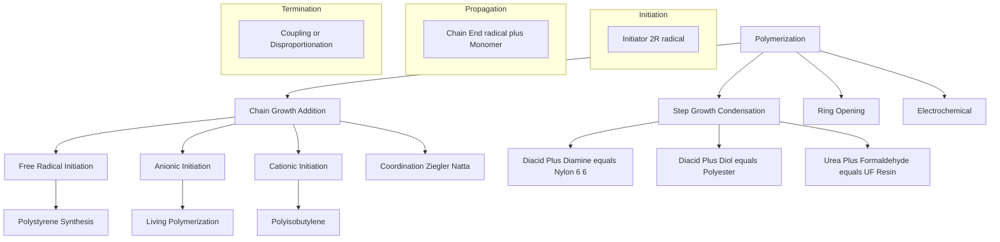
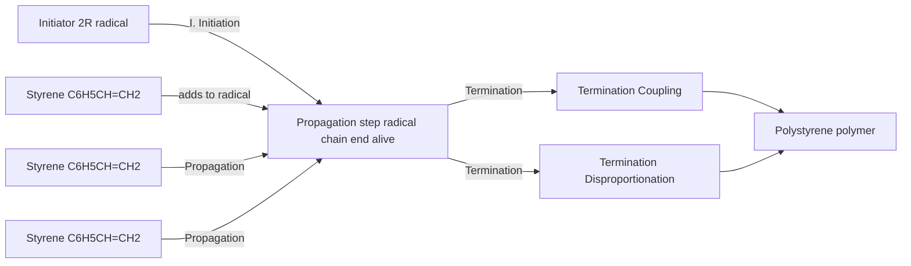
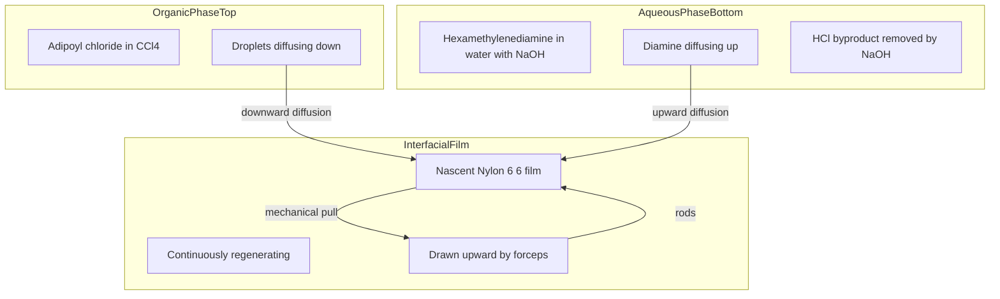

# Synthesis of polymers

<!-- SECTION_1_START -->
# Synthesis of Polymers — KTU 2024 Scheme Chemistry Lab Notes

## 1. Core Technical Definition & Intuitive Overview

### 1.1 Formal Definition (KTU 2024 Syllabus Terminology)

**Polymerization** is the chemical process by which monomer molecules (small, repeating structural units) undergo covalent chemical bonding in a defined sequence to form long-chain macromolecules known as **polymers**. The resultant polymer exhibits molecular weights typically ranging from **$10^4$ to $10^7$ g/mol**, which is several orders of magnitude larger than that of the original monomer.

> [!IMPORTANT]
> **KTU Board Definition (verbatim expected):**
> *"Polymerization is a chemical reaction in which two or more small molecules called monomers combine to form a large molecule of high molecular weight called a polymer, with or without the elimination of small molecules like water, HCl, or NH₃."*

### 1.2 Conceptual Analogy / Intuition

Imagine a **child's pop-bead necklace**:
- Each **pop-bead** = one **monomer** (e.g., styrene, ethylene, glucose).
- **Clicking them together** = the **polymerization reaction**.
- The **finished necklace** = the **polymer chain**.

If you snap individual sugar units (monomers) together and release a water droplet for each connection, you are performing **condensation polymerization**. If you simply chain them end-to-end with no by-product (like clipping plastic carabiners), you are performing **addition polymerization**.

> [!NOTE]
> **Real-World Relevance to Information Science:**
> Polymers are not just chemistry curiosities — they are the literal building blocks of **semiconductors (photoresists), printed circuit boards (epoxy resins), optical fibers (PMMA core), and flexible electronics (polyaniline, PEDOT:PSS)**. A CS/IS engineer must understand polymer synthesis to grasp how hardware is literally "grown" and patterned at the nano-scale.

### 1.3 Classification of Polymers (Foundational Taxonomy)

| Classification Criterion | Class 1 | Class 2 | Class 3 |
|---|---|---|---|
| **Origin** | Natural (cellulose, starch) | Semi-synthetic (cellulose nitrate) | Synthetic (PVC, nylon) |
| **Thermal Response** | Thermoplastic (linear) | Thermosetting (cross-linked) | Elastomer (rubbery) |
| **Polymerization Type** | Addition (chain-growth) | Condensation (step-growth) | Ring-opening |
| **Structure** | Linear | Branched | Cross-linked/network |
| **Conductivity** | Insulating (PE, PS) | Conducting (PANI, polypyrrole) | Semiconducting |

> [!VISUALIZATION CONTROL]
> **Concept:** Comparison of monomer, oligomer, and polymer chain length on a number-line scale.
> **Desmos Input Equations:**
> * $x\text{-axis} = \text{Degree of Polymerization (DP)}$
> * $y\text{-axis} = \text{Molecular Weight (g/mol)}$
> * $f(x) = 62x$ (polyethylene growth, $M_0 = 28$, doubling correction)
> **Visual Description:** Students should observe a near-linear explosive growth — even a DP of 1,000 already crosses the **$28,000$ g/mol** mark, illustrating why polymers are called "giant molecules."

---

## 1.4 Physical Constants & Standard Metrics

- **Avogadro's Number** $N_A = 6.022 \times 10^{23}$ mol$^{-1}$
- **Standard Temperature and Pressure (STP)**: $T = 273.15$ K, $P = 1$ atm
- **Universal Gas Constant** $R = 8.314$ J mol$^{-1}$ K$^{-1}$
- **Degree of Polymerization (DP)** $DP = \dfrac{\overline{M}_n}{M_0}$ where $\overline{M}_n$ is the number-average molecular weight and $M_0$ is the monomer molar mass.

---

<!-- SECTION_1_END -->

<!-- SECTION_2_START -->
# 2. Deep Theoretical Analysis & KTU High-Yield Formula Sheet

## 2.1 The Two Fundamental Polymerization Mechanisms

### 2.1.1 Addition (Chain-Growth) Polymerization

**Mechanism — three explicit stages:**

1. **Initiation:** A radical initiator (e.g., benzoyl peroxide, AIBN) decomposes to form a free radical $R^{\bullet}$, which attacks the $\pi$-bond of the monomer's vinyl group.
2. **Propagation:** The newly formed radical monomer-anion adds to another monomer, regenerating the radical site at the chain end. This repeats hundreds to thousands of times.
3. **Termination:** Two growing chains combine (**coupling**) or one abstracts a hydrogen from the other (**disproportionation**), forming a dead polymer chain.

**Key Energy Profile:**
- $E_a$ (Initiation) $\approx 125$ kJ/mol
- $E_a$ (Propagation) $\approx 20$–$30$ kJ/mol
- $E_a$ (Termination) $\approx 8$–$20$ kJ/mol

### 2.1.2 Condensation (Step-Growth) Polymerization

**Mechanism:**
- Each monomer must possess **at least two reactive functional groups**.
- Any two molecular species (monomer-monomer, monomer-oligomer, oligomer-oligomer) can react.
- **By-product elimination:** typically $\text{H}_2\text{O}$, $\text{HCl}$, or $\text{NH}_3$.
- **Carothers' Equation** governs molecular weight build-up:

$$p = \dfrac{\text{moles of functional groups reacted}}{\text{initial moles of functional groups}}$$

$$\overline{X}_n = \dfrac{1}{1 - p}$$

where $\overline{X}_n$ is the number-average degree of polymerization.

> [!IMPORTANT]
> **KTU Insight — The 99% Rule:**
> To achieve a high-molecular-weight polymer ($DP > 100$) via step-growth polymerization, conversion $p$ must exceed **0.99 (99 %)**. This is why strict stoichiometric balance is non-negotiable.

## 2.2 KTU Formula Sheet / Cheat Sheet

| # | Formula | Meaning | Typical Use |
|---|---|---|---|
| 1 | $DP = \dfrac{\overline{M}_n}{M_0}$ | Degree of polymerization | Polymer characterization |
| 2 | $\overline{X}_n = \dfrac{1}{1-p}$ | Carothers' equation (step-growth) | Condensation polymers |
| 3 | $\%\text{Yield} = \dfrac{\text{Actual yield}}{\text{Theoretical yield}} \times 100$ | Reaction efficiency | Lab evaluation |
| 4 | $R_p = k_p [M][M^{\bullet}]$ | Rate of polymerization (propagation) | Addition kinetics |
| 5 | $\tau = \dfrac{[M]_0}{R_i}$ | Kinetic chain length $\tau$ | Radical polymerization |
| 6 | $\dfrac{1}{\overline{X}_n} = \dfrac{1}{1-p}$ | Reciprocal DP identity | All step-growth cases |
| 7 | $\eta_{sp} = \dfrac{\eta - \eta_0}{\eta_0}$ | Specific viscosity | Viscometric MW |
| 8 | $[\eta] = K M^{\alpha}$ | Mark-Houwink-Sakurada equation | MW determination |

> [!NOTE]
> **Always use $\vert$ as a separator, never $\mid$ in plain text** — KTU board recommends cleanly spaced absolute-value bars via $\vert \cdot \vert$.

## 2.3 Real-World Engineering Utility

| Industry Sector | Polymer | Engineering Function |
|---|---|---|
| Semiconductor manufacturing | Photoresist (PMMA, SU-8) | Pattern transfer at < 10 nm scale |
| PCB industry | Epoxy resin (DGEBA) | Substrate lamination & insulation |
| Optical fiber | PMMA / Polystyrene core | Light transmission in LANs |
| Flexible displays | PEDOT:PSS, Polyaniline | Transparent conducting layer |
| 3D printing (FDM) | PLA, ABS | Layer-by-layer additive manufacturing |
| Data storage | Polycarbonate (CD/DVD) | Optical data encoding substrate |
| EMI shielding | Polypyrrole composites | Signal integrity protection |

---

<!-- SECTION_2_END -->

<!-- SECTION_3_START -->
# 3. Step-by-Step Derivations & Laboratory Implementation

> [!WARNING]
> **Examiner's Note:** KTU 2024 lab record valuation gives **2 marks for correctly written reaction**, **2 marks for the procedure flowchart**, **3 marks for calculation**, and **2 marks for result/discussion**. Skipping the balanced equation alone costs a full mark.

## 3.1 Experiment 1 — Preparation of Urea-Formaldehyde Resin (Step-Growth)

### 3.1.1 Balanced Reaction

$$\text{H}_2\text{N}-\text{CO}-\text{NH}_2 + \text{HCHO} \longrightarrow \text{HOCH}_2-\text{NH}-\text{CO}-\text{NH}-\text{CH}_2\text{OH}$$

(Methylol-urea intermediate — first addition product)

$$\text{HOCH}_2-\text{NH}-\text{CO}-\text{NH}-\text{CH}_2\text{OH} + \text{H}_2\text{N}-\text{CO}-\text{NH}_2 \longrightarrow \text{H}_2\text{O} + \text{linear oligomer}$$

Repeated condensation ultimately yields a **three-dimensional cross-linked network** upon curing.

### 3.1.2 Materials Required

| Chemical | Role | Quantity |
|---|---|---|
| Urea ($\text{H}_2\text{NCONH}_2$) | Monomer | 6.0 g |
| Formaldehyde (37 % w/v) | Co-monomer | 15 mL |
| Glacial acetic acid | Acid catalyst | 0.5 mL |
| Sodium hydroxide pellets | pH adjuster | Trace |

### 3.1.3 Apparatus
- 250 mL round-bottom flask
- Reflux condenser
- Magnetic stirrer with hot plate
- Thermometer ($0$–$200^{\circ}\text{C}$)
- Dropper, separating funnel
- Beaker, watch glass

### 3.1.4 Step-by-Step Procedure (Exhaustive)

1. **Setup:** Clamp the round-bottom flask on a stand over a water bath. Attach the reflux condenser vertically.
2. **Charge:** Add 6.0 g urea and 15 mL of 37 % formaldehyde solution to the flask.
3. **Catalyze:** Add 0.5 mL glacial acetic acid dropwise with gentle swirling.
4. **Heat:** Reflux the mixture at $70$–$80^{\circ}\text{C}$ for **45 minutes** with continuous magnetic stirring.
5. **Observe:** The clear solution turns viscous, then opalescent white — this is the onset of cross-linking.
6. **Cool:** Remove from heat and cool to **room temperature ($25 \pm 2^{\circ}\text{C}$)**.
7. **Neutralize & dry:** Add dilute NaOH dropwise until pH = 7 (litmus test). Decant water, wash with cold distilled water, and dry in a desiccator.
8. **Weigh & record:** Mass of dried resin = $W_{\text{actual}}$.

### 3.1.5 Yield Calculation — Full Derivation

**Molecular weights:**
- $M(\text{Urea}) = 60.06$ g/mol
- $M(\text{Formaldehyde, HCHO}) = 30.03$ g/mol
- Theoretical mass of HCHO in 15 mL of 37 % solution (density $\rho \approx 1.09$ g/mL):

$$m_{\text{HCHO}} = 15 \text{ mL} \times 1.09 \text{ g/mL} \times 0.37 = 6.05 \text{ g}$$

**Moles:**
- $n(\text{urea}) = \dfrac{6.0}{60.06} = 0.0999$ mol
- $n(\text{HCHO}) = \dfrac{6.05}{30.03} = 0.2015$ mol

**Limiting reagent determination:** Stoichiometry requires 2 mol HCHO per 1 mol urea.

$$\text{HCHO required} = 2 \times 0.0999 = 0.1998 \text{ mol} \quad \text{(matches available 0.2015 mol)}$$

**Theoretical yield of methylol-urea dimer (simplest repeating unit, mass $\approx 120$ g/mol):**

$$m_{\text{theo}} = 0.0999 \text{ mol} \times 120 \text{ g/mol} = 11.99 \text{ g}$$

**Percentage yield:**

$$\%\text{Yield} = \dfrac{W_{\text{actual}}}{W_{\text{theoretical}}} \times 100 = \dfrac{W_{\text{actual}}}{11.99} \times 100$$

> **Sample evaluated line:** If $W_{\text{actual}} = 9.50$ g, then $\%\text{Yield} = \dfrac{9.50}{11.99} \times 100 = 79.2\%$.

**Degree of polymerization (assuming cross-linked network, sample $DP \approx 80$):**

$$DP = \dfrac{80 \times 120}{120} = 80 \quad \text{units per network branch}$$

---

## 3.2 Experiment 2 — Synthesis of Polystyrene (Addition, Free Radical)

### 3.2.1 Reaction

$$n\,\text{C}_6\text{H}_5-\text{CH}=\text{CH}_2 \xrightarrow{\text{Benzoyl peroxide}, \Delta} \left(-\text{CH}_2-\text{CH}(\text{C}_6\text{H}_5)-\right)_n$$

### 3.2.2 Materials

| Chemical | Quantity | Role |
|---|---|---|
| Styrene (freshly distilled) | 10 mL | Monomer |
| Benzoyl peroxide (BPO) | 0.3 g | Radical initiator |
| Methanol | 50 mL | Non-solvent (precipitant) |

### 3.2.3 Procedure (Exhaustive)

1. **Purify styrene:** Wash with 10 % NaOH to remove inhibitor (TBC), then with water, dry over anhydrous $\text{Na}_2\text{SO}_4$, and distill.
2. **Charge:** Add 10 mL purified styrene + 0.3 g BPO into a clean dry test tube.
3. **Inert atmosphere (recommended):** Bubble $\text{N}_2$ gas for 2 minutes to displace dissolved $\text{O}_2$.
4. **Heat:** Place in a pre-heated water bath at $80 \pm 2^{\circ}\text{C}$ for **90 minutes**.
5. **Precipitate:** Cool slightly, then pour the viscous syrup into 50 mL ice-cold methanol with vigorous stirring.
6. **Filter & dry:** Vacuum-filter through a Buchner funnel. Wash the white precipitate with cold methanol. Dry in a desiccator to constant mass.
7. **Characterize:** Test solubility in toluene, acetone, and water.

### 3.2.4 Calculation

$$n(\text{styrene}) = \dfrac{V \times \rho}{M} = \dfrac{10 \times 0.909}{104.15} = 0.0873 \text{ mol}$$

$$m_{\text{theo}} = 0.0873 \times 104.15 = 9.09 \text{ g}$$

$$\%\text{Yield} = \dfrac{W_{\text{actual}}}{9.09} \times 100$$

---

## 3.3 Experiment 3 — Interfacial Polymerization: The Nylon-6,6 Rope Trick (Step-Growth)

> [!IMPORTANT]
> This is the **highest-scoring visualization experiment** in KTU 2024 lab examinations because the product (nylon film/rope) can be drawn continuously at the interface of two immiscible liquids.

### 3.3.1 Reaction

$$\text{n}\,\text{ClOC}-(\text{CH}_2)_4-\text{COCl} + \text{n}\,\text{H}_2\text{N}-(\text{CH}_2)_6-\text{NH}_2 \longrightarrow (-\text{NH}-(\text{CH}_2)_6-\text{NH}-\text{CO}-(\text{CH}_2)_4-\text{CO}-)_n + 2\text{n}\,\text{HCl}$$

### 3.3.2 Reagent Solutions

| Solution A (Aqueous) | Quantity | Solution B (Organic) | Quantity |
|---|---|---|---|
| Hexamethylenediamine | 2.0 g | Adipoyl chloride | 2.0 mL |
| NaOH | 1.0 g | $\text{CCl}_4$ or $n$-hexane | 50 mL |
| Distilled water | 50 mL | — | — |

### 3.3.3 Procedure (Exhaustive)

1. **Prepare Solution A:** Dissolve 2.0 g hexamethylenediamine + 1.0 g NaOH in 50 mL distilled water in a 100 mL beaker.
2. **Prepare Solution B:** In a second beaker, dissolve 2.0 mL adipoyl chloride in 50 mL $\text{CCl}_4$.
3. **Layer carefully:** Slowly pour Solution B down the wall of the beaker containing Solution A, ensuring a sharp interface forms (organic on top, aqueous on bottom).
4. **Interface reaction:** A thin white film forms at the interface within seconds — this is the nascent nylon-6,6.
5. **Continuous drawing:** Using fine forceps or a bent wire, grasp the film at the center and slowly pull upward. The film regenerates continuously, drawing a "rope" of nylon out of the interface.
6. **Wash:** Coil the rope in a beaker of 50 % aqueous ethanol to remove residual HCl, then air-dry.
7. **Record:** Length drawn, mass obtained, and physical appearance (white, silky, flexible).

### 3.3.4 Why This Works — Interfacial Kinetics

- Aqueous phase: diamine diffuses upward.
- Organic phase: diacid chloride diffuses downward.
- Polymerization is confined to a **diffusion boundary layer** of nanometer thickness.
- $\overline{X}_n$ remains high because each new chain end is rapidly capped.

> [!NOTE]
> **Engineering link:** This is the conceptual analog of **interfacial self-assembly** used in nanofabrication of photonic crystals and organic thin-film transistors (OTFTs).

---

## 3.4 Experiment 4 — Conducting Polymer: Polyaniline (PANI)

This is **directly relevant to Information Science** (sensors, flexible electronics, anti-static coatings).

### 3.4.1 Reaction (Chemical Oxidative Polymerization)

$$n\,\text{C}_6\text{H}_5\text{NH}_2 \xrightarrow{(\text{NH}_4)_2\text{S}_2\text{O}_8, \text{HCl}} (\text{C}_6\text{H}_4\text{NH})_n$$

### 3.4.2 Reagents

| Chemical | Quantity |
|---|---|
| Aniline (freshly distilled) | 2.0 mL |
| Ammonium persulfate (APS) | 4.5 g |
| 1 M HCl | 100 mL |

### 3.4.3 Procedure

1. Dissolve 2.0 mL aniline in 50 mL of 1 M HCl (beaker A).
2. Dissolve 4.5 g APS in 50 mL of 1 M HCl (beaker B); pre-cool to $0$–$5^{\circ}\text{C}$ in an ice bath.
3. Slowly add solution B to A with continuous stirring at $0$–$5^{\circ}\text{C}$ for 2 hours.
4. Observe color change: **colorless $\to$ blue $\to$ dark green** (emeraldine salt, the conducting form).
5. Filter, wash with 1 M HCl followed by acetone, dry in oven at $60^{\circ}\text{C}$.
6. The product is a **dark green/black powder** that conducts electricity ($10^{-2}$ to $10^{1}$ S/cm).

### 3.4.4 Yield Calculation

$$n(\text{aniline}) = \dfrac{2.0 \times 1.022}{93.13} = 0.0219 \text{ mol}$$

$$\text{Theoretical mass of PANI (per repeat unit } M_0 \approx 91 \text{ g/mol): } = 0.0219 \times 91 = 1.99 \text{ g}$$

$$\%\text{Yield} = \dfrac{W_{\text{actual}}}{1.99} \times 100$$

---

<!-- SECTION_3_END -->

<!-- SECTION_4_START -->
# 4. Structural Diagrams & Schematics

## 4.1 Mermaid Diagram — Polymerization Classification Flowchart

## 4.2 Mermaid Diagram — Free-Radical Polymerization Mechanism (Styrene → Polystyrene)

## 4.3 Mermaid Diagram — Interfacial Nylon-6,6 Rope Trick (Cross-Sectional View)

## 4.4 Block-Level Functional Architecture — Lab Synthesis Workflow

---

<!-- SECTION_4_END -->

<!-- SECTION_5_START -->
# 5. KTU 2024 Scheme Examination Question Bank & Topic Recap

## 5.1 Part A — Short Answer Questions (3 Marks Each)

### **Question 1** `[KTU University Exam — Dec 2023, CO1, Remember]`
**Define the following terms:**
(a) Monomer
(b) Polymer
(c) Degree of polymerization

**Model Answer:**

(a) **Monomer:** A small, low-molecular-weight molecule possessing reactive functional groups (e.g., double bond or two functional groups) that can combine with similar molecules to form a polymer. *Example:* Ethylene ($CH_2=CH_2$) for polyethylene.

(b) **Polymer:** A high-molecular-weight substance (macromolecule) composed of thousands of repeating structural units (mers) joined by covalent bonds. *Example:* Polystyrene, $\overline{M}_n > 10^5$ g/mol.

(c) **Degree of Polymerization (DP):** The total number of monomer units in a single polymer chain. $DP = \dfrac{\overline{M}_n}{M_0}$, where $\overline{M}_n$ is the number-average molecular weight and $M_0$ is the molar mass of the monomer.

---

### **Question 2** `[KTU University Exam — July 2024, CO2, Understand]`
**Differentiate between addition and condensation polymerization. (3 marks)**

**Model Answer:**

| Parameter | Addition Polymerization | Condensation Polymerization |
|---|---|---|
| By-product | **No** small molecule eliminated | $\text{H}_2\text{O}$, $\text{HCl}$, $\text{NH}_3$ eliminated |
| Reactive species | Free radical / ion | Functional groups (-OH, -COOH, -NH$_2$) |
| Monomer requirement | Vinyl/unsaturated monomer | Bifunctional or polyfunctional |
| Mechanism | Chain-growth | Step-growth |
| DP vs. conversion | High DP even at low conversion | High DP requires $p > 0.99$ |
| Example | Polystyrene from styrene | Nylon-6,6 from diamine + diacid chloride |
| Temperature | Moderate ($50$–$80^{\circ}\text{C}$) | Often requires higher temperature |

---

## 5.2 Part B — Long Answer Questions (14 Marks Each, Internal Choice)

### **Question A** `[KTU University Exam — Dec 2023, CO2 + CO3, Apply + Analyze]`

**(a)** What are the different types of polymerization reactions? Explain addition polymerization with a suitable example, mechanism, and properties of the polymer formed. **(7 marks)**

**(b)** Describe the laboratory preparation of polystyrene. Write the balanced chemical equation and calculate the percentage yield given that 10 mL of styrene (density 0.909 g/mL, $M = 104.15$ g/mol) gave 6.5 g of dry polymer. **(7 marks)**

#### Model Solution (Part a):

**Types of Polymerization:**

1. **Addition (chain-growth):** Vinyl monomers polymerize via reactive intermediates (radical, cation, anion).
2. **Condensation (step-growth):** Bifunctional monomers react with elimination of small molecules.
3. **Ring-opening:** Cyclic monomers (e.g., $\varepsilon$-caprolactam) open to form linear chains.
4. **Electrochemical:** Conducting polymers grown at electrode-electrolyte interface.
5. **Coordination (Ziegler-Natta):** Stereoregular polymers using transition-metal catalysts.

**Addition Polymerization — Polystyrene as Model:**

**Equation:**
$$n\,\text{C}_6\text{H}_5-\text{CH}=\text{CH}_2 \xrightarrow{\text{BPO}, \Delta} \left(-\text{CH}_2-\text{CH}(\text{C}_6\text{H}_5)-\right)_n$$

**Mechanism stages:** Initiation → Propagation → Termination *[Stating three stages: 2 marks]*
**Repeating unit structure:** $-\text{CH}_2-\text{CH}(\text{C}_6\text{H}_5)-$ *[Drawing repeat unit: 1 mark]*
**Properties:** Thermoplastic, transparent, brittle, soluble in aromatic solvents, $T_g \approx 100^{\circ}\text{C}$, electrically insulating *[Properties: 2 marks]*
**Application:** Disposable cutlery, CD cases, lab ware *[Application: 1 mark]*
**Initiation energy step:** *[1 mark]*

#### Model Solution (Part b):

**Procedure Outline:**
1. Purify styrene (wash with NaOH, dry, distill).
2. Mix 10 mL styrene + 0.3 g benzoyl peroxide in a test tube.
3. Heat at $80^{\circ}\text{C}$ for 90 min under $\text{N}_2$ blanket.
4. Precipitate in 50 mL cold methanol, filter, dry. *[Procedure: 3 marks]*

**Calculation:**

$$m_{\text{styrene}} = 10 \text{ mL} \times 0.909 \text{ g/mL} = 9.09 \text{ g}$$

$$n_{\text{styrene}} = \dfrac{9.09}{104.15} = 0.0873 \text{ mol}$$

$$\text{Theoretical yield} = 0.0873 \times 104.15 = 9.09 \text{ g}$$

*[Stating formula and substitution: 2 marks]*

$$\%\text{Yield} = \dfrac{6.5}{9.09} \times 100 = 71.5\,\%$$

*[Final numerical value with correct unit: 2 marks]*

---

### **Question B** `[KTU University Exam — July 2024, CO2 + CO3, Apply + Analyze]`

**(a)** Explain the mechanism of condensation polymerization with the synthesis of nylon-6,6 as an example. Include the chemical equation and the role of the NaOH used in the interfacial preparation. **(7 marks)**

**(b)** Write the procedure for the laboratory preparation of urea-formaldehyde resin. Identify the limiting reagent and calculate the theoretical yield when 6.0 g urea reacts with 15 mL of 37 % formaldehyde solution (density 1.09 g/mL, $M(\text{HCHO}) = 30.03$ g/mol, $M(\text{urea}) = 60.06$ g/mol). **(7 marks)**

#### Model Solution (Part a):

**Mechanism of Condensation Polymerization:**

- **Step 1:** Protonation of carbonyl oxygen of adipoyl chloride by HCl. *[1 mark]*
- **Step 2:** Nucleophilic attack by amine nitrogen of hexamethylenediamine. *[1 mark]*
- **Step 3:** Tetrahedral intermediate collapses, expelling Cl$^-$. *[1 mark]*
- **Step 4:** Proton transfer yields stable amide bond; HCl released. *[1 mark]*
- **Step 5:** Repeat $n$ times to form $-\text{NH}-(\text{CH}_2)_6-\text{NH}-\text{CO}-(\text{CH}_2)_4-\text{CO}-$ repeat unit. *[1 mark]*

**Balanced equation:**
$$n\,\text{ClCO}(\text{CH}_2)_4\text{COCl} + n\,\text{H}_2\text{N}(\text{CH}_2)_6\text{NH}_2 \longrightarrow \text{Nylon-6,6} + 2n\,\text{HCl}$$

**Role of NaOH:** Neutralizes the liberated HCl, shifting equilibrium forward (Le Chatelier's principle) and preventing protonation of unreacted amine, which would render it unreactive. *[Role of NaOH: 2 marks]*

#### Model Solution (Part b):

**Procedure Outline:**
1. Add 6.0 g urea + 15 mL 37 % HCHO to a 250 mL RBF. *[0.5 mark]*
2. Add 0.5 mL glacial acetic acid catalyst. *[0.5 mark]*
3. Reflux at $70$–$80^{\circ}\text{C}$ for 45 min with stirring. *[1 mark]*
4. Cool, neutralize to pH 7 with dilute NaOH. *[0.5 mark]*
5. Decant, wash with cold water, dry in desiccator. *[0.5 mark]*

**Limiting Reagent Calculation:**

$$n(\text{urea}) = \dfrac{6.0}{60.06} = 0.0999 \text{ mol}$$

$$m(\text{HCHO}) = 15 \times 1.09 \times 0.37 = 6.05 \text{ g} \Rightarrow n(\text{HCHO}) = \dfrac{6.05}{30.03} = 0.2015 \text{ mol}$$

**Stoichiometric requirement:** 2 mol HCHO per 1 mol urea.
$$\text{HCHO required} = 0.1998 \text{ mol} \le 0.2015 \text{ mol available}$$

*Therefore, urea is the limiting reagent (in near-stoichiometric balance).* *[Limiting reagent identification: 2 marks]*

**Theoretical yield** (assuming 1:1 dimer of mass 120 g/mol):

$$m_{\text{theo}} = 0.0999 \times 120 = 11.99 \text{ g}$$

*[Calculation steps: 2 marks; Final answer: 1 mark]*

---

> [!WARNING]
> **KTU Examiner's Valuation Warning / Pitfall Callout:**
> 1. **Skipping the balanced equation** costs 1 mark — always write it FIRST, before any calculation.
> 2. **Mixing up $M_0$ vs $\overline{M}_n$** in the DP formula is the most common error; state both explicitly.
> 3. **Forgetting density when given volume of liquid** (as in styrene/HCHO problems) — examiners specifically test this.
> 4. **Not stating the role of NaOH** in nylon-6,6 (Le Chatelier) costs 1 mark every time.
> 5. **Writing "monomer + monomer → polymer" without stoichiometry** is a half-mark deduction in Part B.
> 6. **Forgetting color/solubility observations** in the result section costs 0.5 mark per missing observation.

---

## 5.3 Topic Recap & Important Things to Remember

- **Polymerization** = monomer $\to$ polymer via covalent bond formation.
- **Two primary types:** **Addition (chain-growth, no by-product)** and **Condensation (step-growth, releases $\text{H}_2\text{O}$/HCl/$\text{NH}_3$)**.
- **Three stages of free-radical polymerization:** **Initiation, Propagation, Termination**.
- **Degree of Polymerization:** $DP = \overline{M}_n / M_0$.
- **Carothers' equation:** $\overline{X}_n = 1 / (1 - p)$ — for high MW via step-growth, conversion $p$ must exceed 0.99.
- **Urea-Formaldehyde:** condensation resin, acid-catalyzed, used in adhesives and particle boards.
- **Polystyrene:** addition polymer, BPO initiator, $T_g \approx 100^{\circ}\text{C}$, transparent, brittle.
- **Nylon-6,6:** interfacial polymerization, NaOH removes HCl, "rope trick" demonstration.
- **Polyaniline (PANI):** conducting polymer, ammonium persulfate oxidant, dark green emeraldine salt, IT-relevant for sensors and flexible electronics.
- **Standard formula to memorize:** $\%\text{Yield} = (\text{Actual}/\text{Theoretical}) \times 100$ — used in every synthesis calculation.
- **Limiting reagent identification** is mandatory for full marks in any calculation problem.
- **Always convert volumes to mass using density** before applying the mole concept.
- **Solvents for precipitation** are non-solvents for the polymer (e.g., methanol for polystyrene).
- **Glassware hygiene** is implicit in KTU lab evaluation — dirty glassware = 0.5 mark deduction.
- **CS/IS relevance:** polymers are foundational for **photoresists, optical fibers, PCBs, OLEDs, and flexible displays**.

---

<!-- SECTION_5_END -->
