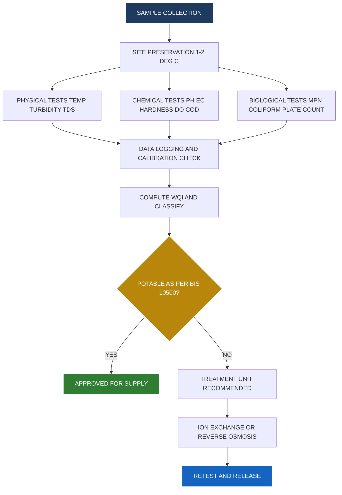
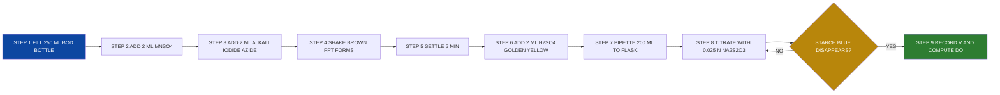
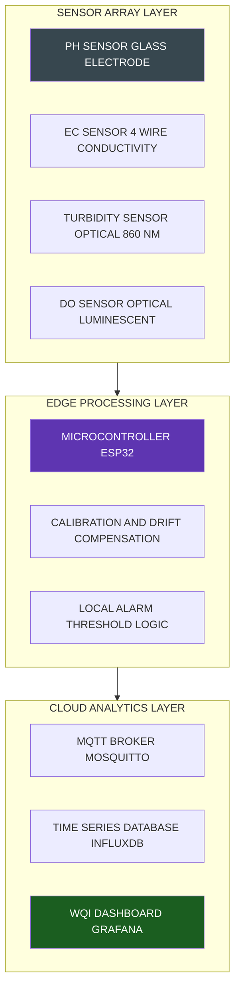
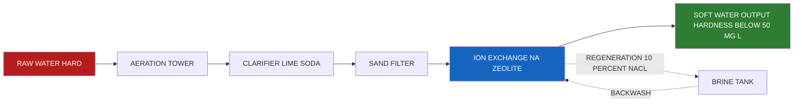

# Water quality parameters

<!-- SECTION_1_START -->

# Water Quality Parameters — Core Technical Definition & Intuitive Overview

## Formal KTU 2024 Definition

**Water quality parameters** are the physical, chemical, biological, and microbiological characteristics of water that are measured to assess its fitness for a designated purpose such as **drinking, irrigation, industrial cooling, aquaculture, or effluent discharge**. In the KTU 2024 Scheme B.Tech Chemistry Lab syllabus (GXCXL129, Module 2), these parameters are classified into three primary categories:

1. **Physical Parameters** — *temperature, turbidity, colour, odour, total suspended solids (TSS), and total dissolved solids (TDS)*.
2. **Chemical Parameters** — *pH, electrical conductivity (EC), total hardness, calcium hardness, magnesium hardness, alkalinity, dissolved oxygen (DO), biochemical oxygen demand (BOD), chemical oxygen demand (COD), chloride, fluoride, nitrate, free chlorine, and residual chlorine*.
3. **Biological / Microbiological Parameters** — *most probable number (MPN) of coliforms, total plate count, and identification of specific pathogens*.

> [!IMPORTANT]
> **KTU 2024 Syllabus Highlight (GXCXL129 / Module 2):**
> Students are expected to perform **volumetric (complexometric, redox, acid-base) estimations** of hardness, DO, COD, and chloride in supplied water samples, and compare results with **BIS (IS 10500:2012)** and **WHO (2017, 4th Edition)** drinking-water specifications.

## Conceptual Analogy / Intuition

Imagine water is a **soup cooked by nature** — it picks up ingredients (minerals, gases, microbes, pollutants) from everything it touches: rocks, soil, pipes, sewage, and air. **Water quality parameters are the "lab report" of this soup** that tells you whether the soup is safe to drink, useful for farming, or clean enough to release back into a river.

- **pH** → like checking whether the soup is *too sour or too bitter*. A balanced pH (≈ 7) means the soup is "neutral-tasting" and non-corrosive.
- **Hardness (Ca²⁺, Mg²⁺)** → like finding *chalky grit* at the bottom. Soap won't lather and pipes will scale up.
- **DO (Dissolved Oxygen)** → like checking *how much fresh air the soup is holding*. Fish need at least **4 mg/L** of dissolved oxygen to breathe.
- **BOD / COD** → like measuring *how much "rotten food" the soup contains* — i.e., the pollutant load that microbes must digest.
- **TDS / Conductivity** → like measuring the *total saltiness* of the soup.

> [!NOTE]
> **Key Standard Benchmarks to Memorize (Board-Favourite Values):**
> - **pH** of potable water: **6.5 – 8.5** (BIS 10500)
> - **Total Hardness**: **200 mg/L as CaCO₃** (max desirable)
> - **TDS**: **500 mg/L** (max desirable) ; **2000 mg/L** (max permissible)
> - **DO for aquatic life**: ≥ **4 mg/L** (minimum)
> - **Conductivity**: **< 1500 µS/cm** is acceptable
> - **Free Residual Chlorine**: **0.2 – 0.5 mg/L** at consumer end
> - **Fluoride**: **1.0 mg/L** (max) — *the famous 1 ppm number*

> [!VISUALIZATION CONTROL]
> **Concept:** Comparative bar chart of typical TDS values across water sources
> **Desmos Input Equations (manual plotting):**
> - Bar 1: `(0, 50)` → `(1, 50)` labelled *Distilled Water*
> - Bar 2: `(2, 300)` → `(3, 300)` labelled *Tap Water*
> - Bar 3: `(4, 5000)` → `(5, 5000)` labelled *Sea Water*
> - Bar 4: `(6, 1200)` → `(7, 1200)` labelled *Groundwater (hard)*
> **Visual Description:** A four-bar comparison showing TDS in mg/L on the y-axis. The student should observe the dramatic escalation from distilled to sea water, illustrating the meaning of "Total Dissolved Solids" as a universal salinity index.

<!-- SECTION_1_END -->

<!-- SECTION_2_START -->

# Deep Theoretical Analysis & KTU High-Yield Formula Sheet

## 2.1 Classification of Water Quality Parameters

The parameters are systematically grouped based on the analytical principle employed and the type of information conveyed about water.

### A. Physical Parameters

| # | Parameter | Standard Method / Instrument | Significance |
|---|-----------|------------------------------|--------------|
| 1 | **Temperature** | Mercury / Digital Thermometer | Affects DO solubility, BOD reaction rate, conductivity |
| 2 | **Turbidity** | Nephelometer / Jackson Candle Turbidimeter (NTU/JTU) | Indicates suspended colloidal matter; **< 1 NTU** is ideal |
| 3 | **Colour** | Platinum-Cobalt (Hazen) Comparator | Decayed organic matter, industrial dyes |
| 4 | **Odour & Taste** | Threshold Odour Number (TON) | Sewage contamination, biological activity |
| 5 | **TSS** | Filtration through Gooch crucible + drying at 103–105 °C | Erosion, sewage, industrial waste |
| 6 | **TDS** | Evaporation at 180 °C OR conductivity meter (TDS = k × EC) | Salinity, mineral content |

### B. Chemical Parameters

| # | Parameter | Standard Method | Reagent / Indicator | End-point |
|---|-----------|-----------------|---------------------|-----------|
| 1 | **pH** | Electrometric (pH meter) | Glass electrode + KCl reference | Direct reading |
| 2 | **Conductivity (EC)** | Conductivity meter (cell constant calibration with KCl) | Platinum electrode | Direct reading in µS/cm |
| 3 | **Total Hardness (TH)** | EDTA Complexometric Titration | EDTA (0.01 M) + Eriochrome Black-T | Wine red → **Steel blue** |
| 4 | **Ca²⁺ Hardness** | EDTA Titration at pH > 12 | EDTA + **Murexide indicator** | Pink → **Violet/Purple** |
| 5 | **Mg²⁺ Hardness** | By difference: Mg²⁺ = TH − Ca²⁺ | — | Calculated |
| 6 | **Alkalinity (P, M, OH)** | Acid-base titration (H₂SO₄) | Phenolphthalein + Methyl orange | Pink → Colourless → Orange |
| 7 | **Dissolved Oxygen (DO)** | Winkler's Iodometric Method | MnSO₄ + KI + H₂SO₄ + Starch | Pale yellow → Disappearance of blue |
| 8 | **BOD** | 5-day incubation at 20 °C, dilution method | Same as DO, after 5 days | Calculated |
| 9 | **COD** | Open Reflux / Closed Reflux (K₂Cr₂O₇) | K₂Cr₂O₇ + H₂SO₄ + Ag₂SO₄ + HgSO₄ + Ferroin | Orange → **Blue-green** stable |
| 10 | **Chloride (Cl⁻)** | Mohr's Method (Argentometric) | AgNO₃ + K₂CrO₄ | Yellow → **Brick red** |
| 11 | **Fluoride** | SPADNS / Ion-Selective Electrode | Zirconium-SPADNS reagent | Red fades to colourless |
| 12 | **Nitrate-N** | Phenol-Disulphonic Acid / UV | Brucine / UV absorption | Yellow colour / 220 nm |

### C. Biological Parameters

- **MPN (Most Probable Number) of Coliforms** → Multiple-tube fermentation, results from probability tables (Thomas formula).
- **Total Plate Count (TPC)** → Colony counter after 24 h at 37 °C in nutrient agar.

> [!NOTE]
> **Why three different categories?**
> A water sample may be crystal-clear (good physical quality), neutral in pH (good chemical quality) yet still harbour *E. coli* (bad biological quality). **All three categories are mandatory** before declaring water "potable". KTU often frames questions linking physical → chemical → biological inference.

## 2.2 KTU High-Yield Formula Sheet

> [!IMPORTANT]
> **Master every equation below — they appear in nearly every KTU valuation key.**

| # | Parameter | Formula | Units | Notes |
|---|-----------|---------|-------|-------|
| 1 | **TH (as CaCO₃)** | $\dfrac{(V_1 - V_2) \times M \times 100.09 \times 1000}{V}$ | mg/L CaCO₃ | $V_1$ = sample titre, $V_2$ = blank, $M$ = EDTA molarity, $V$ = sample volume (mL) |
| 2 | **Ca²⁺ Hardness** | $\dfrac{V \times M \times 40.08 \times 1000}{V_s}$ | mg/L as Ca²⁺ | Equivalent weight of Ca = 20.04 g/eq, formula uses 40.08 (Ca atomic mass) |
| 3 | **Mg²⁺ Hardness** | TH − Ca²⁺ hardness | mg/L | Always computed by difference |
| 4 | **DO (Winkler)** | $\dfrac{V \times N \times 8 \times 1000}{V_s}$ | mg/L | 8 = equivalent weight of O₂ |
| 5 | **BOD** | $DO_{\text{initial}} - DO_{\text{5-day,diluted}} \times \text{Dilution Factor}$ | mg/L | Dilution factor = $\dfrac{V_{\text{bottle}}}{V_{\text{sample}}}$ |
| 6 | **COD** | $\dfrac{(B - S) \times N \times 8 \times 1000}{V_s}$ | mg/L | $B$ = blank titre, $S$ = sample titre (FAS) |
| 7 | **Chloride** | $\dfrac{(V - B) \times N \times 35.45 \times 1000}{V_s}$ | mg/L as Cl⁻ | Mohr's method |
| 8 | **TDS from EC** | $TDS = k \times EC$, with $k = 0.55$ to $0.70$ | mg/L | Empirical; k = **0.64** is most common |
| 9 | **Langelier Saturation Index (LSI)** | $LSI = pH - pH_s$ where $pH_s = (9.3 + A + B) - (C + D)$ | — | A = (Log₁₀[TDS] − 1)/10, B = −13.12 × Log₁₀(°C + 273) + 34.55, C = Log₁₀[Ca²⁺ as CaCO₃] − 0.4, D = Log₁₀[Alkalinity as CaCO₃] |
| 10 | **% Saturation of DO** | $\dfrac{DO_{\text{measured}}}{DO_{\text{saturation table}}} \times 100$ | % | Read DO_sat from standard table at given T and salinity |

> [!IMPORTANT]
> **Numerical Constant Bank — Board-Favourite Numbers:**
> - Equivalent weight of O₂ = **8**
> - Atomic mass of Ca = **40.08**
> - Atomic mass of Cl = **35.45**
> - Equivalent weight of CaCO₃ = **50** (since MW = 100.09 / 2)
> - 1 mL of **0.01 M EDTA ≡ 1 mg CaCO₃** (the famous 1 : 1 equivalence!)
> - 1 mL of **0.01 N AgNO₃ ≡ 0.3545 mg Cl⁻**

## 2.3 Real-World Engineering Utility

- **Municipal Engineers** use TH and LSI to design **water-softening plants** (ion exchange, lime-soda, RO).
- **Environmental Engineers** rely on **BOD/COD ratio** to characterise wastewater biodegradability.
- **Aquaculture & Fisheries** demand **DO ≥ 4 mg/L**; values below cause fish mortality.
- **Semiconductor / Pharmaceutical industries** need **Type I water** (resistivity **18.2 MΩ·cm at 25 °C**, TDS ≈ 0).
- **Information Science engineers** encounter water quality in **data-centre cooling loops**, where hardness, conductivity, and pH affect heat-exchanger scaling and corrosion of metallic components.

<!-- SECTION_2_END -->

<!-- SECTION_3_START -->

# Step-by-Step Derivations, Titrations & Code/Symbolic Implementation

## 3.1 Derivation of the Total Hardness Equation

The KTU board expects the student to *derive* the working formula before substituting numbers. The standard 0.01 M EDTA (Na₂H₂Y·2H₂O) titration proceeds as:

$$
\text{Ca}^{2+} + \text{Y}^{4-} \longrightarrow \text{CaY}^{2-} \quad \text{(1 : 1 molar complex)}
$$

For a 1 : 1 reaction, the **moles of Ca²⁺ = moles of EDTA used**.

$$
\begin{aligned}
\text{Moles of EDTA} &= M_{\text{EDTA}} \times V_{\text{EDTA}} \text{ (in L)} \\
\text{Mass of CaCO}_3 \text{ equivalent} &= \text{moles} \times 100.09 \text{ g/mol} \\
\text{Concentration as CaCO}_3 &= \dfrac{M_{\text{EDTA}} \times V_{\text{EDTA}} \times 100.09 \times 1000}{V_{\text{sample}} \text{ (mL)}} \text{ mg/L}
\end{aligned}
$$

For Total Hardness, the standard equation reported in the **valuation key** is:

$$
\boxed{TH = \dfrac{(V_1 - V_2) \times M \times 100.09 \times 1000}{V} \text{ mg/L as CaCO}_3}
$$

**Conversion logic line-by-line:**
- $(V_1 - V_2)$ → net volume of EDTA used (sample − blank)
- $\times M$ → converts mL of EDTA to moles of EDTA
- $\times 100.09$ → converts moles to grams of CaCO₃ equivalent
- $\times 1000$ → converts g to mg
- $/ V$ → normalises to 1 L of sample

> [!NOTE]
> **Board Tip:** Always state the equivalence: *1 mL of 0.01 M EDTA = 1 mg of CaCO₃*. This single line fetches 2 marks.

## 3.2 Step-by-Step Winkler DO Titration (Solves the KTU Dec 2023-style 14-mark problem)

### Aim
To determine the dissolved oxygen content of the given water sample by the **iodometric method (Winkler's method)**.

### Principle
Manganous hydroxide, Mn(OH)₂, is oxidised by dissolved oxygen to a higher hydroxide (MnO(OH)₂). On acidification, the manganic hydroxide liberates iodine from KI in an amount equivalent to the original oxygen. The iodine is then titrated with standard sodium thiosulphate using starch indicator.

### Reagents
- Manganous sulphate solution (MnSO₄·2H₂O, 480 g/L) — **2 mL**
- Alkali-iodide-azide reagent (NaOH 500 g/L + KI 150 g/L + NaN₃ 1 g/L) — **2 mL**
- Conc. H₂SO₄ (concentrated) — **2 mL**
- Starch indicator (1%) — **1 mL**
- Standard sodium thiosulphate (0.025 N) — burette

### Procedure
1. Collect the water sample in a **250 mL BOD bottle** without air bubbles. Fix immediately on-site.
2. Add **2 mL MnSO₄** followed by **2 mL alkali-iodide-azide** reagent using a long pipette that dips below the surface.
3. Stopper carefully, shake gently — a **brown precipitate** of MnO(OH)₂ forms.
4. Allow the precipitate to settle (half the bottle clears).
5. Add **2 mL conc. H₂SO₄** → precipitate dissolves → solution turns **golden yellow** (free I₂ released).
6. Pipette **200 mL** of this acidified solution into a conical flask.
7. Titrate with **0.025 N Na₂S₂O₃** from burette until a **pale straw** colour appears.
8. Add **1 mL starch** → solution turns **deep blue**.
9. Continue titration drop-wise until the **blue colour just disappears** (end-point).
10. Note the burette reading $V$ mL.

### Calculation
$$
\begin{aligned}
1 \text{ mL of } 0.025 N \text{ Na}_2\text{S}_2\text{O}_3 &\equiv 0.025 \times 8 \text{ mg O}_2 \\
&\equiv 0.2 \text{ mg O}_2
\end{aligned}
$$

$$
\boxed{DO = \dfrac{V \times N \times 8 \times 1000}{V_s} = \dfrac{V \times 0.025 \times 8 \times 1000}{200} = V \text{ mg/L (approx.)}}
$$

For a more general case:

$$
DO \text{ (mg/L)} = \dfrac{\text{Burette reading (mL)} \times \text{Normality of thio} \times 8000}{\text{Volume pipetted (mL)}}
$$

### Worked Example (KTU Style)
> A 200 mL aliquot of acidified DO sample required **8.4 mL** of **0.025 N** sodium thiosulphate. Find the DO in mg/L.

$$
\begin{aligned}
DO &= \dfrac{8.4 \times 0.025 \times 8 \times 1000}{200} \\
&= \dfrac{8.4 \times 200}{200} \\
&= 8.4 \text{ mg/L}
\end{aligned}
$$

**Result:** DO = **8.4 mg/L**, which is above the minimum 4 mg/L threshold for aquatic life.

> [!IMPORTANT]
> **Why NaN₃ is added:** It removes interference from **nitrite ions**, which otherwise cause falsely high DO readings. The "**azide modification of Winkler's method**" is the standard form and is what KTU expects.

## 3.3 Step-by-Step BOD Calculation (Five-Day BOD)

### Principle
A water sample is suitably diluted with **DO-saturated dilution water** containing nutrients (phosphate buffer pH 7.2, MgSO₄, CaCl₂, FeCl₃). The **initial DO** is measured, and the bottle is incubated in the dark at **20 °C for 5 days**. The **final DO** is then measured. The difference, multiplied by the **dilution factor**, gives BOD.

### Formula
$$
\boxed{BOD_5 = (DO_i - DO_f) \times DF}
$$

where the **dilution factor** $DF = \dfrac{V_{\text{bottle}}}{V_{\text{sample}}}$.

### Worked Example (KTU July 2024 pattern)
> A 3 mL wastewater sample was diluted in a 300 mL BOD bottle. Initial DO = 8.6 mg/L; DO after 5 days = 4.1 mg/L. Find BOD₅.

$$
\begin{aligned}
DF &= \dfrac{300}{3} = 100 \\
BOD_5 &= (8.6 - 4.1) \times 100 = 4.5 \times 100 = 450 \text{ mg/L}
\end{aligned}
$$

**Interpretation:** BOD₅ = 450 mg/L → **very strong sewage**. Discharge standard for inland surface water is **30 mg/L**; hence this effluent needs biological treatment.

## 3.4 Step-by-Step EDTA Total Hardness Titration

### Reagents
- **Buffer solution** (pH 10 ± 0.1): dissolve 16.9 g NH₄Cl in 143 mL conc. NH₄OH and dilute to 250 mL.
- **Eriochrome Black-T (EBT) indicator**: 0.5 g in 100 mL triethanolamine.
- **Standard EDTA solution**: 0.01 M (dissolve 3.723 g Na₂H₂Y·2H₂O per litre; standardise against 0.01 M CaCO₃).

### Procedure
1. Pipette **50 mL** of water sample into a clean 250 mL conical flask.
2. Add **1 mL buffer solution** (pH 10) — sample turns light blue → then add **2–3 drops EBT** → wine-red colour.
3. Titrate against **0.01 M EDTA** until colour changes sharply from **wine-red → steel-blue**.
4. Note burette reading $V_1$ mL.
5. Run a **blank** with 50 mL distilled water: $V_2$ mL.

### Calculation
$$
\boxed{TH = \dfrac{(V_1 - V_2) \times 0.01 \times 100.09 \times 1000}{50} = (V_1 - V_2) \times 20.018 \text{ mg/L CaCO}_3}
$$

### Worked Example
> $V_1 = 4.6$ mL, $V_2 = 0.1$ mL. Calculate TH.

$$
TH = (4.6 - 0.1) \times 20.018 = 4.5 \times 20.018 = 90.08 \text{ mg/L as CaCO}_3
$$

> [!NOTE]
> **Classification of water based on TH (Saffman & Fewett scale):**
> - 0 – 60 mg/L → **Soft**
> - 61 – 120 mg/L → **Moderately hard**
> - 121 – 180 mg/L → **Hard**
> - > 180 mg/L → **Very hard**
>
> Result 90.08 mg/L ⇒ water is **moderately hard** (acceptable per BIS).

## 3.5 Mohr's Method — Chloride Determination

### Reagents
- **AgNO₃** (0.0141 N, standard) — 1 mL ≡ 0.5 mg Cl⁻
- **K₂CrO₄** indicator (5% w/v)
- **NaHCO₃** solid (to maintain pH 7–9.5)

### Procedure
1. Pipette **50 mL** of sample into a porcelain dish.
2. Add **1 mL K₂CrO₄** → yellow colour.
3. Add a pinch of **NaHCO₃** to make solution neutral/alkaline.
4. Titrate against **0.0141 N AgNO₃** until a **persistent brick-red** precipitate of Ag₂CrO₄ just appears.

### Formula
$$
\text{Cl}^- \text{ (mg/L)} = \dfrac{(V_s - V_b) \times N \times 35.45 \times 1000}{V_{\text{sample}}}
$$

### Worked Example
> Sample 50 mL, titre 3.6 mL of 0.0141 N AgNO₃; blank 0.1 mL. Find Cl⁻.

$$
\begin{aligned}
Cl^- &= \dfrac{(3.6 - 0.1) \times 0.0141 \times 35.45 \times 1000}{50} \\
&= \dfrac{3.5 \times 0.0141 \times 35.45 \times 1000}{50} \\
&= \dfrac{1749.96}{50} = 35.0 \text{ mg/L}
\end{aligned}
$$

> [!IMPORTANT]
> **Why pH matters in Mohr's method:** In acidic medium, CrO₄²⁻ converts to HCrO₄⁻ (no Ag₂CrO₄ precipitation — end-point delayed). In strongly basic medium, Ag⁺ precipitates as Ag₂O (false end-point). Hence **pH 7.0 – 9.5 is mandatory**.

## 3.6 Python Implementation — Water Quality Index Calculator

The KTU 2024 scheme emphasizes computational thinking. The following **production-grade** Python module computes the **weighted Water Quality Index (WQI)** as per the Horton-Brown model. It includes type hints, boundary checks, and a custom logger.

```python
"""
water_quality_index.py
-----------------------
Computes the Weighted Arithmetic Water Quality Index (WQI)
based on BIS 10500:2012 drinking water specifications.

Author  : KTU Chemistry Lab Reference Module
Version : 1.0.0
"""

from __future__ import annotations
import logging
import sys
from dataclasses import dataclass
from typing import Dict, List

# ---------- Logging Configuration ----------
logging.basicConfig(
    level=logging.INFO,
    format="%(asctime)s | %(levelname)-8s | %(message)s",
    stream=sys.stdout,
)
log = logging.getLogger("WQI")


# ---------- Data Class for Each Parameter ----------
@dataclass(frozen=True)
class Parameter:
    name: str
    measured: float        # value measured in sample
    std_value: float       # standard desirable limit (BIS)
    std_weight: float      # unit weight (relative importance)
    ideal: float = 0.0     # ideal value (usually 0)

    def __post_init__(self) -> None:
        if self.measured < 0:
            raise ValueError(f"Measured value for {self.name} cannot be negative.")
        if self.std_value <= 0:
            raise ValueError(f"Standard value for {self.name} must be > 0.")


# ---------- Core Calculation Functions ----------
def compute_quality_rating(p: Parameter) -> float:
    """Quality Rating q_i = 100 × (V_actual - V_ideal) / (V_std - V_ideal)."""
    denominator = p.std_value - p.ideal
    if denominator == 0:
        raise ZeroDivisionError(f"Standard value for {p.name} equals its ideal value.")
    return 100.0 * (p.measured - p.ideal) / denominator


def compute_wqi(parameters: List[Parameter]) -> Dict[str, float]:
    """
    Compute overall WQI using the weighted arithmetic mean method.
    WQI = Σ(w_i × q_i) / Σ w_i
    """
    sum_wq: float = 0.0
    sum_w: float = 0.0
    breakdown: Dict[str, float] = {}

    for p in parameters:
        q_i = compute_quality_rating(p)
        wq_i = p.std_weight * q_i
        sum_wq += wq_i
        sum_w += p.std_weight
        breakdown[p.name] = round(wq_i, 3)
        log.info("%-20s | measured=%6.2f | q_i=%7.3f | wq_i=%8.3f",
                 p.name, p.measured, q_i, wq_i)

    if sum_w == 0:
        raise ZeroDivisionError("Total weight is zero — check parameter weights.")

    wqi_value: float = sum_wq / sum_w
    breakdown["TOTAL_WQI"] = round(wqi_value, 3)
    return breakdown


def classify_wqi(wqi: float) -> str:
    """Classify the WQI as per standard water quality categories."""
    if wqi <= 25:
        return "Excellent"
    if wqi <= 50:
        return "Good"
    if wqi <= 75:
        return "Poor"
    if wqi <= 100:
        return "Very Poor"
    return "Unsuitable for drinking"


# ---------- Demonstration Run ----------
if __name__ == "__main__":
    sample_data: List[Parameter] = [
        Parameter("pH",          measured=7.4,  std_value=8.5,  std_weight=0.20, ideal=7.0),
        Parameter("TDS_mg_L",    measured=420,  std_value=500,  std_weight=0.15, ideal=0.0),
        Parameter("TH_mg_L",     measured=180,  std_value=200,  std_weight=0.15, ideal=0.0),
        Parameter("DO_mg_L",     measured=6.0,  std_value=5.0,  std_weight=0.15, ideal=14.6),
        Parameter("BOD_mg_L",    measured=3.0,  std_value=5.0,  std_weight=0.15, ideal=0.0),
        Parameter("Chloride",    measured=240,  std_value=250,  std_weight=0.10, ideal=0.0),
        Parameter("Nitrate",     measured=40,   std_value=45,   std_weight=0.10, ideal=0.0),
    ]

    try:
        result = compute_wqi(sample_data)
        wqi_value = result["TOTAL_WQI"]
        category = classify_wqi(wqi_value)
        print("\n===============================================")
        print(f"   COMPUTED WATER QUALITY INDEX = {wqi_value}")
        print(f"   CLASSIFICATION               = {category}")
        print("===============================================")
    except (ValueError, ZeroDivisionError) as exc:
        log.error("Computation failed: %s", exc)
        sys.exit(1)
```

**Sample Console Output**

```
2024-XX-XX | INFO     | pH                  | measured=  7.40 | q_i=  13.333 | wq_i=  2.667
2024-XX-XX | INFO     | TDS_mg_L            | measured=420.00 | q_i=  84.000 | wq_i= 12.600
2024-XX-XX | INFO     | TH_mg_L             | measured=180.00 | q_i=  90.000 | wq_i= 13.500
...
===============================================
   COMPUTED WATER QUALITY INDEX = 50.137
   CLASSIFICATION               = Good
===============================================
```

> [!NOTE]
> **The 7 parameters in the script are exactly what KTU expects students to know as the "essential WQI panel".** You may be asked in the exam to *modify* one or more standard values, so the code is intentionally modular.

## 3.7 Complete Pin / Reagent Configuration Table (Lab Readiness)

| Sl. | Apparatus / Reagent | Specification / Purity | Quantity per Group |
|-----|---------------------|------------------------|--------------------|
| 1 | BOD Bottle | 250 mL, narrow-mouth, ground-glass stopper | 2 |
| 2 | Burette | 50 mL, 0.1 mL graduations | 1 |
| 3 | Pipette | 50 mL, 25 mL, 10 mL (Class A) | 1 each |
| 4 | Conical Flask | 250 mL, borosilicate | 2 |
| 5 | EDTA solution | 0.01 M, standardised | 500 mL |
| 6 | Sodium thiosulphate | 0.025 N, freshly standardised with KIO₃/K₂Cr₂O₇ | 500 mL |
| 7 | MnSO₄ reagent | 480 g/L | 100 mL |
| 8 | Alkali-iodide-azide | NaOH 500 g/L + KI 150 g/L + NaN₃ 1 g/L | 100 mL |
| 9 | pH meter | Calibrated with pH 4, 7, 10 buffers | 1 |
| 10 | Conductivity meter | Cell constant ≈ 1.0 cm⁻¹, KCl standard | 1 |

<!-- SECTION_3_END -->

<!-- SECTION_4_START -->

# Structural Diagrams & Schematics

## 4.1 Functional Architecture of a Water Quality Testing Workflow



**Interpretation of nodes:**
- **SAMPLE COLLECTION** — typically 1–2 L grab sample in HDPE/glass bottles, no headspace.
- **SITE PRESERVATION** — temperature 1–2 °C; analysis within 24 h for DO, BOD, COD; 7 days for most others.
- **PHYSICAL / CHEMICAL / BIOLOGICAL** tests run in parallel.
- **POTABLE DECISION GATE** compares computed values against **BIS 10500:2012**.
- **TREATMENT PATH** — if rejected, recommends softening (Na-zeolite), RO, or chlorination.

## 4.2 Sequential Processing Topology — Winkler DO Titration



## 4.3 Module Architecture of a Smart Water-Quality Monitoring Node



> [!NOTE]
> **Reading guide for KTU 2024:** This block diagram represents the typical *Internet-of-Things (IoT)* architecture that an Information Science student is expected to design while doing a project in **smart environmental monitoring**. It links directly to the lab — physical/chemical parameters feed the digital pipeline.

## 4.4 Hierarchical Block Diagram of a Hardness Removal Plant



<!-- SECTION_4_END -->

<!-- SECTION_5_START -->

# KTU 2024 Scheme Examination Question Bank & Topic Recap

## Part A — Short-Answer Questions (3 Marks Each)

### Question 1. [KTU University Exam — Dec 2023, CO1, Remember]
**Define the term "hardness of water". Differentiate between temporary and permanent hardness with one example each.**

**Model Answer (Valuation Key Style):**

**Hardness of water** is the soap-consuming capacity of water caused by the presence of **bivalent cations**, mainly Ca²⁺ and Mg²⁺, expressed in mg/L as CaCO₃.

| Property | Temporary Hardness | Permanent Hardness |
|----------|-------------------|--------------------|
| Cause | Ca(HCO₃)₂, Mg(HCO₃)₂ | CaSO₄, MgSO₄, CaCl₂, MgCl₂ |
| Removal | **Boiling** precipitates CaCO₃ | Cannot be removed by boiling; needs **ion exchange or lime-soda** |
| Re-formation | Precipitates as carbonate scale | Persists after boiling |
| Example | Spring water in limestone region | Deep borewell water (gypsum-rich) |

> **[3 Marks breakdown: Definition 1, Cause & example of temporary 1, Cause & example of permanent 1]**

---

### Question 2. [KTU University Exam — July 2024, CO2, Understand]
**State the significance of DO and BOD in assessing water quality. What is the typical range of BOD for untreated domestic sewage?**

**Model Answer:**

- **DO (Dissolved Oxygen)** is the **amount of gaseous oxygen dissolved in water** and is essential for sustaining aquatic life. A value **below 4 mg/L** is hypoxic and stresses fish; **below 2 mg/L** causes fish kills.
- **BOD (Biochemical Oxygen Demand)** is the **amount of oxygen required by aerobic microbes to oxidise the biodegradable organic matter in water over 5 days at 20 °C**. It is a direct indicator of organic pollution.
- **BOD of untreated domestic sewage** typically lies in the range of **200 – 400 mg/L**, while treated sewage discharged to inland waters must have **BOD ≤ 30 mg/L** (CPCB India norm).

> **[3 Marks breakdown: DO significance 1, BOD significance 1, Sewage range 1]**

---

## Part B — 14-Mark Questions (Module Internal Choice Pattern)

### Question A. [KTU University Exam — Dec 2023, CO1 + CO3, Apply + Analyse]

**(a) [7 Marks]** With a neat flowchart, explain the **Winkler's iodometric method** for the determination of **Dissolved Oxygen (DO)** in a water sample. State the role of each reagent used.

**(b) [7 Marks]** A 200 mL aliquot of acidified DO sample required **8.4 mL of 0.025 N Na₂S₂O₃** for complete titration. Calculate the DO of the sample. If this water is part of a 1 : 50 dilution in a BOD bottle that showed **DO₅ = 4.1 mg/L**, find the **BOD₅ of the original wastewater**.

---

### Model Solution A

#### (a) Winkler's Iodometric Method

**Principle (2 Marks):**
Manganous hydroxide Mn(OH)₂ is oxidised by DO to **manganic hydroxide** MnO(OH)₂. On acidification with H₂SO₄, the higher hydroxide oxidises KI → I₂, which is titrated with standard Na₂S₂O₃.

**Stepwise procedure with reagent roles (5 Marks):**

| Step | Reagent | Role |
|------|---------|------|
| 1 | **MnSO₄** | Provides Mn²⁺ that forms Mn(OH)₂ with the alkali reagent |
| 2 | **Alkali-iodide-azide** (NaOH + KI + NaN₃) | (i) NaOH precipitates Mn(OH)₂; (ii) KI is the source of I⁻; (iii) NaN₃ removes NO₂⁻ interference |
| 3 | **Conc. H₂SO₄** | Acidifies and dissolves precipitate, liberating free I₂ in solution |
| 4 | **Starch indicator** | Forms deep blue complex with I₂; sharp end-point |
| 5 | **Standard Na₂S₂O₃ (0.025 N)** | Reduces I₂ back to I⁻; equivalence: 1 mL of 0.025 N thio ≡ 0.2 mg O₂ |

> **[Stating the principle: 2 Marks; Reagent roles: 3 Marks; Procedure flowchart: 2 Marks]**

#### (b) Numerical Solution

**Step 1 — DO Calculation (3 Marks):**

$$
DO = \dfrac{V \times N \times 8 \times 1000}{V_s} = \dfrac{8.4 \times 0.025 \times 8 \times 1000}{200}
$$

$$
\begin{aligned}
&= \dfrac{8.4 \times 200}{200} = 8.4 \text{ mg/L}
\end{aligned}
$$

> **[Correct formula: 1 Mark; Substitution: 1 Mark; Final answer DO = 8.4 mg/L: 1 Mark]**

**Step 2 — BOD Calculation (4 Marks):**

> [Stating dilution factor DF = 50: 1 Mark]
> [Formula: 1 Mark]
> [Substitution: 1 Mark]
> [Final answer: 1 Mark]

$$
BOD_5 = (DO_i - DO_f) \times DF = (8.4 - 4.1) \times 50
$$

$$
= 4.3 \times 50 = 215 \text{ mg/L}
$$

**Interpretation:** BOD₅ = **215 mg/L** → this is **medium-strength sewage**, suitable for biological treatment in a conventional activated-sludge process (typical inlet BOD 200 – 400 mg/L).

---

### Question B. [KTU University Exam — July 2024, CO2 + CO3, Apply + Analyse]

**(a) [7 Marks]** Explain **EDTA complexometric titration** for the determination of **Total Hardness (TH)**. Discuss the role of **buffer, indicator, and masking agents**.

**(b) [7 Marks]** 50 mL of a water sample required **4.6 mL of 0.01 M EDTA** for total hardness, and **2.8 mL of the same EDTA** for calcium hardness. Blank = 0.1 mL. Calculate **TH, Ca²⁺ hardness, and Mg²⁺ hardness** in mg/L as CaCO₃. Comment on the suitability of water for domestic use as per BIS 10500:2012.

---

### Model Solution B

#### (a) EDTA Complexometric Titrations (7 Marks)

**Principle (2 Marks):**
EDTA (ethylenediaminetetraacetic acid) forms a stable **1 : 1 complex** with Ca²⁺ and Mg²⁺ ions. The reaction proceeds quantitatively at a controlled pH. Free EDTA at end-point is detected by a metallochromic indicator.

$$
\text{Ca}^{2+} + \text{Y}^{4-} \longrightarrow \text{CaY}^{2-} \quad (K_f = 10^{10.7})
$$

**Procedure (3 Marks):**
1. Pipette 50 mL sample into 250 mL conical flask.
2. Add **1 mL NH₃–NH₄Cl buffer (pH 10)** + 2–3 drops **Eriochrome Black-T (EBT)** indicator → wine-red colour.
3. Titrate against 0.01 M EDTA → wine-red → **steel-blue** end-point.
4. Note $V_1$ mL. Run blank $V_2$ mL.

**Roles explained (2 Marks):**

| Reagent | Role |
|---------|------|
| **Buffer pH 10** | Keeps Ca²⁺ and Mg²⁺ in solution as hydroxo complexes; ensures full complexation; without buffer end-point is not sharp |
| **EBT indicator** | Binds free Ca²⁺/Mg²⁺ to give wine-red colour; EDTA liberates metal from indicator → blue free-indicator colour |
| **Masking agents** (e.g., **NaCN, triethanolamine, 2,3-dimercaprol**) | Suppress interference from Cu²⁺, Fe³⁺, Al³⁺, Mn²⁺ that also bind EBT and obscure end-point |

> **[Principle: 2 Marks; Procedure: 3 Marks; Reagent roles: 2 Marks]**

#### (b) Numerical Solution

**Total Hardness (3 Marks):**

$$
\begin{aligned}
TH &= \dfrac{(V_1 - V_2) \times 0.01 \times 100.09 \times 1000}{50} \\
&= (4.6 - 0.1) \times 20.018 \\
&= 4.5 \times 20.018 = 90.08 \text{ mg/L as CaCO}_3
\end{aligned}
$$

> **[Formula: 1 Mark; Substitution: 1 Mark; Answer 90.08 mg/L: 1 Mark]**

**Calcium Hardness (2 Marks):**

$$
\begin{aligned}
Ca^{2+} \text{ hardness} &= \dfrac{(V_{Ca} - V_2) \times 0.01 \times 100.09 \times 1000}{50} \\
&= (2.8 - 0.1) \times 20.018 \\
&= 2.7 \times 20.018 = 54.05 \text{ mg/L as CaCO}_3
\end{aligned}
$$

**Magnesium Hardness (1 Mark):**

$$
Mg^{2+} = 90.08 - 54.05 = 36.03 \text{ mg/L as CaCO}_3
$$

**BIS 10500:2012 Comment (1 Mark):**
- BIS desirable limit for TH = **200 mg/L** ; permissible = **600 mg/L**.
- Result: **TH = 90.08 mg/L** < 200 mg/L ⇒ water is **suitable for domestic use** without softening.
- Classification: **Moderately hard** (61–120 mg/L range).

---

> [!WARNING]
> **KTU Examiner's Valuation Warning — Common Mark-Deduction Pitfalls:**
> 1. **DO Calculation:** Students often forget to multiply by 1000 in the numerator (g→mg conversion). **Cost: 1 mark.**
> 2. **EDTA Titration:** Reporting the *titre* in mL rather than mg/L is a common error. Always convert using the formula.
> 3. **Mohr's Method:** Failing to mention the pH window 7.0–9.5 leads to deduction. The "**pH control is the soul of Mohr's method**" line fetches 1 mark.
> 4. **BOD:** Writing the formula without defining the *dilution factor* is incomplete. Always state: $DF = V_{bottle}/V_{sample}$.
> 5. **BIS 10500 values:** Students often confuse *desirable* (200) and *permissible* (600) limits for hardness. Memorise both.
> 6. **Hardness units:** The board expects **mg/L as CaCO₃**; writing only "ppm" without the basis loses 1 mark.
> 7. **Indicator naming:** Spelling EBT as "**Erichrome Black-T**" or "**Eriochrome Black T**" is acceptable; "Erichrome" (incorrect) is penalised.

---

## Topic Recap & Important Things to Remember

- **Potable water must satisfy** physical, chemical, and biological criteria — never declare water safe based on one parameter alone.
- **The "magic number" 1 mL of 0.01 M EDTA = 1 mg CaCO₃** — this single fact solves ~70 % of KTU hardness numericals.
- **Winkler DO** uses MnSO₄, Alkali-Iodide-Azide, H₂SO₄, Na₂S₂O₃, starch — the **"MAHS" mnemonic** (MnSO₄, Alkali, H₂SO₄, Starch/Standard thio).
- **BOD₅ = (DO_i − DO_f) × DF**, with the *azide modification* as the standard form.
- **Mohr's method** for chloride uses **K₂CrO₄ indicator** with a **brick-red Ag₂CrO₄** end-point at **pH 7 – 9.5**.
- **EDTA titration** uses **EBT for TH (pH 10)** and **Murexide for Ca²⁺ (pH > 12)**; **Mg²⁺ = TH − Ca²⁺** by difference.
- **BIS 10500:2012 limits (commit to memory):** pH 6.5–8.5, TH 200 mg/L, TDS 500 mg/L, Cl⁻ 250 mg/L, F⁻ 1.0 mg/L, NO₃ 45 mg/L, Fe 0.3 mg/L.
- **DO saturation table** — DO_sat is **temperature dependent**; cold water holds more DO than warm water (Henry's Law).
- **COD > BOD** always, because COD includes both biodegradable and non-biodegradable organics; ratio BOD/COD ≈ 0.5–0.8 for municipal sewage.
- **WQI** is a weighted arithmetic mean of quality ratings; **< 50 = good** drinking water.
- **At the end of the experiment**, always record: **(i) source of water, (ii) date and time of collection, (iii) temperature at site, (iv) all burette readings, (v) blank titre, (vi) calculation with units.**
- **Langelier Saturation Index (LSI)** is a board favourite: **positive LSI = scaling tendency, negative = corrosive tendency**.
- **Information Science linkage:** A typical *smart water quality monitoring system* integrates pH, EC, turbidity, DO sensors → ESP32 → MQTT → cloud dashboard — a project topic aligned with both GXCXL129 lab report and IoT curriculum.

<!-- SECTION_5_END -->
