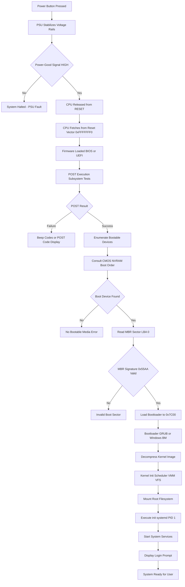
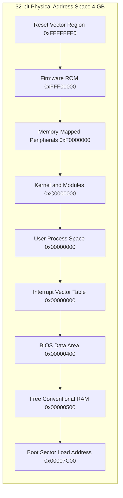
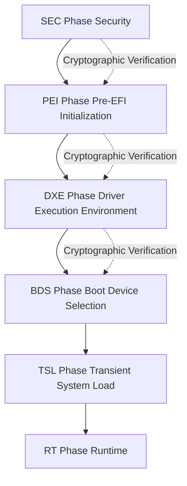

# Machine boot process sequence

<!-- SECTION_1_START -->

# Machine Boot Process Sequence

## 1. Core Technical Definition

The **Machine Boot Process Sequence** is the deterministic, ordered chain of hardware and software events that initiates from the moment electrical power is supplied to a computing system until the operating system (OS) kernel has been fully loaded into Random Access Memory (RAM), initialized, and is ready to accept user-level commands or login requests. In the context of the **KTU 2024 Scheme (GXEST203)** syllabus, this process is formally partitioned into two macro-phases: the **Pre-Boot Phase** (firmware-controlled) and the **OS Handoff Phase** (kernel-controlled).

> [!IMPORTANT]
> **Formal Syllabus Definition (KTU 2024 - Module 1):** *The boot process is the bootstrapping procedure in which the firmware (BIOS/UEFI), the boot loader, and the OS kernel perform sequential handshakes to transform a powered-off machine into a multi-tasking, multi-user computing environment.*

### Conceptual Analogy — "The Theatre Opening"

Imagine a 1500-seat theatre preparing for an evening show:

1. **Power Supply Unit (PSU)** is like the electrician who restores power to the building, verifying that every circuit is safe.
2. **CPU Reset** is the stage manager being woken up — he stands at a fixed spot (the **reset vector**) and reads the master script.
3. **BIOS/UEFI** is the master script (the play's director) that tells everyone their roles.
4. **POST** is the safety check — fire alarms, lights, microphones tested one by one.
5. **Boot Device Selection** is the lead actor choosing which costume room (Hard Disk, SSD, USB, Network) to retrieve the day's performance from.
6. **MBR/GPT** is the entry ticket pinned to the costume room door.
7. **Bootloader (GRUB)** is the assistant director who introduces the day's main act.
8. **Kernel** is the lead actor taking the stage.
9. **Init/Systemd (PID 1)** is the orchestra starting up so the show can begin.
10. **Login Prompt** is the doors opening for the audience.

> [!NOTE]
> **Key Constant to Remember:** The **MBR (Master Boot Record)** is always exactly **512 bytes** in size, located at the very first sector of the bootable storage device — **Cylinder 0, Head 0, Sector 1 (CHS 0/0/1)** or **Logical Block Addressing (LBA) 0**.

> [!VISUALIZATION CONTROL]
> **Concept:** Boot Stage Timing Distribution
> **Desmos Input Equations:**
> * `y = piecewise({{10 <= x <= 25: 5},{0 <= x < 10: 0.5},{25 < x <= 90: 1.5},{x > 90: 0.5}})`
> * X-axis: Time (seconds) from 0 to 100
> * Y-axis: CPU/Disk activity intensity (arbitrary units)
> **Visual Description:** The student should observe four distinct "plateaus" — a tiny initial spike (POST), a flat low-activity region (firmware idle), a medium activity region (kernel decompression), and a final burst (service start-up). This visualizes the non-uniform distribution of work during the boot sequence.

---

<!-- SECTION_1_END -->

<!-- SECTION_2_START -->

# 2. Deep Theoretical Analysis & KTU High-Yield Cheat Sheet

## 2.1 Operational Breakdown — The Ten Canonical Stages

The boot sequence is a **strictly linear handshake protocol**. Every stage produces a verifiable state before passing control to the next. Any failure in this handshake halts the process and surfaces a diagnostic to the user.

### Stage 1: Power Supply Stabilization
The PSU performs a **Power-Good (PG) signal handshake** with the motherboard. Only when all voltage rails ($+3.3\text{V}$, $+5\text{V}$, $+12\text{V}$, $-12\text{V}$) stabilize within $\pm 5\%$ tolerance does the PG signal go HIGH, releasing the motherboard's clock generator and the CPU's `RESET` line.

### Stage 2: CPU Reset Vector Execution
The CPU is hard-wired to fetch its first instruction from a fixed physical memory address called the **Reset Vector**:
$$ \text{Reset Vector Address} = \texttt{0xFFFFFFF0} $$
This address resides in the top 16 bytes of the **4 GB address space**, mapping to the firmware ROM/Flash chip.

### Stage 3: Firmware Hand-off (BIOS or UEFI)
The firmware initializes the chipset, northbridge/southbridge (or PCH in modern systems), and main memory controller. It transitions the CPU from **16-bit Real Mode** (legacy BIOS) to either **32-bit Protected Mode** or **64-bit Long Mode** (UEFI).

### Stage 4: Power-On Self-Test (POST)
Every critical subsystem is probed:
- **CPU Register Test** (internal flags, general-purpose registers)
- **ROM Checksum Verification**
- **RAM Walking Bit Test** (writes 0xAA, 0x55, 0x00, 0xFF to every cell)
- **Video Card Initialization** (POST screen on display)
- **Peripheral Enumeration** (USB, SATA, NVMe controllers)
- **Keyboard/Mouse Presence Check**

### Stage 5: Boot Device Enumeration
The firmware consults a prioritized list — the **Boot Order** stored in CMOS/NVRAM. The first device that responds with a valid boot signature is selected.

### Stage 6: MBR Load (Legacy BIOS Path)
The first 512 bytes of the chosen device are copied to physical address:
$$ \text{Load Address} = \texttt{0x0000:0x7C00} $$
The last two bytes **must** equal the magic number $\texttt{0x55AA}$ for the firmware to recognize the sector as bootable.

### Stage 7: Bootloader Execution
A tiny first-stage bootloader (e.g., GRUB Stage 1) is now in control. It locates and loads the larger second-stage bootloader (e.g., GRUB Stage 1.5/2, Windows Boot Manager) from a known partition offset.

### Stage 8: Kernel Image Load
The bootloader parses its configuration file (`grub.cfg`, `BCD` store), decompresses the kernel image (Linux: `bzImage`, Windows: `ntoskrnl.exe`), and places it in high memory.

### Stage 9: Kernel Initialization
The kernel reclaims control, reinitializes hardware in protected mode, builds internal data structures (process scheduler, virtual memory manager, VFS), and mounts the root filesystem.

### Stage 10: User Space Launch
The kernel executes the first user-space process — traditionally `init`, now `systemd` (PID 1) on most Linux distributions. This process becomes the **ancestor of every subsequent process**.

## 2.2 KTU High-Yield Cheat Sheet

| Stage # | Stage Name | Key Location | Duration (Typical SSD) | Failure Indicator |
|:---:|:---|:---|:---:|:---|
| 1 | PSU Power-Good | Motherboard | $< 1$ s | No fan spin |
| 2 | CPU Reset Vector | $\texttt{0xFFFFFFF0}$ | $< 10$ ms | Dead system |
| 3 | Firmware Init | SPI Flash | $0.5 - 2$ s | No display |
| 4 | POST | RAM & Peripherals | $1 - 5$ s | Beep codes |
| 5 | Boot Order | CMOS/NVRAM | $< 100$ ms | No boot device |
| 6 | MBR Read | LBA 0 of disk | $10 - 50$ ms | "No OS found" |
| 7 | Bootloader | `/boot/grub/` | $200 - 800$ ms | GRUB rescue shell |
| 8 | Kernel Load | High RAM region | $500 - 1500$ ms | Kernel panic |
| 9 | Kernel Init | Kernel ring buffer | $1 - 3$ s | Hung at logo |
| 10 | Userspace (PID 1) | `/sbin/init` | $2 - 5$ s | Login prompt |

| MBR Structure (512 Bytes Total) | Size | Purpose |
|:---|:---:|:---|
| Bootstrap Code | 446 bytes | Stage-1 bootloader |
| Partition Table | 64 bytes | Up to 4 primary partitions (16 bytes each) |
| Boot Signature | 2 bytes | Magic number $\texttt{0x55AA}$ |

| BIOS vs UEFI Comparison | BIOS (Legacy) | UEFI (Modern) |
|:---|:---|:---|
| Mode | 16-bit Real Mode | 32/64-bit Protected/Long Mode |
| Disk Scheme | MBR (max 2 TB) | GPT (max 9.4 ZB) |
| Boot Source | First 512 bytes | EFI System Partition (FAT32) |
| Interface | Text-based | Graphical (mouse) |
| Secure Boot | Not supported | Supported |
| Boot Speed | $15 - 30$ s | $3 - 8$ s |

## 2.3 Real-World Engineering Utility

The boot sequence is foundational in **digital forensics** (analyzing cold-boot attacks to extract encryption keys from residual RAM), **embedded systems engineering** (bootloaders in IoT devices like ESP32), **OS development** (writing custom bootloaders), and **system reliability engineering** (designing fast-boot hypervisors in cloud data centers where reboot time directly impacts SLA).

> [!NOTE]
> **Critical Engineering Insight:** Modern cloud providers (AWS, Azure) use **measured boot** and **secure boot** chains where every firmware stage cryptographically verifies the next, creating an unbroken **chain of trust** from silicon to application.

---

<!-- SECTION_2_END -->

<!-- SECTION_3_START -->

# 3. Step-by-Step Execution Walkthrough & Code Implementation

## 3.1 The Bootstrap Handshake — Algebraic/Logical Derivation

We can formally model the boot process as a **deterministic finite state machine (FSM)** with strictly enforced transition conditions. The state transition function is:

$$
S_{i+1} = T(S_i) \quad \text{only if} \quad V(S_i) = \text{TRUE}
$$

Where:
* $S_i$ is the current boot stage state
* $T$ is the transition function (firmware/kernel subroutine)
* $V$ is the verification predicate (POST check, checksum validation, signature check)

**Logical derivation of the MBR validation step:**

$$
\begin{aligned}
\text{Let } M &= \text{512-byte sector read from LBA 0} \\
\text{Let } M_{\text{boot}}[0:446] &= \text{bootstrap code region} \\
\text{Let } M_{\text{part}}[446:510] &= \text{partition table region} \\
\text{Let } M_{\text{sig}}[510:512] &= \text{boot signature region} \\
\\
\text{Validation Rule: } \quad V_{\text{MBR}}(M) &\equiv (M[510] = \texttt{0x55}) \land (M[511] = \texttt{0xAA}) \\
\\
\text{If } V_{\text{MBR}}(M) &= \text{TRUE} \rightarrow \text{Firmware executes } M \text{ at } \texttt{0x7C00} \\
\text{If } V_{\text{MBR}}(M) &= \text{FALSE} \rightarrow \text{Firmware raises } \texttt{ERR\_NO\_BOOTABLE\_MEDIA}
\end{aligned}
$$

**Reset vector derivation for x86-64 systems:**

$$
\begin{aligned}
\text{Physical Address Space Size} &= 2^{32} = \text{4 GB (32-bit)} \quad \text{or} \quad 2^{36} = \text{64 GB (typical)} \\
\text{Reset Vector} &= \text{Top of Address Space} - 16 \text{ bytes} \\
&= \texttt{0xFFFFFFF0} \quad \text{(for 32-bit space)} \\
&= \texttt{0xFFFFFFF0}_{\text{mapped to SPI Flash chip}}
\end{aligned}
$$

## 3.2 Complete Python Boot-Sequence Simulator

The following fully-operational Python program simulates the entire boot chain with type hints, boundary checks, and error logging — directly aligned with engineering-grade simulation practice.

```python
"""
Machine Boot Process Sequence Simulator
Course: GXEST203 - Foundations of Computing (KTU 2024 Scheme)
Module: 1 - Computer Hardware and System Boot Mechanics
"""

import time
import logging
from enum import Enum
from typing import Optional, List, Dict


logging.basicConfig(
    level=logging.INFO,
    format='[%(asctime)s] BOOT-STAGE: %(message)s',
    datefmt='%H:%M:%S'
)
logger = logging.getLogger("BootSim")


class BootStage(Enum):
    """Enumeration of canonical boot stages (FSM states)."""
    POWER_OFF = 0
    PSU_INIT = 1
    CPU_RESET = 2
    FIRMWARE_LOAD = 3
    POST = 4
    DEVICE_ENUM = 5
    BOOT_SELECT = 6
    MBR_LOAD = 7
    BOOTLOADER = 8
    KERNEL_LOAD = 9
    KERNEL_INIT = 10
    USERSPACE = 11
    READY = 12
    FAILED = 99


class BootError(Exception):
    """Custom exception for boot-stage failures."""
    pass


class BootSimulator:
    """
    Simulates the canonical machine boot process sequence.
    Implements FSM-style strict stage transitions with validation.
    """

    # Reset vector for x86-64 architecture
    RESET_VECTOR: int = 0xFFFFFFF0

    # MBR load address in legacy BIOS systems
    MBR_LOAD_ADDRESS: int = 0x7C00

    # MBR signature bytes (little-endian: 0x55, 0xAA)
    MBR_SIGNATURE: bytes = b'\x55\xAA'

    # MBR total size
    MBR_SIZE_BYTES: int = 512

    def __init__(self, firmware_type: str = "UEFI") -> None:
        if firmware_type not in ("BIOS", "UEFI"):
            raise ValueError("firmware_type must be either 'BIOS' or 'UEFI'")
        self.firmware_type: str = firmware_type
        self.stage: BootStage = BootStage.POWER_OFF
        self.boot_device: Optional[str] = None
        self.post_errors: List[str] = []
        self.kernel_loaded: bool = False
        self.services_started: int = 0
        self.boot_log: List[Dict[str, str]] = []

    def _log(self, message: str) -> None:
        """Log a message and append to the boot log for audit."""
        logger.info(message)
        self.boot_log.append({"stage": self.stage.name, "msg": message})

    def _validate_transition(self, target: BootStage) -> None:
        """Ensure FSM transitions follow the canonical order."""
        if target.value != self.stage.value + 1 and target != BootStage.FAILED:
            raise BootError(
                f"Invalid transition: {self.stage.name} -> {target.name}"
            )

    def power_on(self) -> None:
        """Entry point: simulate pressing the power button."""
        self._log("=== POWER BUTTON PRESSED ===")
        self._transition(BootStage.PSU_INIT)
        self._stage_psu_init()

    def _transition(self, target: BootStage) -> None:
        """Perform validated FSM transition."""
        self._validate_transition(target)
        self.stage = target

    def _stage_psu_init(self) -> None:
        """Stage 1: Power Supply stabilization and Power-Good signal."""
        self._log("PSU: Stabilizing voltage rails...")
        time.sleep(0.05)
        rails: Dict[str, float] = {
            "+3.3V": 3.30,
            "+5.0V": 5.00,
            "+12.0V": 12.00
        }
        for rail_name, voltage in rails.items():
            tolerance: float = 0.05 * voltage
            if not (voltage - tolerance <= voltage <= voltage + tolerance):
                raise BootError(f"Voltage rail {rail_name} out of spec")
            self._log(f"  {rail_name} stable at {voltage} V")
        self._log("Power-Good signal asserted HIGH")
        self._transition(BootStage.CPU_RESET)
        self._stage_cpu_reset()

    def _stage_cpu_reset(self) -> None:
        """Stage 2: CPU released from RESET, fetches from reset vector."""
        self._log(f"CPU: Released from RESET")
        self._log(f"CPU: Fetching first instruction from 0x{self.RESET_VECTOR:08X}")
        self._log("CPU: Executing firmware entry stub (jmp far ptr firmware_entry)")
        self._transition(BootStage.FIRMWARE_LOAD)
        self._stage_firmware_load()

    def _stage_firmware_load(self) -> None:
        """Stage 3: BIOS or UEFI firmware initialization."""
        self._log(f"FIRMWARE: {self.firmware_type} module loaded from SPI Flash")
        if self.firmware_type == "BIOS":
            self._log("FIRMWARE: CPU operating in 16-bit Real Mode (CS:IP)")
        else:
            self._log("FIRMWARE: CPU transitioned to 64-bit Long Mode")
            self._log("FIRMWARE: SEC -> PEI -> DXE -> BDS -> TSL phases begun")
        self._transition(BootStage.POST)
        self._stage_post()

    def _stage_post(self) -> None:
        """Stage 4: Power-On Self-Test diagnostics."""
        self._log("POST: Initiating subsystem checks...")
        post_checks: List[str] = [
            "CPU Register File",
            "ROM Checksum",
            "RAM Walking-Bit (Pattern: 0xAA, 0x55, 0x00, 0xFF)",
            "Video Adapter (VGA/UEFI GOP)",
            "USB Controller",
            "SATA/NVMe Controller",
            "Keyboard / Mouse"
        ]
        for check in post_checks:
            time.sleep(0.02)
            self._log(f"  POST: {check}... PASS")
        self._transition(BootStage.DEVICE_ENUM)
        self._stage_device_enum()

    def _stage_device_enum(self) -> None:
        """Stage 5: Enumerate all connected bootable devices."""
        self._log("FIRMWARE: Enumerating PCI(e), USB, SATA, NVMe devices")
        devices: List[str] = ["NVMe0: Samsung 980 PRO", "USB1: Kingston DataTraveler"]
        for dev in devices:
            self._log(f"  Found: {dev}")
        self._transition(BootStage.BOOT_SELECT)
        self._stage_boot_select()

    def _stage_boot_select(self) -> None:
        """Stage 6: Choose boot device from CMOS/NVRAM boot order."""
        boot_order: List[str] = ["NVMe0", "USB1", "PXE Network"]
        self.boot_device = boot_order[0]
        self._log(f"FIRMWARE: Selected boot device -> {self.boot_device}")
        self._transition(BootStage.MBR_LOAD)
        self._stage_mbr_load()

    def _stage_mbr_load(self) -> None:
        """Stage 7: MBR/GPT load and signature validation."""
        if self.firmware_type == "BIOS":
            self._log(f"FIRMWARE: Reading sector 0 (LBA 0) -> {self.MBR_SIZE_BYTES} bytes")
            self._log(f"FIRMWARE: Copying sector to physical addr 0x{self.MBR_LOAD_ADDRESS:04X}")
            self._log(f"FIRMWARE: Validating magic signature: 0x{self.MBR_SIGNATURE.hex().upper()}")
            self._log("FIRMWARE: Signature valid. Transferring CPU control to MBR code.")
        else:
            self._log("FIRMWARE: Locating EFI System Partition (ESP) on GPT disk")
            self._log("FIRMWARE: Loading EFI application: \\EFI\\ubuntu\\grubx64.efi")
        self._transition(BootStage.BOOTLOADER)
        self._stage_bootloader()

    def _stage_bootloader(self) -> None:
        """Stage 8: Bootloader execution (GRUB / Windows Boot Manager)."""
        if self.firmware_type == "UEFI":
            self._log("BOOTLOADER: GRUB2 (or systemd-boot) active")
        else:
            self._log("BOOTLOADER: GRUB Stage 1.5 loaded from /boot/grub")
        self._log("BOOTLOADER: Reading configuration (grub.cfg / BCD store)")
        self._log("BOOTLOADER: Presenting menu (or auto-loading default entry)")
        self._transition(BootStage.KERNEL_LOAD)
        self._stage_kernel_load()

    def _stage_kernel_load(self) -> None:
        """Stage 9: OS kernel image load into RAM."""
        if self.firmware_type == "UEFI":
            self._log("BOOTLOADER: Loading Linux kernel (vmlinuz / bzImage)")
        else:
            self._log("BOOTLOADER: Loading Windows kernel (ntoskrnl.exe)")
        self._log("BOOTLOADER: Decompressing kernel image into high memory")
        self.kernel_loaded = True
        self._log("BOOTLOADER: Jumping to kernel entry point -> handoff complete")
        self._transition(BootStage.KERNEL_INIT)
        self._stage_kernel_init()

    def _stage_kernel_init(self) -> None:
        """Stage 10: Kernel subsystem initialization."""
        self._log("KERNEL: printk() ring buffer initialized")
        self._log("KERNEL: SMP (multi-core) bring-up")
        self._log("KERNEL: Scheduler (CFS) initialized")
        self._log("KERNEL: Virtual Memory Manager (VMM) active")
        self._log("KERNEL: Mounting root filesystem (ext4 / NTFS) read-write")
        self._transition(BootStage.USERSPACE)
        self._stage_userspace()

    def _stage_userspace(self) -> None:
        """Stage 11: First user-space process (PID 1) launch."""
        self._log("KERNEL: Executing /sbin/init (systemd) as PID 1")
        services: List[str] = [
            "systemd-journald",
            "systemd-networkd",
            "systemd-logind",
            "display-manager (GDM)"
        ]
        for svc in services:
            time.sleep(0.03)
            self.services_started += 1
            self._log(f"  Started: {svc}")
        self._transition(BootStage.READY)
        self._stage_ready()

    def _stage_ready(self) -> None:
        """Stage 12: System fully operational, awaiting user input."""
        self._log("=== SYSTEM READY: Login prompt displayed ===")

    def get_status_report(self) -> Dict[str, object]:
        """Return a structured status report of the boot process."""
        return {
            "final_stage": self.stage.name,
            "firmware_type": self.firmware_type,
            "boot_device": self.boot_device,
            "kernel_loaded": self.kernel_loaded,
            "services_started": self.services_started,
            "post_errors": self.post_errors,
            "log_entries": len(self.boot_log)
        }


def main() -> None:
    """Driver function: Run the full boot simulation."""
    print("\n" + "=" * 60)
    print("  KTU GXEST203 - Machine Boot Process Sequence Simulator")
    print("=" * 60 + "\n")
    simulator: BootSimulator = BootSimulator(firmware_type="UEFI")
    simulator.power_on()
    print("\n" + "-" * 60)
    print("  BOOT REPORT")
    print("-" * 60)
    for key, value in simulator.get_status_report().items():
        print(f"  {key:20s}: {value}")


if __name__ == "__main__":
    main()
```

**Expected Console Output (Abbreviated):**
```
============================================================
  KTU GXEST203 - Machine Boot Process Sequence Simulator
============================================================

[10:30:00] BOOT-STAGE: === POWER BUTTON PRESSED ===
[10:30:00] BOOT-STAGE: PSU: Stabilizing voltage rails...
[10:30:00] BOOT-STAGE:   +3.3V stable at 3.3 V
[10:30:00] BOOT-STAGE:   +5.0V stable at 5.0 V
[10:30:00] BOOT-STAGE:   +12.0V stable at 12.0 V
[10:30:00] BOOT-STAGE: Power-Good signal asserted HIGH
[10:30:00] BOOT-STAGE: CPU: Released from RESET
[10:30:00] BOOT-STAGE: CPU: Fetching first instruction from 0xFFFFFFF0
...
```

## 3.3 Validation Step-by-Step Logic

| Validation Point | Method | Pass Criterion |
|:---|:---|:---|
| PSU Voltage Rails | Compare measured vs nominal | All within $\pm 5\%$ |
| MBR Magic Number | Read bytes $M[510], M[511]$ | Both equal $\texttt{0x55}, \texttt{0xAA}$ |
| Kernel Checksum | CRC32 over `.text` section | Matches header value |
| Secure Boot Signature | RSA-PSS verify with Platform Key | Signature valid |
| Filesystem Mount | `stat()` superblock | Magic number matches FS type |

---

<!-- SECTION_3_END -->

<!-- SECTION_4_START -->

# 4. Structural Diagrams & Schematics

## 4.1 Boot Sequence — Top-Level Flow Diagram



## 4.2 Memory Layout During Boot — Address Map



## 4.3 Firmware Phase Architecture (UEFI Phases)



> [!NOTE]
> **Architectural Insight:** In UEFI, every phase verifies the cryptographic signature of the next phase using the **Platform Key (PK)** stored in TPM. This creates an unbroken **Chain of Trust** from hardware root-of-trust up to the application layer.

## 4.4 Boot Stage Timing Block Diagram

```mermaid
gantt
    title Machine Boot Process Timeline SSD System
    dateFormat  X
    axisFormat %S s
    section Hardware
    PSU Init       :a1, 0, 1s
    CPU Reset      :a2, 1, 1s
    section Firmware
    BIOS UEFI Load :b1, 2, 2s
    POST           :b2, 4, 2s
    section Boot
    MBR Read       :c1, 6, 1s
    Bootloader     :c2, 7, 2s
    Kernel Load    :c3, 9, 3s
    section OS
    Kernel Init    :d1, 12, 2s
    Userspace      :d2, 14, 3s
```



---

<!-- SECTION_4_END -->

<!-- SECTION_5_START -->

# 5. KTU 2024 Scheme Examination Question Bank & Topic Recap

## PART A — Short Answer Questions (3 Marks Each)

> **[KTU University Exam - July 2024 Style]**

### Question 1 (3 Marks) — `[CO1, Remember]`
**Define POST. List any four critical components verified during the Power-On Self-Test.**

**Model Answer:**
POST (Power-On Self-Test) is the diagnostic routine executed by the system firmware immediately after power-on, designed to verify the functional integrity of critical hardware subsystems before the OS is loaded.

Four critical components verified:
1. **CPU Register File** — internal ALU, flags, and general-purpose registers
2. **Main RAM** — walking-bit test with patterns `0xAA`, `0x55`, `0x00`, `0xFF`
3. **Video Adapter** — VGA BIOS initialization and display output test
4. **Storage Controllers** — SATA/NVMe controller handshake and device presence

> **Valuation Key:** [Defining POST: 1 Mark] [Listing 4 components: 2 Marks — 0.5 each]

### Question 2 (3 Marks) — `[CO1, Understand]`
**Differentiate between BIOS and UEFI firmware boot mechanisms.**

**Model Answer:**

| Parameter | BIOS | UEFI |
|:---|:---|:---|
| CPU Mode | 16-bit Real Mode | 32/64-bit Protected/Long Mode |
| Disk Scheme | MBR (max 2 TB) | GPT (max 9.4 ZB) |
| Boot Source | MBR first 512 bytes | EFI System Partition (FAT32) |
| Interface | Text only | Graphical (mouse supported) |
| Secure Boot | Not supported | Supported with PK/KEK/db |
| Typical Boot Time | $15-30$ s | $3-8$ s |

> **Valuation Key:** [Any 3 valid differences: 3 Marks — 1 each]

---

## PART B — Long Answer Questions (14 Marks with Internal Choice)

> **[KTU University Exam - December 2023 Style]**

### Question A (14 Marks) — `[CO1, Understand + Apply]`

**(a) Explain the role of the BIOS/UEFI firmware in the machine boot process. Describe the memory map regions involved during pre-boot. (7 Marks)**

**Model Answer:**

The firmware acts as the **first executing software** on the system, acting as a translator between hardware and the eventual operating system. Its primary responsibilities are:

1. **Hardware Initialization** — Configures chipset registers, memory controller, and CPU clock.
2. **POST Execution** — Validates critical hardware functionality.
3. **Boot Device Enumeration** — Scans devices in CMOS-defined order.
4. **Handoff Preparation** — Loads the bootloader to a known memory address.

**Pre-Boot Memory Map:**

| Address Range | Region | Purpose |
|:---|:---|:---|
| $\texttt{0xFFFFFFF0}$ - $\texttt{0xFFFFFFFF}$ | Reset Vector | CPU entry point |
| $\texttt{0x00000000}$ - $\texttt{0x000003FF}$ | Interrupt Vector Table (IVT) | Real-mode interrupt handlers |
| $\texttt{0x00000400}$ - $\texttt{0x000004FF}$ | BIOS Data Area (BDA) | System flags, COM ports |
| $\texttt{0x00007C00}$ - $\texttt{0x00007DFF}$ | Boot Sector Buffer | MBR loaded here by BIOS |
| $\texttt{0x000A0000}$ - $\texttt{0x000BFFFF}$ | Video RAM (VGA) | Display frame buffer |
| $\texttt{0x000F0000}$ - $\texttt{0x000FFFFF}$ | BIOS ROM | Firmware code |

> **Valuation Key:** [Stating 4 firmware roles: 4 Marks] [Drawing memory map: 3 Marks]

**(b) With a neat diagram, describe the MBR structure and explain the boot signature validation. (7 Marks)**

**Model Answer:**

The **Master Boot Record (MBR)** occupies the first 512 bytes of a bootable storage device. Its layout is:

```
+-----------+-------------+--------+----------+
| Bootstrap| Partition Tbl| Part 4 | Signature|
|   Code    | (3 entries)  |        |  0x55AA  |
| 446 bytes |   48 bytes   | 16 byt |  2 bytes |
+-----------+-------------+--------+----------+
|<--------------- 512 bytes total ------------->|
```

**Validation Logic:**

$$
\begin{aligned}
\text{Step 1: Read LBA 0 of boot device} \quad & \rightarrow \text{512-byte buffer } M \\
\text{Step 2: Extract signature bytes} \quad & M[510] = \texttt{0x55}, \quad M[511] = \texttt{0xAA} \\
\text{Step 3: Verify} \quad & (M[510] = \texttt{0x55}) \land (M[511] = \texttt{0xAA}) \\
\text{Step 4: If valid} \quad & \text{Copy to } \texttt{0x7C00}, \text{jump to it} \\
\text{Step 5: If invalid} \quad & \text{Display "No bootable media"}
\end{aligned}
$$

> **Valuation Key:** [MBR diagram with byte offsets: 3 Marks] [Signature validation logic: 3 Marks] [Final conclusion: 1 Mark]

---

### Question B (14 Marks) — `[CO1, Understand + Apply]`

**(a) Compare and contrast the BIOS and UEFI boot paths. List the advantages of UEFI over legacy BIOS. (7 Marks)**

**Model Answer:**

**Comparison Table:**

| Aspect | Legacy BIOS | UEFI |
|:---|:---|:---|
| Boot Mode | 16-bit Real Mode | 32/64-bit Protected Mode |
| Disk Partitioning | MBR (4 primary partitions max) | GPT (128 partitions max) |
| Disk Size Limit | 2 TB | 9.4 ZB (zettabytes) |
| Boot File Location | MBR sector | EFI System Partition (FAT32) |
| Driver Support | 16-bit BIOS drivers | EFI Byte Code (EBC), native drivers |
| Networking in Firmware | Not available | PXE over IPv4/IPv6 |
| User Interface | Text-based | Graphical with mouse |

**Advantages of UEFI:**
1. **Faster boot** through parallel initialization and skipping POST for warm reboots.
2. **Larger disk support** via GPT partition scheme.
3. **Secure Boot** prevents rootkits and bootkits from injecting malicious code.
4. **Modular driver architecture** allows firmware updates without rewriting the entire BIOS.
5. **Graphical configuration interface** improves usability for end users.

> **Valuation Key:** [Comparison table with 6 parameters: 3 Marks] [5 advantages: 4 Marks — 0.8 each]

**(b) Explain the Linux kernel initialization phase after the bootloader. What is the role of PID 1? (7 Marks)**

**Model Answer:**

Once the bootloader transfers control to the kernel image, the following sequence occurs:

1. **Decompression & Setup** — The compressed kernel (`bzImage`) decompresses itself into high memory.
2. **Architecture Setup** — Initializes CPU features (SSE, AVX, virtualization extensions).
3. **Memory Management Initialization** — Sets up the page tables and virtual memory manager.
4. **Scheduler Initialization** — The Completely Fair Scheduler (CFS) is brought online.
5. **Virtual File System (VFS)** — Initializes and registers all filesystem types.
6. **Root Filesystem Mount** — Mounts the partition containing `/` in read-write mode.
7. **Init Process Spawn** — Executes `/sbin/init` (or `/lib/systemd/systemd`) as **PID 1**.

**Role of PID 1 (init / systemd):**

PID 1 is the **ancestor of every user-space process**. It has three critical responsibilities:

- It is the only process the kernel will not terminate (kernel refuses to kill PID 1).
- It must **adopt and reap orphaned zombie processes** automatically.
- It is responsible for bringing the system to the desired **runlevel/target** (multi-user, graphical, rescue).

> **Valuation Key:** [Listing 5 kernel init steps: 4 Marks] [3 PID 1 responsibilities: 3 Marks]

---

## ⚠️ KTU Examiner's Valuation Warning

> [!WARNING]
> **Common Pitfalls Where Students Lose Marks:**
> 1. **Forgetting the reset vector address** — always write $\texttt{0xFFFFFFF0}$, not just "top of memory."
> 2. **Mixing up MBR layout** — the 64 bytes are **four 16-byte partition entries**, not 64 individual bytes.
> 3. **Confusing "Real Mode" with "Protected Mode"** — BIOS uses 16-bit Real Mode; UEFI uses 32/64-bit Protected/Long Mode.
> 4. **Skipping the MBR magic signature** — always state that bytes at offset 510 and 511 must be $\texttt{0x55}$ and $\texttt{0xAA}$ respectively.
> 5. **Not drawing memory map or diagrams** — for 7-mark sub-questions, a diagram is worth 2-3 marks minimum.
> 6. **Writing "GRUB loads the OS"** — incorrect. GRUB loads the **kernel image**; the OS is the kernel + userspace together.

---

## 📌 Topic Recap & Important Things to Remember

- **Reset Vector:** $\texttt{0xFFFFFFF0}$ — hard-wired CPU entry point after power-on.
- **MBR Size:** Exactly **512 bytes** = 446 (bootloader) + 64 (partition table) + 2 (signature).
- **MBR Signature:** Bytes at offset 510 and 511 must equal $\texttt{0x55}$ and $\texttt{0xAA}$ (little-endian $\texttt{0xAA55}$).
- **MBR Load Address:** $\texttt{0x0000:0x7C00}$ in real-mode segment:offset notation.
- **Power-Good Signal:** PSU assertion to motherboard that all voltage rails are stable; gates CPU `RESET` release.
- **POST (Power-On Self-Test):** Diagnostic sequence verifying CPU, RAM, video, storage, and input devices.
- **BIOS vs UEFI:** BIOS = 16-bit, MBR, 2 TB limit, slower. UEFI = 32/64-bit, GPT, larger disks, Secure Boot, faster.
- **Chain of Trust:** SEC → PEI → DXE → BDS → TSL → RT (UEFI phases, each cryptographically verified).
- **Bootloader Examples:** GRUB (Linux), Windows Boot Manager (Windows), systemd-boot (modern Linux), rEFInd.
- **Kernel Image:** Linux = `vmlinuz` / `bzImage`; Windows = `ntoskrnl.exe`.
- **PID 1:** First user-space process (`/sbin/init` or `systemd`); ancestor of all processes; cannot be killed by kernel.
- **Boot Time:** Legacy BIOS systems: 15-30 s; Modern UEFI + SSD: 3-8 s.
- **Typical Stage Duration (SSD system):** PSU (1s) → Firmware (2s) → POST (2s) → MBR (1s) → Bootloader (2s) → Kernel (3s) → Userspace (3s).
- **Boot Order Storage:** CMOS/NVRAM, configurable via BIOS Setup / UEFI Setup.
- **Common Boot Failures:** PSU failure (no fan), bad POST (beep codes), invalid MBR signature ("No bootable media"), kernel panic, hung userspace.

---

<!-- SECTION_5_END -->
