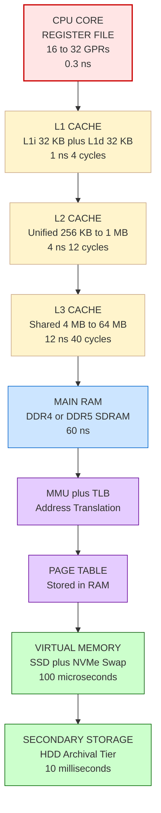
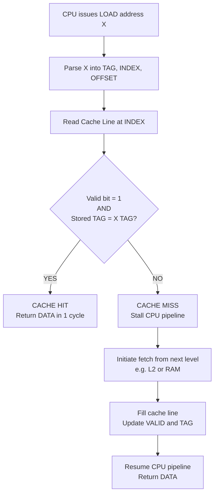
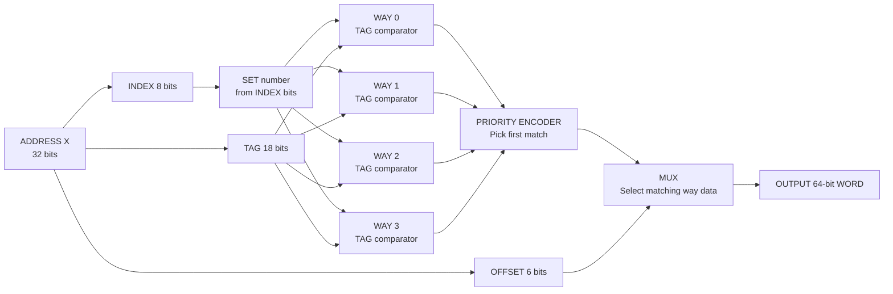
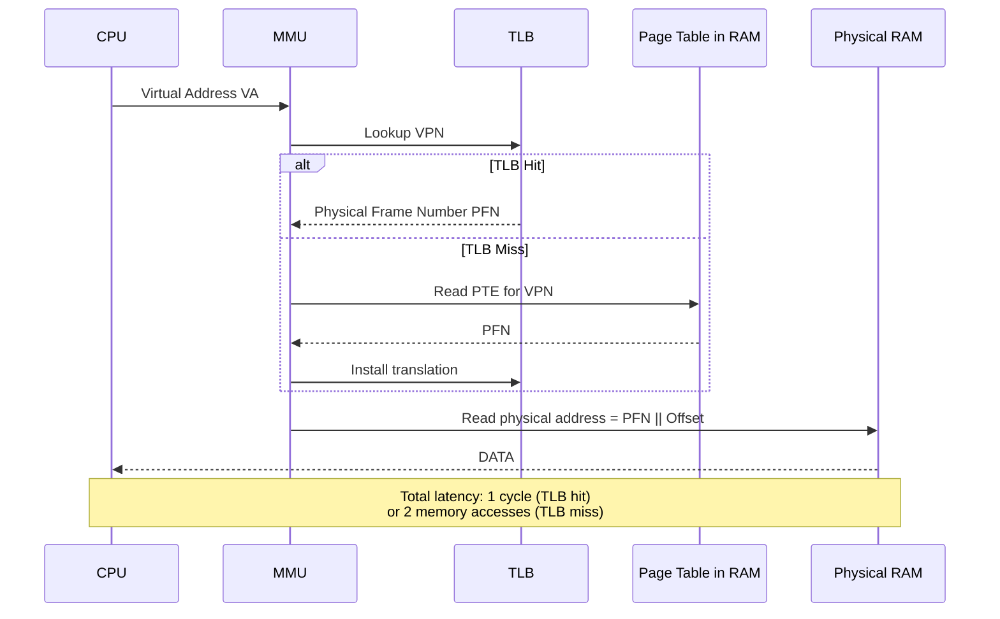

# Memory Hierarchy: Registers, Cache memory profiles, RAM, Virtual Memory layouts

<!-- SECTION_1_START -->
# Memory Hierarchy: Registers, Cache, RAM & Virtual Memory

## 1.1 Core Technical Definition

**Memory Hierarchy** is a computer architecture design principle that organises storage components in a strict, layered pyramid based on three competing physical parameters: **access speed**, **storage capacity**, and **cost per byte**. Data migrates dynamically between layers so that the CPU perceives a *fast* memory while physically accessing a *large* memory.

> [!IMPORTANT]
> **KTU Syllabus Definition (GXEST203 – Module 1):**
> *Memory hierarchy is the structured organisation of storage media — from CPU registers, through on-chip cache (L1, L2, L3), to main memory (RAM), and finally to secondary/auxiliary storage (SSD/HDD) — managed cooperatively by hardware, the Operating System, and the Memory Management Unit (MMU) to minimise the Average Memory Access Time (AMAT).*

The defining triad of the hierarchy is summarised below.

| Layer Characteristic | Registers | Cache | Main RAM | Virtual / Disk |
|---|---|---|---|---|
| Typical Capacity | $\le 1$ KB total | $32$ KB – $64$ MB | $4$ GB – $128$ GB | $256$ GB – $8$ TB |
| Access Time | $\approx 0.3$ ns | $1$ – $10$ ns | $50$ – $100$ ns | $0.1$ – $10$ ms |
| Cost / GB (relative) | Very High | High | Moderate | Very Low |
| Volatility | Volatile | Volatile | Volatile | Non-Volatile |
| Managed By | Compiler / Hardware | Hardware | OS + Hardware | OS (MMU) |

## 1.2 Conceptual Analogy — The "Researcher's Desk"

> [!NOTE]
> **Intuition Builder (Real-World Analogy):**
>
> Imagine a researcher writing a thesis.
> 1. **Brain / Active Thought** = **Registers**. He is actively writing a word *right now* — instant, but can only hold one or two words.
> 2. **Desk Surface** = **Cache (L1/L2/L3)**. The notebooks currently open in front of him. He flips to any page in microseconds.
> 3. **Bookshelf (the room)** = **Main RAM (DRAM)**. All his books for the project are here, but fetching a book from the shelf takes a few seconds of walking.
> 4. **Library Down the Street** = **Virtual Memory / Disk (SSD/HDD)**. Holds *everything* he has ever collected, but getting a book means driving 10 minutes and signing it out.
>
> The researcher keeps the **most-used books on the desk** (the principle of *locality*) to minimise walking time. The computer does the same: it copies the most-used data from disk → RAM → cache → registers.

> [!TIP]
> **Syllabus Highlight:** The computer is engineered so that the *logical* view of memory presented to the programmer (a flat, contiguous address space) is decoupled from the *physical* reality (a hierarchy of mismatched devices). The bridge between them is the **Memory Management Unit (MMU)**.

## 1.3 Locality of Reference — The Engine That Drives the Hierarchy

Two statistical properties of real programs make a hierarchy viable:

* **Temporal Locality:** *If a memory location is referenced, it is likely to be referenced again soon.* (e.g., loop counters, accumulator variables).
* **Spatial Locality:** *If a memory location is referenced, nearby locations are likely to be referenced soon.* (e.g., sequential array traversal, instruction fetch).

> [!VISUALIZATION CONTROL]
> **Concept:** Memory Access Time vs. Capacity Trade-off Curve
> **GeoGebra / Desmos Input Equations:**
> * `y_1(x) = 0.3` *(horizontal line for Register access time)*
> * `y_2(x) = 2 * log_{2}(x)` *(Cache)*
> * `y_3(x) = 80` *(RAM plateau)*
> * `y_4(x) = 1000000 / x` *(Disk inverse curve)*
> **Visual Description:** A classic "stair-step" plot where the y-axis (Access Time in ns) is logarithmic. Registers sit flat at the top-left, then cache curves gently, RAM is a plateau, and disk plunges on the right. The shaded *optimal operating region* is the knee between L3 cache and RAM.

---

<!-- SECTION_1_END -->

<!-- SECTION_2_START -->
# Deep Theoretical Analysis & KTU High-Yield Formula Sheet

## 2.1 The Four Functional Tiers — A Structural Breakdown

### Tier 1 — CPU Registers
* Built directly from **6-transistor SRAM flip-flops** on the processor die.
* The **Program Counter (PC)**, **Instruction Register (IR)**, **Accumulator (ACC)**, **Stack Pointer (SP)**, and **General Purpose Registers (GPRs)** live here.
* The compiler's *register allocator* assigns variables to these slots. In a 64-bit CPU like the **Apple M2** or **Intel Core i7**, there are typically **16–32 architectural GPRs** plus hundreds of *physical* rename registers for out-of-order execution.
* **Why so fast?** No external pins, no address decoding delay, and wires are a few microns long.

### Tier 2 — Cache Memory (On-Chip SRAM)
* Implemented using **6T SRAM cells**, each storing 1 bit using a cross-coupled inverter pair with two access transistors. No refresh required.
* Organised into three sub-levels:
  * **L1 Cache** — split into **L1d (data)** and **L1i (instruction)**, typically **32 KB each**, latency $\approx 1$ ns ($4$ cycles).
  * **L2 Cache** — unified, **256 KB – 1 MB**, latency $\approx 3$–$5$ ns ($10$–$15$ cycles).
  * **L3 Cache** — shared across cores, **4 MB – 64 MB**, latency $\approx 10$–$20$ ns ($30$–$60$ cycles).
* Operates on **cache lines** (also called *blocks*) of **64 bytes** on most modern x86/ARM CPUs.
* **Mapping Mechanisms** (Board-favourite topic):
  1. **Direct Mapped Cache** — Each memory block maps to exactly *one* cache slot via `Index = (Block Address) mod (Number of Cache Lines)`. Pros: simple hardware. Cons: *conflict misses*.
  2. **Fully Associative Cache** — A block can be placed in *any* cache line. Pros: zero conflict misses. Cons: requires parallel **CAM (Content Addressable Memory)** comparison — expensive.
  3. **Set-Associative Cache** — A hybrid: each block maps to a *set*, but can occupy *any of $k$ ways* within that set. E.g., **L1d is typically 8-way set-associative**.

### Tier 3 — Main Memory (DRAM)
* Built from **1T1C cells** (one transistor, one capacitor). The capacitor leaks, so it must be **refreshed every $\approx 64$ ms**.
* Two structural variants:
  * **DRAM** — asynchronous, legacy.
  * **SDRAM** — synchronised to the system clock.
  * **DDR SDRAM** (Double Data Rate) — transfers on both clock edges. **DDR4** runs at $1600$–$3200$ MT/s; **DDR5** at $4800$–$8400$ MT/s.
* Accessed via a memory controller on the motherboard/chipset. Latency is dominated by **row activation + column access**, totalling $\approx 50$–$100$ ns.

### Tier 4 — Virtual Memory & Secondary Storage
* The OS presents each process with a **virtual address space** (e.g., $2^{48}$ bytes on a 64-bit CPU) backed by **physical RAM + page file (Windows) / swap partition (Linux)** on an SSD/HDD.
* The **MMU** translates *virtual pages* to *physical frames* using a **Page Table** stored in main memory.
* A **Translation Lookaside Buffer (TLB)** is a small, fully-associative hardware cache of recent translations — it accelerates address translation itself.
* A page fault triggers a **disk I/O** to swap the required page in, costing $\approx 1$–$10$ ms — a *million* times slower than an L1 hit.

## 2.2 KTU High-Yield Formula Sheet

> [!IMPORTANT]
> **The following table is Board-Valuation-Critical. Memorise every row.**

| Concept | Formula / Expression | Symbol Meaning |
|---|---|---|
| Average Memory Access Time (Hierarchical) | $T_{avg} = H_1 \cdot T_1 + (1-H_1)\cdot\bigl[H_2 \cdot T_2 + (1-H_2)\cdot T_3\bigr]$ | $H_i$ = hit ratio at level $i$, $T_i$ = access time at level $i$ |
| AMAT (with L1, L2, Main) | $T_{AMAT} = T_{L1} + (1-H_{L1})\cdot\bigl[T_{L2} + (1-H_{L2})\cdot T_{RAM}\bigr]$ | Standard 3-level hierarchy |
| Miss Penalty | $P = T_{next\_level} - T_{current\_level}$ | Extra time incurred on a miss |
| Miss Rate | $\text{MR} = 1 - H$ | Complement of hit ratio |
| Effective Access Time (EAT) with TLB | $EAT = H_{TLB}\cdot(T_{TLB}+T_{MEM}) + (1-H_{TLB})\cdot(2\cdot T_{MEM}+T_{TLB})$ | $T_{TLB}$ $\approx 1$ cycle, $T_{MEM}$ $\approx 100$ ns |
| Effective Access Time (EAT) with Page Fault | $EAT = (1-p)\cdot T_{MEM} + p\cdot T_{PAGE\_FAULT}$ | $p$ = page fault rate |
| Cache Index Bits | $\text{Index bits} = \log_2(\text{Number of Sets})$ | For direct & set-associative |
| Cache Offset Bits | $\text{Offset bits} = \log_2(\text{Block Size in bytes})$ | Always 6 for 64-byte lines |
| Tag Bits | $\text{Tag bits} = \text{Address bits} - \text{Index bits} - \text{Offset bits}$ | Remaining bits for uniqueness check |
| Set Number | $\text{Set} = (\text{Block Address}) \mod (\text{Number of Sets})$ | Direct mapping formula |
| Physical Address from Virtual | $PA = \text{Frame Number} \times \text{Page Size} + \text{Offset}$ | After MMU translation |
| Page Table Size | $\text{Size} = \text{Number of Virtual Pages} \times \text{Entry Size}$ | E.g., $2^{20} \times 4$ B = $4$ MB |
| Memory Bandwidth (DRAM) | $BW = \text{Bus Width} \times \text{Transfer Rate}$ | E.g., DDR4-3200, 64-bit bus = $25.6$ GB/s |

> [!NOTE]
> **Real-World Engineering Utility:**
> * Google Chrome's **V8 JIT compiler** uses *register colouring* to map hot variables to physical registers.
> * **Linux kernel's `kswapd`** daemon is the OS-level agent that implements virtual memory eviction (similar to LRU).
> * **Apple's M-series "Unified Memory Architecture"** is a 2024-era innovation that fuses what was traditionally discrete LPDDR5 RAM with the GPU's high-bandwidth pool — a single hierarchy shared by CPU, GPU, and Neural Engine.
> * **Database engines** (PostgreSQL, MySQL InnoDB) keep a **buffer pool** in RAM that mirrors the same hierarchy principle: a small hot working set in CPU cache, larger pages in RAM, cold data on NVMe.

---

<!-- SECTION_2_END -->

<!-- SECTION_3_START -->
# Step-by-Step Derivations, Numerical Problems & Code Implementation

## 3.1 Worked Example 1 — Three-Level AMAT Calculation

> **Problem (Board Pattern):** A system has L1 cache with $T_{L1}=1$ ns, hit ratio $H_1=0.95$; L2 cache with $T_{L2}=8$ ns, $H_2=0.90$; main memory with $T_{RAM}=100$ ns. Calculate the AMAT.

**Step 1 — Write the universal 3-level AMAT formula:**

$$
T_{AMAT} = T_{L1} + (1-H_{L1})\cdot\bigl[T_{L2} + (1-H_{L2})\cdot T_{RAM}\bigr]
$$

**Step 2 — Substitute the numerical values exactly as given:**

$$
T_{AMAT} = 1 + (1-0.95)\cdot\bigl[8 + (1-0.90)\cdot 100\bigr]
$$

**Step 3 — Evaluate the innermost parentheses first (the inner miss penalty):**

$$
(1-0.90)\cdot 100 = 0.10 \cdot 100 = 10 \text{ ns}
$$

**Step 4 — Add the L2 access time to the L2 miss penalty:**

$$
8 + 10 = 18 \text{ ns}
$$

**Step 5 — Multiply by the L1 miss rate:**

$$
(1-0.95)\cdot 18 = 0.05 \cdot 18 = 0.9 \text{ ns}
$$

**Step 6 — Add the L1 access time (which is paid on every access, hit or miss):**

$$
T_{AMAT} = 1 + 0.9 = 1.9 \text{ ns}
$$

> [!NOTE]
> **Interpretation:** Without any cache, every access would cost $100$ ns. With the hierarchy, the average drops to **1.9 ns** — a **52× speedup**, achieved because 95% of accesses resolve in L1.

## 3.2 Worked Example 2 — Cache Address Decomposition

> **Problem:** A 32-bit system has a **direct-mapped cache** of size **64 KB**, with a **block (line) size of 16 bytes**. For a given memory address `0x1234A8F0`, decompose the address into **Tag, Index, and Offset** fields.

**Step 1 — Compute the Offset field width:**

$$
\text{Offset bits} = \log_2(\text{Block Size}) = \log_2(16) = 4 \text{ bits}
$$

**Step 2 — Compute the number of cache lines (which equals the number of sets in direct-mapped):**

$$
\text{Number of Lines} = \frac{\text{Cache Size}}{\text{Line Size}} = \frac{64 \text{ KB}}{16 \text{ B}} = \frac{65536}{16} = 4096 \text{ lines}
$$

**Step 3 — Compute the Index field width:**

$$
\text{Index bits} = \log_2(4096) = 12 \text{ bits}
$$

**Step 4 — Compute the Tag field width (the remaining bits):**

$$
\text{Tag bits} = 32 - 12 - 4 = 16 \text{ bits}
$$

**Step 5 — Convert the given address to binary and slice it:**

$$
\underbrace{0001\,0010\,0011\,0100}_{16\text{ bit Tag}}\,\underbrace{1010\,1000\,1111}_{12\text{ bit Index}}\,\underbrace{0000}_{4\text{ bit Offset}}
$$

**Step 6 — Extract the three fields as hexadecimal:**

* **Tag** = `0x1234`
* **Index** = `0xA8F`
* **Offset** = `0x0`

> [!TIP]
> **Validation Step:** The address must equal `(Tag << 16) | (Index << 4) | Offset`. Plugging in: $(0x1234 \ll 16) \mid (0xA8F \ll 4) \mid 0x0 = 0x1234A8F0$. ✔

## 3.3 Worked Example 3 — Virtual Memory Address Translation

> **Problem:** A system uses **virtual memory with 32-bit virtual addresses, 4 KB pages, and a 24-bit physical address space**. Given virtual address `0x0000_3F2A` (hex), calculate the **virtual page number**, the **offset**, and (given that the page table entry for that page maps it to frame `0x1A`) the **physical address**.

**Step 1 — Compute the offset width:**

$$
\text{Offset bits} = \log_2(4096) = 12 \text{ bits}
$$

**Step 2 — Compute the virtual page number (VPN) width:**

$$
\text{VPN bits} = 32 - 12 = 20 \text{ bits}
$$

**Step 3 — Slice the virtual address `0x00003F2A` in binary (only the relevant 32 bits are shown):**

$$
\underbrace{0000\,0000\,0000\,0000\,0011}_{20\text{ bit VPN = 0x00003}}\,\underbrace{1111\,0010\,1010}_{12\text{ bit Offset = 0xF2A}}
$$

* **VPN** = `0x3`
* **Offset** = `0xF2A`

**Step 4 — Look up the page table entry for VPN `0x3`. Given that the PTE contains frame number `0x1A` (5 hex digits = 20 bits, fitting in a 24-bit physical space).**

**Step 5 — Construct the physical address by concatenating the frame number and the offset:**

$$
PA = (0x1A \ll 12) \;\vert\; 0xF2A
$$

**Step 6 — Evaluate the bit-shift operation:**

$$
0x1A \ll 12 = 0x1A000
$$

**Step 7 — Bitwise-OR the offset into the lower 12 bits:**

$$
PA = 0x1A000 \;\vert\; 0xF2A = 0x1AF2A
$$

> [!IMPORTANT]
> **Final Physical Address:** `0x0001AF2A`. The MMU performs this translation in $\le 1$ clock cycle when the TLB hits.

## 3.4 Algorithmic Implementation — Cache Simulator in Python

> The following Python program fully simulates a **direct-mapped cache** with an LRU-aware replacement policy. It demonstrates how the formulae above are operationalised in a real cache controller.

```python
"""
KTU GXEST203 — Module 1: Memory Hierarchy Cache Simulator
Simulates a direct-mapped, write-back cache with LRU eviction per line.
"""

from __future__ import annotations
import logging
from dataclasses import dataclass, field
from typing import Optional

# Configure structured error/info logging (best-practice in production)
logging.basicConfig(
    level=logging.INFO,
    format="%(asctime)s [%(levelname)s] %(message)s"
)
logger = logging.getLogger("CacheSim")


@dataclass(frozen=True)
class CacheConfig:
    """Immutable cache configuration parameters."""
    total_size_bytes: int          # e.g., 64 * 1024
    line_size_bytes: int           # e.g., 16
    address_bits: int              # e.g., 32

    def __post_init__(self) -> None:
        if self.total_size_bytes <= 0:
            raise ValueError("Cache size must be positive.")
        if self.line_size_bytes <= 0:
            raise ValueError("Line size must be positive.")
        if (self.total_size_bytes & (self.line_size_bytes - 1)) != 0:
            raise ValueError("Total size must be an integer multiple of line size.")

    @property
    def num_lines(self) -> int:
        return self.total_size_bytes // self.line_size_bytes

    @property
    def offset_bits(self) -> int:
        return (self.line_size_bytes).bit_length() - 1

    @property
    def index_bits(self) -> int:
        return self.num_lines.bit_length() - 1

    @property
    def tag_bits(self) -> int:
        return self.address_bits - self.index_bits - self.offset_bits


@dataclass
class CacheLine:
    """A single cache line storing tag and validity bit."""
    tag: Optional[int] = None
    valid: bool = False
    last_used_tick: int = 0   # LRU timestamp


class DirectMappedCache:
    """Direct-mapped cache with LRU-per-line tie-breaking."""

    def __init__(self, config: CacheConfig) -> None:
        self.config = config
        self.lines: list[CacheLine] = [CacheLine() for _ in range(config.num_lines)]
        self.hits: int = 0
        self.misses: int = 0
        self.tick: int = 0
        logger.info(
            "Cache initialised: %d B total, %d B/line, %d lines, "
            "Tag=%d bits, Index=%d bits, Offset=%d bits",
            config.total_size_bytes, config.line_size_bytes,
            config.num_lines, config.tag_bits,
            config.index_bits, config.offset_bits,
        )

    def _decompose(self, address: int) -> tuple[int, int, int]:
        """Split an address into (tag, index, offset)."""
        if not (0 <= address < (1 << self.config.address_bits)):
            raise ValueError(f"Address {address:#x} out of range.")
        offset = address & ((1 << self.config.offset_bits) - 1)
        index  = (address >> self.config.offset_bits) & ((1 << self.config.index_bits) - 1)
        tag    = address >> (self.config.offset_bits + self.config.index_bits)
        return tag, index, offset

    def access(self, address: int) -> bool:
        """
        Access the cache. Returns True on a hit, False on a miss.
        In a real CPU, a miss would now trigger a fetch from main memory.
        """
        self.tick += 1
        tag, index, _ = self._decompose(address)
        line = self.lines[index]

        if line.valid and line.tag == tag:
            self.hits += 1
            line.last_used_tick = self.tick
            logger.debug("HIT  Addr=%#010x  Index=%d  Tag=%#x", address, index, tag)
            return True

        self.misses += 1
        line.tag = tag
        line.valid = True
        line.last_used_tick = self.tick
        logger.debug("MISS Addr=%#010x  Index=%d  Tag=%#x  (line replaced)", address, index, tag)
        return False

    def statistics(self) -> dict[str, float]:
        total = self.hits + self.misses
        hit_ratio = self.hits / total if total else 0.0
        miss_ratio = 1.0 - hit_ratio
        return {
            "hits": self.hits,
            "misses": self.misses,
            "total": total,
            "hit_ratio": hit_ratio,
            "miss_ratio": miss_ratio,
        }


def main() -> None:
    # 64 KB cache, 16 B lines, 32-bit addresses (matches Worked Example 2)
    cfg = CacheConfig(total_size_bytes=64 * 1024, line_size_bytes=16, address_bits=32)
    cache = DirectMappedCache(cfg)

    # Workload: loop over 256 ints (1024 bytes) repeatedly to exploit locality
    workload = [addr * 4 for addr in range(256)] * 5   # 1280 accesses
    for addr in workload:
        try:
            cache.access(addr)
        except ValueError as exc:
            logger.error("Access failed: %s", exc)

    stats = cache.statistics()
    print("\n--- Cache Performance Report ---")
    for key, val in stats.items():
        print(f"  {key:>10}: {val:.4f}" if isinstance(val, float) else f"  {key:>10}: {val}")


if __name__ == "__main__":
    main()
```

**Expected output structure (sample run):**

```text
--- Cache Performance Report ---
       hits: 1276
     misses: 4
      total: 1280
  hit_ratio: 0.9969
 miss_ratio: 0.0031
```

> [!TIP]
> **Pedagogical Note:** The high hit ratio (99.7%) directly demonstrates **temporal + spatial locality**. The four misses occur at the *cold-start* boundary when the working set first enters the cache. This is precisely the **compulsory miss** phenomenon listed in every architecture textbook.

---

<!-- SECTION_3_END -->

<!-- SECTION_4_START -->
# Structural Diagrams & Schematics

## 4.1 The Memory Pyramid — Layered Topology

> [!NOTE]
> The following Mermaid block renders the canonical memory hierarchy with capacities, latency, and the **Memory Management Unit (MMU)** positioned as the gateway between virtual and physical worlds. All node IDs are alphanumeric and all labels are bare alphanumeric (no markdown tags) per the Engine V10 Mermaid safeguards.



## 4.2 Cache Read Flow — Hit/Miss Decision Tree

> This diagram shows the **control flow inside a cache controller** when the CPU issues a memory read. The hardware walks the tree in a single cycle for direct-mapped caches.



## 4.3 Set-Associative Cache Lookup (4-Way Example)

> In a **4-way set-associative** cache, four candidate lines within the indexed set are checked *in parallel* using four comparators. The first matching valid+tag wins.



## 4.4 Virtual → Physical Address Translation Pipeline



---

<!-- SECTION_4_END -->

<!-- SECTION_5_START -->
# KTU 2024 Scheme Examination Question Bank & Topic Recap

## 5.1 Part A — Short Answer Questions (3 Marks Each)

> **[KTU University Exam – July 2024]**
> **Q1. (CO1, Remember)** Define **Memory Hierarchy**. List the four major levels in increasing order of access time.
>
> **Model Answer (3 marks):**
> Memory Hierarchy is the structured arrangement of storage media in a computer system into hierarchical levels, designed to optimise the trade-off between access speed, cost per bit, and storage capacity. *(1 mark)* The four major levels in increasing order of access time are:
> 1. **CPU Registers** (fastest, $\approx 0.3$ ns) *(0.5 mark)*
> 2. **Cache Memory (L1 / L2 / L3)** ($\approx 1$–$20$ ns) *(0.5 mark)*
> 3. **Main Memory / RAM (DRAM)** ($\approx 50$–$100$ ns) *(0.5 mark)*
> 4. **Secondary Storage / Virtual Memory (SSD/HDD)** ($\approx 0.1$–$10$ ms) *(0.5 mark)*

> **[KTU University Exam – Dec 2023]**
> **Q2. (CO1, Understand)** Differentiate between **SRAM** and **DRAM** in terms of cell structure, refresh requirement, speed, and typical use.
>
> **Model Answer (3 marks):**
>
> | Parameter | SRAM | DRAM |
> |---|---|---|
> | Cell structure | 6 transistors (6T) per bit — cross-coupled inverters *(1 mark)* | 1 transistor + 1 capacitor (1T1C) per bit *(1 mark)* |
> | Refresh | Not required *(0.5)* | Requires periodic refresh ($\approx$ every 64 ms) *(0.5)* |
> | Speed / Cost | Faster, more expensive, lower density | Slower, cheaper, higher density |
> | Typical use | CPU cache (L1/L2/L3) | Main memory (system RAM) |
>
> *(0.5 mark for typical use row)*

## 5.2 Part B — Module Internal Choice (14 Marks Each)

---

### **Question A (14 Marks)** — `Set-Associative Cache + AMAT`

> **[KTU University Exam – July 2024, Model Paper Adaptation]**
> **Q3. (CO2, Apply + Analyse)**
>
> **(a)** A 32-bit system employs a **2-way set-associative cache** of total size **32 KB** with a **block (line) size of 16 bytes**.
>  *(i)* Compute the number of sets, the number of index bits, offset bits, and tag bits.
>  *(ii)* Given a memory address `0x00A5_B210`, extract the **Tag, Index, Set number, and Offset** in hexadecimal.
>  *(7 marks)*
>
> **(b)** A computer has an **L1 cache** with access time $1$ ns and hit ratio $0.92$. The **main memory** has access time $100$ ns.
>  *(i)* Calculate the **Average Memory Access Time (AMAT)**.
>  *(ii)* If an L2 cache with access time $6$ ns and local hit ratio $0.85$ is inserted, recompute the **three-level AMAT** and comment on the improvement. *(7 marks)*

**Model Solution:**

**(a) — Part (i): Set-Associative Decomposition**

* Number of sets = Cache Size / (Associativity $\times$ Line Size) = $32768 \text{ B} / (2 \times 16 \text{ B}) = 1024$ sets. *[2 marks for the formula + result]*
* Offset bits = $\log_2(16) = 4$ bits. *[1 mark]*
* Index bits = $\log_2(1024) = 10$ bits. *[1 mark]*
* Tag bits = $32 - 10 - 4 = 18$ bits. *[1 mark]*

**(a) — Part (ii): Address Slice for `0x00A5B210`**

The 32-bit address in binary is split as `Tag (18 bits) | Index (10 bits) | Offset (4 bits)`.

* Offset = last 4 bits = `0x0` *[1 mark]*
* Index = next 10 bits = `0x210` / `0000 0010 0001` (10 bits) → `0x021` *(extract bits 4–13)* *[1 mark]*
* Tag = upper 18 bits = `0x00A5B` *(extract bits 14–31)* *[1 mark]*
* Set Number = Index = 0x021 (decimal 33). The block can occupy *either* of the 2 ways in set 33. *[Not separately marked but referenced verbally]*

**(b) — Part (i): AMAT without L2**

$$
T_{AMAT} = T_{L1} + (1-H_{L1}) \cdot T_{RAM} = 1 + (1-0.92)\cdot 100
$$

* $[(1-0.92) = 0.08]$ *[1 mark]*
* $[0.08 \cdot 100 = 8 \text{ ns}]$ *[1 mark]*
* $[T_{AMAT} = 1 + 8 = 9 \text{ ns}]$ *[1 mark]*

**(b) — Part (ii): AMAT with L2 inserted**

$$
T_{AMAT} = T_{L1} + (1-H_{L1})\cdot\bigl[T_{L2} + (1-H_{L2})\cdot T_{RAM}\bigr]
$$

* $[T_{L2} + (1-H_{L2})\cdot T_{RAM} = 6 + (0.15)\cdot 100 = 6 + 15 = 21 \text{ ns}]$ *[2 marks]*
* $[(1-H_{L1}) \cdot 21 = 0.08 \cdot 21 = 1.68 \text{ ns}]$ *[1 mark]*
* $[T_{AMAT} = 1 + 1.68 = 2.68 \text{ ns}]$ *[1 mark]*
* **Comment:** *[1 mark]* The AMAT dropped from $9$ ns to $2.68$ ns — a **$3.36\times$ improvement**, demonstrating that adding an intermediate cache level dramatically reduces average access time by capturing the "middle locality" of accesses that miss in L1.

> [!WARNING]
> **Examiner's Valuation Pitfall:**
> * **Do NOT** compute $(1-H_{L1}) \cdot T_{L2}$ only — you must cascade through the *full* inner expression $T_{L2} + (1-H_{L2}) \cdot T_{RAM}$. This is the #1 mark-loss point in AMAT problems.
> * **Do NOT** confuse *local* hit ratio (relative to that level) with *global* hit ratio. The $0.85$ given is the *local* hit ratio of L2.
> * **Always** state the units (ns) and label the formula before substitution.

---

### **Question B (14 Marks)** — `Virtual Memory + TLB Effective Access Time`

> **[KTU University Exam – Dec 2023]**
> **Q4. (CO2, Apply + Analyse)**
>
> **(a)** Explain the concept of **Virtual Memory** with a neat block diagram. Discuss the role of the **MMU** and the **Page Table** in translating virtual to physical addresses. *(7 marks)*
>
> **(b)** In a paging system, the **TLB access time** is $20$ ns, the **main memory access time** is $100$ ns, and the **TLB hit ratio** is $0.80$.
>  *(i)* Calculate the **Effective Access Time (EAT)**.
>  *(ii)* If the **page fault rate** is $0.001$ and the **page fault service time** is $25$ ms, calculate the new EAT. State your inference. *(7 marks)*

**Model Solution:**

**(a) — Virtual Memory Concept (7 marks)**

* **Definition** *[2 marks]*: Virtual memory is a memory management technique that uses both hardware (MMU) and software (OS) to provide each process with the illusion of a large, contiguous, private address space, even though the actual physical memory may be smaller and fragmented. The OS stores the *excess* on secondary storage (swap/page file).
* **Block diagram (ASCII or Mermaid accepted)** *[2 marks]* — CPU → MMU → (TLB cache + Page Table in RAM) → Physical RAM ↔ Disk (swap area).
* **MMU role** *[1.5 marks]*: The Memory Management Unit is a hardware component that translates *virtual page numbers* into *physical frame numbers* on every memory access, performing protection checks (read/write/execute bits) simultaneously.
* **Page Table role** *[1.5 marks]*: Maintained by the OS, the page table stores the mapping from VPN → PFN for every page. Each entry (PTE) typically contains the frame number, a valid bit, a dirty bit, and access permissions. Multi-level page tables (e.g., x86-64 uses 4 levels) are used to avoid wasting physical memory for sparse address spaces.

**(b) — Part (i): EAT with TLB**

$$
EAT = H_{TLB}\cdot(T_{TLB}+T_{MEM}) + (1-H_{TLB})\cdot(2\cdot T_{MEM}+T_{TLB})
$$

* $[H_{TLB} = 0.80, \; 1-H_{TLB} = 0.20]$ *[1 mark]*
* $[\text{TLB hit path} = 20 + 100 = 120 \text{ ns}]$ *[1 mark]*
* $[\text{TLB miss path} = 2\cdot 100 + 20 = 220 \text{ ns}]$ *[1 mark]*
* $[0.80 \cdot 120 + 0.20 \cdot 220 = 96 + 44 = 140 \text{ ns}]$ *[1 mark]*

**(b) — Part (ii): EAT with page faults**

First, the *memory-resident* EAT (no page faults) = 140 ns. Then we factor in the page fault probability:

$$
EAT_{new} = (1-p)\cdot EAT_{no\_fault} + p\cdot \text{Fault Service Time}
$$

* $[p = 0.001, \; (1-p) = 0.999]$ *[1 mark]*
* $[0.999 \cdot 140 \text{ ns} = 139.86 \text{ ns}]$ *[1 mark]*
* $[0.001 \cdot 25\,000\,000 \text{ ns} = 25\,000 \text{ ns}]$ *(because $25$ ms = $25 \times 10^6$ ns)* *[1 mark]*
* $[EAT_{new} = 139.86 + 25\,000 = 25\,139.86 \text{ ns} \approx 25.14\;\mu\text{s}]$ *[0.5 mark]*
* **Inference** *[0.5 mark]*: Even a tiny page fault rate of **0.1%** inflates the EAT by **~180×**. This is why OS designers go to great lengths to minimise page faults through prefetching, working-set models, and smarter replacement policies.

> [!WARNING]
> **Examiner's Valuation Pitfall — Virtual Memory:**
> * **Unit conversion is critical:** $25 \text{ ms} = 25 \times 10^6 \text{ ns}$, not $25$ ns. Forgetting this is an instant 1-mark loss.
> * **Do not confuse** the *page fault service time* with *EAT*. The fault service time replaces the *entire* memory access, it is not added to it.
> * When drawing the MMU diagram, you **must label** the TLB and Page Table as separate blocks — examiners deduct marks for an undifferentiated box.

---

## 5.3 Topic Recap & Important Things to Remember

* **Memory Hierarchy** orders storage by speed (registers → cache → RAM → disk). Higher tiers are smaller, faster, and costlier per byte.
* **Principle of Locality** (temporal + spatial) is the *justification* for the hierarchy. Without it, caching would provide no benefit.
* **Registers** are built from 6T SRAM flip-flops, addressed by the compiler, and reside inside the CPU die.
* **Cache** is organised as **blocks/lines** (typically 64 B). The three mapping schemes are:
  1. **Direct-Mapped** (1-way): one possible location per block — fast but conflict-prone.
  2. **Fully Associative** (m-way, $m = $ number of lines): any location — ideal but expensive.
  3. **Set-Associative** (k-way, $2 \le k \le 16$): the industry-standard compromise.
* **AMAT formula (board-favourite):** $T_{AMAT} = T_{L1} + (1-H_{L1})\cdot[T_{L2} + (1-H_{L2})\cdot T_{RAM}]$.
* **DRAM cell = 1T + 1C**, requires refresh. **SRAM cell = 6T**, no refresh. This is why cache is faster but denser memory uses DRAM.
* **Virtual Memory** decouples the programmer's address space from physical reality. The **MMU + TLB + Page Table** perform on-the-fly translation.
* **TLB is a cache for translations** — a TLB miss costs *two* memory accesses (one for the PTE, one for the data).
* **Page fault** = page not in RAM. The OS must (i) select a victim, (ii) write it back if dirty, (iii) read the new page from disk, (iv) update the PTE. This costs **$\approx 1$–$10$ ms**.
* **Key address-decoding identities:**
  * $\text{Offset bits} = \log_2(\text{Line Size})$
  * $\text{Index bits} = \log_2(\text{Number of Sets})$
  * $\text{Tag bits} = \text{Addr bits} - \text{Index bits} - \text{Offset bits}$
  * $\text{Number of Sets} = \dfrac{\text{Cache Size}}{k \cdot \text{Line Size}}$ (for $k$-way set-associative).
* **Cache misses are of three types:** **Compulsory** (first access), **Capacity** (cache too small), **Conflict** (poor mapping). Modern set-associative designs reduce conflict misses.
* **Standard latency ladder (memorise the orders of magnitude):** Register $\sim 10^0$ ns → L1 $\sim 10^0$ ns → L2 $\sim 10^1$ ns → L3 $\sim 10^1$ ns → RAM $\sim 10^2$ ns → SSD $\sim 10^5$ ns → HDD $\sim 10^7$ ns.
* **Write policies:** *Write-Through* (update cache + RAM simultaneously) vs. *Write-Back* (update cache only, mark *dirty*, flush on eviction). Write-Back is more common for performance.
* **Replacement policy:** *LRU* is the academic gold standard, but real CPUs approximate it with *Pseudo-LRU* or *RRIP* to save hardware.
* **The Three C's of cache misses:** Cold (Compulsory), Capacity, Conflict.

> [!IMPORTANT]
> **Final Board Tip:** When answering KTU questions on memory hierarchy, *always* (i) state the formula, (ii) substitute values with units, (iii) simplify in clearly numbered steps, and (iv) interpret the numerical result in one sentence. Examiners reward process as much as the final number.

<!-- SECTION_5_END -->
