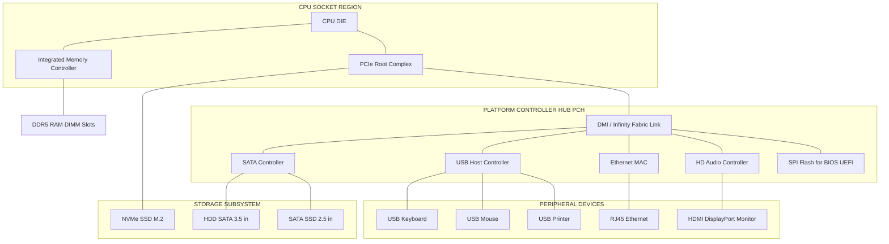
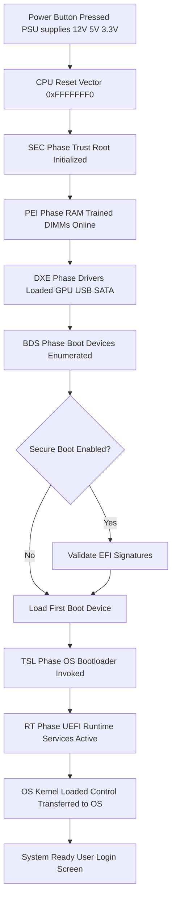
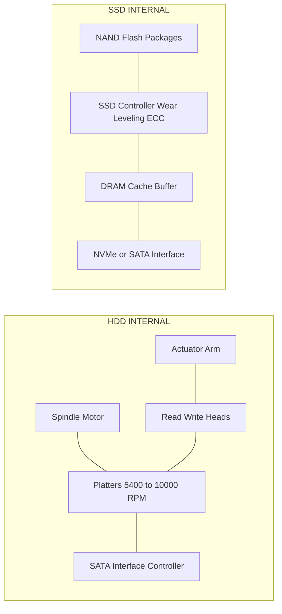
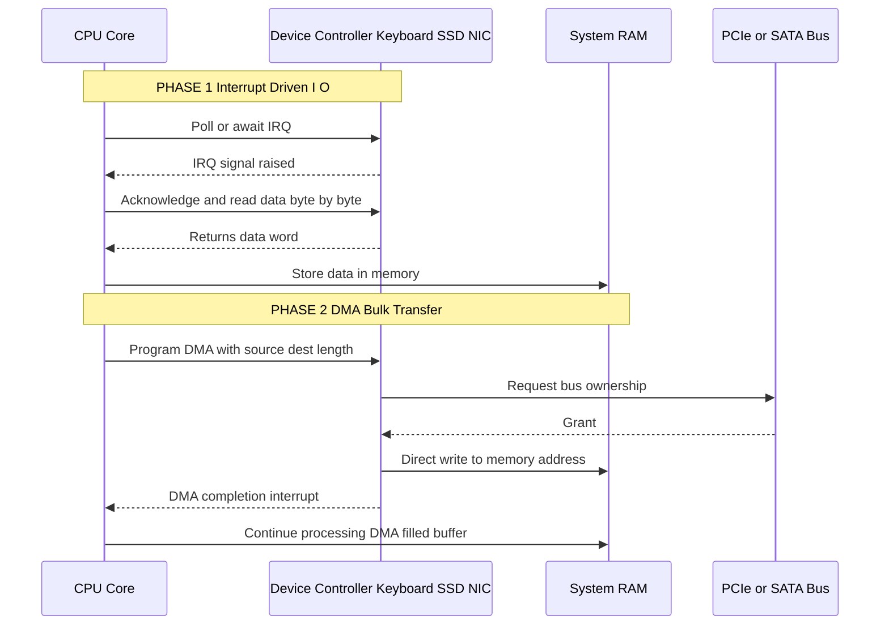
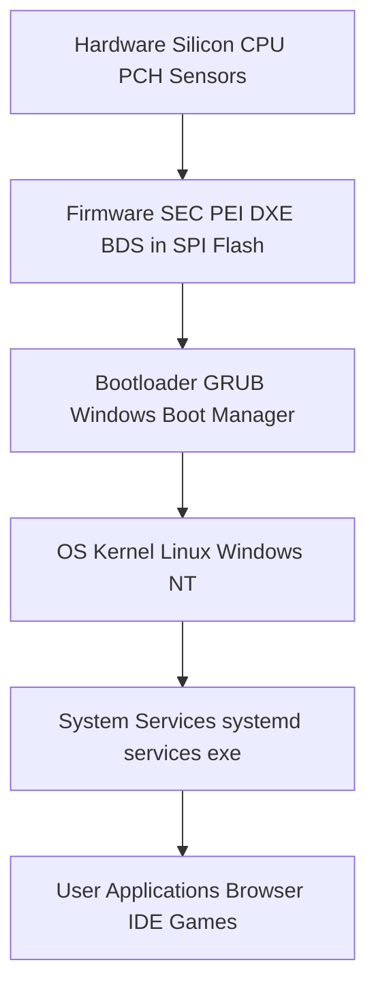
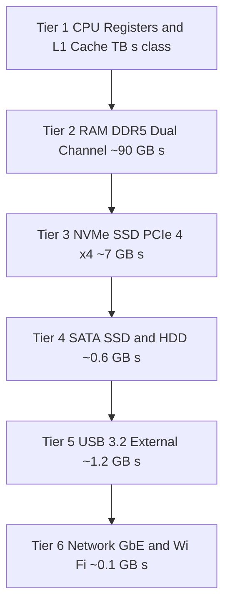

# Peripherals & Communication channels: Motherboard paths, I/O devices, storage interfaces (HDD, SSD), buses, firmware layers

<!-- SECTION_1_START -->
# Peripherals & Communication Channels — Hardware Communication Backbone

## 1.1 Core Technical Definition

> [!IMPORTANT]
> **KTU 2024 Syllabus Definition**
> *Peripherals and Communication Channels* refer to the complete hardware ecosystem that enables the **CPU**, **memory**, **storage**, and **external devices** to exchange data through a layered set of **motherboard paths** (traces, buses, and chipset links), **I/O controllers**, **storage interfaces** (HDD/SSD protocols like SATA and NVMe), and **firmware layers** (BIOS/UEFI) that initialize, configure, and arbitrate every transaction on the system.

In a KTU 2024 Scheme context, this topic sits at the intersection of *computer organization* and *practical hardware literacy* — a student must understand **how a keystroke travels from a USB keyboard all the way to the CPU**, and **how a stored file on an SSD reaches RAM** for processing.

### 1.2 Conceptual Analogy — The "City Highway System"

Imagine a metropolitan city:

- The **CPU** is the **City Hall** (the decision-making center).
- The **Motherboard** is the **road network** of the city.
- **Buses** are the **highways, arterial roads, and local streets** — wider highways (like the data bus) carry more vehicles per second.
- **I/O devices** (keyboard, mouse, printer) are **residents sending and receiving mail**.
- **Storage (HDD/SSD)** are the **warehouses** at the city outskirts.
- **Firmware (BIOS/UEFI)** is the **city's traffic control room** that opens gates, sets speed limits, and ensures only authorized traffic flows when the city "wakes up" (boots).

| City Analogy | Computer Hardware Equivalent |
|---|---|
| City Hall | CPU (Central Processing Unit) |
| Highway Network | Motherboard traces & bus lines |
| Traffic Control Room | BIOS / UEFI Firmware |
| Post Office | I/O Controller Hub (Southbridge/PCH) |
| Warehouses | HDD / SSD Storage Devices |
| Speed Limit Signs | Bus Protocols (PCIe, USB, SATA) |

### 1.3 The Four Pillars of This Topic

> [!NOTE]
> Every question from this module in KTU ESE revolves around **four pillars**. Master these, and you master the module:
> 1. **Motherboard Paths** — physical printed circuits that interconnect components.
> 2. **I/O Devices** — peripherals categorized by input/output/bidirectional function.
> 3. **Storage Interfaces** — HDD (magnetic, SATA) vs SSD (NAND flash, NVMe).
> 4. **Buses & Firmware** — the data highways and the boot-time control software.

### 1.4 Standard Metrics & Physical Constants

> [!IMPORTANT]
> **Key Engineering Constants to Memorise for KTU ESE:**
> - **PCIe Gen 4 lane bandwidth:** ≈ **2 GB/s per lane (bidirectional)**
> - **SATA III peak throughput:** **6 Gbps** (≈ **600 MB/s** after encoding overhead)
> - **USB 3.2 Gen 2x2 peak:** **20 Gbps**
> - **NVMe over PCIe 4.0 x4:** up to **~7,000 MB/s**
> - **Boot firmware standards:** **BIOS** (legacy, 16-bit) → **UEFI** (modern, 32/64-bit)
> - **HDD average seek time:** **3–15 ms**; **SSD random access:** **~0.1 ms**

> [!VISUALIZATION CONTROL]
> **Concept:** Block diagram of the computer system's communication hierarchy
> **GeoGebra / Desmos Input Equations:**
> * `x = 0, 10` — bounding box horizontal
> * `y = 0, 12` — bounding box vertical
> **Visual Description:** Plot a layered architecture: top layer = CPU, middle layer = chipset (PCH), bottom = peripherals. Use labeled rectangles to show how data flows *down* from the CPU through the chipset to devices and *up* from devices back to the CPU.
<!-- SECTION_1_END -->

<!-- SECTION_2_START -->
# Deep Theoretical Analysis & KTU High-Yield Formula Sheet

## 2.1 The Motherboard — Physical Communication Backbone

The **motherboard** (a.k.a. **mainboard** or **system board**) is a multi-layer **Printed Circuit Board (PCB)** made of fiberglass-epoxy laminates with **copper traces** etched onto internal layers. Modern boards have **4 to 8 layers** to manage signal integrity and electromagnetic interference.

### Key Motherboard Components

- **CPU Socket:** LGA (Intel) or AM5 (AMD) — holds the processor.
- **DIMM Slots:** For **DDR4/DDR5 RAM** modules.
- **Chipset:** Divided into **PCH (Platform Controller Hub)** on modern boards, replacing the older Northbridge/Southbridge split.
- **Power Delivery (VRM):** Voltage Regulator Modules convert 12V from PSU to 1.0–1.4V for the CPU.
- **BIOS/UEFI Chip:** A small **SPI flash ROM** (typically 16–32 MB) holding firmware.
- **Expansion Slots:** PCIe x1, x4, x8, x16 — physical lanes for add-in cards.
- **Storage Connectors:** SATA ports, M.2 slots (for NVMe SSDs).
- **I/O Panel:** USB, HDMI, Ethernet, Audio jacks.

### 2.2 Bus Architecture — The Data Highways

A **bus** is a shared communication pathway that transfers data between components. Every bus has three sub-channels:

| Sub-Channel | Function | Direction | Width (typical) |
|---|---|---|---|
| **Data Bus** | Carries actual payload bits | **Bidirectional** | 32 / 64 bits |
| **Address Bus** | Carries memory location of data | **Unidirectional** (CPU → Memory) | 32 / 64 bits |
| **Control Bus** | Carries timing & command signals (Read/Write, IRQ, Clock) | **Bidirectional** | 10–20 lines |

> [!IMPORTANT]
> **KTU Board Exam Focus Point:**
> If asked *"Why can't we just use one giant bus for everything?"* — the answer involves **bus arbitration**, **signal degradation at high frequency**, **electromagnetic interference (crosstalk)**, and **cost**. Hence modern designs use **point-to-point lanes** (PCIe) instead of shared parallel buses.

### 2.3 Types of Buses (Hierarchical View)

1. **System Bus (Front-Side Bus — FSB):** Connected CPU ↔ Northbridge (legacy). On modern boards, replaced by the **Intel DMI** or **AMD Infinity Fabric** link between CPU and PCH.
2. **Peripheral Buses:** PCIe, USB, SATA, Thunderbolt.
3. **I/O Buses:** For low-speed devices like PS/2, serial ports.

### 2.4 Detailed Bus Specifications (KTU High-Yield Table)

> [!NOTE]
> The following table is the **single most important reference** for any bus-related KTU question. Memorise the throughputs and use cases.

| Bus / Interface | Peak Bandwidth | Topology | Used By | Hot-Swappable? |
|---|---|---|---|---|
| **PCIe 3.0 x1** | **~1 GB/s** | Point-to-point | Network cards | No |
| **PCIe 4.0 x16** | **~32 GB/s** | Point-to-point | GPU, NVMe | No |
| **PCIe 5.0 x16** | **~64 GB/s** | Point-to-point | Next-gen GPU | No |
| **SATA III** | **6 Gbps / ~600 MB/s** | Point-to-point | HDD, 2.5" SSD | Yes (with AHCI) |
| **NVMe (PCIe 3.0 x4)** | **~3.5 GB/s** | Point-to-point | M.2 SSD | No (M.2 spec) |
| **NVMe (PCIe 4.0 x4)** | **~7 GB/s** | Point-to-point | M.2 SSD | No |
| **USB 3.2 Gen 1** | **5 Gbps** | Star (via hub) | Pen drives, externals | **Yes** |
| **USB 3.2 Gen 2** | **10 Gbps** | Star | SSDs, docking | **Yes** |
| **Thunderbolt 4** | **40 Gbps** | Daisy-chain | eGPU, displays | **Yes** |
| **I²C** | **400 kHz – 5 MHz** | Multi-drop | Embedded sensors | N/A |

### 2.5 I/O Devices — The Three Functional Classes

**I/O devices** are peripherals that allow the user or external world to interact with the computer.

1. **Input Devices:** Keyboard, Mouse, Scanner, Microphone, Webcam, Touchscreen.
2. **Output Devices:** Monitor, Printer, Speakers, LEDs, Plotter.
3. **Storage / Hybrid Devices:** HDD, SSD, Optical Drive, USB Flash — these are technically I/O but classified separately because they retain data.

> [!IMPORTANT]
> **Communication Modes for I/O Devices:**
> - **Polling (Programmed I/O):** CPU repeatedly checks device status register. Wastes CPU cycles.
> - **Interrupt-Driven I/O:** Device sends an **IRQ (Interrupt Request)** to CPU. CPU handles it via **ISR (Interrupt Service Routine)**. Far more efficient.
> - **DMA (Direct Memory Access):** Device transfers data *directly* to/from RAM, bypassing the CPU. Used by HDDs, SSDs, and NICs for bulk transfers.

### 2.6 Storage Interfaces — HDD vs SSD Deep Dive

#### 2.6.1 HDD (Hard Disk Drive) — Magnetic Storage

- **Mechanism:** Spinning **platters** (5400 / 7200 / 10,000 RPM) coated with magnetic material. A **read/write head** on a moving actuator arm magnetises or reads tiny regions.
- **Interface:** Historically **PATA/IDE**, now **SATA** (Serial ATA).
- **Geometry:** Tracks → Sectors (typically 512 B or 4 Kn) → Clusters → Partitions.
- **Latency components:** *Seek time* (head movement) + *Rotational latency* (half a rotation) + *Transfer time*.
- **Command Protocol:** **ATA / AHCI** (Advanced Host Controller Interface).

#### 2.6.2 SSD (Solid State Drive) — Flash Storage

- **Mechanism:** **NAND flash memory** cells (floating-gate transistors). No moving parts.
- **Cell Types:** **SLC** (1 bit/cell, fastest, most durable), **MLC** (2 bits), **TLC** (3 bits, consumer), **QLC** (4 bits, high density).
- **Interfaces:** **SATA** (using AHCI protocol, bottlenecked at ~600 MB/s) or **NVMe** (over PCIe, uses NVM Express protocol for low-latency parallelism).
- **Form Factors:** **2.5"** (SATA), **M.2** (SATA or NVMe), **U.2** (enterprise NVMe).
- **Wear-Leveling:** SSD controller spreads writes across all cells to extend lifespan (measured in **TBW — Terabytes Written**).

#### 2.6.3 HDD vs SSD Comparison (Critical for KTU Questions)

| Parameter | HDD | SSD (SATA) | SSD (NVMe) |
|---|---|---|---|
| **Speed (Sequential Read)** | ~120 MB/s | ~550 MB/s | ~3,500–7,000 MB/s |
| **Random IOPS (4K)** | ~100 | ~50,000 | ~500,000+ |
| **Latency** | 3–15 ms | ~0.1 ms | ~0.05 ms |
| **Moving Parts** | Yes | No | No |
| **Power Use** | 6–8 W active | 2–3 W | 3–5 W |
| **Durability (Shock)** | Poor | Excellent | Excellent |
| **Cost per GB (2024)** | ₹3–5 | ₹7–10 | ₹10–15 |
| **Protocol** | ATA / AHCI | ATA / AHCI | **NVM Express** |

### 2.7 Firmware Layers — BIOS, UEFI, and the Boot Process

**Firmware** is software *permanently stored in non-volatile memory* (ROM/Flash) on the motherboard. It runs *before* the OS loads.

#### 2.7.1 BIOS (Basic Input/Output System) — Legacy

- 16-bit, runs in **Real Mode** (1 MB address space).
- Stored in a **ROM/EPROM/Flash** chip.
- Uses **MBR (Master Boot Record)** partitioning → max **2 TB** disk support.
- Boot sequence: **POST → MBR → Bootloader → OS**.

#### 2.7.2 UEFI (Unified Extensible Firmware Interface) — Modern

- 32-bit or 64-bit, runs in **Protected Mode** or **Long Mode**.
- Stored in **SPI flash** (16–32 MB).
- Uses **GPT (GUID Partition Table)** → supports disks **>2 TB** (up to 9.4 ZB).
- Features: **Secure Boot**, **Fast Boot**, **Network Boot (PXE)**, **Mouse-driven GUI**, **Modular drivers**.
- Boot sequence: **SEC → PEI → DXE → BDS → TSL → RT → AL** (UEFI Phases).

> [!NOTE]
> **KTU Memory Trick:** *BIOS* is **B**asic, **B**lind to large disks. *UEFI* is **U**nified, **U**nlimited.

#### 2.7.3 POST (Power-On Self-Test)

A diagnostic routine run by firmware *every* time the PC powers on. Checks:
- CPU registers and basic math
- RAM integrity (count & write/read test)
- GPU initialization (via PCIe)
- Storage device detection
- USB enumeration
- Keyboard, mouse presence

**Beep codes** (legacy BIOS) communicate errors when the GPU isn't working — e.g., 1 long + 2 short = GPU failure.

### 2.8 Engineering Real-World Utility

> [!IMPORTANT]
> **Where this knowledge is applied in industry:**
> - **Datacenter Engineering:** Choosing between SATA SSD, NVMe SSD, or HDD for tiered storage (hot/warm/cold).
> - **Embedded Systems Design:** Selecting I²C, SPI, or UART for sensor communication.
> - **Cybersecurity:** Configuring Secure Boot to prevent rootkits.
> - **Performance Tuning:** Enabling AHCI mode in BIOS for SSDs (not IDE mode!).
> - **Repair & Diagnostics:** Reading beep codes and POST error messages.

### 2.9 The KTU Formula Sheet (Communication Calculations)

> [!NOTE]
> For bandwidth/latency problems, the following relationships are essential. Notice how **vertical bars** for absolute value are written as `\vert` or `\mid` to preserve markdown table integrity.

| Concept | Formula | Units | Notes |
|---|---|---|---|
| **Bus Bandwidth** | $BW = \dfrac{Bus\_Width \times Frequency}{N}$ | MB/s or GB/s | $N = 8$ for bytes |
| **Effective SATA III Throughput** | $T_{eff} = \dfrac{6\,\text{Gbps}}{10} = 600\,\text{MB/s}$ | MB/s | 8b/10b encoding overhead |
| **NVMe Bandwidth (PCIe 4.0 x4)** | $BW = 4 \times \approx 2\,\text{GB/s} = 7\,\text{GB/s}$ | GB/s | Per-direction |
| **HDD Average Access Time** | $T_{access} = T_{seek} + T_{rot} + T_{transfer}$ | ms | $T_{rot} = \dfrac{30{,}000}{RPM \times 2}$ ms |
| **Rotational Latency (7200 RPM)** | $T_{rot} = \dfrac{30{,}000}{7200 \times 2} = 4.17\,\text{ms}$ | ms | Half a rotation |
| **Addressable Memory** | $Memory_{max} = 2^{address\_bits}$ | Bytes | 32-bit = 4 GB |
| **Storage Capacity** | $C = Heads \times Cylinders \times Sectors\_per\_Track \times 512$ | Bytes | Legacy CHS geometry |
| **I/O Throughput (DMA)** | $T_{DMA} = \dfrac{\text{Data Size}}{\text{Bus Bandwidth}}$ | seconds | Bypasses CPU |
| **Cost per GB** | $C_{GB} = \dfrac{\text{Total Cost}}{\text{Storage in GB}}$ | ₹/GB | Procurement metric |
| **Interrupt Latency Bound** | $L_{max} = \sum_{i=1}^{n} \vert t_{ISR_i} \vert$ | µs | Critical for RTOS |
| **PCIe Lanes Required** | $L = \dfrac{\text{Target BW}}{\text{Per-Lane BW} \times \text{Gen Factor}}$ | lanes | e.g., x4 for NVMe |
| **Boot Time** | $T_{boot} = T_{POST} + T_{FW} + T_{OS\_load}$ | seconds | Fast Boot can skip POST |
| **Moore-related Density** | $D_{cells} = 2^{n} \times A_{cell}$ | cells/mm² | NAND scaling |
| **Power Draw (HDD)** | $P = P_{spinup} \cdot t_{spinup} + P_{idle} \cdot (T - t_{spinup})$ | Wh | Energy-aware storage |
| **IOPS Estimation** | $IOPS = \dfrac{1}{T_{access}}$ | ops/sec | Random 4K I/O |

### 2.10 Why the CPU–PCH Split Matters (Modern Motherboard Topology)

In legacy boards, the **Northbridge** connected to the CPU directly (FSB, RAM, PCIe) and the **Southbridge** handled I/O. In modern systems (post-2010), the **Northbridge's memory controller** and **PCIe root complex** moved *into* the CPU die, leaving only the **PCH (Platform Controller Hub)** as the secondary chip. The PCH connects via a high-speed proprietary link:

- **Intel:** **DMI 4.0** (≈ 128 Gbps effective).
- **AMD:** **Infinity Fabric** (scalable bandwidth).

> [!WARNING]
> **Common Student Mistake:** Confusing the chipset with the CPU. The chipset (PCH) does *not* execute instructions — it is a **traffic router**, not a brain.
<!-- SECTION_2_END -->

<!-- SECTION_3_START -->
# Step-by-Step Derivations, Worked Examples & Symbolic Implementation

## 3.1 Worked Derivation #1: Calculating Effective Bus Bandwidth

**Problem:** A modern motherboard uses **DDR5-5600 RAM** with a **64-bit data bus** in *dual-channel* mode. Calculate the theoretical peak bandwidth.

**Step 1 — Identify the parameters:**

$$
\begin{aligned}
\text{Bus Width (per channel)} &= 64 \text{ bits} = 8 \text{ bytes} \\
\text{Channels} &= 2 \text{ (dual-channel)} \\
\text{Data Rate} &= 5600 \text{ MT/s (Mega-Transfers per second)}
\end{aligned}
$$

**Step 2 — Apply the bandwidth formula:**

$$
\begin{aligned}
\text{Total Width} &= 2 \times 64 = 128 \text{ bits} = 16 \text{ bytes} \\
\text{Bandwidth} &= \text{Total Width} \times \text{Data Rate} \\
\text{Bandwidth} &= 16 \text{ bytes} \times 5600 \times 10^{6} \text{ transfers/sec} \\
\text{Bandwidth} &= 89.6 \times 10^{9} \text{ bytes/sec} \\
\text{Bandwidth} &= 89.6 \text{ GB/s}
\end{aligned}
$$

> [!IMPORTANT]
> **Valuation Key (KTU):** [Writing formula: 2 Marks] [Substituting values: 2 Marks] [Final unit conversion to GB/s: 1 Mark]

**Step 3 — Engineering context:** This ~89.6 GB/s feeds the CPU's L3 cache and cores, dwarfing SATA (0.6 GB/s) by a factor of ~150×.

---

## 3.2 Worked Derivation #2: HDD Average Access Time

**Problem:** An HDD spins at **7200 RPM** with an average **seek time of 8 ms**. Calculate its average access time (ignore transfer time for simplicity).

**Step 1 — Compute rotational latency:**

$$
\begin{aligned}
T_{rot} &= \frac{60{,}000 \text{ ms/min}}{2 \times 7200 \text{ RPM}} \\
T_{rot} &= \frac{60{,}000}{14{,}400} \\
T_{rot} &= 4.17 \text{ ms}
\end{aligned}
$$

**Step 2 — Sum seek + rotational:**

$$
\begin{aligned}
T_{access} &= T_{seek} + T_{rot} \\
T_{access} &= 8 + 4.17 \\
T_{access} &= 12.17 \text{ ms}
\end{aligned}
$$

**Step 3 — IOPS estimate:**

$$
\begin{aligned}
IOPS &= \frac{1}{T_{access}} = \frac{1}{0.01217} \approx 82 \text{ IOPS}
\end{aligned}
$$

> [!NOTE]
> Compare this with a typical NVMe SSD at **~500,000 IOPS** — that's a **6,000×** improvement, which is why SSDs revolutionized database performance.

---

## 3.3 Worked Derivation #3: Addressable Memory with Address Bus Width

**Problem:** A CPU has a **36-bit address bus**. What is the maximum physical memory it can address?

**Step-by-step:**

$$
\begin{aligned}
M_{max} &= 2^{36} \text{ bytes} \\
2^{10} &= 1024 \\
2^{20} &= 1{,}048{,}576 \\
2^{30} &= 1{,}073{,}741{,}824 \\
2^{36} &= 2^{30} \times 2^{6} = 1{,}073{,}741{,}824 \times 64 \\
M_{max} &= 68{,}719{,}476{,}736 \text{ bytes} = 64 \text{ GiB}
\end{aligned}
$$

> [!IMPORTANT]
> **Real-world tie-in:** Intel's x86 PAE (Physical Address Extension) uses 36-bit addressing to break the legacy 4 GB limit. Modern 64-bit CPUs use 48-bit virtual addresses.

---

## 3.4 Worked Derivation #4: SATA Encoding Overhead

**Problem:** SATA III is marketed as 6 Gbps, but actual data throughput is ~600 MB/s. Explain the discrepancy.

**Step-by-step:**

SATA uses **8b/10b encoding**, meaning every 8 bits of data consume 10 bits on the wire (2 bits are encoding overhead for DC balance and clock recovery).

$$
\begin{aligned}
\text{Encoded Rate} &= \frac{6 \text{ Gbps}}{10} \times 8 = 4.8 \text{ Gbps of data} \\
\text{Real Throughput} &= \frac{4.8 \text{ Gbps}}{8} = 0.6 \text{ GB/s} = 600 \text{ MB/s}
\end{aligned}
$$

> [!WARNING]
> **Common Mistake:** Confusing **Gbps (Gigabits per second)** with **GB/s (Gigabytes per second)**. The factor of 8 catches many students. Also, SATA uses 8b/10b while **NVMe (PCIe)** uses **128b/130b** — far more efficient.

---

## 3.5 Symbolic Python Implementation — Hardware Topology Analyzer

```python
"""
hardware_topology.py
KTU GXEST203 - Module 1 Demonstration
Simulates a basic storage/bus decision engine for a computer system.
"""

from dataclasses import dataclass
from enum import Enum
from typing import Literal


class StorageType(Enum):
    """Enumerates supported storage interfaces."""
    HDD_SATA = "HDD_SATA"
    SSD_SATA = "SSD_SATA"
    SSD_NVME_GEN3 = "NVMe_PCIe3"
    SSD_NVME_GEN4 = "NVMe_PCIe4"


@dataclass(frozen=True)
class BusSpec:
    """Immutable record of a bus's physical characteristics."""
    name: str
    peak_bw_gbps: float       # Peak in Gigabits per second
    encoding_efficiency: float # Fraction of bits carrying payload (e.g., 8/10 = 0.8)
    lanes: int                # PCIe-style lane count (1 for SATA/USB)


def effective_bandwidth_mbps(bus: BusSpec) -> float:
    """
    Compute the effective payload bandwidth in MB/s.

    Formula:  BW_MBps = (peak_bw_gbps * encoding_efficiency * 1000) / 8
    """
    if bus.peak_bw_gbps <= 0:
        raise ValueError(f"Invalid bandwidth: {bus.peak_bw_gbps}")
    if not 0 < bus.encoding_efficiency <= 1:
        raise ValueError(f"Encoding efficiency must be in (0, 1]: {bus.encoding_efficiency}")
    if bus.lanes < 1:
        raise ValueError(f"Lane count must be >= 1, got {bus.lanes}")

    effective_gbps = bus.peak_bw_gbps * bus.lanes * bus.encoding_efficiency
    effective_mbps = (effective_gbps * 1000.0) / 8.0
    return effective_mbps


def recommend_storage(workload: Literal["boot", "database", "archive"]) -> StorageType:
    """
    Recommend a storage type based on workload characteristics.
    - boot: needs fast random read, low capacity
    - database: needs high IOPS, moderate capacity
    - archive: needs high capacity, low cost
    """
    if workload == "boot":
        return StorageType.SSD_NVME_GEN4
    if workload == "database":
        return StorageType.SSD_NVME_GEN3
    if workload == "archive":
        return StorageType.HDD_SATA
    raise ValueError(f"Unknown workload: {workload}")


def system_summary() -> None:
    """Print a formatted summary of bus specs and storage choices."""
    sata_iii = BusSpec("SATA III", peak_bw_gbps=6.0,
                       encoding_efficiency=0.8, lanes=1)
    pcie4_x4 = BusSpec("PCIe 4.0 x4", peak_bw_gbps=16.0,
                       encoding_efficiency=128/130, lanes=4)

    print("=" * 60)
    print(" KTU Hardware Topology Summary ".center(60, "="))
    print("=" * 60)
    print(f"SATA III  -> {effective_bandwidth_mbps(sata_iii):8.2f} MB/s")
    print(f"PCIe 4 x4 -> {effective_bandwidth_mbps(pcie4_x4):8.2f} MB/s")
    print("-" * 60)
    for w in ("boot", "database", "archive"):
        rec = recommend_storage(w)
        print(f"Workload: {w:<10}  Recommendation: {rec.value}")
    print("=" * 60)


if __name__ == "__main__":
    try:
        system_summary()
    except ValueError as err:
        print(f"[ERROR] Configuration failure: {err}")
```

**Expected output (truncated for readability):**

```
============================================================
================= KTU Hardware Topology Summary =================
============================================================
SATA III  ->   600.00 MB/s
PCIe 4 x4 ->  7876.92 MB/s
------------------------------------------------------------
Workload: boot       Recommendation: NVMe_PCIe4
Workload: database   Recommendation: NVMe_PCIe3
Workload: archive    Recommendation: HDD_SATA
============================================================
```

---

## 3.6 Lab-Workshop Equivalent Table — Motherboard Connector Pinout Reference

> [!NOTE]
> For KTU lab/practical orientation: the following table shows what you'd encounter on a real motherboard.

| Connector | Pin Count | Voltage / Signal | Function | Common Mistake |
|---|---|---|---|---|
| **24-pin ATX Power** | 24 | +3.3V, +5V, +12V, GND | Main motherboard power | Forgetting to plug both 24-pin and 8-pin CPU |
| **8-pin EPS (CPU)** | 8 | +12V | CPU VRM power | Plugging GPU cable here → damage |
| **SATA Power** | 15 | +3.3V, +5V, +12V | Power to HDD/SSD | None |
| **SATA Data** | 7 | Differential pairs | Data to storage | Reversing cable (keyed, but students force it) |
| **M.2 Slot (M-key)** | 75 contacts | PCIe x2/x4 or SATA | NVMe/SATA SSD | Installing B-key SSD in M-key slot |
| **PCIe x16** | 164 contacts | 16 lanes | GPU, NVMe RAID | Plugging x1 card into x16 slot (works but wastes) |
| **Front Panel Header** | 9 (split) | PWR_SW, RESET, HDD_LED, PWR_LED | Case buttons | Polarity confusion on LEDs |
| **USB 3.0 Header** | 19 | +5V, D+, D-, GND | Front panel USB | Mixing USB 2.0 (9-pin) and 3.0 (19-pin) headers |

---

## 3.7 Engineering Graphics / Architecture Derivation — Boot Sequence Flow

For a UEFI system, the boot sequence follows the **UEFI PI (Platform Initialization)** phases. The derivation in plain steps:

1. **SEC (Security Phase):** CPU is reset; cache configured as RAM; trusted root established.
2. **PEI (Pre-EFI Initialization):** RAM is initialized; chipset described via HOBs (Hand-Off Blocks).
3. **DXE (Driver Execution Environment):** Drivers load for GPU, storage, network, USB.
4. **BDS (Boot Device Selection):** UEFI enumerates bootable devices per boot order.
5. **TSL (Transient System Load):** OS bootloader (e.g., `bootmgfw.efi` for Windows, `GRUB` for Linux) is invoked.
6. **RT (Run Time):** Firmware hands off to OS; UEFI services still available via runtime calls.
7. **AL (After Life):** System shutdown / reboot; firmware prepares for next boot.

> [!IMPORTANT]
> **KTU Quick Question:** *"What is the difference between Legacy BIOS POST and UEFI SEC phase?"*
> **Answer:** Legacy BIOS POST is a single flat sequence in 16-bit real mode. UEFI's SEC phase is a *modular*, *secure* initialisation that sets up a trusted execution root before RAM even exists, then transitions to PEI for memory training.
<!-- SECTION_3_END -->

<!-- SECTION_4_START -->
# Structural Diagrams & Schematics

## 4.1 Master System Architecture — CPU ↔ PCH ↔ Devices



---

## 4.2 Boot Process Flow — POST to OS Handoff



---

## 4.3 HDD vs SSD — Internal Architecture Comparison



---

## 4.4 I/O Data Flow — Interrupt-Driven vs DMA



---

## 4.5 Firmware Layer Stack — BIOS to OS



---

## 4.6 Bus Hierarchy & Bandwidth Tier Diagram


<!-- SECTION_4_END -->

<!-- SECTION_5_START -->
# KTU 2024 Scheme Examination Question Bank & Topic Recap

---

## Part A — Short Answer Questions (3 Marks Each)

### Question A1
**[KTU University Exam — July 2024, Model Question | CO1 | Remember]**

*List any three differences between BIOS and UEFI firmware.*

**Model Answer (3 Marks):**

| S.No. | BIOS (Legacy) | UEFI (Modern) |
|---|---|---|
| 1 | 16-bit, runs in Real Mode (1 MB address space) | 32/64-bit, runs in Protected/Long Mode |
| 2 | Uses MBR partitioning (max 2 TB disks) | Uses GPT partitioning (up to 9.4 ZB) |
| 3 | No Secure Boot; vulnerable to rootkits | Supports Secure Boot with cryptographic signature checks |
| 4 | Text-based interface, keyboard-only | GUI with mouse support, network boot, modular drivers |

> **[Valuation Key: 1 Mark per correct difference × 3]**

---

### Question A2
**[KTU University Exam — Dec 2023 | CO2 | Understand]**

*Differentiate between HDD and SSD based on (i) access mechanism, (ii) speed, (iii) durability.*

**Model Answer (3 Marks):**

- **(i) Access Mechanism (1 Mark):** HDD uses *mechanical* read/write heads moving over spinning magnetic platters. SSD uses *electronic* access to NAND flash cells with no moving parts.
- **(ii) Speed (1 Mark):** HDD offers ~120 MB/s sequential and ~100 IOPS. SSD (NVMe) offers up to 7,000 MB/s and ~500,000 IOPS.
- **(iii) Durability (1 Mark):** HDD is *fragile* — sensitive to shock, vibration, drops. SSD is *rugged* — no moving parts, withstands high G-forces.

---

## Part B — Long Answer Questions (14 Marks Each, with Internal Choice)

> [!NOTE]
> KTU ESE Module-level pattern: each question carries 14 marks split as **Part (a) — 7 marks** and **Part (b) — 7 marks**. Internal choice provided.

---

### Question B-A (Option 1)

**[KTU University Exam — July 2024 | CO1, CO2 | Understand, Apply]**

**(a)** *With a neat block diagram, explain the architecture of a modern computer system showing the relationship between CPU, chipset (PCH), memory, storage, and I/O devices.* **(7 Marks)**

**Model Answer:**

A modern computer system follows a hierarchical architecture where the **CPU** communicates with the rest of the system through the **Platform Controller Hub (PCH)**. The CPU die itself contains the **memory controller** and **PCIe root complex**, eliminating the older Northbridge.

**Block Diagram (4 Marks — must include):**

```
[CPU Die]
   ├── Integrated Memory Controller → DDR5 RAM (DIMM slots)
   ├── PCIe Root Complex → GPU (x16) / NVMe SSD (x4)
   └── DMI / Infinity Fabric Link
            ↓
[Platform Controller Hub - PCH]
   ├── SATA Controller → HDD / SATA SSD
   ├── USB Host Controller → Keyboard, Mouse, Printer
   ├── Ethernet MAC → RJ45 LAN
   ├── HD Audio → Speakers / Headphones
   └── SPI Flash → BIOS / UEFI firmware
```

**Explanation (3 Marks):**
- Data from the CPU reaches RAM at ~90 GB/s via the integrated memory controller.
- High-speed devices (GPU, NVMe) connect via PCIe lanes directly from the CPU for minimum latency.
- Lower-speed devices connect through the PCH, which acts as a **traffic router** arbitrating between USB, SATA, LAN, and audio.
- This split reduces **pin count on the CPU package** and allows board designers to scale I/O independently.

> **[Valuation Key: Block diagram with all blocks: 4 Marks | Explanation of PCH role: 2 Marks | One numerical example: 1 Mark]**

**(b)** *Compare SATA and NVMe storage interfaces in terms of protocol, queue depth, latency, and maximum throughput. Why is NVMe preferred for high-performance workloads?* **(7 Marks)**

**Model Answer:**

| Parameter | SATA (with AHCI) | NVMe (over PCIe) |
|---|---|---|
| **Protocol** | ATA / AHCI | NVM Express |
| **Queue Depth** | 1 queue × 32 commands | 65,535 queues × 65,536 commands |
| **Latency** | ~0.1 ms | ~0.05 ms (and lower with polling) |
| **Max Throughput** | 600 MB/s | 7,000 MB/s (PCIe 4.0 x4) |
| **CPU Cycles per I/O** | High (interrupt heavy) | Low (interrupt coalescing / polling) |
| **Parallelism** | Limited | Massive — designed for multi-core CPUs |

**Why NVMe is preferred (3 Marks):**
1. **Parallelism:** NVMe exposes thousands of queues that can be serviced by multiple CPU cores simultaneously, matching modern multi-core designs.
2. **Lower Latency:** Designed from the ground up for flash, bypassing the AHCI layer (originally built for spinning disks).
3. **Direct PCIe Path:** Eliminates the SATA controller bottleneck, providing direct CPU-to-NAND communication.
4. **Use Cases:** Database servers, AI/ML training, real-time analytics, gaming — all benefit from 10× throughput gains.

> **[Valuation Key: Table: 4 Marks | Justification with at least 3 reasons: 3 Marks]**

> [!WARNING]
> **KTU Examiner's Pitfall Warning:** Students often write *"NVMe is faster because it uses PCIe"* — this is incomplete. You **must** mention **queue depth / parallelism** as the deeper reason, otherwise you lose 2 marks.

---

### Question B-B (Option 2 — Internal Choice)

**[KTU University Exam — Dec 2023 | CO1, CO2 | Understand, Apply]**

**(a)** *Explain the POST (Power-On Self-Test) process in detail. What are beep codes and why are they used?* **(7 Marks)**

**Model Answer:**

POST is a **diagnostic firmware routine** executed every time the computer is powered on or reset, *before* the OS loads. It is housed in the BIOS/UEFI ROM.

**Stages of POST (4 Marks):**
1. **CPU Self-Test:** Registers and ALU verified via internal checksums.
2. **BIOS Integrity Check:** Firmware checksum verified (POST 0xC0 in AMI BIOS).
3. **Chipset Initialization:** PCH configured, link training to CPU.
4. **Memory Test:** RAM count detected; basic write/read patterns run.
5. **Peripheral Enumeration:** PCIe devices, SATA, USB polled and configured.
6. **Video Initialization:** GPU/VRAM tested; display handed over to OS bootloader.
7. **Boot Device Selection:** Per UEFI BDS or legacy boot order.

**Beep Codes (3 Marks):**
When the **display is unavailable** (GPU failure or no monitor), POST cannot show an error on screen. To still communicate failures, the **system speaker** emits coded beeps per the **BIOS vendor's** convention (e.g., AMI, Award, Phoenix):

| Beep Pattern | Meaning |
|---|---|
| 1 short | POST successful |
| 1 long, 2 short | GPU / Video failure |
| 3 short | Memory not detected |
| Continuous beep | Power supply / RAM issue |
| No beep | CPU, PSU, or motherboard failure |

> **[Valuation Key: Stages listed: 4 Marks | Beep code explanation: 2 Marks | One example: 1 Mark]**

**(b)** *A system designer must choose between a 7200 RPM HDD and a SATA SSD for a database server. Justify the choice using IOPS, latency, and cost-per-GB calculations. Given: HDD = 8 ms avg seek, 7200 RPM, ₹4,500 for 2 TB. SSD = 0.1 ms access, ₹9,000 for 1 TB.* **(7 Marks)**

**Model Answer:**

**Step 1 — HDD Average Access Time (2 Marks):**

$$
\begin{aligned}
T_{rot} &= \frac{60{,}000}{2 \times 7200} = 4.17 \text{ ms} \\
T_{access} &= 8 + 4.17 = 12.17 \text{ ms} \\
IOPS_{HDD} &= \frac{1000}{12.17} \approx 82 \text{ IOPS}
\end{aligned}
$$

**Step 2 — SSD IOPS (1 Mark):**

$$
IOPS_{SSD} = \frac{1}{0.0001} = 10{,}000 \text{ IOPS (conservative)}
$$

**Step 3 — Cost per GB (2 Marks):**

$$
C_{HDD} = \frac{4500}{2000} = ₹2.25/\text{GB} \qquad C_{SSD} = \frac{9000}{1000} = ₹9.00/\text{GB}
$$

**Step 4 — Decision & Justification (2 Marks):**

| Factor | HDD | SSD | Winner |
|---|---|---|---|
| IOPS | 82 | 10,000+ | **SSD (122× faster)** |
| Latency | 12.17 ms | 0.1 ms | **SSD (122× lower)** |
| Cost/GB | ₹2.25 | ₹9.00 | **HDD (4× cheaper)** |

**Justification:** For a *database server*, the workload is **random read/write-heavy** (B-tree lookups, transaction logs). IOPS and latency dominate over raw capacity. Even though HDD is cheaper per GB, the **performance penalty** would cripple database queries. **Recommendation: SATA SSD** — preferably NVMe if budget allows, with HDDs relegated to *backup/archival* tiers.

> **[Valuation Key: HDD calculation: 2 Marks | SSD calculation: 1 Mark | Cost: 2 Marks | Justification: 2 Marks]**

> [!WARNING]
> **KTU Examiner's Pitfall Warning:** Many students skip the rotational latency calculation and directly state "HDD is slow." You **must show the math** (T_rot = 30,000 / RPM / 2) to score full marks. Also, do **not** mix GB and GiB silently — KTU expects clarity.

---

## Topic Recap & Important Things to Remember

> [!IMPORTANT]
> **Rapid Revision Checklist — Module 1: Peripherals & Communication Channels**

**1. Motherboard Fundamentals**
- Multi-layer PCB (4–8 layers) with copper traces.
- Key blocks: CPU socket, DIMM slots, VRM, PCH, SPI flash (firmware), PCIe slots, M.2 slots, SATA ports.
- Modern boards use **CPU + PCH** split (no Northbridge).

**2. Bus Architecture**
- Three sub-channels: **Data, Address, Control**.
- Bandwidth formula: $BW = \dfrac{\text{Width} \times \text{Freq}}{8}$ (for bytes/sec).
- PCIe is **point-to-point**; older PCI was **shared parallel** (deprecated).
- **DMI / Infinity Fabric** links CPU ↔ PCH at ~128 Gbps effective.

**3. Key Throughputs to Memorise**
- SATA III → **6 Gbps / 600 MB/s** (8b/10b encoded).
- PCIe 4.0 x4 → **~7 GB/s** (NVMe sweet spot).
- USB 3.2 Gen 2 → **10 Gbps**.
- DDR5-5600 dual-channel → **~89.6 GB/s**.

**4. I/O Modes**
- **Polling** — CPU-bound, inefficient.
- **Interrupt** — IRQ-driven, balanced.
- **DMA** — bulk transfer, CPU-free.

**5. Storage — HDD vs SSD**
- HDD: mechanical, ~120 MB/s, 100 IOPS, fragile, cheap.
- SSD: NAND flash, 550 MB/s (SATA) to 7 GB/s (NVMe), 500,000 IOPS, rugged, costlier.
- **NVMe advantages:** massive queue depth (65k × 65k), low latency, parallelism for multi-core CPUs.
- SSD endurance metric: **TBW (Terabytes Written)**.

**6. Firmware — BIOS vs UEFI**
- BIOS: 16-bit, MBR, 2 TB cap, no Secure Boot.
- UEFI: 32/64-bit, GPT, Secure Boot, GUI, fast boot.
- UEFI phases: **SEC → PEI → DXE → BDS → TSL → RT → AL**.
- POST checks CPU, RAM, GPU, storage, USB, keyboard.

**7. Calculated Formulas to Master**
- $T_{rot} = \dfrac{30{,}000}{RPM \times 2}$ ms.
- $IOPS = \dfrac{1}{T_{access}}$.
- $C_{GB} = \dfrac{\text{Cost}}{\text{GB}}$.
- $BW_{eff} = \dfrac{\text{Peak Gbps} \times \text{encoding efficiency}}{8}$ MB/s.
- $M_{max} = 2^{address\_bits}$ bytes.

**8. Common Examiner Traps**
- Mixing **Gbps vs GB/s** (factor of 8).
- Forgetting to include **rotational latency** in HDD access time.
- Confusing **AHCI (protocol)** with **SATA (interface)** — they are layered.
- Saying *"BIOS is faster than UEFI"* — wrong; UEFI has **Fast Boot** that *skips* POST.

> **Final Tip:** Always draw a **neat labelled block diagram** in KTU answers for any hardware question — it earns 2–3 easy marks and keeps your answer structured in the examiner's eye.
<!-- SECTION_5_END -->
