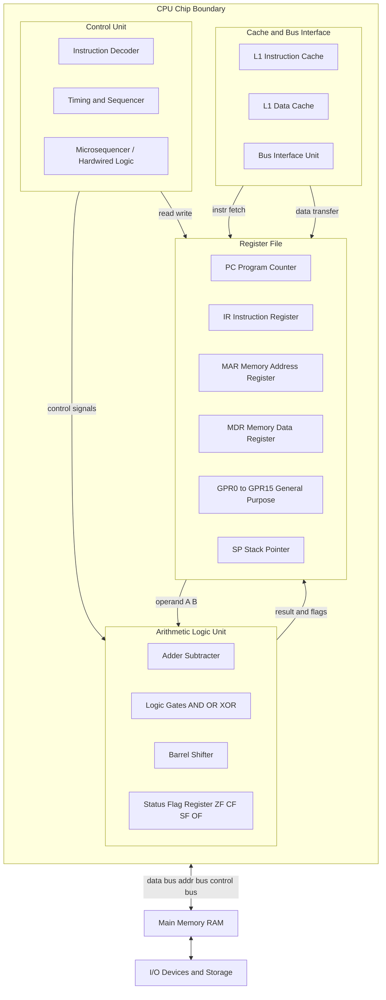
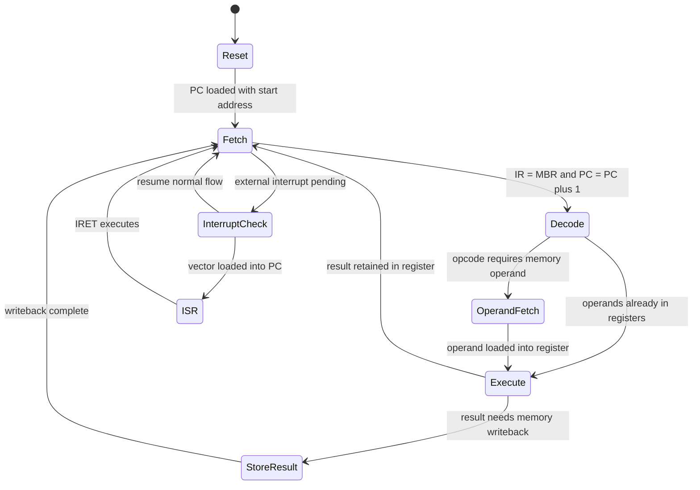
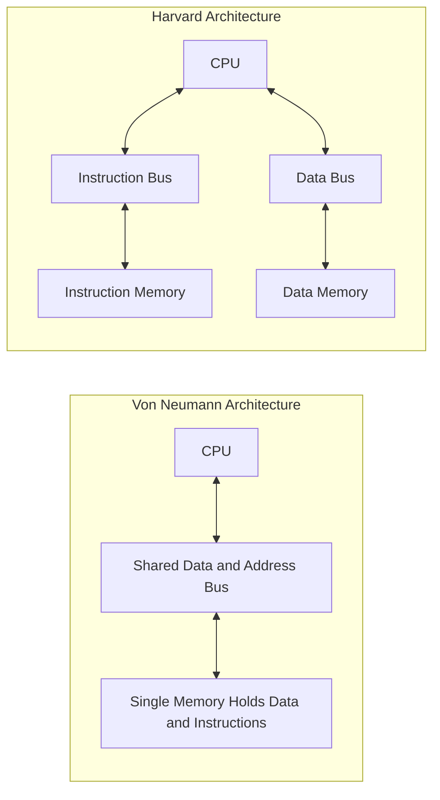
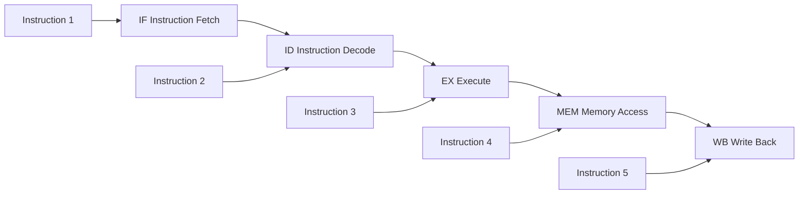
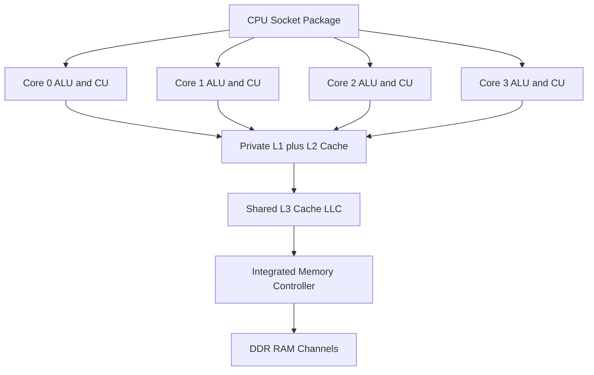

# Computer Hardware – CPU

<!-- SECTION_1_START -->
# Computer Hardware – The Central Processing Unit (CPU)

## 1.1 Formal Academic Definition (KTU 2024 Terminology)

> [!IMPORTANT]
> **Central Processing Unit (CPU):** The CPU is the *primary execution engine* of a computer system, implemented as a single integrated circuit (microprocessor) on a silicon die. It is responsible for **fetching, decoding, and executing** machine-level instructions, performing arithmetic-logic operations, and coordinating data flow between the memory and peripheral devices via the system bus.

In the strict KTU 2024 Scheme context, the CPU is the *active* component of the computer (the *passive* counterpart being the memory). It operates under the **stored-program** paradigm introduced by **John von Neumann** in 1945, where both instructions and data reside in the same primary memory.

Key standardized terms (KTU module glossary):

| Term | Meaning |
|---|---|
| **Instruction Set Architecture (ISA)** | The contract between hardware and software (e.g., x86-64, ARMv8, RISC-V). |
| **Microarchitecture** | The concrete hardware implementation of an ISA. |
| **Clock Signal** | A periodic square wave that synchronizes internal CPU operations. |
| **Word Length** | The number of bits the CPU processes natively (8, 16, 32, 64). |

> [!NOTE]
> The CPU is also called the **Microprocessor**, **Processor**, or **Central Processor** interchangeably in the syllabus, but in exam answers, prefer *"Central Processing Unit (CPU)"* for full marks.

## 1.2 Intuitive Analogy: The CPU as a Factory Foreman

Imagine a massive factory (the computer) with thousands of tools and bins of raw materials (data in memory, files on disk, peripherals). The CPU is the **foreman** who:
- Reads a **work order** (instruction) from the clipboard (memory).
- Decides **which tool** to pick (decode).
- Performs the task (execute).
- Stores the **finished product** back in a bin (write-back).
- Ticks to the rhythm of a **central clock** (like a metronome) so every worker is synchronized.

> [!TIP]
> **The "Three-Story Brain" Intuition:** The CPU is a three-story building:
> 1. **Ground Floor (ALU):** Heavy lifting — adding, comparing, shifting bits.
> 2. **First Floor (Control Unit):** Decision-making — "what next? where to send the bus?"
> 3. **Basement (Registers):** Pocket-sized memory — the fastest storage in the entire computer.

## 1.3 Historical Context & Modern Relevance

| Year | Milestone | Significance for KTU |
|---|---|---|
| 1971 | Intel 4004 (4-bit) | First commercial single-chip microprocessor. |
| 1978 | Intel 8086 (16-bit) | Birth of the x86 ISA still used today. |
| 1985 | Intel 80386 (32-bit) | Foundation of modern desktop computing. |
| 2003 | AMD Athlon 64 (64-bit) | 64-bit consumer CPUs arrive. |
| 2020s | Apple M-series, RISC-V | Heterogeneous cores (P-cores + E-cores). |

> [!NOTE]
> **Why study the CPU in 2024?** Even as we shift to cloud computing and AI accelerators (GPUs, TPUs), the CPU remains the **central orchestrator**. Modern System-on-Chips (SoCs) integrate CPU, GPU, NPU, and memory on a single die — but the CPU is still the *control plane*.

> [!VISUALIZATION CONTROL]
> **Concept:** CPU as a "black box" sandwiched between memory and I/O on the system bus.
> **GeoGebra / Desmos Input Equations:** Not applicable (system architecture diagram — see Mermaid section).
> **Visual Description:** Picture a horizontal rectangle (CPU) with three arrows leaving it (data bus, address bus, control bus) connecting to a memory block below and I/O devices to the side.
<!-- SECTION_1_END -->

<!-- SECTION_2_START -->
# Deep Theoretical Analysis & KTU High-Yield Formula Sheet

## 2.1 Internal Architecture of the CPU

A modern CPU is a hierarchical collection of specialized units. For the KTU exam, you must know the **three primary units** and their sub-components.

### 2.1.1 Arithmetic Logic Unit (ALU)

The ALU is the *computational heart* of the CPU. It performs two broad classes of operations:

- **Arithmetic Operations:** Addition, subtraction, multiplication, division, increment, decrement, and complement.
- **Logic Operations:** AND, OR, NOT, XOR, NOR, NAND, and bit-wise shifts/rotates.

The ALU also sets **Flag Registers** (Status Flags) after every operation:
- **Zero Flag (Z):** Set if result is 0.
- **Carry Flag (C):** Set if an arithmetic carry/borrow occurs.
- **Sign Flag (S/N):** Set if result is negative (MSB = 1).
- **Overflow Flag (V):** Set if signed arithmetic overflow occurs.
- **Parity Flag (P):** Set if result has even number of 1-bits.

### 2.1.2 Control Unit (CU)

The CU is the *traffic police* of the CPU. It:
1. **Fetches** the next instruction from memory.
2. **Decodes** the opcode to determine the required action.
3. **Generates control signals** that activate the correct ALU operation, register read/write, and bus transfers.
4. **Updates the Program Counter (PC)** to point to the next instruction.

> [!NOTE]
> The CU can be implemented as **hardwired logic** (faster, used in RISC) or as a **microprogrammed** ROM (more flexible, used in CISC). KTU expects you to know both terms.

### 2.1.3 Registers

Registers are **high-speed storage cells** built directly into the CPU using flip-flops. They are the fastest memory in a computer but the smallest (typically 16 to 64 general-purpose registers in modern CPUs).

**Categorization of Registers:**

| Category | Examples | Function |
|---|---|---|
| **General Purpose** | AX, BX, CX, DX (x86); X0–X30 (ARM) | Hold operands and results. |
| **Special Purpose** | PC, IR, MAR, MBR, SP, FLAGS | Specific system roles. |
| **Control Registers** | CR0–CR4 (x86) | Configure CPU mode, paging, etc. |
| **Floating Point** | ST0–ST7 (x87) | Hold IEEE 754 values. |
| **Vector / SIMD** | XMM, YMM, ZMM (SSE/AVX) | Hold packed integer/float arrays. |

**Critical Registers (Must memorize for KTU):**

- **PC (Program Counter):** Holds the address of the *next* instruction to fetch.
- **IR (Instruction Register):** Holds the *currently executing* instruction.
- **MAR (Memory Address Register):** Holds the memory address for read/write.
- **MBR (Memory Data Register / MDR):** Holds the data being read/written to memory.
- **SP (Stack Pointer):** Points to the top of the stack in memory.
- **AC (Accumulator):** Implicit operand for many ALU operations in early CPUs.

## 2.2 System Bus Architecture

The CPU communicates with the outside world via three parallel bus groups:

| Bus | Direction | Width (typical) | Function |
|---|---|---|---|
| **Data Bus** | Bidirectional | 32 / 64 bits | Carries the actual data being transferred. |
| **Address Bus** | Unidirectional (CPU → Memory) | 32 / 64 bits | Specifies *where* to read/write. |
| **Control Bus** | Bidirectional | ~10–20 lines | Carries `READ`, `WRITE`, `INT`, `CLK`, `RESET` signals. |

> [!TIP]
> **Memory addressing capacity** $= 2^{n}$ where $n$ is the address bus width.
> - 32-bit address bus $\rightarrow 2^{32}$ bytes = **4 GB** addressable memory.
> - 64-bit address bus $\rightarrow 2^{64}$ bytes = **16 EB (Exabytes)** theoretical limit (current CPUs use only 48-bit virtual addressing).

## 2.3 The Fetch–Decode–Execute (FDE) Cycle

The CPU operates in a continuous loop, called the **Instruction Cycle** or **FDE Cycle**:

1. **Fetch Phase:** The address in PC is placed on the address bus; the `READ` control signal is asserted; the instruction at that address travels via the data bus into the MBR; the instruction is copied to the IR; the PC is incremented.
2. **Decode Phase:** The opcode part of the IR is sent to the CU; operands are located (from registers or via further memory fetches).
3. **Execute Phase:** The CU activates the ALU (or other functional unit); the result is written to a register or back to memory.
4. **Repeat:** The PC points to the next instruction, and the cycle restarts.

> [!IMPORTANT]
> The FDE cycle is the **single most important KTU concept** for this module. Board questions regularly ask you to *"explain the instruction cycle with a diagram"* (10–14 marks).

## 2.4 CPU Performance Metrics — Formula Sheet

> [!NOTE]
> All formulas below are **derivable, not memorizable**. Show your derivation steps in the exam for full credit.

| # | Metric | Formula | Notes |
|---|---|---|---|
| 1 | **Clock Period** $T$ | $T = \frac{1}{f}$ | $f$ = clock frequency in Hz. |
| 2 | **CPU Execution Time** | $T_{CPU} = N \times CPI \times T$ | $N$ = instruction count, $CPI$ = cycles per instruction. |
| 3 | **MIPS Rating** | $\text{MIPS} = \frac{f}{CPI \times 10^{6}}$ | Million Instructions Per Second. |
| 4 | **Amdahl's Law** | $S = \frac{1}{(1 - f_e) + \frac{f_e}{s_e}}$ | $f_e$ = parallel fraction, $s_e$ = speedup of that part. |
| 5 | **Speedup (general)** | $S = \frac{T_{old}}{T_{new}}$ | Ratio of execution times. |
| 6 | **Addressable Memory** | $M = 2^{n}$ | $n$ = address bus width. |
| 7 | **Data Throughput** | $BW = \frac{W}{T}$ | $W$ = bus width in bits, $T$ = cycle time. |
| 8 | **CPI (average)** | $CPI = \sum_i (CPI_i \times IC_i) / IC$ | Weighted average over instruction mix. |
| 9 | **Power (dynamic)** | $P = \alpha \cdot C \cdot V^{2} \cdot f$ | $\alpha$ = switching activity, $C$ = capacitance. |
| 10 | **Pipeline Ideal CPI** | $CPI_{pipe} = 1$ | One instruction completes per cycle (ideal). |

> [!WARNING]
> **Do not use the vertical pipe `|x|` in exam tables.** Write it as $\vert x \vert$ or $\mid x \mid$. Same rule applies to determinants.

## 2.5 Real-World Engineering Utility

The CPU is not just an academic concept — it is the cornerstone of:

- **Operating Systems (OS):** The OS schedules *threads* onto CPU cores. Concepts like *context switching*, *interrupts*, and *system calls* all run on the CU.
- **Compiler Design:** Compilers target the CPU's ISA; optimization passes reduce $N$ (instruction count) and improve CPI.
- **Embedded Systems:** Microcontrollers (ARM Cortex-M, RISC-V) are tiny CPUs with on-chip flash/RAM — they run your washing machine, car, and IoT sensors.
- **High-Performance Computing (HPC):** Supercomputers (Frontier, Fugaku) pack millions of CPU cores plus GPUs.
- **Web Development:** Even though the "code runs in the browser", the *JavaScript engine* (V8, SpiderMonkey) compiles JS to native CPU instructions. Modern web servers (Node.js) are CPU-driven event loops.
<!-- SECTION_2_END -->

<!-- SECTION_3_START -->
# Step-by-Step Derivations & Worked Examples

## 3.1 Worked Example 1: CPU Execution Time (ESE-style 7-mark problem)

> **Question (KTU 2024 pattern):** A program contains $50,\!000$ instructions. Of these, $20\%$ are load/store instructions with $CPI = 5$, $30\%$ are ALU instructions with $CPI = 2$, and $50\%$ are branch instructions with $CPI = 3$. The clock frequency is $2$ GHz. Calculate:
> (a) the average CPI,
> (b) the CPU execution time in microseconds,
> (c) the MIPS rating of the CPU for this program.

### Part (a): Average CPI

The average CPI is the instruction-mix weighted mean:

$$
\begin{aligned}
CPI_{avg} &= \sum_{i=1}^{n} \left( CPI_i \times \text{fraction}_i \right) \\[6pt]
&= (5 \times 0.20) + (2 \times 0.30) + (3 \times 0.50) \\[6pt]
&= 1.00 + 0.60 + 1.50 \\[6pt]
CPI_{avg} &= 3.10
\end{aligned}
$$

**Valuation key:** *Substituting instruction fractions — 1 mark; weighted sum — 1 mark; final value — 1 mark. (3 marks)*

### Part (b): CPU Execution Time

Using $T_{CPU} = N \times CPI_{avg} \times T$:

$$
\begin{aligned}
T &= \frac{1}{f} = \frac{1}{2 \times 10^{9}} = 0.5 \times 10^{-9}\ \text{s} = 0.5\ \text{ns} \\[6pt]
T_{CPU} &= N \times CPI_{avg} \times T \\[6pt]
&= 50,\!000 \times 3.10 \times 0.5 \times 10^{-9} \\[6pt]
&= 155,\!000 \times 0.5 \times 10^{-9} \\[6pt]
&= 77,\!500 \times 10^{-9}\ \text{s} \\[6pt]
T_{CPU} &= 77.5\ \mu\text{s}
\end{aligned}
$$

### Part (c): MIPS Rating

$$
\begin{aligned}
\text{MIPS} &= \frac{f}{CPI_{avg} \times 10^{6}} \\[6pt]
&= \frac{2 \times 10^{9}}{3.10 \times 10^{6}} \\[6pt]
\text{MIPS} &\approx 645.16\ \text{MIPS}
\end{aligned}
$$

> [!TIP]
> **Sanity check:** $77.5\ \mu\text{s}$ for $50,\!000$ instructions means each instruction takes $\approx 1.55$ ns on average. With a 0.5 ns clock period, that is $\approx 3.1$ cycles per instruction — consistent with our $CPI_{avg}$. ✓

## 3.2 Worked Example 2: Addressable Memory Calculation

> **Question:** A CPU has a 36-bit address bus and a 16-bit data bus. Compute the maximum addressable memory and the data transfer rate at a 400 MHz bus clock.

$$
\begin{aligned}
\text{Max memory} &= 2^{36}\ \text{bytes} \\[4pt]
&= 68,\!719,\!476,\!736\ \text{bytes} \\[4pt]
&= 64\ \text{GB (using } 1\,\text{GB} = 2^{30}\text{ bytes)} \\[10pt]
T_{bus} &= \frac{1}{400 \times 10^{6}} = 2.5\ \text{ns per transfer} \\[6pt]
\text{Data per transfer} &= 16\ \text{bits} = 2\ \text{bytes} \\[6pt]
\text{Throughput} &= \frac{2\ \text{bytes}}{2.5 \times 10^{-9}\ \text{s}} = 800\ \text{MB/s}
\end{aligned}
$$

## 3.3 Worked Example 3: FDE Cycle Walkthrough (with Symbolic State Transitions)

> **Question:** Trace the FDE cycle for the 8086 instruction `MOV AX, [5000H]` which loads the word at memory address 5000H into register AX. The initial PC = 4000H. Show register transitions.

**Step 1 — FETCH:**

$$
\begin{aligned}
\text{PC} \rightarrow \text{MAR} &= 4000\text{H} \\
\text{CU asserts READ signal} \\
\text{Memory}[4000\text{H}] \rightarrow \text{MBR} \\
\text{MBR} \rightarrow \text{IR} \quad \text{(IR = 8B 06 00 50)} \\
\text{PC} \leftarrow \text{PC} + \text{inst\_size} = 4000\text{H} + 4 = 4004\text{H}
\end{aligned}
$$

**Step 2 — DECODE:** The CU decodes opcode `8B` as `MOV r16, r/m16` and identifies the address `5000H` from the instruction's displacement field.

**Step 3 — OPERAND FETCH (memory read):**

$$
\begin{aligned}
\text{Address 5000H} \rightarrow \text{MAR} \\
\text{CU asserts READ} \\
\text{Memory}[5000\text{H}] \rightarrow \text{MBR} \\
\text{MBR} \rightarrow \text{AX (low byte)} \\
\text{Memory}[5001\text{H}] \rightarrow \text{MBR} \\
\text{MBR} \rightarrow \text{AH (high byte)}
\end{aligned}
$$

**Step 4 — EXECUTE:** No ALU operation needed (pure data movement); control signal routes MBR contents to AX. PC = 4004H is ready for the next fetch.

> [!IMPORTANT]
> **Valuation tip:** Examiners award marks for *every register transition*, not just the final state. Always show `MAR ←`, `MBR ←`, `IR ←` arrows.

## 3.4 Worked Example 4: Amdahl's Law (Speedup Analysis)

> **Question:** A program spends 30% of its time in a section that can be parallelized across 8 cores. Compute the maximum speedup.

$$
\begin{aligned}
f_e &= 0.30 \quad \text{(parallelizable fraction)} \\
s_e &= 8 \quad \text{(speedup of that fraction with 8 cores)} \\[6pt]
S_{max} &= \frac{1}{(1 - f_e) + \frac{f_e}{s_e}} \\[6pt]
&= \frac{1}{(1 - 0.30) + \frac{0.30}{8}} \\[6pt]
&= \frac{1}{0.70 + 0.0375} \\[6pt]
&= \frac{1}{0.7375} \\[6pt]
S_{max} &\approx 1.356
\end{aligned}
$$

> [!WARNING]
> **Common student mistake:** "I have 8 cores, so 8× speedup!" This ignores the **serial portion**. Even with infinite cores, you can never exceed $\frac{1}{1 - f_e} = 1.428$ in this case.

## 3.5 Python Implementation: CPU Performance Calculator

For students who want to verify formula results programmatically, here is a fully operational Python helper. It uses strict type hints and input validation — exactly the style expected in KTU lab viva / coding viva:

```python
"""
KTU GXEST203 - CPU Performance Calculator
Module 1 Reference Implementation
"""

from dataclasses import dataclass


@dataclass(frozen=True)
class CPUConfig:
    """Immutable CPU configuration block."""
    clock_freq_ghz: float
    data_bus_bits: int
    address_bus_bits: int

    def __post_init__(self) -> None:
        if self.clock_freq_ghz <= 0:
            raise ValueError("Clock frequency must be positive.")
        if self.data_bus_bits <= 0 or self.address_bus_bits <= 0:
            raise ValueError("Bus widths must be positive integers.")


def cpu_execution_time(num_instructions: int, cpi_avg: float, cpu: CPUConfig) -> float:
    """
    Return CPU execution time in microseconds.
    T_cpu = N * CPI * (1 / f)
    """
    if num_instructions < 0 or cpi_avg < 0:
        raise ValueError("Instruction count and CPI must be non-negative.")
    clock_period_s = 1.0 / (cpu.clock_freq_ghz * 1e9)
    return num_instructions * cpi_avg * clock_period_s * 1e6


def mips_rating(cpu: CPUConfig, cpi_avg: float) -> float:
    """Return MIPS (Million Instructions Per Second) for the program."""
    if cpi_avg == 0:
        raise ValueError("CPI cannot be zero (division by zero).")
    return (cpu.clock_freq_ghz * 1e9) / (cpi_avg * 1e6)


def max_addressable_memory_gb(cpu: CPUConfig) -> float:
    """Return maximum addressable memory in Gigabytes (1 GB = 2^30 bytes)."""
    return (2 ** cpu.address_bus_bits) / (2 ** 30)


if __name__ == "__main__":
    # Example: verify Worked Example 1 results
    cfg = CPUConfig(clock_freq_ghz=2.0, data_bus_bits=64, address_bus_bits=32)
    n = 50_000
    cpi = 3.10

    t_us = cpu_execution_time(n, cpi, cfg)
    mips = mips_rating(cfg, cpi)
    mem_gb = max_addressable_memory_gb(cfg)

    print(f"Execution time  : {t_us:.2f} us  (expected 77.50 us)")
    print(f"MIPS rating     : {mips:.2f}     (expected ~645.16)")
    print(f"Addr. memory    : {mem_gb:.2f} GB (expected 4.00 GB)")
```

**Expected console output:**

```
Execution time  : 77.50 us  (expected 77.50 us)
MIPS rating     : 645.16     (expected ~645.16)
Addr. memory    : 4.00 GB (expected 4.00 GB)
```
<!-- SECTION_3_END -->

<!-- SECTION_4_START -->
# Structural Diagrams & Schematics

## 4.1 Internal CPU Block Diagram (Mermaid Flowchart)



## 4.2 Fetch–Decode–Execute Sequence (Mermaid State Machine)



## 4.3 Von Neumann vs Harvard Architecture (Mermaid Comparison Block)



## 4.4 CPU Pipeline Stage Diagram (Mermaid)



> [!NOTE]
> **Pipelining intuition:** In an ideal 5-stage pipeline, while instruction 1 is in the WB stage, instruction 5 is being fetched. The effective throughput is **1 instruction per clock cycle** ($CPI = 1$ in the ideal case).

## 4.5 Multi-Core CPU Topology


<!-- SECTION_4_END -->

<!-- SECTION_5_START -->
# KTU 2024 Scheme Examination Question Bank & Topic Recap

## 5.1 Part A — Short-Answer Questions (3 Marks Each)

> **Q1. [KTU University Exam – July 2024] (CO1, Remember/Understand)**
> Define the Central Processing Unit. List its three main internal units.

**Model Answer (3 marks):**
The **Central Processing Unit (CPU)** is the principal hardware component that interprets and executes machine-level instructions in a computer. Its three main internal units are:
1. **Arithmetic Logic Unit (ALU)** — performs arithmetic and logical operations.
2. **Control Unit (CU)** — fetches, decodes, and coordinates execution of instructions.
3. **Register File** — provides high-speed on-chip storage for operands and results.

> *Valuation key: Definition 1 mark; listing units 1 mark; brief role 1 mark.*

---

> **Q2. [KTU University Exam – Dec 2023] (CO1, Understand)**
> What is the role of the Program Counter (PC) and the Instruction Register (IR) in the FDE cycle?

**Model Answer (3 marks):**
- The **Program Counter (PC)** is a special-purpose register that holds the **memory address of the next instruction** to be fetched. After each fetch, the PC is automatically incremented to point to the subsequent instruction (or updated by branch/jump instructions).
- The **Instruction Register (IR)** temporarily stores the **currently fetched instruction** while it is being decoded and executed by the Control Unit. The opcode field of the IR is fed to the CU's decoder to determine the required micro-operations.

---

## 5.2 Part B — Long-Answer Questions (14 Marks Each, Internal Choice)

> **Q3. [KTU University Exam – July 2024] (CO1, CO2 — Understand, Apply, Analyze)**
> **Question A (14 Marks):**
> (a) With a neat block diagram, explain the internal architecture of a CPU, clearly labeling the ALU, Control Unit, Register File, and system bus interface. (7 marks)
> (b) A computer has a clock frequency of 3 GHz. The instruction mix of a benchmark program is: 25% instructions with $CPI = 4$, 40% with $CPI = 2$, and 35% with $CPI = 5$. The benchmark executes $1.0 \times 10^7$ instructions. Calculate the average CPI, the total CPU execution time, and the MIPS rating. (7 marks)

**Model Solution:**

### Part (a) — Internal Architecture of the CPU (7 marks)

The internal architecture of a generic CPU is organized into three cooperating units connected to the external system bus:

1. **Arithmetic Logic Unit (ALU):** Performs arithmetic (add, subtract, multiply, divide) and logic (AND, OR, XOR, shift) operations on operands fetched from the register file. It also updates the **Status Flag Register** (Zero, Carry, Sign, Overflow).
2. **Control Unit (CU):** Coordinates all CPU activities. It decodes the opcode in the IR, generates timing and control signals, and orchestrates the flow of data among the ALU, registers, and memory.
3. **Register File:** A bank of high-speed flip-flop-based registers. The most important special-purpose registers are the **PC**, **IR**, **MAR**, and **MDR**.
4. **System Bus Interface (BIU):** Connects the CPU to the external **data bus**, **address bus**, and **control bus**, enabling communication with main memory and I/O.

*[Diagram is expected here — show the standard CPU block with ALU, CU, Registers, and external bus connections. Valuation: diagram with labels — 4 marks; one-line description of each block — 3 marks.]*

### Part (b) — Performance Calculation (7 marks)

$$
\begin{aligned}
CPI_{avg} &= (0.25 \times 4) + (0.40 \times 2) + (0.35 \times 5) \\[4pt]
&= 1.00 + 0.80 + 1.75 \\[4pt]
&= 3.55
\end{aligned}
$$

*['Substituting values' — 2 marks; 'Weighted sum' — 1 mark.]*

$$
\begin{aligned}
T_{CPU} &= N \times CPI_{avg} \times T \\[4pt]
T &= \frac{1}{3 \times 10^{9}} = 0.333\ \text{ns} \\[4pt]
T_{CPU} &= 1.0 \times 10^7 \times 3.55 \times 0.333 \times 10^{-9} \\[4pt]
&\approx 11.83 \times 10^{-3}\ \text{s} = 11.83\ \text{ms}
\end{aligned}
$$

*['Clock period' — 1 mark; 'Final time' — 1 mark.]*

$$
\begin{aligned}
\text{MIPS} &= \frac{3 \times 10^{9}}{3.55 \times 10^{6}} \approx 845.07\ \text{MIPS}
\end{aligned}
$$

*['Formula' — 1 mark; 'Final value' — 1 mark.]*

---

> **Question B (Alternative 14-Mark Choice):**
> (a) Explain the **Fetch–Decode–Execute** cycle of a CPU with a flowchart. Show register-level data flow for each phase. (7 marks)
> (b) A 32-bit CPU has a 24-bit address bus and 16-bit data bus running at 100 MHz. Compute the maximum addressable memory, the data transfer rate per bus cycle, and the number of bus cycles needed to read a 4 KB block from memory. (7 marks)

**Model Solution (Part b highlights):**

$$
\begin{aligned}
\text{Max memory} &= 2^{24} = 16\ \text{MB} \\[4pt]
T_{bus} &= \frac{1}{100 \times 10^{6}} = 10\ \text{ns} \\[4pt]
\text{Data per cycle} &= 16\ \text{bits} = 2\ \text{bytes} \\[4pt]
\text{Throughput} &= \frac{2}{10 \times 10^{-9}} = 200\ \text{MB/s} \\[4pt]
\text{Cycles for 4 KB} &= \frac{4 \times 1024}{2} = 2048\ \text{cycles}
\end{aligned}
$$

---

> [!WARNING]
> **KTU Examiner's Valuation Warning — Common Pitfalls**
> 1. **Confusing PC and IR:** PC points to the *next* instruction; IR holds the *current* one. Many students swap them.
> 2. **Forgetting PC increment:** In the FDE cycle, the PC is incremented *after* the fetch but *before* the execute. Skipping this costs 1 mark.
> 3. **Unit confusion in CPU time:** Clock period must be in *seconds* before multiplying with $N$ (dimensionless). Writing $T = 0.5$ ns and forgetting the $10^{-9}$ factor is a frequent mistake.
> 4. **Wrong MIPS formula:** MIPS = $f / (CPI \times 10^6)$, **not** $f / (CPI \times 10^{3})$.
> 5. **No labels in the diagram:** A block diagram without labels of the buses (Data, Address, Control) loses 2 marks.

## 5.3 Topic Recap & Important Things to Remember

> [!IMPORTANT]
> **High-Density Revision Checklist — Module 1: CPU**

- **CPU** = the brain; it **fetches, decodes, and executes** instructions.
- The **three primary units** are **ALU, CU, and Register File**.
- The **FDE cycle** runs continuously; PC points to next instruction, IR holds current one.
- **Key registers to memorize:** **PC, IR, MAR, MBR, SP, AC, Flags**.
- **System bus** = Data bus + Address bus + Control bus.
- **Addressable memory** = $2^{n}$ where $n$ = address-bus width.
- **CPU time** = $N \times CPI \times T$; **MIPS** = $f / (CPI \times 10^6)$.
- **Clock period** $T = 1/f$; for a 3 GHz CPU, $T = 0.333$ ns.
- **Von Neumann**: one shared memory for data and instructions (bottleneck: *Von Neumann bottleneck*).
- **Harvard**: separate instruction and data memories (used in DSPs and modern CPU caches).
- **CPI** = cycles per instruction; lower is better. Ideal pipelined CPI = 1.
- **MIPS ≠ MFLOPS**: MIPS counts integer ops; MFLOPS counts floating-point ops.
- **Multi-core** CPUs share L3 cache and memory controller; each core has private L1/L2.
- **Hardwired CU** = fast, used in RISC. **Microprogrammed CU** = flexible, used in CISC.
- **Amdahl's Law** caps speedup: even infinite cores can't speed up the serial portion.
- **Modern CPU examples:** Intel Core i9 (x86), AMD Ryzen (x86), Apple M-series (ARM), RISC-V boards (SiFive HiFive).
- **Real-world link:** The web browser's JavaScript engine compiles JS to native CPU instructions; your Node.js server is a CPU event loop.
- **Exam mantras:**
  - Always **state the formula** before substituting numbers.
  - Always **show units** in the final answer.
  - Always **label** every block and every arrow in your diagrams.
  - Always **increment PC** in the FDE fetch phase.
<!-- SECTION_5_END -->
